# Tutorial
Welcome to Typst's tutorial! In this tutorial, you will learn how to write and format documents in Typst. We will start with everyday tasks and gradually introduce more advanced features. This tutorial does not assume prior knowledge of Typst, other markup languages, or programming. We do assume that you know how to edit a text file.

Typst 튜토리얼에 오신 것을 환영합니다! 이 튜토리얼에서는 Typst에서 문서를 작성하고 서식을 지정하는 방법을 배우게 됩니다. 일상적인 작업부터 시작하여 점차 고급 기능을 소개할 것입니다. 본 튜토리얼은 Typst, 다른 마크업 언어 또는 프로그래밍에 대한 사전 지식을 가정하지 않습니다. 단, 텍스트 파일 편집 방법은 알고 계신다고 가정합니다.

The best way to start is to sign up to the Typst app for free and follow along with the steps below. The app gives you instant preview, syntax highlighting and helpful autocompletions. Alternatively, you can follow along in your local text editor with the open-source CLI.

시작하는 가장 좋은 방법은 Typst 앱에 무료로 가입하고 아래의 단계를 따라가는 것입니다. 이 앱은 실시간 미리보기, 구문 강조 표시 및 유용한 자동 완성 기능을 제공합니다. 또는 오픈소스 CLI를 사용하여 로컬 텍스트 편집기에서 따라할 수도 있습니다.

## When to use Typst
Before we get started, let's check what Typst is and when to use it. Typst is a markup language for typesetting documents. It is designed to be easy to learn, fast, and versatile. Typst takes text files with markup in them and outputs PDFs.

시작하기 전에 Typst가 무엇이며 언제 사용하는지 살펴보겠습니다. Typst는 문서 조판을 위한 마크업 언어입니다. 배우기 쉽고 빠르며 다용도로 설계되었습니다. Typst는 마크업이 포함된 텍스트 파일을 입력 받아 PDF로 출력합니다.

Typst is a good choice for writing any long form text such as essays, articles, scientific papers, books, reports, and homework assignments. Moreover, Typst is a great fit for any documents containing mathematical notation, such as papers in the math, physics, and engineering fields. Finally, due to its strong styling and automation features, it is an excellent choice for any set of documents that share a common style, such as a book series.

Typst는 에세이, 기사, 학술 논문, 책, 보고서, 숙제 과제 등 장문의 텍스트를 작성하는 데 적합한 선택입니다. 또한 수학, 물리학, 공학 분야의 논문처럼 수학 기호가 포함된 문서에도 매우 잘 어울립니다. 마지막으로 강력한 스타일링 및 자동화 기능 덕분에 책 시리즈처럼 공통된 스타일을 공유하는 문서 집합에 탁월한 선택입니다.

# What you will learn
This tutorial has four chapters. Each chapter builds on the previous one. Here is what you will learn in each of them:

이 튜토리얼은 네 개의 장으로 구성되어 있습니다. 각 장은 이전 장의 내용을 바탕으로 진행됩니다. 각 장에서 배울 내용은 다음과 같습니다:

Writing in Typst: Learn how to write text and insert images, equations, and other elements.

1. Typst에서 글쓰기: 텍스트 작성 방법과 이미지, 방정식 및 기타 요소 삽입 방법을 배웁니다.

Formatting: Learn how to adjust the formatting of your document, including font size, heading styles, and more.

1. 서식 설정: 문서의 서식 설정 방법을 배웁니다. 글꼴 크기, 제목 스타일 등을 포함합니다.

Advanced Styling: Create a complex page layout for a scientific paper with typographic features such as an author list and run-in headings.

1. 고급 스타일링: 저자 목록 및 중간 제목과 같은 타이포그래픽 기능을 갖춘 과학 논문의 복잡한 페이지 레이아웃 생성 등을 배웁니다.

Making a Template: Build a reusable template from the paper you created in the previous chapter.

1. 템플릿 만들기: 이전 장에서 작성한 문서를 바탕으로 재사용 가능한 템플릿을 구축합니다.

We hope you'll enjoy Typst!

Typst를 즐겨주시길 바랍니다!

---


# Writing in Typst
Let's get started! Suppose you got assigned to write a technical report for university. It will contain prose, maths, headings, and figures. To get started, you create a new project on the Typst app. You'll be taken to the editor where you see two panels: A source panel where you compose your document and a preview panel where you see the rendered document.


시작하겠습니다! 대학에서 "기술 보고서를 작성하라" 는 과제를 받았다고 가정합니다. 이 보고서에는 산문, 수학 공식, 제목, 그리고 그림이 포함될 것입니다. 시작하려면 Typst 앱에서 새로운 프로젝트를 생성합니다. 그러면 편집기로 이동하며 두 개의 패널을 보게 됩니다: 문서를 작성하는 소스 패널과 렌더링된 문서를 미리 보는 미리보기 패널입니다.

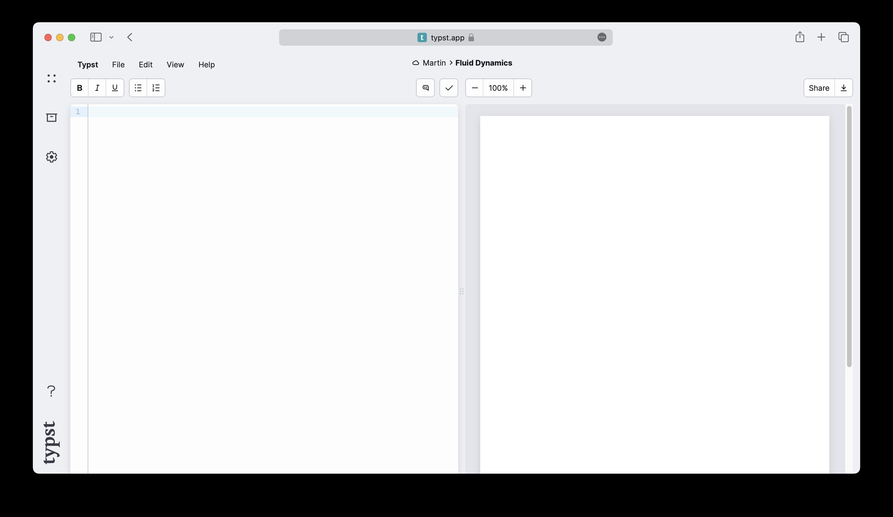

You already have a good angle for your report in mind. So let's start by writing the introduction. Enter some text in the editor panel. You'll notice that the text immediately appears on the previewed page.

이미 보고서를 위한 좋은 구도를 염두에 두고 있습니다. 그러니 서론부터 작성해 보겠습니다. 편집기 패널에 텍스트를 입력합니다. 입력한 텍스트는 즉시 미리보기 페이지에 표시되는 것을 확인하실 수 있습니다.

```
In this report, we will explore the
various factors that influence fluid
dynamics in glaciers and how they
contribute to the formation and
behaviour of these natural structures.
```

Throughout this tutorial, we'll show code examples like this one. Just like in the app, the first panel contains markup and the second panel shows a preview. We shrunk the page to fit the examples so you can see what's going on.

이 튜토리얼 전체에 걸쳐 이와 같은 코드 예제를 보여드리겠습니다. 앱에서와 마찬가지로 첫 번째 패널에는 마크업이 포함되어 있고 두 번째 패널에는 미리보기가 표시됩니다. 예제를 보기 쉽게 페이지 크기를 축소했으니 무슨 일이 벌어지는지 확인하실 수 있습니다.

The next step is to add a heading and emphasize some text. Typst uses simple markup for the most common formatting tasks. To add a heading, enter the = character and to emphasize some text with italics, enclose it in _underscores_.

다음 단계는 제목을 추가하고 일부 텍스트를 강조하는 것입니다. Typst는 가장 일반적인 서식 작업에 간단한 마크업을 사용합니다. 제목을 추가하려면 `=` 문자를 입력하고 이탤릭체로 텍스트를 강조하려면 해당 텍스트를 `_밑줄_` 로 묶습니다.

```
= Introduction
In this report, we will explore the
various factors that influence _fluid
dynamics_ in glaciers and how they
contribute to the formation and
behaviour of these natural structures.
```

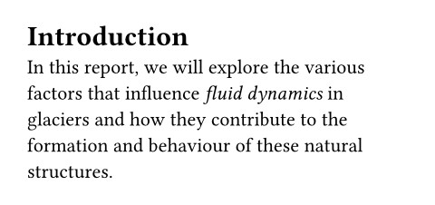

That was easy! To add a new paragraph, just add a blank line in between two lines of text. If that paragraph needs a subheading, produce it by typing == instead of =. The number of = characters determines the nesting level of the heading.


쉽네요! 새로운 단락을 추가하려면 텍스트 두 줄 사이에 빈 줄을 넣기만 하면 됩니다. 해당 단락에 소제목이 필요하다면 `=` 대신 `==` 를 입력합니다. `=` 문자의 개수가 제목의 중첩 수준을 결정합니다.

Now we want to list a few of the circumstances that influence glacier dynamics. To do that, we use a numbered list. For each item of the list, we type a + character at the beginning of the line. Typst will automatically number the items.


이제 빙하 역학에 영향을 미치는 몇 가지 상황을 나열하고자 합니다. 이를 위해 번호가 매겨진 목록을 사용합니다. 목록의 각 항목에 대해 줄의 시작 부분에 `+` 문자를 입력합니다. Typst가 항목에 자동으로 번호를 매깁니다.

```
+ The climate
+ The topography
+ The geology
```

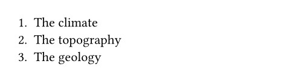

If we wanted to add a bulleted list, we would use the - character instead of the + character. We can also nest lists: For example, we can add a sub-list to the first item of the list above by indenting it.


글머리 기호 목록을 추가하려면 `+` 기호 대신 `-` 기호를 사용합니다. 목록을 중첩할 수도 있습니다: 예를 들어, 위 목록의 첫 번째 항목에 들여쓰기를 하면 하위 목록을 추가할 수 있습니다.

```
+ The climate
  - Temperature
  - Precipitation
+ The topography
+ The geology
```

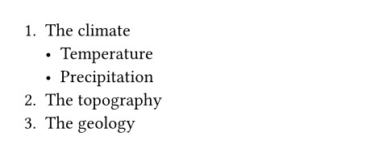


## Adding a figure
You think that your report would benefit from a figure. Let's add one. Typst supports images in the formats PNG, JPEG, GIF, SVG, PDF, and WebP. To add an image file to your project, first open the file panel by clicking the box icon in the left sidebar. Here, you can see a list of all files in your project. Currently, there is only one: The main Typst file you are writing in. To upload another file, click the button with the arrow in the top-right corner. This opens the upload dialog, in which you can pick files to upload from your computer. Select an image file for your report.

보고서에 그림을 추가하면 보다 나아질 것 같다고 생각하시나요? 그림을 추가하겠습니다. Typst는 PNG, JPEG, GIF, SVG, PDF, WebP 형식의 이미지를 지원합니다. 프로젝트에 이미지 파일을 추가하려면 먼저 왼쪽 사이드바의 상자 아이콘을 클릭하여 파일 패널을 엽니다. 여기에서 프로젝트의 모든 파일 목록을 확인할 수 있습니다. 현재는 단 하나뿐입니다: 현재 작성 중인 메인 Typst 파일입니다. 다른 파일을 업로드하려면 오른쪽 상단 모서리의 화살표 버튼을 클릭합니다. 그러면 업로드 대화 상자가 열리며 여기서 컴퓨터에서 업로드할 파일을 선택할 수 있습니다. 보고서에 사용할 이미지 파일을 선택합니다.

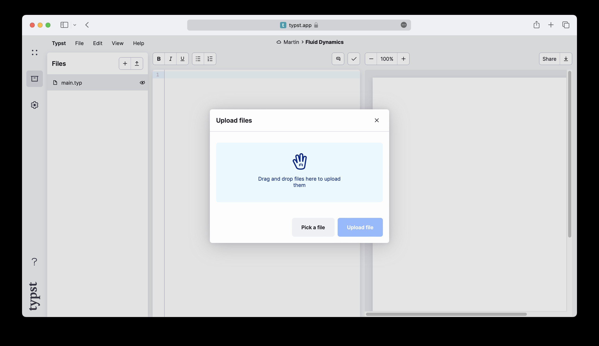

We have seen before that specific symbols (called markup) have specific meaning in Typst. We can use =, -, +, and _ to create headings, lists and emphasized text, respectively. However, having a special symbol for everything we want to insert into our document would soon become cryptic and unwieldy. For this reason, Typst reserves markup symbols only for the most common things. Everything else is inserted with functions. For our image to show up on the page, we use Typst's image function.

이전에도 살펴봤듯이 특정 기호(마크업이라 함)는 Typst에서 특별한 의미를 지닙니다. `=, -, +, _` 기호를 각각 제목, 목록, 강조 텍스트를 생성하는 데 사용할 수 있습니다. 그러나 문서에 삽입하려는 모든 요소에 특수 기호를 할당한다면 암호처럼 복잡해지고 다루기 어려워질 것입니다. 따라서 Typst는 가장 흔히 사용되는 요소들에 대해서만 마크업 기호를 예약합니다. 그 외의 모든 요소는 함수를 통해 삽입됩니다. 페이지에 이미지를 표시하려면 Typst의 이미지 함수를 사용합니다.

```
#image("glacier.jpg")
```


In general, a function produces some output for a set of arguments. When you call a function within markup, you provide the arguments and Typst inserts the result (the function's return value) into the document. In our case, the image function takes one argument: The path to the image file. To call a function in markup, we first need to type the # character, immediately followed by the name of the function. Then, we enclose the arguments in parentheses. Typst recognizes many different data types within argument lists. Our file path is a short string of text, so we need to enclose it in double quotes.

일반적으로 함수는 일련의 인자에 대해 어떤 출력을 생성합니다. 마크업 내에서 함수를 호출할 때 인자를 제공하면 Typst가 결과(함수의 반환값)를 문서에 삽입합니다. 우리의 경우 이미지 함수는 하나의 인자를 받습니다: 이미지 파일의 경로입니다. 마크업에서 함수를 호출하려면 먼저 `#` 문자를 입력한 후 바로 함수 이름을 입력해야 합니다. 그런 다음 괄호 안에 인수를 넣습니다. Typst는 인수 목록 내에서 다양한 데이터 유형을 인식합니다. 파일 경로는 짧은 텍스트 문자열이므로 큰따옴표로 묶어야 합니다.

The inserted image uses the whole width of the page. To change that, pass the width argument to the image function. This is a named argument and therefore specified as a name: value pair. If there are multiple arguments, they are separated by commas, so we first need to put a comma behind the path.

삽입된 이미지는 페이지 전체 너비를 사용합니다. 이를 변경하려면 이미지 함수에 너비 인수를 전달합니다. 이는 명명된 인수로 `이름:값` 쌍으로 지정됩니다. 여러 인수가 있는 경우 쉼표로 구분되므로 먼저 경로 뒤에 쉼표를 추가해야 합니다.

```
#image("glacier.jpg", width: 70%)
```


The width argument is a relative length. In our case, we specified a percentage, determining that the image shall take up 70% of the page's width. We also could have specified an absolute value like 1cm or 0.7in.

`width` 인자는 상대적 길이입니다. 본 예시에서는 백분율을 지정하여 이미지가 페이지 너비의 70%를 차지하도록 했습니다. 1cm나 0.7인치와 같은 절대값을 지정할 수도 있습니다.

Just like text, the image is now aligned at the left side of the page by default. It's also lacking a caption. Let's fix that by using the figure function. This function takes the figure's contents as a positional argument and an optional caption as a named argument.

텍스트와 마찬가지로 이미지도 이제 기본적으로 페이지 왼쪽에 정렬됩니다. 또한 캡션이 없습니다. `figure` 함수를 사용하여 이를 수정해 보겠습니다. 이 함수는 그림의 내용을 위치 매개변수로 선택적 캡션을 이름 매개변수로 받습니다.

Within the argument list of the figure function, Typst is already in code mode. This means, you now have to remove the hash before the image function call. The hash is only needed directly in markup (to disambiguate text from function calls).

`figure` 함수의 인자 목록 내에서 Typst는 이미 코드 모드에 있습니다. 이는 이미지 함수 호출 앞의 해시(`#`) 문자를 제거해야 함을 의미합니다. 해시 문자는 마크업 내에서 직접 사용할 때만 필요합니다.(텍스트와 함수 호출을 구분하기 위해)

The caption consists of arbitrary markup. To give markup to a function, we enclose it in square brackets. This construct is called a content block.

캡션은 임의의 마크업으로 구성됩니다. 함수에 마크업을 부여하려면 대괄호로 묶습니다. 이런 구조를 콘텐츠 블록이라고 합니다.

```
#figure(
  image("glacier.jpg", width: 70%),
  caption: [
    _Glaciers_ form an important part
    of the earth's climate system.
  ],
)
```

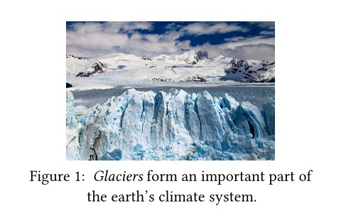

You continue to write your report and now want to reference the figure. To do that, first attach a label to figure. A label uniquely identifies an element in your document. Add one after the figure by enclosing some name in angle brackets. You can then reference the figure in your text by writing an @ symbol followed by that name. Headings and equations can also be labelled to make them referenceable.

보고서 작성을 계속하다가 그림을 참조하고 싶을 수 있습니다. 이를 위해 먼저 그림에 레이블을 지정합니다. 레이블은 문서 내 요소를 고유하게 식별합니다. 그림 뒤에 각괄호(`<>`)로 이름을 묶어 레이블을 추가합니다. 이후 본문에서 그림을 참조할 때는 `@` 기호 뒤에 해당 이름을 입력하면 됩니다. 제목과 방정식도 레이블을 지정해서 참조할 수 있습니다.

```
Glaciers as the one shown in
@glaciers will cease to exist if
we don't take action soon!

#figure(
  image("glacier.jpg", width: 70%),
  caption: [
    _Glaciers_ form an important part
    of the earth's climate system.
  ],
) <glaciers>
```


> [!NOTE]
> So far, we've passed content blocks (markup in square brackets) and strings (text in double quotes) to our functions. Both seem to contain text. What's the difference?

지금까지 함수에 콘텐츠 블록(대괄호 안의 마크업)과 문자열(따옴표 안의 텍스트)을 전달했습니다. 둘 다 텍스트를 포함하는 것처럼 보입니다. 차이점은 무엇일까요?
>
> A content block can contain text, but also any other kind of markup, function calls, and more, whereas a string is really just a sequence of characters and nothing else.

콘텐츠 블록은 텍스트뿐만 아니라 다른 종류의 마크업, 함수 호출 등을 포함할 수 있는 반면, 문자열은 단순히 문자열의 연속일 뿐 그 외에는 아무것도 아닙니다.
>
> For example, the image function expects a path to an image file. It would not make sense to pass, e.g., a paragraph of text or another image as the image's path parameter. That's why only strings are allowed here. In contrast, strings work wherever content is expected because text is a valid kind of content.

예를 들어, 이미지 함수는 이미지 파일의 경로를 기대합니다. 텍스트 단락이나 다른 이미지를 이미지 경로 매개변수로 전달하는 것은 말이 되지 않습니다. 그래서 여기서는 문자열만 허용됩니다. 반면, 텍스트는 유효한 콘텐츠 유형이므로 콘텐츠가 필요한 곳이라면 어디서나 문자열이 작동합니다.


## Adding a bibliography
As you write up your report, you need to back up some of your claims. You can add a bibliography to your document with the bibliography function. This function expects a path to a bibliography file.

보고서를 작성할 때 일부 주장을 뒷받침해야 합니다. 참고문헌 기능을 사용하여 문서에 참고문헌 목록을 추가할 수 있습니다. 이 기능은 참고문헌 파일의 경로를 인자로 입력받습니다.

Typst's native bibliography format is Hayagriva, but for compatibility you can also use BibLaTeX files. As your classmate has already done a literature survey and sent you a .bib file, you'll use that one. Upload the file through the file panel to access it in Typst.

Typst의 기본 참고문헌 형식은 `Hayagriva` 파일이지만 호환성을 위해 `BibLaTeX` 파일도 사용할 수 있습니다. 동료가 이미 문헌 조사를 수행하고 `.bib` 파일을 보내주었으므로 해당 파일을 사용합니다. 파일 패널을 통해 참고문헌 파일을 업로드하면 Typst에서 해당 파일에 접근할 수 있습니다.

Once the document contains a bibliography, you can start citing from it. Citations use the same syntax as references to a label. As soon as you cite a source for the first time, it will appear in the bibliography section of your document. Typst supports different citation and bibliography styles. Consult the reference for more details.

문서에 참고문헌 목록이 포함되면 해당 목록에서 인용을 시작할 수 있습니다. 인용은 레이블 참조와 동일한 구문을 사용합니다. 출처를 처음 인용하는 즉시 해당 출처는 문서의 참고문헌 섹션에 표시됩니다. Typst는 다양한 인용 및 참고문헌 스타일을 지원합니다. 자세한 내용은 참고 자료를 참조하십시오.

```
= Methods
We follow the glacier melting models
established in @glacier-melt.

#bibliography("works.bib")
```

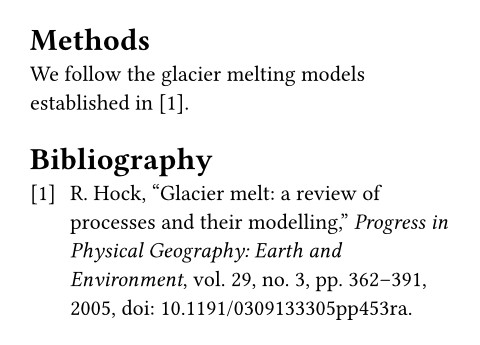


## Maths
After fleshing out the methods section, you move on to the meat of the document: Your equations. Typst has built-in mathematical typesetting and uses its own math notation. Let's start with a simple equation. We wrap it in $ signs to let Typst know it should expect a mathematical expression:

방법론을 구체화한 후에는 문서의 핵심인 방정식으로 넘어갑니다. Typst는 내장된 수식 편집 기능을 갖추고 자체 수학 표기법을 사용합니다. 간단한 방정식부터 시작해 보겠습니다. 수식 표현임을 Typst에 알리기 위해 `$` 기호로 감쌉니다:

```
The equation $Q = rho A v + C$
defines the glacial flow rate.
```

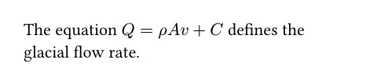

The equation is typeset inline, on the same line as the surrounding text. If you want to have it on its own line instead, you should insert a single space at its start and end:

방정식은 인라인으로 설정되어 주변 텍스트와 같은 줄에 표시됩니다. 별도의 줄에 표시하려면 방정식 시작과 끝 부분에 각각 공백을 하나씩 삽입해야 합니다:

```
The flow rate of a glacier is
defined by the following equation:

$ Q = rho A v + C $
```

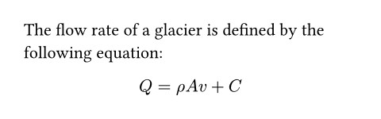

We can see that Typst displayed the single letters Q, A, v, and C as-is, while it translated rho into a Greek letter. Math mode will always show single letters verbatim. Multiple letters, however, are interpreted as symbols, variables, or function names. To imply a multiplication between single letters, put spaces between them.

Typst는 Q, A, v, C 와 같은 단일 문자를 그대로 표시한 반면, `rho` 는 그리스 문자로 변환했습니다. 수학 모드에서는 단일 문자가 항상 원문 그대로 표시됩니다. 그러나 여러 문자는 기호, 변수 또는 함수명으로 해석됩니다. 단일 문자 간 곱셈을 암시하려면 그 사이에 공백을 넣습니다.

If you want to have a variable that consists of multiple letters, you can enclose it in quotes:

여러 글자로 구성된 변수를 만들고 싶다면 따옴표로 묶으면 됩니다:

```
The flow rate of a glacier is given
by the following equation:

$ Q = rho A v + "time offset" $
```

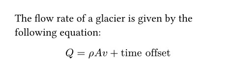

You'll also need a sum formula in your paper. We can use the sum symbol and then specify the range of the summation in sub- and superscripts:

논문에는 합계 공식도 포함되어야 합니다. 합계 기호를 사용한 후 아랫첨자와 윗첨자로 합계의 범위를 명시할 수 있습니다:

```
Total displaced soil by glacial flow:

$ 7.32 beta +
  sum_(i=0)^nabla Q_i / 2 $
```

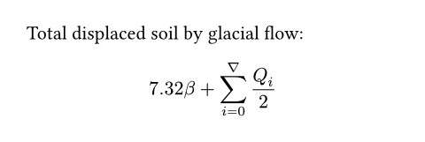

To add a subscript to a symbol or variable, type a _ character and then the subscript. Similarly, use the ^ character for a superscript. If your sub- or superscript consists of multiple things, you must enclose them in round parentheses.

기호나 변수에 아랫첨자를 추가하려면 `_` 문자를 입력한 후 아랫첨자를 입력합니다. 마찬가지로 윗첨자를 추가하려면 `^` 문자를 사용합니다. 아랫첨자나 윗첨자가 여러 개로 구성될 경우 괄호로 묶어야 합니다.

The above example also showed us how to insert fractions: Simply put a / character between the numerator and the denominator and Typst will automatically turn it into a fraction. Parentheses are smartly resolved, so you can enter your expression as you would into a calculator and Typst will replace parenthesized sub-expressions with the appropriate notation.

위의 예시는 분수를 삽입하는 방법도 보여줍니다: 분자와 분모 사이에 `/` 문자를 넣기만 하면 Typst가 자동으로 분수로 변환합니다. 괄호는 지능적으로 해석되므로 계산기에 입력하듯이 표현식을 작성하면 Typst가 괄호로 묶인 하위 표현식을 적절한 표기법으로 대체합니다.

```
Total displaced soil by glacial flow:

$ 7.32 beta +
  sum_(i=0)^nabla
    (Q_i (a_i - epsilon)) / 2 $
```

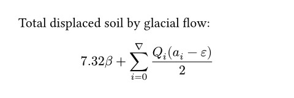

Not all math constructs have special syntax. Instead, we use functions, just like the image function we have seen before. For example, to insert a column vector, we can use the vec function. Within math mode, function calls don't need to start with the # character.

모든 수학 구조가 특별한 구문을 가지는 것은 아닙니다. 대신, 이전에 살펴본 이미지 함수와 같은 함수를 사용합니다. 예를 들어, 열 벡터를 삽입하려면 `vec` 함수를 사용할 수 있습니다. 수학 모드 내에서 함수 호출은 `#` 문자로 시작할 필요가 없습니다.

```
$ v := vec(x_1, x_2, x_3) $
```


Some functions are only available within math mode. For example, the cal function is used to typeset calligraphic letters commonly used for sets. The math section of the reference provides a complete list of all functions that math mode makes available.

일부 함수는 수식 모드 내에서만 사용할 수 있습니다. 예를 들어, `cal` 함수는 집합에 흔히 사용되는 서예체 글자를 조판하는 데 사용됩니다. 참고 자료의 수식 섹션에는 수식 모드에서 사용할 수 있는 모든 함수의 완전한 목록이 제공됩니다.

One more thing: Many symbols, such as the arrow, have a lot of variants. You can select among these variants by appending a dot and a modifier name to a symbol's name:

한 가지 더: 화살표와 같은 많은 기호는 다양한 변형이 존재합니다. 기호 이름 뒤에 점과 수정자 이름을 붙여 이러한 변형들 중에서 선택할 수 있습니다:

```
$ a arrow.squiggly b $
```


This notation is also available in markup mode, but the symbol name must be preceded with #sym. there. See the symbols section for a list of all available symbols.

이 표기법은 마크업 모드에도 사용할 수 있지만 해당 모드에서는 심볼 이름 앞에 `#sym` 을 붙여야 합니다. 사용 가능한 모든 심볼 목록은 심볼 섹션을 참조하십시오.


## Review
You have now seen how to write a basic document in Typst. You learned how to emphasize text, write lists, insert images, align content, and typeset mathematical expressions. You also learned about Typst's functions. There are many more kinds of content that Typst lets you insert into your document, such as tables, shapes, and code blocks. You can peruse the reference to learn more about these and other features.

이제 Typst에서 기본 문서를 작성하는 방법을 보셨습니다. 텍스트 강조, 목록 작성, 이미지 삽입, 내용 정렬, 수식 입력 방법을 배웠습니다. 또한 Typst의 함수에 대해서도 알아보셨습니다. Typst는 문서에 삽입할 수 있는 다양한 콘텐츠를 제공합니다. 예를 들어 표, 도형, 코드 블록 등이 있습니다. 이러한 기능과 기타 기능에 대해 자세히 알아보려면 참조 자료를 살펴보십시오.

For the moment, you have completed writing your report. You have already saved a PDF by clicking on the download button in the top right corner. However, you think the report could look a bit less plain. In the next section, we'll learn how to customize the look of our document.

현재 보고서를 작성하셨습니다. 이미 오른쪽 상단의 다운로드 버튼을 클릭하여 PDF 파일을 저장하셨습니다. 하지만 보고서가 좀 더 화려해 보일 수 있을 것 같습니다. 다음 섹션에서는 문서의 모양을 맞춤 설정하는 방법을 배워보겠습니다.


---

# Formatting
So far, you have written a report with some text, a few equations and images. However, it still looks very plain. Your teaching assistant does not yet know that you are using a new typesetting system, and you want your report to fit in with the other student's submissions. In this chapter, we will see how to format your report using Typst's styling system.

지금까지 여러분은 텍스트와 몇 개의 방정식, 이미지를 포함한 보고서를 작성했습니다. 하지만 여전히 매우 평범해 보입니다. 조교는 여러분이 새로운 조판 시스템을 사용하고 있다는 사실을 아직 모르고 있으며 여러분은 보고서가 다른 학생들의 제출물과 잘 어울리길 원합니다. 이 장에서는 Typst의 스타일링 시스템을 사용해서 보고서를 포맷팅하는 방법을 살펴보겠습니다.


## Set rules
As we have seen in the previous chapter, Typst has functions that insert content (e.g. the image function) and others that manipulate content that they received as arguments (e.g. the align function). The first impulse you might have when you want, for example, to change the font, could be to look for a function that does that and wrap the complete document in it.

이전 장에서 살펴본 바와 같이 Typst에는 콘텐츠를 삽입하는 함수(예: `image` 함수)와 인자로 받은 콘텐츠를 조작하는 함수(예: `align` 함수)가 있습니다. 예를 들어 글꼴을 변경하고 싶을 때 가장 먼저 떠오르는 생각은 해당 작업을 수행하는 함수를 찾아 문서 전체를 그 함수로 감싸는 것일 수 있습니다.

```
#text(font: "New Computer Modern")[
  = Background
  In the case of glaciers, fluid
  dynamics principles can be used
  to understand how the movement
  and behaviour of the ice is
  influenced by factors such as
  temperature, pressure, and the
  presence of other fluids (such as
  water).
]
```

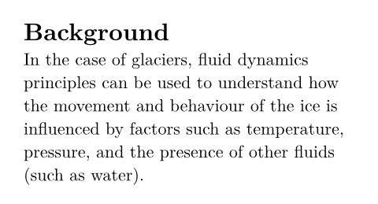

Wait, shouldn't all arguments of a function be specified within parentheses? Why is there a second set of square brackets with content after the parentheses? The answer is that, as passing content to a function is such a common thing to do in Typst, there is special syntax for it: Instead of putting the content inside of the argument list, you can write it in square brackets directly after the normal arguments, saving on punctuation.

잠깐, 함수의 모든 인수는 괄호 안에 명시되야 하지 않나요? 왜 괄호 뒤에 내용물이 담긴 두 번째 대괄호가 있는 거죠? 그 답은 함수에 내용을 전달하는 것이 Typst에서 매우 흔한 작업이기 때문에 이를 위한 특별한 구문이 존재하기 때문입니다: 내용을 인수 목록 안에 넣는 대신 일반 인수 바로 뒤에 대괄호 안에 직접 작성할 수 있어 구두점을 절약할 수 있습니다.

As seen above, that works. With the text function, we can adjust the font for all text within it. However, wrapping the document in countless functions and applying styles selectively and in-situ can quickly become cumbersome.

위에서 보듯이 이 방법은 효과가 있습니다. 텍스트 함수를 사용하면 그 안에 포함된 모든 텍스트의 글꼴을 조정할 수 있습니다. 그러나 문서를 수많은 함수로 감싸고 스타일을 선택적으로 그리고 그 자리에서 적용하는 것은 금방 번거로워질 수 있습니다.

Fortunately, Typst has a more elegant solution. With set rules, you can apply style properties to all occurrences of some kind of content. You write a set rule by entering the set keyword, followed by the name of the function whose properties you want to set, and a list of arguments in parentheses.

다행히 Typst에는 좀 더 우아한 해결책이 있습니다. 세트 규칙(set rules)을 사용하면 특정 유형의 콘텐츠가 나타나는 모든 위치에 스타일 속성을 적용할 수 있습니다. 세트 규칙을 작성하려면 `set` 키워드를 입력한 후 속성을 설정하려는 함수의 이름을 입력하고 괄호 안에 인자 목록을 추가하면 됩니다.

```
#set text(
  font: "New Computer Modern"
)

= Background
In the case of glaciers, fluid
dynamics principles can be used
to understand how the movement
and behaviour of the ice is
influenced by factors such as
temperature, pressure, and the
presence of other fluids (such as
water).
```


> [!NOTE] Want to know in more technical terms what is happening here?
> [!NOTE] 여기서 무슨 일이 일어나는지 좀 더 기술적인 용어로 알고 싶으신가요?
>
> Set rules can be conceptualized as setting default values for some of the parameters of a function for all future uses of that function.
> 설정 규칙은 함수의 일부 매개변수에 대해 향후 해당 함수를 사용할 때마다 적용될 기본값을 설정하는 것으로 개념화될 수 있습니다.


## The autocomplete panel
If you followed along and tried a few things in the app, you might have noticed that always after you enter a # character, a panel pops up to show you the available functions, and, within an argument list, the available parameters. That's the autocomplete panel. It can be very useful while you are writing your document: You can apply its suggestions by hitting the Return key or navigate to the desired completion with the arrow keys. The panel can be dismissed by hitting the Escape key and opened again by typing # or hitting Ctrl + Space. Use the autocomplete panel to discover the right arguments for functions. Most suggestions come with a small description of what they do.

앱에서 몇 가지 기능을 따라 해 보셨다면 `#` 문자를 입력할 때마다 사용 가능한 함수를 보여주는 패널이 나타나고 인수 목록 내에서는 사용 가능한 매개변수를 보여준다는 점을 눈치채셨을 겁니다. 이것이 바로 자동 완성 패널입니다. 문서를 작성할 때 매우 유용하게 사용할 수 있습니다: 제안된 내용을 적용하려면 리턴 키를 누르거나 화살표 키로 원하는 완성 항목으로 이동하면 됩니다. `Esc` 키를 눌러 패널을 닫을 수 있으며 `#` 을 입력하거나 `Ctrl + Space` 를 눌러 다시 열 수 있습니다. 함수에 맞는 올바른 인수를 찾으려면 자동 완성 패널을 활용하시기 바랍니다. 대부분의 제안에는 해당 기능에 대한 간단한 설명이 함께 제공됩니다.

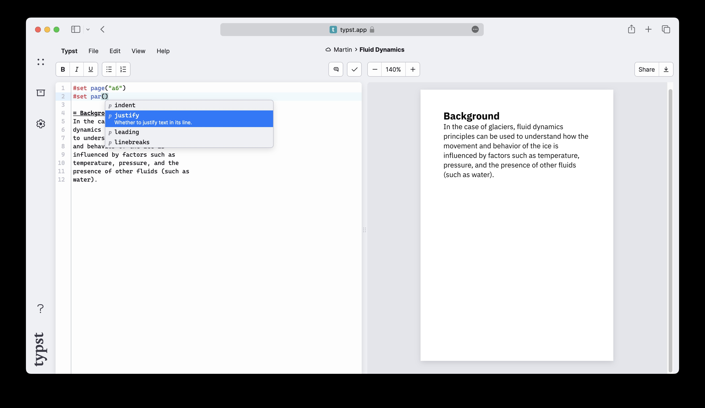


## Set up the page
Back to set rules: When writing a rule, you choose the function depending on what type of element you want to style. Here is a list of some functions that are commonly used in set rules:

설정 규칙으로 돌아가서 규칙을 작성할 때 스타일링하려는 요소의 유형에 따라 함수를 선택합니다. 설정 규칙에서 흔히 사용되는 함수 목록은 다음과 같습니다:

- text to set font family, size, color, and other properties of text
- page to set the page size, margins, headers, enable columns, and footers
- par to justify paragraphs, set line spacing, and more
- heading to set the appearance of headings and enable numbering
- document to set the metadata contained in the PDF output, such as title and author

- 텍스트의 글꼴 종류, 크기, 색상 및 기타 속성을 설정하는 텍스트
- 페이지 크기, 여백, 머리글 설정, 열 사용 활성화 및 바닥글 설정 페이지
- 단락 정렬, 줄 간격 설정 등
- 제목의 모양을 설정하고 번호 매기기를 활성화하는 제목 설정
- PDF 출력물에 포함된 제목 및 저자 등의 메타데이터를 설정하는 문서

Not all function parameters can be set. In general, only parameters that tell a function how to do something can be set, not those that tell it what to do it with. The function reference pages indicate which parameters are settable.

모든 함수 매개변수를 설정할 수 있는 것은 아닙니다. 일반적으로 함수가 어떻게 작업을 수행할지 지시하는 매개변수만 설정할 수 있으며 작업 대상이 무엇인지 지시하는 매개변수는 설정할 수 없습니다. 함수 참조 페이지에는 설정 가능한 매개변수가 명시되어 있습니다.

Let's add a few more styles to our document. We want larger margins and a serif font. For the purposes of the example, we'll also set another page size.

문서에 몇 가지 스타일을 더 추가해 보겠습니다. 여백을 더 넓게 하고 세리프 글꼴을 사용하고자 합니다. 예시를 위해 다른 페이지 크기도 설정하겠습니다.

```
#set page(
  paper: "a6",
  margin: (x: 1.8cm, y: 1.5cm),
)
#set text(
  font: "New Computer Modern",
  size: 10pt
)
#set par(
  justify: true,
  leading: 0.52em,
)

= Introduction
In this report, we will explore the
various factors that influence fluid
dynamics in glaciers and how they
contribute to the formation and
behaviour of these natural structures.

...

#align(center + bottom)[
  #image("glacier.jpg", width: 70%)

  *Glaciers form an important
  part of the earth's climate
  system.*
]
```

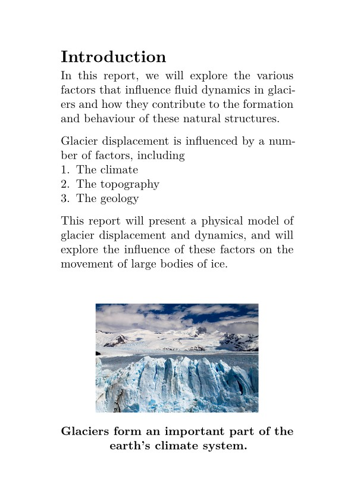

There are a few things of note here.

여기서 주목할 만한 몇 가지 사항이 있습니다.

First is the page set rule. It receives two arguments: the page size and margins for the page. The page size is a string. Typst accepts many standard page sizes, but you can also specify a custom page size. The margins are specified as a dictionary. Dictionaries are a collection of key-value pairs. In this case, the keys are x and y, and the values are the horizontal and vertical margins, respectively. We could also have specified separate margins for each side by passing a dictionary with the keys left, right, top, and bottom.

첫 번째는 페이지 설정 규칙입니다. 이 규칙은 두 개의 인수를 받습니다: 페이지 크기와 페이지 여백입니다. 페이지 크기는 문자열입니다. Typst는 많은 표준 페이지 크기를 지원하지만 사용자 정의 페이지 크기도 지정할 수 있습니다. 여백은 사전(dictionary)으로 지정됩니다. 사전은 키-값 쌍의 집합입니다. 이 경우 키는 x 와 y 이며 값은 각각 가로 및 세로 여백입니다. 또한 left, right, top, bottom 키를 가진 사전(dictionary)을 전달해서 각 면별로 별도의 여백을 지정할 수도 있습니다.

Next is the set text set rule. Here, we set the font size to 10pt and font family to "New Computer Modern". The Typst app comes with many fonts that you can try for your document. When you are in the text function's argument list, you can discover the available fonts in the autocomplete panel.

다음은 텍스트 설정 규칙입니다. 여기서 글꼴 크기를 10pt 로 글꼴 패밀리를 “New Computer Modern” 으로 설정합니다. Typst 앱에는 문서에 사용할 수 있는 다양한 글꼴이 포함되어 있습니다. 텍스트 기능의 인수 목록에서 자동 완성 패널을 통해 사용 가능한 글꼴을 확인할 수 있습니다.

We have also set the spacing between lines (a.k.a. leading): It is specified as a length value, and we used the em unit to specify the leading relative to the size of the font: 1em is equivalent to the current font size (which defaults to 11pt).

또한 줄 간격(일명 leading)도 설정했습니다: 이는 길이 값으로 지정되며 글꼴 크기에 상대적인 리딩을 지정하기 위해 `em` 단위를 사용했습니다: 1em은 현재 글꼴 크기(기본값은 11pt)와 동일합니다.

Finally, we have bottom aligned our image by adding a vertical alignment to our center alignment. Vertical and horizontal alignments can be combined with the + operator to yield a 2D alignment.

마지막으로 중앙 정렬에 수직 정렬을 추가해서 이미지를 하단 정렬했습니다. 수직 및 수평 정렬은 `+` 연산자를 사용해서 결합하면 2차원 정렬을 생성할 수 있습니다.


## A hint of sophistication
To structure our document more clearly, we now want to number our headings. We can do this by setting the numbering parameter of the heading function.

문서를 보다 명확하게 구성하기 위해 이제 제목에 번호를 매기려 합니다. 이를 위해 제목 함수의 번호 매기기 매개변수를 설정하면 됩니다.

```
#set heading(numbering: "1.")

= Introduction
#lorem(10)

== Background
#lorem(12)

== Methods
#lorem(15)
```

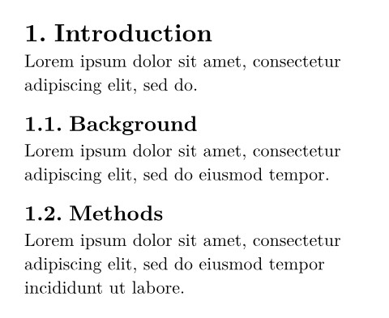

We specified the string "1." as the numbering parameter. This tells Typst to number the headings with arabic numerals and to put a dot between the number of each level. We can also use letters, roman numerals, and symbols for our headings:

“1.” 문자열을 번호 매기기 매개변수로 지정했습니다. 이는 Typst에게 각 레벨의 번호 사이에 점을 넣고 아라비아 숫자로 제목을 번호 매기도록 지시합니다. 제목에 문자, 로마 숫자 및 기호를 사용할 수도 있습니다:

```
#set heading(numbering: "1.a")

= Introduction
#lorem(10)

== Background
#lorem(12)

== Methods
#lorem(15)
```

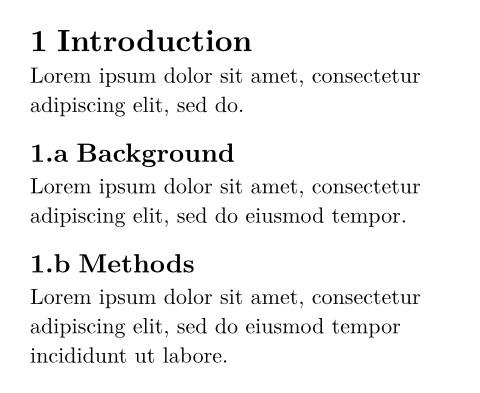

This example also uses the lorem function to generate some placeholder text. This function takes a number as an argument and generates that many words of Lorem Ipsum text.

이 예제도 `lorem` 함수를 사용해서 일부 자리 표시자 텍스트를 생성합니다. 이 함수는 숫자를 인수로 받아 해당 수만큼의 Lorem Ipsum 텍스트를 생성합니다.

> [!NOTE] Did you wonder why the headings and text set rules apply to all text and headings, even if they are not produced with the respective functions?
> [!NOTE] 제목과 본문 설정 규칙이 해당 기능으로 생성되지 않은 텍스트와 제목에도 적용되는 이유가 궁금하셨나요?
>
> Typst internally calls the heading function every time you write = Conclusion. In fact, the function call #heading[Conclusion] is equivalent to the heading markup above. Other markup elements work similarly, they are only syntax sugar for the corresponding function calls.
> Typst는 사용자가 `= Conclusion` 을 작성할 때마다 내부적으로 `heading` 함수를 호출합니다. 실제로 함수 호출 `#heading[Conclusion]` 은 위의 `heading` 마크업과 동일합니다. 다른 마크업 요소들도 유사하게 작동하며 해당 함수 호출을 위한 구문 설탕에 불과합니다.


## Show rules
You are already pretty happy with how this turned out. But one last thing needs to be fixed: The report you are writing is intended for a larger project and that project's name should always be accompanied by a logo, even in prose.

이미 결과물에 상당히 만족하고 계실 겁니다. 하지만 마지막으로 한 가지 수정할 점이 있습니다: 작성 중인 보고서는 더 큰 프로젝트를 위한 것이며 그 프로젝트 이름은 문장 내에서도 항상 로고와 함께 표시되어야 합니다.

You consider your options. You could add an #image("logo.svg") call before every instance of the logo using search and replace. That sounds very tedious. Instead, you could maybe define a custom function that always yields the logo with its image. However, there is an even easier way:

여러분은 선택지를 고려합니다. 검색 및 바꾸기 기능을 통해 로고가 사용된 모든 위치 앞에 `#image(“logo.svg”)` 호출을 추가할 수 있습니다. 이는 매우 지루하게 들립니다. 대신 항상 로고와 함께 이미지를 반환하는 사용자 정의 함수를 정의할 수도 있습니다. 그러나 좀 더 쉬운 방법이 있습니다:

With show rules, you can redefine how Typst displays certain elements. You specify which elements Typst should show differently and how they should look. Show rules can be applied to instances of text, many functions, and even the whole document.

쇼 규칙(show rules)을 사용하면 Typst가 특정 요소를 표시하는 방식을 재정의할 수 있습니다. Typst가 다르게 표시할 요소와 그 요소의 모양을 지정합니다. 쇼 규칙은 텍스트 인스턴스, 다양한 함수, 심지어 문서 전체에 적용할 수 있습니다.

```
#show "ArtosFlow": name => box[
  #box(image(
    "logo.svg",
    height: 0.7em,
  ))
  #name
]

This report is embedded in the
ArtosFlow project. ArtosFlow is a
project of the Artos Institute.
```

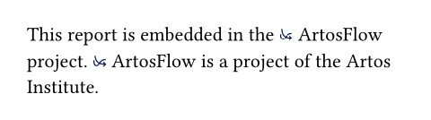

There is a lot of new syntax in this example: We write the show keyword, followed by a string of text we want to show differently and a colon. Then, we write a function that takes the content that shall be shown as an argument. Here, we called that argument name. We can now use the name variable in the function's body to print the ArtosFlow name. Our show rule adds the logo image in front of the name and puts the result into a box to prevent linebreaks from occurring between logo and name. The image is also put inside of a box, so that it does not appear in its own paragraph.

이 예제는 새로운 구문이 많이 등장합니다: `show` 키워드를 작성한 후 다르게 표시하고자 하는 텍스트 문자열과 콜론을 붙입니다. 그런 다음 표시할 내용을 인자로 받는 함수를 작성합니다. 여기서 해당 인자를 `name` 이라 명명했습니다. 이제 함수 본체에서 `name` 변수를 사용해서 ArtosFlow 이름을 출력할 수 있습니다. 우리의 `show` 규칙은 이름 앞에 로고 이미지를 추가하고 로고와 이름 사이에 줄바꿈이 발생하지 않도록 결과를 박스(`#box`) 안에 배치합니다. 이미지도 박스 안에 넣어 별도의 단락으로 표시되지 않도록 합니다.

The calls to the first box function and the image function did not require a leading # because they were not embedded directly in markup. When Typst expects code instead of markup, the leading # is not needed to access functions, keywords, and variables. This can be observed in parameter lists, function definitions, and code blocks.

첫 번째 박스 함수와 이미지 함수에 대한 호출은 마크업에 직접 포함되지 않았기 때문에 선행 `#` 문자가 필요하지 않았습니다. Typst가 마크업 대신 코드를 기대할 때 함수, 키워드 및 변수에 접근하기 위해 선행 `#` 은 필요하지 않습니다. 이는 매개변수 목록, 함수 정의 및 코드 블록에서 관찰할 수 있습니다.


## Review
You now know how to apply basic formatting to your Typst documents. You learned how to set the font, justify your paragraphs, change the page dimensions, and add numbering to your headings with set rules. You also learned how to use a basic show rule to change how text appears throughout your document.

이제 Typst 문서에 기본 서식을 적용하는 방법을 알게 되었습니다. 글꼴 설정, 단락 정렬, 페이지 크기 변경, 규칙을 정해 제목에 번호 매기기 등을 배웠습니다. 또한 기본 표시 규칙을 사용해서 문서 전체에 텍스트가 표시되는 방식을 변경하는 방법도 익혔습니다.

You have handed in your report. Your supervisor was so happy with it that they want to adapt it into a conference paper! In the next section, we will learn how to format your document as a paper using more advanced show rules and functions.

보고서를 제출하셨습니다. 지도 교수님께서 매우 만족하셔서 이를 학술대회 발표문으로 수정하고자 하십니다! 다음 섹션에서는 고급 서식 규칙과 기능을 활용하여 문서를 학술 논문 형식으로 구성하는 방법을 배워보겠습니다.

---


# Advanced Styling
In the previous two chapters of this tutorial, you have learned how to write a document in Typst and how to change its formatting. The report you wrote throughout the last two chapters got a straight A and your supervisor wants to base a conference paper on it! The report will of course have to comply with the conference's style guide. Let's see how we can achieve that.

이 튜토리얼의 지난 두 장에서 여러분은 Typst로 문서를 작성하는 방법과 서식을 변경하는 방법을 배웠습니다. 지난 두 장에 걸쳐 작성한 보고서는 우수한 성적을 받았고 지도 교수님께서 이를 바탕으로 학술대회 논문으로 작성하고자 하십니다! 물론 해당 보고서는 학술대회의 스타일 가이드를 준수해야 합니다. 이를 어떻게 달성할 수 있는지 살펴보겠습니다.

Before we start, let's create a team, invite your supervisor and add them to the team. You can do this by going back to the app dashboard with the back icon in the top left corner of the editor. Then, choose the plus icon in the left toolbar and create a team. Finally, click on the new team and go to its settings by clicking 'manage team' next to the team name. Now you can invite your supervisor by email.

시작하기 전에 팀을 생성하고 상사를 초대해서 팀에 추가합니다. 이를 위해 편집기 왼쪽 상단의 뒤로가기 아이콘을 눌러 앱 대시보드로 돌아갑니다. 그런 다음 왼쪽 도구 모음의 더하기 아이콘을 선택해서 팀을 생성합니다. 마지막으로 새로 생성한 팀을 클릭하고 팀 이름 옆의 '팀 관리' 를 클릭해서 설정 화면으로 이동합니다. 이제 이메일로 상사를 초대할 수 있습니다.

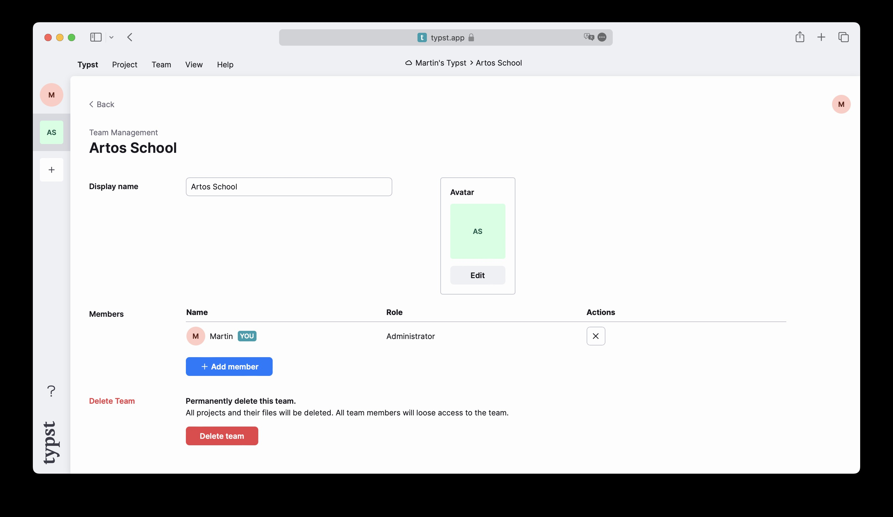

Next, move your project into the team: Open it, going to its settings by choosing the gear icon in the left toolbar and selecting your new team from the owners dropdown. Don't forget to save your changes!

다음으로 프로젝트를 팀으로 이동합니다: 프로젝트를 열고 왼쪽 도구 모음의 톱니바퀴 아이콘을 선택해서 설정으로 이동한 후 소유자 드롭다운 메뉴에서 새 팀을 선택합니다. 변경 사항을 저장하는 것도 잊지 마시기 바랍니다!

Now, your supervisor can also edit the project and you can both see the changes in real time. You can join our Discord server to find other users and try teams with them!

이제 상사도 프로젝트를 편집할 수 있으며 양측 모두 실시간으로 변경 사항을 확인할 수 있습니다. 디스코드 서버에 참여해서 다른 사용자를 찾고 함께 팀을 구성해 보세요!


## The conference guidelines
The layout guidelines are available on the conference website. Let's take a look at them:

컨퍼런스 웹사이트에서 레이아웃 가이드라인을 확인할 수 있습니다. 함께 살펴보겠습니다:

- The font should be an 11pt serif font
- The title should be in 17pt and bold
- The paper contains a single-column abstract and two-column main text
- The abstract should be centered
- The main text should be justified
- First level section headings should be 13pt, centered, and rendered in small capitals
- Second level headings are run-ins, italicized and have the same size as the body text
- Finally, the pages should be US letter sized, numbered in the center of the footer and the top right corner of each page should contain the title of the paper

- 글꼴은 11pt 세리프체여야 합니다
- 제목은 17pt 볼드체로 표기해야 합니다
- 논문은 단일 열의 초록과 이중 열의 본문으로 구성됩니다
- 초록은 중앙 정렬되어야 합니다
- 본문은 양쪽 정렬되어야 합니다
- 1단계 섹션 제목은 13pt, 중앙 정렬, 소문자 대문자로 표기되어야 합니다
- 2단계 제목은 들여쓰기 처리되며, 이탤릭체로 표기되고 본문과 동일한 크기여야 합니다
- 마지막으로, 페이지는 US 레터 사이즈여야 하며 각 페이지 하단 중앙에 페이지 번호가 매겨지고 오른쪽 상단 모서리에는 논문 제목이 포함되어야 합니다


We already know how to do many of these things, but for some of them, we'll need to learn some new tricks.

우리는 이미 이런 것들 중 많은 부분을 처리할 줄 알고 있지만 일부는 새로운 방법을 배워야 할 것입니다.


## Writing the right set rules
Let's start by writing some set rules for the document.

문서에 대한 몇 가지 기본 규칙부터 작성하는 것으로 시작해 보겠습니다.

```
#set page(
  paper: "us-letter",
  header: align(right)[
    A Fluid Dynamic Model for
    Glacier Flow
  ],
  numbering: "1",
)
#set par(justify: true)
#set text(
  font: "Libertinus Serif",
  size: 11pt,
)

#lorem(600)
```

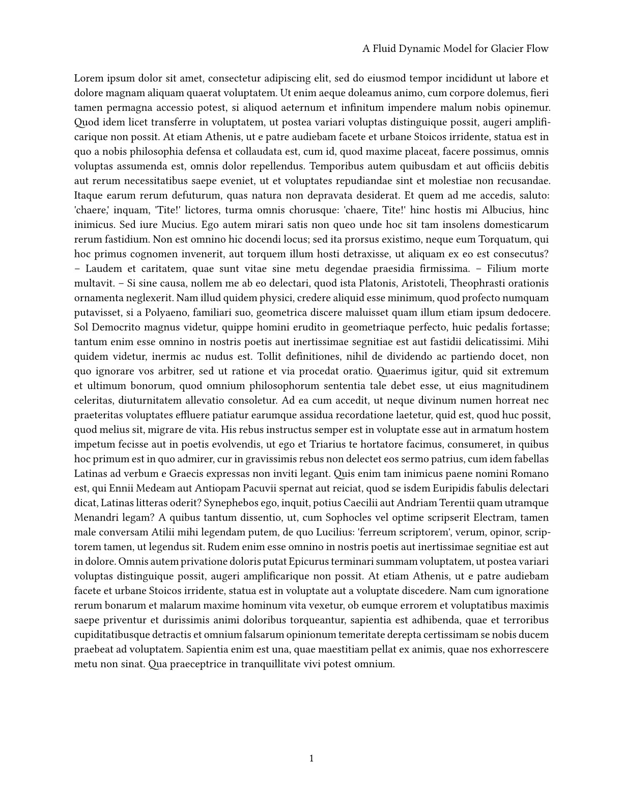

You are already familiar with most of what is going on here. We set the text size to 11pt and the font to Libertinus Serif. We also enable paragraph justification and set the page size to US letter.

여기서 진행 중인 대부분의 작업은 이미 익숙하실 겁니다. 텍스트 크기를 11pt 로 설정하고 글꼴은 Libertinus Serif 로 지정했습니다. 또한 단락 정렬을 활성화하고 페이지 크기를 US-레터로 설정했습니다.

The header argument is new: With it, we can provide content to fill the top margin of every page. In the header, we specify our paper's title as requested by the conference style guide. We use the align function to align the text to the right.

헤더 인수는 새로 추가된 기능입니다: 이를 통해 모든 페이지의 상단 여백을 채울 내용을 제공할 수 있습니다. 헤더에는 학회 스타일 가이드의 요구사항에 따라 논문 제목을 명시합니다. 텍스트를 오른쪽 정렬하기 위해 `align` 함수를 사용합니다.

Last but not least is the numbering argument. Here, we can provide a numbering pattern that defines how to number the pages. By setting it to "1", Typst only displays the bare page number. Setting it to "(1/1)" would have displayed the current page and total number of pages surrounded by parentheses. And we could even have provided a completely custom function here to format things to our liking.

마지막으로 중요한 것은 페이지 번호 매기기 옵션입니다. 여기서 페이지 번호를 지정하는 패턴을 설정할 수 있습니다. “1” 로 설정하면 Typst는 기본 페이지 번호만 표시합니다. “(1/1)” 로 설정하면 현재 페이지와 총 페이지 수가 괄호로 표시됩니다. 심지어 완전히 사용자 정의된 함수를 제공해서 원하는 대로 형식을 지정할 수도 있습니다.


## Creating a title and abstract
Now, let's add a title and an abstract. We'll start with the title. Typst comes with a title function. Let's start by providing our title as an argument:

이제 제목과 초록을 추가해 보겠습니다. 제목부터 시작하겠습니다. Typst에는 제목 기능이 포함되어 있습니다. 먼저 인수로 제목을 제공해 보겠습니다:

```
#title[
  A Fluid Dynamic Model
  for Glacier Flow
]
```

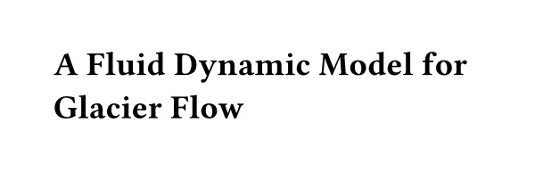

You can see that the title is already boldfaced and has some space around it. However, it is left-aligned and not exactly 17pt large. Hence, we need to adjust its appearance. The title function does not come with any arguments for font or text size we could set. Instead, these properties are defined on the text and align functions.

제목이 이미 굵게 표시되고 주변에 여백이 있음을 확인할 수 있습니다. 그러나 왼쪽 정렬되어 있으며 정확히 17pt 크기도 아닙니다. 따라서 외관을 조정해야 합니다. 제목 함수에는 설정할 수 있는 글꼴이나 텍스트 크기 관련 인수가 없습니다. 대신 이러한 속성은 텍스트 및 정렬 함수에서 정의됩니다.

> [!NOTE] What is the difference between what the title function inserted and the headings we produced with equals signs?
> [!NOTE] 제목 함수가 삽입한 내용과 등호(`=`)로 생성한 제목의 차이점은 무엇인가요?
>
> Headings, even first-level headings, can appear multiple times in your document whereas a title only appears once, usually at the beginning. Differentiating between the two helps Typst make your document accessible for users of Assistive Technology such as screen readers.
> 제목은 문서 내에서 여러 번 나타날 수 있지만(1단계 제목도 포함), 제목(title)은 일반적으로 문서 시작 부분에 한 번만 나타납니다. 이 둘을 구분하면 Typst가 스크린 리더 같은 보조 기술 사용자에게 문서를 접근 가능하게 만드는 데 도움이 됩니다.

When we want to customize the properties of some element inside of another kind of element, we can use show-set rules. First, we use show to select which element we want to customize. We call this a selector. Then, we type a colon. Next, we write the set rule that should apply to elements matching the selector. Summarized, the syntax looks like this:

다른 종류의 요소 내부에 있는 특정 요소의 속성을 맞춤 설정하려면 `show-set` 규칙을 사용할 수 있습니다. 먼저 `show` 를 사용해서 맞춤 설정할 요소를 선택합니다. 이를 `선택자` 라고 부릅니다. 그런 다음 콜론을 입력합니다. 다음으로 선택자와 일치한 요소에 적용할 `set` 규칙을 작성합니다. 요약하면 구문은 다음과 같습니다:

```
#show your-selector: set some-element(/* ... */)
```

Let's recall: We want to center-align the title and make it 17pt large. Hence, we need two show-set rules:

다시 정리해 보겠습니다: 제목을 중앙 정렬하고 17pt 크기로 설정하고자 합니다. 따라서 두 가지 표시-설정 규칙이 필요합니다:

- One with the selector title and the rule set text(size: 17pt)
- One with the selector title and the rule set align(center)

- 선택자 하나는 제목과 규칙 세트 텍스트가 포함된 항목(글자 크기: 17pt)
- 선택자 하나는 제목과 규칙 세트가 포함된 항목(정렬: 중앙)

Our example now looks like this:

우리의 예제는 다음과 같습니다:

```
#show title: set text(size: 17pt)
#show title: set align(center)

#title[
  A Fluid Dynamic Model
  for Glacier Flow
]
```

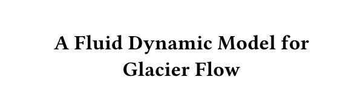

This looks right. Let's also add the author list: Since we are writing this paper together with our supervisor, we'll add our own and their name.

이게 맞는 것 같습니다. 저자 목록도 추가합니다: 지도 교수님과 함께 이 논문을 작성하고 있으므로 우리의 이름과 지도 교수님의 이름을 추가하겠습니다.

```
#grid(
  columns: (1fr, 1fr),
  align(center)[
    Therese Tungsten \
    Artos Institute \
    #link("mailto:tung@artos.edu")
  ],
  align(center)[
    Dr. John Doe \
    Artos Institute \
    #link("mailto:doe@artos.edu")
  ]
)
```

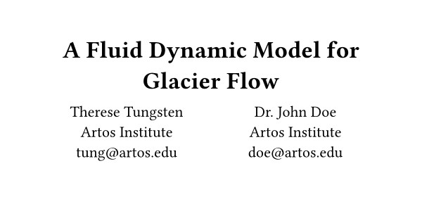

The two author blocks are laid out next to each other. We use the grid function to create this layout. With a grid, we can control exactly how large each column is and which content goes into which cell. The columns argument takes an array of relative lengths or fractions. In this case, we passed it two equal fractional sizes, telling it to split the available space into two equal columns. We then passed two content arguments to the grid function. The first with our own details, and the second with our supervisors'. We again use the align function to center the content within the column. The grid takes an arbitrary number of content arguments specifying the cells. Rows are added automatically, but they can also be manually sized with the rows argument.

두 저자 정보 블록은 나란히 배치됩니다. 그리드 함수를 사용해서 이런 레이아웃을 생성합니다. 그리드 함수를 사용하면 각 열의 크기와 어떤 콘텐츠가 어떤 셀에 배치될지 정확히 제어할 수 있습니다. `columns` 인수는 상대적 길이 또는 분수 값의 배열을 인자로 받습니다. 이 경우 동일한 비율의 두 크기를 전달해서 사용 가능한 공간을 두 개의 동일한 열로 분할하도록 지시했습니다. 그런 다음 그리드 함수에 두 개의 콘텐츠 인수를 전달했습니다. 첫 번째는 우리 자신의 정보, 두 번째는 지도 교수님의 정보입니다. 열 내의 콘텐츠를 중앙 정렬하기 위해 다시 정렬 함수를 사용했습니다. 그리드는 셀을 지정하는 콘텐츠 인수를 임의의 개수만큼 받습니다. 행은 자동으로 추가되지만 행 인수를 사용해서 수동으로 크기를 조정할 수도 있습니다.

Looking at the authors and the title, they are a bit too close together. You can address this by using another show-set rule to configure the space below the title. The title, the grid, paragraphs, and all other elements that Typst arranges from the top to the bottom of the page are called blocks. Each block is controlled by the block function. It controls behaviors like their distance and whether a block can contain a page break. That means that we can write another show-set rule that selects the title to set the block spacing:

저자와 제목이 너무 가깝게 배치되어 있습니다. 제목 아래 공간을 구성하려면 다른 `show-set` 규칙을 사용해야 합니다. 제목, 그리드, 단락 및 Typst가 페이지 상단부터 하단까지 배치하는 모든 요소는 `블록` 이라 합니다. 각 블록은 블록 함수로 제어됩니다. 블록 간 거리나 페이지 분할 포함 여부 같은 동작을 제어합니다. 즉, 제목을 선택해서 블록 간격을 설정하는 또 다른 `show-set` 규칙을 작성할 수 있습니다:

```
#show title: set text(size: 17pt)
#show title: set align(center)
#show title: set block(below: 1.2em)

#title[
  A Fluid Dynamic Model
  for Glacier Flow
]

#grid(
  // ...
)
```

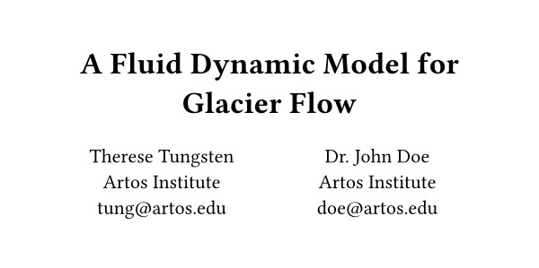

With this show-set rule, we overrode the spacing below the title. We have used the em unit: It allows us to express lengths as multiples of the font size. Here, we used it to space the title and the author list exactly 1.2× the font size apart. Now, let's add the abstract. Remember that the conference wants the abstract to be set ragged and centered.

이 show-set 규칙으로 제목 아래의 간격을 재정의했습니다. 여기선 em 단위를 사용했는데 이는 길이를 글꼴 크기의 배수로 표현할 수 있게 합니다. 여기서 제목과 저자 목록 사이를 정확히 글꼴 크기의 1.2배 간격으로 설정했습니다. 이제 초록을 추가해 보겠습니다. 학회에선 초록을 불규칙 정렬로 중앙 정렬한다는 점을 기억하시기 바랍니다세.

```
...

#align(center)[
  #set par(justify: false)
  *Abstract* \
  #lorem(80)
]
```

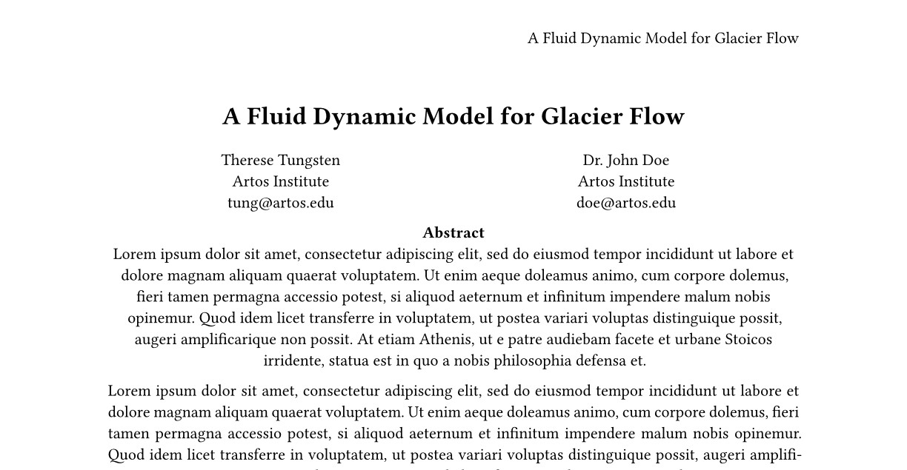

Well done! One notable thing is that we used a set rule within the content argument of align to turn off justification for the abstract. This does not affect the remainder of the document even though it was specified after the first set rule because content blocks scope styling. Anything set within a content block will only affect the content within that block.

잘하셨습니다! 주목할 점은 abstract에 대해 정렬(`align`) 함수의 `content` 인수 내에서 특정 규칙을 사용해서 정렬을 해제했다는 것입니다. 이는 첫 번째 규칙 이후에 지정되었음에도 문서의 나머지 부분에는 영향을 미치지 않습니다. 콘텐츠 블록은 스타일링 범위를 제한하기 때문입니다. 콘텐츠 블록 내에서 설정된 사항은 해당 블록 내의 콘텐츠에만 영향을 미칩니다.

Another tweak could be to remove the duplication between the header and the title element's argument. Since they share the title, it would be convenient to store it in a place designed to hold metadata about the document. We would then need a way to retrieve the title in both places. The document element can help us with the former: By using it in a set rule, we can store document metadata like title, description, and keywords.

또 다른 개선점은 헤더와 제목 요소(title element)의 인자 중복을 제거하는 것입니다. 둘은 동일한 제목을 공유하므로 문서에 대한 메타데이터를 저장하도록 설계된 위치에 이를 저장하는 것이 편리할 것입니다. 그러면 두 위치에서 제목을 검색할 수 있는 방법이 필요합니다. 문서 요소(document element)가 전자를 해결하는 데 도움이 될 수 있습니다: 설정 규칙(`set rule`)에서 이를 사용함으로써 제목, 설명, 키워드 같은 문서의 메타데이터를 저장할 수 있습니다.

```
#set document(title: [A Fluid Dynamic Model for Glacier Flow])
```

When exporting a PDF, the title set here will appear in the title bar of your PDF reader. Your operating system will also use this title to make the file retrievable with search. Last but not least, it contributes to making your document more accessible and is required if you choose to comply with PDF/UA, a PDF standard focused on accessibility.

PDF를 내보낼 때 여기에 설정된 제목은 PDF 리더의 제목 표시줄에 표시됩니다. 운영 체제도 이 제목을 사용해서 파일을 검색 가능하게 합니다. 마지막으로 이 제목은 문서 접근성을 높이는 데 기여하며 접근성에 중점을 둔 PDF 표준인 PDF/UA 준수를 선택할 경우 필수 사항입니다.

Now, we need a way to retrieve the value we set in the main title and the header. Because the title function is designed to work together with the document element, calling it with no arguments will just print the title. For the header, we will need to be more explicit: Because Typst has no way of knowing that we want to insert the title there, we will need to tell it to do so manually.

이제 메인 제목과 헤더에 설정한 값을 가져올 방법이 필요합니다. `title` 함수는 문서 요소와 함께 작동하도록 설계되었기 때문에 인수를 지정하지 않고 호출하면 단순히 제목만 출력합니다. 헤더의 경우 더 명시적으로 처리해야 합니다: Typst가 제목을 거기에 삽입하길 원한다는 사실을 알 수 없기 때문에 수동으로 그렇게 하도록 지시해야 합니다.

Using context, we can retrieve the contents of any values we have set on elements before. When we use the context keyword, we can access any property of any element, including the document element's title property. Its use looks like this:

컨텍스트를 사용하면 이전에 요소에 설정한 모든 값의 내용을 가져올 수 있습니다. 컨텍스트 키워드를 사용하면 문서 요소의 `title` 속성을 포함해서 모든 요소의 모든 속성에 접근할 수 있습니다. 사용법은 다음과 같습니다:

```
#set document(title: [
  A Fluid Dynamic Model
  for Glacier Flow
])

...

#set page(
  header: align(
    right + horizon,
    // Retrieve the document
    // element's title property.
    context document.title,
  ),
  ...
)

#title()

...

```

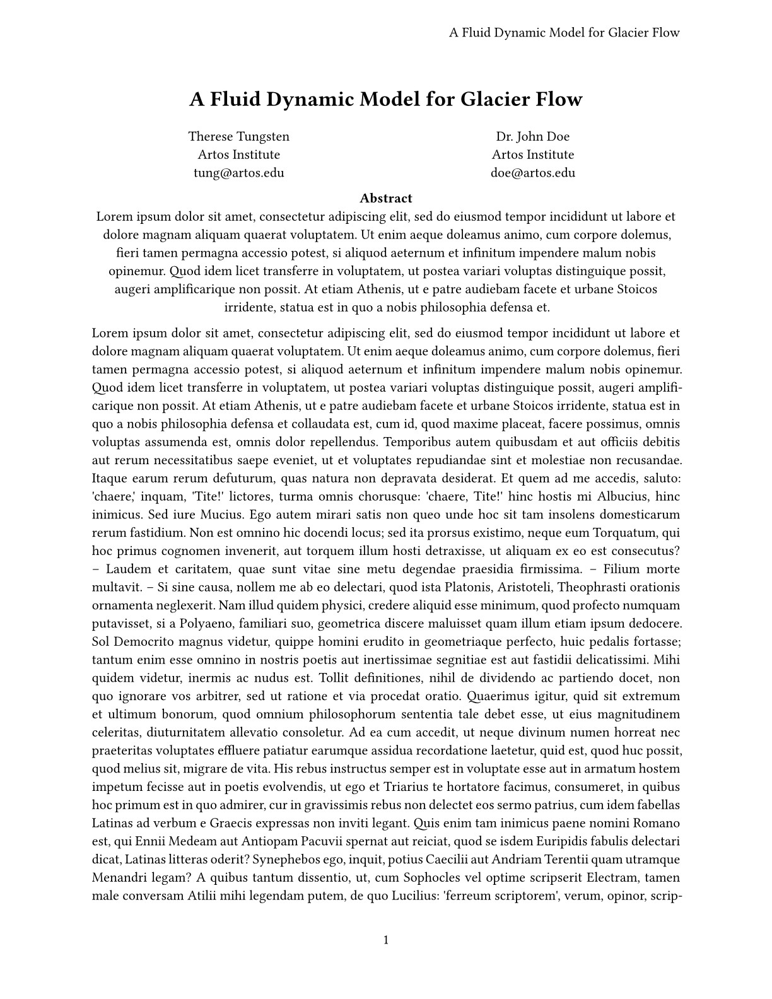

First, notice how we called the title function with empty, round parentheses. Because no argument was passed, it defaulted to what we set for the document element above. The distinction between empty round and empty square brackets is important: While empty round brackets show that you are passing nothing, empty square brackets mean that you are passing one argument: an empty content block. If called that way, the title would have no visible content.

먼저, 제목 함수를 빈 둥근 괄호로 호출한 점을 주목하시기 바랍니다. 인수가 전달되지 않았기 때문에 위에서 문서 요소에 설정한 값이 기본값으로 적용되었습니다. 빈 둥근 괄호와 빈 대괄호의 차이는 중요합니다: 빈 둥근 괄호는 아무것도 전달하지 않음을 나타내는 반면 빈 대괄호는 하나의 인수를 전달함을 의미합니다. 즉, 빈 콘텐츠 블록을 전달하는 것입니다. 그렇게 호출되면 제목에는 표시되는 콘텐츠가 없게 됩니다.

Next, take a look at the header. Instead of the title in square parentheses, we used the context keyword to access the document title. This inserted exactly what we set above. The role of context is not limited to accessing properties: With it, you can check if some elements are present in the document, measure the physical dimensions of others, and more. Using context, you can build powerful templates that react to the preferences of the end-user.

다음으로 헤더를 살펴보겠습니다. 괄호 안의 제목 대신 컨텍스트 키워드를 사용해서 문서 제목에 접근했습니다. 이로 인해 위에서 설정한 내용이 정확히 삽입되었습니다. 컨텍스트의 역할은 속성 접근에만 국한되지 않습니다: 이를 통해 문서에 특정 요소가 존재하는지 확인하거나 다른 요소의 물리적인 크기를 측정하는 등 다양한 작업을 수행할 수 있습니다. 컨텍스트를 활용하면 최종 사용자의 선호도에 반응하는 강력한 템플릿을 구축할 수 있습니다.

> [!NOTE] Why is the context keyword required to access element properties?
> [!NOTE] 왜 요소 속성에 접근하려면 컨텍스트 키워드가 필요할까요?


## Adding columns and headings
The paper above unfortunately looks like a wall of lead. To fix that, let's add some headings and switch our paper to a two-column layout. Fortunately, that's easy to do: We just need to amend our page set rule with the columns argument.

위 문서는 안타깝게도 납으로 된 벽처럼 답답해 보입니다. 이를 해결하기 위해 제목을 추가하고 문서를 두 열 레이아웃으로 전환해 보겠습니다. 다행히 이것은 간단합니다: 페이지 설정 규칙에 열 수 인수를 추가하기만 하면 됩니다.

By adding columns: 2 to the argument list, we have wrapped the whole document in two columns. However, that would also affect the title and authors overview. To keep them spanning the whole page, we can wrap them in a function call to place. Place expects an alignment and the content it should place as positional arguments. Using the named scope argument, we can decide if the items should be placed relative to the current column or its parent (the page). There is one more thing to configure: If no other arguments are provided, place takes its content out of the flow of the document and positions it over the other content without affecting the layout of other content in its container:

인수 목록에 2열을 추가함으로써 전체 문서를 두 열로 감쌌습니다. 그러나 이것은 제목과 저자 개요에도 영향을 미칩니다. 이들을 전체 페이지에 걸쳐 표시하려면 함수 호출을 통해 배치할 수 있습니다. `place` 함수는 정렬 방식과 배치할 내용을 위치 인수로 기대합니다. 명명된 범위 인수를 사용하면 항목을 현재 열에 상대적으로 배치할지, 아니면 상위 요소(페이지)에 상대적으로 배치할지 결정할 수 있습니다. 한 가지 더 설정할 사항이 남아 있습니다: 다른 인수가 제공되지 않으면 `place` 함수는 콘텐츠를 문서 흐름에서 분리해서 컨테이너 내의 다른 콘텐츠의 레이아웃에 영향을 주지 않고 그 위에 배치합니다:

```
#place(
  top + center,
  rect(fill: black),
)
#lorem(30)
```

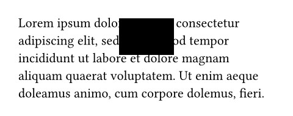

If we hadn't used place here, the square would be in its own line, but here it overlaps the few lines of text following it. Likewise, that text acts as if there was no square. To change this behavior, we can pass the argument float: true to ensure that the space taken up by the placed item at the top or bottom of the page is not occupied by any other content.

여기서 `place` 함수를 사용하지 않았다면 사각형은 별도의 줄에 독립적으로 위치했을 것입니다. 그러나 여기서는 사각형이 그 뒤에 오는 몇 줄의 텍스트와 겹칩니다. 마찬가지로 해당 텍스트는 사각형이 없는 것처럼 처리됩니다. 이 동작을 변경하려면 `float: true` 인수를 전달해서 배치된 항목이 페이지 상단 또는 하단에서 차지하는 공간이 다른 콘텐츠에 의해 점유되지 않도록 처리할 수 있습니다.

```
#set page(
  paper: "us-letter",
  header: align(
    right + horizon,
    context document.title,
  ),
  numbering: "1",
  columns: 2,
)

#place(
  top + center,
  float: true,
  scope: "parent",
  clearance: 2em,
)[
  ...

  #par(justify: false)[
    *Abstract* \
    #lorem(80)
  ]
]

= Introduction
#lorem(300)

= Related Work
#lorem(200)
```

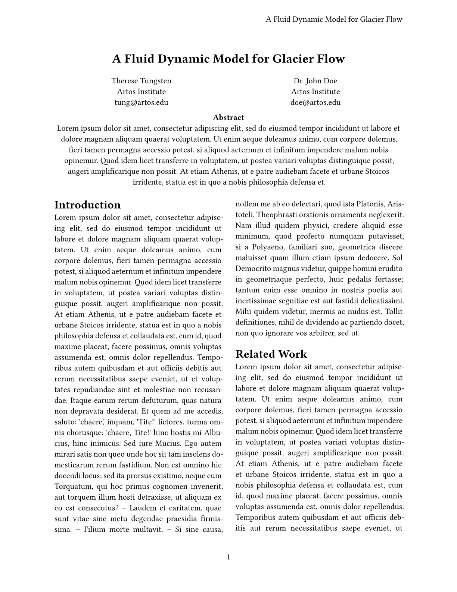

In this example, we also used the clearance argument of the place function to provide the space between it and the body instead of using the v function. We can also remove the explicit align(center, ..) calls around the various parts since they inherit the center alignment from the placement.

이 예제에서는 `v` 함수 대신 `place` 함수의 `clearance` 인자를 사용해서 본체와 객체 사이의 간격을 지정했습니다. 또한 배치 위치에서 중앙 정렬이 상속되므로 각 구성 요소에 대한 명시적인 `align(center, ..)` 함수 호출을 제거할 수 있습니다.

Now there is only one thing left to do: Style our headings. We need to make them centered and use small capitals. These properties are not available on the heading function, so we will need to write a few show-set rules and a show rule:

이제 남은 작업은 단 하나입니다: 제목을 스타일링하는 것입니다. 제목을 중앙 정렬하고 소문자형 대문자(small capitals)를 사용해야 합니다. 이 속성은 `heading` 함수에 제공되지 않으므로 몇 가지 `show-set` 규칙과 `show 규칙` 으로 작성해야 합니다:

- A show-set rule to make headings center-aligned
- A show-set rule to make headings 13pt large and use the regular weight
- A show rule to wrap the headings in a call to the smallcaps function

- 제목을 중앙 정렬하도록 설정하는 표시 설정 규칙
- 제목을 13pt 크기로 만들고 일반 두께를 사용하도록 설정하는 표시 설정 규칙
- 제목을 소문자 기능 호출로 감싸도록 설정하는 표시 규칙

```
#show heading: set align(center)
#show heading: set text(
  size: 13pt,
  weight: "regular",
)
#show heading: smallcaps

...

= Introduction
...

== Motivation
...
```

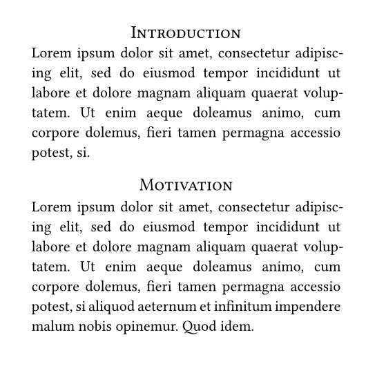

This looks great! We used show rules that apply to all headings. In the final show rule, we applied the smallcaps function to the complete heading. As we will see in the next example, we can also provide a custom rule to completely override the default look of headings.

멋지네요! 모든 제목에 적용되는 표시 규칙을 사용했습니다. 마지막 표시 규칙에는 제목 전체에 소문자형 대문자 기능을 적용했습니다. 다음 예제에서 보게 될 것처럼 제목의 기본 모양을 완전히 재정의하는 사용자 지정 규칙을 제공할 수도 있습니다.

The only remaining problem is that all headings look the same now. The "Motivation" and "Problem Statement" subsections ought to be italic run-in headers, but right now, they look indistinguishable from the section headings. We can fix that by using a where selector on our show rule: This is a method we can call on headings (and other elements) that allows us to filter them by their properties. We can use it to differentiate between section and subsection headings:

지금 남은 유일한 문제는 모든 제목이 동일하게 보인다는 점입니다. “동기” 와 “문제 정의” 소제목은 기울임체로 처리된 연속 헤더라야 하지만 현재는 섹션 제목과 구분되지 않습니다. 이를 해결하려면 `show` 규칙에 `where` 선택자를 적용하면 됩니다: 이는 헤더(및 기타 요소)에 적용할 수 있는 메서드로 속성에 따라 필터링할 수 있게 해줍니다. 이를 통해 섹션 제목과 소제목을 구분할 수 있습니다:

```
#show heading.where(level: 1): set align(center)
#show heading.where(level: 1): set text(size: 13pt, weight: "regular")
#show heading.where(level: 1): smallcaps

#show heading.where(level: 2): set text(
  size: 11pt,
  weight: "regular",
  style: "italic",
)
#show heading.where(level: 2): it => {
  it.body + [.]
}
```

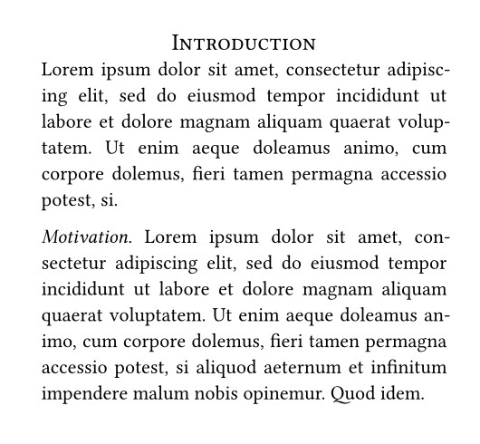

In this example, we first scope our previous rules to first-level headings by using .where(level: 1) to make the selector more specific. Then, we add a show-set rule for the second heading level. Finally, we need a show rule with a custom function: Headings enclose their contents with a block by default. This has the effect that the heading gets its own line. However, we want it to run into the text, so we need to provide our own show rule to get rid of this block.

이 예제는 먼저 `.where(level: 1)` 을 사용해서 선택자를 좀 더 구체화함으로써 이전 규칙의 적용 범위를 1단계 헤딩으로 제한합니다. 그런 다음 두 번째 헤딩 레벨에 대한 표시 설정 규칙을 추가합니다. 마지막으로 사용자 정의 함수를 포함한 `show` 규칙이 필요합니다: 기본적으로 제목은 내용을 블록으로 감쌉니다. 이로 인해 제목이 별도의 줄에 위치하게 됩니다. 그러나 우리는 제목이 본문과 이어지도록 하고 싶으므로 이 블록을 제거하기 위해 자체 `show` 규칙을 제공해야 합니다.

We provide the rule with a function that takes the heading as a parameter. This parameter is conventionally called it, but can have another name. The parameter can be used as content and will just display the whole default heading. Alternatively, when we want to build our own heading instead, we can use its fields like body, numbering, and level to compose a custom look. Here, we are just printing the body of the heading with a trailing dot and leave out the block that the built-in show rule produces. Note that this heading will no longer react to set rules for heading numbering and similar because we did not explicitly use it.numbering in the show rule. If you are writing show rules like this and want the document to remain customizable, you will need to take these fields into account.

우리는 헤딩을 매개변수로 받는 함수를 규칙에 제공합니다. 이 매개변수는 관례적으로 "it" 라고 부르지만 다른 이름을 가질 수도 있습니다. 이 매개변수는 콘텐츠로 사용될 수 있으며 기본 헤딩 전체를 그대로 표시합니다. 또는 자체 헤딩을 구성하려면 `body, numbering, level` 같은 필드를 활용해서 맞춤 스타일을 만들 수 있습니다. 여기서는 헤딩 본문에 마침표를 붙여서 출력하고 내장된 `show` 규칙이 생성하는 블록은 생략합니다. `show` 규칙에서 `it.numbering` 을 명시적으로 사용하지 않았기 때문에 이 헤딩은 더 이상 헤딩 번호 지정의 설정 규칙에 반응하지 않습니다. 이와 같은 `show` 규칙을 작성하면서 문서의 사용자 정의 기능을 유지하려면 이런 필드를 고려해야 합니다.

This looks great! We wrote show rules that selectively apply to the first and second level headings. We used a where selector to filter the headings by their level. We then rendered the subsection headings as run-ins. We also automatically add a period to the end of the subsection headings.

정말 멋지네요! 우리는 1단계와 2단계 제목에 선택적으로 적용되는 표시 규칙을 작성했습니다. `where` 선택자를 사용해서 제목을 단계별로 필터링했습니다. 그런 다음 하위 섹션 제목을 런인으로 렌더링했습니다. 또한 하위 섹션 제목 끝에 자동으로 마침표를 추가합니다.

Let's review the conference's style guide:

컨퍼런스 스타일 가이드를 다시 한번 살펴보겠습니다:

- The font should be an 11pt serif font ✓
- The title should be in 17pt and bold ✓
- The paper contains a single-column abstract and two-column main text ✓
- The abstract should be centered ✓
- The main text should be justified ✓
- First level section headings should be centered, rendered in small caps and in 13pt ✓
- Second level headings are run-ins, italicized and have the same size as the body text ✓
- Finally, the pages should be US letter sized, numbered in the center and the top right corner of each page should contain the title of the paper ✓

- 글꼴은 11pt 세리프 글꼴이어야 함 ✓
- 제목은 17pt 볼드체로 표기해야 함 ✓
- 논문은 단일 열의 초록과 이중 열의 본문으로 구성됨 ✓
- 초록은 중앙 정렬되어야 함 ✓
- 본문은 양쪽 정렬이어야 합니다 ✓
- 1단계 섹션 제목은 중앙 정렬, 소문자 대문자(small caps)로 표시되며 13pt 크기여야 합니다 ✓
- 2단계 제목은 들여쓰기 처리되고 이탤릭체이며 본문 텍스트와 동일한 크기여야 합니다 ✓
- 마지막으로, 페이지는 US 레터 사이즈여야 하며 중앙에 번호가 매겨져야 하고 각 페이지 오른쪽 상단 모서리에는 논문 제목이 포함되어야 합니다 ✓

We are now in compliance with all of these styles and can submit the paper to the conference! The finished paper looks like this:

이제 우리는 이 모든 스타일 가이드를 준수하게 되었으며 논문을 학회에 제출할 수 있습니다! 완성된 논문은 다음과 같습니다:

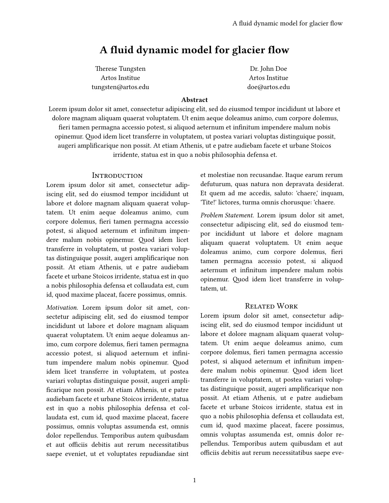


## Review
You have now learned how to create titles, headers, and footers, how to use functions, show-set rules, and scopes to locally override styles, how to create more complex layouts with the grid function, how to access element properties with context, and how to write show rules for individual functions, and the whole document. You also learned how to use the where selector to filter the headings by their level.

이제 제목, 머리글, 바닥글을 만드는 방법, 함수 사용법, 스타일 로컬 오버라이드를 위한 표시-설정 규칙 및 범위와 활용법, 그리드 함수를 이용한 복잡한 레이아웃 구성법, 컨텍스트를 통한 요소 속성 접근법, 개별 함수 및 전체 문서에 대한 표시 규칙 작성법을 익혔습니다. 또한 `where` 선택자를 활용해 제목 수준별로 필터링하는 방법도 배웠습니다.

The paper was a great success! You've met a lot of like-minded researchers at the conference and are planning a project which you hope to publish at the same venue next year. You'll need to write a new paper using the same style guide though, so maybe now you want to create a time-saving template for you and your team?

이 논문은 대성공이었습니다! 학회에서 많은 동지 연구자들을 만나고 내년에 같은 장소에서 발표할 프로젝트를 계획 중입니다. 다만 동일한 스타일 가이드로 새 논문을 작성해야 하니 지금쯤 팀을 위한 시간 절약형 템플릿을 만들어 보는 건 어떨까요?

In the next section, we will learn how to create templates that can be reused in multiple documents. This is a more advanced topic, so feel free to come back to it later if you don't feel up to it right now.

다음 섹션에는 여러 문서에서 재사용할 수 있는 템플릿을 만드는 방법을 배울 것입니다. 이것은 조금 고급 주제이므로 지금 당장 따라가기 어렵다면 나중에 다시 돌아와도 좋습니다.

---


# Making a Template
In the previous three chapters of this tutorial, you have learned how to write a document in Typst, apply basic styles, and customize its appearance in-depth to comply with a publisher's style guide. Because the paper you wrote in the previous chapter was a tremendous success, you have been asked to write a follow-up article for the same conference. This time, you want to take the style you created in the previous chapter and turn it into a reusable template. In this chapter you will learn how to create a template that you and your team can use with just one show rule. Let's get started!

이 튜토리얼의 지난 세 장에서 여러분은 Typst로 문서를 작성하고 기본 스타일을 적용하며 출판사의 스타일 가이드에 부합하도록 외관을 심층적으로 맞춤 설정하는 방법을 배웠습니다. 지난 장에서 작성한 논문이 큰 성공을 거두었기에 동일한 학회를 위한 후속 논문을 작성해 달라는 요청을 받았습니다. 이번에는 지난 장에서 만든 스타일을 재사용 가능한 템플릿으로 전환하고자 합니다. 이번 장에는 여러분과 팀이 단 한 번의 명령어로 사용할 수 있는 템플릿을 만드는 방법을 배울 것입니다. 시작해 보겠습니다!


## Reusing data with variables
In the past chapters, most of the content of the document was entered by hand. In the third chapter, we used the document element and context to cut down on repetition and only enter the title once. But in practice, there may be many more things that occur multiple times in your document. There are multiple good reasons to just define these repeated values once:

지난 장들에서는 문서의 대부분 내용은 수동으로 입력되었습니다. 제3장에서는 문서 요소와 컨텍스트를 활용해서 중복을 줄이고 제목을 한 번만 입력했습니다. 하지만 실제 문서에는 여러 번 반복되는 요소가 훨씬 더 많을 수 있습니다. 이러한 반복 값을 한 번만 정의해야 하는 이유는 다음과 같습니다:

1. It makes changing them later easier
1. It allows you to quickly find all instances where you used something
1. It makes it easy to be consistent throughout
1. For long or hard-to-enter repeated segments, a shorter variable name is often more convenient to type

1. 나중에 변경하기 더 쉬워집니다
1. 특정 항목을 사용한 모든 부분을 빠르게 찾을 수 있습니다
1. 전체적으로 일관성을 유지하기 용이합니다
1. 길거나 입력하기 어려운 반복 구간에서는 짧은 변수명이 입력하기 더 편리합니다

If you were using a conventional word processor, you might resort to using a placeholder value that you can later search for. In Typst, however, you can instead use variables to safely store content and reuse it across your whole document through a variable name.

기존 워드 프로세서를 사용했다면 나중에 검색할 수 있는 자리 표시자 값을 사용했을 것입니다. 그러나 Typst에서는 변수를 사용해서 콘텐츠를 보다 안전하게 저장하고 변수 이름을 통해 문서 전체에서 재사용할 수 있습니다.

The technique of using context to reproduce an element's property we have learned earlier is not always the most appropriate for this: Typst's built-in elements focus on semantic properties like the title and description of a document, or things that directly relate to typesetting, like the text size.

이전에 배운 요소 속성을 컨텍스트를 활용해서 재현한 기법이 항상 가장 적합한 것은 아닙니다: Typst의 내장 요소들은 문서의 제목이나 설명 같은 의미론적인 속성 또는 텍스트 크기처럼 직접적인 조판 관련 사항에 중점을 둡니다.

For our example, we want to take a look at Typst's pronunciation. One of the best ways to transcribe pronunciation is the International Phonetic Alphabet (IPA). But because it uses characters not found on common keyboards, typing IPA repeatedly can become cumbersome. So let's instead define a variable that we can reference multiple times.

예제로 Typst의 발음 기호를 살펴보겠습니다. 발음 기호를 표기하는 가장 좋은 방법 중 하나는 국제 음성 기호(IPA)입니다. 하지만 일반 키보드에 없는 문자를 사용하기 때문에 IPA를 반복해서 입력한다는 것은 번거로울 수 있습니다. 따라서 여러 번 참조할 수 있는 변수를 정의해 보겠습니다.

```
#let ipa = [taɪpst]
```

Here, we use a new keyword, let, to indicate a variable definition. Then, we put the name of our variable, in this case, ipa. Finally, we type an equals sign and the value of our variable. It is enclosed in square brackets because it is content, mirroring how you would call a function accepting content. In other words, this syntax mirrors the phrase "Let the variable ipa have the value [taɪpst]."

여기서 우리는 변수 정의를 나타내기 위해 새로운 키워드 `let` 을 사용합니다. 그런 다음 변수 이름 이 경우 ipa 를 지정합니다. 마지막으로 등호와 변수의 값을 입력합니다. 이 값은 내용이기 때문에 대괄호로 묶여 있으며 이는 내용을 받는 함수를 호출하는 방식과 유사합니다. 즉, 이 구문은 “변수 ipa 에 값 [taIpst] 를 할당하라” 는 문장을 반영합니다.

Now, we can use the variable in our document:

이제 문서에서 해당 변수를 사용할 수 있습니다:

```
#let ipa = [taɪpst]

The canonical way to
pronounce Typst is #ipa.

#table(
  columns: (1fr, 1fr),
  [Name], [Typst],
  [Pronunciation], ipa,
)
```


In the example, you can see that the variable can be used both in markup (prefixed with a #) and in a function call (by just typing its name). Of course, we can change the value of the variable and all its occurrences will automatically change with it. Let's make it a bit clearer what is IPA and what is normal prose by rendering IPA in italics. We are also using slashes which, by convention, often enclose IPA.

예제로 알 수 있듯이 변수는 마크업(`#` 접두사 사용)과 함수 호출(이름만 입력) 모두에서 사용할 수 있습니다. 물론 변수의 값을 변경하면 해당 변수가 사용된 모든 위치가 자동으로 변경됩니다. IPA와 일반 문장을 구분하기 위해 IPA는 이탤릭체로 표시하겠습니다. 또한 관례상 IPA를 종종 둘러싸는 슬래시(`/`)도 사용합니다.

```
#let ipa = text(
  style: "italic",
)[/taɪpst/]

The canonical way to
pronounce Typst is #ipa.

#table(
  columns: (1fr, 1fr),
  [Name], [Typst],
  [Pronunciation], ipa,
)
```

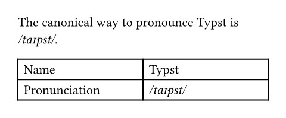

Here, we called the text function and assigned its return value to the variable. When you call a function, it processes its arguments and then yields another value (often content). So far in this tutorial, we called most functions directly in markup, like this: #text(fill: red)[CRIMSON!]. This call to the text function returns the red text as a return value. Because we placed it in markup, its return value just immediately got inserted into the content we wrote. With variables, we can instead store it to use it later or compose it with other values.

여기서 우리는 텍스트 함수를 호출하고 그 반환 값을 변수에 할당했습니다. 함수를 호출하면 함수는 인수를 처리한 후 다른 값(종종 콘텐츠)을 반환합니다. 지금까지 이 튜토리얼에서는 대부분의 함수를 마크업 내에서 직접 호출했습니다. 예를 들어: `#text(fill: red)[CRIMSON!]` 이 텍스트 함수 호출은 빨간색 텍스트를 반환값으로 반환합니다. 마크업 내에 배치했기 때문에 그 반환값은 우리가 작성한 콘텐츠에 즉시 삽입되었습니다. 변수를 사용하면 나중에 사용하거나 다른 값과 조합하기 위해 이를 저장할 수 있습니다.

Variables are not limited to storing content: they can store any data type Typst knows about. Throughout this tutorial, you made use of many data types when you passed them to Typst's built-in functions. Here is an example assigning each of them to a variable:

변수는 내용 저장에만 국한되지 않습니다: Typst가 인식하는 모든 데이터 유형을 저장할 수 있습니다. 이 튜토리얼 전반에 걸쳐 Typst의 내장 함수에 데이터를 전달할 때 다양한 데이터 유형을 활용했습니다. 다음은 각 데이터 유형을 변수에 할당하는 예시입니다:

```
// Content with markup inside
#let blind-text = [_Lorem ipsum_ dolor sit amet]

// Unformatted strings
#let funny-font = "MS Comic Sans"

// Absolute lengths (see also pt, in, ...)
#let mile = 160934cm

// Lengths relative to the font size
#let double-space = 2em

// Ratios
#let progress = 80%

// Integer numbers
#let answer = 42

// Booleans
#let truth = false

// Horizontal and vertical alignment
#let focus = center
```

In this chapter of the tutorial, you will leverage variables and your own functions to build templates that can be reused across multiple documents.

이 튜토리얼 장에는 변수와 사용자 정의 함수를 활용해서 여러 문서에 재사용할 수 있는 템플릿을 구축하는 방법을 배웁니다.


## A toy template
In Typst, templates are functions in which you can wrap your whole document. To learn how to do that, let's first review how to write your very own functions. They can do anything you want them to, so why not go a bit crazy?

Typst에서 템플릿은 문서 전체를 감쌀 수 있는 함수입니다. 이를 구현하는 방법을 알아보기 전에 먼저 여러분만의 함수를 작성하는 방법을 복습해 보겠습니다. 함수는 여러분이 원하는 모든 작업을 수행할 수 있으니 마음껏 창의력을 발휘해 보세요!

```
#let amazed(term) = box[✨ #term ✨]

You are #amazed[beautiful]!
```

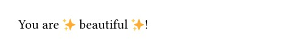

Comparing this against the previous section, you may have noticed that this looks a lot like a variable definition using let. This instinct is correct: Functions are just another data type. Here, we are defining the variable amazed, assigning it a function that takes a single argument, term, and returns content with the term surrounded by sparkles. We also put the whole thing in a box so that the term we are amazed by cannot be separated from its sparkles by a line break. The special function definition syntax makes the definition shorter and more readable, but you can also use the regular variable definition syntax (see the scripting reference for details). After its definition, we are able to call the function just like all built-in functions.

이전 섹션과 비교해 보면 이 부분이 `let` 을 사용한 변수 정의와 매우 유사하다는 점을 눈치챘을 것입니다. 이 직감은 정확합니다: 함수는 또 다른 데이터 유형일 뿐입니다. 여기서 우리는 amazed 라는 변수를 정의하고 단일 인자 term 을 받아 반짝임으로 둘러싸인 term 을 content 로 반환하는 함수를 할당하고 있습니다. 또한 전체를 하나의 블록으로 묶어 감탄의 대상인 term 이 줄바꿈으로 인해 반짝임과 분리되지 않도록 했습니다. 특수 함수 정의 구문은 정의를 보다 짧고 가독성 있게 만들어주지만 일반 변수 정의 구문도 사용할 수 있습니다. (자세한 내용은 스크립팅 참조 문서 참조) 정의 후에는 모든 내장 함수처럼 이 함수를 호출할 수 있습니다.

Many functions that come with Typst have optional named parameters. Our functions can also have them. Let's add a parameter to our function that lets us choose the color of the text. We need to provide a default color in case the parameter isn't given.

Typst에 포함된 많은 함수들은 선택적으로 명명된 매개변수를 가집니다. 우리 함수도 이를 가질 수 있습니다. 텍스트 색상을 선택할 수 있는 매개변수를 함수에 추가해 보겠습니다. 매개변수가 지정되지 않은 경우를 대비해서 기본 색상을 제공해야 합니다.

```
#let amazed(term, color: blue) = {
  text(color, box[✨ #term ✨])
}

You are #amazed[beautiful]!
I am #amazed(color: purple)[amazed]!
```

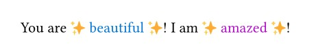

Templates now work by wrapping our whole document in a custom function like amazed. But wrapping a whole document in a giant function call would be cumbersome! Instead, we can use an "everything" show rule to achieve the same with cleaner code. To write such a show rule, put a colon directly after the show keyword and then provide a function. This function is given the rest of the document as a parameter. The function can then do anything with this content. Since the amazed function can be called with a single content argument, we can just pass it by name to the show rule. Let's try it:

템플릿은 이제 amazed 같은 사용자 정의 함수로 문서 전체를 감싸는 방식으로 작동합니다. 하지만 문서 전체를 거대한 함수 호출로 감싸는 것은 번거로울 것입니다! 대신 “모든 것” 을 처리하는 `show` 규칙을 사용하면 좀 더 깔끔한 코드로 동일한 결과를 얻을 수 있습니다. 이러한 `show` 규칙을 작성하려면 `show` 키워드 바로 뒤에 콜론을 넣고 함수를 제공합니다. 이 함수는 문서의 나머지 부분을 매개변수로 받습니다. 이 함수는 해당 콘텐츠로 어떤 작업도 수행할 수 있습니다. amazed 함수는 단일 콘텐츠 인자로 호출할 수 있으므로 이름으로 직접 쇼 규칙에 전달하면 됩니다. 한번 시도해 보겠습니다:

```
#show: amazed
I choose to focus on the good
in my life and let go of any
negative thoughts or beliefs.
In fact, I am amazing!
```

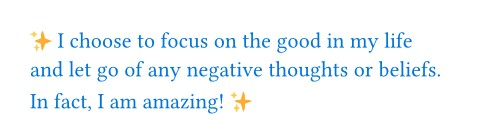

Our whole document will now be passed to the amazed function, as if we wrapped it around it. Of course, this is not especially useful with this particular function, but when combined with set rules and named arguments, it can be very powerful.

이제 전체 문서가 amazed 함수로 전달될 것입니다. 마치 그 함수를 감싼 것처럼 말이죠. 물론 이 특정 함수에서는 특별히 유용하지 않지만 설정 규칙 및 명명된 인자와 결합하면 매우 강력해질 수 있습니다.


## Embedding set and show rules
To apply some set and show rules to our template, we can use set and show within a content block in our function and then insert the document into that content block.

템플릿에 일부 `set` 및 `show` 규칙을 적용하려면 함수 내 콘텐츠 블록에서 `set` 및 `show` 를 사용한 후 해당 콘텐츠 블록에 문서를 삽입할 수 있습니다.

```
#let template(doc) = [
  #set text(font: "Inria Serif")
  #show "something cool": [Typst]
  #doc
]

#show: template
I am learning something cool today.
It's going great so far!
```

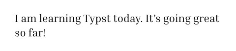

Just like we already discovered in the previous chapter, set rules will apply to everything within their content block. Since the everything show rule passes our whole document to the template function, the text set rule and string show rule in our template will apply to the whole document. Let's use this knowledge to create a template that reproduces the body style of the paper we wrote in the previous chapter.

이전 장에서 알아본 바와 같이 `set` 규칙은 해당 콘텐츠 블록 내의 모든 요소에 적용됩니다. `everything show` 규칙은 문서 전체를 템플릿 함수에 전달하므로 템플릿 내의 `text set` 규칙과 `string show` 규칙은 문서 전체에 적용됩니다. 이런 지식을 활용해서 이전 장에서 작성한 논문의 본문 스타일을 재현하는 템플릿을 만들어 보겠습니다.

```
#let conf(title, doc) = {
  set page(
    paper: "us-letter",
    header: align(
      right + horizon,
      title
    ),
    columns: 2,
    ...
  )
  set par(justify: true)
  set text(
    font: "Libertinus Serif",
    size: 11pt,
  )

  // Heading show rules.
  ...

  doc
}

#show: doc => conf(
  [Paper title],
  doc,
)

= Introduction
...
```


We copy-pasted most of that code from the previous chapter. The two differences are this:
우리는 코드의 대부분을 이전 장에서 복사해서 붙여넣었습니다. 두 가지 차이점은 다음과 같습니다:

1. We wrapped everything in the function conf using an everything show rule. The function applies a few set and show rules and echoes the content it has been passed at the end.
1. Moreover, we used a curly-braced code block instead of a content block. This way, we don't need to prefix all set rules and function calls with a #. In exchange, we cannot write markup directly in the code block anymore.

1. 우리는 모든 것을 `conf` 함수에 `everything show` 규칙을 사용해서 감쌌습니다. 이 함수는 몇 가지 `set` 및 `show` 규칙을 적용하고 마지막에 전달받은 내용을 출력합니다.
1. 또한 콘텐츠 블록 대신 중괄호로 둘러싼 코드 블록을 사용했습니다. 이렇게 하면 모든 설정 규칙과 함수 호출 앞에 `#` 을 붙일 필요가 없습니다. 대신 코드 블록 내에 직접 마크업을 작성할 수 없게 되었습니다.

Also note where the title comes from: We previously had it inside of a variable. Now, we are receiving it as the first parameter of the template function. To do so, we passed a closure (that's a function without a name that is used right away) to the everything show rule. We did that because the conf function expects two positional arguments, the title and the body, but the show rule will only pass the body. Therefore, we add a new function definition that allows us to set a paper title and use the single parameter from the show rule.

또한 제목이 어디서 오는지 주목하세요: 이전에는 변수에 있었습니다. 이제 템플릿 함수의 첫 번째 매개변수로 받게 됩니다. 이를 위해 `everything show` 규칙에 클로저(이름이 없는 함수로 즉시 사용됨)를 전달했습니다. 이렇게 처리한 이유는 conf 함수가 제목과 본문이란 두 개의 위치 매개변수를 기대하지만 `show` 규칙은 본문만 전달하기 때문입니다. 따라서 종이 제목을 설정하고 `show` 규칙의 단일 매개변수를 사용할 수 있도록 처리하는 새로운 함수 정의를 추가합니다.


## Templates with named arguments
Our paper in the previous chapter had a title and an author list. Let's add these things to our template. In addition to the title, we want our template to accept a list of authors with their affiliations and the paper's abstract. To keep things readable, we'll add those as named arguments. In the end, we want it to work like this:

이전 장의 논문에는 제목과 저자 목록이 있었습니다. 이 요소들을 템플릿에 추가해 보겠습니다. 제목 외에도 템플릿에서 저자 목록과 소속 기관, 논문 초록을 받아들일 수 있도록 처리할 것입니다. 가독성을 유지하기 위해 이 요소들을 명명된 인자로 추가하겠습니다. 최종적으로 다음과 같이 작동하도록 할 것입니다:

```
#show: doc => conf(
  title: [
    A Fluid Dynamic Model for
    Glacier Flow
  ],
  authors: (
    (
      name: "Theresa Tungsten",
      affiliation: "Artos Institute",
      email: "tung@artos.edu",
    ),
    (
      name: "Eugene Deklan",
      affiliation: "Honduras State",
      email: "e.deklan@hstate.hn",
    ),
  ),
  abstract: lorem(80),
  doc,
)

...
```

Let's build this new template function. First, we add a default value to the title argument. This way, we can call the template without specifying a title. We also add the named authors and abstract parameters with empty defaults. Next, we copy the code that generates title, abstract and authors from the previous chapter into the template, replacing the fixed details with the parameters.

이 새로운 템플릿 함수를 만들어 보겠습니다. 먼저 `title` 인수에 기본값을 추가합니다. 이렇게 처리하면 제목을 지정하지 않고도 템플릿을 호출할 수 있습니다. 또한 authors 와 abstract 매개변수에 빈 기본값을 가진 명명된 매개변수를 추가합니다. 다음으로 이전 장에서 title, abstract 및 authors 를 생성하는 코드를 템플릿으로 복사해서 고정된 세부 정보를 매개변수로 대체합니다.

The new authors parameter expects an array of dictionaries with the keys name, affiliation and email. Because we can have an arbitrary number of authors, we dynamically determine if we need one, two or three columns for the author list. First, we determine the number of authors using the .len() method on the authors array. Then, we set the number of columns as the minimum of this count and three, so that we never create more than three columns. If there are more than three authors, a new row will be inserted instead. For this purpose, we have also added a row-gutter parameter to the grid function. Otherwise, the rows would be too close together. To extract the details about the authors from the dictionary, we use the field access syntax.

새로운 저자 매개변수는 name, affiliation, email 키를 가진 사전 배열을 기대합니다. 저자의 수는 임의로 결정될 수 있으므로 저자 목록에 필요한 열 수를 동적으로 결정합니다. 먼저 authors 배열에 `.len()` 메서드를 적용해서 저자 수를 파악합니다. 그런 다음 열 수를 이 개수와 3 중에서 최소값으로 설정해서 절대 3열 이상으로  생성되지 않도록 처리합니다. 저자가 3명 이상일 경우 새로운 행이 추가됩니다. 이를 위해 그리드 함수에 `row-gutter` 매개변수도 추가했습니다. 그렇지 않으면 행 간격이 너무 좁아질 수 있습니다. 사전에서 저자 세부 정보를 추출하기 위해 필드 접근 구문을 사용합니다.

We still have to provide an argument to the grid for each author: Here is where the array's map method comes in handy. It takes a function as an argument that gets called with each item of the array. We pass it a function that formats the details for each author and returns a new array containing content values. We've now got one array of values that we'd like to use as multiple arguments for the grid. We can do that by using the spread operator. It takes an array and applies each of its items as a separate argument to the function.

각 저자에 대해 그리드에 인수를 제공해야 합니다: 이때 배열의 `map` 메서드가 유용합니다. 이 메서드는 배열의 각 항목에 대해 호출되는 함수를 인수로 받습니다. 우리는 각 저자의 세부 정보를 형식화하고 콘텐츠 값을 포함하는 새로운 배열을 반환하는 함수를 전달합니다. 이제 그리드의 여러 인자로 사용하고 싶은 하나의 값 배열을 얻었습니다. 스프레드 연산자를 사용하면 됩니다. 이 연산자는 배열을 받아 각 요소를 함수의 별도 인자로 적용합니다.

The resulting template function looks like this:

결과 템플릿 함수는 다음과 같습니다:

```
#let conf(
  authors: (),
  abstract: [],
  doc,
) = {
  // Set and show rules from before.
  ...

  place(
    top + center,
    float: true,
    scope: "parent",
    clearance: 2em,
    {
      title()

      let count = authors.len()
      let ncols = calc.min(count, 3)
      grid(
        columns: (1fr,) * ncols,
        row-gutter: 24pt,
        ..authors.map(author => [
          #author.name \
          #author.affiliation \
          #link("mailto:" + author.email)
        ]),
      )

      par(justify: false)[
        *Abstract* \
        #abstract
      ]

    }
  )

  doc
}
```


## A separate file
Most of the time, a template is specified in a different file and then imported into the document. This way, the main file you write in is kept clutter free and your template is easily reused. Create a new text file in the file panel by clicking the plus button and name it conf.typ. Move the conf function definition inside of that new file. Now you can access it from your main file by adding an import before the show rule. Specify the path of the file between the import keyword and a colon, then name the function that you want to import.

대부분의 경우 템플릿은 별도의 파일에 정의한 후 문서로 가져옵니다. 이렇게 하면 작성 중인 메인 파일은 깔끔하게 유지되고 템플릿을 쉽게 재사용할 수 있습니다. 파일 패널에서 더하기 버튼을 클릭해서 새로운 텍스트 파일을 생성하고 이름을 `conf.typ` 로 지정합니다. conf 함수 정의를 이 새 파일 안으로 모두 이동시킵니다. 이제 메인 파일에서 `show` 규칙 앞에 `import` 문을 추가해서 이를 호출할 수 있습니다. `import` 키워드와 콜론 사이에 파일 경로를 명시하고 가져올 함수 이름을 지정합니다.

Another thing that you can do to make applying templates just a bit more elegant is to use the .with method on functions to pre-populate all the named arguments. This way, you can avoid spelling out a closure and appending the content argument at the bottom of your template list. Templates on Typst Universe are designed to work with this style of function call.

템플릿 적용을 좀 더 우아하게 만드는 또 다른 방법은 함수에 `.with` 메서드를 사용해서 모든 명명된 인수를 미리 채우는 것입니다. 이렇게 처리하면 클로저를 명시적으로 작성하고 템플릿 목록 맨 아래에 content 인수를 추가하는 작업을 피할 수 있습니다. Typst Universe의 템플릿은 이러한 스타일의 함수 호출과 함께 작동하도록 설계되었습니다.

```
#import "conf.typ": conf

#set document(title: [
  A Fluid Dynamic Model for
  Glacier Flow
])

#show: conf.with(
  authors: (
    (
      name: "Theresa Tungsten",
      affiliation: "Artos Institute",
      email: "tung@artos.edu",
    ),
    (
      name: "Eugene Deklan",
      affiliation: "Honduras State",
      email: "e.deklan@hstate.hn",
    ),
  ),
  abstract: lorem(80),
)

= Introduction
#lorem(90)

== Motivation
#lorem(140)

== Problem Statement
#lorem(50)

= Related Work
#lorem(200)
```

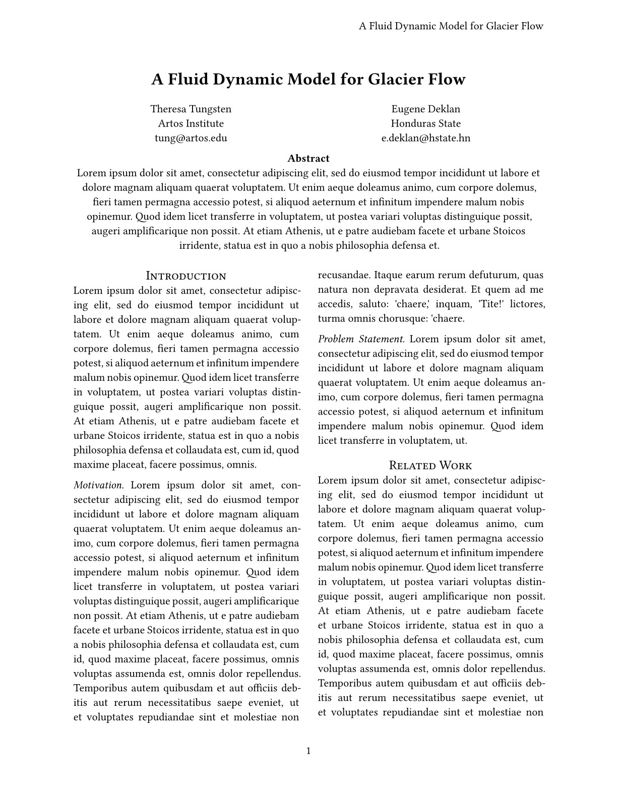

We have now converted the conference paper into a reusable template for that conference! Why not share it in the Forum or on Typst's Discord server so that others can use it too?

이제 해당 학회 발표 논문을 재사용 가능한 템플릿으로 변환했습니다! 포럼이나 Typst의 디스코드 서버에 공유하여 다른 분들도 활용할 수 있도록 해보는 건 어떨까요?


## Review
Congratulations, you have completed Typst's Tutorial! In this section, you have learned how to define your own functions and how to create and apply templates that define reusable document styles. You've made it far and learned a lot. You can now use Typst to write your own documents and share them with others.

축하합니다, Typst 튜토리얼을 완료하셨습니다! 이 섹션에서는 사용자 정의 함수를 정의하는 방법과 재사용 가능한 문서 스타일을 정의하는 템플릿을 생성하고 적용하는 방법을 배웠습니다. 지금까지 열심히 노력하셨고 많은 것을 배우셨습니다. 이제 Typst를 사용하여 직접 문서를 작성하고 다른 사람들과 공유할 수 있습니다.

We are still a super young project and are looking for feedback. If you have any questions, suggestions or you found a bug, please let us know in the Forum, on our Discord server, on GitHub, or via the web app's feedback form (always available in the Help menu).

우리는 아직 매우 초기 단계의 프로젝트이며 피드백을 기다리고 있습니다. 질문, 제안 사항 또는 버그를 발견하셨다면 포럼, 디스코드 서버, GitHub 또는 웹 앱의 피드백 양식(도움말 메뉴에서 항상 이용 가능)을 통해 알려주시기 바랍니다.

So what are you waiting for? Sign up and write something!
그럼 뭘 기다리고 있나요? 가입하고 글을 써보세요!


