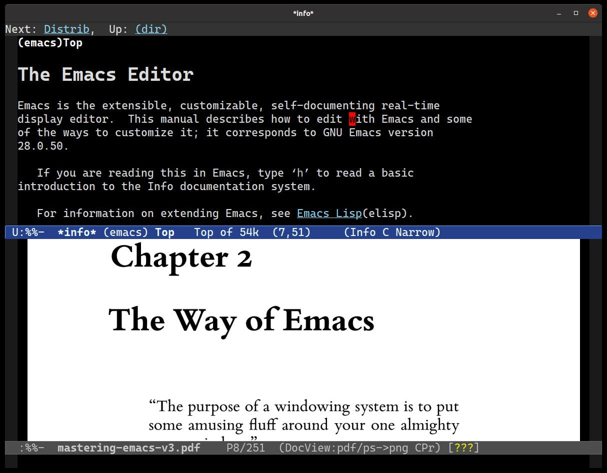
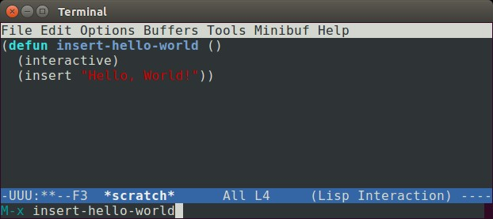
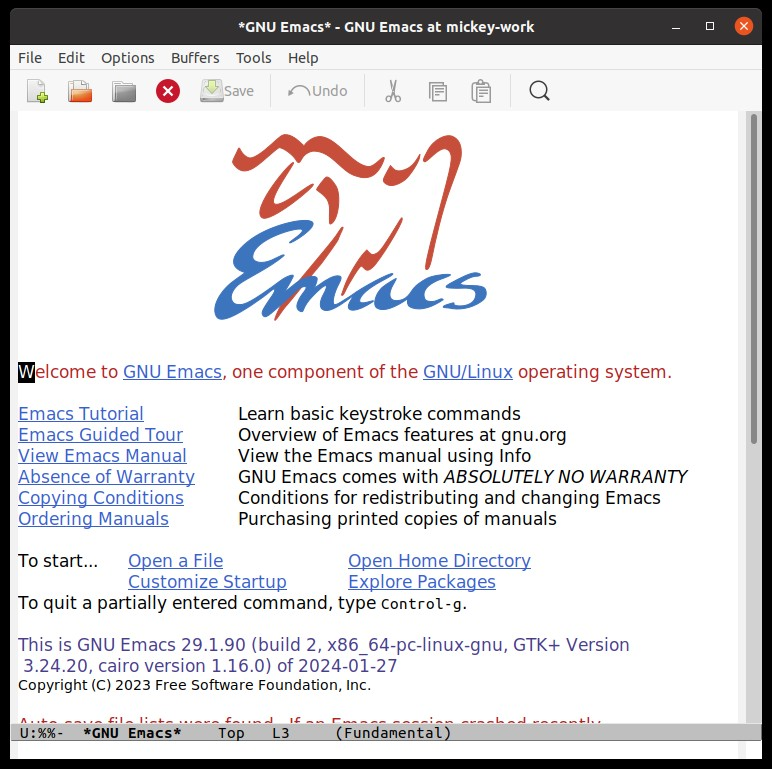
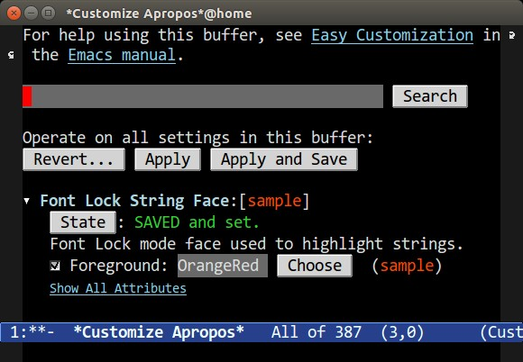
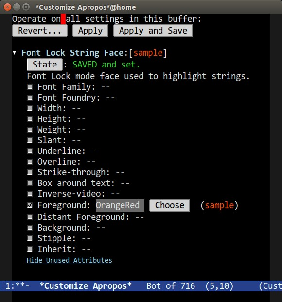

# Mastering Emacs

# Chapter 1. Introduction

> “저는 리눅스를 쓰고 있어요.
> 이맥스(Emacs)가 인텔 하드웨어와 통신할 때 사용하는 라이브러리죠.”
>
> – Erwin, #emacs, Freenode.


## Thank You
『Mastering Emacs』 를 구매해 주셔서 감사합니다. 이 책은 오랜 시간 준비해 온 결과물입니다. 2010년 제 블로그에 『Mastering Emacs』 를 시작하게 된 것은, 친한 친구인 리(lee)가 제게 Emacs와 Emacs 작업 흐름에 대한 생각을 공유해 보라고 권유해 주었기 때문입니다. 그 당시 저는 'blogideas.org' 라는 org 모드 파일에 제가 배운 내용과 누군가 가르쳐 주었으면 좋겠다고 생각했던 아이디어와 개념들을 방대하지만 무작위로 모아두었습니다. 그 파일의 최종 결과물이 바로 그 블로그였고, 이제 이 책이 되었습니다.

### Special Thanks
다음 분들께... 격려와 조언, 제안, 그리고 비판을 보내주신 데 대해 감사의 말씀을 전합니다:

```
Akira Kitada, Alvaro Ramirez, Arialdo Martini,
Bob Koss, Catherine Mongrain, Chandan
Rajendra, Christopher Lee, Daniel Hannaske,
Edwin Ong, Evan Misshula, Friedrich Paetzke,
Gabriela Hajduk, Gabriele Lana, Greg Sieranski,
Holger Pirk, John Mastro, John Kitchin, Jonas
Enlund, Konstantin Nazarenko, Lee Cullip,
Luis Gerhorst, Lukas Pukenis, Manuel Uberti,
Marcin Borkowski, Mark Kocera, Matt Wilbur,
Matthew Daly, Michael Reid, Nanci Bonfim,
Oliver Martell, Patrick Mosby, Patrick Martin,
Sebastian Garcia Anderman, Stephen Nelson-
Smith, Steve Mayer, Tariq Master, Travis
Jefferson, Travis Hartwell.
```
많은 사람들과 마찬가지로, 저도 Emacs에 대해 아무것도 모르는 상태에서 그 세계로 내몰리게 되었습니다. 제 경우, 대학 1학년 때였는데, 당시 학교 컴퓨터 동아리는 대부분 Vim 사용자들로 구성되어 있었습니다. 저에게 “Vim을 써야 해, 그게 다야!” 라고 단호하게 말해졌습니다. 누군가에게 지시를 받는 것을 원치 않았던 저는 Vim과 정반대인 `Emacs` 를 선택했습니다.

Emacs는 오랜 세월 동안 안정적이고 믿을만한 편집기임이 입증되었지만, 익히기에는 꽤 까다로운 도구였습니다. 방대한 사용자 설명서가 있었음에도 불구하고, Emacs를 배우고 이해하는 데는 전혀 도움이 되지 않았습니다.


## 2024 Edition Update
`Emacs 29` 는 기술의 발전에 발맞추는 오랜 추세를 여전히 이어가고 있습니다. 이는 칭찬할만한 일입니다. Emacs는 오래된 소프트웨어임에도 불구하고 끊임없이 개선되고 있습니다.

텍스트 편집기에서 제대로 구현하기 가장 어려운 기능 중 하나는 구문 강조(Emacs 용어로 fontlocking)와 견고한 들여쓰기 엔진입니다. 보시다시피, Emacs와 다른 많은 편집기(구형 및 신형 모두)가 소스 코드의 구문을 강조할 때, 패턴 매칭을 통해 텍스트를 일치시키는 간결한 방법인 정규 표현식을 사용합니다. 정규 표현식은 훌륭합니다. 텍스트에서 중요한 정보를 일치시키고 추출하는 간결한 방법이기 때문입니다. 거의 모든 곳에서 구문 강조기의 핵심을 이루지만, 단점도 있습니다. 부정확할 수 있으며, 잘못 작성되면 성능을 저하시킬 수 있습니다.

하지만, 좋은 소식이 있습니다. Emacs 29는 tree-sitter[^1] 에 대한 선택적 지원을 추가했는데, 이는 소스 코드 파싱에 있어 눈썰미 뛰어난 파서 라이브러리로, 유효한 문법이 정의된 텍스트라면 어떤 것이든 구체적인 구문 트리(Concrete Syntax Tree)를 구축합니다. 이런 트리는 컴퓨터(또는 의욕적인 사용자)가 쿼리를 수행하기에 완벽한 매체입니다. 이를 통해 수십 줄의 코드만으로 정확한 구문 강조 표시가 가능해집니다. 또한 구조화된 편집 및 이동이라는 매력적인 가능성을 제시하는데, 이는 Tree-sitter 가 생성하는 트리 형태의 구조를 재사용해서 코드베이스 내에서 타의 추종을 불허하는 편집 및 이동 기능을 제공하는 광범위한 개념입니다.

[^1]: 'Tree-Sitter 시작하기' 에 관한 제 글은 Tree-Sitter를 사용할 수 있도록 Emacs를 설정하는 데 도움이 될 것입니다.

Tree-sitter 가 유일한 선택지는 아닙니다. Tree-sitter 가 제시하는, 그리고 (Emacs 및 그 외의 분야에서) 대부분의 다른 시도들이 달성하지 못한 점은, 흔한 언어와 드문 언어, 그리고 구조화된 텍스트 파일을 위한 가장 방대한 파서 저장소를 갖추고 있다는 것입니다. 따라서, Tree-sitter 는 유능하며 인기가 많습니다. Tree-sitter 의 툴링을 사용해서 자신만의 파서를 작성하는 것이 꽤 간단하다는 점도 도움이 됩니다. 그야말로 쐐기를 박는 장점은 생성된 파싱 트리의 특정 세그먼트를 신속하게 찾아내고 일치시키는 쿼리 언어입니다. 이것이 아마도 이 도구의 숨겨진 비장의 무기입니다. 예를 들어, 주어진 이름을 가진 변수를 하나 이상 포함하는 모든 함수를 보여달라고 요청할 수 있다는 점은 확실히 강력한 기능입니다. LISP 언어의 S-표현식을 모델로 한 이 쿼리 언어는 Emacs 생태계에도 자연스럽게 어우러집니다.

현재 이 기능은 선택 사항입니다. tree-sitter 지원을 포함하도록 Emacs를 컴파일해야 하기 때문입니다. 따라서, 이 기능이 기존의 메이저 모드나 기존의 작업 방식을 일괄적으로 대체할 가능성은 낮습니다. 하지만, 이 기능은 구문 강조 및 들여쓰기 코드를 작성하는 일을 정말 쉽게 만들어 주므로 Emacs에 있어선 커다란 진전입니다.[^2] 이 기능이 Emacs 코어에 통합된 것은 긍정적인 발전이며, Emacs는 근본적으로 변할 수 없다는 고정관념에 대한 반박이기도 합니다. Emacs의 폰트 록킹은 대략 35년 전에 처음 도입되었으며, 이제 기존의 정규 표현식보다 새로운 방식, 그리고 종종 훨씬 더 나은 방식이 등장했습니다. 이 기능이 Emacs에 성공적으로 통합된 사실은 좀 더 넓은 Emacs 커뮤니티에도 반영되고 있는데, Tree-Sitter 가 Emacs에 새로 도입된 기능이라 설정과 사용이 번거롭다는 점에도 불구하고 인기있는 기능임이 입증되었기 때문입니다.

[^2]: 저는 ‘Let’s Write a Tree-Sitter Major Mode’ 라는 글에서 tree-sitter 를 활용하기 위해 직접 메이저 모드를 작성하는 방법에 대해 다뤘습니다.

또 다른 주요 기능은 언어 서버 프로토콜(LSP)을 지원하는 클라이언트인 Eglot 입니다. Eglot 은 언어 서버를 사용할 수 있는 모든 버퍼에 IDE와 유사한 기능을 추가합니다. 이 기능은 기본 Emacs와 필요한 언어 서버만 있으면 작동하도록 설계되었습니다. 언어 서버가 설정되어 있다면, 시작하기 위해 입력할 것은 `M-x eglot` (또는 Tools -> Language Server Support 선택) 뿐입니다. Eglot 은 Emacs 패키지 저장소인 ELPA에서 오랫동안 제공되어 왔습니다. 이제 Emacs에 내장되었습니다. 이 두 가지 기능은 흥미로운 개선 사항과 수정 사항으로 가득 찬 이번 릴리스의 핵심 사항입니다. 아직 Emacs 29를 사용하고 있지 않다면, 반드시 업그레이드해야 합니다.


## Intended Audience
이미 이 책을 구입한 상태에서 대상 독자층에 대해 이야기하는 건 이상할 수 있습니다. 하지만, 어쨌든 언급할 필요가 있습니다. 여러분의 Emacs 숙련도와 상관없이 이 책에서 무언가 얻어가실 수 있을 테니까요.

첫 번째(가장 명백한) 대상 독자층은 Emacs를 처음 접하는 분들입니다. 평생 Emacs를 한 번도 사용해 본 적이 없다면, 이 책이 큰 도움이 되기를 바랍니다. 하지만, Emacs가 처음이고 기술적인 배경이 없다면, 다소 어려움을 겪을 수 있습니다. Emacs는 단순한 프로그래밍 이상의 용도로 적합하지만, 본질적으로 컴퓨터에 익숙한 사람을 주 대상으로 하고 있습니다. 물론 기술적인 배경이 없더라도 Emacs를 사용하는 데는 아무런 문제가 없지만, 이 책은 독자가 기술적인 소양이 있다고 가정하되, 반드시 프로그래머일 필요는 없습니다.

이전에 Emacs를 사용했지만 포기하셨다면, 이 책이 계속 사용하도록 설득해 주기를 바랍니다. 하지만, 그렇지 않더라도 괜찮습니다. (많은 Emacs 사용자들이 주장하는 것과는 달리) 일부 언어나 환경은 Emacs와 맞지 않기 때문입니다. 주로 Visual Studio를 사용하는 Microsoft Windows 개발자라면, Emacs를 사용하는 것은 두 걸음 전진하고 한 걸음 후퇴하는 상황이 될 것입니다. 즉, 전례없는 텍스트 편집 기능과 도구 통합을 얻겠지만, 통합 IDE가 제공하는 이점 중 일부는 잃게 될 것입니다.

Vim에서 넘어오신 분이라면, 어둠의 세계에 오신 것을 환영합니다! 만약 여러분의 주된 목표가 Emacs의 Vim 에뮬레이션 레이어를 사용하는 것이라면, 이 책의 일부 내용은 중복될 수 있습니다. 하지만, 이 책은 기본 Emacs 키 바인딩에 초점을 맞추고 있으며, “Emacs 방식" 에 대해 가르칩니다. 하지만, 걱정하지 않아도 됩니다. 이 책에 담긴 수 많은 팁과 조언은 여전히 유용하며, 어쩌면 언젠가 Evil 모드에서 벗어나게 될지도 모릅니다.

마지막으로, 이미 Emacs를 사용하고 있지만 한 단계 더 발전하는 데 어려움을 겪고있거나, 혹은 “처음부터” 다시 배우고 싶은 분이라면, 이 책은 여러분을 위한 책이기도 합니다.


## What You’ll Learn
단 한 권의 책으로 Emacs의 모든 기능을 다룬다는 것은 시지프스식 노동과도 같은 일입니다. 대신, 저는 Emacs가 할 수 있는 수 많은 기능 중 극히 일부에 불과한, Emacs에서 생산적으로 작업하는 데 필요한 내용만 가르쳐 드리고자 합니다. 이 책을 다 읽고 꾸준히 연습한다면, 여러분은 Emacs에 대해 충분히 이해하면서, 이 편집기에 대한 궁금증을 스스로 찾아내고 해결할 수 있게 될 것입니다.

좀 더 구체적으로, 저는 크게 여섯 가지 주제를 다룹니다:

- **What Emacs is about** : Emacs가 사용하는 중요한 용어와 관례에 대한 상세한 설명입니다. 이들은 다른 편집기들과는 많은 경우 크게 다릅니다. 또한 Emacs의 철학이 무엇인지, 그리고 텍스트 편집기에 왜 철학이 필요한지 알아보게 될 것입니다. 아울러 Vim에 대해 간략히 다루고, ‘에디터 전쟁’ 에 대해 이야기하며, 그 다양한 키들의 용도가 무엇인지 설명하겠습니다.

- **Getting started with Emacs** : Emacs 설치 방법, 실행 방법, 그리고 비교적 최신 버전의 Emacs를 사용하고 있는지 확인하는 방법을 다룹니다. 또한 Emacs를 수정하는 방법과 변경 사항을 영구적으로 적용하기 위해 필요한 절차도 설명합니다. Customize 인터페이스를 소개하고 사용자 정의 색상 테마를 불러오는 방법을 설명하겠습니다. 마지막으로, Emacs의 사용자 인터페이스와 무언가 막힐 때 유용한 팁들에 대해 다루겠습니다.

- **Discovering Emacs** : Emacs는 자체 문서화 기능을 갖추고 있습니다. 하지만, 이것이 정확히 무엇을 의미하며, 이런 특성을 어떻게 활용하면 Emacs에 대해 좀 더 깊이 이해하거나 특정 기능에 대한 의문점을 해결할 수 있을까요? 저는 Emacs에서 새로운 모드나 기능의 사용법을 익힐 때 제가 실제로 어떻게 했는지 보여드리고, 여러분이 찾는 정보를 찾기 위해 Emacs의 자체 문서화 기능을 어떻게 활용할 수 있는지 설명해 드리겠습니다.

- **Movement** : Emacs에서 이동하는 방법은 언뜻 보기에 간단해 보이지만, Emacs는 현재 위치에서 가야할 곳까지 가능한 한 적은 키 입력으로 이동할 수 있는 방법이 많습니다. 화면 이동은 개발자에게 있어 작업의 절반을 차지한다고 할 수 있으며, 이를 빠르게 수행하는 방법을 안다면 업무 효율은 크게 향상될 것입니다. 이 글에서 구문 단위별 이동과 구문 단위가 정확히 무엇인지; 창과 버퍼 사용법; 텍스트 검색 및 색인 생성; 텍스트 선택 및 마크 사용법에 대해 배웁니다.

- **Editing** : 이전 ‘Movement’ 장과 마찬가지로, Emacs가 제공하는 다양한 도구를 활용해서 텍스트를 편집하는 방법을 보여드리겠습니다. 여기에는 문장, 단어, 줄, 단락 단위로 텍스트를 편집하는 방법, 반복 작업을 자동화하기 위한 키보드 매크로 생성, 검색 및 바꾸기, 레지스터, 다중 파일 편집, 약어, 원격 파일 편집 등이 포함됩니다.

- **Productivity** : Emacs는 단순히 텍스트를 편집하는 것 이상의 기능을 제공하며, 이 장은 수 많은 사람들이 Emacs에 매료되는 이유, 즉 수백 가지 외부 도구와의 긴밀한 통합을 살짝 맛보게 해줄 뿐입니다. 저는 여러분의 호기심을 자극하고, Emacs의 동작과 편집 기능을 조화롭게 활용했을 때 처리할 수 있는 좀 더 흥미로운 기능 몇 가지를 보여드리겠습니다.


<br><br>
# Chapter 2. The Way of Emacs

> “윈도잉 시스템의 목적은 당신의 그 유일무이한
> emacs 창 주위에 재미있는 소소한 요소들을 배치하는 것입니다.”
>
> – Mark, gnu.emacs.help.

1960년대로 거슬러 올라가는 현대 컴퓨팅 시대의 시작을 떠올리면, Emacs는 그 어떤 것보다 훨씬 더 오랫동안 우리 곁에 있어 왔습니다. 이 프로그램은 1976년 리처드 스톨먼이 `TECO` [^3] 라는 편집기 위에 매크로 세트로 처음 작성했습니다. TECO는 매우 난해한 프로그램으로 기억됩니다. 그 이후로 Emacs의 수 많은 경쟁 구현체가 등장했지만, 오늘날에는 `XEmacs` 와 `GNU Emacs` 만 접할 가능성이 높습니다.

[^3]: 1 https://www.gnu.org/software/emacs/manual/html_mono/efaq.html#Origin-of-the-term-Emacs

이 책은 GNU Emacs 에 대해서만 초점을 맞출 것입니다. 한때 XEmacs는 좀 더 발전되고 기능도 풍부한 편집기였지만, 이제 더 이상 그렇지 않습니다. 저는 GNU Emacs에 없는 수 많은 새로운 기능을 갖춘 XEmacs로 Emacs 여정을 시작했습니다.

XEmacs와 GNU Emacs의 역사는 흥미롭습니다. 이는 자유 소프트웨어 프로젝트에서 발생한 최초의 주요 포크[^4] 중 하나였습니다. XEmacs는 현재 GNU Emacs에서 당연하게 여겨지는 많은 기능을 선도했으며, 90년대에 XEmacs가 부상하면서 두 프로젝트 간에 치열한 경쟁이 벌어졌고, 이는 결국 사용자에겐 이익이 되었습니다. GNU Emacs의 개발은 90년대 후반과 2000년대 초반에 주춤하기 시작했으나, 현재는 그 어느 때보다 활발하게 진행되고 있습니다. 2000년대 후반 이후, XEmacs의 개발은 더 이상 유지보수되지 않을 정도로 쇠퇴했습니다.

[^4]: https://www.jwz.org/doc/lemacs.html

> [!NOTE]
> 대부분의 사람들에게 ‘Emacs’ 라는 단어는 구체적으로 `GNU Emacs` 를 가리킵니다. 저는 서로 다른 구현체를 구분할 때만 전체 이름을 명시할 것입니다. 제가 `Emacs` 라고 언급할 때는 항상 `GNU Emacs` 를 의미합니다.

Emacs가 오랜 역사를 지닌 탓에 여러 가지… 특이한 점이 있습니다. 이상한 용어 선택이나 시대 착오적인 표현들이 여전히 남아있는 이유는, 대부분의 경우 Emacs가 수십 년 동안 에디터-IDE 분야의 흐름을 앞서 나갔기 때문에 각 기능에 대해 독자적인 용어를 만들어야 했기 때문입니다. Emacs만의 전문 용어를 누구나 익숙한 단어로 바꾸자는 논의도 있지만, 그것이 실현된다 해도 아직 갈 길이 멀다고 할 수 있습니다.

마케팅은 부족하고, Emacs 개발자 수는 적으며, 현대적인 개인용 컴퓨터 시대 이전의 구식 개념과 용어가 사용되고 있음에도 불구하고, 세상에는 여전히 Emacs 사용을 사랑하는 사람들이 많습니다. Emacs의 강점은 그런 적응 능력에 있습니다. 여기서 말하는 '그런' 은 단순히 소프트웨어뿐만 아니라, Emacs의 방향을 정하는 수 많은 자원봉사 유지보수자와 기여자들을 뜻합니다. 그들은 대부분의 사용자보다 더 오래된 제품의 한계 속에서도, 세상의 변화에 뒤처지지 않기 위해 지칠 줄 모르고 일을 합니다. 굳어버린 Emacs 커뮤니티와 플랫폼에 대한 신화는 그저 신화에 불과합니다.

이 장은 ‘이맥스의 길’ 에 대해 이야기할 것입니다. 여기에는 용어와 이맥스가 많은 사람들에게 어떤 의미인지, 그리고 이맥스의 기원을 이해하는 것이 왜 이맥스를 받아들이는 데 도움이 되는지에 대해 다룰 것입니다.


## Guiding Philosophy
Emacs는 ‘만지작거리는’ 사람을 위한 편집기입니다. 그 이상도 이하도 아닙니다. 사람들이 Emacs를 개조하려는 이유는 이 편집기의 거의 모든 측면을 확장 가능하기 때문입니다. Emacs는 최초의 확장 가능하고, 사용자 정의가 가능하며, 자동 설명 기능을 갖춘 편집기입니다. 사실, 이것이 바로 Emacs의 공식 슬로건이기도 합니다. 다른 텍스트 편집기를 사용한 사람이라면, 무엇이든 바꿀 수 있다는 생각이 업무에 불필요한 방해 요소가 될 수 있다고 여길 수 있습니다. 실제로 많은 Emacs 해킹 작업이 본업에 지장을 주면서 이루어지기도 합니다. 하지만, 편집기를 자신이 원하는대로 만들 수 있다는 사실을 깨닫는 순간, 무한한 가능성의 세계가 열립니다.

즉, Emacs의 모든 키를 자신의 취향에 맞게 자유롭게 재설정할 수 있다는 뜻입니다. IDE의 문서화되지 않은 버그 투성이 API나, 설정을 변경했을 때 따르는 제한 사항들—예를 들어 사용자 정의 탐색 키가 검색 및 바꾸기 창이나 내부 도움말 버퍼에서 제대로 작동하지 않는 문제 같은 것들—에 얽매이지 않아도 됩니다. 정말로, Emacs는 모든 것을 바꿀 수 있으며, 실제로 많은 사람들이 그렇게 하고 있습니다. Vim 사용자들이 Emacs로 옮겨가는 이유는, 글쎄요, Emacs가 종종 Vim보다 더 나은 Vim이기 때문입니다.

Emacs는 당신을 매료시킵니다. 일단 Emacs를 사용하기 시작하면, IRC, 이메일, 데이터베이스 접속, 생각 정리, 명령줄 셸, 코드 컴파일, 인터넷 서핑까지 모두 텍스트 편집만큼 쉽다는 것을 깨닫게 됩니다. 게다가 키 바인딩, 테마, 그리고 모든 것의 동작을 구성하거나 변경할 수 있는 Emacs와 elisp의 모든 기능을 그대로 유지할 수 있습니다.

그리고 그 모든 것이 매끄럽게 통합되면, 애플리케이션을 오가면서 겪는 컨텍스트 전환을 피할 수 있습니다: Emacs 사용자 대부분은 편집기, 웹브라우저, 그리고 어쩌면 전용 터미널 애플리케이션 정도만 사용합니다.

> [!NOTE]
> **Emacs's History** : Emacs의 소스 코드 저장소(현재 Git 기반)는 30년 이상의 역사를 자랑하며, 13만 건이 넘는 커밋과 600명에 가까운 커미터가 참여하고 있습니다.

Emacs나 사용 가능한 수 많은 패키지 중 하나를 수정하려면, Emacs Lisp(비공식적으로 `elisp` 라고도 함)을 사용해야 합니다. Emacs에 다른 언어를 접목하려는 시도가 몇 차례 있었지만, 지속적인 성과를 거두지는 못했습니다. 결과적으로 LISP 언어는 Emacs 같은 매우 고급 도구를 위한 완벽한 추상화 언어임이 밝혀졌습니다. 그리고 대부분의 현대 언어는 반드시 시간의 검증을 견뎌낼 수 있는 것은 아닙니다. TCL 언어의 경우은 90년대 인기가 있었기 때문에 잠시 고려되기도 했지만, 오늘날에는 LISP보다 훨씬 더 생소해진 것이 특징입니다.

유일한 단점은 Emacs 설정을 만지작거리는 일은 어쩔 수 없이 익숙해져야 할 부분이라는 점입니다(LISP도 마찬가지지만, 다음 부분에서 설명하겠지만 사실 그건 좋은 일입니다). 그래서 제가 이 편집기가 ‘만지작거리는 것을 좋아하는 사람’ 을 위한 편집기라고 강조했던 것입니다. 만약 설정 건드리는 것을 싫어하고 모든 것이 설치 즉시 완벽하게 작동하기를 원한다면, 남은 선택지는 두 가지 뿐입니다:

**Use a starter kit** : 추가 패키지와 작성자가 합리적이라 생각하는 기본 설정이 포함된 무료 스타터 키트가 많이 있습니다. 이런 스타터 키트는 시작하기에 좋은 방법일 수 있지만, Emacs의 기능이 어디서 끝나고 스타터 키트의 추가 기능이 어디서 시작되는지 구분하기 어렵다는 점에 유의해야 합니다.

다음 스타터 키트 중 하나를 살펴보시길 권장합니다:

- Crafted Emacs
https://github.com/SystemCrafters/crafted-emacs

- Steve Purcell의 .emacs.d
https://github.com/purcell/emacs.d

- Bozhidar Batzov의 Prelude
https://github.com/bbatsov/prelude

Vim에 강한 편향을 가진 독창적인 키트를 원하신다면:

• Doom Emacs
https://github.com/hlissner/doom-emacs

**Use the defaults** : 물론 하나의 선택지이긴 하지만, Emacs는 중립적이면서 구식인 기본 설정으로 제공됩니다. 사용자는 자신의 취향에 맞게 Emacs를 설정하거나 다른 사람에게 그 작업을 맡겨야 합니다. 주류 편집기들과 너무나도 극명하게 다른 이 편집기의 경우, 개발자들은 기존 사용자층(그들야말로 Emacs 설정 방법을 가장 잘 알고 있어야 할 사람들인데도 말입니다)을 불편하게 할까봐 기본 설정 변경에 신중을 기합니다.

개인적으로 저는 스타터 키트를 사용해 본 적이 없습니다. 제가 대략 20년 전 시작했을 당시에는 지금처럼 스타터 키트가 존재하지 않았기 때문입니다. 그 대신, 당시 우리가 '.emacs 파일' 이라 부르던 다른 사람들의 파일을 많이 참고했습니다.

이런 접근 방식은 에디터를 처음부터 끝까지 이해하고 싶은 사람들에게 아주 적합합니다. *Crafted Emacs* 같은 스타터 키트를 적어도 한 번 정도는 시도해 보시길 권합니다. 비록 그대로 채택하지 않더라도, Emacs가 얼마나 유연하게 설정 가능한지 감을 잡을 수 있을 테니까요. 배울 것은 언제나 더 있고, 발견할 새로운 것들도 항상 있습니다.


### LISP?
Emacs는 ‘Emacs Lisp’ 또는 줄여서 ‘elisp’ 이라 불리는 자체 LISP 구현체를 기반으로 작동합니다. 많은 사람들이 이런 난해한 언어 때문에 주저하거나 겁을 먹곤 하는데, 이는 정말 안타까운 일입니다. 왜냐하면 LISP를 하나의 독립된 기계로 간주하는 개념을 바탕으로 구축된 이 편집기를 통해 LISP를 배우는 것은 실용적이면서 재미있는 방법이기 때문입니다. Emacs의 모든 부분은 검토, 평가 또는 수정할 수 있습니다. 왜냐하면 이 편집기는 대략 95%가 elisp이고 5%가 C 코드이기 때문입니다. 또한 이는 급진적인 패러다임을 배우는 실용적인 방법이기도 합니다. 즉, 코드와 데이터는 상호 교환 가능하고 유연하며, 이 언어는 간단한 구문 덕분에 매크로를 통해 쉽게 확장할 수 있다는 점입니다.

안타깝게도 언젠가는 엘리스프(Elisp)를 배워야 합니다. 이 책에는 Emacs의 사용자 정의 옵션을 동적으로 생성하는 인터페이스인 ‘Customize’ 에 대해 다룹니다. 하지만, 키를 재할당하는 것처럼 단순한 작업조차 엘리스프와 상호작용해야 함을 의미합니다. 하지만, 전혀 나쁜 것만은 아닙니다. 여러분이 마주칠 가능성이 높은 문제 대부분은 이미 오래전에 다른 누군가에 의해 해결되었기 때문입니다. 인터넷에서 여러분의 문제에 대한 해결책을 찾는 것만으로 충분합니다.

파이썬, 루비, 자바스크립트 같은 보다 “현대적인” 언어에 비해 엘리스프(Elisp)가 상대적으로 인기는 적긴 하지만, 만약 좀 더 전통적인 명령형/객체 지향 언어가 사용되었다면 이맥스(Emacs)가 지금과 같은 강력한 확장성을 갖출 수 있었을지는 의문입니다. `LISP` 언어를 그토록 훌륭한 언어로 만드는 이유는 소스 코드와 데이터 구조가 본질적으로 하나이기 때문입니다. 사람이 읽는 LISP 소스 코드는 LISP이 데이터 구조로서 코드를 조작하는 방식과 거의 동일합니다. “데이터란 무엇인가?” 와 “코드란 무엇인가?” 라는 두 가지 질문 사이의 구분은 사실상 존재하지 않습니다.

데이터-에즈-코드(data-as-code), 매크로 시스템, 그리고 임의의 함수에 “어드바이스(advise)” 를 적용할 수 있는 기능—즉, 원본을 복사하거나 수정하지 않고도 기존 코드의 동작을 변경할 수 있다는 뜻—은 사용자의 필요에 맞게 Emacs를 변경할 수 있는 전례없는 능력을 제공합니다. 대부분의 소프트웨어 프로젝트에서 코드 스멜이나 부실한 아키텍처로 간주될만한 요소들이 사실 Emacs에서는 커다란 장점이 됩니다. 다른 사람이 작성한 소스 코드의 방대한 부분을 다시 작성할 필요없이, 사용자의 필요에 맞게 Emacs의 기존 루틴을 훅(hook)으로 연결하거나, 교체하거나, 수정할 수 있기 때문입니다.

이 책은 엘리스프(Elisp)를 아주 상세하게 다루지는 않을 것입니다. 이맥스(Emacs)에는 기본으로 제공되는 엘리스프 입문 자료[^5]가 있으니, 관심이 있다면 꼭 읽어보시길 강력히 추천합니다. 솔직히 말해서, 여러분은 관심을 가져야 합니다. LISP는 재미있고, 실용적인 환경에서 이 강력한 언어를 배우고 활용하는 데 더할 나위 없이 좋은 방법입니다. 괄호 때문에 겁먹지 마세요; 사실 괄호는 이 언어의 가장 큰 장점입니다.

[^5]:  https://www.gnu.org/software/emacs/manual/eintr.html


#### Emacs as an Operating System
Emacs는 반짝거리는 물건들로 가득한 까치 둥지 같습니다. 만약 여러분이 Emacs를 처음 접한다면 제가 비유를 좀 지나치게 끌었다고 생각할 수도 있지만, Emacs에는 `M-x zone` 을 통해 실행되는 내장 스크린세이버, 텍스트 어드벤처 게임인 `M-x dunnet`, `M-x tetris` 클론, 본격적인 클라이언트-서버 모델인 달의 위상 계산기, `M-x doctor` 에 포함된 심리 치료사, 여러 이메일 클라이언트, ASCII 아트를 그릴 수 있는 아티스트 모드까지 갖추고 있다는 점을 생각해 보시기 바랍니다. 심지어 EPUB 리더인 `nov` 패키지를 사용하면 이 책을 Emacs 내에서 직접 읽을 수도 있습니다.

Emacs를 실행하면 사실상 운영체제 ABI와 저수준으로 상호작용하는 작은 C 코어를 시작하는 셈입니다. 여기에는 파일 시스템 및 네트워크 접근 같은 기본적인 작업은 물론, 화면에 내용을 표시하거나 터미널에 제어 코드를 출력하는 작업도 포함됩니다.

하지만, Emacs의 초석은 elisp 인터프리터입니다. 이것이 없다면 Emacs도 존재할 수 없습니다. 이 인터프리터는 낡고 구식이라, 점점 늘어나는 사용자의 요구를 감당하기에 힘겨워하고 있습니다.

현대적인 Emacs 사용자들은 이런 소박한 인터프리터에 너무 많은 것을 기대합니다. 속도와 비동기 처리가 두 가지 주요 쟁점입니다. 인터프리터는 단일 스레드에서 실행되므로, 부하가 큰 작업이 UI 스레드를 잠그게 됩니다. 하지만, 해결책은 언제나 있습니다. 문제는 다양하지만, 사람들이 점점 더 정교한 패키지를 개발하는 것을 막지는 못합니다. Emacs 28의 출시와 함께(그리고 사용 중인 Emacs 인스턴스가 이를 지원하도록 컴파일된 경우), 사용하는 모든 Elisp 코드는 네이티브 코드로 컴파일되므로 속도가 크게 향상됩니다.

엘리스프(Elisp)를 작성할 때, 여러분은 단순히 모든 것에서 격리된 샌드박스 안에서 실행되는 코드 조각을 작성하는 것이 아닙니다. 여러분은 살아있는 시스템, 즉 운영체제 위에서 실행되는 운영체제를 변경하는 것입니다. 여러분이 변경하는 모든 변수와 호출하는 모든 함수는, 여러분이 텍스트를 편집할 때 사용하는 바로 그 인터프리터에 의해 처리됩니다.

Emacs는 거대하고 유동적인 하나의 상태이기 때문에 해커들에겐 꿈같은 존재입니다. 그런 단순함은 축복이자 저주이기도 합니다. 실행 중인 함수를 재정의할 수 있고, 변수를 마음대로 변경할 수 있으며, 언제든지 시스템 상태를 조회할 수 있습니다. 이 상태는 Emacs가 키보드에서 네트워크 스택에 이르는 이벤트에 반응하며 키를 누를 때마다 변화합니다. Emacs는 문서 그 자체로 자동으로 설명됩니다. 이를 처리할 수 있는 다른 편집기는 없습니다. 그에 근접한 편집기도 전혀 없습니다.

그런데도 Emacs는 절대 다운되지 않습니다. 적어도 엄밀히 말해서는 말입니다. Emacs는 이를 증명하는 가동 시간 카운터가 있습니다(`M-x emacs-uptime`)—몇 달씩 연속으로 가동되는 경우도 흔합니다.

따라서, Emacs에 어떤 질문을 던질 때—나중에 그 방법을 보여드리겠지만—사실은 Emacs의 현재 상태가 어떤지를 묻는 셈입니다. 이 때문에 Emacs는 뛰어난 Elisp 디버거를 갖추고 있으며, Emacs 자체 인터프리터와 상태의 모든 측면에 무제한으로 접근할 수 있으므로, 뛰어난 코드 완성 기능도 제공합니다. LISP 표현식을 만날 때마다 Emacs에게 이를 평가하도록 지시할 수 있으며, Emacs는 숫자 더하기부터 변수 설정, 패키지 다운로드에 이르기까지 모든 작업을 수행합니다.


### Extensibility
확장성은 중요하지만, Emacs가 제공하는 가능성의 범위를 모른다면 그 중요성을 제대로 강조하기는 어렵습니다. 여기에는 Emacs가 무엇을 할 수 있는지, 보다 중요한 점은 Emacs가 사람들에게 무엇을 할 수 있게 해주는지에 대한 몇 가지 예시만 담아두었습니다.

**시각 장애인을 위한 음성 인터페이스** : 지난 25년 동안 Emacspeak[^6]는 시각 장애가 있거나 시력이 약한 Emacs 사용자들에게 화면에 표시되는 내용을 이해하는 음성 인터페이스를 통해 Emacs 및 외부 세계와 소통할 수 있는 방법을 제공해 왔습니다. Emacspeak는 소스 코드의 다양한 구문 요소를 반영하거나 레이아웃, 글꼴, 그래픽 아이콘을 강조하기 위해 음성 엔진의 음성 특성을 변경합니다. 시각 장애인 Emacs 사용자에게 Emacspeak는 이메일이나 웹 브라우징 같은 Emacs의 다양한 도구를 사용해서 작업을 계속할 수 있게 해준 생명의 줄과 같은 존재입니다.

[^6]: https://emacspeak.sourceforge.net/

이런 기능이 25년이나 계속되어 왔다는 사실만으로도 충분히 인상적이지만, 이러한 혁신적인 소프트웨어를 지원할 수 있는 Emacs의 능력은 그야말로 감탄을 자아낼 정도입니다.

**원격 파일 편집** : Emacs의 `TRAMP` [^7]를 사용하면 SSH, FTP, Docker, rclone, rsync 등 다양한 네트워크 프로토콜을 통해 원격 파일을 마치 로컬 파일 편집하듯이 원활하게 편집할 수 있습니다.

[^7]:  Transparent Remote (file) Access, Multiple Protocol

**쉘 액세스** : Emacs에는 ANSI를 지원하는 내장 터미널 에뮬레이터가 있으며, bash 같은 셸을 감싸는 Emacs 래퍼, 그리고 전적으로 Elisp로 작성된 본격적인 셸인 `Eshell` 이 포함되어 있습니다.

**Org 모드** : 할 일 관리, 일정 관리, 프로젝트 계획, 리터러시 프로그래밍, 메모 작성(그 외 다양한 기능!)을 위한 애플리케이션입니다.

**GNU Hyperbole** : 버튼 개념을 통해 거의 모든 요소에 링크를 걸거나 상호 참조할 수 있는 정교한 하이퍼텍스트 패키지입니다. 버튼은 텍스트 형태의 하이퍼링크로 버그 추적 시스템 링크부터 날짜, 이름, 이메일 등의 상호 참조에 이르기까지 거의 모든 작업을 수행하는 데 사용할 수 있습니다. 이 프로그램은 정리 및 검색을 위한 정교한 계층적 아웃라이너를 갖추고 있으며, Org mode와 연동되어 Org와 Hyperbole을 결합해서 매우 진보된 의미론적 하이퍼텍스트 지원 도구 세트를 구축할 수 있게 해줍니다.

**기호 계산기** : 역폴란드 표기법(RPN) 계산기로 기호 대수, 임의 정밀도 연산, 사용자 정의 함수, 행렬 및 단위 기반 수학 연산 등을 수행할 수 있습니다.

**음악 플레이어** : Emacs 멀티미디어 시스템(EMMS)은 대화형 미디어 브라우저이자 음악 플레이어입니다.

**EGlot** : 언어 서버 프로토콜(LSP)을 이해하는 정교한 클라이언트로, Emacs가 어떤 언어 서버와도 통신할 수 있게 해서 코드 완성, 리팩토링, 서식 지정, 린팅 같은 고급 IDE 기능을 Emacs 내에서 제공합니다. Emacs 29에 기본으로 포함되어 있습니다.

**그 외** : 거의 모든 프로그래밍 환경에 대한 공식 또는 비공식 지원; 내장된 매뉴얼 페이지 및 인포 리더; 매우 정교한 디렉터리 및 파일 관리자; 거의 모든 주요 버전 관리 시스템에 대한 원활한 지원; 그리고 크고 작은 수천 가지의 기타 기능들이 있습니다.


## Important Conventions
계속 진행하기 전에 몇 가지 중요한 Emacs 관례에 대해 설명해야겠습니다. 이 관례들을 꼭 외워두거나, 의문이 생길 때마다 이 페이지를 다시 찾아보는 것은 매우 중요합니다. 이 관례들은 이 책과 다른 곳에서 반복적으로 등장할 것이며, Emacs의 방대한 내부 문서를 활용하려면 이를 숙지하는 것이 무엇보다 중요합니다. 이 목록은 Emacs에서, 혹은 이 책에 사용되는 관례의 모든 것을 망라한 것은 아닙니다. 책 전체에 걸쳐 구체적인 용어와 개념을 소개하지만, 일부 용어는 특정 주제를 초월하므로 미리 알아두는 것이 중요합니다.




### The Buffer
대부분의 텍스트 편집기와 IDE는 “파일 기반” 입니다. 즉, 파일의 텍스트를 표시하고 텍스트를 파일에 저장할 뿐입니다. 그게 전부입니다. Emacs에서 모든 파일은 버퍼지만, 모든 버퍼가 파일인 것은 아닙니다. 로그 파일에서 가져온 텍스트 조각을 임시로 저장하거나, 텍스트를 조작하거나, 그 밖의 어떤 이유로든 일회용 작업 공간이 필요하다면, 그냥 새 버퍼를 생성하고 이름을 지정하면 됩니다. Emacs는 파일 이름을 묻는 번거로움을 주지 않습니다. 이 버퍼는 Emacs 내에서만 존재합니다. 이를 영구적으로 유지하려면 디스크의 파일에 명시적으로 저장해야 합니다.

Emacs는 이런 버퍼를 단순히 텍스트 편집에 사용하는 것은 아닙니다. 버퍼는 I/O 장치처럼 작동해서 `bash` 같은 셸이나 심지어 `Python` 같은 다른 프로세스와 통신할 수 있습니다.

Emacs의 거의 모든 명령은 버퍼를 대상으로 작동합니다. 따라서, 예를 들어 Emacs에 검색 및 바꾸기를 지시하면, 실제로는 버퍼 내에서 검색 및 바꾸기가 수행됩니다. 현재 작성 중인 활성 버퍼일 수도 있고, 임시 복제본일 수도 있습니다. 버퍼는 여러분이 생각할 수 있는 불투명한 내부 데이터 구조가 아닙니다. Emacs에서 버퍼는 데이터 구조 자체입니다. 이는 매우 강력한 개념입니다. 왜냐하면 Emacs 내에서 이동하고 편집하는 데 사용하는 명령어들은 거의 항상 elisp 내부에서 사용하는 명령어와 동일하기 때문입니다. 따라서, 일단 Emacs의 사용자 명령어를 익히면, 간단한 함수 호출을 통해 직접 손으로 처리하는 작업을 모방할 수 있습니다.


### The Window and the Frame
화면에서 버퍼를 볼 때, 그것은 창(window)으로 표시됩니다. 하지만, Emacs에서 창이란 단순히 프레임(frame)의 일부를 타일 형태로 나눈 것에 불과하며, 이는 대부분의 윈도우 매니저가 창이라 부르는 것과 같습니다. Emacs는 그 반대인데, 네, 정말 혼란스럽죠.

위의 스크린샷을 보면 두 개의 창과 하나의 프레임이 보입니다. 각 프레임은 하나 이상의 창을 가질 수 있으며, 각 창은 정확히 하나의 버퍼를 가질 수 있습니다. 따라서, 버퍼는 사용자에게 표시되기 위해 창 안에서 보여야 하며, 창이 사용자에게 보이려면 프레임 안에 있어야 합니다.

> [!NOTE]
> 이것을 프레임이 있는 물리적인 창문이라고 생각하시기 바랍니다. 각 프레임은 창유리로 이루어져 있습니다.

Emacs는 원하는만큼 프레임을 자유롭게 생성할 수 있으며, 각 프레임을 여러 개의 창으로 분할하거나 배열할 수 있습니다. 대형 모니터를 사용한다면(요즘 누가 그렇지 않겠습니까?), Emacs의 타일링 시스템을 활용해서 화면에 여러 버퍼를 표시하는 것은 매우 유용합니다.


#### Modeline, Echo Area, and Minibuffer 



위의 그림은 터미널 Emacs 세션의 예시입니다. Emacs는 모드라인을 통해 Emacs 자체와 현재 열려있는 버퍼에 대한 정보를 표시합니다. 모드라인은 다음과 같습니다:

```
-UUU:**--F3 *scratch* All L4 (Lisp Interaction) --
```

상당히 좁은 공간에 많은 정보가 담겨져 있습니다. 우선 주목할 부분은 이름과 모드입니다. 이 경우 버퍼 이름은 `*scratch*` 이며 메인 모드는 `Lisp Interaction` 입니다. 대부분의 편집기는 상태 표시줄(status bar)이라는 이와 유사한 개념이 있습니다.

모드라인(modeline)에는 노트북 배터리 잔량, 현재 실행 중인 함수나 클래스, 사용 중인 소스 제어 리비전이나 브랜치 등 다양한 선택적 정보를 표시할 수 있습니다.

미니버퍼(minibuffer)는 모드라인 바로 아래에 위치하며, 여기에는 오류 및 일반 정보가 표시됩니다:

```
-UUU:**--F3 *scratch* All L4 (Lisp Interaction) --
M-x insert-hello-world
```

이 경우, 저는 Emacs의 확장 명령 기능을 호출했습니다. 이 기능은 `M-x` 기호로 표시되며, 이에 대해서는 키에 관한 장에서 자세히 다루겠습니다. 그리고 `M-x` 프롬프트에 `insert-hello-world` 명령을 입력했습니다.

에코 영역(echo area)과 미니버퍼는 화면상 동일한 위치를 공유합니다. 미니버퍼는 일반 버퍼와 거의 동일합니다. 따라서 대부분의 편집 명령을 사용할 수 있으며, 한 줄로 구성된 미니버퍼는 필요에 따라 여러 줄로 확장됩니다. 이것이 바로 Emacs와 소통하는 방식입니다. 문자열을 검색하려면 미니버퍼에 검색할 문자열을 입력합니다. 미니버퍼는 필요한 내용을 찾도록 도와주는 다양하고 복잡한 자동 완성 메커니즘을 지원하며, 여러분이 아마 가장 자주 사용하게 될 도구입니다.


### The Point and Mark
“포인트” (point)는 “캐럿” (caret)이나 “커서” (cursor)를 가리키는 또 다른 표현입니다. Emacs 문서에는 “포인트” 와 “커서” 라는 용어를 다소 일관성없이 사용하므로 두 용어가 모두 등장합니다. 그럼에도 불구하고, 포인트 자체는 버퍼 내의 현재 위치를 의미합니다. 이 책에서는 `█` 기호로 표시하겠습니다. 각 버퍼는 포인트의 위치를 개별적으로 추적하므로, 버퍼를 전환하더라도 각 포인트의 위치는 별도로 기억됩니다.

> [!NOTE]
> Emacs는 “현재 버퍼” (current buffer)에 대해 자주 이야기하는데, 이 용어는 두 가지 의미를 가질 수 있습니다. 현재는 그 중 하나만 관심가질 만한데, 바로 커서가 위치한 버퍼를 말합니다(다른 경우는 기본적으로 동일하지만, elisp을 통해 프로그래밍 방식으로 버퍼를 변경하는 경우입니다). 커서가 있는 버퍼가 현재 버퍼인 이유는, 바로 그 버퍼 내에서 글을 쓰고 커서를 이동시키기 때문입니다. 한 번에 단 하나의 버퍼만이 현재 버퍼가 될 수 있으며, 바로 “커서가 있는 버퍼가 현재 버퍼” 입니다.

Emacs에서 포인트는 단순히 사용자가 입력한 문자가 화면 어느 위치에 표시되는지를 시각적으로 표시하는 역할을 넘어 좀 더 많은 용도로 사용됩니다. 포인트는 또한 ‘포인트’ 와 ‘마크’ 로 불리는 한 쌍의 요소 중 하나입니다. “포인트와 마크는 영역의 경계” 를 나타내며, “영역” 이란 대개 현재 버퍼 내의 연속된 텍스트 블록을 말합니다. 다른 편집기는 이를 선택 영역이나 하이라이트라고 부릅니다. 대부분의 편집기는 영역의 시작점과 끝점을 가리키는 특정 명칭이 없지만, Emacs는 있으며, 이에 대해서는 ‘선택 영역과 영역’ 장에서 다시 다루겠습니다.

> [!TIP]
> 역사적으로 Emacs는 화면에 선택 영역을 직관적으로 보여주지 않았고, 사용자는 머릿속으로 그 영역을 그려야 했습니다. 그런 시절은 이제 오래전 일입니다. 저는 가끔 Emacs의 이런 독특한 기능에 대해 이야기할 것입니다. 이 기능을 ‘일시적 마크 모드(Transient Mark Mode, TMM)’ 라고 합니다.

하지만, 포인트와 마찬가지로, 그 마크도 겉으로 보이는 것 이상의 의미를 지닙니다. 이 마크는 해당 지역의 경계를 표시하는 역할을 하기도 하지만, 버퍼 내의 다른 곳에서 다시 돌아올 수 있는 이정표 역할도 합니다. 이 마크는 대개 눈에 보이지 않습니다.


### Killing, Yanking and CUA
사실상 사용자 인터페이스 표준에서 벗어난 첫 번째 요소이자, 초보자들에게 가장 거부감을 주는 것은 “Emacs의 클립보드 시스템” 일 것입니다. 잘라내기, 복사, 붙여넣기는 거의 보편적으로 Ctrl+x 또는 Shift+Delete, Ctrl+c 또는 Ctrl+Insert, 그리고 Ctrl+v 또는 Shift+Insert 로 잘 알려져 있습니다. Emacs에서 이런 키와 용어는 크게 다릅니다: 'killing' 은 “잘라내기” 이고, 'yanking' 은 “붙여넣기” 이며, '복사' 는 어색하게도 'kill ring에 저장하기' 라고 불립니다(비공식적으로는 그냥 'copy' 라고 합니다).

이유는 앞서 언급했듯이 역사적입니다. 대부분의 키와 용어는 IBM의 Common User Access[^8](CUA) 및 Apple에서 유래했습니다. 하지만, CUA는 1987년에 도입되었는데, 이는 Emacs가 자신만의 용어와 표준을 확립한 지 이미 수년이나 지난 후의 일이었습니다.

[^8]: https://en.wikipedia.org/wiki/IBM_Common_User_Access

'선택 호환 모드' 에서 저는 몇 가지 주의 사항과 함께 현대적인 클립보드 단축키로 전환하는 방법과, 또 그렇게 해서 안되는 이유를 설명하겠습니다. 대신, 텍스트 편집에서 Emacs 시스템이 좀 더 나은 이유를 보여드리겠습니다.


### .emacs.d, init.el, and .emacs
Emacs 사용자들이 즐겨하는 취미 중 하나는 자신의 작업을 보다 편리하게 만들어 주는 작은 코드 조각이나 사용자 지정 설정을 다른 Emacs 사용자들과 공유하는 것입니다.

예전에는 이런 설정들이 `.emacs` 라는 파일에 저장되었지만, 현재는 대부분 리눅스는 `~/.emacs.d/init.el`, 윈도우는 `%HOME%\init.el` 에 사용자 설정을 보관합니다. 이제 Emacs는 파일 시스템에 좀 더 많은 파일을 생성하기 때문에, 홈 디렉터리가 복잡해지는 것을 방지하기 위해 이 파일은 `.emacs.d` 라는 디렉터리에 보관됩니다.

> [!NOTE]
> **XDG Support in Emacs 27** : Emacs 27 이상 버전은 이를 지원하는 리눅스 플랫폼에서 사용자 설정을 `~/.config/emacs/init.el` 에 저장하는 XDG 표준을 지원합니다.

따라서, 사람들이 자신의 `init` 파일이나 “.emacs 파일” 에 대해 이야기하거나, 해당 파일에 무언가를 추가하라고 말할 때는 바로 그 파일을 가리키는 것입니다. Emacs를 처음 사용한다면 `~/.emacs.d/init.el` 을 사용해야 합니다. 이 파일에 내용을 추가한 후에는 Emacs가 이를 적용하도록 지시해야 합니다. 이를 적용하는 방법은 여러 가지가 있으며, ‘Elisp 코드 평가하기’ 섹션에서 보다 자세히 설명하겠지만, 초보자는 단지 “Emacs를 종료했다가 다시 시작하는 방법” 을 권장합니다.

> [!NOTE]
> Emacs에서는 스타터 키트가 흔히 사용됩니다. 이는 Emacs에 커뮤니티 차원으로 추가한 것으로, 다양한 변경 사항을 묶어서 제공하며 대개 타사 패키지에 의존합니다. 스타터 키트를 사용할 경우, 자신의 변경 사항을 어디에 저장해야 하는지를 확인하려면 해당 키트의 도움말 문서를 읽어보시기 바랍니다.

일부 예외를 제외하고, Emacs는 사용자가 프로그램 내에서 변경한 내용을 자동으로 저장하지 않습니다. 따라서 변경 내용을 유지하려면 ‘Customize’ 인터페이스를 통해 직접 저장해야 합니다. 즉, 유지하고 싶은 변경 사항은 사용자가 직접 저장해야 합니다. 마찬가지로, 실수로 Emacs에서 오류가 발생했거나 원치 않는 변경을 가한 경우에는, 단순히 Emacs를 종료한 후 다시 시작하면 됩니다.


### Major Modes and Minor Modes
Emacs의 “메이저 모드” (Major Modes)는 버퍼의 동작 방식을 제어합니다. 따라서, 파이썬 코드를 편집하려고 Emacs에서 helloworld.py 라는 파일을 열면, Emacs는 파일 확장자를 메이저 모드에 매핑하는 중앙 집중식 레지스터를 통해 이 파일이 파이썬 파일임을 인식하고 파이썬 메이저 모드를 사용해야 한다는 것을 알게 됩니다. 모든 버퍼는 항상 메이저 모드가 지정되어 있습니다. 메이저 모드는 글꼴 잠금(구문 강조) 기능만 제공하고 특별한 기능이 없는 기본적인 형태일 수도 있고, 그와 정반대로 글꼴 잠금, 고급 들여쓰기 엔진, 특수 명령어 등을 제공하는 완전히 다른 형태일 수도 있습니다.

> [!NOTE]
> ‘폰트 락킹(Font Locking)’ 은 Emacs에서 구문 강조(syntax highlighting)를 지칭하는 정확한 용어이며, 이는 폰트 락킹 엔진이 텍스트를 보기좋게 표시하기 위해 사용하는 속성(색상, 폰트, 텍스트 크기 등)의 조합으로 이루어집니다.
>
> Emacs 용어인 ‘페이스(face)’ 와 ‘폰트 락(font lock)’ 은 다른 곳에서 흔히 볼 수 있는 용어들보다 먼저 등장했습니다.

사용자는 언제든지 다른 모드에 해당하는 명령어를 입력해서 버퍼의 메이저 모드를 자유롭게 변경할 수 있습니다. Emacs의 파일 확장자와 관련된 메이저 모드 목록 외에도, 확장자가 모호하거나 아예 없는 파일을 위한 또 다른 시스템이 있습니다. Emacs는 파일 앞부분을 스캔해서 이를 바탕으로 메이저 모드를 추론합니다. 드물게 Emacs가 잘못 판단하는 경우도 있으므로 사용자가 직접 변경해야 할 수도 있습니다.

각 “버퍼는 오직 하나의 메이저 모드만 가질 수 있다!!” 는 점을 기억하는 것은 중요합니다. 반면, “마이너 모드” (Minor Modes)는 일반적으로 일부(또는 모든) 버퍼에 대해 활성화할 수 있는 선택적 추가 기능입니다. 한 가지 예로, 글을 작성하는 동안 문법 검사를 수행하는 마이너 모드인 `flyspell-mode` 가 있습니다.

메이저 모드는 항상 모드라인에 표시됩니다. 일부 서브 모드도 모드라인에 표시되지만, 대개 버퍼 자체나 사용자와의 상호작용 방식을 어떤 식으로든 변경하는 모드들만 표시됩니다.


<br><br>
# Chapter 3. First Steps

> 나는 Emacs를 사용하는데, 이는 일종의
> 초핵자용 워드 프로세서라고 볼 수 있다.
> 
> – 닐 스티븐슨, 『태초에… 명령줄이 있었다』


## Installing and Starting Emacs
Emacs 설치 방법에 대해 설명하기 전에, 시스템에 설치되어 있는지 확인해야 합니다. 하지만, 설치되어 있더라도 각별히 주의해야 합니다. 아주 오래된 버전일 수도 있으니까요...

> [!NOTE]
> **Checking Emacs's version** : `emacs --version` 을 입력하면 Emacs 버전을 확인할 수 있습니다.

이 책이 출간된 2024년 현재, 최신 메이저 버전은 `GNU Emacs 29` 입니다. 가능하면 최신 버전을 사용하시기를 권장합니다. 항상 최신 상태를 유지하도록 노력해야 합니다. Emacs의 주요 릴리스 주기는 그리 잦지 않으므로 최신 버전을 따라가는 데 큰 어려움은 없을 것입니다. 업그레이드를 한다면, 버그 수정을 위해서라기 보다(사실 Emacs는 매우 안정적이기 때문에) 새로운 기능과 대부분의 패키지 작성자들은 사용자가 최신 버전을 사용한다고 가정한다는 점 때문일 것입니다. (그렇긴 하지만, 매우 생소한 플랫폼을 사용 중이라면 업그레이드가 불가능할 수도 있습니다.)

Emacs의 특징 중 하나는 호환성을 깨는 변경 사항이 비추천 단계에서 제거 단계로 넘어가는 데는 여러 번의 메이저 릴리스를 거쳐야 한다는 오래된 신념입니다. 드물게는 1980년대 후반에 작성한 코드가 Emacs 관리자들이 마침내 오래전부터 사용하지 않던 변수나 함수를 제거했기 때문에 갑자기 작동하지 않게 되었다는 불만이 Emacs 메일링 리스트로 쇄도하기도 합니다.

Emacs는 여러분이 직접 사용할 가능성이 높은 대부분의 주요 플랫폼을 지원합니다: BSD와 Linux, Mac OS X, MS-DOS, 그리고 Microsoft Windows. Linux 이외의 운영체제에서 Emacs를 컴파일하거나 빌드하는 방법에 대해서는 자세히 다루지 않겠습니다. Emacs는 크로스 플랫폼 에디터로 만들어졌지만, 리눅스가 아닌 환경에서 실행할 경우 항상 어느 정도의 타협이 필요합니다. 특히 Mac OS X의 경우, Emacs를 가장 제대로 실행하는 방법에 대한 상반된 조언이 많이 오가는 것 같습니다. 제가 드릴 수 있는 가장 좋은 조언은 몇 가지 다른 방법을 시도해 보고 자신에게 잘 맞는 방법을 찾는 것입니다.

**Microsoft Windows** :  Emacs는 공식 웹사이트에서 Microsoft Windows용 공식 빌드를 제공합니다.[^9] 실행 파일을 압축 해제하고 실행하기만 하면 됩니다.

[^9]:  https://ftp.gnu.org/gnu/emacs/windows/

대부분의 외부 도구 지원은 Windows에서 작동하지 않습니다. 내장 grep 지원 같은 기능은 `GNU coreutils` 가 설치되어 있어야 합니다. 하지만, Cygwin [^10] 에서 Emacs를 실행하면 Windows도 리눅스와 유사한 환경을 구축할 수 있습니다. 또는, 크로스 컴파일된 GnuWin32 [^11] 프로젝트는 거의 모든 리눅스 명령줄 프로그램을 Windows에서 네이티브로 실행할 수 있게 해줍니다.

[^10]: https://www.cygwin.com/
[^11]:  https://gnuwin32.sourceforge.net/

최근 등장한 또 다른 방법은 Windows 10의 서브시스템 위에서 리눅스를 네이티브로 실행하는 호환성 레이어인 Windows Subsystem for Linux를 사용하는 것입니다.

**Mac OS X** : 여러 방법이 있지만, 한 가지 접근 방식은 비공식 Emacs 빌드를 사용하는 것입니다. [^12] 또한 Aquamacs 도 있지만, 이는 GNU Emacs와 상당히 다릅니다!! 이 주제는 그 자체로 꽤 복잡합니다. 어떤 사람들은 homebrew 같은 패키지 관리자를 사용할 것을 선호하지만, 그렇지 않은 사람들도 있습니다. 일반적으로 homebrew 를 사용하는 사람들은 homebrew 버전의 Emacs도 함께 사용하는 경우가 많습니다. Emacs Wiki의 Mac OS X에 Emacs 설치하기 관련 문서는 [^13]  Emacs를 직접 컴파일할 때 시작하기 좋은 자료입니다.

[^12]: https://emacsformacosx.com/
[^13]: https://www.emacswiki.org/emacs/EmacsForMacOS

**Linux** : 리눅스용 Emacs는 거의 항상 배포판 패키지 관리자에 포함되어 있습니다. 일부 배포판은 새로운 마이너 릴리스(사실 마이너 릴리스라고 하기엔 무리가 있을 정도로 많은 신규 기능과 버그 수정이 포함된 경우가 많습니다)로 업데이트하는 데 시간이 오래 걸릴 수 있으므로, 소스 코드를 직접 컴파일하는 것도 좋은 방법입니다.

Ubuntu는 `apt-get install emacsNN` 명령어를 실행합니다. 여기서 `NN` 은 Emacs의 메이저 버전(27, 28 등)을 의미합니다. 소스 코드에서 직접 Emacs 버전을 빌드하혀면, `apt-get build-dep emacsNN` 명령을 사용해서 Emacs의 종속성을 빌드하고 설치하는 것을 권장합니다. 그 후에는 빌드 지침에 설명된 일반적인 `configure, make, make install` 절차를 따르면 됩니다.


### Starting Emacs
Emacs를 시작하는 방법은 명령줄에서 `emacs` 를 실행하는 것만큼 간단합니다. 창 관리자에서 이 명령을 실행하면, Emacs는 터미널에서 실행되는 ‘터미널 Emacs’ 와 달리 GUI Emacs로 실행됩니다. 다음과 같이 `emacs -nw` 인수를 지정해서 실행하면, 윈도우 매니저 환경에서 Emacs가 터미널에서 실행되도록 강제할 수 있습니다.

Emacs 바이너리에 전달할 수 있는 명령줄 스위치는 매우 많지만, 시작하는 데 필요한 것은 단 네 가지 뿐입니다:

| 스위치 | 용도 |
| --- | --- |
| `--help` | 도움말을 표시합니다 |
| `-nw` | Emacs를 터미널 모드로 강제 실행합니다 |
| `-q` | 초기화 파일(예: init.el)을 로드하지 않습니다 |
| `-Q` | 사이트 전체 시작 파일 [^14], 사용자의 초기화 파일, X 리소스를 모두 로드하지 않습니다 |

[^14]: 사이트 전체 파일은 사용자 init 파일과 동일한 전역 설정 파일입니다.

Emacs를 시작할 때 오류 메시지가 표시된다면, `-q` 옵션을 사용해서 초기화 파일(init file)이 로드되지 않도록 처리할 수 있습니다. 이렇게 해서 오류가 해결된다면, 초기화 파일에 문제가 있는 것이므로 이를 해결하기 위한 조치를 취해야 합니다. 이전 버전으로 되돌리거나, 정상 작동할 때까지 코드를 주석 처리하거나, 도움을 요청하시기 바랍니다.

Emacs 바이너리는 일반적인 명령줄 규칙을 그대로 따릅니다: `emacs [옵션] [파일1, 파일2, ...]`

Emacs의 방식은 프로그램을 계속 실행한 상태로 두고, 전용 Emacs 인스턴스 내에서 모든 작업을 수행하는 것입니다. Emacs는 빠른 편집보다 장시간 실행되는 세션을 위해 설계되었기 때문에(훨씬 더 많은 패키지와 기능을 갖추고 있어) 일반적으로 다른 편집기보다 시작 속도는 느립니다.


#### Emacs Client-Server
그렇다면, 명령줄에서 작업하다가 갑자기 파일을 편집하는 상황은 어떻게 해결하시나요? 예를 들어 명령줄에서 이메일을 작성하거나 커밋 메시지를 작성할 때 Emacs를 사용하고 싶을텐데, 가급적이면 이미 실행 중인 Emacs 인스턴스를 그대로 사용하고 싶을 것입니다. Emacs가 이메일과 소스 제어 시스템 모두 완벽하게 지원한다는 사실은 잠시 제쳐두고, 그 해답은 바로 Emacs의 클라이언트-서버 모드입니다.

> [!NOTE]
> 클라이언트-서버 기능은 정말 훌륭하지만, Emacs의 기본 기능에 익숙해지기 전까지는 이 기능을 만지작거리면서 시간을 너무 많이 보내지는 않는 게 좋겠습니다.

Emacs 서버 모드의 수 많은 장점은 다음과 같습니다:

**지속적인 세션** : 이는 Emacs가 매번 새롭고 별개의 Emacs 인스턴스를 생성하는 대신 동일한 세션을 재사용한다는 것을 의미합니다.

**`$EDITOR` 변수와 원활하게 연동** : 공유 Emacs 세션에서 파일을 열고, 세션이 종료되면 호출 프로그램에 자동으로 신호를 보냅니다.

**빠른 파일 열기** : 명령줄에서 `emacsclient` 바이너리를 사용해서 실행합니다. Emacs 클라이언트는 로컬 Emacs 서버 인스턴스에 연결해서 파일을 열도록 지시합니다.

Emacs의 클라이언트-서버 모드를 활성화하는 방법은 여러 가지가 있습니다:

`M-x server-start` 는 현재 실행 중인 Emacs 인스턴스 내에서 서버를 시작합니다. 이 명령을 입력하면 현재 인스턴스가 서버 모드로 변환됩니다. 현재 서버가 실행 중이라는 것을 알려주는 시각적인 피드백은 별도로 없습니다. 이 Emacs 인스턴스를 종료하면 서버도 함께 종료되므로, 서버 데몬을 원한다면 아래의 옵션을 사용해야 합니다.

> [!NOTE]
> **Emacs 28**
> 윈도우 매니저를 사용하고, 그 버전이 상당히 최신 버전이라면, Emacs (클라이언트)를 실행하거나 해당 항목으로 파일을 열도록 설정해서 기존 Emacs 인스턴스를 재사용할 수 있습니다.

`emacs --daemon` 명령을 사용하면 Emacs를 데몬 모드로 실행합니다. 위와 마찬가지로 `server-start` 를 호출하지만, 즉시 터미널로 제어권을 반환하고 백그라운드에서 실행되며 클라이언트의 요청을 대기합니다.

운영체제가 `systemd` 를 지원할 경우, Emacs는 systemd에 대한 기본 지원도 제공합니다. `systemctl --user enable emacs` 명령을 실행해서 유닛 파일을 활성화할 수 있습니다. 그러면 Emacs 데몬은 systemd에 의해 관리됩니다.

서버 방식을 선택했다면, 더 이상 기본 emacs 바이너리를 사용할 수 없습니다. 해당 바이너리는 독립 실행형 인스턴스만 생성합니다. 대신 이름이 비슷한 `emacsclient` 를 사용해야 합니다.

`$EDITOR` 환경 변수를 `emacsclient` 로 설정하면 이후부터 모든 것이 정상적으로 작동할 것입니다.

`emacsclient` 바이너리는 알아둬야 할 고유한 스위치들이 있습니다:

| 스위치 | 용도 |
| `--help` | 도움말을 표시합니다. |
| `-c` | 그래픽 창을 생성합니다(X가 사용 가능한 경우). X를 사용할 수 없는 경우 터미널 창을 생성합니다. |
| `-nw` | 터미널 창을 생성합니다. |
| `-n` | 변경 사항을 저장할 때까지 기다리지 않고 클라이언트는 즉시 종료됩니다. 여러 파일을 한번에 열 때는 유용합니다. |

`emacsclient` 인스턴스를 실행하면, 클라이언트는 파일 편집을 완료할 때까지 대기합니다. `C-x #` 을 누르면 클라이언트를 통해 편집 중인 다음 버퍼로 전환합니다. 열어둔 파일들에 대한 작업을 모두 마치면, Emacs는 클라이언트에 종료 신호를 보내고 제어권을 터미널로 반환합니다. git 같은 프로그램에서 편집기를 사용할 때 `$EDITOR` 환경 변수를 통해 커밋 메시지를 편집할 수 있게 해주는 도구를 사용하는 경우, git 은 편집기가 커밋 메시지를 임시 파일에 저장했다는 신호를 받을 때까지 기다린 후 커밋 작업을 재개합니다.

클라이언트가 기다리지 않고 파일을 곧바로 열려면 `-n` 스위치를 추가할 수 있습니다. 저는 탐색적인 작업을 할 때나 파일을 Emacs에서 “영구적으로” 열어두고 싶을 때 이 옵션을 사용합니다.


## The Emacs Interface



Emacs를 처음 실행하면 스플래시 화면이 나타납니다. 이 화면은 스크롤바, 메뉴, 도구 모음과 함께 대부분의 Emacs 사용자들이 가장 먼저 비활성화하는 요소 중 하나입니다. Emacs 사용에 익숙해질 때까지는 UI 요소를 활성화 상태로 두는 것을 권장합니다. 화면의 귀중한 공간을 차지하지만, 기억나지 않을 수도 있는 일반적인 기능에 빠르게 접근할 수 있는 방법을 제공해 주기 때문입니다.

터미널에서 Emacs를 사용하는 경우도 `F10` 키를 누르면 메뉴 바에 접근할 수 있습니다.

위의 그림과 유사한 사용자 인터페이스가 보이지 않는다면, 이는 init 파일에 적용된 사용자 정의 설정 때문일 가능성이 높습니다. 이를 확인하는 가장 빠른 방법은 Emacs를 닫은 후 `emacs -q` 명령어로 다시 시작하는 것입니다. 이렇게 해서 문제가 해결된다면, 분명히 Emacs에 적용된 사용자 지정 설정 때문입니다. 대부분의 입문용 키트는 사용자가 Emacs에 어느 정도 익숙하다고 가정하며, 종종 메뉴 바나 도구 모음 같은 기능을 비활성화합니다.

이제 자유롭게 Emacs를 사용해 볼 수 있습니다. 화살표 키도 정상 작동하며, 메뉴 바와 함께 사용하면 파일을 열거나 저장할 수 있습니다. Emacs는 대부분의 파일 유형을 자동으로 감지해서 적절한 메이저 모드를 적용합니다. 만약 그렇지 않으면, 나중에 설명할 제3자 패키지를 설치해야 할 수도 있습니다.


## Keys
Emacs에서 가장 중요한 주제로 Emacs는 두 가지로 유명합니다. 알기 힘든 키보드 단축키와 무엇이든 처리할 수 있는 만능 에디터라는 점입니다. 만화 xkcd [^15] 는 Emacs에 얽힌 이런 전설을 유머러스하게 다뤘습니다. 흔히 농담삼아 Emacs는 “Escape Meta Alt Control Shift” 의 약자라고들 합니다.

[^15]: https://xkcd.com/378/

그럼에도 불구하고, 키 수정자는 일상적인 Emacs 사용에서 큰 부분을 차지하므로 일련의 키를 “해독” 할 수 있다는 것은 중요합니다.

Emacs에 사용할 수 있는 여러 가지 수정 키가 있으며, 각각 고유한 특성을 가지고 있습니다:

| 수정 키 | 전체 이름 |
| --- | --- |
| `C-` | Control |
| `M-` | Meta (대부분의 키보드에서 “Alt” 키) |
| `S-` | Shift |

역사적인 이유로 두 가지 키(Super와 Hyper)가 더 존재하지만, 오늘날의 키보드에는 이런 전용 키가 없습니다. 하지만, Space Cadet [^16] 키보드와의 일관성을 위해 내부적으로는 여전히 8번 키가 존재합니다. 현대 키보드에는 또 다른 키(Alt)가 존재하지만, Emacs는 Meta 키로 지정되어(그리고 알려져) 있습니다:

[^16]: https://en.wikipedia.org/wiki/Space-cadet_keyboard

| 수정 키 | 전체 이름 |
| --- | --- |
| `s-` | Super (Shift 키가 아님!) |
| `H-` | Hyper |
| `A-` | Alt (중복되어 사용되지 않음) |

Super 와 Hyper 키도 여전히 사용할 수 있으며, Microsoft Windows 호환 PC 키보드를 소유하고 있거나 프로그래밍 가능한 키보드를 사용하는 경우, Start 및 Application 컨텍스트 버튼이 있는 키보드를 사용 중이라면, 이 버튼을 슈퍼 및 하이퍼 키로 재할당할 수 있습니다. 이는 사용 가능한 키 공간을 확장하는 우아한 방법입니다. Emacs는 기본적으로 이 수정 키들을 지원하지만, 운영체제나 윈도우 매니저에 이 키들을 할당하도록 설정해야 합니다.

> [!IMPORTANT]
> 터미널 모드에선 특정 키보드 단축키를 입력할 수 없습니다. 이는 해당 기술의 근본적인 한계입니다. 가능하다면 Emacs를 GUI 환경에서 실행하는 것이 좋습니다.

하지만, 수정키를 안다는 것은 전체의 절반에 불과합니다.

Emacs에서 키 시퀀스(또는 단순히 키)는 공식적으로 키보드(또는 마우스) 동작의 연속으로 정의되며, ‘완전한 키’ 는 명령을 호출하는 하나 이상의 키보드 시퀀스를 의미합니다. 만약 이 키 시퀀스가 완전한 키가 아니라면, 그것은 접두사 키입니다. 그리고 키 시퀀스가 Emacs에 의해 전혀 인식되지 않는다면 그것은 유효하지 않은 것이며, 에코 영역에 오류 메시지로 표시됩니다.

이것은 다소 딱딱한 정의이므로 몇 가지 예를 살펴보겠습니다.

**`C-d`** : `delete-char` 라는 명령을 호출합니다. 이 명령을 실행하려면 Control 키를 누른 상태에서 d 키를 누릅니다. 이 키 조합은 완성 키이므로, `delete-char` 명령을 호출해서 커서 위치 바로 옆 문자를 즉시 삭제합니다.

**`C-M-d`** : 위의 예와 비슷하지만, 이번에는 d 키를 누르기 전에 Control 키와 Meta 키를 모두 누르고 있어야 합니다.

몇 가지 접두사 키를 사용해 보시기 바랍니다. 접두사 키는 기본적으로 하위 분류로, 키를 그룹화해서 가능한 키 조합의 수를 늘리는 방법입니다. 예를 들어, 접두사 키 `C-x` 에는 수십 개의 하위 키가 할당되어 있습니다. `C-x` 는 여러분이 항상 사용하게 될 접두사 키입니다.

**`C-x C-f`** :  Emacs에 이 명령을 입력하면 `find-file` 이라는 명령이 실행됩니다. 이 명령을 입력하는 방법은 먼저 Control 키를 누른 상태에서 x 키를 눌렀다가 다시 놓는 것입니다. Emacs는 에코 영역에 대략 1초 정도 짧은 대기 시간 후 `– C-x-` (끝에 대시(-)가 붙은 형태)를 표시하는데, 이는 Emacs가 추가 키 입력을 기다리고 있음을 알려주는 방식입니다. 마지막으로, `C-f` 를 입력합니다. 이제 여러분은 쉽게 처리할 수 있을 것입니다: 컨트롤 키를 누른 상태에서 f 를 누릅니다.

`C-x C-f` 를 입력할 때, 각 키를 누를 때마다 컨트롤 키를 놓을 필요는 없습니다. 컨트롤 키를 계속 누르고 있으면 제가 '템포' 라고 부르는 것을 유지하는 데 도움되는데, 이에 대해서는 나중에 설명하겠습니다.

**`C-x 8 P`** : 여기엔 두 개의 접두사 키가 있습니다. 첫 번째는 `C-x` 이고, 두 번째는 `8` 입니다. `8` 은 `C-x` 의 하위 범주에 속합니다. 따라서, `8` 만 누르면 아무 일도 일어나지 않으며(단순히 숫자 8 이 출력될 뿐입니다), `C-x` 또는 `C-x 8` 만 누르는 것도 이와 마찬가지입니다. 둘 다 여전히 “접두사 키” 이기 때문입니다. 이 키 조합은 `P` 로 끝마쳐야만 완성됩니다.

특정 접두사 키에 속하는 키 집합을 “키 맵” 이라 부르며, 이것이 바로 Emacs가 내부적으로 키와 명령 간의 매핑을 추적하는 방식입니다. 이 경우, 키 맵 `C-x 8` 은 글쓰기나 수학에서 주로 사용하지만 대부분의 키보드에 할당되지 않은 다양한 특수 문자들이 포함되어 있습니다. 예를 들어, `C-x 8 P` 를 입력하면 단락 기호 `¶` 가 삽입됩니다.

**`C-M-%`** : 초보자에겐 까다로운 조합입니다. 앞서 배운 내용을 활용해서 컨트롤과 알트 키를 누른 상태에서(위의 표에서 보셨듯이 메타 키는 알트 키입니다) 시프트 키도 함께 눌러야 합니다. % 기호는 보통 키보드 숫자 영역의 숫자 키에 배치되는데, 여기서 중요한 점은 시프트 키를 함께 입력해야 한다는 것입니다. Shift 키를 누르지 않으면, 실제로는 `C-M-5` 를 입력하게 됩니다(적어도 미국식 키보드는 그렇습니다).

이 키 맵은 널리 사용되는 명령어(`M-x query-replace-regexp`)에 할당되어 있으며, 터미널의 기술적 한계로 인해(Emacs의 문제가 아니라) 터미널 Emacs는 입력할 수 없는 키 조합의 예시라는 점을 언급할 필요가 있습니다.

**`TAB, F1 – F12`** :  등은 때때로 이렇게 표기하지만, `<tab>, <f1>` 같이 각괄호 형태로 표기하기도 합니다. TAB 을 문자 “T A B” 과 혼동하지 않는 것이 중요합니다.

> [!NOTE]
> 작업이 막히거나, 드물게 Emacs가 멈춰 버렸을 때, 혹은 입력한 명령어의 일부를 취소할 때는 `C-g` 키를 누릅니다. 이것이 바로 Emacs에서 공통적으로 사용되는 “탈출” 명령어입니다.


### Caps Lock as Control
사용 환경을 설정할 때 가장 중요하게 변경해야 할 사항 중 하나는 Caps Lock 키를 Control 키로 재설정하는 것입니다. Control 키는 아주 자주 사용하게 될테니, Emacs 핑키 증후군을 피하기 위해 왼쪽 Control 키의 기능을 완전히 해제하고 대신 Caps Lock 키로 사용할 것을 권장합니다.

네, 적응하는 과정은 다소 번거로울 수 있지만 그만한 가치가 있습니다(덧붙이면, 이 설정은 Emacs 밖에서도 유용하게 쓰일 것입니다.)

이런 변경이 필요한 이유는, 구형 키보드는[^17]: Ctrl 키가 현재 Caps Lock 키가 있던 자리에 있었기 때문에 왼쪽 새끼손가락에 무리를 주지 않고도 왼쪽 Ctrl 키를 누를 수 있었기 때문입니다.

[^17]: https://en.wikipedia.org/wiki/Space-cadet_keyboard

Windows는 SharpKeys 프로그램을 사용할 것을 권장합니다.[^18] Ubuntu와 Mac OS X는 기본으로 지원되므로, 키보드 설정으로 이동해서 변경하면 됩니다. 다른 리눅스 배포판을 사용 중이라면 xmodmap 프로그램을 통해 직접 설정해야 할 수도 있습니다.

[^18]: https://github.com/randyrants/sharpkeys

> [!NOTE]
> **Custom & Programmable Keyboards** : 인체공학적 기계식 키보드를 사용 중이라면–보통 펌웨어를 사용자 지정할 수 있는 경우가 많습니다–한 걸음 더 나아가 모든 수정 키를 누를 때 새끼손가락을 사용하지 않도록 설정하는 것이 좋습니다. 만약 여러분의 키보드에 엄지 키가 있거나 키 레이어링 기능이 있다면(많은 고급 인체공학적 기계식 키보드가 그렇듯이), 적어도 컨트롤 키가 집게손가락이나 엄지손가락으로 쉽게 닿을 수 있도록 키보드 배열을 변경해야 합니다.


### M-x: Execute Extended Command
Emacs에서 사용할 수 있는 명령어 중 실제 키에 할당된 것은 극히 일부에 불과합니다. 대부분 그렇지 않습니다. 아주 드물게 사용되거나 키 바인딩할 필요가 없거나, 원래 할당되어 있던 키를 명시적으로 재정의해서 할당되지 않은 상태로 남겨두었거나, 혹은 해당 명령어의 키 바인딩을 잊어버렸기 때문일 수 있습니다.

본질적으로, 드물게 사용하는 명령을 실행하고 싶은 경우는 흔합니다. 이를 위해 `M-x` (멕스, M x, 또는 메타 x 라고 발음합니다)를 누릅니다. 미니버퍼에 프롬프트가 나타나면 실행하려는 명령 이름을 자유롭게 입력할 수 있습니다.

Emacs 사용자가 “달의 위상을 보려면 `M-x lunar-phases` 를 실행하세요” 라고 말할 때, 그 의미는 다음과 같습니다: 메타 키를 누른 상태에서 x 를 누르면 미니버퍼(Emacs 화면의 맨 아래에 있는 줄)에 `M-x` 프롬프트가 나타납니다. 이 시점에서 명령어 이름을 입력할 수 있습니다. 직접 한 번 시도해보시기 바랍니다. `lunar-phases` 를 입력하고 RET 키를 누릅니다. `lunar-phases` 명령어는 화면에 새 창을 열고 오늘부터의 달의 위상을 표시해 줍니다. `C-x 1` 을 입력하면 버퍼를 숨길 수 있습니다.

여러분이 입력한 텍스트 뒤에 `RET` 키를 눌러야 함을 알려주기 위해 `M-x lunar-phases RET` 과 `M-x lunar-phases` 가 함께 표시되는 경우를 자주 보게될 것입니다. 입력을 요청하는 명령어의 경우도 마찬가지입니다. 진행하기 위해 `RET` 키를 사용해야 하는지(또는 사용해서는 안 되는지) 모호하거나 불분명하다고 판단되지 않는 한, `RET` 키 표시는 생략하겠습니다.

> [!NOTE]
> 실수로 `M-x` 를 입력했다면, `C-g` 를 눌러 다시 종료할 수 있다는 점을 기억하시기 바랍니다.

Emacs는 자동 완성 기능이 내장되어 있으므로 `TAB` 키를 누르면 새로운 창이 열리고 사용 가능한 모든 후보가 나열됩니다. 입력 중에 `TAB` 키를 누르면 Emacs가 자동으로 후보 목록을 좁혀줍니다. TAB 키를 누를 때 일치하는 후보가 단 하나만 남았다면, Emacs가 전체 이름을 자동으로 완성해 줍니다. 이 경우 `RET` 키를 누르는 것만으로 `TAB` 키와 마찬가지로 자동 완성 기능을 사용할 수 있으며, 남은 후보가 하나뿐일 경우 명령어를 실행하는 추가적인 이점도 있습니다.

`M-x` 가 특별한 Emacs 명령어라고 생각할 수도 있지만, 사실 그렇지 않습니다. 이 명령어 역시 elisp로 작성되었으며, 다른 모든 기능과 마찬가지로 키에 바인딩되어 있습니다.


> [!NOTE]
> **Commands and functions** : 제가 “명령어” 라고 말할 때, 사용자가 직접 호출할 수 있는 함수 유형을 의미합니다. 함수가 사용자에게 호출 가능하려면(Elisp에서 어떤 표현식이든 평가할 수 있다는 점은 제쳐두고), 해당 함수는 ‘대화형’ 이어야 합니다. ‘대화형’ 이란 Emacs 용어로, 추가적인 속성을 지닌 함수를 의미하며, 이를 통해 확장 명령어 실행 인터페이스(`M-x`) 인터페이스와 키 바인딩을 통해 사용할 수 있게 해줍니다.
>
> 따라서 패키지 작성자라면, 특정 함수를 최종 사용자가 `M-x` 인터페이스를 통해 사용할 수 있도록 할지를 선택해야 합니다. 해당 함수를 대화형으로 표시하면 최종 사용자가 사용할 수 있게 됩니다. 다시 말해, 대화형이 아니라면 `M-x` 에서 실행할 수도 없고 키에 바인딩할 수도 없습니다.


### M-S-x: Execute Extended Command for Buffer
`M-x` 를 호출하면 Emacs에서 실행할 수 있는 모든 사용 가능한 명령이 표시됩니다. 찾는 것이 정확히 무엇인지 알고 있다면 별 문제없지만, 그렇지 않다면 다소 불편할 수 있습니다. 이는 Emacs의 ‘발견 가능성(discoverability)’ 개념과 관련된 문제입니다. 즉, 정확히 무엇을 찾는지 모르는 상황에서, 원하는 것을 찾아내는 데 필요한 과정에 관한 것입니다.

Emacs 28에 `M-S-x` 명령어가 추가되었는데, 이 명령어는 실행 가능한 명령어를 현재 버퍼와 관련된 선별된 목록으로 제한합니다. 이 명령은 전용 키 바인딩이 지정된 명령 목록이나 모드 작성자가 수동으로 선택한 명령 목록에서 가져오기 때문에, 최근에 추가된 기능인 만큼 내용이 다소 부족할 수 있습니다. 그럼에도 불구하고, 이 기능을 기억해 두시고 Emacs를 탐색하는 데 사용할 수 있는 도구 상자의 또 다른 도구로 활용해 보시기를 권장합니다.

> [!NOTE]
> **Dealing with Shift** : `M-S-x` 에서 ‘S’ 가 들어간 것을 눈치채셨을지도 모릅니다. 또 다른 표기법은 `M-X` 로, ‘X’ 를 대문자로 쓰는 방식인데, 이는 Shift 키를 누르고 있을 때 ‘x’ 가 ‘X’ 로 바뀌기 때문입니다. 저는 전자가 좀 더 읽기 편하다고 생각하지만, 둘 다 유효한 표기법입니다.


### Universal Arguments
일부 명령어는 대체 상태가 있으며, 이에 접근하려면 “범용 인자” (pre-fix argument 라고 함)를 지정해야 합니다. 범용 인자는 `C-u` 단축키로 알려져 있습니다. 다른 단축키(참고로 `M-x` 도 포함됨)를 앞에 붙이면, 해당 명령어의 기능을 수정하도록 Emacs에게 지시하는 것입니다. 다음에 일어나는 일은 호출하는 명령에 따라 달라집니다. 일부 명령은 범용 인자가 0개, 1개, 혹은 그 이상일 수 있습니다. 명령에 N개의 상태가 있다면, `C-u` 를 N번 입력하면 됩니다.

범용 인자는 “숫자 4를 의미하는 약어” 입니다. `C-u a` 를 입력하면, Emacs는 화면에 aaaa 를 출력합니다. `C-u C-u a` 를 입력하면, Emacs는 16자(4×4=16)를 표시합니다. 범용 인자 자체는 전혀 작동하지 않는다는 점을 명심하시기 바랍니다. 이것을 입력하면 Emacs는 접두사 키와 마찬가지로 후속 명령을 입력할 때까지 기다렸다가, 명령을 입력한 후에서야 범용 인자를 적용합니다.

Emacs의 명령 상태가 단순히 숫자에 불과하다는 사실은 알아두면 유용한데, 이는 명령에 임의의 숫자를 전달할 수도 있기 때문입니다. 많은 Emacs 고수들은 10자를 출력하기 위해 `C-u 10 a` 를 입력하곤 하지만, 훨씬 더 쉬운 방법이 있습니다.

> [!NOTE]
> **By the way** : 키를 누를 때—예를 들어 키보드의 버튼을 누를 때—Emacs는 이를 화면에 어떻게 표시할까요? 사실 `self-insert-command` 라는 특별한 명령어가 있는데, 이 명령어를 호출하면 마지막으로 입력한 키가 삽입됩니다. 이 명령어가 있음으로써 키와 명령어 사이에 대칭성이 생깁니다. 즉, 일반 키보드 문자가 Emacs의 다른 모든 명령어와 정확히 동일한 방식으로 동작하게 됩니다.
>
> 그리고 이는 키보드 문자, 즉 `self-insert-command` 역시 다른 모든 명령과 정확히 동일한 규칙을 따른다는 것을 의미합니다. 이들은 바인딩을 해제하거나, 재바인딩하거나, 사용자가 원하는대로 수정할 수 있습니다.

`C-0` 부터 `C-9` 키 바인딩에 숫자 인수가 할당되어 있습니다. 하지만, 개인적으로 ‘타이핑 템포’ 라고 부르는 것을 유지하기 위해 이 숫자들은 세 개의 키뿐만 아니라 좀 더 많은 키에 할당되어 있습니다. “템포” 에 대해서는 아래에 자세히 설명하겠습니다.

다음은 명령어에 숫자 인수를 전달할 수 있는 다양한 방법입니다.

| 키 바인딩 | 설명 |
| --- | --- |
| `C-u` | 숫자 인수 4 |
| `C-u C-u` | 숫자 인수 16 |
| `C-u C-u …` | 숫자 인수 4^n |
| `M-0 ~ M-9` | 숫자 인수 0 ~ 9 |
| `C-0 ~ C-9` | 숫자 인수 0 ~ 9 |
| `C-M-0 ~ C-M-9` | 숫자 인수 0 ~ 9 |
| `C--` | 음수 인수 |
| `M--` | 음수 인수 |
| `C-M--` | 음수 인수 |

> [!NOTE]
> 부호 명령어들은 위의 표만으로는 알아보기 어렵지만, 마이너스 키(-)에 할당되어 있습니다.
>
> 이 명령어들은 `C- -` 대신 `C--` 로 표기하는데, 이는 후자가 Emacs에서 유효하지 않은 키 조합이기 때문입니다. 즉, 수정 키인 `C-` 를 누른 다음 손을 떼고 `-` 를 누를 수는 없습니다. 그렇게 하면 화면에 단순히 `-` 가 출력될 뿐입니다.

앞서 템포의 중요성을 언급했습니다. 일단 Emacs 사용에 익숙해지면 화면을 순식간에 넘겨볼 수 있게 될텐데, 부호나 숫자 인수를 지정할 때 수정 키에서 손가락을 떼지 않아도 되는 점이 이를 가능하게 해줍니다. 음수 또는 숫자 수정을 적용하려면 `C-, M-, C-M-` 중 하나의 수정 키를 사용하면 됩니다. 이 수정 키들은 의도적으로 중복되어 있습니다. 각 수정 키는 이 세 가지 수정 키 중 하나를 사용하는, 동등하게 흔히 쓰이는 키 바인딩에 대응하기 때문입니다.

제가 무슨 말을 하는지 몇 가지 예를 들어보겠습니다.

**`M-- M-d`** : 커서 위치 앞의 단어를 삭제합니다. `M--` 가 없으면, `M-d` 는 커서 바로 뒤의 단어를 삭제합니다. 이 명령은 메타 키를 누른 채로 `- d` 를 누를 수 있기 때문에 음수 인자와 상호 보완적인 효과를 냅니다.

이 조합은 작업 속도를 유지해 줍니다.

**`C-- M-d`** : 정확히 같은 기능을 수행하지만 입력하는 데 대략 세 배의 시간이 걸립니다. `C--` 를 누른 후, 컨트롤 키를 뗀 다음 `M-` 을 누르고 `d` 를 눌러야 합니다.

이 조합은 작업 속도를 떨어뜨립니다.

많은 사람들이 숫자 및 음수 인수를 자신의 작업 흐름에 적용하는 것을 귀찮아하지만, 저는 이 기능이 매우 유용하다고 생각합니다. 방금 입력한 단어의 대소문자를 바꾸는 것 같은 작업은 음수 인수를 사용해서 명령의 작동 방향을 반전시키는 것만으로 쉽게 수행할 수 있습니다.

**타자 속도를 일정하게 유지하고** 손가락을 기본 행에서 멀리 떨어뜨리지 마시기 바랍니다.[^19] 부정 접미사는 명령어에 방향을 부여하며, 숫자는 명령어의 반복 횟수를 지정하거나 작동 방식을 변경합니다.

[^19]: 터치 타이핑은 무엇보다 배워야 할 기술입니다.


### Discovering and Remembering Keys
어떤 기능에 대한 정확한 명령어를 기억하지 못한다면, Emacs가 도움을 줄 수 있습니다. 예를 들어, 단락 기호 “¶” 를 표시하는 방법은 기억하지 못하지만, 그것이 `C-x 8` 키 매핑 어딘가 있다는 것만 기억한다면, 어떤 접두사 키 뒤에 `C-h` 를 입력하면 해당 키 매핑에 속한 모든 바인딩 목록을 확인할 수 있습니다.

`C-x 8 C-h` 를 입력하면 컴퓨터가 생성한 키와 해당 명령어 목록이 표시됩니다. 이 인터페이스는 하이퍼링크로 연결되어 있으며 Emacs의 자체 문서화 도움말 시스템의 일부입니다.

| 키 | 바인딩 |
| --- | --- |
| C-x 8 " | Prefix Command |
| C-x 8 < | « |
| C-x 8 > | » |
| C-x 8 ? | ¿ |
| C-x 8 C | © |
| C-x 8 L | £ |
| C-x 8 P | ¶ |
| C-x 8 R | ® |
| C-x 8 S | § |
| C-x 8 Y | ¥ |

위의 표는 `C-x 8` 에 대한 도움말 페이지를 요청했을 때 보여지는 명령어 중 일부입니다. 바인딩 열에 단일 문자가 표시되면, 해당 키를 입력했을 때 그 문자를 출력한다는 의미입니다. 하지만, 좀 더 많은 하위 레벨을 가진 접두사 키의 경우 Emacs는 이를 알려줍니다. 이 경우, `C-x 8 "` 에는 추가 키가 바인딩되어 있습니다.

Emacs의 먼지 쌓인 깊은 곳에 숨겨져 있고, 키보드 문자의 모든 사용 가능한 조합에 무작위로 바인딩된 모든 키들은, 특히 Vim 같은 모달 에디터를 사용한 사람에게는 이상하게 보일 수 있습니다.

1980년대 초에 사용되던 특정 키보드의 유산은 Super, Hyper, Meta 라는 이름에서 분명히 드러납니다. 그 당시 대부분의 Emacs 키는 좀 더 광범위한 물리적 키보드 수정 키에 할당되어 있었지만, 키보드 제조사(그리고 그 키보드가 연결되던 컴퓨터를 만드는 회사)가 파산하자 Emacs도 시대에 맞춰 변화해야 했습니다. Emacs의 근간을 무너뜨리는 대신, 개발자들은 키 배열을 재구성해서 평범하고 지루한 PC 키보드에서도 작동하도록 만들었습니다.

여러분은 아마 모든 키를 외운다는 것이 정말 벅찬 일이라고 생각하실 겁니다. 하지만, 굳이 그럴 필요는 없습니다. 저는 자주 사용하는 키만 외우고(우리 인간의 뇌가 흔히 그러하듯이), 나머지는 Emacs가 대신 기억하도록 맡깁니다.

**Emacs의 도움말 시스템을 활용합니다** : 특정 단축키 조합을 잊어버렸을 때는 언제든지 접두사 키 앞에 `C-h` 를 붙여서 사용할 수 있습니다.


## Configuring Emacs
이맥스(Emacs)를 만지작거리는 것은 모든 이맥스 해커들이 가장 좋아하는 취미입니다. 이맥스 모임에 가거나 경험이 많은 이맥스 해커들과 이야기를 나누다 보면, 대화는 어김없이 그들의 삶을 좀 더 편하게 만들기 위해 적용한 사소한 변경 사항이나 해킹 기법으로 흘러가게 됩니다.

편집기의 동작 중 마음에 들지 않는 부분이 있다면 간단히 바꿀 수 있다는 사실을 안다는 것은 즐겁고 보람찬 일입니다. 사실, Emacs를 변경하는 주제는 책 한 권을 쓸 수도 있을 정도입니다.

이 책 전반에 걸쳐 저는 변경할만한 사항을 제안할 것입니다. 가능한 경우, 일반적인 방식인 Elisp 스니펫으로 제안하는 대신 Customize 인터페이스를 사용할 것입니다.

Emacs를 변경하려면 두 가지 선택지가 있습니다:

**Use the Customize interface** : 이 기능은 기본적으로 내장되어 있고 사용자 친화적으로 설계되어 있습니다. 그렇게 말하지만, 많은 사람들은 이 기능을 번거롭고 사용하기 어렵다고 느낍니다. 저는 그게 다소 불공평하다고 생각합니다: 이 기능은 매우 실용적이며, 상당히 복잡한 기능을 설정하는 수 많은 임의적인 방식도 지원하기 때문입니다.

변수를 변경하려면 Elisp을 작성해야 하고, LISP이 사용하는 ‘데이터는 코드’ 패러다임 때문에, 모든 것이 Customize 인터페이스에서 지원되는 것은 아닙니다.

Customize 인터페이스는 작성 방법을 배운 Elisp만 작성할 수 있으며, 그것도 특정 옵션에 대해서만 가능합니다. 이로 인해 Emacs의 수 많은 설정 전반에 걸쳐 인터페이스를 일반화하는 것은 사실상 불가능합니다. 하지만, 대부분의 Emacs 내장 패키지는 Customize 인터페이스를 지원하며, 많은 타사 패키지도 마찬가지입니다. Elisp 작성에 익숙해질 때까지는 가능한 한 Customize 인터페이스를 사용할 것을 강력히 권장합니다.

**Write elisp** : 사용자 정의하고 싶은 부분을 변경하는 엘리스프(Elisp) 코드를 직접 작성합니다. 이것이 가장 강력한 방법이지만 동시에 가장 복잡하기도 합니다. 이를 위해서는 엘리스프를 배워야 하지만(그리 어렵지 않고, 코딩하는 과정 자체가 보통 꽤 재미있습니다), 장기적으로 보면 그만한 가치가 있다고 생각합니다.

저도 글꼴을 변경할 때는 여전히 Customize 인터페이스를 사용합니다. Emacs는 수백 가지의 설정 가능 글꼴이 있습니다. Fontlock 글꼴(구문 강조)부터 모드라인의 색상, info 매뉴얼에 사용할 글꼴 등 모든 것이 포함되어 있습니다.


### The Customize Interface
‘Customize’ 인터페이스는 그룹과 하위 그룹으로 나뉩니다. 각 그룹은 일반적으로 하나의 패키지, 모드 또는 기능을 대표합니다. 최상위 그룹은 ‘Emacs’ 라고 불리며, 예상대로 다른 모든 그룹을 포함하고 있습니다.

‘Customize’ 인터페이스에 접근하려면 `M-x customize` 를 입력합니다. `*Customize Group: Emacs*` 라는 버퍼가 나타나며, 여기에 그룹 목록이 표시됩니다. 이 부분은 마우스를 사용하면 유용한 Emacs의 기능 중 하나입니다. 이 인터페이스는 웹 브라우저와 유사한 버튼, 하이퍼링크, 편집 상자가 있습니다. 여기저기 클릭하면서 인터페이스를 탐색하고, 설정할 수 있는 항목이 얼마나 많은지 놀라워 하시기 바랍니다! 그리고 이것은 단지 Customize 인터페이스에 노출된 일부 항목일 뿐입니다.

> [!NOTE]
> **Searching in Customize** : 상단 검색 창을 사용해서 사용자 지정 옵션을 검색할 수 있습니다.



‘Customize’ 인터페이스는 다소 복잡하게 보이지만, 일단 작동 원리를 이해하면 사용하기 꽤 쉽습니다. 위의 그림은 ‘font-lock-string-face’ 라는 하나의 글꼴 설정을 보여줍니다. 이는 해당 글꼴의 실제 elisp 변수명이며, 예쁘게 표기된 이름은 ‘Font Lock String Face’ 이고, 위의 그림에서 보시는 바로 그 글꼴입니다. 바로 왼쪽에는 화살표가 있습니다. 아주 작지만 이 화살표를 클릭하면 각 페이스를 숨기거나 표시할 수 있습니다. 터미널 모드에는 이 화살표가 ‘숨기기’ 또는 '표시' 라는, 아마 좀 더 읽기 쉬운 텍스트 형태로 대체됩니다.

잠시 짚고 넘어가자면, 사용자 정의 인터페이스는 두 가지 요소, 즉 '페이스' 와 '옵션' 으로 구성됩니다. '옵션' 은 페이스가 아닌, 사용자 정의할 수 있는 모든 항목을 포괄하는 용어입니다.

`font-lock-string-face` 는 문자열에 적용되는 서체를 결정합니다. 문자열 정의는 문자열이 사용되는 모드에 따라 달라집니다. 대부분의 주요 프로그래밍 모드는 소스 코드 내의 실제 리터럴 문자열에 적용되지만, 모드 작성자는 원하는대로 서체를 자유롭게 사용할 수 있습니다. 그렇긴 하지만, 대부분은 각 서체에 대한 명명 규칙을 따릅니다.



제가 주로 사용하는 전경색은 OrangeRed 입니다. 하지만, 위의 그림에서 볼 수 있듯이, 추가적인 속성을 더하는 데 아무런 제약은 없습니다.

> [!NOTE]
> **Supported colors** : GUI 환경에서 Emacs를 사용할 경우, 디스플레이의 색상 심도에만 제한받으며 RGB 색상 공간 내에서 원하는 색상을 자유롭게 선택할 수 있습니다. 저는 이름이 지정된 색상을 사용하는데, 지원되는 색상 이름 목록을 보려면 `M-x list-colors-display` 를 입력하면 됩니다. 터미널 모드를 사용할 경우, 해당 터미널에서 지원하는 색상이 표시됩니다.
>
> 터미널은 일반적인 16색이나 256색 외에도 24비트 색상도 지원합니다. 예상한 색상이 제대로 표시되지 않는다면, 터미널 설정 방법에 대한 Info 매뉴얼 FAQ를 읽어보시기 바랍니다: `M-x info-apropos` 를 입력한 후 TTY Colors 를 입력합니다. 잠시 후 터미널 설정을 구성하는 방법을 설명하는 FAQ로 연결되는 하이퍼링크가 표시됩니다.
>
> Emacs 28은 환경 변수 `COLORTERM=truecolor` 를 설정하면, 시스템의 터미널 기능과 관계없이 Emacs가 필요한 조치를 자동으로 처리합니다. 24비트 색상 표시가 제대로 되지 않는다면 이 환경 변수를 설정해 보시기 바랍니다.

‘UI 사용자 정의’ 에서 설정을 변경하는 것만으로는 충분하지 않습니다. 변경 사항을 실제로 적용해야 하며, 필요에 따라 저장도 해야 합니다. 저장하지 않으면 Emacs 세션이 종료될 때 변경 사항이 유지되지 않습니다. 이름 그대로의 ‘적용’ 및 ‘적용 후 저장’ 버튼을 누르면 바로 이 작업을 수행할 수 있습니다. '되돌리기…' 버튼은 이와 비슷하지만 몇 가지 추가 옵션이 있습니다. 적용한 변경 사항이 마음에 들지 않을 때만 '이 세션의 사용자 지정 되돌리기' 를 사용합니다. 이 기능은 현재 버퍼에 적용된 옵션만 되돌릴 뿐, 전역적으로 설정된 모든 사용자 설정은 되돌리지 않는다는 점을 명심하시기 바랍니다.

저장하기 전까지는 언제든지 변경 사항을 되돌릴 수 있다는 점을 항상 기억해야 합니다. 저장 후에는 수동으로 하나씩 되돌리거나 ‘되돌리기…’ 버튼의 ‘사용자 지정 지우기’ 옵션을 사용해야 합니다.

모든 사용자 정의 설정은 기본적으로 init 파일(또는 별도의 사용자 정의 파일)에 저장되며, 다른 Emacs 기능과 마찬가지로 변경 사항은 elisp 코드로 저장되므로, 나중에 elisp 코드를 직접 수정해서 되돌릴 수 있습니다.

그룹 트리를 탐색하는 대신, 다음과 같은 단축 명령 중 하나를 사용할 수 있습니다:

**M-x customize** : Customize 인터페이스와 모든 그룹을 표시합니다.

**M-x customize-option** : 사용자 정의 가능한 옵션을 입력하도록 요청하고 해당 옵션이 선택된 상태로 Customize UI를 엽니다.

**M-x customize-browse** : 트리 그룹 브라우저를 엽니다. 일반적인 Customize 인터페이스와 유사하지만 그룹 설명은 표시되지 않습니다.

**M-x customize-customized** : 변경했지만 저장하지 않은 옵션과 페이스를 사용자 정의합니다. 저장하지 않은 옵션이 있는지 기억나지 않을 때 유용합니다.

**M-x customize-changed** : 특정 Emacs 버전 이후로 변경된 모든 옵션을 표시합니다. 새로운 기능과 옵션을 발견하는 좋은 방법입니다.

**M-x customize-face**: 사용할 폰트 이름을 입력하라는 메시지를 표시합니다. 변경하려는 폰트 위에 커서를 두는 것을 권장합니다. 그러면 이름이 자동으로 채워집니다.

**M-x customize-group** : 사용할 그룹 이름(예: python)을 입력하라는 메시지를 표시합니다.

**M-x customize-mode** : 현재 버퍼의 메이저 모드를 사용자 정의합니다. 사용하는 모든 메이저 모드에서 이 작업을 수행하는 것이 좋습니다. 설정을 빠르게 변경하고 메이저 모드의 기능을 파악할 수 있는 방법입니다.

**M-x customize-saved** : 저장된 모든 옵션과 페이스를 표시합니다. 잘못된 변경 사항을 찾아내서 비활성화할 경우 유용합니다.

**M-x customize-themes** : 전환할 수 있는 현재 설치된 테마 목록을 표시합니다.

Emacs를 설정할 때는 ‘Customize’ 인터페이스를 사용하시기를 권장합니다. 이 인터페이스는 변경할 수 있거나 변경하고 싶은 항목 중 일부만 포함되어 있지만, Emacs를 나만의 환경으로 꾸미는 첫걸음을 내딛기에는 충분합니다.

Emacs를 계속 사용하면서 맞춤 설정하다 보면, 결국 init 파일로 관리하기 어려워지는 시점이 올 수 있습니다. 그럴 때는 변경 사항을 관련성이 있는 그룹으로 나누는 것이 일반적입니다. 하지만, 이는 Emacs에 익숙해지고(그리고 init 파일이 터질듯 부풀어 오를 때까지) 기다려야 할 우선순위가 낮은 작업입니다.


### Evaluating Elisp Code
인터넷에서 엘리스프(Elisp) 코드 조각을 발견하거나 작성하게 되는데, 이것을 실행해 보고 싶을 때가 있습니다. 매번 Emacs를 닫았다가 다시 시작하는 것은 매우 번거로운 일입니다.

이를 수행하는 방법은 여러 가지이며, 저는 그 중에서 몇 가지만 소개해 드리겠습니다. 이 주제에 대해 자세히 알아보시려면 『Emacs 12에서 엘리스프 실행하기(Evaluating Elisp in Emacs)』 [^20] 를 읽어보시기 바랍니다.

[^20]: https://www.masteringemacs.org/article/evaluating-elisp-emacs 

**Emacs 재시작** : 가장 간단한 방법이며, Emacs에서 무언가 문제가 발생했거나 새로운 환경에서 제대로 작동하는지 확인하고 싶을 때 이 방법을 권장합니다.

**M-x eval-buffer** : 현재 버퍼 전체를 평가합니다. 저는 무언가를 평가할 때 주로 이 명령을 사용합니다.

**M-x eval-region** : 사용자가 선택한 영역만 평가합니다.

물론, 이건 빙산의 일각에 불과합니다. 여러분이 보게될 코드 중 궁금해서 직접 시도해 보고 싶은 부분을 다루는 데는 이 정도만 알아도 충분할 것입니다.


### The Package Manager
Emacs는 중앙 집중식 저장소에서 패키지를 표시하고 설치할 수 있는 “패키지 관리자” 가 포함되어 있습니다.

사용 가능한 패키지 저장소는 여러 가지 있으며, Emacs는 공식 GNU 저장소에서 패키지를 가져오도록 설정되어 있습니다. 하지만, 자원봉사자들이 운영하는 패키지 저장소인 `MELPA` 도 추가하는 것이 좋습니다. 패키지 관리자가 모든 목록을 하나로 통합해서 보여 줄 것입니다.

저장소는 자원봉사자들이 개인적으로 운영하고 있으므로 일시적이거나 영구적으로 중단될 수 있으므로, Emacs Wiki [^21] 에서 최신 저장소 목록을 확인하시기 바랍니다.

[^21]: https://www.emacswiki.org/emacs/ELPA 

`M-x package-list-packages` 를 입력하면 Emacs는 설정된 저장소에서 패키지 목록을 가져옵니다. 작업이 완료되면 모든 패키지가 나열된 새로운 버퍼가 표시됩니다. Emacs의 많은 보조 버퍼와 마찬가지로, 이 버퍼도 하이퍼링크가 포함되어 있습니다. 한 번 둘러보시기 바랍니다. 관심있는 패키지의 상세 페이지에서 단 한 번의 클릭으로 패키지를 설치할 수 있습니다.

> [!NOTE]
> 패키지 이름을 알고 있다면 `M-x package-install` 단축키를 사용해서 미니버퍼에 이름을 입력하면 됩니다. 그리고 대부분의 미니버퍼 프롬프트와 마찬가지로, 이 프롬프트도 TAB 자동 완성 기능을 지원합니다.

패키지 아카이브는 끊임없이 변경되며, 특히 Emacs를 장시간 실행하면 로컬 사본이 낡아지게 됩니다. 이를 해결하려면 `M-x package-refresh-contents` 를 입력해서 카탈로그를 새로 고칠 수 있습니다.


### Custom Color Themes
Emacs의 기본 색상 구성에 만족하지 못한다면—좋은 소식이 있습니다. 사용자 지정 테마를 사용할 수 있습니다. `M-x customize-themes` 를 입력하면 시스템에 설치된 사용자 지정 테마 목록을 확인할 수 있습니다. Emacs의 패키지 관리자나 GitHub 같은 사이트에서 무료로 좀 더 많은 테마를 구할 수 있습니다.

패키지 관리자를 통해 테마를 설치하려면, 패키지 관리자(`M-x package-list-packages`)를 열고 원하는 테마를 찾습니다. 대부분은 `-theme` 접미사가 붙어 있으며, 일반 패키지와 마찬가지로 작동하고 설치됩니다. 필요한 테마를 설치한 후에는 `M-x customize-themes` 인터페이스를 사용해서 확인할 수 있습니다. 'Customize 인터페이스' 에 설명된 일반 Customize 인터페이스를 사용해서 마음에 들지 않는 특정 색상을 재정의할 수 있습니다. Customize 인터페이스에서 변경한 내용은 테마보다 우선 적용됩니다.

동시에 여러 테마를 활성화할 수 있다는 점도 꼭 알아두시기 바랍니다.


## Getting Help
앞서 키에 대해 이야기할 때 언급했듯이, Emacs는 정교한 자가 문서화 편집기입니다. Emacs의 모든 측면을 검색하거나 설명할 수 있습니다. 이를 활용하는 방법을 배우는 것은 Emacs를 숙달하는 데 있어 절대적으로 필수적입니다. 질문에 대한 해답을 찾는 방법을 안다는 것의 유용성은 아무리 강조해도 지나치지 않습니다. 저는 기억을 되살리거나 모르는 질문에 대한 해답을 찾기 위해 Emacs의 자체 문서화 기능을 항상 활용합니다.

> [!NOTE]
> **Terminology** : 제가 Emacs의 문서 시스템을 설명할 때 ‘symbol’ 이란 단어를 자주 보게 될 것입니다. 이 단어가 Emacs만 독점적으로 사용하는 것은 아니지만, 변수, 함수, 글꼴(face)이든, 아니면 그 외의 다른 것이든 간에 합리적으로 찾아볼 수 있는 모든 것을 포괄적으로 표현하기 때문입니다.

아직 Emacs의 핵심 기능들(이동, 편집 등)에 대해서는 언급하지 않았습니다. 물론 이런 기능들은 Emacs를 숙달하는 데 있어 분명 중요하지만, 인내심을 가지고 Emacs의 자동 설명형 도움말 시스템을 활용한다면 언제든지 습득할 수 있는 구체적인 기술들이기 때문입니다.

도움말을 찾는 방법을 안다는 것은 다음과 같은 이유로 중요합니다:

**Emacs가 가장 잘 압니다** : 여러분의 Emacs 설정은–때로는 아주 조금, 때로는 상당히 많이–다른 사람들의 Emacs 설정과 다릅니다. 인터넷에 어떤 질문을 올린다해도 일반적인 답변만 얻을 수 있을 뿐입니다. 키를 재할당했다면, 오직 여러분의 Emacs만이 그 키가 무엇인지 정확히 알고 있습니다.

**Emacs의 많은 기능을 발견하게 됩니다** : 저는 단순히 탐색하는 것만으로 셀 수 없을만큼 수 많은 멋진 기능을 우연히 발견했습니다—어쩌면 메이저 모드에 숨겨진 시간 절약용 명령이나, 제가 자주 사용하는 명령의 동작을 변경하는 변수 같은 것들 말입니다. 많은 타사 패키지는 적절한 사용자 설명서가 없을 수 있으므로, 소스 코드를 읽거나 패키지가 제공하는 명령어와 변수를 직접 조사해야 할 수도 있습니다.

**문제 해결에 도움됩니다** : 저는 항상 Emacs와 관련된 질문을 하는 사람들을 도와주지만, 모든 것을 아는 것은 아닙니다. 제가 아는 것은 어디를 찾아봐야 하고 문서를 어떻게 읽어야 하는지 뿐입니다.

**자신감을 심어줍니다** : Emacs에서 어떻게 처리할지 모른다는 것은 당연하지만, 동시에 혼란스럽기도 합니다. 하지만, “아, 이건 어떻게 하는지 모르지만 도움을 구할 곳은 알고 있어요” 라고 말할 수 있다면—Emacs에 대한 자신감은 지식과 함께 점차 커질 것입니다.

우선 메뉴 바부터 시작해 보겠습니다.


### The Menu Bar
기본 Emacs 설치 환경을 사용한다면, 즉 다른 사람의 Emacs 설정 파일을 사용하지 않는다면, 화면 상단에 메뉴 바가 표시되야 합니다. 만약 메뉴 바가 보이지 않는다면, `M-x menu-bar-mode` 명령어를 사용해서 표시 여부를 토글할 수 있습니다.

| 키 | 용도 |
| --- | --- |
| `M-x menu-bar-mode` | 메뉴 바 표시/숨기기 |
| `Mouse` | 메뉴 바 조작 |
| `F10` | 메뉴 바 열기 |
| `M-‘` | 키보드 기반 대화형 메뉴 바 |

터미널에서 Emacs를 실행 중이라면, 메뉴 바를 클릭할 수 있게 하려면 `M-x xterm-mouse-mode` 를 입력해야 할 수도 있습니다. 또한 `F10` 키(또는 `M-x menu-bar-open`)를 눌러 메뉴 바를 열거나, `M-‘` 를 눌러 키보드로 조작하는 대화형 메뉴 바를 활성화할 수 있습니다. 모두 제대로 작동하니 직접 시도해 보시기 바랍니다.

메뉴 바는 흔히 “쓸모없다” 거나 “소중한 화면 공간을 차지한다” 는 비판을 받습니다. 메뉴 바의 친구인 툴바(`M-x tool-bar-mode`)나, 심지어 스크롤 바(`M-x scroll-bar-mode`)도 같은 말이 나옵니다.

Emacs를 시작한 지 얼마 되지 않았다면, 메뉴 바를 항상 표시하는 것을 추천합니다. 메뉴 바는 매우 유용하며, 공간을 많이 차지하지도 않습니다. 많은 사람들이 메뉴 바가 유용하지 않다는 주장을 마치 앵무새처럼 반복하는 것을 보게 될 것입니다. 저 역시 안타깝게도 Emacs를 처음 접했을 때 같은 말을 듣고는 메뉴 바를 비활성화한 뒤 그 존재 자체를 잊어버렸습니다. 이로 인해 Emacs를 배우는 과정이 필요 이상으로 힘들어 졌습니다. 제가 저지른 실수를 반복하지 마시기 바랍니다. 스크롤 바나 도구 모음을 사용할지 여부는 여러분의 선택입니다. 둘 다 제각기 용도가 있지만, 도구 모음은 상황에 따라 달라질 수 있다는 점을 감안하면 그 유용성이 다소 떨어질 수 있습니다.

메뉴 바에는 다양한 명령이 포함되어 있으며, 마이너 모드와 메이저 모드는 종종 자체 메뉴 항목을 추가하기도 합니다. 메뉴 바는 모든 기본 명령을 아우르며, Emacs에 도움을 요청할 수 있는 주요 방법을 모두 나열합니다. 특히 후자는 매우 중요합니다. 메뉴 바를 사용할지 여부는 여러분에게 달려있지만, 적어도 한 번쯤은 훑어보시길 권장하며, 궁극적인 목적은 여러분이 Emacs와 기능에 익숙해지도록 돕는 것임을 기억합니다.


### Quick Help
Emacs 29는 기초적인 빠른 도움말 시스템이 추가되었습니다. 80년대와 90년대 워드 프로세싱을 처리할 때 사람들이 자주 사용하던 골판지 키보드 오버레이를 기억하신다면, 그와 비슷한–`C-h C-q` 키에 할당되어 있습니다. 여기에는 일반적인 Emacs 키 바인딩과 그 기능에 대한 간략한 설명이 포함되어 있습니다. 이것만 사용한다해서 Emacs를 완전하게 마스터할 수 없겠지만, 가장 흔한 키 바인딩들을 놓치지 않도록 해준다면 도움될 수 있습니다.

| 키 | 용도 |
| `C-h C-q` | 프레임 하단에 빠른 도움말 표시 |
| `M-x help-quick-toggle` | 빠른 도움말 표시/숨기기 |
| `q` | 도움말 닫기 (빠른 도움말 버퍼에서) |


### The Info Manual
Emacs의 자체 매뉴얼(그리고 사실 GNU 생태계의 모든 매뉴얼)은 TeXinfo 로 작성되어 있습니다. 만약 명령줄 도구인 info 를 사용해 본 적이 있다면, TeXinfo 하이퍼텍스트 뷰어를 이미 사용한 셈입니다. 물론 Emacs는 자체적인 info 뷰어가 있습니다. Emacs의 info 매뉴얼은 Emacs와 관련된 주제뿐만 아니라 그 이상의 내용도 포함되어 있습니다. 기본적으로 info 브라우저는 시스템에 설치된 다른 모든 info 매뉴얼을 색인화합니다.—GNU coreutils 매뉴얼 같은 것도 포함되며, 일부 Emacs 패키지도 info 매뉴얼을 설치합니다.

명령줄 info 브라우저는 Emacs 내부의 브라우저보다 훨씬 더 기본적입니다. 만약 여러분의 info 매뉴얼 사용 경험이 그 도구에 의해 형성되었다면, Emacs에 내장된 info 뷰어가 훨씬 더 우수하고 사용자 친화적이라는 사실을 알게 되어 다소 위안을 얻으실 수 있을 것입니다.

Emacs의 info 리더를 실행하려면 `M-x info` 를 입력하거나 `C-h i` 를 누릅니다. 문서 브라우저인 info 가 나타나면 마우스를 사용해서 하이퍼링크를 클릭하거나, 다음 키보드 단축키 표를 참고해서 탐색할 수 있습니다:

| 키 | 용도 |
| --- | --- |
| `[` 및 `]` | 이전/다음 노드 |
| `l` 및 `r` | 기록에서 뒤로/앞으로 이동 |
| `n` 및 `p` | 이전/다음 형제 노드 |
| `u` | 한 단계 위로 이동하여 상위 노드로 이동 |
| `SPC` | 한 화면씩 스크롤한 후 다음 노드로 이동 |
| `TAB` | 상호 참조 및 링크 순환 |
| `RET` | 활성 링크 열기 |
| `m` | 메뉴 항목 이름을 입력하라는 메시지가 표시된 후 해당 메뉴 열기 |
| `l` | 뒤로 가기 |
| `q` | 정보 브라우저 닫기 |

info 뷰어는 웹 브라우저와 같은 방식으로 작동하지만, 키 바인딩은 약간 다릅니다. info 매뉴얼은 이 책이나 대부분 다른 책과 마찬가지로 계층 구조를 가지므로, info 매뉴얼을 처음부터 끝까지 읽을 때는 `[` 와 `]` 키를 사용해서 이동하는 것이 좋습니다. 이는 책을 첫 장부터 시작해서, 배열된 순서대로 모든 소장, 소소장 등을 차례로 읽어 내려가는 것과 같습니다.

> [!NOTE]
> **Everyday reading** : 평소처럼 읽을 때는 `SPC` 를 사용하면 좋습니다. 이 기능은 “사용자가 원하는대로” 작동하기 때문에 웹 서핑이나 독서에 적합합니다. `SPC` 는 페이지 끝까지 넘겨가면서 이동합니다. 그런 다음 다음 하위 노드나 다음 장으로 넘어갑니다. 링크 서핑 시에는 `[` 및 `]` 키를 사용해서 노드 사이를 앞뒤로 이동할 수 있습니다.

이와 반대로 바로 옆의 다음 또는 이전 노드로 이동하려면 `n` 과 `p` 를 사용합니다. 기록(브라우저와 비슷하게)을 뒤로 가거나 앞으로 가려면 `l` 과 `r` 을 사용합니다.

`u` 키를 누르면 한 단계 위의 부모 노드로 이동하고, `TAB` 키를 누르면 하이퍼링크를 순차적으로 이동하며, `RET` 키를 누르면 링크를 엽니다.

대부분의 info 매뉴얼은 온라인에서 HTML 버전으로 제공되므로, 왜 Emacs 자체 리더를 사용해야 할까요? 첫째, Emacs의 범용 북마크 시스템을 사용할 수 있기 때문입니다(이에 대해서는 나중에 자세히 설명하겠습니다). Emacs는 info 페이지, 파일, 디렉터리 등 거의 모든 것에 북마크를 설정할 수 있습니다. 또 다른 장점은 Emacs 내에 있으므로, Emacs의 훌륭한 『An Introduction to Programming in Emacs Lisp』를 읽으면서 코드를 작성할 때 info 매뉴얼을 옆의 분할 창에 두고 보는 것이 특히 유용합니다.

특정 Emacs 기능을 찾아보려면, 먼저 Emacs 매뉴얼을 열어야 합니다. 이를 위해 `C-h i` 를 입력한 다음 `m` 을 입력합니다. 메뉴 항목을 입력하라는 메시지가 나타나면, Emacs 매뉴얼을 살펴보려면 `Emacs` 를, elisp 입문서를 보려면 `Emacs Lisp Intro` 를 입력합니다. 언제나 그렇듯이 TAB 자동 완성 기능도 제공됩니다. 또한 매뉴얼 전체 목록을 둘러보면서 읽고 싶은 매뉴얼을 찾을 수 있습니다.

> [!NOTE]
> **Emacs 28**: `C-h R` 단축키를 사용해서 매뉴얼을 열 수 있습니다. Emacs Lisp 입문서를 열려면 `C-h R eintr` 를 입력합니다.

`C-h F` 를 입력한 후 프롬프트에 명령어 이름을 입력하면 해당 명령어에 대한 설명서를 찾아볼 수 있습니다. 그러면 Emacs는 해당 명령어가 설명된 인포(info) 매뉴얼의 해당 부분으로 이동합니다.


### Apropos
Emacs는 명령줄 apropos 와 거의 동일한 방식으로 작동하는 방대한 apropos 시스템이 있습니다. 이 apropos 시스템은 찾는 것이 무엇인지 정확히 모를 때 특히 유용합니다. Emacs의 자체 설명형 내부 구조 중 특정 부분만 검색하는 다양한 특수 명령어들이 있습니다.

apropos 는 도구 상자에 반드시 챙겨야 할 또 다른 도구입니다. 이 도구는 찾는 대상을 특정 영역으로 좁힐 수 있다는 점에서 특히 유용합니다. 변수를 찾는다면 변수를 검색하는 apropos 시스템을 사용할 수 있고, 명령어를 찾는다면 명령어별로 검색할 수 있습니다. 또한 모든 apropos 기능은 정규 표현식을 지원합니다.

가장 일반적인 명령은 `C-h a` 에 바인딩된 `M-x apropos-command` 입니다. `apropos-command` 는 주어진 패턴과 일치하는 모든 명령(함수가 아닌 명령만)을 표시합니다. 예를 들어,단어(단어란 정확히 무엇을 의미하는지에 대해서는 '단어의 정의' 에서 더 자세히 다루겠습니다)를 다루는 명령어를 찾고 있다면, `C-h a` 를 입력한 뒤 `- word$` 를 입력하는 것은 좋은 시작점입니다. 그러면 `-word` 로 끝나는 모든 명령어를 나열합니다.

해당 명령어를 실행했을 때 볼 수 있는 출력 결과의 일부는 다음과 같습니다:

| 명령어 | 키 | 용도 |
| --- | --- | --- |
| `ispell-word` | `M-$` | 커서 위치 아래 또는 앞의 단어의 맞춤법을 확인합니다. |
| `kill-word` | `M-d` | 단어 끝이 나올 때까지 앞쪽 문자를 삭제합니다. |
| `left-word` | `C-<left>` | 커서를 왼쪽으로 N 단어만큼 이동합니다.(N이 음수인 경우 오른쪽으로 이동합니다.) |
| `mark-word` | `M-@` | 커서 위치에서 ArG 단어만큼 떨어진 곳에 표시를 설정합니다. |

보다시피, 명령어 이름과 해당 명령어에 할당된 키(있는 경우), 그리고 용도를 확인할 수 있습니다. Emacs는 특정한 명명 규칙이 있으며, Emacs에 익숙해지면 일정한 패턴이 드러나는 것을 알게 될 것입니다. 예를 들어, 명령어 뒤에 해당 명령어가 적용되는 구문 단위나 컨텍스트를 접미사로 붙이는 것은 일반적입니다. 단어의 경우 `-word`, 창의 경우 `-window` 같은 식입니다.

> [!NOTE]
> Apropos 는 관련성 순으로 결과를 정렬할 수 있습니다. `M-x customize-option RET apropos-sort-by-scores RET` 을 눌러 설정을 변경합니다.

Emacs를 검색하는 데 사용할 수 있는 다양한 apropos 명령어가 있습니다. 그 중에서 `apropos-command` 는 반드시 외워야할 가장 중요한 명령어라고 생각합니다. 이 명령어는 패턴으로 검색할 수 있기 때문에, 찾고자 하는 것을 찾기 위해 명령어 이름을 전부 외울 필요없이 일부만 기억해도 충분합니다. 또한 이 방법은 우연히 Emacs의 새로운 기능을 발견하는 데도 아주 훌륭한 방법입니다. `apropos-command` 에 `.+` 패턴(모든 것을 일치시킴)을 입력하면 Emacs가 알고 있는 수천 개의 명령어가 나열됩니다.

Emacs는 여러분이 좀 더 적합하다고 느낄 수 있는 다양한 전문적인 apropos 명령어들이 있습니다.

**`M-x apropos`** : ‘열핵 옵션’ 이라 불리는 이 명령어는 지정된 패턴과 일치하는 모든 심볼을 표시합니다. 특정 패턴과 관련된 변수, 명령어 및 함수를 모두 찾아내려는 경우 사용합니다.

**`M-x apropos-command 또는 C-h a`** : 앞서 설명한 것 같이, 이 명령어는 명령어만 나열합니다.

**`M-x apropos-documentation 또는 C-h d`** :  문서만 검색합니다. Emacs 용어로 말하면, 이는 심볼에 부여할 수 있는 doc-string(문서 문자열)을 의미합니다. 다른 모든 옵션이 실패할 때 유용합니다.

**`M-x apropos-library`** : 라이브러리에 정의된 모든 변수와 함수를 나열합니다. 새로운 모드나 패키지를 조사할 때 이 명령을 사용합니다.

**`M-x apropos-user-option`** : Customize 인터페이스를 통해 사용 가능한 사용자 옵션을 표시합니다. 이는 Customize 옵션의 심볼 이름을 확인하는 한 가지 방법이지만, Customize 인터페이스를 검색할 방법을 찾고 있다면, 검색 일치 조건을 직접 설정할 수 있는 Customize 인터페이스의 검색 상자를 사용하는 편이 좀 더 좋습니다. 저는 이 명령을 전혀 사용하지 않습니다.

**`M-x apropos-value`** : 특정 값을 가진 모든 심볼을 검색합니다. 특정 값을 저장하고 있는 변수를 찾고 있다면, 이 명령이 유용할 수 있습니다. 예를 들어, 변수의 값은 알지만 이름이나 정의 위치를 모르는 경우 사용할 수 있습니다.

찾는 것이 무엇인지 확실치 않다면–예를 들어 명령어 이름의 일부만 알고 있거나, 설명서의 일부 내용만 기억하고 있는 경우–‘apropos’ 가 도움될 수 있습니다. 저는 ‘apropos’ 가 없어서는 안 될 핵심 도구라고 생각합니다. 특정 패턴에 일치하는 모든 명령어를 나열하는 데 유용할 뿐만 아니라, 새로운 명령어를 발견하는 데도 더할나위 없이 훌륭한 방법입니다.


### The Describe System
Emacs의 자체 문서화 특성을 가장 잘 보여주는 것은 바로 ‘describe’ 시스템입니다. 찾는 것이 무엇인지 알고 있다면, describe 가 그것이 무엇인지 설명해 줄 것입니다. Elisp로 작성된 코드든 C로 작성된 핵심 레이어든, Emacs의 모든 측면은 describe 시스템을 통해 접근하거나 검색할 수 있습니다. 키부터 명령어, 문자 집합, 인코딩 체계, 폰트, 폰트 스타일, 모드, 구문 테이블 등—모든 것이 깔끔하게 분류되어 있습니다.

describe 시스템은 정적이지 않습니다. Emacs의 특정 부분을 조회할 때마다, 이 시스템은 내부 반사 계층(Relfection)을 통해 필요한 세부 정보를 가져오는데, 이 계층은 내부 데이터 구조를 쿼리합니다. 인트로스펙션 레이어와 내부 데이터 구조 모두 elisp를 통해 사용자가 직접 쿼리할 수 있습니다. Emacs는 “비밀” 이 없습니다—물론, 문서화된 API 레이어를 통해 Emacs의 내부 상태에 접근하는 것이 권장되는 방식이지만, 다른 에디터나 IDE와 달리 패키지 작성자나 Emacs 유지보수자에게 의존할 필요는 없습니다. describe 시스템이 아름답게 구현해 낸 이런 개방성은 Emacs의 가장 뛰어난 특징 중 하나라고 생각합니다.

가장 중요한 describe 키는 `C-h` 접두사 키[^22] 에 바인딩되어 있습니다. 사실 좀 더 많은 키가 있지만, 대부분은 elisp 작성자가 아닌 일반 사용자는 그다지 유용하지 않습니다.

[^22]: ‘키’ 장에서 언급했듯이, 접두사 키 뒤에 `C-h` 를 입력하면 알려진 모든 키 바인딩을 확인할 수 있습니다. 

저는 describe 시스템을 끊임없이 사용합니다. 이 책을 집필하는 동안 info 매뉴얼과 apropose 를 폭넓게 활용했지만, 제가 작성한 내용이 정확한지 다시 한 번 확인하는 데는 describe 시스템을 사용합니다. 만약 Emacs의 어떤 심볼(함수, 명령어, 변수, 모드 등)이 어떤 역할을 처리하는지 궁금해질 때면 describe가 그 답을 알려줄 것입니다.

docstring 의 유일한 작은 단점은 기술적인 독자를 전제로 한다는 점인데, info 매뉴얼은 일반적으로 그렇지 않습니다. 전혀 나쁜 것은 아닙니다. 설명을 이해하기 위해 Elisp 전문가일 필요는 없지만, doc string 에 사용된 용어에 익숙해지기까지 약간의 시간이 걸릴 것입니다. 기억하시기 바랍니다, describe 시스템은 살아있는 시스템, 즉 여러분만의 맞춤형 Emacs에 대해 설명합니다.

다음 다섯 가지 명령어는 일상적인 Emacs 사용에서 가장 중요한 것으로 반드시 외워야 합니다.

**`M-x describe-mode` 또는 `C-h m`** : 메이저 모드(및 함께 활성화된 모든 마이너 모드)에 대한 설명과 해당 모드에 정의된 키 바인딩을 표시합니다. describe 명령은 현재 버퍼를 대상으로 합니다. 새로운 메이저 모드를 사용할 때 이 명령으로 가장 먼저 확인해야 합니다. 이 방법을 통해 Emacs의 다양한 기능을 발견할 수 있으며, 이 명령을 사용하는 것은 절대적으로 필수적입니다. 단, 이 명령어는 어떤 키에도 바인딩되지 않은 모드별 명령어는 나열하지 않습니다. 해당 명령어는 단순히 표시되지 않습니다.

**`M-x describe-command` 또는 `C-h x`** : Emacs 28에 도입된 이 명령어는 아래의 동급 명령어와 달리 함수가 아닌 명령어만 설명합니다. 대화형 명령어를 찾고 있다면, 이 명령어를 사용하는 것이 좋습니다.

**`M-x describe-function` 또는 `C-h f`** : 함수를 설명합니다. Emacs를 마스터하기 위한 필수 과정에 속하는 또 다른 명령어입니다. Emacs에서 어떤 기능이 무엇을 하는지(그리고 어떻게 찾아보는지) 아는 것도 중요하지만, 그 기능이 선언된 코드로 곧바로 이동할 수 있는 능력도 필수입니다.

함수를 설명하면 elisp 함수 시그니처, 해당 함수에 바인딩된 키(있는 경우), 선언된 위치로 연결되는 하이퍼링크, 그리고 문서 문자열을 확인할 수 있습니다. 함수가 명령어인 경우, 대화형(interactive)이라 표시됩니다. Emacs 28을 사용 중이고 명령어를 찾고 있다면 `describe-command` 를 사용할 것을 권장합니다.

**`M-x describe-variable` 또는 `C-h v`** : 변수를 설명합니다. `describe-function` 과 마찬가지로 이 명령도 중요하지만, 초보자에게는 변수를 변경하는 것이 항상 쉬운 일은 아니므로 그 중요성은 다소 떨어질 수 있습니다. 그럼에도 불구하고 변수가 어떤 역할을 하는지 확인할 수 있다는 점은 유용합니다.

**`M-x describe-key` 또는 `C-h k`** : 키 바인딩이 어떤 역할을 하는지 설명합니다. 모든 명령 중에서 이 명령은 기억해 둘 가치가 가장 높은 것 중 하나이며, `M-x describe-function` 과 마찬가지로 자주 사용하게 될 명령입니다. 키 바인딩이 무엇을 하는지 확실치 않다면, 단순히 `describe-key` 인터페이스로 들어가서 해당 키를 다시 입력하면 Emacs가 그 기능을 알려줄 것입니다.

일부 키는 메이저 모드나 마이너 모드에서 비롯된 것이며 전역 키가 아니라는 점을 기억하는 것이 좋습니다. 따라서 명령을 입력하는 버퍼에 따라 다른 결과가 나올 수 있습니다.

Emacs 28은 모든 describe 버퍼에 사용할 몇 가지 유용한 단축키가 추가되었습니다. `i` 를 제외한 모든 기능은 버퍼 내의 하이퍼링크로 이용할 수 있지만, 이 단축키들은 알아두면 도움이 됩니다.

| 키 바인딩 | 용도 |
| --- | --- |
| `i` | 정보 설명서 열기 |
| `s` | 소스 정의로 이동 |
| `c` | 사용자 지정 인터페이스 열기 |

Emacs는 훨씬 더 많은 describe 명령어가 있지만, 일상적인 사용에는 그다지 실용적이지 않습니다. 하지만, 방금 배운 기술을 활용한다면, 이 모든 명령어를 나열하는 것은 아주 쉬운 연습이 될 것입니다. [^23]

[^23]: **힌트**: apropos 명령어를 사용하는 것이 좋습니다.


# The Theory of Movement

> Escape Meta Alt Control Shift
>
> – info.gnu.emacs


