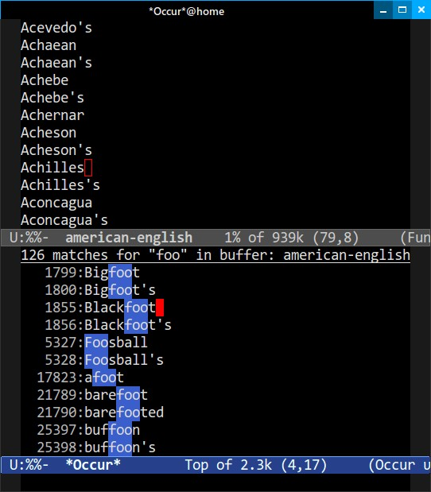
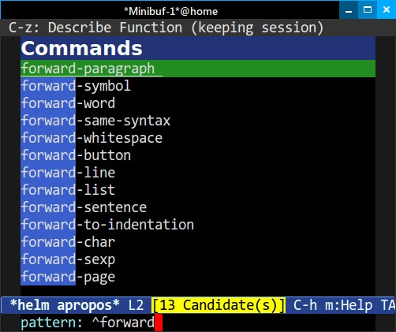
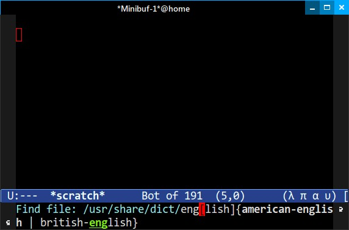

# Mastering Emacs


- [Chapter 1. Introduction](#Chapter-1-Introduvction)
- [Chapter 2. The way of emacs](#chapter-2-the-way-of-emacs)
- [Chapter 3. Frist steps](#chapter-3-first-steps)
- [Chapter 4. The theory of editing](#chapter-4-the-theory-of-editing)
- [Chapter 5. The practicals of emacs](#chapter-5-the-practicals-of-emacs)
- [Chapter 6. Conclusion](#chapter-6-conclusion)

# Chapter 1. Introduction

> “저는 리눅스를 쓰고 있어요.
> 이맥스(Emacs)가 인텔 하드웨어와 통신할 때 사용하는 라이브러리죠.”
>
> – Erwin, #emacs, Freenode.


## Thank You
『Mastering Emacs』 를 구매해 주셔서 감사합니다. 이 책은 오랜 시간 준비해 온 결과물입니다. 2010년 제 블로그에 『Mastering Emacs』를 시작하게 된 것은, 친한 친구인 리(lee)가 제게 Emacs와 Emacs 작업 흐름에 대한 생각을 공유해 보라고 권유해 주었기 때문입니다. 그 당시 저는 'blogideas.org' 라는 org 모드 파일에 “제가 배운 내용” 과 “누군가 가르쳐 주었으면 좋겠다” 고 생각했던 아이디어와 개념들을 방대하지만 무작위로 모아두었습니다. 그 파일의 최종 결과물이 바로 그 블로그였고, 이제는 이 책이 되었습니다.

### Special Thanks
다음 분들께... 격려와 조언, 제안, 그리고 비판을 보내주신 데 대해 감사의 말씀을 전합니다:

```
Akira Kitada, Alvaro Ramirez, Arialdo Martini,
Bob Koss, Catherine Mongrain, Chandan
Rajendra, Christopher Lee, Daniel Hannaske,
Edwin Ong, Evan Misshula, Friedrich Paetzke,
Gabriela Hajduk, Gabriele Lana, Greg Sieranski,
Holger Pirk, John Mastro, John Kitchin, Jonas
Enlund, Konstantin Nazarenko, Lee Cullip,
Luis Gerhorst, Lukas Pukenis, Manuel Uberti,
Marcin Borkowski, Mark Kocera, Matt Wilbur,
Matthew Daly, Michael Reid, Nanci Bonfim,
Oliver Martell, Patrick Mosby, Patrick Martin,
Sebastian Garcia Anderman, Stephen Nelson-
Smith, Steve Mayer, Tariq Master, Travis
Jefferson, Travis Hartwell.
```
다른 사람들과 마찬가지로, 저도 Emacs에 대해 아무것도 모르는 상태에서 그 세계로 내몰리게 되었습니다. 제 경우 대학 1학년 때였는데 당시 학교 컴퓨터 동아리는 대부분 Vim 사용자들로 구성되어 있었습니다. 저에게 “Vim을 써야 해, 그게 다야!” 라고 단호하게 말해졌습니다. 누군가에게 지시를 받는 것을 원치 않았던 저는 Vim과 정반대인 `Emacs` 를 선택했습니다.

Emacs는 오랜 세월 동안 안정적이고 믿을만한 편집기임이 입증되었지만 익히기에는 꽤 까다로운 도구였습니다. 방대한 사용자 설명서가 있었음에도 불구하고 Emacs를 배우고 이해하는 데는 전혀 도움되지 않았습니다.


## 2024 Edition Update
`Emacs 29` 는 기술 발전에 발맞추는 오랜 추세를 여전히 이어가고 있습니다. 이는 매우 칭찬할만한 일입니다. Emacs는 오래된 소프트웨어임에도 불구하고 끊임없이 개선되고 있습니다.

텍스트 편집기에서 구현하기 어려운 기능 중 하나는 “구문 강조” (Emacs 용어로 `font locking`)와 견고한 “들여쓰기 엔진” 입니다. 보시다시피 Emacs와 다른 많은 편집기(구형 및 신형 모두)는 소스 코드의 구문을 강조할 때 패턴 매칭을 통해 텍스트를 일치시키는 간결한 방법인 “정규 표현식” (Regular Expression)을 사용합니다. 정규 표현식은 훌륭합니다. 텍스트에서 중요한 정보를 일치시키고 추출하는 간결한 방법이기 때문입니다. 거의 모든 곳에서 구문 강조기의 핵심을 이루지만 단점도 있습니다. 부정확할 수 있으며 잘못 작성하면 성능을 저하시킬 수 있습니다.

하지만, 좋은 소식이 있습니다. Emacs 29는 tree-sitter [^1] 에 대한 “선택적 지원” 을 추가했는데 이는 소스 코드 파싱에 뛰어난 파서 라이브러리로 유효한 문법으로 정의된 텍스트는 어떤 것이든 구체적인 구문 트리(Concrete Syntax Tree)를 구축합니다. 이런 구문 트리는 컴퓨터(또는 의욕적인 사용자)가 쿼리를 수행하기에 완벽한 매체입니다. 이를 통해 수십 줄의 코드만으로 정확한 구문 강조가 가능해집니다. 또한 구조화된 “편집 및 이동” 이라는 매력적인 가능성을 제시하는데 이는 Tree-sitter 가 생성하는 트리 형태의 구조를 재사용해서 코드베이스 내에서 타의 추종을 불허하는 편집 및 이동 기능을 제공하는 광범위한 개념입니다.

[^1]: 'Tree-Sitter 시작하기' 에 관한 제 글은 Tree-Sitter 를 사용할 수 있도록 Emacs를 설정하는 데 도움이 될 것입니다.

Tree-sitter 가 유일한 선택지는 아닙니다. Tree-sitter 가 제시하는 그리고 (Emacs 및 그 외의 분야에서) 대부분의 다른 시도들이 달성하지 못한 점은 흔한 언어와 드문 언어 그리고 구조화된 텍스트 파일을 위한 방대한 파서 저장소를 갖추고 있다는 것입니다. 따라서, Tree-sitter 는 유능하며 인기가 많습니다. Tree-sitter 의 툴링을 사용해서 자신만의 파서를 작성하는 것도 꽤 간단하다는 점도 도움이 됩니다. 그야말로 쐐기를 박는 장점은 생성된 파싱 트리의 특정 세그먼트를 신속하게 찾아내고 일치시키는 쿼리 언어입니다. 이것이 바로 이 도구의 숨겨진 비장의 무기입니다. 예를 들어, 주어진 이름을 가진 변수를 하나 이상 포함하는 모든 함수를 보여달라고 요청할 수 있다는 점은 확실히 강력한 기능입니다. LISP 언어의 S-표현식을 모델로 한 이 쿼리 언어는 Emacs 생태계와도 자연스럽게 어우러집니다.

현재 이 기능은 “선택 사항” 입니다. tree-sitter 지원을 포함하도록 Emacs를 컴파일해야 하기 때문입니다. 따라서, 이 기능이 기존 메이저 모드나 작업 방식을 일괄적으로 대체할 가능성은 낮습니다. 하지만, 이 기능은 구문 강조 및 들여쓰기 코드를 작성하는 일을 정말 쉽게 만들어 주므로 Emacs에 있어선 커다란 진전입니다.[^2] 이 기능이 Emacs 코어에 통합된 것은 매우 긍정적인 발전이며 “Emacs는 근본적으로 변할 수 없다!!” 는 고정관념에 대한 반박이기도 합니다. Emacs의 폰트 록킹은 대략 35년 전에 처음 도입되었으며 이제 기존 정규 표현식보다 새로운 방식 그리고 종종 훨씬 더 나은 방식이 등장했습니다. 이 기능이 Emacs에 성공적으로 통합된 사실은 Emacs 커뮤니티에도 반영되고 있는데 Tree-Sitter 가 Emacs에 새로 도입된 기능이라서 설정과 사용이 번거롭다는 점에도 불구하고 인기있는 기능임이 입증되었기 때문입니다.

[^2]: 저는 “Let’s Write a Tree-Sitter Major Mode” 라는 글에서 tree-sitter 를 활용하기 위해 직접 메이저 모드를 작성하는 방법에 대해 다뤘습니다.

또 다른 주요 기능은 언어 서버 프로토콜(LSP)을 지원하는 클라이언트인 `Eglot` 입니다. Eglot 은 언어 서버를 사용할 수 있는 모든 버퍼에 IDE와 유사한 기능을 추가합니다. 이 기능은 기본 Emacs와 필요한 언어 서버만 있다면 곧바로 작동하도록 설계되어 있습니다. 언어 서버가 설정되어 있다면 시작하기 위해 입력할 것은 `M-x eglot` (또는 “Tools -> Language Server Support” 선택) 뿐입니다. Eglot 은 Emacs 패키지 저장소인 ELPA에 오랫동안 제공되어 왔습니다. 이제는 Emacs에 내장되었습니다. 이 두 가지 기능은 흥미로운 개선 사항과 수정 사항으로 가득 찬 이번 릴리스의 핵심입니다. 아직 Emacs 29를 사용하고 있지 않다면 반드시 업그레이드해야 합니다.


## Intended Audience
이미 이 책을 구입한 상태에서 대상 독자층에 대해 이야기하는 건 이상할 수 있습니다. 하지만, 어쨌든 언급할 필요는 있습니다. 여러분의 Emacs 숙련도와 상관없이 이 책에서 무언가 얻어가실 수 있을 테니까요.

첫 번째(가장 명백한) 대상 독자층은 Emacs를 처음 접하는 분들입니다. 평생 Emacs를 한 번도 사용해 본 적이 없다면, 이 책이 큰 도움이 되기를 바랍니다. 하지만, Emacs가 처음이고 기술적인 배경이 없다면, 다소 어려움을 겪을 수 있습니다. Emacs는 단순한 프로그래밍 이상의 용도로 적합하지만, 본질적으로 컴퓨터에 익숙한 사람을 주요 대상으로 하고 있습니다. 물론 기술적인 배경이 없더라도 Emacs를 사용하는 데는 아무런 문제가 없지만, 이 책은 독자가 기술적인 소양이 있다고 가정하되, 반드시 프로그래머일 필요는 없습니다.

이전에 Emacs를 사용했지만 포기하셨다면, 이 책이 계속 사용하도록 설득해 주기를 바랍니다. 하지만, 그렇지 않더라도 괜찮습니다. (많은 Emacs 사용자들이 주장하는 것과 달리) 일부 언어나 환경은 Emacs와 맞지 않기 때문입니다. 주로 Visual Studio를 사용하는 Microsoft Windows 개발자라면, Emacs를 사용하는 것은 두 걸음 전진하고 한 걸음 후퇴하는 상황이 될 것입니다. 즉, 전례없는 텍스트 편집 기능과 도구 통합을 얻겠지만, 통합 IDE가 제공하는 이점 중 일부는 잃게 될 것입니다.

Vim에서 넘어오신 분이라면, 어둠의 세계에 오신 것을 환영합니다! 만약 여러분의 주된 목표가 Emacs의 Vim 에뮬레이션 레이어를 사용하는 것이라면, 이 책의 일부 내용은 중복될 수도 있습니다. 하지만, 이 책은 기본 Emacs 키 바인딩에 초점을 맞추고 있으며, “Emacs 방식" 에 대해 가르칩니다. 하지만, 걱정하지 않아도 됩니다. 이 책에 담긴 수 많은 팁과 조언은 여전히 유용하며, 어쩌면 언젠가 Evil 모드에서 벗어나게 될지도 모릅니다.

마지막으로, 이미 Emacs를 사용하고 있지만 한 단계 더 발전하는 데 어려움을 겪고있거나, 혹은 “처음부터” 다시 배우고 싶은 분이라면, 이 책은 여러분을 위한 책이기도 합니다.


## What You’ll Learn
한 권의 책으로 Emacs의 모든 기능을 다룬다는 것은 시지프스식 노동과도 같은 일입니다. 대신, 저는 Emacs가 할 수 있는 수 많은 기능 중 극히 일부에 불과한, Emacs에서 생산적으로 작업하는 데 필요한 내용만 가르쳐 드리고자 합니다. 이 책을 다 읽고 꾸준히 연습한다면, 여러분은 Emacs에 대해 충분히 이해하면서, 이 편집기에 대한 궁금증을 스스로 찾아내고 해결할 수 있게 될 것입니다.

좀 더 구체적으로, 저는 크게 여섯 가지 주제에 대해 다룹니다:

- **What Emacs is about** : Emacs가 사용하는 중요한 용어와 관례에 대한 상세한 설명입니다. 이들은 다른 편집기들과는 많은 경우 크게 다릅니다. 또한 Emacs의 철학이 무엇인지, 그리고 텍스트 편집기에 왜 철학이 필요한지 알아보게 될 것입니다. 아울러 Vim에 대해 간략히 다루고, ‘에디터 전쟁’ 에 대해 이야기하며, 다양한 키들의 용도가 무엇인지 설명하겠습니다.

- **Getting started with Emacs** : Emacs 설치 방법, 실행 방법, 그리고 비교적 최신 버전의 Emacs를 사용하고 있는지 확인하는 방법을 다룹니다. 또한 Emacs를 수정하는 방법과 변경 사항을 영구적으로 적용하기 위해 필요한 절차도 설명합니다. Customize 인터페이스를 소개하고 사용자 정의 색상 테마를 불러오는 방법을 설명하겠습니다. 마지막으로, Emacs의 사용자 인터페이스와 무언가 막힐 때 유용한 팁들에 대해 다루겠습니다.

- **Discovering Emacs** : Emacs는 자체 문서화 기능을 갖추고 있습니다. 하지만, 이것이 정확히 무엇을 의미하며, 이런 특성을 어떻게 활용하면 Emacs에 대해 좀 더 깊이 이해하거나 특정 기능에 대한 의문점을 해결할 수 있을까요? 저는 Emacs에서 새로운 모드나 기능의 사용법을 익힐 때 제가 실제로 어떻게 했는지 보여드리고, 여러분이 정보를 찾기 위해 Emacs의 자체 문서화 기능을 어떻게 활용할 수 있는지 설명해 드리겠습니다.

- **Movement** : Emacs에서 이동하는 방법은 언뜻 보기에 간단해 보이지만, Emacs는 현재 위치에서 가야할 곳까지 가능한 한 적은 키 입력으로 이동할 수 있는 방법이 많습니다. 화면 이동은 개발자에게 있어 작업의 절반을 차지한다고 할 수 있으며, 이를 빠르게 수행하는 방법을 안다면 업무 효율은 크게 향상될 것입니다. 이 글에서 구문 단위별 이동과 구문 단위가 정확히 무엇인지; 창과 버퍼 사용법; 텍스트 검색 및 색인 생성; 텍스트 선택 및 마크 사용법에 대해 배웁니다.

- **Editing** : 이전 ‘Movement’ 장과 마찬가지로, Emacs가 제공하는 다양한 도구를 활용해서 텍스트를 편집하는 방법을 보여드리겠습니다. 여기에는 문장, 단어, 줄, 단락 단위로 텍스트를 편집하는 방법, 반복 작업을 자동화하기 위한 키보드 매크로 생성, 검색 및 바꾸기, 레지스터, 다중 파일 편집, 약어, 원격 파일 편집 등이 포함됩니다.

- **Productivity** : Emacs는 단순히 텍스트를 편집하는 것 이상의 기능을 제공하며, 이 장은 수 많은 사람들이 Emacs에 매료되는 이유, 즉 수백 가지 외부 도구와의 긴밀한 통합을 살짝 맛보게 해 줄 뿐입니다. 저는 여러분의 호기심을 자극하고, Emacs의 동작과 편집 기능을 조화롭게 활용했을 때 처리할 수 있는 좀 더 흥미로운 기능 몇 가지를 보여드리겠습니다.


<br><br>
# Chapter 2. The Way of Emacs

> “윈도잉 시스템의 목적은 당신의 그 유일무이한
> emacs 창 주위에 재미있는 소소한 요소들을 배치하는 것입니다.”
>
> – Mark, gnu.emacs.help.

1960년대로 거슬러 올라가는 현대 컴퓨팅 시대의 시작을 떠올리면, Emacs는 그 어떤 것보다 훨씬 더 오랫동안 우리 곁에 있어 왔습니다. 이 프로그램은 1976년 리처드 스톨먼이 `TECO` [^3] 라는 편집기 위에 매크로 세트로 처음 작성했습니다. TECO는 매우 난해한 프로그램으로 기억됩니다. 그 이후로 Emacs의 수 많은 경쟁 구현체가 등장했지만, 오늘날에는 `XEmacs` 와 `GNU Emacs` 만 접할 가능성이 높습니다.

[^3]: 1 https://www.gnu.org/software/emacs/manual/html_mono/efaq.html#Origin-of-the-term-Emacs

이 책은 GNU Emacs 에 대해서만 초점을 맞출 것입니다. 한때 XEmacs는 좀 더 발전되고 기능도 풍부한 편집기였지만, 이제 더 이상 그렇지 않습니다. 저는 GNU Emacs에 없는 수 많은 새로운 기능을 갖춘 XEmacs로 Emacs 여정을 시작했습니다.

XEmacs와 GNU Emacs의 역사는 흥미롭습니다. 이는 자유 소프트웨어 프로젝트에서 발생한 최초의 주요 포크[^4] 중 하나였습니다. XEmacs는 현재 GNU Emacs에서 당연하게 여겨지는 많은 기능을 선도했으며, 90년대에 XEmacs가 부상하면서 두 프로젝트 간에 치열한 경쟁이 벌어졌고, 이는 결국 사용자에겐 이익이 되었습니다. GNU Emacs의 개발은 90년대 후반과 2000년대 초반에 주춤하기 시작했으나, 현재는 그 어느 때보다 활발하게 진행되고 있습니다. 2000년대 후반 이후, XEmacs의 개발은 더 이상 유지보수되지 않을 정도로 쇠퇴했습니다.

[^4]: https://www.jwz.org/doc/lemacs.html

> [!NOTE]
> 대부분의 사람들에게 ‘Emacs’ 라는 단어는 구체적으로 `GNU Emacs` 를 가리킵니다. 저는 서로 다른 구현체를 구분할 때만 전체 이름을 명시할 것입니다. 제가 `Emacs` 라고 언급할 때는 항상 `GNU Emacs` 를 의미합니다.

Emacs가 오랜 역사를 지닌 탓에 여러 가지… 특이한 점이 있습니다. 이상한 용어 선택이나 시대 착오적인 표현들이 여전히 남아있는 이유는, 대부분의 경우 Emacs가 수십 년 동안 에디터-IDE 분야의 흐름을 앞서 나갔기 때문에 각 기능에 대해 독자적인 용어를 만들어야 했기 때문입니다. Emacs만의 전문 용어를 누구나 익숙한 단어로 바꾸자는 논의도 있지만, 그것이 실현된다 해도 아직 갈 길이 멀다고 할 수 있습니다.

마케팅은 부족하고, Emacs 개발자 수는 적으며, 현대적인 개인용 컴퓨터 시대 이전의 구식 개념과 용어가 사용되고 있음에도 불구하고, 세상에는 여전히 Emacs 사용을 사랑하는 사람들이 많습니다. Emacs의 강점은 그런 적응 능력에 있습니다. 여기서 말하는 '그런' 은 단순히 소프트웨어뿐만 아니라, Emacs의 방향을 정하는 수 많은 자원봉사 유지보수자와 기여자들을 뜻합니다. 그들은 대부분의 사용자보다 더 오래된 제품의 한계 속에서도, 세상의 변화에 뒤처지지 않기 위해 지칠 줄 모르고 일을 합니다. 굳어버린 Emacs 커뮤니티와 플랫폼에 대한 신화는 그저 신화에 불과합니다.

이 장은 ‘이맥스의 길’ 에 대해 이야기할 것입니다. 여기에는 용어와 이맥스가 많은 사람들에게 어떤 의미인지, 그리고 이맥스의 기원을 이해하는 것이 왜 이맥스를 받아들이는 데 도움이 되는지에 대해 다룰 것입니다.


## Guiding Philosophy
Emacs는 ‘만지작거리는’ 사람을 위한 편집기입니다. 그 이상도 이하도 아닙니다. 사람들이 Emacs를 개조하려는 이유는 이 편집기의 거의 모든 측면을 확장 가능하기 때문입니다. Emacs는 최초의 확장 가능하고, 사용자 정의가 가능하며, 자동 설명 기능을 갖춘 편집기입니다. 사실, 이것이 바로 Emacs의 공식 슬로건이기도 합니다. 다른 텍스트 편집기를 사용한 사람이라면, 무엇이든 바꿀 수 있다는 생각이 업무에 불필요한 방해 요소가 될 수 있다고 여길 수 있습니다. 실제로 많은 Emacs 해킹 작업이 본업에 지장을 주면서 이루어지기도 합니다. 하지만, 편집기를 자신이 원하는대로 만들 수 있다는 사실을 깨닫는 순간, 무한한 가능성의 세계가 열립니다.

즉, Emacs의 모든 키를 자신의 취향에 맞게 자유롭게 재설정할 수 있다는 뜻입니다. IDE의 문서화되지 않은 버그 투성이 API나, 설정을 변경했을 때 따르는 제한 사항들—예를 들어 사용자 정의 탐색 키가 검색 및 바꾸기 창이나 내부 도움말 버퍼에서 제대로 작동하지 않는 문제 같은 것들—에 얽매이지 않아도 됩니다. 정말로, Emacs는 모든 것을 바꿀 수 있으며, 실제로 많은 사람들이 그렇게 하고 있습니다. Vim 사용자들이 Emacs로 옮겨가는 이유는, 글쎄요, Emacs가 종종 Vim보다 더 나은 Vim이기 때문입니다.

Emacs는 당신을 매료시킵니다. 일단 Emacs를 사용하기 시작하면, IRC, 이메일, 데이터베이스 접속, 생각 정리, 명령줄 셸, 코드 컴파일, 인터넷 서핑까지 모두 텍스트 편집만큼 쉽다는 것을 깨닫게 됩니다. 게다가 키 바인딩, 테마, 그리고 모든 것의 동작을 구성하거나 변경할 수 있는 Emacs와 elisp의 모든 기능을 그대로 유지할 수 있습니다.

그리고 그 모든 것이 매끄럽게 통합되면, 애플리케이션을 오가면서 겪는 컨텍스트 전환을 피할 수 있습니다: Emacs 사용자 대부분은 편집기, 웹브라우저, 그리고 어쩌면 전용 터미널 애플리케이션 정도만 사용합니다.

> [!NOTE]
> **Emacs's History** : Emacs의 소스 코드 저장소(현재 Git 기반)는 30년 이상의 역사를 자랑하며, 13만 건이 넘는 커밋과 600명에 가까운 커미터가 참여하고 있습니다.

Emacs나 사용 가능한 수 많은 패키지 중 하나를 수정하려면, Emacs Lisp(비공식적으로 `elisp` 라고도 함)을 사용해야 합니다. Emacs에 다른 언어를 접목하려는 시도가 몇 차례 있었지만, 지속적인 성과를 거두지는 못했습니다. 결과적으로 LISP 언어는 Emacs 같은 매우 고급 도구를 위한 완벽한 추상화 언어임이 밝혀졌습니다. 그리고 대부분의 현대 언어는 반드시 시간의 검증을 견뎌낼 수 있는 것은 아닙니다. TCL 언어의 경우은 90년대 인기가 있었기 때문에 잠시 고려되기도 했지만, 오늘날에는 LISP보다 훨씬 더 생소해진 것이 특징입니다.

유일한 단점은 Emacs 설정을 만지작거리는 일은 어쩔 수 없이 익숙해져야 할 부분이라는 점입니다(LISP도 마찬가지지만, 다음 부분에서 설명하겠지만 사실 그건 좋은 일입니다). 그래서 제가 이 편집기가 ‘만지작거리는 것을 좋아하는 사람’ 을 위한 편집기라고 강조했던 것입니다. 만약 설정 건드리는 것을 싫어하고 모든 것이 설치 즉시 완벽하게 작동하기를 원한다면, 남은 선택지는 두 가지 뿐입니다:

**Use a starter kit** : 추가 패키지와 작성자가 합리적이라 생각하는 기본 설정이 포함된 무료 스타터 키트가 많이 있습니다. 이런 스타터 키트는 시작하기에 좋은 방법일 수 있지만, Emacs의 기능이 어디서 끝나고 스타터 키트의 추가 기능이 어디서 시작되는지 구분하기 어렵다는 점에 유의해야 합니다.

다음 스타터 키트 중 하나를 살펴보시길 권장합니다:

- Crafted Emacs
https://github.com/SystemCrafters/crafted-emacs

- Steve Purcell의 .emacs.d
https://github.com/purcell/emacs.d

- Bozhidar Batzov의 Prelude
https://github.com/bbatsov/prelude

Vim에 강한 편향을 가진 독창적인 키트를 원하신다면:

• Doom Emacs
https://github.com/hlissner/doom-emacs

**Use the defaults** : 물론 하나의 선택지이긴 하지만, Emacs는 중립적이면서 구식인 기본 설정으로 제공됩니다. 사용자는 자신의 취향에 맞게 Emacs를 설정하거나 다른 사람에게 그 작업을 맡겨야 합니다. 주류 편집기들과 너무나도 극명하게 다른 이 편집기의 경우, 개발자들은 기존 사용자층(그들야말로 Emacs 설정 방법을 가장 잘 알고 있어야 할 사람들인데도 말입니다)을 불편하게 할까봐 기본 설정 변경에 신중을 기합니다.

개인적으로 저는 스타터 키트를 사용해 본 적이 없습니다. 제가 대략 20년 전 시작했을 당시에는 지금처럼 스타터 키트가 존재하지 않았기 때문입니다. 그 대신, 당시 우리가 '.emacs 파일' 이라 부르던 다른 사람들의 파일을 많이 참고했습니다.

이런 접근 방식은 에디터를 처음부터 끝까지 이해하고 싶은 사람들에게 아주 적합합니다. *Crafted Emacs* 같은 스타터 키트를 적어도 한 번 정도는 시도해 보시길 권합니다. 비록 그대로 채택하지 않더라도, Emacs가 얼마나 유연하게 설정 가능한지 감을 잡을 수 있을 테니까요. 배울 것은 언제나 더 있고, 발견할 새로운 것들도 항상 있습니다.


### LISP?
Emacs는 ‘Emacs Lisp’ 또는 줄여서 ‘elisp’ 이라 불리는 자체 LISP 구현체를 기반으로 작동합니다. 많은 사람들이 이런 난해한 언어 때문에 주저하거나 겁을 먹곤 하는데, 이는 정말 안타까운 일입니다. 왜냐하면 LISP를 하나의 독립된 기계로 간주하는 개념을 바탕으로 구축된 이 편집기를 통해 LISP를 배우는 것은 실용적이면서 재미있는 방법이기 때문입니다. Emacs의 모든 부분은 검토, 평가 또는 수정할 수 있습니다. 왜냐하면 이 편집기는 대략 95%가 elisp이고 5%가 C 코드이기 때문입니다. 또한 이는 급진적인 패러다임을 배우는 실용적인 방법이기도 합니다. 즉, 코드와 데이터는 상호 교환 가능하고 유연하며, 이 언어는 간단한 구문 덕분에 매크로를 통해 쉽게 확장할 수 있다는 점입니다.

안타깝게도 언젠가는 엘리스프(Elisp)를 배워야 합니다. 이 책에는 Emacs의 사용자 정의 옵션을 동적으로 생성하는 인터페이스인 ‘Customize’ 에 대해 다룹니다. 하지만, 키를 재할당하는 것처럼 단순한 작업조차 엘리스프와 상호작용해야 함을 의미합니다. 하지만, 전혀 나쁜 것만은 아닙니다. 여러분이 마주칠 가능성이 높은 문제 대부분은 이미 오래전에 다른 누군가에 의해 해결되었기 때문입니다. 인터넷에서 여러분의 문제에 대한 해결책을 찾는 것만으로 충분합니다.

파이썬, 루비, 자바스크립트 같은 보다 “현대적인” 언어에 비해 엘리스프(Elisp)가 상대적으로 인기는 적긴 하지만, 만약 좀 더 전통적인 명령형/객체 지향 언어가 사용되었다면 이맥스(Emacs)가 지금과 같은 강력한 확장성을 갖출 수 있었을지는 의문입니다. `LISP` 언어를 그토록 훌륭한 언어로 만드는 이유는 소스 코드와 데이터 구조가 본질적으로 하나이기 때문입니다. 사람이 읽는 LISP 소스 코드는 LISP이 데이터 구조로서 코드를 조작하는 방식과 거의 동일합니다. “데이터란 무엇인가?” 와 “코드란 무엇인가?” 라는 두 가지 질문 사이의 구분은 사실상 존재하지 않습니다.

데이터-에즈-코드(data-as-code), 매크로 시스템, 그리고 임의의 함수에 “어드바이스(advise)” 를 적용할 수 있는 기능—즉, 원본을 복사하거나 수정하지 않고도 기존 코드의 동작을 변경할 수 있다는 뜻—은 사용자의 필요에 맞게 Emacs를 변경할 수 있는 전례없는 능력을 제공합니다. 대부분의 소프트웨어 프로젝트에서 코드 스멜이나 부실한 아키텍처로 간주될만한 요소들이 사실 Emacs에서는 커다란 장점이 됩니다. 다른 사람이 작성한 소스 코드의 방대한 부분을 다시 작성할 필요없이, 사용자의 필요에 맞게 Emacs의 기존 루틴을 훅(hook)으로 연결하거나, 교체하거나, 수정할 수 있기 때문입니다.

이 책은 엘리스프(Elisp)를 아주 상세하게 다루지는 않을 것입니다. 이맥스(Emacs)에는 기본으로 제공되는 엘리스프 입문 자료[^5]가 있으니, 관심이 있다면 꼭 읽어보시길 강력히 추천합니다. 솔직히 말해서, 여러분은 관심을 가져야 합니다. LISP는 재미있고, 실용적인 환경에서 이 강력한 언어를 배우고 활용하는 데 더할 나위 없이 좋은 방법입니다. 괄호 때문에 겁먹지 마세요; 사실 괄호는 이 언어의 가장 큰 장점입니다.

[^5]:  https://www.gnu.org/software/emacs/manual/eintr.html


#### Emacs as an Operating System
Emacs는 반짝거리는 물건들로 가득한 까치 둥지 같습니다. 만약 여러분이 Emacs를 처음 접한다면 제가 비유를 좀 지나치게 끌었다고 생각할 수도 있지만, Emacs에는 `M-x zone` 을 통해 실행되는 내장 스크린세이버, 텍스트 어드벤처 게임인 `M-x dunnet`, `M-x tetris` 클론, 본격적인 클라이언트-서버 모델인 달의 위상 계산기, `M-x doctor` 에 포함된 심리 치료사, 여러 이메일 클라이언트, ASCII 아트를 그릴 수 있는 아티스트 모드까지 갖추고 있다는 점을 생각해 보시기 바랍니다. 심지어 EPUB 리더인 `nov` 패키지를 사용하면 이 책을 Emacs 내에서 직접 읽을 수도 있습니다.

Emacs를 실행하면 사실상 운영체제 ABI와 저수준으로 상호작용하는 작은 C 코어를 시작하는 셈입니다. 여기에는 파일 시스템 및 네트워크 접근 같은 기본적인 작업은 물론, 화면에 내용을 표시하거나 터미널에 제어 코드를 출력하는 작업도 포함됩니다.

하지만, Emacs의 초석은 elisp 인터프리터입니다. 이것이 없다면 Emacs도 존재할 수 없습니다. 이 인터프리터는 낡고 구식이라, 점점 늘어나는 사용자의 요구를 감당하기에 힘겨워하고 있습니다.

현대적인 Emacs 사용자들은 이런 소박한 인터프리터에 너무 많은 것을 기대합니다. 속도와 비동기 처리가 두 가지 주요 쟁점입니다. 인터프리터는 단일 스레드에서 실행되므로, 부하가 큰 작업이 UI 스레드를 잠그게 됩니다. 하지만, 해결책은 언제나 있습니다. 문제는 다양하지만, 사람들이 점점 더 정교한 패키지를 개발하는 것을 막지는 못합니다. Emacs 28의 출시와 함께(그리고 사용 중인 Emacs 인스턴스가 이를 지원하도록 컴파일된 경우), 사용하는 모든 Elisp 코드는 네이티브 코드로 컴파일되므로 속도가 크게 향상됩니다.

엘리스프(Elisp)를 작성할 때, 여러분은 단순히 모든 것에서 격리된 샌드박스 안에서 실행되는 코드 조각을 작성하는 것이 아닙니다. 여러분은 살아있는 시스템, 즉 운영체제 위에서 실행되는 운영체제를 변경하는 것입니다. 여러분이 변경하는 모든 변수와 호출하는 모든 함수는, 여러분이 텍스트를 편집할 때 사용하는 바로 그 인터프리터에 의해 처리됩니다.

Emacs는 거대하고 유동적인 하나의 상태이기 때문에 해커들에겐 꿈같은 존재입니다. 그런 단순함은 축복이자 저주이기도 합니다. 실행 중인 함수를 재정의할 수 있고, 변수를 마음대로 변경할 수 있으며, 언제든지 시스템 상태를 조회할 수 있습니다. 이 상태는 Emacs가 키보드에서 네트워크 스택에 이르는 이벤트에 반응하며 키를 누를 때마다 변화합니다. Emacs는 문서 그 자체로 자동으로 설명됩니다. 이를 처리할 수 있는 다른 편집기는 없습니다. 그에 근접한 편집기도 전혀 없습니다.

그런데도 Emacs는 절대 다운되지 않습니다. 적어도 엄밀히 말해서는 말입니다. Emacs는 이를 증명하는 가동 시간 카운터가 있습니다(`M-x emacs-uptime`)—몇 달씩 연속으로 가동되는 경우도 흔합니다.

따라서, Emacs에 어떤 질문을 던질 때—나중에 그 방법을 보여드리겠지만—사실은 Emacs의 현재 상태가 어떤지를 묻는 셈입니다. 이 때문에 Emacs는 뛰어난 Elisp 디버거를 갖추고 있으며, Emacs 자체 인터프리터와 상태의 모든 측면에 무제한으로 접근할 수 있으므로, 뛰어난 코드 완성 기능도 제공합니다. LISP 표현식을 만날 때마다 Emacs에게 이를 평가하도록 지시할 수 있으며, Emacs는 숫자 더하기부터 변수 설정, 패키지 다운로드에 이르기까지 모든 작업을 수행합니다.


### Extensibility
확장성은 중요하지만, Emacs가 제공하는 가능성의 범위를 모른다면 그 중요성을 제대로 강조하기는 어렵습니다. 여기에는 Emacs가 무엇을 할 수 있는지, 보다 중요한 점은 Emacs가 사람들에게 무엇을 할 수 있게 해주는지에 대한 몇 가지 예시만 담아두었습니다.

**시각 장애인을 위한 음성 인터페이스** : 지난 25년 동안 Emacspeak[^6]는 시각 장애가 있거나 시력이 약한 Emacs 사용자들에게 화면에 표시되는 내용을 이해하는 음성 인터페이스를 통해 Emacs 및 외부 세계와 소통할 수 있는 방법을 제공해 왔습니다. Emacspeak는 소스 코드의 다양한 구문 요소를 반영하거나 레이아웃, 글꼴, 그래픽 아이콘을 강조하기 위해 음성 엔진의 음성 특성을 변경합니다. 시각 장애인 Emacs 사용자에게 Emacspeak는 이메일이나 웹 브라우징 같은 Emacs의 다양한 도구를 사용해서 작업을 계속할 수 있게 해준 생명의 줄과 같은 존재입니다.

[^6]: https://emacspeak.sourceforge.net/

이런 기능이 25년이나 계속되어 왔다는 사실만으로도 충분히 인상적이지만, 이러한 혁신적인 소프트웨어를 지원할 수 있는 Emacs의 능력은 그야말로 감탄을 자아낼 정도입니다.

**원격 파일 편집** : Emacs의 `TRAMP` [^7]를 사용하면 SSH, FTP, Docker, rclone, rsync 등 다양한 네트워크 프로토콜을 통해 원격 파일을 마치 로컬 파일 편집하듯이 원활하게 편집할 수 있습니다.

[^7]:  Transparent Remote (file) Access, Multiple Protocol

**쉘 액세스** : Emacs에는 ANSI를 지원하는 내장 터미널 에뮬레이터가 있으며, bash 같은 셸을 감싸는 Emacs 래퍼, 그리고 전적으로 Elisp로 작성된 본격적인 셸인 `Eshell` 이 포함되어 있습니다.

**Org 모드** : 할 일 관리, 일정 관리, 프로젝트 계획, 리터러시 프로그래밍, 메모 작성(그 외 다양한 기능!)을 위한 애플리케이션입니다.

**GNU Hyperbole** : 버튼 개념을 통해 거의 모든 요소에 링크를 걸거나 상호 참조할 수 있는 정교한 하이퍼텍스트 패키지입니다. 버튼은 텍스트 형태의 하이퍼링크로 버그 추적 시스템 링크부터 날짜, 이름, 이메일 등의 상호 참조에 이르기까지 거의 모든 작업을 수행하는 데 사용할 수 있습니다. 이 프로그램은 정리 및 검색을 위한 정교한 계층적 아웃라이너를 갖추고 있으며, Org mode와 연동되어 Org와 Hyperbole을 결합해서 매우 진보된 의미론적 하이퍼텍스트 지원 도구 세트를 구축할 수 있게 해줍니다.

**기호 계산기** : 역폴란드 표기법(RPN) 계산기로 기호 대수, 임의 정밀도 연산, 사용자 정의 함수, 행렬 및 단위 기반 수학 연산 등을 수행할 수 있습니다.

**음악 플레이어** : Emacs 멀티미디어 시스템(EMMS)은 대화형 미디어 브라우저이자 음악 플레이어입니다.

**EGlot** : 언어 서버 프로토콜(LSP)을 이해하는 정교한 클라이언트로, Emacs가 어떤 언어 서버와도 통신할 수 있게 해서 코드 완성, 리팩토링, 서식 지정, 린팅 같은 고급 IDE 기능을 Emacs 내에서 제공합니다. Emacs 29에 기본으로 포함되어 있습니다.

**그 외** : 거의 모든 프로그래밍 환경에 대한 공식 또는 비공식 지원; 내장된 매뉴얼 페이지 및 인포 리더; 매우 정교한 디렉터리 및 파일 관리자; 거의 모든 주요 버전 관리 시스템에 대한 원활한 지원; 그리고 크고 작은 수천 가지의 기타 기능들이 있습니다.


## Important Conventions
계속 진행하기 전에 몇 가지 중요한 Emacs 관례에 대해 설명해야겠습니다. 이 관례들을 꼭 외워두거나, 의문이 생길 때마다 이 페이지를 다시 찾아보는 것은 매우 중요합니다. 이 관례들은 이 책과 다른 곳에서 반복적으로 등장할 것이며, Emacs의 방대한 내부 문서를 활용하려면 이를 숙지하는 것이 무엇보다 중요합니다. 이 목록은 Emacs에서, 혹은 이 책에 사용되는 관례의 모든 것을 망라한 것은 아닙니다. 책 전체에 걸쳐 구체적인 용어와 개념을 소개하지만, 일부 용어는 특정 주제를 초월하므로 미리 알아두는 것이 중요합니다.


### The Buffer
대부분의 텍스트 편집기와 IDE는 “파일 기반” 입니다. 즉, 파일의 텍스트를 표시하고 텍스트를 파일에 저장할 뿐입니다. 그게 전부입니다. Emacs에서 모든 파일은 버퍼지만, 모든 버퍼가 파일인 것은 아닙니다. 로그 파일에서 가져온 텍스트 조각을 임시로 저장하거나, 텍스트를 조작하거나, 그 밖의 어떤 이유로든 일회용 작업 공간이 필요하다면, 그냥 새 버퍼를 생성하고 이름을 지정하면 됩니다. Emacs는 파일 이름을 묻는 번거로움을 주지 않습니다. 이 버퍼는 Emacs 내에서만 존재합니다. 이를 영구적으로 유지하려면 디스크의 파일에 명시적으로 저장해야 합니다.

Emacs는 이런 버퍼를 단순히 텍스트 편집에 사용하는 것은 아닙니다. 버퍼는 I/O 장치처럼 작동해서 `bash` 같은 셸이나 심지어 `Python` 같은 다른 프로세스와 통신할 수 있습니다.

Emacs의 거의 모든 명령은 버퍼를 대상으로 작동합니다. 따라서, 예를 들어 Emacs에 검색 및 바꾸기를 지시하면, 실제로는 버퍼 내에서 검색 및 바꾸기가 수행됩니다. 현재 작성 중인 활성 버퍼일 수도 있고, 임시 복제본일 수도 있습니다. 버퍼는 여러분이 생각할 수 있는 불투명한 내부 데이터 구조가 아닙니다. Emacs에서 버퍼는 데이터 구조 자체입니다. 이는 매우 강력한 개념입니다. 왜냐하면 Emacs 내에서 이동하고 편집하는 데 사용하는 명령어들은 거의 항상 elisp 내부에서 사용하는 명령어와 동일하기 때문입니다. 따라서, 일단 Emacs의 사용자 명령어를 익히면, 간단한 함수 호출을 통해 직접 손으로 처리하는 작업을 모방할 수 있습니다.


### The Window and the Frame
화면에서 버퍼를 볼 때, 그것은 창(window)으로 표시됩니다. 하지만, Emacs에서 창이란 단순히 프레임(frame)의 일부를 타일 형태로 나눈 것에 불과하며, 이는 대부분의 윈도우 매니저가 창이라 부르는 것과 같습니다. Emacs는 그 반대인데, 네, 정말 혼란스럽죠.

위의 스크린샷을 보면 두 개의 창과 하나의 프레임이 보입니다. 각 프레임은 하나 이상의 창을 가질 수 있으며, 각 창은 정확히 하나의 버퍼를 가질 수 있습니다. 따라서, 버퍼는 사용자에게 표시되기 위해 창 안에서 보여야 하며, 창이 사용자에게 보이려면 프레임 안에 있어야 합니다.

> [!NOTE]
> 이것을 프레임이 있는 물리적인 창문이라고 생각하시기 바랍니다. 각 프레임은 창유리로 이루어져 있습니다.

Emacs는 원하는만큼 프레임을 자유롭게 생성할 수 있으며, 각 프레임을 여러 개의 창으로 분할하거나 배열할 수 있습니다. 대형 모니터를 사용한다면(요즘 누가 그렇지 않겠습니까?), Emacs의 타일링 시스템을 활용해서 화면에 여러 버퍼를 표시하는 것은 매우 유용합니다.


#### Modeline, Echo Area, and Minibuffer 


위의 그림은 터미널 Emacs 세션의 예시입니다. Emacs는 모드라인을 통해 Emacs 자체와 현재 열려있는 버퍼에 대한 정보를 표시합니다. 모드라인은 다음과 같습니다:

```
-UUU:**--F3 *scratch* All L4 (Lisp Interaction) --
```

상당히 좁은 공간에 많은 정보가 담겨져 있습니다. 우선 주목할 부분은 이름과 모드입니다. 이 경우 버퍼 이름은 `*scratch*` 이며 메인 모드는 `Lisp Interaction` 입니다. 대부분의 편집기는 상태 표시줄(status bar)이라는 이와 유사한 개념이 있습니다.

모드라인(modeline)에는 노트북 배터리 잔량, 현재 실행 중인 함수나 클래스, 사용 중인 소스 제어 리비전이나 브랜치 등 다양한 선택적 정보를 표시할 수 있습니다.

미니버퍼(minibuffer)는 모드라인 바로 아래에 위치하며, 여기에는 오류 및 일반 정보가 표시됩니다:

```
-UUU:**--F3 *scratch* All L4 (Lisp Interaction) --
M-x insert-hello-world
```

이 경우, 저는 Emacs의 확장 명령 기능을 호출했습니다. 이 기능은 `M-x` 기호로 표시되며, 이에 대해서는 키에 관한 장에서 자세히 다루겠습니다. 그리고 `M-x` 프롬프트에 `insert-hello-world` 명령을 입력했습니다.

에코 영역(echo area)과 미니버퍼는 화면상 동일한 위치를 공유합니다. 미니버퍼는 일반 버퍼와 거의 동일합니다. 따라서 대부분의 편집 명령을 사용할 수 있으며, 한 줄로 구성된 미니버퍼는 필요에 따라 여러 줄로 확장됩니다. 이것이 바로 Emacs와 소통하는 방식입니다. 문자열을 검색하려면 미니버퍼에 검색할 문자열을 입력합니다. 미니버퍼는 필요한 내용을 찾도록 도와주는 다양하고 복잡한 자동 완성 메커니즘을 지원하며, 여러분이 아마 가장 자주 사용하게 될 도구입니다.


### The Point and Mark
“포인트” (point)는 “캐럿” (caret)이나 “커서” (cursor)를 가리키는 또 다른 표현입니다. Emacs 문서에는 “포인트” 와 “커서” 라는 용어를 다소 일관성없이 사용하므로 두 용어가 모두 등장합니다. 그럼에도 불구하고, 포인트 자체는 버퍼 내의 현재 위치를 의미합니다. 이 책에서는 `█` 기호로 표시하겠습니다. 각 버퍼는 포인트의 위치를 개별적으로 추적하므로, 버퍼를 전환하더라도 각 포인트의 위치는 별도로 기억됩니다.

> [!NOTE]
> Emacs는 “현재 버퍼” (current buffer)에 대해 자주 이야기하는데, 이 용어는 두 가지 의미를 가질 수 있습니다. 현재는 그 중 하나만 관심가질 만한데, 바로 커서가 위치한 버퍼를 말합니다(다른 경우는 기본적으로 동일하지만, elisp을 통해 프로그래밍 방식으로 버퍼를 변경하는 경우입니다). 커서가 있는 버퍼가 현재 버퍼인 이유는, 바로 그 버퍼 내에서 글을 쓰고 커서를 이동시키기 때문입니다. 한 번에 단 하나의 버퍼만이 현재 버퍼가 될 수 있으며, 바로 “커서가 있는 버퍼가 현재 버퍼” 입니다.

Emacs에서 포인트는 단순히 사용자가 입력한 문자가 화면 어느 위치에 표시되는지를 시각적으로 표시하는 역할을 넘어 좀 더 많은 용도로 사용됩니다. 포인트는 또한 ‘포인트’ 와 ‘마크’ 로 불리는 한 쌍의 요소 중 하나입니다. “포인트와 마크는 영역의 경계” 를 나타내며, “영역” 이란 대개 현재 버퍼 내의 연속된 텍스트 블록을 말합니다. 다른 편집기는 이를 선택 영역이나 하이라이트라고 부릅니다. 대부분의 편집기는 영역의 시작점과 끝점을 가리키는 특정 명칭이 없지만, Emacs는 있으며, 이에 대해서는 ‘선택 영역과 영역’ 장에서 다시 다루겠습니다.

> [!TIP]
> 역사적으로 Emacs는 화면에 선택 영역을 직관적으로 보여주지 않았고, 사용자는 머릿속으로 그 영역을 그려야 했습니다. 그런 시절은 이제 오래전 일입니다. 저는 가끔 Emacs의 이런 독특한 기능에 대해 이야기할 것입니다. 이 기능을 ‘일시적 마크 모드(Transient Mark Mode, TMM)’ 라고 합니다.

하지만, 포인트와 마찬가지로, 그 마크도 겉으로 보이는 것 이상의 의미를 지닙니다. 이 마크는 해당 지역의 경계를 표시하는 역할을 하기도 하지만, 버퍼 내의 다른 곳에서 다시 돌아올 수 있는 이정표 역할도 합니다. 이 마크는 대개 눈에 보이지 않습니다.


### Killing, Yanking and CUA
사실상 사용자 인터페이스 표준에서 벗어난 첫 번째 요소이자, 초보자들에게 가장 거부감을 주는 것은 “Emacs의 클립보드 시스템” 일 것입니다. 잘라내기, 복사, 붙여넣기는 거의 보편적으로 Ctrl+x 또는 Shift+Delete, Ctrl+c 또는 Ctrl+Insert, 그리고 Ctrl+v 또는 Shift+Insert 로 잘 알려져 있습니다. Emacs에서 이런 키와 용어는 크게 다릅니다: 'killing' 은 “잘라내기” 이고, 'yanking' 은 “붙여넣기” 이며, '복사' 는 어색하게도 'kill ring에 저장하기' 라고 불립니다(비공식적으로는 그냥 'copy' 라고 합니다).

이유는 앞서 언급했듯이 역사적입니다. 대부분의 키와 용어는 IBM의 Common User Access[^8](CUA) 및 Apple에서 유래했습니다. 하지만, CUA는 1987년에 도입되었는데, 이는 Emacs가 자신만의 용어와 표준을 확립한 지 이미 수년이나 지난 후의 일이었습니다.

[^8]: https://en.wikipedia.org/wiki/IBM_Common_User_Access

'선택 호환 모드' 에서 저는 몇 가지 주의 사항과 함께 현대적인 클립보드 단축키로 전환하는 방법과, 또 그렇게 해서 안되는 이유를 설명하겠습니다. 대신, 텍스트 편집에서 Emacs 시스템이 좀 더 나은 이유를 보여드리겠습니다.


### .emacs.d, init.el, and .emacs
Emacs 사용자들이 즐겨하는 취미 중 하나는 자신의 작업을 보다 편리하게 만들어 주는 작은 코드 조각이나 사용자 지정 설정을 다른 Emacs 사용자들과 공유하는 것입니다.

예전에는 이런 설정들이 `.emacs` 라는 파일에 저장되었지만, 현재는 대부분 리눅스는 `~/.emacs.d/init.el`, 윈도우는 `%HOME%\init.el` 에 사용자 설정을 보관합니다. 이제 Emacs는 파일 시스템에 좀 더 많은 파일을 생성하기 때문에, 홈 디렉터리가 복잡해지는 것을 방지하기 위해 이 파일은 `.emacs.d` 라는 디렉터리에 보관됩니다.

> [!NOTE]
> **XDG Support in Emacs 27** : Emacs 27 이상 버전은 이를 지원하는 리눅스 플랫폼에서 사용자 설정을 `~/.config/emacs/init.el` 에 저장하는 XDG 표준을 지원합니다.

따라서, 사람들이 자신의 `init` 파일이나 “.emacs 파일” 에 대해 이야기하거나, 해당 파일에 무언가를 추가하라고 말할 때는 바로 그 파일을 가리키는 것입니다. Emacs를 처음 사용한다면 `~/.emacs.d/init.el` 을 사용해야 합니다. 이 파일에 내용을 추가한 후에는 Emacs가 이를 적용하도록 지시해야 합니다. 이를 적용하는 방법은 여러 가지가 있으며, ‘Elisp 코드 평가하기’ 섹션에서 보다 자세히 설명하겠지만, 초보자는 단지 “Emacs를 종료했다가 다시 시작하는 방법” 을 권장합니다.

> [!NOTE]
> Emacs에서는 스타터 키트가 흔히 사용됩니다. 이는 Emacs에 커뮤니티 차원으로 추가한 것으로, 다양한 변경 사항을 묶어서 제공하며 대개 타사 패키지에 의존합니다. 스타터 키트를 사용할 경우, 자신의 변경 사항을 어디에 저장해야 하는지를 확인하려면 해당 키트의 도움말 문서를 읽어보시기 바랍니다.

일부 예외를 제외하고, Emacs는 사용자가 프로그램 내에서 변경한 내용을 자동으로 저장하지 않습니다. 따라서 변경 내용을 유지하려면 ‘Customize’ 인터페이스를 통해 직접 저장해야 합니다. 즉, 유지하고 싶은 변경 사항은 사용자가 직접 저장해야 합니다. 마찬가지로, 실수로 Emacs에서 오류가 발생했거나 원치 않는 변경을 가한 경우에는, 단순히 Emacs를 종료한 후 다시 시작하면 됩니다.


### Major Modes and Minor Modes
Emacs의 “메이저 모드” (Major Modes)는 버퍼의 동작 방식을 제어합니다. 따라서, 파이썬 코드를 편집하려고 Emacs에서 helloworld.py 라는 파일을 열면, Emacs는 파일 확장자를 메이저 모드에 매핑하는 중앙 집중식 레지스터를 통해 이 파일이 파이썬 파일임을 인식하고 파이썬 메이저 모드를 사용해야 한다는 것을 알게 됩니다. 모든 버퍼는 항상 메이저 모드가 지정되어 있습니다. 메이저 모드는 글꼴 잠금(구문 강조) 기능만 제공하고 특별한 기능이 없는 기본적인 형태일 수도 있고, 그와 정반대로 글꼴 잠금, 고급 들여쓰기 엔진, 특수 명령어 등을 제공하는 완전히 다른 형태일 수도 있습니다.

> [!NOTE]
> ‘폰트 락킹(Font Locking)’ 은 Emacs에서 구문 강조(syntax highlighting)를 지칭하는 정확한 용어이며, 이는 폰트 락킹 엔진이 텍스트를 보기좋게 표시하기 위해 사용하는 속성(색상, 폰트, 텍스트 크기 등)의 조합으로 이루어집니다.
>
> Emacs 용어인 ‘페이스(face)’ 와 ‘폰트 락(font lock)’ 은 다른 곳에서 흔히 볼 수 있는 용어들보다 먼저 등장했습니다.

사용자는 언제든지 다른 모드에 해당하는 명령어를 입력해서 버퍼의 메이저 모드를 자유롭게 변경할 수 있습니다. Emacs의 파일 확장자와 관련된 메이저 모드 목록 외에도, 확장자가 모호하거나 아예 없는 파일을 위한 또 다른 시스템이 있습니다. Emacs는 파일 앞부분을 스캔해서 이를 바탕으로 메이저 모드를 추론합니다. 드물게 Emacs가 잘못 판단하는 경우도 있으므로 사용자가 직접 변경해야 할 수도 있습니다.

각 “버퍼는 오직 하나의 메이저 모드만 가질 수 있다!!” 는 점을 기억하는 것은 중요합니다. 반면, “마이너 모드” (Minor Modes)는 일반적으로 일부(또는 모든) 버퍼에 대해 활성화할 수 있는 선택적 추가 기능입니다. 한 가지 예로, 글을 작성하는 동안 문법 검사를 수행하는 마이너 모드인 `flyspell-mode` 가 있습니다.

메이저 모드는 항상 모드라인에 표시됩니다. 일부 서브 모드도 모드라인에 표시되지만, 대개 버퍼 자체나 사용자와의 상호작용 방식을 어떤 식으로든 변경하는 모드들만 표시됩니다.


<br><br>
# Chapter 3. First Steps

> 나는 Emacs를 사용하는데, 이는 일종의
> 초핵자용 워드 프로세서라고 볼 수 있다.
> 
> – 닐 스티븐슨, 『태초에… 명령줄이 있었다』


## Installing and Starting Emacs
Emacs 설치 방법에 대해 설명하기 전에, 시스템에 설치되어 있는지 확인해야 합니다. 하지만, 설치되어 있더라도 각별히 주의해야 합니다. 아주 오래된 버전일 수도 있으니까요...

> [!NOTE]
> **Checking Emacs's version** : `emacs --version` 을 입력하면 Emacs 버전을 확인할 수 있습니다.

이 책이 출간된 2024년 현재, 최신 메이저 버전은 `GNU Emacs 29` 입니다. 가능하면 최신 버전을 사용하시기를 권장합니다. 항상 최신 상태를 유지하도록 노력해야 합니다. Emacs의 주요 릴리스 주기는 그리 잦지 않으므로 최신 버전을 따라가는 데 큰 어려움은 없을 것입니다. 업그레이드를 한다면, 버그 수정을 위해서라기 보다(사실 Emacs는 매우 안정적이기 때문에) 새로운 기능과 대부분의 패키지 작성자들은 사용자가 최신 버전을 사용한다고 가정한다는 점 때문일 것입니다. (그렇긴 하지만, 매우 생소한 플랫폼을 사용 중이라면 업그레이드가 불가능할 수도 있습니다.)

Emacs의 특징 중 하나는 호환성을 깨는 변경 사항이 비추천 단계에서 제거 단계로 넘어가는 데는 여러 번의 메이저 릴리스를 거쳐야 한다는 오래된 신념입니다. 드물게는 1980년대 후반에 작성한 코드가 Emacs 관리자들이 마침내 오래전부터 사용하지 않던 변수나 함수를 제거했기 때문에 갑자기 작동하지 않게 되었다는 불만이 Emacs 메일링 리스트로 쇄도하기도 합니다.

Emacs는 여러분이 직접 사용할 가능성이 높은 대부분의 주요 플랫폼을 지원합니다: BSD와 Linux, Mac OS X, MS-DOS, 그리고 Microsoft Windows. Linux 이외의 운영체제에서 Emacs를 컴파일하거나 빌드하는 방법에 대해서는 자세히 다루지 않겠습니다. Emacs는 크로스 플랫폼 에디터로 만들어졌지만, 리눅스가 아닌 환경에서 실행할 경우 항상 어느 정도의 타협이 필요합니다. 특히 Mac OS X의 경우, Emacs를 가장 제대로 실행하는 방법에 대한 상반된 조언이 많이 오가는 것 같습니다. 제가 드릴 수 있는 가장 좋은 조언은 몇 가지 다른 방법을 시도해 보고 자신에게 잘 맞는 방법을 찾는 것입니다.

**Microsoft Windows** :  Emacs는 공식 웹사이트에서 Microsoft Windows용 공식 빌드를 제공합니다.[^9] 실행 파일을 압축 해제하고 실행하기만 하면 됩니다.

[^9]:  https://ftp.gnu.org/gnu/emacs/windows/

대부분의 외부 도구 지원은 Windows에서 작동하지 않습니다. 내장 grep 지원 같은 기능은 `GNU coreutils` 가 설치되어 있어야 합니다. 하지만, Cygwin [^10] 에서 Emacs를 실행하면 Windows도 리눅스와 유사한 환경을 구축할 수 있습니다. 또는, 크로스 컴파일된 GnuWin32 [^11] 프로젝트는 거의 모든 리눅스 명령줄 프로그램을 Windows에서 네이티브로 실행할 수 있게 해줍니다.

[^10]: https://www.cygwin.com/
[^11]:  https://gnuwin32.sourceforge.net/

최근 등장한 또 다른 방법은 Windows 10의 서브시스템 위에서 리눅스를 네이티브로 실행하는 호환성 레이어인 Windows Subsystem for Linux를 사용하는 것입니다.

**Mac OS X** : 여러 방법이 있지만, 한 가지 접근 방식은 비공식 Emacs 빌드를 사용하는 것입니다. [^12] 또한 Aquamacs 도 있지만, 이는 GNU Emacs와 상당히 다릅니다!! 이 주제는 그 자체로 꽤 복잡합니다. 어떤 사람들은 homebrew 같은 패키지 관리자를 사용할 것을 선호하지만, 그렇지 않은 사람들도 있습니다. 일반적으로 homebrew 를 사용하는 사람들은 homebrew 버전의 Emacs도 함께 사용하는 경우가 많습니다. Emacs Wiki의 Mac OS X에 Emacs 설치하기 관련 문서는 [^13]  Emacs를 직접 컴파일할 때 시작하기 좋은 자료입니다.

[^12]: https://emacsformacosx.com/
[^13]: https://www.emacswiki.org/emacs/EmacsForMacOS

**Linux** : 리눅스용 Emacs는 거의 항상 배포판 패키지 관리자에 포함되어 있습니다. 일부 배포판은 새로운 마이너 릴리스(사실 마이너 릴리스라고 하기엔 무리가 있을 정도로 많은 신규 기능과 버그 수정이 포함된 경우가 많습니다)로 업데이트하는 데 시간이 오래 걸릴 수 있으므로, 소스 코드를 직접 컴파일하는 것도 좋은 방법입니다.

Ubuntu는 `apt-get install emacsNN` 명령어를 실행합니다. 여기서 `NN` 은 Emacs의 메이저 버전(27, 28 등)을 의미합니다. 소스 코드에서 직접 Emacs 버전을 빌드하혀면, `apt-get build-dep emacsNN` 명령을 사용해서 Emacs의 종속성을 빌드하고 설치하는 것을 권장합니다. 그 후에는 빌드 지침에 설명된 일반적인 `configure, make, make install` 절차를 따르면 됩니다.


### Starting Emacs
Emacs를 시작하는 방법은 명령줄에서 `emacs` 를 실행하는 것만큼 간단합니다. 창 관리자에서 이 명령을 실행하면, Emacs는 터미널에서 실행되는 ‘터미널 Emacs’ 와 달리 GUI Emacs로 실행됩니다. 다음과 같이 `emacs -nw` 인수를 지정해서 실행하면, 윈도우 매니저 환경에서 Emacs가 터미널에서 실행되도록 강제할 수 있습니다.

Emacs 바이너리에 전달할 수 있는 명령줄 스위치는 매우 많지만, 시작하는 데 필요한 것은 단 네 가지 뿐입니다:

| 스위치 | 용도 |
| --- | --- |
| `--help` | 도움말을 표시합니다 |
| `-nw` | Emacs를 터미널 모드로 강제 실행합니다 |
| `-q` | 초기화 파일(예: init.el)을 로드하지 않습니다 |
| `-Q` | 사이트 전체 시작 파일 [^14], 사용자의 초기화 파일, X 리소스를 모두 로드하지 않습니다 |

[^14]: 사이트 전체 파일은 사용자 init 파일과 동일한 전역 설정 파일입니다.

Emacs를 시작할 때 오류 메시지가 표시된다면, `-q` 옵션을 사용해서 초기화 파일(init file)이 로드되지 않도록 처리할 수 있습니다. 이렇게 해서 오류가 해결된다면, 초기화 파일에 문제가 있는 것이므로 이를 해결하기 위한 조치를 취해야 합니다. 이전 버전으로 되돌리거나, 정상 작동할 때까지 코드를 주석 처리하거나, 도움을 요청하시기 바랍니다.

Emacs 바이너리는 일반적인 명령줄 규칙을 그대로 따릅니다: `emacs [옵션] [파일1, 파일2, ...]`

Emacs의 방식은 프로그램을 계속 실행한 상태로 두고, 전용 Emacs 인스턴스 내에서 모든 작업을 수행하는 것입니다. Emacs는 빠른 편집보다 장시간 실행되는 세션을 위해 설계되었기 때문에(훨씬 더 많은 패키지와 기능을 갖추고 있어) 일반적으로 다른 편집기보다 시작 속도는 느립니다.


#### Emacs Client-Server
그렇다면, 명령줄에서 작업하다가 갑자기 파일을 편집하는 상황은 어떻게 해결하시나요? 예를 들어 명령줄에서 이메일을 작성하거나 커밋 메시지를 작성할 때 Emacs를 사용하고 싶을텐데, 가급적이면 이미 실행 중인 Emacs 인스턴스를 그대로 사용하고 싶을 것입니다. Emacs가 이메일과 소스 제어 시스템 모두 완벽하게 지원한다는 사실은 잠시 제쳐두고, 그 해답은 바로 Emacs의 클라이언트-서버 모드입니다.

> [!NOTE]
> 클라이언트-서버 기능은 정말 훌륭하지만, Emacs의 기본 기능에 익숙해지기 전까지는 이 기능을 만지작거리면서 시간을 너무 많이 보내지는 않는 게 좋겠습니다.

Emacs 서버 모드의 수 많은 장점은 다음과 같습니다:

**지속적인 세션** : 이는 Emacs가 매번 새롭고 별개의 Emacs 인스턴스를 생성하는 대신 동일한 세션을 재사용한다는 것을 의미합니다.

**`$EDITOR` 변수와 원활하게 연동** : 공유 Emacs 세션에서 파일을 열고, 세션이 종료되면 호출 프로그램에 자동으로 신호를 보냅니다.

**빠른 파일 열기** : 명령줄에서 `emacsclient` 바이너리를 사용해서 실행합니다. Emacs 클라이언트는 로컬 Emacs 서버 인스턴스에 연결해서 파일을 열도록 지시합니다.

Emacs의 클라이언트-서버 모드를 활성화하는 방법은 여러 가지가 있습니다:

`M-x server-start` 는 현재 실행 중인 Emacs 인스턴스 내에서 서버를 시작합니다. 이 명령을 입력하면 현재 인스턴스가 서버 모드로 변환됩니다. 현재 서버가 실행 중이라는 것을 알려주는 시각적인 피드백은 별도로 없습니다. 이 Emacs 인스턴스를 종료하면 서버도 함께 종료되므로, 서버 데몬을 원한다면 아래의 옵션을 사용해야 합니다.

> [!NOTE]
> **Emacs 28**
> 윈도우 매니저를 사용하고, 그 버전이 상당히 최신 버전이라면, Emacs (클라이언트)를 실행하거나 해당 항목으로 파일을 열도록 설정해서 기존 Emacs 인스턴스를 재사용할 수 있습니다.

`emacs --daemon` 명령을 사용하면 Emacs를 데몬 모드로 실행합니다. 위와 마찬가지로 `server-start` 를 호출하지만, 즉시 터미널로 제어권을 반환하고 백그라운드에서 실행되며 클라이언트의 요청을 대기합니다.

운영체제가 `systemd` 를 지원할 경우, Emacs는 systemd에 대한 기본 지원도 제공합니다. `systemctl --user enable emacs` 명령을 실행해서 유닛 파일을 활성화할 수 있습니다. 그러면 Emacs 데몬은 systemd에 의해 관리됩니다.

서버 방식을 선택했다면, 더 이상 기본 emacs 바이너리를 사용할 수 없습니다. 해당 바이너리는 독립 실행형 인스턴스만 생성합니다. 대신 이름이 비슷한 `emacsclient` 를 사용해야 합니다.

`$EDITOR` 환경 변수를 `emacsclient` 로 설정하면 이후부터 모든 것이 정상적으로 작동할 것입니다.

`emacsclient` 바이너리는 알아둬야 할 고유한 스위치들이 있습니다:

| 스위치 | 용도 |
| `--help` | 도움말을 표시합니다. |
| `-c` | 그래픽 창을 생성합니다(X가 사용 가능한 경우). X를 사용할 수 없는 경우 터미널 창을 생성합니다. |
| `-nw` | 터미널 창을 생성합니다. |
| `-n` | 변경 사항을 저장할 때까지 기다리지 않고 클라이언트는 즉시 종료됩니다. 여러 파일을 한번에 열 때는 유용합니다. |

`emacsclient` 인스턴스를 실행하면, 클라이언트는 파일 편집을 완료할 때까지 대기합니다. `C-x #` 을 누르면 클라이언트를 통해 편집 중인 다음 버퍼로 전환합니다. 열어둔 파일들에 대한 작업을 모두 마치면, Emacs는 클라이언트에 종료 신호를 보내고 제어권을 터미널로 반환합니다. git 같은 프로그램에서 편집기를 사용할 때 `$EDITOR` 환경 변수를 통해 커밋 메시지를 편집할 수 있게 해주는 도구를 사용하는 경우, git 은 편집기가 커밋 메시지를 임시 파일에 저장했다는 신호를 받을 때까지 기다린 후 커밋 작업을 재개합니다.

클라이언트가 기다리지 않고 파일을 곧바로 열려면 `-n` 스위치를 추가할 수 있습니다. 저는 탐색적인 작업을 할 때나 파일을 Emacs에서 “영구적으로” 열어두고 싶을 때 이 옵션을 사용합니다.


## The Emacs Interface


Emacs를 처음 실행하면 스플래시 화면이 나타납니다. 이 화면은 스크롤바, 메뉴, 도구 모음과 함께 대부분의 Emacs 사용자들이 가장 먼저 비활성화하는 요소 중 하나입니다. Emacs 사용에 익숙해질 때까지는 UI 요소를 활성화 상태로 두는 것을 권장합니다. 화면의 귀중한 공간을 차지하지만, 기억나지 않을 수도 있는 일반적인 기능에 빠르게 접근할 수 있는 방법을 제공해 주기 때문입니다.

터미널에서 Emacs를 사용하는 경우도 `F10` 키를 누르면 메뉴 바에 접근할 수 있습니다.

위의 그림과 유사한 사용자 인터페이스가 보이지 않는다면, 이는 init 파일에 적용된 사용자 정의 설정 때문일 가능성이 높습니다. 이를 확인하는 가장 빠른 방법은 Emacs를 닫은 후 `emacs -q` 명령어로 다시 시작하는 것입니다. 이렇게 해서 문제가 해결된다면, 분명히 Emacs에 적용된 사용자 지정 설정 때문입니다. 대부분의 입문용 키트는 사용자가 Emacs에 어느 정도 익숙하다고 가정하며, 종종 메뉴 바나 도구 모음 같은 기능을 비활성화합니다.

이제 자유롭게 Emacs를 사용해 볼 수 있습니다. 화살표 키도 정상 작동하며, 메뉴 바와 함께 사용하면 파일을 열거나 저장할 수 있습니다. Emacs는 대부분의 파일 유형을 자동으로 감지해서 적절한 메이저 모드를 적용합니다. 만약 그렇지 않으면, 나중에 설명할 제3자 패키지를 설치해야 할 수도 있습니다.


## Keys
Emacs에서 가장 중요한 주제로 Emacs는 두 가지로 유명합니다. 알기 힘든 키보드 단축키와 무엇이든 처리할 수 있는 만능 에디터라는 점입니다. 만화 xkcd [^15] 는 Emacs에 얽힌 이런 전설을 유머러스하게 다뤘습니다. 흔히 농담삼아 Emacs는 “Escape Meta Alt Control Shift” 의 약자라고들 합니다.

[^15]: https://xkcd.com/378/

그럼에도 불구하고, 키 수정자는 일상적인 Emacs 사용에서 큰 부분을 차지하므로 일련의 키를 “해독” 할 수 있다는 것은 중요합니다.

Emacs에 사용할 수 있는 여러 가지 수정 키가 있으며, 각각 고유한 특성을 가지고 있습니다:

| 수정 키 | 전체 이름 |
| --- | --- |
| `C-` | Control |
| `M-` | Meta (대부분의 키보드에서 “Alt” 키) |
| `S-` | Shift |

역사적인 이유로 두 가지 키(Super와 Hyper)가 더 존재하지만, 오늘날의 키보드에는 이런 전용 키가 없습니다. 하지만, Space Cadet [^16] 키보드와의 일관성을 위해 내부적으로는 여전히 8번 키가 존재합니다. 현대 키보드에는 또 다른 키(Alt)가 존재하지만, Emacs는 Meta 키로 지정되어(그리고 알려져) 있습니다:

[^16]: https://en.wikipedia.org/wiki/Space-cadet_keyboard

| 수정 키 | 전체 이름 |
| --- | --- |
| `s-` | Super (Shift 키가 아님!) |
| `H-` | Hyper |
| `A-` | Alt (중복되어 사용되지 않음) |

Super 와 Hyper 키도 여전히 사용할 수 있으며, Microsoft Windows 호환 PC 키보드를 소유하고 있거나 프로그래밍 가능한 키보드를 사용하는 경우, Start 및 Application 컨텍스트 버튼이 있는 키보드를 사용 중이라면, 이 버튼을 슈퍼 및 하이퍼 키로 재할당할 수 있습니다. 이는 사용 가능한 키 공간을 확장하는 우아한 방법입니다. Emacs는 기본적으로 이 수정 키들을 지원하지만, 운영체제나 윈도우 매니저에 이 키들을 할당하도록 설정해야 합니다.

> [!IMPORTANT]
> 터미널 모드에선 특정 키보드 단축키를 입력할 수 없습니다. 이는 해당 기술의 근본적인 한계입니다. 가능하다면 Emacs를 GUI 환경에서 실행하는 것이 좋습니다.

하지만, 수정키를 안다는 것은 전체의 절반에 불과합니다.

Emacs에서 키 시퀀스(또는 단순히 키)는 공식적으로 키보드(또는 마우스) 동작의 연속으로 정의되며, ‘완전한 키’ 는 명령을 호출하는 하나 이상의 키보드 시퀀스를 의미합니다. 만약 이 키 시퀀스가 완전한 키가 아니라면, 그것은 접두사 키입니다. 그리고 키 시퀀스가 Emacs에 의해 전혀 인식되지 않는다면 그것은 유효하지 않은 것이며, 에코 영역에 오류 메시지로 표시됩니다.

이것은 다소 딱딱한 정의이므로 몇 가지 예를 살펴보겠습니다.

**`C-d`** : `delete-char` 라는 명령을 호출합니다. 이 명령을 실행하려면 Control 키를 누른 상태에서 d 키를 누릅니다. 이 키 조합은 완성 키이므로, `delete-char` 명령을 호출해서 커서 위치 바로 옆 문자를 즉시 삭제합니다.

**`C-M-d`** : 위의 예와 비슷하지만, 이번에는 d 키를 누르기 전에 Control 키와 Meta 키를 모두 누르고 있어야 합니다.

몇 가지 접두사 키를 사용해 보시기 바랍니다. 접두사 키는 기본적으로 하위 분류로, 키를 그룹화해서 가능한 키 조합의 수를 늘리는 방법입니다. 예를 들어, 접두사 키 `C-x` 에는 수십 개의 하위 키가 할당되어 있습니다. `C-x` 는 여러분이 항상 사용하게 될 접두사 키입니다.

**`C-x C-f`** :  Emacs에 이 명령을 입력하면 `find-file` 이라는 명령이 실행됩니다. 이 명령을 입력하는 방법은 먼저 Control 키를 누른 상태에서 x 키를 눌렀다가 다시 놓는 것입니다. Emacs는 에코 영역에 대략 1초 정도 짧은 대기 시간 후 `– C-x-` (끝에 대시(-)가 붙은 형태)를 표시하는데, 이는 Emacs가 추가 키 입력을 기다리고 있음을 알려주는 방식입니다. 마지막으로, `C-f` 를 입력합니다. 이제 여러분은 쉽게 처리할 수 있을 것입니다: 컨트롤 키를 누른 상태에서 f 를 누릅니다.

`C-x C-f` 를 입력할 때, 각 키를 누를 때마다 컨트롤 키를 놓을 필요는 없습니다. 컨트롤 키를 계속 누르고 있으면 제가 '템포' 라고 부르는 것을 유지하는 데 도움되는데, 이에 대해서는 나중에 설명하겠습니다.

**`C-x 8 P`** : 여기엔 두 개의 접두사 키가 있습니다. 첫 번째는 `C-x` 이고, 두 번째는 `8` 입니다. `8` 은 `C-x` 의 하위 범주에 속합니다. 따라서, `8` 만 누르면 아무 일도 일어나지 않으며(단순히 숫자 8 이 출력될 뿐입니다), `C-x` 또는 `C-x 8` 만 누르는 것도 이와 마찬가지입니다. 둘 다 여전히 “접두사 키” 이기 때문입니다. 이 키 조합은 `P` 로 끝마쳐야만 완성됩니다.

특정 접두사 키에 속하는 키 집합을 “키 맵” 이라 부르며, 이것이 바로 Emacs가 내부적으로 키와 명령 간의 매핑을 추적하는 방식입니다. 이 경우, 키 맵 `C-x 8` 은 글쓰기나 수학에서 주로 사용하지만 대부분의 키보드에 할당되지 않은 다양한 특수 문자들이 포함되어 있습니다. 예를 들어, `C-x 8 P` 를 입력하면 단락 기호 `¶` 가 삽입됩니다.

**`C-M-%`** : 초보자에겐 까다로운 조합입니다. 앞서 배운 내용을 활용해서 컨트롤과 알트 키를 누른 상태에서(위의 표에서 보셨듯이 메타 키는 알트 키입니다) 시프트 키도 함께 눌러야 합니다. % 기호는 보통 키보드 숫자 영역의 숫자 키에 배치되는데, 여기서 중요한 점은 시프트 키를 함께 입력해야 한다는 것입니다. Shift 키를 누르지 않으면, 실제로는 `C-M-5` 를 입력하게 됩니다(적어도 미국식 키보드는 그렇습니다).

이 키 맵은 널리 사용되는 명령어(`M-x query-replace-regexp`)에 할당되어 있으며, 터미널의 기술적 한계로 인해(Emacs의 문제가 아니라) 터미널 Emacs는 입력할 수 없는 키 조합의 예시라는 점을 언급할 필요가 있습니다.

**`TAB, F1 – F12`** :  등은 때때로 이렇게 표기하지만, `<tab>, <f1>` 같이 각괄호 형태로 표기하기도 합니다. TAB 을 문자 “T A B” 과 혼동하지 않는 것이 중요합니다.

> [!NOTE]
> 작업이 막히거나, 드물게 Emacs가 멈춰 버렸을 때, 혹은 입력한 명령어의 일부를 취소할 때는 `C-g` 키를 누릅니다. 이것이 바로 Emacs에서 공통적으로 사용되는 “탈출” 명령어입니다.


### Caps Lock as Control
사용 환경을 설정할 때 가장 중요하게 변경해야 할 사항 중 하나는 Caps Lock 키를 Control 키로 재설정하는 것입니다. Control 키는 아주 자주 사용하게 될테니, Emacs 핑키 증후군을 피하기 위해 왼쪽 Control 키의 기능을 완전히 해제하고 대신 Caps Lock 키로 사용할 것을 권장합니다.

네, 적응하는 과정은 다소 번거로울 수 있지만 그만한 가치가 있습니다(덧붙이면, 이 설정은 Emacs 밖에서도 유용하게 쓰일 것입니다.)

이런 변경이 필요한 이유는, 구형 키보드는[^17]: Ctrl 키가 현재 Caps Lock 키가 있던 자리에 있었기 때문에 왼쪽 새끼손가락에 무리를 주지 않고도 왼쪽 Ctrl 키를 누를 수 있었기 때문입니다.

[^17]: https://en.wikipedia.org/wiki/Space-cadet_keyboard

Windows는 SharpKeys 프로그램을 사용할 것을 권장합니다.[^18] Ubuntu와 Mac OS X는 기본으로 지원되므로, 키보드 설정으로 이동해서 변경하면 됩니다. 다른 리눅스 배포판을 사용 중이라면 xmodmap 프로그램을 통해 직접 설정해야 할 수도 있습니다.

[^18]: https://github.com/randyrants/sharpkeys

> [!NOTE]
> **Custom & Programmable Keyboards** : 인체공학적 기계식 키보드를 사용 중이라면–보통 펌웨어를 사용자 지정할 수 있는 경우가 많습니다–한 걸음 더 나아가 모든 수정 키를 누를 때 새끼손가락을 사용하지 않도록 설정하는 것이 좋습니다. 만약 여러분의 키보드에 엄지 키가 있거나 키 레이어링 기능이 있다면(많은 고급 인체공학적 기계식 키보드가 그렇듯이), 적어도 컨트롤 키가 집게손가락이나 엄지손가락으로 쉽게 닿을 수 있도록 키보드 배열을 변경해야 합니다.


### M-x: Execute Extended Command
Emacs에서 사용할 수 있는 명령어 중 실제 키에 할당된 것은 극히 일부에 불과합니다. 대부분 그렇지 않습니다. 아주 드물게 사용되거나 키 바인딩할 필요가 없거나, 원래 할당되어 있던 키를 명시적으로 재정의해서 할당되지 않은 상태로 남겨두었거나, 혹은 해당 명령어의 키 바인딩을 잊어버렸기 때문일 수 있습니다.

본질적으로, 드물게 사용하는 명령을 실행하고 싶은 경우는 흔합니다. 이를 위해 `M-x` (멕스, M x, 또는 메타 x 라고 발음합니다)를 누릅니다. 미니버퍼에 프롬프트가 나타나면 실행하려는 명령 이름을 자유롭게 입력할 수 있습니다.

Emacs 사용자가 “달의 위상을 보려면 `M-x lunar-phases` 를 실행하세요” 라고 말할 때, 그 의미는 다음과 같습니다: 메타 키를 누른 상태에서 x 를 누르면 미니버퍼(Emacs 화면의 맨 아래에 있는 줄)에 `M-x` 프롬프트가 나타납니다. 이 시점에서 명령어 이름을 입력할 수 있습니다. 직접 한 번 시도해보시기 바랍니다. `lunar-phases` 를 입력하고 RET 키를 누릅니다. `lunar-phases` 명령어는 화면에 새 창을 열고 오늘부터의 달의 위상을 표시해 줍니다. `C-x 1` 을 입력하면 버퍼를 숨길 수 있습니다.

여러분이 입력한 텍스트 뒤에 `RET` 키를 눌러야 함을 알려주기 위해 `M-x lunar-phases RET` 과 `M-x lunar-phases` 가 함께 표시되는 경우를 자주 보게될 것입니다. 입력을 요청하는 명령어의 경우도 마찬가지입니다. 진행하기 위해 `RET` 키를 사용해야 하는지(또는 사용해서는 안 되는지) 모호하거나 불분명하다고 판단되지 않는 한, `RET` 키 표시는 생략하겠습니다.

> [!NOTE]
> 실수로 `M-x` 를 입력했다면, `C-g` 를 눌러 다시 종료할 수 있다는 점을 기억하시기 바랍니다.

Emacs는 자동 완성 기능이 내장되어 있으므로 `TAB` 키를 누르면 새로운 창이 열리고 사용 가능한 모든 후보가 나열됩니다. 입력 중에 `TAB` 키를 누르면 Emacs가 자동으로 후보 목록을 좁혀줍니다. TAB 키를 누를 때 일치하는 후보가 단 하나만 남았다면, Emacs가 전체 이름을 자동으로 완성해 줍니다. 이 경우 `RET` 키를 누르는 것만으로 `TAB` 키와 마찬가지로 자동 완성 기능을 사용할 수 있으며, 남은 후보가 하나뿐일 경우 명령어를 실행하는 추가적인 이점도 있습니다.

`M-x` 가 특별한 Emacs 명령어라고 생각할 수도 있지만, 사실 그렇지 않습니다. 이 명령어 역시 elisp로 작성되었으며, 다른 모든 기능과 마찬가지로 키에 바인딩되어 있습니다.


> [!NOTE]
> **Commands and functions** : 제가 “명령어” 라고 말할 때, 사용자가 직접 호출할 수 있는 함수 유형을 의미합니다. 함수가 사용자에게 호출 가능하려면(Elisp에서 어떤 표현식이든 평가할 수 있다는 점은 제쳐두고), 해당 함수는 ‘대화형’ 이어야 합니다. ‘대화형’ 이란 Emacs 용어로, 추가적인 속성을 지닌 함수를 의미하며, 이를 통해 확장 명령어 실행 인터페이스(`M-x`) 인터페이스와 키 바인딩을 통해 사용할 수 있게 해줍니다.
>
> 따라서 패키지 작성자라면, 특정 함수를 최종 사용자가 `M-x` 인터페이스를 통해 사용할 수 있도록 할지를 선택해야 합니다. 해당 함수를 대화형으로 표시하면 최종 사용자가 사용할 수 있게 됩니다. 다시 말해, 대화형이 아니라면 `M-x` 에서 실행할 수도 없고 키에 바인딩할 수도 없습니다.


### M-S-x: Execute Extended Command for Buffer
`M-x` 를 호출하면 Emacs에서 실행할 수 있는 모든 사용 가능한 명령이 표시됩니다. 찾는 것이 정확히 무엇인지 알고 있다면 별 문제없지만, 그렇지 않다면 다소 불편할 수 있습니다. 이는 Emacs의 ‘발견 가능성(discoverability)’ 개념과 관련된 문제입니다. 즉, 정확히 무엇을 찾는지 모르는 상황에서, 원하는 것을 찾아내는 데 필요한 과정에 관한 것입니다.

Emacs 28에 `M-S-x` 명령어가 추가되었는데, 이 명령어는 실행 가능한 명령어를 현재 버퍼와 관련된 선별된 목록으로 제한합니다. 이 명령은 전용 키 바인딩이 지정된 명령 목록이나 모드 작성자가 수동으로 선택한 명령 목록에서 가져오기 때문에, 최근에 추가된 기능인 만큼 내용이 다소 부족할 수 있습니다. 그럼에도 불구하고, 이 기능을 기억해 두시고 Emacs를 탐색하는 데 사용할 수 있는 도구 상자의 또 다른 도구로 활용해 보시기를 권장합니다.

> [!NOTE]
> **Dealing with Shift** : `M-S-x` 에서 ‘S’ 가 들어간 것을 눈치채셨을지도 모릅니다. 또 다른 표기법은 `M-X` 로, ‘X’ 를 대문자로 쓰는 방식인데, 이는 Shift 키를 누르고 있을 때 ‘x’ 가 ‘X’ 로 바뀌기 때문입니다. 저는 전자가 좀 더 읽기 편하다고 생각하지만, 둘 다 유효한 표기법입니다.


### Universal Arguments
일부 명령어는 대체 상태가 있으며, 이에 접근하려면 “범용 인자” (pre-fix argument 라고 함)를 지정해야 합니다. 범용 인자는 `C-u` 단축키로 알려져 있습니다. 다른 단축키(참고로 `M-x` 도 포함됨)를 앞에 붙이면, 해당 명령어의 기능을 수정하도록 Emacs에게 지시하는 것입니다. 다음에 일어나는 일은 호출하는 명령에 따라 달라집니다. 일부 명령은 범용 인자가 0개, 1개, 혹은 그 이상일 수 있습니다. 명령에 N개의 상태가 있다면, `C-u` 를 N번 입력하면 됩니다.

범용 인자는 “숫자 4를 의미하는 약어” 입니다. `C-u a` 를 입력하면, Emacs는 화면에 aaaa 를 출력합니다. `C-u C-u a` 를 입력하면, Emacs는 16자(4×4=16)를 표시합니다. 범용 인자 자체는 전혀 작동하지 않는다는 점을 명심하시기 바랍니다. 이것을 입력하면 Emacs는 접두사 키와 마찬가지로 후속 명령을 입력할 때까지 기다렸다가, 명령을 입력한 후에서야 범용 인자를 적용합니다.

Emacs의 명령 상태가 단순히 숫자에 불과하다는 사실은 알아두면 유용한데, 이는 명령에 임의의 숫자를 전달할 수도 있기 때문입니다. 많은 Emacs 고수들은 10자를 출력하기 위해 `C-u 10 a` 를 입력하곤 하지만, 훨씬 더 쉬운 방법이 있습니다.

> [!NOTE]
> **By the way** : 키를 누를 때—예를 들어 키보드의 버튼을 누를 때—Emacs는 이를 화면에 어떻게 표시할까요? 사실 `self-insert-command` 라는 특별한 명령어가 있는데, 이 명령어를 호출하면 마지막으로 입력한 키가 삽입됩니다. 이 명령어가 있음으로써 키와 명령어 사이에 대칭성이 생깁니다. 즉, 일반 키보드 문자가 Emacs의 다른 모든 명령어와 정확히 동일한 방식으로 동작하게 됩니다.
>
> 그리고 이는 키보드 문자, 즉 `self-insert-command` 역시 다른 모든 명령과 정확히 동일한 규칙을 따른다는 것을 의미합니다. 이들은 바인딩을 해제하거나, 재바인딩하거나, 사용자가 원하는대로 수정할 수 있습니다.

`C-0` 부터 `C-9` 키 바인딩에 숫자 인수가 할당되어 있습니다. 하지만, 개인적으로 ‘타이핑 템포’ 라고 부르는 것을 유지하기 위해 이 숫자들은 세 개의 키뿐만 아니라 좀 더 많은 키에 할당되어 있습니다. “템포” 에 대해서는 아래에 자세히 설명하겠습니다.

다음은 명령어에 숫자 인수를 전달할 수 있는 다양한 방법입니다.

| 키 바인딩 | 설명 |
| --- | --- |
| `C-u` | 숫자 인수 4 |
| `C-u C-u` | 숫자 인수 16 |
| `C-u C-u …` | 숫자 인수 4^n |
| `M-0 ~ M-9` | 숫자 인수 0 ~ 9 |
| `C-0 ~ C-9` | 숫자 인수 0 ~ 9 |
| `C-M-0 ~ C-M-9` | 숫자 인수 0 ~ 9 |
| `C--` | 음수 인수 |
| `M--` | 음수 인수 |
| `C-M--` | 음수 인수 |

> [!NOTE]
> 부호 명령어들은 위의 표만으로는 알아보기 어렵지만, 마이너스 키(-)에 할당되어 있습니다.
>
> 이 명령어들은 `C- -` 대신 `C--` 로 표기하는데, 이는 후자가 Emacs에서 유효하지 않은 키 조합이기 때문입니다. 즉, 수정 키인 `C-` 를 누른 다음 손을 떼고 `-` 를 누를 수는 없습니다. 그렇게 하면 화면에 단순히 `-` 가 출력될 뿐입니다.

앞서 템포의 중요성을 언급했습니다. 일단 Emacs 사용에 익숙해지면 화면을 순식간에 넘겨볼 수 있게 될텐데, 부호나 숫자 인수를 지정할 때 수정 키에서 손가락을 떼지 않아도 되는 점이 이를 가능하게 해줍니다. 음수 또는 숫자 수정을 적용하려면 `C-, M-, C-M-` 중 하나의 수정 키를 사용하면 됩니다. 이 수정 키들은 의도적으로 중복되어 있습니다. 각 수정 키는 이 세 가지 수정 키 중 하나를 사용하는, 동등하게 흔히 쓰이는 키 바인딩에 대응하기 때문입니다.

제가 무슨 말을 하는지 몇 가지 예를 들어보겠습니다.

**`M-- M-d`** : 커서 위치 앞의 단어를 삭제합니다. `M--` 가 없으면, `M-d` 는 커서 바로 뒤의 단어를 삭제합니다. 이 명령은 메타 키를 누른 채로 `- d` 를 누를 수 있기 때문에 음수 인자와 상호 보완적인 효과를 냅니다.

이 조합은 작업 속도를 유지해 줍니다.

**`C-- M-d`** : 정확히 같은 기능을 수행하지만 입력하는 데 대략 세 배의 시간이 걸립니다. `C--` 를 누른 후, 컨트롤 키를 뗀 다음 `M-` 을 누르고 `d` 를 눌러야 합니다.

이 조합은 작업 속도를 떨어뜨립니다.

많은 사람들이 숫자 및 음수 인수를 자신의 작업 흐름에 적용하는 것을 귀찮아하지만, 저는 이 기능이 매우 유용하다고 생각합니다. 방금 입력한 단어의 대소문자를 바꾸는 것 같은 작업은 음수 인수를 사용해서 명령의 작동 방향을 반전시키는 것만으로 쉽게 수행할 수 있습니다.

**타자 속도를 일정하게 유지하고** 손가락을 기본 행에서 멀리 떨어뜨리지 마시기 바랍니다.[^19] 부정 접미사는 명령어에 방향을 부여하며, 숫자는 명령어의 반복 횟수를 지정하거나 작동 방식을 변경합니다.

[^19]: 터치 타이핑은 무엇보다 배워야 할 기술입니다.


### Discovering and Remembering Keys
어떤 기능에 대한 정확한 명령어를 기억하지 못한다면, Emacs가 도움을 줄 수 있습니다. 예를 들어, 단락 기호 “¶” 를 표시하는 방법은 기억하지 못하지만, 그것이 `C-x 8` 키 매핑 어딘가 있다는 것만 기억한다면, 어떤 접두사 키 뒤에 `C-h` 를 입력하면 해당 키 매핑에 속한 모든 바인딩 목록을 확인할 수 있습니다.

`C-x 8 C-h` 를 입력하면 컴퓨터가 생성한 키와 해당 명령어 목록이 표시됩니다. 이 인터페이스는 하이퍼링크로 연결되어 있으며 Emacs의 자체 문서화 도움말 시스템의 일부입니다.

| 키 | 바인딩 |
| --- | --- |
| C-x 8 " | Prefix Command |
| C-x 8 < | « |
| C-x 8 > | » |
| C-x 8 ? | ¿ |
| C-x 8 C | © |
| C-x 8 L | £ |
| C-x 8 P | ¶ |
| C-x 8 R | ® |
| C-x 8 S | § |
| C-x 8 Y | ¥ |

위의 표는 `C-x 8` 에 대한 도움말 페이지를 요청했을 때 보여지는 명령어 중 일부입니다. 바인딩 열에 단일 문자가 표시되면, 해당 키를 입력했을 때 그 문자를 출력한다는 의미입니다. 하지만, 좀 더 많은 하위 레벨을 가진 접두사 키의 경우 Emacs는 이를 알려줍니다. 이 경우, `C-x 8 "` 에는 추가 키가 바인딩되어 있습니다.

Emacs의 먼지 쌓인 깊은 곳에 숨겨져 있고, 키보드 문자의 모든 사용 가능한 조합에 무작위로 바인딩된 모든 키들은, 특히 Vim 같은 모달 에디터를 사용한 사람에게는 이상하게 보일 수 있습니다.

1980년대 초에 사용되던 특정 키보드의 유산은 Super, Hyper, Meta 라는 이름에서 분명히 드러납니다. 그 당시 대부분의 Emacs 키는 좀 더 광범위한 물리적 키보드 수정 키에 할당되어 있었지만, 키보드 제조사(그리고 그 키보드가 연결되던 컴퓨터를 만드는 회사)가 파산하자 Emacs도 시대에 맞춰 변화해야 했습니다. Emacs의 근간을 무너뜨리는 대신, 개발자들은 키 배열을 재구성해서 평범하고 지루한 PC 키보드에서도 작동하도록 만들었습니다.

여러분은 아마 모든 키를 외운다는 것이 정말 벅찬 일이라고 생각하실 겁니다. 하지만, 굳이 그럴 필요는 없습니다. 저는 자주 사용하는 키만 외우고(우리 인간의 뇌가 흔히 그러하듯이), 나머지는 Emacs가 대신 기억하도록 맡깁니다.

**Emacs의 도움말 시스템을 활용합니다** : 특정 단축키 조합을 잊어버렸을 때는 언제든지 접두사 키 앞에 `C-h` 를 붙여서 사용할 수 있습니다.


## Configuring Emacs
이맥스(Emacs)를 만지작거리는 것은 모든 이맥스 해커들이 가장 좋아하는 취미입니다. 이맥스 모임에 가거나 경험이 많은 이맥스 해커들과 이야기를 나누다 보면, 대화는 어김없이 그들의 삶을 좀 더 편하게 만들기 위해 적용한 사소한 변경 사항이나 해킹 기법으로 흘러가게 됩니다.

편집기의 동작 중 마음에 들지 않는 부분이 있다면 간단히 바꿀 수 있다는 사실을 안다는 것은 즐겁고 보람찬 일입니다. 사실, Emacs를 변경하는 주제는 책 한 권을 쓸 수도 있을 정도입니다.

이 책 전반에 걸쳐 저는 변경할만한 사항을 제안할 것입니다. 가능한 경우, 일반적인 방식인 Elisp 스니펫으로 제안하는 대신 Customize 인터페이스를 사용할 것입니다.

Emacs를 변경하려면 두 가지 선택지가 있습니다:

**Use the Customize interface** : 이 기능은 기본적으로 내장되어 있고 사용자 친화적으로 설계되어 있습니다. 그렇게 말하지만, 많은 사람들은 이 기능을 번거롭고 사용하기 어렵다고 느낍니다. 저는 그게 다소 불공평하다고 생각합니다: 이 기능은 매우 실용적이며, 상당히 복잡한 기능을 설정하는 수 많은 임의적인 방식도 지원하기 때문입니다.

변수를 변경하려면 Elisp을 작성해야 하고, LISP이 사용하는 ‘데이터는 코드’ 패러다임 때문에, 모든 것이 Customize 인터페이스에서 지원되는 것은 아닙니다.

Customize 인터페이스는 작성 방법을 배운 Elisp만 작성할 수 있으며, 그것도 특정 옵션에 대해서만 가능합니다. 이로 인해 Emacs의 수 많은 설정 전반에 걸쳐 인터페이스를 일반화하는 것은 사실상 불가능합니다. 하지만, 대부분의 Emacs 내장 패키지는 Customize 인터페이스를 지원하며, 많은 타사 패키지도 마찬가지입니다. Elisp 작성에 익숙해질 때까지는 가능한 한 Customize 인터페이스를 사용할 것을 강력히 권장합니다.

**Write elisp** : 사용자 정의하고 싶은 부분을 변경하는 엘리스프(Elisp) 코드를 직접 작성합니다. 이것이 가장 강력한 방법이지만 동시에 가장 복잡하기도 합니다. 이를 위해서는 엘리스프를 배워야 하지만(그리 어렵지 않고, 코딩하는 과정 자체가 보통 꽤 재미있습니다), 장기적으로 보면 그만한 가치가 있다고 생각합니다.

저도 글꼴을 변경할 때는 여전히 Customize 인터페이스를 사용합니다. Emacs는 수백 가지의 설정 가능 글꼴이 있습니다. Fontlock 글꼴(구문 강조)부터 모드라인의 색상, info 매뉴얼에 사용할 글꼴 등 모든 것이 포함되어 있습니다.


### The Customize Interface
‘Customize’ 인터페이스는 그룹과 하위 그룹으로 나뉩니다. 각 그룹은 일반적으로 하나의 패키지, 모드 또는 기능을 대표합니다. 최상위 그룹은 ‘Emacs’ 라고 불리며, 예상대로 다른 모든 그룹을 포함하고 있습니다.

‘Customize’ 인터페이스에 접근하려면 `M-x customize` 를 입력합니다. `*Customize Group: Emacs*` 라는 버퍼가 나타나며, 여기에 그룹 목록이 표시됩니다. 이 부분은 마우스를 사용하면 유용한 Emacs의 기능 중 하나입니다. 이 인터페이스는 웹 브라우저와 유사한 버튼, 하이퍼링크, 편집 상자가 있습니다. 여기저기 클릭하면서 인터페이스를 탐색하고, 설정할 수 있는 항목이 얼마나 많은지 놀라워 하시기 바랍니다! 그리고 이것은 단지 Customize 인터페이스에 노출된 일부 항목일 뿐입니다.

> [!NOTE]
> **Searching in Customize** : 상단 검색 창을 사용해서 사용자 지정 옵션을 검색할 수 있습니다.


‘Customize’ 인터페이스는 다소 복잡하게 보이지만, 일단 작동 원리를 이해하면 사용하기 꽤 쉽습니다. 위의 그림은 ‘font-lock-string-face’ 라는 하나의 글꼴 설정을 보여줍니다. 이는 해당 글꼴의 실제 elisp 변수명이며, 예쁘게 표기된 이름은 ‘Font Lock String Face’ 이고, 위의 그림에서 보시는 바로 그 글꼴입니다. 바로 왼쪽에는 화살표가 있습니다. 아주 작지만 이 화살표를 클릭하면 각 페이스를 숨기거나 표시할 수 있습니다. 터미널 모드에는 이 화살표가 ‘숨기기’ 또는 '표시' 라는, 아마 좀 더 읽기 쉬운 텍스트 형태로 대체됩니다.

잠시 짚고 넘어가자면, 사용자 정의 인터페이스는 두 가지 요소, 즉 '페이스' 와 '옵션' 으로 구성됩니다. '옵션' 은 페이스가 아닌, 사용자 정의할 수 있는 모든 항목을 포괄하는 용어입니다.

`font-lock-string-face` 는 문자열에 적용되는 서체를 결정합니다. 문자열 정의는 문자열이 사용되는 모드에 따라 달라집니다. 대부분의 주요 프로그래밍 모드는 소스 코드 내의 실제 리터럴 문자열에 적용되지만, 모드 작성자는 원하는대로 서체를 자유롭게 사용할 수 있습니다. 그렇긴 하지만, 대부분은 각 서체에 대한 명명 규칙을 따릅니다.


제가 주로 사용하는 전경색은 OrangeRed 입니다. 하지만, 위의 그림에서 볼 수 있듯이, 추가적인 속성을 더하는 데 아무런 제약은 없습니다.

> [!NOTE]
> **Supported colors** : GUI 환경에서 Emacs를 사용할 경우, 디스플레이의 색상 심도에만 제한받으며 RGB 색상 공간 내에서 원하는 색상을 자유롭게 선택할 수 있습니다. 저는 이름이 지정된 색상을 사용하는데, 지원되는 색상 이름 목록을 보려면 `M-x list-colors-display` 를 입력하면 됩니다. 터미널 모드를 사용할 경우, 해당 터미널에서 지원하는 색상이 표시됩니다.
>
> 터미널은 일반적인 16색이나 256색 외에도 24비트 색상도 지원합니다. 예상한 색상이 제대로 표시되지 않는다면, 터미널 설정 방법에 대한 Info 매뉴얼 FAQ를 읽어보시기 바랍니다: `M-x info-apropos` 를 입력한 후 TTY Colors 를 입력합니다. 잠시 후 터미널 설정을 구성하는 방법을 설명하는 FAQ로 연결되는 하이퍼링크가 표시됩니다.
>
> Emacs 28은 환경 변수 `COLORTERM=truecolor` 를 설정하면, 시스템의 터미널 기능과 관계없이 Emacs가 필요한 조치를 자동으로 처리합니다. 24비트 색상 표시가 제대로 되지 않는다면 이 환경 변수를 설정해 보시기 바랍니다.

‘UI 사용자 정의’ 에서 설정을 변경하는 것만으로는 충분하지 않습니다. 변경 사항을 실제로 적용해야 하며, 필요에 따라 저장도 해야 합니다. 저장하지 않으면 Emacs 세션이 종료될 때 변경 사항이 유지되지 않습니다. 이름 그대로의 ‘적용’ 및 ‘적용 후 저장’ 버튼을 누르면 바로 이 작업을 수행할 수 있습니다. '되돌리기…' 버튼은 이와 비슷하지만 몇 가지 추가 옵션이 있습니다. 적용한 변경 사항이 마음에 들지 않을 때만 '이 세션의 사용자 지정 되돌리기' 를 사용합니다. 이 기능은 현재 버퍼에 적용된 옵션만 되돌릴 뿐, 전역적으로 설정된 모든 사용자 설정은 되돌리지 않는다는 점을 명심하시기 바랍니다.

저장하기 전까지는 언제든지 변경 사항을 되돌릴 수 있다는 점을 항상 기억해야 합니다. 저장 후에는 수동으로 하나씩 되돌리거나 ‘되돌리기…’ 버튼의 ‘사용자 지정 지우기’ 옵션을 사용해야 합니다.

모든 사용자 정의 설정은 기본적으로 init 파일(또는 별도의 사용자 정의 파일)에 저장되며, 다른 Emacs 기능과 마찬가지로 변경 사항은 elisp 코드로 저장되므로, 나중에 elisp 코드를 직접 수정해서 되돌릴 수 있습니다.

그룹 트리를 탐색하는 대신, 다음과 같은 단축 명령 중 하나를 사용할 수 있습니다:

**M-x customize** : Customize 인터페이스와 모든 그룹을 표시합니다.

**M-x customize-option** : 사용자 정의 가능한 옵션을 입력하도록 요청하고 해당 옵션이 선택된 상태로 Customize UI를 엽니다.

**M-x customize-browse** : 트리 그룹 브라우저를 엽니다. 일반적인 Customize 인터페이스와 유사하지만 그룹 설명은 표시되지 않습니다.

**M-x customize-customized** : 변경했지만 저장하지 않은 옵션과 페이스를 사용자 정의합니다. 저장하지 않은 옵션이 있는지 기억나지 않을 때 유용합니다.

**M-x customize-changed** : 특정 Emacs 버전 이후로 변경된 모든 옵션을 표시합니다. 새로운 기능과 옵션을 발견하는 좋은 방법입니다.

**M-x customize-face**: 사용할 폰트 이름을 입력하라는 메시지를 표시합니다. 변경하려는 폰트 위에 커서를 두는 것을 권장합니다. 그러면 이름이 자동으로 채워집니다.

**M-x customize-group** : 사용할 그룹 이름(예: python)을 입력하라는 메시지를 표시합니다.

**M-x customize-mode** : 현재 버퍼의 메이저 모드를 사용자 정의합니다. 사용하는 모든 메이저 모드에서 이 작업을 수행하는 것이 좋습니다. 설정을 빠르게 변경하고 메이저 모드의 기능을 파악할 수 있는 방법입니다.

**M-x customize-saved** : 저장된 모든 옵션과 페이스를 표시합니다. 잘못된 변경 사항을 찾아내서 비활성화할 경우 유용합니다.

**M-x customize-themes** : 전환할 수 있는 현재 설치된 테마 목록을 표시합니다.

Emacs를 설정할 때는 ‘Customize’ 인터페이스를 사용하시기를 권장합니다. 이 인터페이스는 변경할 수 있거나 변경하고 싶은 항목 중 일부만 포함되어 있지만, Emacs를 나만의 환경으로 꾸미는 첫걸음을 내딛기에는 충분합니다.

Emacs를 계속 사용하면서 맞춤 설정하다 보면, 결국 init 파일로 관리하기 어려워지는 시점이 올 수 있습니다. 그럴 때는 변경 사항을 관련성이 있는 그룹으로 나누는 것이 일반적입니다. 하지만, 이는 Emacs에 익숙해지고(그리고 init 파일이 터질듯 부풀어 오를 때까지) 기다려야 할 우선순위가 낮은 작업입니다.


### Evaluating Elisp Code
인터넷에서 엘리스프(Elisp) 코드 조각을 발견하거나 작성하게 되는데, 이것을 실행해 보고 싶을 때가 있습니다. 매번 Emacs를 닫았다가 다시 시작하는 것은 매우 번거로운 일입니다.

이를 수행하는 방법은 여러 가지이며, 저는 그 중에서 몇 가지만 소개해 드리겠습니다. 이 주제에 대해 자세히 알아보시려면 『Emacs 12에서 엘리스프 실행하기(Evaluating Elisp in Emacs)』 [^20] 를 읽어보시기 바랍니다.

[^20]: https://www.masteringemacs.org/article/evaluating-elisp-emacs 

**Emacs 재시작** : 가장 간단한 방법이며, Emacs에서 무언가 문제가 발생했거나 새로운 환경에서 제대로 작동하는지 확인하고 싶을 때 이 방법을 권장합니다.

**M-x eval-buffer** : 현재 버퍼 전체를 평가합니다. 저는 무언가를 평가할 때 주로 이 명령을 사용합니다.

**M-x eval-region** : 사용자가 선택한 영역만 평가합니다.

물론, 이건 빙산의 일각에 불과합니다. 여러분이 보게될 코드 중 궁금해서 직접 시도해 보고 싶은 부분을 다루는 데는 이 정도만 알아도 충분할 것입니다.


### The Package Manager
Emacs는 중앙 집중식 저장소에서 패키지를 표시하고 설치할 수 있는 “패키지 관리자” 가 포함되어 있습니다.

사용 가능한 패키지 저장소는 여러 가지 있으며, Emacs는 공식 GNU 저장소에서 패키지를 가져오도록 설정되어 있습니다. 하지만, 자원봉사자들이 운영하는 패키지 저장소인 `MELPA` 도 추가하는 것이 좋습니다. 패키지 관리자가 모든 목록을 하나로 통합해서 보여 줄 것입니다.

저장소는 자원봉사자들이 개인적으로 운영하고 있으므로 일시적이거나 영구적으로 중단될 수 있으므로, Emacs Wiki [^21] 에서 최신 저장소 목록을 확인하시기 바랍니다.

[^21]: https://www.emacswiki.org/emacs/ELPA 

`M-x package-list-packages` 를 입력하면 Emacs는 설정된 저장소에서 패키지 목록을 가져옵니다. 작업이 완료되면 모든 패키지가 나열된 새로운 버퍼가 표시됩니다. Emacs의 많은 보조 버퍼와 마찬가지로, 이 버퍼도 하이퍼링크가 포함되어 있습니다. 한 번 둘러보시기 바랍니다. 관심있는 패키지의 상세 페이지에서 단 한 번의 클릭으로 패키지를 설치할 수 있습니다.

> [!NOTE]
> 패키지 이름을 알고 있다면 `M-x package-install` 단축키를 사용해서 미니버퍼에 이름을 입력하면 됩니다. 그리고 대부분의 미니버퍼 프롬프트와 마찬가지로, 이 프롬프트도 TAB 자동 완성 기능을 지원합니다.

패키지 아카이브는 끊임없이 변경되며, 특히 Emacs를 장시간 실행하면 로컬 사본이 낡아지게 됩니다. 이를 해결하려면 `M-x package-refresh-contents` 를 입력해서 카탈로그를 새로 고칠 수 있습니다.


### Custom Color Themes
Emacs의 기본 색상 구성에 만족하지 못한다면—좋은 소식이 있습니다. 사용자 지정 테마를 사용할 수 있습니다. `M-x customize-themes` 를 입력하면 시스템에 설치된 사용자 지정 테마 목록을 확인할 수 있습니다. Emacs의 패키지 관리자나 GitHub 같은 사이트에서 무료로 좀 더 많은 테마를 구할 수 있습니다.

패키지 관리자를 통해 테마를 설치하려면, 패키지 관리자(`M-x package-list-packages`)를 열고 원하는 테마를 찾습니다. 대부분은 `-theme` 접미사가 붙어 있으며, 일반 패키지와 마찬가지로 작동하고 설치됩니다. 필요한 테마를 설치한 후에는 `M-x customize-themes` 인터페이스를 사용해서 확인할 수 있습니다. 'Customize 인터페이스' 에 설명된 일반 Customize 인터페이스를 사용해서 마음에 들지 않는 특정 색상을 재정의할 수 있습니다. Customize 인터페이스에서 변경한 내용은 테마보다 우선 적용됩니다.

동시에 여러 테마를 활성화할 수 있다는 점도 꼭 알아두시기 바랍니다.


## Getting Help
앞서 키에 대해 이야기할 때 언급했듯이, Emacs는 정교한 자가 문서화 편집기입니다. Emacs의 모든 측면을 검색하거나 설명할 수 있습니다. 이를 활용하는 방법을 배우는 것은 Emacs를 숙달하는 데 있어 절대적으로 필수적입니다. 질문에 대한 해답을 찾는 방법을 안다는 것의 유용성은 아무리 강조해도 지나치지 않습니다. 저는 기억을 되살리거나 모르는 질문에 대한 해답을 찾기 위해 Emacs의 자체 문서화 기능을 항상 활용합니다.

> [!NOTE]
> **Terminology** : 제가 Emacs의 문서 시스템을 설명할 때 ‘symbol’ 이란 단어를 자주 보게 될 것입니다. 이 단어가 Emacs만 독점적으로 사용하는 것은 아니지만, 변수, 함수, 글꼴(face)이든, 아니면 그 외의 다른 것이든 간에 합리적으로 찾아볼 수 있는 모든 것을 포괄적으로 표현하기 때문입니다.

아직 Emacs의 핵심 기능들(이동, 편집 등)에 대해서는 언급하지 않았습니다. 물론 이런 기능들은 Emacs를 숙달하는 데 있어 분명 중요하지만, 인내심을 가지고 Emacs의 자동 설명형 도움말 시스템을 활용한다면 언제든지 습득할 수 있는 구체적인 기술들이기 때문입니다.

도움말을 찾는 방법을 안다는 것은 다음과 같은 이유로 중요합니다:

**Emacs가 가장 잘 압니다** : 여러분의 Emacs 설정은–때로는 아주 조금, 때로는 상당히 많이–다른 사람들의 Emacs 설정과 다릅니다. 인터넷에 어떤 질문을 올린다해도 일반적인 답변만 얻을 수 있을 뿐입니다. 키를 재할당했다면, 오직 여러분의 Emacs만이 그 키가 무엇인지 정확히 알고 있습니다.

**Emacs의 많은 기능을 발견하게 됩니다** : 저는 단순히 탐색하는 것만으로 셀 수 없을만큼 수 많은 멋진 기능을 우연히 발견했습니다—어쩌면 메이저 모드에 숨겨진 시간 절약용 명령이나, 제가 자주 사용하는 명령의 동작을 변경하는 변수 같은 것들 말입니다. 많은 타사 패키지는 적절한 사용자 설명서가 없을 수 있으므로, 소스 코드를 읽거나 패키지가 제공하는 명령어와 변수를 직접 조사해야 할 수도 있습니다.

**문제 해결에 도움됩니다** : 저는 항상 Emacs와 관련된 질문을 하는 사람들을 도와주지만, 모든 것을 아는 것은 아닙니다. 제가 아는 것은 어디를 찾아봐야 하고 문서를 어떻게 읽어야 하는지 뿐입니다.

**자신감을 심어줍니다** : Emacs에서 어떻게 처리할지 모른다는 것은 당연하지만, 동시에 혼란스럽기도 합니다. 하지만, “아, 이건 어떻게 하는지 모르지만 도움을 구할 곳은 알고 있어요” 라고 말할 수 있다면—Emacs에 대한 자신감은 지식과 함께 점차 커질 것입니다.

우선 메뉴 바부터 시작해 보겠습니다.


### The Menu Bar
기본 Emacs 설치 환경을 사용한다면, 즉 다른 사람의 Emacs 설정 파일을 사용하지 않는다면, 화면 상단에 메뉴 바가 표시되야 합니다. 만약 메뉴 바가 보이지 않는다면, `M-x menu-bar-mode` 명령어를 사용해서 표시 여부를 토글할 수 있습니다.

| 키 | 용도 |
| --- | --- |
| `M-x menu-bar-mode` | 메뉴 바 표시/숨기기 |
| `Mouse` | 메뉴 바 조작 |
| `F10` | 메뉴 바 열기 |
| `M-‘` | 키보드 기반 대화형 메뉴 바 |

터미널에서 Emacs를 실행 중이라면, 메뉴 바를 클릭할 수 있게 하려면 `M-x xterm-mouse-mode` 를 입력해야 할 수도 있습니다. 또한 `F10` 키(또는 `M-x menu-bar-open`)를 눌러 메뉴 바를 열거나, `M-‘` 를 눌러 키보드로 조작하는 대화형 메뉴 바를 활성화할 수 있습니다. 모두 제대로 작동하니 직접 시도해 보시기 바랍니다.

메뉴 바는 흔히 “쓸모없다” 거나 “소중한 화면 공간을 차지한다” 는 비판을 받습니다. 메뉴 바의 친구인 툴바(`M-x tool-bar-mode`)나, 심지어 스크롤 바(`M-x scroll-bar-mode`)도 같은 말이 나옵니다.

Emacs를 시작한 지 얼마 되지 않았다면, 메뉴 바를 항상 표시하는 것을 추천합니다. 메뉴 바는 매우 유용하며, 공간을 많이 차지하지도 않습니다. 많은 사람들이 메뉴 바가 유용하지 않다는 주장을 마치 앵무새처럼 반복하는 것을 보게 될 것입니다. 저 역시 안타깝게도 Emacs를 처음 접했을 때 같은 말을 듣고는 메뉴 바를 비활성화한 뒤 그 존재 자체를 잊어버렸습니다. 이로 인해 Emacs를 배우는 과정이 필요 이상으로 힘들어 졌습니다. 제가 저지른 실수를 반복하지 마시기 바랍니다. 스크롤 바나 도구 모음을 사용할지 여부는 여러분의 선택입니다. 둘 다 제각기 용도가 있지만, 도구 모음은 상황에 따라 달라질 수 있다는 점을 감안하면 그 유용성이 다소 떨어질 수 있습니다.

메뉴 바에는 다양한 명령이 포함되어 있으며, 마이너 모드와 메이저 모드는 종종 자체 메뉴 항목을 추가하기도 합니다. 메뉴 바는 모든 기본 명령을 아우르며, Emacs에 도움을 요청할 수 있는 주요 방법을 모두 나열합니다. 특히 후자는 매우 중요합니다. 메뉴 바를 사용할지 여부는 여러분에게 달려있지만, 적어도 한 번쯤은 훑어보시길 권장하며, 궁극적인 목적은 여러분이 Emacs와 기능에 익숙해지도록 돕는 것임을 기억합니다.


### Quick Help
Emacs 29는 기초적인 빠른 도움말 시스템이 추가되었습니다. 80년대와 90년대 워드 프로세싱을 처리할 때 사람들이 자주 사용하던 골판지 키보드 오버레이를 기억하신다면, 그와 비슷한–`C-h C-q` 키에 할당되어 있습니다. 여기에는 일반적인 Emacs 키 바인딩과 그 기능에 대한 간략한 설명이 포함되어 있습니다. 이것만 사용한다해서 Emacs를 완전하게 마스터할 수 없겠지만, 가장 흔한 키 바인딩들을 놓치지 않도록 해준다면 도움될 수 있습니다.

| 키 | 용도 |
| `C-h C-q` | 프레임 하단에 빠른 도움말 표시 |
| `M-x help-quick-toggle` | 빠른 도움말 표시/숨기기 |
| `q` | 도움말 닫기 (빠른 도움말 버퍼에서) |


### The Info Manual
Emacs의 자체 매뉴얼(그리고 사실 GNU 생태계의 모든 매뉴얼)은 TeXinfo 로 작성되어 있습니다. 만약 명령줄 도구인 info 를 사용해 본 적이 있다면, TeXinfo 하이퍼텍스트 뷰어를 이미 사용한 셈입니다. 물론 Emacs는 자체적인 info 뷰어가 있습니다. Emacs의 info 매뉴얼은 Emacs와 관련된 주제뿐만 아니라 그 이상의 내용도 포함되어 있습니다. 기본적으로 info 브라우저는 시스템에 설치된 다른 모든 info 매뉴얼을 색인화합니다.—GNU coreutils 매뉴얼 같은 것도 포함되며, 일부 Emacs 패키지도 info 매뉴얼을 설치합니다.

명령줄 info 브라우저는 Emacs 내부의 브라우저보다 훨씬 더 기본적입니다. 만약 여러분의 info 매뉴얼 사용 경험이 그 도구에 의해 형성되었다면, Emacs에 내장된 info 뷰어가 훨씬 더 우수하고 사용자 친화적이라는 사실을 알게 되어 다소 위안을 얻으실 수 있을 것입니다.

Emacs의 info 리더를 실행하려면 `M-x info` 를 입력하거나 `C-h i` 를 누릅니다. 문서 브라우저인 info 가 나타나면 마우스를 사용해서 하이퍼링크를 클릭하거나, 다음 키보드 단축키 표를 참고해서 탐색할 수 있습니다:

| 키 | 용도 |
| --- | --- |
| `[` 및 `]` | 이전/다음 노드 |
| `l` 및 `r` | 기록에서 뒤로/앞으로 이동 |
| `n` 및 `p` | 이전/다음 형제 노드 |
| `u` | 한 단계 위로 이동하여 상위 노드로 이동 |
| `SPC` | 한 화면씩 스크롤한 후 다음 노드로 이동 |
| `TAB` | 상호 참조 및 링크 순환 |
| `RET` | 활성 링크 열기 |
| `m` | 메뉴 항목 이름을 입력하라는 메시지가 표시된 후 해당 메뉴 열기 |
| `l` | 뒤로 가기 |
| `q` | 정보 브라우저 닫기 |

info 뷰어는 웹 브라우저와 같은 방식으로 작동하지만, 키 바인딩은 약간 다릅니다. info 매뉴얼은 이 책이나 대부분 다른 책과 마찬가지로 계층 구조를 가지므로, info 매뉴얼을 처음부터 끝까지 읽을 때는 `[` 와 `]` 키를 사용해서 이동하는 것이 좋습니다. 이는 책을 첫 장부터 시작해서, 배열된 순서대로 모든 소장, 소소장 등을 차례로 읽어 내려가는 것과 같습니다.

> [!NOTE]
> **Everyday reading** : 평소처럼 읽을 때는 `SPC` 를 사용하면 좋습니다. 이 기능은 “사용자가 원하는대로” 작동하기 때문에 웹 서핑이나 독서에 적합합니다. `SPC` 는 페이지 끝까지 넘겨가면서 이동합니다. 그런 다음 다음 하위 노드나 다음 장으로 넘어갑니다. 링크 서핑 시에는 `[` 및 `]` 키를 사용해서 노드 사이를 앞뒤로 이동할 수 있습니다.

이와 반대로 바로 옆의 다음 또는 이전 노드로 이동하려면 `n` 과 `p` 를 사용합니다. 기록(브라우저와 비슷하게)을 뒤로 가거나 앞으로 가려면 `l` 과 `r` 을 사용합니다.

`u` 키를 누르면 한 단계 위의 부모 노드로 이동하고, `TAB` 키를 누르면 하이퍼링크를 순차적으로 이동하며, `RET` 키를 누르면 링크를 엽니다.

대부분의 info 매뉴얼은 온라인에서 HTML 버전으로 제공되므로, 왜 Emacs 자체 리더를 사용해야 할까요? 첫째, Emacs의 범용 북마크 시스템을 사용할 수 있기 때문입니다(이에 대해서는 나중에 자세히 설명하겠습니다). Emacs는 info 페이지, 파일, 디렉터리 등 거의 모든 것에 북마크를 설정할 수 있습니다. 또 다른 장점은 Emacs 내에 있으므로, Emacs의 훌륭한 『An Introduction to Programming in Emacs Lisp』를 읽으면서 코드를 작성할 때 info 매뉴얼을 옆의 분할 창에 두고 보는 것이 특히 유용합니다.

특정 Emacs 기능을 찾아보려면, 먼저 Emacs 매뉴얼을 열어야 합니다. 이를 위해 `C-h i` 를 입력한 다음 `m` 을 입력합니다. 메뉴 항목을 입력하라는 메시지가 나타나면, Emacs 매뉴얼을 살펴보려면 `Emacs` 를, elisp 입문서를 보려면 `Emacs Lisp Intro` 를 입력합니다. 언제나 그렇듯이 TAB 자동 완성 기능도 제공됩니다. 또한 매뉴얼 전체 목록을 둘러보면서 읽고 싶은 매뉴얼을 찾을 수 있습니다.

> [!NOTE]
> **Emacs 28**: `C-h R` 단축키를 사용해서 매뉴얼을 열 수 있습니다. Emacs Lisp 입문서를 열려면 `C-h R eintr` 를 입력합니다.

`C-h F` 를 입력한 후 프롬프트에 명령어 이름을 입력하면 해당 명령어에 대한 설명서를 찾아볼 수 있습니다. 그러면 Emacs는 해당 명령어가 설명된 인포(info) 매뉴얼의 해당 부분으로 이동합니다.


### Apropos
Emacs는 명령줄 apropos 와 거의 동일한 방식으로 작동하는 방대한 apropos 시스템이 있습니다. 이 apropos 시스템은 찾는 것이 무엇인지 정확히 모를 때 특히 유용합니다. Emacs의 자체 설명형 내부 구조 중 특정 부분만 검색하는 다양한 특수 명령어들이 있습니다.

apropos 는 도구 상자에 반드시 챙겨야 할 또 다른 도구입니다. 이 도구는 찾는 대상을 특정 영역으로 좁힐 수 있다는 점에서 특히 유용합니다. 변수를 찾는다면 변수를 검색하는 apropos 시스템을 사용할 수 있고, 명령어를 찾는다면 명령어별로 검색할 수 있습니다. 또한 모든 apropos 기능은 정규 표현식을 지원합니다.

가장 일반적인 명령은 `C-h a` 에 바인딩된 `M-x apropos-command` 입니다. `apropos-command` 는 주어진 패턴과 일치하는 모든 명령(함수가 아닌 명령만)을 표시합니다. 예를 들어,단어(단어란 정확히 무엇을 의미하는지에 대해서는 '단어의 정의' 에서 더 자세히 다루겠습니다)를 다루는 명령어를 찾고 있다면, `C-h a` 를 입력한 뒤 `- word$` 를 입력하는 것은 좋은 시작점입니다. 그러면 `-word` 로 끝나는 모든 명령어를 나열합니다.

해당 명령어를 실행했을 때 볼 수 있는 출력 결과의 일부는 다음과 같습니다:

| 명령어 | 키 | 용도 |
| --- | --- | --- |
| `ispell-word` | `M-$` | 커서 위치 아래 또는 앞의 단어의 맞춤법을 확인합니다. |
| `kill-word` | `M-d` | 단어 끝이 나올 때까지 앞쪽 문자를 삭제합니다. |
| `left-word` | `C-<left>` | 커서를 왼쪽으로 N 단어만큼 이동합니다.(N이 음수인 경우 오른쪽으로 이동합니다.) |
| `mark-word` | `M-@` | 커서 위치에서 ArG 단어만큼 떨어진 곳에 표시를 설정합니다. |

보다시피, 명령어 이름과 해당 명령어에 할당된 키(있는 경우), 그리고 용도를 확인할 수 있습니다. Emacs는 특정한 명명 규칙이 있으며, Emacs에 익숙해지면 일정한 패턴이 드러나는 것을 알게 될 것입니다. 예를 들어, 명령어 뒤에 해당 명령어가 적용되는 구문 단위나 컨텍스트를 접미사로 붙이는 것은 일반적입니다. 단어의 경우 `-word`, 창의 경우 `-window` 같은 식입니다.

> [!NOTE]
> Apropos 는 관련성 순으로 결과를 정렬할 수 있습니다. `M-x customize-option RET apropos-sort-by-scores RET` 을 눌러 설정을 변경합니다.

Emacs를 검색하는 데 사용할 수 있는 다양한 apropos 명령어가 있습니다. 그 중에서 `apropos-command` 는 반드시 외워야할 가장 중요한 명령어라고 생각합니다. 이 명령어는 패턴으로 검색할 수 있기 때문에, 찾고자 하는 것을 찾기 위해 명령어 이름을 전부 외울 필요없이 일부만 기억해도 충분합니다. 또한 이 방법은 우연히 Emacs의 새로운 기능을 발견하는 데도 아주 훌륭한 방법입니다. `apropos-command` 에 `.+` 패턴(모든 것을 일치시킴)을 입력하면 Emacs가 알고 있는 수천 개의 명령어가 나열됩니다.

Emacs는 여러분이 좀 더 적합하다고 느낄 수 있는 다양한 전문적인 apropos 명령어들이 있습니다.

**`M-x apropos`** : ‘열핵 옵션’ 이라 불리는 이 명령어는 지정된 패턴과 일치하는 모든 심볼을 표시합니다. 특정 패턴과 관련된 변수, 명령어 및 함수를 모두 찾아내려는 경우 사용합니다.

**`M-x apropos-command 또는 C-h a`** : 앞서 설명한 것 같이, 이 명령어는 명령어만 나열합니다.

**`M-x apropos-documentation 또는 C-h d`** :  문서만 검색합니다. Emacs 용어로 말하면, 이는 심볼에 부여할 수 있는 doc-string(문서 문자열)을 의미합니다. 다른 모든 옵션이 실패할 때 유용합니다.

**`M-x apropos-library`** : 라이브러리에 정의된 모든 변수와 함수를 나열합니다. 새로운 모드나 패키지를 조사할 때 이 명령을 사용합니다.

**`M-x apropos-user-option`** : Customize 인터페이스를 통해 사용 가능한 사용자 옵션을 표시합니다. 이는 Customize 옵션의 심볼 이름을 확인하는 한 가지 방법이지만, Customize 인터페이스를 검색할 방법을 찾고 있다면, 검색 일치 조건을 직접 설정할 수 있는 Customize 인터페이스의 검색 상자를 사용하는 편이 좀 더 좋습니다. 저는 이 명령을 전혀 사용하지 않습니다.

**`M-x apropos-value`** : 특정 값을 가진 모든 심볼을 검색합니다. 특정 값을 저장하고 있는 변수를 찾고 있다면, 이 명령이 유용할 수 있습니다. 예를 들어, 변수의 값은 알지만 이름이나 정의 위치를 모르는 경우 사용할 수 있습니다.

찾는 것이 무엇인지 확실치 않다면–예를 들어 명령어 이름의 일부만 알고 있거나, 설명서의 일부 내용만 기억하고 있는 경우–‘apropos’ 가 도움될 수 있습니다. 저는 ‘apropos’ 가 없어서는 안 될 핵심 도구라고 생각합니다. 특정 패턴에 일치하는 모든 명령어를 나열하는 데 유용할 뿐만 아니라, 새로운 명령어를 발견하는 데도 더할나위 없이 훌륭한 방법입니다.


### The Describe System
Emacs의 자체 문서화 특성을 가장 잘 보여주는 것은 바로 ‘describe’ 시스템입니다. 찾는 것이 무엇인지 알고 있다면, describe 가 그것이 무엇인지 설명해 줄 것입니다. Elisp로 작성된 코드든 C로 작성된 핵심 레이어든, Emacs의 모든 측면은 describe 시스템을 통해 접근하거나 검색할 수 있습니다. 키부터 명령어, 문자 집합, 인코딩 체계, 폰트, 폰트 스타일, 모드, 구문 테이블 등—모든 것이 깔끔하게 분류되어 있습니다.

describe 시스템은 정적이지 않습니다. Emacs의 특정 부분을 조회할 때마다, 이 시스템은 내부 반사 계층(Relfection)을 통해 필요한 세부 정보를 가져오는데, 이 계층은 내부 데이터 구조를 쿼리합니다. 인트로스펙션 레이어와 내부 데이터 구조 모두 elisp를 통해 사용자가 직접 쿼리할 수 있습니다. Emacs는 “비밀” 이 없습니다—물론, 문서화된 API 레이어를 통해 Emacs의 내부 상태에 접근하는 것이 권장되는 방식이지만, 다른 에디터나 IDE와 달리 패키지 작성자나 Emacs 유지보수자에게 의존할 필요는 없습니다. describe 시스템이 아름답게 구현해 낸 이런 개방성은 Emacs의 가장 뛰어난 특징 중 하나라고 생각합니다.

가장 중요한 describe 키는 `C-h` 접두사 키[^22] 에 바인딩되어 있습니다. 사실 좀 더 많은 키가 있지만, 대부분은 elisp 작성자가 아닌 일반 사용자는 그다지 유용하지 않습니다.

[^22]: ‘키’ 장에서 언급했듯이, 접두사 키 뒤에 `C-h` 를 입력하면 알려진 모든 키 바인딩을 확인할 수 있습니다. 

저는 describe 시스템을 끊임없이 사용합니다. 이 책을 집필하는 동안 info 매뉴얼과 apropose 를 폭넓게 활용했지만, 제가 작성한 내용이 정확한지 다시 한 번 확인하는 데는 describe 시스템을 사용합니다. 만약 Emacs의 어떤 심볼(함수, 명령어, 변수, 모드 등)이 어떤 역할을 처리하는지 궁금해질 때면 describe가 그 답을 알려줄 것입니다.

docstring 의 유일한 작은 단점은 기술적인 독자를 전제로 한다는 점인데, info 매뉴얼은 일반적으로 그렇지 않습니다. 전혀 나쁜 것은 아닙니다. 설명을 이해하기 위해 Elisp 전문가일 필요는 없지만, doc string 에 사용된 용어에 익숙해지기까지 약간의 시간이 걸릴 것입니다. 기억하시기 바랍니다, describe 시스템은 살아있는 시스템, 즉 여러분만의 맞춤형 Emacs에 대해 설명합니다.

다음 다섯 가지 명령어는 일상적인 Emacs 사용에서 가장 중요한 것으로 반드시 외워야 합니다.

**`M-x describe-mode` 또는 `C-h m`** : 메이저 모드(및 함께 활성화된 모든 마이너 모드)에 대한 설명과 해당 모드에 정의된 키 바인딩을 표시합니다. describe 명령은 현재 버퍼를 대상으로 합니다. 새로운 메이저 모드를 사용할 때 이 명령으로 가장 먼저 확인해야 합니다. 이 방법을 통해 Emacs의 다양한 기능을 발견할 수 있으며, 이 명령을 사용하는 것은 절대적으로 필수적입니다. 단, 이 명령어는 어떤 키에도 바인딩되지 않은 모드별 명령어는 나열하지 않습니다. 해당 명령어는 단순히 표시되지 않습니다.

**`M-x describe-command` 또는 `C-h x`** : Emacs 28에 도입된 이 명령어는 아래의 동급 명령어와 달리 함수가 아닌 명령어만 설명합니다. 대화형 명령어를 찾고 있다면, 이 명령어를 사용하는 것이 좋습니다.

**`M-x describe-function` 또는 `C-h f`** : 함수를 설명합니다. Emacs를 마스터하기 위한 필수 과정에 속하는 또 다른 명령어입니다. Emacs에서 어떤 기능이 무엇을 하는지(그리고 어떻게 찾아보는지) 아는 것도 중요하지만, 그 기능이 선언된 코드로 곧바로 이동할 수 있는 능력도 필수입니다.

함수를 설명하면 elisp 함수 시그니처, 해당 함수에 바인딩된 키(있는 경우), 선언된 위치로 연결되는 하이퍼링크, 그리고 문서 문자열을 확인할 수 있습니다. 함수가 명령어인 경우, 대화형(interactive)이라 표시됩니다. Emacs 28을 사용 중이고 명령어를 찾고 있다면 `describe-command` 를 사용할 것을 권장합니다.

**`M-x describe-variable` 또는 `C-h v`** : 변수를 설명합니다. `describe-function` 과 마찬가지로 이 명령도 중요하지만, 초보자에게는 변수를 변경하는 것이 항상 쉬운 일은 아니므로 그 중요성은 다소 떨어질 수 있습니다. 그럼에도 불구하고 변수가 어떤 역할을 하는지 확인할 수 있다는 점은 유용합니다.

**`M-x describe-key` 또는 `C-h k`** : 키 바인딩이 어떤 역할을 하는지 설명합니다. 모든 명령 중에서 이 명령은 기억해 둘 가치가 가장 높은 것 중 하나이며, `M-x describe-function` 과 마찬가지로 자주 사용하게 될 명령입니다. 키 바인딩이 무엇을 하는지 확실치 않다면, 단순히 `describe-key` 인터페이스로 들어가서 해당 키를 다시 입력하면 Emacs가 그 기능을 알려줄 것입니다.

일부 키는 메이저 모드나 마이너 모드에서 비롯된 것이며 전역 키가 아니라는 점을 기억하는 것이 좋습니다. 따라서 명령을 입력하는 버퍼에 따라 다른 결과가 나올 수 있습니다.

Emacs 28은 모든 describe 버퍼에 사용할 몇 가지 유용한 단축키가 추가되었습니다. `i` 를 제외한 모든 기능은 버퍼 내의 하이퍼링크로 이용할 수 있지만, 이 단축키들은 알아두면 도움이 됩니다.

| 키 바인딩 | 용도 |
| --- | --- |
| `i` | 정보 설명서 열기 |
| `s` | 소스 정의로 이동 |
| `c` | 사용자 지정 인터페이스 열기 |

Emacs는 훨씬 더 많은 describe 명령어가 있지만, 일상적인 사용에는 그다지 실용적이지 않습니다. 하지만, 방금 배운 기술을 활용한다면, 이 모든 명령어를 나열하는 것은 아주 쉬운 연습이 될 것입니다. [^23]

[^23]: **힌트**: apropos 명령어를 사용하는 것이 좋습니다.


# The Theory of Movement

> Escape Meta Alt Control Shift
>
> – info.gnu.emacs

화면을 이동하고, 그것도 효율적으로 이동하는 것은 텍스트를 빠르고 효율적으로 편집하는 법을 아는 것만큼이나 중요합니다. 하지만, Emacs에서 이동은 단순히 버퍼 내의 문자를 이동하는 것 이상입니다. Emacs의 다소 복잡한 윈도우 시스템을 이해하는 것 같이, 탐색 기능을 구성하는 다양한 보조 기술들이 존재합니다.

여러분이 여기서 배운 모든 것을 곧바로 기억하고 적용할 수 있을 거라고 기대하지는 않습니다. 저는 여러분이 처음부터 시작해서 차근차근 진행하면서 읽는 동안 조금씩 내용을 익힐 수 있도록 내용을 구성했습니다. 제가 여러 번 강조했듯이, 가장 중요한 부분은 시간을 충분히 두고 연습하는 것입니다. 일상생활 속에서 잠시 시간을 내서 문제를 해결하는 보다 나은 방법이 있는지 스스로에게 물어보시기 바랍니다.

Emacs에서 이동은 로컬(local), 리저널(Regional), 글로벌(global)로 나뉩니다. 로컬 이동은 문장의 특정 지점 근처에서 텍스트를 편집하고 이동하는 것입니다. 구문 단위(문자 그룹을 조작하는 명령을 가리키는 반정식 용어)란 문자, 단어, 줄, 문장, 단락, 균형 잡힌 표현식 등을 말합니다. 지역 이동과 리저널 이동은 비슷하지만, 코드를 작성할 때는 지역 이동이 전체 함수나 클래스 정의를 포함하며, 산문을 작성할 때는 챕터나 그와 유사한 구성을 포함합니다. 전역 이동은 한 버퍼에서 다른 버퍼로, 또는 한 창에서 다음 창으로 이동하는 모든 것을 말합니다.

초보자가 가장 먼저 눈치채는 점은 Emacs가 창을 만드는 것을 매우 좋아한다는 사실입니다. 도움말 파일을 볼 때, 파일을 컴파일할 때, 혹은 시스템 쉘을 열 때도 말입니다. 타일링 창 관리자(사실 Emacs가 바로 그것입니다)를 사용해 본 적이 없다면, 창을 분할하고 삭제한다는 개념이 낯설게 느껴질 수 있습니다—다른 편집기는 창 분할 기능을 사용할 수는 있지만,
당면한 작업에 맞춰 창 구성을 변경하는 일은 거의 없을 테니까요...

Emacs에서 창은 일시적인 존재입니다. 필요할 때 나타나고 필요 없을 때는 사라집니다. 창 구성을 저장할 수는 있지만(여러 가지 방법이 있습니다), 다른 많은 편집기처럼 한 번 설정하면 절대 변경할 수 없는 고정된 것이 아닙니다. 이 점에 익숙해져야 합니다. 물론, Emacs의 창 동작을 미세 조정하는 데 사용할 수 있는 변수는 많지만, 설정을 아무리 조정해도 Emacs의 창을 사용하지 않을 수는 없습니다. 일부 패키지는 창을 프레임으로 대체하려고 시도해서 어느 정도 성공을 거두기도 했지만, 이는 본질적으로 임시방편에 불과하므로, 적어도 Emacs 시스템에 익숙해질 때까지는 사용하지 않을 것을 권장합니다.

버퍼는 더 이상 필요하지 않을 때도 거의 삭제(즉, 닫힘)하지 않습니다. 대부분의 Emacs 사용자는 단순히 다른 작업으로 전환했다가 필요할 때 다시 돌아오기만 합니다. 이것이 낭비처럼 보일 수도 있지만, 각 버퍼는 (다양한 메타데이터와 버퍼의 특정 인코딩 체계를 제외하면) 그 안에 들어 있는 문자의 바이트 크기보다 약간 더 클 뿐입니다. 일반적인 Emacs 세션은 재시작 사이에 몇 주 동안 지속되며, 대부분의 Emacs 사용자들은 수백 개의 버퍼를 문제없이 실행하고 있습니다.

Emacs에서 어떤 작업을 하든, “버퍼” (buffer)와 “창” (window)이라는 개념과 이를 다루는 방법을 이해해야 합니다. 다행히도, 이 과정은 사용자의 선호에 따라 아주 간단하게도, 혹은 아주 복잡하게도 진행할 수 있습니다. Emacs는 사용자가 어떻게 사용하고 설정하느냐에 따라 반응합니다.


## The Basics

> [!NOTE]
> **By the way** : Caps Lock 키를 이미 재매핑하셨나요? Control 키로 Caps Lock 키를 설정해 보면 이것이 왜 중요한지 이해하실 수 있습니다.

파일 찾기 및 저장, 버퍼 전환, 그리고 일상적인 사용에 필요한 최소한의 기능에 대한 기본 키 바인딩을 익히는 것이 Emacs를 마스터하기 위한 “첫걸음” 입니다. 하지만, 키 입력을 완전히 익힐 때까지는 메뉴 바를 사용해서 이 작업을 수행해도 무방합니다. 메뉴 바에 대해 유의할 중요한 점은 `M-x xterm-mouse-mode` 를 설정하지 않으면 터미널 모드에서 메뉴 바를 클릭할 수 없다는 것입니다. 대안으로 `F10` 키를 눌러 키보드로 메뉴 바를 활성화하고 탐색할 수 있습니다.

> [!NOTE]
> ‘Getting Help’ 장에서 설명한 것처럼, 메뉴 바가 (GUI와 터미널 Emacs)가 보이지 않거나, Emacs의 설정(예: 스타터 키트 또는 동료의 init 파일)을 변경한 경우, `M-x menu-bar-mode` 를 입력해서 메뉴 바를 표시할 수 있지만, 설정에서 메뉴 바가 숨겨진 부분을 직접 찾아내야 합니다.

일단 전설적인 Emacs 고수가 되면, 귀중한 화면 공간을 차지하기 때문에 자연스럽게 이 기능을 숨기고 싶어질 것입니다. 그때까지는 이 기능을 켜두시기 바랍니다. 더 이상 이 기능이 필요 없을만큼 Emacs 사용 실력이 충분히 늘 때까지는 이 기능을 켜두는 것을 권장합니다.

대부분의 메이저 모드에는 자체 메뉴 바 항목도 있으므로, 해당 모드를 좀 더 쉽게 찾을 수 있게 해줍니다. 저도 초보 시절에는 오랫동안 메뉴 바를 사용했는데, 이동이나 편집 같은 중요한 명령어를 외우는 데 집중할 수 있어서 정말 큰 도움이 되었습니다.

키보드만 사용하는 방식을 선호한다면, Emacs에서 기본적인 작업을 수행하기 위해 반드시 알아야 할 몇 가지 키 바인딩이 있습니다.

| 키 바인딩 | 용도 |
| --- | --- |
| `C-x C-f` | 파일 찾기(열기) |
| `C-x C-s` | 버퍼 저장 |
| `C-x b` | 버퍼 전환 |
| `C-x k` | 버퍼 삭제(닫기) |
| `C-x C-b` | 열려 있는 모든 버퍼 표시 키 바인딩 용도 |
| `C-x C-c` | Emacs 종료 |
| `ESC ESC ESC` | 프롬프트, 영역, 접두사 인수를 종료하고 단일 창으로 돌아감 |
| `C-/` | 변경 내용 취소 |
| `F10` | 메뉴 바 활성화 [^24] |

[^24]: 터미널 Emacs에서 필수

Emacs는 파일을 열 때 “확장자” (extension)를 바탕으로(확장자 식별이 실패할 경우 파일 내용을 참고) 적절한 메이저 모드를 자동으로 추측하므로, 별다른 설정 없이도 거의 곧바로 사용할 수 있습니다. 앞서 언급한 키 바인딩 외에도, 다른 편집기처럼 화살표 키로도 편집을 시작하고 화면 내를 이동할 수 있습니다.

각 명령어의 단순한 동작 뒤에 숨겨진 복잡성을 고려해서, 하나씩 차례대로 살펴보도록 하겠습니다.


### C-x C-f : Find file
Emacs에서 파일을 여는 것을 ‘파일을 찾는 것’ 또는 ‘파일을 방문하는 것’ 이라고도 합니다. 그렇다고는 해도, ‘열기’ 라고 말하는 것도 전혀 문제없습니다. 그 이유는 Emacs가 기존 파일을 여는 것과 새 파일을 만드는 것을 사실상 구분하지 않기 때문입니다. 저는 이 두 용어를 서로 바꿔서 사용합니다.

따라서, `C-x C-f` 를 입력하고 =/tmp/hello-world.txt= 를 입력하면, 파일이 존재하든 없든 Emacs는 해당 파일을 방문합니다. 파일이 없다면, 대신 빈 버퍼가 표시됩니다.


#### Major mode load order 
파일을 열면 Emacs는 메이저 모드를 선택합니다. 대부분의 편집기는 파일 확장자에 대해 여러 가지 가정을 하는데, 이 설정은 쉽게 변경할 수 없습니다. Emacs는 사용자의 필요에 맞춰 모두 변경할 수 있는 다양한 감지 메커니즘을 지원합니다. 이 메커니즘들은 적용되는 순서대로 아래에 나열되어 있습니다.

**파일 로컬 변수** : 파일 내에 존재할 경우 Emacs가 파일별로 활성화할 수 있는 변수입니다. 이 변수들은 “헤더 형태” 로 표기될 수 있습니다:

```
-*- mode: mode-name-here; my-variable: value -*-
```

또는 푸터 형태로 표기될 수 있습니다:

```
Local Variables:
mode: mode-name-here
my-variable: value
End:
```

또한 Emacs는 해당 메이저 모드의 주석 구문을 사용하는 주석 처리된 줄도 확인합니다.

Emacs에 로드되는 파일 변수는 해당 파일의 버퍼에만 국한된다는 점(즉, 다른 버퍼에는 영향을 미치지 않는다는 점)을 알아두면 좋습니다.

이는 특정 파일에만 적용되는 설정이 있다면, 이를 헤더나 푸터에 추가하면 Emacs가 자동으로 로드해 준다는 것을 의미합니다. 즉, 특정 파일에만 적용되는 설정이 있다면 이를 헤더나 푸터에 추가하면 Emacs가 자동으로 이를 불러옵니다. 실질적으로 이는 들여쓰기 설정부터 복잡한 변수에 이르기까지 모든 것을 파일 변수를 통해 제어할 수 있음을 의미합니다.

Emacs는 사실상 파일에서 직접 코드를 실행하므로, 모든 Emacs 변수는 “안전한 파일 변수” 와 “안전하지 않은 파일 변수” 로 나뉩니다. 안전한 것으로 선언된 변수(일반적으로 Emacs 유지보수자가 선언함)는 자동으로 평가됩니다. 안전하지 않은 변수의 경우, 먼저 Emacs에 어떻게 처리할지 지시해야 합니다. 변수를 무시하거나, 해당 파일에 한해 일시적으로 한 번만 평가하거나, 안전한 것으로 선언할 수 있습니다.

**프로그램 로더 지시문** : 또는 쉬뱅(shebang)도 지원됩니다. 파일 이름이 `#!` 로 시작하는 경우(예: `#!/usr/bin/env python` 또는 `#!/bin/bash`), Emacs는 해당 메이저 모드를 파악해서, Emacs에서 사용할 수 있다면 이를 실행합니다. `interpreter-mode-alist` 변수에는 Emacs가 감지할 수 있는 프로그램 로더들이 나열되어 있습니다.

**매직 모드 감지** : `magic-mode-alist` 변수를 사용해서 파일 시작 부분이 매직 모드 변수에 저장된 패턴과 일치하는지 확인합니다. 이 감지 모드는 파일에 주석을 달거나 파일 이름이나 확장자를 미리 예측할 방법이 없을 때 적용됩니다.

**자동 모드 감지** : 대부분의 메이저 모드에 적용되는 방식입니다. Emacs는 파일 확장자, 파일 이름, 또는 파일 경로의 전체 또는 일부와 일치하는 패턴을 매우 광범위하게 등록해 두었으며, 이는 `auto-mode-alist` 변수에 저장되어 있습니다.

예를 들어, /etc/passwd 파일을 열면 Emacs는 이를 자동으로 감지해서 `etc-passwd-generic-mode` 메이저 모드로 파일을 엽니다. 파일 이름이 .zip 으로 끝나는 경우, Emacs는
대신 `archive-mode` 로 파일을 엽니다.

다양한 규칙들은 복잡해 보일 수 있지만, 좋은 소식은 이 모든 작업이 “자동으로 처리된다” 는 점입니다. Emacs의 메인 모드 감지 기능은 상당히 정교해서 거의 항상 사용자에게 적합한 모드를 선택해 줍니다.


#### Coding Systems and Line Endings
Emacs는 여러분이 알아둬야 할 중요한 두 가지 경험적 규칙을 적용합니다. 바로 “인코딩 체계” 와 “줄 끝 처리 방식” 입니다.

**인코딩 시스템** : Emacs는 뛰어난 유니코드 지원 기능을 갖추고 있습니다(`C-h h` 를 입력하면 시연할 수 있음). 여기에는 서로 다른 인코딩 시스템 간의 투명한 읽기 및 쓰기, 양방향(오른쪽에서 왼쪽으로) 문자 지원, 키보드 입력 방식 전환 등이 포함됩니다.

현재 버퍼에 사용 중인 인코딩 체계를 확인하려면 `C-h C <RET>` 을 입력합니다. Emacs는 버퍼와 연관된 모든 인코딩 체계를 포함해서 많은 정보를 표시하지만, 파일의 경우 거의 항상 동일한 인코딩 체계로 설정되어 있습니다. 모드라인에서 대략적인 정보를 확인할 수 있습니다:

```
U:**- helloworld.c 92% of 5k ...
```

첫 번째 문자 `U` 는 helloworld.c 버퍼가 다바이트 인코딩 체계를 사용함을 의미합니다. 만약 `1` 이라 표시되면, 일반적으로 여러 ISO 문자 인코딩 중 첫 번째 부분을 의미합니다. 정확한 약어는 지원되는 수백 가지 인코딩 체계 중 어떤 것을 사용하는지에 따라 달라집니다. 따라서, `C-h C <RET>` 을 입력하는 것이 정확한 정보를 확인하는 보다 확실한 방법입니다.

**줄 끝 처리** : 파일을 열면 Emacs는 사용된 줄 끝 처리 방식을 판단합니다. 파일이 DOS 줄 끝 처리 방식을 사용하는 경우, 파일을 열거나 저장할 때 이 형식은 그대로 유지됩니다. UNIX 및 OS X 이전 Macintosh 인코딩도 이와 마찬가지입니다.

모드라인(modeline)을 보면 현재 사용 중인 줄 끝 표시 방식을 확인할 수 있습니다:

```
U:**- helloworld.c 92% of 5k ...
```

위에서 설명한 대로 첫 번째 문자 `U` 는 인코딩 체계를 나타냅니다. `:` 은 UNIX 스타일의 줄 끝 표시임을 의미합니다. DOS의 경우 `(DOS)` 라고 표시되며, Macintosh의 경우 `(Mac)` 이라 표시됩니다.


### C-x C-s : Save Buffer
『The Buffer』 에서 설명했듯이, Emacs에서 버퍼는 반드시 파일 시스템상의 파일일 필요는 없으며, 네트워크 I/O나 단순히 텍스트 처리를 위한 임시 파일 같은 용도로 사용되는 일시적인 버퍼일 수도 있습니다. 따라서, 실제로는 “Emacs의 모든 버퍼를 저장할 수 있다” 는 뜻입니다. 도움말 버퍼나 네트워크 I/O 버퍼 같은 내부 버퍼도 예외는 아닙니다.

Emacs에 버퍼를 저장하라고 요청하면, 버퍼에 파일명이 지정되어 있는 경우에만 해당 버퍼와 연관된 파일에 저장하고, 파일명이 없으면 사용자에게 이름을 묻습니다. 후자의 경우는 일반적으로 아직 파일이 할당되지 않은 버퍼를 저장할 때 발생합니다. 이는 임시 버퍼이거나 도움말 명령어의 출력일 수도 있습니다.

**버퍼를 파일로 쓰기** : 버퍼를 다른 파일에 저장하려면(다른 편집기의 '다른 이름으로 저장...' 과 유사함) `C-x C-w` 명령을 사용해서 새 파일에 쓸 수 있습니다.

**모든 파일 저장** : `C-x s` 를 입력하면 저장되지 않은 각 파일에 대해 순차적으로 저장 여부를 묻는 메시지가 표시됩니다.


### C-x C-c : Exit Emacs
Emacs를 종료하면(클라이언트-서버 모드로 Emacs를 사용 중인 경우 연결을 끊을 수도 있습니다), Emacs는 저장되지 않은 파일을 저장할지 묻는 메시지를 표시한 후에야 종료됩니다.

Emacs가 파일 저장을 요청할 때 다음과 같은 몇 가지 옵션이 있습니다:

| 키 바인딩 | 용도 |
| --- | --- |
| `Y` 또는 `yes` | 파일을 저장합니다 |
| `N` 또는 `DEL` | 현재 버퍼를 건너뜁니다 |
| `q` 또는 `RET` | 저장을 취소하고 종료로 넘어갑니다 |
| `C-g` | 저장과 종료 모두 취소합니다 |
| `!` | 남아있는 모든 버퍼를 저장합니다 |
| `d` | 파일 시스템의 파일과 버퍼의 파일을 비교합니다 |

위의 명령어 대부분은 설명이 필요없을 정도로 직관적입니다. Emacs는 저장되지 않은 파일 목록 전체를 훑어보지만, 저장되지 않은 버퍼 전체를 훑어보지는 않습니다. 앞서 언급했듯이, 어떤 파일에도 연결되지 않은 버퍼가 존재할 수 있습니다.

그리고 저장하지 않고 종료하려고 하면, Emacs는 진행할지 여부를 항상 마지막으로 한 번 더 묻습니다.


### C-x b : Switch Buffer
한 번에 여러 파일을 편집하거나, 문서 버퍼나 파이썬 셸 같은 모드별 버퍼 간에 전환하는 경우, 버퍼를 빠르고 효율적으로 전환하는 방법을 아는 것은 매우 중요합니다.

대부분의 윈도우 매니저에서 `Alt+TAB` 을 사용하는 것처럼, Emacs는 마지막으로 방문한 버퍼를 기억하므로, `C-x b` 를 입력하면 이전 버퍼 이름이 기본 동작으로 설정됩니다. 즉, RET 키를 누르면 해당 버퍼로 이동하게 됩니다.

버퍼 전환은 Emacs 고수들에게는 제2의 본능과 같습니다. 일단 이 작업에 익숙해지면, 의식적으로 생각할 필요조차 없어집니다. 잠시도 망설임 없이 버퍼를 빠르고 즉각적으로 전환하게 될 것입니다.

> [!NOTE]
> **Buffer naming conventions** : Emacs의 일부 버퍼는 외부 프로그램(예: bash 같은 셸)과 연동되거나, Emacs 자체에서 생성된 일시적인 정보를 저장합니다. 이런 버퍼를 사용자가 생성한 버퍼와 구별하기 위해, 이름에 `*` 문자가 포함되어 있습니다. 예를 들어 `*buffername*` 과 같습니다.

파일과 버퍼가 서로 별개이면서도(하지만 관련있는) 두 가지 개념이라는 사실은, 스크래치 버퍼의 특성을 고려하면 이해됩니다. “스크래치 버퍼” (`*scratch*`)란 사용자가 생성하고 사용하지만 영구적으로 저장할 의도가 없는 버퍼를 말합니다. 예를 들어, 키보드 매크로를 실행하거나 코드 일부에 대대적인 텍스트 편집을 하려면, Emacs 고수라면 이를 임의의 스크래치 버퍼(단순히 존재하지 않는 버퍼 이름으로 전환해서 생성)에 복사하고, 필요한 편집 작업을 수행한 뒤, 원래 버퍼로 다시 돌아갑니다.

**버퍼를 파일로 저장하기** : 나중에 버퍼를 파일 시스템에 저장하기로 결정했다면, `C-x C-s` 를 눌러 저장할 수 있습니다.

**버퍼 목록 표시하기** : 또 다른 유용한 명령은 버퍼 목록 표시 `C-x C-b` 입니다. Emacs에서 현재 실행 중인 모든 버퍼의 목록을 표시합니다. 하지만, 저는 그보다 좀 더 강력한 명령어인 `M-x ibuffer` 를 사용할 것을 권장합니다. 이 명령어는 기본적으로 키에 바인딩되지 않으므로, init 파일에 다음을 추가해서 키를 지정할 것을 권장합니다:

```
(global-set-key [remap list-buffers] 'ibuffer)
```

#### Buffer Switching Alternatives
버퍼 전환을 위한 기본 제공 인터페이스는 다소 미흡합니다. 기본적인 TAB 자동 완성 기능과 약간의 근사 일치 기능을 제공하지만, 그 외 별다른 기능은 없습니다. 사실, 자동 완성 도구는 사용자 경험에서 매우 중요한 요소로, 시간을 내어 자신의 워크플로우와 성향에 맞는 자동 완성 프레임워크를 찾아보시기를 권장합니다. 스타터 키트를 사용하고 있다면 이미 Emacs에 사전 설정되어 활성화된 도구가 있을 수 있습니다.

그럼에도 불구하고, 지금 막 시작하는 대부분의 사용자는 Emacs 27 버전 이전 버전을 사용 중이라면 `IDO` 를, 27 버전 이상이라면 `FIDO` (직접 교체 가능한 대체품)를 권장합니다.

버전에 관계없이 저는 두 가지 모두를 사용하며, 이것들 없이는 살 수 없을 정도입니다. 실제로 대부분의 Emacs 사용자는 분명 한 번쯤은 IDO 나 이와 유사한 도구를 사용해 본 적이 있을 것입니다.

**IDO 모드 사용법** : `M-x ido-mode` 를 입력한 후, `C-x b` 또는 `C-x C-f` 를 다시 누릅니다.

`ido-mode` 옵션을 사용자 정의해서 영구적으로 활성화할 수 있습니다:

```
M-x customize-option ido-mode
```

또한 *flex matching* 을 활성화해서 IDO 의 퍼지 매칭 기능을 개선할 수 있습니다:

```
M-x customize-option ido-enable-flex
-matching RET
```

그리고 `M-x customize-group ido` 를 실행해서 좀 더 많은 기능을 사용자 정의할 수 있습니다. 이 주제에 대한 자세한 내용은 “Introduction to IDO mode” [^25] 를 읽어보시기를 권장합니다. 

[^25]: https://www.masteringemacs.org/article/introduction-to-ido-mode 

**FIDO 모드(Emacs 27 이상)** : `M-x fido-mode` 를 입력합니다. 이 모드와 관련된 몇 가지 자동 완성 옵션이 있지만, 이들은 FIDO 가 기반을 둔 상위 자동 완성 메커니즘인 icomplete 그룹에 속해 있습니다. 해당 옵션을 확인하려면 `M-x customize-group icomplete` 를 입력합니다.

> [!NOTE]
> **Additional Completion Frameworks** : 오늘날 패키지 관리자에는 수십 가지의 자동 완성 프레임워크가 제공되고 있습니다. 대부분은 서로 상충되는 장단점을 지니며, 한 가지 편의성이나 이점을 다른 것으로 교환합니다. 그 대상은 속도, 단순성, 메이저 모드나 외부 소스와의 기능 및 통합, 검색 및 자동 완성 방법론, 또는 결과가 사용자에게 표시되는 방식 등 다양합니다.
>
> FIDO 와 IDO 외에도 Helm, ivy, Selectrum, Vertico, Icicles, Icomplete 등이 흔히 사용되는 프레임워크들입니다.
>
> 어떤 정보를 어떻게 완성하거나 검색할지에 대한 논의는 Emacs 커뮤니티 내에서 끊임없이 이어지는 주제이며, 정보와 워크플로를 결합하고 접근하는 다양한 방식을 탐구할 수 있는 훌륭한 방법입니다. 이 프레임워크들 대부분을 직접 사용해 보고 어떤 기능을 제공하는지 확인해 보시길 권장합니다. 이들은 진정한 역량 증폭제 역할을 하며, 특히 타사 소스(명령줄 도구, 언어 서버 등)의 결과를 통합하는 프레임워크들은 더욱 그렇습니다.


### C-x k : Kill Buffer
Emacs에서 “버퍼를 닫는다” 는 것은 해당 “버퍼를 종료하는 것을 의미” 합니다. 하지만, 사용하지 않는 버퍼를 굳이 닫을 필요는 없습니다. 다시 필요할 때까지 백그라운드에 그대로 두는 것은 지극히 정상적인 일입니다. 보통, 열성적인 Emacs 사용자들은 한 번에 수백 개, 심지어 수천 개의 버퍼를 열어두기도 합니다.


### ESC ESC ESC : Keyboard Escape
'*click your heels three times*' 단축키로 어딘가에 갇혀있거나 “평소 상태로 돌아가고” 싶다면, ESC 키를 세 번 연속으로 누르면(아마도) 문제가 해결될 것입니다.

모든 창이 삭제되며(즉, 화면에서 숨겨집니다); 프롬프트가 종료되고; 특수 버퍼가 숨겨지며; 접두사 인수가 취소되고; 재귀 편집 레벨이 해제됩니다.


### C-/ : Undo
실행 취소는 흔히 처리하는 작업으로, 여러 키에 할당되어 있습니다: `C-/`, `C-_`, `C-x u`, Edit -> Undo, 또는 키보드에 해당 버튼이 있다면 물리적인 실행 취소 버튼도 있습니다.

어떤 명령어를 선호할지는 여러분의 선택에 달려 있습니다. 제 생각에는 `C-/` 가 입력하기 가장 쉽지만, 키보드 레이아웃이 미국식이나 영국식이 아니라면 다른 것을 선호할 수도 있습니다. 대부분의 초보자 가이드에는 `C-x u` 나 심지어 `C-_` 를 사용하도록 권장하지만, 저는 이것들이 `C-/` 보다 입력하기 좀 더 어렵다고 느낍니다.

> [!NOTE]
> **Repeating Keys in Emacs 28** : Emacs 28에서 키 반복 기능이 추가되었습니다. `M-x customize-option RET repeat-mode RET` 명령으로 `repeat-mode` 를 활성화하면, `C-x u ... u` 를 사용해서 되돌리기 명령을 연속으로 실행할 수 있습니다. Emacs의 모든 키가 이런 방식으로 작동하는 것은 아니지만, `M-x describe-repeat-maps` 명령을 통해 해당 기능을 지원하는 키 목록을 확인할 수 있습니다. 

다른 편집기와 달리, Emacs의 실행 취소 시스템은 혼란을 야기할 수 있습니다. Emacs는 사용자가 변경한 내용을 실행 취소 및 재실행할 수 있는 목록에 저장하는 대신, 소위 ‘언두링(undoring)’ 이라 불리는 곳에 저장합니다.

대부분의 편집기는 선형적인 실행 취소 목록을 사용합니다. 즉, 실행 취소와 다시 실행은 가능하지만, 실행 취소한 후 텍스트를 변경하면 취소된 단계들은 사라지게 됩니다. 이 단계들은 복구할 수 없으며 영원히 사라집니다!!

하지만, Emacs는 그렇지 않습니다. 사용자가 수행하는 모든 작업은 'undo ring' 에 기록되며, 여기에는 무언가를 되돌리는 행위도 포함됩니다. Emacs는 특정 명령들을 하나의 일관된 'undo cell' 로 묶어줍니다. 예를 들어, 문자를 입력하거나 같은 명령을 연속해서 여러 번 반복하는 경우 등이 있습니다. 일부 이벤트는 항상 undo 기록을 '마감' 하고 새로운 기록을 시작합니다. RET 키, 백스페이스 키를 누르거나 커서를 이동하는 것이 그런 세 가지 예입니다.

취소 명령을 반복하면 점점 더 많은 작업이 취소되지만, 예를 들어 커서를 이동하거나 텍스트를 편집하는 등 이런 주기를 끊으면, Emacs는 중단된 지점부터 다시 이어가지 않습니다. 대신, 방금 취소한 항목들은 새로운 기록으로 취소 링에 추가됩니다. 즉, 다시 되돌리기를 실행하면 실제로는 방금 수행한 작업들을 되돌리거나(다시 실행해서) 마지막으로 중단했던 상태에 도달할 때까지 진행되며, 그 후에서야 Emacs는 버퍼의 나머지 변경 사항을 되돌립니다.

이는 되돌리기 작업 자체가 되돌릴 수 없는 작업이기 때문에 “되돌리기 기록을 잃어버리는 일은 거의 불가능하다” 는 뜻입니다. 즉, 버퍼의 단락을 다시 작성하는 것 같은 몇 가지 작업을
되돌린 후, 나중에야 예전의 텍스트가 좀 더 좋았다는 것을 깨닫게 될 수도 있습니다. 다른 편집기는 선형적인 실행 취소 목록을 사용하기 때문에 취소된 변경 사항은 영원히 사라집니다. 하지만, Emacs는 버퍼를 마지막 실행 취소 전의 상태로 되돌릴 때까지 방금 작성한 단락을 취소할 수 있습니다.

이 기능은 조금 헷갈릴 수 있습니다. 하지만, 조금만 연습하면 금새 익숙해질 것입니다. 되돌리기 과정에서 데이터를 실제로 잃어버릴 일은 없으므로, 마음껏 실험해 볼 수 있습니다. 명령을 차례로 계속 되돌리는 한, Emacs는 링에서 항상 이전 작업을 되돌려준다는 점을 기억하시기 바랍니다. 이런 “되돌리기 순환” 을 끊어야만 되돌린 변경 사항을 다시 적용할 수 있습니다. 그리고 이런 순환을 끊는 가장 쉬운 방법은 단순히 커서를 이동하거나 무언가 입력하는 것입니다.

다음은 간단한 예시입니다. 이는 Emacs의 되돌리기 링이 실제로 되돌리기 정보를 저장하는 방식은 아닙니다. 실제는 이보다 훨씬 더 복잡하지만, 그 정도의 세부 사항은 불필요하다고 생각합니다.

1. 자리에 앉아서 다음 내용을 작성합니다. 여기서 `█` 는 커서 위치를 나타냅니다:

```
Hello
Emacs█
```

2. 이제 `C-/` 키를 눌러 한 번 되돌립니다:

```
Hello
█
```

가장 먼저 주목할 점은 “줄 바꿈이 그대로 유지된다” 는 것입니다. 일반적으로 줄 바꿈은 ‘중단’ 을 유발해서 되돌리기 링에 새로운 되돌리기 항목을 생성합니다. 왜 그런지는 단순한 실용주의 때문입니다: 대개 무언가를 되돌리고 싶을 때, 여러 줄의 문장이나 코드를 되돌리고 싶은 것이 아니라 가장 최근의 텍스트만 되돌리고 싶기 때문입니다. 이는 원하든 원하지 않든 종종 대량의 텍스트를 되돌리는 다른 프로그램의 편집 방식과는 대조적입니다.

3. 다시 되돌리기를 호출하면 줄바꿈만 되돌립니다:

```
Hello█
```

4. 엔터 키를 다시 누르고 World 를 입력합니다:

```
Hello
World█
```

이 시점에서 무언가를 작성했고, 그 일부를 되돌렸으며, 이제 새로운 텍스트를 작성했습니다.

5. `C-/` 를 두 번 입력하면 World 에서 Emacs 로 되돌아갑니다.

6. 첫 번째 줄로 이동해서 Hello 를 GNU 로 변경합니다:

```
GNU█
Emacs
```
7. 이제 `C-/` 를 반복해서 입력하면 이전에 작성한 내용을 되돌리고, 이전 되돌리기 과정에서 덮어쓰기된 내용을 다시 볼 수 있습니다. 이 과정을 충분히 반복하면 결국 버퍼는 비게 됩니다.

다시 말해, Emacs는 되돌리기 작업을 처리할 때 정보를 절대 잃지 않습니다.

만약 도중에 되돌리기 과정을 중단한다면—예를 들어, 버퍼 텍스트를 원하는 상태로 만들만큼 충분히 되돌렸을 때—다른 되돌리기 명령이 아닌 임의의 명령을 실행해서 연쇄를 끊을 수 있습니다. 이동 명령 같은 것입니다.

연쇄를 끊으면, 취소 작업은 연쇄를 끊은 시점의 상태로 유지됩니다. 이후의 취소 명령은 이제 그 지점부터 취소를 진행하지만, 반대 방향으로, 즉 이전의 취소 단계를 다시 실행하는 방식으로 진행됩니다.


#### Still confused?
그건 당연한 일입니다. 이 개념을 “이해” 하기는 어렵고(설명하기는 훨씬 더 어렵지만) 대부분의 Emacs 초보자는 시간이 지나면서 자연스럽게 익히게 됩니다. 가장 중요한 점은 ‘되돌리기 링’ 이 끊어져서 “정보가 손실될 가능성은 거의 없다” 는 것입니다. 그러니 마음껏 실험해 보시기 바랍니다. 어차피 처음에는 가장 최근에 가한 변경 사항만 되돌리는 데 관심이 있을 테니까요...

> [!NOTE]
> **Simulating the classic undo-redo behavior** : Emacs 28에는 `C-?` 및 `C-M-_` 키에 할당된 새로운 명령어인 `M-x undo-redo` 가 있습니다. 이 명령어는 일반적인 undo 명령어를 한 번 이상 연속으로 사용한 후에 호출할 수 있습니다. 이는 undo 에 대한 redo 명령어입니다. 하지만, 이 명령어를 호출해도 “redo” 단계가 undo 링에 추가되지는 않습니다.
>
> 이 명령을, 이전의 되돌리기를 다시 실행하지 않는 잘 알려지지 않은 `M-x undo-only` 명령과 결합하면, 다른 편집기에서 익숙할 수 있는 되돌리기-다시 실행(undo-redo) 동작을 모방할 수 있습니다.
>
> 대신, Emacs의 다른 많은 부분에서 링(ring) 개념을 다루므로, 기본 되돌리기 명령에 익숙해지는 데 시간을 투자할 것을 권장합니다. 이 두 가지 특수 명령이 여러분의 작업 흐름에 적합할 수 있겠지만, 이해하기 어려운 개념을 단순화하는 데는 별 도움이 되지 않습니다.

> [!NOTE]
> **By the way** : Emacs용 대체 실행 기능을 다운로드할 수 있습니다. 그 중에서 Undo Tree [^26] 가 가장 널리 사용됩니다. 

[^26]: https://www.emacswiki.org/emacs/UndoTree


## Window Management
“창 관리” 역시 반드시 익혀야 할 핵심 기술 중 하나입니다. 솔직히 말해, 챕터 서두에 꽤 복잡하다고 언급했음에도 사실 그렇지 않습니다. 배워야 할 단축키는 단 몇 개뿐입니다. 이 작업을 복잡하게 만드는 것—혹은 어떤 사람들에게는 정말 짜증나게 만드는 것—은 애초에 “창에 의존해야 한다” 는 점과 창 관리 개념에 어떻게 익숙해져야 하는지입니다.

이제 알아야 할 키 바인딩을 살펴보겠습니다.

| 키 바인딩 | 용도 |
| --- | --- |
| `C-x 0` | 현재 활성화된 창을 닫습니다 |
| `C-x 1` | 다른 창들을 닫습니다 |
| `C-x 2` | 창을 아래로 분할합니다 |
| `C-x 3` | 창을 오른쪽으로 분할합니다 |
| `C-x o` | 활성화된 창을 전환합니다 |

이 다섯 가지 단축키만 있으면 창을 사용, 분할 및 닫는 데 필요한 모든 기능을 다룰 수 있습니다!! 아래에서 보겠지만 좀 더 많은 명령어가 있지만, 우선 이 다섯 가지 명령어만으로도 충분히 사용할 수 있습니다.

> [!NOTE]
> **Undoing window changes** : 때로는 이전 창 설정을 복원하고 싶을 때가 있습니다. `M-x winner-mode` 명령을 사용하면 창 설정을 기억하고, `C-c <left>` 와 `C-c <right>` 를 사용해서 이전 상태로 되돌리거나 다음 상태로 진행할 수 있습니다.
>
> Winner 모드를 영구적으로 활성화하려면 `M-x customize-option RET winner-mode RET` 을 입력합니다.

Emacs는 창을 나란히 배치하며, 일반적으로 새로 생성되는 각 창이 분할된 창 화면 공간의 대략 절반을 차지하도록 합니다. 창이 하나뿐인 상태에서 오른쪽으로 분할하면, 각각 50%의 공간을 차지하는 두 개의 창이 생깁니다.

**창 삭제** : `C-x 0` 을 사용하면 Emacs는 활성 창(항상 커서가 위치한 창)을 삭제하며, `C-x 1` 을 입력하면 다른 모든 창을 삭제합니다.

**창 분할** : `C-x 2` 와 `C-x 3` 을 각각 사용하면 됩니다. 모니터가 크다면, 한 번에 두 개 이상의 버퍼를 볼 수 있도록 수직으로 분할하고 싶을 수 있습니다. 심지어 좀 더 세분화하는 것을 선호할 수도 있습니다. 저는 항상 2x2 격자 형태로 배열된 두 개 또는 네 개의 창으로 분할합니다.

마지막으로, 창 사이를 이동하려면 `C-x o` 명령을 사용합니다. 이 작업은 매우 자주 수행하기 때문에 저는 이를 `M-o` 로 재설정합니다. 여러분도 init 파일에 다음을 추가해서 동일하게 설정하시기 바랍니다:

```
(global-set-key (kbd “M-o”) 'other-window)
```

> [!NOTE]
> **Directional window selection** : 일부 사용자는 모든 창을 순차적으로 넘기는 대신 기본 방위 방향으로 이동할 수 있기 때문에, Emacs에 기본으로 포함된 windmove 패키지를 선호합니다. 초기화 파일(init 파일)에 다음 내용을 추가하면 이 기능을 활성화할 수 있습니다: `(windmove-default-keybindings)`
>
> 이제 Shift 키와 함께 `S-<left>`, `S-<right>`, `S-<up>`, `S-<down>` 을 눌러 창을 전환할 수 있습니다. 


### Working with Other Windows
창을 분할하고 삭제하는 데 익숙해지면, 다른 창을 조작하는 방법을 익힐 수 있습니다. 즉, 다른 창의 버퍼를 전환하려면, 해당 창으로 `C-x o` 를 실행한 다음 `C-x b` 를 사용해서 버퍼를 변경해야 합니다. 이런 과정은 다소 번거롭고 작업 흐름을 방해합니다. 이 경우 다른 창이란 `C-x o` 를 실행했을 때 현재 창 바로 다음에 있는 창을 말합니다.

| 키 바인딩 | 용도 |
| --- | --- |
| `C-x 4 C-f` | 다른 창에서 파일을 찾습니다 |
| `C-x 4 d` | 다른 창에서 `M-x dired` 를 엽니다 |
| `C-x 4 C-o` | 다른 창에 버퍼를 표시합니다 |
| `C-x 4 b` | 다른 창의 버퍼를 전환하고 해당 창을 활성 창으로 만듭니다 |
| `C-x 4 0` | 버퍼와 창을 닫습니다 |
| `C-x 4 p` | 다른 창에서 프로젝트 명령을 실행합니다 |

이 명령어들은 다른 창을 조작하는 데 가장 널리 쓰이는 것들입니다. 이 외에도 몇 가지가 더 있는데(`C-x 4 C-h` 를 입력하면 목록을 볼 수 있습니다), 이 명령어들은 자주 쓰이지는 않을 것입니다.

위 표의 키 바인딩을 자세히 살펴보면, `C-x 4` 와 `C-x —` 사이에 대칭성이 있음을 알 수 있습니다. 실제로 두 명령은 바인딩과 용도가 거의 동일합니다. 이는 우연이 아니며, 이러한 대칭성은 명령을 기억하는 데 도움이 될 것입니다.


## Frame Management
프레임(다른 프로그램이나 윈도우 매니저에서 ‘윈도우’ 라고 불리는 것)을 생성할 수 있으며, 타일링 윈도우 매니저를 사용하거나 다중 모니터 환경을 활용하려는 경우 이를 선호할 수 있습니다. 프레임은 터미널 Emacs에서도 작동한다는 점에 유의하시기 바랍니다.

프레임에 사용되는 접두사 키는 `C-x 5` 입니다. 윈도우의 접두사 키(`C-x 4`)와 마찬가지로 명령어들 대부분은 동일합니다.

| 키 바인딩 | 용도 |
| --- | --- |
| `C-x 5 2` | 새 프레임 생성 |
| `C-x 5 b` | 다른 프레임의 버퍼로 전환 |
| `C-x 5 0` | 활성 프레임 삭제 |
| `C-x 5 1` | 다른 프레임 삭제 |
| `C-x 5 C-f` | 다른 프레임에서 파일 찾기 |
| `C-x 5 p` | 다른 프레임에서 프로젝트 명령 실행 |
| `C-x 5 d` | 다른 프레임에서 `M-x dired` 열기 |
| `C-x 5 C-o` | 다른 프레임에서 버퍼 표시 |

프레임이 여러 개 있는 상태에서 버퍼를 전환하는 것은 매끄럽게 이루어집니다. 버퍼가 표시되어 있는 경우(창 내의 프레임에 표시된 상태), Emacs는 해당 버퍼가 이미 표시되어 있는 올바른 프레임으로 자동으로 전환합니다.

프레임을 사용할지 여부는 사용자의 선택에 달려 있습니다. 모든 프레임이 동일한 Emacs 세션을 공유하기 때문에 Emacs에서 여러 프레임을 다루는 방식은 다소 어색할 수 있습니다. 이는 때로는 축복이 되기도 하고 저주가 되기도 합니다. 제 경험상 프레임은 다중 모니터 환경에서야 비로소 진가를 발휘하지만, 그 외의 환경에서는 그다지 유용하지 않습니다. 프레임의 유용성은
이미 Emacs에 내장된 훌륭한 타일링 창 관리 시스템에 의해 제한된다고 생각합니다. 제 유일한 권고는 직접 사용해 보고 프레임이 여러분의 작업 흐름에 맞는지 확인해 보라는 것입니다.


## Tab Bars and Tab Lines
Emacs에 대한 흔한 불만 사항 중 하나는 웹 브라우저나 대부분의 다른 편집기에서 볼 수 있는 것 같은 “탭 바” 기능이 기본적으로 없다는 점이었지만, Emacs 27에서 두 가지 흔한 문제를 해결하는 서로 다른 두 가지 구현 방식을 추가했습니다. 오랜 기다림 끝에 나온 기능이지만, 구현 방식과 사용자 경험은 탄탄하며, Emacs답게 타사 패키지 개발자와 사용자 모두에게 완벽하게 커스터마이징이 가능합니다.

Emacs 27을 사용하지 않는다면, 패키지 관리자에서 타사 구현체를 찾을 수 있습니다. 이들은 실제 기능을 모방한 것으로, Emacs 렌더링 엔진의 특이점을 활용해서 실제 기능과 유사한 모습을 제공합니다. 하지만, 만약 여러분이 탭이 줄지어 있는 모습을 보는 정신적인 모델을 선호하는 유형이라면, 두 구현체 중 어느 것이든 유용하게 느끼실 것입니다.

> [!NOTE]
> **Custom Themes** : Emacs 27 이전 버전에 맞춰 제작된 사용자 정의 테마를 사용하고 있다면, 색상 구성표가 탭 바 및 탭 라인 모드를 제어하는 새로운 페이스(face)에는 적용되지 않을 수 있습니다. `M-x customize-apropos-facestab-` 을 입력해서 이를 사용자 정의할 수 있습니다. 

두 가지 새로운 탭 모드가 있으며, 각각 다른 문제를 해결해 줍니다.


### Tab Bar Mode
탭은 “창 구성” 입니다. Emacs에서 창 구성이란 창의 크기, 위치, 버퍼 등 Emacs 프레임의 레이아웃을 담고 있는 창들의 집합을 말합니다. 이 구성은 디스크에 저장하거나, 레지스터에 저장할 수 있습니다(레지스터에 대한 설명은 나중에 자세히 다루겠습니다). 또는 탭 바에 저장할 수도 있습니다.

IDE는 이를 작업공간(workspace)이나 프로젝트라고 부를 수도 있겠습니다. 만약 전체 워크플로우를 자주 전환한다면—예를 들어, OrG 모드의 아젠다와 플래너를 이메일과 함께 사용하다가, 코딩할 때는 또 다른 환경으로 전환하는 경우처럼—두 개의 서로 다른 창 구성이 필요합니다. 탭 바(Tab Bar) 모드를 사용하면 생각을 영구적인 창 구성으로 쉽게 정리할 수 있습니다.

Emacs에 대한 흔한 불만 사항 중 하나는–초보자나 숙련된 사용자 모두에게–창 관리의 복잡성입니다. 창 분할 방식과 버퍼가 표시되는 위치가 불투명하고 이해하기 어렵기 때문입니다.

TabBar Mode는 앞서 시연한 프레임, 버퍼 및 창 관리 명령과 유사한 직관적인 인터페이스를 통해 이런 복잡성을 해결합니다.

탭 바 모드를 활성화하려면 `M-x customize-option RET tab-bar-mode` 를 입력하거나, `M-x tab-bar-mode` 를 입력하거나, 아래의 키 바인딩 중 하나를 호출하면 됩니다.

탭 바 모드의 접두사 키는 `C-x t` 입니다. 

| 키 바인딩 | 용도 |
| --- | --- |
| `C-x t 2` | 새 탭 생성 |
| `C-x t 0` | 현재 탭 닫기 |
| `C-x t RET` | 이름으로 탭 선택 |
| `C-x t o , C-<tab>` | 다음 탭 |
| `C-S-<tab>` | 이전 탭 |
| `C-x t r` | 탭 이름 변경 |
| `C-x t m` | 탭을 한 칸 오른쪽으로 이동 |
| `C-x t p ...` | 다른 탭에서 프로젝트 명령 실행 |
| `C-x t t` | 다른 탭에서 명령 실행 |
| `C-x t 1` | 다른 모든 탭 닫기 |
| `C-x t C-f , C-x t f` | 다른 탭에서 파일 찾기 |
| `C-x t b` | 다른 탭의 버퍼로 전환 |
| `C-x t d` | 다른 탭에서 Dired 열기 |

프레임, 창, 버퍼 관리 키 바인딩과 마찬가지로, 탭 바 바인딩도 동일한 패턴을 따릅니다. 다른 탭에 영향을 미치는 작업은 새 탭을 생성하는 것과 유사합니다.

새 탭은 생성된 탭을 유발한 버퍼와 그 후 활성화된 버퍼의 이름을 따서 명명됩니다. 필요에 따라 탭 바에서 탭의 이름을 변경하거나 위치를 이동할 수 있습니다. 원한다면 `C-x t RET` 을 사용하여 탭 이름을 기준으로 탭을 선택할 수 있습니다. 마찬가지로 `C-<tab>`, `C-S-<tab>` 또는 마우스를 사용해서 다음 또는 이전 탭으로 전환할 수 있습니다.

탭 바 자체가 눈에 거슬린다면, `M-x customize-option tab-bar-show` 를 사용해서 탭 바를 숨길 수 있으며, 탭 바의 모든 기능을 여전히 활용할 수 있습니다.

키에 할당되지 않은 명령어가 몇 가지 있습니다.

| 명령어 | 용도 |
| --- | --- |
| `M-x tab-list` | 대화형 탭 목록을 표시합니다 |
| `M-x tab-undo` | 호출할 때마다 닫은 탭을 하나씩 되돌립니다 |
| `M-x tab-recent` | 마지막으로 방문한 탭으로 전환합니다 |

탭 바 모드는 정교하게 구성된 창 환경과 이를 관리하기 위한 간결한 도구 세트를 선호하는 분에게 특히 유용하다고 생각합니다. 파일 찾기, 버퍼 전환, dired 실행 같은 일반적인 유틸리티 기능을 포함함으로써, 기존 탭 바 구성에서 새로운 구성으로 신속하게 전환할 수 있게 해줍니다. 여기에 창을 빠르게 닫거나, 이름을 변경하거나, 이전 상태로 되돌리는 기능을 결합하면 탭을 마치 프레임처럼 생각할 수 있습니다. 즉, 창과 그 상태의 논리적 집합이지만, 여러 프레임을 관리하는 번거로움은 없습니다.

하지만, 여전히 창 구성이 엉망이 되는 경우도 드물지 않습니다. 앞서 '창 관리' 에서 최근 창 구성을 취소하고 다시 적용하는 방법인 `winner-mode` 에 대해 설명했습니다. 이 기능은 탭별 창 구성을 지원하지 않기 때문에 탭 바에서는 그다지 유용하지 않았습니다. 대신, `M-x customize-option tab-bar-history-mode` 를 사용해서 `M-x tab-bar-history-mode` 를 활성화할 것을 권장합니다.

탭 바 히스토리 모드는 탭별 창 구성 이력을 관리합니다. 안타깝게도 이력을 단계별로 탐색하는 명령에는 키 바인딩이 지정되지 않습니다. 아래 스니펫은 `M-x winner-mode` 가 기본적으로 사용하는 키 바인딩을 차용한 것입니다. 두 기능을 모두 사용하려면 직접 키 바인딩을 지정해야 합니다. [^27]

[^27]: [『Emacs에서 키 바인딩 마스터하기』](https://www.masteringemacs.org/article/mastering-key-bindings-emacs)는 이 주제를 다룬 상세한 기사입니다.

다음 내용을 init 파일에 추가합니다:

```
(global-set-key (kbd “M-[”) 'tab-bar-history-back)
(global-set-key (kbd “M-]”) 'tab-bar-history-forward)
```

이제 탭의 창 구성(또는 해당 창 중 하나의 버퍼)이 변경되면, 그 기록을 앞뒤로 이동할 수 있습니다.

대부분의 작업 흐름에서, 창과 탭 바 관리만으로도 일상적인 작업에 필요한 Emacs의 창 관리 기능을 충분히 활용할 수 있습니다.


### Tab Line Mode
탭 바 모드와 달리, 탭 라인 모드는 웹 브라우저에서 흔히 볼 수 있는 탭과 좀 더 유사한 기능을 제공합니다. 탭 바 모드와 마찬가지로, 이 모드의 주된 목적은 관련 항목을 한데 묶는 것입니다. 기본적으로 탭 라인 모드가 활성화되면 해당 창에서 이전에 열렸던 버퍼들이 나열됩니다.

이 모드를 활성화하려면 `M-x customize-option global-tab-line-mode` 를 입력하거나 `M-x global-tab-line-mode` 를 입력합니다.

배워둘 만한 키 바인딩은 단 두 가지 뿐입니다.

| 키 바인딩 | 용도 |
| --- | --- |
| `C-x <왼쪽>` | 이전 버퍼 선택 |
| `C-x <오른쪽>` | 다음 버퍼 선택 |

키 바인딩을 사용하면 호출한 창과 관련된 버퍼 목록을 순차적으로 탐색할 수 있습니다. 기본적으로 이는 최근에 사용한 버퍼 목록이지만, `M-x customize-option tab-line-tabs-function` 을 사용해서 이를 사용자 정의할 수 있으며, 예를 들어 동일한 메이저 모드의 버퍼로만 제한할 수도 있습니다.


## Elemental Movement

### Navigation Keys
사용자, 그리고 사실 모든 편집기에서 사용할 수 있는 가장 기본적인 이동 명령은 바로 소박한 화살표 키들입니다. 이 키들은 예상대로 작동하며, Emacs를 처음 사용하는 분이라면 좀 더 고급 이동 명령을 익힐 때까지 이 키들을 사용하는 것을 권장합니다.

다른 편집기와 마찬가지로, `<left>, <right>, <up>, <down>` 으로 표기되는 화살표 키를 Ctrl 키와 함께 사용해서 단어 단위로 이동할 수 있습니다. 또한 Page Up 및 Page Down 같은 다른 탐색 키들도 Emacs에서 작동합니다.

| 키 바인딩 | 용도 |
| --- | --- |
| `<왼쪽 화살표>, …` | 화살표 키를 누르면 모든 방향으로 한 글자씩 이동합니다 |
| `C-<왼쪽 화살표>, …` | 위와 같으나 단어 단위로 이동합니다 |
| `<삽입>` | 삽입 키. 덮어쓰기 모드를 활성화합니다 |
| `<삭제>` | 삭제 키. 커서 뒤의 문자를 삭제합니다 |
| `<이전>,` | Page Up 및 Page Down 키를 누르면 위아래로 |
| `<다음>` | 거의 한 페이지 분량씩 이동합니다 |
| `<홈>, <끝>` | 줄의 시작 또는 끝으로 이동합니다 |

Emacs의 기본 기능—버퍼 관리, 창 분할 및 삭제, 파일 저장 및 열기—에 익숙해지면, 더 이상 방향 키를 사용하지 않는 것이 좋습니다. 방향 키는 제 역할을 잘 수행하지만, 홈 행에서 너무 멀리 떨어져 있으므로, 화면에서 커서를 움직이기 위해 오른손을 홈 행에서 떼야하므로 시간이 많이 소요됩니다.

> [!NOTE]
> **By the way** : 페이지 위/아래 버튼은 한 화면 분량의 텍스트를 위나 아래로 스크롤하며, 문맥을 파악할 수 있도록 2줄의 텍스트를 남겨둡니다. 텍스트를 넘기면서 표시되는 중첩 텍스트의 양은 init 파일에서 `next-screen-context-lines` 변수를 직접 수정하거나, Emacs의 customize 인터페이스를 사용해서 다음과 같이 변경할 수 있습니다: `M-x customize-option` 을 입력한 후 `next-screen-context-lines` 를 입력합니다 

bash 나 기타 GNU readline 을 지원하는 터미널 애플리케이션을 자주 사용한다면 좋은 소식이 있습니다. 기본적으로 이들 애플리케이션은 Emacs 스타일의 키 배열을 사용합니다. 직접 확인해 보시기 바랍니다. `M-f` 를 누르면 단어 단위로 앞으로 이동합니다. 사실, Emacs에서 가장 흔히 사용되는 수십 가지 명령어 [^28] 가 GNU readline 에도 포함되어 있으므로, 사용 시 사고의 전환이 최소로 줄어들 뿐만 아니라 readline 을 사용하는 모든 터미널 프로그램에서 이를 지원합니다.

[^28]: readline 매뉴얼 페이지에 완성 목록이 있습니다. 그런데 Emacs에서 `M-x man readline` 로 매뉴얼 페이지를 읽어보는 건 어떨까요? 


### Moving by Character
Emacs의 이동 단축키를 처음 접했을 때는 정말 이상하게 느껴질 것입니다. 많은 사람들이 왜 Emacs가 한 글자씩 앞으로 이동하는 동작을 `C-f` 에 할당했는지 의아해합니다. 사실 Emacs를
알고 있다면, 글자 단위로 이동하는 일은 거의 없을 것입니다.

문자 단위 이동—그리고 기술적으로 위아래로 이동할 수 있는 가장 작은 단위인 줄 단위 이동도 이와 마찬가지입니다—은 버퍼 내에서 수행할 수 있는 가장 작은 단위의 이동입니다. 문자 단위 이동은 섬세함을 위한 것이며, “정밀한 이동을 위해 고안된 것” 이라고 할 수 있습니다. 하지만, 문자 단위로 버퍼를 이동하는 것은 비효율적이고 지루합니다. 키보드의 반복 속도나 사용자가 입력할 수 있는 속도에 제한받기 때문입니다. 이건 느리고, 텍스트 편집하는 시간만큼이나 이동하는 데 시간을 소비하는 경우가 많기 때문에 그런 느림은 누적됩니다. 문자 단위로 이동하는 것은 사용 가능한 명령 중 가장 효율적인 경우에만 사용해야 합니다. 단어 단위로 이동하는 것은 훌륭하지만, 단어 안에서 2글자만 이동하고 싶을 때는 도움이 되지 않습니다.

네 가지 기본 이동 명령은 다음과 같습니다:

| 키 바인딩 | 용도 |
| --- | --- |
| `C-f` | 한 글자씩 앞으로 이동 |
| `C-b` | 한 글자씩 뒤로 이동 |
| `C-p` | 이전 줄로 이동 |
| `C-n` | 다음 줄로 이동 |

보시다시피, 기억하기 쉽게 보면 이런 할당 방식은 일리가 있습니다.–p 는 이전(previous), b 는 뒤로(backwards)를 의미–모두 `C-` 수식키와 함께 사용됩니다.

문자 키에 범용 인수를 적용할 수 있으며, 예상대로 작동할 것입니다. `C-8 C-f` 를 입력하면 커서는 8자 앞으로 이동합니다. 심지어 부정 인수를 결합해서 명령의 방향을 반전시킬 수도 있습니다—이동 키에서는 별 의미가 없을 수 있지만, 일부 명령에는 앞으로 및 뒤로 이동 명령이 있습니다. 대부분은 단일 방향(즉, 앞으로)으로만 작동하며 부정 인수가 이런 방향을 변경할 수 있는 유일한 방법입니다.

키보드의 오른쪽 방향 키를 사용하는 것과 달리 Emacs 고유의 이동 명령어를 익히는 것은 Emacs의 다른 이동 명령어들이 어떻게 작동하는지 살펴보면 그 이유를 잘 알 수 있습니다. 숙련된 Emacs 사용자들이 흥미롭고 복잡한 작업을 수행하기 위해 정교하게 짜여진 명령어 시퀀스를 실행하다가도, 갑자기 동작을 멈추고 오른손을 홈 행에서 떼어내서 캐릭터 단위로 커서를 이동시키는 모습을 종종 봅니다. 언젠가는 이것이 얼마나 어색한지(그리고 속도에 얼마나 큰 영향을 미치는지) 깨닫게 되고, Emacs 고유의 명령어로 전환하게 될 것입니다.


### Moving by Line
`<home>` 및 `<end>` 키는 커서를 각각 줄의 시작과 끝으로 이동시키며, Emacs에 이에 해당하는 키는 `C-a` 와 `C-e` 입니다. `C-a` 와 `C-e` 는 모두 `<home>` 및 `<end>` 와 정확히 동일하게 작동합니다(실제로 두 키 조합 모두 동일한 명령에 할당되어 있습니다). 하지만, 줄의 정의에 대해서는 다음 장에서 다루겠습니다.

| 키 바인딩 | 용도 |
| --- | --- |
| `C-a` | 커서를 줄의 시작 부분으로 이동합니다 |
| `C-e` | 커서를 줄의 끝 부분으로 이동합니다 |
| `M-m` | 커서를 이 줄에서 공백이 아닌 첫 번째 문자로 이동합니다 |

마지막 명령어인 `M-m` 은 모든 프로그래머에게 유용한 일반적인 기능입니다. `M-m` 을 입력하면 커서가 줄의 시작 부분으로 이동한 후, 공백이 아닌 문자를 만나기 전까지 앞으로 이동합니다:

```
function foo() {
        return 42;█
}
```

`M-m` 을 입력한 후에는 다음과 같습니다:

```
function foo() {
        █return 42;
}
```

들여쓰기가 없는 줄에 있을 경우, 이 명령은 단순히 줄의 시작 부분으로 이동합니다. 즉, 대부분의 경우 `C-a` 대신 `M-m` 을 사용하는 것이 좋습니다.


#### Screen, Logical and Visual Lines
Emacs는 기본적으로 긴 줄을 창 오른쪽 가장자리에서 줄바꿈하지만, 이로 인해 중요한 의문이 생깁니다. 줄바꿈될 때 줄은 어디서 시작하고 어디서 끝나는 것일까요?

안타깝게도 이 질문에 대한 답은 약간의 설명이 필요하며, 용어들은? 글쎄요, 꽤 뒤죽박죽입니다:

**시각적 줄** : 시각적 줄은 '눈에 보이는 것' 으로 정의됩니다. 파일을 열었을 때 버퍼에 긴 줄이 세 줄에 걸쳐 줄바꿈되어 있다면, 세 개의 시각적 줄이 있는 것이며, 기본 파일에 단 한 줄만 있더라도 Emacs는 각각을 별개의 독립된 줄로 취급합니다.

**논리적 줄** : 논리적 줄은 시각적 줄과 반대 개념입니다. 논리적 줄은 버퍼의 내용에 의해서만 결정되며 그 외의 요인은 전혀 고려되지 않습니다. 줄 바꿈이 있든 없든, 파일 내의 긴 한 줄은 Emacs에서도 긴 한 줄로 처리됩니다.

**화면 줄** : Emacs 문서 일부에는 논리적 줄과 함께 '화면 줄' 이라는 용어가 사용되는 것을 볼 수 있습니다. 화면 줄은 시각적 줄과 동일하며 두 용어는 서로 바꿔서 사용됩니다.

역사적으로, Emacs가 긴 줄을 줄 바꿈했을 때 줄을 위나 아래로 이동하는 `C-p` 및 `C-n` 명령은 변경되지 않았습니다. 한 줄(논리적 줄이라고 함)이 세 줄(시각적 줄이라고 함)로
줄바꿈되더라도, 줄 단위로 위아래로 이동할 때는 여전히 하나의 (논리적) 줄로 간주되었습니다. 그 결과, 시각적 줄 단위로 이동하기 위해 줄 명령어를 사용할 수 없었습니다. 이것이 과연 '올바른 방식'이었는지는 의견이 엇갈리는 문제였습니다. 사람들은 이를 좋아하거나… 아니면 Emacs를 수정하곤 했습니다.

그리고 대부분의 사용자들이 Emacs를 수정했습니다. 그 결과 오늘날 최신 버전의 Emacs는 이전/다음 줄 이동 명령은 시각적 줄 단위로 작동합니다. `M-x customize-option line-move-visual` 을 입력하면 기존 동작 방식으로 되돌릴 수 있습니다.

복잡성을 더하는 것은 Visual Line Mode의 추가입니다. 이 마이너 모드는 시각적 줄 개념을 기반으로 하며 추가 기능을 제공합니다.

Visual Line Mode는 단어 경계를 기준으로 줄 바꿈해서 전통적인 워드 프로세서에서 볼 수 있는 것 같은 “깔끔한” 줄 바꿈을 제공합니다. 이 마이너 모드는 또한 가장자리 표시기를 비활성화합니다.

또한, Visual Line Mode는 여러 이동 및 편집 명령어를 시각적 대응 명령어로 대체합니다. `C-p` 와 `C-n` 은 `line-move-visual` 옵션이 활성화된 기본 Emacs 설치 환경과 동일하게 동작합니다. 게다가, 줄의 시작과 끝으로 이동하는 명령어(`C-a` 및 `C-e`)는 이제 논리적 줄 대신 시각적 줄에서 작동합니다. kill 명령어(`C-k` 에 바인딩되어 있지만, 아직 이 명령어에 대해 다루지 않았습니다!)도 시각적 줄에서 작동합니다.

이런 동작을 원하신다면—그리고 여러분의 워크플로우에 적합한지 직접 시도해 보시기를 권장합니다—`M-x customize-option global-visual-line-mode` 를 사용해서 전역적으로 활성화하거나, `M-x visual-line-mode` 를 입력해서 버퍼 단위로 활성화할 수 있습니다. 

> [!NOTE]
> **What if you don’t want word wrapping?** : 다음 명령을 사용해서줄 바꿈(Emacs는 ‘truncation’ 이라고 함)을 `M-x toggle-truncate-lines` 로 켜거나 끌 수 있습니다 


#### Displaying Line and Column Numbers
줄 번호 표시는 어떤 사람들에게는 없어서는 안 될 필수 기능입니다. 기본적으로 활성화되지는 않지만, `M-x customize-option global-display-line-numbers-mode` 또는 `M-x customize-option display-line-numbers-mode` 를 사용해서 영구적으로 활성화할 수 있습니다.

예상대로 이 기능은 확장 가능하며, `M-x customize-group display-line-numbers` 명령어로 구성할 수 있는 여러 가지 기본 줄 번호 계산 방식을 제공합니다. 상대적 및 절대적 번호
모두 가능하며, 줄을 세거나 명령을 실행하는 데 도움되는 다양한 표시 옵션을 구성할 수 있습니다.

현재 위치해 있는 줄 번호만 보고 싶다면, 대신 `M-x line-number-mode` 를 활성화할 수 있습니다. 이 모드는 포인트가 위치한 현재 줄을 모드라인에 표시합니다. 마찬가지로, 포인트가 위치한 현재 줄의 열 오프셋을 표시하는 `M-x column-number-mode` 도 있습니다.


### Moving by Word
문자 이동과 마찬가지로, 단어를 통한 이동도 거의 동일합니다. 앞뒤로 이동하는 문자에 대한 기억법은 동일하며, `C-` 접두사만 `M-` 으로 바꾸면 됩니다. 

| 키 바인딩 | 용도 |
| --- | --- |
| `M-f` | 단어 단위로 앞으로 이동 |
| `M-b` | 단어 단위로 뒤로 이동 |

다른 편집기를 사용해 본 적이 있다면, 이에 해당하는 화살표 키는 `C-<left>` 와 `C-<right>` 이며, 앞서 언급했듯이 이 키들은 Emacs도 사용할 수 있습니다. Emacs에서 단어 이동은
내부적으로 꽤 복잡한 과정을 거치며, 단어 이동의 정확한 동작은 사용 중인 메이저 모드에 따라 결정됩니다.


#### What Constitutes a Word?
“단어” 란 무엇일까요? 단순히 공백으로 구분된 일련의 문자로 생각하는 것이 대다수 사람들이 생각하는 방식이자 기대지만, Emacs는 실상 훨씬 더 복잡합니다.

Emacs의 모드 작성자들은 버퍼 내 텍스트의 특성에 대해 가정을 세웁니다. `M-x text-mode` 에서 작성하는 내용은 `M-x python-mode` 에서 작성하는 내용과 다르며, 처리 방식도 다릅니다. 따라서, 모드 작성자들은 `text-mode` 는 마침표 ‘.’ 가 문장 구분자이고, Python은 속성 구분자라는 사실을 명시할 방법이 필요합니다.

실제로, 모든 문자(유니코드 코드 포인트를 포함한 인쇄 가능한 문자)는 모드 작성자에 의해, 문자를 특정 구문적 의미에 매핑하는 레지스트리 내에서 직접적이든 간접적이든 의미를 부여받습니다. 이 레지스트리를 “구문 테이블” (syntax table)이라 부르며, 이는 이동 및 편집에 어떤 영향을 미치는지 이해하는 데 도움되도록 여러 번 다시 언급할 개념이지만, 그 외에는 엘리스프(Elisp) 해커와 모드 작성자들에게만 흥미로운 주제입니다.

구문 테이블은 '어떤 문자가 주석으로 사용되는가?' 또는 '어떤 문자가 단어를 구성하는가?' 같은 사항을 추적하며, 비록 눈에 보이지 않지만 Emacs의 모든 부분에 영향을 미칩니다. 구문 테이블 그 자체로는 단어(또는 기호, 구두점, 주석 등)가 구문적 단위로 어떻게 구성되는지를 결정합니다. 따라서, 화면에서 커서를 이동할 때, 커서는 구문 테이블과 forward-word 및 backward-word 를 규율하는 일반 규칙에 따라 이동합니다. 

> [!NOTE]
> **The syntax table** : 모든 편집기는 Emacs의 구문 테이블과 유사한 기능이 있지만, Emacs가 다른 편집기와 구별되는 점은 “구문 테이블을 직접 확인하고 수정할 수 있다” 는 것입니다. 이를 통해 특정 명령을 실행할 때 커서가 화면을 가로지르는 방식에 영향을 줄 수 있습니다.
>
> `C-h s` 를 입력하면 현재 버퍼의 구문 테이블을 확인할 수 있습니다. 여기에는 문자와 그에 할당된 구문 클래스가 사람이 읽기 쉬운 형태로 표시됩니다.


#### Movement Asymmetry
단어 이동에서 알아야 할 또 다른 한 가지는 “이동 방향은 대칭적이지 않다” 는 점입니다. `M-f` 를 누른 뒤 `M-b` 를 누르면 이론상으로는 이전 위치로 돌아가야지만, 실제로는 그렇지 않을 수도 있습니다. Emacs는 사용자가 이동하는 방향(앞이나 뒤)에서 만나는 기호와 구두점을 영리하게 건너뜁니다.

`M-f` 를 입력해서 한 단어 앞으로 이동할 때 무슨 일이 일어나는지 살펴보겠습니다:

이전: `Hello, █World.`

변경 후: `Hello, World█.`

커서 뒤의 `█` 문자 모두 알파벳 문자이므로, word 명령은 예상대로 작동합니다. 이제 커서를 줄 끝으로 이동시킨 후 `M-b` 를 눌러 한 단어 뒤로 이동하면 어떻게 되는지 살펴보겠습니다:

이전: `Hello, World.█`

변경 후: `Hello, █World.`

word 명령어는 마침표가 단어 문자는 아니지만, 구두점 바로 앞에 단어가 있으므로 이를 무시해야 한다는 것을 충분히 파악할 수 있습니다. `M-b` 를 입력한 후 `M-f` 를 입력하면 시작 위치로 돌아가지 않습니다:

이전: `Hello, █World.`

이후: `Hello, World█.`

이는 단어 명령어가 대칭적이지 않다는 제 주장을 뒷받침합니다. 이런 점에 익숙해지는 데 시간이 좀 걸릴 것입니다. Emacs는 일반적으로 커서가 이동하는 방향 바로 뒤에 오는 단어가 아닌 문자를 무시합니다. 예를 들어, 마침표(.) 문자를 건너뛰었는데, 이는 단어가 아닌 문자였으며 커서가 뒤로 이동할 때 마주치는 첫 번째 문자였기 때문입니다. 이런 동작의 이유는 간단합니다. 만약 Emacs가 이렇게 처리하지 않는다면, 텍스트와 코드 모두에서 단어 명령어가 마주치는 모든 비단어 문자가 그 자체로 하나의 단어로 간주되어 이동 명령을 종료할 것입니다.

다음은 좀 더 극단적인 예지만, 소스 코드에서 자주 마주칠 수 있는 경우입니다:

```
print(add_two(num_table[10]))█
```

위의 커서는 줄 끝에 위치해 있으며, `M-b` 를 입력해서 한 단어 뒤로 이동하면 10 바로 앞에 위치합니다:

```
print(add_two(num_table[█10]))
```
그러면 왜 이 방식이 좋은지 궁금할 수도 있습니다. 우선, 원래 입력한 `M-b` 다음에 `M-d` 를 입력하면 숫자 10만 삭제할 수 있고, 비대칭성 덕분에 `]))` 기호는 삭제되지 않습니다(삭제 명령은 나중에 좀 더 자세히 다루겠습니다). 또 다른 이유는 단어를 단순히 공백으로만 구분된다고 생각하는 것이 말이 되지 않기 때문입니다. 그렇게만 생각하면 너무 많은 의문이 생기기 마련입니다. 공백이 연속해서 많이 있는 경우는 어떻게 되고, 구두점이나 기호는 또 어떻게 될까요? 대부분의 소스 코드처럼 기호와 텍스트가 섞여있는 환경에서 이동할 때, Emacs의 동작은 아주 합리적입니다. `M-b` 를 계속 누르면 연속된 단어 단위로 뒤로 이동하지만, 이동 방향에서 마주치는 기호는 편리하게 건너뜁니다. 사람들이 혼란스러워하는 유일한 점은 이런 비대칭성입니다. 규칙이 비합리적으로 보일 수 있지만, 이제 Emacs가 어떻게 이동하는지 잘 알았으니, 그런 동작이 훨씬 더 이해될 것입니다.


#### Sub- and Superword Movement
CamelCase로 코드를 많이 편집한다면, 이동 및 편집 명령어가 대문자로 구분된 각 하위 단어를 독립된 단어로 취급하도록 설정하고 싶을 수 있습니다. 동시에, 정반대의 처리를 원할 수도 있습니다. 즉, Emacs의 단어 이동 명령어가 일반적으로(하지만, 이 역시 모두 구문 테이블과 메이저모드의 변덕에 달려 있습니다) 'written_like_-this' 같이 작성된 텍스트를 하나의 단어가 아닌 세 개의 별개의 단어(written, like, this)로 취급하도록 하는 것입니다.

| 명령어 | 용도 |
| --- | --- |
| `M-x subword-mode` | CamelCase를 별개의 단어로 취급하는 보조 모드 |
| `M-x superword-mode` | snake_case를 하나의 단어로 취급하는 보조 모드 |

> [!NOTE]
> **Global minor modes** : 두 모드 모두 전역 모드가 제공되며, 다음 명령어를 입력해서 활성화할 수 있습니다:
>
> `M-x customize-option global-subword-mode`
> `M-x customize-option global-superword-mode`

`M-x subword-mode` 를 활성화하면, CamelCase 형식의 각 대문자로 시작하는 단어에 작동하는 특수한 이동, 위치 바꾸기 및 삭제 명령을 사용할 수 있습니다. CamelCase를 사용하는 언어로 코드를 많이 작성한다면, subword 모드를 유용하게 여기실 것입니다.

> [!NOTE]
> **Glasses mode** : `M-x glasses-mode` 라는 기발한 미니 모드가 있는데, 이 모드는 시각적으로(버퍼의 텍스트 내용은 변경하지 않음) CamelCase 형식의 단어를 Camel_Case 형식으로 구분해 줍니다.  

superword 명령어(`M-x superword-mode`)는 이와 비슷하지만 정반대 기능을 수행합니다. 즉, 심볼(보통 밑줄이 포함되지만 항상 그런 것은 아님)을 재정의해서 단어의 일부로 간주되도록 합니다. 이 명령어는 완벽하지 않다는 점에 유의하시기 바랍니다십. 메이저 모드 작성자가 `_` 나 `.` 같은 문자가 어떤 구문 클래스에 속할지를 결정하며, 만약 `_` 같은 문자를 심볼로 설정하지 않았다면 이 명령은 작동하지 않습니다.


### Moving by S-Expressions
아마 Emacs에서 가장 유용하지만 제대로 활용되지 않는 기능은 “S-표현식” (또는 줄여서 `sexp`)단위로 이동하는 기능일 것입니다. 이 어려운 이름에는 설명이 필요한데, 이는 LISP 용어로, 오늘날에는 “균형 잡힌 표현식” 을 다루는 광범위한 명령들을 포괄합니다.

균형 잡힌 표현식에는 일반적으로 다음이 포함됩니다:

**문자열** : 프로그래밍 언어가 문자열의 대표적인 예이며, 문자열은 `"` 또는 `'` 문자로 시작하고 끝나는 균형 잡힌 표현식입니다.

**괄호** : 대부분의 메이저 모드에서 괄호는 열림과 닫힘 문자가 명확히 정의되므로 균형 잡힌 것으로 간주됩니다: `[`와 `]`, `(` 와 `)`, `{` 와 `}`, `<` 와 `>`.

균형 잡힌 표현식은 여러 줄에 걸쳐 있을 수 있습니다(예: 여러 줄로 된 문자열) 그리고 Emacs는 이를 인식합니다.

특정 문자 집합이 균형 잡힌 표현을 정의하는지 여부는 사용 중인 메이저 모드에 따라 다르며, 메이저 모드는 앞서 언급한 구문 테이블에서 이런 특성을 정의합니다.

단어 및 문자 명령과 마찬가지로, 이 명령들도 앞서 설명한 약어를 따르지만 이번에는 다른 `C-M-` 수정자가 붙습니다.

| 키 바인딩 | 용도 |
| --- | --- |
| `C-M-f s` | 표현식 단위로 앞으로 이동 |
| `C-M-b s` | 표현식 단위로 뒤로 이동 |

저는 이 명령어들은 프로그래머라면 반드시 익혀야 할 가장 중요한 것들 중 일부라고 생각합니다. `C-M-f` 를 누르면 커서가 어디로 이동하는지 살펴보겠습니다:

```
d = █{
       ‘Hello’: ‘World’,
        ‘Foo’: ‘Bar’,
}
```

변경 후

```
d = {
       ‘Hello’: ‘World’,
        ‘Foo’: ‘Bar’,
}█
```

Emacs는 구문 테이블 덕분에 `python-mode` 에서 `{` 와 `}` 가 균형 잡힌 표현식임을 알고 있으므로, `{` 와 `}` 를 균형 잡힌 표현식으로 처리하고, `C-M-f` 를 입력하면 즉시 닫는 중괄호 위치로 커서를 이동시킵니다.

일단 코드를 균형 잡힌 표현식이라는 관점에서 생각하기 시작하면, 어디서나 이를 발견하게 될 것입니다. LISP에서만 유용한 것이 아닙니다. 거의 모든 메이저 모드에는 균형 잡힌 표현식이 가득하며, 추가적인 장점으로, `s-expr` 이동 명령은 일반 텍스트 같은 “균형이 맞지 않는” 표현식에서 호출할 때 단어 명령처럼 작동합니다.

이 명령어들을 사용하는 방법을 익히는 것은 절대적으로 중요합니다.


#### Down and Up List

| 키 바인딩 | 용도 |
| --- | --- |
| `C-M-d` | 목록 아래로 이동 |
| `C-M-u` | 목록 위로 이동 |

S-표현식 이동 명령어와 마찬가지로, 리스트 명령어들 역시 LISP을 위해 고안되었으나 해당 언어 외에도 활용되고 있습니다. `C-M-d` 를 누르면, 커서는 현재 위치보다 앞에 있는 가장 가까운 괄호 균형 표현식으로 이동합니다:

변경 전:

```
█result = foo(bar())
```

변경 후:

```
result = foo(█bar())
```

커서는 가장 가까운 균형 잡힌 표현식 내부로 이동합니다. 이를 위해 커서는 임의의 거리만큼 이동하며, 명령을 반복해서 호출하면 중첩 구조의 좀 더 깊은 곳으로 들어가고, 반대로
`C-M-u` 를 누르면 위로 올라갑니다. 단어 명령어와 마찬가지로, 목록 명령어도 대칭적이지 않습니다. 위쪽으로 이동하면 한 단계 위로 올라가지만, 커서는 시작 문자에 그대로 남습니다:

변경 전:

```
result = foo(bar(█))
```

변경 후:

```
result = foo(bar█())
```

> [!NOTE]
> **Moving out of strings** : 최신 버전 Emacs는 문자열 내에서 `C-M-u` 를 사용해서 시작 따옴표 위치로 이동할 수 있습니다.

이 명령어들은 단독으로 사용하면 “list” 표현식 안팎으로 이동하는 것 외에 별다른 기능을 처리하지 않지만, 이 동작을 다른 명령어인 `kill-sexp`[^29] 와 결합하면 커서 앞의 균형 잡힌 표현식을 제거할 수 있다는 점을 알아두시기 바랍니다. 즉, `kill-sexp` 를 위해 `C-M-u` 와 `C-M-k` 를 입력하면 방금 위치했던 균형 잡힌 표현식 위로 이동해서 이를 제거합니다:

[^29]: 텍스트 삭제에 대해서는 편집 장에서 나중에 다루겠습니다.

; 이전:

```
(+ (* █5 2 (- 10 10))
```

; C-M-u로 한 단계 위로 이동한 후:
 
```
(+ █(* 5 2) (- 10 10))
```

; C-M-k로 S-표현식을 제거한 후:

```
(+ █ (- 10 10))
```

저는 이 기능을 항상 사용합니다. 이는 LISP로 프로그래밍하지 않더라도 여러분의 생산성을 크게 높여줄 Emacs의 숨겨진 보석 중 하나입니다. 예를 들어, 파이썬 같은 언어는 사전, 튜플,
그리고 리스트 곳곳에 괄호를 사용합니다. 리스트 명령어와 `C-M-k` 를 결합하면, 균형 잡힌 표현식을 다루는 대부분의 명령어가 `C-M-` 수정키에 할당되기 때문에, 방대한 양의 코드를 쉽게 리팩토링하고 작업 속도를 유지할 수 있습니다.

`C-M-d` 는 버퍼 내 위치와 상관없이 커서 바로 다음의 “리스트” 표현식으로 이동하기 때문에, 코드 내에서 이동할 때도 강력한 도구입니다. Emacs의 모든 기능이 그렇듯, 명령어의 잠재력을 깨닫고 이를 작업 메모리에 저장해서 실제로 사용하는 것은 어렵지만, 그 보상은 그만한 가치가 있습니다.


#### Forward and Backward List
`C-M-n` 과 `C-M-p` 도 유용한 이동 단축키입니다. 이 단축키들은 동일한 중첩 수준 내에서 다음 또는 이전 목록 표현으로 이동합니다.

| 키 바인딩 | 용도 |
| --- | --- |
| `C-M-n` | 다음 목록으로 이동 |
| `C-M-p` | 이전 목록으로 이동 |

예를 들어, `C-M-n` 을 반복해서 입력하면 다음과 같은 결과가 나옵니다:

```
(+ █(* 5 2) (- 10 10))
(+ (* 5 2)█ (- 10 10))
(+ (* 5 2) (- 10 10)█)
```

보시다시피, 한 식에서 다음 식으로 이동하며, 여기에는 균형 잡힌식의 시작과 끝도 포함됩니다. `C-M-n` 을 다시 입력하면 오류가 발생합니다: 이 중첩 수준에서 균형 잡힌식의 끝까지 도달했기 때문입니다. 만약 `C-M-u` 를 입력해서 목록 위로 이동하면:

```
█(+ (* 5 2) (- 10 10))
```

이제 중첩된 표현식에서 벗어나 그 상위 표현식으로 이동합니다. 이후 `C-M-n` 을 호출하면 균형 잡힌 표현식의 끝으로 이동합니다:

```
(+ (* 5 2) (- 10 10))█
```

LISP의 경우, 이런 명령어들은 매우 귀중합니다. 중첩된 괄호는 계층 구조를 나타내므로, LISP 개발자들은 균형 잡힌 표현식 내에서 위, 아래, 혹은 주변으로 이동할 수 있는 효율적인 도구 세트가 필요합니다. 다른 모든 프로그래밍 언어의 경우, 이 기능의 유용성은 균형 잡힌 표현식을 얼마나 자주 접하느냐에 전적으로 달려 있습니다. C, Java, Python, JavaScript 같은
대부분의 언어는 이 기능이 매우 유용합니다. 또한 중괄호나 대괄호 같은 균형 잡힌 표현식 사이를 이동하는 우아한 방법이기도 합니다.


### Other Movement Commands
저는 문자, 줄, 단어, 표현식 단위로 이동하는 기능을 가장 중요한 이동 명령어로 여깁니다. 이 명령어들은 다양한 편집 작업, 특히 프로그래밍과 텍스트 편집에서 가장 폭넓게 활용될 수 있지만, 특정 작업에 가장 적합한 이동 명령어들도 있습니다. 이런 명령어들이 여러분에게 유용한지는 전적으로 여러분이 어떤 작업을 처리하느냐에 달려 있습니다.

#### Moving by Paragraph

| 키 바인딩 | 용도 |
| --- | --- |
| `M-}` | 단락 끝으로 이동 |
| `M-{` | 단락 시작 부분으로 이동 |

단락의 정의는 누구에게 묻느냐와 사용자의 개인적인 스타일에 따라 다르며, Emacs는 이들 대부분을 반영하려고 노력합니다. 단락 명령어 자체는 단락의 시작과 끝을 정의하는 일련의
변수에 의존합니다:

| 변수 이름 | 용도 |
| --- | --- |
| `paragraph-start` | 커다란 정규 표현식을 사용해서 단락의 시작을 정의합니다 |
| `paragraph-separate` | 단락 구분자를 정규 표현식으로 정의합니다 |
| `use-hard-newlines` | `M-x use-hard-newlines` 명령어로 설정되며, 강제 줄바꿈이 단락을 정의하는지 여부를 결정합니다 |

Emacs의 단락 시스템이 어떻게 작동하는지 좀 더 제대로 이해하려면 변수들을(`C-h v` 를 사용해서) 살펴볼 것을 권장합니다. 특히 `paragraph-start` 변수는 모든 사용자에게 모든 기능을 제공하려고 시도하는 정규 표현식들의 뒤죽박죽입니다. 기본적으로 `M-}` 와 `M-{` 를 사용할 때, Emacs는 줄 바꿈으로 구분된 텍스트 블록을 하나의 단락으로 처리합니다.

`M-x paragraph-indent-minor-mode` 를 실행하면, 문단 명령어의 동작을 변경해서 줄 앞의 공백이 새로운 단락의 시작을 표시하도록 처리할 수 있습니다.

문단 명령어는 프로그래밍 모드에서도 활용됩니다. 많은 프로그래머들이 코드 줄을 묶어서 공백 줄로 서로 분리하기 때문에, 이들은 문단 명령어를 적용하기에 이상적인 대상입니다.


#### Moving by Sentence
이 명령어는 줄 명령어와 대칭 구조를 이루며, `C-` 수식자를 `M-` 으로 대체합니다. 

| 키 바인딩 | 용도 |
| --- | --- |
| `M-a` | 문장 시작 부분으로 이동 |
| `M-e` | 문장 끝 부분으로 이동 |

단락과 마찬가지로, 문장의 정의는 사용자마다 다를 수 있지만, Emacs는 문장이 마침표 뒤에 공백 두 개로 시작된다고 가정합니다:

```
This is one sentence.   This is another.
```

다음 변수들을 사용자 정의(`M-x customize-option`)해서 이런 동작을 변경할 수 있습니다:

| 변수 이름 | 용도 |
| --- | --- |
| `sentence-end-double-space` | nil 이 아닐 경우, 단일 공백만으로는 문장이 끝나지 않음을 의미합니다 |
| `sentence-end-without-period` | nil 이 아닐 경우, 문장이 마침표 없이 끝남을 의미합니다 |
| `sentence-end-without-space` | 뒤따르는 공백 없이도 문장을 끝내는 문자열입니다 |

가장 자주 사용자 지정하게 될 항목은 문장 끝의 이중 공백입니다. 


#### Moving by Defun
`defun` 은 LISP 언어의 또 다른 핵심 요소로, “define function” 의 약자이며, Emacs는 명령어가 함수에 작용하는 곳에서 이 단어를 볼 수 있습니다.

문장 및 줄 명령어와 마찬가지로, `defun` 명령어는 `C-M-` 을 수식자로 사용합니다:

| 키 바인딩 | 용도 |
| --- | --- |
| `C-M-a` | `defun` 시작 부분으로 이동 |
| `C-M-e` | `defun` 끝 부분으로 이동 |

`defun` 명령어는 현재 포인터가 위치한 함수의 논리적 시작점이나 끝점으로 이동합니다. 여기서 “함수” 라는 용어는 사실 다소 포괄적인 개념이라는 점을 지적해 두어야겠습니다. 반드시 함수일 필요는 없지만, 프로그래밍 모드는 대개 함수, 클래스, 또는 둘 다에 해당합니다; 다른 모드는 또 다른 동작을 할 수도 있습니다. 예를 들어, reStructured-Text 는 섹션이나 챕터 시작과 끝으로 이동합니다.

프로그래밍 언어에서 함수의 이름이나 인수를 빠르게 변경하려는 경우, `defun` 시작 부분으로 이동하는 것은 매우 유용합니다.

포인터의 위치를 고려해 보겠습니다:

```
int addtwo(int x)
{
      return x + 2█;
}
```

`C-M-a` 를 누르면 `defun` 시작 부분인 addtwo 로 이동합니다:

```
█int addtwo(int x)
{
      return x + 2;
}
```

이후 `C-M-a` 를 계속 누르면 “계층 구조” 를 따라 점점 더 위로 올라가며, 부모 블록으로 이동하거나, 루트에 있는 경우 파일 맨 위로 이동합니다.


#### Moving by Pages
Emacs에서 ‘페이지’ 는 실제 생활에서 나오는 ‘페이지’ 라는 개념과는 별개의 개념입니다. Emacs에서 ‘페이지’ 란 `page-delimiter` 변수에 정의된 문자로 구분되는 모든 영역을 말하며, 이 변수의 기본값은 컨트롤 코드 `^L`, 즉 ASCII 컨트롤 코드인 폼 피드(form feed)입니다. 이 명령들을 실제로 사용할 일은 거의 없으므로, 굳이 외우려고 애쓸 필요는 없습니다.

일부 LISP 커뮤니티는 내용을 페이지 단위로 묶는 것이 일반적이며, Emacs는 LISP 커뮤니티와 밀접한 관련이 있기 때문에 페이지와 상호작용할 수 있는 다양한 명령어들을 제공합니다.

| 키 바인딩 | 용도 |
| --- | --- |
| `C-x ]` | 한 페이지 앞으로 이동 |
| `C-x [` | 한 페이지 뒤로 이동 |

> [!NOTE]
> **Discovering the page commands** : 페이지 명령어를 찾는 한 가지 방법은 다음과 같습니다: `C-h a`(`M-x apropos-command` 를 실행한 뒤), 그다음 `page$` 를 검색해서 “page” 라는 단어로 끝나는 모든 명령어를 찾습니다.
>
> `apropos` 나 `describe` 시스템을 활용해서 Emacs에 올바른 질문을 던지는 법을 안다는 것은 Emacs 숙달의 초석입니다.


### Scrolling
화살표 키와 마찬가지로, `<prior>` 및 `<next>` 명령어(각각 PgUp 및 PgDown)는 Emacs에서 이에 상응하는 기능이 있지만, Emacs의 스크롤 방식은 상당히 달라서 일부 사용자들은 이를 불편해하기도 합니다. 그 이유는 Emacs는 거의 전체 화면 단위로 스크롤하기 때문인데, 여기서 “전체 화면” 이란 해당 창에 표시되는 줄 수를 의미합니다. 스크롤 시 연속성을 유지하기 위해, Emacs는 두세 줄을(`next-screen-context-lines` 변수에 의해 제어됨) 유지하므로 현재 위치를 놓치지 않게 됩니다.

| 키 바인딩 | 용도 |
| --- | --- |
| `C-v` | 화면을 거의 한 화면 분량만큼 아래로 스크롤 |
| `M-v` | 화면을 거의 한 화면 분량만큼 위로 스크롤 |
| `C-M-v` | 다른 창을 아래로 스크롤 |
| `C-M-S-v` | 다른 창을 위로 스크롤 |

`C-v` 와 `M-v` 는 탐색 키인 `<이전>` 과 `<다음>` 과 동일한 방식으로 작동합니다.

예외는 다른 창을 스크롤하는 두 가지 명령입니다. 이 기능도 나름대로 유용합니다. 저는 거의 항상 여러 개의 창을 동시에 사용하며, 도움말 버퍼나 로그 파일, 심지어 다른 소스 코드 파일이 포함된 다른 창을 스크롤할 수 있다는 것은 저에게 있어선 매우 흔한 일입니다.

대부분의 편집기는 이런 기능이 전혀 없습니다. 대신 다음과 같이 처리해야 합니다:

**마우스 사용** : 마우스를 사용해서 창 위로 이동한 후, 스크롤 휠을 돌려 위아래로 스크롤하거나, 클릭한 상태에서 `<prior>` 와 `<next>` 를 누릅니다.

**키보드 사용** : 다른 분할 창이나 탭으로 전환한 후, `<prior>` 또는 `<next>` 를 사용해서 위아래로 스크롤합니다.

Emacs는 다른 창 스크롤 명령을 사용할 수 있습니다.

저는 `C-M-S-v` 를 자주 사용하지 않습니다. `C-M-S-v` 를 입력하는 것보다 음수 인수를 사용해서 스크롤 방향을 반대로 바꾸는 `C-M-- C-M-v` 를 입력하는 편이 좀 더 쉽다고 생각합니다. 후자의 명령은 특히 손재주가 필요한 조작을 요구하며, 너무 멀리 스크롤하면 `C-M-v` 를 입력할 수 있도록 손가락 위치를 바꿔야 합니다.

따라서, `C-M--` 와 `C-M-v` 를 사용하는 것이 훨씬 더 쉽습니다 

> [!NOTE]
> **Maintaining tempo** : 부정 인자 명령어인 `C-M--` 가 `C-M-v` 와 동일한 수정 키 조합에 편리하게 할당되어 있다는 점에 유의하시기 바랍니다. 범용 인자에 관한 장에서 설명했듯이, 이는 결코 우연이 아닙니다. 인자 명령어를 모든 주요 수정 키 조합에 할당함으로써, 명령어 앞에 인자를 붙이기 위해 명령어 사이를 오가면서 손가락을 비틀 필요는 없습니다.

가로로 스크롤할 수도 있습니다. Emacs 용어로 말하면, 좌우로 스크롤하면 됩니다:

| 키 바인딩 | 용도 |
| --- | --- |
| `C-x <` | 왼쪽으로 스크롤 |
| `C-<next>` | 왼쪽으로 스크롤 |
| `C-<prior>` | 오른쪽으로 스크롤 |
| `C-x >` | 오른쪽으로 스크롤 |
| `S-<wheel>` | 마우스 휠로 왼쪽/오른쪽으로 스크롤 (Emacs 28) |

줄이 매우 긴 텍스트 파일(예를 들어 CSV 파일)을 많이 편집하는 경우, 먼저 `M-x toggle-truncate-lines` 명령을 사용해서 단어 자동 줄바꿈(Emacs는 ‘줄 잘림’ 이라고 함)을 비활성화하는 것이 좋습니다. 정말 필요하지 않은 이상 가로 스크롤 명령을 외우려고 애쓸 필요는 없습니다.

물론 마우스 휠을 사용해서 스크롤할 수도 있지만, 터미널에서 작동하는지는 시스템에 따라 다를 수 있습니다.

이제 버퍼의 시작과 끝으로 이동하는 기능, 즉 버퍼 내 이동을 위한 두 가지 명령을 더 살펴보겠습니다:

| 키 바인딩 | 용도 |
| --- | --- |
| `M-<` | 버퍼의 시작 부분으로 이동 |
| `M->` | 버퍼의 끝 부분으로 이동 |

버퍼의 시작 부분이나 끝 부분으로 이동하면, Emacs는 사용자가 이동하기 전의 위치에 마크(보이지 않는 위치 표시자)를 설정하므로, 이전 위치로 돌아갈 수 있습니다. 예를 들어, `M-<` 를 입력해서 버퍼의 시작 부분으로 이동했다면, `C-u C-<SPC>` 를 입력해서 다시 되돌아갈 수 있습니다. 기억하시다시피 `C-u` 는 범용 인자입니다. 이 경우, `C-u` 플래그를 설정해서 `C-<SPC>` 를 입력하면 Emacs가 이를 “마지막 마크로 이동하라” 는 의미로 해석합니다. 마크와 Emacs의 활용법에 대해서는 나중에 좀 더 자세히 다루겠습니다.


## Bookmarks and Registers
Emacs의 북마크는 영구적으로 저장되며, 이는 `~/.emacs.d/` 디렉터리에 있는 `bookmarks` 라는 북마크 파일에 자동으로 저장된다는 것을 의미합니다. 

> [!NOTE]
> **Bookmark file** : `bookmark-default-file` 변수는 Emacs가 북마크를 저장할 위치를 결정합니다. 이 파일은 일반 텍스트(정확히는 Lisp 표현식)로 되어 있어,(꼭 필요하다면) 수동으로 편집하거나, 여러 대의 컴퓨터에서 북마크를 정기적으로 추가하거나 삭제할 때 파일을 병합할 수 있습니다.
>
> | 키 바인딩 | 용도 |
> | --- | --- |
> | `C-x r m` | 북마크 설정 |
> | `C-x r l` | 북마크 목록 표시 |
> | `C-x r b` | 북마크로 이동 |

북마크는 자주 사용하는 파일이나 디렉터리로 곧바로 이동할 수 있는 매우 효율적인 방법입니다. 또한 Emacs 매뉴얼 중 다시 찾아보고 싶은 부분이 있을 때도 북마크를 활용할 수 있습니다. 그리고 Emacs의 통합된 특성, 즉 버퍼 덕분에 이 세 가지 모두 동일한 북마크 목록에 매끄럽게 저장되고 불러올 수 있습니다.

반면 레지스터는 다릅니다. 레지스터는 북마크와 정반대 개념으로, 북마크가 영구적인 반면 레지스터는 일시적입니다. 레지스터는 다음과 같은 여러 유형의 데이터를 저장하고 불러오는 한 글자 단위의 메커니즘입니다:

**창 구성 및 프레임셋** : 창 구성 레이아웃을 저장하고 다시 불러올 수 있지만, 이 작업에는 훨씬 더 훌륭한 도구들(예: ‘창 관리’ 섹션에서 언급한 `M-x winner-mode` 나 Tab Bar Mode 등)이 있다고 생각합니다.

프레임셋은 창 구성과 동일하지만, 대신 Emacs의 프레임에 대한 정보를 저장합니다.

**포인트** : 포인트 위치는 레지스터에 저장할 수 있는 또 다른 항목입니다. 다른 IDE나 편집기의 줄 단위 북마크에 익숙하다면, 이것이 Emacs에서 가장 유사한 기능입니다. 안타깝게도 (아래에서 보시게 될 것처럼) 키 바인딩 때문에 유용성은 떨어집니다.

**숫자와 텍스트** : 일반 텍스트도 저장할 수 있으므로, 텍스트를 반복적으로 삽입할 경우 레지스터가 킬 링보다 좀 더 유용한 도구가 됩니다. 또한 텍스트 레지스터에 숫자가 포함되어 있다면 간단한 산술 연산을 적용할 수도 있습니다.

| 키 바인딩 | 용도 |
| --- | --- |
| `C-x r n` | 숫자를 레지스터에 저장 |
| `C-x r s` | 영역을 레지스터에 저장 |
| `C-x r SPC` | 커서 위치를 레지스터에 저장 |
| `C-x r +` | 레지스터의 숫자를 1 증가 |
| `C-x r j` | 레지스터 위치로 이동 |
| `C-x r i` | 레지스터의 내용을 삽입 |
| `C-x r w` | 창 구성을 레지스터에 저장 |
| `C-x r f` | 프레임 세트를 레지스터에 저장 |

레지스터는 단일 문자로만 구성됩니다. 무언가를 저장하거나 불러오려면 검색할 단일 문자를 입력하라는 메시지가 표시됩니다. Emacs는 `register-preview-delay` 초가 지난 후, 알려진 레지스터와 그 내용을 한 눈에 확인할 수 있는 미리보기 창을 띄웁니다.

`C-x r s` 는 제가 가장 자주 사용하는 명령입니다. 이 명령은 영역을 레지스터에 저장합니다. 매우 실용적이며, 아마 여러분이 가장 자주 사용할 기능일 것입니다. 그리고 `C-x r i` 는 레지스터의 내용을 포인트 위치에 삽입합니다. 기본적으로 포인트는 삽입된 텍스트 뒤에 위치합니다. 접두사 인수를 지정하면(`C-u C-x r i`), 대신 포인트가 삽입된 텍스트 앞에 위치하게 됩니다.

`C-x r SPC` 로 커서 위치를 저장할 수 있지만, 해당 위치로 이동하려면 `C-x r j` 를 사용해야 합니다. 등록된 레지스터에 커서 위치가 저장되어 있다면 `C-x r i` 가 커서 위치로 이동하는 것이 좀 더 자연스러운데, Emacs는 아무에게도 전혀 유용하지 않은 내부 커서 위치를 삽입해 버립니다.

특정 창 배열을 선호하는 사용자에게 유용한 창이나 프레임 레이아웃을 저장하고 불러오려면, 창이나 프레임 구성을 레지스터에 저장할 수도 있습니다.

숫자를 저장하려면, 그 앞쪽에 커서를 두고 `C-x r n` 을 입력합니다. 접두사 숫자 값(기본값 1)만큼 증가시키려면 `C-x r +` 를 입력합니다. 다른 숫자만큼 증가시키려면 숫자 인수를 지정하고(감소시키려면 음수를 지정합니다), `C-x r i` 를 입력해서 숫자 레지스터를 불러올 수 있습니다.

레지스터와 북마크는 모두 제각기 용도가 있지만, 두 가지 다른 목적을 수행합니다. 북마크 명령은 세션 간에 유지되므로 북마크 명령을 외우는 데 집중하는 것이 좋습니다.


## Selections and Regions
텍스트를 선택하는 것은 흔한 작업이지만, Emacs의 info 문서 및 describe 시스템은 이를 ‘영역(region)’ 이라 부릅니다. ‘포인트와 마크’ 에서 언급했듯이, 영역의 경계는 포인트와 마크로 구성됩니다.

다른 편집기들은 영역의 시작과 끝을 거의 또는 전혀 구분하지 않지만, Emacs는 그런 구분이 상당히 중요합니다. 리전(Region)은 항상 포인트와 마크 사이의 텍스트 블록으로 정의됩니다.

시각적으로 확인해 보려면 Emacs에서 다음을 시도합니다: `C-<SPC>` 를 누릅니다. 에코 영역에 “Mark Set.” 이라는 메시지가 나타납니다. 이제 화살표 키나 앞서 소개한 다른 이동 명령어를 사용해서 버퍼 내에서 포인트를 이동합니다. 리전이 활성화되었으므로 리전이 어떻게 변하는지 지켜보시기 바랍니다. `C-<SPC>` 를 다시 누르거나–또는 만능 해결사 명령인 `C-g` 를 사용해서–영역을 비활성화합니다. 포인트가 마크보다 앞에 있든 없든, “영역은 항상 마크에서 포인트까지로 정의된다” 는 점에 유의합니다. 따라서, 이 기능은 다른 편집기에서 Shift 키를 누른 채 화살표 키로 이동할 때 보이는 것과 유사합니다.

따라서, 시각적으로 영역을 선택할 때는 Emacs의 “Transient Mark Mode” (TMM)를 사용하고 있는 것입니다. TMM은 생각보다 훨씬 나중에 Emacs에 도입되었으며, 사실 최근에야 기본값으로 활성화되었습니다.

그렇다면 TMM 이전에는 어땠을까요? 우선, 시각적인 하이라이트 기능이 전혀 없었기 때문에 표시(mark)해 둔 위치를 직접 기억해야 했습니다. 게다가 많은 명령어들은 ‘영역(region)’ 같은 개념을 전혀 지원하지 않았습니다. 버퍼 내에서 단순한 문자열 치환을 수행하는 `M-x replace-string` 같은 기본 명령어는 예외없이 지정한 지점부터 버퍼 끝까지 일괄적으로 작동했습니다. 따라서, 버퍼의 특정 부분을 수정하려면, 명령이 적용될 영역으로 버퍼의 표시 영역을 축소하는 Emacs의 난해한 좁히기(narrowing) 명령을 사용해야만 했습니다. 상상할 수 있듯이, 이는 초보자가 Emacs를 배우는 데 전혀 도움되지 않았습니다.

그래서 오늘날에는 (특수한 편집을 제외하고는) 영역 좁히기에 신경 쓸 필요가 없으며, TMM이 영역을 가져다 주므로 마크 위치를 외울 필요도 없습니다.

하지만, TMM과 Emacs의 영역 시스템의 결합은 완벽하지 않습니다. Emacs의 마크는 단순히 영역을 위한 것이 아닙니다. 이는 버퍼 내에서 이리저리 이동할 때 중요한 도구입니다. 현재 위치에서 멀리 이동시키는 일부 명령은 나중에 돌아올 수 있도록 마크 링에 마크(사실상 빵 부스러기 흔적)를 남기기 때문입니다. 한 가지 예로 `M-<` 과 `M->` 가 있습니다. 이 명령들은 버퍼의 시작과
끝으로 이동하는 명령인데, 둘 다 이동하기 전에 이전 위치를 표시해 두므로 나중에 `C-u C-<SPC>` 를 입력해서 이전 위치로 돌아갈 수 있습니다. 

> [!NOTE]
> **The mark ring** : 실행 취소 링과 마찬가지로, 마크 링에는 버퍼 내에 직접 설정해 둔 모든 마크와 `C-<SPC>` 같은 마크 명령어를 통해 직접 설정된 마크, 그리고 `M-<` 및 `M->` 같은 명령어를 통해 간접적으로 설정된 마크가 모두 포함됩니다. 버퍼 경계를 넘나드는 명령을 위한 글로벌 마크 링도 있습니다.
>
> 마크 링이 변경되었는지 여부는 에코 영역에 “Mark set” 이라는 텍스트(또는 그 변형)가 표시되는 것으로 알 수 있습니다.

이 때문에 `C-<SPC>` 명령을 사용하면 마크가 설정되며, TMM이 활성화된 상태에서 커서를 이동할 때 영역 하이라이트도 동시에 활성화됩니다. 즉, 나중에 해당 위치로 돌아가기 위해 단순히 마크만 설정하려는 경우 (`C-u C-<SPC>` 를 사용해서), `C-<SPC>` 를 두 번 눌러야 합니다. 한 번은 마크를 설정하기 위해, 또 한 번은 영역 하이라이트를 해제하기 위해서입니다. 또 다른 주의할 점은, Emacs의 일부 명령어(텍스트 교체, 영역 내 텍스트 대문자 변환 등)는 영역이 활성화되어 있지 않아도 정상 작동한다는 것입니다. Emacs는 영역이 활성화되어 있는지 확인하지 않기 때문입니다(단지 TMM을 사용하고 있는지만 확인합니다).

다음은 선택 영역을 활성화하고 마크 위치로 이동하는 데 필요한 키들입니다. Emacs를 처음 사용하시는 분이라면, Emacs 고유의 선택 메커니즘에 익숙해질 때까지 Shift 선택 키를 자유롭게 사용하셔도 됩니다.

| 키 바인딩 | 용도 |
| --- | --- |
| `C-<SPC>` | 마크를 설정하고, 영역을 토글합니다 |
| `C-u C-<SPC>` | 마크로 이동하며, 반복해서 누를수록 마크 링에서 더 이전 위치로 이동합니다 |
| `S+<왼쪽 화살표>, …` | 다른 편집기와 마찬가지로 선택 영역을 이동합니다 |
| `C-x C-x` | 커서 위치와 마크를 교환하고, 마지막으로 선택했던 영역을 다시 활성화합니다 |

`C-x C-x` 명령어(`exchange-point-and-mark` 라고 함)는 흥미롭습니다. 이 명령어는 포인트(버퍼 내의 현재 위치)와 마크가 있는 위치 사이의 영역을 다시 활성화한 다음, 포인트와 마크의 위치를 바꿉니다. 이 명령어는 마지막으로 선택했던 영역을 다시 활성화할 때나, 단순히 마크와 포인트의 위치를 바꾸고 싶을 때 유용합니다. 포인트와 마크를 교환하는 것은 마크나 포인트 근처의 텍스트를 편집할 때나, 단순히 마지막 마크와 포인트 사이의 영역을 다시 활성화하고 싶을 때 유용합니다.


### Selection Compatibility Modes
Emacs로의 전환을 원활하게 하기 위해, 다른 편집기의 동작을 모방하도록 설정할 수 있는 여러 가지 보조 모드가 있습니다. Emacs는 최근 현대화 노력의 일환으로 이 중 한 두 가지를 기본적으로 활성화하고 있습니다. 제 개인적인 추천은 익숙한 기능부터 시작해서, Emacs 사용 실력이 향상됨에 따라 점차 호환성 모드에 대한 의존도를 줄여나가는 것입니다.

**M-x delete-selection-mode** : 영역이 활성화된 상태에서 버퍼에 텍스트를 입력하면, Emacs는 선택된 텍스트를 먼저 삭제합니다. 이런 동작은 대부분의 다른 편집기를 모방한 것입니다.

이 기능을 활성화(또는 비활성화)하려면 커스터마이즈 인터페이스를 사용합니다: `M-x customize-option delete-selection-mode`

**shift-select-mode (변수, 기본값 활성화)** : Shift 키를 누른 상태에서 이동 키(화살표 키 같은 전통적인 탐색 키와 Emacs 고유의 명령어 모두)를 사용하면 영역이 활성화되고 이동하는 방향으로 확장됩니다.

Shift 선택은 `C-<SPC>` 로 마크를 설정하는 것과 다르게 작동합니다. Shift를 누른 상태에서 영역을 선택하면, Shift를 누르지 않은 이동 명령을 사용할 경우 영역이 해제됩니다. `delete-selection-mode` 와 마찬가지로, 이 기능은 다른 편집기의 동작을 모방합니다.

예를 들어, `S-<left>`, `S-<right>` 등은 한 번에 한 글자씩 영역을 선택하며, `C-S-f` 는 Emacs 고유의 이동 명령을 사용해서 동일한 작업을 수행합니다.

이 기능을 비활성화(또는 활성화)하려면 커스터마이즈 인터페이스를 사용합니다: `M-x customize-option shift-select-mode`

**M-x cua-mode** : 아마도 Emacs의 선택 및 클립보드 시스템과 가장 근본적으로 다른 점은 CUA 모드일 것입니다. IBM의 “Common User Access” 에서 이름을 따온 `cua-mode` 를 사용하면 다른 프로그램과 마찬가지로 C-z, C-x, C-c, C-v 를 사용해서 실행 취소, 잘라내기, 복사, 붙여넣기할 수 있습니다.

CUA 모드와 Emacs 고유의 접두사 키 바인딩인 `C-x` 및 `C-c` 는 충돌하기 때문에, CUA 모드는 기본적으로 비활성화되어 있습니다. 이 모드를 활성화하면 접두사 키인 `C-x` 와 `C-c` 는 계속 작동하지만, 사소한 부작용과 추가적인 제약 사항이 따릅니다:

1. 선택 영역이 활성화된 상태에서 접두사 `C-x` 또는 `C-c` 를 입력하려면, 접두사 키를 빠르게 연속해서 두 번 눌러야 합니다(예: `C-x C-x`).

2. 접두사 키 `C-x` 또는 `C-c` 뒤에 다른 키를 입력하려면, 두 키를 빠르게 연속해서 입력해야 하며, 그렇지 않으면 클립보드 명령이 실행됩니다.

3. 1번과 2번의 대안으로, `S-` 수식 키와 `C-x` 대신 `C-S-x`, `C-c` 대신 `C-S-c` 접두사 키를 함께 입력할 수 있습니다. 

CUA 모드는 일부 사용자에게 있어 Emacs 채택 여부를 결정짓는 '삶의 질' 을 높여주는 기능 중 하나입니다. 만약 여러분이 그런 사용자라면, 꼭 활성화해 보시기 바랍니다! 시간이 지나면서 언제든지 CUA 키를 비활성화하거나, 제가 언급한 부작용을 감수하고 사용할 수도 있습니다.

이 기능을 활성화(또는 비활성화)하려면 커스터마이즈 인터페이스를 사용합니다: `M-x customize-option cua-mode`

개인적으로는 Emacs가 애초에 CUA 모드를 염두에 두고 설계된 것이 아니기 때문에, Emacs 고유의 영역(region) 명령어를 익히는 것을 추천합니다(이에 대해서는 조금 후에 자세히 다루겠습니다).[^30] 그렇긴 하지만, 초보 사용자는 진입 장벽을 낮추는 것—이는 현재 Emacs 개발자들이 가장 노력하는 부분이기도 합니다—이 단기적으로는 더 중요합니다.

[^30]:  CUA 모드를 사용했던 이유는 단 하나, 바로 직사각형 모드 기능 때문이었습니다. 이 기능은 이제 기본으로 내장되므로 더 이상 CUA 모드가 필요하지 않습니다.


### Rectangle Selection
Emacs에서 사각형을 대상으로 작업을 수행하도록 설정할 수 있는데, 이는 영역의 동작 방식을 변경하는 특수 모드이거나, 영역의 유무와 관계없이 작동하는 일련의 사각형 명령어 세트입니다. 지금은 첫 번째 사용 사례에 대해 설명하고, 사각형 명령어에 대한 내용은 나중에 다루도록 하겠습니다.

| 키 바인딩 | 용도 |
| --- | --- |
| `C-x SPC` | `M-x rectangle-mark-mode` 켜기 또는 끄기 |

`C-x SPC` 는 `rectangle mark mode` 를 활성화하는데, 이는 Emacs의 영역 작동 방식을 변경하기 위해 토글할 수 있는 마이너 모드입니다. 기본적으로 영역은 연속적이며, 영역을 처음 활성화한 마크 위치에서 시작해서 포인트가 이동하는 대로 느릿느릿 따라갑니다. 마크와 포인트 사이의 모든 내용을 선택하려는 경우는 이런 방식이 아주 유용합니다. 하지만, `C-x SPC` 를 사용해서 Emacs를 사각형 모드로 설정하면, 마크를 왼쪽 상단 모서리로, 포인트를 오른쪽 하단 모서리로 하는 사각형 선택 영역이 그려집니다.


### Setting the Mark
앞서 화살표 키(`S+<화살표 키>`)와 `C-<SPC>` 를 사용해서 마크를 대화식으로 활성화하는 방법을 보여드렸습니다만, Emacs는 문법 단위(앞서 언급했듯이 단어, S-표현식, 단락 등)를 대상으로 하는 다양한 마크 명령어가 있습니다.

`C-<SPC>` 를 사용해서 마크를 설정하는 것이 영역을 활성화하는 주요 방법이지만, 사용하기는 번거롭습니다. 마크를 설정하고, 원하는 위치로 이동한 다음, 명령을 실행해야 하기 때문입니다. 더욱이 작업 흐름이 끊기게 됩니다.

정확한 선택을 하려면, Emacs의 전용 마크 명령을 사용하는 것이 더 좋습니다:

| 키 바인딩 | 용도 |
| --- | --- |
| `M-h` | 다음 단락을 선택합니다 |
| `C-x h` | 전체 버퍼를 선택합니다 |
| `C-M-h` | 다음 `defun` 을 선택합니다 |
| `C-x C-p` | 다음 페이지를 선택합니다 |
| `M-@` | 다음 단어를 선택합니다 |
| `C-M-<SPC>` | 및 |
| `C-M-@` | 다음 s-표현식을 선택합니다 |
| `C-<SPC>, C-g` | 영역 선택을 해제합니다 |

이미 활성화된 영역이 있는 경우, 모든 마크 명령은 기존 선택 영역에 내용을 추가합니다. 따라서, 연속된 두 단어를 마크하려면 `M-@` 를 두 번 누르거나 숫자 인수를 결합해서 `M-2 M-@` 를 입력하면 됩니다. 마찬가지로, 음수 인수 수정자를 사용해서 방향을 반대로 바꿀 수도 있습니다.

기존 영역에 추가하는 기능은 구현이 간단합니다. Emacs는 단순히 마커를 한 위치에서 다음 위치로 이동시킬 뿐입니다. 덕분에 선택 영역을 삭제하거나 해당 영역에 명령을 실행하는 등 주제별 편집을 쉽게 수행할 수 있으며, 표시하고 싶은 모든 부분을 표시할 때까지 원하는 만큼 다양한 마크 명령을 연쇄적으로 연결할 수 있습니다.

'단어란 무엇인가?' 장에서 저는 구문 테이블과 메이저 모드의 구문 테이블이 이동 명령어에 어떤 영향을 미치는지에 대해 설명했습니다. 많은 마크 명령어가 비슷하며, 특히 `M-x mark-word` 명령어인 `M-@` 가 그렇습니다. 하지만, 일부 마크 명령어는 특정 메이저 모드에서 재정의되어 해당 모드에서 올바르게 작동하도록 되어 있습니다. 예를 들어, reStructured-Text는 `C-M-h` 에 바인딩된 `M-x mark-defun` 명령어가 전체 챕터를 선택합니다. 텍스트 파일은 `defun` (LISP에서 함수를 뜻하는 용어)이 없기 때문에 이는 타당한 동작입니다. 모든 메이저 모드가 `M-x mark-defun` 을 지원하는 것은 아니지만, Emacs에 포함된 대부분의 모드는 이를 지원합니다. 결국 `defun` 같은 복잡한 요소를 어떻게 표시할지 Emacs에 알려주는 것은 메이저 모드 작성자의 몫입니다.

> [!NOTE]
> **Deactivating the region** : `C-<SPC>` 또는 `C-g` (Emacs의 범용 종료 명령어)를 사용해서 해당 영역을 비활성화할 수 있다는 점을 기억하시기 바랍니다.

`C-x C-p` (다음 페이지를 선택하는 키 바인딩)는 무시하는 것이 좋습니다. 대신 `C-x h` 는 전체 버퍼를 선택하고, `C-M-h` 는 `defun` 을 선택하고 `C-M-<SPC>` 는 s-표현식을 선택하며 대부분의 경우 단어를 만나도 동일하게 작동하므로, 이 세 가지를 외우는 데 집중하시기 바랍니다.

`C-M-<SPC>` 는 제가 가장 자주 사용하는 명령 중 하나입니다. 부정 인자(`C-M-- C-M-<SPC>`)와 함께 사용하면 방향이 반대로 바뀌어 S-표현식을 역순으로 마킹하는 것도 쉽게 처리할 수 있습니다.

마지막으로, Emacs는 구문 단위에 직접 작용하는 자체 kill 명령어가 있으므로, kill [^31] 명령어를 이어서 실행한다면 수동으로 마킹하는 많은 작업은 중복됩니다. kill 명령어는 나중에 『편집의 이론』 에서 훨씬 더 자세히 다루겠습니다.

[^31]:  아시다시피, Emacs에서 ‘kill’ 이라는 단어는 ‘잘라내기’ 를 의미합니다.


### Summary
마지막으로 기억해야 할 간단한 규칙들을 정리해 보겠습니다:

1. 영역은 점과 표시로 둘러싸인 블록입니다. 단, 직사각형 표시 모드를 사용하면 경계는 달라집니다. 두 모드를 번갈아 전환해 보면 두 가지의 차이를 시각적으로 확인할 수 있습니다.

2. `C-<SPC>` 를 눌러 영역을 활성화하면 표시가 설정된 후 영역이 활성화됩니다. `C-<SPC>` 를 다시 누르면 영역은 비활성화됩니다.

3. 비활성화된 영역은 커서를 이동할 때 포인트와 함께 따라가지만, 이동이 아닌 명령을 사용하면 끊어집니다.

4. 마크는 `C-u C-<SPC>` 를 사용해서 돌아갈 수 있는 표지판 역할도 합니다. 일부 명령은 자동으로 마크를 설정할 수 있으며, `C-<SPC>` 를 사용해서 명시적으로 설정할 수도 있습니다. `C-u C-<SPC>` 를 반복해서 호출하면 마크 링에서 점점 더 과거로 이동합니다.

5. `C-x C-x` 를 사용해서 포인트와 마크를 교환하면 영역이 다시 활성화되고 포인트와 마크의 위치가 바뀝니다.

6. 일부 Emacs 명령어는 영역이 실제로 활성화되지 않더라도 상관없이 작동합니다(따라서 주의하시기 바랍니다). 이런 동작의 차이는 Emacs의 일시적 마크 모드인 TMM 과, TMM 이 활성화되지 않은 상태에서도 명령어가 계속 작동하도록 이전 버전과의 호환성을 유지해야 하는 필요성 때문입니다.

언제나 그렇듯이, 시간이 될 때 Emacs 고유의 명령어를 배우는 것을 권장하지만, 익숙한 방식으로 돌아가려면 마우스를 사용해서 클릭 앤 드래그로 선택하거나, `S+<화살표 키>` 를 사용해서 화살표 키로 선택할 수 있습니다. 이 방법은 다른 애플리케이션에서와 거의 동일하게 작동합니다.


## Searching and Indexing
기본 이동 명령은 주로 구문 단위에 작용합니다. 이 명령들의 주된 목적은 사용자가 A 지점에서 B 지점으로 이동할 수 있도록 점차 정밀도를 높여가는 도구 역할을 처리하는 것입니다. 즉, 전체 단락이나 `defun` 단위로 탐색하는 것부터 단일 문자로 이동하는 것까지 아우릅니다.

하지만, 종종 버퍼 내에서 텍스트를 검색할 때가 있습니다. 당연히, 이는 Emacs가 잘 해내는 부분입니다. Emacs만의 독특한 점은 텍스트 검색도 다른 모든 작업만큼 빠르고 간결해야 한다는 생각일 것입니다. 곧 보게 되겠지만, 이는 Emacs의 검색 기능이 탐색 작업에도 똑같이 잘 작동한다는 것을 의미합니다.


### Isearch: Incremental Search
Emacs의 증분 검색(incremental search, 줄여서 i-search)은 `C-s` 키에 할당된 매우 강력한 검색 기능으로, Emacs를 사용하는 동안 자주 활용하게 될 것입니다. 단순한 외관 아래에는
정교한 보조 명령어들이 숨겨져 있습니다:

| 키 바인딩 | 용도 |
| --- | --- |
| `C-s` | 증분 검색 시작 |
| `C-r` | 역방향 증분 검색 시작 |
| `C-M-s` | 정규식 증분 검색 시작 |
| `C-M-r` | 역방향 정규식 증분 검색 시작 |
| `RET` | 선택된 일치 항목 선택 |
| `C-g` | Isearch 종료 |
| `M-<, M->` | 첫 번째 또는 마지막 일치 항목으로 이동 (Emacs 28) |
| `C-v, M-v` | 현재 보이지 않는 다음 또는 이전 일치 항목으로 이동 (Emacs 28) |

Isearch 사용법은 간단합니다:

**검색 방향을 선택합니다** : 위의 표에 따라 `C-s` 또는 `C-r` 을 사용해서 앞으로 또는 뒤로 Isearch를 시작할 수 있습니다. 미니버퍼에는 `I-search:` 또는 `I-search backward:` 가 표시됩니다.

이전에 무언가를 검색한 적이 있다면, Isearch 명령을 반복해서 마지막 검색어를 다시 불러올 수 있습니다. 따라서, 마지막 검색어를 다시 불러오려면, 먼저 `C-s C-s` 를 입력해서 Isearch를 열고, 그 다음 마지막 검색어를 다시 불러오면 됩니다. 이때 Emacs는 자동으로 새로운 증분 검색을 시작합니다.

**입력 시작** : 키를 누를 때마다 증분 검색 엔진이 검색 문자열과 일치하는 첫 번째 항목을 검색 방향으로 찾아냅니다. 첫 번째 일치 항목을 발견하면, 증분 검색 엔진은 버퍼 내의 해당 검색 문자열과 일치하는 다른 모든 항목을 강조 표시합니다. 검색 문자열과 일치하는 항목이 없는 경우, Emacs는 가능한 한 많이 일치시킨 후 검색이 실패했음을 알려줍니다.

**일치 항목 탐색** : 일치 항목이 두 개 이상인 경우, 또는 단순히 모든 일치 항목을 차례로 살펴보고 싶은 경우, 검색하려는 방향의 방향 키(`C-s` 또는 `C-r`)를 계속 탭합니다. 방향을 바꾸려면, 다른 방향의 키를 탭하면 Emacs가 방향을 전환합니다.

일치 항목의 끝까지 도달했거나 검색 방향에 일치하는 항목이 없는 경우, 방향 키를 다시 누르면 버퍼의 시작 부분이나 끝 부분에서(검색 방향에 따라) 검색을 계속할 수 있습니다. 검색이 반대쪽으로 넘어갔는지 여부는 미니버퍼에 알려줍니다.

또한 isearch는 일치하지 않은 부분을 빨간색으로 강조 표시하며, 검색 문자열 중 어떤 부분이 일치하지 않았는지 알려줍니다. [^32]

[^32]: 물론 이는 전적으로 사용자 지정 색상 테마에 따라 달라집니다.

Emacs 28은 `M-<` 및 `M->` 키를 사용해서 버퍼 내의 첫 번째 또는 마지막 일치 항목으로 이동하거나, `C-v` 및 `M-v` 키를 사용해서 현재 보이지 않는 다음 또는 이전 일치 항목으로 이동하도록 설정할 수 있습니다. 하지만, 이런 키 바인딩은 기본적으로 활성화되지 않습니다. 이를 활성화하려면 `isearch-allow-motion` 을 사용자 정의해야 합니다.

버퍼 내의 첫 번째 또는 마지막 일치 항목으로 이동하는 기능은 상당히 흔해서 대부분의 사용자가 어느 정도 유용성을 느낄 수 있습니다. 하지만, 버퍼에 표시되지 않은 일치 항목들 사이를 이동할 수 있는 기능은 특별히 언급할 가치가 있다고 생각합니다. 이는 일치 항목이 많은 버퍼를 빠르게 탐색할 수 있는 훌륭한 방법이기 때문입니다. 이 명령을 실행할 때마다 해당 방향에 보이지 않는 첫 번째 Isearch 일치 항목으로 이동하므로, 한 번에 한 창 분량의 일치 항목만 볼 수 있습니다. 버퍼에서 일치 항목을 훑어보며 일치 항목 주변을 살펴보고 있다면 알아두면 좋은 기능입니다.

**일치 항목 선택** : 마음에 드는 일치 항목을 찾았다면, 두 가지 방법으로 검색을 종료할 수 있습니다:

 - **`C-g` 는 Isearch를 종료합니다** : Isearch 세션이 종료되고, 원래 위치로 돌아갑니다. 검색 문자열이 부분 일치만 있는 경우, 가장 최근에 확인된 일치 항목으로 먼저 돌아갑니다.

 - **RET 선택한 일치 항목 선택** : 이 역시 Isearch를 종료합니다. 하지만, 현재 위치한 일치 항목에 머물게 하며, 원래 위치에 마크를 남겨두므로 `C-u C-<SPC>` 를 눌러 이전 위치로 돌아갈 수 있습니다.

Isearch는 정말 훌륭하기 때문에, Emacs에서 텍스트를 이동하는 가장 빠른 방법 중 하나이므로 이 기능을 반드시 사용하시기를 강력히 권장합니다. 이 명령은 제가 가장 자주 사용하는 명령 중 하나이기도 합니다. 하루에 수백 번, 어쩌면 그 이상으로 사용합니다. Isearch의 동작을 근육 기억에 익숙해지려면 약간의 연습이 필요하지만, 그만한 가치는 충분히 있습니다! `C-s` 와 `C-r` 두 가지 키로 쉽게 호출할 수 있으며, 시각적이고 즉각적입니다. 주의를 분산시키는 요소도, 번거로운 절차도 없습니다. 버퍼를 가리는 모달 대화상자가 뜰 일도 없고, 검색 방향을 바꾸기 위해
번거로운 라디오 버튼을 조작할 필요도 없으며, 마우스나 탭 키를 사용할 필요도 없습니다.

> [!NOTE]
> **Case folding** : 기본적으로 Isearch는 대소문자를 구분하지 않습니다. 소문자로 검색해도 대문자나 대소문자가 섞인 문자와 일치합니다. 하지만, 검색어에 대문자를 하나 이상 포함하면, Emacs는 자동으로 대소문자를 구분하는 검색 모드로 전환합니다. 이를 ‘casefolding’ 이라 합니다.
>
> 이것은 다른 곳에서는 아무도 구현할 생각을 하지 않을 Emacs의 또 다른 기묘한 기능 중 하나입니다. 대문자 문자열을 찾고 있을지라도, 검색 문자열 자체는 대문자일 필요가 없습니다. 그리고 정말로 대소문자를 구분해야 한다면, 대문자나 혼합 대소문자 이름을 그대로 입력하면 Emacs는 문자 그대로 일치하는 결과만 찾아줍니다. 물론, 소문자만 일치하고 대문자나 혼합 대소문자 일치는 배제하려면, 대소문자 변환을 비활성화하거나 Isearch의 토글 기능을 사용해서 일시적으로 대소문자 구분을 활성화하는 방법밖에 없습니다.
>
> 원한다면 대소문자 변환을 완전히 비활성화할 수도 있습니다: `M-x customize-option case-fold-search`

Isearch를 사용하기 시작하면 검색 기록(이전 명칭: searchring) 기능을 좀 더 자주 활용하게 될 것입니다:

| Isearch 키 바인딩 | 용도 |
| --- | --- |
| `M-n` | 검색 기록의 다음 항목으로 이동 |
| `M-p` | 검색 기록의 이전 항목으로 이동 |
| `C-M-i` | 이전 검색어에 대해 “TAB” 자동 완성 |
| `C-s C-s` | 마지막 검색어에 대해 Isearch 시작 |
| `C-r C-r` | 마지막 검색어에 대해 역방향 Isearch 시작 |

처음 두 가지는 이제 설명이 필요없을 것입니다. 모든 Emacs 자동 완성 기능에서 보편적으로 지원되기 때문입니다. 하지만, 세 번째 항목은 좀 더 자세히 살펴볼 필요가 있습니다.

> [!NOTE]
> **“TAB”-completion in Emacs** : Emacs에서 `C-M-i` 는 `M-x` 프롬프트에서 TAB 키를 누를 때 나타나는 것과 크게 다르지 않은 또 다른 “TAB” 자동 완성 메커니즘입니다. 이를 지원하는 모드에서는 - 그리고 잊지 마시기 바랍니다, Isearch를 실행할 때는 본질적으로 모드와 상호작용하고 있다는 점을 잊지 않아야 합니다. 이 명령은 일반적으로 `complete-symbol` 에 바인딩되는데, 이는 커서 위치의 텍스트를 확인하고 알려진 완성 후보 집합과 대조해서 완성하는 일반적인 완성 메커니즘입니다. Isearch의 경우, `C-M-i` 를 누르면 완성 엔진이 작동합니다. 다만 Isearch의 특수한 성격을 고려해서 Isearch 전용으로 구축된 또 다른 엔진입니다. 이번에는 Isearch 검색 문구를 검색 기록과 비교해서 완성합니다. 한번 시도해 보시기 바랍니다.

특정 위치에서 문자열을 검색하는 일은 너무 흔한 일이라 이를 도와주는 전용 명령어들이 따로 마련되어 있습니다:

| Isearch 키 바인딩 | 용도 |
| --- | --- |
| `C-w` | 현재 위치의 단어를 검색어에 추가 |
| `C-M-y` | 현재 위치의 문자를 검색어에 추가 |
| `M-s C-e` | 현재 위치의 줄 나머지 부분을 검색어에 추가 |
| `C-y` | 클립보드에서 복사된 내용을 검색어에 붙여넣기 |

검색하려는 단어에 커서가 위치해 있을 때, 직접 입력하는 번거로움을 덜기 위해 `C-w` 를 입력하면 됩니다. 이 명령을 반복해서 실행하면 다음 단어들이 검색어에 추가됩니다. `C-M-y` (한 번에 한 글자씩 추가하는 기능)는 대부분의 사용자에게는 별 도움이 되지 않는다고 생각하지만, 외국어 문자가 포함된 텍스트를 많이 편집한다면 한번 사용해 볼 만합니다.

Isearch는 포괄적인 검색 기능으로, 일반적으로 신중을 기해서 좀 더 전통적이고 엄격한 검색 방식에서는 일치하지 않을 항목까지 일치시키는 경향이 있습니다. Isearch의 동작은 다음 토글을 사용해서 제어할 수 있습니다:

| Isearch 키 바인딩 | 용도 |
| --- | --- | 
| `M-s c` | 대소문자 구분 모드 전환 |
| `M-s r` | 정규식 모드 전환 |
| `M-s w` | 단어 모드 전환 |
| `M-s _` | 기호 모드 전환 |
| `M-s <SPC>` | 공백 일치 기준 완화 모드 전환 |
| `M-s '` | 문자 접기 모드 전환 |

각 토글 명령은 현재 Isearch에만 적용되며 설정은 유지되지 않습니다.

대소문자 구분 토글(`M-s c`)은 단순히 엄격한 대소문자 구분 검색을 활성화합니다. 이는 기본적으로 대소문자 변환이 켜져 있고, 가끔씩만 엄격한 대소문자 검색이 필요한 경우에 유용합니다.

`M-s r` 로 정규 표현식 모드를 토글하는 것은 `C-M-s` 또는 `C-M-r` 로 정규 표현식 Isearch를 활성화하는 것과 같으며, 그 반대 경우도 마찬가지입니다.

단어 및 기호 토글(`M-s w` 및 `M-s _`)은 Isearch를 변경해서 `.` 및 `-` 같은 단어 및 기호 구분자가 다른 구분자와 자유롭게 일치하도록 합니다.

예를 들어, 다음과 같은 텍스트가 있는 버퍼를 가정합니다:

```
this-is-a-hyphenated-string
```

`C-s` 만 사용해서 'hyphenated string' 을 검색하면 일치하는 결과가 나오지 않지만, `C-s` 로 다시 검색을 실행한 후 `M-s w` 로 단어 검색 모드를 전환하면 일치하는 결과가 나옵니다. 단어 검색은 특히 (알 수 없는) 단어 구분 문자로 구분된 두 개의 연속된 단어를 일치시키는 프로그래밍 언어에서 유용합니다. 

다음 C 언어 예제를 보시기 바랍니다:

```
foo->bar = 42;
```

`M-s w` 로 단어 검색 모드를 전환하면 foo bar 를 검색했을 때 위의 요소 접근 방식이 일치합니다.

isearch는 `M-s '` 를 사용해서 문자를 접어(fold) 검색할 수 있습니다. 이 기능은 매우 유용합니다. `'` 를 검색하면 Emacs는 á 나 å 같은 문자를 일치시키려 시도하며, 이는 다양한 문자에 작동합니다. `search-default-mode` 를 커스터마이징해서 이 기능을 기본값으로 활성화할 수 있습니다.

제가 다룬 토글 및 명령어 중 일부는 사용 빈도가 매우 높아서 별도의 전역 키 바인딩이 지정되어 있습니다:

| 키 바인딩 | 용도 |
| --- | --- |
| `M-s w` | 단어 앞으로 검색 |
| `M-s _` | 기호 앞으로 검색 |
| `M-s .` | 현재 위치의 기호 앞으로 검색 |
| `M-s M-.` | 현재 위치의 항목 앞으로 검색 (Emacs 28) |

처음 두 개는 Isearch 내부에서 사용할 수 있는 것과 동일한 키 바인딩이므로 익숙할 것입니다. `M-s .` 은 전역 키 바인딩으로만 사용할 수 있습니다. 이 명령은 커서 위치의 심볼에 대한 Isearch 전방 검색을 시작합니다. 심볼 정의는 모드에 따라 다르지만, Emacs는 대개 심볼의 시작과 끝을 추론할 만큼 똑똑합니다.

이와 유사한 것으로 `M-s M-` 이 있는데, 이는 커서 위치의 항목을 찾습니다. '그 대상' 이 무엇인지 여부는 문맥에 따라 다르며, 사용자 정의가 가능한 옵션인 `isearch-forward-thing-at-point` 로 제어됩니다. 기본적으로 이 옵션은 선택 영역, URL, 심볼, S-표현식 순으로 검색합니다. 덕분에 가장 관심있을 법한 대상을 찾아내는 편리한 범용 도구로 활용할 수 있습니다.

활성 영역을 사용해서 Isearch를 실행하려는 경우 당연히 이를 isearch 쿼리로도 사용하고 싶을 것입니다. 다른 선택 사항들도 마찬가지입니다.

> [!NOTE]
> **Thing at Point** : Emacs에서 ‘포인트(point)의 대상’ 은 포인트 주변의 “흥미로운” 텍스트를 추출하기 위한 확장 가능한 시스템입니다. 이는 패키지 작성자가 활용해서 기능을 확장할 수 있는 시스템이며, Emacs 여러 부분에 사용됩니다.

**Isearch 알아보기** : 이 도구는 그 자체로도 강력한 검색 도구지만, 가지고 싶은 위치 근처의 단어를 검색해서 버퍼 내에서 빠르게 이동할 수 있게 해줍니다. 기존 텍스트 편집기나 IDE는 전통적인 “텍스트 찾기” UI에 지나치게 많은 장식 요소와 복잡성을 부여합니다. Emacs에서 Isearch는 시각적 복잡성과 컨텍스트 전환을 거의 없애주므로 작업 속도를 유지할 수 있습니다.


### Occur: Print and Edit lines matching an expression



`Occur` 모드는 Emacs에 내장된 grep 과 유사한 유틸리티입니다. grep 과 달리 기능이 훨씬 더 적으며, 기본적으로 현재 버퍼에서만 작동합니다. `M-x occur` 가 뛰어난 점은 그 속도와 Emacs에 기본으로 포함되어 있으므로 별도의 외부 프로세스를 호출할 필요가 없다는 것입니다. 또한 Occur는 일치 결과에서 구문 강조 표시를 그대로 유지합니다.

Isearch가 버퍼 내의 모든 일치 항목을 하나씩 차례로 확인해 주는 반면, occur는 `*Occur*` 라는 이름의 새 버퍼를 생성해서 모든 일치 결과를 한곳에 모아서 보여줍니다.

Occur는 전역적으로 활성화할 수 있으며 Isearch 내부에서 호출할 수 있습니다:

| 키 바인딩 | 용도 |
| --- | --- |
| `M-s o` | Occur 모드 (Isearch 외부) |
| `M-s o` | 현재 검색 문자열에 대해 Occur 활성화(Isearch 내부) |

Isearch와 달리, 이 모드는 검색할 정규 표현식을 입력해야 합니다. Occur 모드는 정규 표현식과 일치하는 줄을 검색해서 결과를 별도의 버퍼에 표시합니다. 때로는 일치하는 줄 자체의 앞뒤에 있는 문맥 줄을 확인할 수도 있는데, 이 경우 `list-matching-lines-default-context-lines` 변수를 설정해서 해당 기능을 활성화할 수 있습니다.

Occur 모드는 마우스 왼쪽 버튼을 클릭하거나 키보드의 RET 키를 누르면 일치하는 줄로 이동하는 하이퍼링크를 사용합니다. `*Occur*` 버퍼에서 사용되는 Occur 모드는 다음과 같이 사용할 수 있는 여러 키가 있습니다:

| Occur 키 바인딩 | 용도 |
| --- | --- |
| `M-n,M-p` | 다음 및 이전 검색 결과로 이동 |
| `<,>` | 버퍼의 시작 및 끝으로 이동 |
| `g` | 버퍼를 되돌리고 검색 결과를 새로 고침 |
| `q` | occur 모드 종료 |
| `e` | occur 편집 모드로 전환 |
| `C-c C-c` | occur 편집 모드를 종료하고 변경 사항 적용 |

이 키들은 오직 occur 버퍼 내에서만 사용할 수 있습니다.

Emacs에서 `g` 키를 누르면 버퍼를 초기 상태로 되돌립니다. 이때 어떤 동작이 발생하는지는 모드에 따라 다르지만, 원본 소스에서 내용을 새로 불러오는 것이 Emacs의 일반적인 관례입니다. 이 경우, 동일한 정규 표현식을 사용해서 버퍼에 대한 검색을 다시 실행합니다. `g` 명령어는 Emacs에서 매우 흔한 관례이므로 기억해 두면 유용합니다.

`e` 키는 occur 버퍼를 편집 가능한 상태로 전환합니다. 이는 occur 버퍼 내에서 텍스트를 인라인으로 편집한 후, `C-c C-c` 를 입력해서 변경 사항을 원본 소스 줄에 적용할 수 있게 해주는 믿기힘들 정도로 강력한 편집 기능입니다.

Occcur 모드의 가장 큰 장점은 결과물을 담은 두 번째 버퍼를 얻을 수 있다는 점입니다. 보통 이 버퍼는 원본 버퍼 옆의 두 번째 창에 표시되며, 일치 항목을 한 눈에 확인하고 일치하는 줄 사이를 이동할 수 있습니다. 하지만, 이렇게 하려면 새로운 일치 항목을 선택하기 위해 계속 다른 창으로 전환해야 하는데, 이는 지루할 뿐만 아니라 작업 리듬을 깨뜨립니다. 작업 리듬을 유지하려면 다음 두 명령어를 익히시길 권합니다:

| 키 바인딩 | 용도 |
| --- | --- |
| `M-g M-n` | 다음 “오류” 로 이동 |
| `M-g M-p` | 이전 “오류” 로 이동 |

'용도' 열에 “오류” 라고 표시되지만, 이는 명령어 이름이 `M-x next-error` 와 `M-x previous-error` 이기 때문입니다. 실제로는 범용 명령어입니다. `M-x occur` 를 실행하거나(또는 `M-x compile`, `M-x grep` 같은 Emacs의 다른 특수 명령어를 실행하면), Emacs는 이를 기억하고 `M-g M-n` 및 `M-g M-p` 명령어가 해당 일치 항목 목록을 위아래로 이동하도록 합니다. 이 명령어들의 가장 큰 장점은 이 두 가지만 기억하면 되며, 마지막으로 수행했던 occur, compile 또는 grep 검색 결과와 연동되어 작동한다는 점입니다.

#### Multi-Occur
`multi-occur` 를 사용하면 여러 버퍼에서 occur 모드를 활용할 수 있습니다. `M-x multi-occur-in-matching-buffers` 명령어는 일치할 버퍼에 대한 정규 표현식을 입력받습니다. 예를 들어 `\.py$` 같이 모든 Python 버퍼를 검색할 수 있습니다. 그 외에는 `M-x occur` 와 동일하게 작동합니다. 또한 `M-x multi-occur` 를 사용하면 검색할 버퍼를 명시적으로 선택할 수 있습니다. 이 방법도 유용하지만, occur를 실행할 각 버퍼를 수동으로 선택해야 하므로 사용하기 다소 번거롭습니다.

`multi-occur` 를 사용하면 앞서 설명한 대부분의 명령을 사용할 수 있습니다. 즉, 일치된 버퍼들에서 (`e` 키를 사용해서) 편집할 수 있다는 뜻입니다. 이제 이를 Emacs의 키보드 매크로나 검색 및 바꾸기 기능과 결합하면 매우 강력한 도구로 활용할 수 있게 됩니다.


### Imenu: Jump to definitions
Imenu는 버퍼 내의 관심 지점으로 이동하기 위한 범용 인덱싱 프레임워크입니다. 메이저 모드 작성자는 관심 지점의 목록(이름과 버퍼 내 위치)을 생성하는 엘리스프(Elisp) 코드 조각을 작성하게 되며, 이를 통해 `M-x imenu` 명령으로 imenu를 호출하면 해당 지점 중 어느 곳으로든 이동할 수 있습니다.

대부분의 메이저 모드(전부는 아님)가 imenu를 지원합니다. 프로그래밍 모드의 경우, 가장 대표적인 관심 지점은 함수나 클래스 정의 같은 것들입니다. 메일 프로그램이나 Markdown, reStructured-Text 같은 구조화된 텍스트 모드 등 다른 모드에서도 이를 활용할 수 있습니다.

imenu는 중간 및 장거리 이동을 위한 도구 상자의 또 다른 도구입니다. 저는 버퍼 내 특정 위치가 확실하지 않을 때 이 기능을 가장 자주 사용합니다. 화면에 보이는 항목으로 이동하는 경우,
search 명령이나 기본적인 이동 명령이 좀 더 적합하고 빠를 수 있습니다.

흥미롭게도, Imenu는 Emacs 29에서 비로소 전역 키 바인딩에 할당되었습니다. 이전 버전의 Emacs에서 이를 사용하려면 `M-x imenu` 를 입력해야 합니다. Emacs 29에서 키 바인딩을 받게된 것은 아쉽게도, 이로 인해 Imenu의 보급이 저해되었다고 생각합니다. 여러분이 직접 Emacs를 탐색해 보면 잘 알겠지만, 이는 흔히 있는 일입니다. 사실 너무 흔해서 20년 차 베테랑조차 Emacs에서 이전에 들어본 적 없는 새로운 기능을 여전히 발견하곤 합니다.

| 키 바인딩 | 용도 |
| --- | --- |
| `M-g i` | Imenu 활성화 (Emacs 29 이상) |

Emacs 29 이상 버전의 기본 키 바인딩은 `M-g i` 입니다. 개인적으로는 imenu를 `M-i` 에 바인딩해 둡니다. 하지만, 그 키는 이미 다른 용도로 사용되고 있습니다. 기존 명령어인 `M-x tab-to-tab-stop` 은 다음 탭 정지 위치로 이동하기 위해 공백이나 탭을 삽입하는데, 이는 타자기 시대까지 거슬러 올라가며 그 이후로는 사용되지 않은 개념입니다.

Imenu를 `M-i` 에 바인딩하려면 init 파일에 다음을 추가합니다:

```
(global-set-key (kbd “M-i”) 'imenu)
```

대부분의 Emacs 자동 완성 프롬프트와 마찬가지로, Imenu는 기본적으로 TAB 스타일의 자동 완성만 지원합니다. 다음 장을 읽어보고 대신 Helm의 Imenu 지원을 사용하거나, FIDO 같은 Emacs의 다른 내장 자동 완성 시스템, 또는 수많은 타사 자동 완성 패키지 중 하나를 탐색해 보시기를 권장합니다.


### Helm: Incremental Completion and Selection



`Helm` 은 정말 훌륭한 패키지입니다. 이는 입력 시 자동 필터링 기능을 제공하는 범용 프레임워크로, 즉, 어떤 입력을 시작하면 Helm이 자동으로 필터링해서 일치하는 항목을 보여줍니다. 이는 Isearch의 실시간 증분 검색과 비슷한 방식입니다.

Helm이 정말 훌륭한 이유는 기본적으로 다양한 완성 명령어를 제공한다는 점입니다. 개인적으로 권하는 바는 아래의 설치 안내를 따라 곧바로 Helm을 사용해 보시는 것입니다. Helm은 Emacs의 평소 소박한 자동 완성 메커니즘과 완전히 다른 방식입니다. 특히 자신에게 잘 맞는 워크플로가 있다면 더 더욱 그렇습니다. 하지만, Helm의 방대한 자동 완성 소스 선택지와 입력 시 실시간 필터링 기능은 많은 작업(전부는 아니지만)에서 Emacs 자체의 TAB 기반 자동 완성 메커니즘보다 확실히 우월합니다.

> [!NOTE]
> **How to install** : Helm은 타사 패키지로 Emacs에 기본으로 포함되지 않습니다. 설치 방법은 여러 가지 있지만, 다음이 가장 간단합니다:
>
> 1. ‘패키지 관리자’ 의 지침을 따랐는지 확인합니다.
> 2. `M-x package-install` 을 실행한 다음, helm 을 입력하고 RET 키를 누릅니다.
> 3. Emacs를 다시 시작합니다.

모든 Helm 명령어는 `C-x c` 라는 접두사 키를 공유합니다. 솔직히 말해 저는 이 접두사 키를 별로 좋아하지 않습니다. 그 뒤에 이어지는 키들이 너무 많아서 손가락을 비틀어야만 할 지경이기 때문입니다. 게다가 이 키는 Emacs를 종료하는 명령어인 `C-x C-c` 와 놀라울 정도로 비슷합니다.

| Prefix 키 바인딩 | 용도 |
| --- | --- |
| `C-x c` | 모든 Helm 자동 완성 명령에 적용되는 접두사 키 |


#### Exploring Helm
Emacs에서 기능을 찾아내는 비결은 Emacs에 올바른 질문을 던지는 것입니다. 이 경우 올바른 질문은 다음과 같습니다. “Helm이 제공하는 명령어는 무엇인가?” 그리고 “Helm에 키 바인딩이 있는가?”

**apropos 사용법** : 'Apropos'에서 설명했듯이, apropos 는 지정한 패턴과 일치하는 모든 elisp 심볼(변수, 명령어, elisp 함수 등)을 나열해 줍니다. 이 경우, `M-x apropos-command` (`C-h a` 사용)를 실행해서 `^helm-` 과 일치하는 모든 명령어를 확인하는 것이 좋은 시작점이 될 것입니다. 마찬가지로, `M-x apropos-variable` 을 사용하면 변수에도 동일한 결과를 얻을 수 있습니다.

Elisp는 네임스페이스가 없으므로 패키지 작성자는 자신의 명령어 앞에 패키지 이름을 접두사로 붙입니다. 패키지 이름이 Helm이므로, `helm-` 으로 시작하는 명령어를 찾으려면 apropos를 사용하는 것이 합리적입니다. 좀 더 정확하게는 정규 표현식 `^helm-` 을 사용하는 것입니다.

우연히도, Helm에는 자체적인 `M-x helm-apropos` 라는 apropos 자동 완성 엔진이 있습니다. 이 명령은 명령어와 변수, 함수를 완성해 줍니다. 단, Functions 는 일반적인 용도로 사용되지 않는 내부 Elisp 함수로 Commands 헤더만 검색하도록 주의하시기 바랍니다.

**접두사 키 설명하기** : 앞서 언급했듯이 Helm은 자체 접두사 키인 `C-x c` 가 있습니다. Describe 시스템에서 접두사 키 끝에 `C-h` 를 붙여(`C-x c C-h`) Emacs에 해당 접두사 키의 모든 키 바인딩을 나열하도록 지시할 수 있습니다.

두 방법은 약간 다른 결과를 보여줍니다. 사실 두 가지 서로 다른 질문을 하는 셈이므로, 두 가지 방법 모두 시도해 보셔야 합니다.

마지막으로:

- `M-x apropos-command` (`C-h a`)는 접두사 키에 바인딩된 명령어에만 국한되지 않으며, 바인딩되지 않은 명령어(또는 검색 패턴이 너무 포괄적일 경우 전혀 관련없는 명령어까지)도 기꺼이 보여줍니다 —하지만, 이는 바인딩 여부와 상관없이 숨겨진 명령어를 발견하는 훌륭한 방법입니다.

- `C-h` 로 접두사 키를 지정하면 해당 접두사 키에 바인딩된 명령만 표시됩니다. 때로는 해당 접두사 키에 바인딩되어 있지만 다른 명령들과 전혀 관련없는 명령을 발견하기도 합니다.


#### Helm Bindings
Helm 명령어가 워낙 많기 때문에, 제가 가장 중요하다고 생각하는 명령어들만 나열하겠습니다. `《Exploring Helm》` 에 담긴 제안을 따라보시고, 직접 Emacs와 Helm을 탐구해 보시기를 권해 드립니다.

그에 앞서, “Helm 액션” 에 대해 먼저 설명하겠습니다. Helm에는 검색 결과에 대해 액션을 수행할 수도 있는데, 사용 가능한 액션은 현재 진행 중인 자동 완성 작업에 따라 전적으로 달라집니다.

Helm에는 반드시 익혀야 할 고유한 키 조합이 있습니다:

| Helm 키 바인딩 | 용도 |
| --- | --- |
| `RET` | 기본 동작 |
| `C-e` | 보조 동작 |
| `C-j` | 3차 동작 |
| `TAB` | 동작 선택기로 전환 |
| `C-n,C-p` | 다음 및 이전 후보 |
| `C-v,M-v` | 페이지 아래/위로 이동 |
| `M-<,M->` | 완성 목록의 시작 및 끝 |

`RET` 은 선택한 후보에 수행하려는 주요(그리고 가장 일반적인) 동작입니다. 보통 이 명령은 해당 항목으로 이동하거나, 항목을 열거나 표시합니다. 부차적인 동작이 있는 경우, 이는 `C-e` 에 바인딩되어 있는데, 기억하시겠지만 이는 줄 끝으로 이동하는 기본 이동 명령입니다. Helm도 이 명령은 여전히 그 기능을 수행하지만, 커서가 줄 끝에 있지 않은 경우만 해당합니다. 커서가 줄 끝에 있는 경우, 이 명령은 부차적인 동작으로 작용합니다.

> [!NOTE]
> **Exiting Helm** : Helm을 빠르게 종료하려면, 어떤 프로그램이든 종료할 때 사용하는 범용 단축키인 `C-g` 를 누릅니다.

`TAB` 키를 누르면 작업 선택기로 전환되며, 선택된 항목에 사용 가능한 모든 작업이 나열됩니다. Helm 완성 인터페이스와 마찬가지로, 작업 인터페이스 역시 입력 시 실시간 필터링 기능을 제공합니다.

다음은 특히 주목할 만한 Helm 완성 엔진 몇 가지입니다:

| 키 바인딩 | 용도 |
| --- | --- |
| `C-x c b` | 마지막 Helm 명령을 재개합니다 |
| `C-x c /` | 활성 버퍼의 현재 디렉터리에서 명령줄 유틸리티 find를 실행합니다 |
| `C-x c a` | `M-x apropos` 결과를 자동 완성합니다 |
| `C-x c m` | man 페이지 프로그램용 자동 완성 엔진 |
| `C-x c i` | `M-x imenu` 또는 Semantic에서 가져온 완성 항목 목록 표시 |
| `C-x c r` | 대화형 정규식 생성기 |
| `C-x c h r` | `M-x info` 에서 Emacs 주제 검색 |
| `C-x c M-x` | `M-x` 에서 가져온 완성 항목 목록 표시 |
| `C-x c M-s o` | Helm을 사용하여 `M-x occur` 패턴과 일치 |
| `C-x c C-c g` | Google Suggest에서 일치 항목 표시 |

일부 Helm 명령어는 구글 제안(Google Suggest) 결과를 표시하는 `C-x c C-c g` 같이 정말 복잡하고 난해한 키 바인딩을 가지고 있습니다. 이맥스(Emacs) 기준으로도 이 바인딩들은 이해하기 어렵습니다. 이 바인딩들을 재설정해서 가장 자주 사용하는 것들만 [^33] 선택할 수 있습니다.

[^33]: [『Emacs에서 키 바인딩 마스터하기』](https://www.masteringemacs.org/article/mastering-key-bindings-emacs)는 이 주제를 다룬 상세한 기사입니다.

Helm을 익히면 Emacs 사용 경험이 크게 향상될 것입니다. Helm은 강력한 퍼지 검색 기능과 다양한 기성 완성 메커니즘을 제공합니다. 또한 자체적인 제3자 패키지 생태계도 빠르게 성장하고 있습니다.

Emacs의 흥미로운 점은 Google Suggest 자동 완성 기능 같은 요소들을 통해 예상치 못한 생산성 향상을 얻을 수 있다는 것입니다. Emacs 내에서 Google의 실시간 제안 기능을 이용할 수 있는데, 굳이 웹 브라우저로 전환해서 검색할 필요가 있을까요? Helm에서 원하는 결과를 선택한 후 RET 키를 누르면 기본 브라우저에서 해당 항목을 검색할 수 있습니다.


### IDO: Interactively DO Things



‘버퍼 전환 대안’ 에서 언급했듯이, IDO 모드는 강력한 미니버퍼 자동 완성 엔진입니다. Helm과 IDO는 용도가 겹치며, 어떤 이들은 둘 중 하나만 고집해서 사용하기도 하고, 다른 이들은 타사 패키지를 선호하며, 또 어떤 이들(저처럼)은 여러 자동 완성 패키지를 혼용하지만, 각각 다른 용도로 사용합니다.

다음은 저의 워크플로우의 대략적인 개요와 이들을 사용하는 방법입니다:

**IDO는 방해 요소가 없고 현재 대상(target)을 인식하는 검색 기능입니다** : Helm과 달리 IDO는 완성 결과를 표시하기 위해 별도의 버퍼(및 창)를 사용하지 않습니다. 대신, 미니버퍼 내에서 바로 인라인으로 완성해 줍니다. 이는 버퍼 전환이나 파일 검색 같은 작업에 좀 더 적합합니다. 사용자가 대략적으로 어디로 이동하려는지, 무엇을 찾는지 알고 있기 때문입니다. 이것이 바로 제가 IDO 모드를 주로 사용하는 방식이며, 시작하기에 아주 좋은 방법이라 생각합니다. 거의 모든 사용자에게 이 방식은 기본 TAB 기반 자동 완성 메커니즘보다 확실히 더 나은 선택입니다.

하지만, 찾는 것이 무엇인지 완전히 확신하지 못할 때는 IDO가 제 역할을 하지 못합니다. 쿼리와 일치하는 모든 항목에 대한 개요만 확인하고 싶은데, 미니버퍼에서 일치 항목을 하나씩 훑어보는 것은 지루한 작업입니다.

**Helm은 심층 검색 및 자동 완성 기능을 위한 도구입니다** : Helm은 일시적인 버퍼와 창을 열어 일치하는 결과를 표시하는데, 이로 인해 화면이 복잡해지고 주의가 분산될 수 있습니다—물론 찾는 것이 무엇인지 확실하지 않은 경우는 그 자체로 나쁜 것은 아닙니다. 하지만, 무엇을 해야할지 알고 있다면—예를 들어 foobar.txt 버퍼에 있으면서 widgets.c 를 열고 싶을 때—IDO가 좀 더 나은 선택입니다. 버퍼를 매끄럽게 전환할 수 있고 시각적인 부하를 겪지 않기 때문입니다.

실제로, 터치 타이핑을 하는 사용자라면 미니버퍼를 쳐다보지도 않고 버퍼 사이를 이리저리 넘나드는 단계에 금방 도달하게 될 것입니다. 왜냐하면, `C-x b wc` 를 입력하면 IDO가 widgets.c 로 유연하게 일치시킬 것이라는 직감이 이미 몸에 배어 있기 때문입니다.

Helmex는 정확히 무엇을 찾는지 모르거나, 유사한 일치 항목에 대한 추가적인 문맥적 정보가 필요한 경우 유용합니다.

어떤 것을 사용할지 확신이 서지 않는다면, 초기화 파일에 다음 줄을 추가해서 파일 검색 및 버퍼 전환을 위해 IDO 모드를 활성화할 것을 권장합니다:

```
(ido-mode 1)
(setq ido-everywhere t)
(setq ido-enable-flex-matching t)
```

파일이나 디렉터리를 찾거나(`C-x C-f` 및 `C-x d`) 버퍼를 전환할 때(`C-x b`), IDO의 훨씬 뛰어난 완성 메커니즘을 사용하게 됩니다. 물론, 원하신다면 Helm을 사용해도 되며, 앞서 언급했듯이 다른 다양한 완성 엔진도 자유롭게 선택할 수 있습니다. IDO의 방대한 키 바인딩 중 몇 가지만 익히시는 것을 추천합니다.


#### File & Directory Switching
이 키들은 파일이나 디렉터리를 선택하는 명령을 실행할 때만 사용할 수 있습니다. 여기에는 각각 `C-x C-f` 와 `C-x d` 가 포함되지만, `C-x C-s` 를 사용한 파일 저장 같은 작업도 포함됩니다. 

| 키 바인딩 | 용도 |
| --- | --- |
| `C-s` 및 `C-r` | 다음 및 이전 일치 항목으로 이동 |
| `TAB` | 기존 IDO 방식이 아닌 TAB 자동 완성 |
| `RET` | 선택한 일치 항목 열기 |
| `C-d` | 현재 디렉토리에서 `M-x dired` 버퍼 열기 |
| `//` | 루트 디렉토리로 이동 `/` |
| `~/` | 홈 디렉토리로 이동 `~` |
| `Backspace` | 문자 하나 삭제하거나 상위 디렉토리로 이동 |


#### Buffer Switching
버퍼 전환은 보통 `C-x b` 를 입력할 때만 발생합니다:

| 키 바인딩 | 용도 |
| --- | --- |
| `C-s` 및 `C-r` | 다음 및 이전 일치 항목으로 이동 |
| `TAB` | 기존(IDO 방식이 아닌) TAB 자동 완성 |
| `RET` | 활성 버퍼를 선택한 일치 항목으로 전환 |

> [!NOTE]
> **Further reading** : IDO 모드 사용법에 대한 보다 자세한 정보를 원하신다면, 제 웹사이트에 게시된 ‘IDO 모드 소개’ [^34] 라는 글을 읽어보시기를 권해 드립니다.

[^34]:  https://www.masteringemacs.org/article/introduction-to-ido-mode


#### Meet FIDO
IDO는 훌륭하지만, 아킬레스건은 (복잡한 꼼수를 쓰지 않는 한) 주로 파일과 버퍼 등 제한된 범위의 자동 완성에만 작동한다는 점입니다. IDO는 오래된 기능으로, 지난 10~15년 동안 Emacs에 이루어진 광범위한 현대화 작업들보다 먼저 등장했습니다. 10~15년 동안 Emacs에서 이루어진 광범위한 현대화 작업보다 앞서 개발되었기 때문에, Emacs의 자동 완성 메커니즘을 확장하기보다는
대체하는 방식으로 작동합니다. IDO가 여전히 인기있는 이유는 빠르고, 충분히 잘 작동하며, 무엇보다도 다양한 상황에 맞는 키 바인딩을 제공하기 때문입니다. 크게 개선된 Emacs의 자동 완성 시스템은 이런 워크플로를 지원하지 않습니다.

IDO의 스타일을 좋아하지만 좀 더 현대적인 해석을 원한다면, IDO의 장점을 대부분 재현한 대체 도구인 `FIDO` 를 사용해 보시기 바랍니다. 다음 두 가지 모드 중 하나로 사용할 수 있습니다.
단, 먼저 IDO를 비활성화해야 합니다!

| 명령어 | 용도 |
| --- | --- |
| `M-x fido-mode` | FIDO 모드를 전역적으로 활성화합니다 |
| `M-x fido-vertical-mode` | FIDO 모드를 전역적으로 활성화하되, 수직 완성 목록 스타일을 사용합니다 |

두 명령어 중 하나를 실행해서 FIDO 를 직접 사용해 보시기 바랍니다. FIDO의 장점 중 하나는 어디서나 작동한다는 점입니다. `M-x customize-option` 을 사용해서 `fido-mode` (또는 그 수직 변형)를 사용자 정의하면 이를 영구적으로 설정할 수 있습니다.


### Grep: Searching the file system
파일 시스템에서 무언가를 찾는 것은 너무 흔한 작업이라, Emacs는 이를 위해 수많은 전용 명령어가 마련되어 있습니다

> [!NOTE]
> **grep in Microsoft Windows** : 윈도우는 grep 과 동등한 프로그램이 없습니다. 내장된 findstr 명령어는 강력하지만, Emacs에서 기본적으로 지원되지 않습니다. 따라서, 크로스 컴파일된 GNU Coreutils 의 윈도우 버전을 설치할 것을 권장합니다. [^35] 이 프로그램들은 윈도우에서 훌륭하게 작동하며, 윈도우 환경에서 리눅스 명령줄과 비슷한 환경을 제공해 줍니다.

[^35]: http://gnuwin32.sourceforge.net/packages/coreutils.htm

grep 이나 좀 더 일반적으로는 외부 도구를 어떻게 사용하는지는 사용하는 편집기에 따라 달라집니다. 많은 Vim 사용자들은 Vim을 종료하거나 tmux, screen 같은 도구를 이용해서 터미널로
전환한 뒤 명령어를 실행하고 다시 Vim으로 돌아옵니다. 반면 Emacs 사용자들은 Emacs 내에 통합할 수 있는 도구를 선호합니다. 곧 알게 되겠지만, Emacs 내부에서 grep 을 사용하는 것은 생산성을 크게 향상시켜 줍니다.

Emacs는 다양한 grep 및 grep 파생 명령어를 지원합니다. 기본적으로 어떤 키에도 바인딩되지 않으므로, `M-x` 를 사용해서 명령어를 직접 호출한 후, 자주 사용하는 명령어만 키에 바인딩해야 합니다:

| 명령어 | 용도 |
| --- | --- |
| `M-x grep` | grep에 전달할 인수를 입력하라는 메시지가 표시됩니다 |
| `M-x grep-find` | grep에 전달할 인수를 입력하라는 메시지가 표시됩니다 |
| `M-x lgrep` | grep으로 검색할 쿼리와 글로브 패턴을 입력하라는 메시지가 표시됩니다 |
| `M-x rgrep` | 쿼리와 글로브 패턴을 입력하라는 메시지가 표시된 후 grep 및 find를 사용해서 재귀적으로 검색합니다 |
| `M-x rzgrep` | `M-x rgrep` 과 유사하지만 압축된 gzip 파일을 검색합니다 |

grep 명령어는 크게 두 가지 범주로 나뉩니다:

**저수준 명령어** : `M-x grep` 및 `M-x grep-find` 같은 것들입니다.

이 명령어들은 기본 grep 명령어 문구를 제공하므로, 사용자는 검색 패턴과 필요한 추가 옵션만 입력하면 됩니다.

저는 이 명령어들을 자주 사용하지 않습니다. 보통 여러 파일 그룹에서 패턴을 검색하고 싶은데, 이 명령어들은 그런 용도로는 너무 저수준이기 때문입니다. 가끔 특정 옵션을 지정해서 grep 을 호출할 때가 있는데, 그럴 때는 `M-x grep` 이나 `M-x grep-find` 를 사용할 수밖에 없습니다.

**고수준 명령어** : `M-x lgrep`, `M-x rgrep`, `M-x rzgrep` 등이 있습니다. 이 명령어들은 명령어 문자열을 완전히 숨기고, 대신 검색할 파일과 일치시킬 검색 문자열을 입력하도록 요청합니다.

Emacs는 또한 현재 버퍼의 파일 유형을 기반으로 파일 유형을 영리하게 제안해 줍니다. Emacs는 또한 커서가 위치한 현재 심볼을 확인하고, 그것을 검색할지 묻습니다. 이는 자주 검색하려는 식별자나 단어 위에, 혹은 그 근처에 커서가 위치해 있기 때문에 편리합니다. 이 경우 `M-x rgrep` 을 입력하고 RET을 두 번 눌러 기본값을 수락할 수 있습니다.


#### Grep Guesswork
고급 명령어, 특히 rgrep 은 find 를 호출할 때 배후에서 많은 정교한 추측 작업을 수행합니다. 우선, Emacs는 다양한 플랫폼에서 실행되며 모든 플랫폼에서 일관되게 작동해야 합니다. 모든 플랫폼에 xargs 가 기본으로 제공되는 것은 아니므로, Emacs는 이를 확인하고 대신 find 의 자체 -exec 스위치를 사용합니다. 문자열 내의 따옴표 처리와 이스케이프 처리 방식은 플랫폼과 셸에 따라 다르며, Emacs는 이 모든 환경에서 작동해야 합니다.

> [!NOTE]
> **For Windows Users** : Windows는 이미 find 라는 프로그램이 있습니다. Emacs의 기본 설정을 재정의하려면, 초기화 파일(init file)에 다음 내용을 추가하고, `C:\\gnuwin32\\bin\\` 을 GNU find 가 있는 위치로 변경한 다음 Emacs를 다시 시작해야 합니다:
> ```
> (setenv “PATH” (concat “C:\\gnuwin32\\bin\\”
>                 path-separator
>                 (getenv “PATH”)))
> ```

Emacs의 또 다른 장점은 부정 일치 항목을 find 에 자동으로 전달하는 기능입니다. 예를 들어, .git 같은 소스 제어 디렉터리나 오탐을 유발하는 휴지통 파일은 검색 대상에서 제외하고 싶을 것입니다.

많은 사람들이 파일 패턴을 포함하거나 제외하기 쉬운 점 때문에 ack 나 rg 같은 도구를 사용하지만, 다행히 Emacs는 이런 번거로운 작업을 자동으로 처리해 줍니다.

Customize 인터페이스를 사용해서 grep 카테고리를 둘러보고 원하는 대로 설정해 보시기 바랍니다: `M-x customize-group grep` 


#### Using the Grep Interface

| 키 바인딩 | 용도 |
| --- | --- |
| `M-g M-n` | 다음 일치로 이동 |
| `M-g M-p` | 이전 일치로 이동 |

앞서 `M-x occur` 에 대해 설명할 때 언급했듯이, 이 이동 명령어들을 재사용할 수 있습니다. 앞서 언급했듯이, 이 명령들은 전역적이며 버퍼 경계를 넘어서 작동합니다. `*grep*` 버퍼 내에서 일치 항목들 사이를 빠르고 쉽게 이동할 수 있으므로 알아두면 유용합니다. Emacs는 파일이 열려있지 않으면 해당 파일을 열고 올바른 줄로 이동하며, 이미 열려있는 경우 단순히 열려있는 파일로 전환합니다.

> [!NOTE]
> **Grepping in Emacs** : Emacs의 모든 기능이 그렇듯, 이 역시 모드에 달려 있으며, grep의 메이저 모드는–짐작하셨겠지만–`grep-mode` 라고 합니다. 버퍼는 Emacs의 보편적인 데이터 구조이므로, grep의 출력을 `*grep*` 이라는 이름의 버퍼로 파이프하고, 이어서 `grep-mode` 를 호출하면 됩니다. `grep-mode` 가 활성화되면 일치하는 부분을 강조 표시하고, 해당 부분과 줄 번호 및 파일 이름에 하이퍼링크를 연결해서 원하는 위치로 이동할 수 있게 해줍니다.
>
> 자세히 살펴보면, `*grep*` 버퍼의 출력이 grep 자체의 출력과 똑같아 보입니다! 빈 버퍼를 열고(`C-x b` 를 누른 후 사용하지 않는 이름을 지정) 다음과 같은 내용을 입력해서 이것을 확인해 볼 수 있습니다: `my_file.txt:10:This does not exist!`
>
> 그런 다음 `M-x grep-mode` 를 입력하면, Emacs가 마치 실제 grep 출력인 것처럼 일치하는 부분을 강조 표시하는 것을 볼 수 있습니다. 이는 Emacs에서 흔히 볼 수 있는 패턴입니다. 명령어의 원시 출력을 재사용하는 것은 기술적으로 단순하지만 매우 효과적입니다!


### Other Movement Commands
이런 이동 명령어들은 대부분의 Emacs 사용자에게 일상적으로 쓰기에는 그다지 유용하지 않습니다. 물론 이들 명령어만의 용도가 있으며, 이 장에 소개된 다른 모든 명령어 사용에 익숙해진 후에는 일부를 자신의 작업 흐름에 포함시켜 볼 만합니다.

| 키 바인딩 | 용도 |
| --- | --- |
| `M-r` | 커서를 왼쪽 상단, 왼쪽 중앙 또는 왼쪽 하단으로 이동합니다 |
| `C-l` | 커서를 버퍼의 중앙, 상단 또는 하단으로 재조정합니다 |
| `C-M-l` | 주석이나 정의를 버퍼에 보이도록 위치를 조정합니다 |
| `C-x C-n` | 목표 열(포인트의 수평 위치)을 설정합니다 |
| `C-u C-x C-n` | 목표 열(포인트의 수평 위치)을 초기화합니다 |
| `M-g M-g` | 줄로 이동 |
| `M-g TAB` | 열로 이동 |
| `M-g c` | 문자 위치로 이동 |

`M-r` 과 `C-l` 은 기능적으로 비슷합니다. `M-r` 은 먼저 커서를 줄의 시작 부분으로 이동시킨 다음, 버퍼의 맨 위, 중간, 맨 아래를 번갈아 가면서 이동합니다. 이 명령은 단순히 이 세 위치 사이를 전환할 뿐입니다. `C-l` 도 비슷하지만, 창을 스크롤해서 커서가 위치한 줄이 맨 위, 중간, 또는 맨 아래에 오도록 다시 중앙에 배치합니다. `C-M-l` 도 비슷하지만, 주석이나
정의 지점이 버퍼에 보이도록 창 위치를 지능적으로 재조정합니다. 다시 말해, 해당 내용이 화면에 보이도록 스크롤을 시도합니다.

저는 `C-l` 을 항상 사용합니다. 현재 위치한 줄을 다시 중앙에 배치해서 현재 줄의 위나 아래에 있는 버퍼 내용을 좀 더 많이 볼 수 있도록 하기 위해서입니다. `M-r` 과 `C-l` 을 직접 사용해 보시길 권장합니다. 

목표 열(goal column) 명령어인 `C-x C-n` 은 대부분의 사용자에게 그다지 유용하지 않습니다. 한 줄 위나 아래로 이동할 때, Emacs는 한 줄에서 다음 줄로 이동하는 동안 사용자의 커서 수평 위치를 유지하려고 합니다. 목표 열이 설정되어 있다면, Emacs는 그렇게 하지 않고 대신 커서의 수평 위치를 목표 열에 맞추게 됩니다. 따라서, 목표 열을 10으로 설정하면(포인터를 10번째 문자에 위치시킴으로써), Emacs는 (줄이 충분히 길다면!) 포인터가 항상 10번째 문자에 위치하도록 보장하려고 합니다. 목표 열 기능을 비활성화하려면 `C-u C-x C-n` 을 입력합니다.

특정 줄로 이동하는 것은 자주 하고 싶은 작업입니다. 하지만, Emacs의 대화형 컴파일 모드나 grep 같은 기능에 대한 내장 지원 덕분에, 단순한 편집기를 사용할 때만큼 자주 명시적인 줄로 이동할 필요는 없습니다. `M-g M-g` 에 바인딩된 이 명령은 예상대로 작동합니다: 이동할 줄을 입력하도록 요청합니다. 또한 접두사 인수를 지정해서, 예를 들어 `M-5 M-5 M-g M-g` 같이 입력하면 55번째 줄로 이동할 수 있습니다. 이때 타이핑 속도를 유지하려면 반드시 `M-` 숫자 인수를 사용해야 합니다.

`M-g TAB` 명령도 동일한 기능을 수행하지만, 대신 특정 열 위치로 이동합니다. `M-g c` 는 버퍼의 시작 지점을 기준으로 한 절대 위치로 이동합니다. 버퍼의 42번째 문자로 이동하려면, `M-g c` 또는 `M-4 M-2 M-g c` 를 입력하면 됩니다. 


## Conclusion
앞서 다룬 소절들에서 보았듯이, Emacs 내에서 이동할 수 있는 방법은 수없이 많습니다. Emacs는 종종 운영체제로는 뛰어나지만 형편없는 텍스트 에디터라는 비판을 받곤 하지만, 이는 사실과 거리가 멉니다. Emacs는 매우 정교한 텍스트 에디터이며, 두 에디터의 접근 방식이 기능적으로 다르긴 하지만 성능 면에서는 Vim과 쉽게 어깨를 나란히 할 수 있습니다. Emacs의 수정 키는 일종의 일시적인 모달리티 형태입니다. 수정 키를 누르면 명령이 변화하고, 수정 키를 놓을 때까지 그 상태가 유지되므로 Emacs는 뚜렷한 모달성을 띱니다. 가장 큰 차이를 만들어 주는 한 가지는 Caps Lock 키를 Control 키로 재매핑하는 것입니다. 저는 Emacs 밖에서도 이 기능 없이는 살 수 없을 정도입니다. 터치 타이핑을 하는 사람이라면 Control 키의 배치가 다소 불편하게 느껴질 수 있습니다.

> [!NOTE]
> **Mechanical Keyboards in 2024 and Beyond** : ‘일반’ 키보드를 사용하신다면 여전히 Caps Lock 키를 Ctrl 키로 바꿔서 설정할 것을 권장합니다. 하루 종일 컴퓨터로 타이핑을
해야 한다면 프로그래밍이 가능한 기계식 키보드를 고려해 보셔야 합니다. 대다수의 일반 소비자용 키보드와 달리 대부분의 기계식 키보드는 고품질의 기계식 키 스위치로 제작됩니다.
>
> 일부 모델은 엄지 키가 장착되어 있어 Alt, Ctrl, Enter, 스페이스 키를 누를 때 한 번에 하나 이상의 키를 누르고 있어야 하는 부담을 덜어줍니다.
>
> 저도 몇 년 전에 전환했는데, 여러분에게 가장 잘 맞는 디자인과 사용감을 가진 키보드를 찾아보시길 강력히 추천합니다. 많은 제품이 사용자 정의 가능한 펌웨어를 제공합니다. 예를 들어,
제 키보드의 경우 엄지 키를 탭하면 스페이스 문자가 나오고, 길게 누르면 `M-S` (Alt 와 Shift 동시 누름)처럼 작동하므로, 이 두 가지 키보드 수정 키가 필요한 키 바인딩을 좀 더 쉽게 입력할 수 있습니다. 가능성은 무궁무진합니다.

Emacs의 명령어, 특히 기본적인 이동 명령어는 대칭성이 많이 보입니다. 모든 키 바인딩이 논리적인 것은 아니며, `M-x imenu` 를 키에 바인딩하지 않은 것 같은 어이없는 실수도 있습니다.

Emacs를 처음 접하신다면, 당분간 화살표 키를 계속 사용하시길 권합니다. Emacs의 이동 명령은 한 번에 한 키씩 익혀나가면 됩니다. 결국에는 서서히 Emacs 특유의 방식들을 익히게 될 것이며, 오른손을 홈 행에서 떼어 화살표 키를 사용하는 것이 작업 속도를 늦춘다는 사실을 곧 깨닫게 될 것입니다.

다음으로 제안하고 싶은 것은 직접 실험해 보는 것입니다. 근육 기억이 될 때까지 책을 계속 참고하고, 다양한 키 조합을 실험하면서 뇌가 패턴을 인식하도록 훈련합니다. 핵심은 근육 기억과 패턴 매칭입니다. 즉, 이 명령을 실행하면 저런 결과가 나온다는 것을 미리 아는 것입니다. 아무도 하룻밤 사이에 Emacs를 마스터한 사람은 없으며, 어차피 Emacs 숙달이라는 것은 헛된 목표일 뿐입니다. 사람마다 그 의미가 백 가지나 됩니다.

이 장을 통해 저는 Emacs의 내장 문서(특히 `apropos`, `C-h` 및 `describe` 시스템)를 사용해서 정보를 찾는 방법을 보여드렸으며, 이것이 무엇보다 Emacs를 “마스터” 하는 데 큰 도움이 될 것이라고 말씀드렸습니다. Emacs 내에서 해답을 찾는 방법을 알고 있다면, 명령어 이름이나 해당 명령어가 할당된 키를 잊어버리는 것은 별 문제가 되지 않습니다.

마지막으로 드릴 조언은 편집 및 이동 속도를 높이는 방법에 관한 것입니다. 어떤 작업을 할 때마다 좀 더 스마트하거나 효율적인 방법이 있을 것 같다면—이 책을 다시 한 번 훑어보거나 인터넷에서 조언을 찾아보세요. 제가 사용하는 기술과 워크플로 대부분은, 계속해서 마주치던 특정 문제들에 대해 단순하고 수동적인 방법 이외의 해결책이 있다는 것을 깨달으면서 자연스럽게 발전해 왔습니다.

다음 장에는 편집에 대해 다루며, 이동과 Emacs에 질문하는 방법에 관해 지금까지 논의한 모든 내용을 새로운 방식으로 결합해 볼 것입니다.


# Chapter 4. The Theory of Editing

> “무한히 많은 원숭이가 GNU Emacs에서 타자를 친다고 해도 
> 결코 훌륭한 프로그램을 만들 수는 없을 것이다.”
>
> – 리누스 토르발스, 리눅스 커널 코딩 스타일 문서

Emacs에서 편집한다는 것은 Emacs 내에서 효율적으로 이동하는 법을 배우는 것보다 어쩌면 좀 더 쉬울지도 모릅니다. 대부분의 일상적인 편집 작업은 전문적인 명령어들을 간간이 사용하며 텍스트를 작성하거나 삭제하는 것으로 이루어집니다. 그럼에도 불구하고 Emacs는 텍스트를 삭제하거나 킬 링(클립보드)을 사용하는 것 같은 평범한 작업조차도 매우 최적화되어 있습니다.

저는 여러분이 먼저 “이동 방법을 숙달하는 것이 좀 더 중요하다” 고 생각합니다. 이는 버퍼를 전환하고 Emacs의 윈도우 시스템을 효과적으로 사용하는 법을 배운다는 것을 의미하기 때문입니다. 그래서 저는 이 책의 3분의 2가 지나기 전까지는 텍스트 편집에 대해 전혀 언급하지 않았습니다. 파일을 열고 저장하며, 하고 있던 작업을 놓치지 않고 Emacs 내에서 이동하는 데 익숙해지면, 이제 좀 더 고급 편집 개념을 다룰 준비가 된 것입니다. 이 장을 읽고 계시면서 여전히 이동 키(화살표 키, 페이지 위/아래 키 등)를 사용하고 계신다면 그것도 괜찮습니다. 다만, Emacs의 이동 키가 그토록 효과적인 이유는 텍스트 편집 기능과 거의 조화를 이루는 관계에 있기 때문에, 이 두 가지가 분리되어 사용되면 작업 경험이 다소 단절된 느낌을 받을 수 있습니다.

이 장에는 “텍스트 편집 방법” 을 다룹니다. 여기에는 검색 및 바꾸기 같은 기본적인 기능부터 킬 링(kill ring) 또는 클립보드 사용법, 텍스트 매크로 사용법, 텍스트 변환 도구 사용법 등이  포함됩니다.


## Killing and Yanking Text
다른 텍스트 편집기들은 단순히 텍스트를 잘라내는 데 그치지만, Emacs는 텍스트를 ‘죽인다’. ‘Killing, Yanking and CUA’ 에서 언급했듯이, 이런 용어는 기이할 뿐만 아니라 대부분의 그래픽 사용자 인터페이스가 등장하기 훨씬 이전부터 사용되어 왔습니다.

> [!NOTE]
> **Discovering the Kill Commands** : 여기에 나열되지 않은 다른 킬 명령을 찾으려면 Emacs의 `apropos` 기능을 사용하시기 바랍니다.

Emacs의 삭제 명령어는 이동 명령어와 동일한 구문 단위 개념을 사용합니다. 이 중 일부는 수정자 대칭성도 공유하므로, 삭제 명령어 간에 쉽게 전환할 수 있습니다.

| 키 바인딩 | 용도 | 
| --- | --- |
| `C-d, DEL` | 문자 삭제 |
| `<backspace>` | 이전 문자 삭제 |
| `M-d, C-<backspace>` | 단어 삭제 |
| `C-k` | 해당 줄의 나머지 부분 삭제 |
| `M-k` | 문장 삭제 |
| `C-M-k` | S-표현식 삭제 |
| `C-S-<backspace>` | 현재 줄 삭제 |

위 표에서 눈에 띄는 키는 `C-d` (그리고 화살표 키 위쪽의 탐색 클러스터에 있는 DEL)로, 다음 문자를 삭제하며, `<backspace>` 는 동일한 기능을 수행하지만 뒤로 삭제합니다. 다른 모든 명령은 텍스트를 삭제하지 않고 제거만 합니다. 이 차이는 중요합니다. 삭제된 텍스트는 킬 링에 저장되지 않는 반면, 제거된 텍스트는 저장되기 때문입니다.

**숫자 인수와 음수 인수** : 이동 명령어와 마찬가지로, 숫자 인수를 사용해서 한 번에 여러 유닛을 제거할 수 있습니다. 작업 속도를 유지하려면, 호출하려는 제거 명령어의 수식자와 동일한 숫자 수식자를 사용해야 합니다. `C-M-k` 로 3개의 s-표현식을 제거하려면, `C-M-3 C-M-k` 를 입력합니다.

부정 인수는 이동 명령어와 마찬가지로 방향을 반대로 바꿉니다. 오해하지 마시기 바랍니다: 이 기능은 생각보다 훨씬 더 실용적입니다. 저는 종종 무언가를 작성하고 나서야 그것을 다른 곳으로 옮기거나, 어쩌면 완전히 삭제하고 싶다는 것을 깨닫곤 합니다.

다음 예제를 살펴보겠습니다:

```
s = make_upper_case(“hello, world!”█)
``` 

`C-M-- C-M-k` 를 누른 후:

```
s = make_upper_case(█)
``` 

Emacs에는 일반화된 삭제 및 복사 명령도 여러 가지 있습니다. 이 명령들은 자주 사용하게 될테니 외워두는 것이 좋습니다:

| 키 바인딩 | 킬 링 용도 | 클립보드 | 
| --- | --- | --- |
| `C-w` | 영역 삭제 | 잘라내기 |
| `M-w` | 삭제 링에 복사 | 복사 |
| `C-M-w` | 삭제 링에 추가 |   |
| `C-y` | 마지막 삭제 내용 붙여넣기 | 붙여넣기 |
| `M-y` | 삭제 링을 순환하며, 붙여넣은 텍스트를 대체합니다. 삭제 링 기록 표시(Emacs 28) |   |


### Killing versus Deleting
‘킬(kill)’ 과 ‘삭제(delete)’ 의 차이는 많은 Emacs 초보자들을 혼란스럽게 합니다. 대부분의 편집기는 선택된 텍스트에만 독점적으로 적용되는 클립보드 명령과
텍스트를 삭제하는 명령 사이에 명확한 구분이 있습니다. Emacs는 `C-d`, `DEL`, `<backspace>` 같은 몇 가지 예외를 제외하고는 모든 명령이 텍스트를 킬 링(kill ring)으로 곧바로 이동시킵니다. 만약 Emacs를 처음 사용한다면, 이런 점이 혼란스럽고 심지어 화가 날 수도 있습니다. 다른 편집기들은 사용자가 명시적으로 지시하지 않는 한 클립보드 내용을 건드리지 않지만, Emacs는 그렇게 합니다. 하지만, 익숙해지면 이는 훌륭한 기능입니다. Emacs의 킬 명령은 다음의 다섯 가지 간단한 규칙으로 요약할 수 있습니다:

**연속 삭제 시 킬 링에 추가** : 모든 삭제 명령은 마지막 명령이 역시 삭제 명령인 경우에만 킬 링에 추가됩니다. 즉, “킬 링에 있는 텍스트에 추가된다” 는 뜻입니다. 이동하거나, 텍스트를 입력하거나, 명령을 실행하는 등의 방식으로 이 순환을 끊으면, 다음 삭제 명령은 킬 링에 새로운 항목을 생성합니다.

예를 들어, `M-d M-d M-d` 를 입력해서 단어 세 개를 연속으로 삭제하면, 다음에 텍스트를 복사할 때 킬 링에는 삭제한 세 단어가 저장됩니다. 만약 `M-d M-d M-d` 를 입력한 후 `C-n` 으로 다음 줄로 이동해서 또 다른 세 단어를 삭제한다면, 킬 링에서 불러오는 것은 마지막 세 단어뿐이며, 여섯 개 전부가 아닙니다!! 왜냐하면 이동 명령이 사이클을 끊어버렸기 때문입니다.

이 방식에 익숙해지려면 시간이 조금 걸릴 것입니다. 하지만, 텍스트를 먼저 선택할 필요가 없으므로 좀 더 효율적인 작업 방식입니다.

**킬 링에 많은 항목을 저장할 수 있습니다** : 실행 취소 링과 마찬가지로 킬 링에 저장된 정보도 쉽게 잃어버릴 수 있습니다. 무언가를 삭제했다가 나중에 첫 번째 삭제 항목을 다른 삭제 항목으로 대체하더라도, 첫 번째 삭제 항목은 사라지지 않습니다. 이는 쉽게 복구할 수 있으며, 사실 텍스트를 다시 작성할 때 킬 링은 종종 임시적이고 보조적인 “저장소” 로 사용됩니다.

킬 링에는 최대 용량이 있습니다. 정확히 말하면, 가장 오래된 항목들을 자동으로 삭제하기 전까지 저장할 수 있는 텍스트 셀의 수를 의미하며, `kill-ring-max` 설정을 변경해서 이를 사용자 정의할 수 있습니다. 하지만, 기본값이 넉넉하기 때문에 직접 설정해 본 적은 없습니다.

**킬 링은 전역적입니다** : 킬 링은 Emacs 내의 모든 버퍼 간에 공유됩니다. 킬 링에 있는 모든 항목은 어디서나 사용할 수 있습니다.

'킬(kill)' 은 '삭제' 를 의미합니다: 제가 Emacs를 처음 접했을 때, “전용 삭제 명령어가 없다” 는 점이 이상하게 느껴졌습니다. 하지만, 이는 킬 링이 유용한 텍스트를 위한 클립보드인 동시에 원치 않는 텍스트를 버리는 저장소 역할도 하기 때문입니다. 텍스트를 삭제하는 명백한 명령은 거의 없습니다. Emacs는 실수로 데이터를 잃어버릴 가능성이 높은 상황에 사용자를 거의 두지 않기 때문에, 모든 단축키 명령은 대신 텍스트를 킬 링으로 보냅니다. 하지만, 그것도 괜찮습니다. 킬 링은 유한하지만, 여러분이 신경 쓸 만한 용량보다 훨씬 더 큽니다.

킬 링이 소중하다는 생각은 버리세요. 그렇지는 않습니다.

**선택할 필요가 없습니다** : 코드든 문장이든, 여러분이 처리하는 작업 대부분은 “구문 단위를 다루는 작업” 이라는 것을 알게 될 것입니다. 세 단어를
지우려면, 먼저 `M-@` 로 선택한 다음 `C-w` 로 지우는 것보다 `M-d` 를 세 번 연속으로 누르는 것이 훨씬 더 빠릅니다.

하지만, 두 가지 예외가 있습니다:

- 해당 영역을 복사(`M-w`)하려는 경우, 먼저 영역을 지정한 다음 복사하는 것이 더 빠릅니다.
- 구문 단위의 배수가 아닌, 비정형적인 영역을 삭제하거나 복사하려는 경우입니다.

> [!NOTE]
> **Appending to the kill ring** : 때로는 킬 링에 이미 저장된 내용 뒤에 새로운 내용을 추가할 때가 있습니다. 이는 버퍼의 서로 다른 부분들을 삭제할 때, 해당 부분이 하나의 연속된 영역이 아니거나 일련의 킬 명령어가 아닐 때 자주 발생합니다. 이렇게 하려면 먼저 `C-M-w` 를 입력하면, Emacs가 에코 영역에 다음 명령어가 킬 명령어일 경우 킬 링에 내용을 추가할 것이라고 알려줍니다.


#### Killing Lines
전체 줄을 삭제하려면 `C-S-<backspace>` 를 사용해야 합니다. 하지만, 이 명령은 터미널 에뮬레이터의 기술적 한계로 인해 터미널에서는 작동하지 않습니다.

다른 방법이자 제가 직접 사용하는 방법은, 활성 영역을 삭제하는 명령어인 `C-w` 의 동작을 수정해서 영역이 활성화되지 않았을 때 커서가 위치한 현재 줄을 삭제하도록 하는 것입니다. Emacs에서 이 기능을 사용하려면 `whole-line-or-region` 패키지를 설치할 것을 권장합니다:

```
M-x package-install whole-line-or-region
```

마찬가지로, 줄 끝까지 삭제하는 `C-k` 도 있습니다. 이 동작은 대부분의 사용자가 예상하는 것과는 다릅니다. `C-k` 는 줄 끝의 개행 문자를 삭제하지 않습니다. 이는 버그가 아닌 설정된 기능입니다. 텍스트를 다른 곳으로 복사할 때 줄바꿈 문자가 필요한 경우는 거의 없습니다. 만약 그렇지 않다면, 킬 링에 불필요한 줄바꿈 하나가 생기고, 버퍼에는 줄바꿈 하나가 부족하게 됩니다. 반대로, 커서가 줄 끝에 있을 때만 줄바꿈 기호가 삭제됩니다. 따라서, `C-k` 를 두 번 누르면 텍스트와 줄바꿈 문자 모두 삭제되어, 줄바꿈이 필요할 때 두 가지를 같은 텍스트 셀에 쉽게 포함시킬 수 있습니다.

원한다면 `kill-whole-line` 옵션을 사용자 정의해서 `C-k` 가 줄바꿈 문자를 영구적으로 삭제하도록 강제할 수 있습니다. 하지만, 변경하기 전에 기본 설정 먼저 사용해 보기를 권장합니다.


### Yanking Text
Emacs에서 킬 링에 저장된 텍스트를 붙여넣으려면 킬 링에서 텍스트를 가져와야 합니다.

> [!NOTE]
> **Terminology** : 'Paste' 는 Emacs에서 널리 쓰이는 용어는 아닙니다. 하지만, 다른 곳에는 이 단어가 매우 흔하게 사용되기 때문에–다른 몇 가지 단어와 마찬가지로–`apropos` 를 사용할 때 Emacs는 이를 “yank” 의 동의어로 취급합니다.

알아두면 좋은 두 가지 yank 명령어는 다음과 같습니다:

| 키 바인딩 | 용도 | 클립보드 |
| --- | --- | --- |
| `C-y` | 마지막으로 복사한 내용 붙여넣기 | 붙여넣기 |
| `M-y` | 킬 링을 순환하며, 복사해 둔 텍스트를 대체합니다. 킬 링 기록을 표시할 수도 있습니다(Emacs 28) |    |

yank 명령은 예상대로 작동합니다: 활성 버퍼의 지정된 위치에 킬 링에 저장된 현재 항목을 삽입합니다. yank 를 반복해서 호출하면 동일한 텍스트가 삽입됩니다.

앞서 언급했듯이, 킬 링은 실행 취소 링과 마찬가지로 순환 구조로 되어 있으며, 이전에 삭제된 내용을 기억하므로 이들을 순차적으로 넘겨볼 수 있습니다.

킬 링을 순차적으로 넘겨보는 방법은 간단합니다:

1. 얹어 넣을 텍스트가 나타날 위치에서 `C-y` 를 누릅니다.
2. 다른 명령을 실행하지 않은 상태에서(이동이나 텍스트 편집 포함) `M-y` 를 입력해서 Emacs의 킬 링을 뒤로 넘깁니다.

Emacs 28부터 `M-y` 를 사용해서 킬 링을 탐색하고 얹을 항목을 선택할 수 있습니다. 이 기능은 방금 `C-y` 로 얹기(yank)를 호출하지 않은 경우에만
사용할 수 있습니다. 즉, `M-y` 의 기본 동작은 킬 링 기록을 표시하는 것입니다.


## Transposing Text
“텍스트 전치” 란 두 개의 구문 단위를 서로 바꾸는 행위입니다. 언뜻 보기에는 그 유용성이 제한적이라고 생각할 수도 있지만, 사실 이는 실질적인 문제를 해결해 주며, 노력을 들여 이를 숙달한다면 결코 후회하지 않을 것입니다. 산문에서 단어의 순서를 바꾸거나 함수 호출 시 인수의 순서를 바꾸는 일은 흔히 발생합니다.

텍스트를 전치할 때는 텍스트를 이동하거나 삭제할 때와 거의 동일한 방식으로 구문 단위를 사용해서 수행합니다:

| 키 바인딩 | 용도 |
| --- | --- |
| `C-t` | 문자 순서 바꾸기 |
| `M-t` | 단어 순서 바꾸기 |
| `C-M-t` | S-표현식 순서 바꾸기 |
| `C-x C-t` | 줄 순서 바꾸기 |
| `M-x transpose-paragraphs` | 단락 순서 바꾸기 |
| `M-x transpose-sentences` | 문장 순서 바꾸기 |

전치(transpose) 명령을 호출하면, Emacs는 먼저 포인터의 위치를 확인한 후, 사용자가 입력한 정확한 전치 명령에 따라 포인터를 둘러싼 두 개의 구문 단위를 교환합니다.

이 경우 Emacs가 구문 단위를 정의하는 방식은 다소 복잡한데, 이는 구문 단위의 정의가 사용 중인 메인 모드에 따라 결정되기 때문입니다.

음수 인자도 작동하며, 숫자 인자도 작동하지만 예상과는 다릅니다. 전치 명령에 숫자 인자를 지정하면, 포인트 앞쪽의 N번째 단위를 가져와(음수 인자도 함께 지정하지 않는 한, 그 경우 반대 순서가 됩니다) 해당 단위를 포인트 바로 앞의 단위와 교환합니다.


### C-t : Transpose Characters
문자를 전치하면 커서 위치 좌우에 있는 문자를 서로 바꿉니다:

```
A█BC
```

`C-t` 를 누른 후:

```
BA█C
```

커서가 한 칸 앞으로 이동했으므로 `C-t` 를 반복해서 문자를 오른쪽으로 “끌어올” 수 있습니다:

```
BCA█
```

이 규칙의 중요한 예외 중 하나는 줄 끝에서 작업할 때입니다. 이때 `C-t` 는 커서 왼쪽에 있는 두 문자를 바꿉니다:

```
BCA█
```

`C-t` 누른 후:

```
BAC█
```

이런 비대칭성은 오타가 발생했을 때 이를 수정하는 매우 유용한 방법입니다. `C-t` 를 사용해서 잘못 입력된 문자를 수정하면 두 문자를 모두 삭제하고 다시 입력하는 수고를 덜 수 있으므로 시간을 절약할 수 있습니다.


### M-t : Transpose Words
`M-t` 키를 사용해서 두 단어를 뒤바꾸는 기능은 다음과 같이 단순 텍스트인 경우 예상대로 작동합니다:

```
Hello █World
```

`M-t` 실행 후:

```
World Hello█
```

`C-t` 로 문자를 뒤바꾸는 것과 마찬가지로, 커서는 마치 `M-f` (`M-x forward-word`)를 입력한 것처럼 앞으로 이동하며, 이는 단어를 오른쪽으로 “끌어당길” 수 있음을 의미합니다.

`M-t` 가 진가를 발휘하는 곳은 소스 코드에 사용할 때입니다. '단어의 정의는 무엇인가?' 에서 설명했듯이, `M-f` 와 `M-b` 이동 명령은 이동 방향의 기호를 무시하며, `M-t` 도 이와 동일한 방식으로 동작합니다.

다음과 같은 Python 코드 예제를 살펴보겠습니다. 다음과 같은 딕셔너리(키-값 해시 맵)가 있습니다:

```
names = {
    ‘Jerry’:█ ‘Seinfeld’,
    ‘Cosmo’: ‘Kramer’,
}
```

커서가 키와 값 사이에 있을 때 `M-t` 를 호출하면 마법 같은 일이 일어납니다:

```
names = {
    ‘Seinfeld’: ‘Jerry’,
    ‘Cosmo’: ‘Kramer’,
}
```

보시다시피 키와 값의 위치가 바뀌었지만 기호들은 제자리에 남아 있습니다. 이 작업을 다시 반복하면 Emacs는 계속해서 Jerry 와 Cosmo 의 위치를 바꿉니다; 한 번 더 반복하면 Jerry 와 Kramer 의 위치를 바꿀 수 있습니다 

> [!NOTE]
> **How Transposing Actually Works** : `M-t` 명령어는 본질적으로 `M-x forward-word` (`M-f`)명령어와 밀접하게 연관되어 있습니다. 간단히 말해, Emacs는 `M-f` 를 두 번 호출합니다. 한 번은 음수 인수를 사용해서 왼쪽 단어를 바꾸고, 또 한 번은 음수 인수 없이 호출해서 오른쪽 단어를 바꿉니다. 실제로는 좀 더 복잡하지만 그다지 큰 차이는 없습니다. 이 이론은 테스트하기도 쉽습니다. 원래 위치에서 `M-- M-f` 와 `M-f` 를 호출합니다. 호출 사이에 커서를 원래 위치로 되돌려 놓는 것을 잊지 마시기 바랍니다. 그러면 `M-t` 가 전치할 단어의 좌우 끝이 어디인지 확인할 수 있을 것입니다.

이전에 Emacs의 단어 이동 동작이 이해되지 않았다면, 이제 조금 더 이해가 되길 바랍니다. 모든 사람의 취향에 맞는 것은 아니지만, 이동, 삭제, 위치 바꾸기 기능 전반에 걸쳐 일관성이 있습니다.

이 기능은 산문에도 그대로 작동합니다:

```
Hello,█ World!
```

`M-t` 를 누른 후:

```
World, Hello█!
```

### C-M-t : Transpose S-expressions
`C-M-t` 를 사용해서 균형 잡힌 표현식인 S-표현식을 전치할 수 있으며, `M-t` 를 이용한 단어 전치와 마찬가지로 작동 원리는 동일합니다. 전치 함수가 좌우 끝을 찾을 때 앞뒤 방향에 동일한 원리가 적용됩니다.

다음 LISP 코드 조각을 살펴보겠습니다:

```
(/ (+ 2 n)█ (* 4 n))
```

이 코드에 `C-M-t` 를 호출하면 두 형식의 위치가 바뀝니다:

```
(/ (* 4 n) (+ 2 n)█)
```

앞서 설명한 `M-t` 와 마찬가지로 개념은 동일하지만 적용 방식은 다릅니다. 하지만, `C-M-t` 는 `M-x forward-sexp` (`C-M-f`)와 매우 유사하게,
균형 잡힌 표현식이 없을 경우 `M-x transpose-word` 역할을 수행합니다:

```
Hello,█ World!
```

그리고 `C-M-t` 를 적용하면 다음과 같이 됩니다:

```
World, Hello█!
```

하지만, 균형 잡힌 표현식과 단어를 혼합하면 어떻게 되는지 생각해 보겠습니다:


```
Hello,█ (이름을 여기에 입력하세요)!
```

`C-M-t` 적용 후:

```
(이름을 여기에 입력하세요), Hello█!
```

따라서, `C-M-t` 는 여전히 예상대로 작동합니다. 이런 가능성은 코드에서도 분명합니다:

```
ages = {
    ‘Seinfeld’:█ 34,
}
```

예상대로 Emacs는 요소를 올바르게 전치합니다:

```
ages = {
    34: ‘Seinfeld’█,
}
```

이 동작은 `M-t` 와 다릅니다. 앞서와 동일한 시나리오를 `M-t` 로 적용해 보겠습니다:

```
ages = {
    ‘34’: Seinfeld█,
}
```

결과는 확실히 다릅니다. Emacs는 단어를 바꾸지만 심볼은 그대로 남겨둡니다. 이는 Emacs가 단어와 단어 경계를 처리하는 방식과 일치합니다.


### Other Transpose Commands
다른 구문 단위들—줄, 단락, 문장—도 순서를 바꿀 수 있지만, 줄의 순서를 바꾸는 것 외에는 나머지 기능들은 당장 배워야 할 필요성을 느끼기 어렵다고 생각합니다. 단락과 문장 명령어에는 단축키가 지정되어 있지 않아 사용하기 더 어렵습니다. 이 명령어들을 사용하려면 `M-x` 를 통해 호출하는 방법밖에 없습니다.

하지만, `C-x C-t` 를 사용해서 줄을 재배열하는 것은 분명한 용도가 있습니다. 저는 줄바꿈을 기반으로 한 목록의 순서를 바꾸기 위해 이 명령을 자주 사용하며, 프로그래밍에서도 제 역할을 다 한다고 생각합니다.


## Filling and Commenting


### Filling
텍스트를 많이 작성하다 보면, 줄 길이가 일정 길이를 넘지 않도록 가끔 수동으로 단락을 나누어야 할 때가 있습니다. Emacs의 `fill` 기능을 사용하면, 직접 수동으로 처리하거나 작성하는 도중에 자동으로 이 작업을 처리할 수 있습니다. fill 명령은 단순히 텍스트에 국한되지 않습니다. 예를 들어, 주석이나 doc-string 도 80자 이내로 맞출 수 있도록 fill 기능을 사용할 수 있습니다.

| 키 바인딩 | 용도 |
| --- | --- |
| `M-q` | 단락 채우기 |
| `C-x f` | 채우기 열 너비 설정 |
| `C-x .` | 채우기 접두사 설정 |
| `M-x auto-fill-mode` | 자동 채우기 모드 전환 |

저는 코드에 주석을 달 때 `M-q` 를 사용해서 단락 채우기를 자주 활용합니다. 메이저 모드(major modes)는 해당 프로그래밍 언어나 파일 유형에 적합한 모범 사례에 따라 채우기 너비(`C-x f`)를 설정하는 것이 일반적입니다.

한 페이지를 넘쳐 흐르는 셜록 홈즈의 다음 인용문을 살펴보겠습니다:

```
'It is an old maxim of mine that when you […]
```

단락 내 커서를 위치시킨 후 `M-q` 를 입력하면:

```
'It is an old maxim of mine that when you
have excluded the impossible, whatever
remains, however improbable, must be the
truth.'
```

접두사 `C-u` 와 함께 `M-q` 를 입력하면, Emacs는 텍스트를 양쪽 정렬(justify)하려고 시도합니다:

```
'It is an old maxim of mine that when you
have excluded the impossible, whatever
remains, however improbable, must be the
truth.'
```

`C-x f` 를 입력하면 채움 너비를 입력하라는 메시지가 나타납니다. 예를 들어, 위의 인용문에서 단락이 끊기길 원하는 열에 커서를 두었다가 `C-x f` 를 눌렀습니다—대략
42자 정도입니다. 채움 너비는 줄당 문자 수를 뜻하지만, Emacs는 단어를 하이픈으로 나누지 않으므로 채움 너비를 너무 작게 설정하면 제대로 채워지지 않습니다.

채움 접두사는 흥미로운 기능입니다. `C-x .` 을 입력하면, Emacs는 현재 줄의 커서 위치까지의 모든 문자를 채움 접두사로 지정합니다. 이름에서 알 수 있듯이, 채움 접두사는 `M-q` 으로 단락을 채울 때 줄 앞에 삽입됩니다.

채움 접두사를 제거하려면, 빈 줄에 커서를 두고 `C-x .` 을 입력합니다.

`M-x auto-fill-mode` 를 활성화하면, 글을 작성할 때 텍스트가 자동으로 채워지도록 Emacs를 설정할 수 있습니다. 저는 이 기능을 프로그래밍 모드에는 사용하지 않으며(제대로 작동하지 않기 때문), 텍스트 모드에서만 사용하도록 제한합니다.


### Commenting
코드에 주석을 삽입하는 것은 Emacs가 충분히 잘 해낼 수 있는 작업입니다. Emacs는 몇 가지 서로 다른 키 바인딩과 명령어가 내장되어 있으며, 각각은 약간씩 다른 용도로 사용됩니다.

| 키 바인딩 | 용도 |
| --- | --- |
| `M-; DWIM` [^36] | 주석 처리 또는 주석 해제 |
| `C-x C-;` | 줄 주석 처리 또는 주석 해제 |
| `M-x comment-box` | 해당 영역을 상자 형태로 주석 처리 |
| `M-j , C-M-j` | 새 줄을 삽입하고 새 줄에 주석을 이어서 작성 |

[^36]: DWIM 은 “Do What I Mean” 의 약자로, Emacs가 사용자가 무엇을 하려는지 추측해 보겠다는 의미입니다.

*in situ* 주석 달기에 가장 자주 사용하는 두 가지 명령은 `M-;` 와 `C-x C-;` 입니다. `M-;` 를 입력하면 Emacs는 커서가 위치한 줄의 끝에 주석을 삽입하며, 빈 줄에 커서가 있는 경우 Emacs는 메인 모드의 들여쓰기 규칙에 따라 주석을 들여쓰기합니다. 

영역이 활성화된 상태에서 `M-;` 를 입력하면 해당 영역의 주석 표시/해제를 전환합니다. `C-x C-;` 명령은 커서가 위치한 줄 전체의 주석 표시를 전환합니다. `C-x C-;` 는 음수 및 숫자 인수를 사용해도 작동합니다.

포인트가 주석 내에 있을 때 `M-j` 또는 `C-M-j` 를 입력하면 Emacs는 줄을 끊고 새로운 주석을 삽입합니다. 그런 의미에서, 이는 `fill prefix` 와 동일합니다. 이 명령은
doc string을 많이 작성할 때 유용합니다. Emacs는 일반적으로 일부 doc string 형식이 요구하는 주석 접두사를 충분히 똑똑하게 인식하기 때문입니다.

앞서 언급한 Emacs fill 명령어들은 주석 구문을 이해하고 준수하므로, 주석 내에서 `M-q` 를 자유롭게 사용해도 됩니다.

필요한 주석 변수가 설정되어 있지 않은 메이저 모드에서 주석 명령어를 사용하는 경우(아래 표 참조), Emacs는 명령어를 처음 실행할 때 사용할 주석 문자를 묻습니다.

| 변수 이름 | 용도 |
| --- | --- |
| `comment-style` | 사용할 주석 스타일 |
| `comment-styles` | 사용 가능한 주석 스타일의 연관 목록 |
| `comment-start` | 주석 시작을 표시하는 문자 |
| `comment-end` | 주석 끝을 표시하는 문자 |
| `comment-padding` | 주석 문자와 본문 사이의 여백(보통 공백) |

위의 모든 변수는 `M-x customize-option` 을 사용해서 사용자 정의할 수 있습니다. `comment-start` 나 `comment-end` 는 거의 항상 메이저 모드 작성자가 설정해 두기 때문에 직접 변경할 일은 거의 없을 것입니다. `comment-style` 은 팀 내 규정이나 개인적인 선호에 따라 특정 주석 스타일을 사용할 경우 반드시 설정해야 합니다. 사용 가능한 주석 스타일 목록을 확인하려면, Customize 인터페이스에서 `comment-styles` 변수의 설명을 읽거나 `M-x describe-variable` (`C-h v` 키에도 할당됨)을 사용해서 해당 변수를 조회해야 합니다.


## Search and Replace
텍스트를 검색할 때는 정규식(다음 섹션 ‘정규식’ 참조)을 사용하거나 사용하지 않고 검색할 수 있습니다. Emacs에서 텍스트를 바꾸는 작업도 마찬가지지만, 검색 및 바꾸기 과정의 ‘바꾸기’ 단계에서 “Elisp의 강력한 기능을 활용할 수 있다” 는 장점이 있습니다.

그런 의미에서 Emacs는 다른 편집기와 다릅니다. Elisp과 정규 표현식의 캡처 그룹을 함께 사용할 수 있는데, Elisp을 안다면 이는 매우 강력한 기능입니다. Emacs의 정규 표현식 구현은 나중에 설명하겠지만 PCrE [^37] 와 다릅니다. 이 구현은 정규 표현식에 대한 GNU 표준을 따르되, 패키지 개발자와 Emacs 사용자 모두에게 적합하도록 많은 기능이 추가(그리고 꽤 많은 기능이 생략)되었습니다.

[^37]: PCrE는 “Perl-Compatible Regular Expressions” 의 약자로, Perl 프로그래밍 언어에서 고안된 정규 표현식 형식입니다. 

Emacs의 검색 및 바꾸기 명령어는 다음과 같습니다:

| 키 바인딩 | 용도 |
| --- | --- |
| `C-M-%` | 정규식 검색 및 바꾸기 |
| `M-%` | 검색 및 바꾸기 |
| `M-x replace-string` | 검색 및 바꾸기 |
| `M-x replace-regexp` | 정규식 검색 및 바꾸기 |

Isearch 내에서 Emacs의 검색 및 바꾸기 기능을 사용할 수도 있습니다:

| Isearch 키 바인딩 | 용도 |
| --- | --- |
| `C-M-%` | 쿼리 정규식 검색 및 바꾸기 |
| `M-%` | 쿼리 검색 및 바꾸기 |

쿼리 명령어는 대화형으로, 일치 항목이 나올 때마다 사용자에게 다음 단계를 안내합니다. Isearch와 마찬가지로 인터페이스는 다소 간결하지만 실용적입니다. 또한 이 인터페이스는 두 부분으로 나뉩니다. 하나는 “검색 및 바꾸기 프롬프트” 로, 다른 프롬프트와 동일한 방식으로 작동하며, 다른 하나는 각 일치 항목을 선택하는 “대화형” 부분입니다.

일치 항목이 표시되면 다음 옵션 중 하나를 선택할 수 있습니다:

| Query 키 바인딩 | 용도 |
| --- | --- |
| `SPC,y` | 일치하는 부분을 하나 교체한 후 계속 진행 |
| `.` | 일치하는 부분을 하나 교체한 후 종료 |
| `,` | 교체하되 현재 일치 위치에 머무름 |
| `RET,q` | 일치하는 부분을 교체하지 않고 종료 |
| `!` | 버퍼 내의 모든 일치 항목을 교체 |
| `^` | 커서를 이전 일치 위치로 이동 |
| `u,U` | 마지막 교체 작업 취소 / 모든 교체 작업 취소 |


### Case Folding
“Isearch: 증분 검색” 글에서 저는 대소문자 변환(case folding)에 대해 다룬 바 있습니다. 이는 Emacs의 유용한 기능으로, 대소문자가 섞인 문자열이나 대문자만 포함된 문자열을 검색할 때를 제외하고는 문자열의 대소문자를 구분하지 않고 지능적으로 검색 일치시키는 기능입니다. 이 기능이 활성화되면 대소문자를 구분하는 검색이 실행됩니다. 이는 훌륭한 기능이며, Emacs의 문자열 교체 메커니즘도 이를 활용합니다.

다음과 같은 의사 코드가 포함된 버퍼를 가정합니다:

```
HELLO_WORLD = “Hello, World!”

function hello() {
    print(HELLO_WORLD)
}
```

`C-M-%` 단축키를 사용해서 hello 를 goodbye 로 쿼리 교체(query replace)하면, 위 버퍼의 결과는 다음과 같습니다:

```
GOODBYE_WORLD = “Goodbye, World!”

function goodbye() {
    print(GOODBYE_WORLD)
}
```

보시다시피, Emacs는 hello 를 검색했을 뿐 Hello 나 HELLO 를 검색하지 않았기 때문에 각 치환 대상의 대소문자를 그대로 유지했습니다. 만약 Hello 나 HELLO 를 검색했다면, Emacs는 대문자가 포함된 문자열만 치환했을 것입니다.


### Regular Expressions
앞서 저는 PCrE와 Emacs의 차이점에 대해 언급한 바 있습니다. 요컨대, Emacs의 정규식 엔진은 사용자 친화성 면에서 기대에 훨씬 못 미칩니다. 이 엔진은 오래되고 낡았으며, Emacs의 특수한 요구 사항에 맞추기 위해 대대적으로 수정된 탓에 쉽게 대체하기 어려운 상태입니다. 예를 들어, PCrE 스타일의 엔진은 `(` 와 `)` 문자가 메타 문자로, 즉 엔진이 이를 문자 그대로의 문자가 아닌 캡처 그룹으로 처리합니다. 반면 Emacs는 이와 정반대입니다. 이 문자들은 백슬래시(`\`)로 이스케이프 처리할 때까지는 문자 그대로의 문자로 취급되다가, 그 시점에서야 비로소 메타 문자의 역할을 수행합니다.

실질적으로 이는 Emacs의 독특한 정규식 엔진에 익숙하지 않은 사용자들에게 정규식 작성 시 혼란을 야기합니다. Elisp을 작성할 때는 상황이 좀 더 심각합니다. Emacs의 C 스타일 문자열 리더가 백슬래시를 감지해서 오류를 발생시킬 수 있으므로, 이탈 문자를 다시 한 번 이스케이프 처리해야 하기 때문입니다.

정규 표현식은 그 자체로 한 권의 책이 될 만큼 매우 방대하므로 여기서는 자세히 다루지 않겠습니다. 대신, Emacs의 정규 표현식 엔진이 현대적인 엔진들과 어떻게 다른지 설명해 드리겠습니다.


#### Backslashed Constructs
다음 구문에는 백슬래시가 필요하며, 그렇지 않으면 Emacs가 이를 리터럴 문자로 처리합니다:

| 구문 | 설명 |
| --- | --- |
| `\|` | 대안 |
| `\(,\)` | 캡처 그룹 |
| `\{,\}` | 반복 |


#### Missing Features
Emacs는 특정 하드코딩된 구문을 제외하고는 어떤 종류의 음수 또는 양수 선행/후행 검색도 지원하지 않습니다. 분기 재설정 그룹 같은 다소 생소한 정규식 기능들도 빠져 있습니다. 대부분의 텍스트 편집 작업에는 이것이 큰 문제가 되지 않습니다.

한 가지 불편한 점은 숫자 클래스를 나타내는 약어인 `\d` 가 없다는 것입니다. `\d` 대신 `[0-9]` 를 사용하거나 명시적인 클래스 `[:digit:]` 를 사용해야 합니다. 


#### Emacs-only features
Emacs의 정규식 엔진이 특히 뛰어난 점은 매치 구문 지원과 유니코드 지원입니다:

| 구문 | 설명 |
| --- | --- |
| `\<,\>` | 단어의 시작과 끝을 일치시킵니다 |
| `\_<,\_>` | 기호의 시작과 끝을 일치시킵니다 |
| `\scode` | 구문 테이블 코드가 code인 모든 문자를 일치시킵니다 |
| `\Scode` | 구문 테이블 코드가 code가 아닌 모든 문자를 일치시킵니다 |

`\<, \>, \_<, \_>` 를 사용해서 기호와 단어를 일치시키는 것은 임시적인 리팩토링을 위한 프로그래밍에서 흔히 볼 수 있는 처리 방식입니다. 단어와 기호의 정의는 역시 Emacs의 구문 테이블에 달려 있으므로 메이저 모드에 따라 달라집니다.

`\s` 와 `\S` 는 모두 특정 구문 클래스에 속하는 문자를 일치시킬 수 있다는 점에서 각각의 용도가 있습니다. 각 클래스의 명명은 사실 단순한 지침일 뿐입니다. 메이저 모드 작성자라면 숫자 9를 공백 클래스에 속한다고 선언하는 것을 막을 수 있는 것은 아무것도 없기 때문입니다.

다음은 흥미로운 구문 클래스의 요약 목록입니다:

**공백 문자(-)** : 예상대로, 일반적인 공백뿐만 아니라 줄바꿈 및 일반적으로 비분리 공백 같은 유니코드 등가 문자도 포함합니다.

**단어 구성 요소(w)** : 이는 일반적으로 모든 소문자 및 대문자, 숫자, 그리고 비라틴 문자 집합의 유니코드 등가 문자를 포함합니다.

**기호 구성 요소(_)** : 모든 단어 구성 요소와 프로그래밍 언어에서 가장 자주 사용되는 `!` 나 `_` 같은 추가 기호를 포함합니다. 이 클래스는 다른 어떤 클래스보다도 사용 중인 메이저 모드에 따라 변화할 가능성이 높습니다.

**구두점 문자(.)** : `.` 이나 `;` 같은 일반적인 문자를 포함합니다. 텍스트 모드와 프로그래밍 모드는 상당히 다를 가능성이 높습니다.

**괄호 (( 및 ))** : 쌍을 이루는 모든 문자 집합을 포함합니다. 대부분의 텍스트 및 프로그래밍 모드에는 `() , []` 및 `{}` 가 포함됩니다.

**문자열 문자 (")** : 연속된 블록을 문자열로 표시하는 모든 기호를 포함합니다. 큰따옴표와 작은따옴표, `'` 및 `"` 가 일반적으로 여기에 포함됩니다. 좌/우 괄호, 기요모트(guillemots) 같은 유니코드 문자도 이 범주에 포함될 수 있습니다.

**주석 시작/종료 문자(< 및 >)** : 주석의 경계를 정의하는 모든 문자 또는 문자 쌍. 일부 언어는 줄 단위 주석만 지원하며, 이 경우 `<` 만 사용됩니다.

예를 들어, 모든 공백 문자를 일치시키려면 `\s-` 를 검색해야 합니다. 모든 문자열 따옴표 문자를 일치시키려면–예를 들어 'strings' 와 “strings” 가 모두 가능한 Python처럼–`\s"` 를 사용해서 모든 따옴표 기호를 일치시킵니다. 이를 통해 Emacs가 사용자의 메이저 모드의 구문을 이해하는 기능을 활용해서 텍스트를 변환하거나(또는 단순히 찾을 수 있습니다. 이 명령들은 regexp Isearch 나 Occur에서도 작동합니다) 텍스트를 처리할 수 있습니다.

> [!NOTE]
> **Determining a character’s syntax class** : Emacs의 유니코드 지원 기능은 훌륭하며, 이런 광범위한 유니코드 지원의 일환으로 `C-u M-x what-cursor-position` 명령을 사용해서 원하는 문자를 자세히 살펴볼 수 있습니다. 이를 사용하려면, 확인하려는 문자에 커서를 위치시킨 후 해당 명령을 실행하거나 `C-u C-x =` 을 입력하면 됩니다. 그러면 구문 클래스, 폰트 락, 유니코드 이름 등을 포함한 다양한 정보가 표시됩니다.

Emacs는 다음과 같은 여러 종류의 캡처 그룹이 있습니다:

| 구문 | 설명 |
| --- | --- |
| `\1 ~ \9` | 그룹 `\N` 의 텍스트를 삽입합니다 |
| `\#1 ~ \#9` | 그룹 `\N` 의 텍스트를 삽입하되 정수로 변환합니다(Elisp 전용) |
| `\?` | 사용자에게 텍스트 입력을 요청합니다 |
| `\#` | 0부터 증가하는 숫자를 삽입합니다 |
| `\&` | 일치하는 문자열 전체를 삽입합니다 |

`\#N` 캡처 그룹은 elisp 형식 외에는 거의 쓸모가 없습니다. `\?` 를 사용하면 일치하는 부분을 직접 입력한 문자열로 바꿀 수 있습니다. `\#` 그룹은 0부터 시작하는 번호를 삽입하며, 일치할 때마다 1씩 증가합니다. 마지막으로, `\&` 는 단순히 일치한 문자열 전체를 삽입합니다.


#### Invoking Elisp
검색 및 바꾸기 인터페이스의 ‘바꾸기’ 부분에서 elisp 함수를 호출할 수 있습니다. 이를 활용할지 여부는 전적으로 elisp에 대한 이해도(또는 실험해 볼 의지)와 복잡한 검색 및 바꾸기 작업을 얼마나 자주 수행하느냐에 달려 있습니다. 

Elisp 형식을 호출하려면 다음 형식을 사용합니다:

```
\,(form ...)
```

여기서 form은 호출하려는 함수의 이름입니다.

Elisp을 호출하려면 반드시 따라야 할 몇 가지 규칙이 있습니다:

**포획 그룹은 기본적으로 문자열 유형입니다** : 정수 같은 다른 유형을 기대하는 Elisp 함수에 문자열을 전달하면 오류가 발생합니다.

**함수가 포획 그룹을 요구하지 않는다면 포획 그룹을 사용할 필요가 없습니다** :  함수의 출력 결과 하나만으로 일치 항목을 대체하는 것도 충분히 가능합니다.

**한 번에 하나의 형식만 호출할 수 있습니다** : 따라서 두 개 이상을 호출하려면 `progn` 이나 `prog1` 같은 함수로 감싸거나, `concat` 같은 함수를 사용해서 여러 함수의 결과를 하나로 연결해야 합니다.

**캡처 그룹을 따옴표로 묶지 않습니다** : 이는 Emacs 인터프리터에 리터럴 문자열(`\N` 사용 시) 또는 숫자(`\#N` 사용 시)로 전달되기 때문입니다.

| 대체 문자열 | 설명 |
| --- | --- |
| `\,(upcase \N)` | 대문자로 변환하는 캡처 그룹 `\N` |
| `\,(format “%.2f” \#N)` | `\#N` 을 숫자로 변환하고 소수점 두 자리의 십진수 형식으로 포맷팅합니다 |

다음은 두 가지 대체 형식의 예시입니다.

이 기능은 강력하지만 상황에 따라 다릅니다. 앞서 ‘버퍼(The Buffer)’ 에서 언급했듯이, Emacs의 내부 함수 대부분—흥미로운 작업을 수행하는 거의 모든 함수—은 문자열이 아닌
버퍼를 대상으로 작동합니다. 이로 인해 이 기능의 유용성이 크게 떨어지는데, 원하는 작업을 수행하는 함수를 찾아야 할 뿐만 아니라 문자열에 작동하는 함수를 따로 찾아야 하기 때문입니다.

이 기능이 필요할 때마다 저는 어쩔 수 없이 원하는 방식으로 텍스트를 변환하는 나만의 특수 함수를 직접 작성해 왔습니다. 하지만, 이는 elisp에 대한 어느 정도의 숙련도를 전제로 합니다. 제 조언은 복잡한 편집 작업에 훨씬 더 적합한 Emacs의 키보드 매크로를 사용하라는 것입니다. 이 주제는 곧 다룰 예정입니다.


### Changing Case
대소문자 변경—텍스트의 대소문자를 변경하거나 소문자 또는 대문자로 바꾸는 것—은 코드와 텍스트 모두에서 흔히 발생하는 현상입니다.

| 영역 명령어 | 설명 |
| --- | --- |
| `C-x C-u` | 영역을 대문자로 변환 |
| `C-x C-l` | 영역을 소문자로 변환 |
| `M-x upcase-initials-region` | 영역의 첫 글자를 대문자로 변환 |

처음 두 가지는 딱히 설명할 게 별로 없습니다. 영역이 활성화된 상태는 해당 영역의 글자를 대문자나 소문자로 변경할 수 있습니다. 영역의 글자를 대문자로 변경한다는 것은 실제로는 문장, 줄 또는 단락의 첫 단어뿐만 아니라 영역 내의 모든 단어를 대문자로 만드는 것을 의미합니다.

단어에 적용되는 대소문자 명령어들이 훨씬 더 흥미롭습니다:

| 키 바인딩 | 설명 |
| --- | --- |
| `M-c` | 다음 단어를 대문자로 변경 |
| `M-u` | 다음 단어를 대문자로 변경 |
| `M-l` | 다음 단어를 소문자로 변경 |

우선, 이 명령어들은 기억하기 쉽고, 소위 ‘주요 키 영역’ (손이 닿기 쉽고 입력하기 편한 키들)에 할당되어 있습니다.

이 명령어들은 Emacs의 다른 단어 기반 명령어들과 정확히 동일한 방식으로 작동하며, `forward-word`, `mark-word`, `kill-word`, `transpose-words` 명령어와 동일한 구문 테이블 규칙을 따릅니다.

숫자 인자와 음수 인자 모두 예상대로 작동합니다. 다른 단어 기반 명령어들과 마찬가지로, 이 명령어들도 외워 두는 것을 권장합니다. 영역(region) 명령어들은 외울 필요 없습니다. 영역 단위로 대소문자를 변경하는 작업이 많지 않다면, 단어 단위로 대소문자를 변경할 가능성이 훨씬 더 높기 때문입니다.

이 명령어들을 사용할 때 임시 변수(temp)를 유지하는 것은 매우 중요합니다. 일반적으로 글을 쓰면서 이 명령어들을 사용하게 될 것이기 때문입니다. 예를 들어, `M-- M-u` 는 방금 입력한 단어를 대문자로 변환하고, `M-b M-- M-u` 는 한 단어 뒤로 이동해서 그 앞의 단어를 대문자로 변환합니다. 물론 키를 누르는 사이에 메타 키를 놓아서는 안 됩니다. 따라서, 엄지손가락을 왼쪽 메타 키에 둔 상태에서, 다른 손가락들은 `b - u` 를 입력할 수 있습니다 

다음과 같은 문장을 살펴보겠습니다. 마침표를 삽입하고 다음 단어를 대문자로 변환하고 싶습니다:

```
█Hey how are you?
```

`M-f` 를 눌러 한 단어 앞으로 이동하고, `.` 을 눌러 마침표를 삽입한 다음, `M-c` 를 눌러 다음 단어를 대문자로 변경하면 다음과 같습니다:

```
Hey. How█ are you?
```

마찬가지로, 여기에서 식별자 입력을 마쳤지만, 이 식별자는 문자열 상수를 가리키므로 대문자로 되어야 합니다:

```
print(greeting_string)█
```

대부분의 메이저 모드에서 `_` 는 구두점이나 기호이므로 단어를 끊어줍니다. 따라서, `M-b` 를 두 번 눌러 greeting_string 의 시작 부분에 커서를 두려면 두 번의 키 입력이 필요합니다.

또는 숫자와 음수 인수를 결합한 `M-- M-2 M-u` 를 사용할 수도 있습니다:

```
print(GREETING_STRING)█
```

조금만 연습하면, 생각할 필요도 없이 매우 빠르고 직관적으로 이 작업을 수행할 수 있게 될 것입니다. 또 다른 장점은 커서가 이동하지 않으므로 계속해서 글을 쓸 수 있다는 점입니다. 큰 시간 절약으로 보이지 않을 수도 있지만, 이런 것들이 쌓이면 큰 차이가 납니다.

Emacs는 대부분의 유니코드 문자를 올바른 유니코드 범주로 매핑하므로, 대소문자 명령어는 비라틴 문자에도 작동합니다. 실질적으로 이는 Emacs가 소문자나 대문자를 만나면 이를 인식한다는 것을 의미합니다:

```
그리스어: αβψδεφγ -> ΑΒΨΔΕΦΓ
덴마크어: abcdæøå -> ABCDÆØÅ
```
> [!NOTE]
> **Unicode categories** : `M-x describe-categories` 를 실행해서 모든 유니코드 범주의 전체 목록을 확인해 보시기 바랍니다.


### Counting Things
물건을 세고 싶을 때 굳이 wc 를 호출할 필요는 없습니다. Emacs도 그 작업을 완벽하게 수행할 수 있습니다.

| 명령어 | 설명 |
| --- | --- |
| `M-x count-lines-region` | 지정된 영역의 줄 수를 세어줍니다 |
| `M-x count-matches` | 지정된 영역에서 일치하는 패턴의 개수를 세어줍니다 |
| `M-x count-words` | 버퍼 내의 단어, 줄, 문자 수를 세어줍니다 |
| `M-x count-words-region, M-=` | 지정된 영역의 단어, 줄, 문자 수를 세어줍니다 |

세는 방법은 여러 가지가 있지만, 기억해 둘 만한 두 가지는 다음과 같습니다:

**M-x count-words** :  이 명령은 그 불행한 이름과 달리, 줄과 문자도 세어줍니다. 때로는 특정 영역 내의 항목을 세고 싶을 수 있는데, 이 경우 `M-=` 를 사용할 수 있습니다.

**M-x count-matches** : 지정한 정규 표현식 패턴에 대한 일치 횟수를 세어줍니다. 활성 영역이 없는 경우 커서 위치부터 버퍼 끝까지, 활성 영역이 있는 경우 해당 영역 내에서만 세어줍니다.


## Text Manipulation
텍스트 조작은 Emacs가 특히 뛰어난 분야 중 하나이며, 이를 돕기 위한 다양한 도구를 갖추고 있습니다. 텍스트 파일을 추가 처리를 위해 가공하거나 로그 파일에서 관련 정보를
추출하는 작업은 Emacs에서 흔히 수행되는 작업입니다. 비록 Emacs가 awk 나 sed 같은 전용 도구나 Python 같은 프로그래밍 언어를 완전히 대체할 수는 없겠지만, 중소 규모의
작업에는 훌륭한 선택지입니다.


### Editable Occur
앞서 특정 패턴과 일치하는 모든 줄을 정렬하는 방법으로 `M-x occur` 를 소개한 바 있습니다. occur 모드에서 아직까지 언급하지 않은 기능 중 하나는 일치하는 부분을 편집하고, 작업이 끝나면 변경 사항을 해당 줄에 반영할 수 있다는 점입니다.

이를 위해서는 먼저 `e` 를 입력해서 편집 가능한 occur 모드로 진입해야 합니다. 그런 다음 `C-c C-c` 를 입력해서 변경 사항을 적용할 수 있습니다. 활용 가능성은 무궁무진합니다. 이 기능은 특히 키보드 매크로와 검색 및 바꾸기 작업에 매우 유용합니다.


### Deleting Duplicates
Emacs는 중복된 줄을 삭제할 수 있으며, 가장 큰 장점은 명령줄 유틸리티인 uniq 과는 달리, Emacs가 중복을 감지할 때 줄들이 서로 인접해 있을 필요가 없다는 점입니다. 즉,
텍스트를 정렬하지 않고도 중복 부분을 삭제할 수 있습니다.

| 범용 인자 | 설명 |
| --- | --- |
| `Without` | 사용하지 않으면 첫 번째 중복 행을 유지합니다 |
| `C-u` | 마지막 중복 행을 유지합니다 |
| `C-u C-u` | 인접한 중복 행만 삭제합니다 |
| `C-u C-u C-u` | 인접한 빈 행은 삭제하지 않습니다 |

기본적으로 `M-x delete-duplicate-lines` 는 맨 위부터 시작해서 처음 발견되는 중복 줄을 유지합니다. 단일 범용 인수를 지정하면 맨 아래부터 시작하므로 마지막 줄을 유지합니다.


### Flushing and Keeping Lines
때로는 영역 내의 줄을 특정 패턴에 따라 필터링하고 싶을 때가 있습니다. 패턴과 일치하는 줄만 남기거나, 일치하는 줄만 남겨두는 방식입니다.

두 명령어 모두 활성 영역에 적용되므로, 버퍼 전체에 이 작업을 수행하려면 먼저 `C-x h` 를 눌러 버퍼 전체를 선택하는 것이 일반적입니다.

| 명령어 | 설명 |
| --- | --- |
| `M-x flush-lines` | 지정된 패턴과 일치하는 영역 내의 모든 줄을 지웁니다 |
| `M-x keep-lines` | 지정된 패턴과 일치하는 영역 내의 모든 줄을 유지하고 일치하지 않는 줄은 모두 제거합니다 |

두 명령어 모두 정규식 패턴을 지원합니다. 패턴이 줄과 일치하면 해당 줄이 유지되거나 삭제됩니다. 패턴 자체는 변경되지 않습니다(패턴 자체를 변경하려면 검색 및 바꾸기 기능을 사용합니다).

저는 텍스트를 처리할 때 이 명령들을 자주 사용합니다. 패턴과 일치하는 줄을 유지해서 '가난한 사람의 grep' 처럼 사용할 수 있으며, flush 는 그 반대 역할을 처리합니다. 로그 파일 필터링이나 데이터 정제 작업은 이 명령들이 효과적으로 활용되는 두 가지 예시입니다.


### Rectangle Commands
Emacs는 사각형을 조작하는 두 가지 방법이 있습니다. `C-x SPC` 를 눌러 사각형 표시 모드를 전환하는 이 간단한 방법이 그 중 하나입니다. 다른 하나는 직사각형 마크 모드를 전혀 필요로 하지 않는 편리한 직사각형 명령어 세트입니다. 후자의 명령어 세트는 아주 오래전부터 Emacs에 존재해 왔으며, `TMM` (직사각형 마크 모드)이나 시각적 영역 기능이
등장하기 이전부터 있었기 때문에, 작동하기 위해 영역, 더욱이 직사각형 영역을 필요로 하지 않습니다.

직사각형 명령어들은 직사각형 마크 모드를 사용할 때와 거의 동일하게 동작하는데, 마크가 직사각형의 한 모서리가 되고, 포인트가 반대쪽 모서리가 되어 보이지 않는 직사각형을 형성합니다.

직사각형 명령어들은 코드와 산문 모두에서 유용하게 쓰일 수 있는 그 독특한 교차점을 차지하고 있습니다. 나중에 텍스트 정렬에 대해 이야기할 텐데, 직사각형 명령어들은 그 작업과 꽤 잘 어울립니다.

사각형 키 바인딩은 마크와 포인트의 상대적 위치만 고려합니다. 활성 영역이 있는지 여부는 사각형 명령어에 별다른 영향을 미치지 않습니다. 이런 점은 다소 혼란스러울 수 있습니다. 영역의 연속적인 특성상 명령어가 전체 영역에 어떤 식으로든 작용할 것 같지만, 실제로는 그렇지 않기 때문입니다. 사각형 명령어가 어떤 대상에 작용하는지 좀 더 명확히 이해하려면 `C-x SPC` 의 사각형 마크 모드를 사용해 보시길 권장합니다. 이 부분을 확실히 숙지했다면, 해당 단계를 건너뛸 수 있으며, 원한다면 지역 지정 기능을 활성화하는 것조차 생략할 수 있습니다. 이 기능은 마크와 포인트의 위치만 고려하기 때문입니다.

사각형 키 바인딩 중 일부는 다른 것보다 좀 더 유용합니다:

| 키 바인딩 | 설명 |
| --- | --- |
| `C-x r N` | 각 줄에 번호 매기기 |
| `C-x r c` | 사각형 지우기 |
| `C-x r d` | 사각형 삭제 |
| `C-x r k` | 사각형 킬링 |
| `C-x r o` | 사각형 열기 |
| `C-x r r` | 사각형을 레지스터에 복사 |
| `C-x r t` | 사각형 앞에 문자열 추가 |
| `C-x r y` | 사각형 얹어넣기 |
| `C-x r M-w` | 사각형을 킬링 링에 복사 |

텍스트를 제거하는 명령부터 시작하겠습니다. 사각형 영역의 내용을 지우고(공백으로 대체) 비울 수 있으며, 텍스트를 곧바로 삭제하거나 킬 링(kill ring)으로 보낼 수도 있습니다. 이 모든 기능은 유용합니다.

각 줄에 번호를 매기는 기능은 분명 유용합니다. 접두사 인수를 지정하지 않으면 1부터 번호가 매겨집니다. 접두사 인수를 지정하면 시작 번호를 선택할 수 있을 뿐만 아니라, 사용할 서식 문자열도 선택할 수 있습니다. 포맷 함수(`C-h f format`)는 C 프로그래밍 언어에서 사용되는 것과 매우 비슷하지만, Emacs 설명문에는 사용법에 대한 자세한 설명이 있습니다.

`C-x r o` 로 사각형을 열면 사각형 너비와 동일한 길이의 공백이 사각형 왼쪽에 삽입됩니다. 이 기능도 유용하지만, 사각형 앞에 원하는 텍스트를 삽입할 수 있는 `C-x r t` 를 선호할 수도 있습니다. 이 명령은 대화형으로 작동하므로 입력하는 즉시 삽입되는 텍스트를 확인할 수 있으므로 매우 유용합니다.

`C-x r r` 은 사각형을 레지스터로 보냅니다. 이 기능은 ‘북마크와 레지스터’ 섹션에서 이미 설명한 바 있습니다.

> [!NOTE]
> **Hitting the Mark** : ‘선택 영역과 영역’ 편에서 저는 예전에는 Emacs가 영역을 전혀 강조 표시하지 않았고, 사용자가 마치 마법처럼 그 위치를 기억해야만 했던 점에 대해 이야기했습니다. 다행히 이제는 그렇지 않지만, 여전히 이 기능을 활용할 수 있습니다.
>
> 꼭 배워야 할 필요는 없지만, 이것을 Emacs의 자동 마킹 기능을 도움으로 활용할 수 있는 또 다른 방법으로 생각해 보시기 바랍니다.
>
> 사각형 명령어는 마크와 포인트 사이의 모든 영역에 적용되므로, 이를 이용해서 작업하려는 사각형(혹은 정규 영역)을 빠르게 잘라낼 수 있습니다.
>
> 방법은 다음과 같습니다:
>
> 1. `M-<` 또는 `M->` 를 사용해서 버퍼의 시작 또는 끝으로 이동하거나, `C-x SPC` 를 두 번 눌러(한 번은 영역을 활성화하고, 또 한 번은 비활성화하기 위해) 수동으로 이동하거나, `C-s` 또는 `C-r` 로 Isearch 를 시작할 수도 있습니다. Isearch는 검색을 시작한 위치에 마크를 설정하기 때문입니다.
>
> echo 영역에 `Mark set` 이나 `Mark saved` 와 유사한 메시지를 출력하는 명령이라면 모두 적합합니다.
>
> 2. 사각형 영역의 다른 경계가 될 위치로 커서를 이동합니다.
> 
> 3. 사각형 명령을 실행하고 결과를 확인합니다.
>
> 여기서 핵심은 Emacs를 사용해서 마크 경계를 설정한다는 점입니다. `C-x SPC` 를 사용해서 수동으로 설정하거나, Isearch처럼 현재 위치에서 순식간에 이동시키는 명령을 사용할 때 자동으로 설정됩니다.
>
> 마크를 설정하는 명령어에 의존하는 리듬을 금방 익힐 수 있습니다. 그 후 커서가 어디에 위치하든, 영역은 원래 위치와 현재 커서 위치 사이의 범위가 된다는 것을 알면 됩니다! 원한다면 `C-x C-x` 를 눌러 커서와 마크를 교환하고(영역을 활성화해서) 제 말을 이해해 보시기 바랍니다.

개인적으로는 `C-x r t`, `C-x r k`, `C-x r y` 를 가장 자주 사용합니다. 텍스트 삽입, 삭제, 그리고 사각형 영역 복사는 실용적인 세 가지 핵심 명령어입니다. 기억해야 할 점은 Emacs가 이보다 더 많은 기능을 제공한다는 것 뿐이며, 다른 사각형 명령어를 잊어버렸다면 `C-x r C-h` 를 한 번 확인해 보시기 바랍니다.


### Duplicating Things
Emacs에 줄이나 영역을 복제하도록 지시할 수 있습니다. 이 기능은 Emacs 29 버전에서 지원되며, 이전 버전의 Emacs는 사용할 수 없습니다.

| 명령어 | 설명 |
| --- | --- |
| `M-x duplicate-dwim` | DWIM 복제 (Emacs 29+) |
| `M-x duplicate-line` | 줄 복제 (Emacs 29+) |

복제 기능은 숫자 인수를 지원합니다. 명령어 앞에 숫자를 입력하면, Emacs는 지정한 항목을 N번 복제합니다.

줄 복제는 설명이 필요 없을 정도로 직관적이지만, `M-x duplicate-dwim` 명령은 좀 더 자세히 살펴볼 필요가 있습니다. 활성화된 영역이 없으면 `M-x duplicate-line` 과
동일하게 동작하지만, 영역이 활성화되어 있으면 대신 해당 영역을 복제합니다.

상당히 멋진 기능 중 하나는 직사각형 영역을 지원한다는 점입니다. 영역을 활성화한 후 `C-x SPC` 로 직사각형 마크 모드를 작동시키면 Emacs가 해당 직사각형을 복제하도록 처리할 수 있습니다. 그 내용은 직사각형 옆에 삽입됩니다.


### Copying and Killing Matching Lines
줄을 지우거나 유지하라는 명령과 마찬가지로, Emacs에 해당 줄을 복사하거나 삭제하도록 지시할 수도 있습니다. 하지만, 이 기능들은 Emacs 28에 새로 추가된 것이므로, 이전 버전은 사용할 수 없습니다.

| 명령어 | 설명 |
| --- | --- |
| `M-x copy-matching-lines` | 지정된 영역 내에서 패턴과 일치하는 모든 줄을 복사합니다(Emacs 28+) |
| `M-x kill-matching-lines` | 지정된 영역 내에서 패턴과 일치하는 모든 줄을 삭제합니다(Emacs 28+) |


### Joining and Splitting Lines
줄을 삭제하는 명령어(`C-M-<backspace>` 및 `C-k`)와 달리, 이 명령어들은 킬 링을 변경하지 않습니다. 또한 커서 위치를 이동시키지 않고 줄을 삽입하거나 삭제하므로 좀 더 특수한 용도로 사용됩니다.

| 키 바인딩 | 설명 |
| --- | --- |
| `C-o` | 커서 위치 뒤에 빈 줄을 삽입합니다 |
| `C-x C-o` | 커서 위치 뒤의 모든 빈 줄을 삭제합니다 |
| `C-M-o` | 커서 위치 뒤에서 줄을 나누되 들여쓰기를 유지합니다 |
| `M-^` | 커서가 위치한 줄과 그 위 줄을 합칩니다 |

커서 위치 바로 뒤에 새 줄을 삽입하려면 `C-o` 를 사용합니다. `RET` 과 달리, 커서는 다음 줄로 이동하지 않고 원래 위치에 그대로 남아 있습니다. 저는 `RET` 을 사용할 때 커서까지 함께 이동하는 것을 원치 않을 때, 이 명령을 사용해서 단락을 두 개로 나누곤 합니다.

빈 줄을 삭제하는 것은 흔한 작업입니다. `C-x C-o` 는 바로 이 작업을 수행하지만, 다음 세 가지 규칙을 따릅니다:

**현재 줄은 무시합니다** : 비어 있더라도 커서가 위치한 줄은 삭제하지 않습니다. 즉, 빈 줄 블록에서 이 명령을 호출하면 항상 정확히 한 줄의 빈 줄이 남게 됩니다.

이 규칙을 기억해야 합니다. 텍스트의 단락 사이나 코드의 클래스 및 함수 정의 사이에서 일관된 간격을 유지하는 데 매우 유용한 방법입니다.

**커서 앞쪽을 처리합니다** : 따라서, 비어 있지 않은 줄에서 이 명령을 호출하면 커서 앞쪽의 빈 줄을 제거합니다. 앞서 설명한 규칙과 달리, `C-x C-o` 는 모든 빈 줄을 제거합니다.

**공백과 탭만 있는 줄도 제거됩니다** : 빈 줄에 탭이나 공백 문자를 그대로 남겨두는 경우가 많은 언어에서 가장 유용합니다.

`C-M-o` 는 일상적으로 사용하지 않는 특수한 명령어입니다. 커서 위치 뒤에 새 줄을 삽입하는(‘줄 시작’ 이라고도 함) `C-o` 와 달리, `C-M-o` 는 동일한 작업을 수행하지만 텍스트의 열 오프셋을 그대로 유지합니다.

`C-o` 와 `C-M-o` 의 차이점을 살펴보겠습니다:

```
All the world's a stage, █and all the …
```

`C-o` 를 사용한 후:

```
All the world's a stage, █
and all the …
```

이제 원래 예시를 `C-M-o` 를 사용해서 다시 살펴보겠습니다:

```
All the world's a stage, █
                         and all the …
```

커서 위치가 원래 그대로 유지된다는 점에 유의하시기 바랍니다.

마지막으로, `M-^` 명령어는 `C-o` 및 `C-M-o` 와 정반대의 기능을 수행합니다: 커서가 위치한 현재 줄을 바로 위 줄과 합칩니다. 문장을 하나의 긴 단락으로 합치거나, 여러 줄에 걸친 함수 인수를 한 줄로 합치려는 경우 유용합니다.

`M-^` 는 두 줄을 연결할 때 공백을 적절히 정리해 줍니다. 즉, Emacs는 병합하려는 줄에 텍스트가 있는지 여부에 따라 공백을 최소 0개 또는 1개만 남도록 정리합니다. 빈 줄의 경우 모든 공백은 제거되고, 텍스트가 있는 줄의 경우 공백 하나를 제외한 나머지는 모두 제거됩니다.

> [!NOTE]
> **Fill prefix** : 채우기 접두사가 활성화된 상태에서 `C-M-o` 를 입력하면 현재 줄이 분할되고 새 줄에 채우기 접두사가 삽입됩니다. 반대로, `M-^` 를 누르면 병합하는 줄에서 채우기 접두사가 제거됩니다.


### Whitespace Commands
다른 곳에서 텍스트를 가져오거나 공백이 중요한 의미를 갖는 언어나 텍스트를 다룰 때 공백 관리가 종종 문제가 되곤 합니다.

| 명령어 | 설명 |
| --- | --- |
| `M-x delete-trailing-whitespace` | 뒤쪽의 모든 공백을 삭제합니다 |
| `M-SPC` | 공백 간격 순환 또는 커서 위치의 좌우에 있는 공백이나 탭을 1개만 남기고 모두 삭제합니다 |
| `M-x cycle-spacing` | 위와 같으나 ‘하나만 남기기’, ‘모두’, '실행 취소' 를 순환합니다 |
| `M-\` | 커서 위치 주변의 공백을 삭제합니다 |
| `M-x just-one-space` | 커서 위치의 좌우에 있는 공백이나 탭을 1개만 남기고 모두 삭제합니다 |

Emacs 29에서 `M-SPC` 의 동작이 변경되었습니다. 이전에는 모든 공백을 최대 한 글자까지 줄였으나, 이제 기본적으로 공백 간격을 순환적으로 조정합니다.

`M-\` 도 같은 기능을 수행하지만, 모든 공백 문자를 제거해서 공백을 전혀 남기지 않습니다. `M-x cycle-spacing` 은 공백을 하나만 남기기, 공백을 전혀 남기지 않기, 그리고 원래의 간격 복원하기를 순환합니다. Emacs 29는 `cycle-spacing-actions` 을 사용자 정의해서 `M-x cycle-spacing` 동작과 처리 순서를 변경할 수 있습니다. 

> [!Reverting to Just One Space**: Emacs 29는 `M-SPC` 의 기본 설정이 변경되었지만, 다음 코드를 초기화 파일에 추가하면 이전 기본값으로 되돌릴 수 있습니다:
> 
> `(global-set-key [remap cycle-spacing] 'just-one-space)`


#### Whitespace Minor Mode
Emacs의 공백 모드를 사용하면 공백 문자와 줄 끝의 여분 공백이나 지나치게 긴 줄 같은 타자 오류들을 화면에 표시하도록 설정할 수 있습니다.

| 명령어 | 설명 |
| --- | --- |
| `M-x whitespace-mode` | 모든 공백 문자를 강조 표시하는 마이너 모드 |
| `M-x whitespace-newline-mode` | 줄바꿈 문자를 `$` 기호로 표시하는 줄바꿈 모드 |
| `M-x whitespace-toggle-mode` | `whitespace-mode` 의 모든 옵션을 토글할 수 있는 메뉴를 표시합니다 |

Emacs의 공백 마이너 모드는 평소에는 보이지 않는 공백 문자에 글리프와 색상을 입혀서 사용자가 이를 구분할 수 있게 해줍니다. 문장 끝의 공백, 잘못된 탭 문자, 또는 공백이 포함된 “빈” 줄을 찾을 때 매우 유용합니다.

공백 모드는 다음 항목들을 추적합니다: 줄 끝 공백, 탭, 공백, `whitespace-line-column` (일반적으로 80자)보다 긴 줄, 줄바꿈 문자, 유니코드 간격, 빈 줄, 들여쓰기(탭과 공백 모두), 탭 뒤의 공백 및 탭 앞의 공백. 기본적으로 이 모드는 구문이나 서식 오류를 유발할 수 있는 모든 가능한 조합을 추적합니다.

`M-x customize-group` 명령을 사용해서 whitespace 그룹을 사용자 정의함으로써, 특히 색상이 다소 강렬하므로 `whitespace-mode` 를 사용자 정의할 것을 권장합니다.

또한 `M-x whitespace-toggle-options` 을 사용해서 `whitespace-mode` 가 강조 표시할 스타일을 전환할 수도 있습니다.


#### Whitespace Reporting and Cleanup
| M-x 명령어 | 설명 |
| --- | --- |
| `whitespace-report` | 공백 관련 문제를 표시합니다 |
| `whitespace-report-region` | 위와 동일하지만 지정된 영역에 대해 적용됩니다 |
| `whitespace-cleanup` | 자동 정리를 시도합니다 |
| `whitespace-cleanup-region` | 위와 동일하지만 지정된 영역에 대해 적용됩니다 |

`M-x whitespace-report` 명령을 실행하면(리전(region)의 경우도 마찬가지입니다) 버퍼나 리전에 존재하는 “문제점” 을 간결하게 정리한 목록을 확인할 수 있습니다. 

또한, 해당 정리 명령을 사용해서 Emacs에 버퍼나 리전의 정리 작업을 시도하도록 요청할 수 있습니다.


## Keyboard Macros
Emacs에서 키 입력과 명령을 기록해서 나중에 재생할 수 있도록 키보드 매크로로 저장할 수 있습니다. Emacs의 키보드 매크로는 LISP 매크로와 매우 다르므로 두 가지를 혼동해서는 안 됩니다.

매크로 기록 기능은 새로운 발명품이 아닙니다. 대부분의 IDE와 텍스트 편집기에 이 기능이 있지만, Emacs만큼 진보된 기능을 갖춘 것은 거의 없습니다. Emacs의 키보드 매크로는 거의 모든 것이 기록될 수 있으므로 특히 강력합니다. 사각지대는 거의 없으며–실제로 마주칠 가능성도 거의 없습니다–바로 이런 점이 Emacs를 IDE와 그 대부분이 빈약한 매크로 기록 기능을 가진 다른 편집기들과 차별화합니다. Emacs의 매크로 레코더는 LISP 언어로 작성되었습니다. 이 사실만으로도 Emacs가 제공하는 확장성의 힘을 알 수 있지만, 이는 또한 Emacs 내에서 미시적 및 거시적 수준에서 이루어지는 변경 사항을 얼마나 세밀하게 관찰하고 기록할 수 있는지를 다시 한번 증명해 줍니다.


### Basic Commands
| 키 바인딩 | 설명 |
| --- | --- |
| `F3` | 매크로 녹화를 시작하거나, 카운터 값을 삽입합니다 |
| `F4` | 매크로 녹화를 중지하거나 마지막 매크로를 실행합니다 |
| `C-x` (및 `C-x`)` | 매크로 녹화를 시작하고 중지합니다 |
| `C-x e` | 마지막 매크로를 실행합니다 |

`F3` 키로 녹화를 시작하고 `F4` 키로 중지할 수 있습니다. 나머지 두 키는 사용하기 다소 불편하지만, Emacs의 노련한 베테랑 사용자들과의 하위 호환성을 위해 마련된 것입니다.

매크로 레코더는 범용 종료 명령인 `C-g` 를 호출하면 중지됩니다. 

> [!NOTE]
> **Signaling Errors** : 때때로 Emacs에서 오류가 발생하면 녹화나 재생이 중단되기도 합니다. 흔히 발생하는 “오류” 중 하나는 오류 목록의 시작이나 끝에 도달했을 때 `M-g M-n` 또는 `M-g M-p` (다음 오류 또는 이전 오류로 이동)를 입력하는 경우입니다.
>
> 이때 Emacs는 내부적으로 오류를 발생시키는데, 시스템 사양에 따라 경고음이 울리거나 화면이 깜빡일 수 있습니다. 조심하지 않으면 이 때문에 당황할 수 있습니다. 저조차도 여전히 그런 일이 생기곤 합니다!
>
> 하지만, 결국 좋은 일입니다. 다음 또는 이전 오류 기능을 호출하는 매크로를 녹화한 다음, 해당 매크로를 반복해서 재생할 수 있기 때문입니다. 오류 목록의 끝(또는 시작)에 도달하면 중지 신호를 보내게 됩니다. [^38]

[^38]: 다음 및 이전 오류는 `Occur`, `Grep`, `M-x compile` 같이 자동 생성된 목록과 연동되는 기능의 이름이 올바르지 않은 경우입니다.

매크로 녹화가 진행 중일 때는 모드 라인에 ‘Def’ 라는 단어가 표시됩니다. 녹화를 마치면 `C-x e` 또는 `F4` 를 입력해서 즉시 재생할 수 있습니다.

기록된 매크로는 킬 링, 실행 취소 링, 히스토리 링과 마찬가지로 자체적인 매크로 링을 가지고 있습니다. 즉, 새로운 매크로를 시작하더라도 실수로 기존 매크로를 덮어쓰는 걱정을 할 필요가 없습니다. 매크로는 (Emacs를 종료하지 않는 한) 절대 완전히 사라지지 않지만, 원한다면 디스크에 명시적으로 저장할 수도 있습니다.

또한 매크로 명령어에 범용 인자와 숫자 인자를 전달할 수도 있습니다:

| 키 바인딩 | 설명 |
| --- | --- |
| `C-u F3` | 녹화를 시작하지만 마지막 매크로에 내용을 추가합니다 |
| `C-u F4` | 매크로 링의 두 번째 매크로를 재생합니다 |
| `숫자 F3` | 녹화를 시작하지만 카운터를 숫자로 설정합니다 |
| `숫자 F4` | 마지막 매크로를 숫자 번 재생합니다 |

따라서, `C-u` 와 숫자 인수는 서로 다른 기능을 수행합니다. 여기서 ‘숫자’ 란 `C-u 10` 이나 `M-10` 같은 숫자를 의미합니다.

마지막 매크로(`C-u F3`) 뒤에 매크로를 추가하는 방법도 유용하지만, `F4` 에 숫자 인수를 전달하는 방법도 알아두면 좋습니다. 매크로를 정해진 횟수만큼 반복해서 실행하는 경우가 좀 더 흔하기 때문입니다. 숫자 0(예를 들어 `C-0 F4` 또는 `C-u 0 F4`)을 전달하면, Emacs는 버퍼의 끝에 도달하거나 기록된 매크로가 오류 신호를 보낼 때 같이 Emacs가 오류를 알릴 때까지 매크로를 반복해서 실행합니다.


### Advanced Commands
`C-x C-k` 라는 접두사 키 조합은 전적으로 Emacs의 매크로 기능을 위해 마련된 것입니다. 여기에는 수많은 명령어가 포함되어 있으며, 대부분은 상당히 특수한 용도로 쓰입니다.

> [!NOTE]
> **Learn more** : 항상 그렇듯이, 접두사 키 앞에 `C-h` 를 입력하면 Emacs가 해당 접두사에 바인딩된 모든 키를 나열해 줍니다. 또 다른 방법은 `apropos` (`C-h a`)를 사용해서 모든 명령어를 나열하는 것입니다.
>
> 명명 체계는 다소 일관성이 없습니다. 많은 매크로 명령은 `kmacro` 로 시작합니다. 그러나 일부는 Emacs의 해당 부분이 도입되기 이전에 만들어진 것으로, 단순히 `kbd-macro` 라는 단어를 포함하고 있을 뿐입니다.


#### Interactive Macro Playback
먼저 카운터부터 살펴보겠습니다. 녹화를 시작하면 Emacs는 내부 카운터를 자동으로 `0` 으로 초기화하며, 녹화 중에 `F3` 키를 누를 때마다 Emacs는 해당 카운터를 삽입한 뒤
내부 카운터를 `1` 씩 증가시킵니다. 물론 이 카운터를 창의적으로 활용할 수 있는 방법은 많지만, 번호가 매겨진 목록을 만드는 것이 가장 대표적인 예입니다.

| 키 바인딩 | 설명 |
| --- | --- |
| `C-x C-k C-a` | 카운터에 값 추가 |
| `C-x C-k TAB, F3` | 카운터 삽입 |
| `C-x C-k C-c` | 카운터 설정 |
| `C-x C-k C-f` | 포맷 카운터 설정 |
| `C-x C-k q, C-x q` | 녹화 중 사용자 입력 요청 |

위의 카운터 명령어들은 이뿐만 아니라 보다 많은 기능을 수행합니다. `C-x C-k C-a` 를 입력하면 카운터 값에 숫자를 더하고, 반대로 음수를 입력하면 카운터 값에서 빼줍니다. `F3` 과 `C-x C-k TAB` 모두 카운터 값을 삽입하고 값을 1 씩 증가시킵니다. 하지만, 범용 인자 `C-u` 를 지정하면 마지막 숫자를 삽입하고 카운터는 증가시키지 않습니다. 같은 숫자를 연속해서 여러 번 사용할 경우 이런 점을 유의해야 합니다.

> [!NOTE]
> **Counter Resets & Registers** : 카운터는 사용자가 명시적으로 초기화하거나 새로운 매크로를 기록할 때만 초기화됩니다. 이 카운터는 매크로 재생 사이에도 유지됩니다.
>
> 마찬가지로, 원한다면 Emacs의 레지스터를 사용해서 값을 추적하거나 더하거나 뺄 수도 있습니다. 레지스터는 매크로 메커니즘과 독립적으로 작동하며, 매크로가 초기화될 때 함께 초기화되지 않습니다.

`C-x C-k C-c` 명령은 `C-x C-k C-a` 같이 단순히 카운터를 증가시키는 것과 달리, 카운터를 명시적으로 설정합니다. 마지막으로, `C-x C-k C-f` 는 아마 카운터 명령 중 가장 고급 기능일 것입니다. 이 명령은 포맷 문자열을 받아서 이 문자열에 따라 카운터를 서식화합니다(포맷 문자열에 대한 자세한 정보는 `C-h f format` 을 입력합니다). 예를 들어, 숫자를 십진수로 변환하거나, 앞뒤에 0 을 채워 출력할 수 있으며, 단순한 숫자와 텍스트를 삽입하는 것 같은 유사한 작업도 가능합니다. 프로그래머로서 포맷 문자열에 익숙하다면, `C-x C-k C-f` 에 전달하는 텍스트를 작은따옴표나 큰따옴표로 감싸지 않아도 됩니다. Emacs가 자동으로 처리해 줄 것입니다.

가장 눈에 띄는 명령은 `C-x C-k q` (또는 간단히 `C-x q`)입니다. 이 명령을 호출하면, Emacs는 매크로 기록에서 해당 단계를 표시합니다. 매크로를 재생할 때, Emacs는
각 쿼리 지점에서 멈추고 사용자에게 조언을 구합니다. 즉, 매크로를 일시 중지하고 미니버퍼에 어떻게 할지를 묻는 프롬프트를 표시한 후, 계속 진행합니다.

쿼리 프롬프트가 표시되는 동안 여러 가지 옵션을 사용할 수 있습니다.

| Query 키 바인딩 | 설명 |
| --- | --- |
| `y` | 평소대로 계속 진행합니다 |
| `n, DEL` | 매크로의 나머지 부분을 건너뜁니다 |
| `RET` | 매크로를 완전히 중지합니다 |
| `C-l` | 화면을 중앙에 맞춥니다 |
| `C-r` | 재귀 편집 모드로 들어갑니다 |
| `C-M-c` | 재귀 편집 모드를 종료합니다 |

`y` 와 `n` 은 매크로의 현재 반복을 계속하거나 중지합니다. 따라서, 연속해서 두 개 이상의 매크로를 실행 중인 경우, `N` 을 누르면 나머지 매크로를 건너뛰고 해당 매크로의 시작 부분에서 다시 시작합니다. `Y` 는 그저 평소처럼 실행을 계속합니다. `RET` 은 매크로를 완전히 중지하고 이후의 매크로 재생을 멈춥니다.

화면을 다시 중앙 정렬할 수 있습니다. 이는 일반적인 `C-l` 명령어와 다르며, Emacs는 커서를 버퍼의 중앙에 위치시킵니다.


#### Recursive Editing
재귀 편집은 매우 고급 주제입니다. 재귀 편집(`C-r`) 모드로 진입하면, Emacs는 Isearch, 검색 및 바꾸기 또는 키보드 매크로 같은 진행 중인 모든 명령을 일시 중지하고
제어권을 사용자인 여러분에게 넘겨줍니다. 그러면 여러분은 자유롭게 편집을 계속하거나 다른 작업을 수행할 수 있습니다. 평소처럼 Emacs를 사용할 수 있지만, 언제든지 `C-M-c` 를 입력하면 Emacs는 사용자가 이전에 진입했던 재귀 단계로 즉시 돌아가서 그 지점부터 작업을 재개합니다. 재귀 편집은 합리적인 범위 내에서 원하는 만큼 반복할 수 있으며,
재귀 편집 중일 때는 메이저 및 마이너 모드 표시기가 대괄호([])로 둘러싸여 있으므로 모드라인에서 이를 확인할 수 있습니다. `ESC ESC ESC` 를 입력하면 Emacs가 모든 재귀 편집 단계를 강제로 종료하도록 할 수 있습니다. 다른 대부분의 경우와 달리, `C-g` 는 재귀 편집을 종료하지 않는다는 점에 유의하시기 바랍니다.

그렇다면 실제로는 어떻게 사용할까요? 한 가지 예로, 검색이나 매크로 재생 중에 텍스트를 편집하거나, 이메일을 보내거나, 현재 하고 있는 작업을 일시적으로 중단할 필요가 있다는 것을 깨달았을 때를 들 수 있습니다. `C-r` 을 사용하면 이를 수행할 수 있습니다. 작업이 끝나면 `C-M-c` 를 입력해서 중단했던 지점부터 다시 이어갈 수 있습니다. 흥미롭게도, 매크로를 녹화하고 재생하는 행위 자체도 재귀 편집 모드에 진입했을 때 수행할 수 있는 작업입니다!! 대규모 변경을 수행하는 매크로와, 첫 번째 매크로가 처리하지 못하는 세부 사항을 다듬는 데 사용하는 두 번째 매크로를 각각 만들 수 있습니다.

재귀 편집은 `Isearch` 나 `query-replace` 같은 일부 복잡한 대화형 명령어에서 명시적으로 지원되는 기능이지만, 아마 Emacs에서 가장 제대로 활용되지 않는 기능 중 하나일 것입니다. 처음에는 재귀 편집을 사용하는 것에 대해 너무 걱정하지 않으셔도 됩니다. 만약 진행 중인 명령을 중단하고 싶은 상황이 온다면, 이제 그 방법을 알고 있으니까요...


#### Saving and Recalling
매크로는 Emacs의 다른 부분(킬링 링이나 되돌리기 링 등)에서 익숙하게 접했을 법한 개념인 매크로 링에 저장됩니다. 새 매크로를 생성하면 별도의 조치 없이도 기존 매크로가 자동으로 매크로 링에 저장됩니다. 아래 명령어를 사용하면 매크로 링에 매크로를 저장하고 불러올 수 있으며, 매크로를 편집하고 키에 바인딩하는 등의 작업을 수행할 수 있습니다.

| 키 바인딩 | 설명 |
| --- | --- |
| `C-x C-k C-n` | 매크로 링을 다음 항목으로 순환 |
| `C-x C-k C-p` | 매크로 링을 이전 항목으로 순환 |
| `C-x C-k n` | 마지막 매크로에 이름 지정 |
| `C-x C-k b` | 마지막 매크로를 키에 바인딩 |
| `C-x C-k e` | 마지막 매크로 편집 |
| `C-x C-k l` | 최근 300개의 키 입력 편집 |
| `M-x insert-kbd-macro` | 매크로를 elisp 코드로 삽입 |

`C-x C-k C-n` 과 `C-x C-k C-p` 모두 매크로 링을 순환합니다. 이 작업을 수행하면 Emacs가 현재 활성화된 매크로가 어느 것인지 알 수 있도록 매크로의 일부를 표시해 줍니다.

`C-x C-k n` 을 사용해서 매크로에 이름을 지정할 수 있습니다. 매크로를 파일에 저장하려면 먼저 이 작업을 수행해야 합니다. 그러면 init file을 열고 `M-x insert-kbd-macro` 를 호출하면 Emacs가 코드 생성된 버전의 매크로를 삽입해 줍니다. 이름이 지정되고 삽입된 매크로는 `M-x` 를 사용해서 호출할 수 있는 명령으로 변환됩니다. 또한 `C-x C-k b` 를 사용해서 현재 세션 동안만 일시적으로 키에 매핑할 수도 있습니다. 

> [!NOTE]
> **Naming Things** : 일관된 명명 규칙을 따를 것을 권장합니다. Emacs에 새로운 명령어를 생성하는 것이므로, 이 명령어는 `M-x` 메뉴에 있는 다른 모든 명령어와 함께 표시된다는 점을 기억하시기 바랍니다. LISP는 공백 문자를 사용할 수 없지만, 그 외의 거의 모든 문자는 사용할 수 있습니다. 하지만, 저는 개인용 명령어 이름을 항상 제 이니셜인 `mp-` 로 지어, `C-h a` 및 관련 단축키와 조합할 수 있게 합니다. 이렇게 하면 Emacs의 자체 문서화 기능을 통해 제가 직접 만든 모든 명령어를 쉽게 찾을 수 있습니다.

실수를 했다면 기존 매크로를 편집할 수 있습니다. `C-x C-k e` 명령을 실행하면 매크로 명령어 목록이 표시되며, 이 목록을 일반 텍스트처럼 편집할 수 있습니다. `C-c C-c` 를 눌러 변경 사항을 적용할 수 있습니다. 

> [!NOTE]
> **Lossage** : Emacs는 사용자가 입력한 마지막 300개의 문자와 명령을 ‘lossage’ 라고 부르며 기억합니다. `C-h l` 을 입력하면 이 문자 목록을 확인할 수 있습니다. `M-x open-dribble-file` 을 입력하면 Emacs에 입력한 모든 키 입력을 저장할 수도 있습니다. 단, 비밀번호 같은 민감한 정보도 포함되므로 주의해야 합니다.
>
> lossage 는 키 입력이 속한 명령도 함께 표시합니다. 버퍼의 활성 모드 같은 요소에 따라 키가 속한 명령이 달라질 수 있습니다. 따라서 해당 키가 실행된 버퍼나 모드 외부에서 키를 조회할 때는 이 점을 유의하시기 바랍니다. 키보드 매크로를 소급해서 생성하고 싶을 때는 lossage 기능을 활용하시기 바랍니다. `M-x kmacro-edit-lossage` 명령을 사용하면 입력 내용을 기반으로 매크로를 생성할 수 있습니다.


#### Practical Uses for Keyboard Macros
“키보드 매크로” 라고 하면 가장 먼저 떠오르는 것은 단순한 텍스트 자동화지만, Emacs의 매크로 시스템은 그보다 훨씬 더 많은 기능을 갖추고 있습니다.

간과되기 쉬운 한 가지 측면은 여러 복잡한 작업을 결합한 뒤, 나중에 재사용할 수 있도록 매크로에 이름을 지정하고 저장할 수 있다는 점입니다. 그 자체만으로는 그리 놀랍거나 주목할 만한 기능이 아닐 수도 있지만, 매크로 없이는(아직 갖추지 못했을 수도 있는!) 심도 있는 Emacs나 elisp 지식이 필요한 지루한 작업들을 매크로를 통해 원활하게 처리할 수 있다는 사실을 깨닫게 되면 이야기는 달라집니다.

**원하는대로 창 설정을 구성하기** : 특정 파일을 열어 특정 방향으로 표시하려면, 키보드 매크로를 사용해서 이를 수행할 수 있습니다. 먼저 `C-x 1` 을 눌러 창을 모두 비운 다음, 매크로를 사용해서 원하는 파일을 엽니다. 원하는대로 창을 분할하고 관심 있는 버퍼로 전환한 후, 매크로를 종료합니다. 

이제 원할 때마다 이 설정을 자유롭게 불러올 수 있습니다.

**자주 사용하는 텍스트 편집 작업을 위한 매크로 작성** : 일괄 변경하고 싶은 텍스트 패턴이 있거나, 그날의 작업량에 따라 반동적으로 변경할 수도 있습니다. 예를 들어, `M-x rgrep` 을 사용해서 변경이 필요한 파일들을 찾아내고, 키보드 매크로를 이용해서 `*grep*` 버퍼의 각 항목을 차례로 넘기면서 검색 및 바꾸기 패턴을 적용할 수 있습니다.

단순히 녹화를 시작하고 `M-g M-n` 을 입력해서 Emacs가 결과를 가져오는 소스에서 다음 일치 항목을 선택한 다음, 텍스트 편집을 수행하고 녹화를 종료하면 됩니다. 이제 `C-x e` 로 매크로를 호출할 때마다 항목이 하나씩 처리되며, 이 방식은 매우 일반적이어서 `grep` 대신 `occur`, `M-x compile` 및 `M-g M-n` / `M-g M-p` 를 사용하는 다른 소스를 대체할 수 있습니다. 

**복잡한 결정은 사람이 내리도록 미룹니다** : `C-x C-k q` 를 사용해서 쿼리 단계를 삽입할 수 있으므로, 매크로가 진행되기 전에 모호하거나 복잡한 선택 사항이 있다는 것을 알고 있다면, 매크로의 주요 지점에 이를 자유롭게 삽입해서 매크로를 중단할지, 변경 사항을 건너뛸지, 아니면 재귀적 편집 레이어로 들어가서 버퍼를 수동으로 편집한 후 매크로를 계속할지 결정할 수 있습니다. 심지어 포인트를 이동하거나, 재개하기 전에 버퍼 텍스트를 변경할 수도 있습니다.

**매크로 내에서 매크로 호출** : 매크로 내에서 매크로를 호출할 수 있습니다. 그러니 작고 재사용 가능한 매크로 로직 조각들을 만들어 두고, 이를 호출하는 매크로를 하나 만들어 보는 건 어떨까요? 이름을 지어두면–이름이 없더라도 매크로 링을 사용하면–원할 때 언제든지 호출할 수 있습니다.

**프롬프트에 적절한 기본값 채우기** : 같은 명령을 반복해서 입력하고 있다면, 이를 간단한 키보드 매크로로 만들 수 있습니다.

프롬프트에 쿼리 마커를 삽입하고, `C-r` 을 눌러 재귀 편집 모드로 진입해서 녹화 시 입력한 기본값을 덮어쓸 수도 있습니다. 프롬프트에 입력한 내용을 수정한 후, `C-M-c` 를 눌러 매크로로 돌아갈 수 있습니다. Emacs는 프롬프트에 있더라도 실행 중인 매크로를 매끄럽게 수정할 수 있게 해줍니다.

프롬프트는 미니버퍼에 표시되는데, 미니버퍼 역시 버퍼입니다. 이는 Emacs 전반에 걸쳐 개념의 대칭성과 재사용성을 다시 한번 강조해 줍니다.

매크로는 배울 가치가 충분하며, 보시다시피 엘리스프(Elisp)나 사용자 정의 설정만으로는 문제를 해결하는 방법을 모를 때 유연한 대안이 될 수 있습니다. 다만, Emacs와 직접 상호작용해서 사람이 직접 수행할 수 있는 작업이라면, 매크로를 기록해 두면 Emacs가 이를 반복해 줄 수 있다는 점을 기억해 두시기 바랍니다.


## Text Expansion
Emacs는 텍스트를 확장해 주는 여러 가지 내장 도구와 그만큼 많은 타사 도구가 있습니다. 이들 모두의 용도는 약간씩 다르지만, 목표는 타이핑을 최소화하고 자동화를 극대화하는 것입니다.

다음은 Emacs에서 사용할 수 있는 도구들 중 일부입니다:

**약어(Abbrev)** : 모드별 또는 전역 수준에서 func 같은 약어를 function 으로 확장합니다. 매우 단순한 확장 메커니즘으로, 주요 장점은 사용자가 입력하는 동안 눈에 띄지 않게 작동하며 오타를 수정하거나 약어를 확장해 준다는 점입니다. Emacs의 다른 많은 기능과 마찬가지로, 이 기능도 화려한 그래픽 효과는 거의 없습니다. 키보드 단축키를 확장할 때 사용자의 주의를 산만하게 하는 회전하는 그래픽이나 기타 시각적 잡음은 없습니다. 사실, 일부러 찾지 않는 한 전혀 눈치채지 못할 가능성이 높습니다.

일반적으로 오타 수정 같이 의미상 모호함이 없는 교정을 위해 이 기능을 사용합니다.

**DAbbrev, 또는 동적 약어** : Abbrev 와 유사하지만, 커서 위치의 단어가 무엇으로 확장될 수 있는지 동적으로 검색해서 이전 단어를 확장합니다. 예를 들어, 함수 정의가 많이 있는 버퍼에서 func 를 입력하면, 확장 메커니즘을 수동으로 실행했을 때 DAbbrev 가 이를 자동으로 function 으로 확장해 줍니다.

**Hippie expand** : 단어뿐만 아니라 전체 줄, Lisp 심볼, Abbrev 약어, 파일 이름 및 파일 경로까지 확장하는, DAbbrev 를 대체하는 강력한 기능입니다. 이 기능은 매우 강력하며, Emacs에 기본으로 포함된 DAbbrev 를 곧바로 대체할 수 있습니다.

**Skeletons** : 프롬프트, 영역 감싸기, 들여쓰기, 포인트 위치 지정 같은 간단한 elisp 기본 기능들을 Abbrev 와 유사한 확장 기능과 결합한 복잡한 템플릿 도구입니다.

20년 넘게 Emacs의 핵심 기능으로 자리 잡아 왔음에도 거의 사용되지 않습니다. 정말 안타까운 일입니다. 매우 강력한 도구지만, 사용하려면 인내심이나 Elisp 지식이 필요하기 때문에 거의 아무도 사용하지 않았습니다.

**Tempo** : Emacs에 기본으로 포함된 또 다른 템플릿 도구입니다. Skeletons 와 유사합니다.

**YASnippet** : 텍스트 에디터 TextMate 의 템플릿 도구에서 영감을 받은 타사 패키지 템플릿 도구입니다.(물론 TextMate 자체도 그 이전의 다른 도구들로부터
많은 부분을 차용했습니다.) 간단한 템플릿 언어를 사용해서 탭이나 공백 키로 호출할 수 있는 스니펫을 생성하고, 이를 편집 가능한 템플릿으로 확장할 수 있습니다. Skeletons 와 유사하지만 사용하기 훨씬 더 쉽다고 할 수 있습니다.

**Autoinsert** : 특정 파일 형식과 일치하는 새 파일을 생성할 때 Skeletons 와 매우 유사하게 템플릿을 삽입합니다. html, head 같은 HTML 태그와 같은 파일의 기본 내용을 자동 생성하고 싶을 때 매우 유용합니다.

위의 모든 선택지 중에서, 저는 템플릿 작업에는 YASnippet 에 주목할 것입니다. 이 도구는 메이저 모드들을 위한 다양한 스니펫을 제공하며, Hippie Expand 는 생산성을 크게 높여주기 때문입니다.

스니펫 템플릿을 작성할 때 Lisp 기반 방식을 선호하지 않는 한, 오늘날 Tempon 이나 Skeletons 을 배울 가치는 없습니다. Abbrev 는 앞서 언급한 고급 텍스트 확장 도구들의 기능을 갖추지 못했기 때문에 단어 대체 용도로만 적합합니다. YASnippet 과 Hippie Expand 를 워크플로우에 통합한 후에는, 필요하다고 느껴진다면 Abbrev 와 Autoinsert 를 추가할 수 있습니다.


### Abbrev
Abbrev 는 워드 프로세서의 자동 수정 기능에 안성맞춤인 도구입니다. 저는 이 도구를 사용해서 흔히 틀리는 철자를 수정하거나, ‘resume’ 같은 단어를 ‘résumé’ 로 바꾸곤 합니다. 하지만, 소프트웨어 개발에서 사용하는 복잡한 텍스트 확장 같은 고급 기능을 원한다면, 이 도구는 분명 적합하지 않습니다.

abbrev 가 효과적인 이유 중 하나는 그 단순함에 있습니다. 이 도구는 시각적인 방해 요소 없이 단어를 확장해 주며, 사실 저는 단어가 수정되는 것을 거의 눈치채지 못합니다.

| 키 바인딩 | 설명 |
| --- | --- |
| `C-x a l` | 모드별 약어 추가 |
| `C-x a g` | 전역 약어 추가 |
| `C-x a i l` | 모드별 역약어 추가 |
| `C-x a i g` | 전역 역약어 추가 |

`C-x a g` 또는 `C-x a l` 로 약어를 추가할 때, Emacs는 커서 위치 바로 앞의 단어를 확인해서 이를 대체 단어로 사용합니다. 즉, 저조차 헷갈리긴 하지만, ‘트리거 단어’ 가 아니라 ‘확장하려는 단어’ 를 사용한다는 뜻입니다. 따라서, resume 를 résumé 로 바꾸려면, résumé 를 입력한 뒤 커서를 단어 뒤에 두고, 예를 들어 `C-x a g` 를 누른 다음 resume 를 입력합니다. resume 를 입력한 후 스페이스 바를 누르면, Emacs는 이를 résumé 로 바꿔줍니다.

반대 명령은 정반대 동작을 합니다. resume 를 입력하고 `C-x a i g` 를 누른 뒤, résumé 라고 대답하면 Emacs는 resume 를 résumé 로 확장해 줍니다. 


### DAbbrev and Hippie Expand
Hippie Expand 는 정말 훌륭합니다. 이 도구는 특정 지점의 텍스트를 사용자가 의도하는 내용으로 확장해 주는, 거의 초자연적인 능력을 갖고 있습니다.

Hippie Expand 에 대해 이야기하기 전에, 먼저 Emacs의 기본 동적 약어 도구이자 Hippie Expand 의 동급 도구인 DAbbrev 를 어떻게 사용하는지 살펴보겠습니다:

| 키 바인딩 | 설명 |
| --- | --- |
| `M-/` | 해당 위치에서 단어를 확장 |
| `C-M-/` | 확장 후 완성 후보 표시 |

`M-/` 키는 입력하기 쉬우며, 이 키를 반복해서 누르면 제안된 단어 목록을 순차적으로 확인할 수 있습니다. 명령을 충분히 반복하면 원래 단어로 되돌아갑니다. 또한 선택지가 많을 경우, `C-M-/` 명령은 가능한 한 많이 자동 완성하고, 여전히 선택지가 하나 이상 남아 있으면 완성 후보 목록을 표시합니다.

DAbbrev는 똑똑하지 않습니다. 버퍼에 있는 다른 단어들을 살펴보고, 현재 위치의 단어를 그 중 하나로 완성하려고 시도할 뿐입니다. 그렇다고 해서 쓸모가 없는 것은 아닙니다. 나름의 용도는 있지만, Hippie Expand 가 훨씬 더 낫다는 뜻입니다.

Hippie Expand 를 효과적으로 사용하려면 DAbbrev 를 대체해야 합니다. 두 기능을 함께 사용할 수는 있지만, 사실 서로 전혀 보완적이지 않기 때문입니다. 다음을 init 파일에 추가해서 Hippie Expand 로 전환합니다:

```
(global-set-key [remap dabbrev-expand] 'hippie-expand)
```

Hippie Expand 는 단순한 단어 확장 그 이상을 수행합니다. `hippie-expand-try-functions-list` 변수는 `M-/` 을 호출할 때 커서 위치의 텍스트를 인수로 받아 Hippie Expand 가 호출할 확장 함수들의 정렬된 목록입니다. 

Hippie Expand 에서 제가 가장 마음에 드는 점은 파일 이름 자동 완성 기능입니다. 이 기능은 셸의 TAB 자동 완성 방식과 똑같이 작동합니다. `M-/` 을 입력하면 Hippie Expand 가 현재 위치의 파일 이름이나 디렉터리를 자동 완성해 줍니다. 코드, 설정 파일, 또는 문서에서 절대 경로나 상대 파일 이름을 삽입할 일이 있다면 Hippie Expand 가
여러분의 작업을 훨씬 더 수월하게 만들어 줄 것입니다.

또 다른 훌륭한 기능은 전체 줄을 완성해 준다는 점입니다. 완성할 항목이 없을 경우 단어 완성으로 전환되며, Elisp을 자주 작성한다면 Hippie Expand 는 커서 위치의 텍스트가 Elisp 심볼일 가능성을 추측해서 자동으로 완성해 줍니다.

DAbbrev 와 마찬가지로, `M-/` 을 반복해서 호출하면 모든 가능한 일치 항목을 순환하면서 확인하지만, `C-M-/` 은 DAbbrev 가 찾은 완성 항목만 표시합니다. Hippie Expand 에는 이에 상응하는 완성 목록이 없습니다.

`M-/` 을 능숙하게 사용하려면 약간의 연습이 필요합니다. 호출 시 적용되는 확장 규칙에 대한 감각을 키워야 합니다. Hippie Expand 는 시간을 크게 절약해 주므로 배우는 데 투자할 가치가 충분히 있습니다.


#### Customizing Hippie Expand
Hippie Expand 가 텍스트를 확장하는 방식을 변경할 수 있습니다. 이를 위해서는 `hippie-expand-try-functions-list` 변수를 사용자 정의하면 되지만, 새로운 try 함수를 추가하려면 해당 함수의 이름을 알아야 합니다.

try 함수 목록을 찾으려면 다음을 수행합니다:

- 소스 코드의 주석을 읽어보시기 바랍니다(`M-x find-library` 를 실행한 후, `hippie-exp` 를 입력하고 문서를 읽습니다).

하지만 라이브러리 이름은 어떻게 찾을 수 있을까요? 좋은 방법은 명령어(`hippie-expand`)를 설명하는 것입니다. 그러면 Emacs가 해당 심볼을 찾은 라이브러리의 이름을 알려줍니다. 제가 탐색할 때 선호하는 방식인데, 어차피 문서 문자열(doc string)을 읽게 될 테니까요. 단순히 함수가 있는 위치를 확인하려면, 함수 이름을 알고 있다면 `M-x find-function` 을, 키 바인딩을 알고 있다면 `M-x find-function-on-key` 를 사용합니다.

- Apropos 를 사용합니다. try 함수들의 이름을 살펴보고 `M-x apropos-function` 을 사용해서 유력한 함수들을 검색합니다. 

두 가지 방법을 모두 사용해 보시길 권합니다. 두 방법의 결과는 서로 다를 가능성이 높습니다. 주석은 최신 정보를 반영하지 못하는 경우가 많고, 코드만 훑어보면 다른 곳에 정의된 내용을 놓칠 수 있습니다. 반면, apropos 명령어는 해당 항목의 이름을 알고 있고, 찾으려는 항목의 이름이 비슷할 때만 유용합니다.


## Indenting Text and Code
새로운 프로그래밍 언어가 등장하면, 기본적인 구문 강조와 들여쓰기 기능을 제공하는 Emacs의 메이저 모드가 거의 즉시 등장합니다. 이것이 가능한 이유 중 하나는 다른 메이저 모드의 들여쓰기 엔진을 상속(또는 재사용)할 수 있을 뿐만 아니라, Emacs에 내장된 일반적인 들여쓰기 엔진도 활용할 수 있기 때문입니다.

기본적으로 Emacs는 사용자가 실행 중인 메이저 모드의 규칙에 따라 들여쓰기를 시도합니다. 구버전 Emacs는 이를 위해 직접 설정해야 했는데, 기본적으로 인덴트를 적용하는 경우가 드물었기 때문에 초보자에게는 답답한 경험이었습니다. 하지만, 오늘날에는 더 이상 문제가 되지 않습니다. Emacs는 '전기 인덴트 (electric indentation)'라고 불리는 기능을 사용해서 인덴트를 자동으로 적용합니다. 원한다면 `electric-indent-mode` 를 사용자 정의해서 이 기능을 끌 수도 있습니다.

들여쓰기 엔진이 정확히 어떻게 작동하는지는 메인 모드와 그 개발자들의 취향 및 개인적 선호도에 따라 결정됩니다. 특히 C 계열 언어로 코딩할 때 들여쓰기 방식이 마음에 들지 않을 수도 있습니다. 이 경우 Emacs 매뉴얼(해당 메인 모드가 Emacs에 포함된 경우)이나 소스 파일 내의 문서 또는 주석을 참조해야 합니다. Emacs는 들여쓰기 사용자 지정을 위한 일률적인 접근 방식이 없습니다. 이를 수행하는 방법에 대한 지침은 문서를 참조해야 합니다.


### TAB : Indenting the Current Line
TAB 키를 누르면, Emacs는 보통 `indent-for-tab-command` 를 호출합니다. 이 명령은 코드를 들여쓰기하거나, 커서 위치의 단어를 TAB 자동 완성하려고 시도하는 일반적인 대리 명령입니다.

| 키 및 명령어 | 설명 |
| --- | --- |
| `TAB` | 메이저 모드의 들여쓰기 명령을 사용해서 줄을 들여쓰기 |
| `M-i` | 다음 탭 정지점 위치에 공백 또는 탭을 삽입 | 
| `M-x` | `edit-tab-stops` | 탭 정지점 편집 |

일부 메이저 모드(major mode)는 TAB 키의 동작을 재정의하고 대신 자신만의 특화된 들여쓰기 명령을 호출합니다. 대표적인 예로 C 메이저 모드가 있습니다. 하지만, TAB 키를 누르면 (또는 `M-x indent-for-tab-command`)을 누르면, 해당 모드의 휴리스틱이 들여쓰기한다고 판단할 경우, 변수 `indent-line-function` 에 저장된 들여쓰기 함수를 호출합니다. 여기서 장점은 `indent-for-tab-command` 의 일반적인 성격에 있습니다—이 명령은 단순히 작업을 완성 명령이나 들여쓰기 명령 중 하나로 전달하기 위해 존재합니다.

변수 `tab-always-indent` 는 TAB 키를 누를 때 Emacs의 동작을 제어합니다. 보통은 단순히 들여쓰기만 처리하지만, 드물게 사용되기는 하지만 자동 완성 메커니즘도 갖추고 있습니다.

> [!NOTE]
> **Disabling tab characters** : 탭 문자 사용을 원치 않고 공백을 선호한다면, `indent-tabs-mode` 변수를 사용자 지정합니다.

마지막으로, Emacs가 들여쓰기를 할 때는 앞서 언급한 `indent-line-function` 내의 함수를 호출합니다. 기본 함수는 `indent-relative` 로, 실제 탭 문자를 삽입하는 명령어입니다. `text-mode` 나 `fundamental-mode` (새로 생성된 빈 버퍼의 기본 모드) 같은 모드들은 `indent-relative` 를 사용합니다. 대부분의 프로그래밍 모드들은 그렇지 않습니다.

> [!NOTE]
> **Changing the amount of indentation** : ‘tab-width’ 변수는 각 탭이 차지하는 공백의 문자 수를 제어합니다. 또한 ‘indent-tabs-mode’ 를 비활성화한 경우 사용할 공백의 양도 제어합니다. 

Emacs는 탭 정지점(tab stop)이라는 개념도 있는데, `M-x edit-tab-stops` 를 입력하고 Emacs가 탭 포인트를 설정할 위치에 `:` 문자를 삽입하면 탭 정지점을 편집할 수 있습니다. 이후 `M-i` 를 호출하면(이 명령은 `M-x tab-to-tab-stop` 을 호출합니다), 공백과 탭 문자를 사용해서 탭 정지점을 삽입합니다.


### Indenting Regions
리전(region)의 들여쓰기는 훨씬 더 까다롭습니다. 블록 들여쓰기가 프로그램의 흐름을 결정하는 상황에서, 파이썬 코드의 리전을 어떻게 안전하게 들여쓰면 될까요? 정답은—그냥 하지 않는 것입니다. 영역 들여쓰기 명령은 두 가지 유형이 있습니다. 메이저 모드의 들여쓰기 엔진에 조언을 구하는 “지능형” 명령—HTML이나 C 같은 언어는 잘 작동하지만—그리고 그 외의 경우를 위한 평범한 고정 폭 들여쓰기입니다.

| 키 및 명령어 | 설명 |
| --- | --- |
| `TAB` | 메이저 모드에 따라 줄이나 영역의 들여쓰기를 조정합니다 |
| `C-M-\` | 메이저 모드의 영역 들여쓰기 명령을 사용해서 들여쓰기를 조정합니다 |
| `C-x TAB` | 고정된 들여쓰기를 적용합니다 |

이상적인 환경에서는, 선택 영역이 활성화된 상태에서 `TAB` 키를 누르면 들여쓰기를 다시 설정할 수 있습니다. 안타깝게도, Emacs가 이를 지원하지 않을 수도 있고, 일부 프로그래밍 언어는 올바른 들여쓰기 위치를 물리적으로 파악하는 것이 불가능할 수도 있습니다. `TAB` 키를 누르는 것은 줄 들여쓰기와 거의 동일한 규칙을 따릅니다: Emacs는 `indent-line-function` 에 따라 들여쓰기를 시도하며, 이것이 실패할 경우 단순히 `TAB` 문자를 삽입합니다(또는 `indent-tabs-mode` 를 비활성화한 경우 공백을 삽입합니다).

`C-M-\` 를 입력하면 해당 영역을 명시적으로 들여쓰기합니다. 일부 모드는 `TAB` 과 동일하게 작동하지만, 다른 모드는 그렇지 않습니다. 명령에 숫자 인수를 지정하면, 해당 열(즉, 문자 수)만큼 영역을 들여쓰고, Emacs는(설정되어 있다면) fill prefix를 사용해서 그에 따라 텍스트를 채웁니다. `C-M-\` 는 fill prefix를 존중하므로 사용해 볼 가치가 있습니다. 하지만, 고정된 열 수만큼 들여쓰기를 하려면 `C-x TAB` 을 사용해야 합니다.

`C-x TAB` 명령은 영역을 특정 열 수만큼 명시적으로 들여쓰기합니다. 이 명령은 음수 및 숫자 인자도 받습니다. 하지만, 인자를 전달하지 않으면, Emacs는 화살표 키로 제어되는 들여쓰기 모드로 전환되어 `S-<left>` 와 `S-<right>` 를 사용해서 영역을 대화식으로 들여쓰게 해줍니다. 


## Sorting and Aligning
텍스트 “정렬” 과 “배열” 은 모두 매우 흔한 작업이라 Emacs는 이 두 가지 기능을 모두 수행하는 전용 명령어 세트가 마련되어 있습니다.


### Sorting
Emacs의 정렬 기능은 명령줄 유틸리티인 sort 와 유사하게 작동합니다. 단 하나의 단락 명령을 제외하고는 모든 명령은 줄 단위로 정렬합니다.

| 명령어 | 설명 |
| --- | --- |
| `M-x sort-lines` | 알파벳순으로 정렬 |
| `M-x sort-fields` | 필드를 사전순으로 정렬 |
| `M-x sort-numeric-fields` | 필드를 숫자순으로 정렬 |
| `M-x sort-columns` | 열을 알파벳순으로 정렬 |
| `M-x sort-paragraphs` | 단락을 알파벳순으로 정렬 |
| `M-x sort-regexp-fields` | 정규 표현식으로 정의된 필드를 사전순으로 정렬 |

`M-x sort-lines` 는 오름차순으로 정렬하지만, 범용 인수를 지정해서 호출하면 정렬 순서가 반대로 바뀝니다.

줄 단위로 정렬할 때, Windows 환경이 아닌 한 Emacs는(속도가 훨씬 빠르기 때문에) sort 함수를 호출하지만, Windows 환경에서는 Emacs가 내부적으로 정렬을 수행합니다.

> [!NOTE]
> **Lexicographic and numeric** : 사전순 정렬은 대부분의 정렬 알고리즘이 일반적으로 작동하는 방식입니다. 이 알고리즘들은 각 문자의 문자 코드를 확인해서 그 순서대로 정렬합니다. 이는 숫자를 제외하고는 대부분의 경우 잘 작동합니다. 사전순으로 볼 때, 숫자 4 는 숫자 23 보다 뒤에 옵니다. 왜냐하면, 4 의 서수가 23의 서수 2 보다 크기 때문입니다.
>
> 따라서, 숫자를 올바르게 정렬하려면 `M-x sort-numeric-fields` 를 사용해야 합니다. 

`M-x sort-fields` 및 `M-x sort-numeric-fields` 를 사용해서 사전순 또는 숫자순으로 정렬할 수 있습니다. 단, 정렬할 열을 지정해야 합니다. 이를 위해 숫자 인자(1부터 시작)를 전달해서 해당 열로 정렬합니다. 열은 공백으로 구분되며, 하나 이상의 공백이 연속되면 열 구분자로 간주됩니다.

세 번째 열을 정렬하려면 `M-3 M-x sort-fields` 를 입력합니다. 한 번에 하나의 열만 정렬할 수 있으며, 앞서 언급했듯이 각 열은 공백으로 구분되어야 합니다. 열 구분자를 변경하려면 `M-x sort-regexp-fields` 를 사용해야 합니다.

`M-x sort-columns` 을 사용해서 열별로 정렬하는 것이 두 개 이상의 열로 정렬할 수 있는 유일한 방법이며, 이 경우 연속된 열만 정렬할 수 있습니다. 이를 사용하려면 정렬하려는 시작 및 끝 열에 커서와 마크를 위치시키면 커서 위치부터 마크까지의 모든 줄이 정렬됩니다.

공백으로 구분되지 않은 항목을 정렬할 경우, `M-x sort-regexp-fields` 를 사용해야 합니다. 이 명령은 elisp에 대한 탄탄한 실무 지식이 필요하기 때문에 상당히 복잡합니다. 또한 영역을 부분적으로 정렬하기 쉬우므로 텍스트가 엉망이 될 수 있습니다.

다음과 같은 제품 CSV 파일을 가정합니다:

```
Price,Product
$3.50,Cappuccino
$4.00,Caramel Latte
$2.00,Americano
$2.30,Macchiato
...
```

이 데이터는 공백으로 구분되어 있지 않기 때문에 다른 정렬 명령어로는 전혀 정렬할 수 없습니다. 이 데이터를 정렬하려면 `M-x sort-regexp-fields` 명령을 사용해야 합니다.

Emacs의 내부 정렬 루틴은 키(즉, 필드 같이 정렬에 사용하는 기준)와 레코드(일반적으로 전체 행)가 필요합니다.

위의 예제를 정렬하는 방법은 다음과 같습니다:

```
M-x sort-regexp-fields

Record: ^\([^,]+\),\([^,]+\)$
Key: \1
```

이 명령은 먼저 레코드를 쉼표로 구분된 두 개의 캡처 그룹(각 열에 하나씩)으로 정의합니다. 다음 단계는 정렬 기준이 될 키(이 경우 가격이 포함된 첫 번째 열)를 지정하는 것입니다.

결과는 다음과 같습니다:

```
Price,Product
$2.00,Americano
$2.30,Macchiato
$3.50,Cappuccino
$4.00,Caramel Latte
```

정규 표현식을 이용한 정렬은 자주 사용할 일은 아니지만, 필요할 때는 매우 유용한 도구입니다. 한 가지 중요한 주의사항은 행을 부분적으로 정렬할 수도 있다는 점입니다.

검색어가 다음과 같다면:

```
M-x sort-regexp-fields

Record: ^\([^,]+\)
Key: \1
```

그리고 원본 텍스트를 정렬하면 출력은 다음과 같습니다:

```
$2.00,Cappuccino
$2.30,Caramel Latte
$3.50,Americano
$4.00,Macchiato
```

첫 번째 열은 정렬되지만, 두 번째 열은 변경되지 않았다는 점에 유의하시기 바랍니다! 즉, 가격은 정렬되지만 관련 상품은 정렬되지 않았습니다. 주의하시기 바랍니다.


### Aligning
Emacs의 텍스트 정렬 기능은 양쪽 정렬과 열 단위 정렬을 모두 포함합니다. 사실, Emacs의 정렬 엔진은 매우 정교해서 정규식 패턴을 기반으로 코드를 자동으로 정렬하고 양쪽 정렬할 수 있습니다.

| 명령어 | 설명 |
| --- | --- |
| `M-x align` | 정렬 규칙에 따라 영역을 정렬합니다 |
| `M-x align-current` | 정렬 규칙에 따라 섹션을 정렬합니다 |
| `M-x align-regexp` | 정규 표현식에 따라 영역을 정렬합니다 |

정렬 명령어는 여러분이 이미 잘 알고 계신 ‘영역’ 을 대상으로 작동하거나, `M-x align-current` 같은 일부 정렬 명령어에 고유하게 적용되는 ‘섹션’ 을 대상으로 작동합니다. “섹션” 이란 첫 번째로 일치하는 정렬 규칙이 적용되는 연속된 줄들의 그룹을 말합니다. 따라서, = HELLO_WORLD_CONST = “Hello World”; 에서 '=' 같이 문자열 상수를 정렬하는 규칙이 있다면, 해당 규칙에 부합하는 모든 연속된 줄이 그 규칙의 섹션이 됩니다.

Emacs는 수 많은 내장 정렬 규칙이 있으며, 텍스트 영역에 `M-x align` 을 호출하면 Emacs는 정렬 규칙 목록을 스캔해서 규칙 목록의 모든 기준(메이저 모드, 정렬에 사용할 정규식 등)에 일치하는 첫 번째 규칙을 찾습니다. 안타깝게도 정렬 규칙은 읽고 이해하기 어려워, 실질적으로 이 기능이 기대만큼 유용하지 않다는 것을 의미합니다. Emacs의 각 정렬
규칙(`align-rules-list` 에 저장됨)은 정규 표현식에 대한 깊은 지식과 규칙의 작동 방식을 파악하기 위해 각 층을 하나씩 뜯어보려는 노력이 필요합니다. Emacs 개발자들은
각 정렬 규칙의 작동 방식을 설명하는 문서 문자열 (doc string)을 필수화하지 않음으로써 기회를 놓쳤습니다.

`M-x align-current` 의 장점은 먼저 영역을 지정할 필요가 없다는 점입니다. 이 명령은 커서가 위치한 줄을 기준으로 어떤 규칙이 적용되는지 파악하고, 인접한 줄에도(해당 규칙에 부합하는 경우) 이를 적용합니다.

다음은 주요 메이저 모드별로 정리한 Emacs의 내장 규칙 중 일부입니다:

**Python** : 다음과 같이 할당문을 열로 나열할 수 있습니다. '=' 의 정렬에 주목하시기 바랍니다:

```
UNIVERSE_ANSWER_CONST = 42
UNIVERSE_QUESTION     = “What is The Answer ...”
```
**Lisp** : 위의 Python 예제와 거의 동일한 방식으로 alist 를 열로 나열할 수 있습니다:

```
((universe-answer     . 42)
 (universe-question   . “What is The Answer...”))
```

두 경우 모두, 커서를 각 줄에 위치시킨 상태에서 `M-x align-current` 를 입력했더니 Emacs가 어떤 규칙을 적용할지 알아서 처리했습니다.

자동 정렬 기능이 유용하기는 하지만, 사용자의 상황이 Emacs의 정렬 규칙 중 어느 하나와도 완벽하게 일치할 가능성은 낮습니다. 그 외의 모든 경우는 Emacs의 유연한 `M-x align-regexp` 를 사용해서 텍스트를 어떻게 정렬할지 Emacs에 직접 지정해야 합니다.

`M-x align-regexp` 를 사용할 때 두 가지 작동 모드가 있습니다: 명령을 실행할 때 나타나는 “초보자 모드” 와, `C-u` 를 함께 눌러 호출할 때 나타나는 “복합 모드” 입니다. 복합 모드를 실제로 사용할 가능성이 있는 유일한 상황은 같은 줄에서 여러 열에 걸쳐 정렬할 때입니다. 성가신 점은, 이 기능은 초보자 모드에서는 사용할 수 없다는 것입니다.

다음 텍스트를 살펴보겠습니다:

```
Cappuccino $2.00
Caramel Latte $2.30
Americano $3.50
Macchiato $4.00
```

텍스트를 열로 나누고 가격을 `$` 기호에 맞춰 정렬하려면 `M-x align-regexp` 를 실행합니다:

```
Align regexp: \$
```

그리고 결과는 다음과 같습니다:

```
Cappuccino $2.00
Caramel Latte $2.30
Americano $3.50
Macchiato $4.00
```

여러 열을 정렬하려면 좀 더 어려워집니다. 다음 CSV 텍스트를 살펴보겠습니다:

```
Price,Product,Qty Sold
$2.00,Cappuccino,289
$2.30,Caramel Latte,109
$3.50,Americano,530
$4.00,Macchiato,20
```

세 열 모두를 정렬하려면 complex (복합)모드를 사용해야 합니다. 따라서, `C-u M-x align-regexp` 를 입력합니다. 가장 먼저 눈에 띄는 것은 미리 채워진 제안입니다:

```
Complex align using regexp: \(\s-*\)
```

이 정규 표현식은 캡처 그룹 내에서 0개 이상의 공백 문자를 일치시킵니다. 이렇게 처리하는 이유는 정렬하려는 파일에 이미 수 많은 공백이 있을 수 있기 때문입니다(아마도 얼마 전에 정렬을 했으나 텍스트를 변경해서 현재 정렬이 어긋났을 수 있음). 따라서, Emacs는 정렬하려는 문자를 둘러싼 기존 공백을 일치시키고 캡처한 다음, 올바르게 재정렬해야 합니다. 초보자 모드를 사용할 때, Emacs는 정렬 기준이 될 문자 앞에 해당 정규식을 자동으로 삽입합니다. 즉, 정렬 기준 문자 앞의 모든 공백이 제거된다는 뜻입니다. 따라서, 초보자 모드에서도 공백 캡처 그룹은 존재합니다.

따라서, ‘,’ 문자를 기준으로 정렬하려면 기존 정규 표현식의 시작 부분이나 끝 부분에 ‘,’ 를 추가해야 합니다. 이를 어디에 배치하느냐에 따라 정렬 결과는 달라집니다:

**앞에 넣으면** : Emacs는 ‘,’ 뒤에 열을 맞추기 위한 공백을 삽입합니다.

‘,’ 같은 기호를 사용해서 이 작업을 수행할 수 있습니다. 그렇지 않으면 다음과 같이 표시됩니다:

```
Fooooo   ,Bar
Bizz     ,Buzz
```

**뒤에 넣으면** : Emacs는 ‘,’ 앞에 열을 맞추기 위한 공백을 삽입합니다.

`$` 같은 기호를 사용해서 이 작업을 수행할 수 있습니다. 그렇지 않으면 다음과 같이 표시됩니다:

```
Foobar Widget $ 15.00
Fizz Buzz $     10.00
```
따라서 이 경우 프롬프트에 다음과 같이 응답해야 합니다:

```
Complex align using regexp: ,\(\s-*\)
```

다음으로 기본값을 선택합니다:

```
Parenthesis group to modify (justify if negative): 1
```

캡처 그룹은 하나뿐이지만, 복합 정렬 작업의 경우 그룹이 하나 이상 있을 수 있습니다.

마지막으로 간격 설정입니다. Emacs는 `align-default-spacing` 을 사용하며, 이 값은 기본적으로 Emacs가 내부적으로 사용하는 탭 정지 위치로 설정됩니다. 보통은 기본값을 그대로 두는 것이 안전하지만, 절대 간격 값을 입력하면 Emacs가 이를 따르도록 시도합니다:

```
Amount of spacing (or column if negative): 1
```

다음은–아마도 여러분이 실제로 신경 쓸 만한 부분일 텐데–Emacs가 해당 명령을 줄 전체에 걸쳐 반복할지 여부입니다. 모든 ‘,’ 기호를 열 단위로 정렬하려면 ‘yes’ 라고 답변합니다:

```
Repeat throughout the line: yes
```

이제 출력은 다음과 같이 표시됩니다:

```
Price, Product,       Qty Sold
$2.00, Cappuccino,    289
$2.30, Caramel Latte, 109
$3.50, Americano,     530
$4.00, Macchiato,     20
```
Emacs의 정렬 명령어는 서식이 없는 텍스트나 코드를 다룰 때 매우 유용하고 실용적입니다. 유일한 단점은 한 줄에서 정렬 작업을 두 번 이상 반복하려면 복잡한 모드를 일일이 탐색해야 한다는 점입니다.

> [!NOTE]
> **Note** : 앞서 말씀드렸듯이, 자주 사용하는 복잡한 명령어들은 매크로로 자동화하는 것이 좋을 수 있는데, 이번 경우가 바로 그런 예시 중 하나입니다!


## Other Editing Commands

### Zapping Characters
Kill 명령어는 구조화된 텍스트에서 잘 작동하며, 구문 단위를 대상으로 동작합니다. 하지만, 때로는 임의의 문자를 기준으로 삭제할 때가 있습니다. zap 명령어(`M-z`)는 바로 그 기능을 수행합니다. 이 명령을 호출하면 커서 앞의 단일 문자를 입력하라는 메시지가 표시됩니다. 그러면 zap은 입력한 문자를 포함해서 그 앞의 문자까지 삭제합니다:

```
http://www.example.com/█articles/?id=10
```

`/` 까지 zap을 실행한 후:

```
http://www.example.com/█?id=10
```

앞서 설명한 삭제 명령어들과 마찬가지로, 이 명령도 킬 링에 추가됩니다. 따라서, 삭제 명령어와 음수 및 숫자 인수를 조합해서 연속적으로 수행할 zap 횟수와 삭제 방향을 제어할 수 있습니다.

> [!NOTE]
> **Zap up to char** : Emacs 28에서 이 명령어가 기본으로 내장되어 있지만, 기본적으로 어떤 키와 연결되어 있지 않습니다.
>
> 가능한 키 바인딩 중 하나는 `M-S-z` 입니다:
>
> `(global-set-key (kbd “M-S-z”) 'zap-up-to-char)`
>
> 하지만, 원하는 경우 `M-z` 를 재매핑해서 문자까지 위로 이동할 수도 있습니다:
>
> `(global-set-key [remap zap-to-char] 'zap-up-to-char)`


### Spell Checking
Emacs에서 맞춤법 검사를 수행하는 방법은 여러 가지가 있으며, 각각 다른 용도에 적합합니다. 놀랍게도 Emacs의 맞춤법 검사는 Emacs 자체에서 수행되지 않습니다!! 리눅스의 경우, 선택지는 `aspell` 과 `ispell` 이며, Emacs는 좀 더 빠르고 최신 버전인 `aspell` 을 `ispell` 보다 우선적으로 선택합니다.

| 키 및 명령어 | 설명 |
| --- | --- |
| `M-$` | 현재 위치의 단어에 대해 맞춤법 검사 수행 |
| `M-x flyspell-mode` | 맞춤법 오류를 강조 표시하는 마이너 모드 |
| `M-x flyspell-prog-mode` | 위와 동일하지만, 주석이나 문자열 같은 텍스트만 강조 표시함 |
| `M-x ispell-buffer` | 버퍼에 대해 맞춤법 검사 수행 |
| `M-x ispell-region` | 선택한 영역에 대해 맞춤법 검사 수행 |

어떤 맞춤법 검사기를 사용하든, Emacs는 둘 다 `ispell` 로 불립니다.

> [!NOTE]
> **Spell checking on Windows** : 이 기능이 작동하려면 Windows에 hunspell, aspell [^39] 또는 ispell 실행 파일 중 4개를 직접 설치해야 합니다. hunspell 은 여전히 정기적으로 업데이트되므로 이것을 사용하 것을 권장합니다.

[^39]: ASpell은 http://aspell.net/win32/에서 찾을 수 있습니다.

저는 대충 수정할 때 `M-$` 를 자주 사용합니다. 이 명령을 사용하면 Emacs가 해당 단어가 올바른지 아닌지 알려줍니다. 만약 Emacs가 틀렸다고 판단하면, 선택할 수 있는 제안 목록을 표시하고 원래 단어를 대체해 줍니다.

Flyspell 모드는 워드 프로세서의 인라인 맞춤법 검사기와 동일하게 작동합니다. 맞춤법이 틀린 단어는 물결선으로 강조 표시됩니다. 하지만, 이 모드는 텍스트용으로 설계된 것이지
코드를 위한 것은 아닙니다. 코드의 경우, `M-x flyspell-prog-mode` 를 사용합니다. 이 모드는 맞춤법 검사를 주석, 문자열, doc string으로 제한합니다. 다시 말하지만, 정말 유용한 기능입니다.

Flyspell 보조 모드 중 하나를 활성화하면, `C-M-i` (및 `C-.`)에 바인딩된 보조 명령도 함께 활성화되어 커서 위치의 단어를 자동으로 수정해 줍니다. 이 명령은 가장 가능성이 높은 첫 번째 일치 항목을 선택해서 커서 위치의 단어를 수정하며, 이후 호출 시 단어 목록을 순환합니다. 어떤 수정 항목을 선택할지 묻는 `M-$` 보다 훨씬 빠릅니다.


#### Customize
이 기능을 자주 사용하신다면, 특히 기본 사전 설정 이외에 특정 사전이 필요한 경우, ‘ispell’ 그룹을 사용자 지정해서 이 기능을 맞춤 설정할 것을 추천합니다. 

#### Dictionary Lookup
Emacs 28은 자체 서버를 운영하거나, 단어 조회 요청을 dict.org 로 전송하는 데 동의할 경우 사전 조회 기능을 지원합니다. 이 원격 서버는 놀라울 정도로 다양한 기능을 갖추고 있으며 여러 언어를 지원합니다.

| 명령어 | 설명 |
| --- | --- |
| `M-x dictionary-lookup-definition` 커서 위치의 단어를 찾습니다 |
| `M-x dictionary-search` 지정된 단어를 검색합니다 |
| `M-x dictionary-select-dictionary` | 검색할 사전을 선택합니다 |


### Quoted Insert
문자 그대로의 TAB, RET 또는 ASCII 제어 코드 문자를 삽입할 경우, `C-q` 에 바인딩된 quoted insert 기능을 사용해야 합니다. 

> [!NOTE]
> **Line feed vs carriage return** : 문자 그대로의 줄바꿈 기호를 삽입하려면, `C-q C-j` 를 입력합니다. 이는 줄바꿈(LINE FEED) 기호이며, 엔터 키(CARRIAGE RETURN)와는 다릅니다.

Quoted insert는 face escape-glyph [^40] 를 사용해서 ASCII 제어 코드를 강조 표시하므로, 사용자가 이를 시각적으로 쉽게 식별할 수 있습니다. Quoted insert는 사용자가 입력한 모든 문자를 그대로 삽입합니다. 예를 들어, `C-q ESC` 를 입력하면 ASCII 제어 코드 `^[` (ESCAPE 라고도 함)이 삽입됩니다.

[^40]: 기억하시겠지만, 이 설정은 `M-x customize-face` 를 통해 사용자 정의할 수 있습니다. 


<br><br>
# Chapter 5. The Practicals of Emacs

> “[…] 이맥스(Emacs)는 마치 정오의 태양이 별들을 압도하듯,
> 다른 모든 편집 소프트웨어들을 압도한다.
> 단순히 좀 더 크고 밝기만 한 것이 아니라, 다른 모든 것들을
> 그저 사라지게 만들어 버린다.”
> – 닐 스티븐슨, 『태초에… 명령줄이 있었다』

이전 챕터들은 거의 전적으로 Emacs의 이론적인 측면에 대해서만 다루었습니다. 하지만, 두뇌를 활발하게 움직여 실용적이거나 참신한 활용법을 찾아내는 것은 또 다른 문제입니다. 무엇보다 이론만으로는 부족합니다. 이 마지막 챕터는 제가 ‘워크플로’ 라고 부르는 것, 즉 특정 영역이나 문제를 상당히 깊이 있게 다루는 실습 가이드를 보여드리겠습니다.

지난 두 장과 달리, 이 장에서 소개하는 명령어와 기능에 대해서는 자세히 다루지 않을 것입니다. 그 부분은 여러분이 시간을 내서 직접 알아가시길 바랍니다. 만약 새로운 기능을 찾는 방법을 아직 잘 모르겠다면, 계속 읽어보시기 바랍니다—이 장의 첫 부분은 ‘Emacs 탐구’ 입니다.


## Exploring Emacs
Emacs를 진정으로 마스터하려면, 무엇을 찾아야 할지 알아야 합니다. 이것이 바로 Emacs의 핵심입니다. 매뉴얼, 서적, 블로그 글들은 사용자의 편집 환경, 즉 Emacs에 대해 일정한 가정을 하고 있습니다. 변수를 변경하거나 키 바인딩을 재설정하거나, 자신의 필요에 맞게 Emacs를 수정하면, 다른 사람이라면 거의, 혹은 전혀 가지고 있지 않은 고유한 변경 사항의 조합이 만들어집니다. 그러므로 문제를 진단하거나, 마음에 들지 않는 부분을 수정하고 변경하려면, 우선 그 요소들을 어떻게 찾아내는지 알아야 합니다.

이제 Emacs의 버전 관리 인터페이스인 VC 를 살펴보겠습니다. VC 시스템은 Emacs에 내장된 강력하지만 제대로 활용되지 않는 기능으로, 버전 이력, 원인 분석, 커밋, 푸시 및 풀 같은 작업에 대한 일반적인 인터페이스를 제공하며, 이를 통해 사용자가 선택한 버전 관리 시스템과 연동됩니다. VC 는 두 개 이상의 버전 관리 시스템을 정기적으로 사용하는 경우 매우 유용합니다.

만약 이전에 VC 에 대해 잘 알지 못했고, 지금 이 글을 읽는 것이 VC 에 대한 첫 접점이라면, 어떻게 배워야 할까요?


### Reading the Manual
당연히 Emacs 매뉴얼은 잘 쓰여져 있고 내용이 방대합니다. 먼저 Emacs의 버전 관리(Version Control) 관련 매뉴얼을 열어보겠습니다.

1. `C-h i` 를 입력해서 `M-x info` 매뉴얼을 엽니다.
2. Emacs 하이퍼링크로 이동해서 엽니다.
3. `C-s` 를 사용해서 version 또는 version control 을 검색합니다. 

보시다시피, `C-s` 를 충분히 많이 누르면 결국 그렇게 해서 버전 관리 매뉴얼을 찾게 될 것입니다.

따라서, 매뉴얼을 읽는 것은 효과적이지만, 모든 기능에 대한 매뉴얼이 있는 것은 아닙니다. 게다가 챕터들이 손이 닿기 어려운 하위-하위-하위 챕터에 묻혀 있을 수도 있습니다. 또한 타사 패키지는 거의 항상 info 매뉴얼이 포함되어 있지 않습니다.


#### Apropos for info manuals
검색 패턴을 지정해서 `M-x info-apropos` 명령을 사용하면, Emacs가 알려진 모든 info 매뉴얼 페이지를 샅샅이 뒤져 해당 패턴과 일치하는 내용을 찾아줍니다. 어떤 내용이 어디에 있는지 잘 모르겠다면, 이 명령은 매우 유용한 도구입니다.


### Using Apropos
‘Apropos’ 글에서 저는 apropos 를 사용해서 Emacs의 문서 시스템을 조회하는 다양한 방법을 모두 소개했습니다. 그 중 하나의 apropos 명령은 doc string(Emacs의 대부분의 변수와 함수에 동반되는 문서 문자열)을 검색해서 일치하는 함수나 변수를 나열해 줍니다. Emacs의 문서 문자열을 검색하는 것은 정보를 찾는 데 있어 가장 산발적인 방법입니다. 말 그대로 일반 텍스트 문서를 검색하는 것이기 때문입니다. 이를 수행하려면 문서를 검색하는 apropos 명령어인 `C-h d` 를 사용합니다.

> [!NOTE]
> **Namespacing in Emacs Lisp** : Emacs Lisp은 다른 Lisp 언어들과 달리 네임스페이스 구분이 없습니다. Emacs는 모듈이나 네임스페이스를 이용해서 관심사를 분리하지 않습니다. 실제로는 그다지 큰 문제는 아니지만(좀 더 중요한 문제들이 많기 때문입니다), 이는 비공식적으로 Emacs의 패키지들이 심볼(함수, 변수 등)에 접두사를 붙여 충돌을 방지한다는 것을 의미합니다.
>
> 예를 들면, Python 메이저 모드는 `python-`, apropos 관련 명령어는 `apropos-` 등이 사용됩니다. 

그럼에도 불구하고, `C-h d` 를 사용해서 버전 관리를 검색하면, 첫 번째 결과는 다음과 같습니다:

```
vc-mode

Function: Version Control minor mode. This
minor mode is automatically activated whenever
you visit a file under control of one of the
revision control systems in
`vc-handled-backends'.

VC commands are globally reachable under the
prefix `C-x v':
```

이제 단서가 생겼습니다. VC 모드는 `vc-mode` 입니다. 하지만, 우리가 원하는 것은 이 모드가 사용하는 접두사이며, 그것은 `vc-` 입니다.

VC의 접두사가 `vc-` 임을 알았으므로, `C-h a` 에 바인딩된 `M-x apropos-command` 를 사용해서 모든 VC 명령어를 찾을 수 있습니다:

```
M-x apropos-command
```

그런 다음 프롬프트에서 다음을 입력합니다:

```
Search for a command (word list or regexp): ^vc-
```

Emacs는 Apropos 검색 결과를 반환합니다:

```
vc-annotate C-x v g
Display the edit history of the current
FILE using colors.
vc-check-headers M-x ... RET
Check if the current file has any headers in it.
vc-clear-context M-x ... RET
Clear all cached file properties.
[...]
```

명령어 목록과 간단한 설명, 그리고 키 바인딩(있는 경우)이 표시됩니다.

대충 훑어보면 몇 가지 흥미로운 명령어들이 나타납니다.

| 키 및 명령어 | 설명 |
| --- | --- |
| `C-x v` | `vc-` 명령어 접두사 키 |
| `M-x vc-dir, C-x v d` | VC 상태 표시 |
| `M-x vc-diff, C-x v =` |  버퍼와 마지막 개정판 비교 |
| `M-x vc-annotate, C-x v g` | 블레임 표시 |
| `M-x vc-next-action, C-x v v` | 다음 논리적 작업 실행 |
| `M-x vc-print-log, C-x v l` | 커밋 로그 출력 |

이것들을 살펴보면 분명한 경향을 알 수 있습니다. 많은 명령어가 접두사 키 `C-x v` 에 할당되어 있습니다. 다음 단계는 `C-h` 를 추가해서 접두사 키 자체에 어떤 명령어가 할당되어 있는지 확인하는 것입니다. 


### C-h : Exploring Prefix keys
『키 찾기 및 기억하기』 에서, 부분(접두사) 키를 입력할 때 `C-h` 를 덧붙이면 해당 접두사 키에 바인딩된 모든 키가 나열된다는 점을 보여드렸습니다. `C-x v` 도 예외는 아닙니다. `C-x v C-h` 를 입력하면 이 접두사 키에 바인딩된 모든 키가 나열됩니다.

`C-x v C-h` 를 입력하면 다음과 같은 결과가 나옵니다:

```
Global Bindings Starting With C-x v:
key binding

C-x v + vc-update
C-x v = vc-diff
C-x v D vc-root-diff
C-x v G vc-ignore
C-x v I vc-log-incoming
C-x v L vc-print-root-log
C-x v O vc-log-outgoing
C-x v a vc-update-change-log
C-x v b vc-switch-backend
[...]
```
이 명령어의 가장 큰 장점은 입력하기 정말 쉽다는 점입니다. `C-x v` 가 현재 파일을 마지막 파일 버전과 비교한다는 사실을 잊어버리셨나요? 문제없습니다. `C-x v C-h` 를 입력하면 `C-x v` 에 할당된 명령어가 `M-x vc-diff` 임을 확인할 수 있습니다. 또 다른 분명한 이점은 평소에는 사용할 생각조차 하지 않았거나, 심지어 존재조차 몰랐던 명령어들을 접할 수 있게 해준다는 것입니다. 예를 들어, 태그(`C-x v s`)를 생성할 이유가 생겼는데, 그 명령의 이름이 무엇인지, 어떤 키에 바인딩되어 있는지, 심지어 Emacs에 그런 기능이
존재하는지조차 확실치 않다면, `C-h` 를 통해 그에 대한 단서를 얻을 수 있습니다.


### C-h k : Describe what a key does
반대로, 키를 알고 있지만 그 기능이 무엇인지 모르는 경우도 있습니다. `C-h k` 명령어는 키 바인딩을 입력받아 현재 활성화된 버퍼에서 해당 키에 어떤 명령이 할당되어 있는지 보여줍니다. 예를 들어, `C-h k` 를 입력한 뒤 `C-x v v` 를 입력하면 명령의 이름뿐만 아니라 해당 명령에 대한 설명문도 확인할 수 있습니다. 보통 이 설명문은 해당 명령이 무엇을 처리하는지 명확하게 설명해 줍니다:

```
C-x v v runs the command vc-next-action (found
in global-map), which is an interactive
autoloaded compiled Lisp function in `vc.el'.
It is bound to C-x v v, <menu-bar> <tools> <vc>
<vc-next-action>.
(vc-next-action VERBOSE)
Do the next logical version control operation on
the current fileset. This requires that all
files in the current VC fileset be in the same
state. If not, signal an error.`
...
```

위에는 키 바인딩과 해당 키가 실행하는 명령이 표시되어 있습니다. 또한 명령이 발견된 위치(이 경우 전역 키이므로 전역 맵)와 명령이 포함된 라이브러리 파일도 표시됩니다. 다음으로, 해당 명령이 차지하는 모든 키(여러 개의 바인딩이 있을 수 있음)가 나열되며, Lisp에서 직접 명령을 호출할 경우의 함수 인수가 그 뒤에 이어집니다. 그리고 마지막으로, 명령을 설명하는 문서 문자열이 표시됩니다.

이 모든 정보는 `C-h k` 를 호출할 때 동적으로 생성됩니다.

`C-h k` 의 약간의 단점은 이 명령이 일반 사용자가 아닌 엘리스프(Elisp) 개발자를 대상으로 한다는 점입니다. 문서 문자열은 기술적인 관점에서 명령이 어떻게 작동하는지 설명하며, 이는 대개 각 인수가 어떻게 작동하는지, 그리고 일반 사용자에게는 별 관련이 없는 기타 기술적 세부 사항을 설명하는 것을 의미합니다. 하지만, 기술에 익숙한 사람이라면, 비록 리스프 개발자가 아니더라도, 이는 대개 문제가 되지 않습니다.


#### Describing commands
`vc-dir` 같은 명령어 이름을 알고 있다면, `C-h f` 를 누르면 Emacs가 해당 명령어의 기능을 설명해 줍니다.


### C-h m : Finding mode commands
`C-x v d` 명령을 실행하면 현재 버퍼의 리포지토리 버전 상태를 보여주는 새로운 버퍼가 나타납니다. 여기에는 추적되지 않은 파일이나 수정된 파일 등의 정보가 표시됩니다. 하지만, 이 버퍼를 어떻게 활용해야 할까요? VC 의 상태 버퍼를 사용하는 방법을 어떻게 알 수 있을까요?

정답은 `C-h m` 입니다. 이 도움말 명령어는 활성화된 메이저 모드 및 마이너 모드에 존재하는 문서 문자열을 설명해 줍니다. 즉, 이 명령어를 사용해서 각 메이저 및 마이너 모드가
무엇을 처리하는지(그리고 해당 모드에서 사용할 수 있는 키가 있다면 어떤 키인지) 알아볼 수 있습니다.

따라서, VC 상태 버퍼 내에서 `C-h m` 을 호출하면 수 많은 키와 관련 문서를 확인할 수 있습니다:

```
key binding
C-c Prefix Command
TAB vc-dir-next-directory
C-k vc-dir-kill-line
RET vc-dir-find-file
...
```

그 후에는 관심 있는 각 하이퍼링크를 (RET 키나 마우스로) 클릭하면 됩니다.


### M-S-x : Execute Extended Command for Buffer
또 다른 방법은 Emacs 28에 도입된 `M-S-x` 를 사용하는 것입니다. 하지만, 이 방법이 모든 상황에서 훌륭한 결과를 보장하는 것은 아닙니다. 이 기능은 현재 버퍼의 활성 모드에 두 키가 모두 할당되어 있어야 하며, 해당 모드 개발자가 중요한 명령을 표시하기 위해 `M-S-x` 에 대한 힌트를 코드에 추가해 두어야 하기 때문입니다.

VC 의 경우, `C-x v d` 같은 전용 모드에서 가장 잘 작동하며, `C-h m` 을 보완하는 역할을 처리할 수 있습니다. 


## Project Management
역사적으로 Emacs는 파일을 항상 개별적으로만 다루었고, 관련된 파일들의 집합으로 간주한 적은 없었습니다. 2002년부터 Emacs에 포함되어 있었음에도 불구하고 유지보수자들조차 잊어버릴 정도로 제대로 알려지지 않았던 ‘파일셋(filesets)’ 기능이 있었음에도 불구하고, Emacs는 그 역할을 대부분 디렉터리 로컬 변수 [^41] 와 Makefile 및 관련 도구 같은
외부 도구들에 맡겨두었습니다. 이로 인해 Emacs 개발자들과 커뮤니티는 검색 및 교체, 컴파일 같은 다중 파일 작업에 대한 일관된 접근 방식을 구축하기가 어려웠습니다. 이런 상황은 Emacs 23에서 EDE 가 도입되면서 바뀌었는데, EDE 는 Emacs에 IDE와 유사한 기능을 제공하는 매우 복잡한 도구 모음인 CEDET 의 하위 집합입니다.

[^41]: Emacs는 `.dir-locals.el` 파일을 발견하면 Elisp의 (설정 가능한) 일부를 읽어와서 평가합니다. 이는 강력한 개념이지만, 프로젝트 관리의 대용으로는 부적합합니다.

> [!NOTE]
> **What is CEDET?** : CEDET는 의미 분석 및 코드 완성 기능을 갖춘 언어 구문 분석, 프로젝트 관리, 코드 생성, 도식화 등의 기능을 제공하는 도구 모음입니다. C 및 C++ 환경에서 잘 작동하며 해당 커뮤니티에서 많은 사랑을 받았지만, 다른 분야에는 크게 보편화되지 못했습니다. 축약된 버전이 Emacs 23에 포함되었습니다.

CEDET 와 마찬가지로 EDE 도 제대로 자리 잡지 못했고, 그동안 다중 언어 프로젝트가 보편화되면서 Projectile 같은 수 많은 타사 라이브러리가 번성했습니다. 또한 이들은 파일을 선택적으로 추가하거나 제거하는 정적인 프로젝트 파일 대신 소스 제어 저장소의 존재를 기반으로 함으로써 프로젝트 관리의 개념을 변화시켰습니다.

그 후, Emacs는 project.el 을 도입했으며, 그 이후로 꾸준히 개발이 진행되어 왔습니다. 이 “새로운” 프로젝트 관리자는 다양한 기능을 갖추고 있으며, 제 생각에는 대부분의 사용자에게 훌륭한 기본 제공 경험을 제공하는 무언가를 만들기 위해 타사 도구들의 집합적인 작업에서 영감을 얻었습니다.

주요 기능 중 일부는 다음과 같습니다:

**버전 관리 시스템에 등록된 파일을 통해 관련 파일 추론** : Emacs는 사용 중인 버전 관리 시스템에 파일이 등록되어 있다면 해당 파일이 프로젝트 사용자와 관련이 있을 가능성이 높다는 가정 하에, 프로젝트와 관련된 파일을 자동으로 추측합니다.

**버전 관리 시스템의 홈 디렉터리에서 루트 디렉터리 추론** :  파일 검색, 린팅 도구, 컴파일 명령어 등은 종종 루트 디렉터리를 기준으로 실행되므로 이는 중요합니다.

**프로젝트 파일 열거를 위한 내장 지원** : 프로젝트 내의 여러 파일 또는 프로젝트 파일의 하위 집합을 대상으로 검색 및 치환을 수행하기 위함입니다.

**프로젝트와 연동되는 명령 선택** : 예를 들어 `M-x shell` 또는 `M-x dired` 버퍼 열기; 파일 찾기; 프로젝트 관련 버퍼 종료; 또는 이름으로 다른 프로젝트로 전환하기 등이 있습니다.

여기서 언급한 세부 사항들은 다소 저수준으로 보일 수 있지만, 매우 중요합니다. 이는 Emacs에서 오랫동안 간절히 기다려온 기능이며, 탄탄한 기반을 마련하는 것(개발자들이 이미 해낸 일입니다)은 이제 이 기능이 출시되었으므로 보다 넓은 커뮤니티에서 이를 받아들이는 것이 필수적이기 때문에 중요합니다.

사용할 도구에 대해 확고한 선호도가 없다면, 이것을 사용해야 합니다. 이를 위해 필요한 것은 Git 이나 Mercurial 저장소 뿐입니다.

`C-x p` 에 바인딩된 프로젝트 전용 접두사 키맵이 있습니다(Emacs 28에서 도입됨):

| 프로젝트 키 | 설명 |
| --- | --- |
| `C-x p p` | 다른 알려진 프로젝트로 전환 |
| `C-x p b` | 다른 버퍼로 전환 |
| `C-x p f` | 프로젝트 내 파일 [^42] 찾기 |
| `C-x p k` | 프로젝트 버퍼 삭제 |
| `C-x p g` | 정규 표현식 검색 |
| `C-x p r` | 정규 표현식 검색 및 바꾸기 쿼리 |
| `C-x p c` | 프로젝트 컴파일 |
| `C-x p v` | VC 대화 상자 열기 |
| `C-x p s` | 셸 열기 |
| `C-x p d` | Dired 버퍼 열기 |

[^42]: IDO를 사용하면 기본적으로 여기서 완료되지 않습니다. 하지만, FIDO는 완료됩니다. 

보다 일반적인 단축키와 달리, `C-x p f` 및 `C-x p b` 같은 키 바인딩은 동일한 방식으로 작동하지만, 당연히 프로젝트에서 인식하는 파일로만 제한됩니다. 다른 명령어 역시 마찬가지입니다. 이 명령어들은 백엔드에 의해 정의된 프로젝트 범위 내에서만 작동하며, 기본적으로 이는 VC 루트 디렉터리와 해당 디렉터리가 인식하는 모든 파일을 의미합니다.


### Xref: Cross-References in Emacs
Xref 는 기호(예: 포인트 아래)를 해당 정의와 매칭한 후, 사용자가 이를 편집하거나 해당 위치로 이동할 수 있도록 표시해 주는 통합 플랫폼입니다. 이 플랫폼은 실행 중인 버퍼의 메이저 모드에 따라 달라질 수 있는 구성 가능한 백엔드를 통해 이 기능을 수행합니다. 이 도구는 타사 패키지와 연동되도록 설계되었으나, 아직까지 널리 채택되지 않았으며, 자체적인 심볼 정의 목록을 생성하는 도구들과도 호환됩니다.

알아두어야 할 가장 일반적인 명령어 네 가지는 다음과 같습니다:

| 키 바인딩 | 설명 |
| --- | --- |
| `M-.` | 포인트의 정의 찾기 |
| `M-,` | 팝 마커 [^43] 표시 후 돌아가기 |
| `M-?` | 패턴과 일치하는 참조 찾기 |
| `C-M-.` | 패턴과 일치하는 기호 찾기 |

[^43]: `M-.` 같은 명령어를 사용하면 현재 위치에서 다른 곳으로 이동하지만, 나중에 다시 돌아올 수 있도록 표시를 남겨둡니다. 

`M-.` 키를 눌러 xref 의 ‘정의 찾기’ 기능을 호출할 때, 사용 중인 메이저 모드에 xref 가 아직까지 설정되어 있지 않다면 먼저 TAGS 테이블 파일을 찾으라는 메시지가 표시될 가능성이 높습니다. TAGS 파일은 식별자와 그 위치를 생성한 다음, 성능을 향상시키기 위해 파일 시스템의 거대한 정적 조회 테이블에 저장하는 구식 방식입니다. TAGS 파일은 천문학적으로 방대한 규모의 프로젝트를 진행할 때는 효과적입니다. 하지만, 대부분의 사용자는 파일 시스템을 실시간으로 검색하거나 또는 Language Server에 쿼리를 보내는 도구면 충분합니다.

시작하기 위해, 제3자 패키지인 `dumb-jump` 를 사용해 보시길 권합니다. 이름과 달리, 이 패키지는 grep, ack, ag, ripgrep 같은 파일 검색 도구의 속도를 활용해서 현재 사용 중인 메이저 모드와 관련된 일치 항목을 찾아줍니다. 대부분의 경우 이 정도면 충분합니다. 특히 ripgrep 은 최신 하드웨어에서 믿기 힘들 정도로 매우 빠르며 Emacs [^44] 와도 잘 어울립니다.

[^44]: 패키지 관리자를 확인합니다. 패키지 목록에 `M-s o ripgrep` 을 입력하면 이 명령어를 언급하는 패키지를 찾을 수 있습니다. 

설정이 완료되면 `M-.` 을 눌러 식별자로 이동할 수 있으며, 되돌아가려면 `M-, .` 을 눌러 스택에서 마커를 제거할 수 있습니다. 정의가 여러 개 있거나 Emacs가 어떤 것이
가장 적합한지 확신할 수 없는 경우, 일치하는 정의들이 나열된 버퍼가 표시됩니다. `C-M-.` 을 사용해서 정규 표현식과 일치시키는 것도 가능합니다. 

> [!NOTE]
> **Popping the Stack** : Emacs에서 흔히 쓰이는 용어 중 하나는 ‘스택에서 무언가를 팝(pop)한다’ 는 표현으로, 이는 컴퓨터 과학에서 목록 리스트에서 가장 최근에 추가된 항목을 제거하는 개념을 가리킵니다. 이 용어는 Emacs의 사용자 명령어 여기저기서 살펴볼 수 있습니다.

사용 가능한 백엔드가 없는 경우, `M-?` 키 바인딩은 grep 같은 일반적인 파일 검색 도구를 사용해서 프로젝트 디렉터리를 검색하는 방식으로 대체될 수 있습니다. 일반적으로 이는 괜찮은 시작점입니다.

검색 결과는 xref 정의 버퍼에 표시됩니다.

| Xref 버퍼 키 | 설명 |
| --- | --- |
| `RET` | 정의로 이동 |
| `TAB` | 정의로 이동 및 상호 참조 숨기기 |
| `C-o` | 정의 표시 |
| `.` 및 `,` | 다음 또는 이전 줄로 이동 |
| `r` | 정규식 검색 및 바꾸기 |

`.` 과 `,` 키를 사용해서 일치 항목 목록을 빠르게 훑어보면서 필요한 정의를 찾아보시기 바랍니다. 목록을 이동하면 Emacs가 해당 일치 항목으로 곧바로 이동합니다. 원하는 항목을 찾았다면 `TAB` 키를 눌러 커서 위치의 정의로 이동하고 xref 버퍼를 닫을 수 있습니다.

`r` 을 입력하면 검색 및 치환에 사용할 정규식을 입력하라는 메시지가 표시됩니다. 이 기능은 '검색 및 치환' 에서 설명한 `C-M-%` 와 동일하게 작동합니다.


#### Xref and Dired
Dired 에서 Xref 기능을 사용할 수 있습니다. `A` 를 입력하면 검색, `Q` 를 입력하면 표시된 파일 내에서 검색 및 바꾸기를 수행할 수 있습니다.


## Working with Log Files 
로그 파일을 꼼꼼히 살펴보는 것은 흔한 작업이며, Emacs는 이를 손쉽게 관리할 수 있게 해주는 도구들이 있습니다.

| 키 바인딩 | 설명 |
| --- | --- |
| `C-x C-f` | 파일을 검색합니다 |
| `C-x C-r` | 읽기 전용 모드로 파일을 검색합니다 |
| `C-x C-q` | 읽기 전용 모드를 전환합니다 |

로그 파일을 여는 것이 첫 번째 단계입니다. 파일을 읽기 전용으로 열 수도 있습니다. 파일에 쓰기 권한이 없다면, Emacs는 자동으로 `M-x read-only-mode` 로 파일을 엽니다. `C-x C-q` 를 눌러 이 모드를 켜거나 끌 수 있습니다. 읽기 전용 모드를 해제해야 하는 이유는 버퍼에 플러싱이나 줄 유지 같은 파괴적인 변경을 적용할 수 있도록 하기 위해서입니다:

| 키 바인딩 | 설명 |
| --- | --- |
| `M-x flush-lines` | 지정된 패턴과 일치하는 줄을 모두 삭제합니다 |
| `M-x keep-lines` | 지정된 패턴과 일치하는 줄만 남깁니다 |
| `M-s o` | 지정된 패턴과 일치하는 줄을 나열합니다 |

`M-s o` 는 패턴에 일치하는 Occur 모드 버퍼를 생성합니다. 많은 사람들이 간과하는 점은, Occur 모드 버퍼에서 `M-s o` 를 다시 실행해서 내용을 좀 더 세밀하게 필터링할 수 있다는 사실입니다.

거의 똑같은 로그 항목이 줄줄이 이어지는 화면을 스크롤하다 보면 패턴에 눈이 멀어 정작 중요한 내용을 놓치기 쉽습니다. 이럴 때 Emacs의 하이라이터 기능이 유용합니다. 버퍼 내의 패턴을 서로 다른 색상으로 강조 표시해서 구분할 수 있게 해주기 때문입니다:

| 키 바인딩 | 설명 |
| --- | --- |
| `M-s h p` | 특정 구문을 강조 표시합니다 |
| `M-s h r` | 정규식을 강조 표시합니다 |
| `M-s h .` | 커서 위치의 기호를 강조 표시합니다 |
| `M-s h u` | 커서 위치의 밑줄 강조 표시를 해제합니다 |

하이라이터 기능은 매우 유용하며, Emacs의 모든 곳에서 사용할 수 있습니다. 키 바인딩을 외우지 못하더라도, 모든 명령의 이름이 ‘highlight-’ 로 시작하므로 필요할 때 `M-x .` 을 사용해서 쉽게 실행할 수 있다는 점만 기억하시기 바랍니다.

로그 파일은 정적 파일이 아닌 경우가 많습니다. 로그 파일은 끊임없이 변경되거나 추가됩니다. 파일 시스템에서 파일이 변경되면 Emacs가 파일을 새로 고치도록 하는 마이너 모드를 활성화할 수 있습니다. 최신 버전의 Emacs는(대부분의 최신 플랫폼에서) 파일 변경 이벤트를 사용하고, 알림을 지원하지 않는 구형 시스템은 폴링을 사용합니다.

| 키 바인딩 | 설명 |
| --- | --- |
| `M-x auto-revert-mode` | 파일이 변경되면 버퍼를 복원합니다 |
| `M-x auto-revert-tail-mode` | 파일이 변경되면 변경 내용을 끝에 추가합니다 |

두 모드 모두 비슷합니다. 파일 내용이 자주 변경되는 경우 `M-x auto-revert-mode` 는 필수적입니다. Emacs는 변경 사항을 감지해서 파일 전체를 다시 불러옵니다. 반면 `M-x auto-revert-tail-mode` 는 `tail -f` 명령과 동일한 방식으로 작동합니다. 파일이 변경되면 변경된 내용은 버퍼 끝에 추가되고, Emacs는 이에 따라 화면을 스크롤합니다.


### Browsing Other Files
물론 이런 개념을 다른 파일 형식에 적용하는 것을 막을 이유는 전혀 없습니다. 예를 들어, Emacs는 기본적으로 활성화된 수동 모드인 자동 압축 모드가 내장되어 있으므로, 파일을 열거나 저장할 때 자동으로 압축을 풀고 다시 압축합니다. 이 기능을 `M-x dired` 와 함께 사용하면 압축된 아카이브를 마치 디렉터리인 것처럼 탐색할 수 있습니다.


#### Dired: Thumbnail Image Browser
`M-x image-dired` 를 입력하면 Emacs의 이미지 썸네일 브라우저로 들어갈 수 있습니다. 썸네일이 표시된 창과 파일이 담긴 dired 창이 나타납니다.

썸네일 버퍼에는 다양한 키 바인딩이 구비되어 있습니다. 그 중 일부는 다음과 같습니다:

| 썸네일 키 바인딩 | 설명 |
| --- | --- |
| `C-f, C-b` | 다음 또는 이전 썸네일로 이동 |
| `C-n, C-p` | 썸네일 행을 위나 아래로 이동 |
| `d, m, u` | 삭제, 선택, 선택 해제 (Dired 와 동일) |
| `t t, t u` | 이미지에 태그 지정 또는 태그 해제 |
| `RET` | 이미지 열기 |
| `l, r` | 썸네일을 왼쪽 또는 오른쪽으로 회전 |

전체 크기 이미지 버퍼에는 세 가지 단축키가 제공됩니다:

| 이미지 키 바인딩 | 설명 |
| --- | --- |
| `q` | 종료 |
| `s` | 창 크기에 맞게 이미지 크기 조정 |
| `f` | 전체 화면으로 보기 |

다만, dired 에서 파일을 열면 Dired Image Display Mode 가 아닌 일반용 이미지 뷰어인 Image Mode (훨씬 더 강력한 기능을 갖추고 있음)로 전환된다는 점에 유의하시기 바랍니다.


#### DocView: Viewing Rich Documents
사용 중인 시스템이 비교적 최신 버전이고, 필요한 프로그램이 설치되어 있다면 [^45], Emacs의 이미지 렌더링 기능을 활용해서 PDF 및 Open/MS Office 문서를 열 때 즉시 변환할 수 있습니다.

[^45]: 어떤 명령어가 필요한지는 현재 사용하는 플랫폼에 따라 다르지만, `M-x customize-group doc-view` 를 실행하면 필요한 내용을 확인할 수 있습니다. 대부분의 리눅스 배포판은 설치 후 곧바로 사용할 수 있습니다. 

> [!NOTE]
> **DocView Support** : Emacs가 변환을 시도하는 항목의 전체 목록을 보려면 `C-h v auto-mode-alist` 를 입력하고 doc-view 를 검색합니다. 이 변수는 책 초반부에 메이저 모드 로드 순서에 대해 다룰 때 언급했던 것을 기억하실 겁니다.

DocView 를 사용하려면 PDF 또는 기타 지원되는 바이너리 파일을 열면 Emacs가 해당 파일을 렌더링하려고 시도합니다. 파일이 열리면 사용할 수 있는 주요 단축키 조합은 다음과 같습니다:

| 키 바인딩 | 설명 |
| --- | --- |
| `n, p` | 위/아래 페이지 이동 |
| `<이전>, <다음>` | 위/아래 페이지 이동 |
| `SPC` | 아래로 스크롤 |
| `S-SPC` | 위로 스크롤 |
| `M-<, M->` | 첫 페이지/마지막 페이지로 이동 |
| `+, -, 0` | 확대, 축소 또는 초기화 |
| `W, H, P, F` | 너비, 높이, 페이지 또는 창 크기에 맞추기 |

이는 사용 가능한 키 바인딩 중 일부에 불과합니다. 특히 주목할 점은 문서를 천천히 넘겨가면서 읽을 때 사용하는 `SPC` 와 `S-SPC` 키로, 이 키들은 주로 읽는 문서에 맞춰 설계되었습니다. `+` 와 `-` 를 사용해서 확대하거나 축소할 수 있습니다. 또한 `W` 나 `H` 를 사용해서 Emacs가 자동으로 문서 크기를 조정해서 창의 너비나 높이에 맞출 수도 있습니다. 반면 `F` 를 누르면 창 크기를 문서에 맞게 조정합니다.

이미지가 깨져 보인다면, `doc-view-resolution` 을 사용자 정의해서 DPI를 높일 수 있습니다. 

> [!NOTE]
> **Slide Show Viewer** : `M-x doc-view-presentation` 명령어는 Doc View 버퍼를 전체 화면 슬라이드 쇼로 전환합니다. `n` 과 `p` 키를 사용해서 “슬라이드” 사이를 이동할 수 있으며, `q` 키를 눌러 종료할 수 있습니다.


## Tramp: Remote File Editing
원격 파일 편집은 대개 번거롭습니다. 보통 터미널 에뮬레이터를 사용해서 원격 환경과 상호작용해야 하며, 거의 항상 그래픽 인터페이스의 편리함이나 평소 사용하던 설정 없이 작업해야 하기 때문입니다. `.emacs.d` 디렉터리를 휴대하는 것은 식은 죽 먹기겠지만, 불편한 점은 여전합니다. 기술이 아무리 발전해도 원격 파일 편집에는 대개 타협안이 따르기 마련입니다.

Emacs의 TrAMP [^46] 시스템은 사용자가 마주칠 가능성이 높은 대부분의 원격 파일 상호작용 문제를 해결하려는 투명한 프록시입니다. TrAMP 는 의심할 여지 없이 Emacs에서 가장 멋진 기능 중 하나입니다.

[^46]: Transparent Remote (file) Access, Multiple Protocol

TrAMP 는 `C-x C-f` (및 기타 명령어)를 모니터링해서 작동하며, scp 같은 명령줄 도구가 사용하는 것과 비슷한 특수 구문을 통해 원격 파일에 접근하려는 시도를 감지합니다. TrAMP 의 가장 큰 장점은 완벽한 투명성입니다. Emacs에 원격 편집 기능이 있다는 사실을 모른다면, 전혀 눈치채지 못할 것입니다. 원격 파일에 접근해서 편집하는 과정이 매우 빠르고 매끄럽습니다.

모든 TrAMP 연결은 다음 구문을 따릅니다:

```
/protocol:[user@]hostname[#port]:
```

TrAMP 는 구형 및 신형 프로토콜을 다수 지원하지만, 요즘에는 주로 ssh 나 scp 를 사용할 가능성이 높습니다. TrAMP 프로토콜의 전체 목록과 작동 방식에 대해서는 `tramp-methods` 변수나 info 매뉴얼 페이지(tramp 인라인 메소드)를 참조하시기 바랍니다.

> [!NOTE]
> **Microsoft Windows** : Windows는 프로토콜 선택 옵션이 다릅니다. 만약 Cygwin 이나 크로스 컴파일된 OpenSSH 버전을 사용하지 않는다면, PuTTY의 plink.exe 도구를 설치하고 프로토콜로 plink 를 사용해야 합니다.

오늘날 서버 환경은 25년 전보다 훨씬 더 균일해졌지만, TrAMP 는 원격 셸이 일관되고 신뢰할 수 있는 환경을 제공하도록 배경에서 많은 작업을 수행합니다. 앞서 언급한 변수인 `tramp-methods` 는 TrAMP 가 각 프로토콜 유형을 어떻게 처리할지 제어합니다. 잘 알려지지 않은 시스템을 사용하는 경우, 이 변수를 사용자 정의해야 할 수도 있습니다.

TrAMP 의 또 다른 유용한 기능은 `~/.ssh/config` 파일을 파싱해서 프로토콜로 ssh 를 입력했을 때 알려진 호스트(known hosts)를 자동 완성해 준다는 점입니다. 물론 호스트 이름, 사용자 이름, 포트를 모두 수동으로 지정할 수도 있으며, 후자 두 가지는 선택 사항입니다.

> [!NOTE]
> **SSH config** : ssh를 사용한다면, 모든 연결 및 인증 정보를 기억하기 쉬운 이름으로 저장할 수 있는 설정 파일을 사용하시기를 강력히 권장합니다.
>
> 자세한 내용은 Emacs에서 `M-x man ssh_config` 를 입력해서 관련 매뉴얼 페이지를 참조하시기 바랍니다. 

마지막으로, TrAMP 를 실제로 실행하려면 루트에서 호출해야 합니다. FIDO 또는 IDO 모드에서 `//` 를 입력하면 루트로 이동하며, 위와 같은 형식을 따라야 합니다.

> [!NOTE]
> **Helm** : Helm 도 함께 사용 중이라면, `helm-tramp` 라는 타사 패키지를 설치해서 필요한 모든 TrAMP 구성을 자동으로 생성할 수 있습니다. 또한 Docker 같은 도구에 대한 지원을 추가하는 TrAMP 확장 기능도 찾아볼 수 있습니다. 

Emacs는 다음과 같이 두 번째 콜론(:)을 입력할 때까지 원격 연결을 시작하지 않는다는 점에 유의하시기 바랍니다:

```
/ssh:homer@powerplant:/var/log/reactor.log
```

위의 명령은 ssh 프로토콜과 homer 사용자를 사용해서 powerplant 서버에 연결합니다. 그런 다음 /var/log/reactor.log 파일을 엽니다. 


### The Default Directory and Remote Editing
모든 버퍼는 `default-directory` 변수가 있습니다. 이 변수는 엘리스프(Elisp) 용어로 말하자면 “버퍼 로컬 변수” 입니다. 각 버퍼는 해당 버퍼에만 국한되고 전역 변수가 아니기 때문에(Emacs에서 변수가 기본적으로 전역인 것과 달리) 고유한 `default-directory` 변수를 가집니다.

버퍼에서 `C-x C-f` 를 입력하면, Emacs는 `default-directory` 를 확인하고 해당 디렉터리를 새 파일을 열 때의 기본 디렉터리로 선택합니다. 이는 현재 버퍼와 디렉터리를 공유하는 다른 파일을 열기를 원할 수 있으므로 합리적인 방식입니다. /etc 디렉토리에서 파일을 편집하는 중에 `C-x C-f` 를 입력하면 /etc 에 있는 다른 파일을 열기를 원할 수 있으므로, Emacs는 그곳을 “기본 디렉터리” 로 선택합니다.

이 기능은 TrAMP 및 원격 파일에서도 동일하게 작동합니다. 원격으로 편집 중인 파일에서 `C-x C-f` 를 호출하면, Emacs는 로컬 시스템이 아닌 원격 시스템을 자동으로 조회해서 다른 원격 파일을 쉽게 열 수 있게 해줍니다.

파일을 열면 TrAMP 가 백그라운드에서 마법을 부려, 결국 Emacs에서 로컬 파일과 매우 유사하게 보이고 작동하는 파일을 사용하게 됩니다. 파일이 원격 파일임을 알 수 있는 유일한 가시적인 방법은 모드라인입니다: 파일 이름 앞에 `@` 가 표시되며, `default-directory` 는 TrAMP 가 주석을 단 파일 경로를 반영합니다. 직접 시도해 보고 `C-h v` 로 변수를 확인해 보시기 바랍니다.

따라서 파일을 원격으로 편집할 수 있을 뿐만 아니라, TrAMP 와 Emacs 간의 긴밀한 통합 덕분에 훨씬 더 많은 작업을 수행할 수 있습니다. `M-x rgrep` 같은 명령을 호출하면 Emacs와 TrAMP 가 매끄럽게 연동됩니다. 이 명령은 원격 머신에서 실행되며, 마치 로컬에서 명령을 호출한 것처럼 결과는 Emacs로 다시 전송됩니다.

원격으로 호출할 수 있는 명령의 종류는 무궁무진합니다. 다음은 제가 원격으로 사용하는 몇 가지 명령입니다:

**C-x d : Dired** : 모든 명령은 원격 세션을 통해 전송되므로, 마치 로컬에 있는 것처럼 Dired 를 사용해서 파일과 디렉터리를 관리할 수 있습니다. 원격 및 로컬 Dired 세션 간에 파일을 복사할 수도 있으며, TrAMP 가 파일을 투명하게 복사해 줍니다.

**M-x compile : 컴파일** : make 나 python manage.py runserver 같은 컴파일 명령어, 또는 원하는 어떤 명령어든 입력할 수 있습니다. Emacs는 해당 명령을 원격으로 실행하며, 출력 결과는 `*compilation*` 버퍼에 표시됩니다. 실시간 피드백을 통해 대화형 서버를 원격으로 실행할 수도 있습니다.

**M-x rgrep : Grep 명령** : find 와 grep 모두 원격으로 호출되며, 다른 명령과 마찬가지로 결과는 Emacs에 표시됩니다. grep 출력에 포함된 하이퍼링크된 파일은 원격 파일을 올바르게 열어줍니다.

**M-x shell : Emacs의 셸 래퍼** : 원격 로그인 셸을 시작하고 사용자에게 제어권을 넘겨줍니다. 이는 로컬 머신에서 `M-x shell` 을 실행하는 것과 똑같이 작동하지만, 이 경우 셸은 당연히 원격 머신에 있습니다. TAB 자동 완성–`M-x shell` 은 실제 셸이 아닌 Emacs에서 수행됨–도 작동합니다.

**M-x eshell : EShell, Emacs의 Elisp 셸** : Eshell은 Emacs Lisp으로 작성된 셸입니다. 이 셸은 원격 TrAMP 연결에도 투명하게 작동합니다. 실제로, 로컬 셸에서 바로 원격 디렉터리로 cd 명령을 실행할 수 있습니다.


### Multi-Hops and User Switching
TrAMP 의 또 다른 멋진 기능은 su 또는 sudo 를 통한 권한 상승입니다. 다른 사용자나 루트 권한으로 파일을 편집할 경우, 로컬 파일에서도 이 기능이 작동합니다.

이 기능은 중간 호스트를 통해 원격 호스트에 연결하는 ‘멀티홉(multi-hops)’ 개념과도 자연스럽게 연결됩니다. 예를 들어, 내부 서버에 접속해야지만 보안을 강화하기 위해
먼저 공용 서버를 통해 연결할 경우나, 특정 사용자로 로그인한 후 sudo 를 호출해서 원격 서버에서 루트 권한으로 파일을 편집할 경우가 있습니다.

/etc/fstab 파일에 대한 sudo 접근 권한을 요청하는 좀 더 간단한 경우부터 시작해 보겠습니다:

```
/sudo:root@localhost:/etc/fstab
```

보시다시피, 구문은 일반적인 원격 TrAMP 연결과 동일합니다. 단지 sudo 를 사용하고 로컬로 연결한다는 점만 다를 뿐입니다. TrAMP 는 root 사용자임을 추측할 수 있을 만큼 똑똑하므로 보통 root@ 를 생략해도 됩니다. 이 파일은 기술적으로 (TrAMP의 관점에서) 원격에 있으므로 기본 디렉터리에 대한 일반적인 규칙이 적용된다는 점을 명심하시기 바랍니다. 원격 버퍼에서 `C-x C-f` 로 파일을 열면 다른 파일들도 sudo 권한으로 열립니다.

TrAMP 에서 멀티-호핑은 보통 `tramp-default-proxies-alist` 를 커스터마이징해서 수행하지만, 저는 이 방법이 다소 번거롭다고 생각합니다. 다음과 같은 임시 구문이 훨씬 더 간편합니다:

```
/ssh:homer@powerplant|sudo:powerplant:/root/salary.txt
```

위의 예시는 ‘homer’ 라는 사용자 계정으로 powerplant 서버에 연결합니다. 그런 다음, 또 다른 ‘connection’ 명령어가 sudo 를 호출해서 sudo 권한을 가진 사용자로 /root/salary.txt 파일을 엽니다. sudo 명령어 문자열에 호스트명을 반드시 반복해서 명시해야만 정상적으로 작동하므로 이 점이 매우 중요합니다. 앞서 설명한 것 같이, 원격 파일도 동일한 규칙을 따릅니다. salary 파일 내에서 `M-x shell`  같은 명령어를 실행하면 powerplant 서버에서 루트 셸을 사용할 수 있습니다.

> [!NOTE]
> **Bookmarks** : `C-x r m` 을 사용해서 원격 파일을 북마크로 저장할 수 있으며(북마크 및 레지스터 참조), 나중에 `C-x r b` 또는 `C-x r l` 로 북마크를 다시 열면 TrAMP 가 자동으로 다시 연결됩니다. 북마크는 Emacs의 다양한 기능과 연동되어 작동합니다. 특히 복잡한 다단계 연결의 경우, 북마크를 사용하면 시간을 크게 절약할 수 있습니다.

마지막으로, init 파일에 다음 코드 조각을 추가하시기를 권장합니다. 이것은 `M-x sudo` 로 호출하면 TrAMP 를 사용해서 현재 파일을 루트 권한으로 편집하는 사용자 정의 명령어입니다:

```
(defun sudo ()
    "Use TRAMP to `sudo' the current buffer."
    (interactive)
    (when buffer-file-name
      (find-alternate-file
      (concat "/sudo:root@localhost:"
              buffer-file-name))))
```

위에서 살펴본 것 같이, 문자열을 약간만 수정하면 다단계 명령을 쉽게 만들 수 있습니다. 엘리스프(Elisp)를 처음 접하고 다단계 명령이 필요하다면, 이를 재미있는 입문 과정으로 삼아 배워보는 것도 좋습니다.


#### Conclusion
TrAMP 는 Emacs의 내장 셸 지원 기능 및 창과 버퍼와 결합되어, tmux 및 GNU screen 기반의 워크플로우를 대체할 훌륭한 대안이 됩니다. 원격 파일 편집을 Emacs 내에서 수행함으로써, 사용 환경이 통합되고 서로 다른 Emacs 세션을 오가면서 발생하는 정신적인 전환 부담을 크게 줄일 수 있습니다. TrAMP 는 Emacs의 정말 강력한 기능이며, 다른 대안들보다 사용해 볼 가치가 있는 기능입니다. 기존의 원격 편집 방식을 완전히 대체할 수는 없겠지만, 시작하기에 매우 좋은 선택지입니다.


## EWW: Emacs Web Wowser
오래전부터 Emacs는 자윈스키의 ‘소프트웨어 포괄화 법칙’ 에 굴복해 왔습니다. 이 법칙은 “모든 프로그램은 이메일을 읽을 수 있을 때까지 확장하려 한다. 그렇게 확장할 수 없는 프로그램은 확장할 수 있는 프로그램으로 대체된다” 고 규정하는데, Emacs는 단 하나가 아닌 여러 개의 메일 클라이언트를 내장함으로써 이를 실천해 왔습니다.

분명히 21세기는 기준을 한 단계 더 높여야 합니다. 따라서, 이맥스에 내장 웹 브라우저인 EWW (Emacs Web Wowser)가 있다는 사실은 그리 놀라운 일이 아닙니다.

EWW 는 작고 멋진 브라우저 엔진입니다. 렌더러가 기본적인 HTML 과 이미지 지원으로 제한되어 있으므로 기존 텍스트 기반 브라우저와 크게 다르지는 않습니다. 하지만, 제한된 렌더러에도 불구하고, 기술 문서를 훑어보거나, 빠른 웹 검색을 하거나, 상사에게 들키고 싶지 않은 웹사이트를 둘러보는 데는 아주 훌륭합니다.

EWW 를 사용하려면 `M-x eww` 를 입력하면 URL 이나 검색어를 입력하라는 메시지가 나타납니다. 기본적으로 검색 엔진은 DuckDuckGo 이지만, `eww-search-prefix` 를 사용자 정의해서 다른 것으로 변경할 수 있습니다. Emacs 27부터는 이미 EWW 버퍼가 존재하더라도 `C-u M-x eww` 를 입력하면 새로운 EWW 버퍼가 생성됩니다.

> [!NOTE]
> **External and internal browsing** : `M-x browse-url` 명령어를 사용하면 Emacs가 호스트 시스템의 웹 브라우저에서 파일을 열도록 설정할 수 있습니다. Emacs는
`browse-url-default-browser` 변수를 사용하는데, 이 변수는 운영체제와 설치된 브라우저에 따라 적절한 브라우저를 자동으로 선택하는 함수입니다. `M-x customize-option
browse-url-default-browser` 를 입력해서 기본 브라우저를 사용자 정의할 수 있습니다. 

EWW 는 주로 키보드로 탐색하지만(Emacs에서 예상할 수 있듯이), 하이퍼링크는 마우스로 클릭할 수 있습니다.

| 키 바인딩 | 설명 |
| --- | --- |
| `TAB, S-TAB` | 다음/이전 하이퍼링크로 이동 |
| `q` | EWW 종료 |
| `&` | `M-x browse-url` 로 페이지 열기 |
| `B` | 북마크 표시 |
| `b` | 북마크 추가 |
| `H` | 브라우저 기록 표시 |
| `l, r` | 기록에서 뒤로/앞으로 이동 |
| `p, n, u, t` | 시맨틱 웹 탐색 보조 기능 |
| `R` | 리더 모드 활성화 |
| `RET` | 링크 탐색 |
| `C-u RET` | 외부 브라우저에서 링크 열기 |
| `M-s M-w` | EWW 에서 해당 영역 검색 |
| `M-RET` | 새 버퍼에서 링크 열기 |
| `s` | 다른 EWW 버퍼로 전환 |
| `w` | 커서 위치의 링크 복사 |

> [!NOTE]
> **Emacs 28** : Emacs 28에서 EWW 는 이제 Emacs의 다른 구성 요소들과 북마크 시스템을 공유합니다. 

가장 흔히 사용하는 명령어는 하이퍼링크를 여는 `TAB` 과 `S-TAB, 그리고 브라우저 기록을 앞뒤로 이동하는 데 사용하는 `l` 과 `r` 입니다. `p, n, u, t` 명령어는 웹 페이지에서 어떤 하이퍼링크가 다음 링크이고 이전 링크인지 의미론적으로 명시되어 있을 때만 작동합니다.

`R` 키를 누르면 리더 모드로 전환할 수 있습니다. 정말 훌륭합니다. 이 모드는–시도만 하는 것이지만, EWW 는 대부분 정확하게 처리합니다–모든 방해 요소를 제거하고 본문 텍스트만 남깁니다. 읽기에 최적 상태입니다.

`M-s M-w` 명령어도 유용합니다. 이 명령어는 선택된 영역을 기본 검색 엔진(보통 DuckDuckGo)으로 보내고, 결과를 EWW 에 표시해 줍니다.


## Dired: Files and Directories
파일 시스템에서 파일과 디렉터리를 탐색하고 다루는 작업은 Emacs가 특히 잘 맞는 분야입니다. 일반적인 방식으로 로컬 파일을 편집하거나 TrAMP 를 사용해서 원격 파일을 편집하는 것 외에도, Emacs의 디렉터리 편집기인 `dired` 를 사용해서 디렉터리와 파일을 조작할 수 있습니다.

dired 에 접근하는 방법은 여러 가지가 있습니다:

**IDO 또는 FIDO 모드에서** : `C-x C-f` 로 파일을 검색할 때 `C-d` 를 입력하면 해당 파일의 현재 디렉터리에서 dired 버퍼를 열 수 있습니다.

**명령어로** : `M-x dired` 명령어를 실행하면 열 디렉터리를 입력하라는 프롬프트가 나타납니다. 기본값은 `current-buffer` 가 위치한 디렉터리인 `default-directory` 입니다. TrAMP 와 마찬가지로, 파일이 원격에 있는 경우 Emacs는 원격 dired 세션을 열 것인지 묻습니다.

**키 바인딩으로** : 키 바인딩 `C-x d` 는 위의 명령과 동일하게 작동합니다. 명령 `C-x 4 d` 는 동일한 작업을 수행하지만 다른 창에서 실행합니다.

Emacs에서 dired 버퍼를 열면, 다음과 비슷한 화면이 나타납니다:

```
/usr/share/dict:
total used in directory 2328 available 187646744
drwxr-xr-x 2 root root 4096 Feb 16 09:57 .
drwxr-xr-x 326 root root 12288 Mar 27 11:43 ..
-rw-r--r-- 1 root root 938848 Oct 23 2011 american
-rw-r--r-- 1 root root 938969 Oct 23 2011 british```
```

리눅스 명령줄을 사용해 본 적이 있다면, 출력 결과가 익숙하게 느껴질 것입니다. 이는 Emacs가 `M-x grep` 같은 다른 명령어들의 정신을 그대로 이어받아, 기존 명령줄 유틸리티의
출력 결과를 단순히 확장하기 때문입니다. 이 경우 대개 `ls -al` 명령을 사용하지만, `dired-listing-switches` 를 사용자 정의해서 적용되는 옵션을 변경할 수도 있습니다. 

> [!NOTE]
> **Microsoft Windows** : Microsoft Windows를 사용한다면 걱정하지 않아도 됩니다. Emacs는 elisp로 작성된 ls 에뮬레이션 레이어가 포함되어 있습니다. Emacs는 ls 를 호출하는 대신 운영체제에 직접 쿼리를 보냅니다. 그 결과, 모든 플랫폼에서 원활하게 작동하는 매끄러운 인터페이스를 제공합니다.

앞서 언급했듯이, 버퍼(The Buffer)의 개념과 Emacs의 “확장(augmentation)” 시스템은 외부 프로그램과 연동하는 강력하고 실용적인 방식입니다. Emacs가 ls 를 호출하면, 그 출력은 버퍼에 삽입되고, dired 모드가 활성화되며, Emacs가 텍스트를 자동으로 탐색할 수 있도록 돕기 위해 텍스트에 하이라이트, 하이퍼링크 및 기타 숨겨진 속성이 추가됩니다. 메이저 모드 자체가 키 바인딩을 제공하므로, 파일에서 `RET` 키를 누르면 해당 파일이 열립니다. 실제로 다른 버퍼와 마찬가지로, dired 의 출력은 기본적으로 “일반 텍스트” 이므로 그대로 복사할 수 있습니다.

대부분의 Emacs 초보자, 심지어 중급 사용자들조차도 dired 를 제대로 다루지 못합니다. 대부분은 디렉터리를 탐색하는 정도를 넘어서지 못하는데, 이는 매우 안타까운 일입니다. 왜냐하면, 단순해 보이는 겉모습 뒤에는 파일 및 디렉터리 작업을 위한 매우 복잡하고 효율적인 시스템이 숨어 있기 때문입니다. 실제로, 수백 가지의 dired 명령어와 수십 가지의 다른 명령어와의 연동 기능이 dired 인터페이스와 매끄럽게 작동합니다.


### Navigation
dired 의 탐색 기능은 상당히 직관적이며, 버퍼이기 때문에 Isearch, 화살표 키, 마우스 등 평소 사용하던 모든 탐색 도구를 그대로 사용할 수 있습니다.

| 키 바인딩 | 설명 |
| --- | --- |
| `RET` | 파일 또는 디렉터리 열기 |
| `^` | 한 단계 위 디렉터리로 이동 |
| `q` | dired 종료 |
| `n, p, C-n, C-p` | 목록에서 커서를 위/아래로 이동 |

하지만, 현재 디렉터리의 상위 디렉터리로 한 단계 이동하려면 `^` 키를 사용해야 합니다. `C-n` 및 `n`, `C-p` 및 `p` 명령은 한 줄씩 위나 아래로 이동할 뿐만 아니라, 포인터를 파일 이름 바로 앞에 위치하도록 재조정합니다.

`RET` 키를 누르면 Emacs는 해당 파일이나 디렉터리를 열게 되며, 디렉터리인 경우 새로운 dired 버퍼가 열립니다. 따라서, 하위 디렉터리를 열고 난 후 `q` 를 누르면 마지막으로 열었던 dired 버퍼로 돌아갈 수 있습니다.


### Marking and Unmarking
여러 파일이나 디렉터리에 대해 작업을 수행하려면 항목에 체크 표시를 하거나 해제하는 작업을 자주 하게 될 것입니다.

| 키 바인딩 | 설명 |
| --- | --- |
| `m` | 선택 상태 표시 |
| `u` | 선택 해제 |
| `U` | 모두 선택 해제 |
| `d` | 삭제 표시 |

표시(marking)와 삭제 표시(flagging for deletion)는 명확히 구분해야 합니다. `d` 는 삭제 표시를 의미하며(표시된 항목 옆에 “D” 가 표시됨), `m` 은 표시를 의미합니다. 표시된 파일은 삭제 명령의 영향을 받지 않으며, 그 반대의 경우도 마찬가지입니다. 단, 표시된 파일을 삭제하는 특정 명령 하나는 예외입니다. 표시된 파일은 `*` 로 강조 표시됩니다.

표시 및 삭제 표시 모두 커서를 다음 항목으로 이동시킵니다(마치 `C-n` 을 입력한 것처럼), 하지만, 음수 인수를 사용하면 이동 방향을 반대로 바꿀 수 있습니다.

> [!NOTE]
> **Discover more** : dired 는 명령어가 너무 많아서 모두 나열하는 것은 불가능합니다. 나머지 명령어들은 일반적인 탐색 방식(즉, 모드 설명, 접두사에 바인딩된 키 목록 확인 등)을 활용해서 직접 찾아보시길 권장합니다.

또한 특정 항목을 표시하는 마크 명령어도 있습니다:

| 키 바인딩 | 설명 |
| --- | --- |
| `* m` | 영역 표시 |
| `* u` | 영역 표시 해제 |
| `* %` | 정규 표현식을 사용해서 파일 표시 |
| `* .` | 확장자를 기준으로 파일 표시 |
| `t, * t` | 표시 상태 전환 |
| `* c` | 표시 변경 |

접두사 키 `*` 는 다양한 표시 명령이 포함되어 있습니다. 위에는 일상적으로 가장 실용적인 네 가지 명령이 나와 있습니다. 영역 키들은 활성 영역이 닿는 모든 dired 항목을 표시하거나 표시를 해제합니다. 정규식 및 확장자 표시 명령도 마찬가지로 유용하며, `* t` 를 사용해서 표시 상태를 전환(반전)할 수 있습니다.

`* c` 는 특별한 기능입니다. 이 명령은 마크 기호를 기존 기호에서 새로운 기호로 변경합니다. 따라서, `*` (기본 마크 기호)를 `D` 로 변경해서 마크된 파일을 삭제 표시된 파일로 바꿀 수도 있습니다. 하지만, 삭제 표시된 파일로 처리할 수 있는 작업은 사실상 삭제 뿐이므로, 삭제 표시된 파일을 삭제하는 전용 명령과 마크된 파일까지 삭제하는 또 다른 명령이 있습니다.

`* c` 를 사용해서 처리할 수 있는 또 다른 작업은, 표시 명령이 `*` 와 `D` 에만 작동한다는 점을 활용해서 파일을 서로 다른 표시 기호로 정리하는 것입니다. 예를 들어, `*` 를 `C` 로 바꿔서 나중에 복사할 의도가 있음을 나타낼 수 있습니다. 이는 파일과 디렉터리를 여러 개 “선택” 하는 쉬운 방법입니다.


### Operations
작업을 수행할 때는 현재 선택된 항목(디렉터리에 선택된 파일이 없는 경우)이나, 선택된 파일이 있다면 해당 파일들을 대상으로 처리할 수 있습니다.

선택된 파일에 어떤 작업을 수행할 때, Emacs는 대개 작업 확인을 요청하며, 해당 작업의 영향을 받는 파일 목록을 표시합니다. 선택 명령어와 마찬가지로, 수행할 수 있는 작업은 매우 다양합니다. 먼저 기본적인 작업들을 살펴보겠습니다:

| 키 바인딩(마크 표시된) | 설명 |
| --- | --- |
| `C` | 파일 복사 |
| `R` | 파일 이름 변경 또는 이동 |
| `O` | 소유자 변경 |
| `G` | 그룹 변경 |
| `M` | 권한 변경 |
| `D` | 표시된 파일 삭제 (* 로 표시됨) |
| `x` | 표시된 파일 삭제 (D 로 표시됨) |
| `F` | 파일 열기 (dired-x 필요) |
| `c` | 표시된 파일을 하나의 파일로 압축 |

위의 키들은 대부분 설명이 필요 없을 정도로 직관적입니다. 파일을 삭제하려면 `x` 와 `D` 의 차이점만 기억하면 됩니다.

> [!NOTE]
> **Copying or renaming between dired buffers** : `dired-dwim-target` 옵션을 사용자 정의하면 두 개의 dired 버퍼 간에 파일을 복사하거나 이름을 변경(이동)할 수 있습니다. 실수로 열어둔 채 잊고 있던 다른 dired 버퍼로 파일을 옮기지 않도록 주의하시기 바랍니다. 저도 그런 실수를 꽤 여러 번 저질렀습니다! 

또한 지정된 파일에만 적용되지 않는 키들도 있습니다:

| 키 바인딩 | 설명 |
| --- | --- |
| `g` | 디렉터리 버퍼 새로 고침 |
| `+` | 하위 디렉터리 생성 |
| `s` | 이름/날짜 정렬 전환 |
| `<, >` | 이전/다음 디렉터리로 이동 |
| `j` | 파일로 이동 |

> [!NOTE]
> **Dired-X** : 일부 명령어는 `dired-x` 가 필요합니다. 이는 dired 에 유용한 기능을 추가해 주는 선택적 패키지입니다. Emacs 29는 dired-x 의 몇 가지 기능을 일반 dired 로 옮겼지만, dired-x 를 활성화하는 데는 별다른 수고가 들지 않으므로, 초기화 파일에 다음을 추가할 것을 권장합니다:
>
> `(require 'dired-x)`

dired-x 가 설치되어 있다면, 표시된 모든 파일을 순차적으로 확인하는 `F` 명령을 사용할 수 있습니다. 중요한 점은, 이 명령이 파일을 열려고 시도하며 각 파일에 별도의 창을 할당한다는 것입니다. 이는 원치 않는 상황일 수 있습니다. 이를 피하고 파일을 백그라운드에서 열려면 `C-u F` 를 입력합니다. 

| 키 바인딩(마크 표시된) | 설명 |
| --- | --- |
| `M-s 및 C-s` | iSearch 시작 |
| `Q` | Xref 쿼리: 정규 표현식 대체 |
| `A` | Xref: 정규 표현식 검색 |
| `!` | 동기식 셸 명령 |
| `&` | 비동기식 셸 명령 |

때때로 파일 내의 텍스트를 검색하거나 바꿔치워야 할 때가 있는데, 다소 다루기 까다로운 키 바인딩인 `M-s a C-s` 를 사용해서 여러 파일을 한 번에 검색할 수 있습니다. `Q` 명령어는 표시된 모든 파일에 `C-M-%`–정규식 기반 검색 및 교체–를 실행합니다. 하지만, 변경 사항을 저장하는 것을 잊지 마시기 바랍니다(`C-x s` 를 누르면 저장되지 않은 모든 버퍼에 저장 여부를 묻는 메시지가 표시됩니다.)

`!` 를 마크 없이 호출하면, dired-x 가 활성화된 경우 해당 파일에 대한 다음 작업을 추측하려고 시도합니다. 즉 .zip 파일의 경우, 압축을 풀 것인지 묻습니다. .patch 파일의 경우, Emacs는 해당 파일에 patch 명령을 호출합니다. 변수 `dired-guess-shell-alist-default` 는 다양한 패턴이 지정되어 있습니다. 이는 시간을 대단히 많이 절약해 줍니다.

마킹이 활성화된 상태에서 `!` 와 `&` 를 누르면 대신 사용자가 선택한 외부 명령을 호출합니다. 또한 Emacs에 마킹된 항목을 명령에 어떻게 전달할지 알려줘야 합니다:

**표시된 항목마다 하나의 명령어** : 이 모드는 Emacs가 선택한 명령어를 표시된 각 항목에 한 번씩 실행합니다.

**표시된 모든 항목에 하나의 명령어** : 이 경우 Emacs는 표시된 각 항목을 공백으로 구분해서 단일 명령어에 전달합니다.

일부 명령은 실행하는 데 시간이 오래 걸릴 수 있으므로, Emacs가 명령을 “동기식” 으로 호출해서 완료될 때까지 Emacs를 대기 상태로 만들지(`!` 사용), 아니면 Emacs가 명령을 “비동기식” 으로 실행하도록 할지 결정해야 합니다(`&` 사용).

다음은 실제 예시입니다. american-english 와 british-english 라는 두 파일을 가정합니다. 셸 명령을 어떻게 작성하느냐에 따라 동작이 달라집니다.

선택적으로 `*` 또는 `?` 를 지정해서, 각 선택 항목마다 하나의 명령을 실행할지, 아니면 모든 선택 항목에 하나의 명령을 실행할지 지정할 수 있습니다.

`*` 는 셸의 파일 글로브 패턴처럼 작동하며, Emacs는 선택된 모든 파일을 하나의 긴 인수로 단일 명령에 삽입합니다:

```
echo *
```

출력 결과:

```
american-english british-english
```

Emacs가 선택된 두 항목을 모두 포함해서 명령을 한 번 실행했기 때문입니다.

반면 `?` 를 사용하면 표시된 각 항목에 명령이 실행됩니다:

```
echo ?
```

이때 출력은 다음과 같습니다:

```
american-english
british-english
```

출력이 있는 경우, 몇 줄에 불과하다면 echo 영역에 표시됩니다. 그렇지 않은 경우, `*Shell Command Output*` 또는 `*Async Shell Command*` 라는 전용 버퍼로 리디렉션됩니다. 


### Working Across Directories
디렉터리를 새로운 dired 버퍼로 여는 대신, 해당 내용을 기존 dired 버퍼에 삽입하도록 설정할 수 있습니다. 디렉터리에 커서를 두고 `i` 를 입력하면, dired 는 해당 디렉터리를 하위 디렉터리로 동일한 dired 버퍼에 삽입합니다. 즉, 동일한 dired 버퍼 내에 있는 한, 여러 dired 디렉터리에 걸쳐 동일한 마크 및 플래그 명령을 사용할 수 있습니다. `$ .` 명령을 사용하면 하위 디렉터리를 접을 수 있으며, 접혀 있는 동안은 해당 디렉터리에 명령이 적용되지 않습니다.

여러 디렉터리를 공유 dired 버퍼에 삽입하면, 여러 디렉터리를 동시에 훑어볼 수 있을 뿐만 아니라, 마치 하나의 거대한 디렉터리인 것처럼 작업할 수도 있습니다. 이는 Emacs의 또 다른 강력하지만 제대로 활용되지 않는 기능입니다.

하지만, `i` 를 입력하는 것은 번거롭고, dired 나 셸 명령을 재귀적으로 적용할 경우에는 제대로 작동하지 않으므로 다른 접근 방식이 필요합니다.

이 문제를 해결하려면 Emacs의 find 래퍼 명령어를 사용할 수 있습니다. 저는 이런 명령어들이 dired 의 강력한 기능과 결합되면, find 와 xargs 를 직접 사용하는 모든 경우를 거의 완벽하게 대체할 수 있다고 생각합니다. dired 의 셸 명령어 지원과 광범위한 파일 조작 기능을 통해, 대부분의 사람들이 find 를 사용해서 제대로 수행하기 어려워하는 작업도
Emacs에서 쉽게 처리할 수 있습니다.

모든 명령은 find 의 출력을 받아서 시작 디렉터리를 기준으로 dired 버퍼를 생성합니다. Emacs는 버퍼의 파일 이름 부분에 포함된 상대 경로를 알아차릴 만큼 똑똑합니다. dired 내의 모든 명령은 평소와 같이 작동합니다.

| 명령어 | 설명 |
| --- | --- |
| `find-dired` | 패턴을 지정해서 find 명령을 실행합니다 |
| `find-name-dired` | -name 옵션을 사용해서 find 명령을 실행합니다 |
| `find-grep-dired` | find 와 grep 을 함께 실행합니다 |
| `find-lisp-find-dired` | Emacs와 정규식을 사용해서 파일을 찾습니다 |

처음 세 개의 명령어는 명령줄 유틸리티인 `find` 를 호출합니다. `find-dired` 는 `grep` 명령어와 마찬가지로 가장 기본적인 명령어입니다. 이 명령어는 `find` 패턴과 시작 디렉터리를 지정해야 합니다. `find-name-dired` 는 사용자가 지정한 특정 디렉터리에서 시작해서 파일 이름에 대해서만 셸 글로브 패턴을 사용해서 검색합니다. `find-grep-dired` 는 모든 파일을 검색하지만, grep 에 전달된 패턴과 일치하는 파일만 표시합니다 

> [!NOTE]
> **Microsoft Windows** : Microsoft Windows는 GNUWin32 나 Cygwin 같은 크로스 컴파일된 바이너리를 설치하거나 `find-lisp-find-dired` 를 사용할 수 있습니다 

`find-lisp-find-dired` 명령어는 Emacs의 elisp로 구현된 `find-dired` 입니다. 이 명령어는 모든 플랫폼에서 작동하며 별도의 외부 도구가 필요하지 않습니다. 대신, 기능 면에서는 그다지 강력하지 않습니다. 또한, 셸 글로빙(globbing)이 아닌 Emacs의 정규 표현식 엔진을 사용합니다.


## Shell Commands
dired 에 관한 장에서 살펴본 것 같이, Emacs는 셸과 연동되는 강력한 명령어들이 있습니다. 그 외의 모든 버퍼에 대해서는, 일반적인 버퍼에서 작동하는 훨씬 더 포괄적이면서도
마찬가지로 강력한 셸 명령어들이 있습니다.

| 키 바인딩 | 설명 |
| --- | --- |
| `M-!` | 셸 명령을 호출하고 출력을 표시합니다 |
| `C-u M-!` | 위와 같으나, 버퍼에 내용을 삽입합니다 |
| `M-&` | `M-!` 와 같으나 비동기적으로 실행됩니다 |
| `C-u M-&` | `C-u M-!` 와 같으나 비동기적으로 실행됩니다 |
| `M-|` | 선택한 영역을 셸 명령으로 파이프합니다 |
| `C-u M-|` | `M-|` 와 같으나, 선택한 영역을 대체합니다 |

`M-!` 를 사용해서 어떤 셸 명령이든 호출할 수 있으며, 텍스트가 몇 줄에 불과한 경우 Emacs는 출력 결과를 에코 영역에 표시합니다. `M-!` 를 사용한 경우는 `*Shell Command Output*` 이라는 전용 버퍼에, `M-&` 를 사용한 경우는 `*Async Shell Command*` 버퍼에 출력됩니다. 두 명령 중 하나를 범용 인자와 함께 호출하면, 대신 현재 버퍼의 커서 위치에 출력 결과가 삽입됩니다.

`M-|` 명령은 훨씬 더 실용적입니다. 이 명령은 선택된 영역을 입력으로 받아서 사용자가 지정한 셸 명령의 표준 입력으로 보내며, `M-!` 와 거의 동일한 방식으로 출력을 반환합니다: 즉, 에코 영역이나 전용 버퍼에 출력합니다. 범용 인수를 사용해서 명령을 호출하면, 활성 영역이 대체됩니다. 이 때문에 `C-u M-|` 은 uniq 나 입력을 수정하는 기타 명령줄 도구와 같은 명령을 즉석에서 호출하는 데 매우 유용합니다.

`M-&` 는 비동기적(즉, 명령이 종료될 때까지 Emacs를 블록하지 않음)이지만, 장시간 실행되는 작업에는 적합하지 않습니다. `M-x compile` 을 사용하는 것이 훨씬 더 낫습니다.


### Compiling in Emacs
셸 명령어를 호출하는 것은 빠르고 일회성인 명령어를 실행하기 위한 것입니다. 만약 같은 일련의 명령어를 반복해서 실행한다면, 이름과는 달리 단순한 컴파일 이상의 기능을 훌륭하게 수행하는 Emacs의 `M-x compile` 명령어를 고려하시기 바랍니다.

| 명령어 | 설명 |
| --- | --- |
| `M-x compile` | 명령을 실행하고 오류를 추적합니다 |
| `M-x recompile` | 마지막 명령을 다시 실행합니다 |
| `M-g M-n, M-g M-p` | 다음/이전 오류 위치로 이동합니다 (전역) |
| `g` | 마지막 명령을 다시 실행합니다 |
| `C-x p c` | 현재 프로젝트에서 컴파일합니다 |

`M-x compile` 을 호출하면 명령어를 입력하라는 메시지가 나타나며, Emacs는 사용자가 make 를 사용한다고 가정합니다. 하지만, 출력을 추적하고 싶은 명령어라면 무엇이든 자유롭게 대입할 수 있습니다: 단위 테스트, 컴파일, 스크립트 실행 등 무엇이든 가능합니다.

`M-x compile` 의 가장 큰 장점은 보조 명령어인 `M-x recompile` 로, 이 명령어는 마지막으로 실행한 명령을 다시 실행합니다. 또한 Compile은 패턴 매칭 엔진 덕분에 오류도 추적합니다. `M-x grep` 및 `M-x occur` 와 마찬가지로, `M-g M-n` 및 `M-g M-p` 명령어는 형식이 Emacs가 인식하는 것과 일치할 경우 호출 스택이나 컴파일러 오류 로그를 탐색합니다. 파이썬부터 대부분의 컴파일러에 이르기까지 모든 것이 Emacs에 알려져 있으므로, 여러분이 사용하는 컴파일러도 아마 제대로 작동할 것입니다.


## Shells in Emacs
외부 터미널 에뮬레이터를 사용하거나, tmux 나 screen 과 함께 쓰기 위해 터미널에서 Emacs를 실행하는 대신, Emacs를 “멀티플렉서” 로 활용해서 Emacs 내에서 셸을 실행하는 건 어떨까요? TrAMP 와 Emacs의 타일형 창 관리 및 버퍼 기능을 결합하면, 전용 터미널 에뮬레이터의 거의 모든 일반적인 사용 사례를 대체할 수 있습니다.

Emacs에서 bash 같은 셸과 상호작용하는 방법에는 세 가지가 있습니다. 하나는 `M-x shell` 이라 불리는, 기존 외부 셸(예: bash)을 감싸는 단순한 쉘 래퍼입니다. 또 다른 하나는 `M-x eshell` 이라 불리는 Lisp으로 작성된 완전한 셸 구현체이며, 세 번째는 `M-x ansi-term` 이라 불리는 터미널 에뮬레이터입니다.

이 세 가지 모두 매우 강력하며, 각각 고유한 방식으로 문제를 해결하려 시도합니다. 어떤 것을 사용하든(결국 하나 이상을 사용하게 될 수도 있습니다) 여러 가지 장단점이 따릅니다.

그러나 이 세 가지 모두 elisp를 사용해서 외부 프로그램과 통신하거나, Emacs 내에서 셸을 구현하거나, top 같은 복잡하고 대화형 프로그램을 렌더링하는 데 필요한 터미널 제어 코드를 해석합니다. 또한 이 세 가지 모두 여러분이 이제 꽤 익숙해지셨을 Emacs의 강력한 버퍼 패러다임을 활용해서, 세 가지 구현 모두에 통합된 인터페이스를 제공합니다.

버퍼 패러다임은 외부 프로그램이나 운영체제와 직접 통신할 수 있는 기능이 바로 Emacs를 그토록 강력한 편집기로 만드는 요소 중 하나이기 때문에, 여기서 특히 강력한 힘을 발휘합니다. 텍스트 편집 같은 전통적인 용도뿐만 아니라, 이제 bash와의 상호작용 같은 훨씬 더 진보되고 전문적인 용도로 사용되는 버퍼에서 모든 편집 및 이동 명령과 elisp의 강력한 기능을 활용할 수 있습니다. 그리고 이 두 극단적인 용도가 버퍼라는 공통의 기반을 공유하기 때문에, 완전히 새로운 시스템을 다시 배울 필요가 없습니다. 텍스트 편집기나 웹 브라우저로 복사하기 위해 터미널 에뮬레이터에서 마우스로 텍스트를 일일이 선택하는 번거로움도 더 이상 없습니다. Emacs는 모든 것이 텍스트이며, 여러분이 익숙한 모든 이동 및 편집 명령이 여기서도 정확히 동일하게 작동합니다.


### M-x shell : Shell Mode
Emacs의 셸 모드는 외부 프로그램(예: Linux의 bash 나 Windows의 cmd.exe)을 호출하며, Windows는 stdin, stdout, stderr 를 재지정하거나(리디렉션), Linux는 의사 터미널을 통해 Emacs를 통해 기본 셸과 상호작용할 수 있게 해줍니다.

하지만, Emacs가 I/O를 리디렉션하기 때문에, 이에 따르는 모든 장점과 단점을 감수해야 합니다. 예를 들어, 셸 고유의 TAB 자동 완성 기능을 사용할 수 없습니다. 대신 Emacs 자체의 자동 완성 기능을 사용해야 하는데, 이는 어떤 면에서는 좀 더 강력합니다. 반대로 셸 모드 버퍼는 완전히 텍스트로 구성되어 있습니다. 명령어의 출력을 편집하고 삭제할 수 있으며, 버퍼 안팎으로 텍스트를 복사하고 붙여넣는 것도 손쉽게 처리할 수 있습니다. 이로 인해 셸 모드는 유연하지만 호불호가 갈립니다. top 이나 man 같은 프로그램은 전혀 작동하지 않거나, 작동하더라도 제대로 작동하지 않습니다. [^47]

[^47]: 다행히도, `M-x proced` 와 `M-x man` 을 사용해서 두 프로그램 모두 대체할 수 있습니다. 

저는 개인적으로 거의 모든 명령줄 작업에 셸 모드를 사용합니다. 저는 대화형 터미널 프로그램을 거의 사용하지 않으며, 필요할 때는 Emacs의 `M-x ansi-term` 을 사용해서 제대로 된 터미널 에뮬레이션을 이용할 수 있습니다.

장점: 셸 모드는 단순한 버퍼에 불과하기 때문에 자유로운 텍스트 편집과 이동이 가능하다는 점이 단점보다 좀 더 큽니다.

> [!NOTE]
> **GNU readline and defaults** : 대부분의 리눅스 배포판은 GNU readline 라이브러리를 사용해서 명령어 기록, 검색 및 교체, 고급 이동 및 편집 같은 기본적인 명령 프롬프트 기능을 제공합니다. 기본적으로 이런 기능은 Emacs 키 바인딩을 통해 동일하게 사용할 수 있습니다. 

다음은 가장 흔히 사용되는 명령어 몇 가지입니다. 아쉽게도 키 바인딩 설정은 모두 제각각입니다.

| 키 바인딩 | 설명 |
| --- | --- |
| `M-p, M-n` | 명령어 기록 순환 |
| `C-<위>, C-<아래>` | 명령어 기록 순환 |
| `M-r` | 명령어 기록 역방향 검색 |
| `C-c C-p, C-c C-n` | 이전/다음 프롬프트로 이동 |
| `C-c C-s` | 명령어 출력을 파일로 저장 |
| `C-c C-o` | 마지막 명령어 출력 삭제 |
| `C-u C-c C-o` | 마지막 명령어 출력 강제 종료 |
| `C-c C-l` | 명령어 기록 목록 표시 |
| `C-d` | 앞의 문자 삭제 또는 ^D 전송 |
| `C-c C-z` | 서브 작업 중지 |
| `TAB` | 현재 위치에서 자동 완성 |

`M-p`, `M-n`, `C-<up>`, `C-<down>` 모두 일반 터미널 에뮬레이터에서 위/아래 화살표 키를 사용할 때와 거의 동일한 방식으로 명령어 이력을 순환합니다. Emacs는 이 키들이 버퍼 내에서 커서 위치를 직접 이동시키지만, 셸 모드에 익숙하지 않은 사용자들은 이런 점 때문에 항상 혼란스러워합니다.

`M-r` 은 이력 역방향 Isearch 를 실행합니다. 이 명령은 매우 강력해서 배워둘 가치가 있습니다. `C-d` 는 다른 곳과 마찬가지로 커서 앞의 문자를 삭제합니다. 하지만, 입력 내용이 없는 경우(즉, 프롬프트에 아무것도 입력하지 않은 경우), Emacs는 실행 중인 프로그램을 종료하기 위해 EOF 제어 코드를 전송합니다. 마찬가지로, `C-c C-z` 는 bash에서 작업 제어를 위해 사용하는 `C-z` 와 동일한 기능을 수행합니다.

셸 모드의 멋진 기능 중 하나는 `C-c C-s` 를 사용해서 마지막 명령의 출력을 파일에 저장하거나, `C-c C-o` 를 사용해서 그 내용을 킬 링(kill ring)으로 곧바로 보낼 수 있다는 점입니다.

`TAB` 키는 별도로 언급할 가치가 있습니다. bash 같은 셸은 파일과 경로뿐만 아니라 자체적인 복잡한 자동 완성 메커니즘을 갖추고 있습니다. Emacs도 마찬가지입니다. ssh 같은 명령어의 호스트명이나 chown 명령어의 그룹 및 소유자 등을 자동 완성할 수 있습니다. 


### M-x ansi-term : Terminal Emulator
Emacs는 ANSI를 지원하는 터미널 에뮬레이터입니다. `M-x ansi-term` 을 실행하고 셸을 선택하면, top 이나 심지어 vim, emacs 같은 대화형 프로그램을 실행할 수 있습니다.

이 에뮬레이터의 가장 큰 단점은 “속도가 느리다” 는 점이며, 일부 제대로 알려지지 않은 터미널 에뮬레이션 기능은 지원되지 않습니다.

| 키 바인딩 | 설명 |
| --- | --- |
| `C-c C-j` | 라인 모드로 전환 |
| `C-c C-k` | 캐릭터 모드로 전환 |

기본적으로 ansi-term 은 셸 모드나 일반적인 Emacs 버퍼가 아닌 일반 터미널 에뮬레이터처럼 작동합니다. 하지만, 두 가지 모드, 즉 일반적인 Emacs 버퍼와 유사한 ‘라인 모드’ 와 일반 터미널 에뮬레이터와 유사한 ‘캐릭터 모드’ 사이를 전환할 수 있습니다.

기본 모드는 캐릭터 모드이며, 이는 키보드 문자를 포함해서(단순히 Emacs 키 바인딩뿐만 아니라) 대부분의 키 입력이 Emacs를 완전히 우회해서 기본 셸 프로그램으로 직접 전송된다는 것을 의미합니다. `C-c` 라는 이스케이프 문자가 있는데, Emacs가 이를 가로채기 때문에 `C-c C-j` 나 `C-c C-k` 같은 명령은 하위 프로그램으로 전송되지 않습니다. 따라서, `C-c` 를 하위 프로그램으로 보내려면 `C-c C-c` 를 입력해야 합니다.

Emacs에서 가장 실제 터미널과 유사한 환경을 원한다면, ANSI term이 최선의 선택입니다. 저는 라인 모드와 캐릭터 모드 사이를 전환하는 번거로움이 꽤 귀찮게 느껴져서, 대신 셸 모드를 사용하는 것을 선호합니다.


### M-x eshell : Emacs’s Shell
누군가가 Lisp으로 셸 전체를 구현했다는 사실은 그다지 놀라운 일이 아닐 것입니다. `M-x eshell` 을 실행하면, Elisp로 작성된 셸을 사용하게 되는데, 이 셸은 Emacs를 통해
기본 호스트 운영체제와 통신하며, ls, cp, cd 등 Elisp로 에뮬레이트된 GNU coreutils 명령어를 포함한 전형적인 리눅스 스타일의 bash 셸을 훌륭하게 재현해 줍니다.

실질적으로 이는 Emacs가 실행되는 모든 플랫폼에서 “일관된 셸 환경을 제공한다” 는 것을 의미합니다. 네이티브 TrAMP 지원 및 명령어 출력을 Emacs 버퍼로 직접 리디렉션하는 기능과 결합되어, 다재다능하고 강력하며 Emacs의 정신을 충실히 반영한 도구를 갖게 됩니다.

Eshell 은 ANSI term 보다 셸 모드에 좀 더 가깝습니다. Eshell 은 top 같은 대화형 프로그램을 지원하지 않으며, 대신 Eshell에서 해당 프로그램을 호출할 때 전용 `M-x ansi-term` 인스턴스를 열어서 실행하는 방식을 선호합니다. 이는 문제에 대한 영리하고 실용적인 해결책입니다.

또 다른 중요한 차이점은, Eshell 이 bash 같은 셸에서 영감을 받았지만, 사실 그 자체만의 셸 구현체로서 이에 수반되는 모든 특이점, 기능 및 한계를 고유하게 지니고 있다는 점입니다. Eshell 은 무엇보다 “elisp 셸” 이라는 점을 명심해야 합니다. Eshell 에 입력하는 모든 명령은 먼저 Eshell 고유의 에뮬레이션 레이어를 거쳐, 그 다음 Emacs 고유의 대화형 명령을 통과한 뒤, 마지막으로 `$PATH` 에 있거나 현재 디렉터리에 있는 프로그램을 통해 처리되기 때문입니다. 예를 들어, `dired .` 을 입력하면 현재 디렉터리에서 `M-x dired` 세션을 열 수 있고, `find-file todo.org` 를 입력하면 현재 실행 중인 Emacs에서 todo.org 파일을 열 수 있습니다.


<br><br>
# Chapter 6. Conclusion

> “Emacs는 땅과 같습니다. 우리는 그 위에서 뛰어다니며
> 어리석은 짓을 하지만, 죽을 때면 우리의 잔재가
> 계속되는 그 성장에 아름다움을 더하리라.”
> – Thien-Thi Nguyen, comp.emacs.

Emacs처럼 다재다능한 텍스트 편집기를 어떻게 마스터할 수 있을까요?

놀랍게도 그 해답은 매우 간단합니다. 바로 “Emacs에게 올바른 질문을 하는 법을 아는 것” 입니다. 제가 『운영체제로서의 Emacs』 에서 말했듯이, Emacs의 구조 자체는 elisp을 통해 수정하고 확장할 수 있습니다. 따라서, Emacs에서 무슨 일이 일어나는지 진정으로 이해하는 유일한 방법은 Emacs에게 직접 물어보는 것 뿐입니다. 간단하지만 사실입니다. 그리고 이맥스에게 질문하는 것은 모든 이맥스 고수들이 하는 일입니다. 어떤 키에 어떤 기능이 할당되어 있는지 확인하든, 명령어가 정확히 무엇을 하는지 확인하든, 이는 이맥스 숙달을 정의하는 핵심 요소입니다. 물론 엘리스프(Elisp)에 대한 지식은 큰 도움이 되지만, 반드시 필요한 조건은 아닙니다.

이 책 전체에 걸쳐 저는 기능과 함수, 그리고 무엇에 집중할 가치가 있고 무엇은 그렇지 않은지에 대한 저만의 개인적인 견해를 적어왔습니다. 이것이 바로 이 책의 진정 실용적이고 포괄적인 측면입니다. 좀 더 깊은 교훈이자, 제가 처음 Emacs를 배우기 시작했을 때 결정적인 전환점이 되었던 것은 “Emacs에게 어떻게 질문을 던져야 하는지?” 를 이해하는 것입니다.

키나 명령어를 기억하지 못하는 것은 지극히 자연스러운 일이며, 특히 아직 배우는 중이라면 더 더욱 그렇습니다. 하지만, 키 바인딩을 대대적으로 수정하거나 변경했더라도 “Emacs가 자신의 기능을 알려줄 수 있다” 는 사실을 아는 것이 궁극적으로 Emacs를 진정으로 마스터하는 데 도움이 될 것입니다. `C-x r l` 이 무엇을 하는지 잊어버린 것은 `C-h k` 를 사용해서 알아낼 수 있다면 별로 중요하지 않습니다. 그리고 어떤 기능이 무엇을 하는지 부분적으로만 기억하고 있어도, 어떤 접두사 키에 `C-h` 를 붙여 그 키에 바인딩된 모든 키를
설명해 줄 수 있다면 그 역시 중요하지 않습니다.

모든 Emacs 사용자의 장기적인 목표는 자신이 가진 질문에 대한 답을 Emacs에게 물어볼 수 있는 단계에 도달하는 것입니다. 결국, 가장 자주 사용하는 명령어와 키를 무의식적으로 익히게 될 것이고, 나머지는 언제든지 찾아볼 수 있으니까요. Emacs를 충분히 오래 사용하다 보면–이미 그 단계에 도달한 분들은 아마 제 말에 동의하실 겁니다–어느 날 갑자기 모든 것이 딱 맞아떨어집니다. 그리고 그럴 때, 그건 수천 개의 키 바인딩을 외워냈기 때문이 아닙니다. 그것은 Emacs가 더 이상 불투명한 상자가 아니라, 내부를 훤히 들여다보고 수정하며 그 변화의 결과를 관찰할 수 있는 매우 개방적이고 투명한 상자가 되었기 때문입니다.

이 책의 읽기 순서는 마치 누군가가 제 옆에 앉아 Emacs를 배우는 것처럼 제가 가르칠 때와 동일한 방식으로 구성되었습니다. 용어를 이해하는 것은 기초를 다지는 일입니다. 다음은 가장 기본적인 키와 명령어들을 다루어 Emacs를 사용할 수 있게 해줍니다. 그 다음에는 이동 및 편집 명령어가 나오고, 배운 내용을 복습하고 앞으로 나아갈 방향에 대한 아이디어를 얻을 수 있도록 몇 가지 실전 예제가 이어집니다.

마지막으로, 이 책에서 좀 더 배울 것이 없다고 느껴질 때 어떻게 해야 할지에 대해 잠시 언급하고 싶습니다. 그 다음 당연한 단계는 엘리스프(Elisp)를 배우는 것입니다. 비록 이 LISP 방언이 현대적인 LISP들이 가진 화려한 기능들을 많이 결여하고 있긴 하지만, 여전히 재미있는 언어입니다. LISP을 배우면, 까다로운 구세대 프로그래머들이 왜 “현대적인” 프로그래밍 언어들을 “LISP의 열등한 버전” 이라 비난하는지 이해하게 될 것입니다. 그리고 그들의 말도 어느 정도는 맞습니다. LISP의 ‘데이터-어스-코드(data-as-code)’ 개념이 실제로 어떻게 작동하는지 보게 되면—Emacs의 모든 곳에서 이 개념이 사용되므로 분명히 보게 될 것입니다—왜 좀 더 일찍 배우지 않았는지 후회하게 될 것입니다.


## Further Reading
제 블로그인 ‘Mastering Emacs’ 에는 이 다음에 꼭 읽어보셔야 할 심도 있는 글들이 가득합니다. IDO 모드나 Emacs의 Eshell 같은 많은 타사 패키지들에 대한 설명도 해당 웹사이트에서 훨씬 더 자세히 다루고 있습니다.

https://www.masteringemacs.org/


## Other Resources

### Third-Party Packages and Tools
저도 여러 타사 패키지를 사용하고 있습니다. 여기 제가 가장 흥미롭게 생각하는 몇 가지를 간략히 나열해 보겠습니다.

- **nov** : 이 책을 읽는 데 꼭 사용해야 할, Emacs용 훌륭한 EPUB 리더입니다.

https://depp.brause.cc/nov.el/

- **Magit** : 독특한 코드 기반 키 시스템을 갖춘 훌륭한 Git UI입니다.

https://www.magit.vc

- **Multiple Cursors** : 병렬 편집을 용이하게 하기 위해 버퍼에 여러 개의 커서를 삽입하는 방법입니다.

https://github.com/magnars/multiple-cursors.el

- **LSP mode** 는 Eglot 의 대안입니다. Eglot 과 달리, LSP mode는 다른 편집기에서 경험할 수 있는 완벽한 IDE 환경을 재현하려고 합니다.

https://github.com/emacs-lsp/lsp-mode

- **Helm** : 다양한 내장 완성기를 갖춘 강력한 완성 프레임워크

https://emacs-helm.github.io/helm/

- **Flycheck** : 코드의 린팅 및 구문 오류 검사를 위한 범용 프레임워크입니다. 수십 가지 도구가 사전 구성되어 제공됩니다. Eglot 을 사용 중이라면 내장된 Flymake 도구만으로도 충분합니다.

https://www.flycheck.org/en/latest/

- **OrG mode** : 탁월한 정리 도구이자 일기 및 일정 관리자, 리터러시 프로그래밍 도구 등 다양한 기능을 제공합니다. 기본으로 내장되어 있지만, 웹사이트를 방문해서 매뉴얼을 꼭 읽어보시기 바랍니다.

https://orgmode.org/

- **GNU Hyperbole** : 고급적이면서도 사용하기 쉬운 하이퍼텍스트 아웃라이너이자 정리 및 생산성 도구 모음입니다. OrG mode 와 연동되며 함께 사용하기에 매우 적합합니다. 조금이라도 체계적인 편이라면 한번 살펴보시길 추천합니다. 웹사이트에 있는 Hyperbole 동영상 먼저 시청해 보시기 바랍니다.

https://www.gnu.org/software/hyperbole/

- **YASnippet** : 텍스트 스니펫 확장 도구.

http://joaotavora.github.io/yasnippet/

- **Hydra** : 키 바인딩을 위한 유연한 팝업 UI를 구축할 수 있게 해주는 패키지.

https://github.com/abo-abo/hydra

- **dumb-jump** : 커서 위치의 심볼에서 정의로 바로 이동해 줍니다. 프로젝트와 파일 유형, 검색할 정의를 자동으로 추론합니다. 95%의 사용 사례나 LSP가 충분하지 않을 때 충분히 유용합니다. ripgrep과 함께 사용하면 검색 속도가 더욱 빨라집니다.

https://github.com/jacktasia/dumb-jump

도구로는 ripgrep 이 매우 빠르기 때문에 여러 번 추천했습니다. 또한 기본적으로 OrG 모드를 포함해서 다양한 파일 형식을 지원합니다.


### Communities
인터넷에는 수 많은 커뮤니티 사이트와 블로그가 있습니다. 다음은 제가 추천하는 몇 가지를 나열한 목록입니다(모든 것을 다 포함하지는 않았습니다).

- **Reddit** : /r/emacs 서브레딧에는 활기찬 Emacs 사용자 커뮤니티가 있습니다. 제가 2015년에 이 책을 집필한 이후로, 이 커뮤니티는 엄청나게 성장했습니다. 또한 Emacs의 특정 분야를 다루는 전문 서브레딧도 찾아볼 수 있습니다. /r/orgmode 도 방문해 볼 만합니다.

- **StackExchange** : Emacs는 이제 StackExchange에 전용 사이트를 운영하고 있습니다:

https://emacs.stackexchange.com/

질문을 올리기에도 아주 좋은 곳입니다. 


### Blogs
요즘에는 훌륭한 Emacs 블로그가 많이 있습니다. 저는 다음 블로그들을 좋아합니다:

- **Sacha Chua** :

https://sachachua.com/blog/

- **Irreal’s Emacs blog** :

https://irreal.org/blog/

- **Artur Malabarba** :

https://endlessparentheses.com/

- **Bozhidar Batzov** :

https://batsov.com/

- **John Kitchin** :

https://kitchingroup.cheme.cmu.edu/blog/

하지만 위의 블로그들 대부분과 그 외 많은 블로그들은 훌륭한 Planet Emacs 애그리게이터에서 찾을 수 있습니다:

https://planet.emacslife.com/

Emacs는 과거에도, 현재에도, 그리고 앞으로도 여러분의 Emacs에 대한 권위 있는 정보원입니다!!!


