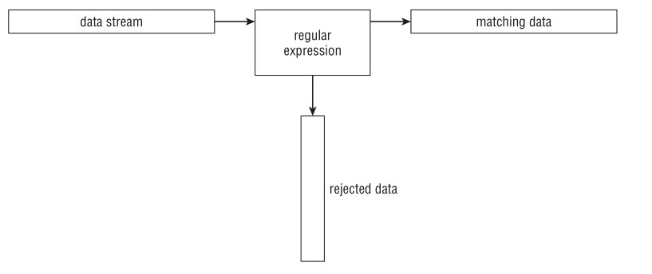

# SED BIBLE KR (Basic & Advanced & Regular Expresssion)

사람들이 셸 스크립트를 사용하는 가장 일반적인 기능 중 하나는 **텍스트 파일을 다루는 것** 이다. 로그 파일을 검사하거나, 설정 파일을 읽거나, 데이터 요소를 처리하는 등 셸 스크립트는 텍스트 파일에 포함된 모든 유형의 데이터를 조작하는 지루한 작업을 자동화하는 데 도움이 될 수 있다. 하지만, 셸 스크립트 명령만으로 텍스트 파일의 내용을 조작하려면 다소 어색할 수 있다. 

셸 스크립트에서 어떤 형태로든 **데이터 조작** 을 수행해야 한다면, Linux에서 사용할 수 있는 `sed` 와 `gawk` 도구에 익숙해지는 것이 좋다. 이러한 도구는 수행할 데이터 처리 작업을 크게 단순화할 수 있다.


## Getting to know the sed editor
sed 편집기는 일반적인 대화형 텍스트 편집기와는 달리 **스트림 편집기**(*stream editor*) 라고 불린다. vim과 같은 대화형 텍스트 편집기에서는 키보드 명령을 사용해서 데이터에 텍스트를 삽입, 삭제 또는 교체하는 작업을 대화형으로 수행한다. 이에 반해 스트림 편집기는 편집기가 데이터를 처리하기 전에 미리 제공한 규칙 집합을 기반으로 데이터 스트림을 편집한다.

sed 편집기는 명령줄에 입력하거나 명령 텍스트 파일에 저장한 명령을 기반으로 데이터 스트림을 조작할 수 있다. sed 편집기는 다음과 같은 작업을 수행한다:

1. 입력에서 한 줄의 데이터를 읽는다.  
2. 해당 데이터를 제공된 편집기 명령과 일치시킨다.  
3. 명령에 지정한 대로 스트림의 데이터를 변경한다.  
4. 새로운 데이터를 STDOUT으로 출력한다.  

스트림 편집기가 모든 명령을 데이터 한 줄에 적용한 후, 다음 줄의 데이터를 읽고 이 과정을 반복한다. 스트림 편집기가 스트림의 모든 데이터 줄을 처리한 후 종료된다.

명령이 줄 단위로 순차적으로 적용되기 때문에 sed 편집기는 데이터 스트림을 한 번만 통과하면서 편집을 수행한다. 이는 sed 편집기가 대화형 편집기보다 훨씬 빠르며, 파일의 데이터를 즉석에서 빠르게 변경할 수 있도록 해준다. sed 명령을 사용하는 형식은 다음과 같다:

```bash
sed options script file
```

*options* 매개변수는 sed 명령의 동작을 사용자 정의할 수 있게 해주며, 표 19-1에 표시된 옵션을 포함한다.

**TABLE 19-1 The sed Command Options**
| 옵션 | 설명 |
| :--- | :--- |
| -e script | 입력을 처리하는 동안 실행할 명령에 스크립트에 지정한 명령을 추가함 |
| -f file | 입력을 처리하는 동안 실행할 명령에 파일에 지정한 명령을 추가함 |
| -n | 각 명령에 대해 출력을 생성하지 않고 *print* 명령을 기다림 |

*script* 매개변수는 스트림 데이터에 적용할 단일 명령을 지정한다. 하나 이상의 명령이 필요한 경우, 명령줄에서 `-e` 옵션을 사용해서 지정하거나 별도의 파일에서 `-f` 옵션을 사용해서 지정한다. 데이터를 조작하기 위한 다양한 **명령**(*command*)이 제공된다. 이 장에서는 sed 편집기에서 사용되는 기본 명령 몇 가지를 살펴보고, 이후에 고급 명령들을 살펴본다.


## Defining an editor command in the command line
기본적으로 sed 편집기는 지정한 명령을 **STDIN 입력 스트림에 적용** 한다. 이를 통해 데이터를 sed 편집기로 직접 파이프(*pipe*)해서 처리할 수 있다. 다음은 이를 보여주는 간단한 예제이다:

```bash
$ echo "This is a test" | sed 's/test/big test/'
This is a big test
$
```

이 예제는 sed 편집기의 `s` (*substitute*) 명령을 사용한다. `s` 명령은 슬래시 문자 사이에 지정한 첫 번째 텍스트 문자열 패턴을 두 번째 텍스트 문자열로 대체한다. 이 예제에서는 *test* 라는 단어가 *big test* 로 대체되었다.

이 예제를 실행하면 결과가 즉시 표시될 것이다. 이것이 sed 편집기를 사용할 때의 강력함이다. 일부 대화형 편집기가 시작되는 데 걸리는 시간만큼의 시간에 데이터를 여러 번 편집할 수 있다.

물론 이런 간단한 테스트는 한 줄의 데이터만 편집했다. 전체 데이터 파일을 편집할 때라 하더라도 동일한 빠른 결과를 얻을 수 있다.

```bash
$ cat data1.txt
The quick brown fox jumps over the lazy dog.
The quick brown fox jumps over the lazy dog.
The quick brown fox jumps over the lazy dog.
The quick brown fox jumps over the lazy dog.
$
$ sed 's/dog/cat/' data1.txt
The quick brown fox jumps over the lazy cat.
The quick brown fox jumps over the lazy cat.
The quick brown fox jumps over the lazy cat.
The quick brown fox jumps over the lazy cat.
$
```

sed 명령은 실행하면 데이터를 즉시 반환한다. 각 데이터 줄을 처리하면서 처리 결과도 표시한다. sed 편집기가 전체 파일을 처리하기 전에 결과를 보기 시작할 것이다.

여기서 중요한 점은 "**sed 편집기는 텍스트 파일의 데이터를 실제로 수정하지 않는다**" 는 것이다. 수정된 텍스트는 STDOUT으로만 전송된다. 텍스트 파일을 확인해 보면 여전히 원래 데이터를 포함하고 있다.

```bash
$ cat data1.txt
The quick brown fox jumps over the lazy dog.
The quick brown fox jumps over the lazy dog.
The quick brown fox jumps over the lazy dog.
The quick brown fox jumps over the lazy dog.
$
```


## Using multiple editor commands in the command line
sed 명령줄에서 하나 이상의 명령을 실행하려면 `-e` 옵션을 사용하면 된다.

```bash
$ sed -e 's/brown/green/; s/dog/cat/' data1.txt
The quick green fox jumps over the lazy cat.
The quick green fox jumps over the lazy cat.
The quick green fox jumps over the lazy cat.
The quick green fox jumps over the lazy cat.
$
```

두 명령은 파일의 각 데이터 줄에 적용된다. 명령은 **세미콜론 문자로 구분** 되어야 하며, 명령 끝과 세미콜론 사이에는 공백이 없어야 한다.

명령을 구분하기 위해 세미콜론 문자를 사용하는 대신 bash 셸의 보조 프롬프트를 사용할 수 있다. sed 프로그램 스크립트(sed 편집기 명령 목록)를 열기 위해 첫 번째 작은따옴표 문자를 입력하면, bash는 닫는 따옴표를 입력할 때까지 추가 명령을 계속해서 입력받는다.

```bash
$ sed -e '
> s/brown/green/
> s/fox/elephant/
> s/dog/cat/' data1.txt
The quick green elephant jumps over the lazy cat.
The quick green elephant jumps over the lazy cat.
The quick green elephant jumps over the lazy cat.
The quick green elephant jumps over the lazy cat.
$
```

"**닫는 작은따옴표는 동일한 줄에서 명령을 끝내야 한다**" 는 점을 기억해야 한다. bash 셸이 닫는 따옴표를 감지하면 명령을 처리한다. 명령이 시작되면 sed 명령은 지정한 각 명령을 텍스트 파일의 각 데이터 줄에 적용한다.


## Reading editor commands from a file
마지막으로, 처리하려는 sed 명령이 많을 경우에는 별도의 파일에 저장하는 것이 더 쉬운 경우가 많다. sed 명령에서 `-f` 옵션을 사용해서 해당 파일을 지정하면 된다.

```bash
$ cat script1.sed
s/brown/green/
s/fox/elephant/
s/dog/cat/
$
$ sed -f script1.sed data1.txt
The quick green elephant jumps over the lazy cat.
The quick green elephant jumps over the lazy cat.
The quick green elephant jumps over the lazy cat.
The quick green elephant jumps over the lazy cat.
$
```

이 경우에는 각 명령 뒤에 세미콜론을 넣지 않는다. sed 편집기는 "**각 줄이 개별 명령을 포함하고 있다**" 는 것을 이미 알고 있다. 명령줄에서 명령을 입력하는 것과 마찬가지로, sed 편집기는 지정한 파일에서 명령을 읽고 이를 데이터 파일의 각 줄에 적용한다.

> [!TIP] 
sed 편집기 스크립트 파일과 bash 셸 스크립트 파일을 혼동하기 쉽다. 혼동을 피하려면 sed 스크립트 파일에 `.sed` 파일 확장자를 사용하는 것이 좋다.

"sed 편집기 기본 명령" 섹션에서 데이터를 조작할 때 유용한 다른 sed 편집기 명령들을 살펴볼 것이다. 그 전에, Linux 데이터 편집기를 간단히 살펴보자.

<br>

---

<br>

# Commanding at the sed Editor Basics
sed 편집기를 성공적으로 사용하기 위한 핵심은 다양한 **명령과 형식에 대해 아는 것** 이다. 이는 텍스트 편집을 사용자 정의하는 데 도움이 된다. 이 섹션에서는 sed 편집기를 사용하기 시작할 수 있도록 스크립트에도 포함할 수 있는 몇 가지 기본 명령과 기능을 설명한다.


## Introducing more substitution options
이미 `s` 명령을 사용해서 한 줄의 텍스트를 새로운 텍스트로 대체하는 방법을 살펴보았다. 하지만 *substitute* 명령에는 작업을 보다 쉽게 만들어주는 몇 가지 추가 옵션이 있다.


### Substituting flags
*substitute* 명령이 텍스트 문자열에서 일치한 패턴을 대체하는 방식에는 주의할 점이 있다. 다음 예제에서 어떤 일이 발생하는지 살펴보자.

```bash
$ cat data4.txt
This is a test of the test script.
This is the second test of the test script.
$
$ sed 's/test/trial/' data4.txt
This is a trial of the test script.
This is the second trial of the test script.
$
```

*substitute* 명령은 여러 줄의 텍스트를 대체하는 데 잘 작동하지만, **기본적으로 각 줄에서 첫 번째 항목만 대체** 한다. 텍스트내의 여러 항목에 대해 *substitute* 명령을 작동시키려면 대체 플래그를 사용해야 한다. 대체 플래그는 대체 문자열 뒤에 설정된다.

```bash
s/pattern/replacement/flags
```

네 가지 유형의 대체 플래그가 사용 가능하다:

- ■ 숫자: 새로운 텍스트로 대체할 일치 패턴의 발생 위치를 지정함  
- ■ `g` : 기존 텍스트의 모든 항목을 새로운 텍스트로 대체함  
- ■ `p` : 원래 줄의 내용을 출력함  
- ■ `w file` : 대체 결과를 파일에 기록함  

첫 번째 유형의 대체에서는 sed 편집기가 새로운 텍스트로 대체할 일치 패턴의 발생 위치를 지정할 수 있다.

```bash
$ sed 's/test/trial/2' data4.txt
This is a test of the trial script.
This is the second test of the trial script.
$
```

대체 플래그를 `2` 로 지정한 결과, sed 편집기는 각 줄에서 두 번째로 나타나는 패턴만 대체한다. `g` (*global*) 대체 플래그를 사용하면 텍스트에서 패턴이 나타나는 모든 항목을 대체할 수 있다.

```bash
$ sed 's/test/trial/g' data4.txt
This is a trial of the trial script.
This is the second trial of the trial script.
$
```

`p` (*print*) 대체 플래그는 *substitute* 명령에서 일치한 패턴을 포함한 줄을 출력한다. 이는 대부분 `-n` (*no print*) sed 옵션과 함께 사용된다.

```bash
$ cat data5.txt
This is a test line.
This is a different line.
$
$ sed -n 's/test/trial/p' data5.txt
This is a trial line.
$
```

`-n` 옵션은 sed 편집기의 출력을 억제한다. 하지만 `p` 대체 플래그는 수정된 줄을 출력한다. 이 둘을 함께 사용하면 *substitute* 명령에 의해 수정된 줄만 출력된다.

`w` (*write*) 대체 플래그는 동일한 출력을 생성하지만, 지정한 파일에 출력을 저장한다.

```bash
$ sed 's/test/trial/w test.txt' data5.txt
This is a trial line.
This is a different line.
$
$ cat test.txt
This is a trial line.
$
```
sed 편집기의 일반 출력은 STDOUT에 나타나지만, 일치한 패턴을 포함하는 줄만 지정한 출력 파일에 저장한다.


### Replacing characters
때때로 텍스트 문자열에 대체 패턴으로 사용하기 어려운 문자를 마주하게 된다. Linux 세계에서 흔한 예로는 슬래시(`/`) 문자이다.

파일에서 경로명을 대체하는 작업은 다소 번거로울 수 있다. 예를 들어, `/etc/passwd` 파일에서 *bash* 셸을 *C* 셸로 대체하려면 다음과 같이 해야 한다:

```bash
$ sed 's/\/bin\/bash/\/bin\/csh/' /etc/passwd
```

슬래시(`/`) 문자는 문자열 **구분자** 로 사용되기 때문에, 패턴 텍스트에 슬래시 문자가 포함될 경우 백슬래시(`\`) 문자로 이스케이프해야 한다. 이는 종종 혼란과 실수를 초래한다.

이 문제를 해결하기 위해 sed 편집기는 *substitute* 명령에서 문자열 구분자로 다른 문자를 선택할 수 있도록 허용한다.

```bash
$ sed 's!/bin/bash!/bin/csh!' /etc/passwd
```

이 예제에서는 느낌표 문자를 문자열 구분자로 사용해서 경로명을 보다 읽기 쉽고 이해하기 쉽게 만든다.


## Using addresses
기본적으로 sed 편집기에서 사용하는 명령은 텍스트 데이터의 모든 줄에 적용된다. 특정 줄이나 줄의 그룹에만 명령을 적용하려면 줄 주소 지정을 사용해야 한다.

sed 편집기에서 줄 주소 지정에는 두 가지 형식이 있다:

- ■ 줄 번호 범위  
- ■ 줄을 필터링하는 텍스트 패턴  

두 형식 모두 주소를 지정하는 데 동일한 형식을 사용한다.

```bash
[address]command
```

특정 주소에 대해 둘 이상의 명령을 함께 그룹화할 수도 있다.

```bash
address {
    command1
    command2
    command3
}
```

sed 편집기는 지정한 명령들을 오직 지정한 주소와 일치한 줄에만 적용한다. 이 섹션에서는 sed 편집기 스크립트에서 이 두 가지 주소 지정 기술을 사용하는 방법을 보여준다.


### Addressing the numeric line
숫자 줄 주소 지정을 사용할 때는 텍스트 스트림에서 줄의 위치를 기준으로 참조한다. sed 편집기는 텍스트 스트림의 첫 번째 줄을 1번 줄로 지정하고 이후 각 줄에 대해 순차적으로 번호를 매긴다.

명령에서 지정한 주소는 단일 줄 번호일 수도 있고, 시작 줄 번호와 끝 줄 번호를 쉼표 문자로 구분해서 지정한 범위일 수도 있다. 다음은 sed 명령이 적용될 줄 번호를 지정한 예제이다.

```bash
$ sed '2s/dog/cat/' data1.txt
The quick brown fox jumps over the lazy dog
The quick brown fox jumps over the lazy cat
The quick brown fox jumps over the lazy dog
The quick brown fox jumps over the lazy dog
$
```

sed 편집기는 지정한 주소에 따라 두 번째 줄만 텍스트를 수정했다. 이번에는 줄 주소 범위를 사용하는 또 다른 예제이다.

```bash
$ sed '2,3s/dog/cat/' data1.txt
The quick brown fox jumps over the lazy dog
The quick brown fox jumps over the lazy cat
The quick brown fox jumps over the lazy cat
The quick brown fox jumps over the lazy dog
$
```

텍스트 내의 특정 지점부터 시작해서 텍스트 끝까지 명령을 적용하려면 특수 주소인 달러 기호(`$`)를 사용할 수 있다.

```bash
$ sed '2,$s/dog/cat/' data1.txt
The quick brown fox jumps over the lazy dog
The quick brown fox jumps over the lazy cat
The quick brown fox jumps over the lazy cat
The quick brown fox jumps over the lazy cat
$
```

텍스트에 몇 줄의 데이터가 있는지 알 수 없기 때문에 달러 기호는 매우 유용하게 사용된다.


### Using text pattern filters
명령이 적용될 줄을 제한하는 또 다른 방법은 조금 더 복잡하다. sed 편집기는 명령을 적용할 줄을 필터링하기 위해 텍스트 패턴을 지정할 수 있도록 허용한다. 형식은 다음과 같다:

```bash
/pattern/command
```

지정한 패턴은 슬래시(`/`) 문자로 감싸야 한다. sed 편집기는 지정한 텍스트 패턴을 포함한 줄에만 명령을 적용한다.

예를 들어, 사용자 *Samantha* 에 대해서만 기본 셸을 변경하려면 다음과 같은 sed 명령을 사용한다:

```bash
$ grep Samantha /etc/passwd
Samantha:x:502:502::/home/Samantha:/bin/bash
$
$ sed '/Samantha/s/bash/csh/' /etc/passwd
root:x:0:0:root:/root:/bin/bash
bin:x:1:1:bin:/bin:/sbin/nologin
[...]
Christine:x:501:501:Christine B:/home/Christine:/bin/bash
Samantha:x:502:502::/home/Samantha:/bin/csh
Timothy:x:503:503::/home/Timothy:/bin/bash
$
```

명령은 일치한 텍스트 패턴이 있는 줄에만 적용되었다. 지금처럼 고정된 텍스트 패턴을 사용하는 것은 *userid* 예제처럼 특정 값을 필터링하는 데 유용할 수 있지만, 활용 범위에는 어느 정도의 제한이 있다. sed 편집기는 텍스트 패턴에 **정규 표현식** (*regular expression*) 이라는 기능을 사용해서 훨씬 복잡한 패턴을 만들 수 있도록 한다.

정규 표현식을 사용하면 다양한 데이터를 일치시키는 고급 텍스트 패턴 매칭 공식을 만들 수 있다. 이러한 공식에는 와일드카드 문자, 특수 문자, 고정 텍스트 문자를 조합해서 거의 모든 텍스트 상황에 맞는 간결한 패턴을 생성한다. 정규 표현식은 셸 스크립트 프로그래밍에서 가장 어려운 부분 중 하나이며, 이후에 보다 자세히 다룬다.


### Grouping commands
개별 줄에 둘 이상의 명령을 수행할 경우, 중괄호 문자를 사용해서 명령들을 함께 **그룹화** 한다. sed 편집기는 해당 주소 줄에 나열한 각 명령을 처리한다.

```bash
$ sed '2{
> s/fox/elephant/
> s/dog/cat
> }' data1.txt
The quick brown fox jumps over the lazy dog.
The quick brown elephant jumps over the lazy cat.
The quick brown fox jumps over the lazy dog.
The quick brown fox jumps over the lazy dog.
$
```

두 명령 모두 지정한 주소에 대해 처리된다. 물론, 그룹화된 명령 앞에 주소 범위를 지정할 수도 있다.

```bash
$ sed '3,${
> s/brown/green/
> s/lazy/active/
> }' data1.txt
The quick brown fox jumps over the lazy dog.
The quick brown fox jumps over the lazy dog.
The quick green fox jumps over the active dog.
The quick green fox jumps over the active dog.
$
```

sed 편집기는 주소 범위 내의 모든 줄에 모든 명령을 적용한다.


## Deleting lines
텍스트 대체 명령은 sed 편집기에서 사용할 수 있는 유일한 명령이 아니다. 텍스트 스트림에서 특정 줄을 삭제할 경우 *delete* 명령을 사용할 수 있다.

*delete* 명령인 `d` 는 말 그대로 작동한다. 지정한 주소 지정 방식과 일치한 텍스트 줄을 삭제한다. *delete* 명령을 사용할 때는 주의해야 한다. 주소 지정 방식을 포함하지 않는다면 **스트림의 모든 줄이 삭제** 된다.

```bash
$ cat data1.txt
The quick brown fox jumps over the lazy dog
The quick brown fox jumps over the lazy dog
The quick brown fox jumps over the lazy dog
The quick brown fox jumps over the lazy dog
$
$ sed 'd' data1.txt
$
```

*delete* 명령은 명백하게 지정한 주소와 함께 사용할 때 가장 유용하다. 이를 통해 데이터 스트림에서 특정 줄을 줄 번호를 삭제할 수 있다.


```bash
$ cat data6.txt
This is line number 1.
This is line number 2.
This is line number 3.
This is line number 4.
$
$ sed '3d' data6.txt
This is line number 1.
This is line number 2.
This is line number 4.
$
```

또는 특정 줄 범위로 삭제할 수도 있다.

```bash
$ sed '2,3d' data6.txt
This is line number 1.
This is line number 4.
$
```

또는 특수한 파일 끝 문자(`$`)를 사용해서 삭제할 수도 있다.

```bash
$ sed '3,$d' data6.txt
This is line number 1.
This is line number 2.
$
```

sed 편집기의 패턴 매칭 기능은 *delete* 명령에도 그대로 적용된다.

```bash
$ sed '/number 1/d' data6.txt
This is line number 2.
This is line number 3.
This is line number 4.
$
```

sed 편집기는 지정한 패턴과 일치한 텍스트를 포함한 줄을 제거한다.

> [!NOTE] 
sed 편집기는 **원본 파일을 수정하지 않는다.** 삭제된 줄은 sed 편집기의 출력에서만 사라지며, 원본 파일에는 여전히 삭제된 줄이 남아 있다.

두 개의 텍스트 패턴을 사용해서 줄 범위를 삭제할 수도 있지만, 이 경우는 주의가 필요하다. 첫 번째 패턴은 줄 삭제 기능를 “**켜고**”, 두 번째 패턴은 줄 삭제 기능을 “**끄는**” 역할을 한다. sed 편집기는 지정한 두 줄 사이의 모든 줄(지정된 줄 포함)을 삭제한다.

```bash
$ sed '/1/,/3/d' data6.txt
This is line number 4.
$
```

또한 주의해야 할 점은, sed 편집기가 데이터 스트림에서 시작 패턴을 감지할 때마다 *delete* 기능이 “**켜진다**”는 것이다. 이것은 예상치 못한 결과를 초래할 수 있다.

```bash
$ cat data7.txt
This is line number 1.
This is line number 2.
This is line number 3.
This is line number 4.
This is line number 1 again.
This is text you want to keep.
This is the last line in the file.
$
$ sed '/1/,/3/d' data7.txt
This is line number 4.
$
```

숫자 *1* 이 포함된 줄이 두 번째로 나타나면서 *delete* 명령이 다시 실행되고, 중지 패턴은 인식되지 않았기 때문에 데이터 스트림의 나머지 줄을 모두 삭제했다. 물론, 또 다른 명백한 문제는 중지 패턴이 텍스트에 전혀 나타나지 않을 경우에도 발생한다.

```bash
$ sed '/1/,/5/d' data7.txt
$
```

삭제 기능이 첫 번째 패턴과 일치하면서 “켜졌지만”, 끝 패턴과 일치하지 않아서 전체 데이터 스트림이 삭제되었다.


## Inserting and appending text
예상할 수 있듯이, 다른 편집기들과 마찬가지로 sed 편집기도 텍스트 스트림에 줄을 **삽입** 하거나 **추가** 할 수 있다. 이 두 동작의 차이는 혼란스러울 수 있다:

- ■ *insert* 명령(`i`)은 지정한 줄 **앞에** 새 줄을 추가한다.  
- ■ append 명령(`a`)은 지정한 줄 **뒤에** 새 줄을 추가한다.

이 두 명령에서 혼란스러운 점은 바로 사용 형식이다. **단일 명령줄에는 사용할 수 없으며, 삽입하거나 추가할 줄은 별도의 줄에 따로 지정해야 한다.** 사용 형식은 다음과 같다:

```bash
sed '[address]command\
new line'
```

새 줄의 텍스트는 지정한 위치에 sed 편집기 출력으로 나타난다. *insert* 명령을 사용할 경우, 텍스트는 데이터 스트림 텍스트 **앞에** 나타난다는 점을 기억하자.

```bash
$ echo "Test Line 2" | sed 'i\Test Line 1'
Test Line 1
Test Line 2
$
```

그리고 *append* 명령을 사용할 경우, 텍스트는 데이터 스트림 텍스트 *뒤에* 나타난다.

```bash
$ echo "Test Line 2" | sed 'a\Test Line 1'
Test Line 2
Test Line 1
$
```

명령줄 인터페이스 프롬프트에서 sed 편집기를 사용할 때는 새로운 데이터 줄을 입력하기 위한 보조 프롬프트가 표시된다. 이 줄에서 sed 편집기 명령을 완성해야만 한다. 종료용 작은따옴표(`'`) 문자를 입력하면 bash 셸이 해당 명령을 처리한다.

```bash
$ echo "Test Line 2" | sed 'i\
> Test Line 1'
Test Line 1
Test Line 2
$
```

텍스트 스트림 앞이나 뒤에 텍스트를 추가하는 것은 잘 작동하지만, 텍스트 스트림 **내부** 에 텍스트를 추가하려면 어떻게 해야 할까?

텍스트 스트림 줄 내부에 데이터를 삽입하거나 추가하려면, sed 편집기에게 데이터가 나타나야 할 위치를 주소 지정 방식으로 알려야 한다. 이 명령들을 사용할 때는 **단일 줄 주소만** 지정할 수 있다. 따라서 숫자 줄 번호나 텍스트 패턴 중 하나를 사용할 수 있지만, **주소 범위는 사용할 수 없다.** 이것은 논리적인 제한이다. 왜냐하면 삽입이나 추가 작업은 단일 줄의 **앞이나 뒤** 에서만 가능하고, 줄 범위 전체에 적용할 수 없기 때문이다.

다음은 데이터 스트림의 3번 줄 **앞에** 새 줄을 삽입하는 예제이다:

```bash
$ sed '3i\
> This is an inserted line.' data6.txt
This is line number 1.
This is line number 2.
This is an inserted line.
This is line number 3.
This is line number 4.
$
```

다음은 데이터 스트림의 3번 줄 **뒤에** 새 줄을 추가하는 예제이다:

```bash
$ sed '3a\
> This is an appended line.' data6.txt
This is line number 1.
This is line number 2.
This is line number 3.
This is an appended line.
This is line number 4.
$
```

이 방식은 *insert* 명령과 동일한 절차를 따르지만, 새로운 텍스트 줄을 지정한 줄 번호 **뒤에** 배치한다. 만약 데이터 스트림이 여러 줄로 구성되어 있고, 그 끝에 새로운 텍스트 줄을 추가하고 싶다면, **달러 기호(`$`)** 를 사용하면 된다. 이 기호는 데이터의 **마지막 줄** 을 나타낸다.

```bash
$ sed '$a\
> This is a new line of text.' data6.txt
This is line number 1.
This is line number 2.
This is line number 3.
This is line number 4.
This is a new line of text.
$
```

동일한 원리로 데이터 스트림의 **처음** 에 새로운 줄을 추가할 때도 그대로 적용된다. 단순히 **1번 줄 앞에** 새 줄을 삽입하면 된다.

여러 줄의 텍스트를 삽입하거나 추가하려면, 각 새로운 텍스트 줄 끝에 **역슬래시(`\`)** 문자를 사용해야 한다. 마지막 줄까지 역슬래시를 붙여야 하며, 마지막 줄에는 붙이지 않는다. 이렇게 처리하면 sed 편집기가 여러 줄의 텍스트를 하나의 삽입 또는 추가 명령으로 처리할 수 있다.

```bash
$ sed '1i\
> This is one line of new text.\
> This is another line of new text.' data6.txt
This is one line of new text.
This is another line of new text.
This is line number 1.
This is line number 2.
This is line number 3.
This is line number 4.
$
```

지정한 두 줄 모두 데이터 스트림에 추가된다.


## Changing lines
*change* 명령은 데이터 스트림에서 전체 텍스트 줄의 내용을 변경할 수 있게 해준다. 이 명령은 *insert* 및 *append* 명령과 동일한 방식으로 작동하며, sed 명령의 나머지 부분과는 별도로 새로운 줄을 지정해야 한다.

```bash
$ sed '3c\
> This is a changed line of text.' data6.txt
This is line number 1.
This is line number 2.
This is a changed line of text.
This is line number 4.
$
```

이 예제에서 sed 편집기는 3번 줄의 텍스트를 변경한다. 또한 주소 대신에 텍스트 패턴을 사용할 수도 있다.

```bash
$ sed '/number 3/c\
> This is a changed line of text.' data6.txt
This is line number 1.
This is line number 2.
This is a changed line of text.
This is line number 4.
$
```

텍스트 패턴을 사용한 *change* 명령은 데이터 스트림에서 일치한 **모든 텍스트 줄을 변경** 한다.

```bash
$ cat data8.txt
This is line number 1.
This is line number 2.
This is line number 3.
This is line number 4.
This is line number 1 again.
This is yet another line.
This is the last line in the file.
$
$ sed '/number 1/c\
> This is a changed line of text.' data8.txt
This is a changed line of text.
This is line number 2.
This is line number 3.
This is line number 4.
This is a changed line of text.
This is yet another line.
This is the last line in the file.
$
```

*change* 명령에서 주소 범위를 사용할 수도 있지만, 결과는 예상과 다를 수 있다.

```bash
$ sed '2,3c\
> This is a new line of text.' data6.txt
This is line number 1.
This is a new line of text.
This is line number 4.
$
```

텍스트가 있는 두 줄을 각각 변경하는 대신, sed 편집기는 하나의 텍스트 줄로 두 줄 모두를 대체한다.


## Transforming characters
*transform* 명령(`y`)은 sed 편집기 명령 중에서 **단일 문자** 에 작동하는 유일한 명령이다. *transform* 명령은 다음과 같은 형식을 사용한다:

```bash
[address]y/inchars/outchars/
```

*transform* 명령은 *inchars* 와 *outchars* 값 간의 **일대일 매핑** 을 수행한다. *inchars* 의 첫 번째 문자는 *outchars* 의 첫 번째 문자로 변환된다. *inchars* 의 두 번째 문자는 *outchars* 의 두 번째 문자로 변환된다. 이러한 매핑은 지정한 문자 길이만큼 계속된다. 만약 *inchars* 와 *outchars* 의 길이가 같지 않다면, sed 편집기는 **오류 메시지를 출력** 한다.

다음은 *transform* 명령을 사용하는 간단한 예제이다:

```bash
$ sed 'y/123/789/' data8.txt
This is line number 7.
This is line number 8.
This is line number 9.
This is line number 4.
This is line number 7 again.
This is yet another line.
This is the last line in the file.
$
```

출력에서 볼 수 있듯이, *inchars* 패턴에 지정한 각각의 문자는 동일한 위치의 *outchars* 패턴 문자로 대체되었다.

또한, *transform* 명령은 **전역 명령** 이다. 즉, 텍스트 줄에서 발견되는 **모든 해당 문자를 자동으로 변환** 하며, 등장 횟수에 관계없이 적용된다.

```bash
$ echo "This 1 is a test of 1 try." | sed 'y/123/456/'
This 4 is a test of 4 try.
$
```

sed 편집기는 텍스트 줄에서 일치한 문자 *1* 의 **모든 인스턴스를 변환** 했다. 변환을 특정 문자 발생 위치에만 제한할 수는 없다.


## Printing revisited
“더 많은 치환 옵션 소개” 섹션에서 sed 편집기가 변경한 줄을 표시하기 위해 치환 명령과 함께 `p` 플래그를 사용하는 방법을 보여주었다. 이 외에도 데이터 스트림에서 정보를 출력하는 데 사용할 수 있는 세 가지 명령이 있다:

- ■ `p` 명령: 텍스트 줄을 출력  
- ■ 등호(`=`) 명령: 줄 번호를 출력  
- ■ `l` 명령(소문자 L): 줄을 자세히 출력

다음 섹션에서는 sed 편집기의 세 가지 출력 명령에 대해 살펴본다.


### Printing lines
치환 명령의 `p` 플래그처럼, `p` 명령은 sed 편집기 출력에 줄을 출력한다. 단독으로 사용할 경우, 이 명령은 그다지 흥미로운 기능은 제공하지 않는다.

```bash
$ echo "this is a test" | sed 'p'
this is a test
this is a test
$
```

이 명령이 하는 일은 이미 존재하는 데이터 텍스트를 출력하는 것뿐이다. *print* 명령의 가장 일반적인 용도는 텍스트 패턴과 일치한 텍스트를 포함한 줄만 출력하는 것이다.

```bash
$ cat data6.txt
This is line number 1.
This is line number 2.
This is line number 3.
This is line number 4.
$
$ sed -n '/number 3/p' data6.txt
This is line number 3.
$
```

명령줄에서 `-n` 옵션을 사용하면 다른 모든 줄의 출력은 억제하고, 텍스트 패턴을 포함한 줄만 출력할 수 있다.

이 방법은 데이터 스트림에서 일부 줄만 빠르게 출력하는 용도로 사용할 수 있다.

```bash
$ sed -n '2,3p' data6.txt
This is line number 2.
This is line number 3.
$
```

*substitution* 또는 *change* 명령처럼 줄을 변경하기 전에 해당 줄을 확인할 용도로 *print* 명령을 사용할 수 있다. 따라서 변경하기 직전의 줄을 표시하는 스크립트를 만들 수 있다.

```bash
$ sed -n '/3/{
> p
> s/line/test/p
> }' data6.txt
This is line number 3.
This is test number 3.
$
```

이 sed 편집기 명령은 *숫자 3* 을 포함하는 줄을 검색하고 두 가지 명령을 실행한다. 먼저 스크립트는 `p` 명령을 사용해서 원래 버전의 줄을 출력한다.

그 다음 `s` 명령을 사용해서 텍스트를 치환하고, 이때 `p` 플래그를 함께 사용해서 변경한 텍스트를 출력한다. 따라서 출력 결과에는 원래 줄의 텍스트와 새로 변경된 줄의 텍스트가 모두 표시된다.


### Printing line numbers
등호(`=`) 명령은 데이터 스트림 내에서 현재 줄의 **줄 번호를 출력** 한다. 줄 번호는 데이터 스트림의 줄바꿈 문자(*newline character*)를 기준으로 결정된다. 데이터 스트림에 줄바꿈 문자가 나타날 때마다, sed 편집기는 해당 문자가 **텍스트 줄의 끝을 나타낸다** 고 간주한다.

```bash
$ cat data1.txt
The quick brown fox jumps over the lazy dog.
The quick brown fox jumps over the lazy dog.
The quick brown fox jumps over the lazy dog.
The quick brown fox jumps over the lazy dog.
$
$ sed '=' data1.txt
1
The quick brown fox jumps over the lazy dog.
2
The quick brown fox jumps over the lazy dog.
3
The quick brown fox jumps over the lazy dog.
4
The quick brown fox jumps over the lazy dog.
$
```

sed 편집기는 실제 텍스트 줄 앞 라인에 줄 번호를 출력한다. 등호(`=`) 명령은 데이터 스트림에서 특정 텍스트 패턴을 검색할 때 유용하게 사용할 수 있다.

```bash
$ sed -n '/number 4/{
> =
> p
> }' data6.txt
4
This is line number 4.
$
```

`-n` 옵션을 사용하면, sed 편집기가 텍스트 패턴을 포함한 줄의 **줄 번호와 텍스트** 를 모두 표시하도록 할 수 있다.


## Listing lines
*list* 명령(`l`)은 데이터 스트림에서 텍스트와 함께 **출력되지 않는(nonprintable)** 문자까지 모두 출력할 수 있게 해준다. 출력되지 않는 문자는 **역슬래시 문자가 붙은 8진수 값** 이나, 탭 문자와 같은 일반적인 비출력 문자에 대해 **C 스타일 표기법**(`\t` 등)을 사용해서 표시한다.

```bash
$ cat data9.txt
This      line     contains    tabs.
$
$ sed -n 'l' data9.txt
This\tline\tcontains\ttabs.$
$
```

탭 문자 위치는 `\t` 표기법으로 표시된다. 줄 끝의 달러 기호는 줄바꿈 문자를 나타낸다. 데이터 스트림에 이스케이프 문자가 포함될 경우, *list* 명령은 필요에 따라 해당 문자를 8진수 코드로 표시한다.

```bash
$ cat data10.txt
This line contains an escape character.
$
$ sed -n 'l' data10.txt
This line contains an escape character. \a$
$
```

*data10.txt* 파일에는 벨 소리를 발생시키는 이스케이프 제어 코드가 포함되어 있다. `cat` 명령을 사용해서 텍스트 파일을 표시하면 이스케이프 제어 코드는 보이지 않고, (스피커가 켜져 있다면) 소리만 들린다. 그러나 *list* 명령을 사용하면 사용된 이스케이프 제어 코드를 표시할 수 있다.


## Using files with sed
*substitution* 명령에는 파일을 다룰 수 있는 플래그들이 포함되어 있다. 또한 텍스트를 치환하지 않고서도 파일을 다룰 수 있는 일반적인 sed 편집기 명령들도 있다.


### Writing to a file
`w` 명령은 줄을 파일에 **쓰기** (*write*) 위해 사용된다. `w` 명령의 형식은 다음과 같다:

```bash
[address]w filename
```

파일 이름은 상대 경로 또는 절대 경로로 지정할 수 있지만, 어떤 경우든 sed 편집기를 실행하는 사용자는 해당 파일에 대한 **쓰기 권한** 을 가지고 있어야 한다. 주소는 sed에서 사용하는 모든 주소 지정 방식—단일 줄 번호, 텍스트 패턴, 줄 번호 범위 또는 텍스트 패턴 범위—를 사용할 수 있다.

다음은 데이터 스트림의 처음 두 줄만 텍스트 파일에 출력하는 예제이다:

```bash
$ sed '1,2w test.txt' data6.txt
This is line number 1.
This is line number 2.
This is line number 3.
This is line number 4.
$
$ cat test.txt
This is line number 1.
This is line number 2.
$
```

물론, 줄을 표준 출력(STDOUT)에 표시하고 싶지 않다면 sed 명령에 `-n` 옵션을 사용할 수 있다.

이 기능은 메일링 리스트 같은 공통 텍스트 값을 기준으로 마스터 파일에서 데이터 파일을 생성할 때 매우 유용한 도구이다.

```bash
$ cat data11.txt
Blum, R Browncoat
McGuiness, A Alliance
Bresnahan, C Browncoat
Harken, C Alliance
$
$ sed -n '/Browncoat/w Browncoats.txt' data11.txt
$
$ cat Browncoats.txt
Blum, R Browncoat
Bresnahan, C Browncoat
$
```

sed 편집기는 텍스트 패턴을 포함한 데이터 줄만 **목적지 파일** 에 기록한다.


### Reading data from a file
이미 sed 명령줄에서 데이터 스트림에 데이터를 삽입하거나 텍스트를 추가하는 방법을 살펴보았다. *read* 명령(`r`)은 별도의 파일에 포함된 데이터를 읽어와서 삽입할 수 있게 해준다.

다음은 *read* 명령의 형식이다:

```bash
[address]r filename
```

*filename* 매개변수는 데이터를 포함한 파일의 절대 경로 또는 상대 경로를 지정한다. *read* 명령에서는 주소 범위를 사용할 수 없다. 단일 줄 번호 또는 텍스트 패턴 주소만 지정할 수 있다. sed 편집기는 해당 주소 다음에 파일의 텍스트를 삽입한다.

```bash
$ cat data12.txt
This is an added line.
This is the second added line.
$
$ sed '3r data12.txt' data6.txt
This is line number 1.
This is line number 2.
This is line number 3.
This is an added line.
This is the second added line.
This is line number 4.
$
```

sed 편집기는 데이터 파일의 모든 텍스트 줄을 읽어와 데이터 스트림에 삽입한다. 동일한 기법은 텍스트 패턴 주소를 사용할 때도 작동한다.

```bash
$ sed '/number 2/r data12.txt' data6.txt
This is line number 1.
This is line number 2.
This is an added line.
This is the second added line.
This is line number 3.
This is line number 4.
$
```

데이터 스트림의 끝에 텍스트를 추가하고 싶다면, 달러 기호 주소 기호(`$`)를 사용하면 된다.

```bash
$ sed '$r data12.txt' data6.txt
This is line number 1.
This is line number 2.
This is line number 3.
This is line number 4.
This is an added line.
This is the second added line.
$
```

*read* 명령의 멋진 활용 방법 중 하나는 *delete* 명령과 함께 사용해서 파일의 자리 표시자를 다른 파일의 데이터로 교체하는 것이다. 예를 들어, 다음과 같은 형식이 텍스트 파일에 저장되어 있다고 가정해보자:

```bash
$ cat notice.std
Would the following people:
LIST
please report to the ship's captain.
$
```

서식 편지는 사람 목록 대신 일반적인 자리표시자인 *LIST* 를 사용한다. 자리표시자 다음에 사람 목록을 삽입하려면 *read* 명령을 사용하면 된다. 하지만 이렇게 하면 출력에 자리표시자 텍스트가 그대로 남는다. 이를 제거하려면 *delete* 명령을 사용하면 된다. 결과는 다음과 같다:

```bash
$ sed '/LIST/{
> r data11.txt
> d
> }' notice.std
Would the following people:
Blum, R Browncoat
McGuiness, A Alliance
Bresnahan, C Browncoat
Harken, C Alliance
please report to the ship's captain.
$
```

이제 자리표시자 텍스트는 데이터 파일의 이름 목록으로 교체되었다.


## Summary
셸 스크립트만으로도 많은 작업을 수행할 수 있지만, 단지 셸 스크립트만으로 데이터를 조작한다는 것은 종종 어렵다. Linux는 텍스트 데이터를 다루는 데 유용한 두 가지 강력한 도구를 제공한다. `sed` 편집기는 데이터를 읽으면서 실시간으로 빠르게 처리할 수 있는 스트림 편집기이다. `sed` 편집기에는 데이터를 처리할 편집 명령 목록을 제공한다.

`gawk` 프로그램은 GNU 조직에서 제공하는 유틸리티로, Unix의 `awk` 프로그램 기능을 모방하고 확장한 것이다. `gawk` 프로그램에는 데이터를 처리하고 조작하기 위한 스크립트를 작성할 수 있는 내장 프로그래밍 언어도 포함되어 있다. `gawk` 프로그램을 사용하면 대형 데이터 파일에서 데이터 요소를 추출하고 원하는 형식으로 출력할 수 있다. 이를 통해 대형 로그 파일을 쉽게 처리하거나 데이터 파일에서 사용자 정의 보고서를 생성할 수 있다.

`sed`와 `gawk` 프로그램을 모두 사용할 때 중요한 요소는 정규 표현식을 사용하는 방법에 대해 아는 것이다. 정규 표현식은 텍스트 파일에서 데이터를 추출하고 조작하기 위한 사용자 정의 필터를 만드는 데 핵심적인 역할을 한다. 다음 장에서는 종종 오해받는 정규 표현식의 세계를 깊이있게 살펴보고, 모든 유형의 데이터를 조작하기 위한 정규 표현식을 만드는 방법을 소개한다.


<br>

---

<br>

# Regular Expressions

셸 스크립트에서 `sed` 편집기와 `gawk` 프로그램을 성공적으로 사용하는 핵심은 정규 표현식을 능숙하게 다루는 것이다. 이것은 항상 쉬운 일은 아니며, 많은 양의 데이터에서 특정 데이터를 필터링하다면 매우 복잡해지는 경우가 많다. 이 장에서는 `sed` 편집기와 `gawk` 프로그램에서 필요한 데이터만 필터링할 수 있도록 정규 표현식을 만드는 방법을 설명한다.


## What Are Regular Expressions?
정규 표현식을 이해하기 위한 첫 번째 단계는 그것이 정확히 무엇인지를 정의하는 것이다. 이 절에서는 정규 표현식이 무엇인지 설명하고, Linux에서 정규 표현식을 어떻게 사용하는지에 대해 설명한다.


### A definition
정규 표현식은 Linux 유틸리티가 **텍스트를 필터링할 때 사용하는 패턴 템플릿** 이다. Linux 유틸리티(`sed` 편집기나 `gawk` 프로그램 등)는 데이터가 유틸리티로 들어올 때 정규 표현식 패턴과 비교한다. 데이터가 패턴과 일치하면 처리 대상으로 받아들이고, 일치하지 않으면 거부한다. 이것은 다음 그림에 설명되어 있다.



정규 표현식 패턴은 와일드카드 문자를 사용해서 데이터 스트림에서 하나 이상의 문자를 나타낸다. Linux에서는 알 수 없는 데이터를 나타내기 위해 와일드카드 문자를 지정할 수 있는 경우가 매우 많다. 파일과 디렉터리를 나열하는 `ls` 명령에서 와일드카드 문자를 사용하는 예제를 본 적이 있다.

별표(`*`) 와일드카드 문자를 사용하면 특정 조건에 맞는 파일만 나열할 수 있다. 예를 들어:

```bash
$ ls -al da*
-rw-r--r-- 1 rich rich 45 Nov 26 12:42 data
-rw-r--r-- 1 rich rich 25 Dec 4 12:40 data.tst
-rw-r--r-- 1 rich rich 180 Nov 26 12:42 data1
-rw-r--r-- 1 rich rich 45 Nov 26 12:44 data2
-rw-r--r-- 1 rich rich 73 Nov 27 12:31 data3
-rw-r--r-- 1 rich rich 79 Nov 28 14:01 data4
-rw-r--r-- 1 rich rich 187 Dec 4 09:45 datatest
$
```

`da*` 매개변수는 `ls` 명령에게 파일 이름이 `da` 로 시작하는 파일만 나열하라고 지시한다. 파일 이름에서 `da` 뒤에는 아무 문자도 없거나 여러 문자가 올 수 있다. `ls` 명령은 디렉터리내의 모든 파일 정보를 읽지만, 와일드카드 문자와 일치한 파일만 표시한다.

정규 표현식의 와일드카드 패턴도 이와 유사하게 작동한다. 정규 표현식 패턴은 텍스트 또는 특수 문자를 포함해서 `sed` 편집기와 `gawk` 프로그램이 데이터를 비교할 때 따를 템플릿을 정의한다. 정규 표현식에서는 다양한 특수 문자를 사용해서 데이터를 필터링하기 위한 특정 패턴을 정의할 수 있다.


### Types of regular expressions
정규 표현식을 사용할 때 가장 큰 문제는 하나의 정규 표현식 세트만 존재하는 것이 아니라는 점이다. Linux 환경에서는 여러 애플리케이션에서 서로 다른 유형의 정규 표현식을 사용한다. 여기에는 프로그래밍 언어(Java, Perl, Python), Linux 유틸리티(`sed` 편집기, `gawk` 프로그램, `grep` 유틸리티), 그리고 일반 애플리케이션(MySQL 및 PostgreSQL 데이터베이스 서버 등)이 포함된다.

정규 표현식은 정규 표현식 엔진을 사용해서 구현된다. 정규 표현식 엔진은 정규 표현식 패턴을 해석하고 해당 패턴을 사용해서 텍스트를 비교하는 기본 소프트웨어이다.

Linux 세계에서 두 가지 인기 있는 정규 표현식 엔진이 있다:

- ■ POSIX 기본 정규 표현식(BRE) 엔진  
- ■ POSIX 확장 정규 표현식(ERE) 엔진

대부분의 Linux 유틸리티는 **최소한 POSIX BRE 엔진 사양을 준수** 하며, 해당 엔진에서 정의한 모든 패턴 기호를 인식한다. 불행하게도 일부 유틸리티(`sed` 편집기 등)는 BRE 엔진 사양의 일부분만 준수한다. 이것은 속도 제약 때문인데, `sed` 편집기는 데이터 스트림의 텍스트를 가능한 한 빠르게 처리하려고 만들었기 때문이다.

POSIX ERE 엔진은 일반적으로 텍스트 필터링에 정규 표현식을 사용하는 프로그래밍 언어에서 주로 사용된다. 이 엔진은 고급 패턴 기호뿐만 아니라 숫자, 단어, 영숫자 문자 등을 일치시키기 위한 특수 기호까지 제공한다. `gawk` 프로그램은 ERE 엔진을 사용해서 정규 표현식 패턴을 처리한다.

정규 표현식을 구현하는 방법이 많기 때문에 가능한 모든 정규 표현식을 간결하게 설명하기란 어렵다. 다음 절에서는 가장 일반적으로 사용되는 정규 표현식을 설명하고, 이를 `sed` 편집기와 `gawk` 프로그램에서 사용하는 방법을 보여준다.


## Defining BRE Patterns
가장 기본적인 BRE 패턴은 데이터 스트림에서 텍스트 문자를 일치시키는 것이다. 이 절에서는 정규 표현식 패턴에서 텍스트를 정의하는 방법과 그 결과에서 기대할 수 있는 내용을 보여준다.


### Plain text
이전 장에서 `sed` 편집기 프로그램에서 표준 텍스트 문자열을 사용해서 데이터를 필터링하는 방법을 설명했다. 다음은 그 기억을 되살리기 위한 예제이다:

```bash
$ echo "This is a test" | sed -n '/test/p'
This is a test
$ echo "This is a test" | sed -n '/trial/p'
$
$ echo "This is a test" | gawk '/test/{print $0}'
This is a test
$ echo "This is a test" | gawk '/trial/{print $0}'
$
```

첫 번째 패턴은 단어 *test* 를 정의한다. `sed` 편집기와 `gawk` 프로그램 스크립트는 각각 자체적인 *print* 명령을 사용해서 정규 표현식 패턴과 일치한 줄을 출력한다. `echo` 문에 *test* 라는 단어가 포함되어 있으므로 데이터 스트림 텍스트는 정의된 정규 표현식 패턴과 일치하고, `sed` 편집기는 해당 줄을 표시한다.

두 번째 패턴은 단어 *trial* 을 정의한다. `echo` 문의 텍스트 문자열에 해당 단어가 포함되어 있지 않기 때문에 정규 표현식 패턴은 일치하지 않으며, `sed` 편집기와 `gawk` 프로그램 모두 해당 줄을 출력하지 않는다.

이미 눈치챘겠지만, 정규 표현식은 패턴이 데이터 스트림내의 어디에 나타나는지는 전혀 신경을 쓰지 않는다. 패턴이 몇 번이나 나타나는지도 중요하지 않다. 정규 표현식이 텍스트 문자열 어디서든 패턴을 일치시킬 수만 있다면, 해당 문자열은 정규 표현식을 사용하는 Linux 유틸리티로 그대로 전달된다.

여기서 핵심은 정규 표현식 패턴을 데이터 스트림 텍스트와 일치시키는 것이다. **정규 표현식은 패턴 일치에 매우 까다롭다** 는 점을 기억하는 것이 중요하다. 

기억해야 할 첫 번째 규칙은 정규 표현식 패턴은 **대소문자를 구분한다** 는 것이다. 즉, 올바른 대소문자를 가진 패턴만 일치한다.

```bash
$ echo "This is a test" | sed -n '/this/p'
$
$ echo "This is a test" | sed -n '/This/p'
This is a test
$
```

첫 번째 시도는 실패했는데, 이것은 텍스트 문자열에 단어 *this* 가 모두 소문자로 나타나지 않았기 때문이다. 반면, 두 번째 시도에서는 패턴에 대문자를 사용했기 때문에 제대로 작동했다.

정규 표현식에서 반드시 전체 단어를 사용할 필요는 없다. 정의된 텍스트가 데이터 스트림 어디에서든 나타나면, 정규 표현식은 다음과 같이 일치한다:

```bash
$ echo "The books are expensive" | sed -n '/book/p'
The books are expensive
$
```

데이터 스트림의 텍스트가 *books* 지만, 스트림 내의 데이터에 정규 표현식 *book* 이 포함되어 있으므로 정규 표현식 패턴은 데이터와 일치한다. 물론 반대로 시도한다면 정규 표현식은 실패한다:

```bash
$ echo "The book is expensive" | sed -n '/books/p'
$
```

정규 표현식 전체 텍스트가 데이터 스트림에 나타나지 않았기 때문에 일치하지 않았고, `sed` 편집기는 텍스트를 표시하지 않았다.

또한 정규 표현식에서 단일 텍스트 단어로만 제한할 필요는 없다. 텍스트 문자열에 공백과 숫자도 포함할 수 있다:

```bash
$ echo "This is line number 1" | sed -n '/ber 1/p'
This is line number 1
$
```

공백은 정규 표현식에서 다른 문자들과 마찬가지로 동일하게 처리된다:

```bash
$ echo "This is line number1" | sed -n '/ber 1/p'
$
```

정규 표현식에 공백을 정의하면, 해당 공백이 데이터 스트림에 반드시 나타나야만 한다. 여러 개의 연속된 공백과 일치하는 정규 표현식 패턴도 만들 수 있다:

```bash
$ cat data1
This is a normal line of text.
This is a line with too many     spaces.
$ sed -n '/ /p' data1
This is a line with too many     spaces.
$
```

단어 사이에 두 개의 공백이 있는 줄은 정규 표현식 패턴과 일치한다. 이것은 텍스트 파일에서 공백 문제를 찾아내는 훌륭한 방법이다!


### Special characters
정규 표현식 패턴에서 텍스트 문자열을 사용할 때 주의할 사항이 있다. 텍스트 문자를 정의할 때 몇 가지 예외가 존재한다. 정규 표현식 패턴에는 **일부 문자에 특별한 의미를 부여** 한다. 이러한 문자를 텍스트 패턴에 사용한다면 예상한 결과를 얻지 못할 수도 있다.

정규 표현식에서 인식하는 특수 문자는 다음과 같다:

```bash
. * [ ] ^ $ { } \ + ? | ( )
```

이 장이 진행되면서 이런 특수 문자가 정규 표현식에서 어떤 역할을 처리하는지 잘 알게 될 것이다. 하지만 지금은 이런 문자를 텍스트 패턴에서 단독으로 사용할 수 없다는 점만 기억하면 된다.

특수 문자를 텍스트 문자로 사용하려면 **이스케이프 처리** 를 해야만 한다. 특수 문자를 이스케이프 처리할 때는 해당 문자 앞에 특별한 문자를 추가해서 정규 표현식 엔진이 다음 문자를 일반 텍스트 문자로 해석하도록 한다. 이때 사용하는 특별한 문자는 **역슬래시 문자(`\`)** 이다.

예를 들어, 텍스트에서 달러 기호 자체를 검색하고 싶다면, 달러 기호 앞에 역슬래시 문자를 붙이면 된다:

```bash
$ cat data2
The cost is $4.00
$ sed -n '/\$/p' data2
The cost is $4.00
$
```

역슬래시 문자는 **특수 문자** 이기 때문에, 정규 표현식 패턴에서 역슬래시 문자 자체를 사용하려면 역시 이스케이프 처리해야 한다. 따라서 **두 개의 역슬래시(`\\`)** 를 사용해야 한다:

```bash
$ echo "\ is a special character" | sed -n '/\\/p'
\ is a special character
$
```

마지막으로, 슬래시(`/`) 문자는 정규 표현식의 특수 문자는 아니지만, `sed` 편집기나 `gawk` 프로그램에서 정규 표현식 패턴에 슬래시 문자를 사용하면 오류가 발생할 수 있다:

```bash
$ echo "3 / 2" | sed -n '///p'
sed: -e expression #1, char 2: No previous regular expression
$
```

슬래시 문자를 사용하려면 그것 또한 이스케이프 처리해야 한다:

```bash
$ echo "3 / 2" | sed -n '/\//p'
3 / 2
$
```

이제 sed 편집기가 정규 표현식 패턴을 제대로 해석할 수 있으며, 모든 것이 잘 작동한다.


## Anchor characters
“일반 텍스트” 섹션에서 보여준 것처럼, 기본적으로 정규 표현식 패턴을 지정하면 해당 패턴이 데이터 스트림 어디에 나타나든지 일치합니다. 패턴을 데이터 스트림의 행의 시작이나 끝에 고정시키기 위해 두 개의 특수 문자를 사용할 수 있다.


### Starting at the beginning
캐럿 (`^`) 문자는 데이터 스트림의 텍스트 **행의 시작** 에서 시작하는 패턴을 정의한다. 패턴이 텍스트 행의 시작이 아닌 다른 위치에 있으면 정규 표현식 패턴은 실패한다.

캐럿 문자를 사용하려면 정규 표현식에서 지정한 패턴 앞에 캐럿 문자를 배치해야 한다:

```bash
$ echo "The book store" | sed -n '/^book/p'
$
$ echo "Books are great" | sed -n '/^Book/p'
Books are great
$
```

캐럿 앵커 문자는 줄 바꿈 문자에 의해 결정된 각 새로운 데이터 행의 시작에서 패턴을 확인한다:

```bash
$ cat data3
This is a test line.
this is another test line.
A line that tests this feature.
Yet more testing of this
$ sed -n '/^this/p' data3
this is another test line.
$
```

패턴이 새로운 행의 시작에 나타나기만 한다면 캐럿 앵커가 이를 제대로 포착한다.

캐럿 문자를 패턴의 시작이 아닌 다른 위치에 배치한다면, 특수 문자가 아닌 일반 문자처럼 작동한다:

```bash
$ echo "This  ^ is a test" | sed -n '/s  ^/p'
This ^ is a test
$
```

캐럿 문자가 정규 표현식 패턴의 마지막에 나열되어 있기 때문에, sed 편집기는 이것을 **일반 문자로 간주** 해서 텍스트와 일치시킨다.

> [!NOTE] 
캐럿 문자만 사용해서 정규 표현식 패턴을 지정할 경우에는 백슬래시 문자로 이스케이프 처리할 필요가 없다. 그러나 캐럿 문자를 먼저 지정하고 그 뒤에 추가 텍스트가 패턴에 포함될 경우에는 캐럿 문자 앞에 이스케이프 문자를 사용해야 한다.


### Looking for the ending
행의 시작에서 패턴을 찾는 것의 반대는 행의 끝에서 패턴을 찾는 것이다. 달러 기호(`$`) 특수 문자는 끝 앵커를 정의한다. 이 특수 문자를 텍스트 패턴 뒤에 추가하면 데이터 행이 해당 텍스트 패턴으로 끝나야 함을 나타낸다:

```bash
$ echo "This is a good book" | sed -n '/book$/p'
This is a good book
$ echo "This book is good" | sed -n '/book$/p'
$
```

끝나는 텍스트 패턴과 관련된 문제는 무엇을 찾고 있는지에 주의해야 한다는 점이다:

```bash
$ echo "There are a lot of good books" | sed -n '/book$/p'
$
```

행 끝에 있는 단어 *book* 을 복수형으로 만들면, 데이터 스트림에 *book* 이 포함되어 있더라도 더 이상 정규 표현식 패턴과 일치하지 않는다. 패턴이 일치하려면 텍스트 패턴이 반드시 행의 마지막에 있어야 한다.


### Combining anchors
일부 상황에서 시작 앵커와 끝 앵커를 같은 행에서 결합할 수 있다. 첫 번째 상황에서는 특정 텍스트 패턴만 포함된 데이터 행을 찾는다고 가정한다:

```bash
$ cat data4
this is a test of using both anchors
I said this is a test
this is a test
I'm sure this is a test.
$ sed -n '/^this is a test$/p' data4
this is a test
$
```

sed 편집기는 지정한 텍스트 외에 다른 텍스트가 포함된 행은 무시한다.

두 번째 상황은 처음에는 다소 이상하게 보일 수도 있지만 매우 유용하다. 패턴 텍스트 없이 두 앵커를 결합한 패턴을 사용하면 데이터 스트림에서 **빈 행을 필터링** 할 수 있다. 다음 예제를 살펴보길 바란다:

```bash
$ cat data5
This is one test line.


This is another test line.
$ sed '/^$/d' data5
This is one test line.
This is another test line.
$
```

정의한 정규 표현식 패턴은 행의 시작과 끝 사이에 아무것도 없는 행을 찾는다. 즉, 빈 행은 줄 바꿈 문자 사이에 텍스트가 없기 때문에 정규 표현식 패턴과 일치한다. sed 편집기는 `d` 삭제 명령을 사용해서 정규 표현식 패턴과 일치하는 행을 삭제하므로 모든 빈 행은 텍스트에서 제거된다. 이것은 문서에서 빈 행을 제거하는 효과적인 방법이다.


### The dot character
점(`.`) 특수 문자는 **줄 바꿈 문자를 제외한 임의의 모든 단일 문자와 일치** 시키는 데 사용한다. 그러나 점 문자는 반드시 어떤 문자와 일치해야 하며, 점이 위치한 자리에 문자가 없으면 패턴은 실패한다.

다음은 정규 표현식 패턴에서 점 문자를 사용하는 몇 가지 예이다:

```bash
$ cat data6
This is a test of a line.
The cat is sleeping.
That is a very nice hat.
This test is at line four.
at ten o'clock we'll go home.
$ sed -n '/.at/p' data6
The cat is sleeping.
That is a very nice hat.
This test is at line four.
$
```

첫 번째 행은 실패하고 두 번째와 세 번째 행이 성공한 이유는 쉽게 이해할 수 있을 것이다. 네 번째 행은 조금 까다롭다. *at* 과 일치했지만 그 앞에 점 문자와 일치할 문자가 없어 보이기 때문이다. 하지만 있다! **정규 표현식에서는 공백도 문자로 간주** 하므로, *at* 앞의 공백은 패턴과 일치한다. 다섯 번째 행은 *at* 을 행의 맨 앞에 배치함으로써 이것을 증명하며, 패턴과 일치하지 않는다.


### Character classes
점(`.`) 특수 문자는 어떤 단일 문자와도 위치를 일치시키는 데 유용하지만, 일치시킬 문자를 제한하고 싶다면 어떻게 처리할까? 이것을 정규 표현식에서는 **문자 클래스** 라 부른다.

텍스트 패턴의 위치에 일치할 수 있는 **문자 집합을 정의**  할 수 있다. 문자 클래스에 포함된 문자 중 하나가 데이터 스트림내에 있다면 패턴과 일치한다.

문자 클래스를 정의하려면 대괄호 문자를 사용한다. 대괄호 문자 사이에는 문자 클래스에 포함시키고 싶은 문자를 넣는다. 그런 다음, 전체 문자 클래스를 다른 와일드카드 문자처럼 패턴 내에서 사용한다. 처음에는 약간 익숙해지는 시간이 필요하지만, 익숙해진다면 꽤나 놀라운 결과를 만들어낼 수 있다.

다음은 문자 클래스를 만드는 예제이다:

```bash
$ sed -n '/[ch]at/p' data6
The cat is sleeping.
That is a very nice hat.
$
```

점 (`.`) 특수 문자 예제에서 사용한 동일한 데이터 파일을 사용했지만, 이번에는 다른 결과를 얻었다. 이번에는 단어 *at* 만 포함된 행을 필터링할 수 있었다. 이 패턴과 일치하는 단어는 *cat* 과 *hat* 뿐이다. 또한 *at* 으로 시작한 행도 일치하지 않았다는 점에 주목해야 한다. 해당 위치에 문자 클래스에 포함된 문자가 있어야만 일치한다.

문자 클래스는 문자의 대소문자를 확실히 알 수 없을 때 유용하다:

```bash
$ echo "Yes" | sed -n '/[Yy]es/p'
Yes
$ echo "yes" | sed -n '/[Yy]es/p'
yes
$
```

하나의 표현식에서 둘 이상의 문자 클래스를 사용할 수도 있다:

```bash
$ echo "Yes" | sed -n '/[Yy][Ee][Ss]/p'
Yes
$ echo "yEs" | sed -n '/[Yy][Ee][Ss]/p'
yEs
$ echo "yeS" | sed -n '/[Yy][Ee][Ss]/p'
yeS
$
```

정규 표현식은 세 개의 문자 클래스를 사용해서 세 문자 위치 모두에 대해 소문자와 대문자를 포함하도록 처리했다.

문자 클래스는 문자뿐만 아니라 숫자도 포함할 수 있다:

```bash
$ cat data7
This line doesn't contain a number.
This line has 1 number on it.
This line a number 2 on it.
This line has a number 4 on it.
$ sed -n '/[0123]/p' data7
This line has 1 number on it.
This line a number 2 on it.
$
```

정규 표현식 패턴은 숫자 0, 1, 2, 또는 3 이 포함된 행과 일치한다. 그 외의 숫자나 숫자가 없는 행은 무시된다.

문자 클래스를 결합해서 전화번호나 우편번호 같은 올바른 형식의 숫자를 확인할 수 있다. 하지만 특정 형식을 일치시킬 때는 주의가 필요하다. 다음은 잘못된 우편번호 일치 예제이다:

```bash
$ cat data8
60633
46201
223001
4353
22203
$ sed -n '
>/[0123456789][0123456789][0123456789][0123456789][0123456789]/p
>' data8
60633
46201
223001
22203
$
```

이 결과는 예상했던 것과 많이 다를 수 있다. 우편번호로 보기에는 너무 짧은 숫자를 잘 걸러냈는데, 이것은 마지막 문자 클래스에 일치할 문자가 없었기 때문이다. 그러나 여전히 여섯 자리 숫자도 통과했는데, 문자 클래스는 다섯 개만 정의했음에도 불구하고 말이다.

**정규 표현식 패턴은 데이터 스트림의 텍스트 어디서든 발견될 수 있다** 는 점을 항상 기억한다. 일치한 패턴 문자 외에도 항상 추가 문자가 있을 수 있다. 숫자 다섯 개만 정확히 일치시키고 싶다면, 공백으로 구분하거나 이 예제처럼 행의 시작과 끝을 표시해서 경계를 명확히 해야 한다:

```bash
$ sed -n '
> /^[0123456789][0123456789][0123456789][0123456789][0123456789]$/p
> ' data8
60633
46201
22203
$
```

이제 훨씬 더 나아졌다! 이 장의 후반부에서는 이를 더욱 간단하게 만드는 방법에 대해 살펴보겠다.

문자 클래스의 인기 있는 용도 중 하나는 사용자 입력 폼에서 입력한 데이터에서 철자가 틀렸을 수 있는 단어를 파싱하는 것이다. 일반적인 철자 오류를 허용하는 정규 표현식을 쉽게 만들 수 있다:

```bash
$ cat data9
I need to have some maintenence done on my car.
I'll pay that in a seperate invoice.
After I pay for the maintenance my car will be as good as new.
$ sed -n '
/maint[ea]n[ae]nce/p
/sep[ea]r[ea]te/p
' data9
I need to have some maintenence done on my car.
I'll pay that in a seperate invoice.
After I pay for the maintenance my car will be as good as new.
$
```

이 예제의 두 개의 sed 출력 명령은 정규 표현식의 문자 클래스를 활용해서 텍스트에서 철자가 틀린 단어인 *maintenance* 와 *separate* 를 포착한다. 동일한 정규 표현식 패턴은 올바르게 철자된 *maintenance* 도 일치한다.


### Negating character classes
정규 표현식 패턴에서는 문자 클래스의 효과를 반대로 적용할 수 있다. 문자 클래스에 포함된 문자를 찾는 대신, 문자 클래스에 **포함되지 않은 문자** 를 찾을 수 있다. 이를 위해서는 **문자 클래스 범위의 시작 부분에 캐럿 문자를 배치** 하면 된다:

```bash
$ sed -n '/[^ch]at/p' data6
This test is at line four.
$
```

문자 클래스를 부정함으로써 정규 표현식 패턴은 *c* 나 *h* 가 **아닌 모든 문자** 와 텍스트 패턴이 일치한다. 공백 문자는 이 범주에 해당하므로 패턴과 일치했다. 그러나 부정을 사용하더라도 문자 클래스는 여전히 어떤 문자와 일치하므로, 행의 시작에 *at* 이 있는 행은 여전히 패턴과 일치하지 않는다.


### Using ranges
앞서 우편번호 예제를 보여줄 때 각 문자 클래스에 가능한 모든 숫자를 모두 나열하는 것이 다소 번거롭다는 점을 눈치챘을 것이다. 다행히, 그렇게 처리하지 않아도 되는 간단한 방법이 있다.

문자 클래스 내에서 대시 (`-`) 기호를 사용해서 **문자 범위를 지정** 할 수 있다. 범위의 첫 번째 문자, 대시 문자, 그리고 마지막 문자를 지정하면 된다. 정규 표현식은 Linux 시스템에서 사용하는 문자 집합에 따라 **지정한 문자 범위 내의 모든 문자를 포함** 한다.

이제 숫자 범위를 지정해서 우편번호 예제를 좀 더 간단히 만들 수 있다:

```bash
$ sed -n '/^[0-9][0-9][0-9][0-9][0-9]$/p' data8
60633
46201
45902
$
```

많은 타이핑을 줄일 수 있었다! 각 문자 클래스는 0 부터 9 까지의 모든 숫자와 일치한다. 데이터에 문자가 포함되어 있다면 패턴은 일치하지 않는다.

```bash
$ echo "a8392" | sed -n '/^[0-9][0-9][0-9][0-9][0-9]$/p'
$
$ echo "1839a" | sed -n '/^[0-9][0-9][0-9][0-9][0-9]$/p'
$
$ echo "18a92" | sed -n '/^[0-9][0-9][0-9][0-9][0-9]$/p'
$
```

같은 기법으로 문자에도 그대로 적용된다:


```bash
$ sed -n '/[c-h]at/p' data6
The cat is sleeping.
That is a very nice hat.
$
```

새로운 패턴 *[c-h]at* 은 첫 글자가 *c* 부터 *h* 사이의 문자로 시작하는 단어와 일치한다. 이 경우, 단어 *at* 만 있는 행은 패턴과 일치하지 않는다.

하나의 문자 클래스에 여러 개의 비연속 범위를 지정할 수도 있다:

```bash
$ sed -n '/[a-ch-m]at/p' data6
The cat is sleeping.
That is a very nice hat.
$
```

이 문자 클래스는 *at* 텍스트 앞에 *a* 부터 *c* 까지, 그리고 *h* 부터 *m* 까지의 범위에 해당하는 문자가 나타나는 것을 허용한다. 이 범위는 *d* 부터 *g* 까지의 문자는 모두 제외한다.

```bash
$ echo "I'm getting too fat." | sed -n '/[a-ch-m]at/p'
$
```

이 패턴은 *fat* 텍스트는 거부했다. 왜냐하면 *f* 는 지정한 범위내에 포함되지 않기 때문이다.


### Special character classes
사용자가 직접 문자 클래스를 정의하는 것 외에도, BRE에는 특정 유형의 문자와 일치시키기 위해 사용할 수 있는 **특수 문자 클래스** 가 포함되어 있다. 표 20-1은 사용할 수 있는 BRE 특수 문자를 설명한다.

**TABLE 20-1 BRE Special Character Classes**

| 클래스 | 설명 |
| :--- | :--- |
| [[:alpha:]] | 대소문자 알파벳 문자와 일치 |
| [[:alnum:]] | 숫자 0–9, 대소문자 A–Z 와 일치 |
| [[:blank:]] | 스페이스 또는 탭 문자와 일치 |
| [[:digit:]] | 숫자 0 부터 9 까지와 일치 |
| [[:lower:]] | 소문자 알파벳 a–z 와 일치 |
| [[:print:]] | 출력 가능한 모든 문자와 일치 |
| [[:punct:]] | 구두점 문자와 일치 |
| [[:space:]] | 공백 문자와 일치: 스페이스, 탭, 줄 바꿈(NL), 폼 피드(FF), 수직 탭(VT), 캐리지 리턴(CR) |
| [[:upper:]] | 대문자 알파벳 A–Z 와 일치 |

특수 문자 클래스는 정규 표현식 패턴에서 일반 문자 클래스처럼 사용한다.

```bash
$ echo "abc" | sed -n '/[[:digit:]]/p'
$
$ echo "abc" | sed -n '/[[:alpha:]]/p'
abc
$ echo "abc123" | sed -n '/[[:digit:]]/p'
abc123
$ echo "This is, a test" | sed -n '/[[:punct:]]/p'
This is, a test
$ echo "This is a test" | sed -n '/[[:punct:]]/p'
$
```

특수 문자 클래스를 사용하는 것은 범위를 정의하는 가장 쉬운 방법이다. *[0–9]* 범위를 사용하는 대신 단순히 *[[:digit:]]* 을 사용할 수 있다.


### The asterisk
문자 뒤에 별표(`*`) 문자를 붙이면 해당 문자가 텍스트에 **0번 이상** 나타나야만 패턴과 일치함을 의미한다.

```bash
$ echo "ik" | sed -n '/ie*k/p'
ik
$ echo "iek" | sed -n '/ie*k/p'
iek
$ echo "ieek" | sed -n '/ie*k/p'
ieek
$ echo "ieeek" | sed -n '/ie*k/p'
ieeek
$ echo "ieeeek" | sed -n '/ie*k/p'
ieeeek
$
```

이 패턴 기호는 일반적으로 철자 오류가 자주 발생하는 단어들이나 언어별 철자 변형을 처리할 때 사용된다. 예를 들어, 스크립트를 미국식 영어와 영국식 영어 모두에서 사용할 수 있도록 작성해야 한다면 다음과 같이 작성할 수 있다:

```bash
$ echo "I'm getting a color TV" | sed -n '/colou*r/p'
I'm getting a color TV
$ echo "I'm getting a colour TV" | sed -n '/colou*r/p'
I'm getting a colour TV
$
```

패턴의 *u** 는 문자 *u* 가 텍스트에 나타나도 되고 나타나지 않아도 패턴과 일치함을 나타낸다. 마찬가지로, 자주 잘못 철자되는 단어가 있다면 별표 문자를 사용해서 이를 수용할 수 있다.

```bash
$ echo "I ate a potatoe with my lunch." | sed -n '/potatoe*/p'
I ate a potatoe with my lunch.
$ echo "I ate a potato with my lunch." | sed -n '/potatoe*/p'
I ate a potato with my lunch.
$
```

가능한 추가 문자 옆에 별표 문자를 붙이면 철자가 틀린 단어라 하더라도 허용할 수 있다.

또 하나 유용한 기능은 점(`.`) 특수 문자와 별표(`*`) 특수 문자를 결합하는 것이다. 이 조합은 **임의의 문자들이 0번 이상 나타나는 패턴** 을 제공한다. 이것은 데이터 스트림에서 두 텍스트 문자열이 서로 인접해 있을 수도 있고 아닐 수도 있는 경우에 자주 사용된다.

```bash
$ echo "this is a regular pattern expression" | sed -n '
> /regular.*expression/p'
this is a regular pattern expression
$
```

이 패턴을 사용하면 데이터 스트림의 텍스트 행 어디서든 나타날 수 있는 여러 단어를 쉽게 검색할 수 있다.

별표는 문자 클래스에도 적용할 수 있다. 이를 통해 텍스트에 여러 번 나타날 수 있는 문자 그룹이나 범위를 지정할 수 있다.

```bash
$ echo "bt" | sed -n '/b[ae]*t/p'
bt
$ echo "bat" | sed -n '/b[ae]*t/p'
bat
$ echo "bet" | sed -n '/b[ae]*t/p'
bet
$ echo "btt" | sed -n '/b[ae]*t/p'
btt
$
$ echo "baat" | sed -n '/b[ae]*t/p'
baat
$ echo "baaeeet" | sed -n '/b[ae]*t/p'
baaeeet
$ echo "baeeaeeat" | sed -n '/b[ae]*t/p'
baeeaeeat
$ echo "baakeeet" | sed -n '/b[ae]*t/p'
$
```

*a* 와 *e* 문자가 *b* 와 *t* 문자 사이에 어떤 조합으로든 나타나기만 한다면(아예 나타나지 않아도 포함), 패턴은 일치한다. 정의한 문자 클래스 외의 다른 문자가 나타난다면 패턴 일치는 실패한다.


## Extended Regular Expressions
POSIX ERE(확장 정규 표현식) 패턴에는 일부 Linux 애플리케이션과 유틸리티에서 사용하는 몇 가지 추가 기호도 포함되어 있다. `gawk` 프로그램은 ERE 패턴을 인식하지만, `sed` 편집기는 인식하지 않는다.

> [!CAUTION] 
`sed` 편집기와 `gawk` 프로그램의 정규 표현식 엔진은 서로 다르다는 점을 기억하길 바란다. `gawk` 프로그램은 대부분의 확장 정규 표현식 패턴 기호를 사용할 수 있으며, `sed` 편집기에서는 제공되지 않는 추가적인 필터링 기능도 제공한다. 하지만 이런 기능들 때문에 데이터 스트림을 처리하는 속도는 종종 더 느릴 수 있다.

이 섹션에서는 `gawk` 프로그램 스크립트에서 사용할 수 있는 일반적으로 많이 사용되는 ERE 패턴 기호들을 설명한다.


### The question mark
물음표 문자는 별표 문자와 비슷하지만 약간 다르다. 물음표는 앞의 문자가 **0번 또는 1번** 나타날 수 있음을 나타낸다. 그러나 해당 문자가 반복해서 나타날 경우에는 일치하지 않는다.

```bash
$ echo "bt" | gawk '/be?t/{print $0}'
bt
$ echo "bet" | gawk '/be?t/{print $0}'
bet
$ echo "beet" | gawk '/be?t/{print $0}'
$
$ echo "beeet" | gawk '/be?t/{print $0}'
$
```

`e` 문자가 텍스트에 나타나지 않거나 한 번만 나타날 경우, 패턴은 일치한다.

별표 문자와 마찬가지로, 물음표 문자도 문자 클래스와 함께 사용할 수 있다.

```bash
$ echo "bt" | gawk '/b[ae]?t/{print $0}'
bt
$ echo "bat" | gawk '/b[ae]?t/{print $0}'
bat
$ echo "bot" | gawk '/b[ae]?t/{print $0}'
$
$ echo "bet" | gawk '/b[ae]?t/{print $0}'
bet
$ echo "baet" | gawk '/b[ae]?t/{print $0}'
$
$ echo "beat" | gawk '/b[ae]?t/{print $0}'
$
$ echo "beet" | gawk '/b[ae]?t/{print $0}'
$
```

문자 클래스에서 0 개 또는 1 개의 문자가 나타나면 패턴은 일치한다. 그러나 두 문자가 모두 나타나거나, 하나의 문자가 두 번 나타나면 패턴 일치는 실패한다.


### The plus sign
더하기 기호(`+`)는 별표 문자와 유사한 또 다른 패턴 기호지만, 물음표 문자와는 다른 방식으로 동작한다. 더하기 기호는 앞의 문자가 **1번 이상** 나타나야 함을 의미한다. 해당 문자가 **적어도 한 번은 반드시 존재해야** 하며, 그렇지 않으면 패턴은 일치하지 않는다.

```bash
$ echo "beeet" | gawk '/be+t/{print $0}'
beeet
$ echo "beet" | gawk '/be+t/{print $0}'
beet
$ echo "bet" | gawk '/be+t/{print $0}'
bet
$ echo "bt" | gawk '/be+t/{print $0}'
$
```

*e* 문자가 존재하지 않으면 패턴 일치는 실패한다. 더하기 기호는 별표와 물음표처럼 문자 클래스에도 동일하게 적용된다.

```bash
$ echo "bt" | gawk '/b[ae]+t/{print $0}'
$
$ echo "bat" | gawk '/b[ae]+t/{print $0}'
bat
$ echo "bet" | gawk '/b[ae]+t/{print $0}'
bet
$ echo "beat" | gawk '/b[ae]+t/{print $0}'
beat
$ echo "beet" | gawk '/b[ae]+t/{print $0}'
beet
$ echo "beeat" | gawk '/b[ae]+t/{print $0}'
beeat
$
```

이번에는 문자 클래스에 정의된 문자 중 하나라도 나타난다면 텍스트는 지정한 패턴과 일치한다.


### Using braces
ERE에서는 중괄호 문자를 사용해서 반복 가능한 정규 표현식에 제한을 지정할 수 있다. 이것은 종종 **간격(interval)** 이라고 부른다. 간격은 두 가지 형식으로 표현할 수 있다:

- `m` : 정규 표현식이 정확히 m번 나타남  
- `m,n` : 정규 표현식이 최소 m번, 최대 n번 나타남

이 기능을 통해 문자(또는 문자 클래스)가 패턴에서 나타나는 **횟수를 정밀하게 조정** 할 수 있다.

> [!CAUTION] 
기본적으로 `gawk` 프로그램은 정규 표현식 간격(*interval*)을 인식하지 않는다. `gawk` 프로그램이 간격을 인식하도록 처리하려면 명령줄 옵션 `--re-interval`을 지정해야 한다.

다음은 하나의 값으로 간단한 간격을 사용하는 예이다:

```bash
$ echo "bt" | gawk --re-interval '/be{1}t/{print $0}'
$
$ echo "bet" | gawk --re-interval '/be{1}t/{print $0}'
bet
$ echo "beet" | gawk --re-interval '/be{1}t/{print $0}'
$
```

간격을 1 로 지정하면 해당 문자가 문자열에 나타날 수 있는 횟수를 제한한다. 문자가 더 많이 나타난다면 패턴 일치는 실패한다.

종종 하한과 상한을 함께 지정하는 것은 유용하다.

```bash
$ echo "bt" | gawk --re-interval '/be{1,2}t/{print $0}'
$
$ echo "bet" | gawk --re-interval '/be{1,2}t/{print $0}'
bet
$ echo "beet" | gawk --re-interval '/be{1,2}t/{print $0}'
beet
$ echo "beeet" | gawk --re-interval '/be{1,2}t/{print $0}'
$
```

이 예에서는 문자 *e* 가 한 번 또는 두 번 나타나야만 패턴은 일치한다. 그렇지 않으면 패턴 일치는 실패한다.

간격 패턴 일치는 문자 클래스에도 그대로 적용된다.

```bash
$ echo "bt" | gawk --re-interval '/b[ae]{1,2}t/{print $0}'
$
$ echo "bat" | gawk --re-interval '/b[ae]{1,2}t/{print $0}'
bat
$ echo "bet" | gawk --re-interval '/b[ae]{1,2}t/{print $0}'
bet
$ echo "beat" | gawk --re-interval '/b[ae]{1,2}t/{print $0}'
beat
$ echo "beet" | gawk --re-interval '/b[ae]{1,2}t/{print $0}'
beet
$ echo "beeat" | gawk --re-interval '/b[ae]{1,2}t/{print $0}'
$
$ echo "baeet" | gawk --re-interval '/b[ae]{1,2}t/{print $0}'
$
$ echo "baeaet" | gawk --re-interval '/b[ae]{1,2}t/{print $0}'
$
```

이 정규 표현식 패턴은 텍스트 패턴에 문자 *a* 또는 *e* 가 정확히 1 번 또는 2 번 나타날 경우에만 일치하며, 그 이상의 어떤 조합으로든 더 많이 나타난다면 일치하지 않는다.


### The pipe symbol
파이프 기호(`|`)를 사용하면 정규 표현식 엔진이 데이터를 검사할 때 **논리 OR** 방식으로 두 개 이상의 패턴을 지정할 수 있다. 패턴 중 하나라도 데이터 스트림의 텍스트와 일치한다면 텍스트는 통과한다. 패턴이 하나도 일치하지 않으면 텍스트는 실패한다.

다음은 파이프 기호를 사용하는 형식이다:

```bash
expr1|expr2|...
```

다음은 이에 대한 예이다:

```bash
$ echo "The cat is asleep" | gawk '/cat|dog/{print $0}'
The cat is asleep
$ echo "The dog is asleep" | gawk '/cat|dog/{print $0}'
The dog is asleep
$ echo "The sheep is asleep" | gawk '/cat|dog/{print $0}'
$
```

이 예제는 데이터 스트림에서 정규 표현식 *cat* 또는 *dog* 을 찾는다. 정규 표현식과 파이프 기호 사이에 공백을 넣으면 그 공백까지 정규 표현식 패턴에 포함되므로 주의해야 한다.

파이프 기호 양쪽에 있는 정규 표현식은 문자 클래스 등 어떤 정규 표현식 패턴이든 모두 사용할 수 있다. 이를 통해 텍스트를 보다 유연하게 정의할 수 있다.

```bash
$ echo "He has a hat." | gawk '/[ch]at|dog/{print $0}'
He has a hat.
$
```

이 예제는 데이터 스트림 텍스트에서 *cat*, *hat*, 또는 *dog* 와 일치한다.


### Grouping expressions
정규 표현식 패턴은 괄호 문자를 사용해서 그룹화할 수도 있다. 패턴을 그룹화하면 해당 그룹은 하나의 일반 문자처럼 처리된다. 따라서 특수 문자를 그룹에 적용할 수 있으며, 이것은 개별 문자에 적용하던 방식과 동일하다. 예를 들어:

```bash
$ echo "Sat" | gawk '/Sat(urday)?/{print $0}'
Sat
$ echo "Saturday" | gawk '/Sat(urday)?/{print $0}'
Saturday
$
```

*urday* 라는 끝부분을 괄호로 묶고 물음표를 함께 사용하면, 패턴은 전체 요일 이름인 *Saturday* 또는 축약형인 *Sat* 과도 일치한다.

그룹화를 파이프 기호와 함께 사용해서 사용 가능한 패턴 일치 그룹을 만드는 것도 일반적인 처리 방식이다.

```bash
$ echo "cat" | gawk '/(c|b)a(b|t)/{print $0}'
cat
$ echo "cab" | gawk '/(c|b)a(b|t)/{print $0}'
cab
$ echo "bat" | gawk '/(c|b)a(b|t)/{print $0}'
bat
$ echo "bab" | gawk '/(c|b)a(b|t)/{print $0}'
bab
$ echo "tab" | gawk '/(c|b)a(b|t)/{print $0}'
$
$ echo "tac" | gawk '/(c|b)a(b|t)/{print $0}'
$
```

패턴 *(c|b)a(b|t)* 는 첫 번째 그룹의 문자들과 두 번째 그룹의 문자들이 어떤 조합으로든 나타날 경우에만 일치한다.


## Regular Expressions in Action
이제 정규 표현식 패턴의 사용 규칙과 몇 가지 간단한 예제를 살펴보았으니, 그 지식을 실제로 활용해 볼 시간이다. 다음 섹션에서는 셸 스크립트 내에서 자주 사용하는 정규 표현식 예제를 보여준다.


### Counting directory files
먼저, `PATH` 환경 변수에 정의된 디렉터리들에 존재하는 **실행 가능한 파일** 의 개수를 세는 셸 스크립트를 살펴보겠다. 이를 위해서는 `PATH` 변수의 값을 개별 디렉터리 이름으로 분리해야 한다. `PATH` 환경 변수를 표시하는 방법은 다음과 같다.

```bash
$ echo $PATH
/usr/local/sbin:/usr/local/bin:/usr/sbin:/usr/bin:/sbin:/bin:/usr/games:/usr/
local/games
$
```

사용자의 `PATH` 환경 변수는 애플리케이션이 Linux 시스템 내 어디에 위치해 있는지에 따라 달라진다. 여기서 핵심은 `PATH` 내의 각 디렉터리가 **콜론(:)** 문자로 서로 구분되어 있다는 점을 인식하는 것이다. 스크립트에서 사용할 수 있는 디렉터리 목록을 얻으려면 각 콜론을 **공백** 문자로 바꿔야 한다.

이제 `sed` 편집기가 간단한 정규 표현식을 사용해서 이를 수행할 수 있다는 것을 알게 되었을 것이다:

```bash
$ echo $PATH | sed 's/:/ /g'
/usr/local/sbin /usr/local/bin /usr/sbin /usr/bin /sbin /bin
/usr/games /usr/local/games
$
```

먼저 디렉터리를 분리한 후에 표준 `for` 문을 사용해서 각 디렉터리를 반복 처리할 수 있다.

```bash
mypath=$(echo $PATH | sed 's/:/ /g')
for directory in $mypath
do
...
done
```

각 디렉터리를 얻은 후에는 `ls` 명령어를 사용해서 각 디렉터리내의 파일을 나열할 수 있으며, 또 다른 `for` 문을 사용해서 각 파일을 반복 처리하면서 파일마다 카운터를 증가시킬 수 있다.

스크립트의 최종 버전은 다음과 같다:

```bash
$ cat countfiles
#!/bin/bash
# count number of files in your PATH
mypath=$(echo $PATH | sed 's/:/ /g')
count=0
for directory in $mypath
do
    check=$(ls $directory)
    for item in $check
    do
        count=$[ $count + 1 ]
    done
    echo "$directory - $count"
    count=0
done
$ ./countfiles /usr/local/sbin - 0
/usr/local/bin - 2
/usr/sbin - 213
/usr/bin - 1427
/sbin - 186
/bin - 152
/usr/games - 5
/usr/local/games – 0
$
```

이제 정규 표현식이 가진 강력한 기능 중 일부를 직접 확인할 수 있게 됐다!


### Validating a phone number
이전 예제에서는 간단한 정규 표현식을 `sed` 와 함께 사용해서 데이터 스트림의 문자를 바꾸고 데이터를 처리하는 방법을 보여주었다. 종종 정규 표현식은 **데이터가 스크립트에 적합한 형식인지 확인하기 위한 유효성 검사** 에도 사용된다.

일반적인 데이터 유효성 검사 사례 중 하나는 바로 **전화번호 확인** 이다. 데이터 입력 양식에서는 종종 전화번호를 요청하지만, 사용자들이 올바른 형식으로 입력하지 않는 경우가 많다. 미국에서는 전화번호를 표시하는 데 여러 가지 일반적인 형식이 사용된다:

```bash
(123)456-7890
(123) 456-7890
123-456-7890
123.456.7890
```

이로 인해 고객이 전화번호를 입력할 수 있는 방식은 크게 네 가지가 된다. 따라서 정규 표현식은 이러한 모든 경우를 처리할 수 있을 만큼 **견고하게** 작성되어야 한다.

정규 표현식을 만들 때는 **왼쪽부터 시작해서** 마주칠 수 있는 가능한 문자들을 일치시키는 방식으로 패턴을 구성하는 것이 좋다. 이 예제에서는 전화번호에 **왼쪽 괄호가 있을 수도 있고 없을 수도** 있다. 이를 일치시키기 위한 패턴은 다음과 같다:

```bash
^\(?
```

캐럿(`^`) 문자은 데이터의 **시작 위치** 를 나타내는 데 사용된. 왼쪽 괄호 문자는 **특수 문자** 이므로, 일반 문자로 사용하려면 **이스케이프 처리** 를 해야 한다. (`\(`). 물음표(`?`) 문자는 괄호가 **있을 수도 있고 없을 수도 있음** 을 나타낸다.

다음으로는 **3자리 지역번호** 처리이다. 미국에서는 지역번호가 **2부터 시작** 하며, **0이나 1로 시작하는 지역번호는 없다**. 지역번호를 일치시키기 위한 패턴은 다음과 같다:

```bash
[2-9][0-9]{2}
```

이 패턴은 첫 번째 문자가 **2부터 9 사이의 숫자** 여야 하며, 그 뒤에 **임의의 두 숫자** 가 따라야 한다. 지역번호 다음에는 **오른쪽 괄호가 있을 수도 있고 없을 수도** 있다.

```bash
\)?
```

지역번호 다음에는 **공백**, **공백 없음**, **하이픈(-)** 또는 **점(.)** 이 올 수 있다. 이러한 모든 경우를 처리하기 위해 **문자 그룹** 과 **파이프 기호** 를 함께 사용할 수 있다:

```bash
(| |-|\.)
```

가장 처음의 파이프 기호는 왼쪽 괄호 바로 뒤에 위치하며 **공백이 없는 경우** 를 처리한다. 점(`.`)은 **이스케이프 문자** 로 사용해야 하며, 그렇지 않으면 **임의의 문자** 로 해석된다.

다음은 **3자리 전화 교환 번호** 이다. 이 부분은 특별한 처리가 필요하지 않다.

```bash
[0-9]{3}
```

전화 교환 번호 다음에는 **공백**, **하이픈(-)** 또는 **점(.)** 을 일치시켜야 한다. 이번에는 **공백 없음** 은 처리할 필요가 없다. 왜냐하면 전화 교환 번호와 그 다음 번호 사이에는 **최소한 하나의 구분 문자** 가 반드시 있어야만 하기 때문이다.

```bash
( |-|\.)
```

마지막으로, 문자열 끝에 있는 **4자리 지역 전화번호(내선 번호)** 를 일치시켜야 한다.

```bash
[0-9]{4}$
```

전체 패턴을 모두 조합하면 다음과 같다:

```bash
^\(?[2-9][0-9]{2}\)?(| |-|\.)[0-9]{3}( |-|\.)[0-9]{4}$
```

이 정규 표현식 패턴은 `gawk` 프로그램에서 **잘못된 전화번호를 걸러내는 데** 사용할 수 있다. 이제 이 정규 표현식을 활용한 간단한 스크립트를 만들어 전화번호 목록을 해당 스크립트를 통해 필터링하면 된다.

여기서 주의할 점은, `gawk` 프로그램에서 **정규 표현식의 반복(interval) 기능** 을 사용할 때는 반드시 명령줄 옵션 `--re-interval` 을 함께 지정해야 한다는 것이다. 그렇지 않으면 올바른 결과를 얻을 수 없다.

다음은 그에 대한 스크립트이다:

```bash
$ cat isphone
#!/bin/bash
# script to filter out bad phone numbers
gawk --re-interval '/^\(?[2-9][0-9]{2}\)?(| |-|\¬
[0-9]{3}( |-|\.)[0-9]{4}/{print $0}'
$
```

이 목록만으로는 알 수 없지만, 셸 스크립트에서 `gawk` 명령은 **한 줄로 작성되어 있다**. 이후에는 전화번호 데이터를 해당 스크립트로 **리디렉션해서 처리** 할 수 있다.

```bash
$ echo "317-555-1234" | ./isphone
317-555-1234
$ echo "000-555-1234" | ./isphone
$ echo "312 555-1234" | ./isphone
312 555-1234
$
```

또는 전화번호가 담긴 **전체 파일을 리디렉션** 해서 **유효하지 않은 번호들을 필터링** 할 수도 있다.

```bash
$ cat phonelist
000-000-0000
123-456-7890
212-555-1234
(317)555-1234
(202) 555-9876
33523
1234567890
234.123.4567
$ cat phonelist | ./isphone
212-555-1234
(317)555-1234
(202) 555-9876
234.123.4567
$
```

정규 표현식 패턴과 일치한 **유효한 전화번호만** 출력된다.


### Parsing an e-mail address
요즘 이메일은 중요한 커뮤니케이션 수단이다. 이메일 주소를 **유효성 검사** 하는 것은 스크립트 작성자들에게 꽤나 **도전적인 작업** 이다. 그 이유는 이메일 주소를 만드는 방식이 매우 다양하기 때문이다.

이메일 주소의 기본 형식은 다음과 같다:

```bash
username@hostname
```

*username* 값에는 **영숫자 문자** 외에도 다음과 같은 **특수 문자** 들을 사용할 수 있다:

-  점(`.`)  
-  대시(`-`)  
-  더하기 기호(`+`)  
-  밑줄(`_`)

이런 문자들은 **어떤 조합으로든** 유효한 이메일 사용자 ID에 포함될 수 있다.

이메일 주소의 *hostname* 부분은 **하나 이상의 도메인 이름과 서버 이름** 으로 구성된다. 서버 및 도메인 이름 역시 **엄격한 명명 규칙** 을 따라야 하며, 다음과 같은 문자만 허용된다:

-  영숫자 문자  
-  점(`.`)  
-  밑줄(`_`)

서버 이름과 도메인 이름은 각각 **점 문자로 구분** 되며, **서버 이름이 먼저**, 그 다음에 **서브도메인 이름**, 마지막으로 **최상위 도메인 이름** 이 오며, **마지막에는 점문자가 없어야** 한다.

한때 최상위 도메인(TLD)은 제한적이었기 때문에, 정규 표현식 작성자들은 이것을 모두 패턴에 포함시키려 했다. 하지만 인터넷이 성장하면서 TLD의 수가 급격히 늘어났고, 이 방식은 더 이상 **실효성 있는 해결책이 아니다**.

이제부터 정규 표현식 패턴을 **왼쪽부터** 만들어 보겠다. *사용자 이름에는 여러 가지 유효한 문자가 포함될 수 있다* 는 점을 알고 있으므로, 이 부분은 비교적 쉽게 처리할 수 있다:

```bash
^([a-zA-Z0-9_\-\.\+]+)@
```

이 그룹화는 사용자 이름에 허용되는 문자들을 지정하며, **플러스 기호(`+`)** 는 **최소한 하나 이상의 문자가 반드시 있어야 함** 을 나타낸다. 그 다음 문자는 당연히 **@ 기호** 이다 — 특별할 것 없는 부분이다.

*hostname* 패턴은 서버 이름과 서브도메인 이름을 일치시키기 위해 **같은 방식의 정규 표현식 기법** 을 사용한다:

```bash
([a-zA-Z0-9_\-\.]+)
```

이 패턴은 다음과 같은 형식의 텍스트와 일치한다:

```bash
server
server.subdomain
server.subdomain.subdomain
```

최상위 도메인(TLD)에는 **특별한 규칙** 이 있다. TLD는 **알파벳 문자만** 사용할 수 있으며, 길이는 **최소 2자(국가 코드 등)** 에서 **최대 5자** 까지여야만 한다.

다음은 최상위 도메인에 대한 정규 표현식 패턴이다:

```bash
\.([a-zA-Z]{2,5})$
```

전체 패턴을 조합하면 다음과 같다:

```bash
^([a-zA-Z0-9_\-\.\+]+)@([a-zA-Z0-9_\-\.]+)\.([a-zA-Z]{2,5})$
```

이 패턴은 형식이 잘못된 이메일 주소를 데이터 목록에서 걸러낸다. 이제 이 정규 표현식을 구현하는 스크립트도 만들 수 있다:

```bash
$ echo "rich@here.now" | ./isemail
rich@here.now
$ echo "rich@here.now." | ./isemail
$
$ echo "rich@here.n" | ./isemail
$
$ echo "rich@here-now" | ./isemail
$
$ echo "rich.blum@here.now" | ./isemail
rich.blum@here.now
$ echo "rich_blum@here.now" | ./isemail
rich_blum@here.now
$ echo "rich/blum@here.now" | ./isemail
$
$ echo "rich#blum@here.now" | ./isemail
$
$ echo "rich*blum@here.now" | ./isemail
$
```


### Summary
셸 스크립트에서 데이터 파일을 다루려면 정규 표현식에 익숙해져야 한다. 정규 표현식은 Linux 유틸리티, 프로그래밍 언어, 그리고 정규 표현식 엔진을 사용하는 애플리케이션에서 구현되어 있다. Linux 환경에서는 다양한 정규 표현식 엔진이 사용되며, 그중 가장 널리 쓰이는 두 가지는 **POSIX 기본 정규 표현식(BRE)** 엔진과 **POSIX 확장 정규 표현식(ERE)** 엔진이다. `sed` 편집기는 주로 BRE 엔진을 따르며, `gawk` 프로그램은 ERE 엔진의 대부분 기능을 활용한다.

정규 표현식은 데이터 스트림에서 텍스트를 필터링하기 위해 사용되는 **패턴 템플릿**을 정의한다. 이 패턴은 일반 문자와 특수 문자의 조합으로 구성된다. 특수 문자는 정규 표현식 엔진이 하나 이상의 문자를 일치시키는 데 사용되며, 이것은 다른 애플리케이션에서 와일드카드 문자가 작동하는 방식과 유사하다.

일반 문자와 특수 문자를 조합함으로써 거의 모든 유형의 데이터를 일치시키는 패턴을 정의할 수 있다. 그런 다음 `sed` 편집기나 `gawk` 프로그램을 사용해서 큰 데이터 스트림에서 특정 데이터를 필터링하거나, 데이터 입력 애플리케이션에서 받은 데이터를 검증할 수 있다.

다음 장에는 `sed` 편집기를 사용해서 고급 텍스트 조작을 수행하는 방법을 더 깊이 다룬다. `sed` 편집기에는 대용량 데이터 스트림을 처리하고 필요한 데이터만 필터링하는 데 유용한 다양한 고급 기능이 포함되어 있다.


<br>

---

<br>


# Advanced sed

이전 장에서 `sed` 편집기를 사용해서 데이터 스트림의 텍스트를 조작하는 **기본적인 방법** 을 살펴봤다. 기본적인 `sed` 편집기 명령어만으로도 대부분의 일상적인 텍스트 편집 작업을 처리할 수 있다. 이번 장에는 `sed` 편집기가 제공하는 **고급 기능들** 을 살펴본다. 이러한 기능들은 자주 사용하지 않을 수도 있지만, 필요할 때 사용할 수 있다는 점과 사용 방법을 알고 있다면 매우 유용할 것이다.


## Looking at Multiline Commands
기본적인 `sed` 편집기 명령을 사용할 때 한 가지 **제한 사항** 을 눈치챘을 수도 있다. 모든 `sed` 명령은 **한 줄의 데이터에 대해서만** 동작한다. `sed` 편집기는 데이터 스트림을 읽을 때 **줄바꿈 문자** 를 기준으로 **데이터를 줄 단위로 나누며, 각 줄을 하나씩 처리** 한다. 즉, 정의한 스크립트 명령을 한 줄에 모두 적용한 후 다음 줄로 넘어가서 같은 처리를 반복한다.

하지만 때로는 **여러 줄에 걸친 데이터에 대해 작업을 처리할 필요** 가 있다. 특히 **특정 문구를 찾거나 교체** 할 경우에 그렇다.

예를 들어, 데이터에 *Linux System Administrators Group* 라는 문구를 찾을 때, 만약 이 문구가 **두 줄에 걸쳐 분리되어 있을 가능성** 이 있다. 일반적인 `sed` 명령으로는 이런 **분리된 문구를 제대로 감지할 수 없다**.

다행히 `sed` 편집기의 설계자들은 이러한 상황까지 고려해서 해결책을 마련했다. `sed`에는 **여러 줄의 텍스트를 처리할 수 있는 세 가지 특별한 명령어** 가 포함되어 있다:

- `N` : 다음 줄을 현재 줄에 추가해서 **멀티라인 그룹** 을 생성한다.  
- `D` : 멀티라인 그룹에서 **한 줄을 삭제** 한다.  
- `P` : 멀티라인 그룹에서 **한 줄만 출력** 한다.

다음 섹션에서 이런 **멀티라인 명령어들을 자세히 살펴보고**, 스크립트에서 어떻게 활용할 수 있는지 예제를 통해 설명한다.


### Navigating the next command
멀티라인 *next* 명령을 살펴보기 전에, 우선 **단일 라인 버전의 next 명령** 이 어떻게 작동하는지 이해해야 한다. 이 명령이 수행하는 동작을 알고 나면, **멀티라인 버전의 next 명령** 이 어떻게 작동하는지도 훨씬 쉽게 이해할 수 있다.


#### Using the single-line next command
소문자 `n` 명령은 `sed` 편집기에게 **명령의 시작으로 돌아가지 않고** 데이터 스트림의 **다음 줄로 이동하라** 고 지시한다. 일반적으로 `sed`는 한 줄의 텍스트에 대해 **정의한 모든 명령을 처리한 후** 다음 줄로 이동한다. 하지만 단일 라인 *next* 명령은 이러한 흐름을 **변경** 한다.

이 설명이 다소 복잡하게 들릴 수도 있으며, 실제로도 때때로 그럴 것이다. 예를 들어, 다섯 줄로 구성된 데이터 파일이 있고 그 중 두 줄이 **빈 줄** 이라 가정한다. 목표는 **헤더 줄 다음의 빈 줄은 제거** 하고, **마지막 줄 앞의 빈 줄은 그대로 유지** 하는 것이다. 만약 단순히 빈 줄을 제거하는 `sed` 스크립트를 작성한다면, **두 개의 빈 줄 모두 제거** 된다:

```bash
$ cat data1.txt
This is the header line.

This is a data line.

This is the last line.
$
$ sed '/ ^ $/d' data1.txt
This is the header line.
This is a data line.
This is the last line.
$
```

제거하려는 줄이 **빈 줄** 이기 때문에, 해당 빈줄만 **고유하게 식별할 수 있는 텍스트가 없다**. 이럴 때 해결책은 바로 `n` 명령을 사용하는 것이다.

다음 예제에는 스크립트가 *header* 라는 단어를 포함한 **고유한 줄을 찾는다**. 그 줄을 식별한 후, `n` 명령을 사용해서 `sed` 편집기를 **다음 줄(즉, 빈 줄)** 로 이동시킨다.

```bash
$ sed '/header/{n ; d}' data1.txt
This is the header line.
This is a data line.

This is the last line.
$
```

그 시점에서 `sed` 편집기는 **명령 목록의 나머지를 계속 처리** 하며, `d` 명령을 사용해서 **빈 줄을 삭제** 한다. `sed` 편집기가 명령 스크립트의 끝에 도달하면, 데이터 스트림에서 **다음 줄을 읽고**, 명령 스크립트의 **처음부터 다시 처리** 를 시작한다.

이후 `sed` 편집기는 *header* 라는 단어가 포함된 줄을 **다시 찾지 못하므로**, **더 이상 줄을 삭제하지 않는다**.


#### Combining lines of text
이제 단일 라인 `next` 명령을 살펴봤으니, **멀티라인 버전**을 살펴볼 차례다. 단일 라인 `next` 명령은 데이터 스트림에서 **다음 줄의 텍스트를 가져와** `sed` 편집기의 **처리 공간(패턴 공간)** 으로 이동시킨다. 멀티라인 버전의 `next` 명령은 **대문자 `N`** 을 사용하며, 다음 줄의 텍스트를 **이미 패턴 공간에 있는 텍스트에 추가** 한다.

이렇게 처리하면 데이터 스트림의 **두 줄이 하나의 패턴 공간에 결합** 된다. 두 줄은 여전히 **줄바꿈 문자로 구분** 되어 있지만, `sed` 편집기는 이제 **두 줄을 하나의 줄처럼 처리** 할 수 있다.

다음은 `N` 명령이 어떻게 작동하는지 보여주는 예제이다:

```bash
$ cat data2.txt
This is the header line.
This is the first data line.
This is the second data line.
This is the last line.
$
$ sed '/first/{ N ; s/\n/ / }' data2.txt
This is the header line.
This is the first data line. This is the second data line.
This is the last line.
$
```

`sed` 편집기는 *first* 라는 단어가 포함된 줄을 검색한다. 해당 줄을 찾으면, `N` 명령을 사용해서 **다음 줄을 현재 줄과 결합** 한다. 그런 다음 **치환 명령(`s`)** 을 사용해서 **줄바꿈 문자를 공백으로 교체** 한다.  그 결과로 텍스트 파일의 두 줄이 `sed` 편집기 출력에는 **하나의 줄처럼 표시** 된다.

이런 방식은 **텍스트 문구가 두 줄에 걸쳐 분리되어 있을 수 있는 경우** 에 매우 유용하다. 다음은 그 예제이다:

```bash
$ cat data3.txt
On Tuesday, the Linux System
Administrator's group meeting will be held.
All System Administrators should attend.
Thank you for your attendance.
$
$ sed 'N ; s/System Administrator/Desktop User/' data3.txt
On Tuesday, the Linux System
Administrator's group meeting will be held.
All Desktop Users should attend.
Thank you for your attendance.
$
```

치환 명령(`s`)은 텍스트 파일에서 *System Administrator* 라는 **두 단어 문구** 를 찾고 있다. 이 문구가 **한 줄에 함께 나타날 경우** 에는 아무런 문제가 없으며, 치환 명령이 해당 텍스트를 정상적으로 교체할 수 있다. 하지만 문구가 만약 **두 줄에 걸쳐 분리되어 있을 경우**, 치환 명령은 **일치하는 패턴을 인식하지 못한다**.

이런 문제를 해결하는 데 도움이 되는 것이 바로 `N` 명령이다:

```bash
$ sed 'N ; s/System.Administrator/Desktop User/' data3.txt
On Tuesday, the Linux Desktop User's group meeting will be held.
All Desktop Users should attend.
Thank you for your attendance.
$
```

`N` 명령을 사용해서 첫 번째 단어가 있는 줄과 다음 줄을 결합함으로써, 문구가 줄 바꿈으로 인해 분리된 경우도 제대로 감지할 수 있다.

치환 명령은 *System* 과 *Administrator* 사이에 와일드카드 패턴(`.`) 문자를 사용해서 공백 문자와 줄바꿈 상황까지 모두 일치시킨다. 그러나 줄바꿈 문자를 일치시킬 경우, 해당 문자는 문자열에서 제거되고 두 줄이 하나의 줄로 병합된다. 이것은 원하는 처리 결과가 아닐 수도 있다.

이런 문제를 해결하기 위해서는 `sed` 편집기에서 두 개의 치환 명령으로 나눠서 사용하는 것이 좋다. 하나는 여러 줄에 걸친 경우를 처리하고, 다른 하나는 한 줄에 있는 경우를 처리한다.

```bash
$ sed 'N
> s/System\nAdministrator/Desktop\nUser/
> s/System Administrator/Desktop User/
> ' data3.txt
On Tuesday, the Linux Desktop
User's group meeting will be held.
All Desktop Users should attend.
Thank you for your attendance.
$
```

첫 번째 치환 명령은 두 검색어 사이의 **줄바꿈 문자** 를 명시적으로 찾고, 이것을 **치환 문자열에 포함** 시킨다. 이렇게 처리하면 새로운 텍스트에서도 **같은 위치에 줄바꿈 문자를 그대로 유지** 할 수 있다.

하지만 이 스크립트는 여전히 **미묘한 문제가 하나** 있다. `sed` 편집기는 항상 명령을 실행하기 전에 **다음 줄의 텍스트를 패턴 공간으로 읽어들인다**. 데이터 스트림의 **마지막 줄에 도달했을 때**, 더아상 다음 줄이 존재하지 않기 때문에 `N` 명령은 `sed` 편집기를 **중단시킨다**. 따라서 **일치한 텍스트가 데이터 스트림 마지막 줄에 있을 경우**, 명령이 해당 데이터를 **제대로 잡아내지 못한다**.

```bash
$ cat data4.txt
On Tuesday, the Linux System
Administrator's group meeting will be held.
All System Administrators should attend.
$
$ sed 'N
> s/System\nAdministrator/Desktop\nUser/
> s/System Administrator/Desktop User/
> ' data4.txt
On Tuesday, the Linux Desktop
User's group meeting will be held.
All System Administrators should attend.
$
```

*System Administrator* 텍스트가 데이터 스트림 **마지막 줄에 나타났기 때문에**, `N` 명령은 이를 **제대로 잡아내지 못한다**. 그 이유는 **결합할 다음 줄이 없기 때문** 이다.

이 문제는 의외로 간단히 해결할 수 있다. **단일 라인 명령어를 `N` 명령 앞에 배치** 하고, **멀티라인 명령어를 `N` 명령 뒤에 배치** 하면 된다. 예를 들면 다음과 같다:

```bash
$ sed '
> s/System Administrator/Desktop User/
> N
> s/System\nAdministrator/Desktop\nUser/
> ' data4.txt
On Tuesday, the Linux Desktop
User's group meeting will be held.
All Desktop Users should attend.
$
```

이제 **단일 라인에서 문구를 찾는 치환 명령** 은 데이터 스트림의 **마지막 줄에서도 정상적으로 작동**하며, **멀티라인 치환 명령** 은 데이터 스트림 **중간에 분리되어 나타날 경우** 도  제대로 처리할 수 있다.


### Navigating the multiline delete command
이전 장에서는 단일 라인 **삭제 명령(`d`)**을 소개했다. `sed` 편집기는 이 명령을 사용해서 **패턴 공간의 현재 줄을 삭제** 한다. 하지만 `N` 명령과 함께 작업할 경우, **단일 라인 삭제 명령을 사용할 때는 주의해야 한다**.

```bash
$ sed 'N ; /System\nAdministrator/d' data4.txt
All System Administrators should attend.
$
```

*delete* 명령은 *System* 과 *Administrator* 라는 단어를 **서로 다른 줄에서 찾은 후**, **패턴 공간에 있는 두 줄 모두를 삭제** 했다. 이것이 의도한 결과일 수도 있고, 아닐 수도 있다.

`sed` 편집기는 이를 해결하기 위해 **멀티라인 삭제 명령(`D`)** 을 제공한다. 이 명령은 **패턴 공간에서 첫 번째 줄만 삭제** 하며, **줄바꿈 문자까지 포함해서 모든 문자를 제거** 한다.

```bash
$ sed 'N ; /System\nAdministrator/D' data4.txt
Administrator's group meeting will be held.
All System Administrators should attend.
$
```

`N` 명령으로 패턴 공간에 추가된 **두 번째 줄의 텍스트는 그대로 유지** 된다. 이 기능은 **특정 데이터 문자열이 포함된 줄 앞에 있는 줄을 제거할 때** 매우 유용하다. 다음은 데이터 스트림에서 **첫 번째 줄 앞에 나타난 빈 줄을 제거하는 예제** 이다:

```bash
$ cat data5.txt

This is the header line.
This is a data line.

This is the last line.
$
$ sed '/^$/{N ; /header/D}' data5.txt
This is the header line.
This is a data line.

This is the last line.
$
```

이 `sed` 스크립트는 먼저 **빈 줄을 찾은 다음**, `N` 명령을 사용해서 **다음 줄의 텍스트를 패턴 공간에 추가** 한다. 패턴 공간의 새로운 내용에 *header* 라는 단어가 포함되어 있다면, `D` 명령이 **패턴 공간의 첫 번째 줄을 제거** 한다.

만약 `N`과 `D` 명령 조합이 없었다면, **첫 번째 빈 줄만 제거하면서 다른 빈 줄은 그대로 유지하는 것** 은 처리가 불가능했을 것이다.


### Navigating the multiline print command
이쯤되면 아마 **단일 라인 명령과 멀티라인 명령의 차이점** 을 제대로 이해할 것이다. **멀티라인 출력 명령(`P`)** 도 같은 방식으로 동작한다. 이 명령은 **멀티라인 패턴 공간에서 첫 번째 줄만 출력** 한다. 즉, **줄바꿈 문자까지의 모든 문자** 를 출력한다.

`P` 명령은 `-n` 옵션을 사용해서 스크립트의 출력을 억제할 때, **텍스트를 표시하기 위해 단일 라인 출력 명령(`p`)과 유사한 방식으로 사용된다**.

```bash
$ sed -n 'N ; /System\nAdministrator/P' data3.txt
On Tuesday, the Linux System
$
```

멀티라인 일치가 발생하면, `P` 명령은 **패턴 공간의 첫 번째 줄만 출력** 한다. 멀티라인 `P` 명령의 강력함은 `N` 및 `D` 멀티라인 명령과 **조합할 때** 더욱 빛을 발휘한다.

`D` 명령은 독특한 기능을 가지고 있는데, 그것은 `sed` 편집기로 하여금 **스크립트의 처음으로 되돌아가서 동일한 패턴 공간에 대해 명령을 반복하도록 강제한다** 는 점이다. 이때 **데이터 스트림에서 새로운 줄을 읽지 않는다**. 

스크립트에 `N` 명령을 포함하면, **패턴 공간을 한 줄씩 처리하면서 여러 줄을 함께 일치시키는 효과적인 방식** 을 구현할 수 있다. 그 다음, `P` 명령을 사용해서 **첫 번째 줄을 출력** 하고, `D` 명령을 사용해서 **첫 번째 줄을 삭제한 뒤 스크립트의 처음으로 루프** 를 돌린다. 스크립트의 처음으로 돌아오면, `N` 명령이 **다음 줄을 읽어들여** 다시 처리 과정을 시작한다. 이 루프는 **데이터 스트림의 끝에 도달할 때까지 계속 반복** 된다.


## Holding Space
패턴 공간은 `sed` 편집기가 명령을 처리하는 동안 **텍스트를 저장하고 검사하는 활성 버퍼 영역** 이다. 하지만 `sed` 편집기에서 텍스트를 저장할 수 있는 공간은 **패턴 공간만 있는 것이 아니다**.

`sed` 편집기는 또 다른 버퍼 영역인 **홀드 공간(hold space)** 을 사용한다. 홀드 공간은 **다른 줄을 패턴 공간에서 작업할 동안, 특정 줄을 임시로 저장** 하는 데 사용할 수 있다.

**홀드 공간을 다루는 데 사용되는 다섯 가지 명령어** 는 다음 표(Table 21-1)에 나와 있다.

**TABLE 21-1 The sed Editor Hold Space Commands**
| 명령어 | 설명 |
| :--- | :--- |
| `h` | 패턴 공간의 내용을 홀드 공간으로 복사 |
| `H` | 패턴 공간의 내용을 홀드 공간에 추가 |
| `g` | 홀드 공간의 내용을 패턴 공간으로 복사 |
| `G` | 홀드 공간의 내용을 패턴 공간에 추가 |
| `x` | 패턴 공간과 홀드 공간의 내용을 서로 교환 |

이 명령어들을 사용하면 **패턴 공간의 텍스트를 홀드 공간으로 복사** 할 수 있다. 이를 통해 **패턴 공간을 비워서 새로운 문자열을 처리할 수 있다**.

일반적으로 `h` 또는 `H` 명령을 사용해서 문자열을 홀드 공간으로 이동시킨 후에는,  결국 `g`, `G`, 또는 `x` 명령을 사용해서 **저장된 문자열을 다시 패턴 공간으로 가져온다**. 그렇지 않았다면 애초에 저장할 필요조차 없었다.

두 개의 버퍼 영역이 존재하기 때문에, **어떤 줄의 텍스트가 어느 공간에 있는지 파악한다는 것이 혼란스러울 수 있다**. 다음은 `h`와 `g` 명령을 사용해서 `sed` 편집기의 버퍼 공간 간에 데이터를 **이동하는 방법을 보여주는 간단한 예제** 이다:

```bash
$ cat data2.txt
This is the header line.
This is the first data line.
This is the second data line.
This is the last line.
$
$ sed -n '/first/ {h ; p ; n ; p ; g ; p }' data2.txt
This is the first data line.
This is the second data line.
This is the first data line.
$
```

앞선 코드 예제를 단계별로 자세히 살펴보면 다음과 같다:

1. `sed` 스크립트는 주소에 정규 표현식을 사용해서 *first* 라는 단어가 포함된 줄을 필터링한다.  
2. *first* 가 포함된 줄이 나타나면, 중괄호 `{ }` 안의 첫 번째 명령인 `h` 명령이 해당 줄을 **홀드 공간에 저장** 한다.  
3. 다음 명령인 `p` 명령은 **패턴 공간의 내용을 출력** 한다. 이 시점에서는 여전히 첫 번째 데이터 줄이다.  
4. `n` 명령은 데이터 스트림에서 **다음 줄(두 번째 데이터 줄)을 가져와 패턴 공간에 저장** 한다.  
5. `p` 명령은 **현재 패턴 공간의 내용**, 즉 두 번째 데이터 줄을 출력한다.  
6. `g` 명령은 **홀드 공간의 내용(첫 번째 데이터 줄)을 다시 패턴 공간으로 복사** 해서 현재 텍스트를 대체한다.  
7. `p` 명령은 **현재 패턴 공간의 내용**, 즉 다시 첫 번째 데이터 줄을 출력한다.

이처럼 **홀드 공간을 활용해서 텍스트 줄을 재배치** 함으로써, **첫 번째 데이터 줄을 두 번째 줄 뒤에 출력** 되도록 만들 수 있다. 만약 첫 번째 `p` 명령을 생략한다면, **두 줄을 역순으로 출력**할 수 있다.

```bash
$ sed -n '/first/ {h ; n ; p ; g ; p }' data2.txt
This is the second data line.
This is the first data line.
$
```

이제 **유용한 작업의 시작점** 에 도달했다. 이 기술을 활용하면 `sed` 스크립트를 작성해서 **텍스트 파일 전체의 줄 순서를 역순으로 뒤집는 것** 도 가능하다!

하지만 그렇게 처리하려면, `sed` 편집기의 **부정 기능(negating feature)**을 먼저 이해해야 한다. 다음 섹션에서는 바로 이 **부정 기능**에 대해 다룰 예정이다.


### Negating a Command
이전 장에서 살펴본 것처럼, `sed` 편집기는 명령을 **데이터 스트림의 모든 줄** 에 적용하거나, **단일 주소 또는 주소 범위로 지정된 줄** 에만 적용할 수 있다. 하지만 명령을 **특정 주소나 주소 범위에 적용하지 않도록 설정** 할 수도 있다. 이때 사용하는 것이 바로 **느낌표 명령(`!`)**, 즉 **부정 명령** 이다.  

이 명령은 **원래 명령이 실행될 상황에서 실행되지 않도록** 만든다. 다음은 이런 기능을 보여주는 예제이다:

```bash
$ sed -n '/header/!p' data2.txt
This is the first data line.
This is the second data line.
This is the last line.
$
```

일반적으로 `p` 명령은 *data2* 파일에서 *header* 라는 단어가 포함된 **그 줄만 출력** 했을 것이다. 하지만 **느낌표(`!`)를 추가하면**, 반대로 *header* 가 포함된 줄을 **제외한 모든 줄이 출력** 된다.

이처럼 **느낌표를 사용하는 부정 명령은 다양한 상황에서 유용하게 활용** 된다.  

앞서 이 장의 *Navigating the next command* 섹션에서, `sed` 명령이 **데이터 스트림의 마지막 줄에는 작동하지 않던 문제** 를 다룬 바 있다. 그 이유는 **마지막 줄 뒤에는 더 이상의 줄이 없기 때문** 이였다.

이 문제를 해결하는 데 **느낌표(`!`) 명령이 효과적** 이다.

```bash
$ sed 'N;
> s/System\nAdministrator/Desktop\nUser/
> s/System Administrator/Desktop User/
> ' data4.txt
On Tuesday, the Linux Desktop
User's group meeting will be held.
All System Administrators should attend.
$
$ sed '$!N;
> s/System\nAdministrator/Desktop\nUser/
> s/System Administrator/Desktop User/
> ' data4.txt
On Tuesday, the Linux Desktop
User's group meeting will be held.
All Desktop Users should attend.
$
```

이 예제는 느낌표(`!`)를 `N` 명령과 함께 사용하는 방법을 보여주며, 달러 기호(`$`) 특수 주소도 함께 사용한다. 달러 기호는 데이터 스트림의 **마지막 줄** 을 나타내므로, `sed` 편집기가 마지막 줄에 도달했을 때는 `N` 명령을 **실행하지 않는다**. 하지만 **다른 모든 줄에는** 해당 명령이 정상적으로 실행된다.

이 기술을 사용하면 **데이터 스트림의 텍스트 줄 순서를 역순으로 바꿀 수 있다**. 텍스트 스트림에서 줄 순서를 뒤집어 **마지막 줄을 먼저**, **첫 번째 줄을 마지막에 출력** 하려면, **홀드 공간을 활용한 약간 복잡한 작업** 이 필요하다.

전체 작업 흐름은 다음과 같다:

1. 한 줄을 패턴 공간에 저장한다.  
2. 패턴 공간의 줄을 홀드 공간으로 옮긴다.  
3. 다음 줄을 패턴 공간에 저장한다.  
4. 홀드 공간의 내용을 패턴 공간에 추가한다.  
5. 패턴 공간의 모든 내용을 홀드 공간으로 옮긴다.  
6. 3 ~ 5단계를 반복해서 모든 줄을 역순으로 홀드 공간에 저장한다.  
7. 저장한 줄들을 가져와서 출력한다.

   
Figure 21-1 diagrams what this looks like in more detail.

이 기술을 사용할 때는 **줄이 처리되는 즉시 출력하면 안된다**. 따라서 `sed` 명령을 실행할 때 **`-n` 옵션을 사용해서 자동 출력을 억제** 해야 한다.

다음으로 결정할 것은 **홀드 공간의 텍스트를 패턴 공간에 어떻게 추가할 것인가** 이다. 이 작업은 `G` 명령을 사용해서 수행한다.

단 하나 남은 문제는, **첫 번째 줄은 홀드 공간에 추가하고 싶지 않다는 점** 이다. 이 문제는 **느낌표(`!`) 명령을 사용해서 쉽게 해결** 할 수 있다.

```bash
1!G
```

다음 단계는 **새로운 패턴 공간(역순으로 추가된 텍스트 줄)**을 **홀드 공간에 저장하는 것** 이다. 이 작업은 매우 간단하며, `h` 명령을 사용한다.

데이터 스트림 전체가 **역순으로 패턴 공간에 저장되었을 때**, 이제 **결과를 출력** 하면 된다. 데이터 스트림의 **마지막 줄에 도달했을 때**, 전체 데이터가 패턴 공간에 들어온 상태임을 알 수 있다.

따라서 결과를 출력하려면, 다음 명령을 사용한다:

```bash
$p
```

**FIGURE 21-1 Reversing the order of a text file using the hold space**


이제 줄 순서를 뒤집는 `sed` 편집기 스크립트를 만들기 위한 **필요한 모든 요소들이 준비되었다**. 이제 테스트 실행을 통해서 **직접 시도해 볼 차례이다**:

```bash
$ cat data2.txt
This is the header line.
This is the first data line.
This is the second data line.
This is the last line.
$
$ sed -n '{1!G ; h ; $p }' data2.txt
This is the last line.
This is the second data line.
This is the first data line.
This is the header line.
$
```

`sed` 편집기 스크립트는 **예상대로 작동했다**. 스크립트의 출력은 **텍스트 파일의 원래 줄 순서를 역순으로 뒤집었다**.

이것은 `sed` 스크립트에서 **홀드 공간을 활용하는 강력한 기능** 을 보여주는 예이다. 이처럼 홀드 공간을 사용하면 **스크립트 출력에서 줄 순서를 쉽게 조작할 수 있는 강력한 방법** 을 제공한다.


> [!NOTE] 
혹시 궁금하다면, **bash 셸 명령어로도 텍스트 파일을 역순으로 출력하는 기능을 수행할 수 있다**. 바로 `tac` 명령어인데 이 명령은 **텍스트 파일을 줄 단위로 역순으로 출력** 한다. 아마 눈치채겠지만, `tac` 이라는 이름은 **`cat` 명령의 반대 기능을 수행한다는 점에서 지어진 재치 있는 이름** 이다.  `cat` 명령이 파일을 순서대로 출력한다면, `tac` 명령은 **뒤에서부터 출력** 하는 것이다.


## Changing the Flow
일반적으로 `sed` 편집기는 **스크립트의 맨 위에서 시작해서 아래로 진행하면서 명령을 처리** 한다. 예외적으로 `D` 명령은 **새로운 줄을 읽지 않고 스크립트의 맨 위로 되돌아가게 한다**.

`sed` 편집기는 **명령 스크립트의 실행 흐름을 변경할 수 있는 방법** 도 제공한다. 이를 통해 **구조적 프로그래밍 환경과 유사한 결과를 만들어낼 수 있다**.


### Branching
앞선 섹션에서는 **느낌표(`!`) 명령을 사용해서 특정 줄에 대한 명령의 효과를 부정하는 방법** 을 살펴봤다. `sed` 편집기는 이보다 더 확장된 기능으로, **주소, 주소 패턴, 또는 주소 범위를 기준으로 명령 블록 전체를 부정할 수 있는 방법** 도 제공한다.

이를 통해 **데이터 스트림 내의 특정 부분에만 명령 그룹을 적용** 할 수 있다. 

다음은 **분기 명령(`branch command`)의 형식** 이다:

```bash
[address]b [label]
```

*address* 매개변수는 **어떤 줄 또는 줄들의 데이터가 분기 명령을 트리거할지 결정** 한다. *label* 매개변수는 **분기할 위치를 정의** 한다. 만약 *label* 매개변수가 **지정되지 않으면**, *branch* 명령은 **스크립트의 끝으로 이동** 한다.

```bash
$ cat data2.txt
This is the header line.
This is the first data line.
This is the second data line.
This is the last line.
$
$ sed '{2,3b ; s/This is/Is this/ ; s/line./test?/}' data2.txt
Is this the header test?
This is the first data line.
This is the second data line.
Is this the last test?
$
```

*branch* 명령은 **데이터 스트림의 두 번째와 세 번째 줄에 대한 두 개의 치환 명령을 건너뛴다**.

스크립트 끝으로 이동하는 대신, *branch* 명령으로 **점프할 수 있는 라벨(label)** 을 정의할 수 있다. **라벨은 콜론(`:`) 문자로 시작하며**, 최대 **7자까지 사용할 수 있다**.

```bash
:label2
```

라벨을 지정하려면, **`b` 명령 뒤에 라벨 이름을 추가** 하면 된다 라벨을 사용하면 **분기 주소와 일치한 명령은 건너뛰면서**, **스크립트 내의 다른 명령은 계속 처리** 할 수 있다.

```bash
$ sed '{/first/b jump1 ; s/This is the/No jump on/
> :jump1
> s/This is the/Jump here on/}' data2.txt
No jump on header line
Jump here on first data line
No jump on second data line
No jump on last line
$
```

*branch* 명령은 *first* 라는 텍스트가 줄에 나타나면, **스크립트 내에서 `jump1`이라는 라벨이 붙은 줄로 점프** 하라고 지정한다. 만약 *branch* 명령의 패턴과 줄이 **일치하지 않으면**, `sed` 편집기는 **스크립트의 다음 명령들을 계속해서 처리** 하며, **`branch` 라벨 이후의 명령도 포함해서 실행** 한다. (따라서 *first* 와 일치하지 않는 줄에는 **세 개의 치환 명령이 모두 실행** 된다.)

반면, 줄이 *branch* 패턴과 **일치하면**, `sed` 편집기는 *branch* 라벨이 붙은 줄로 분기한다. 이 경우에는 **마지막 치환 명령만 실행** 된다.

이 예제는 `sed` 스크립트에서 **아래쪽에 있는 라벨로 분기하는 방식** 을 보여준다. 하지만 라벨이 **스크립트의 앞쪽에도 위치할 수 있으며**, 이 경우에는 **루프 효과를 만들 수 있다**.

```bash
$ echo "This, is, a, test, to, remove, commas." | sed -n '{
> :start
> s/,//1p
> b start
> }'
This is, a, test, to, remove, commas.
This is a, test, to, remove, commas.
This is a test, to, remove, commas.
This is a test to, remove, commas.
This is a test to remove, commas.
This is a test to remove commas.
^C
$
```

스크립트의 각 반복(*iteration*)은 **텍스트 문자열에서 첫 번째 쉼표 문자를 제거하고**, 그 문자열을 출력한다. 하지만 이 스크립트에는 **치명적인 문제가 하나 있다**:  바로 **끝나지 않는 무한 루프** 가 발생한다. 쉼표 문자를 계속 찾으면서 반복하기 때문에, 직접 **Ctrl+C 키 조합으로 중단 신호를 보내지 않는 한 종료되지 않는다**.

이런 문제를 방지하려면, *branch* 명령에 **주소 패턴을 지정** 해야 한다. 즉, **특정 패턴이 존재할 때만 분기하도록 설정** 해야 하며, 만약 **패턴이 없다면 분기를 멈추도록** 처리해야 한다.

```bash
$ echo "This, is, a, test, to, remove, commas." | sed -n '{
> :start
> s/,//1p
> /,/b start
> }'
This is, a, test, to, remove, commas.
This is a, test, to, remove, commas.
This is a test, to, remove, commas.
This is a test to, remove, commas.
This is a test to remove, commas.
This is a test to remove commas.
$
```

이제 *branch* 명령은 **줄에 쉼표 문자가 있을 때만 분기** 한다. 마지막 쉼표까지 제거된 후에는 *branch* 명령은 **실행되지 않으므로**, 스크립트는 **정상적으로 종료**된다.


### Testing
*branch* 명령과 유사하게, *test* 명령(`t`)도 `sed` 편집기 스크립트의 실행 흐름을 수정하는 데 사용된다. 주소를 기준으로 특정 라벨로 점프하는 *branch* 명령과 달리, *test* 명령은 **치환 명령의 처리 결과를 기준으로** 특정 라벨로 점프한다.

치환 명령이 패턴을 성공적으로 일치시키고 치환을 수행한다면, *test* 명령은 지정한 라벨로 분기한다. 만약 치환 명령이 지정한 패턴과 일치하지 않으면, *test* 명령은 분기하지 않는다.

*test* 명령은 *branch* 명령과 동일한 형식으로 사용한다.

```bash
[address]t [label]
```

*branch* 명령과 마찬가지로, **라벨을 지정하지 않으면**, *test* 명령이 성공했을 때 `sed`는 **스크립트의 끝으로 분기** 한다.

*test* 명령은 **데이터 스트림의 텍스트에 대해 간단한 if-then 문을 구현할 수 있는 저렴한 방법** 을 제공한다. 

예를 들어, **하나의 치환이 이미 이루어졌다면 다른 치환은 수행할 필요가 없을 경우**, *test* 명령을 사용하면 쉽게 처리할 수 있다.

```bash
$ sed '{
> s/first/matched/
> t
> s/This is the/No match on/
> }' data2.txt
No match on header line
This is the matched data line
No match on second data line
No match on last line
$
```

첫 번째 치환 명령은 *first* 라는 패턴 텍스트를 찾는다. 줄에 해당 패턴이 **일치한다면**, 텍스트를 치환하고 *test* 명령은 **두 번째 치환 명령은 건너뛴다**. 반대로, 첫 번째 치환 명령이 **패턴과 일치하지 않으면**, **두 번째 치환 명령이 실행된다**.

이처럼 *test* 명령을 사용하면, 이전에 *branch* 명령으로 시도했던 **루프 구조를 좀 더 깔끔하게 정리** 할 수 있다.

```bash
$ echo "This, is, a, test, to, remove, commas. " | sed -n '{
> :start
> s/,//1p
> t start
> }'
This is, a, test, to, remove, commas.
This is a, test, to, remove, commas.
This is a test, to, remove, commas.
This is a test to, remove, commas.
This is a test to remove, commas.
This is a test to remove commas.
$
```

더 이상 치환할 내용이 없다면, *test* 명령은 **분기하지 않고** 스크립트의 **나머지 부분을 계속 실행** 한다.


## Replacing via a Pattern
지금까지 `sed` 명령에 **패턴을 사용해서 데이터 스트림의 텍스트를 치환하는 방법** 을 살펴봤다. 하지만 **와일드카드 문자**를 사용할 경우, **어떤 텍스트가 정확히 패턴과 일치할지 예측하기는 어려울 수 있다**.

예를 들어, 줄에서 **일치하는 단어에 큰따옴표를 추가한다고 가정** 한다. 만약 **하나의 단어만 패턴으로 찾는 것이라면**, 이것은 비교적 간단하다.

```bash
$ echo "The cat sleeps in his hat." | sed 's/cat/"cat"/'
The "cat" sleeps in his hat.
$
```

하지만 패턴에 와일드카드 문자 `.` 를 사용해서 **여러 단어를 일치시키려 한다면** 어떻게 될까?

```bash
$ echo "The cat sleeps in his hat." | sed 's/.at/".at"/g'
The ".at" sleeps in his ".at".
$
```

치환 문자열에서 **점(`.`) 와일드카드 문자를 사용해서 어떤 글자든 하나 뒤에 "at" 이 오는 경우를 일치시키도록** 처리했다. 하지만 안타깝게도, **치환 문자열은 일치된 단어의 와일드카드 문자 값을 반영하지 않는다**.


### Using the ampersand
`sed` 편집기에는 이런 문제에 대한 해결책이 있다.  그것은 바로 **앰퍼샌드 기호(`&`)** 문자를 사용하는 것이다.

`&` 문자는 **치환 명령에서 일치한 패턴 전체를 나타내는 기호** 이다. 즉, 정의한 패턴과 일치한 **텍스트를 그대로 치환 문자열에서 참조** 할 수 있다.

이를 통해 **패턴과 일치한 단어를 원하는 방식으로 조작** 할 수 있다.

```bash
$ echo "The cat sleeps in his hat." | sed 's/.at/"&"/g'
The "cat" sleeps in his "hat".
$
```

패턴이 *cat* 이라는 단어와 일치하면, 치환된 단어에 *cat* 이 나타난다. 패턴이 *hat* 과 일치하면, 치환된 단어에 *hat* 이 나타난다.


### Replacing individual words
앰퍼샌드 기호(`&`)는 치환 명령에서 지정한 패턴과 일치한 **전체 문자열을 가져온다**. 하지만 때로는 문자열의 **일부만 가져오고 싶을 때도 있다**. 이것도 가능하지만 약간 까다롭다.

`sed` 편집기는 **괄호 문자를 사용해서 치환 패턴 내에서 하위 문자열 구성 요소를 정의** 한다. 그런 다음 치환 패턴에서 **특수 문자를 사용해서 각 하위 문자열을 참조** 할 수 있다. 이 특수 문자는 **역슬래시(`\`)와 숫자로 구성** 되며, 숫자는 하위 문자열의 위치를 나타낸다.

`sed` 편집기는 첫 번째 구성 요소에 `\1`, 두 번째 구성 요소에 `\2`를 할당하며, 그 이후로 계속된다.

> [!CAUTION] 
치환 명령에 괄호 문자를 사용할 때는, **이를 그룹화 문자로 인식시키기 위해 반드시 이스케이프 문자(`\`)를 사용해야 한다**. 즉, 괄호 문자를 일반 문자로 처리하지 않도록 **`\(` 와 `\)`** 형태로 작성해야 한다. 이것은 다른 특수 문자를 이스케이프 처리할 때와 **반대 방식** 이다.

다음은 이 기능을 사용하는 `sed` 편집기 스크립트의 예이다:

```bash
$ echo "The System Administrator manual" | sed '
> s/\(System\) Administrator/\1 User/'
The System User manual
$
```

이 치환 명령은 *System* 이라는 단어를 괄호로 감싸 **하위 문자열 구성 요소로 식별** 한다. 그런 다음 치환 패턴에서 `\1` 을 사용해서 **첫 번째로 식별된 구성 요소를 참조** 한다. 이 자체로는 그다지 흥미롭지 않을 수 있지만, **와일드카드 패턴을 사용할 때는 매우 유용** 하다.

예를 들어, **문구 전체를 치환하되 그 중 일부 단어만 남기고 싶을 때**, 그 하위 문자열이 와일드카드 문자로 일치될 경우라면, **하위 문자열 구성 요소를 사용하는 것은 큰 도움이 된다**.

```bash
$ echo "That furry cat is pretty" | sed 's/furry \(.at\)/\1/'
That cat is pretty
$
$ echo "That furry hat is pretty" | sed 's/furry \(.at\)/\1/'
That hat is pretty
$
```

이런 상황에서는 **앰퍼샌드 기호(`&`)를 사용할 수 없다**, 왜냐하면 그것은 **일치한 전체 패턴을 치환하기 때문이다**. 이럴 때는 **하위 문자열 구성 요소(substring component)** 가 해결책이다. 패턴의 **일부만 선택해서 치환 문자열로 사용할 수 있도록 해주기 때문이다.

이런 기능은 특히 **두 개 이상의 하위 문자열 사이에 텍스트를 삽입할 때 매우 유용** 하다. 다음은 **긴 숫자에 쉼표 문자를 삽입하는 스크립트 예제** 이다:

```bash
$ echo "1234567" | sed '{
> :start
> s/\(.*[0-9]\)\([0-9]\{3\}\)/\1,\2/
> t start
> }'
1,234,567
$
```

이 스크립트는 **일치한 패턴을 두 개의 구성 요소로 나눈다**:

```bash
.*[0-9]
[0-9]{3}
```

이 패턴은 **두 개의 하위 문자열을 찾는다**. 첫 번째 하위 문자열은 **숫자로 끝나는 임의의 문자들** 이고, 두 번째 하위 문자열은 **세 자리 숫자** 이다.

이 패턴이 텍스트에서 발견된다면, **치환 텍스트는 두 구성 요소 사이에 쉼표 문자를 삽입** 한다. 각 구성 요소는 **그 위치 번호로 식별** 된다. 스크립트는 *test* 명령을 사용해서 **숫자를 반복 처리하며 모든 쉼표가 삽입될 때까지 계속 실행** 한다.


## Placing sed Commands in Scripts
이제 `sed` 편집기의 다양한 부분을 살펴봤으니, 그것들을 **하나로 결합해서 셸 스크립트에 활용할 때** 이다.

이 섹션에서는 **bash 셸 스크립트에서 `sed` 편집기를 사용할 때 알아두어야 할 몇 가지 기능들** 을 소개한다.


### Using wrappers
`sed` 편집기 스크립트를 구현한다면, 특히 스크립트가 매우 길 경우는 **번거롭게 느껴질 수 있다**. 매번 전체 스크립트를 다시 입력하는 대신, `sed` 편집기 명령을 **셸 스크립트 래퍼(wrapper)** 에 넣을 수 있다. 이 래퍼는 `sed` 편집기 스크립트와 명령줄 사이의 **중간 역할** 을 한다.

셸 스크립트 안에서는 **일반 셸 변수와 매개변수** 를 `sed` 스크립트와 함께 사용할 수 있다. 다음은 **명령줄 매개변수 변수를 `sed` 스크립트의 입력으로 사용하는 예제** 이다:

```bash
$ cat reverse.sh
#!/bin/bash
# Shell wrapper for sed editor script.
# to reverse text file lines.
#
sed -n '{ 1!G ; h ; $p }' $1
#
$
```

*reverse* 라는 이름의 셸 스크립트는 `sed` 편집기 스크립트를 사용해서 **데이터 스트림의 텍스트 줄 순서를 뒤집는다**. 이 스크립트는 **`$1` 셸 매개변수** 를 사용해서 **명령줄에서 전달된 첫 번째 인자** 를 가져오며, 이 인자는 **순서를 뒤집을 파일 이름** 입니다.

```bash
$ ./reverse.sh data2.txt
This is the last line.
This is the second data line.
This is the first data line.
This is the header line.
$
```

이제 전체 명령줄을 계속해서 다시 입력하지 않고서도, **어떤 파일이든 `sed` 편집기 스크립트를 손쉽게 사용할 수 있다**.


### Redirecting sed output
기본적으로 `sed` 편집기는 **스크립트의 처리 결과를 표준 출력(STDOUT)** 으로 출력한다. 셸 스크립트에서는 `sed` 편집기의 출력을 **표준적인 방법으로 리디렉션** 할 수 있다.

예를 들어, **달러 기호와 괄호(`$()`)를 사용해서** `sed` 명령의 출력을 **변수로 저장하고 스크립트에서 나중에 재사용할 수 있다**. 다음은 **숫자 계산 결과에 쉼표 문자를 추가하기 위해 `sed` 스크립트를 사용하는 예제** 이다:

```bash
$ cat fact.sh
#!/bin/bash
# Add commas to number in factorial answer
#
factorial=1
counter=1
number=$1
#
while [ $counter -le $number ]
do
    factorial=$[ $factorial * $counter ]
    counter=$[ $counter + 1 ]
done
#
result=$(echo $factorial | sed '{
:start
s/\(.*[0-9]\)\([0-9]\{3\}\)/\1,\2/
t start
}')
#
echo "The result is $result"
#
$
$ ./fact.sh 20
The result is 2,432,902,008,176,640,000
$
```

일반적인 팩토리얼 계산 스크립트를 사용한 후, 그 결과값을 **`sed` 편집기 스크립트의 입력으로 전달해서 쉼표를 추가** 한다. 이렇게 처리한 값은 이후 **`echo` 문에서 사용되어 결과를 출력** 한다.


## Creating sed Utilities
지금까지 소개한 짧은 예제를 통해 알 수 있듯이, `sed` 편집기를 사용하면 **다양하고 멋진 데이터 형식 지정 작업** 을 수행할 수 있다.

이번 섹션에서는 **일반적인 데이터 처리 기능을 수행하는 데 유용한 몇 가지 잘 알려진 `sed` 편집기 스크립트** 를 소개한다.


### Spacing with double lines
먼저 시작으로, **텍스트 파일의 각 줄 사이에 빈 줄을 삽입하는 간단한 `sed` 스크립트** 를 살펴보겠다:

```bash
$ sed 'G' data2.txt
This is the header line.

This is the first data line.

This is the second data line.

This is the last line.
$
```

꽤나 간단하다! 이 트릭의 핵심은 **홀드 공간(hold space)의 기본값** 에 있다. 기억하는가? — `G` 명령은 **홀드 공간의 내용을 현재 패턴 공간에 단순히 덧붙이는 역할** 을 처리한다.

`sed` 편집기를 시작하면, **홀드 공간은 빈 줄을 포함하고 있다**. 따라서 기존 줄에 그것을 덧붙이면, **해당 줄 뒤에 빈 줄이 생성되는 것** 이다.

하지만 이 스크립트는 **데이터 스트림의 마지막 줄에도 빈 줄을 추가** 하면서 결과적으로 **파일 끝에도 빈 줄이 생기게 된다**. 이것을 제거하려면, **부정 기호(`!`)와 마지막 줄 기호(`$`)** 문자를 사용해서 스크립트가 **데이터 스트림의 마지막 줄에서는 빈 줄을 추가하지 않도록** 만들 수 있다.

```bash
$ sed '$!G' data2.txt
This is the header line.

This is the first data line.

This is the second data line.

This is the last line.
$
```

이제 훨씬 보기 좋아졌다. **줄이 마지막 줄이 아닌 경우에만**, `G` 명령이 **홀드 공간의 내용을 덧붙인다**. `sed` 편집기가 **마지막 줄에 도달하면**, `G` 명령을 **건너뛴다**.


### Spacing files that may have blanks
이제 **두 줄 간격(double spacing)** 을 한 단계 더 발전시켜 보겠다. 텍스트 파일에 이미 **몇 개의 빈 줄이 포함되어 있는데**, 모든 줄을 **두 줄 간격으로 만들고 싶다면** 어떻게 처리할까?

이전에 사용한 스크립트를 그대로 쓴다면 **기존의 빈 줄까지 두 번 처리되면서** 일부 구간에 **빈 줄이 너무 많이 생기는 문제** 가 발생한다.

```bash
$ cat data6.txt
This is line one.
This is line two.

This is line three.
This is line four.
$
$ sed '$!G' data6.txt
This is line one.

This is line two.


This is line three.

This is line four.
$
```

원래 빈 줄이 있던 곳에 **세 줄의 빈 줄이 생겨버렸다**. 이 문제를 해결하려면, **데이터 스트림에서 기존 빈 줄을 모두 삭제한 다음**, `G` 명령을 사용해서 **모든 줄 뒤에 새로운 빈 줄을 삽입** 해야 한다.

기존의 빈 줄을 모두 삭제하려면, **빈 줄과 일치한 패턴과 함께 `d` 명령을 사용** 한다:

```bash
/^$/d
```

이 패턴은 **줄의 시작을 나타내는 캐럿(`^`)** 과 **줄의 끝을 나타내는 달러 기호(`$`)**를 사용한다. 이 패턴을 스크립트에 추가하면, **원하는 결과를 얻을 수 있다**.

```
$ sed '/^$/d ; $!G' data6.txt
This is line one.

This is line two.

This is line three.

This is line four.
$
```

완벽하다! 예상한 대로 잘 작동한다.


### Numbering lines in a file
이전 장에서 **등호 기호(`=`)** 를 사용해서 **데이터 스트림의 각 줄 번호를 표시하는 방법** 을 소개했다.

```bash
$ sed '=' data2.txt
1
This is the header line.
2
This is the first data line.
3
This is the second data line.
4
This is the last line.
$
```

이 방식은 **읽기에는 약간 불편할 수 있다**, 왜냐하면 **줄 번호가 실제 데이터 줄 위에 따로 표시되기 때문이다**. 좀 더 나은 해결책은 **줄 번호를 텍스트와 같은 줄에 표시하는 것** 이다.

이미 `N` 명령을 사용해서 줄을 결합하는 방법을 살펴보았으니, 이 정보를 `sed` 편집기 스크립트에 활용하는 것도 어렵지 않을 것이다.

하지만 여기서의 핵심은, **두 명령은 같은 스크립트에 함께 사용할 수 없다는 점** 이다.

먼저 **등호(`=`) 명령으로 출력된 결과를 얻은 다음**,  그 출력 결과를 **다른 `sed` 편집기 스크립트로 파이프 처리해서 `N` 명령으로 두 줄을 결합** 해야 한다. 그리고 **치환 명령을 사용해서 줄바꿈 문자(`\n`)를 공백 또는 탭 문자로 바꾸는 작업** 도 필요하다.

최종 해결책은 다음과 같은 형태이다:

```bash
$ sed '=' data2.txt | sed 'N; s/\n/ /'
1 This is the header line.
2 This is the first data line.
3 This is the second data line.
4 This is the last line.
$
```

이제 훨씬 보기 좋아졌다. **오류 메시지에서 사용된 줄 번호를 확인해야 하는 프로그램 작업 시**, 이런 작은 유틸리티는 매우 유용할 것이다.

물론 **줄 번호를 추가할 수 있는 bash 셸 명령어들도 있다**. 하지만 그런 명령어들은 **불필요하거나 원하지 않는 여백까지 추가하는 경우가 있다**.

```bash
$ nl data2.txt
1 This is the header line.
2 This is the first data line.
3 This is the second data line.
4 This is the last line.
$
$ cat -n data2.txt
1 This is the header line.
2 This is the first data line.
3 This is the second data line.
4 This is the last line.
$
```

`sed` 편집기 스크립트는 **불필요한 여백 없이 출력 결과를 깔끔하게 처리한다**.


### Printing last lines
지금까지 `p` 명령을 사용해서 **데이터 스트림의 모든 줄** 또는 **특정 패턴과 일치한 줄만 출력하는 방법** 을 살펴봤다. 그렇다면 **로그 파일처럼 매우 긴 목록에서 마지막 몇 줄만 작업하고 싶을 때** 는 어떻게 처리할까?

**달러 기호(`$`)는 데이터 스트림의 마지막 줄을 나타내므로**, **마지막 줄만 출력하는 것은 매우 간단하다**:

```bash
$ sed -n '$p' data2.txt
This is the last line.
$
```

이제 달러 기호를 사용해서 데이터 스트림 끝에서 일정한 줄 수를 표시하려면 어떻게 처리할까? 해답은 **롤링 윈도우(rolling window)** 를 만드는 것이다.

롤링 윈도우는 패턴 공간에 텍스트 줄 블록을 결합해서 살펴보는 일반적인 처리 방법이다. `N` 명령을 사용하면 다음 줄의 텍스트를 이미 패턴 공간에 있던 텍스트에 덧붙일 수 있다. 패턴 공간에 10줄 블록이 만들어지면, 달러 기호를 사용해서 데이터 스트림의 끝인지 확인할 수 있다. 만약 끝이 아니라면, 계속해서 줄을 패턴 공간에 추가하면서 기존 줄을 제거한다. (패턴 공간의 첫 번째 줄만 삭제하는 `D` 명령을 기억하라!)

`N` 과 `D` 명령을 반복하면, 패턴 공간의 줄 블록에 새로운 줄을 추가하고 오래된 줄은 제거할 수 있다. 이 반복에는 *branch* 명령이 적합하다. 반복을 종료하려면 마지막 줄을 식별하고 `q` 명령을 사용해서 종료하면 된다.

다음은 최종 `sed` 편집기 스크립트이다:

```bash
$ cat data7.txt
This is line 1.
This is line 2.
This is line 3.
This is line 4.
This is line 5.
This is line 6.
This is line 7.
This is line 8.
This is line 9.
This is line 10.
This is line 11.
This is line 12.
This is line 13.
This is line 14.
This is line 15.
$
$ sed '{
> :start
> $q ; N ; 11,$D
> b start
> }' data7.txt
This is line 6.
This is line 7.
This is line 8.
This is line 9.
This is line 10.
This is line 11.
This is line 12.
This is line 13.
This is line 14.
This is line 15.
$
```

이 스크립트는 먼저 **현재 줄이 데이터 스트림의 마지막 줄인지 확인** 한다. 만약 마지막 줄이라면 `quit` 명령으로 루프를 종료한다.

`N` 명령은 **다음 줄을 현재 패턴 공간의 줄에 덧붙인다**. `11,$D` 명령은 **현재 줄이 10번째 줄 이후일 경우**, 패턴 공간에서 **첫 번째 줄을 삭제** 한다. 이로 인해 패턴 공간에 **슬라이딩 윈도우 효과** 가 생성된다.

결과적으로 이 `sed` 프로그램 스크립트는 *data7.txt* 파일의 **마지막 10줄만 출력** 한다.


### Deleting lines
`sed` 편집기에서 또 하나 유용한 기능은 **데이터 스트림에서 원하지 않는 빈 줄을 제거하는 것** 이다.

데이터 스트림에서 **모든 빈 줄을 제거하는 것은 간단하지만, 선택적으로 빈 줄을 제거하려면 약간의 기지가 필요하다**.

이번 섹션에서는 **원하지 않는 빈 줄을 제거하는 데 도움되는 간단한 `sed` 편집기 스크립트 몇 가지**를 소개한다.


#### Deleting consecutive blank lines
데이터 파일에 불필요한 빈 줄이 생기는 것은 매우 성가신 일이다. 종종 데이터 파일에 빈 줄이 포함되어 있지만, 때때로 데이터 줄이 누락되어 너무 많은 빈 줄이 생기기도 한다. (앞서 본 두 줄 간격 예제에서처럼...)

연속된 빈 줄을 제거하는 가장 쉬운 방법은 주소 범위를 사용해서 데이터 스트림을 확인하는 것이다. 이전 장에서 주소 범위를 사용하는 방법과 주소 범위에 패턴을 포함시키는 방법을 배웠다. `sed` 편집기는 지정한 주소 범위에 해당하는 모든 줄에 명령을 실행한다.

연속된 빈 줄을 제거하는 작업의 핵심은 비어있지 않은 줄과 빈 줄을 포함하는 주소 범위를 만드는 것이다. `sed` 편집기가 이 범위를 만나면 해당 줄을 삭제하지 않는다. 하지만 이 범위에 해당하지 않는 줄(연속된 두 개 이상의 빈 줄)은 삭제된다.

다음은 이를 수행하는 스크립트이다:

```bash
/./,/ ^ $/!d
```

주소 범위는 `/./`에서 `/^$/`까지다. 범위의 시작 주소는 **하나 이상의 문자를 포함하는 모든 줄** 과 일치한다. 범위의 끝 주소는 **빈 줄** 과 일치한다. 이 범위에 포함된 줄은 **삭제되지 않는다**.

다음은 이 스크립트의 실행 예이다:

```bash
$ cat data8.txt
This is line one.


This is line two.

This is line three.


This is line four.
$
$ sed '/./,/^$/!d' data8.txt
This is line one.

This is line two.

This is line three.

This is line four.
$
```

파일의 데이터 줄 사이에 **얼마나 많은 빈 줄이 있든 상관없이**, 출력 결과에는 **각 데이터 줄 사이에 오직 하나의 빈 줄만 표시된다**.


#### Deleting leading blank lines
데이터 파일의 **시작 부분에 여러 개의 빈 줄이 포함되어 있는 경우** 도 성가신 문제이다. 텍스트 파일에서 데이터를 데이터베이스로 가져올 때, 이런 빈 줄이 **널(null) 항목을 생성하면서 계산을 방해하는 경우가 많다**.

데이터 스트림의 **맨 앞의 빈 줄을 제거하는 작업은 어렵지 않다**. 다음은 그 기능을 수행하는 스크립트이다:

```bash
/./,$!d
```

이 스크립트는 **주소 범위** 를 사용해서 어떤 줄을 삭제할지 결정한다. 범위는 **문자를 포함한 첫 번째 줄부터 데이터 스트림의 끝까지** 이다. 이 범위에 포함된 줄은 **출력에서 삭제되지 않는다**. 즉, **문자를 포함한 첫 번째 줄 이전의 모든 줄(빈 줄)은 삭제** 된다는 뜻이다.

다음은 이 간단한 스크립트의 실행 예이다:

```bash
$ cat data9.txt


This is line one.

This is line two.
$
$ sed '/./,$!d' data9.txt
This is line one.

This is line two.
$
```

테스트 파일에는 **데이터 줄 앞에 두 개의 빈 줄** 이 포함되어 있다. 스크립트는 **앞부분의 두 빈 줄을 성공적으로 제거** 하면서, **데이터 중간에 있는 빈 줄은 그대로 유지한다**.


#### Deleting trailing blank lines
안타깝게도, **끝부분의 빈 줄을 삭제하는 작업은 앞부분의 빈 줄을 삭제하는 것만큼 간단하지 않다**. 데이터 스트림의 끝을 출력하는 것처럼, **스트림 끝의 빈 줄을 삭제하려면 약간의 기지와 반복 작업이 필요하다**.

본격적인 설명에 앞서, 먼저 스크립트가 어떻게 생겼는지 살펴보겠다:

```bash
sed '{
:start
/^\n*$/{$d; N; b start }
}'
```

처음에는 이 스크립트가 조금 이상하게 보일 수도 있다. 일반적인 스크립트 **중괄호 안에 또 다른 중괄호가 있다** 는 점에 주목하라. 이렇게 하면 전체 명령 스크립트 내에서 명령들을 그룹화할 수 있다. 이 명령 그룹은 지정한 주소 패턴에 적용된다.

주소 패턴은 줄바꿈 문자만 포함된 줄(즉, 빈 줄)과 일치한다. 이러한 줄이 발견되면,  

- 마지막 줄인 경우에는 *delete* 명령으로 삭제한다.  
- 마지막 줄이 아닌 경우에는 `N` 명령으로 다음 줄을 덧붙이고, *branch* 명령으로 루프를 다시 시작한다.

다음은 이 스크립트의 실행 예이다:

```bash
$ cat data10.txt
This is the first line.
This is the second line.


$ sed '{
> :start
> /^\n*$/{$d ; N ; b start }
> }' data10.txt
This is the first line.
This is the second line.
$
```

스크립트는 **텍스트 파일 끝부분의 빈 줄을 성공적으로 제거했다**.


### Removing HTML tags
요즘은 웹사이트에서 텍스트를 다운로드해서 저장하거나 애플리케이션 데이터로 사용하는 일이 흔하다. 하지만 웹사이트에서 텍스트를 다운로드할 때, **데이터를 꾸미기 위해 사용한 HTML 태그까지 함께 받아오는 경우가 있다**. 이럴 때는 **순수한 데이터만 보고 싶을 때 문제가 될 수도 있다**.

표준 HTML 웹 페이지에는 페이지 정보를 올바르게 표시하기 위해 필요한 **여러 종류의 HTML 태그가 포함되어 있다**.

다음은 HTML 파일의 예이다:

```bash
$ cat data11.txt
<html>
<head>
<title>This is the page title</title>
</head>
<body>
<p>
This is the <b>first</b> line in the Web page.
This should provide some <i>useful</i>
information to use in our sed script.
</body>
</html>
$
```

HTML 태그는 **꺾쇠 괄호(<, >)** 문자로 식별된다. 대부분의 HTML 태그는 **쌍으로 구성되어 있다**. 하나의 태그는 서식을 시작하고(예: `<b>`는 굵게 표시),  
다른 태그는 서식을 종료한다. (예: `</b>`는 굵게 표시를 해제)

하지만 HTML 태그를 제거할 때는 **주의하지 않으면 문제가 발생할 수 있다**. 처음에는 단순히 **`<`로 시작하고 `>`로 끝나는 문자열을 찾아 제거하면 되겠다고 생각할 수 있다**. 예를 들어, 꺾쇠 괄호 사이에 데이터가 있는 문자열을 제거하는 방식이다:

```bash
s/<.*>//g
```

안타깝게도, 이 명령은 **예상치 못한 부작용을 초래할 수 있다**.

```bash
$ sed 's/<.*>//g' data11.txt


This is the line in the Web page.
This should provide some
information to use in our sed script.

$
```

제목 텍스트뿐만 아니라 굵게 표시되거나 이탤릭체로 표시한 텍스트도 함께 사라진 것을 확인할 수 있다. `sed` 편집기는 스크립트를 문자 그대로 해석해서, 꺾쇠 괄호(`<`, `>`) 사이에 있는 모든 텍스트를 제거했다. 여기에는 다른 꺾쇠 괄호까지 포함된 경우도 포함된다!

텍스트가 HTML 태그로 둘러싸여 있을 때(예: `<b>first</b>`), `sed` 스크립트는 태그뿐만 아니라 그 안의 텍스트까지 전부 제거해버렸다.

이 문제를 해결하려면, `sed` 편집기가 원래 태그 사이에 있는 중첩된 `>` 기호를 무시하도록 처리해야 한다. 이를 위해 `>` 기호를 제외한 문자 클래스를 만들 수 있다. 이렇게 하면 스크립트는 다음과 같이 변경된다:

```bash
s/<[^ >]*>//g
```

이제 이 스크립트는 **정상적으로 작동하며**, 웹 페이지 HTML 코드에서 **필요한 데이터만 표시한다**.

```bash
$ sed 's/<[^>]*>//g' data11.txt

This is the page title


This is the first line in the Web page.
This should provide some useful
information to use in our sed script.


$
```

이제 훨씬 나아졌다. 조금 더 깔끔하게 정리하려면, **성가신 빈 줄을 제거하기 위해 `delete` 명령을 추가** 할 수 있다:

```bash
$ sed 's/<[^>]*>//g ; /^$/d' data11.txt
This is the page title
This is the first line in the Web page.
This should provide some useful
information to use in our sed script.
$
```

이제 훨씬 더 간결해졌다. **보여야 할 데이터만 남아 있고, 불필요한 요소는 모두 제거되었다.**


## Summary
`sed` 편집기는 여러 줄에 걸친 텍스트 패턴을 처리할 수 있는 고급 기능을 제공한다. 이번 장에서는 *next* 명령을 사용해서 데이터 스트림에서 다음 줄을 가져와 패턴 공간에 배치하는 방법을 살펴봤다. 패턴 공간에 들어온 후에는 여러 줄에 걸친 구문을 치환하는 복잡한 치환 명령을 수행할 수 있다.

멀티라인 *delete* 명령은 패턴 공간에 두 줄 이상 있을 때 첫 번째 줄을 제거할 수 있게 해준다. 이것은 데이터 스트림을 여러 줄 단위로 반복 처리하는 데 유용한 방법이다. 마찬가지로 멀티라인 *print* 명령은 패턴 공간에 여러 줄이 있을 때 첫 번째 줄만 출력할 수 있게 해준다. 이러한 멀티라인 명령들을 조합하면 데이터 스트림을 반복 처리하면서 멀티라인 치환 시스템을 구축할 수 있다.

다음으로는 *hold* 공간에 대해 살펴봤다. *hold* 공간은 텍스트 줄을 잠시 따로 저장해두고 다른 줄을 처리할 수 있게 해준다. *hold* 공간의 내용을 언제든지 불러와서 패턴 공간의 텍스트를 대체하거나 덧붙일 수 있다. *hold* 공간을 활용하면 데이터 스트림을 정렬하거나 텍스트 줄의 순서를 뒤집는 작업도 가능하다.

그 다음에는 다양한 `sed` 편집기의 흐름 제어 명령어들을 살펴봤다. *branch* 명령은 스크립트의 일반적인 실행 흐름을 변경해서 루프를 만들거나 특정 조건에서 명령을 건너뛸 수 있게 해준다. *test* 명령은 sed 스크립트에서 *if-then* 조건문처럼 작동한다. 이 명령은 이전에 수행한 치환 명령이 성공했을 때만 분기한다.

이번 장의 마지막에서는 sed 스크립트를 셸 스크립트에서 사용하는 방법을 다루었다. 매우 큰 sed 스크립트는 셸 래퍼(*shell wrapper*)에 넣는 것이 일반적인 기법이다. 셸 명령줄 값을 sed 스크립트에 전달하기 위해 명령줄 매개변수 변수를 사용할 수 있다. 이렇게 하면 sed 편집기 스크립트를 명령줄이나 다른 셸 스크립트에서 직접 활용할 수 있는 간편한 방법이 된다.


<br>

---

<br>

# Quick Guide to sed

셸 스크립트에서 어떤 형태로든 데이터를 처리한다면, 대부분의 경우 **sed** 프로그램이나 **gawk** 프로그램(때로는 둘 다)을 사용해야 할 것입니다. 이 부록은 셸 스크립트에서 데이터를 다룰 때 유용한 sed 및 gawk 명령어에 대한 간단한 참조를 제공합니다.


## The sed Editor
sed 편집기는 명령줄에 입력하거나 명령 텍스트 파일에 저장한 명령어를 기반으로 데이터 스트림의 데이터를 조작할 수 있습니다. 입력에서 한 번에 한 줄씩 데이터를 읽고, 해당 데이터를 제공된 편집기 명령과 일치시키며, 명령에서 지정한 대로 스트림의 데이터를 변경한 후 새로운 데이터를 STDOUT으로 출력합니다.


## Starting the sed editor
다음은 sed 명령을 사용하는 형식입니다:

```bash
sed options script file
```

options 매개변수는 sed 명령의 동작을 사용자 정의할 수 있게 해주며, 표 B-1에 표시된 옵션들이 포함됩니다.


**TABLE B-1 The sed Command Options**

| 옵션 | 설명 |
| :--- | :--- |
| -e script | 입력을 처리하는 동안 실행할 명령에 script에 지정된 명령을 추가함 |
| -f file | 입력을 처리하는 동안 실행할 명령에 file 파일에 지정된 명령을 추가함 |
| -n | 각 명령에 대해 출력을 생성하지 않고 print 명령을 기다림 |

script 매개변수는 스트림 데이터에 적용할 단일 명령을 지정합니다. 하나 이상의 명령이 필요한 경우, 명령줄에서 `-e` 옵션을 사용하거나 별도의 파일에서 `-f` 옵션을 사용해야 합니다.


## sed commands
sed 편집기 스크립트에는 입력 스트림의 각 데이터 줄에 대해 sed가 처리하는 명령들이 포함되어 있습니다. 이 섹션에서는 자주 사용하게 될 일반적인 sed 명령어 몇 가지를 설명합니다.


### Substitution
`s` 명령은 입력 스트림의 텍스트를 치환합니다. 다음은 `s` 명령의 형식입니다:

```bash
s/pattern/replacement/flags
```

*pattern* 은 교체할 텍스트이며, *replacement* 는 sed가 그 자리에 삽입할 새로운 텍스트입니다.

*flags* 매개변수는 치환이 이루어지는 방식을 제어합니다. 네 가지 유형의 치환 플래그가 있습니다:

- ■ `숫자` 는 교체할 패턴의 발생 순서를 지정합니다.  
- ■ `g` 는 텍스트의 모든 발생을 교체함을 나타냅니다.  
- ■ `p` 는 원래 줄의 내용을 출력함을 나타냅니다.  
- ■ `w file` 은 치환 결과를 파일에 기록함을 나타냅니다.

첫 번째 유형의 치환에서는 sed 편집기가 어떤 순서의 패턴을 교체할지 지정할 수 있습니다. 예를 들어 숫자 2를 사용하면 패턴의 두 번째 발생만 교체합니다.


### Addressing
기본적으로 sed 편집기에서 사용하는 명령은 텍스트 데이터의 **모든 줄에 적용** 됩니다. 특정 줄이나 줄의 그룹에만 명령을 적용하려면 줄 주소 지정(*line addressing*)을 사용해야 합니다.

sed 편집기에는 두 가지 형태의 줄 주소 지정이 있습니다:

- ■ 줄의 숫자 범위  
- ■ 줄을 필터링하는 텍스트 패턴

두 형태 모두 주소를 지정하는 데 동일한 형식을 사용합니다:


```bash
[address]command
```

숫자 줄 주소 지정을 사용할 때는 텍스트 스트림에서 줄의 위치를 기준으로 참조합니다. sed 편집기는 텍스트 스트림의 첫 번째 줄을 1번 줄로 지정하고, 이후 각 새로운 줄에 대해 순차적으로 번호를 부여합니다.

```bash
$ sed '2,3s/dog/cat/' data1
```

명령이 적용될 줄을 제한하는 또 다른 방법은 약간 더 복잡합니다. sed 편집기는 명령에 사용할 줄을 필터링하기 위해 텍스트 패턴을 지정할 수 있도록 허용합니다. 다음은 그 형식입니다:


```bash
/pattern/command
```

지정한 *pattern* 은 슬래시(`/`) 문자로 감싸야 합니다. sed 편집기는 지정한 텍스트 패턴을 포함하는 줄에만 명령을 적용합니다.

```bash
$ sed '/rich/s/bash/csh/' /etc/passwd
```

이 필터는 *rich* 라는 텍스트를 포함한 줄을 찾아 *bash* 를 *csh* 로 교체합니다.

특정 주소에 대해 둘 이상의 명령을 함께 그룹화할 수도 있습니다:

```bash
address {
    command1
    command2
    command3 }
```

sed 편집기는 지정한 주소와 일치하는 줄에만 각 명령을 적용합니다. sed 편집기는 주소 줄에 나열된 각 명령을 처리합니다.

```bash
$ sed '2{
> s/fox/elephant/
> s/dog/cat/
> }' data1
```

sed 편집기는 데이터 파일의 두 번째 줄에 각 치환 명령을 적용합니다.


### Deleting lines
*delete* 명령인 `d` 는 말 그대로 작동합니다. 제공된 주소 지정 방식과 일치하는 텍스트 줄을 삭제합니다. *delete* 명령을 사용할 때는 매우 주의해야 하며, 주소 지정 방식을 포함하지 않으면 스트림의 모든 줄이 삭제됩니다.

```bash
$ sed 'd' data1
```

*delete* 명령은 명시된 주소와 함께 사용할 때 가장 유용합니다. 이를 통해 줄 번호를 기준으로 데이터 스트림에서 특정 텍스트 줄을 삭제할 수 있습니다.

```bash
$ sed '3d' data6
```

또는 특정 범위의 줄을 기준으로 삭제할 수 있습니다:

```bash
$ sed '2,3d' data6
```

sed 편집기의 패턴 매칭 기능은 *delete* 명령에도 적용됩니다:

```bash
$ sed '/number 1/d' data6
```

지정된 텍스트와 일치하는 줄만 스트림에서 삭제됩니다.


### Inserting and appending text
예상할 수 있듯이, 다른 편집기들과 마찬가지로 sed 편집기도 데이터 스트림에 텍스트 줄을 삽입하거나 추가할 수 있습니다. 두 동작의 차이는 혼란스러울 수 있습니다:

- ■ *insert* 명령(`i`)은 지정된 줄 **앞에** 새 줄을 추가합니다.  
- ■ *append* 명령(`a`)은 지정된 줄 **뒤에** 새 줄을 추가합니다.

이 두 명령의 형식은 혼란스러울 수 있습니다. 또한 단일 명령줄에서는 사용할 수 없으며, 삽입하거나 추가할 줄은 반드시 별도의 줄에 지정해야 합니다. 다음은 그 형식입니다:

```bash
sed '[address]command\
new line'
```

*new line* 의 텍스트는 지정한 위치에 sed 편집기 출력으로 나타납니다. *insert* 명령을 사용할 경우, 해당 텍스트는 데이터 스트림 텍스트 앞에 표시된다는 점을 기억하시기 바랍니다.

```bash
$ echo "testing" | sed 'i\
> This is a test'
This is a test
testing
$
```

그리고 *append* 명령을 사용할 경우, 해당 텍스트는 데이터 스트림 텍스트 뒤에 표시됩니다.

```bash
$ echo "testing" | sed 'a\
> This is a test'
testing
This is a test
$
```

이를 통해 일반 텍스트의 끝에 텍스트를 삽입할 수 있습니다.


### Changing lines
*change* 명령은 데이터 스트림에서 전체 텍스트 줄의 내용을 변경할 수 있게 해줍니다. *insert* 및 *append* 명령과 마찬가지로, sed 명령과는 별도로 새로운 줄을 지정해야 합니다.

```bash
$ sed '3c\
> This is a changed line of text.' data6
```

백슬래시(`\`) 문자는 스크립트에서 새로운 데이터 줄을 나타내기 위해 사용됩니다.


### Transform command
변환 명령(`y`)은 단일 문자에 작동하는 sed 편집기 명령 중 유일한 명령입니다. 변환 명령은 다음 형식을 사용합니다:

```bash
[address]y/inchars/outchars/
```

변환 명령은 *inchars* 와 *outchars* 값 사이의 **1:1 매핑을 수행** 합니다. *inchars* 의 첫 번째 문자는 *outchars* 의 첫 번째 문자로 변환되고, *inchars* 의 두 번째 문자는 *outchars* 의 두 번째 문자로 변환됩니다. 이러한 매핑은 지정된 문자 길이만큼 계속됩니다. 만약 *inchars* 와 *outchars* 의 길이가 같지 않으면 sed 편집기는 오류 메시지를 출력합니다.


### Printing lines
치환 명령의 `p` 플래그와 유사하게, `p` 명령은 sed 편집기 출력에서 줄을 출력합니다. *print* 명령의 가장 일반적인 용도는 텍스트 패턴과 일치하는 줄을 출력하는 것입니다.

```bash
$ sed -n '/number 3/p' data6
This is line number 3.
$
```

*print* 명령은 입력 스트림에서 특정 줄의 데이터만 필터링해서 출력할 수 있도록 해줍니다.


### Writing to a file
`w` 명령은 줄을 파일에 기록하는 데 사용됩니다. `w` 명령의 형식은 다음과 같습니다:

```bash
[address]w filename
```

파일 이름은 상대 경로나 절대 경로로 지정할 수 있지만, 어떤 경우든 sed 편집기를 실행하는 사용자는 해당 파일에 대한 쓰기 권한을 가지고 있어야 합니다. 주소는 sed에서 사용하는 모든 주소 지정 방식—단일 줄 번호, 텍스트 패턴, 줄 번호 범위 또는 텍스트 패턴 범위—를 사용할 수 있습니다.

다음은 데이터 스트림의 처음 두 줄만 텍스트 파일로 출력하는 예입니다:

```bash
$ sed '1,2w test' data6
```

출력 파일 *test* 에는 입력 스트림에서 처음 두 줄만 포함됩니다.


### Reading from a file
이미 sed 명령줄에서 데이터 스트림에 텍스트를 삽입하거나 추가하는 방법을 살펴보았습니다. *read* 명령(`r`)은 별도의 파일에 데이터를 삽입할 수 있도록 해줍니다.

*read* 명령의 형식은 다음과 같습니다:

```bash
[address]r filename
```

*filename* 매개변수는 데이터를 포함한 파일의 절대 경로나 상대 경로를 지정합니다. 하지만 *read* 명령에서는 주소 범위를 사용할 수 없으며, 단일 줄 번호나 텍스트 패턴 주소만 지정할 수 있습니다. sed 편집기는 지정한 주소 뒤에 해당 파일의 텍스트를 삽입합니다.

```bash
$ sed '3r data' data2
```

sed 편집기는 *data* 파일의 전체 텍스트를 *data2* 파일의 3번째 줄부터 시작해서 *data* 파일에 삽입합니다.

