# Sed에 대한 간단한 이론
## 먼저 Sed의 작동 방식을 살펴보겠습니다.
Sed 명령어를 정확히 이해하려면 먼저 이 도구의 작동 방식을 파악해야 합니다.

데이터를 처리할 때, Sed는 입력 소스에서 한 줄씩 읽어와 이를 소위 ‘패턴 공간(pattern space)’ 에 저장합니다. Sed의 모든 변환은 패턴 스페이스에서 이루어집니다. 변환은 명령줄이나 외부 Sed 스크립트 파일에서 제공되는 한 글자 명령어로 설명됩니다. 대부분의 Sed 명령어는 주소 하나 또는 주소 범위를 접두사로 지정해서 적용 범위를 제한할 수 있습니다.

기본적으로 Sed는 각 처리 루프를 마친 후 패턴 스페이스의 내용을 출력합니다. 즉, 입력의 다음 행이 패턴 스페이스를 덮어쓰기 전에 출력이 이루어집니다. 이런 작동 방식은 다음과 같이 요약할 수 있습니다:

1. 다음 줄을 패턴 공간으로 읽어들이려고 시도한다.
1. 읽기가 성공하면:
	1. 스크립트에 명시된 순서대로 해당 주소와 일치하는 현재 입력 줄에 모든 명령을 적용한다.
	1. sed가 무음 모드(-n)로 실행되지 않는 경우, 패턴 공간의 모든 내용(수정되었을 수도 있음)을 출력한다.
	1. 1로 돌아갑니다.

따라서 각 행의 처리가 완료된 후, 패턴 공간의 내용은 버려지므로 내용을 장시간 저장하는 데 적합하지 않습니다. 이런 목적을 위해 Sed에는 두 번째 버퍼인 홀드 공간(hold space)이 있습니다. 데이터를 홀드 공간에 넣거나 홀드 공간에서 데이터를 가져오도록 명시적으로 요청하지 않는 한, Sed는 홀드 공간의 내용을 절대 지우지 않습니다. 나중에 exchange, get, hold 명령어를 학습할 때 이에 대해 자세히 살펴보겠습니다.


## sed의 추상화 메커니즘
많은 sed 튜토리얼에서 위에서 설명한 패턴을 접할 것입니다. 실제로, 이는 대부분의 기본적인 sed 프로그램을 완전히 이해하는 데 필수적입니다. 하지만 좀 더 고급 명령어를 깊이 있게 연구하다 보면, 이런 지식만으로는 부족하다는 것을 깨닫게 될 것입니다. 따라서 이제 좀 더 심층적인 내용을 살펴보겠습니다.

사실, Sed는 추상화 메커니즘의 구현으로 볼 수 있으며 그 상태는 세 개의 버퍼, 두 개의 레지스터 그리고 두 개의 플래그로 정의됩니다:

- 세 개의 버퍼는 임의의 길이의 텍스트를 저장하는 데 사용됩니다. 네, 세 개입니다! 앞서 설명한 기본 실행 모드에서는 패턴 공간과 홀드 공간 두 가지만 언급했지만 Sed에는 세 번째 버퍼인 추가 큐(append queue)가 있습니다. Sed 스크립트 관점에서 보면 이는 쓰기 전용 버퍼이며 Sed는 실행 중 미리 정의된 단계에서 이를 자동으로 갱신합니다(일반적으로 입력 소스에서 새 줄을 읽기 전이나 실행을 종료하기 직전에).

- Sed는 또한 두 개의 레지스터를 관리합니다. 라인 카운터(LC)는 입력 소스에서 읽은 줄 수를 저장하는 데 사용되며 프로그램 카운터(PC)는 항상 다음에 실행될 명령의 인덱스(즉, 스크립트 내 위치)를 저장하는 데 사용됩니다. Sed는 메인 루프의 일부로 PC를 자동으로 증가시킵니다. 하지만 특정 명령을 사용할 때, 스크립트는 PC를 직접 수정해서 프로그램의 일부를 건너뛰거나 반복 실행할 수도 있습니다. 이는 Sed를 사용해서 구현한 루프나 조건문과 유사합니다. 자세한 내용은 아래의 ‘전용 분기’ 섹션에서 설명합니다.

- 마지막으로, 두 가지 플래그가 특정 Sed 명령어의 동작을 변경할 수 있습니다: 자동 출력(auto-print, AP) 플래그와 대체(substitution, SF) 플래그입니다. 자동 출력 플래그(AP)가 설정되면 Sed는 패턴 공간의 내용이 덮어쓰기되기 전에(특히, 입력 소스에서 새 줄을 읽기 전 등) 자동으로 출력합니다. 자동 출력 플래그가 해제된 경우(즉, 설정되지 않은 경우) Sed는 스크립트에 명시적인 명령이 없는 한 패턴 공간의 내용을 출력하지 않습니다. “무음 모드” (명령줄 옵션 -n 을 사용하거나 스크립트의 첫 번째 줄에 특수 주석 #n 을 사용)로 Sed 명령을 실행해서 자동 출력 플래그를 해제할 수 있습니다. 주소와 검색 패턴 모두 패턴 공간의 내용과 일치할 때, 대체 플래그 SF는 대체 명령(s 명령)에 의해 설정됩니다. 대체 플래그는 각 새로운 반복이 시작될 때, 입력 소스에서 새 줄을 읽을 때 또는 조건 분기를 통과한 후에 지워집니다. 이 주제에 대해서는 ‘분기’ 섹션에서 자세히 살펴보겠습니다.

또한, Sed는 자신의 주소 범위(주소 범위에 대한 자세한 내용은 ‘주소 범위’ 섹션에서 설명합니다)로 들어오는 명령어 목록과 데이터를 읽고 쓰는 데 사용되는 두 개의 파일 핸들을 관리합니다(파일 핸들에 대한 자세한 내용은 ‘읽기 및 쓰기 명령어’ 설명에서 확인할 수 있습니다).


## 보다 정확한 Sed 실행 모델
그림 한 장이 천 마디 말보다 낫다고 말하므로 Sed의 실행 모델을 설명하기 위해 흐름도를 하나 그렸습니다. 여러 입력 파일 처리나 오류 처리 같은 두 가지 요소를 옆에 배치했지만 이 정도면 어떤 Sed 프로그램의 동작도 이해하는 데 충분할 뿐만 아니라 여러분이 직접 Sed 스크립트를 작성할 때 시행착오로 낭비하는 시간을 줄일 수 있을 것입니다.

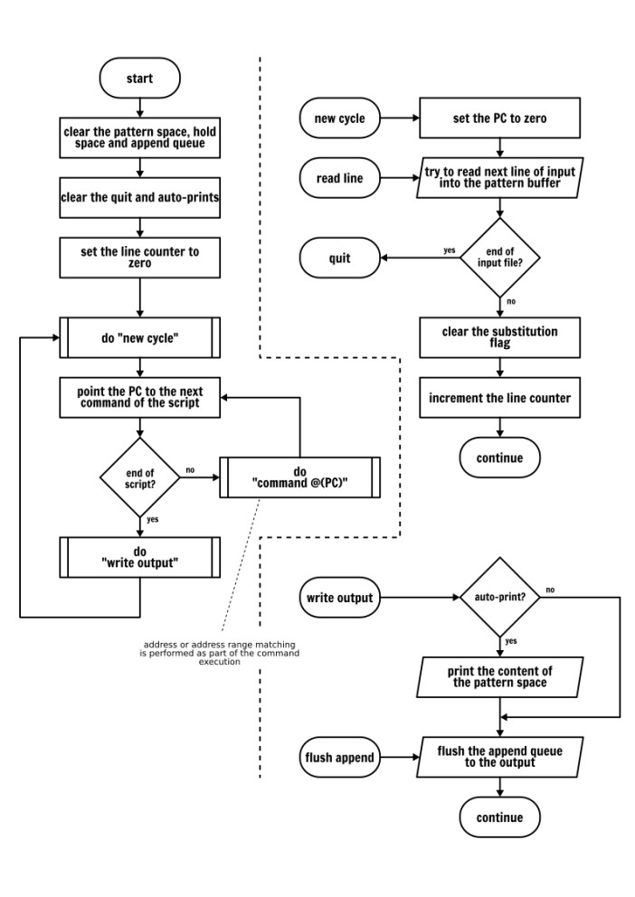


이미 눈치챘겠지만 위의 흐름도는 특정 명령어의 동작을 묘사하지 않았습니다. 명령어는 하나씩 자세히 설명할 것입니다. 그러니 서두르지 마시고 지금 바로 시작해 봅시다!


## 인쇄 명령
인쇄 명령(p)은 실행되는 순간 패턴 공간의 내용을 출력하는 데 사용됩니다. 이 명령은 Sed 추상 메커니즘의 상태를 어떤 방식으로도 변경하지 않습니다.

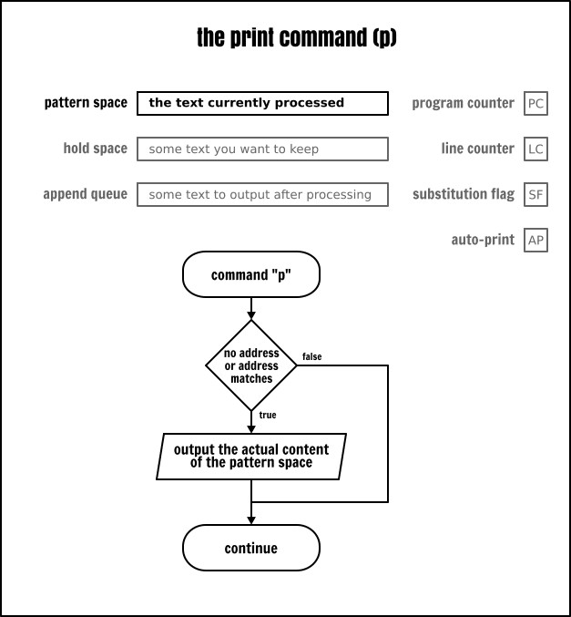

예시:

```
sed -e ‘p’ inputfile
```

위의 명령어는 입력 파일(inputfile)의 각 행 내용을 출력합니다…… 하지만 두 번 출력됩니다. p 명령어를 명시적으로 사용하면 각 처리 루프가 끝날 때마다 암시적으로 한 번 더 출력하기 때문입니다(여기서는 Sed를 “무음 모드” 로 실행하지 않기 때문입니다).

각 행을 두 번 보고 싶지 않다면 다음 두 가지 방법으로 해결할 수 있습니다:

```
sed -n -e ‘p’ inputfile            # 무음 모드에서 명시적으로 출력
sed -e ‘’ inputfile                # 빈 “아무것도 하지 않는” 프로그램, 암시적 출력
```

**참고**: -e 옵션은 Sed 명령을 도입하는 역할을 합니다. 이 옵션은 명령과 파일 이름을 구분하는 데 사용됩니다. Sed 표현식에는 적어도 하나의 명령이 포함되야 하므로 첫 번째 명령의 경우 -e 플래그가 필수는 아닙니다. 하지만 개인적인 사용 습관상 여기서 다루는 대부분의 경우처럼 한 명령줄에 여러 Sed 표현식을 나열하는 좀 더 복잡한 예시와 일관성을 유지하기 위해 이를 추가했습니다. 이것이 좋은 습관인지 나쁜 습관인지는 여러분이 직접 판단하시기 바랍니다. 또한 이 글의 뒷부분에도 이 습관을 계속 따를 것입니다.


## 주소
분명히 print 명령어 자체는 그다지 유용하지 않습니다. 하지만 그 앞에 주소를 추가해서 입력 파일의 일부 행만 출력하려면 입력 파일에서 원치 않는 행을 걸러낼 수 있습니다. 그렇다면 Sed에서 주소란 무엇일까요? Sed는 입력 파일의 ‘행’을 어떻게 식별할까요?


### 행 번호
Sed에서 주소는 행 번호($는 “마지막 행” 을 의미)이거나 정규 표현식일 수 있습니다. 행 번호를 사용할 때는 “Sed 행 번호는 1부터 시작된다” 는 점을 기억해야 합니다. 또한 0행부터 시작하는 것이 아니라는 점에 유의해야 합니다.

```
sed -n -e ‘1p’ inputfile         # 파일의 첫 번째 줄만 출력
sed -n -e ‘5p’ inputfile         # 5번째 줄만 출력
sed -n -e ‘$p’ inputfile         # 파일의 마지막 줄 출력
sed -n -e ‘0p’ inputfile         # 0은 유효한 줄 번호가 아니므로 오류가 발생합니다
```

POSIX 사양에 따르면 여러 개의 파일을 지정하면 행 번호는 누적됩니다. 다시 말해, Sed가 새로운 입력 파일을 열 때 행 카운터는 재설정되지 않습니다. 따라서 다음 두 명령은 동일한 결과를 반환합니다. 텍스트 한 줄만 출력합니다:

```
sed -n -e ‘1p’ inputfile1 inputfile2 inputfile3
cat inputfile1 inputfile2 inputfile3 | sed -n -e ‘1p’
```

실제로 POSIX에선 여러 파일을 어떻게 처리해야 하는지 다음과 같이 규정하고 있습니다:

> 여러 파일이 지정된 경우, 지정된 파일 이름 순서대로 읽혀져 연결되어 편집됩니다.

그러나 일부 Sed 구현체는 이런 동작을 변경할 수 있는 명령줄 옵션을 제공합니다. 예를 들어, GNU Sed의 -s 플래그가 있습니다(GNU Sed의 -i 플래그를 사용할 때 이 옵션은 암묵적으로 적용됩니다):

```
sed -sn -e ‘1p’ inputfile1 inputfile2 inputfile3
```

사용 중인 Sed 구현체가 이런 비표준 옵션을 지원할 경우 구체적인 세부 사항은 man 매뉴얼 페이지를 참조합니다.


### 정규 표현식
앞서 언급했듯이 Sed의 주소는 행 번호일 수도 있고 정규 표현식일 수도 있습니다. 그렇다면 정규 표현식이란 무엇일까요?

이름으로 알 수 있듯이 정규 표현식은 문자열 집합을 기술하는 방법입니다. 지정된 문자열이 정규 표현식에서 기술하는 집합에 부합한다면 그 문자열은 정규 표현식과 일치한다고 간주합니다.

정규 표현식에는 완전히 일치해야 하는 텍스트 문자가 포함될 수 있습니다. 예를 들어, 모든 알파벳과 숫자 그리고 대부분의 인쇄 가능한 문자가 있습니다. 하지만 일부 기호는 특정한 의미를 지닙니다:

- ^ 와 $ 처럼 앵커 역할을 하는 기호들은 각각 줄의 시작과 끝을 나타냅니다;
- 전체 문자 집합을 나타내는 자리 표시자로 사용하는 다른 기호들(예를 들어, 점(.)은 임의의 단일 문자와 일치하거나, 대괄호([])는 사용자 정의 문자 집합을 정의하는 데 사용됩니다);
- 또한 반복 횟수를 나타내는 기호들(예: 클레이니 별표(*)는 앞의 패턴이 0, 1회 또는 여러 번 반복됨을 나타냅니다);

이 글의 목적은 정규 표현식을 설명하는 것이 아닙니다. 따라서 몇 가지 예제만 소개하겠습니다. 하지만 인터넷에서 정규 표현식에 관한 튜토리얼을 쉽게 찾을 수 있습니다. 정규 표현식은 매우 강력한 기능을 가지고 있으며 많은 표준 유닉스 명령어와 프로그래밍 언어에서 사용되며 모든 유닉스 사용자가 익혀야 할 필수 기술입니다.

다음은 Sed를 사용한 몇 가지 예제입니다:

```
sed -n -e ‘/systemd/p’ inputfile        # “systemd”라는 문자열이 포함된 행만 출력
sed -n -e ‘/nologin$/p’ inputfile       # “nologin”으로 끝나는 행만 출력
sed -n -e '/ ^bin/p&apos; inputfile     # “bin”으로 시작하는 행만 출력
sed -n -e &apos;/^$/p&apos; inputfile   # 빈 행(즉, 시작과 끝 사이에 아무것도 없는 행)만 출력
sed -n -e &apos;/./p&apos; inputfile    # 문자가 포함된 행(즉, 비어 있지 않은 행)만 출력
sed -n -e ‘/^.$/p’ inputfile            # 단 하나의 문자만 포함된 행만 출력
sed -n -e ‘/admin.*false/p’ inputfile   # 문자열 “admin” 뒤에 문자열 “false”가 오는 행만 출력 (그 사이에 임의의 개수의 임의의 문자가 있을 수 있음)
sed -n -e ‘/1[0,3]/p’ inputfile         # “1”이 하나 있고 그 뒤에 “0” 또는 “3”이 하나 있는 행만 출력
sed -n -e '/ 1[0-2]/p&apos; inputfile   # “1”이 하나 있고 그 뒤에 “0”, “1”, “2” 또는 “3”이 오는 행만 출력합니다
sed -n -e &apos;/1.*2/p&apos; inputfile # 문자 “1” 뒤에 “2”가 오는(그 사이에 임의의 개수의 문자가 있을 수 있음) 행만 출력합니다
sed -n -e ‘/1[0-9]*2/p’ inputfile       # 문자 “1” 뒤에 “0”, “1” 또는 더 많은 숫자가 오고, 마지막에 “2”가 오는 행만 출력
```

정규 표현식(정규 표현식 구분자 포함)에서 문자의 특수 의미를 제거하려면 해당 문자 앞에 백슬래시를 붙입니다:

```
 # “/usr/sbin/nologin”이라는 문자열이 포함된 모든 행을 출력합니다.
sed -ne ‘//usr/sbin/nologin/p’ inputfile
```

주소에서 정규 표현식 구분자로 슬래시 문자만 사용해야 하는 것은 아닙니다. 첫 번째 구분자 앞에 백슬래시(`\\`)를 붙이는 방식으로 필요와 선호도에 따라 다른 어떤 문자라도 정규 표현식 구분자로 사용할 수 있습니다. 주소와 파일 경로가 포함된 문자를 함께 매칭할 때 아주 유용합니다:

```
 # 다음 두 명령은 완전히 동일합니다.
sed -ne ‘//usr/sbin/nologin/p’ inputfile
sed -ne ‘=/usr/sbin/nologin=p’ inputfile
```

### 확장 정규식
기본적으로 Sed의 정규식 엔진은 POSIX 기본 정규식의 구문만 인식합니다. 확장 정규식을 사용하려면 Sed 명령에 -E 옵션을 추가해야 합니다. 확장 정규식은 기본 정규식에 일련의 추가 기능을 더한 것으로 그 중 상당수는 매우 중요하며 백슬래시 사용 횟수가 훨씬 적습니다. 다음을 비교해 보겠습니다.

```
sed -n -e ‘/(www)|(mail)/p’ inputfile
sed -En -e ‘/(www)|(mail)/p’ inputfile
```

### 중괄호 수량자
정규 표현식이 강력한 이유 중 하나는 범위 수량자 {,} 때문입니다. 사실, 다소 부정확한 일치를 하는 정규 표현식을 작성할 때 수량자 * 는 완벽한 기호입니다. 하지만 (중괄호 수량자를 사용하면) 그 옆에 하한과 상한을 명시적으로 추가할 수 있으므로 뛰어난 유연성을 얻을 수 있습니다. 범위 연산자의 하한이 생략되면 하한은 0으로 간주됩니다. 상한이 생략되면 상한은 무한대로 간주됩니다:

| 괄호  |  약어  |  설명 |
| :- | :- | :- |
| {,}  |  *  |  앞의 규칙이 0, 1회 또는 여러 번 나타남
| {,1}  |  ?  |  앞의 규칙이 0회 또는 1회 나타남
| {1,}	| +  |  앞의 규칙이 1회 이상 반복됨
| {n,n}  | {n} |   앞의 규칙이 정확히 n회 반복됨

중괄호도 기본 정규 표현식에서 사용할 수 있지만 백슬래시를 사용해야 합니다. POSIX 사양에 따르면 기본 정규 표현식에서 사용할 수 있는 수량자는 별표(*)와 중괄호(백슬래시 사용, 예: {m,n}) 뿐입니다. 많은 정규 표현식 엔진이 ? 와 + 를 확장 지원합니다. 하지만 왜 이 ‘유혹’ 이 그리 큰 것일까요? 이런 수량자가 필요하면 확장 정규 표현식을 사용하는 것이 작성하기 쉬울 뿐만 아니라 이식성도 더 뛰어나기 때문입니다.

왜 정규 표현식의 중괄호 수량자에 시간을 들여 설명하느냐면 Sed 스크립트에서 이 기능을 사용해서 문자 수를 세는 경우가 자주 있기 때문입니다.

```
sed -En -e ‘/^.{35}$/p’ inputfile       # 정확히 35개의 문자를 포함하는 행을 출력
sed -En -e ‘/^.{0,35}$/p’ inputfile     # 35자 이하를 포함하는 줄 출력
sed -En -e ‘/^.{,35}$/p’ inputfile      # 35자 이하를 포함하는 줄 출력
sed -En -e ‘/^.{35,}$/p’ inputfile      # 35자 이상을 포함하는 행을 출력합니다
sed -En -e ‘/.{35}/p’ inputfile         # 출력 내용을 직접 지정해 보세요 (이것은 여러분이 직접 풀어보아야 할 문제입니다)
```

### 주소 범위
지금까지 사용한 모든 주소는 고유한 주소였습니다. 고유한 주소를 사용할 때, 명령은 해당 주소와 일치하는 행에 적용됩니다. 하지만 Sed는 주소 범위도 지원합니다. Sed 명령은 해당 주소 범위의 시작부터 끝까지 모든 주소에 해당하는 모든 행에 적용될 수 있습니다:

```
sed -n -e ‘1,5p’ inputfile              # 1행부터 5행까지만 출력
sed -n -e ‘5,$p’ inputfile              # 5번째 줄부터 파일 끝까지 출력
sed -n -e ‘/www/,/systemd/p’ inputfile  # 정규 표현식 /www/와 일치하는 첫 번째 줄부터 다음으로 정규 표현식 /systemd/와 일치하는 줄까지 출력
```

> (LCTT 번역자 주: 아래는 생성된 목록의 예시이며, 참고용으로 제시합니다:)

```
printf “%sn” {a,b,c}{d,e,f} | cat -n
     1  ad
     2  ae
     3  af
     4  bd
     5  be
     6  bf
     7  cd
     8  ce
     9  cf
```

시작 주소와 끝 주소에 동일한 행 번호를 사용하면 범위가 해당 행으로 좁혀집니다. 사실, 두 번째 주소의 숫자가 주소 범위에서 선택된 첫 번째 행의 숫자보다 작거나 같다면 단 한 행만 선택됩니다:

```
printf “%sn” {a,b,c}{d,e,f} | cat -n | sed -ne ‘4,4p’
     4 bd
printf “%sn” {a,b,c}{d,e,f} | cat -n | sed -ne '4,3p'
     4 bd
```

다음 내용은 다소 어려울 수 있지만 앞 단락에서 제시한 규칙은 시작 주소가 정규 표현식인 경우도 적용됩니다. 이 경우 Sed는 정규 표현식에 일치하는 첫 번째 행의 행 번호와 종료 주소로 지정된 명시적인 행 번호를 비교합니다. 다시 강조하면 종료 행 번호가 시작 행 번호보다 작거나 같다면 이 범위는 한 행으로 축소됩니다:

> (LCTT 번역자 주: 여기에서 저자의 설명에 오류가 있습니다. Sed는 정규 표현식으로 표시된 시작 행을 처리할 때 종료 표현식을 동시에 테스트하지 않습니다. 시작 행에 대한 정규 표현식 일치 검사가 시작된 후, 일치가 중단될 때까지 진행되며 그 후에야 종료 행의 표현식(정규 표현식 여부와 상관없이)을 테스트하고, 종료 표현식 테스트에 실패하면 중단한 뒤 이 테스트를 반복합니다.)

```
 # /b/,4 주소는 세 개의 단일 행과 일치합니다.
 # 일치하는 행의 행 번호가 4 이상이기 때문입니다.
 # (LCTT 번역자 주: 결과는 맞지만 설명이 틀렸습니다. 4, 5, 6행은 시작 정규 표현식과 일치하므로 통과하고, 7행은 시작 정규 표현식과 일치하지 않으므로 행 수 비교가 시작됩니다: 7 > 4 이므로 중단됩니다.)
printf “%sn” {a,b,c}{d,e,f} | cat -n | sed -ne ‘/b/,4p’
     4  bd
     5  be
     6  bf

 # 일치 범위가 얼마인지 직접 확인해 보세요
 # 두 번째 예시:
printf “%sn” {a,b,c}{d,e,f} | cat -n | sed -ne '/d/,4p'
     1  ad
     2  ae
     3  af
     4  bd
     7  cd
```

그러나 종료 주소가 정규 표현식일 경우 Sed의 동작은 달라집니다. 이 경우 주소 범위의 첫 번째 줄은 종료 주소와 비교하지 않으므로 주소 범위는 최소 두 줄을 포함하게 됩니다(물론 입력 데이터가 부족한 경우는 예외입니다):

> (LCTT 번역자 주: 위 번역자 주석에서 언급한 바와 같이 시작 정규 표현식이 충족될 때는 종료 표현식을 테스트하지 않으며 시작 표현식이 충족되지 않을 때만 종료 표현식을 테스트합니다.)

```
printf “%sn” {a,b,c}{d,e,f} | cat -n | sed -ne '/b/,/d/p'
 4 bd
 5 be
 6 bf
 7 cd

printf “%sn” {a,b,c}{d,e,f} | cat -n | sed -ne ‘4,/d/p’
 4 bd
 5 be
 6 bf
 7 cd
```

> (LCTT 번역자 주: 주소 범위에 대한 요약입니다. 시작 조건을 충족할 때 해당 행부터 시작하며 해당 행이 종료 조건을 충족하는지 여부는 테스트하지 않습니다. 다음 행부터 종료 조건 테스트를 시작하고 종료 조건이 충족되지 않을 때 종료합니다. 그 다음 남은 행에 다시 시작 조건부터 매칭을 시작하며 이 과정을 반복합니다. 즉, 매칭 결과는 비연속적인 한 줄 또는 여러 줄일 수 있습니다. 이해를 돕기 위해 위 명령줄의 조건을 조정해 보시기 바랍니다.)


### 반전
주소 선택 행 뒤에 느낌표(!)를 추가하면 해당 주소와 일치하지 않음을 나타냅니다. 예:

```
sed -n -e ‘5!p’ inputfile        # 5번째 행을 제외한 모든 행 출력
sed -n -e ‘5,10!p’ inputfile     # 5번째 행부터 10번째 행까지를 제외한 모든 행 출력
sed -n -e ‘/sys/!p’ inputfile    # “sys”라는 문자열을 포함하는 행을 제외한 모든 행 출력
```

### 교집합
> (LCTT 번역자 주: 원문 제목은 “합집합” 이지만, “교집합”이 맞음)

Sed는 한 블록 내에서 중괄호 {…} 를 사용해서 명령어를 조합할 수 있게 해줍니다. 이 기능을 활용해서 여러 주소의 교집합을 조합할 수 있습니다. 예를 들어, 다음 두 명령어의 출력을 비교해 보겠습니다:

```
sed -n -e '/usb/{
  /daemon/p
}' inputfile

sed -n -e ‘/usb.*daemon/p’ inputfile
```

한 블록 내에서 명령어를 중첩함으로써, “usb” 와 “daemon” 문자열을 모두 포함하는 행을 임의의 순서로 선택하게 됩니다. 반면 정규 표현식 “usb.*daemon” 은 “daemon” 문자열 앞에 “usb” 문자열이 포함된 행만 일치시킵니다.

주제를 너무 오래 벗어났으니 이제 다시 돌아가서 다양한 Sed 명령어를 학습해 보겠습니다.


## 종료 명령어
종료 명령어(q)는 현재 반복 처리 주기가 끝난 후 Sed를 중지하는 것을 의미합니다.

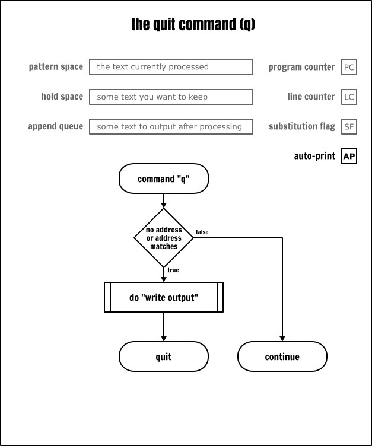

q 명령어는 입력 파일의 끝까지 도달하기 전에 처리를 중지하는 방법입니다. 왜 누군가가 그렇게 하고 싶을까요?

좋은 질문입니다. 기억하시겠지만 다음 명령어를 사용해서 파일의 1행부터 5행까지 출력할 수 있습니다:

```
sed -n -e ‘1,5p’ inputfile
```

대부분의 Sed 구현 방식에선 결과 중 처음 5행만 처리해도 도구가 입력 파일의 모든 행을 순차적으로 읽어들입니다. 입력 파일에 수 백만 행이 포함되면(더 나쁜 경우, /dev/urandom 같은 무한 데이터 스트림에서 읽는 경우) 이는 심각한 영향을 미칠 수 있습니다.

종료 명령을 사용하면 동일한 프로그램을 좀 더 효율적으로 수정할 수 있습니다:

```
sed -e ‘5q’ inputfile
```

여기선 -n 옵션을 사용하지 않았기 때문에 Sed는 각 루프가 끝날 때마다 암시적으로 패턴 공간의 내용을 출력합니다. 하지만 5번째 줄을 처리한 후에 종료하므로 더 이상의 데이터를 읽지 않습니다.

비슷한 기법을 사용해서 파일에서 특정 한 줄만 출력할 수 있습니다. 이는 명령줄에서 여러 Sed 표현식을 지정하는 몇 가지 방법 중 하나입니다. 다음 세 가지 변형 모두는 Sed에서 여러 명령을 받아들일 수 있으며 서로 다른 -e 옵션을 사용하거나 동일한 표현식 내에서 새 줄을 시작하거나 세미콜론(;)으로 구분할 수 있습니다:

```
sed -n -e ‘5p’ -e ' 5q' inputfile

sed -n -e '
  5p
  5q
' inputfile

sed -n -e ‘5p;5q’ inputfile
```

기억하시겠지만 앞서 중괄호를 사용해서 명령을 결합할 수 있다는 것을 살펴봤습니다. 여기서는 동일한 주소가 두 번 반복되는 것을 방지하기 위해 이를 사용합니다:

```
 # 명령어 결합
sed -e '5{
  p
  q
}' inputfile

 # 다음과 같이 간략하게 쓸 수 있습니다:
sed ‘5{p;q;}’ inputfile

 # POSIX 확장 기능으로, 일부 구현에서는 닫는 중괄호 앞의 세미콜론을 생략할 수 있습니다:
sed ‘5{p;q}’ inputfile
```

## 치환 명령어
치환 명령어(s)는 Sed의 “찾기 및 치환” 기능으로 생각할 수 있으며 이 기능은 대부분의 “WYSIWYG(What You See Is What You Get)” 편집기에서 찾아볼 수 있습니다. Sed의 치환 명령어는 이와 유사하지만 훨씬 더 강력합니다. 치환 명령어는 Sed에서 가장 잘 알려진 명령어 중 하나이며 인터넷에는 이 명령어에 대한 방대한 문서가 있습니다.

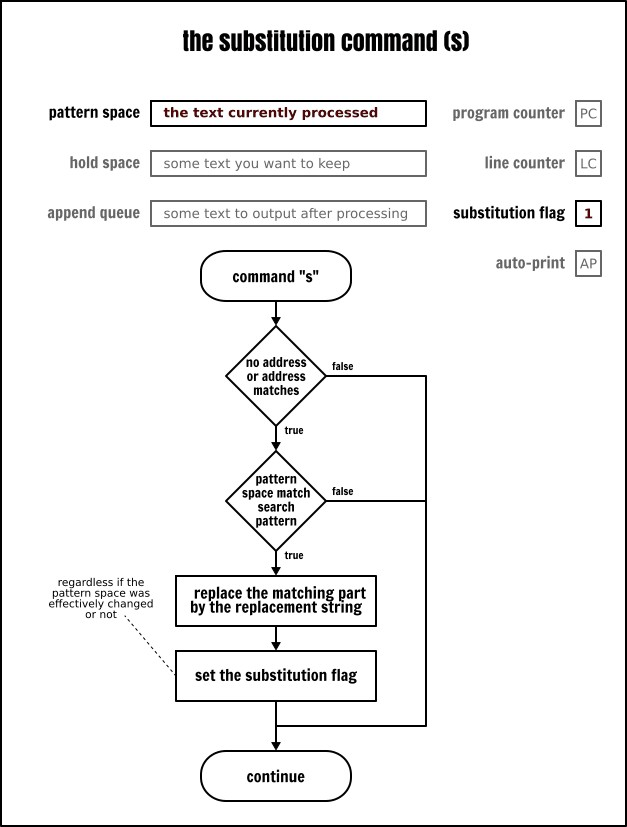

이전 글에서 이미 다룬 내용이므로 여기선 반복하지 않겠습니다. 하지만 사용법에 익숙하지 않다면 다음 핵심 사항들을 기억해야 합니다:

- 대체 명령어에는 두 가지 인수가 있습니다: 검색 패턴과 대체 문자열: `sed s/:/-----/ inputfile`

- s 명령어와 그 인수는 임의의 문자로 구분됩니다. 이는 주로 사용자의 습관에 따라 다르며 99%의 경우 저는 슬래시를 사용하지만 다른 문자를 사용하기도 합니다: `sed s%:%-----% inputfile`, `sed sX:X-----X inputfile`, 심지어 `sed ‘s : ----- ’ inputfile`

- 기본적으로 치환 명령은 패턴 공간에서 일치하는 첫 번째 문자열에만 적용됩니다. 명령어 뒤에 일치 인덱스를 플래그로 지정해서 이 동작을 변경할 수 있습니다: `sed ‘s/:/-----/1’ inputfile`, `sed ‘s/:/-----/2’ inputfile`, `sed ‘s/:/-----/3’ inputfile`, …

- 전역 치환(즉, 패턴 공간에서 겹치지 않는 모든 일치 항목에 대해 수행)을 실행하려면 g 플래그를 추가해야 합니다: `sed ‘s/:/-----/g’ inputfile`

- 문자열 치환에서 나타나는 모든 & 기호는 검색 패턴과 일치하는 부분 문자열로 대체됩니다: `sed ‘s/:/-&&&-/g’ inputfile;sed ‘s/.../& /g’ inputfile; s/:/-&&&-/g&apos; inputfile, sed &apos;s/.../& /g&apos; inputfile`

- 둥근 괄호(확장 정규 표현식에선 (...), 기본 정규 표현식에선 (...) )는 캡처 그룹(capturing group)으로 간주됩니다. 이는 일치한 문자열의 일부로 치환 문자열에서 참조할 수 있습니다. 1은 첫 번째 캡처 그룹의 내용이고 2는 두 번째 캡처 그룹의 내용이며 이와 같은 순서로 이어집니다: `sed -E ‘s/(.)(.)/21/g’ inputfile`, `sed -E 's/(.):x:(.):(.*)/1:3/' inputfile` (후자가 정상 작동하는 이유는 정규 표현식에서 수량자 별표(*)가 일치하지 않을 때까지 가능한 한 많이 일치함을 나타내며 여러 개의 문자와도 일치할 수 있기 때문입니다)

- 검색 패턴이나 대체 문자열에서 백슬래시를 사용하면 어떤 문자의 특수 의미를 제거할 수 있습니다: `sed ‘s/:/--/g’ inputfile, sed ‘s///\/g’ inputfile`

이 모든 것이 다소 추상적으로 보일 수 있으니 몇 가지 예를 들어보겠습니다. 먼저, 테스트 입력 파일의 첫 번째 필드를 표시하고 그 오른쪽에 공백 20개를 추가하려면 다음과 같이 작성할 수 있습니다.

```
sed < inputfile -E -e '
 s/:/ /               # 첫 번째 필드의 구분자를 공백 20개로 대체
 s/(.{20}).*/1/       # 한 줄의 앞 20자만 남기기
 s/.*/| & |/          # 출력 형식을 깔끔하게 하기 위해 수직선을 추가
'
```

두 번째 예는, 사용자 sonia 의 UID/GID 를 1100 으로 수정할 때 다음과 같이 작성할 수 있습니다:

```
sed -En -e '
  /sonia/{
    s/[0-9]+/1100/g
    p
 }' inputfile
```

치환 명령어 끝부분의 g 옵션을 주의합니다. 이 옵션은 동작 방식을 변경해서 전체 패턴 공간에서 일치하는 부분을 모두 찾아 치환합니다. 이 옵션이 없으면 처음 발견된 항목만 치환합니다.

덧붙여, 이는 앞서 설명한 출력(p) 명령을 사용할 수 있는 좋은 기회입니다. 명령을 실행할 때 수정 전후의 패턴 공간 내용을 출력할 수 있습니다. 따라서, 교체 전후의 내용을 확인하려면 다음과 같이 작성할 수 있습니다:

```
sed -En -e '
  /sonia/{
     p
     s/[0-9]+/1100/g
     p
 }' inputfile
```

사실, 치환 후 한 줄을 출력하는 것은 매우 흔한 사용법입니다. 따라서 치환 명령어도 p 옵션을 지원합니다:

```
sed -En -e &apos;/sonia/s/[0-9]+/1100/gp&apos; inputfile
```

마지막으로, 치환 명령어의 w 옵션은 자세히 설명하지 않겠습니다. 이 내용은 나중에 자세히 다룰 예정입니다.


## 삭제 명령어
삭제 명령어(d)는 패턴 공간의 내용을 지우고 즉시 다음 처리 루프를 시작합니다. 따라서 패턴 공간의 내용을 암시적으로 출력하는 동작을 건너뛰며 자동 출력 플래그(AP)를 설정했더라도 출력되지 않습니다.

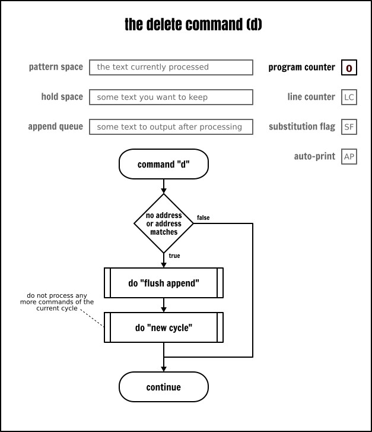


파일의 처음 5줄만 출력하는 매우 비효율적인 방법은 다음과 같습니다:

```
sed -e ‘6,$d’ inputfile
```

왜 이 방법이 비효율적이라 생각하는지 짐작이 가시나요? 짐작이 안 가신다면 앞서 다룬 종료 명령어 섹션을 다시 읽어보시길 권합니다. 정답이 바로 거기에 있습니다!

정규 표현식과 주소를 조합해서 출력에서 일치하는 행을 제거할 때 삭제 명령어는 매우 유용합니다:

```
sed -e ‘/systemd/d’ inputfile
```

## 다음 줄 명령
Sed 명령이 무음 모드로 실행되지 않는 경우 이 명령(n)은 현재 패턴 공간의 내용을 출력한 다음 어떤 경우든 다음 입력 줄을 패턴 공간으로 읽고 새로운 패턴 공간의 내용을 사용해서 현재 루프에 남아있는 명령을 실행합니다.

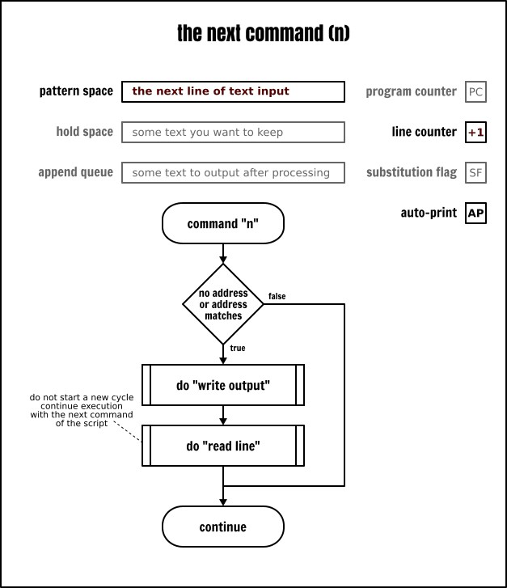


다음 줄 명령을 사용해서 줄을 건너뛰는 일반적인 예시:

```
cat -n inputfile | sed -n -e ‘n;n;p’
```

위의 예에서 Sed는 입력 파일의 첫 번째 줄을 암묵적으로 읽습니다. 그러나 다음 줄 명령은 패턴 공간의 내용에 대한 출력을 무시하고(-n 옵션으로 인해 출력되지 않음) 입력 파일에서 다음 줄을 읽어와 패턴 공간의 내용을 대체합니다. 두 번째 다음 줄 명령은 이전 명령과 똑같은 작업을 수행하며 이를 통해 입력 파일의 2줄을 건너뛰는 목적을 달성합니다. 마지막으로 이 스크립트는 패턴 공간에 포함된 입력 파일의 세 번째 줄 내용을 명시적으로 출력합니다. 그런 다음 Sed는 새로운 루프를 시작하며 다음 줄 명령 덕분에 네 번째 줄의 내용을 암시적으로 읽은 후 이를 건너뛰고 마찬가지로 다섯 번째 줄도 건너뛰고 여섯 번째 줄을 출력합니다. 이런 루프는 파일이 끝날 때까지 반복됩니다. 전체적으로 보면 이 스크립트는 입력 파일을 읽은 후 세 줄마다 한 줄씩 출력하는 역할을 합니다.

‘다음 줄’ 명령어를 사용하면 입력 파일의 처음 다섯 줄을 표시하는 몇 가지 방법을 찾을 수 있습니다:

```
cat -n inputfile | sed -n -e '1{p;n;p;n;p;n;p;n;p}'
cat -n inputfile | sed -n -e ‘p;n;p;n;p;n;p;n;p;q’
cat -n inputfile | sed -n -e ‘n;n;n;n;q’
```

좀 더 흥미로운 점은 특정 주소에 따라 행을 처리할 때 이 명령어가 매우 유용하다는 것입니다:

```
cat -n inputfile | sed -n ‘/pulse/p’        # “pulse”가 포함된 행 출력
cat -n inputfile | sed -n ‘/pulse/{n;p}’    # “pulse”가 포함된 행 다음의 행 출력
cat -n inputfile | sed -n ‘/pulse/{n;n;p}’  # “pulse”가 포함된 줄의 다음 줄의 다음 줄을 출력
```

## 홀드 공간 사용
지금까지 살펴본 명령들은 모두 패턴 공간만 사용했습니다. 하지만 이 글 서두에 언급했듯이 두 번째 버퍼인 ‘홀드 공간’ 이 있으며 이는 전적으로 사용자가 관리합니다. 이것이 바로 제2절에서 설명한 대상입니다.

### 교환 명령어
이름으로 알 수 있듯이 교환 명령어(x)는 홀드 공간과 패턴 공간의 내용을 서로 바꿉니다. 홀드 공간에 아무것도 넣지 않았다면 유지 공간은 비어 있다는 점을 기억합니다.

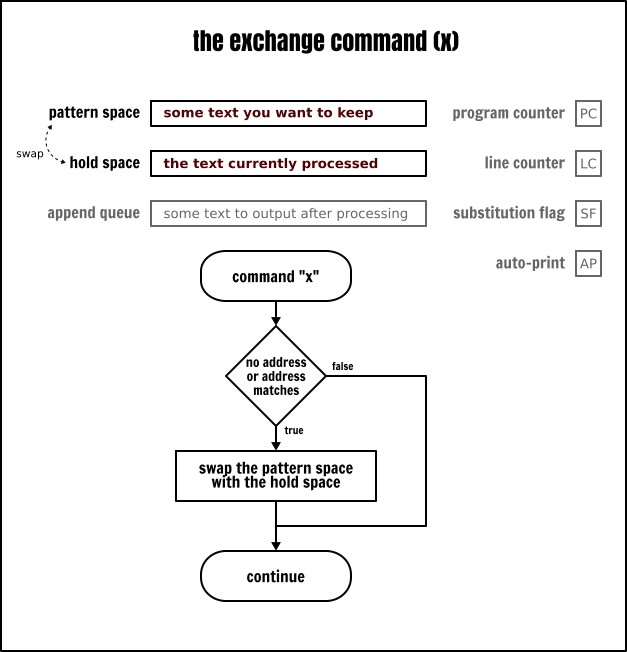

첫 번째 예제로 교환 명령어를 사용해서 입력 파일의 처음 두 줄을 역순으로 출력해 보겠습니다:

```
cat -n inputfile | sed -n -e ‘x;n;p;x;p;q’
물론, 홀드 공간을 설정한 후 그 내용을 즉시 사용하는 것은 아닙니다. 명시적으로 수정하지 않는 한 홀드 공간의 내용은 변하지 않기 때문입니다. 다음 예제에서는 입력 파일의 첫 다섯 줄을 읽은 후, 이를 사용하여 첫 번째 줄을 삭제합니다:

cat -n inputfile | sed -n -e '
 1{x;n} # 홀드 공간과 패턴 공간을 교환
        # 1번째 줄을 홀드 공간에 저장
        # 그런 다음 2번째 줄을 읽음
 5{
   p    # 5번째 줄 출력
   x    # 유지 공간과 패턴 공간을 교환
        # 1번째 줄의 내용을 가져와 패턴 공간에 다시 넣음
 }

 1,5p   # 2번째 줄부터 5번째 줄까지 출력
        # (출력 오류가 아닙니다! 이 규칙을 찾아보세요
        # 1번째 줄에서는 실행되지 않는 이유를 ;)
'
```

### hold 명령어
hold 명령어(h)는 패턴 공간의 내용을 홀드 공간에 저장하는 데 사용됩니다. 하지만 swap 명령어와 달리 패턴 공간의 내용은 변경되지 않습니다. hold 명령어에는 두 가지 사용법이 있습니다:

- h 는 패턴 공간의 내용을 홀드 공간에 복사해서 홀드 공간에 이미 존재하는 내용을 덮어씁니다.
- H 는 패턴 공간의 내용을 홀드 공간에 추가하며 새 줄을 구분자로 사용합니다.

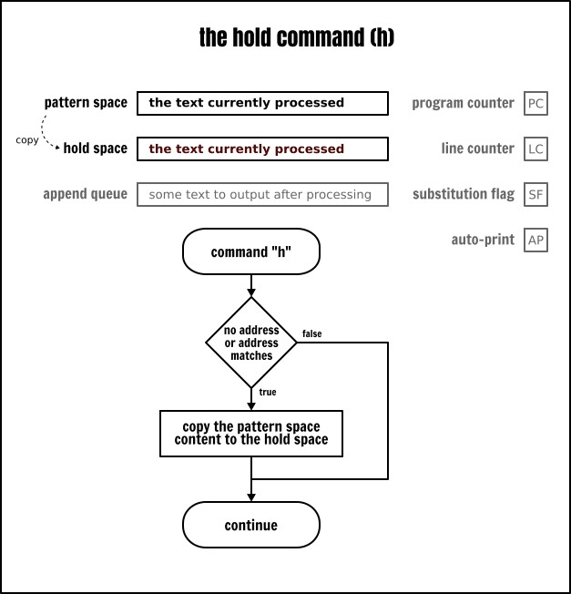


위에서 교환 명령어를 사용한 예제는 홀드 명령어를 사용해서 다음과 같이 다시 작성할 수 있습니다:

```
cat -n inputfile | sed -n -e '
 1{h;n} # 1행의 내용을 홀드 버퍼에 저장하고 계속 진행
 5{     # 5행에서
   x    # 패턴 공간과 홀드 공간을 교환
        # (이제 패턴 공간에는 1행이 포함됨)
   H    # 홀드 버퍼의 5번째 줄 뒤에 1번째 줄을 추가
   x    # 5번째 줄과 1번째 줄을 다시 교환하여, 5번째 줄을 모드 버퍼로 되돌림
 }

 1,5p   # 2행부터 5행까지 출력
        # (출력 오류 없음! 왜 이 규칙이
        # 1행에서는 작동하지 않는지 찾아보세요 ;)
'
```

### get 명령어
get 명령어(g)는 keep 명령어와 정반대입니다. 즉, keep 영역에서 내용을 가져와 패턴 영역에 넣습니다. 이 명령어도 두 가지 방식이 있습니다:

- g 는 keep 영역의 내용을 복사해서 패턴 영역에 넣으며 패턴 영역에 이미 존재하는 내용은 덮어씁니다.
- G 는 keep 영역의 내용을 패턴 영역에 추가하며 새 줄을 구분자로 사용합니다.

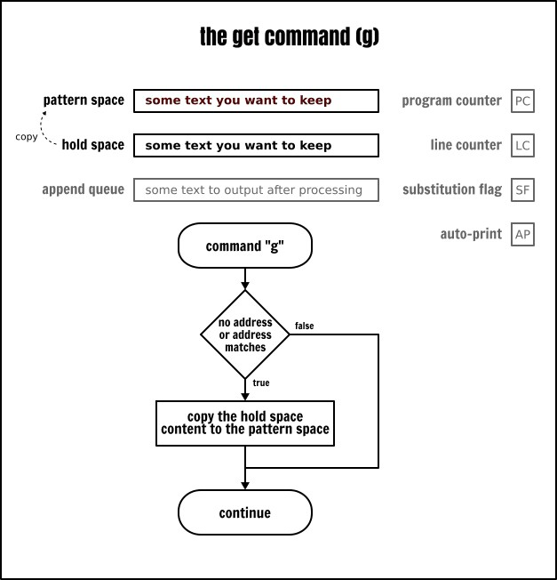

보관 명령과 가져오기 명령을 함께 사용하면 데이터를 저장하고 다시 불러올 수 있습니다. 작은 과제로 이전 절의 예제를 다시 작성해서 입력 파일의 1번째 줄을 5번째 줄 뒤에 배치합니다. 단, 교환 명령을 사용하지 말고 가져오기 및 보관 명령(대문자 또는 소문자 명령 버전)을 사용합니다. 운이 좋다면 좀 더 간단하게 해결할 수 있을지도 모릅니다!

아울러, 여러분에게 영감을 줄 수 있는 또 다른 예제를 보여 드리겠습니다. 목표는 로그인 셸 권한을 가진 사용자를 다른 사용자와 구분하는 것입니다:

```
cat -n inputfile | sed -En -e '
 =(/usr/sbin/nologin|/bin/false)$= { H;d; }
            # 일치하는 행을 유지 영역으로 가져옵니다
            # 그런 다음 다음 반복으로 넘어갑니다
 p          # 나머지 행을 출력합니다
 $ { g;p }  # 마지막 행에서
            # 유지 영역의 내용을 가져와 출력합니다
'
```

## 출력, 삭제 및 다음 줄 명령 복습
이제 버퍼 사용법에 익숙해졌으니 출력, 삭제 및 다음 줄 명령으로 돌아가겠습니다. 이미 소문자 p, d, n 명령에 대해 다루었습니다. 이 명령들에는 대문자 버전도 있습니다. 각 명령마다 대소문자 버전이 있는 것은 Sed의 관례인 듯하며 이런 명령의 대문자 버전은 다중 행 버퍼와 관련있습니다:

- P : 패턴 공간에서 첫 번째 새 줄 이전의 내용을 출력합니다.
- D : 패턴 공간에서 첫 번째 새 줄 이전의 내용(새 줄 포함)을 삭제한 후, 새로운 입력을 읽지 않고 남은 텍스트를 사용하여 루프를 다시 시작합니다.
- N : 입력을 읽고 패턴 공간에 새 줄을 추가하며, 새 줄을 새 데이터와 기존 데이터의 구분자로 사용합니다. 현재 루프를 계속 실행합니다.

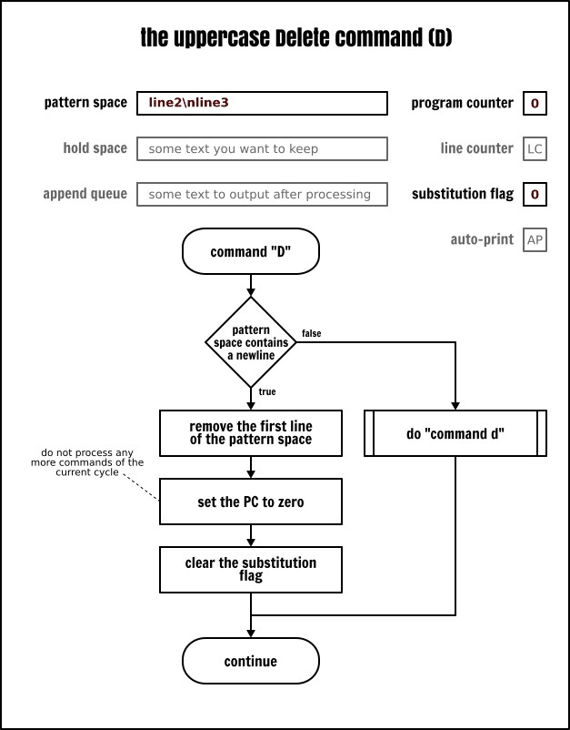


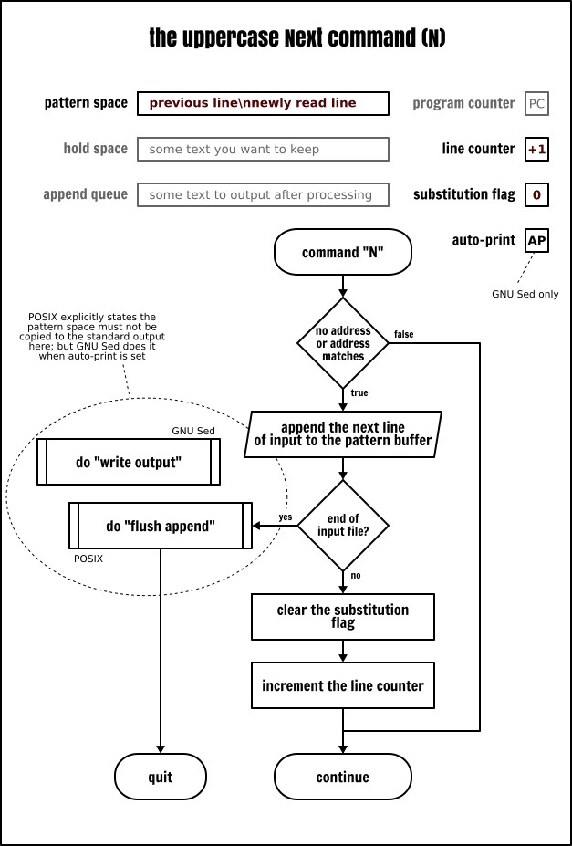


이 명령어들은 주로 큐(FIFO 목록)를 구현하는 데 사용됩니다. 입력 파일에서 마지막 5행을 제거하는 것이 대표적인 예입니다:

```
cat -n inputfile | sed -En -e '
  1 { N;N;N;N } # 패턴 공간에 5행이 포함되도록 보장

  N             # 6번째 줄을 큐에 추가
  P             # 큐의 첫 번째 줄 출력
  D             # 큐의 첫 번째 줄 삭제
&apos;
두 번째 예제로, 입력 데이터를 두 열로 표시할 수 있습니다:

 # 두 열로 출력
sed < inputfile -En -e &apos;
 $!N    # 패턴 공간에 새 줄 추가
        # 입력 파일의 마지막 줄을 제외하고
        # 입력 파일의 마지막 줄에서 N 명령을 사용할 때
        # GNU Sed와 POSIX Sed의 동작은 다릅니다
        # 이러한 상황을 처리하려면 한 가지 요령이 필요합니다
        # https://www.gnu.org/software/sed/manual/sed.html#N_005fcommand_005flast_005fline

        # 1행의 첫 번째 필드를 공백으로 채우고
        # 나머지 행은 버립니다
 s/:.*n/                    n/
 s/:.*//            # 2행의 첫 번째 필드를 제외한 나머지 행을 제거
 s/(.{20}).*n/1/  # 행을 잘라내어 연결
 p                  # 결과 출력
'
```


## 분기
앞서 살펴본 바와 같이 Sed는 공간을 확보할 수 있기 때문에 캐싱 기능을 갖추고 있습니다. 사실 Sed에는 조건 검사 및 분기 명령어도 있습니다. 이런 특성들 덕분에 Sed는 튜링 완전한 언어입니다. 겉보기에는 다소 투박하게 보일 수 있지만 이는 Sed를 사용해서 어떤 프로그램이든 작성할 수 있음을 의미합니다. 어떤 목적이라도 구현할 수 있지만 구현이 쉽다는 뜻은 아니며 결과도 반드시 효율적일 것이란 보장은 없습니다.

하지만 걱정하지 마세요. 이 글에서는 조건문과 분기 기능을 보여줄 수 있는 가장 간단한 예제를 사용해 보겠습니다. 이런 기능들이 언뜻 보기에는 매우 제한적으로 보일 수 있지만 어떤 사람들은 Sed를 사용해서 http://www.catonmat.net/ftp/sed/dc.sed [계산기], http://www.catonmat.net/ftp/sed/sedtris.sed [테트리스] 또는 그 밖의 다양한 종류의 애플리케이션을 만들었다는 사실을 기억해 주세요!


### 태그와 분기
어떤 면에서 Sed는 기능이 제한된 어셈블리 언어로 볼 수 있습니다. 따라서 고수준 언어에서 흔히 볼 수 있는 “for” 나 “while” 루프 또는 “if … else” 문은 찾을 수 없지만 분기를 사용해서 동일한 기능을 구현할 수 있습니다.

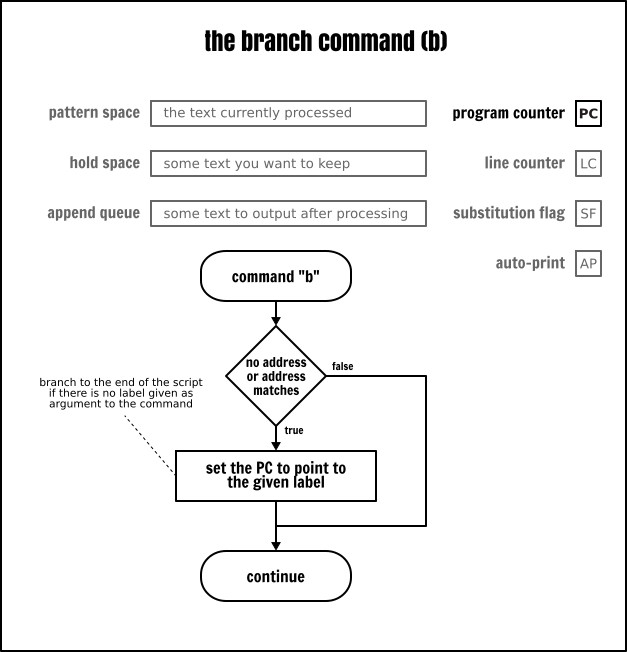


이 글 시작 부분에서 흐름도로 설명된 Sed 실행 모델을 보셨다면 Sed가 프로그램 카운터(PC)의 값을 자동으로 증가시키며 명령이 프로그램의 지시 순서대로 실행된다는 사실을 잘 아실 것입니다. 하지만 분기(b) 명령을 사용하면 프로그램 내의 임의의 명령을 선택해서 실행 순서를 변경할 수 있습니다. 점프 대상은 레이블(:)을 사용해서 명시적으로 정의됩니다.

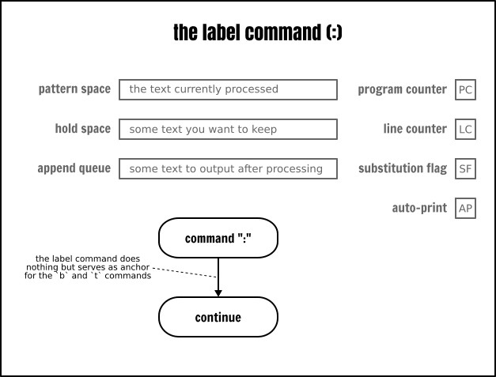


다음은 그 예입니다:

```
echo hello | sed -ne '
  :start    # 프로그램의 해당 줄에 “start” 레이블을 지정
  p         # 패턴 공간의 내용을 출력
  b start   # :start 레이블에서 실행을 계속
' | less
```

이 Sed 프로그램의 동작은 yes 명령어와 유사합니다. 즉, 문자열을 받아 그 문자열을 포함하는 무한 스트림을 생성합니다.

라벨로 전환하는 것은 마치 Sed의 자동화 기능을 우회하는 것과 같습니다. 즉, 어떤 입력도 읽지 않고 어떤 출력도 하지 않으며 어떤 버퍼도 업데이트하지 않습니다. 단지 소스 프로그램 명령어 순서에서 다음 명령어로 점프할 뿐입니다.

주목할 점은 분기 명령(b)에 매개변수로 태그를 지정하지 않으면 분기는 프로그램의 끝 부분으로 전환된다는 것입니다. 따라서 Sed는 새로운 루프를 시작합니다. 이 특성은 일부 명령을 건너뛰는 데 사용할 수 있으며 결과적으로 “블록” 의 대체 수단으로 활용될 수 있습니다:

```
cat -n inputfile | sed -ne &apos;
/usb/!b
/daemon/!b
p
'
```

### 조건 분기
지금까지 우리는 무조건 분기를 살펴봤습니다. 이 용어는 다소 오해의 소지가 있는데 Sed 명령어는 항상 선택적 주소를 기준으로 조건을 판단하기 때문입니다.

그러나 전통적인 의미에서 무조건 분기도 분기의 일종이며 실행될 때 특정 위치로 점프합니다. 반면 조건 분기는 시스템의 현재 상태에 따라 특정 명령어로 점프할 수도 있고 그렇지 않을 수도 있습니다.

Sed에는 단 하나의 조건 명령어 즉 test(t) 명령어만 있습니다. 현재 루프의 시작 시점이나 이전 조건 분기가 실행되어 치환이 이루어진 경우만 다른 명령어로 점프합니다. 대부분의 경우 치환 플래그가 설정되어 있을 때만 test 명령어가 분기를 전환합니다.

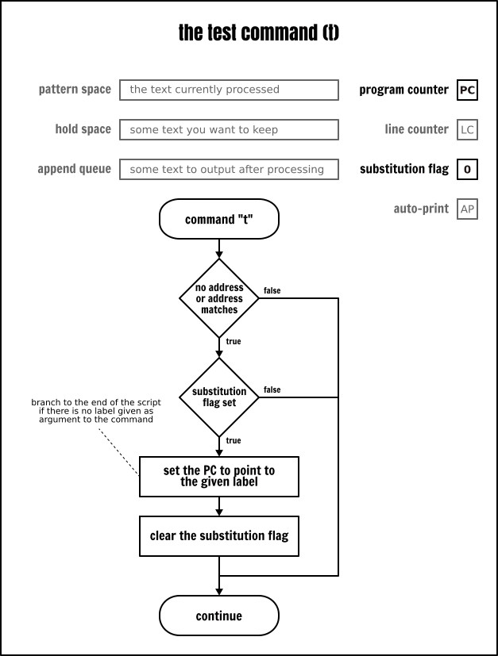


test 명령어를 사용하면 Sed 프로그램에서 루프를 쉽게 실행할 수 있습니다. 구체적인 예로 이 명령을 사용해서 한 줄을 특정 길이로 채울 수 있습니다(이는 정규 표현식을 사용해선 구현할 수 없는 기능입니다):

```
 # 원본 텍스트
cut -d: -f1 inputfile | sed -Ee '
  :start
  s/^(.{,19})$/ 1 /    # 20자 미만인 줄의 시작 부분에 공백 하나를 채움
                        # 그리고 끝 부분에 공백 하나를 추가
  t start               # 이미 공백을 추가했다면 :start 태그로 되돌아가기
  s/(.{20}).*/| 1 |/   # 한 줄의 앞 20자만 남기기
                        # 홀수 줄로 인해 발생하는 오류를 수정하기 위해
'
```

앞서 제시한 예제를 주의 깊게 읽어보셨다면 데이터를 Sed에 “입력” 하기 전에 cut 명령어를 통해 데이터를 전처리하기 위해 약간의 수정을 가했다는 점을 눈치채셨을 것입니다.

하지만 Sed만 사용해서 프로그램을 약간 수정함으로써 동일한 작업을 수행할 수 있습니다:

```
cat inputfile | sed -Ee &apos;
  s/:.*//               # 첫 번째 필드를 제외한 나머지 필드를 삭제
  t start
  :start
  s/^(.{,19})$/ 1 /    # 20자 미만인 행의 시작 부분에 공백 하나를 채우고
                        # 끝 부분에 공백 하나를 추가합니다
  t start               # 이미 공백을 추가한 경우, :start 태그로 돌아갑니다
  s/(.{20}).*/| 1 |/   # 한 줄의 앞 20자만 남김
                        # 홀수 줄로 인해 발생하는 오차를 수정하기 위함
'
```

위의 예제에서 다음과 같은 구조에 놀랄 수도 있습니다:

```
t start
:start
```

언뜻 보면 여기서의 분기는 실행될 명령어로 단순히 이동할 뿐이므로 별다른 용도가 없는 것처럼 보입니다. 하지만 테스트 명령어의 정의를 자세히 읽어보면 현재 루프의 시작 시점이나 이전 테스트 명령어 실행 후에 치환이 발생한 경우만 분기가 작동한다는 것을 알 수 있습니다. 다시 말해 테스트 명령어는 치환 플래그를 지우는 부수 효과를 가집니다. 이것이 바로 위의 코드 조각의 진정한 목적입니다. 이는 조건 분기가 포함된 Sed 프로그램에서 자주 볼 수 있는 기법으로 여러 치환 명령어를 사용할 때 오탐(false positive)을 방지하기 위해 사용됩니다.

이를 통해 교체 표시를 절대 강제적으로 제거할 수는 없다는 점에 동의합니다. 문자열을 올바른 길이로 채울 때 제가 사용한 특정 교체 명령은 항등적(idempotent)이기 때문입니다. 따라서 한 번 더 반복해도 결과는 변하지 않습니다. 하지만 이제 두 번째 예제를 다시 한 번 살펴보겠습니다:

```
 # 로그인 프로그램에 따라 사용자 계정 분류하기
cat inputfile | sed -Ene '
  s/^/login=/
  /nologin/s/^/type=SERV /
  /false/s/^/type=SERV /
  t print
  s/^/type=USER /
  :print
  s/:.*//p
'
```

여기서는 사용자가 기본으로 설정한 로그인 프로그램에 따라 사용자 계정에 “SERV” 또는 “USER” 태그를 부여하려 합니다. 이 코드를 실행하면 “SERV” 태그가 표시될 것으로 예상됩니다. 하지만 출력에서 “USER” 태그는 찾아볼 수 없습니다. 왜 그럴까요? `t print` 명령은 행의 내용이 무엇이든 상관없이 항상 상태를 전환하기 때문이며 대체 플래그는 항상 프로그램의 첫 번째 대체 명령에 의해 설정되기 때문입니다. 일단 치환 플래그가 설정되면 다음 줄이 읽히거나 다음 테스트 명령이 실행될 때까지 이 플래그는 변하지 않습니다. 다음은 이 프로그램을 수정하는 해결책입니다:

```
 # 사용자 로그인 프로그램에 따라 사용자 계정 분류
cat inputfile | sed -Ene &apos;
  s/^/login=/

  t classify # “대체 플래그” 지우기
  :classify

  /nologin/s/^/type=SERV /
  /false/s/^/type=SERV /
  t print
  s/^/type=USER /
  :print
  s/:.*//p
'
```

## 텍스트를 정밀하게 처리하기
Sed는 비상호작용형 텍스트 편집기입니다. 비상호작용형이지만 여전히 텍스트 편집기입니다. 출력물에 무언가를 삽입하는 기능이 없다면 그것은 완전한 텍스트 편집기라고 할 수 없습니다. 저는 Sed의 텍스트 편집 기능을 그다지 좋아하지 않습니다. (Sed의 기준으로도) 구문이 너무 사용하기 어렵다고 생각하기 때문이지만 때로는 어쩔 수 없이 사용할 때가 있습니다.

엄격한 POSIX 구문을 따르는 명령어는 단 세 가지뿐입니다. 출력에 텍스트를 변경(c), 삽입(i) 또는 추가(a)하는 명령은 모두 동일한 특정 구문을 따릅니다. 명령어 문자에 백슬래시가 뒤따르며 텍스트는 스크립트의 다음 줄부터 삽입됩니다.

```
head -5 inputfile | sed '
1i
 # 사용자 계정 목록
$a
 # 끝
'
```

여러 줄의 텍스트를 삽입하려면 각 줄의 끝마다 백슬래시를 사용해야 합니다:

```
head -5 inputfile | sed &apos;
1i
 # 사용자 계정 목록
 # (사용자 1~5)
$a
 # 끝
'
```

GNU Sed 같은 일부 Sed 구현체는 초기 백슬래시 뒤의 줄바꿈 문자는 선택 사항이며 --posix 모드도 마찬가지입니다. 저는 표준에서 이 대체 구문에 대한 설명을 찾을 수 없었습니다(만약 제가 표준에서 해당 기능을 찾지 못한 것이라면 댓글로 알려주세요!). 따라서 이식성을 중요하게 생각한다면 이를 사용할 때의 위험성을 유의하시기 바랍니다:

```
 # 비 POSIX 구문:
head -5 inputfile | sed -e &apos;
1i# 사용자 계정 목록
$a# end
'
```

일부 Sed 구현체는 앞의 백슬래시를 완전히 생략할 수 있도록 허용하기도 합니다. 따라서 이는 의심할 여지없이 특정 벤더가 POSIX 표준을 확장한 버전이며 해당 구문을 지원하는지 여부는 해당 Sed 버전의 매뉴얼을 확인해야 합니다.

간단한 개요를 마친 후 이제 아직 소개하지 않은 변경 명령어부터 시작해서 이런 명령어들에 대한 좀 더 자세한 내용을 살펴보겠습니다.


## change 명령어
change 명령어(c)는 d 명령어와 마찬가지로 패턴 영역의 내용을 삭제하고 새로운 반복을 시작합니다. 유일한 차이점은 명령어가 실행된 후 사용자가 지정한 텍스트가 출력으로 기록된다는 점입니다.

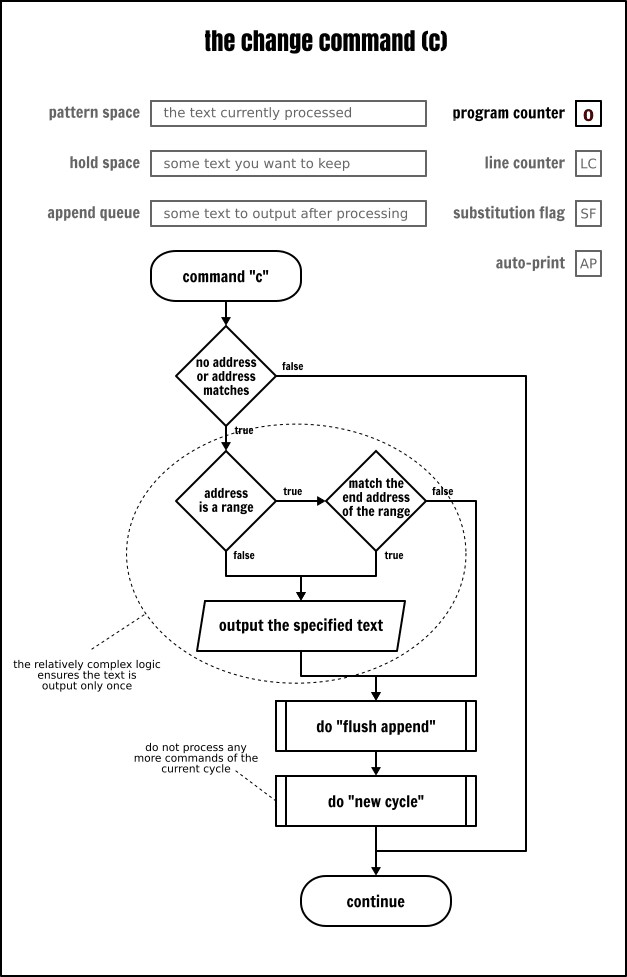


```
cat -n inputfile | sed -e '
/systemd/c
 # :REMOVED:
s/:.*// # 이 명령은 “변경된” 텍스트에는 적용되지 않습니다.
'
```

변경 명령이 주소 범위와 연관된 경우 범위의 마지막 줄에 도달하면 해당 텍스트는 한 번만 출력됩니다. 이는 Sed 명령이 주소 범위 내의 모든 줄에 반복적으로 적용된다는 관례에 대한 일종의 예외입니다:

```
cat -n inputfile | sed -e &apos;
19,22c
 # :REMOVED:
s/:.*// # 이 명령은 “변경된” 텍스트에는 적용되지 않습니다
'
```

따라서 변경 명령을 주소 범위 내의 모든 행에 반복 적용하려면 이를 블록으로 묶는 것 외에는 별 다른 방법이 없습니다:

```
cat -n inputfile | sed -e &apos;
19,22{c
 # :REMOVED:
}
s/:.*// # 이 명령은 “변경된” 텍스트에는 적용되지 않습니다
'
```

## 삽입 명령어
삽입 명령어(i)는 사용자가 입력한 텍스트를 즉시 출력에 표시합니다. 이 명령어는 프로그램의 흐름이나 버퍼의 내용을 어떤 방식으로도 수정하지 않습니다.

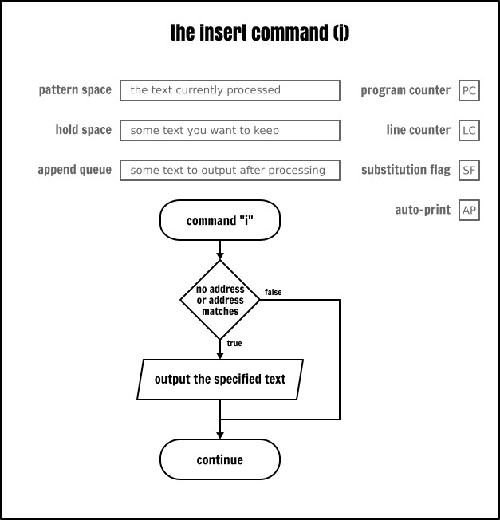


```
 # 첫 번째 행에 제목을 붙인 채로 처음 다섯 개의 사용자 이름을 표시합니다.
sed < inputfile -e '
1i
USER NAME
s/:.*//
5q
'
```

## 추가 명령
입력의 다음 줄이 읽힐 때 추가 명령(a)은 표시 대기열에 텍스트를 추가합니다. 이 텍스트는 현재 루프가 끝날 때(프로그램이 종료되는 경우 포함) 또는 n 또는 N 명령을 사용해서 입력에서 새 줄을 읽을 때 출력됩니다.

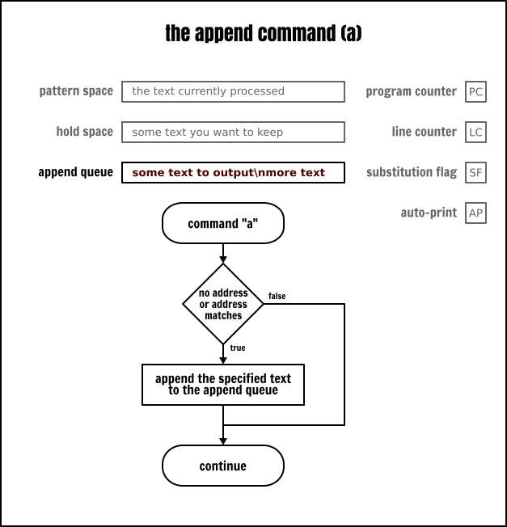


위와 동일한 예제지만 이번엔 맨 위가 아닌 맨 아래에 삽입합니다:

```
sed < inputfile -e '
5a
USER NAME
s/:.*//
5q
'
```

## 읽기 명령
이것은 출력 스트림에 텍스트 내용을 삽입하는 네 번째 명령인 읽기 명령(r)입니다. 이 명령은 추가 명령과 작동 방식이 완전 동일하지만 Sed 스크립트에 하드코딩된 텍스트를 가져오는 대신 파일의 내용을 출력으로 작성한다는 점이 다릅니다.

읽기 명령은 읽을 파일만 스케줄링합니다. 추가 대기열을 정리할 때 비로소 해당 파일이 효율적으로 읽히며 읽기 명령이 실행될 때는 읽히지 않습니다. 이때 해당 파일에 대한 동시 읽기 액세스가 발생하거나 해당 파일이 일반 파일이 아닌 경우(예: 문자 장치나 명명된 파이프) 또는 읽기 중에 파일이 수정되는 경우 심각한 결과가 발생할 수 있습니다.

예를 들어, 다음 절에서 자세히 설명할 쓰기 명령을 사용해서 읽기 명령과 함께 임시 파일에 쓰고 다시 읽는 경우 창의적인 결과를 얻을 수 있습니다(프랑스어판 시리토리 게임을 예로 들면):

```
printf “%sn” “Trois p&apos;tits chats” “Chapeau d&apos; paille” “Paillasson” |
sed -ne '
  r temp
  a
  -  w temp
'
```

이제 스트림 출력에 텍스트를 삽입하는 데 특화된 Sed 명령어 목록은 여기까지입니다. 마지막 예제는 순전히 재미를 위한 것이지만 앞서 언급한 쓰기 명령어가 있었기 때문에 이 예제는 다음 절로 자연스럽게 이어집니다. 다음 절에서는 Sed에서 데이터를 외부 파일에 쓰는 방법을 살펴보겠습니다.


## 대체 출력
Sed의 설계 철학은 모든 텍스트 변환 결과가 프로세스의 표준 출력으로 기록된다는 것입니다. 하지만 Sed에는 데이터를 다른 위치로 전송할 수 있도록 지원하는 몇 가지 기능도 있습니다. 앞서 언급한 출력 대상 대체를 구현하는 방법에는 두 가지가 있습니다. 전용 쓰기 명령(w)을 사용하거나 대체 명령(s)에 쓰기 플래그를 추가하는 방법입니다.

### 쓰기 명령
쓰기 명령(w)은 패턴 공간의 내용을 지정된 대상 파일에 추가합니다. POSIX는 Sed가 데이터를 처리하기 전에 대상 파일이 Sed에 의해 생성될 수 있어야 한다고 규정합니다. 지정된 대상 파일이 이미 존재할 경우 해당 파일은 덮어쓰게 됩니다.

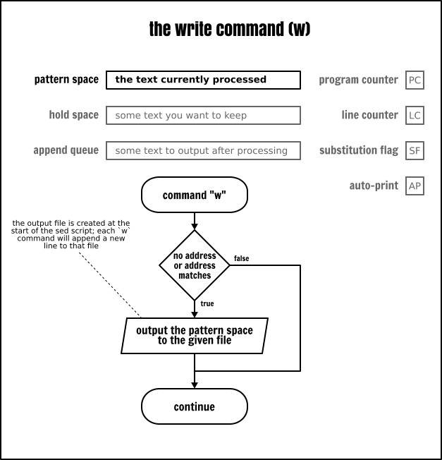


따라서 실제로 해당 파일에 데이터를 쓰지 않았더라도 파일은 생성됩니다. 예를 들어, 다음 Sed 프로그램은 쓰기 명령이 실행하지 않았더라도 output 파일을 생성하거나 덮어씁니다:

```
echo | sed -ne &apos;
  q            # 즉시 종료
  w output     # 이 명령은 실행되지 않음
'
```

여러 개의 쓰기 명령을 동일한 대상 파일에 지정할 수 있습니다. 동일한 대상 파일을 가리키는 모든 쓰기 명령은 해당 파일의 내용에 추가됩니다(작동 방식은 쉘의 리디렉션 기호 >> 와 거의 동일합니다):

```
sed < inputfile -ne '
  /:/bin/false$/w server
  /:/usr/sbin/nologin$/w server
  w output
'
cat server
```

### 치환 명령의 쓰기 플래그
앞서 우리는 치환 명령(s)에 대해 배웠는데 이 명령에는 치환 이후 패턴 공간의 내용을 출력하는 데 사용되는 p 옵션이 있습니다. 마찬가지로 치환 후 패턴 공간의 내용을 파일로 출력하는 데 사용되는 w 플랙그도 있습니다:

```
sed < inputfile -ne '
  s/:.*/nologin$//w server
  s/:.*/false$//w server
'
cat server
```


## 주석
저는 주석을 수없이 사용했지만 정식으로 소개할 시간을 내지 못했습니다. 그래서 이제서야 정식으로 소개하기로 했습니다. 대부분의 프로그래밍 언어와 마찬가지로 주석은 소프트웨어가 해석하지 않는 자유 형식 텍스트를 추가하는 방법입니다. Sed의 구문은 매우 난해하기 때문에 스크립트에서 필요한 곳에 충분한 주석을 달아야 한다는 점을 강조하지 않을 수 없습니다. 그렇지 않으면 작성자 외에는 거의 아무도 그 내용을 이해할 수 없을 것입니다.

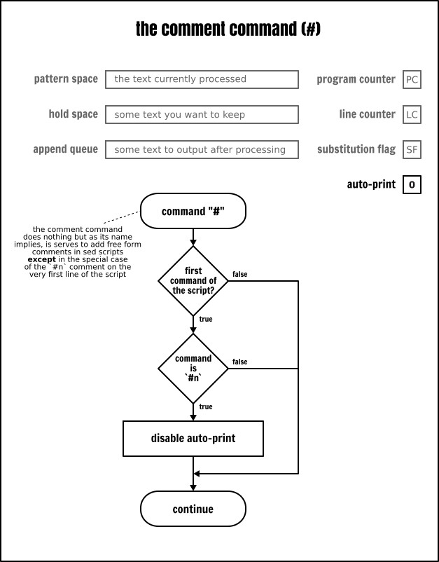


하지만 Sed의 다른 부분과 마찬가지로 주석도 그 나름의 미묘한 점이 있습니다. 첫째이자 가장 중요한 점은 주석이 구문 구조가 아니라 진정한 의미의 Sed 명령어라는 것입니다. 주석은 비록 “아무것도 처리하지 않는” 명령어지만 여전히 명령어입니다. 적어도 POSIX에선 그렇게 정의되어 있습니다. 따라서 엄밀히 말하면 주석은 다른 명령어가 허용되는 곳에서만 사용할 수 있습니다.

대부분의 Sed 구현체는--제가 그 기사에서 곳곳에 사용한 것처럼--행 내 명령을 허용함으로써 이런 요구 사항을 완화하고 있습니다.

이 주제를 마무리하기 전에 #n 주석(# 뒤에 공백없이 곧바로 n 이 오는 형태)의 특수한 경우에 대해 언급할 필요가 있습니다. 스크립트의 첫 번째 줄에서 정확히 이 주석이 발견되면 Sed는 명령줄에서 -n 옵션을 지정한 것과 마찬가지로 무음 모드로 전환됩니다(즉, 자동 출력 플래그가 해제됩니다).

## 거의 사용하지 않는 명령어
지금까지 배운 명령어만으로도 여러분이 사용하는 스크립트의 99.99%를 작성할 수 있습니다. 하지만 나머지 Sed 명령어에 대해 언급하지 않는다면 이 튜토리얼을 완전한 가이드라고 할 수 없을 것입니다. 이 명령어들을 마지막에 남겨둔 이유는 거의 사용하지 않기 때문입니다. 하지만 여러분에게 실제 사용 사례가 있다면 이 명령어들이 매우 유용하다는 것을 알게 될 것입니다. 그렇다면 주저하지 말고 아래 댓글란에 그 내용을 공유해 주세요.

### 행 번호 명령어
이 = 명령어는 Sed가 현재 읽고 있는 행 번호를 표준 출력에 표시합니다. 이 행 번호는 행 카운터(LC)의 내용입니다. 어떤 Sed 버퍼에서도 이 숫자를 가져올 방법은 없으며 출력 형식을 지정할 수도 없습니다. 이 두 가지 제한 사항으로 인해 이 명령어의 유용성은 크게 떨어집니다.

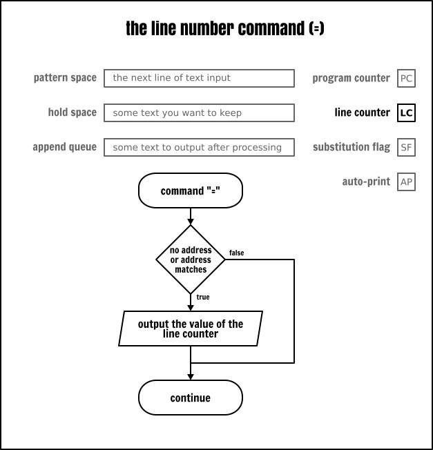


엄격한 POSIX 호환 모드에서 명령줄에 여러 입력 파일을 지정하면 Sed는 해당 카운터를 재설정하지 않고 모든 입력 파일이 하나로 연결된 것처럼 연속적으로 증가시킨다는 점을 기억합니다. GNU Sed 같은 일부 Sed 구현체는 각 입력 파일 읽기가 끝날 때마다 카운터를 재설정하는 옵션이 있습니다.


### 명시적 출력 명령
이 l(소문자 l)명령은 출력 명령(p)과 유사한 역할을 처리하지만 패턴 공간의 내용을 정확한 형식으로 출력합니다. 다음은 POSIX 표준에서 인용한 내용입니다:

> XBD 이스케이프 시퀀스에 나열된 문자와 관련 동작(\, a, b, f, r, t, v)은 해당 이스케이프 시퀀스로 작성되며 해당 표에 있는 n 은 적용되지 않습니다. 해당 표에 포함되지 않은 인쇄 불가능한 문자는 3자리 8진수(앞에 백슬래시를 붙임)로 출력되며 이는 문자의 각 바이트(가장 중요한 바이트가 앞에 옴)를 나타냅니다. 긴 행은 줄바꿈되어야 하며 줄바꿈 위치를 나타내기 위해 백슬래시 뒤에 줄바꿈 문자를 작성해야 합니다. 줄바꿈이 발생하는 위치는 불확실하지만 출력 장치의 구체적인 상황에 적합해야 합니다. 각 행은 $ 기호로 끝나야 합니다.

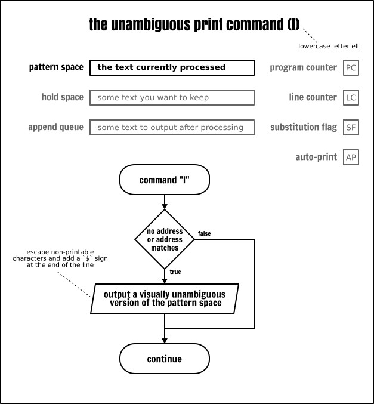


이 명령은 8비트 정규화 채널이 아닌 곳에서 데이터를 교환할 때 사용하는 것으로 보입니다. 제 경우, 디버깅 용도 외에는 이 명령을 사용해 본 적이 없습니다.


### 전사 명령어
전사(transliterate) (y) 명령어는 소스 집합에서 대상 집합으로 패턴 공간의 문자를 매핑할 수 있게 해줍니다. 이 명령어는 tr 명령어와 유사하지만 더 많은 제한이 있습니다.

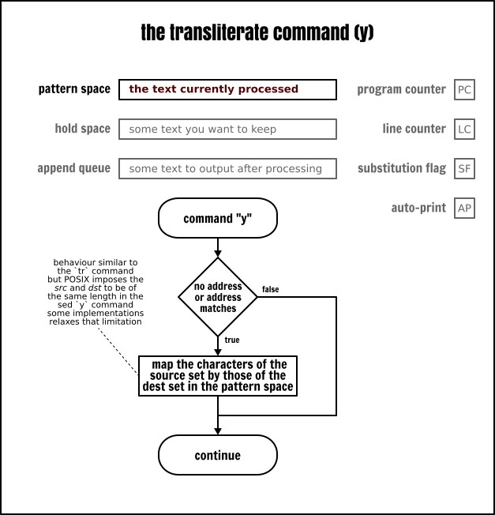


```
 # `y` 명령어는 해커 전용입니다
sed < inputfile -e '
 s/:.*//
 y/abcegio/48<3610/
'
```

전사 명령어의 구문은 치환 명령어 구문과 유사하지만 문자열을 치환한 후에는 어떤 옵션도 허용하지 않습니다. 이 전사는 항상 전역적으로 적용됩니다.

sed 명령어는 소스 집합과 대상 집합 간의 일대일 변환을 요구한다는 점에 유의합니다. 즉, 아래의 sed 프로그램은 언뜻 보기에 생각한 것과 다르게 동작할 수 있습니다:

```
 # 주의: 이 코드는 생각한 대로 작동하지 않을 수 있습니다!
sed < inputfile -e &apos;
  s/:.*//
  y/[a-z]/[A-Z]/
'
```


## 마치며

```
 # 이 코드는 무엇을 할까요?
 # 힌트: 정답은 바로 근처에 있습니다...
sed -E '
  s/.*W(.*)/1/
  h
  ${ x; p; }
  d' < inputfile
```

이제 모든 Sed 명령어를 배웠습니다. 우리가 해냈다는 게 믿겨지지 않네요! 여러분도 여기까지 읽으셨다면 특히 시간내어 시스템에서 다양한 예제를 직접 시도해 보셨다면 정말 축하드립니다!

보셨듯이 Sed는 문법이 다소 복잡할 뿐만 아니라 극단적인 사례나 명령어 동작 간의 미묘한 차이 때문에 매우 복잡합니다. 의심할 여지없이 이런 점들은 역사적인 이유로 귀결될 수 있습니다. 이토록 많은 단점에도 불구하고 Sed는 여전히 매우 강력한 도구이며 지금도 유닉스 도구 상자에 널리 사용하는 몇 안 되는 명령어 중 하나입니다. 

이제 이 글을 마무리할 시간입니다. 여러분의 지원이 없었다면 이 일을 해낼 수 없었을 것입니다. 여러분이 가장 좋아하거나 가장 창의적이라고 생각하는 Sed 스크립트를 골라 저희와 공유해 주세요. 여러분이 공유해 주신 스크립트가 충분히 모이면 이 Sed 스크립트들을 모아 책으로 출간할 예정입니다!

출처: https://linuxhandbook.com/sed-reference-guide/  
저자: Sylvain Leroux 기획: lujun9972 번역: qhwdw 교정: wxy  
게시: https://linuxstory.org/sed-command-complete-guide/

본 글은 LCTT에서 원작을 번역·편집하였으며 Linux 중국이 자랑스럽게 소개합니다.  
본 글은 Linux 중국에서 전재되었습니다: https://github.com/Linux-CN/archive
