[ref](https://github.com/LCTT/TranslateProject/blob/master/published/201811/20180615%20Complete%20sed%20Command%20Guide%20%5BExplained%20with%20Practical%20Examples%5D.md)

sed 명령어 완전 가이드
======

이전 글에서 [sed의 기본 사용법][^1]을 소개했습니다. sed는 매우 실용적인 <ruby>스트림 편집기<rt>stream editor</rt></ruby>입니다. 오늘은 sed를 좀 더 깊이 알아보고 sed의 작동 방식을 자세히 살펴보겠습니다. 

이번 기회에 sed를 종합적으로 이해하고 작동 원리와 미묘한 점을 깊이 파헤쳐 보겠습니다. 준비되셨다면 터미널을 열고 [테스트 파일을 다운로드][^2]한 뒤 컴퓨터 앞에 앉아 탐험을 시작하겠습니다!

### sed에 대한 약간의 이론적인 지식

#### sed의 작동 방식

먼저 sed를 이해하려면 이 도구의 작동 방식을 알아야 합니다.

sed는 데이터를 처리할 때 <ruby>입력<rt>STDIN</rt></ruby> 소스에서 한 줄씩 읽고 소위, <ruby>패턴 공간<rt>pattern space</rt></ruby>에 저장합니다. sed의 모든 변환 작업은 패턴 공간 내에서 이루어집니다. 변환 작업은 명령줄이나 sed 스크립트 파일에서 제공되는 한 글자 명령어로 설명됩니다. 대부분의 sed 명령어는 주소 하나 또는 주소 범위를 접두사로 붙여 적용 범위를 제한할 수 있습니다.

기본적으로 sed는 각 처리 루프가 끝날 때마다 패턴 공간의 내용을 출력합니다. 즉, 입력 소스의 다음 행이 패턴 공간를 덮어쓰기 전에 출력이 이루어집니다. 이런 작동 방식은 다음과 같이 요약할 수 있습니다:

1. 다음 행을 패턴 공간로 읽어들이려고 시도합니다.
2. 읽기가 성공하면:
    1. 스크립트에 명시된 순서대로 주소와 일치하는 현재의 입력 행에 모든 명령을 적용합니다.
    2. sed가 무음 모드(`-n`)로 실행되지 않는 경우 패턴 공간의 모든 내용(수정됐을 수도 있음)을 출력합니다.
    3. 1 단계로 돌아갑니다.

따라서 각 행의 처리가 완료된 후 패턴 공간의 내용은 버려지므로 내용을 보관하는 용도로는 적합하지 않습니다. sed는 이런 목적을 위해 두 번째 버퍼인 <ruby>보관 공간<rt>hold space</rt></ruby>이 있습니다. 데이터를 보관 공간에 명시적으로 저장하거나 보관 공간에서 데이터를 가져오도록 요청하지 않는 한 sed는 보관 공간의 내용을 절대 지우지 않습니다. 나중에 *exchange*, *get*, *hold* 명령어를 학습할 때 자세히 살펴보겠습니다.


#### sed의 추상화 메커니즘

위에서 설명한 패턴은 많은 sed 튜토리얼에서 접할겁니다. 실제로 이는 기본적인 sed 프로그램을 이해하는 데 필수적인 내용입니다. 하지만 고급 명령어를 연구하다 보면 이런 지식만으론 부족하다는 것을 깨닫습니다. 따라서 이제부터 좀 더 심층적인 내용을 살펴보겠습니다.

사실 sed는 추상화 메커니즘의 구현체로 볼 수 있으며 그 상태는 세 개의 버퍼, 두 개의 레지스터 그리고 두 개의 플래그로 정의됩니다:

* **세 개의 버퍼**는 임의의 길이의 텍스트를 저장하는 용도로 사용됩니다. 네, 세 개입니다!! 앞서 설명한 기본 실행 모드에선 두 가지 즉, 패턴 공간과 보관 공간만 다뤘지만 sed는 세 번째 버퍼인 <ruby>추가 큐<rt>append queue</rt></ruby>가 있습니다. sed 관점에서 보면 쓰기 전용 버퍼이며 sed는 실행 중 사전 정의 단계에서 이를 자동으로 갱신합니다(일반적으로 입력 소스에서 새 줄을 읽기 전이나 실행을 종료하기 직전).

* sed는 또한 **두 개의 레지스터**를 관리합니다: <ruby>행 카운터<rt>line counter</rt></ruby>(LC)는 입력 소스에서 읽은 행 수를 저장하며 <ruby>프로그램 카운터<rt>program counter</rt></ruby> (PC)는 다음에 실행될 명령의 인덱스(즉, 스크립트 내의 위치)를 저장하며 sed는 메인 루프의 일부로 PC를 자동으로 증가시킵니다. 하지만 특정 명령을 사용할 때 스크립트에서 PC를 수정해서 프로그램의 일부를 건너뛰거나 반복할 수 있습니다. 이는 sed로 구현한 루프나 조건문과 유사합니다. 자세한 내용은 ‘전용 분기’ 섹션에서 설명하겠습니다.

* 마지막으로 **두 개의 플래그**는 특정 sed 명령어의 동작을 변경합니다: <ruby>자동 출력<rt>auto-print</rt></ruby>(AP) 플래그와 <ruby>대체<rt>substitution</rt></ruby>(SF) 플래그입니다. 자동 출력 플래그 AP가 설정되면 sed는 패턴 공간의 내용이 덮어쓰기 전에(특히, 입력 소스에서 새 줄을 읽기 전을 포함하되 이에 국한되진 않음) 자동으로 출력합니다. 자동 출력 플래그가 해제된 경우(즉, 설정되지 않은 경우) sed는 스크립트에 명시적인 명령이 없는 한 패턴 공간의 내용을 출력하지 않습니다. “무음 모드” (명령줄 옵션 `-n` 을 사용하거나 스크립트 첫 번째 줄에 특수 주석 `#n` 을 사용)로 sed를 실행해서 자동 출력 플래그를 해제할 수 있습니다. 주소와 검색 패턴이 패턴 공간의 내용과 일치할 때 대체 플래그 SF는 대체 명령(`s` 명령)에 의해 설정됩니다. 대체 플래그는 새로운 반복을 시작할 때, 입력 소스에서 새 줄을 읽을 때 또는 조건 분기를 통과한 후 지워집니다. 이 주제는 ‘분기’ 섹션에서 자세히 살펴보겠습니다.

또한, sed는 주소 범위(주소 범위는 ‘주소 범위’ 절에서 설명합니다)에 들어온 명령어 목록과 데이터를 읽고 쓸 때 사용하는 두 개의 <ruby>파일 핸들<rt>file handle</rt></ruby>을 관리합니다(파일 핸들은 ‘읽기 및 쓰기 명령어’ 섹션에서 확인할 수 있습니다).


#### 보다 정확한 sed 실행 모델

“그림 한 장이 천마디 말보다 낫다!” 고 합니다. 그래서 sed 실행 모델을 설명하기 위한 <ruby>흐름도<rt>flow chart</rt></ruby>를 그렸습니다. 여러 입력 파일 처리나 오류 처리 같은 두 가지 요소를 옆에 배치했지만 이 정도라면 어떤 sed 프로그램 동작도 이해하는 데는 충분할 뿐만 아니라 sed 스크립트를 작성할 때 시행착오로 낭비하는 시간을 줄일 수 있을 겁니다.

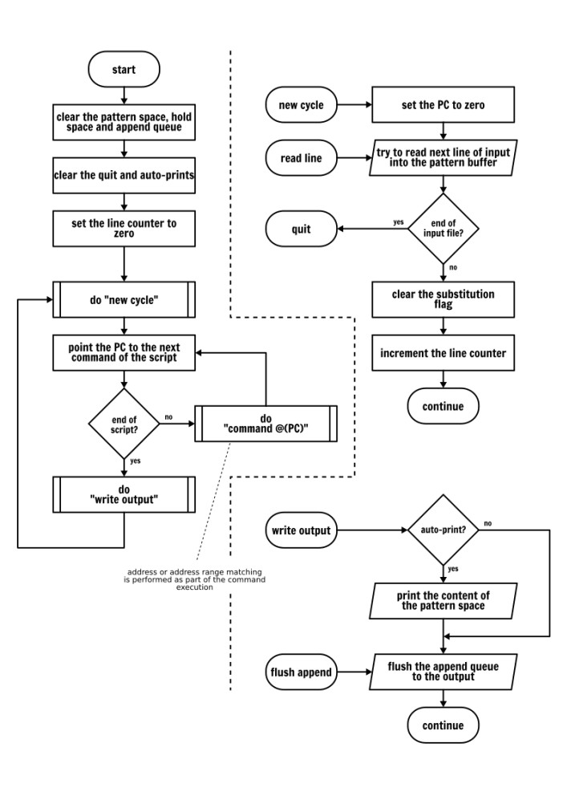

이미 눈치챘겠지만 위의 흐름도는 명령어의 동작을 묘사하지 않았습니다. 명령어는 이후 하나씩 자세히 설명합니다. 그러니 서두르지 마시고 바로 시작하겠습니다!


### 출력 명령어 - *print*

출력 명령어(`p`)는 실행되는 순간 패턴 공간의 내용을 출력합니다. 이 명령어는 sed의 추상 메커니즘의 상태를 어떤식으로든 변경하지 않습니다.

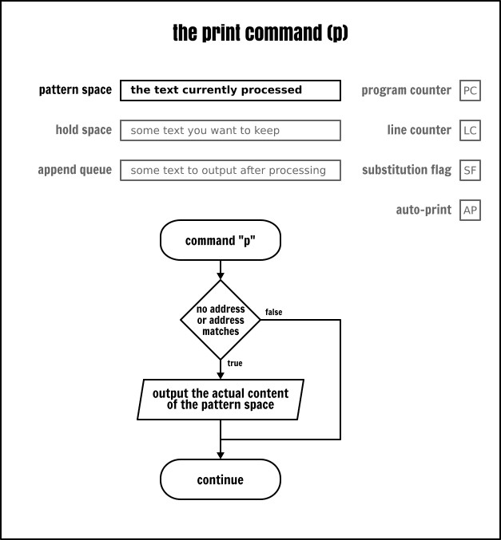

예시:

```
sed -e ‘p’ inputfile
```

위의 명령어는 입력 파일의 각 줄의 내용을 출력합니다. 하지만 두 번 중복 출력합니다... `p` 명령어를 명시적으로 요청하면 처리 루프가 끝날 때마다 출력하기 때문입니다(여기선 sed를 “무음 모드” 로 실행하지 않았기 때문입니다).

줄을 두 번씩 안보려면 다음과 같은 두 가지 방법으로 해결합니다:

```
sed -n -e ‘p’ inputfile     # 무음 모드에서 명시적으로 출력
sed -e ‘’ inputfile         # “아무것도 처리하지 않는” 빈 프로그램. (암시적으로 출력)
```

> [!NOTE]
> `-e` 옵션은 sed 명령을 도입하는 역할을 처리합니다. 이는 명령과 파일명을 구분합니다. sed는 적어도 하나의 명령을 포함해야 하므로 첫 번째 명령의 `-e` 플래그는 필수가 아닙니다. 하지만 개인적인 습관상 여기서 다루는 ‘명령줄에서 여러 개의 sed 표현식을 지정하는’ 복잡한 사례와의 일관성을 위해 추가했습니다. 이것이 좋은 습관인지 나쁜 습관인지는 여러분이 판단하시기 바랍니다. 이 글 뒷부분에도 이런 습관을 계속 따릅니다.


### 주소 - *addresses*

분명 *print* 명령어 자체로는 별로 유용하지 않습니다. 하지만 명령어 앞에 주소를 추가해서 입력 파일의 일부 행만 출력하면 입력 파일에서 원치않는 행을 걸러낼 수 있습니다.("필터링") 

그러면 sed에서 "주소" 란 무엇일까요? sed는 입력 파일의 “행” (줄, 라인)을 어떻게 식별할까요?

#### 행 번호 - *line number*

sed에서 주소는 행 번호(`$` 는 “마지막 행” 을 의미)나 정규 표현식일 수 있습니다. sed에서 행 번호를 사용할 때 “행 번호는 1부터 시작된다!!” 는 점을 기억합니다. 또한, “0행부터 시작하지 않는다!” 는 점에 유의합니다.

```
sed -n -e ‘1p’ inputfile    # 파일 첫 번째 행 출력
sed -n -e ‘5p’ inputfile    # 5번째 행 출력
sed -n -e ‘$p’ inputfile    # 파일 마지막 행 출력
sed -n -e ‘0p’ inputfile    # 0번째 행은 유효한 행 번호가 아니므로 오류가 발생합니다!!
```

POSIX 사양[^12]에 따르면 여러 입력 파일을 지정하면 행 번호는 누적됩니다. 다시 말해 sed가 새로운 (입력) 파일을 열 때도 행 카운터를 재설정하지 않습니다. 따라서 다음 두 명령은 동일한 결과를 반환합니다. 즉, 한 줄만 출력합니다:

```
sed -n -e ‘1p’ inputfile1 inputfile2 inputfile3
cat inputfile1 inputfile2 inputfile3 | sed -n -e ‘1p’
```

실제로 POSIX에서 여러 입력 파일을 처리하는 방법이 다음과 같이 규정되어 있습니다:

> 여러 입력 파일이 지정된 경우 파일 순서대로 읽혀져 연결되어 편집됩니다.

그러나 일부 sed 구현체는 이런 동작을 변경하는 명령줄 옵션을 제공합니다. 예를 들어, GNU sed의 `-s` 옵션입니다(GNU sed의 `-i` 옵션도 이 옵션을 암묵적으로 사용합니다):

```
sed -sn -e ‘1p’ inputfile1 inputfile2 inputfile3
```

sed 구현체가 이런 비표준 옵션을 지원할 경우 세부 사항은 `man` 매뉴얼 페이지를 참조합니다.

#### 정규 표현식 - *regular expression*

앞서 언급했듯이 sed의 주소는 줄 번호일 수도 있고 정규 표현식(패턴 주소)일 수도 있습니다. 그렇다면 정규 표현식은 무엇일까요?

이름으로 알 수 있듯이 [정규 표현식][^13]은 문자 집합을 기술하는 방법입니다. 문자열이 정규 표현식이 기술하는 집합에 부합하면 “정규 표현식과 일치한다!” 고 간주합니다.

정규 표현식은 완전히 일치하는 문자가 포함될 수 있습니다. 예를 들어, 모든 알파벳과 숫자 그리고 대부분의 인쇄 가능한 문자입니다. 하지만 일부 기호는 특수한 의미를 가집니다:

* `^` 와 `$` 같이 <ruby>앵커<rt>anchor</rt></ruby> 역할을 하는 기호들은 줄 시작과 끝을 나타냅니다;
* 전체 문자 집합을 나타내는 자리 표시자로 사용되는 기호들(예: 점 `.` 은 임의의 단일 문자와 일치하고 대괄호 `[]` 는 사용자 정의 문자 집합을 정의합니다);
* 반복 횟수를 나타내는 기호들(예: 클레이니 별표(`*`)][^14]는 앞의 패턴이 0회, 1회 또는 여러 번 반복됨을 나타냄);

이 글의 목적은 정규 표현식을 설명하는 것이 아닙니다. 따라서 몇 가지 간단한 예제만 소개합니다. 인터넷에서 정규 표현식에 관한 튜토리얼을 쉽게 찾을 수 있습니다. 정규 표현식은 매우 강력하며 수많은 표준 유닉스 명령어와 프로그래밍 언어에서 사용되며 모든 유닉스 사용자가 익혀야 할 필수 기술입니다.

다음은 sed를 사용한 몇 가지 정규 표현식 예제입니다:

```
sed -n -e ‘/systemd/p’ inputfile        # “systemd” 문자열이 포함된 행 출력
sed -n -e ‘/nologin$/p’ inputfile       # “nologin” 으로 끝나는 행 출력
sed -n -e ‘/^bin/p’ inputfile           # “bin” 으로 시작하는 행 출력
sed -n -e ‘/^$/p’ inputfile             # 빈 행(즉, 시작과 끝 사이에 아무것도 없는 행) 출력
sed -n -e ‘/./p’ inputfile              # 문자가 포함된 행(즉, 비어 있지 않은 행) 출력
sed -n -e ‘/^.$/p’ inputfile            # 하나의 문자만 포함된 행 출력
sed -n -e ‘/admin.*false/p’ inputfile   # “admin” 뒤에 “false” 가 오는 행 출력 (사이에 임의 개수의 문자가 올 수 있음)
sed -n -e ‘/1[0,3]/p’ inputfile         # “1” 이 하나 있고 그 뒤에 “0” 또는 “3” 이 오는 행 출력
sed -n -e ‘/1[0-2]/p’ inputfile         # “1” 이 하나 있고 그 뒤에 “0”, “1”, “2” 또는 “3” 이 오는 행 출력
sed -n -e ‘/1.*2/p’ inputfile           # 문자 “1” 뒤에 “2” 가 오는(그 사이에 임의의 개수의 문자가 있을 수 있음) 행 출력
sed -n -e ‘/1[0-9]*2/p’ inputfile       # 문자 “1” 뒤에 “0”, “1” 또는 그 이상의 숫자가 오고 마지막에 “2” 가 오는 행 출력
```

정규 표현식(정규 표현식 구분자 포함)에서 문자의 특수한 의미를 제거하려면 그 앞에 백슬래시(`\`)를 사용합니다: 이를 "이스케이프 처리한다!" 고 표현합니다.

```
# “/usr/sbin/nologin” 문자열이 포함된 모든 행을 출력합니다.
sed -ne ‘/\/usr\/sbin\/nologin/p’ inputfile
```

패턴 (주소)에서 정규 표현식의 구분자로 슬래시 문자만 사용할 수 있는 것은 아닙니다. 첫 번째 구분자로 사용할 문자 앞에 백슬래시(`\`)를 붙이는 방식으로 어떤 문자라도 정규 표현식의 구분자로 사용할 수 있습니다. 이는 주소에 파일 경로가 많이 포함된 패턴을 일치시킬 때 유용합니다:

```
# 다음 두 명령은 동일합니다.
sed -ne ‘/\/usr\/sbin\/nologin/p’ inputfile    # 이스케이프 처리함
sed -ne ‘\=/usr/sbin/nologin=p’ inputfile      # 대체 구분자로 처리함
```

#### 확장 정규식 - *extended regular expression*

기본적으로 sed의 정규식 엔진은 POSIX 기본 정규 표현식[^15] 구문만 인식합니다. 확장 정규 표현식[^16] 구문을 사용하려면 sed에 `-E` 옵션을 사용합니다. 확장 정규 표현식(ERE)은 기본 정규 표현식(BRE)에 한 세트의 추가 기능을 제공하며 그 중 상당수는 중요합니다. 또한 백슬래시 사용 갯수도 훨씬 더 적습니다. 다음을 비교합니다:

```
sed -n -e ‘/\(www\)\|\(mail\)/p’ inputfile     # 이스케이프 처리함
sed -En -e ‘/(www)|(mail)/p’ inputfile         # 확장 정규 표현식으로 처리함
```

#### 중괄호 수량자

정규 표현식이 강력한 이유 중 하나는 범위 수량자[^17] `{,}` 때문입니다. 사실 다소 부정확한 일치를 위한 정규 표현식을 작성할 때 수량자 `*` 는 완벽한 기호입니다. 하지만 (중괄호 수량자를 사용하면) 하한과 상한을 명시적으로 지정할 수 있으므로 유연성을 얻을 수 있습니다. 범위 연산자의 하한이 생략되면 하한은 0으로 간주합니다. 상한이 생략되면 상한은 무한대로 간주합니다:

| 중괄호 | 약어 | 설명 |
| --- | ----- | ---- |
| `{,}`   | `*`   | 앞의 규칙이 0, 1 또는 여러 번 나타남 |
| `{,1}`  | `?`   | 앞의 규칙이 0번 또는 1번 나타남 |
| `{1,}`  | `+`   | 앞의 규칙이 1번 또는 여러 번 나타남 |
| `{n,n}` | `{n}` | 앞의 규칙이 정확히 n번 나타남 |

중괄호는 기본 정규 표현식에서 사용할 수 있지만 백슬래시를 사용해야 합니다. POSIX 사양에 따르면 기본 정규 표현식에서 사용할 수 있는 수량자는 별표(`*`)와 중괄호(백슬래시 사용 `\{m,n\}`) 뿐입니다. 많은 정규 표현식 엔진에서 `\?` (있거나 없거나)와 `\+` (최소한 하나)를 확장 지원합니다. 하지만 왜 수량자는 그토록 유혹적일까요? 왜냐하면 수량자를 사용하면 확장 정규식을 작성하기 쉬울뿐만 아니라 이식성이 뛰어나기 때문입니다.

왜 제가 정규 표현식의 중괄호 수량자를 공들여 설명하느냐면 sed 스크립트에서 이 기능으로 문자를 세는 경우가 자주 있기 때문입니다.

```
sed -En -e ‘/^.{35}$/p’ inputfile      # 정확히 35개의 문자를 포함하는 행 출력
sed -En -e ‘/^.{0,35}$/p’ inputfile    # 35자 이하인 줄 출력
sed -En -e ‘/^.{,35}$/p’ inputfile     # 35자 이하인 줄 출력
sed -En -e ‘/^.{35,}$/p’ inputfile     # 35자 이상을 포함하는 행 출력
sed -En -e ‘/.{35}/p’ inputfile        # 출력 내용을 직접 확인합니다. (여러분이 직접 풀어야 할 문제입니다!!)
```

#### 주소 범위 - *address range*

지금까지 사용한 모든 주소는 고유(단일) 주소입니다. 고유 주소를 사용할 때 명령은 해당 주소와 일치하는 행에만 적용됩니다. 하지만 sed는 주소 범위도 지원합니다. sed 명령은 주소 범위의 시작부터 끝까지의 모든 주소에 해당하는 모든 행에 적용됩니다:

```
sed -n -e ‘1,5p’ inputfile              # 1행부터 5행까지 출력
sed -n -e ‘5,$p’ inputfile              # 5행부터 파일 끝까지 출력
sed -n -e ‘/www/,/systemd/p’ inputfile  # 정규 표현식 /www/ 와 일치하는 첫 번째 줄부터 /systemd/ 줄까지 출력
```

> [!NOTE]
> LCTT 번역자 주: 아래는 예제의 출력 결과로 참고용으로 제시합니다:)

```
printf “%s\n” {a,b,c}{d,e,f} | cat -n
     1    ad
     2    ae
     3    af
     4    bd
     5    be
     6    bf
     7    cd
     8    ce
     9    cf
```

시작 주소와 끝 주소에 동일한 행 번호를 사용할 경우 범위는 해당 행으로 좁혀집니다. 사실, 두 번째 주소의 숫자가 주소 범위에 선택한 첫 번째 행의 숫자보다 작거나 같다면 단 한 행만 선택됩니다:

```
printf “%s\n” {a,b,c}{d,e,f} | cat -n | sed -ne ‘4,4p’
     4 bd
printf “%s\n” {a,b,c}{d,e,f} | cat -n | sed -ne ‘4,3p’
     4 bd
```

다음 내용은 다소 어렵지만 앞선 단락에서 제시한 규칙은 시작 주소가 정규 표현식일 경우도 적용됩니다. 이 경우 sed는 정규 표현식과 일치하는 첫 번째 행 번호와 종료 주소로 지정한 행 번호를 비교합니다. 다시 강조하면 범위 종료 행 번호가 시작 행 번호보다 작거나 같다면 범위는 한 행으로 좁혀집니다:

> [!NOTE]
> LCTT 번역자 주: 저자의 설명에 오류가 있습니다. sed는 정규 표현식으로 표시된 시작 행을 처리할 때 종료 표현식을 (동시에) 테스트하지 않습니다. 시작 행에 일치하는 정규 표현식에서 일치하지 않을 때까지 테스트한 후 종료 행의 표현식(정규 표현식 여부와 상관없이)을 테스트하며 종료 표현식 테스트에 실패하면 중단하고 이 테스트를 반복합니다.

```
# /b/,4 주소는 세 개의 단일 행과 일치합니다.
# 일치한 행 번호가 4 이상이기 때문입니다.
# (LCTT 번역자 주: 결과는 맞지만 설명이 틀렸습니다!! 
# 4, 5, 6행은 정규 표현식의 시작 부분과 일치하므로 통과하고, 
# 7행은 정규 표현식의 시작 부분과 일치하지 않으므로 행 수 비교가 시작됩니다: 
# 즉, 7 > 4 로 중단합니다.)
printf “%s\n” {a,b,c}{d,e,f} | cat -n | sed -ne ‘/b/,4p’
     4  bd
     5  be
     6  bf

# 일치 범위가 어디까지일지 직접 확인합니다
printf “%s\n” {a,b,c}{d,e,f} | cat -n | sed -ne ‘/d/,4p’
     1  ad
     2  ae
     3  af
     4  bd
     7  cd
```

그러나 종료 주소가 정규 표현식일 경우 sed의 동작은 달라집니다. 이 경우 주소 범위의 첫 번째 줄은 종료 주소와 비교하지 않으므로 주소 범위는 최소 두 줄을 포함합니다(물론 입력 데이터가 부족한 경우는 예외입니다):

> [!NOTE]
> LCTT 번역자 주: 위의 번역자 주석에 언급했듯이 시작 정규 표현식이 충족될 때는 종료 표현식을 테스트하지 않습니다. 시작 표현식이 충족되지 않을 때만 종료 표현식을 테스트합니다.

```
printf “%s\n” {a,b,c}{d,e,f} | cat -n | sed -ne ‘/b/,/d/p’
 4 bd
 5 be
 6 bf
 7 cd

printf “%s\n” {a,b,c}{d,e,f} | cat -n | sed -ne ‘4,/d/p’
 4 bd
 5 be
 6 bf
 7 cd
```

> [!NOTE]
> LCTT 번역자 주: 주소 범위에 대한 요약 - 시작 조건이 충족되면 해당 행부터 시작해서 해당 행은 종료 조건을 충족하는지 여부를 테스트하지 않습니다. 다음 줄부터 종료 조건 테스트를 시작하며 종료 조건이 충족되지 않을 때는 종료합니다. 그 다음 남은 줄에서 시작 조건부터 매칭을 반복합니다. 즉, 매칭 결과는 비연속적인 한 줄 또는 여러 줄일 수 있습니다. 이해를 돕기 위해 위의 명령줄 조건을 조정할 수 있습니다.

#### 반전 - *not, reverse*

주소 뒤에 느낌표(`!`)를 추가하면 해당 주소를 매칭하지 않음을 나타냅니다.

```
sed -n -e ‘5!p’ inputfile       # 5번째 줄을 제외한 모든 줄 출력
sed -n -e ‘5,10!p’ inputfile    # 5번째 줄부터 10번째 줄을 제외한 모든 줄 출력
sed -n -e ‘/sys/!p’ inputfile   # “sys” 문자열을 포함한 모든 줄을 제외한 나머지 줄 출력
```

#### 교집합 - *grouping*

> [!NOTE]
> LCTT 번역자 주: 원문 제목은 “합집합” 이나 “교집합” 이 맞습니다!!

sed는 블록 내에서 중괄호 `{…}` 를 사용해서 명령어를 조합할 수 있습니다. 이 기능을 활용해서 여러 주소의 교집합을 조합할 수 있습니다. 예를 들어, 다음 두 명령어의 출력을 비교합니다:

```
sed -n -e '/usb/{
  /daemon/p
}' inputfile

sed -n -e ‘/usb.*daemon/p’ inputfile
```

블록 내에서 명령을 중첩함으로 “usb” 와 “daemon” 문자열을 모두 포함하는 행을 선택합니다. 반면 정규 표현식 “usb.*daemon” 패턴은 “daemon” 문자열 앞에 “usb” 문자열이 포함되는 행만 일치시킵니다.

주제를 너무 오래 벗어났으니 다시 sed 명령어 학습으로 돌아가겠습니다.


### 종료 명령어 - *quit*

종료 명령어(`q`)는 현재 반복 처리 주기를 끝낸 후 sed를 즉시 중지합니다.

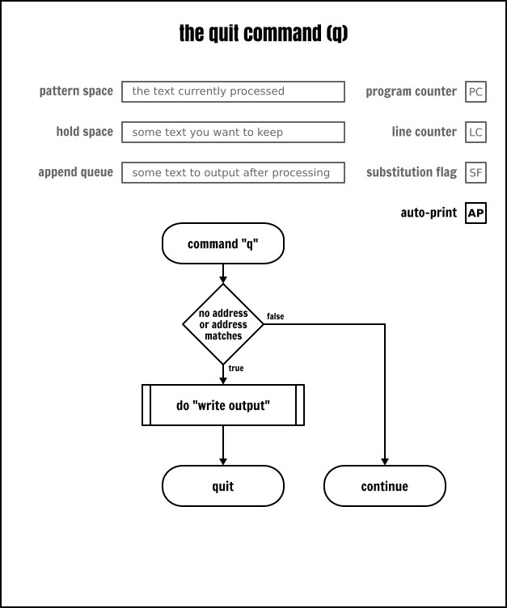

`q` 명령어는 입력 파일의 끝에 도달하기 전에 처리를 중지하는 방법입니다. 누가 그런 일을 하고 싶을까요?

좋은 질문입니다. 기억하겠지만 다음 명령어를 사용하면 파일의 1번부터 5번 줄까지 출력합니다:

```
sed -n -e ‘1,5p’ inputfile
```

대부분의 sed 구현 방식은 처음 5행만 처리해도 입력 파일의 모든 행을 순차적으로 모두 읽어들입니다. 입력 파일에 수백만 행이 포함되면 (혹은 나쁜 경우 `/dev/urandom` 같은 무한 데이터 스트림에서 읽는 경우) 심각한 영향을 미칠 수 있습니다.

종료 명령어로 동일한 프로그램을 효율적으로 수정할 수 있습니다:

```
sed -e ‘5q’ inputfile
```

`-n` 옵션을 사용하지 않기 때문에 sed는 루프(사이클)가 끝날 때마다 암묵적으로 패턴 공간의 내용을 출력합니다. 하지만 5번째 줄을 처리한 후 종료하므로 더이상 데이터를 읽지 않습니다!

비슷한 기법으로 파일의 한 줄만 출력할 수 있습니다. 

다음은 명령줄에서 여러 개의 sed 표현식을 지정하는 방법 중 하나입니다. 다음 세 가지 변형은 모두 sed에서 여러 개의 명령을 받아들이며 서로 다른 `-e` 옵션을 사용하거나 표현식 내에서 새 줄을 시작하거나 세미콜론(`;`)으로 구분합니다:

```
sed -n -e ‘5p’ -e ‘5q’ inputfile

sed -n -e '
  5p
  5q
' inputfile

sed -n -e ‘5p;5q’ inputfile
```

기억하겠지만 "중괄호를 사용해서 명령을 결합할 수 있다!" 는 것을 살펴봤습니다. 여기선 동일한 주소에 두 번 실행하는 것을 방지하기 위해 사용합니다:

```
# 명령어 결합
sed -e '5{
  p
  q
}' inputfile

# 다음과 같이 한 줄로 사용합니다:
sed ‘5{p;q;}’ inputfile

# POSIX 확장의 일부 구현은 닫는 중괄호 앞의 세미콜론을 생략할 수 있습니다:
sed ‘5{p;q}’ inputfile
```

### 치환 명령어 - *substitute*

치환 명령어(`s`)는 대부분의 “WYSIWYG(What You See Is What You Get)” 편집기에서 흔히 볼 수 있는 “찾기 및 바꾸기” 기능과 유사합니다. sed의 치환 명령어는 이와 유사하지만 훨씬 더 강력합니다. 치환 명령어는 sed에서 가장 널리 알려진 명령어 중 하나로 인터넷에 이에 대한 방대한 문서가 있습니다.

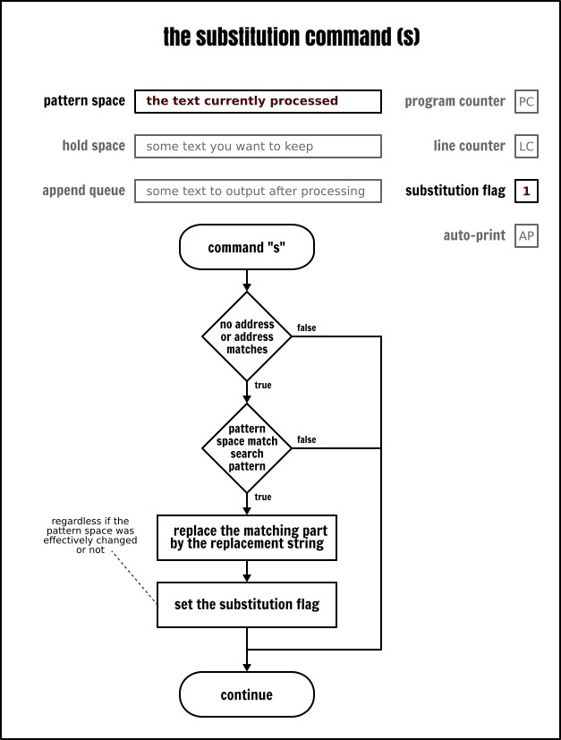

이전 글[^20]에서 이미 다뤘으므로 여기서 반복하지 않겠습니다. 하지만 사용법에 익숙치 않다면 다음 핵심 사항을 기억합니다:

* 치환 명령어는 "검색 패턴" 과 "치환(대체) 문자열" 두 개의 인수가 있습니다: `sed s/:/-----/ inputfile`

* `s` 명령어와 인수는 임의의 문자로 구분됩니다. 이는 주로 사용자 습관에 따라 다르며 99%의 경우 슬래시 문자를 사용하지만 다른 문자를 사용하기도 합니다: `sed s%:%-----% inputfile`, `sed sX:X-----X inputfile` 또는 심지어 `sed ‘s : ----- ’ inputfile`

* 기본적으로 치환 명령은 패턴 공간에 일치하는 첫 번째 문자열에 적용됩니다. 명령 뒤에 일치 인덱스를 플래그로 지정해서 이 동작을 변경할 수 있습니다: `sed ‘s/:/-----/1’ inputfile`, `sed ‘s/:/-----/2’ inputfile`, `sed ‘s/:/-----/3’ inputfile`, …

* 전역 치환(즉, 패턴 공간에서 겹치지 않는 모든 일치 항목에 수행)을 수행하려면 `g` 플래그를 추가합니다: `sed ‘s/:/-----/g’ inputfile`

* 치환 문자열에 나타나는 모든 `&` 기호는 검색 패턴과 일치하는 검색 문자열로 치환됩니다: `sed ‘s/:/-&&&-/g’ inputfile`, `sed ‘s/.../& /g’ inputfile`

* 둥근 괄호(확장 정규 표현식은 `(...)`, 기본 정규 표현식은 `\(...\)`)는 <ruby>캡처 그룹<rt>capturing group</rt></ruby>으로 간주됩니다. 이는 일치하는 문자열의 일부로 치환 문자열에서 역참조할 수 있습니다. `\1` 은 첫 번째 캡처 그룹의 내용이고 `\2` 는 두 번째 캡처 그룹의 내용이며 이와 같은 순서로 이어집니다: `sed -E ‘s/(.)(.)/\2\1/g’ inputfile`, `sed -E ‘s/(.):x:(.):(.*)/\1:\3/’ inputfile` (후자가 정상 작동하는 이유는 정규 표현식에서 수량자인 별표(`*`)는 일치하지 않을 때까지 가능한 한 많이 일치함을 나타내기 때문이며[^21] 여러 개의 문자와 탐욕적으로 일치하기 때문입니다.)

* 검색 패턴이나 대체 문자열에서 백슬래시를 사용해서 문자의 특수한 의미를 제거할 수 있습니다: `sed ‘s/:/--\&--/g’ inputfile`, `sed ‘s/\//\\/g’ inputfile`

이 모든 것이 추상적일 수도 있으므로 몇 가지 예를 들겠습니다. 

먼저, 테스트 입력 파일의 첫 번째 필드를 표시하고 오른쪽에 공백 20개를 추가하려면 다음과 같이 작성합니다:

```
sed < inputfile -E -e '
 s/:/ /             # 첫 번째 필드의 구분자를 공백 20개로 대체
 s/(.{20}).*/\1/    # 한 줄의 앞 20자만 남기기
 s/.*/| & |/        # 출력 형식은 보기 좋게 수직선 추가
'
```

두 번째는 sonia 사용자의 UID/GID를 1100으로 수정할 때 다음과 같이 작성합니다:

```
sed -En -e '
  /sonia/{
    s/[0-9]+/1100/g
    p
 }' inputfile
```

치환 명령어 끝부분의 `g` 플래그에 주의합니다. 이 플래는 동작 방식을 변경해서 패턴 공간에서 일치하는 부분 모두를 찾아서 치환합니다. 이 플래그가 없으면 처음 발견한 부분만 치환합니다.

앞서 설명한 출력(`p`) 명령어를 사용할 수 있는 좋은 기회입니다. 명령어 실행 시 실행 전후의 패턴 공간의 내용을 출력할 수 있습니다. 따라서, 치환 전후의 내용을 확인하려면 다음과 같이 작성합니다:

```
sed -En -e '
  /sonia/{
     p
     s/[0-9]+/1100/g
     p
 }' inputfile
```

사실, 치환한 줄을 출력하는 작업은 흔한 용법으로 치환 명령어도 `p` 플래그를 지원합니다:

```
sed -En -e ‘/sonia/s/[0-9]+/1100/gp’ inputfile
```

마지막으로, 치환 명령어의 `w` 플래그는 자세히 설명하지 않겠습니다. 나중에 자세히 다룰 예정입니다.

### 삭제 명령어 - *delete*

삭제 명령어(`d`)는 패턴 공간의 내용을 지운 다음, 다음 처리 루프를 시작합니다. 따라서 패턴 공간의 내용을 암시적으로 출력하는 동작을 건너뛰며 자동 출력 플래그(AP)를 설정해도 출력하지 않습니다.

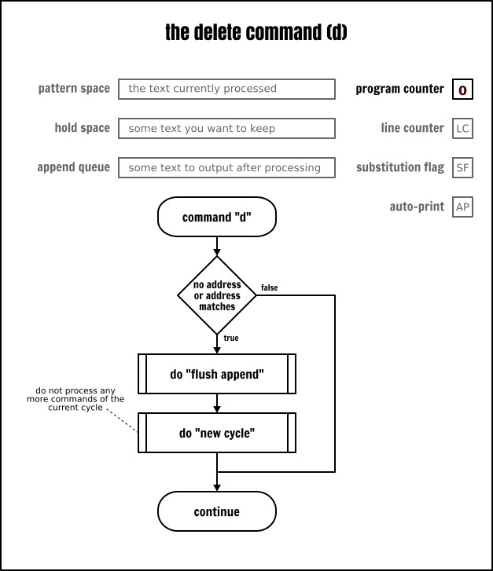

파일의 처음 5줄만 출력하는 비효율적인 처리 방법은 다음과 같습니다:

```
sed -e ‘6,$d’ inputfile
```

이 방법이 왜 비효율적인지 짐작가나요? 앞서 다룬 종료 명령어 섹션을 다시 읽어보시길 권합니다. 정답은 거기에 있습니다!

정규 표현식과 삭제 명령어를 조합해서 출력에서 일치하는 행을 제거할 때 유용합니다:

```
sed -e ‘/systemd/d’ inputfile
```

### 다음 줄 명령어 - *next*

sed가 무음 모드(`-n` 옵션)로 실행되지 않는 경우, 이 명령어(`n`)는 현재 패턴 공간의 내용을 출력한 다음 어떤 경우든 다음 입력 줄을 패턴 공간으로 읽고 새로운 패턴 공간의 내용으로 현재 루프에 남아 있는 명령어를 실행합니다.

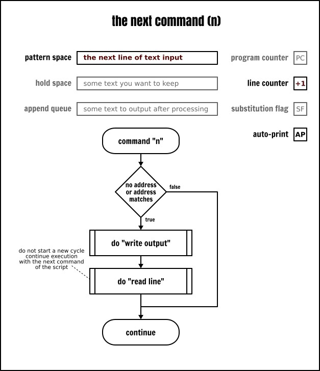

다음 줄 명령어로 줄을 건너뛰는 일반적인 예제입니다:

```
cat -n inputfile | sed -n -e ‘n;n;p’
```

위의 예제에서 sed는 입력 파일의 첫 번째 줄을 암시적으로 읽습니다. 하지만 다음 줄 명령은 패턴 공간 내용에 대한 출력 과정을 생략하고(`-n` 옵션을 사용했기 때문에 출력되지 않음) 입력 파일에서 다음 줄을 읽고 패턴 공간의 내용을 대체합니다. 두 번째 다음 줄 명령은 이전 명령과 동일한 작업을 수행하므로 입력 파일의 2줄을 건너뛰는 목적을 달성합니다. 마지막으로 패턴 공간에 포함된 입력 파일의 세 번째 줄 내용을 명시적으로 출력합니다. 그 다음 sed는 새로운 루프를 시작하며 다음 줄 명령 덕분에 네 번째 줄의 내용을 암시적으로 읽은 후 이를 건너뛰고 마찬가지로 다섯 번째 줄도 건너뛰고 여섯 번째 줄은 출력합니다. 이런 처리 과정을 파일 끝까지 반복합니다. 전체적으로 보면 이 스크립트는 입력 파일을 읽은 후 세 줄마다 한 줄씩 출력합니다.

'다음 줄' 명령어로 입력 파일의 처음 5줄을 표시하는 몇 가지 방법은 다음과 같습니다:

```
cat -n inputfile | sed -n -e ‘1{p;n;p;n;p;n;p;n;p}’
cat -n inputfile | sed -n -e 'p;n;p;n;p;n;p;n;p;q'
cat -n inputfile | sed -e ‘n;n;n;n;q’
```

흥미로운 점은 특정 주소에 따라 행을 처리할 때 이 명령어는 유용합니다:

```
cat -n inputfile | sed -n ‘/pulse/p’        # “pulse” 가 포함된 행 출력
cat -n inputfile | sed -n ‘/pulse/{n;p}’    # “pulse” 가 포함된 줄 다음 줄 출력
cat -n inputfile | sed -n ‘/pulse/{n;n;p}’  # “pulse” 가 포함된 줄 다음 줄의 다음 줄 출력
```

### 보관 공간 사용법 - *hold space*

지금까지 살펴본 명령들 모두 "패턴 공간만 사용" 했습니다. 하지만 초반부에 언급했듯이 두 번째 버퍼인 보관 공간이 있으며 이는 전적으로 사용자가 직접 관리합니다. 

#### 교환 명령 - *exchange*

이름으로 알 수 있듯이 교환 명령(`x`)은 보관 공간과 패턴 공간의 내용을 (서로) 교환합니다. “보관 공간에 아무것도 넣지 않았다면 보관 공간은 비어 있다!” 는 점을 기억해야 합니다.

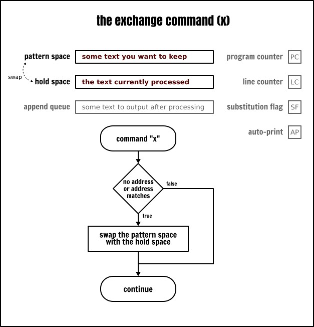

첫 번째 예제로 교환 명령어를 사용해서 입력 파일의 처음 두 줄을 역순으로 출력합니다:

```
cat -n inputfile | sed -n -e ‘x;n;p;x;p;q’
```

물론 보관 영역에 값을 설정하고 그 내용을 즉시 사용하는 것은 아닙니다. 명시적으로 수정하지 않는 한 보관 영역의 내용은 변하지 않기 때문입니다. 

다음 예제는 입력 파일의 첫 5줄을 읽은 후 첫 번째 줄을 삭제합니다:

```
cat -n inputfile | sed -n -e '
 1{x;n} # 보관 공간과 패턴 공간 교환
        # 1번 줄을 보관 공간에 저장
        # 그 다음 2번 줄을 읽음
 5{
   p    # 5번 줄 출력
   x    # 보관 공간과 패턴 공간 교환
        # 첫 번째 줄 내용을 가져와서 패턴 공간에 다시 넣음
 }

 1,5p   # 2행부터 5행까지 출력
        # (출력 오류가 아닙니다! 왜 이 규칙이
        # 1행에서 실행되지 않는지 찾아보세요;)
'
```

#### 보관 명령어 - *hold*

보관 명령(`h`)은 패턴 공간의 내용을 홀드 공간에 저장합니다. 하지만 교환 명령어와 달리 패턴 공간의 내용은 변경되지 않습니다. 

보관 명령어는 두 가지 사용법이 있습니다:

* `h` : 패턴 공간의 내용을 보관 버퍼로 복사하며 보관 버퍼에 존재하던 내용을 덮어씁니다.
* `H` : (대문자) 패턴 공간의 내용을 보관 버퍼 끝에 추가하며 새 줄 문자를 구분자로 사용(추가)합니다.

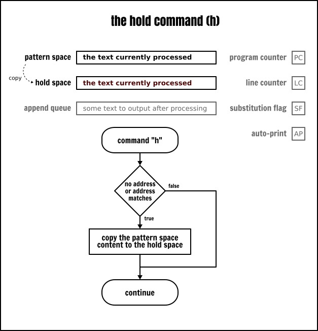

위에서 교환 명령어 예제는 보관 명령어를 사용해서 다음과 같이 작성할 수 있습니다:

```
cat -n inputfile | sed -n -e '
 1{h;n} # 1행의 내용을 홀드 버퍼에 저장하고 계속 진행
 5{     # 5행에서
   x    # 패턴 공간과 홀드 공간 교환
        # (이제 패턴 공간에 1행이 포함됨)
   H    # 홀드 공간의 5행 뒤에 1행 추가
   x    # 5번 행과 1번 행을 다시 교환해서 5번 행을 패턴 공간으로 되돌립니다
 }

 1,5p   # 2번 행부터 5번 행까지 출력
        # (출력에 오류는 없습니다! 왜 이 규칙이
        # 1번 행에는 실행되지 않는지 찾아보세요 ;)
'
```

#### 가져오기 명령 - *get*

가져오기 명령(`g`)은 보관 명령과 정반대입니다. 이 명령은 보관 영역에서 내용을 가져와서 패턴 영역에 넣습니다. 

이 명령어도 두 가지 방식이 있습니다:

* `g` : 보관 영역의 내용을 복사해서 패턴 영역에 넣으며 패턴 영역에 존재하던 내용을 덮어씁니다.
* `G` : (대문자)는 보관 영역의 내용을 패턴 영역 끝에 추가하며 새 줄 문자를 구분자로 사용(추가)합니다.

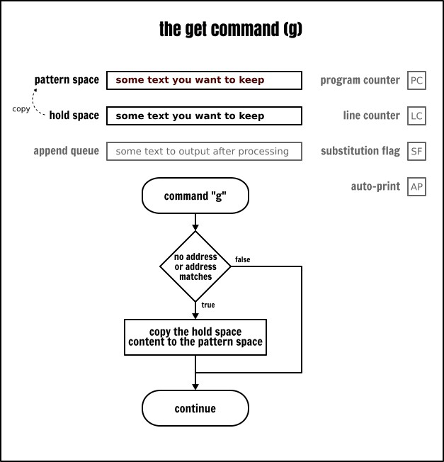

보관 명령어와 가져오기 명령어를 함께 사용하면 데이터를 저장하고 다시 불러올 수 있습니다. 작은 도전 과제로 이전 예제를 다시 작성해서 입력 파일의 첫 번째 줄을 5번째 줄 뒤에 배치합니다. 단, 이번엔 교환 명령어를 사용하지 않고 가져오기와 보관 명령어(대문자 또는 소문자 명령어 버전)만 사용해야 합니다. 운이 따른다면 간단히 해결할 수 있습니다!

아울러 여러분에게 영감을 줄 수 있는 또 다른 예제를 살펴보겠습니다. 목표는 로그인 셸 권한을 가진 사용자를 다른 사용자와 구분합니다:

```
cat -n inputfile | sed -En -e '
 \=(/usr/sbin/nologin|/bin/false)$= { H;d; }
            # 일치하는 행을 보관 영역으로 가져옴
            # 그 다음 다음 반복으로 진행
 p          # 나머지 행 출력
 $ { g;p }  # 마지막 행에서
            # 보관 영역의 내용을 가져와서 출력
'
```

### 출력, 삭제 및 다음 줄 명령 복습

이제 버퍼 사용법에 좀 익숙해졌으니 출력, 삭제 및 다음 줄 명령 설명으로 돌아가겠습니다. 

소문자 `p`, `d`, `n` 명령어는 이미 설명했습니다. 이 명령들은 대문자 버전도 있습니다. 대소문자 버전의 명령은 sed의 관례로 보이며 대문자 명령은 주로 다중 행(*multi-line*) 버퍼와 관련있습니다:

* `P`: 패턴 공간에서 첫 번째 새 줄 문자 이전 내용을 출력합니다.
* `D`: 패턴 공간에서 첫 번째 새 줄 문자 이전 내용(새 줄 포함)을 삭제한 후 새로운 입력을 읽지 않고 남은 텍스트로 루프를 다시 시작합니다.
* `N`: 입력을 읽고 패턴 공간에 새 줄을 추가하며 새 줄 문자를 새 데이터와 기존 데이터의 구분자로 사용합니다. 현재 루프를 계속 실행합니다.

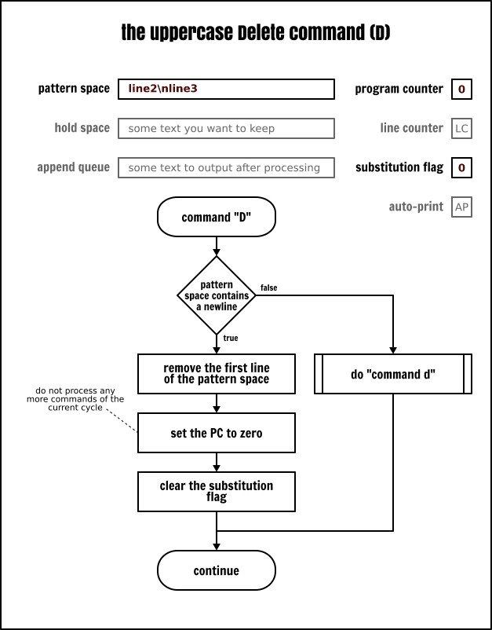


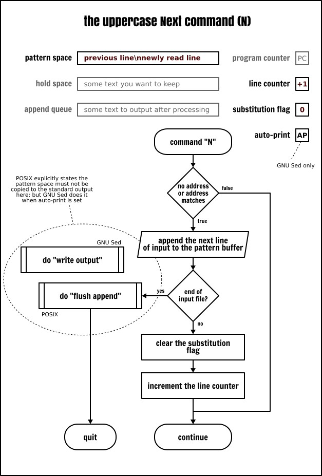

이 명령어들은 주로 큐(FIFO 목록[^29])를 구현하는 용도로 사용합니다. 입력 파일에서 마지막 5행을 제거하는 것이 대표적인 예입니다:

```
cat -n inputfile | sed -En -e '
  1 { N;N;N;N } # 패턴 공간에 5행이 포함되도록 보장
  N             # 6번 행을 큐에 추가
  P             # 큐의 첫 번째 행 출력
  D             # 큐의 첫 번째 행 삭제
'
```

두 번째는 입력 데이터를 두 열로 표시합니다:

```
# 두 열로 출력
sed < inputfile -En -e '
 $!N    # 패턴 공간에 새 줄 추가
        # 입력 파일의 마지막 줄은 제외하고
        # 입력 파일의 마지막 줄에서 N 명령을 사용할 때
        # GNU sed와 POSIX sed의 동작은 다릅니다
        # 이 상황을 처리하려면 다음과 같은 요령이 필요합니다
        # https://www.gnu.org/software/sed/manual/sed.html#N_005fcommand_005flast_005fline

        # 1행의 첫 번째 필드를 공백으로 채우고
        # 나머지 행은 제거합니다
 s/:.*\n/                    \n/
 s/:.*//            # 2번 행의 첫 번째 필드를 제외한 나머지 행 제거
 s/(.{20}).*\n/\1/  # 행을 잘라내서 연결
 p                  # 결과 출력
'
```

### 분기 - *branch*

앞서 살펴본 것 같이 sed는 보관 공간을 유지하므로 캐싱 기능을 갖추고 있습니다. 사실 sed는 조건 검사 및 분기 명령어도 있습니다. 이런 특성 덕분에 sed는 튜링 컴플리트한[^30] 언어입니다. 겉보기엔 다소 어리석게 보일 수 있지만 "sed로 어떤 프로그램이든 작성할 수 있음" 을 의미합니다. 어떤 목적이라도 구현할 수 있지만 절대 구현이 쉽다는 뜻은 아니며 결과도 반드시 효율적이란 보장은 없습니다.

하지만 걱정하지 마세요. 조건 검사 및 분기 기능을 보여주는 간단한 예제를 사용합니다. 이런 기능들이 언뜻 보기엔 제한적으로 보일 수 있지만 어떤 사람들은 sed로 [계산기](http://www.catonmat.net/ftp/sed/dc.sed), [테트리스 게임](http://www.catonmat.net/ftp/sed/sedtris.sed) 나 그 밖의 다양한 종류의 애플리케이션을 작성하는 사람도 있다는 점을 기억합니다!

#### 태그와 분기 - *label*

어떤 면에서 sed는 기능이 제한된 어셈블리 언어처럼 보입니다. 고수준 언어에서 흔히 볼 수 있는 “for” 나 “while” 루프 혹은 “if ... else” 문은 찾을 순 없지만 분기 명령으로 동일한 기능을 구현할 수 있습니다.

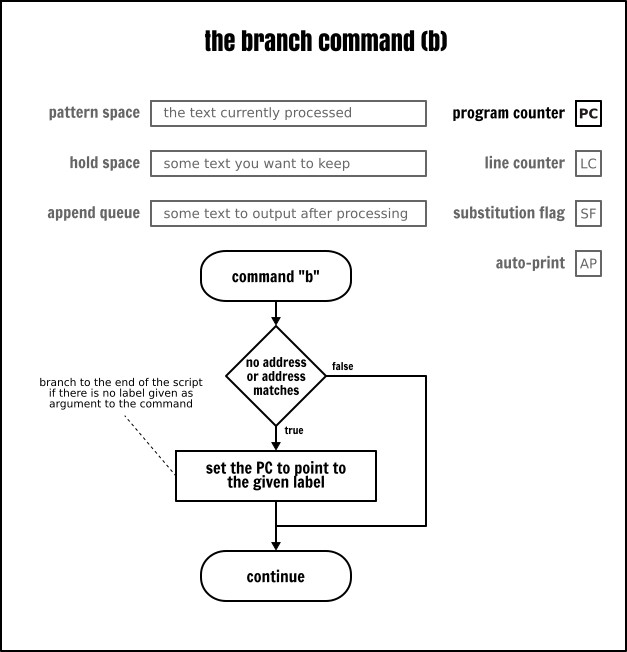

이 글 초반부에 흐름도로 설명한 sed 실행 모델을 보셨다면 sed가 프로그램 카운터(PC)의 값을 자동으로 증가시키며 명령어는 프로그램에서 지시한 순서대로 실행된다는 사실을 잘 아실 겁니다. 하지만 분기(`b`) 명령어를 사용하면 프로그램 내의 임의 명령어를 선택해서 실행함으로써 순차적인 실행 순서를 변경할 수 있습니다. 점프 대상은 레이블(`:`)로 명시적으로 정의됩니다.

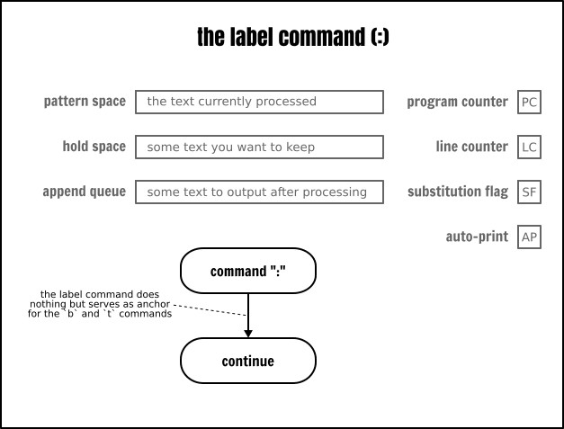

다음은 분기 명령의 예제입니다:

```
echo hello | sed -ne '
  :start    # 프로그램의 해당 줄에 “start” 태그를 붙입니다
  p         # 패턴 공간의 내용을 출력합니다
  b start   # :start 태그에서 실행을 계속합니다
' | less
```

이 프로그램의 동작 방식은 `yes` 프로그램과 유사합니다. 즉, 문자열을 받고 그 문자열을 포함하는 무한 스트림을 생성합니다.

레이블로 전환하는 것은 sed의 자동화 기능을 우회하는 것 같습니다. 즉, 어떤 입력도 읽지 않고, 어떤 것도 출력하지 않으며, 어떤 버퍼도 업데이트하지 않습니다. 단지 소스 프로그램의 명령어 순서에서 다음 명령어로 점프할 뿐입니다.

주목할 점은 분기 명령어(`b`)에 매개변수로 “레이블을 지정하지 않으면 분기는 프로그램의 끝 부분으로 이동한다!” 는 것입니다. 따라서 sed는 새로운 루프를 시작합니다. 이런 특성은 일부 명령어를 건너뛸 수 있으며 결과적으로 “블록” 의 대체 수단으로 활용할 수 있습니다:

```
cat -n inputfile | sed -ne '
/usb/!b
/daemon/!b
p
'
```

#### 조건 분기 - *test*

지금까지 무조건 분기를 살펴봤습니다. 이 용어는 오해의 소지가 있는데 sed 명령은 항상 선택적인 주소를 조건으로 삼기 때문입니다.

그러나 전통적인 의미에서 무조건 분기도 분기로 실행될 때는 특정 위치로 점프합니다. 반면 조건 분기는 시스템의 현재 상태에 따라 특정 명령으로 점프할 수도 있고 그렇지 않을 수도 있습니다.

sed는 단 하나의 조건 분기 명령어 즉, 테스트(`t`) 명령어만 있습니다. 현재 루프의 시작 시점이나 이전 조건 분기 실행으로 치환이 수행된 경우만 다른 명령어로 점프합니다. 대부분의 경우 치환 플래그(SF)가 설정되어 있을 때만 테스트 명령어가 분기를 전환합니다.

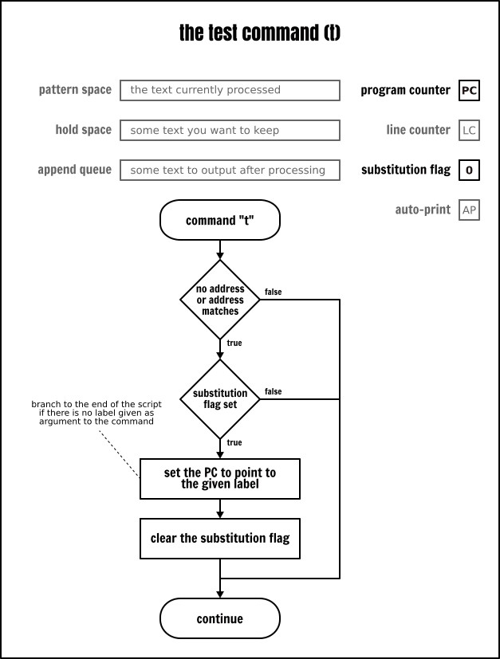

테스트 명령어를 사용하면 sed 프로그램에서 루프를 쉽게 구현할 수 있습니다. 구체적인 예로 한 줄을 특정 길이로 채울 수 있습니다(이는 정규 표현식으로 구현할 수 없는 기능입니다):

```
# 원본 텍스트
cut -d: -f1 inputfile | sed -Ee '
  :start
  s/^(.{,19})$/ \1 /    # 20자 미만인 줄 시작 부분에 공백을 채워 넣음
                        # 그리고 끝 부분에 공백 하나 추가
  t start               # 이미 공백을 추가했다면 :start 태그로 돌아가기
  s/(.{20}).*/| \1 |/   # 한 줄의 앞 20자만 남기기
                        # 홀수 줄로 인해 발생하는 오류를 수정하기 위해
'
```

예제를 주의깊게 보면 데이터를 sed에 “입력” 하기 전에 `cut` 명령어로 데이터를 수정해서 전처리했다는 점을 눈치채셨을 겁니다.

하지만 sed만 사용해서 프로그램을 약간만 수정하면 동일한 작업을 수행할 수 있습니다:

```
cat inputfile | sed -Ee '
  s/:.*//               # 첫 번째 필드를 제외한 나머지 필드 삭제
  t start
  :start
  s/^(.{,19})$/ \1 /    # 20자 미만인 행 시작 부분에 공백을 채워 넣고
                        # 끝 부분에 공백 하나 더 추가
  t start               # 이미 공백을 추가했다면 :start 태그로 돌아가기
  s/(.{20}).*/| \1 |/   # 홀수 행으로 인해 발생하는 오류를 수정하기 위해 한 줄의 앞 20자만 남기기
                        #
'
```

위의 예제에서 다음과 같은 구조에 놀랄 수 있습니다:

```
t start
:start
```

언뜻보면 여기서의 분기는 실행될 명령어로 단순히 이동하므로 별다른 용도가 없는 것처럼 보입니다. 하지만 테스트 명령어의 정의를 자세히 보면 현재 루프의 시작이나 이전 테스트 명령어 실행 후에 "치환이 발생한 경우만 분기가 작동한다!" 는 것을 알 수 있습니다. 다시 말해 테스트 명령어는 치환 플래그를 지우는 부수 효과를 가집니다. 이것이 바로 위의 코드 조각의 진정한 목적입니다. 

이는 조건 분기가 포함된 sed 프로그램에서 자주 볼 수 있는 처리 기법으로 여러 개의 치환 명령을 사용할 때 <ruby>오탐지<rt>false positive</rt></ruby>가 발생하는 것을 방지할 때 사용됩니다. 이를 통해 "대체 플래그는 절대적으로 강제적으로 지울 수는 없다" 는 점에 동의합니다. 문자열을 올바른 길이로 채울 때 제가 사용한 대체 명령은 <ruby>이멧포텐트<rt>idempotent</rt></ruby>이기 때문입니다. 따라서 불필요한 반복 한 번으론 결과에 영향을 미치지 않습니다.

이제 두 번째 예제를 살펴보겠습니다:

```
# 로그인 정보로 사용자 계정 분류하기
cat inputfile | sed -Ene '
  s/^/login=/
  /nologin/s/^/type=SERV /
  /false/s/^/type=SERV /
  t print
  s/^/type=USER /
  :print
  s/:.*//p
'
```

여기선 사용자가 기본으로 설정한 로그인 프로그램에 따라 사용자 계정에 “SERV” 또는 “USER” 태그를 붙입니다. 이 프로그램을 실행하면 “SERV” 태그가 표시될 것으로 예상됩니다. 하지만 출력에 “USER” 태그는 발견되지 않습니다. 이유가 뭘까요? `t print` 명령어는 행의 내용이 무엇이든 상관없이 항상 상태를 전환하며 대체 플래그(SF)는 항상 프로그램의 첫 번째 대체 명령에 의해 설정되기 때문입니다. 일단 치환 플래그가 설정되면 다음 줄이 읽히거나 다음 테스트 명령이 실행될 때까지 이 플래그는 변하지 않습니다. 

다음은 이 프로그램을 수정한 해결책입니다:

```
# 사용자 로그인 프로그램에 따라 사용자 계정 분류
cat inputfile | sed -Ene '
  s/^/login=/

  t classify              # “치환 플래그” 지우기
  :classify

  /nologin/s/^/type=SERV /
  /false/s/^/type=SERV /
  t print
  s/^/type=USER /
  :print
  s/:.*//p
'
```

### 텍스트를 보다 정밀하게 처리하기

sed는 비상호작용형(*non-interactive*) 텍스트 편집기입니다. 비록 비상호작용형이지만 여전히 텍스트 편집기입니다. 출력에 무언가 삽입하는 기능이 없다면 텍스트 편집기로 볼 수 없습니다. 사실 저는 sed의 텍스트 편집 기능을 별로 좋아하지 않습니다. (sed 기준으로) 구문이 사용하기 어렵다고 생각하지만 때로는 어쩔 수 없이 사용할 때도 있습니다.

엄격한 POSIX 구문을 따르는 명령어는 단 세 가지 뿐입니다. 출력에 텍스트를 변경(`c`), 삽입(`i`) 또는 추가(`a`)하는 명령 모두 동일한 구문을 따릅니다. 즉, 명령어에 백슬래시 문자가 뒤따르며 텍스트는 스크립트 다음 줄부터 삽입합니다:

```
head -5 inputfile | sed '
1i\
# 사용자 계정 목록
$a\
# 끝
'
```

텍스트를 여러 줄 삽입하려면 각 줄의 끝에 백슬래시를 사용해야 합니다:

```
head -5 inputfile | sed '
1i\
# 사용자 계정 목록\
# (사용자 1~5)
$a\
# 끝
'

```

GNU sed 같은 일부 sed 구현체는 `--posix` 모드에서 초기 백슬래시 뒤의 줄바꿈 문자는 선택 사항입니다. 저는 표준에서 이 구문에 대한 설명을 찾을 수 없었습니다(만약 제가 표준에서 해당 기능을 찾지 못한 것이라면 댓글로 알려주세요!). 따라서 이식성이 중요하면 이를 사용할 때의 위험성에 유의하시기 바랍니다:

```
# 비 POSIX 구문:
head -5 inputfile | sed -e '
1i\# 사용자 계정 목록
$a\# 끝
'
```

일부 sed 구현체는 첫 번째 백슬래시를 완전히 생략하도록 허용합니다. 따라서 이는 의심할 여지없이 특정 벤더가 POSIX 표준을 확장한 버전이며 해당 구문을 지원하는지 여부는 해당 sed 버전의 매뉴얼을 확인해야 합니다.

간단한 개요에 이어 제가 아직까지 소개하지 않은 변경 명령어부터 시작해서 이런 명령어들에 대한 자세한 내용을 살펴보겠습니다.

#### 변경 명령어 - *change*

변경 명령어(`c\`)는 `d` 명령어와 마찬가지로 패턴 공간의 내용을 삭제하고 새로운 입력을 시작합니다. 유일한 차이점은 명령어가 실행된 후 사용자가 제공한 텍스트를 출력으로 쓴다는 점입니다.

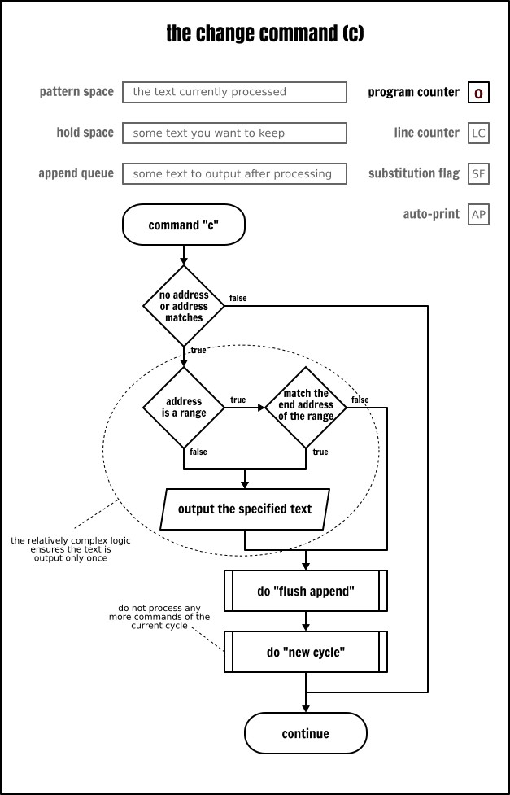

```
cat -n inputfile | sed -e '
/systemd/c\
# :REMOVED:
s/:.*//           # 이 명령은 “변경된” 텍스트에 적용되지 않습니다
'
```

*change* 명령이 주소 범위와 연관될 경우 범위의 마지막 줄에 도달하면 해당 텍스트는 한 번만 출력됩니다. 이는 sed 명령어가 "주소 범위 내의 모든 행에 반복적으로 적용된다" 는 관례에 대한 일종의 예외입니다:

```
cat -n inputfile | sed -e '
19,22c\
# :REMOVED:
s/:.*//          # 이 명령은 “변경된” 텍스트는 적용되지 않습니다
'
```

따라서 변경 명령을 주소 범위 내의 모든 행에 반복적으로 적용하려면 블록으로 묶는 것 외에 별다른 방법이 없습니다:

```
cat -n inputfile | sed -e '
19,22{c\
# :REMOVED:
}
s/:.*//          # 이 명령은 “변경된” 텍스트는 적용되지 않습니다
'
```


#### 삽입 명령어 - *insert*

삽입 명령어(`i\`)는 사용자가 지정한 텍스트를 출력에 표시합니다. 이 명령어는 프로그램의 흐름이나 버퍼의 내용을 어떤 식으로든 수정하지 않습니다.

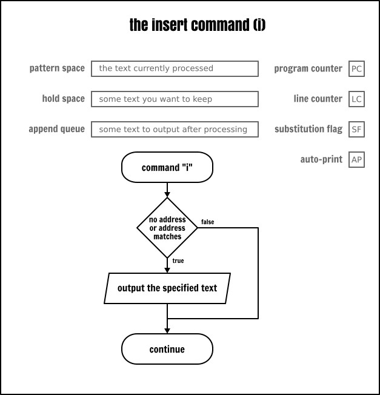

```
# 첫 번째 행에 제목을 붙여 처음 다섯 사용자 이름을 표시
sed < inputfile -e '
1i\
USER NAME
s/:.*//
5q
'
```

#### 추가 명령어 - *append*

입력의 다음 줄이 읽힐 때 추가 명령어(`a\`)는 일부 텍스트를 출력 대기열에 추가합니다. 텍스트는 현재 루프가 끝날 때(프로그램이 종료될 경우 포함) 또는 `n` 또는 `N` 명령어로 입력에서 새 줄을 읽을 때 출력됩니다.

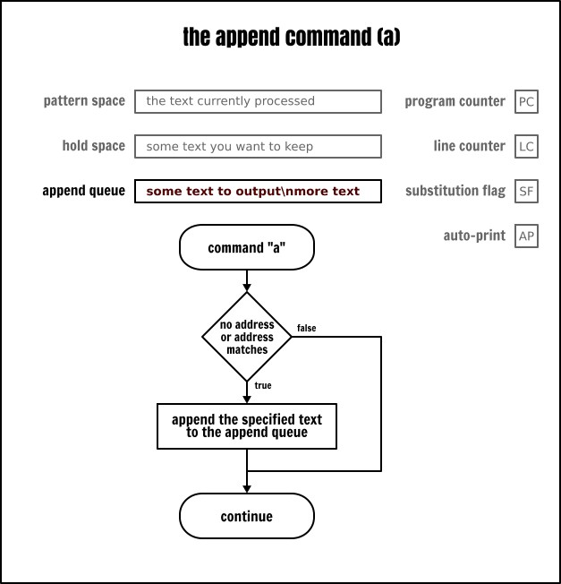

위와 동일한 예제지만 이번엔 맨 위가 아닌 맨 아래에 삽입합니다:

```
sed < inputfile -e '
5a\
USER NAME
s/:.*//
5q
'
```

#### 읽기 명령 - *read*

출력 스트림에 텍스트 내용을 삽입하는 네 번째 명령인 읽기 명령(`r`)입니다. 이 명령은 추가 명령과 작동 방식이 동일하지만 sed 스크립트에 하드코딩된 텍스트를 가져오는 대신 파일의 내용을 출력에 기록한다는 점이 다릅니다.

읽기 명령은 읽을 파일을 스케줄링할 뿐입니다. 추가 큐를 정리할 때 비로소 파일은 효율적으로 읽히며 읽기 명령이 실행되는 시점에 읽히지 않습니다. 이때 해당 파일에 대한 동시 읽기 액세스가 발생하거나 해당 파일이 일반 파일이 아닐 경우(예: 문자 장치나 명명된 파이프) 또는 읽기 중에 파일이 수정될 경우엔 심각한 결과가 발생할 수 있습니다.

예를 들어, 다음 절에서 자세히 다룰 쓰기 명령으로 읽기 명령과 함께 임시 파일에 쓰기를 수행한 후 다시 읽는 경우 창의적인 결과를 얻을 수 있습니다(프랑스어판 [Shiritori][^37] 게임을 예로 들면):

```
printf “%s\n” “Trois p'tits chats” “Chapeau d' paille” “Paillasson” |
sed -ne '
  r temp
  a\
  ----
  w temp
'
```

이제 스트림 출력에 텍스트를 삽입하는 sed 명령어를 모두 마칩니다. 마지막 예제는 순전히 재미를 위한 것이지만 앞서 쓰기 명령어가 있다고 언급한 것 같이 이 예제는 다음 섹션으로 자연스럽게 이어줍니다. 

다음 섹션은 sed에서 데이터를 외부 파일에 쓰는 방법을 살펴보겠습니다.

### 대체 출력 - *write*

sed의 설계 철학은 “모든 텍스트 변환 결과는 프로세스의 표준 출력으로 기록된다!” 는 것입니다. 하지만 sed는 데이터를 다른 목적지로 전송할 수 있는 몇 가지 기능도 있습니다. 앞서 언급한 출력 대상 변경을 구현한 방법은 두 가지입니다. 전용 쓰기 명령어(`w`)를 사용하거나 대체 명령어(`s`)에 쓰기 플래그를 추가하는 것입니다.

#### 쓰기 명령 - *write command*

쓰기 명령(`w`)은 패턴 공간의 내용을 지정한 대상 파일에 추가합니다. POSIX는 sed가 데이터를 처리하기 전에 대상 파일은 sed에 의해 생성될 수 있어야 한다고 규정합니다. 지정한 대상 파일이 이미 존재하면 덮어씁니다.

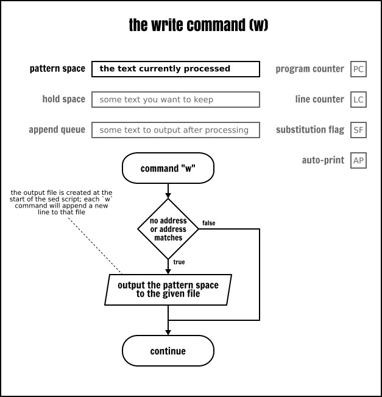

따라서 실제로 해당 파일에 데이터를 쓰지 않더라도 파일이 생성됩니다!! 예를 들어, 다음 sed 프로그램은 *output* 파일을 생성하거나 덮어쓰는데 이는 쓰기 명령이 실행되지 않더라도 마찬가지입니다:

```
echo | sed -ne '
  q            # 즉시 종료
  w output     # 이 명령은 실행되지 않음
'
```

여러 개의 쓰기 명령을 동일한 대상 파일에 지정할 수 있습니다. 동일한 대상 파일을 가리키는 모든 쓰기 명령은 해당 파일의 내용에 추가됩니다(작동 방식은 쉘의 리디렉션 연산자 `>>` 와 거의 동일합니다):

```
sed < inputfile -ne '
  /:\/bin\/false$/w server
  /:\/usr\/sbin\/nologin$/w server
  w output
'
cat server
```

#### 대체 명령의 쓰기 플래그 - *write flag*

앞서 대체 명령(`s`)을 배웠는데 이 명령엔 대체 이후 패턴 공간의 내용을 출력하는 `p` 플래그가 있습니다. 

```
sed < inputfile -ne '
  s/:.*\/nologin$//w server
  s/:.*\/false$//w server
'
cat server
```

### 주석 - *comments*

저는 주석을 수없이 사용했지만 정식으로 소개할 시간을 내진 못했습니다. 그래서 이제서야 정식으로 소개합니다. 

대부분의 프로그래밍 언어와 마찬가지로 주석은 소프트웨어가 해석하지 않는 자유 형식의 텍스트를 추가하는 방법입니다. sed 구문은 매우 난해하므로 스크립트 곳곳에 충분한 주석을 달아야 한다는 점을 강조하지 않을 수 없습니다. 그렇지 않으면 작성자 외에는 아무도 내용을 이해할 수 없을 겁니다.

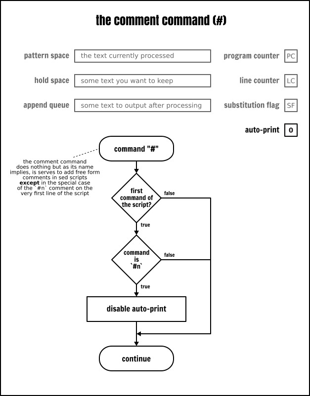

하지만 sed의 다른 부분과 마찬가지로 주석도 나름대로 미묘한 점이 있습니다. 첫 번째이자 가장 중요한 점은 주석은 구문 구조가 아니라 진정한 의미의 "sed 명령어" 라는 것입니다. 주석은 비록 “아무것도 처리하지 않는” 명령어지만 여전히 "명령어" 입니다. 적어도 POSIX에는 그렇게 정의되어 있습니다. 따라서 엄밀히 말하면 주석은 명령어가 허용되는 곳에만 사용할 수 있습니다.

대부분의 sed 구현체는 이런 요구 사항을 완화해서 제가 본문 곳곳에 사용한 것처럼 줄 내의 명령어를 허용합니다.

이 주제를 마무리하기 전에 `#n` 주석(`#` 뒤에 공백없이 알파벳 `n` 이 오는 것)의 특수한 경우에 대해 언급할 필요가 있습니다. 스크립트의 첫 번째 줄에서 정확히 이런 주석이 발견되면 sed는 명령줄에서 `-n` 옵션을 지정한 것처럼 무음 모드로 전환합니다(즉, 자동 출력 플래그를 해제합니다).

### 거의 사용하지 않는 명령어

지금까지 배운 명령만으로 여러분이 사용하는 스크립트의 99.99%를 작성할 수 있습니다. 하지만 나머지 sed 명령을 언급하지 않는다면 이 튜토리얼을 완전한 가이드라고 할 수 없을 겁니다. 이 명령들을 마지막에 남겨둔 이유는 거의 사용하지 않기 때문입니다!! 

하지만 실제 사용 사례가 있다면 이 명령들도 매우 유용하단 걸 알게 됩니다. 그렇다면 주저하지 말고 댓글란에 그 내용을 공유해 주세요.

#### 행 번호 명령어 - *print line number*

`=` 명령어는 sed가 현재 읽고 있는 행 번호를 표준 출력에 표시합니다. 이 행 번호는 행 카운터(LC)의 내용입니다. 어떤 sed 버퍼도 이 숫자를 직접 가져올 방법은 없으며 출력 형식을 지정할 수도 없습니다. 이 두 가지 제한으로 인해 이 명령어의 유용성은 크게 떨어집니다.

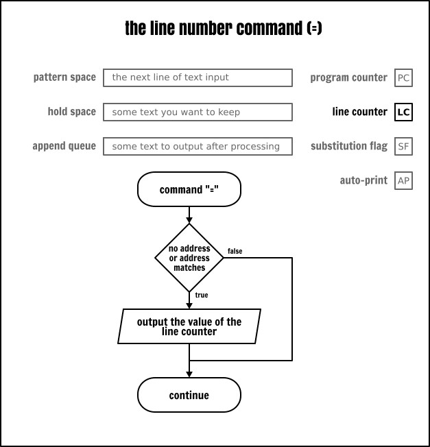

엄격한 POSIX 호환 모드에서 명령줄에 여러 개의 입력 파일을 지정할 때 sed는 카운터를 재설정하지 않고 모든 입력 파일을 하나로 연결한 것처럼 연속으로 증가시킨다는 점을 기억해야 합니다. GNU sed 같은 일부 sed 구현체는 입력 파일 읽기가 끝날 때마다 카운터를 재설정하는 옵션(`-s`)이 있습니다.

#### 명시적 출력 명령어 - *list*

`l`(소문자 `l`)명령어는 출력 명령어(`p`)와 유사한 역할을 처리하지만 패턴 공간의 내용을 좀 더 명확한 형식으로 출력합니다. 다음은 POSIX 표준[^12]에서 인용한 내용입니다:

> XBD 이스케이프 시퀀스에 나열된 문자와 관련 동작(`\`, `\a`, `\b`, `\f`, `\r`, `\t`, `\v`)은 해당 이스케이프 시퀀스로 출력됩니다. 해당 표에 있는 `\n` 은 적용되지 않습니다. 해당 표에 포함되지 않은 비인쇄 문자는 3자리 8진수(앞에 백슬래시 `\` 를 붙임)로 기록되며 이는 문자의 각 바이트(가장 중요한 바이트가 앞에 옴)를 나타냅니다. 긴 행은 줄바꿈되며 줄바꿈 위치를 나타내기 위해 백슬래시 뒤에 줄바꿈 문자를 작성합니다. 줄바꿈이 발생하는 길이는 불확실하지만 출력 장치의 구체적인 상황에 적합해야 합니다. 각 행은 `$` 마크로 끝나야 합니다.

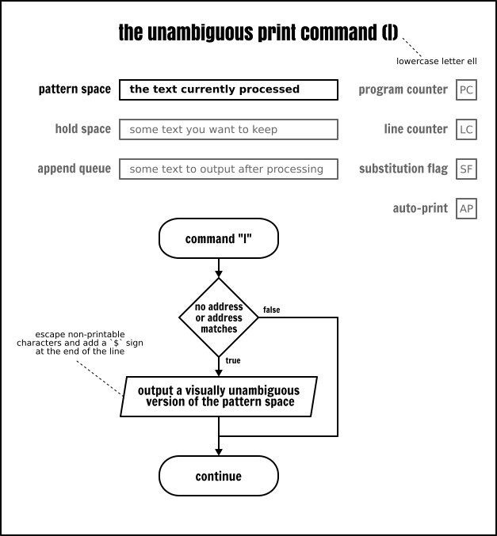

이 명령어는 8비트 정규화 채널[^42]이 아닌 곳에서 데이터를 교환할 때 사용하는 것으로 보입니다. 개인적으로 저는 디버깅 용도 외에는 이 명령어를 사용한 적이 없습니다.

#### 전사 명령어 - *translate*

<ruby>전사<rt>transslate</rt></ruby> (`y`) 명령어는 소스 집합에서 대상 집합으로 패턴 공간의 문자를 1:1 매핑합니다. 이 명령어는 `tr` 명령어와 유사하지만 제한이 좀 더 많습니다.

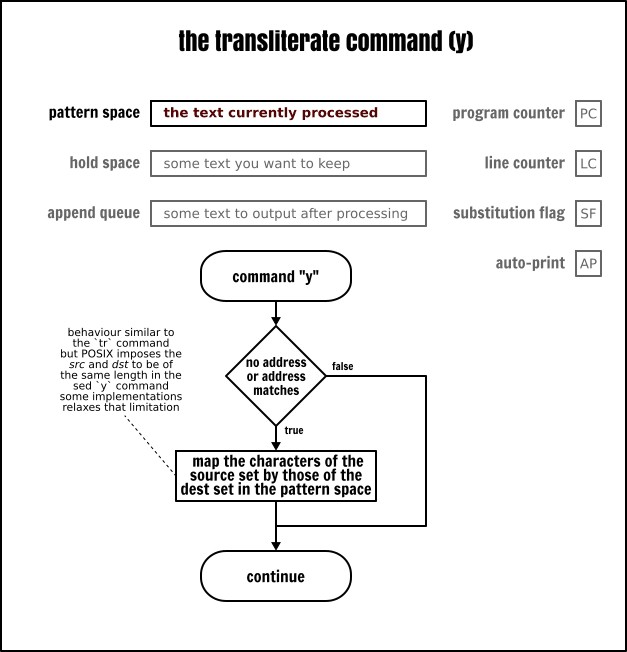

```
# `y` 명령어는 해커 전용입니다
sed < inputfile -e '
 s/:.*//
 y/abcegio/48<3610/
'
```

전사 명령어 구문은 치환 명령어 구문과 유사하지만 문자열을 치환한 후 어떤 옵션(플래그)도 허용하지 않습니다. 전사 명령어는 항상 전역적으로 적용됩니다.

전사 명령은 "소스 집합과 대상 집합 간의 일대일 변환을 요구한다" 는 점에 유의합니다. 즉, 다음 sed 프로그램이 수행하는 작업은 언뜻 보기엔 생각한 것과 다를 수 있습니다:

```
# 주의: 이 코드는 생각대로 작동하지 않을 수 있습니다!
sed < inputfile -e '
  s/:.*//
  y/[a-z]/[A-Z]/
'
```

### 마무리 말 - *conclusion*

```
# 다음 코드는 무엇을 처리할까요?
# 힌트: 정답은 바로 근처에 있습니다...
sed -E '
  s/.*\W(.*)/\1/
  h
  ${ x; p; }
  d' < inputfile
```

이제 sed의 모든 명령어를 배웠습니다. 해냈다는 게 믿겨지지 않네요! 여기까지 읽으셨다면 특히 시간을 내서 시스템에 다양한 예제를 직접 시도했다면 정말로 축하드립니다!

보셨듯이 sed는 문법이 복잡할 뿐만 아니라 극단적인 사례나 명령어 동작의 미묘한 차이 때문에 복잡합니다. 의심할 여지없이 이런 점은 역사적인 이유로 귀결됩니다. 이토록 많은 단점에도 불구하고 sed는 여전히 매우 강력한 도구이며 지금까지도 유닉스 도구 상자 중에서 가장 널리 사용되는 몇 안되는 명령어 중 하나입니다. 

이제 이 글을 마무리할 시간입니다. 여러분의 지원이 없었다면 이 글을 완성할 순 없었을 겁니다. 여러분이 좋아하거나 창의적이라 생각하는 sed 스크립트를 골라 저희와 공유해 주세요. 여러분이 공유해 주신 스크립트가 충분히 모인다면 스크립트들을 모아서 책으로 출간할 예정입니다!

--------------------------------------------------------------------------------

via: https://linuxhandbook.com/sed-reference-guide/

저자: [Sylvain Leroux][^a]
주제 선정: [lujun9972](https://github.com/lujun9972)
번역: [qhwdw](https://github.com/qhwdw)
교정: [wxy](https://github.com/wxy)

본 글은 [LCTT](https://github.com/LCTT/TranslateProject)에서 원문을 번역·편집하였으며, [Linux 중국](https://linux.cn/)이 자랑스럽게 소개합니다.g

[^a]:https://linuxhandbook.com/author/sylvain/
[^1]:https://linuxhandbook.com/sed-command-basics/
[^2]:https://gist.github.com/s-leroux/5cb36435bac46c10cfced26e4bf5588c
[^3]:https://linuxhandbook.com/wp-content/plugins/jetpack/modules/lazy-images/images/1x1.trans.gif
[^9]:https://www.computerhope.com/jargon/f/flag.htm
[^12]:http://pubs.opengroup.org/onlinepubs/9699919799/utilities/sed.html
[^13]:https://www.regular-expressions.info/
[^14]:https://chortle.ccsu.edu/FiniteAutomata/Section07/sect07_16.html
[^15]:https://www.regular-expressions.info/posix.html#bre
[^16]:https://www.regular-expressions.info/posix.html#ere
[^17]:https://www.regular-expressions.info/repeat.html#limit
[^20]:https://linuxhandbook.com/?p=128
[^21]:https://www.regular-expressions.info/repeat.html#greedy
[^30]:https://chortle.ccsu.edu/StructuredC/Chap01/struct01_5.html
