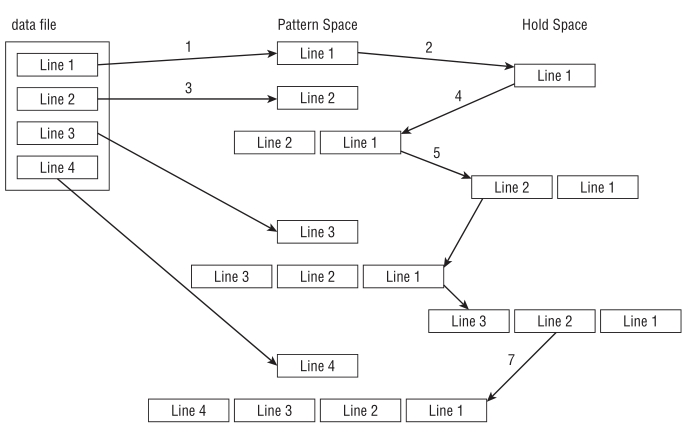

# SED Bible 

# Getting to know the sed editor
`sed` 편집기는 일반적인 **대화형 텍스트 편집기** (*interactive text editor*) 와 달리 **스트림 편집기** (*stream editor*) 라 불립니다. 

대화형 텍스트 편집기, 예를 들어 **vim** 에선 **키보드 명령** 을 사용해 데이터를 대화식으로 삽입, 삭제 또는 교체합니다. 이에 반해, 
스트림 편집기는 데이터를 처리하기 전에 미리 제공한 **규칙을 바탕으로 데이터 스트림을 편집** 합니다.

`sed` 편집기는 **명령** (*command*) 을 명령줄에 직접 입력하거나, **명령 텍스트 파일** 에 저장해 데이터 스트림의 데이터를 조작할 수 있습니다. 

`sed` 편집기는 다음과 같은 작업을 수행합니다: 

1. 입력 데이터 스트림에서 한 줄씩 데이터를 읽습니다.  
2. 해당 데이터를 함께 제공한 편집 명령의 주소나 패턴과 비교한 후 일치 여부를 검사합니다.  
3. 명령에 지정한 대로 스트림의 데이터를 지침대로 변경합니다.  
4. 변경된 데이터를 **STDOUT** (표준 출력) 에 출력합니다.

스트림 편집기가 데이터의 **한 줄에 모든 명령을 적용** 한 후, **다음 데이터 줄을 읽으며 그 과정을 계속 반복** 합니다. 스트림 편집기가 스트림의 모든 데이터 줄을 처리하면 작업을 종료합니다.

명령은 한 줄씩 순차적으로 적용되기 때문에, `sed` 편집기는 데이터를 편집하기 위해 한 번만 데이터 스트림을 통과합니다. 이로 인해, `sed` 편집기는 대화형 편집기보다 **훨씬 빠르며**, 
파일의 데이터를 **실시간으로 빠르게 수정** 할 수 있습니다.

`sed` 명령을 사용하는 구문은 다음과 같습니다:

```
sed options scriptfile
```

**options** 매개변수 (혹은 플래그) 는 `sed` 명령의 기본 동작을 사용자화할 수 있으며 옵션은 다음 표에 나와 있습니다.

| 옵션 | 설명 |
| ---  | ---  |
| -e script | 입력을 처리하는 명령에 지정한 명령을 추가합니다. |
| -f file   | 스크립트 명령 파일에 지정한 명령을 입력을 처리하는 명령에 추가합니다. |
| -n        | 각 명령에 대해 출력 결과를 생성하지 않고, **print** 명령을 기다립니다. |

**scriptfile** 은 스트림 데이터에 적용할 단일 또는 복수 명령을 지정한 파일입니다. 만약, 여러 명령이 필요할 경우, `-e` 옵션을 사용해 명령줄에 명령을 직접 지정하거나, `-f` 옵션을 사용해 명령을 별도의 스크립트 파일에 저장합니다. 

데이터를 조작하는 다양한 명령이 존재하며, 이번 장에서는 `sed` 편집기에 사용하는 **기본 명령** 을 살펴보고, 다음 장에는 **고급 명령** 에 대해 다룰 것입니다.


## Defining an editor command in the command line
기본적으로 `sed` 편집기는 명령을 **STDIN** (표준 입력) 입력 스트림에 적용합니다. 따라서, `sed` 편집기로 데이터를 **파이프** (*pipe*) 처리할 수 있습니다. 다음은 이를 수행하는 방법을 보여주는 간단한 예입니다:

> [!NOTE]
> 이런 프로그램을 **필터** (*filter*) 프로그램이라 부릅니다.

```
$ echo "This is a test" | sed 's/test/big test/'
This is a big test
$
```

이 예제는 `sed` 편집기의 **s** (*substitute*) 대체 명령을 사용합니다. **s** 명령은 첫 번째 텍스트 문자열 패턴을 두 번째 텍스트 문자열로 대체합니다. 이 예제에서는 `test` 란 단어가 `big test` 로 대체되었습니다.  

> [!TIP]
> 대체 명령의 첫 번째 텍스트 문자열은 **검색 문자열** 이라 부르고, 두 번째 텍스트 문자열은 **대체 문자열** 이라 부릅니다.

이 예제를 실행하면 즉시 화면에 결과가 표시됩니다. 이것이 바로 `sed` 편집기를 사용하는 이유입니다. `sed` 편집기를 사용하면, 일부 대화형 편집기 프로그램을 시작하는 데 걸리는 시간과 비슷한 시간에 데이터를 여러 번 수정할 정도로 빠릅니다.  

물론, 이 예제처럼 간단한 테스트는 한 줄의 데이터만 수정한 것입니다. 하지만, 전체 파일을 편집하더라도 빠른 속도로 결과를 얻을 수 있습니다:

```
$ cat data1.txt
The quick brown fox jumps over the lazy dog.
The quick brown fox jumps over the lazy dog.
The quick brown fox jumps over the lazy dog.
The quick brown fox jumps over the lazy dog.
$
$ sed 's/dog/cat/' data1.txt
The quick brown fox jumps over the lazy cat.
The quick brown fox jumps over the lazy cat.
The quick brown fox jumps over the lazy cat.
The quick brown fox jumps over the lazy cat.
$
```

`sed` 편집기는 즉각적으로 실행되어 데이터를 반환합니다. 각 데이터 줄을 처리하면서 결과를 표시하므로, `sed` 편집기가 전체 파일을 처리하기 전에 결과를 볼 수 있습니다.

중요한 점은 `sed` 편집기는 **"원본 텍스트 파일의 데이터는 전혀 수정하지 않는다!"** 는 것입니다. 명령으로 수정한 결과 텍스트는 **STDOUT** (표준 출력)으로만 출력됩니다. 다음과 같이 원본 텍스트 파일을 확인해 보면, 원본 데이터는 그대로 포함되어 있다는 것을 알 수 있습니다.

```
$ cat data1.txt
The quick brown fox jumps over the lazy dog.
The quick brown fox jumps over the lazy dog.
The quick brown fox jumps over the lazy dog.
The quick brown fox jumps over the lazy dog.
$
```


## Using multiple editor commands in the command line
`sed` 편집기를 명령줄에 여러 명령을 지정해 실행하려면 다음과 같이 `-e` 옵션을 사용하면 됩니다.

```
$ sed -e 's/brown/green/; s/dog/cat/' data1.txt
The quick green fox jumps over the lazy cat.
The quick green fox jumps over the lazy cat.
The quick green fox jumps over the lazy cat.
The quick green fox jumps over the lazy cat.
$
```

두 개의 명령은 파일의 각 데이터 줄에 매번 적용됩니다. 이때, 명령은 **세미콜론 문자로 구분** 해야 하며, 명령 끝과 세미콜론 문자 사이에는 공백 문자가 없어야 합니다.  

> [!TIP]
> 공백 문자가 있다면 다음과 같은 오류가 발생합니다. `sed: Command garbled: s/brown/green/ ; s/dog/cat/` 하지만, GNU 버전의 sed에서는 정상적으로 실행됩니다.

세미콜론 문자 대신, `bash` 쉘의 **보조 프롬프트** 를 사용할 수 있습니다. 작은따옴표 문자를 입력해 `sed` 스크립트 (즉, `sed` 편집기 명령 목록) 를 시작하면, `bash` 쉘은 닫는 작은따옴표 문자를 입력할 때까지 추가적인 명령을 계속해 요청합니다.

```
$ sed -e '
> s/brown/green/
> s/fox/elephant/
> s/dog/cat/' data1.txt
The quick green elephant jumps over the lazy cat.
The quick green elephant jumps over the lazy cat.
The quick green elephant jumps over the lazy cat.
The quick green elephant jumps over the lazy cat.
$
```

닫는 작은따옴표 문자가 나타난 동일한 줄에서 명령을 마무리해야 합니다. `bash` 쉘은 닫는 작은따옴표를 감지하면 명령을 처리합니다. 명령을 시작하면, `sed` 편집기는 지정한 각 명령을 텍스트 파일의 각 데이터 줄에 적용합니다.


## Reading editor commands from a file
마지막으로, 처리할 `sed` 명령이 많을 경우, 이를 **별도의 파일에 저장** 하는 것이 유용할 경우가 많습니다. 이 경우, **-f** 옵션을 사용해 `sed` 편집기에 스크립트 명령 파일을 지정해 실행할 수 있습니다.

```
$ cat script1.sed
s/brown/green/
s/fox/elephant/
s/dog/cat/
$
$ sed -f script1.sed data1.txt
The quick green elephant jumps over the lazy cat.
The quick green elephant jumps over the lazy cat.
The quick green elephant jumps over the lazy cat.
The quick green elephant jumps over the lazy cat.
$
```

이 경우, 각 명령 뒤에 세미콜론 문자를 추가할 필요는 없습니다. `sed` 편집기는 각 줄이 별도의 단일 명령을 포함한다는 것을 알고 있습니다. 명령줄에 `sed` 명령을 직접 입력한 것과 마찬가지로, `sed` 편집기는 지정한 명령 파일에서 명령을 읽고 데이터 파일의 각 줄에 적용합니다.

> [!TIP]
> `sed` 편집기의 명령 스크립트 파일과 `bash` 쉘 스크립트 파일을 혼동할 수 있습니다. 이런 혼란을 피하려면 `sed` 스크립트 파일에 `.sed` 파일 확장자를 사용하는 것이 좋습니다.

다음 섹션부터 데이터를 조작하는 데 유용한 몇 가지 다른 `sed` 편집기 명령을 살펴보겠습니다. 


<br><br>

# Commanding at the sed Editor Basics
`sed` 편집기를 성공적으로 사용하려면 **명령** 과 **사용 형식** 을 제대로 이해하는 것이 중요합니다. 이런 명령과 사용 형식은 편집 작업을 사용자화하는 데 많은 도움이 됩니다. 
이 섹션에선 `sed` 편집기로 편집 작업을 시작할 때나 스크립트 파일에 포함할 수 있는 몇 가지 기본적인 명령과 기능에 대해 설명합니다.


## Introducing more substitution options
이미 `s` 명령을 사용해 한 줄의 텍스트를 새로운 텍스트로 대체하는 방법을 살펴봤습니다. 하지만, **대체 명령엔 추가적인 옵션** 이 존재하고 이를 잘 활용하면 보다 쉽게 작업을 처리할 수 있습니다.


### Substituting flags
대체 명령으로 텍스트 문자열에서 검색 일치한 패턴을 대체하는 방식엔 한 가지 주의할 점이 있습니다. 다음 예제를 통해 무슨일이 일어나는지 살펴보시길 바랍니다:

```
$ cat data2.txt
This is a test of the test script.
This is the second test of the test script.
$
$ sed 's/test/trial/' data2.txt
This is a trial of the test script.
This is the second trial of the test script.
$
```

대체 명령은 여러 줄의 텍스트를 대체하는 작업을 잘 처리하지만, **기본적으로 각 줄의 첫 번째 검색 일치 대상만 대체 문자열로 대체합니다.** 

각 줄내의 다른 부분까지 대체하려면 대체 명령에 **substitution flag** 를 사용해야 합니다. 이 **대체 플래그는 대체 명령의 대체 문자열 (*replacement*) 뒤에 설정** 합니다.

```
s/pattern/replacement/flags
```

다음은 대체 명령에 사용할 수 있는 네 가지 유형의 **substitution flag** 입니다:

| flags | description |
| --- | --- | 
| **숫자** |  검색 패턴이 발견된 특정 위치를 지정해, 해당 위치의 텍스트를 새로운 텍스트로 대체합니다. |
| **g** |  원본 텍스트내의 모든 검색 일치 텍스트를 새로운 텍스트로 대체합니다. |
| **p** |  원본 텍스트 줄의 내용을 출력합니다. |
| **w file** |  대체 명령으로 대체한 결과를 지정한 파일에 저장합니다. |

첫 번째 유형은 검색 일치한 패턴 중, 어떤 위치에 새로운 텍스트를 대체할지 지정할 수 있습니다. 예를 들어, 숫자를 사용해 특정 위치를 지정하면 그 위치의 텍스트만 새로운 텍스트로 대체합니다.

```
$ sed 's/test/trial/2' data2.txt
This is a test of the trial script.
This is the second test of the trial script.
$
```

예제와 같이 **substitution flag** 에 숫자 **2** 를 지정해 실행하면, 각 줄내에서 두 번째 위치의 패턴만 대체합니다. 

반면에 **g** (*global*) 플래그는 패턴이 나타나는 모든 위치를 대체합니다.

```
$ sed 's/test/trial/g' data2.txt
This is a trial of the trial script.
This is the second trial of the trial script.
$
```

**p** (*print*) 플래그는 검색 일치한 패턴이 포함된 줄만 출력합니다. 이 플래그는 주로 `sed -n` 옵션과 함께 사용합니다. 

**`-n` (*next*) 옵션은 sed 편집기의 기본 출력 작업을 억제한 후, `p` 플래그로 인해 대체한 줄만 출력합니다.**

```
$ cat data3.txt
This is a test line.
This is a different line.
$
$ sed -n 's/test/trial/p' data3.txt
This is a trial line.
$
```

위와 같이 `-n` 옵션은 `sed` 편집기의 기본 출력 작업을 모두 억제합니다. 따라서, **p** 플래그로 인해 대체한 줄만 출력합니다. 그래서, 이 두 가지 명령을 조합하면 **대체 명령으로 수정한 줄만 출력** 할 수 있습니다.

**w** (*write*)플래그는 **p** 플래그 같이 대체한 줄만 출력한 것과 동일한 결과를 생성하지만, 출력 내용을 지정한 파일에 저장합니다.

```
$ sed 's/test/trial/w test.txt' data3.txt
This is a trial line.
This is a different line.
$
$ cat test.txt
This is a trial line.
$
```

`sed` 편집기의 기본 출력은 **STDOUT** (표준 출력) 에 나타나지만, 검색 일치한 패턴을 포함해 대체한 줄만 파일에 저장합니다.


### Replacing characters
때때로, 텍스트 문자열 중에는 대체 명령의 패턴에 사용하기 어려운 문자가 있습니다. **Linux** 환경의 대표적인 예로 슬래시 (`/`) 문자가 있습니다. 

예를 들어, 파일에 포함된 경로 이름을 대체하는 작업은 매우 번거로울 수 있습니다. `/etc/passwd` 파일에 "bash" 를 "csh" 쉘로 대체할 경우에는 다음과 같이 처리합니다:

```
$ sed 's/\/bin\/bash/\/bin\/csh/' /etc/passwd
```

슬래시 (`/`) 문자는 검색 문자열과 대체 문자열의 **구분자** 로 사용되므로 만약, 패턴 텍스트에 슬래시 문자가 포함된다면 이스케이프 처리하기 위해 백슬래시 (`\`) 문자를 매번 사용해야 합니다. 이로 인해, 혼동이나 입력 실수가 발생할 수 있습니다. 

이런 문제를 해결하기 위해, `sed` 편집기는 대체 명령의 **구분자로 다른 문자를 선택할 수 있도록 허용** 합니다.

```
$ sed 's!/bin/bash!/bin/csh!' /etc/passwd
```

위의 예제는 구분자로 느낌표 (`!`) 문자를 사용해, 경로 이름을 훨씬 더 읽기 쉽고 이해하기 쉽게 만듭니다.


## Using addresses
기본적으로, `sed` 편집기에 사용하는 **명령은 텍스트 데이터의 모든 줄에 적용** 됩니다. 따라서, 특정한 줄이나 여러 줄 범위에만 명령을 적용하려면, **줄 주소 지정** (*line addressing*) 방식으로 처리해야 합니다. 

`sed` 편집기엔 두 가지 형태의 줄 주소 지정 방식이 있습니다:

- **주소 또는 주소 범위**: 특정 줄이나 줄 범위에만 명령을 적용합니다.
- **텍스트 패턴 또는 패턴 범위**: 해당 패턴이 포함된 줄만 필터링해 명령을 적용합니다.

두 가지 줄 주소 지정 방식 모두, 주소를 지정할 때는 다음과 같이 동일한 형식으로 사용합니다:

```
[address]command
```

또한, 특정 주소에 여러 명령을 묶어 **그룹화** 해 적용할 수 있습니다:

```
address {
    command1
    command2
    command3
}
```

`sed` 편집기는 지정한 그룹 명령을 주소와 일치한 줄에만 적용합니다. 

다음 섹션은 `sed` 스크립트에서 두 가지 **줄 주소 지정** 방식을 사용하는 방법에 대해 설명합니다.


### Addressing the numeric line
숫자로 된 줄 주소 지정 방식을 사용할 때, 텍스트 스트림의 **줄 번호를 기준으로 처리** 합니다. `sed` 편집기는 텍스트 스트림의 첫 번째 줄을 1번 줄로 지정하고, 이후 각 줄에 순차적으로 번호를 매깁니다. 또한, 명령에 지정한 주소는 **단일 줄 번호** 일 수도 있고, **시작 줄 번호와 종료 줄 번호 사이에 쉼표 문자를 사용해 범위 주소 형태로 지정** 할 수 있습니다. 

다음은 `sed` 명령을 적용할 단일 줄 번호를 지정한 예입니다:

```
$ sed '2s/dog/cat/' data1.txt
The quick brown fox jumps over the lazy dog
The quick brown fox jumps over the lazy cat
The quick brown fox jumps over the lazy dog
The quick brown fox jumps over the lazy dog
$
```

`sed` 편집기는 두 번째 줄만 수정했습니다. 이번엔 주소 범위를 사용한 예를 살펴보겠습니다:

```
$ sed '2,3s/dog/cat/' data1.txt
The quick brown fox jumps over the lazy dog
The quick brown fox jumps over the lazy cat
The quick brown fox jumps over the lazy cat
The quick brown fox jumps over the lazy dog
$
```

텍스트의 특정 지점부터 텍스트의 끝까지 명령을 적용하려면, 특수 주소인 달러 기호 (`$`) 문자를 사용할 수 있습니다:

```
$ sed '2,$s/dog/cat/' data1.txt
The quick brown fox jumps over the lazy dog
The quick brown fox jumps over the lazy cat
The quick brown fox jumps over the lazy cat
The quick brown fox jumps over the lazy cat
$
```

일반적으로 텍스트 파일에 몇 줄의 데이터가 있는지 알 수 없기 때문에, 달러 기호 (`$`) 는 유용하게 사용됩니다.


### Using text pattern filters
명령을 적용할 줄을 제한할 또 다른 방법은 조금 복잡해 보일 수 있습니다. 

`sed` 편집기는 명령을 적용할 줄을 **필터링** (*filtering*) 하기 위해 **텍스트 패턴으로 지정** 할 수 있습니다. 그 사용 형식은 다음과 같습니다:

```
/pattern/command
```

**패턴 (*pattern*) 은 슬래시 (`/`) 문자로 감싸야 합니다.** 

`sed` 편집기는 **텍스트 패턴을 포함한 줄에만 명령을 적용** 합니다. 예를 들어, *Samantha* 사용자의 기본 셸을 변경하려면 다음과 같이 사용할 수 있습니다:

```
$ grep Samantha /etc/passwd
Samantha:x:502:502::/home/Samantha:/bin/bash
$
$ sed '/Samantha/s/bash/csh/' /etc/passwd
root:x:0:0:root:/root:/bin/bash
bin:x:1:1:bin:/bin:/sbin/nologin
[...]
Christine:x:501:501:Christine B:/home/Christine:/bin/bash
Samantha:x:502:502::/home/Samantha:/bin/csh
Timothy:x:503:503::/home/Timothy:/bin/bash
$
```

이 명령은 **검색 일치한 텍스트 패턴이 포함된 줄에만 적용** 되었습니다. 

지금 같이, 고정된 텍스트 패턴을 사용하면 특정 값을 필터링할 떄는 유용하지만 범용적인 사용 방법에 있어선 다소 제한적입니다. 

`sed` 편집기는 **정규 표현식** (*regular expressions*) 을 사용해 좀 더 복잡한 텍스트 패턴을 생성할 수 있습니다. **정규 표현식** 은 다양한 형태의 텍스트 데이터와 일치할 수 있는 **고급 텍스트 패턴** 을 만들 수 있습니다. 

정규 표현식은 **와일드카드 문자**, **특수 문자** 및 **고정 텍스트** 문자를 결합해 거의 모든 상황을 처리할 수 있는 텍스트 패턴을 생성할 수 있습니다. 정규 표현식은 스크립트 프로그래밍에서 가장 어려운 부분 중 하나이며 **별도의 장** 에 자세히 다루겠습니다.


### Grouping commands
개별 줄에 여러 명령을 수행할 경우, **중괄호 문자를 사용해 명령을 그룹화** 할 수 있습니다. `sed` 편집기는 지정한 주소의 줄에만 여러 명령을 적용합니다:

```
$ sed '2{
> s/fox/elephant/
> s/dog/cat/
> }' data1.txt
The quick brown fox jumps over the lazy dog.
The quick brown elephant jumps over the lazy cat.
The quick brown fox jumps over the lazy dog.
The quick brown fox jumps over the lazy dog.
$
```

**그룹 명령의 두 명령 모두 동일한 2번 줄에 적용** 됩니다. 물론, 그룹 명령은 주소 범위로 지정할 수 있습니다:

```
$ sed '3,${
> s/brown/green/
> s/lazy/active/
> }' data1.txt
The quick brown fox jumps over the lazy dog.
The quick brown fox jumps over the lazy dog.
The quick green fox jumps over the active dog.
The quick green fox jumps over the active dog.
$
```

`sed` 편집기는 주소 범위의 모든 줄에 그룹 명령을 일괄 적용합니다.


## Deleting lines
`sed` 편집기에 대체 명령만 있는 것은 아닙니다. 

텍스트 스트림의 특정 줄만 삭제할 경우, **삭제** 명령 (*delete command*) 인 `d` 명령을 사용할 수 있습니다. 
`d` 명령은 문자그대로 동작해, 지정한 **주소 체계에 일치한 텍스트 줄을 삭제** 합니다. 

**삭제 명령을 사용할 떈 항상 주소 체계를 포함해야 한다** 는 사실을 절대 잊지말아야 합니다. 

만약, **주소 체계를 포함하지 않는다면 스트림의 모든 줄이 삭제됩니다!!**

```
$ cat data1.txt
The quick brown fox jumps over the lazy dog
The quick brown fox jumps over the lazy dog
The quick brown fox jumps over the lazy dog
The quick brown fox jumps over the lazy dog
$
$ sed 'd' data1.txt
$
```

삭제 명령은 주소 체계와 함께 사용할 때만 유용합니다. 이를 통해, 줄 번호를 기준으로 데이터 스트림의 특정 텍스트 줄만 삭제할 수 있습니다:

```
$ cat data4.txt
This is line number 1.
This is line number 2.
This is line number 3.
This is line number 4.
$
$ sed '3d' data4.txt
This is line number 1.
This is line number 2.
This is line number 4.
$
```

또는, 주소 범위의 줄을 삭제할 수 있습니다:

```
$ sed '2,3d' data4.txt
This is line number 1.
This is line number 4.
$
```

특수한 **end-of-file** 문자인 (`$`) 를 사용해 특정 줄부터 마지막 줄까지 삭제할 수 있습니다:

```
$ sed '3,$d' data4.txt
This is line number 1.
This is line number 2.
$
```

`sed` 편집기의 패턴 주소 또한 삭제 명령에 그대로 적용할 수 있습니다. 이를 통해, 특정 텍스트 패턴을 기준으로 줄을 삭제할 수 있습니다:

```
$ sed '/number 1/d' data4.txt
This is line number 2.
This is line number 3.
This is line number 4.
$
```

`sed` 편집기는 지정한 패턴과 일치한 텍스트를 포함한 줄을 삭제합니다.

> [!NOTE]
> `sed` 편집기는 **원본 파일을 절대 수정하지 않음** 을 항상 기억하시기 바랍니다. 삭제한 줄은 `sed` 편집기의 출력 결과에서만 사라진 것이며, 원본 파일엔 여전히 "삭제한" 줄이 그대로 남아 있습니다.

두 개의 텍스트 패턴을 쉼표 문자로 구분해 줄 범위를 삭제할 수 있습니다. 하지만, 이 방법을 사용할 때는 주의할 점이 있습니다. 

**첫 번째 패턴이 줄 삭제 기능을 켜고, 두 번째 패턴이 줄 삭제 기능을 끄는 역할을 합니다!!** 

`sed` 편집기는 두 패턴 사이의 모든 줄을 삭제하며 이때 **지정한 줄까지 포함** 됩니다.

```
$ sed '/1/,/3/d' data4.txt
This is line number 4.
$
```

`sed` 편집기는 데이터 스트림에서 삭제 명령의 시작 패턴을 감지하면, 삭제 기능이 "**켜지기**" 때문에 예상치 못한 결과가 발생할 수 있습니다:

```
$ cat data5.txt
This is line number 1.
This is line number 2.
This is line number 3.
This is line number 4.
This is line number 1 again.
This is text you want to keep.
This is the last line in the file.
$
$ sed '/1/,/3/d' data5.txt
This is line number 4.
$
```

두 번째 "1" 패턴이 포함된 줄에서 삭제 명령을 켜고 데이터 스트림의 나머지 줄까지 삭제했습니다. 이것은 **정지 패턴이 제대로 인식되지 않아 발생한 문제** 입니다. 

또 다른 명백한 문제는 다음과 같이 텍스트에 **정지 패턴이 전혀 나타나지 않은 경우** 에도 발생할 수 있습니다.

```
$ sed '/1/,/5/d' data5.txt
$
```

첫 번째 패턴에서 삭제 기능이 "**켜졌지만**", 종료 패턴을 찾지 못했기 때문에 전체 데이터 스트림 모두를 삭제한 것입니다.


## Inserting and appending text
일반적인 대화형 편집기와 마찬가지로, `sed` 편집기는 **데이터 스트림에 텍스트 줄을 삽입하거나 추가** 할 수 있습니다. 

이 두 가지 텍스트 입력 명령은 다소 혼란스러울 수 있습니다:

- **삽입** `i` 명령 (*insert*) 은 지정한 줄 **앞에** 새로운 줄을 추가합니다.
- **추가** `a` 명령 (*append*) 은 지정한 줄 **뒤에** 새로운 줄을 추가합니다.

이 두 명령이 혼란스러운 이유는 사용 형식에 있습니다. 이 텍스트 입력 명령은 한 줄에 작성할 수 없을 수 있습니다. 텍스트를 삽입할 별도의 줄을 지정해야 합니다. 다음은 명령을 수행하는 형식입니다:

```
sed '[address]command\
new line'
```

새로운 줄에 포함된 텍스트는 `sed` 편집기 출력의 지정한 위치 앞이나 뒤에 나타납니다. 

삽입 `i` 명령을 사용하면 데이터 스트림 텍스트 **앞에** 나타난다는 점을 기억하시기 바랍니다:

```
$ echo "Test Line 2" | sed 'i\Test Line 1'
Test Line 1
Test Line 2
$
```

추가 `a` 명령을 사용하면 데이터 스트림 텍스트 **뒤에** 나타납니다:

```
$ echo "Test Line 2" | sed 'a\Test Line 1'
Test Line 2
Test Line 1
$
```

`sed` 편집기를 명령줄 인터페이스에서 사용할 때, 작은따옴표 문자를 입력하면 데이터를 입력할  **보조 프롬프트** 가 표시됩니다. 이 줄에 텍스트를 입력합니다. 
입력 종료를 의미하는 작은따옴표 문자를 입력하면 **bash** 셸은 명령을 처리합니다:

```
$ echo "Test Line 2" | sed 'i\
> Test Line 1'
Test Line 1
Test Line 2
$
```

단일라인 데이터 스트림의 텍스트 앞이나 뒤 라인에 텍스트를 추가하는 것은 잘 작동하지만, 멀티라인 데이터 스트림에 텍스트를 추가하려면 어떻게 처리해야 할까요?

멀티라인 데이터 스트림에 데이터를 삽입하거나 추가하려면, **주소 지정 방식** 을 사용해, `sed` 편집기에게 데이터가 입력될 위치를 알려줘야 합니다. 
또한, 이 명령을 사용할 경우 **단일 줄 주소** 만 지정할 수 있습니다!! 줄 번호나 텍스트 패턴 주소는 사용할 수 있지만, **범위 주소** 는 사용할 수 없습니다. 
왜냐하면, 한 줄 앞이나 뒤에만 텍스트를 삽입하거나 추가할 수 있기 때문에, 여러 줄에는 사용할 수 없다는 지극히 논리적인 이유입니다.

다음은 데이터 스트림에서 3번 줄 **앞에** 새로운 줄을 **삽입** 하는 예입니다:

```
$ cat data4.txt
This is line number 1.
This is line number 2.
This is line number 3.
This is line number 4.
$
$ sed '3i\
> This is an inserted line.' data4.txt
This is line number 1.
This is line number 2.
This is an inserted line.
This is line number 3.
This is line number 4.
$
```

다음은 데이터 스트림에서 3번 줄 **뒤에** 새로운 줄을 **추가** 하는 예입니다:

```
$ cat data4.txt
This is line number 1.
This is line number 2.
This is line number 3.
This is line number 4.
$
$ sed '3a\
> This is an appended line.' data4.txt
This is line number 1.
This is line number 2.
This is line number 3.
This is an appended line.
This is line number 4.
$
```

이 명령은 삽입 명령과 동일한 프로세스로 처리되며, 단지 지정한 줄 번호 **뒤에** 새로운 텍스트를 추가합니다. 

멀티라인 데이터 스트림에서 데이터 스트림의 끝에 새로운 줄을 추가하려면, 달러 기호 (`$`) 를 사용하면 됩니다. 이것은 데이터의 **마지막 줄** 을 의미합니다:

```
$ cat data4.txt
This is line number 1.
This is line number 2.
This is line number 3.
This is line number 4.
$
$ sed '$a\
> This is a new line of text.' data4.txt
This is line number 1.
This is line number 2.
This is line number 3.
This is line number 4.
This is a new line of text.
$
```

멀티라인 데이터 스트림의 시작 부분에 새로운 줄을 추가하려면, **1번 줄** 앞에 새로운 줄을 삽입하면 됩니다.

만일, 단일 라인이 아닌 여러 줄의 텍스트를 삽입하거나 추가하려면, 새로운 텍스트 줄 뒤에 백슬래시 (`\`) 문자를 사용하고 마지막 텍스트 줄에 도달할 때까지 계속해야 합니다:

```
$ cat data4.txt
This is line number 1.
This is line number 2.
This is line number 3.
This is line number 4.
$
$ sed '1i\
> This is one line of new text.\
> This is another line of new text.' data4.txt
This is one line of new text.
This is another line of new text.
This is line number 1.
This is line number 2.
This is line number 3.
This is line number 4.
$
```

위의 경우 두 줄 모두 데이터 스트림에 추가됩니다.

> [!TIP]
> 즉, 입력할 여러 줄 중 마지막 줄을 제외한 이전 줄까진 `\` 문자를 사용해 줄 바꿈 처리해야 합니다.


## Changing lines
**변경** `c` (*change*) 명령은 데이터 스트림의 텍스트 줄 내용을 변경할 수 있습니다. 이것은 텍스트 삽입 및 추가 명령과 동일하게 작동합니다. 

```
$ cat data4.txt
This is line number 1.
This is line number 2.
This is line number 3.
This is line number 4.
$
$ sed '3c\
> This is a changed line of text.' data4.txt
This is line number 1.
This is line number 2.
This is a changed line of text.
This is line number 4.
$
```

`sed` 편집기는 3번 줄의 텍스트를 변경합니다. 또한, 텍스트 패턴을 주소로 사용할 수 있습니다:

```
$ cat data4.txt
This is line number 1.
This is line number 2.
This is line number 3.
This is line number 4.
$
$ sed '/number 3/c\
> This is a changed line of text.' data4.txt
This is line number 1.
This is line number 2.
This is a changed line of text.
This is line number 4.
$
```

하지만, 텍스트 패턴 주소를 사용한 변경 명령은 데이터 스트림에 검색 일치한 **모든 텍스트 줄을 변경** 합니다:

```
$ cat data7.txt
This is line number 1.
This is line number 2.
This is line number 3.
This is line number 4.
This is line number 1 again.
This is yet another line.
This is the last line in the file.
$
$ sed '/number 1/c\
> This is a changed line of text.' data7.txt
This is a changed line of text.
This is line number 2.
This is line number 3.
This is line number 4.
This is a changed line of text.
This is yet another line.
This is the last line in the file.
$
```

변경 명령에 주소 범위를 사용할 수 있겠지만, 실행 결과는 예상과 다를 수 있습니다:

```
cat data4.txt
This is line number 1.
This is line number 2.
This is line number 3.
This is line number 4.
$
$ sed '2,3c\
> This is a new line of text.' data4.txt
This is line number 1.
This is a new line of text.
This is line number 4.
$
```

텍스트가 포함된 범위의 두 줄을 변경하므로, `sed` 편집기는 단일 텍스트 줄로 두 줄 모두를 교체합니다.


## Transforming characters
**변환** (*transform*, `y`) 명령은 `sed` 편집기에서 **단일 문자에 작동하는 유일한 명령** 입니다. 변환 명령은 다음과 같은 형식으로 사용합니다:

```
[address]y/in-chars/out-chars/
```

변환 명령은 `in-chars` 와 `out-chars` 값을 **일대일로 매핑** 합니다. `in-chars`의 첫 번째 문자는 `out-chars`의 첫 번째 문자로 변환되고, 두 번째 문자는 두 번째 문자로 변환됩니다. 
이런 매핑 작업은 지정한 문자 길이를 따라 계속됩니다. 만약, `in-chars`와 `out-chars` 의 길이가 같지 않다면, `sed` 편집기는 **오류 메시지** 를 생성합니다.

다음은 변환 명령을 사용하는 간단한 예입니다:

```
$ cat data7.txt
This is line number 1.
This is line number 2.
This is line number 3.
This is line number 4.
This is line number 1 again.
This is yet another line.
This is the last line in the file.
$
$ sed 'y/123/789/' data7.txt
This is line number 7.
This is line number 8.
This is line number 9.
This is line number 4.
This is line number 7 again.
This is yet another line.
This is the last line in the file.
$
```

출력 결과로 알 수 있듯이, `in-chars` 패턴에 지정한 각각의 문자는 `out-chars` 패턴의 **같은 위치에 있는 문자로 교체** 되었습니다. 

또한, 변환 명령은 **전역 범위 명령** 입니다. 즉, 텍스트 라인에 발견된 **모든 문자를 자동으로 변환** 하며, 해당 문자가 몇 번째로 나타나는지엔 관계없이 처리됩니다.

```
$ echo "This 1 is a test of 1 try." | sed 'y/123/456/'
This 4 is a test of 4 try.
$
```

`sed` 편집기는 텍스트 라인에 일치한 문자인 '1' 의 두 인스턴스 모두를 `4` 로 변환했습니다. 따라서, 특정 위치만 변환 작업을 처리할 수 없습니다.


## Printing revisited
대체 명령 섹션에서 `p` 플래그를 사용해 `sed` 편집기가 **변경 작업을 처리한 라인만 표시하는 방법** 에 대해 살펴봤습니다. 

또한, 데이터 스트림에서 특정 정보를 출력하는 데 사용할 수 있는 다음과 같은 세 가지 명령이 있습니다:

| command | description |
| --- | --- |
| `p` | 텍스트 라인 출력 | 
| `=` | 텍스트 라인 번호 출력 |
| `l` (소문자 L) | 라인 목록 출력 |

다음 섹션에 세 가지 출력 명령을 `sed` 편집기에서 사용하는 방법에 대해 다룹니다.


### Printing lines
대체 명령의 `p` 플래그와 마찬가지로, `p` 명령은 `sed` 편집기 출력에 지정한 라인을 출력합니다. 이 명령은 단독으로 사용할 경우엔 특별한 기능을 제공하지 않습니다:

```
$ echo "this is a test" | sed 'p'
this is a test
this is a test
$
```

이 명령은 이미 존재하는 데이터를 그저 중복 출력하는 것에 불과합니다. 

`p` 명령의 가장 일반적인 사용 용도는 텍스트 패턴과 검색 일치한 **텍스트가 포함된 라인만 출력** 하는 것입니다:

```
$ cat data4.txt
This is line number 1.
This is line number 2.
This is line number 3.
This is line number 4.
$
$ sed -n '/number 3/p' data4.txt
This is line number 3.
$
```

`sed` 편집기의 옵션으로 `-n` 을 사용하면 모든 라인의 출력은 억제하고 텍스트 패턴이 포함된 라인만 출력할 수 있습니다. 

또한, 스트림의 일부 라인만 빠르게 출력하는 방법으로 사용할 수 있습니다:

```
$ sed -n '2,3p' data4.txt
This is line number 2.
This is line number 3.
$
```

`p` 명령은 `s` 또는 `c` 명령으로 텍스트를 변경하기 직전에 해당 라인을 확인할 용도로 사용할 수 있습니다. 명령으로 변경하기 직전의 라인을 표시하는 다음과 같은 스크립트를 생성할 수 있습니다:

```
$ sed -n '/3/{
> p
> s/line/test/p
> }' data4.txt
This is line number 3.
This is test number 3.
$
```

위의 `sed` 편집기 명령은 숫자 "3" 을 포함한 라인을 검색한 후 두 개의 그룹 명령을 실행합니다. 스크립트는 `p` 명령을 사용해 원본 버전의 라인을 출력합니다. 
그런 다음, `s` 명령을 사용해 텍스트를 대체하고, 대체 명령의 `p` 플래그를 사용해 결과 텍스트를 출력합니다. 따라서, 출력에는 **원본 라인 텍스트와 새로운 라인 텍스트가 모두 표시** 됩니다.


### Printing line numbers
등호 `=` (*equal*) 명령은 데이터 스트림의 **라인 번호를 출력** 합니다. 라인 번호는 데이터 스트림에 **줄 바꿈 문자** (*newline character*) 를 사용하면 결정됩니다. 
즉, 줄 바꿈 문자가 데이터 스트림에 나타날 때마다, `sed` 편집기는 해당 문자가 **텍스트 라인의 끝을 의미한다** 고 가정합니다.

```
$ cat data1.txt
The quick brown fox jumps over the lazy dog.
The quick brown fox jumps over the lazy dog.
The quick brown fox jumps over the lazy dog.
The quick brown fox jumps over the lazy dog.
$
$ sed '=' data1.txt
1
The quick brown fox jumps over the lazy dog.
2
The quick brown fox jumps over the lazy dog.
3
The quick brown fox jumps over the lazy dog.
4
The quick brown fox jumps over the lazy dog.
$
```

`sed` 편집기는 원본 텍스트 라인 앞 라인에 라인 번호를 출력합니다. 등호 `=` 명령은 데이터 스트림에서 특정 텍스트 패턴만 검색할 때 유용합니다:

```
$ sed -n '/number 4/{
> =
> p
> }' data4.txt
4
This is line number 4.
$
```

이때 `-n` 옵션을 함께 사용하면, `sed` 편집기는 텍스트 패턴을 포함한 라인 번호와 원본 텍스트 모두를 함께 표시하도록 처리할 수 있습니다.


### Listing lines
목록 `l` (*list*) 명령은 데이터 스트림에서 텍스트와 **비가시적 문자까지 출력** 할 수 있습니다. 

**비가시적 문자는 8진수 값으로 표시** 되며, 백슬래시 문자가 앞에 붙거나 또는 탭 문자 같은 비가시적 문자는 C언어 스타일의 명명법인 `\t` 같은 형식으로 표시됩니다.

```
$ cat data9.txt
This          line          contains          tabs.
$
$ sed -n 'l' data9.txt
This\tline\tcontains\ttabs.$
$
```

탭 문자는 `\t` 명명법으로 표시됩니다. 줄 끝을 의미하는 달러 `$` 기호는 **줄 바꿈 문자를 의미** 합니다. 

만약, 데이터 스트림에 제어 문자가 포함되어 있다면, `l` 명령은 필요할 경우 **8진수 코드** 형태로 표시합니다.

```
$ cat data10.txt
This line contains an escape character.
$
$ sed -n 'l' data10.txt
This line contains an escape character. \a$
$
```

*data10.txt* 파일에는 벨 소리를 발생시키는 `\a` (*alert*) 제어 문자가 포함되어 있습니다. `cat` 명령을 사용해 해당 텍스트 파일을 화면에 표시할 때, 제어 문자는 화면에 보이진 않고 소리만 들리게 됩니다. (스피커가 켜져 있을 경우) 하지만, `l` 명령을 사용하면 제어 문자를 화면에 표시할 수 있습니다.


## Using files with sed
대체 명령에는 파일 작업을 처리하는 `w` 플래그가 포함되어 있습니다. 하지만, 텍스트를 대체하지 않고서도 파일 작업을 처리할 수 있는 `sed` 편집기 명령이 존재합니다.


### Writing to a file
저장 `w` (*write*) 명령은 파일에 줄의 내용을 저장합니다. `w` 명령의 형식은 다음과 같습니다:

```
[address]w filename
```

`filename` 은 상대 경로 또는 절대 경로 형태로 지정할 수 있지만, 어떤 경우든 `sed` 편집기를 실행하는 사용자는 해당 파일에 대한 **쓰기 권한** 을 가지고 있어야만 합니다. 
주소는 `sed` 에 사용하는 **모든 종류의 주소 지정 방법을 사용** 할 수 있습니다. 예를 들어, **단일 줄 번호**, **단일 텍스트 패턴**, 또는 **줄 번호 범위** 나 **텍스트 패턴 범위** 등이 있습니다.

다음은 데이터 스트림의 첫 번째 두 줄만 파일로 출력 (저장) 하는 예입니다:

```
$ sed '1,2w test.txt' data4.txt
This is line number 1.
This is line number 2.
This is line number 3.
This is line number 4.
$
$ cat test.txt
This is line number 1.
This is line number 2.
$
```

> [!NOTE]
> 물론, 기본 출력이 `STDOUT` 에 표시되지 않기를 원한다면, `sed` 에 `-n` 옵션을 사용할 수 있습니다.  

마스터 파일에 공통으로 사용된 텍스트 값을 기준으로 파일을 생성할 때 매우 유용한 도구입니다. 예를 들어, 메일링 리스트의 경우, 텍스트 값을 기준으로 새로운 파일을 만들 수 있습니다.

```
$ cat data10.txt
Blum, R Browncoat
McGuiness, A Alliance
Bresnahan, C Browncoat
Harken, C Alliance
$
$ sed -n '/Browncoat/w Browncoats.txt' data10.txt
$
$ cat Browncoats.txt
Blum, R Browncoat
Bresnahan, C Browncoat
$
```

`sed` 편집기는 텍스트 패턴을 포함한 데이터 라인만 파일에 저장합니다.


### Reading data from a file
`sed` 명령으로 데이터를 삽입하거나 추가하는 방법에 대해서는 이미 학습했습니다. 읽기 `r` (*read*) 명령은 별도의 파일에 포함된 데이터를 데이터 스트림에 삽입할 수 있게 해줍니다. 

`r` 명령의 형식은 다음과 같습니다:

```
[address]r filename
```

`filename` 매개변수는 데이터를 포함한 파일의 절대 경로 또는 상대 경로를 지정합니다. 하지만, **r 명령은 주소 범위는 사용할 수 없습니다.** 
단일 라인 번호나 텍스트 패턴 주소만 지정할 수 있습니다. `sed` 편집기는 지정한 주소 **이후에** 파일의 텍스트를 삽입합니다.

```
$ cat data11.txt
This is an added line.
This is the second added line.
$
$ sed '3r data11.txt' data4.txt
This is line number 1.
This is line number 2.
This is line number 3.
This is an added line.
This is the second added line.
This is line number 4.
$
```

sed 편집기는 데이터 파일의 모든 텍스트 라인을 데이터 스트림에 삽입합니다. 텍스트 패턴 주소로 삽입할 때도 동일하게 처리됩니다:

```
$ sed '/number 2/r data11.txt' data4.txt
This is line number 1.
This is line number 2.
This is an added line.
This is the second added line.
This is line number 3.
This is line number 4.
$
```

데이터 스트림의 끝에 텍스트를 추가하려면 달러 기호 주소 기호를 사용하면 됩니다:

```
$ sed '$r data11.txt' data4.txt
This is line number 1.
This is line number 2.
This is line number 3.
This is line number 4.
This is an added line.
This is the second added line.
$
```

`r` 명령의 멋진 활용법은 삭제 명령을 활용해 파일의 **자리 표시자** 를 다른 파일의 데이터를 읽어와 교체하는 것입니다. 예를 들어, 다음과 같은 형식의 텍스트 파일이 있다고 가정하겠습니다:

```
$ cat notice.std
Would the following people:
LIST
please report to the ship's captain.
$
```

*notice.std* 파일에는 이름 목록 대신 일반적인 자리 표시자인 *LIST* 문자열을 사용합니다. 자리 표시자 뒤에 실제 이름 목록을 읽어와 삽입하려면 `r` 명령을 사용합니다. 
하지만, 이렇게 처리해도 출력엔 여전히 자리 표시자 문자열이 그대로 남아있습니다. 이를 제거하려면 `d` 명령을 사용하면 됩니다. 다음과 같이 처리합니다:

```
$ sed '/LIST/{
> r data10.txt
> d
> }' notice.std
Would the following people:
Blum, R Browncoat
McGuiness, A Alliance
Bresnahan, C Browncoat
Harken, C Alliance
please report to the ship's captain.
$
```

이제 자리 표시자 `LIST` 문자열은 외부의 데이터 파일의 이름 목록으로 교체되었습니다.


# Summary
셸 스크립트로 수많은 작업을 처리할 수 있겠지만, 데이터를 세밀하게 조작한다는 것은 어려울 수 있습니다. `Linux` 는 텍스트 데이터를 처리하는 데 도움을 줄 수 있는 유용한 유틸리티를 제공합니다. 
그 중 `sed` 편집기는 데이터를 읽어 실시간으로 빠르게 편집할 수 있는 스트림 편집기 프로그램입니다. `sed` 편집기는 데이터를 처리할 수 있는 유용한 편집 명령을 제공합니다. 


<br><br>
---
<br><br>


# Advanced sed stream editor
이전 장은 데이터 스트림의 텍스트를 조작하는 `sed` 편집기의 기본적인 사용법에 대해 설명했습니다. 기본적인 `sed` 편집기 명령으로 대부분의 일상적인 텍스트 편집 요구는 처리할 수 있습니다. 

이 장은 `sed` 편집기가 제공하는 **고급 편집 기능** 에 대해 설명합니다. 하지만, 고급 편집 기능은 자주 사용하지 않을 수 있습니다. 하지만, 필요할 때 이것을 사용할 수 있다는 것과 사용하는 방법을 안다는 것은 좋은 것입니다.


## Looking at Multiline Commands
기본적인 `sed` 편집기 명령을 사용할 때, 다음과 같은 약간의 제한 사항을 느꼈을 수 있습니다. 

- **모든 명령은 데이터를 한 줄씩 처리합니다.** 
- 데이터 스트림을 읽을 때, **데이터는 줄 바꿈 문자를 기준** 으로 여러 줄로 나뉩니다. 
- 데이터는 한 번에 한 줄씩 처리되며, 정의된 스크립트 명령을 해당 데이터 줄에 적용한 후, 다음 줄로 넘어가면서 처리 과정을 반복합니다.

때때로 한 줄을 넘어가는 데이터에 대해 작업을 수행할 필요가 종종 있습니다. 이것은 특정 구문을 찾거나 교체할 때 자주 발생합니다. 

예를 들어, 데이터에 *Linux System Administrators Group* 란 구문을 찾는다고 가정하겠습니다. 구문의 단어는 **두 줄에 걸처 나뉘어 있을 수 있기 때문** 에, 
일반적인 `sed` 편집기 명령으로 텍스트를 처리한다면 두 줄로 분리된 구문을 감지한다는 것은 불가능합니다.

다행히, `sed` 편집기의 설계자는 이런 상황까지 염두에 두고 해결책을 마련했습니다. 

`sed` 편집기는 **멀티라인 텍스트를 처리** 할 수 있는 세 가지 특별한 명령이 포함되어 있습니다:

- **N**: 데이터 스트림에서 다음 줄을 추가해 멀티라인 그룹을 생성합니다.
- **D**: 멀티라인 그룹에서 한 줄을 삭제합니다.
- **P**: 멀티라인 그룹에서 한 줄을 출력합니다.

다음 섹션에 **멀티라인 명령** 을 좀 더 자세히 살펴보고 스크립트에서 어떻게 사용할 수 있는지 보여줍니다.


### Navigating the next command
멀티라인 `next` 명령을 살펴보기 전에, 단일라인 `next` 명령이 어떻게 작동하는지 알아야 합니다. 
단일라인 명령이 무엇을 어떻게 처리하는지 제대로 안다면, 멀티라인 `next` 명령이 어떻게 작동하는지 이해하기는 훨씬 쉬워집니다.


#### Using the single-line next command
소문자 `n` (*next*) 명령은 `sed` 편집기에게 데이터 스트림에서 **다음 텍스트 줄로 이동하라** 고 지시합니다. 

이때, 명령의 마지막까지 실행하지 않고 곧바로 다음 라인으로 이동합니다. 일반적으로 `sed` 편집기는 데이터를 처리할 때, 한 줄에 정의한 모든 명령을 처리한 후, 그 다음 텍스트 줄로 이동하지만, 단일라인 `next` 명령은 이런 제어 흐름을 변경합니다.

이것은 다소 복잡하게 들릴 수 있습니다. 예를 들어, 다음과 같이 다섯 줄이 포함된 데이터 파일이 있다고 가정할 때, 그 중 두 줄은 비어 있습니다. 처리할 목표는 *header* 문자열이 포함된 줄 뒤의 빈 줄은 제거하되, 마지막 줄 앞의 빈 줄은 제거하지 않고 그대로 두는 것입니다. 만약, 빈 줄을 제거하는 `sed` 스크립트를 작성했다면 두 개의 빈 줄 모두를 제거할 것입니다.

```
$ cat data1.txt
This is the header line.

This is a data line.

This is the last line.
$
$ sed '/^$/d' data1.txt
This is the header line.
This is a data line.
This is the last line.
$
```

왜냐하면, 제거할 줄이 빈 줄이기 때문에 **특정 빈 줄을 고유하게 식별할 수 있는 텍스트** 가 없습니다. 이에 대한 해결책은 바로 `n` (*next*) 명령을 사용하는 것입니다. 

다음 예제는 스크립트가 *header* 란 단어가 포함된 줄을 찾습니다. 스크립트가 해당 줄을 식별한 후, `n` 명령으로 텍스트의 다음 줄로 이동시키며 그 줄은 빈 줄일 것입니다.

```
This is the header line.

This is a data line.

This is the last line.
$
$ sed '/header/{n; d}' data1.txt
This is the header line.
This is a data line.

This is the last line.
$
```

이 시점에 `sed` 편집기는 남은 그룹 명령인 `d` 명령을 실행해 빈 줄을 삭제합니다. `sed` 편집기가 스크립트의 끝에 도달하면, 데이터 스트림의 다음 텍스트 줄을 읽고, 명령 스크립트의 맨 위에서부터 명령을 다시 처리하기 시작합니다. 하지만, `sed` 편집기는 더 이상의 *header* 란 단어가 포함된 줄은 찾지 못할 것이므로 이후의 줄은 삭제되지 않습니다.


#### Combining lines of text
이제, 단일라인 `next` 명령을 살펴봤으므로, 멀티라인 버전을 살펴볼 수 있습니다. 

- 단일라인 `n` 명령은 데이터 스트림에서 다음 텍스트 줄을 처리 공간 (즉, *pattern space*) 으로 이동시킵니다. 
- 멀티라인 `N` 명령은 *pattern space* 에 있는 텍스트에 다음 텍스트 줄을 **추가** 합니다.

이로 인해, 두 줄의 텍스트가 동일한 *pattern space* 에 결합됩니다. 결합된 텍스트 줄은 여전히 줄 바꿈 문자로 서로 구분되지만, 이제 `sed` 편집기에서 두 줄의 텍스트를 하나의 줄로 처리할 수 있습니다.

다음은 `N` 명령이 어떻게 작동하는지 보여주는 예시입니다:

```
$ cat data2.txt
This is the header line.
This is the first data line.
This is the second data line.
This is the last line.
$
$ sed '/first/{N; s/\n/ /}' data2.txt
This is the header line.
This is the first data line. This is the second data line.
This is the last line.
$
```

sed 편집기 스크립트는 *first* 란 단어를 포함한 텍스트 라인을 검색합니다. 해당 라인을 찾으면, `N` 명령을 사용해 그 라인과 다음 라인을 하나로 *pattern space* 에 결합합니다. 
그 후, `s` (대체) 명령을 사용해 줄 바꿈 문자를 공백 문자로 바꿉니다. 그 결과, 텍스트 파일의 두 라인은 sed 편집기 출력에선 하나의 라인처럼 나타납니다.

이런 처리 방법은 데이터 파일에 텍스트 구문이 두 줄에 걸쳐 나눠져 있을 수 있는 경우에 실용적으로 사용할 수 있습니다. 예를 들어, 다음과 같습니다:

```
$ cat data3.txt
On Tuesday, the Linux System
Administrator's group meeting will be held.
All System Administrators should attend.
Thank you for your attendance.
$
$ sed 's/System Administrator/Desktop User/' data3.txt
On Tuesday, the Linux System
Administrator's group meeting will be held.
All Desktop Users should attend.
Thank you for your attendance.
$
```

위의 대체 명령은 텍스트 파일에서 특정한 두 단어 구문인 *System Administrator* 를 찾고 있습니다. 단일 라인에 이 구문이 모두 포함된 경우엔 모든 것이 정상적으로 작동해 대체 명령으로 텍스트를 교체할 수 있습니다. 그러나, 구문이 두 줄에 걸쳐 나뉘어져 있을 경우는 대체 명령이 일치하는 패턴을 제대로 인식하지 못합니다.

`N` 명령은 바로 이런 문제를 해결하는 데 도움이 됩니다:

```
$ cat data3.txt
On Tuesday, the Linux System
Administrator's group meeting will be held.
All System Administrators should attend.
Thank you for your attendance.
$
$ sed 'N; s/System.Administrator/Desktop User/' data3.txt
On Tuesday, the Linux Desktop User's group meeting will be held.
All Desktop Users should attend.
Thank you for your attendance.
$
```

`N` 명령을 사용해 첫 번째 단어가 포함된 라인과 그 다음 라인을 하나로 결합하면, 구문이 두 줄로 나누어 있더라도 이를 제대로 감지할 수 있습니다.

위의 대체 명령은 `System` 과 `Administrator` 두 단어 사이에 와일드카드 패턴 (.) 문자를 사용해 공백 문자나 줄 바꿈 문자가 포함된 상황도 정상적으로 패턴을 매칭할 수 있습니다. 
그러나, 줄 바꿈 문자를 매칭했을 때, 해당 문자는 결합된 문자열에서 제거되어 두 줄이 하나로 붙어 표시됩니다. 이것은 원하는 결과가 아닐 수 있습니다.

이런 문제를 해결하려면, `sed` 스크립트에서 두 가지 대체 명령을 사용해 처리할 수 있습니다. 하나는 멀티라인에 발생한 구문을 처리하고, 다른 하나는 단일라인에 발생한 구문을 처리하는 방식입니다.

```
$ cat data3.txt
On Tuesday, the Linux System
Administrator's group meeting will be held.
All System Administrators should attend.
Thank you for your attendance.
$
$ sed 'N
> s/System\nAdministrator/Desktop\nUser/
> s/System Administrator/Desktop User/
> ' data3.txt
On Tuesday, the Linux Desktop
User's group meeting will be held.
All Desktop Users should attend.
Thank you for your attendance.
$
```

첫 번째 대체 명령은 두 검색 단어 사이에 있는 줄 바꿈 문자를 정확히 찾아 대체 문자열에 포함시킵니다. 이렇게 처리하면 새로운 대체 텍스트에도 동일한 위치에 줄 바꿈 문자를 추가할 수 있습니다.

그러나, 이 스크립트에는 여전히 미묘한 문제가 있습니다. 스크립트는 항상 `sed` 편집기 명령을 실행하기 전에 다음 텍스트 라인을 패턴 공간으로 읽어옵니다. 따라서, 마지막 텍스트 라인에 도달하면 더이상 읽어올 다음 텍스트 라인이 없기 때문에, `N` 명령은 `sed` 편집기를 멈추도록 만듭니다. 

만약, 다음과 같이 검색 텍스트가 데이터 스트림의 마지막 줄에 있다면, 데이터를 제대로 처리하지 못합니다.

```
$ cat data4.txt
On Tuesday, the Linux System
Administrator's group meeting will be held.
All System Administrators should attend.
$
$ sed 'N
> s/System\nAdministrator/Desktop\nUser/
> s/System Administrator/Desktop User/
> ' data4.txt
On Tuesday, the Linux Desktop
User's group meeting will be held.
All System Administrators should attend.
$
```

`System Administrator` 텍스트가 데이터 스트림의 마지막 줄에 나타났기 때문에, `N` 명령은 그것을 제대로 놓쳐버립니다. 그 이유는 패턴 공간에 결합할 **다음 라인이 더이상 없기 때문** 입니다.

하지만, 이 문제는 간단히 해결할 수 있습니다. 단일라인 명령을 `N` 명령 앞에 배치하고, 멀티라인 명령을 `N` 명령 뒤에 배치하면 됩니다. 즉, 다음과 같이 구성합니다:

```
$ cat data4.txt
On Tuesday, the Linux System
Administrator's group meeting will be held.
All System Administrators should attend.
$
$ sed '
> s/System Administrator/Desktop User/
> N
> s/System\nAdministrator/Desktop\nUser/
> ' data4.txt
On Tuesday, the Linux Desktop
User's group meeting will be held.
All Desktop Users should attend.
$
```

이제 단일라인을 처리하는 대체 명령은 데이터 스트림의 마지막 줄에 작동하고, 멀티라인을 처리하는 대체 명령은 데이터 스트림 중간에 있는 일치 항목까지 잘 처리합니다.


### Navigating the multiline delete command
이전 장에서 단일라인 삭제 명령 (`d`) 을 소개했습니다. `sed` 편집기는 삭제 명령으로 패턴 공간의 라인을 삭제합니다. 그러나, 멀티라인 `N` 명령을 사용할 경우엔 단일라인 삭제 명령을 사용할 때보다 주의해서 처리해야 합니다:

```
$ cat data4.txt
On Tuesday, the Linux System
Administrator's group meeting will be held.
All System Administrators should attend.
$
$ sed 'N; /System\nAdministrator/d' data4.txt
All System Administrators should attend.
$
```

위의 삭제 명령은 `System` 과 `Administrator` 란 단어를 각각 다른 줄에서 찾고, 패턴 공간에 결합된 두 줄을 삭제합니다. 이것은 의도한 결과일 수도 있고, 아닐 수도 있습니다.

`sed` 편집기는 멀티라인 삭제 명령어 (`D`) 를 제공하는 데, 이것은 패턴 공간에 결합된 텍스트의 첫 번째 줄만 삭제합니다. 이 명령은 줄 바꿈 문자까지 포함해 첫 번째 줄의 모든 문자를 제거합니다.

```
$ cat data4.txt
On Tuesday, the Linux System
Administrator's group meeting will be held.
All System Administrators should attend.
$
$ sed 'N; /System\nAdministrator/D' data4.txt
Administrator's group meeting will be held.
All System Administrators should attend.
$
```

`N` 명령으로 패턴 공간에 추가된 **두 번째 텍스트 줄은 그대로 유지** 됩니다. 이것은 찾을 문자열 라인 앞에 있는 텍스트 줄만 제거할 때 유용합니다.

다음은 데이터 스트림의 첫 번째 라인 앞에 있는 빈 줄만 제거하는 예입니다:

```
$ cat data5.txt

This is the header line.
This is a data line.

This is the last line.
$
$ sed '/^$/{N; /header/D}' data5.txt
This is the header line.
This is a data line.

This is the last line.
$
```

위의 `sed` 스크립트는 빈 줄을 (`^$`) 찾고, `N` 명령을 사용해 다음 텍스트 줄을 패턴 공간에 추가해 하나로 결합합니다. 만약, 결합된 패턴 공간의 내용에 *header* 란 단어가 포함되어 있다면, **`D` 명령으로 패턴 공간의 첫 번째 줄만 제거** 합니다. 

이런 `N` 과 `D` 명령 조합이 없다면, 첫 번째 빈 줄만 제거하는 작업은 불가능하고 다른 빈 줄까지 모두를 제거하게 됩니다.


### Navigating the multiline print command
이제 단일라인 명령과 멀티라인 명령에 대한 차이점을 이해할 수 있을 것입니다. 

멀티라인 출력 명령 (`P`)  또한 동일한 방식으로 작동합니다. 이 명령은 **멀티라인 패턴 공간의 첫 번째 줄만 출력** 합니다. 패턴 공간의 줄 바꿈 문자까지 포함한 모든 문자가 포함됩니다. 

`-n` 옵션을 사용해 스크립트의 기본 출력 작업을 억제한 후, 텍스트를 표시하는 방법은 단일라인 `p` 명령과 비슷하게 사용합니다.

```
$ cat data3.txt
On Tuesday, the Linux System
Administrator's group meeting will be held.
All System Administrators should attend.
Thank you for your attendance.
$
$ sed -n 'N; /System\nAdministrator/P' data3.txt
On Tuesday, the Linux System
$
```

멀티라인 매칭이 발생하면, `P` 명령은 패턴 공간의 첫 번째 줄만 출력합니다. 멀티라인 `P` 명령의 강력함은 `N` 과 `D` 멀티라인 명령과 결합할 때 나타납니다.

또한, `D` 명령은 매우 독특한 기능을 가지고 있는데, 이것은 `sed` 편집기가 **스크립트의 처음으로 돌아가 동일한 패턴 공간에 명령을 반복 실행** 하도록 만듭니다. 

즉, **새로운 텍스트 라인을 데이터 스트림에서 읽어오지 않습니다!!** 

명령 스크립트에 `N` 명령을 사용하면, 패턴 공간으로 한 줄씩 순차적으로 데이터를 처리할 때 여러 줄을 결합할 수 있습니다. 그런 다음, `P` 명령을 사용해 첫 번째 줄만 출력하고, 
`D` 명령으로 첫 번째 줄만 삭제한 후, 스크립트 처음 부분으로 다시 돌아갑니다. 스크립트의 처음 부분으로 돌아가면, `N` 명령으로 다음 텍스트 줄을 읽고, 이런 처리 과정을 반복합니다. 
이런 **루프** (*loop*)  구조는 데이터 스트림의 끝에 도달할 때까지 계속됩니다.


### Holding Space
패턴 공간은 `sed` 편집기가 명령으로 처리할 텍스트를 저장하는 **활성 버퍼 영역** 입니다. 그러나, 이것만이 `sed` 편집기에서 텍스트를 저장할 수 있는 유일한 처리 공간이 아닙니다.

`sed` 편집기에는 또 다른 버퍼 영역인 **홀드 공간(hold space)** 을 사용합니다. 홀드 공간은 패턴 공간에서 다른 줄을 처리할 동안, 텍스트 라인을 **임시로 저장할 용도로 사용** 할 수 있습니다.

홀드 공간을 사용하는 데 관련된 다섯 가지 명령은 다음 표에 나와 있습니다.

| 명령 | 설명 |
| ---  | ---  |
| h    | 패턴 공간을 홀드 공간에 "복사" 합니다.           |
| H    | 패턴 공간을 홀드 공간에 "추가" 합니다.           |
| g    | 홀드 공간을 패턴 공간에 "복사" 합니다.           |
| G    | 홀드 공간을 패턴 공간에 "추가" 합니다.           |
| x    | 패턴 공간과 홀드 공간의 내용을 "교환" 합니다.     |

위의 명령을 사용하면 패턴 공간에서 홀드 공간으로 텍스트를 **복사** 하거나 **추가** 할 수 있습니다. 이렇게 처리하면 패턴 공간을 비울 수 있고 다른 문자열을 읽어와 처리할 수 있게 됩니다.

> [!NOTE]
> `sed` 편집기에서 대문자 명령은 멀티라인 관련 명령입니다.

보통, `h` 또는 `H` (*hold*) 명령으로 패턴 공간의 문자열을 홀드 공간으로 이동한 후, 나중에 `g`, `G` (*get*), 또는 `x` (*exchange*) 명령을 사용해 홀드 공간에 저장한 문자열을 다시 패턴 공간으로 이동시키게 됩니다. (그렇지 않으면, 문자열을 아예 저장할 필요도 없었을 것입니다.)

이처럼 두 개의 버퍼 영역을 사용하면 텍스트 라인이 현재 어느 버퍼에 있는지 파악한다는 것이 때때로 혼란스러울 수 있습니다. 

다음은 `h` (*hold*) 와 `g` (*get*) 명령을 사용해 `sed` 편집기의 **버퍼 공간 사이에서 데이터를 이동시키는 방법** 을 보여주는 간단한 예입니다:

```
$ cat data2.txt
This is the header line.
This is the first data line.
This is the second data line.
This is the last line.
$
$ sed -n '/first/ {h; p; n; p; g; p}' data2.txt
This is the first data line.
This is the second data line.
This is the first data line.
$
```

위의 예제를 단계별로 살펴보겠습니다:

1. `sed` 스크립트는 주소에 정규 표현식 패턴을 사용해 *first* 란 단어가 포함된 라인을 필터링합니다.
2. *first* 란 단어가 포함된 라인이 나타나면, `{...}` 그룹 명령의 첫 번째 명령인 `h` 명령으로 해당 라인을 홀드 공간에 저장합니다.
3. 그 다음 명령인 `p` 명령으로 패턴 공간의 내용을 출력합니다. 패턴 공간에는 여전히 첫 번째 데이터 라인이 그대로 들어 있습니다.
4. `n` 명령으로 데이터 스트림에서 다음 라인 (두 번째 데이터 라인) 을 읽어와 패턴 공간에 넣습니다.
5. `p` 명령으로 패턴 공간의 내용을 출력해 두 번째 데이터 라인을 출력합니다.
6. `g` 명령으로 홀드 공간에 저장한 첫 번째 데이터 라인을 패턴 공간에 다시 넣어 현재 텍스트를 대체합니다.
7. `p` 명령으로 패턴 공간의 현재 내용을 출력해 첫 번째 데이터 라인을 출력합니다.

이와 같이 홀드 공간을 사용해 텍스트 라인을 이동 배치함으로 첫 번째 데이터 라인이 두 번째 데이터 라인 뒤에 위치하도록 처리할 수 있습니다. 

만약, 첫 번째 `p` 명령만 제거한다면 **두 라인을 역순으로 출력** 할 수 있습니다.

```
$ cat data2.txt
This is the header line.
This is the first data line.
This is the second data line.
This is the last line.
$
$ sed -n '/first/ {h; n; p; g; p}' data2.txt
This is the second data line.
This is the first data line.
$
```

이것은 매우 유용한 작업의 시작입니다. 이 기술을 활용하면 텍스트 파일의 전체 라인의 배치 순서를 뒤집는 `sed` 스크립트를 만들 수 있습니다!!  
하지만, 이를 처리하려면 `sed` 편집기의 **부정 기능** 을 이해할 필요가 있으며 그 내용은 다음 섹션에 설명합니다.


### Negating a Command
이전 장에서 `sed` 편집기는 **명령을 데이터 스트림의 모든 텍스트 라인에 적용하거나, 단일 주소나 주소 범위로 지정된 라인에만 적용한다** 고 설명했습니다. 
하지만, 특정 주소나 주소 범위에만 **명령이 적용되지 않도록 설정** 할 수 있습니다.

느낌표 명령 (`!`) 은 명령을 **부정** 하는 용도로 사용됩니다. 이것은 명령이 일반적으로 활성화된 상황에서 **명령이 활성화되지 않도록 처리** 합니다. 

이에 대한 기능을 보여주는 예는 다음과 같습니다:

```
$ cat data2.txt
This is the header line.
This is the first data line.
This is the second data line.
This is the last line.
$
$ sed -n '/header/!p' data2.txt
This is the first data line.
This is the second data line.
This is the last line.
$
```

일반적으로 `p` 명령은 *header* 란 단어가 포함된 *data2.txt* 파일의 라인만 출력합니다. 하지만, 느낌표 명령을 추가하면 **정반대의 결과** 가 발생합니다. 
즉, *header* 란 단어가 포함된 라인만 **제외한** 모든 라인을 출력합니다.

느낌표 명령은 스크립트 작성시에 유용합니다. 이전 장의 "next 명령" 섹션에 `sed` 편집기 명령이 데이터 스트림의 마지막 라인에는 적용되지 않는 상황을 설명했습니다. 
이 문제를 해결하려면 느낌표 명령을 다음과 같이 사용해야 합니다:

```
$ sed 'N;
> s/System\nAdministrator/Desktop\nUser/
> s/System Administrator/Desktop User/
> ' data4.txt
On Tuesday, the Linux Desktop
User's group meeting will be held.
All System Administrators should attend.
$
$ sed '$!N;
> s/System\nAdministrator/Desktop\nUser/
> s/System Administrator/Desktop User/
> ' data4.txt
On Tuesday, the Linux Desktop
User's group meeting will be held.
All Desktop Users should attend.
$
```

위의 예제는 `N` 명령과 특별 주소 기호인 달러 (`$`) 문자와 함께 느낌표 명령을 모두 사용합니다. 

달러 기호는 데이터 스트림의 마지막 텍스트 라인을 의미하므로, 마지막 라인에 도달하면 `N` 명령을 실행하지 않습니다. 그러나, 다른 모든 라인은 명령을 제대로 실행합니다.

이 기술을 활용하면 데이터 스트림에서 텍스트 라인의 배치 순서를 반전시킬 수 있습니다. 라인 배치 순서를 반대로 (마지막 라인을 처음에, 첫 번째 라인을 마지막에) 출력하려면, 
홀드 공간까지 사용하고 약간의 추가 작업을 처리해야 합니다. 이 작업을 처리하기 위한 과정은 다음과 같습니다:

1. 패턴 공간에 텍스트 라인을 넣습니다.
2. 패턴 공간의 라인을 홀드 공간에 넣습니다.
3. 다음 텍스트 라인을 패턴 공간에 넣습니다.
4. 홀드 공간의 텍스트를 패턴 공간에 추가합니다.
5. 결합된 패턴 공간의 모든 내용을 다시 홀드 공간에 넣습니다.
6. 3 단계부터 5 단계를 반복해 모든 라인을 홀드 공간에 반전된 순서로 넣습니다.
7. 라인을 꺼내 출력합니다.

**다음 그림** 은 이런 처리 과정을 다이어그램 형태로 설명합니다.



이 기술을 사용할 때, 처리될 라인을 출력하지 않으려면 `sed` 의 `-n` 옵션을 사용합니다. 

이때 생각할 것은 홀드 공간의 텍스트를 패턴 공간에 어떻게 추가할지에 대한 것 입니다. 이것은 `G` 명령을 사용해 처리합니다. 

하지만, 문제는 **첫 번째 텍스트 라인은 홀드 공간에 추가하지 않아야 한다** 는 점입니다. 이것 또한 쉽게 해결할 수 있는데, 바로 `!` 부정 명령을 사용하면 됩니다.

```
1!G
```

다음 단계는 새롭게 결합된 패턴 공간 (반전된 라인들이 추가된 텍스트 라인) 을 홀드 공간에 넣는 것입니다. 이것 또한 간단하며, `h` 명령을 사용하면 됩니다.

전체 데이터 스트림이 패턴 공간에 반전된 순서로 모두 들어갔다면, 이제 결과만 출력하면 됩니다. 데이터 스트림의 마지막 라인에 도달했을 때, 
전체 데이터 스트림이 패턴 공간에 모두 포함된 것을 알 수 있습니다. 이제 최종 결과를 출력하려면 다음과 같은 명령을 사용하면 됩니다:

```
$p
```

지금까지의 처리 단계가 **라인 배치 순서를 반전** 시키는 `sed` 스크립트를 만드는 데 필요한 전체 과정입니다. 이제 테스트 실행을 통해 직접 시도합니다:

```
$ cat data2.txt
This is the header line.
This is the first data line.
This is the second data line.
This is the last line.
$
$ sed -n '{1!G; h; $p}' data2.txt
This is the last line.
This is the second data line.
This is the first data line.
This is the header line.
$
```

위의 `sed` 스크립트는 예상대로 작동합니다. 스크립트의 출력은 원본 텍스트 파일의 라인 순서를 반전시켜 출력합니다. 
이것은 `sed` 스크립트에서 홀드 공간을 사용하는 **강력한** 처리 능력을 보여줍니다. 이처럼 홀드 공간을 사용하면 스크립트로 라인 순서를 쉽게 조작할 수 있습니다.

> [!NOTE]
> 궁금할 수도 있겠지만, bash 셸엔 텍스트 파일을 반전시키는 프로그램이 존재합니다. `tac` 프로그램은 텍스트 파일을 반대 순서로 출력합니다.
> 아마 이 명령의 이름이 `cat` 프로그램의 반대 기능을 수행하기 때문에 작명 방법이 기발하단 것 또한 눈치챌 것입니다.


## Changing the Flow
일반적으로 `sed` 편집기는 명령을 **위에서 아래로 처리** 합니다. (예외로는 `D` 명령으로 `sed` 편집기는 새로운 텍스트 라인을 읽지않고 스크립트의 맨 위로만 돌아가게 만듭니다.) 
`sed` 편집기는 명령 처리 흐름을 변경할 수 있는 방법을 제공하고 따라서, 구조화된 프로그래밍 환경과 유사한 처리 결과를 생성할 수 있습니다.


### Branching
이전 섹션에서는 느낌표 명령이 텍스트 라인에 대한 명령 효과를 부정하는 데 어떻게 사용되는지 살펴보았습니다. `sed` 편집기는 주소, 패턴 또는 주소나 패턴 범위를 기반으로 
명령을 부정하는 방법을 제공합니다. 이를 통해, 데이터 스트림 내에서 **특정 하위 집합에 대해서만 명령 그룹을 수행** 할 수 있습니다.

다음은 브랜치 (*branch*) 명령의 형식입니다:

```
[address]b [label]
```

주소 매개변수는 어떤 데이터 라인이나 라인 범위로 브랜치 명령을 트리거 (*trigger*) 할지 결정합니다. 라벨 (*label*) 매개변수는 분기할 라인 위치를 정의합니다. 

**만약, 라벨 매개변수가 없다면, 브랜치 명령은 스크립트의 끝 부분으로 분기합니다.**

```
$ cat data2.txt
This is the header line.
This is the first data line.
This is the second data line.
This is the last line.
$
$ sed '{2,3b ; s/This is/Is this/ ; s/line./test?/}' data2.txt
Is this the header test?
This is the first data line.
This is the second data line.
Is this the last test?
$
```

위의 `branch` 명령은 데이터 스트림의 두 번째 및 세 번째 라인만 두 개의 대체 명령을 건너뜁니다. 

스크립트의 끝으로 보내는 대신, 브랜치 명령으로 이동할 라벨을 정의할 수 있습니다. 라벨은 콜론 (`:`) 문자로 시작하며, 최대 7자의 길이를 가질 수 있습니다.

```
:label2
```

라벨을 지정했다면, `b` 명령 뒤에 라벨을 추가하면 됩니다. 라벨을 사용하면 브랜치 주소와 일치한 명령은 건너뛰면서 스크립트내의 다른 명령은 계속해 처리할 수 있습니다.

```
$ cat data2.txt
This is the header line.
This is the first data line.
This is the second data line.
This is the last line.
$
$ sed '{/first/b jump1; s/This is the/No jump on/
> :jump1
> s/This is the/Jump here on/}' data2.txt
No jump on header line
Jump here on first data line
No jump on second data line
No jump on last line
$
```

위의 `branch` 명령은 *first* 가 라인에 나타나면 *:jump1* 라벨이 붙은 스크립트의 라인으로 이동합니다. 만약, `branch` 명령 패턴이 일치하지 않으면, `sed` 편집기는 스크립트의 다음 명령을 계속 처리합니다. (따라서, 대체 명령은 `branch` 패턴과 일치하지 않는 라인에만 처리됩니다.)

라인이 `branch` 패턴과 일치하면, `sed` 편집기는 `branch` 라벨 라인으로 분기합니다. 따라서, 대체 명령을 실행합니다.

이전 예제는 `sed` 스크립트의 윗쪽에서 라벨로 분기하는 경우를 보여줍니다. 또한, 스크립트의 아랫쪽에서 라벨로 분기할 수 있으며 이를 통해 **루프 효과** 를 만들 수 있습니다.

```
$ echo "This, is, a, test, to, remove, commas." | sed -n '{
> :start
> s/,//1p
> b start
> }'
This is, a, test, to, remove, commas.
This is a, test, to, remove, commas.
This is a test, to, remove, commas.
This is a test to, remove, commas.
This is a test to remove, commas.
This is a test to remove commas.
^C
$
```

위의 스크립트는 텍스트 문자열에서 첫 번째 쉼표 문자를 제거하고 문자열을 출력하는 반복 구조입니다. 이 스크립트는 한 가지 심각한 문제가 있습니다: 절대 종료되지 않습니다!! 
이런 상황은 쉼표 문자를 찾을 때까지 **무한 루프** 가 발생한 것이며, 사용자가 수동으로 `Ctrl+C` 키 조합으로 직접 중지해야 합니다.

이런 문제를 방지하려면, `branch` 명령에 패턴을 지정해야 합니다. 만약, 해당 검색 패턴이 없다면, 분기를 멈추도록 처리해야 합니다.

```
$ echo "This, is, a, test, to, remove, commas." | sed -n '{
> :start
> s/,//1p
> /,/b start
> }'
This is, a, test, to, remove, commas.
This is a, test, to, remove, commas.
This is a test, to, remove, commas.
This is a test to, remove, commas.
This is a test to remove, commas.
This is a test to remove commas.
$
```

위의 `branch` 명령은 라인에 쉼표 문자가 포함된 경우에만 분기합니다. 마지막 쉼표 문자까지 제거된 후에는 `branch` 명령이 실행되지 않으므로 스크립트는 제대로 종료됩니다.


### Testing
`branch` 명령과 유사하게, 테스트 `t` 명령 (*test*) 은 `sed` 스크립트의 제어 흐름을 수정하는 데 사용됩니다. 주소를 기반으로 특정 라벨로 분기하는 대신, **test 명령은 이전 대체 명령의 실행 결과에 따라 라벨로 분기** 합니다.

만약, 이전 대체 명령이 성공적으로 패턴을 일치시켜 대체 작업을 수행했다면, `test` 명령은 지정한 라벨로 분기합니다. 이와 반대로, 대체 명령이 지정한 패턴과 일치하지 않는다면 `test` 명령은 분기하지 않습니다.

`test` 명령은 `branch` 명령과 동일한 형식을 사용합니다:

```
[address]t [label]
```

`branch` 명령과 마찬가지로, 라벨을 지정하지 않으면 `test` 명령은 테스트가 성공하면 스크립트의 끝 부분으로 분기합니다.

`test` 명령은 데이터 스트림의 텍스트에 기본적인 `if-then` 구문을 수행할 수 있는 간단한 방법을 제공합니다. 예를 들어, 대체 작업이 이루어졌을 때와 대체 작업을 처리하지 않을 때, `test` 명령이 도움이 될 수 있습니다:

```
$ cat data2.txt
This is the header line.
This is the first data line.
This is the second data line.
This is the last line.
$
$ sed '{
> s/first/matched/
> t
> s/This is the/No match on/
> }' data2.txt
No match on header line
This is the matched data line
No match on second data line
No match on last line
$
```

첫 번째 대체 명령은 패턴 텍스트 *first* 를 찾습니다. 만약, 라인이 패턴과 일치하면 텍스트를 대체하고 `test` 명령으로 두 번째 대체 명령은 건너뜁니다. 
첫 번째 대체 명령이 패턴과 일치하지 않으면, 두 번째 대체 명령이 처리됩니다.

`test` 명령을 사용하면, `branch` 명령을 사용할 때 시도했던 무한 루프 문제를 해결할 수 있습니다:

```
$ echo "This, is, a, test, to, remove, commas. " | sed -n '{
> :start
> s/,//1p
> t start
> }'
This is, a, test, to, remove, commas.
This is a, test, to, remove, commas.
This is a test, to, remove, commas.
This is a test to, remove, commas.
This is a test to remove, commas.
This is a test to remove commas.
$
```

더 이상 대체할 내용이 없다면 `test` 명령은 *:start* 라벨로 분기하지 않고 스크립트의 나머지 부분을 계속 처리합니다.


## Replacing via a Pattern
`sed` 대체 명령으로 패턴을 사용해 데이터 스트림의 텍스트를 교체하는 방법은 이미 살펴봤습니다. 그러나, 정규 표현식의 와일드카드 문자를 사용할 때, 어떤 텍스트가 정확히 패턴에 일치할지 정확히 예측하긴 쉽지 않습니다.

예를 들어, 정규 표현식과 검색 일치한 단어에만 큰따옴표 문자를 추가한다고 가정하겠습니다. 패턴에 일치한 단어가 단 하나뿐이라면 이것은 꽤나 간단한 작업입니다:

```
$ echo "The cat sleeps in his hat." | sed 's/cat/"cat"/'
The "cat" sleeps in his hat.
$
```

하지만, 패턴에 와일드카드 문자 (.) 를 사용해 여러 단어와 모두 일치시킬 경우에는 어떻게 처리될까요?

```
$ echo "The cat sleeps in his hat." | sed 's/.at/".at"/g'
The ".at" sleeps in his ".at".
$
```

검색 문자열에 점 (`.`) 와일드카드 문자를 사용해 *at* 앞에 오는 모든 문자와 일치시킵니다. 불행하게 대체 문자열에선 일치한 단어의 와일드카드 문자 값은 제대로 처리하지 못합니다.


### Using the ampersand
`sed` 편집기는 이 문제를 해결할 수 있는 방법이 있습니다. 앰퍼샌드 기호 (`&`) 는 대체 명령의 **검색 일치한 패턴 자체** 를 의미합니다. 
정의된 패턴과 검색 일치한 텍스트는 앰퍼샌드 기호를 사용해 대체 문자열에서 호출할 수 있습니다. 이를 통해, 정의된 패턴과 검색 일치한 텍스트를 마음대로 조작할 수 있습니다.

```
$ echo "The cat sleeps in his hat." | sed 's/.at/"&"/g'
The "cat" sleeps in his "hat".
$
```

패턴이 *cat* 과 일치하면, `"cat"` 으로 대체됩니다. 마찬가지로 패턴이 *hat* 과 일치하면, `"hat"` 으로 대체됩니다.


### Replacing individual words
앰퍼샌드 기호는 대체 명령에서 지정한 패턴과 일치한 전체 문자열을 가져옵니다. 때때로 **문자열의 일부** 만 가져오고 싶을 때도 있습니다. 그것 또한 `sed` 에선 가능합니다만, 사용하기는 약간 까다롭습니다.

`sed` 편집기는 괄호 `(..)` 문자를 사용해 대체 명령의 패턴을 **하위 문자열로 정의** 할 수 있습니다. (*tag* 라 표현합니다.) 그런 다음, 대체 패턴에서 특수 문자를 사용해 각 **하위 문자열을 역으로 참조** 할 수 있습니다. 이때 특수 문자는 백슬래시 문자와 숫자가 포함됩니다. 숫자는 하위 문자열 발생 순서를 나타냅니다. `sed` 편집기는 첫 번째 하위 문자열을 `\1`, 두 번째 하위 문자열을 `\2`  같이 순차적으로 할당합니다.

> [!CAUTION]
> 대체 명령에 괄호 문자를 사용할 때는 일반적인 괄호 문자가 아니라, 하위 문자열 용도로 사용함을 식별하기 위해 백슬래시 문자를 추가해야 합니다. 이것은 다른 특수 문자를 이스케이프 처리할 때와 정 반대의 사용법입니다.

이 기능을 `sed` 스크립트에서 사용하는 예를 살펴보겠습니다:

```
$ echo "The System Administrator manual" | sed '
> s/\(System\) Administrator/\1 User/'
The System User manual
$
```

위의 대체 명령은 *System* 이란 단어 주위에 괄호 문자를 사용해 **하위 문자열로 식별** (*tag*) 합니다. 그런 다음, 대체 패턴에서 `\1` 을 사용해 첫 번째로 식별했던 구성 요소를 호출합니다. 이것은 그다지 흥미롭지 않겠지만, 와일드카드 패턴과 함께 사용할 때는 정말 유용할 수 있습니다.

만약, 특정 단어가 아닌 구절을 하나의 단어로 교체하고, 그 단어가 구절의 **하위 문자열** 이고, 그 하위 문자열에 와일드카드 문자까지 사용할 경우, 하위 문자열 구성 요소를 사용할 때라면 정말 유용합니다.

```
$ echo "That furry cat is pretty" | sed 's/furry \(.at\)/\1/'
That cat is pretty
$
$ echo "That furry hat is pretty" | sed 's/furry \(.at\)/\1/'
That hat is pretty
$
```

이 상황에선 검색 일치 패턴을 대체할 수 있는 앰퍼샌드(`&`) 기호는 사용할 수 없습니다. 하위 문자열이 해결책을 제공하며 검색 패턴의 어떤 부분을 대체 패턴에서 사용할지 선택할 수 있습니다.

이 기능은 두 개 이상의 하위 문자열 사이에 특정 텍스트를 삽입할 때 특히 유용할 수 있습니다. 다음 예제는 하위 문자열을 사용해 긴 숫자열 사이에 쉼표 문자를 삽입하는 스크립트입니다:

```
$ echo "1234567" | sed '{
> :start
> s/\(.*[0-9]\)\([0-9]\{3\}\)/\1,\2/
> t start
> }'
1,234,567
$
```

위의 스크립트는 검색 패턴을 두 개의 하위 문자열로 나눕니다:

```
.*[0-9]
[0-9]{3}
```

이 패턴은 두 개의 하위 문자열로 지정합니다. 첫 번째 하위 문자열은 숫자로 끝나는 문자들의 연속입니다. 두 번째 하위 문자열은 세 자릿수 숫자입니다. (정규 표현식에서 중괄호 문자 또한 이스케이프 처리해야 합니다.) 이 패턴이 텍스트에 발견되면, 대체 텍스트에서 두 하위 문자열 사이에 쉼표 문자를 넣습니다. 각 하위 문자열은 해당하는 위치로 식별됩니다. 이 스크립트는  `test` 명령을 사용해 숫자에 쉼표 문자가 모두 삽입될 때까지 반복합니다.


## Placing sed Commands in Scripts
이제 `sed` 편집기의 다양한 기능을 살펴보았으므로, 이를 모두 결합해 쉘 스크립트에 사용하는 방법에 대해 알아보겠습니다. 
이 섹션에서는 bash 쉘 스크립트에서 `sed` 편집기를 사용할 때 알아야 할 몇 가지 추가적인 기능에 대해서도 설명합니다.


### Using wrappers
`sed` 스크립트를 구현하는 과정이 다소 번거롭다는 것을 느꼈을 수도 있습니다. 특히, 스크립트가 길어질 경우는 더욱 더 그렇습니다. 매번 전체 스크립트를 다시 입력하는 대신, 
`sed` 편집기 명령을 **쉘 래퍼** (*wrapper*) 에 넣을 수 있습니다. 쉘 래퍼는 `sed` 스크립트와 명령줄 인터페이스간의 **중개자 역할** 을 합니다. 

셀 스크립트에서는 일반적인 셸 변수와 매개변수를 사용해 `sed` 스크립트를 사용할 수 있습니다. 다음은 명령줄 매개변수를 `sed` 스크립트의 입력으로 사용하는 예입니다:

```
$ cat reverse.sh
#!/bin/bash
# Shell wrapper for sed editor script.
# to reverse text file lines.
#
sed -n '{1!G; h; $p}' $1
#
$
```

쉘 스크립트 `reverse.sh` 는 `sed` 스크립트를 내부적으로 사용하며 데이터 스트림에서 텍스트 라인의 순서를 반전시켜 출력합니다. 
이 스크립트는 `$1` 셸 매개변수를 사용해 명령줄에서 첫 번째 매개변수를 직접 가져오는 데, 이 값은 반전시킬 **파일 이름** 입니다.

```
$ ./reverse.sh data2.txt
This is the last line.
This is the second data line.
This is the first data line.
This is the header line.
$
```

이제 `sed` 스크립트는 매번 전체 명령을 다시 입력할 필요없이 어떤 파일에서든 쉽게 사용할 수 있습니다.


### Redirecting sed output
기본적으로 `sed` 편집기는 스크립트의 실행 결과를 **STDOUT** (표준 출력) 으로만 출력합니다. 셸 스크립트에서 `sed` 편집기의 출력을 리디렉션하는 모든 표준 방법을 그대로 사용할 수 있습니다. 

예를 들어, 쉘의 `$()` 구문을 사용해 `sed` 편집기 명령의 출력 결과를 특정 변수에 리디렉션해 나중에 쉘 스크립트에서 다시 사용할 수 있습니다. 다음 예제는 숫자를 출력할 때 쉼표 문자를 추가하는 `sed` 스크립트 사용 예제입니다:

```
$ cat fact.sh
#!/bin/bash
# Add commas to number in factorial answer
#
factorial=1
counter=1
number=$1
#
while [ $counter -le $number ]
do
   factorial=$[ $factorial * $counter ]
   counter=$[ $counter + 1 ]
done
#
result=$(echo $factorial | sed '{
:start
s/\(.*[0-9]\)\([0-9]\{3\}\)/\1,\2/
t start
}')
#
echo "The result is $result"
#
$
$ ./fact.sh 20
The result is 2,432,902,008,176,640,000
$
```

정상적인 팩토리얼 계산 쉘 스크립트를 실행한 후, 실행 결과는 `sed` 스크립트의 입력으로 사용되어 쉼표 문자가 추가됩니다. 그런 다음, 이 값은 `echo` 문으로 결과를 출력합니다.


## Creating sed Utilities
지금까지 이 장에서 제시한 간단한 예제들을 통해, `sed` 편집기를 사용해 다양하고 멋진 데이터 형식화 작업을 처리할 수 있다는 것을 알아 보았습니다. 
이번 섹션에서는 일반적인 데이터 처리 기능을 수행할 수 있는 몇 가지 유용한 `sed` 스크립트를 소개합니다.


### Spacing with double lines
처음으로, 텍스트 파일의 각 줄 사이에 빈 줄을 추가로 삽입하는 간단한 `sed` 스크립트를 살펴보겠습니다:

```
$ cat data2.txt
This is the header line.
This is the first data line.
This is the second data line.
This is the last line.
$
$ sed 'G' data2.txt
This is the header line.

This is the first data line.

This is the second data line.

This is the last line.

$
```

정말 간단합니다!! 이런 트릭의 핵심 사항은 **홀드 공간의 기본 값** 입니다. `G` (*multiline get*) 명령은 홀드 공간의 내용을 현재 패턴 공간에 추가하는 역할을 합니다. 
`sed` 편집기를 시작할 때, 홀드 공간은 빈 줄을 포함하고 있습니다. 이 **빈 줄을 기존 줄에 추가한다면 기존 줄 뒤에 빈 줄을 쉽게 삽입** 할 수 있습니다.

하지만, 이 스크립트는 데이터 스트림의 마지막 줄까지 빈 줄을 추가한다는 것도 눈치챘을 것입니다. 파일 끝에는 빈 줄을 추가하지 않으려면, 부정 명령과 마지막 줄 기호를 사용해 
스크립트가 데이터 스트림의 마지막 줄에는 빈 줄을 추가하지 않도록 처리할 수 있습니다:

```
$ cat data2.txt
This is the header line.
This is the first data line.
This is the second data line.
This is the last line.
$
$ sed '$!G' data2.txt
This is the header line.

This is the first data line.

This is the second data line.

This is the last line.
$
```

이제 조금 더 나아 보입니다. 즉, 마지막 줄이 아닌 경우만 `G` 명령으로 홀드 공간의 내용을 추가할 것입니다. `sed` 편집기가 마지막 줄에 도달하면 `G` 명령은 건너뛰게 됩니다.


### Spacing files that may have blanks
만약, 텍스트 파일에 몇 개의 빈 줄이 이미 포함되어 있고, 모든 줄 간격을 두 배로 만들고 싶을 때, 이전 스크립트를 사용해 처리한다면 빈 줄이 포함된 부분까지 불필요하게 두 줄씩 추가하는 문제가 발생할 수 있습니다.

```
$ cat data6.txt
This is line one.
This is line two.

This is line three.
This is line four.
$
$ sed '$!G' data6.txt
This is line one.

This is line two.


This is line three.

This is line four.
$
```

원래의 빈 줄에 더해 세 개의 추가적인 빈 줄이 생겼습니다. 이 문제를 해결하려면 데이터 스트림에서 빈 줄을 삭제한 후, `G` 명령을 사용해 모든 줄 뒤에 새로운 빈 줄을 추가하면 됩니다. 
기존의 빈 줄만 삭제하려면 빈 줄을 찾는 패턴과 함께 `d` 명령을 사용하면 됩니다:

```
/^$/d
```

이것은 줄 시작 태그 (`^` 캐럿 기호) 와 줄 끝 태그 (`$` 달러 기호) 를 사용합니다. 이 패턴을 스크립트에 추가하면 원하는 결과를 얻을 수 있습니다:

```
$ cat data6.txt
This is line one.
This is line two.

This is line three.
This is line four.
$
$ sed '/^$/d ; $!G' data4.txt
This is line one.

This is line two.

This is line three.

This is line four.
$
```

완벽합니다! 예상대로 잘 작동합니다.


### Numbering lines in a file
이전 장에서는 데이터 스트림의 각 라인에 등호 (`=`)  명령을 사용해 라인 번호를 표시하는 방법을 설명했습니다.

```
$ cat data2.txt
This is the header line.
This is the first data line.
This is the second data line.
This is the last line.
$
$ sed '=' data2.txt
1
This is the header line.
2
This is the first data line.
3
This is the second data line.
4
This is the last line.
$
```

이것은 라인 번호가 데이터 스트림의 라인 위에 표시되기 때문에 읽기엔 다소 불편할 수 있습니다. 좀 더 나은 해결책은 라인 번호를 텍스트와 동일한 라인에 함께 배치해 출력하는 것입니다.

이제, `N` 명령을 사용해 라인을 결합하는 방법은 알고 있으므로, 이 정보를 기초로 `sed` 스크립트에서 활용한다는 것은 그다지 어렵진 않을 것입니다. 
하지만, 이 유틸리티의 처리 핵심은 **두 명령은 동일한 스크립트에 결합해 사용할 수 없다** 는 점입니다.

`=` 명령의 출력 결과를 얻은 후, 해당 출력을 또 다른 `sed` 스크립트로 파이프 처리한 후, `N` 명령을 사용해 두 라인을 결합해 처리할 수 있습니다. 
또한, 결합된 문자열의 줄 바꿈 문자를 공백이나 탭 문자로 대체하기 위해 대체 명령도 사용해야 합니다. 따라서, 최종 해결책은 다음과 같습니다:

```
$ cat data2.txt
This is the header line.
This is the first data line.
This is the second data line.
This is the last line.
$
$ sed '=' data2.txt | sed 'N; s/\n/ /'
1 This is the header line.
2 This is the first data line.
3 This is the second data line.
4 This is the last line.
$
```

이제 훨씬 나아 보입니다. 이 유틸리티는 프로그램에 발생한 오류 메시지를 살펴볼 때 유용하게 사용할 수 있습니다. 

라인 번호를 추가할 수 있는 bash 쉘 프로그램도 존재하지만, 추가적인 (그리고 원치 않는) 공백까지 추가합니다:

```
$ nl data2.txt
    1 This is the header line.
    2 This is the first data line.
    3 This is the second data line.
    4 This is the last line.
$
$ cat -n data2.txt
    1 This is the header line.
    2 This is the first data line.
    3 This is the second data line.
    4 This is the last line.
$
```

하지만, `sed` 스크립트로 처리한다면 추가적인 공백없이 출력을 원하는대로 정확히 처리할 수 있습니다.


### Printing last lines
지금까지 `p` 명령을 사용해 데이터 스트림의 모든 라인 또는 특정 패턴에 맞는 라인만 선별해 출력하는 방법을 살펴보았습니다. 
만약, 매우 긴 목록 예를 들어, 대량 로그 파일의 마지막 몇 줄만 출력하고 싶다면 어떻게 처리해야 할까요?

먼저, 달러 기호 (`$`) 는 데이터 스트림의 마지막 줄을 나타내므로 마지막 줄은 쉽게 출력할 수 있습니다.

```
$ cat data2.txt
This is the header line.
This is the first data line.
This is the second data line.
This is the last line.
$
$ sed -n '$p' data2.txt
This is the last line.
$
```

이제 데이터 스트림의 마지막부터 지정한 수만큼의 이전 줄까지만 표시하려면 어떻게 처리해야 할까요? 그 해답은 "**롤링 윈도우**" (*rolling window*) 를 만드는 것입니다. 롤링 윈도우는 패턴 공간에 텍스트 라인을 결합해 텍스트 라인을 검사하는 일반적인 처리 방법입니다. `N` 명령을 사용하면, 패턴 공간에 다음 텍스트 라인을 **추가** 할 수 있습니다. 

예를 들어, 10개의 텍스트 라인이 패턴 공간에 있다면, 달러 기호 (`$`) 를 사용해 데이터 스트림의 끝인지 확인할 수 있습니다. 만약, 끝이 아니라면 계속해서 새로운 라인을 패턴 공간에 추가하면서 원래 라인은 제거합니다. 

> [!TIP]
> 첫 번째 라인만 삭제하는 `D` 명령을 기억하시기 바랍니다.

`N` 과 `D` 명령을 반복 실행하면서, 패턴 공간에 새로운 라인을 계속 추가하고 오래된 라인은 제거합니다. 이때, `branch` 명령이 반복 처리에 적합합니다. 반복문을 종료하려면 마지막 라인만 식별해 `q` 명령으로 종료할 수 있습니다.

다음은 최종 완성된 `sed` 스크립트 예제입니다:

```
$ cat data7.txt
This is line 1.
This is line 2.
This is line 3.
This is line 4.
This is line 5.
This is line 6.
This is line 7.
This is line 8.
This is line 9.
This is line 10.
This is line 11.
This is line 12.
This is line 13.
This is line 14.
This is line 15.
$
$ sed '{
> :start
> $q; N; 11,$D
> b start
> }' data7.txt
This is line 6.
This is line 7.
This is line 8.
This is line 9.
This is line 10.
This is line 11.
This is line 12.
This is line 13.
This is line 14.
This is line 15.
$
```

먼저, 스크립트는 현재 라인이 데이터 스트림의 마지막 라인인지 확인합니다. 만약, 그렇다면 `quit` 명령으로 반복문을 멈춥니다. 마지막 라인이 아니라면 `N` 명령으로 패턴 공간에 다음 라인을 추가해 하나로 결합합니다. `11,$D` 명령은 현재 라인이 10번째 라인 이후라면 패턴 공간의 첫 번째 라인을 삭제합니다. 이것은 패턴 공간으로 롤링 윈도우 효과를 생성합니다. 따라서, 이 `sed` 스크립트는 *data7.txt* 파일의 마지막 10개 라인까지만 표시합니다.


### Deleting lines
`sed` 편집기의 또 다른 유용한 기능은 데이터 스트림에 원하지 않는 **빈 라인을 제거** 하는 것입니다. 빈 라인 모두를 제거하는 작업은 쉽게 처리할 수 있지만, **특정 빈 라인만 선택적으로 제거** 하는 작업은 약간의 창의력이 필요합니다. 

이 섹션에서는 데이터에서 원하지 않는 빈 라인을 제거하는 데 도움되는 몇 가지 `sed` 스크립트를 소개합니다.


#### Deleting consecutive blank lines
데이터 파일에서 여분의 빈 라인이 나타나면 다루기에 번거로울 수 있습니다. 종종 데이터 파일에 빈 라인이 포함되어 있지만, 때때로 데이터 라인이 누락되면서 빈 라인이 추가로 발생할 수 있습니다. (앞서 더블 스페이싱 예제에서 보았듯이...)  

연속된 빈 라인을 제거하는 가장 손쉬운 방법은 범위 주소를 사용해 데이터 스트림을 확인하는 것입니다. 이전 장에서 범위 주소를 사용하는 방법과 주소 범위에 패턴을 포함하는 방법은 이미 모두 배웠습니다. `sed` 편집기는 지정된 주소 범위내에서 검색 일치한 모든 라인에 명령을 실행할 수 있습니다.  

연속된 빈 라인을 제거하는 작업의 핵심은 **비어있지 않은 라인과 빈 라인이 포함된 주소 범위를 만드는 것** 입니다. `sed` 편집기가 이 범위를 만나면 해당 라인이나 범위는 삭제하지 않아야 합니다. 그러나, 해당 범위에 일치하지 않는 라인 (두 개 이상의 연속된 빈 라인) 은 삭제해야 합니다.  

이 작업을 수행하는 스크립트는 다음과 같습니다:

```
/./,/^$/!d
```

제외할 주소 범위는 `/./` 에서 `/^$/` 까지입니다. 패턴 범위내의 시작 주소는 적어도 하나의 문자가 포함된 모든 줄과 일치합니다. 패턴 범위의 끝 주소는 빈 줄과 일치합니다. 따라서, 이 범위내의 줄은 삭제되지 않습니다. (`!` 명령)

다음은 이 스크립트를 실행한 예입니다:

```
$ cat data8.txt
This is line one.


This is line two.

This is line three.


This is line four.
$
$ sed '/./,/^$/!d' data8.txt
This is line one.

This is line two.

This is line three.

This is line four.
$
```

파일의 데이터 줄 사이에 빈 줄이 얼마나 많이 포함되어 있더라도, 출력 결과에는 오직 하나의 빈 줄로만 표시됩니다.


#### Deleting leading blank lines
파일의 시작 부분에 여러 개의 빈 줄이 포함되어 있을 때도 처리하기 불편함이 있습니다. 종종 텍스트 파일의 데이터를 데이터베이스로 저장할 때, 빈 줄은 null 항목을 생성해 데이터를 사용한 계산 작업에 방해가 됩니다.

데이터 스트림의 상단의 빈 줄을 제거하는 작업은 그다지 어려운 작업이 아닙니다. 다음은 그 기능을 수행하는 스크립트입니다:

```
/./,$!d
```

이 스크립트는 **주소 범위를 사용해 삭제할 줄을 결정** 합니다. 주소 범위는 문자가 포함된 줄부터 시작해 데이터 스트림의 끝까지 계속됩니다. 이 범위내의 줄은 출력 결과에서 삭제되지 않습니다. 즉, 문자가 포함된 첫 번째 줄 이전의 모든 줄은 삭제됩니다.

다음은 이 간단한 스크립트가 실제 실행된 예입니다:

```
$ cat data9.txt


This is line one.

This is line two.
$
$ sed '/./,$!d' data9.txt
This is line one.

This is line two.
$
```

테스트 파일에는 데이터 줄 앞에 두 개의 빈 줄이 있습니다. 이 스크립트는 데이터 줄 앞의 두 개의 빈 줄을 성공적으로 제거하며 데이터의 다른 빈 줄은 그대로 유지합니다.


#### Deleting trailing blank lines
불행히도, 끝 부분의 빈 줄을 삭제하는 작업은 시작 부분의 빈 줄을 삭제하는 것만큼 간단하지 않습니다. 데이터 스트림의 끝을 출력할 때와 같이, 데이터 스트림 끝의 빈 줄을 삭제하려면 약간의 창의성과 루프 작업이 필요합니다.

이제 이 문제를 해결하는 스크립트가 어떻게 생겼는지 먼저 살펴보겠습니다:

```
sed '{
:start
/^\n*$/{$d; N; b start}
}'
```

이 스크립트를 처음 본다면 조금 이상하게 보일 수 있습니다. 일반적인 스크립트의 **그룹 명령 중괄호안에 또다시 중괄호 그룹 명령이 포함** 된 것에 주목하시기 바랍니다. 

이것은 전체 명령 스크립트 내에서 명령을 그룹화할 수 있게 해줍니다. 그룹 명령은 지정한 주소 패턴에만 적용됩니다. 주소 패턴은 줄 바꿈 문자만 포함된 줄과 일치합니다. 만약, 그런 줄이 발견되고, 그것이 마지막 줄이라면 `delete` 명령으로 해당 줄을 삭제합니다. 마지막 줄이 아니라면, `N` 명령으로 다음 줄을 추가하고, `branch` 명령으로 루프를 시작해 처음으로 돌아갑니다.

다음은 이 스크립트가 실제 실행된 예입니다:

```
$ cat data10.txt
This is the first line.
This is the second line.


$ sed '{
> :start
> /^\n*$/{$d ; N ; b start }
> }' data10.txt
This is the first line.
This is the second line.
$
```

위의 스크립트는 텍스트 파일 끝에 있는 빈 줄을 성공적으로 제거했습니다.


### Removing HTML tags
요즘, 웹사이트에서 텍스트를 다운로드해 저장한다거나 애플리케이션에서 데이터로 사용하는 것은 드문 일이 아닙니다. 그러나, 때때로 웹사이트에서 텍스트를 다운로드할 때, 
데이터 포맷을 지정하는 데 사용된 HTML 태그까지 함께 다운로드 되는 경우가 종종 있습니다. 이 경우, 단순히 텍스트 데이터만 보고싶은 데 HTML 태그까지 함께 포함되어 있다면 불편할 수 있습니다.

표준 HTML 웹 페이지는 페이지 정보를 올바르게 표시하는 데 필요한 여러 유형의 HTML 태그를 포함하고 있습니다. 다음은 HTML 파일의 예입니다:

```
$ cat data11.txt
<html>
<head>
<title>This is the page title</title>
</head>
<body>
<p>
This is the <b>first</b> line in the Web page.
This should provide some <i>useful</i>
information to use in our sed script.
</body>
</html>
$
```

HTML 태그는 `<` 와 `>` 기호로 식별할 수 있습니다. 또한, 대부분의 HTML 태그는 쌍으로 이루어져 있습니다. 하나의 태그는 포맷팅 프로세스를 시작하며 (예: `<b>` 는 굵게 만들기), 다른 태그는 포맷팅 프로세스를 종료합니다. (예: `</b>` 는 굵게 만들기 종료)

그러나, HTML 태그를 제거하는 데는 약간의 주의가 필요합니다. HTML 태그를 제거하는 방법은 `<` 기호로 시작하고 `>` 기호로 끝나는 텍스트 문자열을 찾아, 그 사이에 있는 데이터를 삭제하는 것이라 간단하게 생각할 수 있습니다.

```
s/<.*>//g
```

불행하게도, 이 명령은 예상치 못한 결과를 초래합니다:

```
$ cat data11.txt
<html>
<head>
<title>This is the page title</title>
</head>
<body>
<p>
This is the <b>first</b> line in the Web page.
This should provide some <i>useful</i>
information to use in our sed script.
</body>
</html>
$
$ sed 's/<.*>//g' data11.txt


This is the line in the Web page.
This should provide some
information to use in our sed script.


$
```

제목 텍스트와 굵게 또는 기울임꼴로 표시된 텍스트까지 모두 사라졌다는 것을 확인하시기 바랍니다. 

`sed` 편집기는 `<` 와 `>` 기호 사이의 모든 텍스트를 처리한다고 해석했으며, 이때 `<` 와 `>` 기호까지 포함되었습니다! 즉, HTML 태그로 감싼 각각의 텍스트 (예: `<b>first</b>`) 마다 `sed` 스크립트는 해당 텍스트 전체를 제거했습니다.

이 문제를 해결하려면, `sed` 편집기가 태그들 사이에 포함된 `>` 기호를 무시하도록 처리해야 합니다. 이를 해결하기 위해서는 `>` 기호를 제외하는 **반전 문자 클래스** 를 생성하면 됩니다. 

이렇게 처리하면 스크립트는 다음과 같이 변경됩니다:

```
s/<[^>]*>//g
```

이 스크립트는 제대로 작동해서 웹 페이지에 필요한 데이터만 표시합니다. 다음과 같은 HTML 코드에 직접 실행합니다:

```
$ cat data11.txt
<html>
<head>
<title>This is the page title</title>
</head>
<body>
<p>
This is the <b>first</b> line in the Web page.
This should provide some <i>useful</i>
information to use in our sed script.
</body>
</html>
$
$ sed 's/<[^>]*>//g' data11.txt


This is the page title


This is the first line in the Web page.
This should provide some useful
information to use in our sed script.


$
```

조금 더 나아졌습니다. 결과를 보다 깨끗히 정리하려면, 성가신 빈 줄까지 제거하도록 `delete` 명령을 추가할 수 있습니다:

```
$ sed 's/<[^>]*>//g; /^$/d' data11.txt
This is the page title
This is the first line in the Web page.
This should provide some useful
information to use in our sed script.
$
```

이제 훨씬 더 간결해졌습니다. 필요한 텍스트 데이터만 남아 있습니다.


# Summary
`sed` 편집기는 여러 줄에 걸쳐있는 텍스트 패턴까지 다룰 수 있는 고급 기능을 제공합니다. 이 장에서는 `next` 명령을 사용해 데이터 스트림에서 다음 줄을 가져와 패턴 공간에 추가하는 방법을 보여주었습니다. 패턴 공간에 들어가면 여러 줄에 걸쳐친 문구를 교체하는 것 같은 복잡한 대체 명령까지 실행할 수 있습니다.

멀티라인 `delete` 명령은 패턴 공간에 두 개 이상의 줄이 있을 때 첫 번째 줄만 제거할 수 있습니다. 이것은 데이터 스트림에서 여러 줄을 반복해 처리할 수 있는 편리한 방법입니다. 

마찬가지로, 멀티라인 `print` 명령은 패턴 공간에 두 개 이상의 텍스트 줄이 있을 때 첫 번째 줄만 출력할 수 있습니다. 멀티라인 명령을 결합하면 데이터 스트림을 반복하고 멀티라인 대체 시스템을 만들 수 있습니다.

다음으로, `hold space` 에 대해 설명했습니다. `hold space` 는 텍스트 줄을 보관하고 패턴 공간에서 텍스트 줄을 처리하는 동안 텍스트를 보관할 수 있게 해줍니다. 또한, 언제든지 `hold space`의 내용을 호출해 패턴 공간의 텍스트와 교체하거나, `hold space`의 내용을 패턴 공간에 추가할 수 있습니다. `hold space`를 사용하면 데이터 스트림을 정렬하고, 데이터에 표시되는 텍스트 줄의 순서를 반전시킬 수 있습니다.

그 후, `sed` 편집기의 흐름 제어 명령에 대해 살펴봤습니다. `branch` 명령은 `sed` 명령의 정상적인 흐름 제어를 변경해 특정 조건에 따라 명령을 반복하거나 건너뛸 수 있는 방법을 제공합니다. `test` 명령은 `if-then` 형식의 구문을 제공하며, 이전에 대체 명령이 성공할 경우에만 특정 위치로 분기합니다.

이 장은 `sed` 스크립트를 셸 스크립트에서 사용하는 방법에 대해 설명하면서 마무리 되었습니다. 대형 `sed` 스크립트의 일반적인 처리 기법은 스크립트를 쉘 래퍼에 넣어 처리하는 것입니다. 이때, `sed` 스크립트에서 명령줄 파라미터 변수를 사용해 쉘 명령줄 값을 전달할 수 있습니다. 이렇게 처리하면 명령줄에 직접, 또는 다른 셸 스크립트에서 `sed` 스크립트를 쉽게 활용할 수 있습니다.
