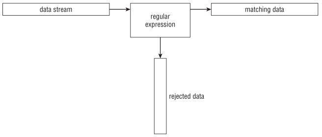
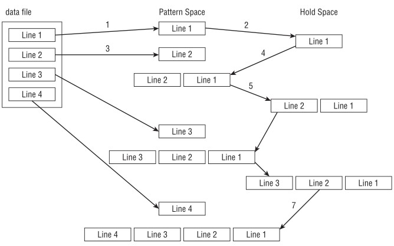

# Introducing sed 
지금까지 셸 스크립트를 사용하는 가장 흔한 기능 중 하나는 텍스트 파일 작업입니다. 로그 파일 검토, 구성 파일 읽기, 데이터 요소 처리 등 셸 스크립트는 텍스트 파일에 포함된 모든 유형의 데이터를 조작하는 단조로운 작업을 자동화하는 데 도움이 될 수 있습니다.

그러나, 셸 스크립트 명령만 사용해서 텍스트 파일 내용을 조작하려는 시도는 다소 불편할 수 있습니다. 셸 스크립트에서 어떤 형태의 데이터 조작을 수행한다면, 리눅스에서 사용할 수 있는 sed 도구에 익숙해져야 합니다. 이 도구는 모든 데이터 처리 작업을 크게 단순화할 수 있습니다.


<br><br>
## Manipulating Text
리눅스 환경에서 사용할 수 있는 다양한 편집기 프로그램으로 텍스트 파일을 편집하는 방법이 있습니다. 이런 편집기를 사용하면 간단한 명령어나 마우스 클릭만으로 텍스트 파일에 포함된 텍스트를 손쉽게 조작할 수 있습니다.

하지만, 때로는 대화형 텍스트 편집기를 실행하지 않고 즉석에서 텍스트 파일 내의 텍스트를 조작할 때가 있습니다. 이럴 때 텍스트를 자동으로 쉽게 서식 지정하거나 삽입, 수정, 삭제할 수 있는 간단한 명령줄 편집기가 있으면 유용합니다.

리눅스 시스템은 바로 이를 위한 일반적인 도구를 제공합니다. 이번 섹션은 리눅스 세계에서 가장 널리 사용되는 명령줄 편집기인 sed에 대해 설명합니다.


### Getting to know the sed editor
sed 편집기는 일반적인 대화형 텍스트 편집기와 달리 "스트림 편집기" (**S**tream **ED**itor)라고 불립니다. vim 같은 대화형 텍스트 편집기는 키보드 명령을 사용해서 데이터의 텍스트를 삽입, 삭제 또는 교체합니다. 스트림 편집기는 데이터를 처리하기 전에 미리 제공한 규칙 세트를 기반으로 데이터 스트림을 편집합니다.

sed 편집기는 명령줄에서 입력하거나 명령 파일에 저장한 명령을 기반으로 데이터 스트림의 데이터를 조작할 수 있습니다. 

sed 편집기는 다음과 같이 작업을 수행합니다:

1. 입력에서 한 번에 데이터 한 행을 읽습니다.
2. 해당 데이터를 제공된 편집기 명령과 일치 여부를 검사합니다.
3. 명령에 명시된 대로 스트림의 데이터를 변경합니다.
4. 새로운 데이터를 STDOUT 으로 출력합니다.

스트림 편집기는 데이터 한 줄에 모든 명령어 매칭을 완료한 후 다음 데이터 줄을 읽고 이 과정을 반복합니다. 스트림 내의 모든 데이터 줄을 처리한 후 스트림 편집기는 종료합니다.

명령이 줄 단위로 순차적으로 적용되기 때문에 sed 편집기는 데이터 스트림을 한 번만 통과해서 편집을 수행합니다. 이로 인해 sed 편집기는 대화형 편집기 보다 훨씬 빠르며, 파일 내의 데이터를 즉석에서 신속하게 변경할 수 있습니다.

sed 명령의 사용 형식은 다음과 같습니다:

```
sed options script file
```

`options` 매개변수를 사용하면 sed 명령어의 동작을 사용자 정의할 수 있으며, 다음과 같은 옵션이 포함됩니다.

| 옵션 | 설명 |
| --- | --- |
| `-e` | 스크립트 입력 처리 중 실행되는 명령어에 스크립트에 지정한 명령어를 추가합니다. |
| `-f` | 파일 입력 처리 중 실행되는 명령어에 파일에 지정한 명령어를 추가합니다. |
| `-n` | 각 명령에 대한 출력을 생성하지 않고 print 명령을 기다립니다. |

`script` 매개변수는 스트림 데이터에 적용할 단일 명령을 지정합니다. 하나 이상의 명령이 필요한 경우, 명령줄에서 지정하려면 `-e` 옵션을 사용하거나 별도의 파일에서 지정하려면 `-f` 옵션을 사용해야 합니다.

데이터 조작을 위한 다양한 명령이 제공됩니다. 이번 장은 sed 편집기가 사용하는 기본 명령어 일부를 살펴본 후, 다음 장에서 고급 명령어를 다룹니다.


### Defining an editor command in the command line
기본적으로 sed 편집기는 지정한 명령어를 STDIN 입력 스트림에 적용합니다. 이를 통해 데이터를 sed 편집기로 직접 파이프해서 처리할 수 있습니다. 다음은 이를 보여주는 간단한 예제입니다:

```
$ echo "This is a test" | sed 's/test/big test/'
This is a big test
$
```

이 예제는 sed 편집기의 `s` 명령어를 사용합니다. `s` 명령어는 슬래시 사이에 지정한 첫 번째 텍스트 문자열 패턴을 두 번째 텍스트 문자열로 대체합니다. 이 예제는 big test 단어가 test 단어로 대체되었습니다.

이 예제를 실행하면 결과가 거의 즉시 표시됩니다. 이것이 바로 sed 편집기를 사용할 때의 장점입니다. 대화형 편집기 중 일부가 시작되는 데 걸리는 시간과 거의 동일한 시간에 데이터에 여러 번의 편집을 수행할 수 있습니다.

물론 이런 간단한 테스트는 데이터 한 줄만 편집했습니다. 전체 데이터 파일을 편집할 때도 동일한 빠른 결과를 얻을 수 있습니다:

```
$ cat data1.txt
The quick brown fox jumps over the lazy dog.
The quick brown fox jumps over the lazy dog.
The quick brown fox jumps over the lazy dog.
The quick brown fox jumps over the lazy dog.
$
$ sed 's/dog/cat/' data1.txt
The quick brown fox jumps over the lazy cat.
The quick brown fox jumps over the lazy cat.
The quick brown fox jumps over the lazy cat.
The quick brown fox jumps over the lazy cat.
$
```

sed 명령어는 데이터를 거의 즉시 실행하고 반환합니다. 데이터의 각 줄을 처리할 때마다 결과가 표시됩니다. sed 편집기가 전체 파일 처리를 완료하기 전에 결과를 확인하기 시작합니다.

sed 편집기는 "텍스트 파일의 데이터를 수정하지 않는다" 는 점을 유의해야 합니다. 수정된 텍스트만 STDOUT 으로 출력할 뿐입니다. 텍스트 파일을 확인하면 여전히 원본 데이터가 포함되어 있습니다:

```
$ cat data1.txt
The quick brown fox jumps over the lazy dog.
The quick brown fox jumps over the lazy dog.
The quick brown fox jumps over the lazy dog.
The quick brown fox jumps over the lazy dog.
$
```

#### Using multiple editor commands in the command line
sed 명령줄에서 두 개 이상의 명령을 실행하려면 `-e` 옵션을 사용하면 됩니다:

```
$ sed -e 's/brown/green/; s/dog/cat/' data1.txt
The quick green fox jumps over the lazy cat.
The quick green fox jumps over the lazy cat.
The quick green fox jumps over the lazy cat.
The quick green fox jumps over the lazy cat.
$
```

두 명령어 모두 파일 내의 각 데이터 행에 적용됩니다. 명령어는 세미콜론으로 구분해야 하며, 명령어 끝과 세미콜론 사이에 공백이 없어야 합니다.

명령을 구분하는 데 세미콜론 대신 bash 셸의 보조 프롬프트를 사용할 수 있습니다. 단일 따옴표(`'`)를 입력하면 sed 프로그램 스크립트(sed 편집기 명령어 목록)가 열리고, 닫는 따옴표(`'`)를 입력할 때까지 bash 셀이 추가 명령을 계속 요청합니다:

```
$ sed -e '
> s/brown/green/
> s/fox/elephant/
> s/dog/cat/' data1.txt
The quick green elephant jumps over the lazy cat.
The quick green elephant jumps over the lazy cat.
The quick green elephant jumps over the lazy cat.
The quick green elephant jumps over the lazy cat.
$
```

닫는 따옴표가 나타나는 줄에서 명령어를 반드시 완료해야 합니다. bash 셸은 닫는 따옴표를 감지한 후 명령어를 처리합니다.

sed 명령어는 실행되면 텍스트 파일의 각 데이터 줄에 지정한 명령어를 차례로 적용합니다.


#### Reading editor commands from a file
마지막으로, 처리할 sed 명령어가 많다면 별도의 파일에 저장하는 것이 좀 더 쉬운 경우가 많습니다. 

sed 명령어에서 `-f` 옵션을 사용해서 저장한 파일을 실행합니다:

```
$ cat script1.sed
s/brown/green/
s/fox/elephant/
s/dog/cat/
$
$ sed -f script1.sed data1.txt
The quick green elephant jumps over the lazy cat.
The quick green elephant jumps over the lazy cat.
The quick green elephant jumps over the lazy cat.
The quick green elephant jumps over the lazy cat.
$
```

이 경우 각 명령어 뒤에 세미콜론을 붙이지 않습니다. sed 편집기는 각 줄이 별도의 명령어를 포함한다는 것을 인식합니다. 명령줄에서 명령어를 입력하는 것과 마찬가지로, sed 편집기는 지정한 파일에서 명령어를 읽어 데이터 파일의 각 줄에 적용합니다.

> [!TIP]
> sed 편집기 스크립트 파일을 bash 셸 스크립트 파일과 혼동하기 쉽습니다. 혼란을 방지하려면 sed 스크립트 파일의 확장자를 `.sed` 로 지정합니다.


<br><br>
---
# Commanding at the sed Editor Basics
sed 편집기를 성공적으로 사용하기 위한 핵심은 텍스트 편집을 맞춤 설정하는 데 도움 되는 수 많은 명령어와 형식을 숙지하는 것입니다. 이번 섹션은 sed 편집기 사용을 시작하기 위해 스크립트에 통합할 수 있는 기본 명령어와 기능 몇 가지를 설명합니다.


## Introducing more substitution options
이미`s` 명령어를 사용해서 줄의 텍스트를 새로운 텍스트로 대체하는 방법을 살펴 봤습니다. 그러나, 대체 명령어는 작업을 좀 더 편리하게 만드는 몇 가지 추가 옵션이 있습니다.


### Substituting flags
대체 명령어가 텍스트 문자열에서 일치하는 패턴을 대체하는 방식에는 주의할 점이 있습니다.

다음 예제로 어떤 일이 발생하는지 살펴봅니다:

```
$ cat data4.txt
This is a test of the test script.
This is the second test of the test script.
$
$ sed 's/test/trial/' data4.txt
This is a trial of the test script.
This is the second trial of the test script.
$
```

대체(substitute) 명령어는 여러 줄의 텍스트를 대체하는 데는 제대로 작동하지만, 기본적으로 각 줄에서 "첫 번째 발생 위치만 대체" 합니다. 텍스트의 다른 발생 위치도 substitute 명령어가 작동하도록 하려면 대체 플래그를 사용해야 합니다. 대체 플래그는 대체 명령어 문자열 뒤에 설정합니다:

```
s/pattern/replacement/flags
```

네 가지 유형의 치환 플래그를 사용할 수 있습니다:

- `숫자` 새로운 텍스트로 치환할 패턴의 발생 횟수를 나타냅니다.
- `g` 기존 텍스트의 모든 발생 위치에 새로운 텍스트를 치환함을 나타냅니다.
- `p` 원본 줄의 내용을 출력함을 나타냅니다.
- `w 파일` 치환 결과를 파일에 기록함을 의미합니다.

첫 번째 유형의 치환은 sed 편집기가 새로운 텍스트로 치환할 일치 패턴의 발생 위치를 지정할 수 있습니다:

```
$ sed 's/test/trial/2' data4.txt
This is a test of the trial script.
This is the second test of the trial script.
$
```

대체 플래그로 `2` 를 지정함으로써, sed 편집기는 각 줄에서 두 번째로 나타나는 패턴만 대체합니다. `g` 대체 플래그를 사용하면 텍스트 패턴의 모든 발생을 대체할 수 있습니다:


```
$ sed 's/test/trial/g' data4.txt
This is a trial of the trial script.
This is the second trial of the trial script.
$
```

`p` 대치 플래그는 대체 명령어에서 일치하는 패턴을 포함하는 줄을 출력합니다. 이는 주로 `-n` sed 옵션과 함께 사용됩니다:

```
$ cat data5.txt
This is a test line.
This is a different line.
$
$ sed -n 's/test/trial/p' data5.txt
This is a trial line.
$
```

`-n` 옵션은 sed 편집기의 출력을 억제합니다. 그러나, `p` 치환 플래그는 수정된 모든 줄을 출력합니다. 두 옵션을 함께 사용하면 치환 명령에 의해 수정된 줄만 출력이 생성됩니다.

`w` 치환 플래그는 동일한 출력을 생성하지만 지정한 파일에 출력을 저장합니다:

```
$ sed 's/test/trial/w test.txt' data5.txt
This is a trial line.
This is a different line.
$
$ cat test.txt
This is a trial line.
$
```

일반적으로 sed 편집기의 출력은 STDOUT 에 표시되지만, 일치하는 패턴을 포함하는 행만 지정한 출력 파일에 저장됩니다.


### Replacing characters
때로는 문자열에서 대체 패턴에 사용하기 어려운 문자를 만나기도 합니다. 리눅스 세계에서 흔한 예로는 슬래시(`/`) 문자가 있습니다.

파일에서 경로명을 대체하는 작업은 까다로울 수 있습니다. 예를 들어, /etc/passwd 파일에서 bash 셸을 C 셸로 대체하려면 다음과 같이 해야 합니다:

```
$ sed 's/\/bin\/bash/\/bin\/csh/' /etc/passwd
```

슬래시(`/`)가 문자열 구분자로 사용되기 때문에, 패턴 텍스트에 슬래시가 나타나면 이를 이스케이프하기 위해 백슬래시를 사용해야 합니다. 이는 종종 혼란과 실수를 초래합니다.

이런 문제를 해결하기 위해 sed 편집기는 대체 명령에서 문자열 구분자로 다른 문자를 선택할 수 있도록 허용합니다:

```
$ sed 's!/bin/bash!/bin/csh!' /etc/passwd
```

이 예제는 문자열 구분자로 느낌표를 사용해서 경로 이름을 훨씬 더 쉽게 읽고 이해할 수 있게 합니다.


## Using addresses
기본적으로 sed 편집기에서 사용하는 명령어는 텍스트 데이터의 모든 줄에 적용됩니다. 특정 줄이나 줄 그룹에만 명령어를 적용하려면 줄 주소를 사용해야 합니다.

sed 편집기는 두 가지 형태의 줄 주소가 있습니다:

- 숫자로 된 줄 범위
- 특정 줄을 걸러내는 텍스트 패턴

두 형태 모두 주소를 지정하는 데 동일한 형식을 사용합니다:

```
[address]command
```

특정 주소에 여러 명령을 함께 그룹화할 수도 있습니다:

```
address {
	command1
	command2
	command3
}
```

sed 편집기는 지정한 각 명령을 지정한 주소와 일치하는 행에만 적용합니다. 

다음 섹션은 sed 편집기 스크립트에서 이런 두 가지 주소 지정 기법을 모두 사용하는 방법을 보여줍니다.


### Addressing the numeric line
숫자 기반 행 주소 지정 방식을 사용할 때는 텍스트 스트림 내의 행 위치로 행을 참조합니다. 

sed 편집기는 텍스트 스트림의 첫 번째 행을 1번 행으로 지정하고, 이후 각 행에 순차적으로 번호를 부여합니다. 명령에서 지정하는 주소는 단일 행 번호이거나 시작 행 번호, 쉼표, 종료 행 번호로 지정한 행 범위일 수 있습니다. 

다음은 sed 명령이 적용될 행 번호를 지정한 예제입니다:

```
$ sed '2s/dog/cat/' data1.txt
The quick brown fox jumps over the lazy dog
The quick brown fox jumps over the lazy cat
The quick brown fox jumps over the lazy dog
The quick brown fox jumps over the lazy dog
$
```

sed 편집기는 지정한 주소에 따라 두 번째 줄의 텍스트만 수정했습니다. 

다음은 줄 주소 범위를 사용하는 또 다른 예제입니다:

```
$ sed '2,3s/dog/cat/' data1.txt
The quick brown fox jumps over the lazy dog
The quick brown fox jumps over the lazy cat
The quick brown fox jumps over the lazy cat
The quick brown fox jumps over the lazy dog
$
```

텍스트 내의 특정 지점에서 시작해서 텍스트 끝까지 이어지는 줄 그룹에 명령을 적용하려면 특수 주소인 달러 기호를 사용할 수 있습니다:

```
$ sed '2,$s/dog/cat/' data1.txt
The quick brown fox jumps over the lazy dog
The quick brown fox jumps over the lazy cat
The quick brown fox jumps over the lazy cat
The quick brown fox jumps over the lazy cat
$
```

텍스트에 포함된 데이터 줄 수를 미리 알 수 없기 때문에 달러 기호는 종종 유용하게 쓰입니다.


### Using text pattern filters
명령어가 적용되는 줄을 제한하는 다른 방법은 조금 더 복잡합니다. sed 편집기는 명령어에 적용할 줄을 필터링하는 데 사용할 텍스트 패턴을 지정할 수 있습니다.

다음은 사용 형식입니다:

```
/pattern/command
```

지정한 패턴은 반드시 슬래시로 묶어야 합니다. sed 편집기는 지정한 텍스트 패턴이 포함된 줄에만 명령을 적용합니다.

예를 들어, Samantha 사용자만 기본 셸을 변경하려면 다음 sed 명령을 사용합니다:

```
$ grep Samantha /etc/passwd
Samantha:x:502:502::/home/Samantha:/bin/bash
$
$ sed '/Samantha/s/bash/csh/' /etc/passwd
root:x:0:0:root:/root:/bin/bash
bin:x:1:1:bin:/bin:/sbin/nologin
[...]
Christine:x:501:501:Christine B:/home/Christine:/bin/bash
Samantha:x:502:502::/home/Samantha:/bin/csh
Timothy:x:503:503::/home/Timothy:/bin/bash
$
```

명령어는 일치하는 텍스트 패턴이 있는 줄에만 적용됩니다. 

위의 사용자 ID 예제처럼 특정 값을 필터링하는 데 고정 텍스트 패턴을 사용하는 것이 유용할 수 있지만, 이를 통해 수행할 수 있는 작업은 어느 정도 한계가 있습니다. sed 편집기는 텍스트 패턴에 정규 표현식이란 기능을 사용해서 상당히 복잡한 패턴을 생성할 수 있습니다.

정규 표현식을 사용하면 모든 종류의 데이터에 대응하는 고급 텍스트 패턴 일치 공식을 만들 수 있습니다. 이 공식들은 일련의 와일드카드 문자, 특수 문자 및 고정 텍스트 문자를 결합해서 거의 모든 텍스트 상황에 대응할 수 있는 간결한 패턴을 생성합니다.

정규 표현식은 셸 스크립트 프로그래밍에서 가장 어려운 부분 중 하나이며, 마지막 장에서 자세히 다룹니다.


## Grouping commands
개별 명령줄에서 두 개 이상의 명령을 수행해야 하는 경우 중괄호로 명령을 그룹화합니다. sed 편집기는 주소 줄에 나열된 각 명령을 처리합니다:

```
$ sed '2{
> s/fox/elephant/
> s/dog/cat/
> }' data1.txt
The quick brown fox jumps over the lazy dog.
The quick brown elephant jumps over the lazy cat.
The quick brown fox jumps over the lazy dog.
The quick brown fox jumps over the lazy dog.
$
```

두 명령어 모두 해당 주소에만 처리됩니다. 물론 그룹화된 명령어 앞에 주소 범위를 지정할 수도 있습니다:

```
$ sed '3,${
> s/brown/green/
> s/lazy/active/
> }' data1.txt
The quick brown fox jumps over the lazy dog.
The quick brown fox jumps over the lazy dog.
The quick green fox jumps over the active dog.
The quick green fox jumps over the active dog.
$
```

sed 편집기는 주소 범위에 속하는 모든 줄에 모든 명령을 적용합니다.


## Deleting lines
sed 편집기에서 사용할 수 있는 명령은 텍스트 치환 명령만이 아닙니다. 텍스트 스트림에서 특정 줄을 삭제할 경우 delete 명령을 사용할 수 있습니다.

삭제 명령어(`d`)는 이름 그대로 작동합니다. 지정한 주소 지정 방식을 일치하는 모든 텍스트 줄을 삭제합니다. 

하지만, 삭제 명령을 사용할 때는 주의해야 합니다. 주소 지정 방식을 포함하는 것을 잊으면 스트림 내의 모든 줄이 삭제되기 때문입니다:

```
$ cat data1.txt
The quick brown fox jumps over the lazy dog
The quick brown fox jumps over the lazy dog
The quick brown fox jumps over the lazy dog
The quick brown fox jumps over the lazy dog
$
$ sed 'd' data1.txt
$
```

delete 명령어는 특정 주소와 함께 사용할 때 가장 유용합니다. 이를 통해 데이터 스트림에서 특정 텍스트 줄을 삭제할 수 있으며, 줄 번호를 지정하거나:

```
$ cat data6.txt
This is line number 1.
This is line number 2.
This is line number 3.
This is line number 4.
$
$ sed '3d' data6.txt
This is line number 1.
This is line number 2.
This is line number 4.
$
```

또는 특정 범위의 라인이나:

```
$ sed '2,3d' data6.txt
This is line number 1.
This is line number 4.
$
```

또는 특수한 파일 끝 문자(EOL)를 사용할 수 있습니다:

```
$ sed '3,$d' data6.txt
This is line number 1.
This is line number 2.
$
```

sed 편집기의 패턴 일치 기능은 삭제 명령도 그대로 적용됩니다:

```
$ sed '/number 1/d' data6.txt
This is line number 2.
This is line number 3.
This is line number 4.
$
```

sed 편집기는 지정한 패턴과 일치하는 텍스트가 포함된 줄을 제거합니다.

> [!NOTE]
> sed 편집기는 "원본 파일을 건드리지 않는다" 는 점을 기억합니다. 삭제한 줄은 sed 편집기의 출력에서만 사라집니다. 원본 파일은 여전히 “삭제된” 줄이 포함되어 있습니다.

두 개의 텍스트 패턴을 사용해서 줄 범위를 삭제할 수도 있지만, 이 경우도 주의해야 합니다.

첫 번째 패턴은 줄 삭제 기능을 “활성화” 하고, 두 번째 패턴은 줄 삭제 기능을 “비활성화” 합니다. sed 편집기는 지정한 두 줄 사이의 모든 줄(지정한 줄 포함)을 삭제합니다:

```
$ sed '/1/,/3/d' data6.txt
This is line number 4.
$
```

또한, sed 편집기가 데이터 스트림에서 시작 패턴을 감지할 때마다 삭제 기능이 “활성화” 되므로 주의해야 합니다. 이는 예상치 못한 결과를 초래할 수 있습니다:

```
$ cat data7.txt
This is line number 1.
This is line number 2.
This is line number 3.
This is line number 4.
This is line number 1 again.
This is text you want to keep.
This is the last line in the file.
$
$ sed '/1/,/3/d' data7.txt
This is line number 4.
$
```

1 이 포함된 두 번째 행이 다시 삭제 명령을 트리거해서 데이터 스트림의 나머지 행들을 삭제했습니다. 중지 패턴이 인식되지 않았기 때문입니다.

물론, 텍스트에 전혀 나타나지 않는 중지 패턴을 지정할 경우 또 다른 문제가 발생합니다:

```
$ sed '/1/,/5/d' data7.txt
$
```

첫 번째 패턴 일치 시 삭제 기능이 “활성화” 되었으나, 종료 패턴 일치를 찾지 못했기 때문에 전체 데이터 스트림이 삭제됩니다.


## Inserting and appending text
예상할 수 있듯이, 다른 편집기와 마찬가지로 sed 편집기도 데이터 스트림에 텍스트 줄을 삽입하거나 추가할 수 있습니다. 두 동작의 차이는 혼란스러울 수 있습니다:

- 삽입 명령(`i`)은 지정한 줄 앞에 새 줄을 추가합니다.
- 추가 명령(`a`)은 지정한 줄 뒤에 새 줄을 추가합니다.

이 두 명령이 혼란스러운 점은 사용 형식 때문입니다. 단일 명령줄에서 이 명령들을 사용할 수 없습니다. 삽입하거나 추가할 줄을 별도의 줄에 단독으로 지정해야 합니다. 

이를 수행하는 형식은 다음과 같습니다:

```
sed '[address]command\
new line'
```

새 줄에 입력한 텍스트는 sed 편집기 출력에서 지정한 위치에 나타납니다. 삽입 명령을 사용할 때 텍스트가 데이터 스트림 텍스트 앞에 표시된다는 점을 기억합니다:

```
$ echo "Test Line 2" | sed 'i\Test Line 1'
Test Line 1
Test Line 2
$
```

append 명령어를 사용할 때, 텍스트는 데이터 스트림 텍스트 뒤에 나타납니다:

```
$ echo "Test Line 2" | sed 'a\Test Line 1'
Test Line 2
Test Line 1
$
```

명령줄 인터페이스 프롬프트에서 sed 편집기를 사용할 때, 새로운 데이터 줄을 입력하라는 보조 프롬프트가 표시됩니다. 이 줄에서 sed 편집기 명령을 완료해야 합니다. 종료 단일 따옴표를 입력하면 bash 셸이 명령을 처리합니다:

```
$ echo "Test Line 2" | sed 'i\
> Test Line 1'
Test Line 1
Test Line 2
$
```

데이터 스트림의 텍스트 앞이나 뒤에 텍스트를 추가하는 데는 이 방법이 효과적이지만, 데이터 스트림 내부는 어떻게 텍스트를 추가할까요?

데이터 스트림 라인 내부로 데이터를 삽입하거나 추가하려면, sed 편집기에 데이터가 표시될 위치를 알려주는 주소 지정을 사용해야 합니다. 이런 명령을 사용할 때는 단일 행 주소만 지정할 수 있습니다. 숫자 행 번호나 텍스트 패턴을 일치시킬 수 있지만, 주소 범위는 사용할 수 없습니다. 이는 논리적인데, 행 범위가 아닌 단일 행 앞이나 뒤에만 삽입하거나 추가할 수 있기 때문입니다.

다음은 데이터 스트림의 3행 앞에 새 행을 삽입하는 예제입니다:

```
$ sed '3i\
> This is an inserted line.' data6.txt
This is line number 1.
This is line number 2.
This is an inserted line.
This is line number 3.
This is line number 4.
$
```

데이터 스트림의 3번째 줄 뒤에 새 줄을 추가하는 예제는 다음과 같습니다:

```
$ sed '3a\
> This is an appended line.' data6.txt
This is line number 1.
This is line number 2.
This is line number 3.
This is an appended line.
This is line number 4.
$
```

이 명령어는 insert 명령어와 동일한 프로세스를 사용합니다. 단지 새 텍스트 줄을 지정한 줄 번호 뒤에 배치할 뿐입니다.

여러 줄로 구성된 데이터 스트림이 있고, 데이터 스트림 끝에 새 텍스트 줄을 추가하려면 달러 기호(`$`)를 사용하면 됩니다. 이 기호는 데이터의 마지막 줄을 나타냅니다:

```
$ sed '$a\
> This is a new line of text.' data6.txt
This is line number 1.
This is line number 2.
This is line number 3.
This is line number 4.
This is a new line of text.
$
```

데이터 스트림의 시작 부분에 새 줄을 추가하는 경우도 동일한 원리가 적용됩니다. 첫 번째 줄 앞에 새 줄을 삽입합니다.

하나 이상의 텍스트 줄을 삽입하거나 추가하려면, 텍스트를 삽입하거나 추가하려는 마지막 텍스트 줄에 도달할 때까지 새 텍스트의 각 줄에 백슬래시를 사용해야 합니다:

```
$ sed '1i\
> This is one line of new text.\
> This is another line of new text.' data6.txt
This is one line of new text.
This is another line of new text.
This is line number 1.
This is line number 2.
This is line number 3.
This is line number 4.
$
```

지정한 두 줄 모두 데이터 스트림에 추가됩니다.


## Changing lines
change 명령어는 데이터 스트림 내의 텍스트 줄 전체의 내용을 변경할 수 있습니다.

이 명령어는 insert 및 append 명령어와 동일한 방식으로 작동하며, 새 줄을 sed 명령어의 나머지 부분과 별도로 지정해야 합니다:

```
$ sed '3c\
> This is a changed line of text.' data6.txt
This is line number 1.
This is line number 2.
This is a changed line of text.
This is line number 4.
$
```

이 예제에서 sed 편집기는 3번째 줄의 텍스트를 변경합니다. 주소에 텍스트 패턴을 사용할 수도 있습니다:

```
$ sed '/number 3/c\
> This is a changed line of text.' data6.txt
This is line number 1.
This is line number 2.
This is a changed line of text.
This is line number 4.
$
```

텍스트 패턴 변경 명령어는 데이터 스트림 내에서 일치하는 모든 텍스트 줄을 변경합니다.

```
$ cat data8.txt
This is line number 1.
This is line number 2.
This is line number 3.
This is line number 4.
This is line number 1 again.
This is yet another line.
This is the last line in the file.
$
$ sed '/number 1/c\
> This is a changed line of text.' data8.txt
This is a changed line of text.
This is line number 2.
This is line number 3.
This is line number 4.
This is a changed line of text.
This is yet another line.
This is the last line in the file.
$
```

변경 명령어에서 주소 범위를 사용할 수 있지만, 결과는 예상과 다를 수 있습니다:

```
$ sed '2,3c\
> This is a new line of text.' data6.txt
This is line number 1.
This is a new line of text.
This is line number 4.
$
```

sed 편집기는 텍스트가 포함된 두 줄 모두를 변경하는 대신, 단일 텍스트 줄을 사용해서 두 줄 모두를 대체합니다.


## Transforming characters
변환 명령어(`y`)는 단일 문자에 작동하는 유일한 sed 편집기 명령어입니다.

변환 명령어는 다음 형식을 사용합니다:

```
[address]y/inchars/outchars/
```

transform 명령어는 inchars 값과 outchars 값 간의 일대일 매핑을 수행합니다. inchars 의 첫 번째 문자는 outchars 의 첫 번째 문자로 변환됩니다. inchars 의 두 번째 문자는 outchars 의 두 번째 문자로 변환됩니다. 이 매핑은 지정한 문자 전체 길이에 걸쳐 계속됩니다. inchars 와 outchars 의 길이가 같지 않으면 sed 편집기는 오류 메시지를 생성합니다.

다음은 transform 명령어 사용의 간단한 예제입니다:

```
$ sed 'y/123/789/' data8.txt
This is line number 7.
This is line number 8.
This is line number 9.
This is line number 4.
This is line number 7 again.
This is yet another line.
This is the last line in the file.
$
```

출력에서 볼 수 있듯이, inchars 패턴에 지정한 각 문자 인스턴스는 outchars 패턴의 동일한 위치의 문자로 대체됩니다.

transform 명령어는 전역 명령어입니다. 즉, 발생 빈도와 관계없이 텍스트 줄에서 발견되는 모든 문자에 자동으로 변환을 수행합니다:

```
$ echo "This 1 is a test of 1 try." | sed 'y/123/456/'
This 4 is a test of 4 try.
$
```

sed 편집기는 텍스트 줄에서 일치하는 문자 1의 두 인스턴스를 모두 변환했습니다.

특정 문자 발생에 대한 변환을 제한할 수 없습니다.


## Printing revisited
“추가 대체 옵션 소개” 섹션에서 sed 편집기가 변경한 줄을 표시하기 위해 대체 명령어와 함께 `p`플래그를 사용하는 방법을 설명했습니다. 

또한 데이터 스트림에서 정보를 출력하는 데 사용할 수 있는 세 가지 명령어가 있습니다:

- 텍스트 줄을 출력하는 `p` 명령어
- 줄 번호를 출력하는 등호(`=`) 명령어
- 줄을 나열하는 `l` (소문자 L) 명령어

다음 섹션은 sed 편집기에서 이 세 가지 출력 명령어를 살펴봅니다.


### Printing lines
대체 명령어의 `p` 플래그와 마찬가지로, `p` 명령어는 sed 편집기 출력에 한 줄을 인쇄합니다. 이 명령어 자체는 그다지 흥미롭지 않습니다:

```
$ echo "this is a test" | sed 'p'
this is a test
this is a test
$
```

이 명령어는 이미 존재하는 데이터 텍스트를 출력할 뿐입니다.

print 명령어의 가장 일반적인 용도는 텍스트 패턴과 일치하는 텍스트를 포함하는 줄을 출력하는 것입니다:

```
$ cat data6.txt
This is line number 1.
This is line number 2.
This is line number 3.
This is line number 4.
$
$ sed -n '/number 3/p' data6.txt
This is line number 3.
$
```

명령줄에서 `-n` 옵션을 사용하면 다른 모든 줄을 생략하고 일치하는 텍스트 패턴이 포함된 줄만 출력할 수 있습니다. 이는 데이터 스트림에서 일부 줄만 빠르게 출력하는 방법으로 활용할 수 있습니다:


```
$ sed -n '2,3p' data6.txt
This is line number 2.
This is line number 3.
$
```

print 명령어는 substitution 이나 change 명령어처럼 라인이 변경되기 전에 확인할 때도 사용할 수 있습니다. 변경 전 라인을 표시하는 스크립트를 만들 수 있습니다:

```
$ sed -n '/3/{
> p
> s/line/test/p
> }' data6.txt
This is line number 3.
This is test number 3.
$
```

이 sed 편집기 명령어는 숫자 3이 포함된 줄을 검색해서 두 가지 명령을 실행합니다. 먼저 `p` 명령으로 해당 줄의 원본 버전을 출력하고, 이어서 `s` 명령으로 텍스트를 치환하며 `p` 플래그를 함께 사용해서 결과 텍스트를 출력합니다. 출력 결과는 원본 줄 텍스트와 새 줄 텍스트가 모두 표시됩니다.


### Printing line numbers
등호(`=`) 명령어는 데이터 스트림 내의 해당 줄의 현재 줄 번호를 출력합니다. 줄 번호는 데이터 스트림 내의 개행 문자를 기준으로 결정됩니다.

데이터 스트림에 개행 문자가 나타날 때마다 sed 편집기는 이를 텍스트 줄의 종료로 간주합니다:

```
$ cat data1.txt
The quick brown fox jumps over the lazy dog.
The quick brown fox jumps over the lazy dog.
The quick brown fox jumps over the lazy dog.
The quick brown fox jumps over the lazy dog.
$
$ sed '=' data1.txt
1
The quick brown fox jumps over the lazy dog.
2
The quick brown fox jumps over the lazy dog.
3
The quick brown fox jumps over the lazy dog.
4
The quick brown fox jumps over the lazy dog.
$
```

sed 편집기는 실제 텍스트 줄 앞에 줄 번호를 출력합니다. 데이터 스트림에서 특정 텍스트 패턴을 검색할 때 등호 명령어는 유용합니다:

```
$ sed -n '/number 4/{
> =
> p
> }' data6.txt
4
This is line number 4.
$
```

`-n` 옵션을 사용하면 sed 편집기가 일치하는 텍스트 패턴을 포함하는 줄의 줄 번호와 텍스트를 모두 표시하도록 처리할 수 있습니다.


### Listing lines
list 명령어(`l`)는 데이터 스트림 내의 텍스트와 비표시 문자 모두를 출력할 수 있습니다. 모든 비표시 문자는 백슬래시(`\`)로 시작하는 8진수 값 또는 일반적인 비표시 문자에 대한 표준 C 스타일 명명법(예: 탭 문자의 경우 `\t`)을 사용해서 표시됩니다:

```
$ cat data9.txt
This line contains tabs.
$
$ sed -n 'l' data9.txt
This\tline\tcontains\ttabs.$
$
```

탭 문자 위치는 `\t` 표기법으로 표시됩니다. 줄 끝의 달러 기호는 줄바꿈 문자를 나타냅니다. 이스케이프 문자가 포함된 데이터 스트림이 있는 경우, list 명령어는 필요한 경우 8진 코드를 사용해서 이를 표시합니다:

```
$ cat data10.txt
This line contains an escape character.
$
$ sed -n 'l' data10.txt
This line contains an escape character. \a$
$
```

data10.txt 파일에는 벨 소리를 생성하는 이스케이프 제어 코드가 포함되어 있습니다. 텍스트 파일을 표시하기 위해 cat 명령어를 사용할 때는 이스케이프 제어 코드가 표시되지 않고 (스피커가 켜져 있다면) 소리만 들립니다. 그러나, list 명령어를 사용하면 사용된 이스케이프 제어 코드를 표시할 수 있습니다.


## Using files with sed
대체 명령어는 파일 작업을 가능하게 하는 플래그가 포함되어 있습니다. 텍스트를 대체하지 않고도 이를 수행할 수 있는 일반적인 sed 편집기 명령어도 있습니다.


### Writing to a file
`w` 명령어는 파일을 작성하는 데 사용됩니다. `w` 명령어의 형식은 다음과 같습니다:

```
[address]w filename
```

파일명은 상대 경로나 절대 경로로 지정할 수 있지만, 어느 경우든 sed 편집기를 실행하는 사용자는 해당 파일에 대한 쓰기 권한이 있어야 합니다. 주소는 sed에서 사용하는 모든 유형의 주소 지정 방법(예: 단일 행 번호, 텍스트 패턴, 행 번호 범위 또는 텍스트 패턴 범위)일 수 있습니다.

다음은 데이터 스트림의 처음 두 줄만 텍스트 파일에 출력하는 예제입니다:

```
$ sed '1,2w test.txt' data6.txt
This is line number 1.
This is line number 2.
This is line number 3.
This is line number 4.
$
$ cat test.txt
This is line number 1.
This is line number 2.
$
```

물론, STDOUT 에 줄을 표시하지 않으려면 sed 명령에 `-n` 옵션을 사용할 수 있습니다.

이 도구는 메일링 리스트 같이 공통 텍스트 값을 기준으로 마스터 파일에서 데이터 파일을 생성할 때 유용합니다:

```
$ cat data11.txt
Blum, R Browncoat
McGuiness, A Alliance
Bresnahan, C Browncoat
Harken, C Alliance
$
$ sed -n '/Browncoat/w Browncoats.txt' data11.txt
$
$ cat Browncoats.txt
Blum, R Browncoat
Bresnahan, C Browncoat
$
```

sed 편집기는 텍스트 패턴을 포함하는 데이터 행만 대상 파일에 기록합니다.


### Reading data from a file
sed 명령줄에서 데이터 스트림에 데이터를 삽입하고 텍스트를 추가하는 방법은 이미 살펴봤습니다. read 명령어(`r`)를 사용하면 별도의 파일에 포함된 데이터를 삽입할 수 있습니다.

다음은 read 명령어의 형식입니다:

```
[address]r filename
```

파일명 매개변수는 데이터가 포함된 파일의 절대 경로명 또는 상대 경로명을 지정합니다.

read 명령어는 주소 범위를 사용할 수 없습니다! 단일 행 번호 또는 텍스트 패턴 주소만 지정할 수 있습니다. sed 편집기는 주소 뒤에 파일의 텍스트를 삽입합니다.

```
$ cat data12.txt
This is an added line.
This is the second added line.
$
$ sed '3r data12.txt' data6.txt
This is line number 1.
This is line number 2.
This is line number 3.
This is an added line.
This is the second added line.
This is line number 4.
$
```

sed 편집기는 데이터 파일의 모든 텍스트 라인을 데이터 스트림에 삽입합니다. 텍스트 패턴 주소를 사용할 때도 동일한 기법이 적용됩니다:

```
$ sed '/number 2/r data12.txt' data6.txt
This is line number 1.
This is line number 2.
This is an added line.
This is the second added line.
This is line number 3.
This is line number 4.
$
```

데이터 스트림 끝에 텍스트를 추가하려면 달러 기호 주소 기호를 사용하면 됩니다:

```
$ sed '$r data12.txt' data6.txt
This is line number 1.
This is line number 2.
This is line number 3.
This is line number 4.
This is an added line.
This is the second added line.
$
```

read 명령어의 멋진 활용법은 delete 명령어와 함께 사용해서 파일 내의 자리 표시자를 다른 파일의 데이터로 대체하는 것입니다. 

예를 들어, 다음과 같은 형식의 양식이 텍스트 파일에 저장되어 있다고 가정해 보겠습니다:

```
$ cat notice.std
Would the following people:
LIST
please report to the ship's captain.
$
```

양식 편지는 사람 목록 대신 일반적인 자리 표시자 LIST 를 사용합니다. 자리 표시자 뒤에 사람 목록을 삽입하려면 read 명령을 사용합니다. 그러나, 이 경우도 출력에 자리 표시자 텍스트가 그대로 남아 있습니다. 이를 제거하려면 delete 명령을 사용합니다. 결과는 다음과 같습니다:


```
$ sed '/LIST/{
> r data11.txt
> d
> }' notice.std
Would the following people:
Blum, R Browncoat
McGuiness, A Alliance
Bresnahan, C Browncoat
Harken, C Alliance
please report to the ship's captain.
$
```

이제 자리 표시자 텍스트는 데이터 파일의 이름 목록으로 대체됩니다.


## Summary
셸 스크립트는 자체적으로 많은 작업을 수행할 수 있지만, 셸 스크립트만으로 데이터를 조작하는 것은 종종 어렵습니다. 리눅스는 텍스트 데이터 처리를 돕기 위해 편리한 유틸리티를 제공합니다. sed 편집기는 데이터를 읽으면서 실시간으로 빠르게 처리하는 스트림 편집기입니다. sed 편집기에 데이터에 적용할 편집 명령어 목록을 제공해야 합니다.

sed 프로그램 사용의 핵심은 정규 표현식 활용법을 아는 것입니다. 정규 표현식은 텍스트 파일에서 데이터를 추출하고 조작하기 위한 맞춤형 필터를 만드는 핵심입니다.

다음 장은 흔히 오해받는 정규 표현식의 세계를 깊이 있게 다루며, 모든 유형의 데이터를 조작하기 위한 정규 표현식 구축 방법을 보여줍니다.


<br><br>
---
# Regular Expressions
셸 스크립트에서 sed 편집기 프로그램을 성공적으로 활용하는 핵심은 정규 표현식 사용법에 익숙해지는 것입니다. 이는 항상 쉬운 일이 아닙니다. 방대한 데이터에서 특정 데이터를 필터링하려는 시도는 복잡해질 수 있으며(실제로 복잡해집니다.) 이번 장은 필요한 데이터만을 걸러낼 수 있는 정규 표현식을 sed 편집기에서 생성하는 방법을 설명합니다.


## What Are Regular Expressions?
정규 표현식을 이해하기 위한 첫 번째 단계는 정확히 무엇인지 정의하는 것입니다. 이번 섹션은 정규 표현식이 무엇인지 설명하고 리눅스가 정규 표현식을 어떻게 사용하는지 기술합니다.


### A defi nition
정규 표현식은 텍스트를 필터링하기 위해 Linux 유틸리티가 사용하는 패턴 템플릿입니다. Linux 유틸리티(예: sed 편집기나 gawk 프로그램)는 데이터가 유틸리티로 유입될 때 정규 표현식 패턴과 데이터를 비교합니다. 데이터가 패턴과 일치하면 처리 대상으로 받아들여지고, 일치하지 않으면 거부됩니다. 이 과정은 다음 그림에 설명되어 있습니다.

정규 표현식 패턴은 와일드카드 문자를 사용해서 데이터 스트림 내의 하나 이상의 문자를 나타냅니다. 리눅스는 알 수 없는 데이터를 나타내기 위해 와일드카드 문자를 지정할 수 있는 경우가 많습니다. 파일 및 디렉터리 목록을 표시하는 리눅스 `ls` 명령어에서 와일드카드 문자 사용 예제는 이미 알고 있습니다.



별표(`*`) 와일드카드 문자를 사용하면 특정 기준에 맞는 파일만 나열할 수 있습니다. 예를 들어:

```
$ ls -al da*
-rw-r--r-- 1 rich rich 45 Nov 26 12:42 data
-rw-r--r-- 1 rich rich 25 Dec 4 12:40 data.tst
-rw-r--r-- 1 rich rich 180 Nov 26 12:42 data1
-rw-r--r-- 1 rich rich 45 Nov 26 12:44 data2
-rw-r--r-- 1 rich rich 73 Nov 27 12:31 data3
-rw-r--r-- 1 rich rich 79 Nov 28 14:01 data4
-rw-r--r-- 1 rich rich 187 Dec 4 09:45 datatest
$
```

`da*` 매개변수는 `ls` 명령어가 이름이 da 로 시작하는 파일만 나열하도록 지시합니다. 파일명에서 da 뒤에는 임의의 문자(없을 수도 있음)가 올 수 있습니다. `ls` 명령어는 디렉토리 내의 모든 파일에 대한 정보를 읽지만 와일드카드 문자와 일치하는 파일만 표시합니다.

정규 표현식의 와일드카드 패턴도 이와 유사한 방식으로 작동합니다. 정규 표현식 패턴은 텍스트 또는 특수 문자를 포함하며, 이는 sed 편집기 프로그램이 데이터를 일치시킬 때 따를 템플릿을 정의합니다. 정규 표현식에서 다양한 특수 문자를 사용해서 데이터를 필터링할 특정 패턴을 정의할 수 있습니다.


### Types of regular expressions
정규 표현식 사용의 가장 큰 문제는 정규 표현식은 단일 세트가 아니란 점입니다. 리눅스 환경은 서로 다른 애플리케이션이 각기 다른 유형의 정규 표현식을 사용합니다. 여기는 프로그래밍 언어(Java, Perl, Python), 리눅스 유틸리티(sed 편집기, grep 유틸리티 등), 주류 애플리케이션(MySQL 및 PostgreSQL 데이터베이스 서버 등)과 같이 매우 다양한 애플리케이션이 포함됩니다.

정규 표현식은 정규 표현식 엔진으로 구현됩니다. 정규 표현식 엔진은 정규 표현식 패턴을 해석하고 해당 패턴을 사용해서 텍스트를 매칭하는 기반 소프트웨어입니다.

리눅스 세계는 두 가지 인기 있는 정규 표현식 엔진이 있습니다:

- POSIX 기본 정규 표현식(BRE) 엔진
- POSIX 확장 정규 표현식(ERE) 엔진

대부분의 리눅스 유틸리티는 최소한 POSIX BRE 엔진 사양을 준수하며, 이 엔진이 정의하는 모든 패턴 기호를 인식합니다. 안타깝게도 일부 유틸리티(예: sed 편집기)는 BRE 엔진 사양의 하위 집합만 준수합니다. 이는 속도 제약 때문입니다. sed 편집기는 데이터 스트림의 텍스트를 가능한 한 빠르게 처리하려 하기 때문입니다.

POSIX ERE 엔진은 텍스트 필터링을 위해 정규 표현식에 의존하는 프로그래밍 언어에서 흔히 발견됩니다. 이 엔진은 고급 패턴 기호와 함께 숫자, 단어, 영숫자 문자 일치 같은 일반적인 패턴을 위한 특수 기호를 제공합니다. 대표적으로 gawk 프로그램은 정규 표현식 패턴 처리에 ERE 엔진을 사용합니다.

정규 표현식을 구현하는 방법이 다양하기 때문에, 가능한 모든 정규 표현식을 단일하고 간결하게 설명하기란 어렵습니다. 다음 섹션은 가장 흔히 발견되는 정규 표현식을 다루고, 이를 sed 편집기 프로그램에서 사용하는 방법을 보여줍니다.


## Defining BRE Patterns
가장 기본적인 BRE 패턴은 데이터 스트림 내의 텍스트 문자 일치입니다. 이번 섹션은 정규 표현식 패턴에서 텍스트를 정의하는 방법과 결과에서 기대할 수 있는 사항을 보여줍니다.


### Plain text
이전 장에서 sed 편집기 프로그램으로 표준 텍스트 문자열로 데이터를 필터링하는 방법을 설명했습니다. 기억을 되살리기 위한 예제를 다시 살펴보겠습니다:

```
$ echo "This is a test" | sed -n '/test/p'
This is a test
$ echo "This is a test" | sed -n '/trial/p'
$
$ echo "This is a test" | gawk '/test/{print $0}'
This is a test
$ echo "This is a test" | gawk '/trial/{print $0}'
$
```
첫 번째 패턴은 단일 단어인 test 를 정의합니다. sed 편집기의 스크립트는 print 명령어를 사용해서 정규 표현식 패턴과 일치하는 모든 줄을 출력합니다. echo 문은 텍스트 문자열에 “test” 단어를 포함하므로 데이터 스트림 텍스트가 정의된 정규 표현식 패턴과 일치하고, sed 편집기가 해당 줄을 표시합니다.

두 번째 패턴 역시 단일 단어, 이번에는 “trial” 이란 단어를 정의합니다. echo 문은 텍스트 문자열에 해당 단어가 포함되지 않으므로 정규 표현식 패턴이 일치하지 않고 sed 편집기는 해당 줄을 출력하지 않습니다.

이미 눈치채겠지만, 정규 표현식은 패턴이 데이터 스트림 어느 위치에 나타나든 전혀 상관하지 않습니다! 패턴이 몇 번 나타나는지도 중요하지 않습니다. 정규 표현식이 문자열 어디든 패턴과 일치시킬 수 있으면, 해당 문자열을 이를 사용하는 Linux 유틸리티로 전달합니다.

여기서 핵심은 정규 표현식 패턴을 데이터 스트림 텍스트와 일치시키는 것입니다. 정규 표현식이 패턴 일치에 매우 까다롭다는 점을 기억하는 것이 중요합니다. 가장 먼저 기억할 규칙은 "정규 표현식 패턴은 대소문자를 구분한다" 는 것입니다. 이는 문자의 "대소문자가 정확히 일치하는 패턴만 일치시킨다" 는 의미입니다:

```
$ echo "This is a test" | sed -n '/this/p'
$
$ echo "This is a test" | sed -n '/This/p'
This is a test
$
```

첫 번째 시도는 텍스트 문자열에 “this” 라는 단어가 모두 소문자로 나타나지 않아서 일치하지 못했지만, 두 번째 시도는 패턴에 대문자를 사용했기 때문에 완벽하게 작동했습니다.

정규 표현식은 반드시 전체 단어만 국한할 필요는 없습니다. 정의한 텍스트가 데이터 스트림 어느 위치든 나타나면 정규 표현식은 다음과 같이 일치합니다:

```
$ echo "The books are expensive" | sed -n '/book/p'
The books are expensive
$
```

데이터 스트림의 텍스트가 books 임에도 불구하고, 스트림의 데이터는 정규 표현식 book 이 포함되어 있으므로 정규 표현식 패턴이 데이터와 일치합니다. 물론 반대로 시도하면 정규 표현식이 실패합니다:

```
$ echo "The book is expensive" | sed -n '/books/p'
$
```

정규 표현식 전체 텍스트가 데이터 스트림에 나타나지 않아서 일치가 실패했으며 sed 편집기가 해당 텍스트를 표시하지 않았습니다.

정규 표현식에서 단일 텍스트 단어만 국한할 필요도 없습니다. 텍스트 문자열에 공백과 숫자를 포함할 수 있습니다:

```
$ echo "This is line number 1" | sed -n '/ber 1/p'
This is line number 1
$
```

공백은 정규 표현식에서 다른 일반 문자처럼 취급됩니다:

```
$ echo "This is line number1" | sed -n '/ber 1/p'
$
```

정규 표현식에서 공백을 정의하면 데이터 스트림에 반드시 나타나야 합니다. 연속된 여러 공백에 일치하는 정규 표현식 패턴을 만들 수도 있습니다:

```
$ cat data1
This is a normal line of text.
This is a line with too many spaces.
$ sed -n '/ /p' data1
This is a line with too many spaces.
$
```

단어 사이에 두 개의 공백이 있는 줄은 정규 표현식 패턴과 일치합니다. 이는 텍스트 파일에서 공백 문제를 잡아내는 훌륭한 방법입니다!


### Special characters
정규 표현식 패턴에서 텍스트 문자열을 사용할 때 주의할 점이 있습니다. 정규 표현식에서 텍스트 문자를 정의할 때 몇 가지 예외 문자가 존재합니다. 정규 표현식 패턴은 특정 문자에 특별한 의미를 부여합니다. 이런 문자를 텍스트 패턴에 사용하면 예상한 결과를 얻지 못할 수 있습니다.

정규 표현식이 인식하는 특수 문자는 다음과 같습니다:

```
.*[]^${}\+?|()
```

이번 장이 진행됨에 따라 정규 표현식에서 이런 특수 문자가 정확히 어떤 역할을 처리하는지 알게 됩니다. 하지만, 지금은 텍스트 패턴에서 이런 문자를 그대로 사용할 수 없다는 점만 기억합니다.

특수 문자 중 하나를 텍스트 문자로 사용하려면 이스케이프 처리해야 합니다. 특수 문자를 이스케이프 처리할 때는 그 앞에 특수 문자를 추가해서 정규 표현식 엔진에 다음 문자를 일반 텍스트 문자로 해석해야 함을 알려줍니다. 이를 수행하는 특수 문자는 백슬래시 문자(`\`)입니다.

예를 들어, 텍스트에서 달러 기호를 검색하려면 해당 기호 앞에 백슬래시 문자를 붙입니다.

```
$ cat data2
The cost is $4.00
$ sed -n '/\$/p' data2
The cost is $4.00
$
```

백슬래시는 특수 문자이므로 정규 표현식 패턴에서 사용하려면 이 역시 이스케이프 처리해야 하며, 이로 인해 이중 백슬래시가 생성됩니다:

```
$ echo "\ is a special character" | sed -n '/\\/p'
\ is a special character
$
```

마지막으로, 슬래시(`/`)는 정규 표현식 특수 문자는 아니지만, sed 편집기에서 정규 표현식 패턴에 사용하면 오류가 발생합니다:

```
$ echo "3 / 2" | sed -n '///p'
sed: -e expression #1, char 2: No previous regular expression
$
```

슬래시를 사용하려면, 그 역시 이스케이프 처리해야 합니다:

```
$ echo "3 / 2" | sed -n '/\//p'
3 / 2
$
```

이제 sed 편집기가 정규 표현식 패턴을 올바르게 해석할 수 있으며, 모든 것이 정상입니다.


### Anchor characters
“일반 텍스트” 섹션에서 설명한 바와 같이, 기본적으로 정규 표현식 패턴을 지정할 때 해당 패턴이 데이터 스트림의 어느 위치에 나타나더라도 일치합니다. 두 가지 특수 문자를 사용해서 패턴을 데이터 스트림 내 행의 시작 또는 끝 부분에 고정시킬 수 있습니다.


#### Starting at the beginning
캐럿 문자(`^`)는 데이터 스트림 내 텍스트 줄의 시작 부분에서 시작하는 패턴을 정의합니다. 해당 패턴이 텍스트 줄의 시작 부분 이외의 위치에 있으면 정규 표현식 패턴은 실패합니다.

캐럿 문자를 사용하려면 정규 표현식에서 지정한 패턴 앞에 배치해야 합니다:

```
$ echo "The book store" | sed -n '/ ^ book/p'
$
$ echo "Books are great" | sed -n '/ ^ Book/p'
Books are great
$
```

캐럿 앵커 문자는 각 데이터 행의 시작 부분에서 패턴을 확인합니다. 이는 줄바꿈 문자에 의해 결정됩니다:

```
$ cat data3
This is a test line.
this is another test line.
A line that tests this feature.
Yet more testing of this
$ sed -n '/ ^ this/p' data3
this is another test line.
$
```

패턴이 새 줄의 시작 부분에 나타나면 캐럿 앵커가 이를 포착합니다.

캐럿 문자를 패턴의 시작 부분 이외의 위치에 놓으면, 특수 문자가 아닌 일반 문자처럼 작동합니다:

```
$ echo "This  ^ is a test" | sed -n '/s  ^ /p'
This ^ is a test
$
```

캐럿 문자가 정규 표현식 패턴에서 마지막에 나열했기 때문에, sed 편집기는 이를 텍스트를 일치시키는 일반 문자로 사용합니다.

> [!NOTE]
> 캐럿 문자로만 구성된 정규 표현식 패턴을 지정할 때는 백슬래시로 이스케이프 처리할 필요는 없습니다. 그러나, 먼저 패턴에 캐럿 문자를 지정한 후 추가 텍스트를 포함하는 경우는 캐럿 문자 앞에 이스케이프 문자를 사용해야 합니다.


#### Looking for the ending
줄의 시작 부분에서 패턴을 찾는 것의 반대는 줄의 끝 부분에서 패턴을 찾는 것입니다. 달러 기호(`$`) 특수 문자는 끝 앵커를 정의합니다. 데이터 줄이 텍스트 패턴으로 끝나야 함을 나타내려면 텍스트 패턴 뒤에 이 특수 문자를 추가합니다:

```
$ echo "This is a good book" | sed -n '/book$/p'
This is a good book
$ echo "This book is good" | sed -n '/book$/p'
$
```

종결 텍스트 패턴의 문제는 찾는 내용을 주의 깊게 살펴야 한다는 점입니다:

```
$ echo "There are a lot of good books" | sed -n '/book$/p'
$
```

줄 끝에서 “book” 이란 단어를 복수형으로 만드는 것은 데이터 스트림에 book 이 존재함에도 불구하고 정규 표현식 패턴과 더 이상 일치하지 않음을 의미합니다. 패턴이 일치하려면 텍스트 패턴이 줄의 마지막에 위치해야 합니다.


#### Combining anchors
일부 상황에서 시작 앵커와 종료 앵커를 동일한 행에서 결합할 수 있습니다.

첫 번째 상황은 특정 텍스트 패턴만 포함하는 데이터 행을 찾는다고 가정해 보겠습니다:

```
$ cat data4
this is a test of using both anchors
I said this is a test
this is a test
I'm sure this is a test.
$ sed -n '/ ^ this is a test$/p' data4
this is a test
$
```

sed 편집기는 지정한 텍스트 외에 다른 텍스트를 포함하는 줄을 무시합니다.

두 번째 상황은 처음에는 다소 이상해 보일 수 있지만 매우 유용합니다. 텍스트가 없는 패턴에 두 앵커를 결합하면 데이터 스트림에서 빈 줄을 필터링할 수 있습니다.

다음 예제를 살펴보겠습니다:

```
$ cat data5
This is one test line.

This is another test line.
$ sed '/ ^ $/d' data5
This is one test line.
This is another test line.
$
```

정의된 정규 표현식 패턴은 줄의 시작과 끝 사이에 아무 내용도 없는 줄을 찾습니다. 즉, 빈 줄은 두 개 줄바꿈 문자 사이에 텍스트가 없으므로 정규 표현식 패턴과 일치합니다. sed 편집기는 `d` 삭제 명령으로 정규 표현식 패턴과 일치하는 줄을 삭제함으로써 텍스트의 모든 빈 줄을 제거합니다. 이는 문서에서 빈 줄을 제거하는 효과적인 방법입니다.


### The dot character
점(`.`) 특수 문자는 줄바꿈 문자를 제외한 모든 단일 문자와 일치하는 데 사용됩니다. 그러나, 점 문자는 반드시 문자 하나와 일치해야 합니다. 점 위치에 문자가 없으면
패턴은 실패합니다.

정규 표현식 패턴에서 점 문자를 사용하는 몇 가지 예를 살펴보겠습니다:

```
$ cat data6
This is a test of a line.
The cat is sleeping.
That is a very nice hat.
This test is at line four.
at ten o'clock we'll go home.
$ sed -n '/.at/p' data6
The cat is sleeping.
That is a very nice hat.
This test is at line four.
$
```

첫 번째 줄이 실패한 이유와 두 번째, 세 번째 줄이 통과한 이유는 쉽게 알아낼 수 있습니다. 

하지만, 네 번째 줄은 조금 까다롭습니다. at 을 일치시켰지만, 점 문자(.)를 일치시킬 앞의 문자가 없다는 점에 유의합니다. 그런데, 있습니다! 정규 표현식에서 공백도 문자로 간주하므로,  at 앞의 공백이 패턴과 일치합니다. 다섯 번째 줄은 이를 증명하는데, 줄 맨 앞에  at 을 배치함으로써 패턴과 일치하지 않도록  처리합니다.

### Character classes
점(`.`) 특수 문자는 문자 위치를 어떤 문자든 일치시키는 데는 탁월하지만, 일치시킬 문자를 제한하려면 어떻게 할까요? 이를 정규 표현식에서 "문자 클래스" 라고 합니다.

텍스트 패턴 내의 위치와 일치할 문자 클래스를 정의할 수 있습니다. 데이터 스트림에 문자 클래스의 문자 중 하나가 포함되면 패턴과 일치합니다.

문자 클래스를 정의하려면 대괄호를 사용합니다. 대괄호 안에는 클래스에 포함할 모든 문자를 넣어야 합니다. 그런 다음 패턴 내에서 다른 와일드카드 문자처럼 전체 클래스를 사용합니다. 처음에는 익숙해지기까지 시간이 좀 걸리지만, 익숙해지면 꽤 놀라운 결과를 만들어낼 수 있습니다.

다음은 문자 클래스를 만드는 예제입니다:

```
$ sed -n '/[ch]at/p' data6
The cat is sleeping.
That is a very nice hat.
$
```

점 특수 문자 예제와 동일한 데이터 파일을 사용해서 다른 결과를 도출했습니다. 이번에는 at 이란 단어만 포함된 줄을 걸러내는 데 성공했습니다. 이 패턴에 맞는 단어는 cat 과 hat 뿐입니다. 또한, at 으로 시작하는 줄도 일치하지 않았다는 점에 유의합니다. 문자 클래스 내에 해당 위치에 맞는 문자가 반드시 존재해야 합니다.

문자가 어떤 경우에 해당하는지 확실치 않을 때 문자 클래스가 유용합니다:

```
$ echo "Yes" | sed -n '/[Yy]es/p'
Yes
$ echo "yes" | sed -n '/[Yy]es/p'
yes
$
```

단일 표현식에서 하나 이상의 문자 클래스를 사용할 수 있습니다:

```
$ echo "Yes" | sed -n '/[Yy][Ee][Ss]/p'
Yes
$ echo "yEs" | sed -n '/[Yy][Ee][Ss]/p'
yEs
$ echo "yeS" | sed -n '/[Yy][Ee][Ss]/p'
yeS
$
```

정규 표현식은 세 개의 문자 위치를 모두 포함하도록 대소문자를 모두 커버하는 세 개의 문자 클래스를 사용했습니다.

문자 클래스에 문자만 포함할 필요는 없습니다. 숫자도 사용할 수 있습니다:

```
$ cat data7
This line doesn't contain a number.
This line has 1 number on it.
This line a number 2 on it.
This line has a number 4 on it.
$ sed -n '/[0123]/p' data7
This line has 1 number on it.
This line a number 2 on it.
$
```

정규 표현식 패턴은 숫자 0, 1, 2 또는 3을 포함하는 모든 줄과 일치합니다. 그 외의 숫자는 무시되며, 숫자가 포함되지 않은 줄도 무시됩니다.

문자 클래스를 결합해서 전화번호나 우편번호처럼 올바르게 형식화된 숫자를 확인할 수 있습니다. 그러나, 특정 형식과 일치시킬 때는 주의해야 합니다.

다음은 우편번호 일치에 실패한 예제입니다:

```
$ cat data8
60633
46201
223001
4353
22203
$ sed -n '
>/[0123456789][0123456789][0123456789][0123456789][0123456789]/p
>' data8
545
Chapter 20: Regular Expressions
20
60633
46201
223001
22203
$
```

이것은 여러분이 생각했던 결과를 만들어내지 못했을 수도 있습니다. 마지막 문자 클래스에 일치시킬 문자가 없었기 때문에, 우편번호로 너무 짧은 숫자를 걸러내는 데는 훌륭한 역할을 했습니다. 그러나, 다섯 개의 문자 클래스만 정의했음에도 불구하고, 여섯 자리 숫자도 여전히 통과시켰습니다.

정규 표현식 패턴은 데이터 스트림 텍스트 어디서나 발견될 수 있다는 점을 기억합니다. 일치하는 패턴 문자 외에도 항상 추가 문자가 있을 수 있습니다.

오로지 다섯 자리 숫자만 일치시키려면, 공백으로 경계를 구분하거나 이 예제처럼 행의 시작과 끝에 위치함을 표시하는 등 어떤 방식으로든 숫자를 구분해야 합니다:


```
$ sed -n '
> / ^ [0123456789][0123456789][0123456789][0123456789][0123456789]$/p
> ' data8
60633
46201
22203
$
```

이제 훨씬 나아졌습니다! 이 장 후반부에서 이를 보다 간소화하는 방법을 살펴보겠습니다.

문자 클래스의 흔한 용도 중 하나는 사용자 입력 양식에서 입력된 데이터의 철자가 틀릴 수 있는 단어를 파싱하는 것입니다. 데이터에서 흔히 발생하는 오타를 허용하는
정규 표현식을 쉽게 만들 수 있습니다:

```
$ cat data9
I need to have some maintenence done on my car.
I'll pay that in a seperate invoice.
After I pay for the maintenance my car will be as good as new.
$ sed -n '
/maint[ea]n[ae]nce/p
/sep[ea]r[ea]te/p
' data9
I need to have some maintenence done on my car.
I'll pay that in a seperate invoice.
After I pay for the maintenance my car will be as good as new.
$
```

이 예제의 두 가지 sed print 명령어는 정규 표현식 문자 클래스를 활용해서 텍스트 내의 오타 단어인 maintenance 와  separate 를 포착합니다. 동일한 정규 표현식 패턴은 올바르게 표기된 maintenance 발생 사례도 일치합니다.


### Negating character classes
정규 표현식 패턴에서 문자 클래스 효과를 반전시킬 수 있습니다. 클래스에 포함된 문자를 찾는 대신, 클래스에 포함되지 않는 모든 문자를 찾을 수 있습니다. 이를 위해 문자 클래스 범위의 시작 부분에 캐럿(`^`) 문자를 배치합니다:

```
$ sed -n '/[^ch]at/p' data6
This test is at line four.
$
```

문자 클래스를 부정함으로써 정규 표현식 패턴은 c 나 h 가 아닌 모든 문자와 텍스트 패턴을 일치시킵니다. 공백 문자가 이 범주에 해당하므로 패턴 일치를 통과했습니다. 그러나, 부정 조건이 있더라도 문자 클래스는 여전히 문자와 일치해야 하므로, 줄 시작 부분에  있는 줄은 여전히 패턴과 일치하지 않습니다.


### Using ranges
아까 우편번호 예제를 보여드렸을 때 각 문자 클래스에 가능한 숫자를 모두 나열해야 하는 게 다소 불편하다는 걸 눈치채셨을 겁니다. 다행히도 그런 작업을 하지 않아도 되는 단축 방법을 사용할 수 있습니다.

문자 클래스 내에서 대시 기호를 사용해서 문자 범위를 지정할 수 있습니다. 범위의 첫 번째 문자, 대시 문자, 그리고 범위의 마지막 문자를 지정합니다. 정규 표현식은 Linux 시스템에서 사용하는 문자 집합에 따라 지정한 문자 범위 내의 모든 문자를 포함합니다.

이제 숫자 범위를 지정해서 우편번호 예제를 간소화할 수 있습니다:

```
$ sed -n '/^[0-9][0-9][0-9][0-9][0-9]$/p' data8
60633
46201
45902
$
```

이 덕분에 타이핑을 많이 줄였습니다! 각 문자 클래스는 0부터 9까지 숫자를 모두 일치시킵니다. 데이터 내 어디든 문자가 포함되면 패턴은 실패합니다:

```
$ echo "a8392" | sed -n '/^[0-9][0-9][0-9][0-9][0-9]$/p'
$
$ echo "1839a" | sed -n '/^[0-9][0-9][0-9][0-9][0-9]$/p'
$
$ echo "18a92" | sed -n '/^[0-9][0-9][0-9][0-9][0-9]$/p'
$
```

같은 기법으로  문자도 적용됩니다:

```
$ sed -n '/[c-h]at/p' data6
The cat is sleeping.
That is a very nice hat.
$
```

새로운 패턴 [c-h]at 는 첫 글자가 c 와 h 사이의 단어를 일치시킵니다. 이 경우 at 단어만 있는 줄은 패턴과 일치하지 않았습니다.

단일 문자 클래스 내에서 연속되지 않은 여러 범위를 지정할 수도 있습니다:

```
$ sed -n '/[a-ch-m]at/p' data6
The cat is sleeping.
That is a very nice hat.
$
```

문자 클래스는 a 부터 c 까지, 그리고 h 부터 m 까지 범위가 at 텍스트 앞에 나타날 수 있도록 허용합니다. 이 범위는 d 와 g 사이의 모든 문자는 거부합니다:

```
$ echo "I'm getting too fat." | sed -n '/[a-ch-m]at/p'
$
```

이 패턴은 지정한 범위에 속하지 않아서 fat 텍스트를 거부했습니다.


### Special character classes
사용자 정의 문자 클래스를 정의하는 것 외에도, BRE에는 특정 유형의 문자와 일치시키기 위해 사용할 수 있는 특수 문자 클래스가 포함되어 있습니다. 다음 표는 사용할 수 있는 BRE 특수 문자를 설명합니다.

| 클래스 |  설명 | 
| --- | --- |
| `[[:alpha:]]` | 대문자 또는 소문자 알파벳 문자를 일치시킵니다. | 
| `[[:alnum:]]` |  0–9, A–Z 또는 a–z 알파벳 숫자 문자를 일치시킵니다. | 
| `[[:blank:]]` |  공백 또는 탭 문자를 일치시킵니다. | 
| `[[:digit:]]` |  0부터 9까지 숫자를 일치시킵니다. | 
| `[[:lower:]]` |  소문자 알파벳 문자 a–z 를 일치시킵니다. | 
| `[[:print:]]` |  인쇄 가능한 모든 문자를 일치시킵니다. | 
| `[[:punct:]]` |  구두점 문자를 일치시킵니다. | 
| `[[:space:]]` |  공백 문자(공백, 탭, NL, FF, VT, CR)를 일치시킵니다. | 
| `[[:upper:]]` |  대문자 알파벳 문자(A–Z)를 일치시킵니다. | 

정규 표현식 패턴에서 일반 문자 클래스를 사용하는 것과 동일한 방식으로 특수 문자 클래스를 사용합니다:

```
$ echo "abc" | sed -n '/[[:digit:]]/p'
$
$ echo "abc" | sed -n '/[[:alpha:]]/p'
abc
$ echo "abc123" | sed -n '/[[:digit:]]/p'
abc123
$ echo "This is, a test" | sed -n '/[[:punct:]]/p'
This is, a test
$ echo "This is a test" | sed -n '/[[:punct:]]/p'
$
```

특수 문자 클래스를 사용하면 범위를 정의하는 쉬운 방법입니다. [0–9] 같은 범위를 직접 사용할 필요 없이 `[[:digit:]]` 만 사용하면 됩니다.


### The asterisk
문자 뒤에 별표(`*`)를 붙이면 해당 문자가 패턴에 일치하려면 텍스트 내에서 "0회 이상" 나타나야 함을 의미합니다:

```
$ echo "ik" | sed -n '/ie*k/p'
ik
$ echo "iek" | sed -n '/ie*k/p'
iek
$ echo "ieek" | sed -n '/ie*k/p'
ieek
$ echo "ieeek" | sed -n '/ie*k/p'
ieeek
$ echo "ieeeek" | sed -n '/ie*k/p'
ieeeek
$
```

이 패턴 기호는 흔히 잘못 쓰이는 단어나 언어별 철자 변형이 있는 단어를 처리할 때 사용됩니다.

예를 들어, 미국식 영어와 영국식 영어 모두에서 사용될 수 있는 스크립트를 작성한다면 다음과 같이 작성할 수 있습니다:

```
$ echo "I'm getting a color TV" | sed -n '/colou*r/p'
I'm getting a color TV
$ echo "I'm getting a colour TV" | sed -n '/colou*r/p'
I'm getting a colour TV
$
```

패턴 내의 `u*` 는 해당 패턴에 부합하기 위해 텍스트에 문자 u 가 포함될 수도 있고 포함되지 않을 수도 있음을 나타냅니다. 마찬가지로, 흔히 오타가 나는 단어를 알고 있다면 별표(`*`)를 사용해서 이를 수용할 수 있습니다:

```
$ echo "I ate a potatoe with my lunch." | sed -n '/potatoe*/p'
I ate a potatoe with my lunch.
$ echo "I ate a potato with my lunch." | sed -n '/potatoe*/p'
I ate a potato with my lunch.
$
```

오타가 가능한 글자 옆에 추가로 별표(`*`)를 표시하면 오타 단어를 허용할 수 있습니다.

또 다른 유용한 기능은 점(`.`) 특수 문자와 별표(`*`) 특수 문자를 결합하는 것입니다. 이 조합은 임의의 수의 임의의 문자를 일치시키는 패턴을 제공합니다. 이는 데이터 스트림에서 서로 인접해서 나타날 수도 있고 그렇지 않을 수도 있는 두 텍스트 문자열 사이에 자주 사용됩니다:

```
$ echo "this is a regular pattern expression" | sed -n '
> /regular.*expression/p'
this is a regular pattern expression
$
```

이 패턴을 사용하면 데이터 스트림의 텍스트 줄 어디서나 나타날 수 있는 여러 단어를 쉽게 검색할 수 있습니다.

별표는 문자 클래스에 적용할 수 있습니다. 이를 통해 텍스트에 두 번 이상 나타날 수 있는 문자 그룹이나 범위를 지정할 수 있습니다:

```
$ echo "bt" | sed -n '/b[ae]*t/p'
bt
$ echo "bat" | sed -n '/b[ae]*t/p'
bat
$ echo "bet" | sed -n '/b[ae]*t/p'
bet
$ echo "btt" | sed -n '/b[ae]*t/p'
btt
$
$ echo "baat" | sed -n '/b[ae]*t/p'
baat
$ echo "baaeeet" | sed -n '/b[ae]*t/p'
baaeeet
$ echo "baeeaeeat" | sed -n '/b[ae]*t/p'
baeeaeeat
$ echo "baakeeet" | sed -n '/b[ae]*t/p'
$
```

a 와 e 문자가 b 와 t 문자 사이에 어떤 조합으로든 나타나는 경우 (또는 전혀 나타나지 않는 경우 포함) 패턴은 일치합니다. 정의된 문자 클래스 외부의 다른 문자가 나타나면 패턴 일치는 실패합니다.


## Extended Regular Expressions
POSIX ERE 패턴은 일부 리눅스 애플리케이션 및 유틸리티에서 사용하는 몇 가지 추가 기호가 포함됩니다. 하지만, gawk 프로그램은 ERE 패턴을 인식하지만 sed 편집기는 인식하지 못합니다.

> [!CAUTION]
> sed 편집기와 gawk 프로그램의 정규 표현식 엔진은 서로 다르다는 점을 기억합니다. gawk 프로그램은 확장 정규 표현식 패턴 기호 대부분을 사용할 수 있으며, sed 편집기가 제공하지 않는 추가적인 필터링 기능을 제공할 수 있습니다. 그러나, 이 때문에 데이터 스트림 처리 속도는 종종 더 느립니다.

이번 섹션은 gawk 프로그램 스크립트에서 사용할 수 있는 보다 흔히 발견되는 ERE 패턴 기호들을 설명합니다.


### The question mark
물음표(`?`)는 별표(`*`)와 유사하지만 약간의 차이가 있습니다. 물음표는 앞에 오는 문자가 0번 또는 1번만 나타날 수 있음을 나타내지만, 그 이상은 아닙니다. 즉, 해당 문자의 반복 출현과 일치하지 않습니다:

```
$ echo "bt" | gawk '/be?t/{print $0}'
bt
$ echo "bet" | gawk '/be?t/{print $0}'
bet
$ echo "beet" | gawk '/be?t/{print $0}'
$
$ echo "beeet" | gawk '/be?t/{print $0}'
$
```

텍스트에 e 문자가 나타나지 않거나, 텍스트에 단 한 번만 나타나는 경우 패턴은 일치합니다.

별표와 마찬가지로 물음표 기호를 문자 클래스와 함께 사용할 수 있습니다:

```
$ echo "bt" | gawk '/b[ae]?t/{print $0}'
bt
$ echo "bat" | gawk '/b[ae]?t/{print $0}'
bat
$ echo "bot" | gawk '/b[ae]?t/{print $0}'
$
$ echo "bet" | gawk '/b[ae]?t/{print $0}'
bet
$ echo "baet" | gawk '/b[ae]?t/{print $0}'
$
$ echo "beat" | gawk '/b[ae]?t/{print $0}'
$
$ echo "beet" | gawk '/b[ae]?t/{print $0}'
$
```

문자 클래스에서 0개 또는 1개의 문자가 나타나면 패턴 매칭은 성공합니다. 그러나, 두 문자가 모두 나타나거나, 한 문자가 두 번 나타나는 경우 패턴 매칭은 실패합니다.


### The plus sign
더하기(`+`) 기호는 별표(`*`)와 유사한 또 다른 패턴 기호지만 물음표와 다른 특성을 지닙니다. 더하기 기호는 앞선 문자가 한 번 이상 나타날 수 있지만 "최소한" 한 번은 반드시 존재해야 함을 나타냅니다. 해당 문자가 존재하지 않으면 패턴은 일치하지 않습니다:

```
$ echo "beeet" | gawk '/be+t/{print $0}'
beeet
$ echo "beet" | gawk '/be+t/{print $0}'
beet
$ echo "bet" | gawk '/be+t/{print $0}'
bet
$ echo "bt" | gawk '/be+t/{print $0}'
$
```

e 문자가 존재하지 않으면 패턴 일치는 실패합니다. 더하기 기호(`+`)는 별표(`*`)와 물음표(`?`)와 동일한 방식으로 문자 클래스에도 작동합니다:

```
$ echo "bt" | gawk '/b[ae]+t/{print $0}'
$
$ echo "bat" | gawk '/b[ae]+t/{print $0}'
bat
$ echo "bet" | gawk '/b[ae]+t/{print $0}'
bet
$ echo "beat" | gawk '/b[ae]+t/{print $0}'
beat
$ echo "beet" | gawk '/b[ae]+t/{print $0}'
beet
$ echo "beeat" | gawk '/b[ae]+t/{print $0}'
beeat
$
```

이번에는 문자 클래스에 정의된 두 문자 중 하나라도 나타나면 지정한 패턴과 일치합니다.


### Using braces
ERE는 중괄호를 사용해서 반복 가능한 정규 표현식에 대한 제한을 지정할 수 있습니다. 이를 흔히 간격(interval)이라 부릅니다. 

간격은 두 가지 형식으로 표현할 수 있습니다:

- `m` : 정규 표현식이 정확히 m번 나타납니다.
- `m,n` : 정규 표현식이 최소 m번, 최대 n번 나타납니다.

이 기능을 사용하면 패턴 내에서 문자(또는 문자 클래스)가 나타나는 횟수를 정확히 미세 조정할 수 있습니다.

> [!CAUTION]
> 기본적으로 gawk 프로그램은 정규 표현식 간격을 인식하지 않습니다. gawk 프로그램이 정규 표현식 간격을 인식하려면 --re-interval 명령줄 옵션을 지정해야 합니다.

단일 값의 간단한 간격 사용 예제는 다음과 같습니다:

```
$ echo "bt" | gawk --re-interval '/be{1}t/{print $0}'
$
$ echo "bet" | gawk --re-interval '/be{1}t/{print $0}'
bet
$ echo "beet" | gawk --re-interval '/be{1}t/{print $0}'
$
```

간격을 1로 지정하면 문자열이 패턴과 일치하기 위해 해당 문자가 나타날 수 있는 횟수를 제한합니다. 해당 문자가 더 많이 나타나면 패턴 일치는 실패합니다.

하한과 상한을 지정하는 것이 유용한 경우가 많습니다:

```
$ echo "bt" | gawk --re-interval '/be{1,2}t/{print $0}'
$
$ echo "bet" | gawk --re-interval '/be{1,2}t/{print $0}'
bet
$ echo "beet" | gawk --re-interval '/be{1,2}t/{print $0}'
beet
$ echo "beeet" | gawk --re-interval '/be{1,2}t/{print $0}'
$
```

이 예제에서 e 문자는 패턴 일치가 통과하기 위해 한 번 또는 두 번 나타날 수 있습니다; 그렇지 않으면 패턴 일치는 실패합니다.

간격 패턴 일치는 문자 클래스에도 적용됩니다:

```
$ echo "bt" | gawk --re-interval '/b[ae]{1,2}t/{print $0}'
$
$ echo "bat" | gawk --re-interval '/b[ae]{1,2}t/{print $0}'
bat
$ echo "bet" | gawk --re-interval '/b[ae]{1,2}t/{print $0}'
bet
$ echo "beat" | gawk --re-interval '/b[ae]{1,2}t/{print $0}'
beat
$ echo "beet" | gawk --re-interval '/b[ae]{1,2}t/{print $0}'
beet
$ echo "beeat" | gawk --re-interval '/b[ae]{1,2}t/{print $0}'
$
$ echo "baeet" | gawk --re-interval '/b[ae]{1,2}t/{print $0}'
$
$ echo "baeaet" | gawk --re-interval '/b[ae]{1,2}t/{print $0}'
$
```

이 정규 표현식 패턴은 텍스트 패턴 내에 정확히 하나 또는 두 개의 a 또는 e 문자가 존재할 경우는 일치하지만, 그 이상의 문자가 어떤 조합으로든 존재할 경우 일치하지 않습니다.


### The pipe symbol
파이프(`|`) 기호는 정규 표현식 엔진이 데이터 스트림을 검사할 때 논리적 OR 연산자로 사용하는 두 개 이상의 패턴을 지정할 수 있게 합니다. 패턴 중 하나라도 데이터 스트림 텍스트와 일치하면 텍스트는 통과합니다. 패턴이 하나도 일치하지 않으면 데이터 스트림 텍스트는 실패합니다.

파이프 기호 사용 형식은 다음과 같습니다:

```
expr1|expr2|...
```

다음은 예제입니다:

```
$ echo "The cat is asleep" | gawk '/cat|dog/{print $0}'
The cat is asleep
$ echo "The dog is asleep" | gawk '/cat|dog/{print $0}'
The dog is asleep
$ echo "The sheep is asleep" | gawk '/cat|dog/{print $0}'
$
```

이 예제는 데이터 스트림에서 정규 표현식 cat 또는 dog 을 찾습니다. 정규 표현식 내부나 파이프 기호(`|`)에 공백을 넣으면 안 됩니다. 공백이 있으면 정규 표현식 패턴에 추가됩니다.

파이프 기호 양쪽의 정규 표현식은 문자 클래스를 포함한 모든 정규 표현식 패턴을 사용해서 텍스트를 정의할 수 있습니다:

```
$ echo "He has a hat." | gawk '/[ch]at|dog/{print $0}'
He has a hat.
$
```

이 예제는 데이터 스트림 텍스트에서 cat, hat 또는 dog 과 일치합니다.


### Grouping expressions
정규 표현식 패턴은 괄호를 사용해서 그룹화할 수 있습니다. 정규 표현식 패턴을 그룹화하면 해당 그룹은 표준 문자처럼 처리됩니다. 일반 문자처럼 그룹에 특수 문자를 적용할 수 있습니다. 예를 들어:

```
$ echo "Sat" | gawk '/Sat(urday)?/{print $0}'
Sat
$ echo "Saturday" | gawk '/Sat(urday)?/{print $0}'
Saturday
$
```

“urday” 어미와 물음표를 함께 그룹화하면 패턴은 전체 요일명인 Saturday 또는 약칭인 Sat 모두와 일치할 수 있습니다.

가능한 패턴 일치 항목 그룹을 생성하기 위해 파이프 기호와 함께 그룹화를 사용하는 것이 일반적입니다:

```
$ echo "cat" | gawk '/(c|b)a(b|t)/{print $0}'
cat
$ echo "cab" | gawk '/(c|b)a(b|t)/{print $0}'
cab
$ echo "bat" | gawk '/(c|b)a(b|t)/{print $0}'
bat
$ echo "bab" | gawk '/(c|b)a(b|t)/{print $0}'
bab
$ echo "tab" | gawk '/(c|b)a(b|t)/{print $0}'
$
$ echo "tac" | gawk '/(c|b)a(b|t)/{print $0}'
$
```

패턴 `(c|b)a(b|t)` 는 첫 번째 그룹의 문자들과 두 번째 그룹의 문자들로 이루어진 모든 조합을 일치시킵니다.


## Regular Expressions in Action
이제 정규 표현식 패턴 사용 규칙과 간단한 예제를 살펴봤으니, 이 지식을 실제로 적용해 볼 차례입니다. 다음 섹션은 셸 스크립트에서 흔히 사용되는 정규 표현식 예제를 보여줍니다.


### Counting directory files
시작하기 위해, `$PATH` 환경 변수에 정의된 디렉터리에 존재하는 실행 파일의 개수를 세는 셸 스크립트를 살펴보겠습니다. 이를 위해서는 `$PATH` 변수를 개별 디렉터리 이름으로 파싱해야 합니다. 

```
$ echo $PATH
/usr/local/sbin:/usr/local/bin:/usr/sbin:/usr/bin:/sbin:/bin:/usr/games:/usr/
local/games
$
```

`$PATH` 환경 변수는 Linux 시스템에서 애플리케이션이 위치한 경로에 따라 달라집니다. 핵심은 `$PATH` 내의 각 디렉터리가 콜론(:)으로 구분된다는 점입니다. 스크립트에서 사용할 디렉터리 목록을 얻으려면 각 콜론을 공백으로 대체해야 합니다. 

이제 sed 편집기로 간단한 정규 표현식을 사용해서 이를 수행할 수 있음을 알 수 있습니다:

```
$ echo $PATH | sed 's/:/ /g'
/usr/local/sbin /usr/local/bin /usr/sbin /usr/bin /sbin /bin
/usr/games /usr/local/games
$
```

디렉터리를 분리한 후에 셸의 표준 for 문으로 각 디렉터리를 순회할 수 있습니다:

```
mypath=$(echo $PATH | sed 's/:/ /g')
for directory in $mypath
do
...
done
```

각 디렉터리를 확보한 후에는 ls 명령어로 각 디렉터리의 파일을 나열하고, 또 다른 for 문으로 각 파일을 순회하면서 파일마다 카운터를 증가시킬 수 있습니다.

스크립트의 최종 버전은 다음과 같습니다:

```
$ cat countfiles
#!/bin/bash
# count number of files in your PATH
mypath=$(echo $PATH | sed 's/:/ /g')
count=0
for directory in $mypath
do
	check=$(ls $directory)
	for item in $check
	do
		count=$[ $count + 1 ]
done
echo "$directory - $count"
count=0
done
$ ./countfiles /usr/local/sbin - 0
/usr/local/bin - 2
/usr/sbin - 213
/usr/bin - 1427
/sbin - 186
/bin - 152
/usr/games - 5
/usr/local/games – 0
$
```

이제 정규 표현식의 강력한 힘을 조금씩 느낄 수 있습니다!


### Validating a phone number
이전 예제는 간단한 정규 표현식을 sed와 사용해서 데이터 스트림 내의 문자를 대체함으로 데이터를 처리하는 방법을 보여줬습니다. 종종 정규 표현식은 데이터가 스크립트에 적합한 형식인지 확인하기 위한 데이터 유효성 검사에 사용됩니다.

일반적인 데이터 유효성 검사 응용 프로그램은 전화번호를 확인합니다. 데이터 입력 양식에서 전화번호를 요청하는 경우가 많으며, 고객이 올바른 형식의 전화번호를 입력하지 못하는 경우가 흔합니다.

복잡한 미국의 경우 전화번호를 표시하는 데 몇 가지 일반적인 방법이 사용됩니다:

```
(123)456-7890
(123) 456-7890
123-456-7890
123.456.7890
```

고객이 입력 양식에 전화번호를 입력할 수 있는 방법은 네 가지가 있습니다. 정규 표현식은 이런 모든 상황을 처리할 수 있을 만큼 견고해야 합니다.

정규 표현식을 구성할 때는 왼쪽부터 시작해서 만날 수 있는 가능한 문자에 맞춰 패턴을 구축하는 것이 가장 좋습니다. 

이 예제는 전화번호에 왼쪽 괄호가 있을 수도 있고 없을 수도 있습니다. 다음 패턴을 사용하면 이를 일치시킬 수 있습니다:

```
^\(?
```

캐럿 문자는 데이터의 시작을 나타내는 데 사용됩니다. 왼쪽 괄호는 특수 문자이므로 일반 문자로 사용하려면 이스케이프 처리해야 합니다. 물음표 문자는 데이터에서 왼쪽 괄호가 나타날 수도 있고 나타나지 않을 수도 있음을 나타냅니다.

다음은 세 자리 지역 번호입니다. 미국에서 지역 번호는 2로 시작하며(0이나 1로 시작하는 지역 번호는 없음), 9까지 가능합니다. 지역 번호를 일치시키려면 다음 패턴을 사용합니다:

```
[2-9][0-9]{2}
```

첫 번째 문자는 2에서 9 사이의 숫자여야 하며, 그 뒤에 두 자리 숫자가 이어져야 합니다. 지역 번호 뒤에 닫는 괄호 `)` 가 있을 수도 있고 없을 수도 있습니다:

```
\)?
```

지역 번호 뒤에는 공백, 공백 없음, 대시 또는 점이 올 수 있습니다. 파이프 기호로 문자 그룹을 사용해서 이를 그룹화할 수 있습니다:

```
(| |-|\.)
```

가장 첫 번째 파이프 기호는 왼쪽 괄호 바로 뒤에 나타나며 공백이 없는 조건에 부합합니다. 점(.)은 이스케이프 문자를 반드시 사용해야 합니다. 그렇지 않으면 모든 문자와 일치하도록 해석됩니다.

다음은 세 자리의 전화 교환 번호입니다. 여기는 특별한 요구사항이 없습니다:

```
[0-9]{3}
```

전화 교환 번호 뒤에는 반드시 공백, 하이픈 또는 점(이번에는 공백이 없는 경우를 걱정할 필요가 없음. 전화 교환 번호와 나머지 번호 사이에는 최소한 하나의 공백이 있어야 함)을 일치시켜야 합니다:

```
( |-|\.)
```

마지막으로, 문자열 끝에 있는 4자리 지역 전화 내선 번호를 일치시켜야 합니다:

```
[0-9]{4}$
```

전체 패턴을 모두 조합하면 다음과 같습니다:

```
^\(?[2-9][0-9]{2}\)?(| |-|\.)[0-9]{3}( |-|\.)[0-9]{4}$
```

이 정규 표현식 패턴을 gawk 프로그램에서 사용해서 잘못된 전화번호를 걸러낼 수 있습니다. 이제 gawk 프로그램에서 정규 표현식을 사용한 간단한 스크립트를 만들고,
해당 스크립트로 전화번호 목록을 필터링하면 됩니다. gawk 프로그램에서 정규 표현식 간격을 사용할 때는 반드시 --re-interval 명령줄 옵션을 사용해야 하며, 그렇지 않으면 올바른 결과를 얻지 못한다는 점을 기억합니다.

다음은 스크립트입니다:

```
$ cat isphone
#!/bin/bash
# script to filter out bad phone numbers
gawk --re-interval '/^\(?[2-9][0-9]{2}\)?(| |-|\¬
[0-9]{3}( |-|\.)[0-9]{4}/{print $0}'
$
```

이 목록에서 알 수 없지만, 셸 스크립트에서 gawk 명령어는 한 줄입니다. 그런 다음 처리하기 위해 전화번호를 스크립트로 리디렉션할 수 있습니다:

```
$ echo "317-555-1234" | ./isphone
317-555-1234
$ echo "000-555-1234" | ./isphone
$ echo "312 555-1234" | ./isphone
312 555-1234
$
```

또는 전체 전화번호 파일을 리디렉션해서 유효하지 않은 번호를 걸러낼 수 있습니다:

```
$ cat phonelist
000-000-0000
123-456-7890
212-555-1234
(317)555-1234
(202) 555-9876
33523
1234567890
234.123.4567
$ cat phonelist | ./isphone
212-555-1234
(317)555-1234
(202) 555-9876
234.123.4567
$
```

정규 표현식 패턴과 일치하는 유효한 전화번호만 표시됩니다.


### Parsing an e-mail address
요즘 이메일은 중요한 의사소통 수단이 되었습니다. 이메일 주소를 검증하려는 시도는 수 많은 생성 방식 때문에 스크립트 개발자들에게 상당한 도전 과제입니다.

이메일 주소의 기본 형식은 다음과 같습니다:

```
username@hostname
```

사용자 이름 값은 영숫자 및 다음 특수 문자를 포함해서 자유롭게 사용할 수 있습니다:

- 점(.)
- 대시(-)
- 플러스 기호(+)
- 밑줄(_)

이런 문자들은 유효한 이메일 사용자 ID 내에서 어떤 조합으로든 나타날 수 있습니다. 이메일 주소의 호스트 이름 부분은 하나 이상의 도메인 이름과 서버 이름으로 구성됩니다. 서버명과 도메인명은 엄격한 명명 규칙을 따라야 하며, 알파벳과 숫자만 허용됩니다.

다음 특수 문자도 사용할 수 있습니다:

- 점(.)
- 밑줄(_)

서버명과 도메인명은 점으로 구분되며, 서버명이 먼저 지정되고 하위 도메인명이 그 다음에 지정되며, 마지막으로 최상위 도메인명이 점 없이 지정됩니다.

한때 최상위 도메인은 상당히 제한적이었으며, 정규 표현식 패턴 작성자는 검증용 패턴에 모든 도메인을 포함시키려 했습니다. 그러나, 인터넷이 성장함에 따라 가능한 최상위 도메인도 증가했습니다. 이 기술은 더 이상 실행 가능한 해결책이 아닙니다.

왼쪽부터 정규 표현식 패턴을 작성해 보겠습니다. 사용자 이름은 여러 가지 유효한 문자가 포함될 수 있습니다. 이는 처리하기 쉽습니다:

```
^([a-zA-Z0-9_\-\.\+]+)@
```

이 그룹은 사용자 이름에 허용되는 문자를 지정하며, 플러스 기호는 최소한 하나의 문자가 존재해야 함을 나타냅니다. 다음 문자는 당연히 @ 기호입니다 — 놀랄 일 없습니다.

호스트 이름 패턴은 서버 이름과 하위 도메인 이름을 일치시키기 위해 동일한 기법을 사용합니다:

```
([a-zA-Z0-9_\-\.]+)
```

이 패턴은 다음 텍스트와 일치합니다:

```
server
server.subdomain
server.subdomain.subdomain
```

최상위 도메인에는 특별한 규칙이 적용됩니다. 최상위 도메인은 알파벳 문자만으로 구성되며, 길이는 최소 2자(국가 코드에 사용됨) 이상, 최대 5자 이내여야 합니다. 최상위 도메인에 대한 정규 표현식 패턴은 다음과 같습니다:

```
\.([a-zA-Z]{2,5})$
```

전체 패턴을 조합하면 다음과 같습니다:

```
^([a-zA-Z0-9_\-\.\+]+)@([a-zA-Z0-9_\-\.]+)\.([a-zA-Z]{2,5})$
```

이 패턴은 데이터 목록에서 잘못된 형식의 이메일 주소를 걸러냅니다. 이제 정규 표현식을 구현하는 스크립트를 작성할 수 있습니다:

```
$ echo "rich@here.now" | ./isemail
rich@here.now
$ echo "rich@here.now." | ./isemail
$
$ echo "rich@here.n" | ./isemail
$
$ echo "rich@here-now" | ./isemail
$
$ echo "rich.blum@here.now" | ./isemail
rich.blum@here.now
$ echo "rich_blum@here.now" | ./isemail
rich_blum@here.now
$ echo "rich/blum@here.now" | ./isemail
$
$ echo "rich#blum@here.now" | ./isemail
$
$ echo "rich*blum@here.now" | ./isemail
$
```


## Summary
셸 스크립트에서 데이터 파일을 조작하려면 정규 표현식에 익숙해져야 합니다. 정규 표현식은 리눅스 유틸리티, 프로그래밍 언어 및 애플리케이션에서 정규 표현식 엔진을 사용해서 구현됩니다. 리눅스 환경에서 다양한 정규 표현식 엔진을 사용할 수 있습니다. 가장 널리 사용되는 두 가지는 POSIX 기본 정규 표현식(BRE) 엔진과 POSIX 확장 정규 표현식(ERE) 엔진입니다.

sed 편집기는 주로 BRE 엔진에 부합하는 반면, gawk 프로그램은 ERE 엔진에서 발견되는 대부분의 기능을 활용합니다. 기본 정규 표현식(BRE) 엔진과 POSIX 확장 정규 표현식(ERE) 엔진입니다. sed 편집기는 주로 BRE 엔진을 따르며, gawk 프로그램은 ERE 엔진에서 제공하는 대부분의 기능을 활용합니다.

정규 표현식은 데이터 스트림 내의 텍스트를 필터링하는 데 사용되는 패턴 템플릿을 정의합니다. 이 패턴은 표준 텍스트 문자 및 특수 문자의 조합으로 구성됩니다. 특수 문자는 정규 표현식 엔진에서 일련의 하나 이상의 문자를 일치시키는 데 사용되며, 이는 다른 애플리케이션에서 와일드카드 문자가 작동하는 방식과 유사합니다.

문자와 특수 문자를 조합함으로써 거의 모든 유형의 데이터에 일치하는 패턴을 정의할 수 있습니다. 그런 다음 sed 편집기나 gawk 프로그램을 사용해서 더 큰 데이터 스트림에서 특정 데이터를 필터링하거나 데이터 입력 애플리케이션에서 수신된 데이터를 검증하는 데 사용할 수 있습니다.

다음 장은 고급 텍스트 조작을 수행하기 위한 sed 편집기 사용법을 심층적으로 다룹니다. sed 편집기는 대용량 데이터 스트림 처리 및 필요한 정보만 필터링하는 데 유용한 다양한 고급 기능이 제공됩니다.


<br><br>
---
# Advanced sed
첫 번째 장에서 데이터 스트림 내의 텍스트를 조작하기 위한 sed 편집기의 기본 사용법을 다루었습니다. 기본적인 sed 편집기 명령어만으로도 일상적인 텍스트 편집 요구사항 대부분을 처리할 수 있습니다. 이번 장은 sed 편집기가 제공하는 보다 고급 기능들을 살펴봅니다. 이 기능들은 자주 사용하지 않을 수 있지만, 필요할 때 활용 가능하다는 점과 사용법을 알고 있으면 유용합니다.


## Looking at Multiline Commands
기본 sed 편집기 명령어를 사용할 때 한 가지 제한 사항을 눈치챘을 수 있습니다. 모든 sed 편집기 명령어는 단일 데이터 행에만 기능을 수행합니다. sed 편집기가 데이터 스트림을 읽을 때, 줄바꿈 문자의 존재 여부에 따라 데이터를 행으로 분할합니다. sed 편집기는 각 데이터 행을 한 번에 하나씩 처리하며, 해당 데이터 행에 정의된 스크립트 명령어를 처리한 후 다음 행으로 이동해서 처리를 반복합니다.

때로는 한 줄 이상에 걸쳐 있는 데이터에 작업을 수행할 때가 있습니다. 특히 어떤 구문을 찾거나 바꾸려는 경우 그러합니다.

예를 들어, 데이터에서 Linux System Administrators Group 이란 구문을 찾을 때, 해당 구문의 단어들이 두 줄로 나뉠 가능성이 매우 높습니다. 일반적인 sed 편집기 명령어로 텍스트를 처리하면, 이렇게 분할된 구문을 감지하는 것은 불가능합니다.

다행히 sed 편집기 설계자는 이런 상황을 고려해서 해결책을 마련했습니다. sed 편집기는 다중 행 텍스트를 처리하는 데 사용할 수 있는 세 가지 특수 명령어가 포함되어 있습니다:

- `N` 데이터 스트림의 다음 줄을 추가해서 처리할 다중 줄 그룹을 생성합니다.
- `D` 다중 줄 그룹에서 단일 줄을 삭제합니다.
- `P` 다중 줄 그룹에서 단일 줄을 출력합니다.

다음 섹션은 이런 다중 줄 명령어를 자세히 살펴보고 스크립트에서 활용하는 방법을 보여줍니다.


### Navigating the next command
다중 행 next 명령어를 살펴보기 전에, 단일 행 버전의 next 명령어가 어떻게 작동하는지 살펴봐야 합니다. 해당 명령어의 기능을 이해한 후에는 다중 행 버전의 next 명령어가 어떻게 동작하는지 훨씬 쉽게 이해할 수 있습니다.


#### Using the single-line next command
소문자 `n` 명령어는 sed 편집기가 명령어의 시작 부분으로 되돌아가지 않고 데이터 스트림의 다음 텍스트 줄로 이동하도록 지시합니다. 일반적으로 sed 편집기는 데이터 스트림의 다음 텍스트 줄로 이동하기 전에 한 줄에 정의된 모든 명령어를 처리한다는 점을 기억합니다. 단일 줄 next 명령어는 이 흐름을 변경합니다.

이 설명이 다소 복잡하게 들릴 수 있으며, 실제로 그럴 때가 있습니다. 이 예제는 다섯 줄로 구성된 데이터 파일이 주어졌는데, 그 중 두 줄은 빈 줄입니다. 목표는 header 줄 뒤의 빈 줄은 제거하되 마지막 줄 앞의 빈 줄은 그대로 유지하는 것입니다. 단순히 빈 줄을 제거하는 sed 스크립트를 작성하면 두 개의 빈 줄 모두 제거됩니다:

```
$ cat data1.txt
This is the header line.

This is a data line.

This is the last line.
$
$ sed '/ ^ $/d' data1.txt
This is the header line.
This is a data line.
This is the last line.
$
```

제거하려는 줄이 빈 줄이기 때문에, 해당 줄을 고유하게 식별할 수 있는 검색 대상 텍스트가 없습니다. 해결책은 `n` 명령어를 사용하는 것입니다. 다음 예제에서 스크립트는 header 단어가 포함된 고유한 줄을 찾습니다. 스크립트가 해당 줄을 식별한 후, `n` 명령어는 sed 편집기를 다음 텍스트 줄(즉, 빈 줄)로 이동시킵니다.

```
$ sed '/header/{n;d}' data1.txt
This is the header line.
This is a data line.
This is the last line.
$
```

그 시점에서 sed 편집기는 명령어 목록 처리를 계속하며, `d` 명령어로 빈 줄을 삭제합니다. sed 편집기가 명령어 스크립트 끝까지 도달하면 데이터 스트림에서 다음 텍스트 줄을 읽고 명령어 스크립트 상단부터 명령어 처리를 시작합니다. sed 편집기는 header 단어가 포함된 다른 줄을 찾지 못하므로 더 이상 줄은 삭제되지 않습니다.


#### Combining lines of text
이제 단일 행 next 명령어를 살펴보았으니, 다중 행 버전을 살펴볼 수 있습니다. 단일 행 next 명령어는 데이터 스트림의 다음 행 텍스트를 sed 편집기의 처리 공간(패턴 공간이라고 함)으로 이동시킵니다. next 명령어의 다중 행 버전(대문자 `N` 을 사용함)은 패턴 공간에 이미 있는 텍스트에 다음 행 텍스트를 추가합니다.

이는 데이터 스트림의 두 줄 텍스트를 동일한 패턴 공간에 결합하는 효과를 냅니다. 텍스트 줄은 여전히 줄바꿈 문자로 구분되지만, sed 편집기는 이제 두 줄을 하나의 줄로 처리할 수 있습니다.

`N` 명령어의 작동 방식을 보여주는 예제는 다음과 같습니다:

```
$ cat data2.txt
This is the header line.
This is the first data line.
This is the second data line.
This is the last line.
$
$ sed '/first/{N;s/\n/ /}' data2.txt
This is the header line.
This is the first data line. This is the second data line.
This is the last line.
$
```

sed 편집기 스크립트는 first 란 단어가 포함된 텍스트 줄을 검색합니다. 해당 줄을 찾으면 `N` 명령어로 다음 줄을 해당 줄과 결합합니다. 그런 다음 치환 명령어(`s`)로 줄바꿈 문자를 공백으로 대체합니다. 그 결과 텍스트 파일의 두 줄은 sed 편집기 출력에는 한 줄로 표시됩니다.

데이터 파일에서 두 줄에 걸쳐 있을 수 있는 텍스트 구문을 검색할 때 실용적인 용도가 있습니다. 예를 들어:

```
$ cat data3.txt
On Tuesday, the Linux System
Administrator's group meeting will be held.
All System Administrators should attend.
Thank you for your attendance.
$
$ sed 'N;s/System Administrator/Desktop User/' data3.txt
On Tuesday, the Linux System
Administrator's group meeting will be held.
All Desktop Users should attend.
Thank you for your attendance.
$
```

대체 명령어는 텍스트 파일 내에서 특정 두 단어 구문인 System Administrator 를 찾습니다. 해당 구문이 한 줄에 나타나는 경우는 모든 것이 정상적으로 작동하며, 대체 명령어가 텍스트를 교체할 수 있습니다. 그러나, 구문이 두 줄에 걸쳐 있는 상황은 대체 명령어가 일치하는 패턴을 인식하지 못합니다.

`N` 명령어는 이 문제를 해결하는 데 도움이 됩니다:

```
$ sed 'N;s/System.Administrator/Desktop User/' data3.txt
On Tuesday, the Linux Desktop User's group meeting will be held.
All Desktop Users should attend.
Thank you for your attendance.
$
```

`N` 명령어로 다음 줄을 첫 번째 단어가 발견된 줄과 결합함으로써, 구문 내에서 줄 분할이 발생하는 시점을 감지할 수 있습니다.

대체 명령어는 System 단어와 Administrator 단어 사이에 와일드카드 패턴(`.`)을 사용해서 공백과 줄바꿈 상황 모두를 일치시킵니다. 그러나, 줄바꿈 문자를 일치시킬 때 문자열에서 이를 제거해서 두 줄이 하나의 줄로 병합됩니다. 이는 원하는 결과가 아닐 수도 있습니다.

이 문제를 해결하려면 sed 편집기 스크립트에서 두 개의 대체 명령을 사용할 수 있습니다. 하나는 여러 줄에 걸친 경우를 일치시키고, 다른 하나는 한 줄에 해당하는 경우를 일치시키도록 처리합니다:

```
$ sed 'N
> s/System\nAdministrator/Desktop\nUser/
> s/System Administrator/Desktop User/
> ' data3.txt
On Tuesday, the Linux Desktop
User's group meeting will be held.
All Desktop Users should attend.
Thank you for your attendance.
$
```

첫 번째 치환 명령어는 두 검색어 사이에 있는 줄바꿈 문자를 찾아내서 대체 문자열에 포함시킵니다. 이를 통해 새로운 텍스트에서 동일한 위치에 줄바꿈 문자를 추가할 수 있습니다.

그러나, 이 스크립트는 여전히 미묘한 문제가 하나 있습니다. 스크립트는 항상 sed 편집기 명령을 실행하기 전에 다음 줄의 텍스트를 패턴 공간으로 읽어옵니다. 텍스트의 마지막 줄에 도달하면 읽을 다음 줄이 없으므로 `N` 명령이 sed 편집기를 중지시킵니다. 일치하는 텍스트가 데이터 스트림의 마지막 줄에 있는 경우 명령이 일치하는 데이터를 포착하지 못합니다:

```
$ cat data4.txt
On Tuesday, the Linux System
Administrator's group meeting will be held.
All System Administrators should attend.
$
$ sed 'N
> s/System\nAdministrator/Desktop\nUser/
> s/System Administrator/Desktop User/
> ' data4.txt
On Tuesday, the Linux Desktop
User's group meeting will be held.
All System Administrators should attend.
$
```

System Administrator 텍스트가 데이터 스트림의 마지막 줄에 나타나므로, `N` 명령어는 이를 놓칩니다. 패턴 공간에 읽어 들여 결합할 다음 줄이 없기 때문입니다. 이 문제는 다음과 같이 단일 줄 명령어를 `N` 명령어 앞에 배치하고 `N` 명령어 뒤에는 다중 줄 명령어만 나타나도록 처리하면 쉽게 해결할 수 있습니다:

```
$ sed '
> s/System Administrator/Desktop User/
> N
> s/System\nAdministrator/Desktop\nUser/
> ' data4.txt
On Tuesday, the Linux Desktop
User's group meeting will be held.
All Desktop Users should attend.
$
```

이제, 한 줄에서 해당 구문을 찾는 치환 명령어는 데이터 스트림의 마지막 줄도 정상 작동하며, 다중 줄 치환 명령어는 데이터 스트림 중간에 나타나는 경우를 처리합니다.


### Navigating the multiline delete command
첫 번째 장에서 단일 행 삭제 명령어(`d`)를 소개했습니다. sed 편집기는 이를 사용해서 패턴 공간의 현재 행을 삭제합니다. 그러나, `N` 명령어를 사용하는 경우 단일 행 삭제 명령어를 사용할 때는 주의해야 합니다:

```
$ sed 'N;/System\nAdministrator/d' data4.txt
All System Administrators should attend.
$
```

삭제 명령어는 별도의 줄에 있는 System 및 Administrator 단어를 검색해서 패턴 공간 내의 해당 줄 모두를 삭제했습니다. 이는 의도한 결과일 수도 있고 아닐 수도 있습니다.

sed 편집기는 다중 줄 삭제 명령어(`D`)를 제공하며, 이는 패턴 공간의 첫 번째 줄만 삭제합니다. 이 명령어는 줄바꿈 문자를 포함해서 그 이전의 모든 문자를 제거합니다:

```
$ sed 'N;/System\nAdministrator/D' data4.txt
Administrator's group meeting will be held.
All System Administrators should attend.
$
```

`N` 명령어로 패턴 공간에 추가된 두 번째 텍스트 줄은 그대로 유지됩니다. 이는 데이터 문자열을 찾은 줄보다 앞에 나타나는 텍스트 줄을 제거할 때 유용합니다.

다음은 데이터 스트림의 첫 번째 줄 앞에 나타나는 빈 줄을 제거하는 예제입니다:

```
$ cat data5.txt
This is the header line.
This is a data line.
This is the last line.
$
$ sed '/^$/{N;/header/D}' data5.txt
This is the header line.
This is a data line.
This is the last line.
$
```

이 sed 편집기 스크립트는 빈 줄을 찾은 후 `N` 명령어로 다음 줄의 텍스트를 패턴 공간에 추가합니다. 새로운 패턴 공간의 내용이 header 단어를 포함하는 경우 `D` 명령어가 패턴 공간의 첫 번째 줄을 제거합니다. `N` 명령어와 `D` 명령어의 조합 없이는 다른 모든 빈 줄을 제거하지 않고 첫 번째 빈 줄만 제거하는 것은 불가능합니다.


### Navigating the multiline print command
지금쯤이면 단일 행 명령어와 다중 행 명령어의 차이를 이해하셨을 겁니다. 다중 행 출력 명령어(`P`)도 동일한 방식으로 작동합니다. 다중 행 패턴 공간에서 첫 번째 행만 출력합니다. 이는 패턴 공간 내의 줄바꿈 문자까지 포함된 모든 문자를 의미합니다. 이 명령어는 `-n` 옵션으로 스크립트 출력을 억제할 때 텍스트를 표시하는 데 단일 행 `p` 명령어와 거의 동일한 방식으로 사용됩니다.

```
$ sed -n 'N;/System\nAdministrator/P' data3.txt
On Tuesday, the Linux System
$
```

다중 행 일치가 발생할 때 `P` 명령어는 패턴 공간의 첫 번째 행만 출력합니다. 다중 행 `P` 명령어의 진정한 힘은 `N` 및 `D` 다중 행 명령어와 결합할 때 발휘됩니다.

`D` 명령어는 sed 편집기가 스크립트 시작 부분으로 돌아가서 동일한 패턴 공간에 명령을 반복하도록 강제한다는 독특한 특징을 가집니다. (데이터 스트림에서 새로운 줄의 텍스트를 읽지 않습니다.) 명령 스크립트에 `N` 명령어를 포함함으로써, 패턴 공간을 효과적으로 한 줄씩 단계를 진행하며 여러 줄을 함께 일치시킬 수 있습니다.

다음으로 `P` 명령어로 첫 번째 줄을 출력한 후, `D` 명령어로 첫 번째 줄을 삭제하고 스크립트 시작 부분으로 돌아가게 할 수 있습니다. 스크립트 시작 부분으로 돌아오면 `N` 명령어가 다음 텍스트 줄을 읽어들이고 이 과정을 다시 시작합니다. 이 루프는 데이터 스트림의 끝까지 계속됩니다.


## Holding Space
패턴 공간은 sed 편집기가 명령어를 처리하는 동안 검사하는 텍스트를 보관하는 활성 버퍼 영역입니다. 그러나, sed 편집기에서 텍스트를 저장할 수 있는 유일한 공간은 아닙니다.

sed 편집기는 홀드 공간이란 또 다른 버퍼 영역을 활용합니다. 패턴 공간에서 다른 줄을 작업하는 동안 텍스트 줄을 임시로 보관하기 위해 홀드 공간을 사용할 수 있습니다. 

홀드 공간 조작과 관련된 다섯 가지 명령어는 다음 표에 있습니다.

| 명령어 | 설명 |
| --- | --- |
| h | 패턴 공간을 홀드 공간으로 복사 | 
| H |  패턴 공간을 홀드 공간에 추가 | 
| g |  홀드 공간을 패턴 공간으로 복사 | 
| G |  홀드 공간을 패턴 공간에 추가 | 
| x |  패턴 공간과 홀드 공간의 내용을 교환 | 

이 명령어들은 패턴 공간의 텍스트를 홀드 공간으로 복사합니다. 이렇게 하면 패턴 공간은 비워지고 다른 문자열을 처리하기 위해 로드할 수 있습니다.

일반적으로 `h` 또는 `H` 명령어로 문자열을 홀드 공간으로 이동시킨 후에는, `g`, `G` 또는 `x` 명령어로 저장한 문자열을 패턴 공간으로 되돌려야 합니다. (그렇지 않다면 처음부터 저장할 필요도 없을 겁니다.)

두 개의 버퍼 영역이 존재할 때, 어떤 텍스트 줄이 어느 버퍼 영역에 있는지 파악하는 것은 때로는 혼란스러울 수 있습니다. 다음은 `h` 및 `g` 명령어로 sed 편집기 버퍼 공간 간에 데이터를 오가게 하는 방법을 보여주는 간단한 예제입니다:

```
$ cat data2.txt
This is the header line.
This is the first data line.
This is the second data line.
This is the last line.
$
$ sed -n '/first/ {h;p;n;p;g;p}' data2.txt
This is the first data line.
This is the second data line.
This is the first data line.
$
```

다음 코드 예제를 단계별로 살펴보겠습니다:

1. sed 스크립트는 주소에 정규 표현식을 사용해서 first 단어가 포함된 줄을 필터링합니다.
2. first 단어가 포함된 줄이 나타나면 { } 안의 초기 명령인 `h` 명령이 해당 줄을 홀드 공간에 저장합니다.
3. 다음 명령어인 `p` 명령어는 패턴 공간의 내용을 출력합니다. 이 시점의 패턴 공간에는 여전히 첫 번째 데이터 행이 있습니다.
4. `n` 명령어는 데이터 스트림의 다음 행(이것은 두 번째 데이터 행입니다)을 가져와 패턴 공간에 배치합니다.
5. `p` 명령어는 패턴 공간의 내용을 출력합니다. 이 시점의 패턴 공간은 두 번째 데이터 행입니다.
6. `g` 명령어는 홀드 공간의 내용(첫 번째 데이터 행)을 패턴 공간에 다시 배치해서 현재 텍스트를 대체합니다.
7. `p` 명령어는 현재 패턴 공간의 내용을 출력합니다. 이 시점의 패턴 공간은 다시 첫 번째 데이터 행으로 돌아갑니다.

홀드 공간을 이용해서 텍스트 줄을 재배열함으로써, 출력에서 첫 번째 데이터 줄이 두 번째 데이터 줄 뒤에 나타나도록 강제할 수 있습니다. 첫 번째 `p` 명령어를 생략하면 두 줄을 역순으로 출력할 수 있습니다:

```
$ sed -n '/first/ {h ; n ; p ; g ; p }' data2.txt
This is the second data line.
This is the first data line.
$
```

이것은 유용한 작업의 시작입니다. 이 기술을 사용하면 텍스트 줄 전체를 뒤집는 sed 스크립트를 만들 수 있습니다! 그러나, 이를 위해서는 sed 편집기의 부정 기능을 알아야 하며, 다음 섹션은 바로 그 내용을 다룹니다.


## Negating a Command
첫 번째 장에서 sed 편집기가 명령을 데이터 스트림의 모든 텍스트 행에 적용하거나, 단일 주소 또는 주소 범위로 명시적으로 지정한 행에 적용함을 보여줬습니다. 또한, 데이터 스트림 내의 특정 주소나 주소 범위에 명령이 적용되지 않도록 설정할 수도 있습니다.

느낌표 명령( ! )은 명령을 부정하는 데 사용됩니다. 이는 명령이 일반적으로 활성화되었을 상황에서
실행되지 않음을 의미합니다. 이 기능을 보여주는 예제는 다음과 같습니다:

```
$ sed -n '/header/!p' data2.txt
This is the first data line.
This is the second data line.
This is the last line.
$
```

일반적인 `p` 명령어는 data2.txt 파일에서 header 단어가 포함된 줄만 출력했을 것입니다. 느낌표(`!`)를 추가하면 반대의 결과가 발생합니다. header 단어가 포함된 줄을 제외한 파일의 모든 줄이 출력됩니다.

느낌표는 여러 응용 프로그램에서 유용합니다. 본 장 앞부분의 “다음 명령 탐색” 섹션에서 데이터 스트림의 마지막 줄에 sed 편집기 명령이 적용되지 않는 상황을 보셨을 겁니다. 그 뒤에 더 이상 줄이 없었기 때문입니다. 느낌표를 사용하면 이 문제를 해결할 수 있습니다:

```
$ sed 'N;
> s/System\nAdministrator/Desktop\nUser/
> s/System Administrator/Desktop User/
> ' data4.txt
On Tuesday, the Linux Desktop
User's group meeting will be held.
All System Administrators should attend.
$
$ sed '$!N;
> s/System\nAdministrator/Desktop\nUser/
> s/System Administrator/Desktop User/
> ' data4.txt
On Tuesday, the Linux Desktop
User's group meeting will be held.
All Desktop Users should attend.
$
```

이 예제는 `N` 명령어와 함께 사용되는 느낌표(`!`)와 달러 기호(`$`) 특수 주소를 보여줍니다. 달러 기호는 데이터 스트림의 마지막 텍스트 줄을 나타내므로, sed 편집기가 마지막 줄에 도달하면 `N` 명령어를 실행하지 않습니다. 그러나, 다른 모든 줄에는 명령어를 실행합니다.

이 기법을 사용하면 데이터 스트림 내의 텍스트 줄의 순서를 역순으로 바꿀 수 있습니다. 텍스트 스트림에 표시되는 줄의 순서를 역순으로 바꾸려면(마지막 줄을 먼저, 첫 번째 줄을 마지막에 표시하려면) 홀드 공간을 활용한 복잡한 작업이 필요합니다.

작업할 패턴은 다음과 같습니다:

1. 패턴 공간에 줄을 배치합니다.
2. 패턴 공간의 줄을 홀드 공간으로 이동합니다.
3. 텍스트의 다음 줄을 패턴 공간에 넣습니다.
4. 홀드 공간을 패턴 공간에 추가합니다.
5. 패턴 공간의 모든 내용을 홀드 공간으로 이동합니다.
6. 모든 줄이 역순으로 홀드 공간에 배치될 때까지 3~5단계를 반복합니다.
7. 줄을 가져와서 출력합니다.

이 기법을 사용할 때는 처리되는 줄을 그대로 출력하지 않아야 합니다. 이는 sed에 `-n` 명령줄 옵션을 사용함을 의미합니다. 다음으로 결정할 것은 홀드 스페이스 텍스트를 패턴 스페이스 텍스트에 어떻게 추가할 것인가? 입니다. 이는 `G` 명령으로 수행합니다. 유일한 문제는 처리된 텍스트의 첫 번째 줄에 홀드 스페이스를 추가하지 않아야 한다는 점입니다. 이는 느낌표 명령으로 쉽게 해결할 수 있습니다:

```
1!G
```

다음 단계는 새로운 패턴 공간(역순으로 추가된 텍스트 라인이 포함된)을 홀드 공간에 배치하는 것입니다. 이는 간단합니다. `h` 명령을 사용하면 됩니다. 전체 데이터 스트림이 역순으로 패턴 공간에 들어간 후에는 결과를 출력하면 됩니다. 데이터 스트림의 마지막 줄에 도달했을 때 패턴 공간은 전체 데이터 스트림이 들어갑니다. 결과를 출력하려면 다음 명령을 사용합니다:

```
$p
```



다음은 줄 방향을 반전시키는 sed 편집기 스크립트를 작성하는 데 필요한 요소들입니다. 이제 테스트 실행에서 시도합니다:

```
$ cat data2.txt
This is the header line.
This is the first data line.
This is the second data line.
This is the last line.
$
$ sed -n '{1!G ; h ; $p }' data2.txt
This is the last line.
This is the second data line.
This is the first data line.
This is the header line.
$
```

sed 편집기 스크립트는 예상대로 동작했습니다. 스크립트의 출력은 텍스트 파일의 원본 줄을 역순으로 바꿉니다. 이는 sed 스크립트에서 홀드 공간을 활용하는 강력한 기능을 보여줍니다. 스크립트 출력에서 줄 순서를 조작하는 쉬운 방법을 제공합니다.

> [!CAUTION]
> 궁금해하실까 봐 말씀드리면, bash 셸 명령어도 텍스트 파일 역순 출력 기능을 수행할 수 있습니다. tac 명령어는 텍스트 파일을 역순으로 표시합니다. 이 명령어의 이름이 cat 명령어의 역기능을 수행한다는 점에서 영리하게 지어졌다는 점을 눈치채셨을 겁니다.


## Changing the Flow
일반적으로 sed 편집기는 명령어를 스크립트 상단부터 시작해서 끝까지 처리합니다. (단, `D` 명령어는 예외로, 새로운 줄을 읽지 않고 스크립트 상단으로 강제 복귀시킵니다.) sed 편집기는 명령어 스크립트의 실행 흐름을 변경하는 방법을 제공해서 구조화된 프로그래밍 환경과 유사한 결과를 생성합니다.


### Branching
이전 섹션에서 느낌표 명령어가 텍스트 줄에 명령어의 효과를 부정하는 방법을 살펴봤습니다. sed 편집기는 주소, 주소 패턴 또는 주소 범위를 기반으로 명령어 전체 섹션을 부정하는 방법을 제공합니다. 이를 통해 데이터 스트림 내의 특정 부분 집합에만 명령어 그룹을 수행할 수 있습니다.

분기 명령어의 형식은 다음과 같습니다:

```
[address]b [label]
```

address 매개변수는 분기 명령을 트리거하는 데이터의 행 또는 행들을 결정합니다. label 매개변수는 분기할 위치를 정의합니다. label 매개변수가 존재하지 않으면
분기 명령은 스크립트 끝으로 진행합니다.

```
$ cat data2.txt
This is the header line.
This is the first data line.
This is the second data line.
This is the last line.
$
$ sed '{2,3b ; s/This is/Is this/ ; s/line./test?/}' data2.txt
Is this the header test?
This is the first data line.
This is the second data line.
Is this the last test?
$
```

분기 명령어는 데이터 스트림의 두 번째 및 세 번째 줄에는 두 개의 치환 명령어를 건너뜁니다.

스크립트 끝으로 이동하는 대신, 분기 명령어가 점프할 레이블을 정의할 수 있습니다. 레이블은 콜론(`:`)으로 시작하며 최대 7자까지 가능합니다:

```
:label2
```

라벨을 지정하려면 `b` 명령어 뒤에 추가하면 됩니다. 라벨을 사용하면 분기 주소와 일치하는 명령어를 건너뛰면서도 스크립트 내의 다른 명령어는 계속 처리할 수 있습니다:

```
$ sed '{/first/b jump1;s/This is the/No jump on/
> :jump1
> s/This is the/Jump here on/}' data2.txt
No jump on header line
Jump here on first data line
No jump on second data line
No jump on last line
$
```

branch 명령어는 일치하는 텍스트 first 가 해당 행에 나타나면 프로그램이 jump1 라벨이 지정한 스크립트 행으로 점프함을 지정합니다. branch 명령어 패턴이 일치하지 않으면 sed 편집기는 branch 라벨 이후의 명령어를 포함해서 스크립트 내의 명령어 처리를 계속합니다. (따라서, branch 패턴과 일치하지 않는 행에는 세 개의 대체 명령어 모두 처리됩니다.)

줄이 분기 패턴과 일치하면 sed 편집기는 분기 레이블 줄로 분기합니다. 따라서, 마지막 치환 명령만 실행됩니다.

이 예제는 sed 스크립트 하단 레이블로 분기하는 방법을 보여줍니다. 스크립트 상단에 위치한 레이블로 분기해서 루프 효과를 생성할 수도 있습니다:

```
$ echo "This, is, a, test, to, remove, commas." | sed -n '{
> :start
> s/,//1p
> b start
> }'
This is, a, test, to, remove, commas.
This is a, test, to, remove, commas.
This is a test, to, remove, commas.
This is a test to, remove, commas.
This is a test to remove, commas.
This is a test to remove commas.
^C
$
```

각 스크립트 반복은 텍스트 문자열에서 쉼표의 첫 번째 발생을 제거하고 문자열을 출력합니다. 이 스크립트는 한 가지 문제가 있습니다: 절대 끝나지 않습니다. 이런 상황은 끝없는 루프를 생성해서, Ctrl+C 키 조합으로 신호를 보내 수동으로 중지할 때까지 쉼표를 계속 검색합니다.

이 문제를 방지하려면 branch 명령어가 검색할 주소 패턴을 지정해야 합니다. 해당 패턴이 존재하지 않으면 분기 처리는 중단되야 합니다:

```
$ echo "This, is, a, test, to, remove, commas." | sed -n '{
> :start
> s/,//1p
> /,/b start
> }'
This is, a, test, to, remove, commas.
This is a, test, to, remove, commas.
This is a test, to, remove, commas.
This is a test to, remove, commas.
This is a test to remove, commas.
This is a test to remove commas.
$
```

이제 branch 명령어는 해당 줄에 쉼표가 있을 때만 분기합니다. 마지막 쉼표가 제거된 후에는 branch 명령어가 실행되지 않아 스크립트는 정상적으로 종료됩니다.


### Testing
브랜치 명령어와 유사하게, 테스트 명령어(`t`) 역시 sed 편집기 스크립트의 실행 흐름을 수정하는 데 사용됩니다. 주소에 기반해서 레이블로 점프하는 대신, 테스트 명령어는 이전 대체 명령어의 실행 결과에 따라 레이블로 점프합니다.

대체 명령어가 패턴을 성공적으로 일치시키고 대체하면, test 명령어는 지정한 레이블로 분기합니다. 대체 명령어가 지정한 패턴과 일치하지 않으면, test 명령어는 분기하지 않습니다.

test 명령어는 branch 명령어와 동일한 형식을 사용합니다:

```
[address]t [label]
```

branch 명령어와 마찬가지로, 레이블을 지정하지 않으면 테스트가 성공할 경우 sed는 스크립트 끝으로 분기합니다.

test 명령어는 데이터 스트림의 텍스트에 기본적인 if-then 문을 수행하는 간편한 방법을 제공합니다. 예를 들어, 다른 치환이 수행된 경우 치환할 필요가 없다면 test 명령어가 도움될 수 있습니다:

```
$ sed '{
> s/first/matched/
> t
> s/This is the/No match on/
> }' data2.txt
No match on header line
This is the matched data line
No match on second data line
No match on last line
$
```

첫 번째 치환 명령어는 먼저 패턴 텍스트를 찾습니다. 해당 행에서 패턴과 일치하는 텍스트를 발견하면 치환하고, test 명령어는 두 번째 치환 명령어를 건너뜁니다. 첫 번째 치환 명령어가 패턴과 일치하지 않으면 두 번째 치환 명령어가 처리됩니다.

test 명령어를 사용하면 branch 명령어로 시도했던 무한 루프 문제를 정리할 수 있습니다:

```
$ echo "This, is, a, test, to, remove, commas. " | sed -n '{
> :start
> s/,//1p
> t start
> }'
This is, a, test, to, remove, commas.
This is a, test, to, remove, commas.
This is a test, to, remove, commas.
This is a test to, remove, commas.
This is a test to remove, commas.
This is a test to remove commas.
$
```

더 이상 대체할 항목이 없을 때, test 명령어는 분기하지 않고 스크립트의 나머지 부분을 계속 실행합니다.


## Replacing via a Pattern
데이터 스트림에서 텍스트를 대체하기 위해 sed 명령어에서 패턴을 사용하는 방법을 보셨습니다. 그러나, 와일드카드 문자를 사용할 때는 정확히 어떤 텍스트가 패턴과 일치할지 알기 어렵습니다.

예를 들어, 한 줄에서 일치하는 단어 주위에 큰따옴표를 넣고 싶다고 가정해 보겠습니다. 패턴에서 일치할 단어가 하나 뿐이면 간단합니다:

```
$ echo "The cat sleeps in his hat." | sed 's/cat/"cat"/'
The "cat" sleeps in his hat.
$
```

그러나, 패턴에 와일드카드 문자(`.`)를 사용해서 두 개 이상의 단어를 일치시키려면 어떻게 할까요?

```
$ echo "The cat sleeps in his hat." | sed 's/.at/".at"/g'
The ".at" sleeps in his ".at".
$
```

대체 문자열은 점 와일드카드 문자를 사용해서 문자에 이어지는 at 의 모든 발생을 일치시켰습니다. 안타깝게도, 대체 문자열은 일치하는 단어의 와일드카드 문자 값과 일치하지 않습니다.


### Using the ampersand
sed 편집기가 해결책을 제공합니다. 앰퍼샌드 기호(`&`)는 대체 명령어에서 일치하는 패턴을 나타내는 데 사용됩니다. 정의된 패턴과 일치하는 텍스트는 대체 패턴에서 앰퍼샌드 기호를 사용해서 다시 불러올 수 있습니다. 이를 통해 정의된 패턴과 일치하는 단어를 자유롭게 조작할 수 있습니다:

```
$ echo "The cat sleeps in his hat." | sed 's/.at/"&"/g'
The "cat" sleeps in his "hat".
$
```

패턴이 cat 이란 단어와 일치할 때, 대체된 단어에 cat 이 나타납니다. 패턴이 hat 이란 단어와 일치할 때, 대체된 단어에 hat 이 나타납니다.


### Replacing individual words
앰퍼샌드 기호는 대체 명령에서 지정한 패턴과 일치하는 문자열 전체를 검색합니다. 때로는 문자열의 일부만 검색하고 싶을 때가 있습니다. 이것도 가능하지만 약간 까다롭습니다.

sed 편집기는 괄호를 사용해서 대체 패턴 내의 부분 문자열 구성 요소를 정의합니다. 그런 다음 대체 패턴에서 특수 문자를 사용해서 각 부분 문자열 구성 요소를 참조할 수 있습니다. 대체 문자는 백슬래시와 숫자로 구성됩니다. 숫자는 부분 문자열 구성 요소의 위치를 나타냅니다. sed 편집기는 첫 번째 구성 요소에 `\1` 문자, 두 번째 구성 요소에 `\2` 를 할당합니다.

> [!CAUTION]
> 대체 명령에서 괄호를 사용할 때는 이들을 일반 괄호가 아닌 그룹화 문자로 식별하기 위해 이스케이프 문자를 반드시 사용해야 합니다. 이는 다른 특수 문자를 이스케이프할 때와 반대되는 처리 방식입니다.

sed 편집기 스크립트에서 이 기능을 사용하는 예제를 살펴보겠습니다:

```
$ echo "The System Administrator manual" | sed '
> s/\(System\) Administrator/\1 User/'
The System User manual
$
```

이 대체 명령어는 단어 System 을 괄호 한 쌍으로 감싸서 부분 문자열 구성 요소로 식별합니다. 그런 다음 대체 패턴에서 `\1` 을 사용해서 첫 번째로 식별된 구성 요소를 불러옵니다. 이 기능 자체는 특별할 것이 없지만 와일드카드 패턴을 다룰 때는 정말 유용할 수 있습니다.

구문 전체를 단일 단어로 대체할 때, 해당 단어가 구문의 일부지만 우연히 와일드카드 문자를 포함하는 경우라면, 부분 문자열 구성 요소를 활용하는 것이 유용합니다:

```
$ echo "That furry cat is pretty" | sed 's/furry \(.at\)/\1/'
That cat is pretty
$
$ echo "That furry hat is pretty" | sed 's/furry \(.at\)/\1/'
That hat is pretty
$
```

이 상황에서 앰퍼샌드 기호를 사용할 수 없습니다. 전체 일치 패턴을 대체하기 때문입니다. 부분 문자열 구성이 해결책이 되어, 대체 패턴으로 사용할 패턴의 특정 부분만 선택할 수 있게 합니다.

이 기능은 두 개 이상의 부분 문자열 구성 요소 사이에 텍스트를 삽입할 때 특히 유용합니다. 다음은 긴 숫자 사이에 쉼표를 삽입하기 위해 부분 문자열 구성을 사용하는 스크립트입니다:

```
$ echo "1234567" | sed '{
> :start
> s/\(.*[0-9]\)\([0-9]\{3\}\)/\1,\2/
> t start
> }'
1,234,567
$
```

스크립트는 일치하는 패턴을 두 가지 구성 요소로 나눕니다:

```
.*[0-9]
[0-9]{3}
```

이 패턴은 두 개의 부분 문자열을 찾습니다. 첫 번째 부분 문자열은 숫자로 끝나는 임의의 길이의 문자열입니다. 두 번째 부분 문자열은 세 자리 숫자입니다. (정규 표현식에서 중괄호 사용법에 대한 정보는 이전 장을 참고합니다.) 텍스트에서 이 패턴이 발견되면, 대체 텍스트는 두 구성 요소 사이에 쉼표를 삽입하며 각 구성 요소는 해당 위치로 식별됩니다. 스크립트는 모든 쉼표가 배치될 때까지 숫자를 반복 처리하기 위해 test 명령어를 사용합니다.


## Placing sed Commands in Scripts
이제 sed 편집기의 다양한 부분을 살펴봤으니, 이들을 조합해서 셸 스크립트에서 활용할 차례입니다. 이번 섹션은 bash 셸 스크립트에서 sed 편집기를 사용할 때 알아야 할 몇 가지 기능을 소개합니다.

### Using wrappers
sed 편집기 스크립트를 구현하는 것이 번거로울 수 있다는 점을 눈치채셨을 것입니다. 특히 스크립트가 길 경우는 더욱 그렇습니다. 사용할 때마다 전체 스크립트를 다시 입력하는 대신, sed 편집기 명령어를 셸 스크립트 래퍼에 넣을 수 있습니다. 래퍼는 sed 편집기 스크립트와 명령줄 사이의 중개자 역할을 합니다.

셸 스크립트 내부는 일반 셸 변수와 매개변수를 sed 편집기 스크립트와 함께 사용할 수 있습니다. 다음은 명령줄 매개변수 변수를 sed 스크립트의 입력으로 사용하는 예제입니다:

```
$ cat reverse.sh
#!/bin/bash
# Shell wrapper for sed editor script.
#               to reverse text file lines.
#
sed -n '{1!G;h;$p}' $1
#
$
```

reverse 라는 셸 스크립트는 sed 편집기 스크립트를 사용해서 데이터 스트림 내의 텍스트 라인을 역순으로 바꿉니다. 이 스크립트는 `$1` 셸 매개변수를 사용해서 명령줄에서 첫 번째 매개변수를 가져오며, 이는 역순 처리할 대상 파일 이름입니다:

```
$ ./reverse.sh data2.txt
This is the last line.
This is the second data line.
This is the first data line.
This is the header line.
$
```

이제 명령줄 전체를 다시 입력할 필요 없이 모든 파일에 sed 편집기 스크립트를 쉽게 사용할 수 있습니다.


### Redirecting sed output
기본적으로 sed 편집기는 스크립트 결과를 STDOUT 으로 출력합니다. 셸 스크립트에서 sed 편집기의 출력을 리디렉션하는 모든 표준 방법을 사용할 수 있습니다.

달러 기호/괄호(`$()`)를 사용해서 sed 편집기 명령의 출력을 변수로 리디렉션한 후 스크립트 후반에서 사용할 수 있습니다. 다음은 숫자 계산 결과에 쉼표를 추가하는 sed 스크립트 사용 예제입니다:

```
$ cat fact.sh
#!/bin/bash
# Add commas to number in factorial answer
#
factorial=1
counter=1
number=$1
#
while [ $counter -le $number ]
do
	factorial=$[ $factorial * $counter ]
	counter=$[ $counter + 1 ]
done
#
result=$(echo $factorial | sed '{
:start
s/\(.*[0-9]\)\([0-9]\{3\}\)/\1,\2/
t start
}')
#
echo "The result is $result"
#
$
$ ./fact.sh 20
The result is 2,432,902,008,176,640,000
$
```

일반적인 팩토리얼 계산 스크립트를 사용한 후, 해당 스크립트 결과가 쉼표 추가용 sed 편집기 스크립트의 입력으로 사용됩니다. 이 값은 이후 echo 문에서 결과를 생성하는 데 활용됩니다.


## Creating sed Utilities
지금까지 이번 장에서 소개한 간단한 예제에서 보셨듯이, sed 편집기를 사용하면 다양한 멋진 데이터 포맷팅 작업을 수행할 수 있습니다. 이번 섹션은 일반적인 데이터 처리 기능을 수행하는 데 유용한 몇 가지 잘 알려진 sed 편집기 스크립트를 보여줍니다.


### Spacing with double lines
시작하기 위해, 텍스트 파일의 줄 사이에 빈 줄을 삽입하는 간단한 sed 스크립트를 살펴보겠습니다:

```
$ sed 'G' data2.txt
This is the header line.

This is the first data line.

This is the second data line.

This is the last line.

$
```

꽤 간단합니다! 이 트릭의 핵심은 홀드 공간의 기본값입니다. `G` 명령어는 단순히 홀드 공간의 내용을 현재 패턴 공간 내용에 추가한다는 점을 기억합니다. sed 편집기를 시작할 때 홀드 공간은 빈 줄이 포함됩니다. 이를 기존 줄에 추가하면 기존 줄 뒤에 빈 줄이 생성됩니다.

이 스크립트는 데이터 스트림의 마지막 줄도 빈 줄을 추가해서 파일 끝에 빈 줄이 생성된다는 점을 눈치챘을 수도 있습니다. 이를 제거하려면 부정 기호와 마지막 줄 기호를 사용해서 스크립트가 데이터 스트림의 마지막 줄에는 빈 줄을 추가하지 않도록 처리할 수 있습니다:

```
$ sed '$!G' data2.txt
This is the header line.

This is the first data line.

This is the second data line.

This is the last line.
$
```

이제 좀 나아 보입니다. 해당 줄이 마지막 줄이 아닌 한, `G` 명령어는 홀드 공간의 내용을 추가합니다. sed 편집기가 마지막 줄에 도달하면 `G` 명령어를 건너뜁니다.


### Spacing files that may have blanks
이전 더블 스페이싱을 한 단계 더 발전시키려면, 텍스트 파일에 이미 몇 개의 빈 줄이 존재하지만 모든 줄을 더블 스페이싱하고 싶은 경우는 어떻게 할까요? 이전 스크립트를 사용하면 기존 빈 줄마다 두 배로 늘어나기 때문에 일부 영역에 빈 줄이 지나치게 많아지는 문제가 발생합니다:

```
$ cat data6.txt
This is line one.
This is line two.

This is line three.
This is line four.
$
$ sed '$!G' data6.txt
This is line one.

This is line two.


This is line three.

This is line four.
$
```

이제 원래 공백 행이 있던 위치에 세 개의 공백 행이 생겼습니다. 이 문제의 해결책은 먼저 데이터 스트림에서 모든 공백 행을 삭제한 다음 `G` 명령을 사용해서 모든 행 뒤에 새로운 공백 행을 삽입하는 것입니다. 기존 공백 행을 삭제하려면 공백 행과 일치하는 패턴을 사용해서 `d` 명령을 사용하면 됩니다:

```
/^$/d
```

이 패턴은 시작 줄 앵커(캐럿)와 끝 줄 앵커(달러 기호)를 사용합니다. 이 패턴을 스크립트에 추가하면 원하는 결과가 생성됩니다:

```
$ sed '/^$/d;$!G' data6.txt
This is line one.

This is line two.

This is line three.

This is line four.
$
```

완벽합니다! 예상대로 작동합니다.


### Numbering lines in a file
첫 번째 장에서 데이터 스트림 내의 행의 행 번호를 표시하기 위해 등호(`=`)를 사용하는 방법을 설명했습니다:

```
$ sed '=' data2.txt
1
This is the header line.
2
This is the first data line.
3
This is the second data line.
4
This is the last line.
$
```

이것은 읽기에 다소 불편할 수 있습니다. 왜냐하면, 행 번호가 데이터 스트림 내의 실제 행보다 한 줄 위에 위치하기 때문입니다. 좀 더 나은 해결책은 행 번호를 텍스트와 같은 줄에 배치하는 것입니다.

이제 `N` 명령어를 사용해서 행을 결합하는 방법을 봤으니, 그 정보를 sed 편집기 스크립트에서 활용하는 것은 그리 어렵지 않을 것입니다. 그러나, 이 유틸리티의 핵심은
두 명령을 동일한 스크립트 내에서 결합할 수 없다는 점입니다.

등호 명령의 출력을 얻은 후, 그 출력 결과를 파이프로 연결해서 `N` 명령을 사용해서 두 줄을 결합하는 다른 sed 편집기 스크립트로 보낼 수 있습니다. 또한, 개행  문자를 공백 또는 탭 문자로 대체하기 위해 대체 명령도 사용해야 합니다. 최종 해결책은 다음과 같습니다:

```
$ sed '=' data2.txt | sed 'N; s/\n/ /'
1 This is the header line.
2 This is the first data line.
3 This is the second data line.
4 This is the last line.
$
```

이제 훨씬 나아 보입니다. 프로그램 작업할 때 오류 메시지에 사용된 줄 번호를 확인할 때는 정말 유용한 작은 도구입니다.

줄 번호를 추가할 수 있는 bash 셸 명령어도 있습니다. 하지만, 이 명령어들은 추가적인 (그리고 원치 않을 수 있는) 공백을 붙입니다:

```
$ nl data2.txt
1 This is the header line.
2 This is the first data line.
3 This is the second data line.
4 This is the last line.
$
$ cat -n data2.txt
1 This is the header line.
2 This is the first data line.
3 This is the second data line.
4 This is the last line.
$
```

sed 편집기 스크립트는 추가 공백 없이 출력을 처리합니다.


### Printing last lines
지금까지 `p` 명령어를 사용해서 데이터 스트림의 모든 줄을 출력하거나 특정 패턴에 맞는 줄만 출력하는 방법을 살펴봤습니다. 로그 파일처럼 긴 목록의 마지막 몇 줄만 작업해야 하는 경우는 어떻게 할까요?

달러 기호(`$`)는 데이터 스트림의 마지막 줄을 나타내므로, 마지막 줄만 표시하는 것은 간단합니다:

```
$ sed -n '$p' data2.txt
This is the last line.
$
```

이제 달러 기호를 사용해서 데이터 스트림 끝에 정해진 줄 수를 표시하려면 어떻게 할까요? 해답은 롤링 윈도우를 만드는 것입니다.

롤링 윈도우는 `N` 명령어를 사용해서 패턴 공간의 텍스트 줄 블록을 결합함으로써 이를 검사하는 일반적인 방법입니다. `N` 명령어는 패턴 공간에 이미 있는 텍스트에 다음 텍스트 줄을 추가합니다. 패턴 공간에 10개의 텍스트 줄 블록이 생성되면 달러 기호를 사용해서 데이터 스트림의 끝인지 확인할 수 있습니다. 만약, 끝이 아니라면 패턴 공간에 줄을 계속 추가하면서 기존 줄을 제거합니다. (패턴 공간의 첫 번째 줄을 삭제하는 `D` 명령어를 기억합니다.)

`N` 명령과 `D` 명령을 반복해서 패턴 공간의 블록에 새로운 줄을 추가하면서 기존 줄을 제거합니다. branch 명령은 이런 반복에 완벽하게 적합합니다. 반복을 종료하려면 마지막 줄을 식별하고 `q` 명령을 사용해서 종료하면 됩니다.

최종 sed 편집기 스크립트는 다음과 같습니다:

```
$ cat data7.txt
This is line 1.
This is line 2.
This is line 3.
This is line 4.
This is line 5.
This is line 6.
This is line 7.
This is line 8.
This is line 9.
This is line 10.
This is line 11.
This is line 12.
This is line 13.
This is line 14.
This is line 15.
$
$ sed '{
> :start
> $q ; N ; 11,$D
> b start
> }' data7.txt
This is line 6.
This is line 7.
This is line 8.
This is line 9.
This is line 10.
This is line 11.
This is line 12.
This is line 13.
This is line 14.
This is line 15.
$
```

스크립트는 먼저 해당 행이 데이터 스트림의 마지막 행인지 확인합니다. 마지막 행인 경우 quit 명령어가 루프를 중지합니다. `N` 명령어는 패턴 공간의 현재 행 뒤에 다음 행을 추가합니다. `11,$D` 명령어는 현재 행이 10번째 행 이후일 경우 패턴 공간의 첫 번째 행을 삭제합니다. 이는 패턴 공간에서 슬라이딩 윈도우 효과를 생성합니다. 따라서, sed 프로그램 스크립트는 data7.txt 파일의 마지막 10개 행만 표시합니다.


### Deleting lines
sed 편집기의 또 다른 유용한 기능은 데이터 스트림에서 불필요한 빈 줄을 제거하는 것입니다. 데이터 스트림에서 모든 빈 줄을 제거하는 것은 쉽지만, 선택적으로 빈 줄을 제거하려면 약간의 독창성이 필요합니다. 이번 섹션은 데이터에서 불필요한 빈 줄을 제거하는 데 도움되는 몇 가지 간단한 sed 편집기 스크립트를 보여줍니다.


#### Deleting consecutive blank lines
데이터 파일에 불필요한 빈 줄이 생기면 성가신 일이 될 수 있습니다. 빈 줄이 포함된 데이터 파일을 다루는 경우가 흔하지만, 때로는 데이터 줄이 누락되어 빈 줄이 지나치게 많이 생성되기도 합니다. (앞서 이중 간격 예제에서 보셨듯이)

연속된 빈 줄을 제거하는 가장 쉬운 방법은 범위 주소를 사용해서 데이터 스트림을 검사하는 것입니다. 첫 번째 장에서 주소 범위에서 패턴을 포함하는 방법을 포함해서 주소에서 범위를 사용하는 방법을 설명했습니다. sed 편집기는 지정한 주소 범위 내에서 일치하는 모든 줄에 명령을 실행합니다.

연속된 빈 줄을 제거하는 핵심은 비어 있지 않은 줄과 빈 줄을 포함하는 주소 범위를 만드는 것입니다. sed 편집기가 이 범위를 만나면 해당 줄을 삭제하지 않아야 합니다. 그러나, 해당 범위에 맞지 않는 줄(연속된 두 개 이상의 빈 줄)은 삭제해야 합니다.

이를 수행하는 스크립트는 다음과 같습니다:

```
/./,/^$/!d
```

범위는 `/./` 부터 `/^$/` 입니다. 범위의 시작 주소는 적어도 하나의 문자를 포함하는 모든 줄과 일치합니다. 범위의 끝 주소는 빈 줄과 일치합니다. 이 범위 내의 줄은 삭제되지 않습니다.

다음은 실행 중인 스크립트입니다:

```
$ cat data8.txt
This is line one.


This is line two.

This is line three.


This is line four.
$
$ sed '/./,/^$/!d' data8.txt
This is line one.

This is line two.

This is line three.

This is line four.
$
```

파일 내의 데이터 줄 사이에 공백 줄이 아무리 많이 나타나도, 출력에는 줄 사이에 단 하나의 공백 줄만 배치합니다.


#### Deleting leading blank lines
데이터 파일의 시작 부분에 여러 개의 빈 줄이 포함될 때도 문제가 됩니다. 텍스트 파일의 데이터를 데이터베이스로 가져올 때 빈 줄은 NULL 항목을 생성해서 해당 데이터를 사용한 모든 계산을 망가뜨립니다.

데이터 스트림 상단의 빈 줄을 제거하는 것은 어려운 작업이 아닙니다. 다음은 이 기능을 수행하는 스크립트입니다:

```
/./,$!d
```

이 스크립트는 주소 범위를 사용해서 삭제될 라인을 결정합니다. 범위는 문자를 포함하는 라인에서 시작해서 데이터 스트림의 끝까지 이어집니다. 이 범위 내의 모든 라인은 출력에서 삭제되지 않습니다. 즉, 문자를 포함하는 첫 번째 라인 이전의 모든 라인은 삭제됩니다.

다음 간단한 스크립트가 작동하는 모습을 살펴봅니다:

```
$ cat data9.txt


This is line one.

This is line two.
$
$ sed '/./,$!d' data9.txt
This is line one.

This is line two.
$
```

테스트 파일에는 데이터 행 앞에 두 개의 빈 행이 포함되어 있습니다. 스크립트는 데이터 행 내부의 빈 행은 그대로 유지하면서, 두 개의 선행 빈 행을 모두 성공적으로 제거합니다.


#### Deleting trailing blank lines
안타깝게도, 뒤에 오는 빈 줄을 삭제하는 것은 앞에 오는 빈 줄을 삭제하는 것만큼 간단하지 않습니다. 데이터 스트림의 끝을 출력하는 것과 마찬가지로, 데이터 스트림 끝의 빈 줄을 삭제하려면 약간의 독창성과 반복 처리가 필요합니다.

논의를 시작하기 전에, 스크립트가 어떻게 생겼는지 살펴보겠습니다:

```
sed '{
:start
/^\n*$/{$d;N;b start}
}'
```

처음에는 조금 이상해 보일 수 있습니다. 일반 스크립트 중괄호 안에 중첩된 중괄호가 있다는 점에 유의합니다. 이를 통해 전체 명령 스크립트 내에서 명령을 그룹화할 수 있습니다. 명령어 그룹은 지정한 주소 패턴에만 적용됩니다. 주소 패턴은 줄바꿈 문자만 포함된 모든 줄과 일치합니다. 해당 줄이 발견되면, 마지막 줄일 경우 delete 명령어가 이를 삭제합니다. 마지막 줄이 아닐 경우, `N` 명령어가 다음 줄을 해당 줄에 추가하고, branch 명령어가 처음으로 돌아가서 다시 시작하도록 처리합니다.

스크립트 실행 예제를 봅니다:

```
$ cat data10.txt
This is the first line.
This is the second line.


$ sed '{
> :start
> /^\n*$/{$d ; N ; b start }
> }' data10.txt
This is the first line.
This is the second line.
$
```

스크립트가 텍스트 파일 끝의 빈 줄을 성공적으로 제거했습니다.


### Removing HTML tags
요즘에는 웹사이트에서 텍스트를 다운로드해서 저장하거나 애플리케이션의 데이터로 사용하는 경우가 흔합니다. 그러나, 웹사이트에서 텍스트를 다운로드할 때 데이터 형식에 사용된 HTML 태그도 함께 가져오는 경우가 있습니다. 단순히 데이터만 보고 싶을 때는 문제될 수 있습니다.

표준 HTML 웹 페이지에는 페이지 정보를 올바르게 표시하는 데 필요한 서식 기능을 식별하는 여러 유형의 HTML 태그가 포함됩니다. HTML 파일의 예제는 다음과 같습니다:

```
$ cat data11.txt
<html>
<head>
<title>This is the page title</title>
</head>
<body>
<p>
This is the <b>first</b> line in the Web page.
This should provide some <i>useful</i>
information to use in our sed script.
</body>
</html>
$
```

HTML 태그는 `<` 와 `>`기호로 식별됩니다. 대부분의 HTML 태그는 쌍을 이룹니다. 한 태그가 서식 처리 과정을 시작하고(예: 굵게 표시를 위한 <b>), 다른 태그가 서식 처리 과정을 종료합니다. (예: 굵게 표시를 해제하기 위한 </b>)

그러나, HTML 태그를 제거할 때는 주의하지 않으면 문제가 발생합니다. 첫 눈에 보기에 HTML 태그를 제거하는 방법은 단순히 `<` 기호로 시작하고 `>` 기호로 끝나며 기호 사이에 데이터가 있는 문자열을 찾는 것 같지만:

```
s/<.*>//g
```

안타깝게도 이 명령어는 몇 가지 의도하지 않은 결과를 초래합니다:

```
$ sed 's/<.*>//g' data11.txt


This is the line in the Web page.
This should provide some
information to use in our sed script.


$
```

제목 텍스트와 굵게 및 기울임 처리된 텍스트가 누락됨음을 확인합니다. sed 편집기는 스크립트를 문자 그대로 해석해서 작은따옴표와 큰따옴표 사이의 모든 텍스트를, 다른 작은따옴표와 큰따옴표까지 포함해서 처리했습니다! 텍스트가 HTML 태그(예: <b>first</b>)로 둘러싸일 때마다 sed 스크립트가 전체 텍스트를 제거했습니다.

이 문제의 해결책은 sed 편집기가 원래 태그 사이에 포함된 모든 큰따옴표를 무시하도록 처리하는 것입니다. 이를 위해 큰따옴표를 부정하는 문자 클래스를 생성할 수 있습니다. 이렇게 하면 스크립트는 다음과 같이 변경됩니다:

```
s/<[^>]*>//g
```

이 스크립트는 이제 정상적으로 작동해서 웹 페이지에서 확인할 데이터를 표시합니다.

```
$ sed 's/<[^>]*>//g' data11.txt


This is the page title


This is the first line in the Web page.
This should provide some useful
information to use in our sed script.


$
```

조금 나아졌습니다. 좀 더 깔끔하게 정리하려면, 성가신 빈 줄을 제거하기 위해 삭제 명령어를 추가할 수 있습니다:

```
$ sed 's/<[^>]*>//g ; /^$/d' data11.txt
This is the page title
This is the first line in the Web page.
This should provide some useful
information to use in our sed script.
$
```

이제 훨씬 더 간결해졌습니다; 필요한 데이터만 표시됩니다.


## Summary
sed 편집기는 여러 줄에 걸쳐 텍스트 패턴을 처리할 수 있는 고급 기능을 제공합니다. 이번 장은 next 명령어를 사용해서 데이터 스트림의 다음 줄을 가져와서 패턴 공간에 배치하는 방법을 살펴봤습니다. 패턴 공간에 들어온 후에는 한 줄 이상의 텍스트에 걸쳐 있는 구문을 대체하기 위한 복잡한 치환 명령어를 수행할 수 있습니다.

다중 행 삭제 명령어는 패턴 공간에 두 개 이상의 행이 포함된 경우 첫 번째 행을 제거할 수 있습니다. 이는 데이터 스트림 내의 여러 행을 반복 처리하는 편리한 방법입니다. 마찬가지로 다중 행 출력 명령어는 패턴 공간에 두 개 이상의 텍스트 행이 포함된 경우 첫 번째 행만 출력할 수 있습니다. 다중 행 명령어 조합을 통해 데이터 스트림을 반복 처리하고 다중 행 치환 시스템을 구축할 수 있습니다.

다음으로 홀드 공간을 다뤘습니다. 홀드 공간은 좀 더 많은 텍스트 줄을 처리하는 동안 한 줄의 텍스트를 따로 보관할 수 있게 합니다. 홀드 공간의 내용을 언제든지 불러와서 패턴 공간의 텍스트를 대체하거나, 패턴 공간의 텍스트에 홀드 공간의 내용을 추가할 수 있습니다. 홀드 공간을 사용하면 데이터 스트림을 분류하고, 데이터에 나타나는 텍스트 줄의 순서를 역순으로 바꿀 수 있습니다.

다음으로 다양한 sed 편집기 흐름 제어 명령어를 살펴봤습니다. branch 명령어는 스크립트 내의 sed 편집기 명령어의 정상적인 실행 흐름을 변경해서 특정 조건 하에서 루프를 생성하거나 명령어를 건너뛸 수 있는 방법을 제공합니다. test 명령어는 sed 편집기 명령어 스크립트에 if-then 유형의 구문을 제공합니다. test 명령어는 선행하는 대체 명령어가 행 내의 텍스트를 성공적으로 대체한 경우만 분기합니다.

이번 장은 셸 스크립트에서 sed 스크립트를 활용하는 방법에 대한 논의로 마무리했습니다. 대규모 sed 스크립트를 위한 일반적인 처리 기법은 스크립트를 셸 래퍼에 배치하는 것입니다. sed 스크립트 내에서 명령줄 매개변수 변수를 사용해서 셸 명령줄 값을 전달할 수 있습니다. 이를 통해 명령줄에서, 심지어 다른 셸 스크립트도 sed 편집기 스크립트를 직접 활용하는 쉬운 방법을 만들 수 있습니다.


