# Ch01. Starting Vim 
이번 장은 터미널에서 Vim을 시작하는 다양한 방법을 배웁니다. 본 가이드를 작성할 당시는 Vim 8.2 를 사용했습니다. Neovim이나 오래된 버전의 Vim을 사용하더라도 대부분 문제없이 사용할 수 있지만, 일부 명령어는 "지원되지 않을 수 있다" 는 점을 유의합니다.


## Installing 
특정 머신에 Vim을 설치하는 방법에 대한 상세한 설명은 생략하겠습니다. 다행히 대부분의 유닉스 기반 컴퓨터는 Vim이 미리 설치되어 있습니다. 그렇지 않은 경우 대부분의 배포판은 Vim 설치 방법이 안내되어 있습니다.

다운로드 정보는 Vim 공식 다운로드 웹사이트나 Vim 공식 GitHub 저장소를 확인합니다:

- Vim 웹사이트
- Vim GitHub


## The Vim Command 
이제 Vim을 설치했으니 터미널에서 다음 명령을 실행합니다:

```
vim
```

시작 화면이 표시됩니다. 여기서 파일을 작업하게 됩니다. 

대부분의 텍스트 편집기나 IDE와 달리 Vim은 "모드 기반 편집기" 입니다. 따라서, “hello” 를 입력하려면 `i` 키를 눌러 삽입 모드로 전환해야 합니다. `ihello<Esc>` 를 입력하면 “hello” 가 삽입(입력)됩니다.


## Exiting Vim 
Vim을 종료하는 방법은 여러 가지가 있습니다. 가장 일반적인 방법은 다음과 같이 입력합니다:

```
:quit
```

줄여서 `:q` 를 입력할 수 있습니다. 이 명령은 "명령줄 모드 명령어" 입니다. (Vim의 또 다른 "모드" 중 하나) 일반 모드에서 `:` (콜론)을 입력하면 커서는 화면 하단으로 이동하고 명령어를 입력할 수 있습니다. 명령줄 모드는 15장에 자세히 배웁니다.

삽입(`i`) 모드에서 `:` 을 입력하면 화면에 “:” 문자가 그대로 출력됩니다. 이 경우 `<Esc>` 를 눌러 일반 모드로 전환할 수 있습니다. 

`<Esc>` 를 눌러서 여러 Vim 모드에서 일반 모드로 “탈출” 할 수 있다는 점을 알게 됩니다.


## Saving A File 
변경 사항을 파일로 저장하려면 다음을 입력합니다:

```
:write
```

줄여서 `:w` 를 입력해도 됩니다. 새 파일인 경우 저장하기 전에 파일 이름을 지정해야 합니다.

파일 이름을 file.txt 로 지정해서 저장합니니다. 다음 명령을 실행합니다:

```
:w file.txt
```

저장 후 종료하려면 `:w` 와 `:q` 명령을 결합합니다:

```
:wq
```

변경 사항을 저장하지 않고 종료하려면 `:q` 뒤에 `!` 를 추가해서 강제 종료합니다:

```
:q!
```

Vim을 종료하는 다른 방법도 있지만, 이 방법이 일상적으로 자주 사용하는 기본적인 종료 방법입니다.


## Help 
본 가이드 전반에 걸쳐 다양한 Vim 도움말 페이지를 참고합니다. 도움말 페이지는 `:help {명령어}` (줄여서 `:h`)를 입력해서 열 수 있습니다. `:h` 명령어에 주제나 명령어 이름을 인수로 전달합니다. 예를 들어, Vim을 종료하는 다양한 방법을 알아보려면 다음을 입력합니다:

```
:h write-quit
```

“write-quit” 를 입력한다는 걸 어떻게 알았을까요? 사실 저도 몰랐습니다. 그냥 `:h` 를 입력한 다음 “write” 를 입력하고 `<Tab>` 을 눌렀을 뿐입니다. Vim이 관련 키워드를 선택할 수 있도록 표시했습니다. 무언가를 찾을 때(“Vim으로 이런 걸 처리할 수 있으면 좋겠는데…”)는 그냥 `:h` 를 입력하고 키워드를 몇 개 시도해 본 다음 `<Tab>` 을 누릅니다.


## Opening a File 
터미널에서 Vim으로 파일(hello1.txt)을 열려면 다음을 실행합니다:

```
vim hello1.txt
```

여러 파일을 한 번에 열 수도 있습니다:

```
vim hello1.txt hello2.txt hello3.txt
```

Vim은 hello1.txt, hello2.txt, hello3.txt 를 별도의 "버퍼" 로 엽니다.

버퍼(buffer)는 다음 장에 배웁니다.


## Arguments 
다양한 플래그와 옵션을 사용해서 vim에게 터미널 명령을 전달할 수 있습니다.

현재 Vim 버전을 확인하려면 다음을 실행합니다:

```
vim --version
```

이 명령은 현재 Vim 버전과 사용 가능한 모든 기능을 + 또는 - 기호로 알려줍니다. 본 가이드의 일부 기능은 특정 기능이 활성화되야 사용할 수 있습니다. 예를 들어, `:history` 명령어를 사용한 Vim의 명령줄 히스토리 기능은 Vim에 +cmdline_history 기능이 활성화되어 있어야 합니다. 유명한 다운로드 소스에서 설치한 Vim은 필요한 기능이 모두 포함되어 있을 가능성이 높습니다.

터미널에서 수행하는 많은 작업은 Vim 내부에서도 가능합니다. Vim 내부에서 버전을 확인하려면 다음을 실행합니다:

```
:version
```

hello.txt 파일을 열 때 명령어를 실행하려면 vim에 `+{cmd}` 옵션을 전달합니다.

Vim은 `:s` 명령어(substitute 의 약어)로 텍스트를 치환(대체)할 수 있습니다. hello.txt 를 열면서 모든 “pancake” 을 “bagel” 로 치환하려면 다음을 실행합니다:

```
vim +%s/pancake/bagel/g hello.txt
```

전달할 명령어는 중첩할 수 있습니다:

```
vim +%s/pancake/bagel/g +%s/bagel/egg/g +%s/egg/donut/g hello.txt
```

Vim은 “pancake” 을 모두 “bagel” 로 대체한 후, “bagel” 을 “egg” 로, “egg” 를 “donut” 으로 순차적으로 대체합니다. (대체 기능은 후반 장에 배웁니다.)

`+` 대신 `-c` 플래그를 지정해서 명령어를 전달할 수 있습니다:

```
vim -c %s/pancake/bagel/g hello.txt
vim -c %s/pancake/bagel/g -c %s/bagel/egg/g -c %s/egg/donut/g hello.txt
```


## Opening Multiple Windows 
수평 및 수직 분할 창으로 Vim을 실행하려면 각각 `-o` 와 `-O` 를 사용합니다.

두 개의 수평 창으로 Vim을 열려면:

```
vim -o2
```

다섯 개의 수평 창으로 Vim을 열려면:

```
vim -o5
```

5개의 수평 창으로 Vim을 열고 첫 번째  2개의 창에 hello1.txt 와 hello2.txt 를 채우려면:

```
vim -o5 hello1.txt hello2.txt
```

이와 같이 분할 창으로 열 수 있습니다.


## Suspending 
편집 중 Vim을 일시 중지할 경우 `Ctrl-z` 를 누릅니다. `:stop` 또는 `:suspend` 명령어를 실행해도 동일합니다. 일시 중지된 Vim으로 돌아가려면 터미널에서 `fg` 를 실행합니다.


## Starting Vim The Smart Way 
터미널 명령어와 마찬가지로 다양한 옵션과 플래그를 사용해서 vim 명령어를 전달할 수 있습니다. 옵션 중 하나는 명령줄 명령어( `+{cmd}` 또는 `-c cmd` )입니다. 본 가이드로 많은 명령어를 익히면서 시작 시 적용할 수 있는지 확인합니다. 터미널 명령어로 vim은 다른 다양한 터미널 명령어와 결합할 수 있습니다. 

예를 들어, `ls -l | vim - command` 로 `ls` 명령어의 출력을 Vim에서 편집할 수 있도록 리디렉션할 수 있습니다.

Vim 터미널 명령어에 대해 알아보려면 `man vim` 을 참고합니다. Vim 편집기에 대해 알아보려면 본 가이드와 `:help commands` 를 함께 읽습니다.


---
# Ch02. Buffers, Windows, and Tabs 
현대적인 텍스트 편집기를 사용한 적이 있다면 창(window)과 탭(tab)에 익숙할 겁니다. Vim은 두 가지가 아닌 세 가지 방식의 표시 추상화(display abstraction)를 사용합니다: 그것은 버퍼(buffer), 창(window), 탭(tab) 입니다. 

이번 장은 버퍼, 창, 탭이 무엇이며 Vim에서 어떻게 작동하는지 설명하겠습니다.

시작하기 전에 .vimrc 설정 파일에 `set hidden` 옵션이 설정되어 있는지 확인합니다. 이 옵션이 없으면 버퍼를 전환할 때마다 현재 버퍼가 저장되지 않은 상태라면 Vim이 파일 저장을 사용자에게 요청합니다. (빠르게 작업하려면 원치 않는 상황입니다.)

아직 .vimrc 파일은 다루지 않았습니다. .vimrc 파일이 없다면 새로 생성해야 합니다. 일반적으로 루트 디렉터리에 .vimrc 라는 이름으로 저장됩니다. 저는 ∼/.vimrc 경로에 있습니다. vimrc 생성 위치를 확인하려면 `:h vimrc` 를 참고합니다.

.vimrc 파일에 다음을 추가합니다:

```
set hidden
```

저장한 후 소스 명령으로 설정을 다시 불러옵니다. (vim 내부에서 `:source %` 실행)


## Buffers 
버퍼란 무엇일까요? 버퍼는 텍스트를 작성하고 편집할 수 있는 "메모리 내의 공간" 입니다. Vim에서 파일을 열면 데이터는 버퍼에 바인딩됩니다. Vim에서 3개의 파일을 열면 3개의 버퍼가 생성됩니다.

먼저, 빈 파일 두 개(file1.js 와 file2.j)를 준비합니다. (가능하면 Vim으로 생성) 

터미널에서 다음 명령을 실행합니다:

```
vim file1.js
```

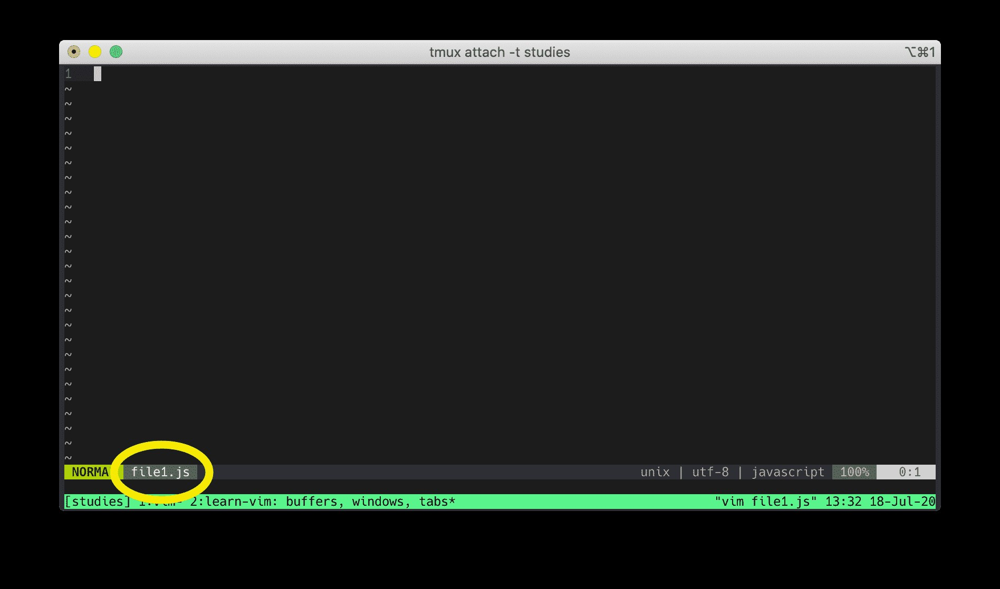

현재 보시는 것은 file1.js 버퍼입니다. 새 파일을 열 때마다 Vim은 새로운 버퍼를 생성합니다.

이제 Vim을 종료하고 두 개의 새로운 파일을 엽니다:

```
vim file1.js file2.js
```

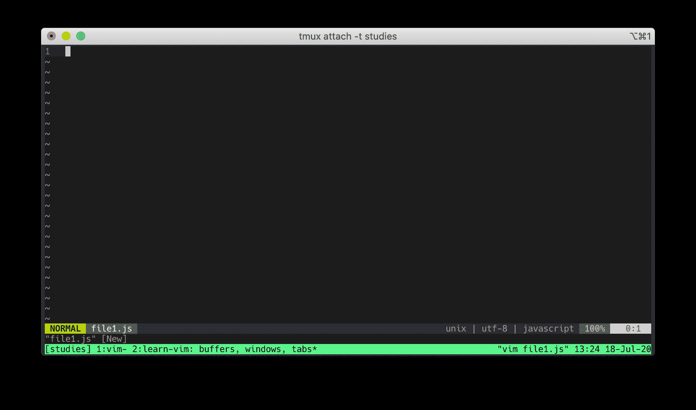

Vim은 file1.js 버퍼를 표시하지만, 실제로는 두 개의 버퍼를 생성합니다: file1.js 버퍼와 file2.js 버퍼입니다.

`:buffers` 명령으로 모든 버퍼를 확인할 수 있습니다. (또는 `:ls` 또는 `:files` 명령도 동일합니다.)

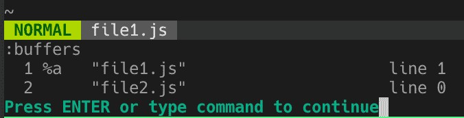

버퍼를 이동하는 방법은 여러 가지가 있습니다:

- `:bnext` 다음 버퍼로 이동합니다. ( `:bprevious` 는 이전 버퍼로 이동)
- `:buffer filename`  파일명 Vim은 `<Tab>` 키로 파일명을 자동 완성합니다.
- `:buffer + n` (n은 버퍼 번호) 예를 들어, `:buffer 2` 를 입력하면 버퍼 #2로 이동합니다.

`Ctrl-O` 로 점프 목록의 이전 위치로, `Ctrl-I` 로 다음 위치로 이동합니다. 이들은 버퍼 전용은 아니지만, 버퍼 간 이동에 활용할 수 있습니다. 점프 목록은 5장에 자세히 설명하겠습니다. `Ctrl-^` 로 이전 버퍼로 이동합니다.

Vim이 버퍼를 생성하면 버퍼 목록에 계속 남아 있습니다. 이를 제거하려면 `:bdelete` 를 입력합니다. 버퍼 번호(예: `:bdelete 3` 으로 3번 버퍼 삭제)나 파일명(`:bdelete` 입력 후 `<Tab>` 으로 자동완성)을 입력할 수 있습니다.

버퍼 개념을 익힐 때 가장 어려운 점은 버퍼의 작동 방식을 시각화 하는 것입니다. 카드 한 벌을 가정합니다. 버퍼가 2개면 카드 2장이 쌓인 덱입니다. 맨 위의 카드가 현재 보이는 카드입니다. file1.js 버퍼가 표시되면 file1.js 카드가 덱 맨 위에 있는 것입니다. 다른 카드인 file2.js 는 보이지 않습니다. file2.js 버퍼로 전환하면 file2.js 카드가 덱 맨 위로 오게 됩니다. 버퍼를 file2.js 로 전환하면 file2.js 카드가 맨 위로 올라가고 file1.js 카드는 맨 아래로 내려갑니다.

Vim을 처음 사용하면 이런 개념이 낯설 수 있습니다. 충분히 시간을 들여 이해해야 합니다.


## Exiting Vim 
참고로, 여러 개의 버퍼가 열려 있을 경우 quit-all 명령어로 모두 닫을 수 있습니다:

```
:qall
```

변경 사항을 저장하지 않고 (모두) 닫으려면 끝에 `!` 를 추가합니다:

```
:qall!
```

저장 후 모두 종료하려면 다음을 실행합니다:

```
:wqall
```


## Windows 
창(window)은 버퍼(buffer0의 뷰포트(viewport)입니다. 여러 개의 창을 가질 수 있습니다. 대부분의 텍스트 편집기는 여러 개의 창을 표시할 수 있는 기능을 갖추고 있습니다. 다음은 3개의 창을 가진 VSCode 편집기입니다:

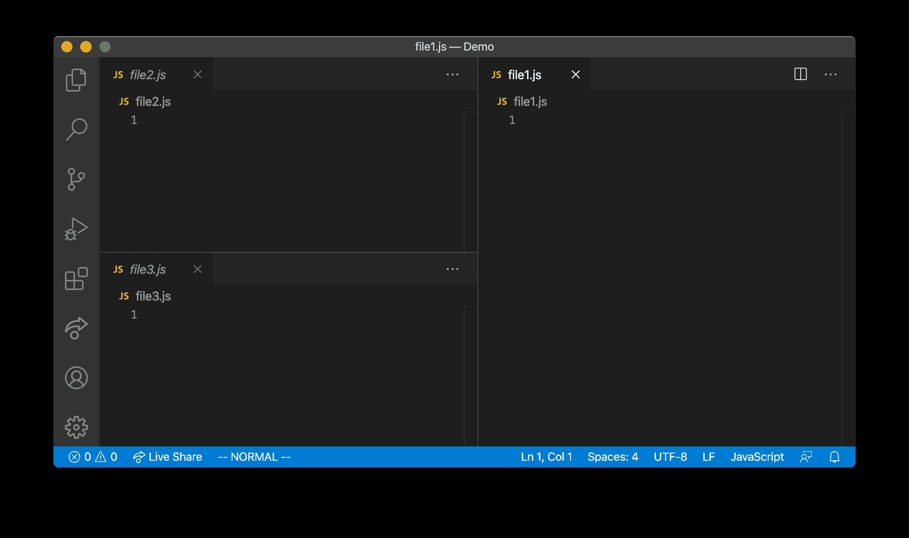

이제 터미널에서 file1.js 파일을 다시 열어 보겠습니다:

```
vim file1.js
```


이전에 file1.js 버퍼를 보고 있다고 말씀드렸습니다. 맞긴 하지만 불완전한 설명입니다. 여러분이 현재 보는 것은 창을 통해 표시된 file1.js 버퍼입니다. 창은 버퍼를 보는 매개체입니다.

Vim을 종료하지 않고 다음 명령을 실행합니다:

```
:split file2.js
```

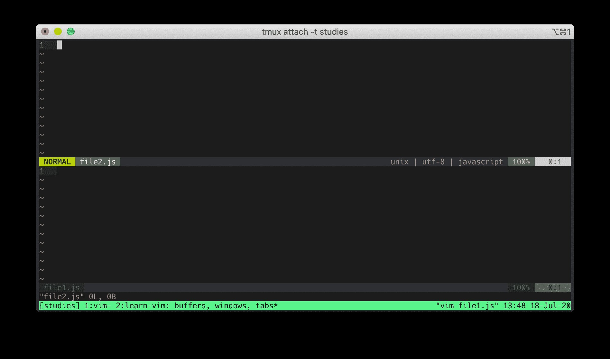

현재 두 개의 창으로 두 개의 버퍼를 보고 있습니다. 상단 창에는 file2.js 버퍼가 표시됩니다. 하단 창에는 file1.js 버퍼가 표시됩니다.

창 사이를 이동하려면 다음 단축키를 사용합니다:

- `Ctrl-W H` 커서를 왼쪽 창으로 이동
- `Ctrl-W J` 커서를 하단 창으로 이동
- `Ctrl-W K` 커서를 상단 창으로 이동
- `Ctrl-W L` 커서를 오른쪽 창으로 이동

이제 다음 명령을 실행합니다:

```
:vsplit file3.js
```

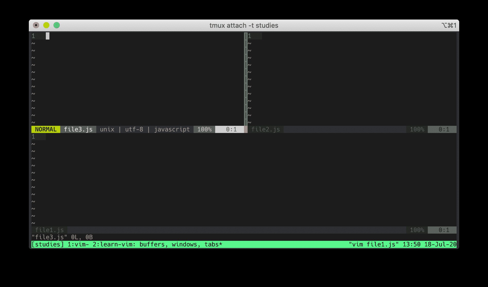

현재 세 개의 버퍼를 표시하는 세 개의 창이 보입니다. 왼쪽 상단 창에는 file3.js 버퍼, 오른쪽 상단 창에는 file2.js 버퍼, 하단 창에는 file1.js 버퍼가 표시됩니다.

하나의 버퍼를 여러 창에 표시할 수 있습니다. 왼쪽 상단 창에서 다음을 입력합니다:

```
:buffer file2.js
```

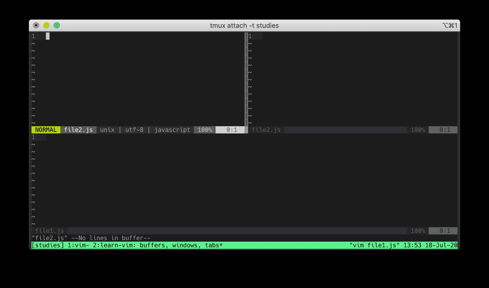

이제 왼쪽 상단과 오른쪽 상단 창 모두 file2.js 버퍼를 표시합니다. 왼쪽 상단에 입력하면 왼쪽 상단과 오른쪽 상단 창 모두 내용이 실시간으로 업데이트 되는 것을 확인할 수 있습니다.

현재 창을 닫으려면 `Ctrl-W C` 를 실행하거나 `:quit` 을 입력합니다. 창을 닫아도 버퍼는 그대로 남아 있습니다. (`:buffers` 를 실행해서 확인합니다.)

일반 모드에서 유용한 창 명령어는 다음과 같습니다:

- `Ctrl-W V` 새로운 세로 분할 창 열기
- `Ctrl-W S` 새로운 가로 분할 창 열기
- `Ctrl-W C` 창 닫기
- `Ctrl-W O` 현재 창만 화면에 표시하고 다른 창 닫기

창 명령줄 명령어는 다음과 같습니다:

- `:vsplit filename` 창을 세로로 분할
- `:split filename` 창을 가로로 분할
- `:new filename` 새로운 창 생성

천천히 익히시기 바랍니다. 보다 자세한  내용은 `:h window` 를 참고합니다.


## Tabs 
탭은 창의 집합입니다. 창을 위한 일종의 "레이아웃" 입니다. 현대적인 텍스트 편집기(그리고 현대적인 인터넷 브라우저)에서 탭은 열린 파일/페이지를 의미하며, 이를 닫으면 해당 파일/페이지는 사라집니다. 

Vim에서 탭은 열린 파일을 의미하지 않습니다!! Vim에서 탭을 닫을 때, 파일을 닫는 것이 아닙니다. 단순히 레이아웃만 닫습니다. 해당 파일의 데이터는 메모리 내의 버퍼에 저장됩니다. 버퍼는 여전히 존재합니다.

Vim 탭의 실제 동작을 살펴보겠습니다. 

file1.js 를 엽니다:

```
vim file1.js
```

새로운 탭에 file2.js 를 엽니다:

```
:tabnew file2.js
```

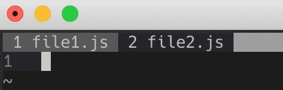

새로운 탭으로 열려는 파일을 Vim으로 자동 완성하려면 `<Tab>` 키를 누릅니다. 

다음은 유용한 탭 탐색 명령어 목록입니다:

- `:tabnew file.txt` 새로운 탭에서 file.txt 열기
- `:tabclose` 현재 탭 닫기
- `:tabnext` 다음 탭으로 이동
- `:tabprevious` 이전 탭으로 이동
- `:tablast` 마지막 탭으로 이동
- `:tabfirst` 첫 번째 탭으로 이동

`gt` 를 실행하면 다음 탭 페이지로 이동할 수 있습니다. (`gT` 로 이전 탭으로 이동 가능) 또한, `gt` 명령어에 탭 번호를 인수로 전달할 수 있습니다. 예를 들어, 세 번째 탭으로 이동하려면 `3gt` 를 입력합니다.

여러 개의 탭을 사용하는 장점 중 하나는 각 탭마다 서로 다른 창 배치(레이아웃)를 설정할 수 있다는 점입니다. 첫 번째 탭에는 세 개의 세로 창을, 두 번째 탭에는 가로와 세로 창을 혼합한 레이아웃을 원할 수 있습니다. 탭은 이를 위한 완벽한 도구입니다!

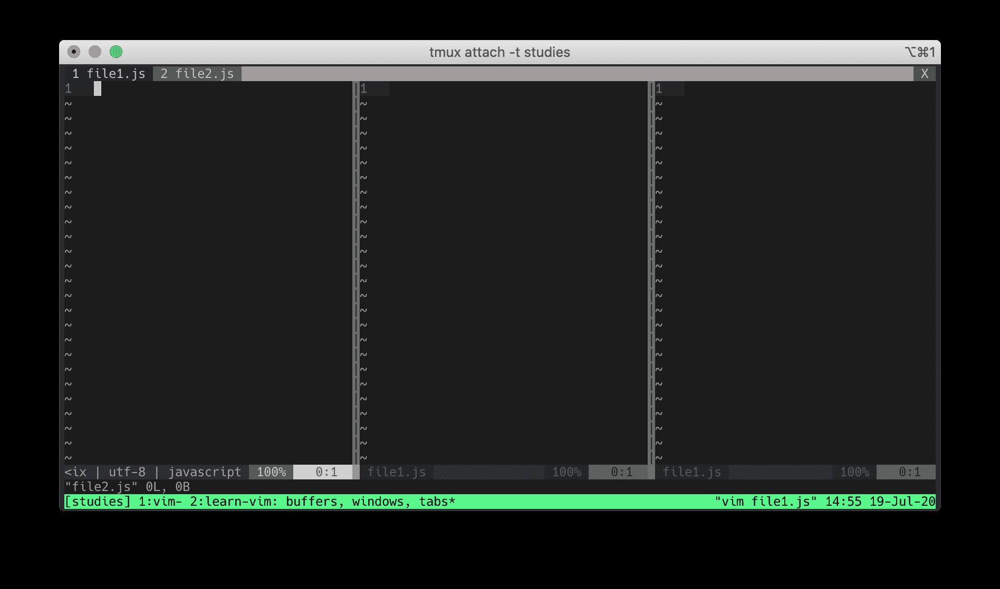

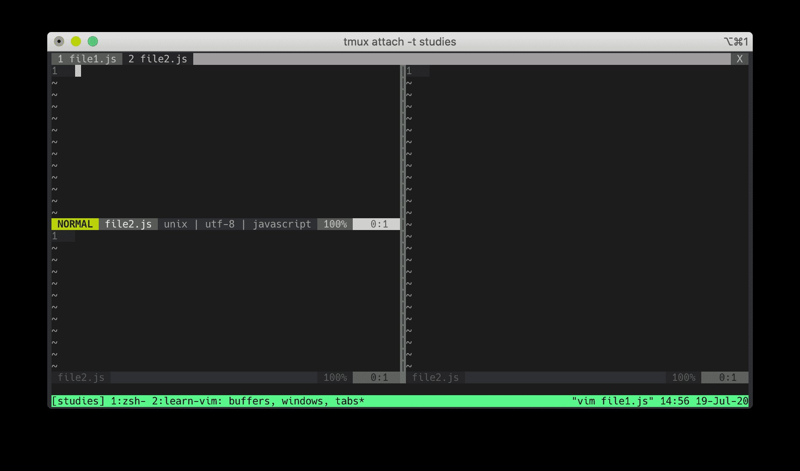

터미널에서 Vim으로 여러 탭으로 시작하려면 다음과 같이 실행합니다:

```
vim -p file1.js file2.js file3.js
```


## Moving In 3D 
창 사이를 이동하는 것은 직교좌표계에서 X-Y 축을 따라 2차원적으로 이동하는 것과 같습니다.

`Ctrl-W H/J/K/L` 키로 상단, 우측, 하단, 좌측 창으로 이동할 수 있습니다.

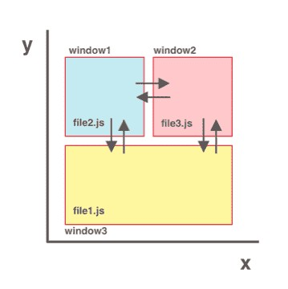

버퍼 간 이동은 직교좌표계에서 Z축을 가로지르는 것과 같습니다.

버퍼의 파일들이 Z축을 따라 정렬된다고 가정합니다..

- `:bnext` 및 `:bprevious` 명령으로 한 번에 하나의 버퍼씩 Z축을 이동할 수 있습니다.
- `:buffer filename/buffernumber` 명령으로 Z축상의 임의의 좌표로 이동할 수 있습니다. 

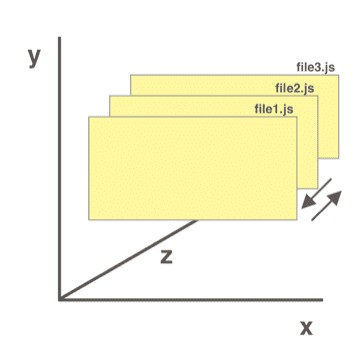

창 이동과 버퍼 이동을 조합하면 3차원 공간에서 이동할 수 있습니다. 창 이동으로 상단, 우측, 하단 또는 좌측 창(X-Y 탐색)으로 이동할 수 있습니다. 각 창은 버퍼가 포함되므로, 버퍼 이동으로 앞뒤로(Z 탐색) 이동할 수 있습니다.

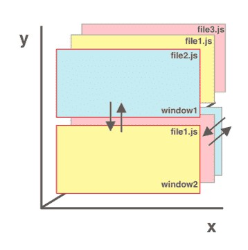


## Using Buffers, Windows, and Tabs The Smart Way 
버퍼, 창, 탭이 무엇이며 Vim에서 어떻게 작동하는지 배웠습니다. 이제 이를 이해했으니 여러분의 작업에 활용할 수 있습니다. 사람마다 처리하는 작업은 모두 다릅니다. 

예를 들어, 저의 작업은 다음과 같습니다:

- 버퍼를 사용해서 현재 작업에 필요한 모든 파일을 엽니다. Vim은 속도가 느려지기 전까지는 많은 버퍼를 동시에 열 수 있습니다. 게다가 여러 버퍼를 열어도 화면이 복잡해지지 않습니다. 한 번에 하나의 버퍼만 보는 것은(창이 하나 뿐이라고 가정할 때) 한 화면에 집중할 수 있습니다. 다른 곳으로 이동할 때는 언제든지 열려 있는 버퍼로 빠르게 이동할 수 있습니다.

- 여러 버퍼를 동시에 보기 위해 여러 창을 사용합니다. 주로 파일 비교, 문서 읽기, 코드 흐름 추적 시에 활용합니다. 화면이 복잡해지지 않도록(소형 노트북 사용) 열린 창의 갯수는 세 개 이하로 유지합니다. 작업이 끝나면 불필요한 창은 닫습니다. 창이 적을수록 방해 요소는 줄어듭니다.

- 탭 대신 tmux 를 사용합니다. 보통 여러 개의 tmux 창을 활용하는데 예를 들어, 클라이언트 코드용 창 하나와 백엔드 코드용 창 하나로 분리합니다. 

편집 스타일에 따라 저의 워크플로가 다르게 보일 수도 있지만 괜찮습니다. 여러분의 코딩 스타일에 맞는 워크플로를 찾기 위해 다양하게 시도합니다.


---
# Ch03. Searching Files 
이 장의 목표는 Vim에서 빠르게 "검색하는 방법" 을 소개하는 것입니다. 빠른 검색 능력은 Vim의 생산성을 크게 향상시키는 방법입니다. 저는 파일을 빠르게 검색하는 방법을 터득한 후부터 Vim을 전적으로 사용하기 시작했습니다.

이번 장은 플러그인 없이 검색하는 방법과 fzf.vim 플러그인을 사용한 검색 방법, 두 부분으로 나눕니다. 시작하겠습니다!


## Opening And Editing Files 
Vim에서 파일을 열려면 `:edit` 명령어를 사용할 수 있습니다.

```
:edit file.txt
```

file.txt 파일이 존재하면 file.txt 버퍼가 열립니다. file.txt 파일이 존재하지 않으면 file.txt 용 새로운 버퍼가 생성됩니다.

:edit 명령어도 `<Tab>` 키를 이용한 자동 완성이 작동합니다. 예를 들어, 파일이 Rails 앱 컨트롤러 디렉토리(./app/controllers/users_controllers.rb)에 있다면 `<Tab>` 키를 사용해서 빠르게 확장할 수 있습니다:

```
:edit a<Tab>c<Tab>u<Tab>
```

`:edit` 명령어는 와일드카드 인수도 허용합니다. `*` 는 현재 디렉토리 내의 모든 파일을 일치시킵니다. 현재 디렉토리에서 .yml 확장자를 가진 파일을 찾으려면 다음과 같이 입력합니다:

```
:edit *.yml
```

Vim은 현재 디렉토리 내의 모든 .yml 파일 목록을 제공하고 편집할 수 있습니다. 

`**` 를 사용하면 재귀적으로 검색할 수 있습니다. 프로젝트 내의 모든 `*.md` 파일을 찾고 싶지만 어느 디렉토리에 있는지 확실치 않다면 다음과 같이 입력합니다:

```
:edit **/*.md
```

`:edit` 명령어는 Vim의 내장 파일 탐색기인 netrw 를 실행할 수 있습니다. 이를 위해 파일 대신 디렉토리 인수를 `:edit` 에 전달합니다:

```
:edit .
:edit test/unit/
```


## Searching Files With Find 
파일을 찾으려면 `:find` 명령어를 사용합니다. 예를 들어:

```
:find package.json
:find app/controllers/users_controller.rb
```

`:find` 명령어도 자동 완성 기능이 작동합니다:

```
:find p<Tab>                " find package.json
:find a<Tab>c<Tab>u<Tab>    " find app/controllers/users_controller.rb
```

`:find` 명령어과 `:edit` 명령어는 유사하게 보일 수 있습니다. 차이점은 무엇일까요?


## Find And Path 
차이점은 `:find` 는 경로에서 파일을 찾지만 `:edit` 는 그렇지 않다는 것입니다. 

경로에 대해 알아보겠습니다. 경로를 수정하는 방법을 익힌다면 `:find` 는 강력한 검색 도구가 될 수 있습니다. 

현재 경로를 확인하려면 다음을 실행합니다:

```
:set path?
```

기본적으로 다음과 같을 것입니다:

```
path=.,/usr/include,,
```

- . (점)은 현재 파일의 디렉터리를 기준으로 상대 경로 검색을 의미합니다.
- , (쉼표)는 현재 디렉터리에서 검색함을 의미합니다.
- /usr/include 는 C 컴파일러 헤더 파일 디렉터리입니다.

처음 두 개는 중요하며, 세 번째는 당분간 무시해도 됩니다. 

여기서 핵심은 경로를 수정할 수 있다는 점입니다. 다음과 같은 프로젝트 구조를 가정해 보겠습니다:

```
app/
  assets/
  controllers/
    application_controller.rb
    comments_controller.rb
    users_controller.rb
...
```

루트 디렉터리에서 users_controller.rb 로 이동하려면 여러 디렉터리를 거쳐야 하며(상당한 탭 키 입력이 필요함), 프레임워크 작업 시 대부분의 시간(90%)을 특정 디렉터리에서 보내는 경우가 많습니다. 이 경우 컨트롤러 디렉터리(controllers/)로 최소한의 키 입력으로 이동하는 것이 중요합니다. 경로 설정을 통해 이런 이동 작업을 단축할 수 있습니다.

현재 경로에 app/controllers/ 를 추가합니다. 방법은 다음과 같습니다:

```
:set path+=app/controllers/
```

경로가 업데이트된 후 `:find u<Tab>` 을 입력하면 Vim은 app/controllers/ 디렉토리 내에서 “u” 로 시작하는 파일을 검색합니다.

app/controllers/account/users_controller.rb 처럼 중복된 controller 이 있으면, Vim은 users_controller 를 찾지 못합니다. 대신 `:set path+=app/controllers/**` 를 추가해야 자동완성이 users_controller.rb 를 찾을 수 있습니다. 훌륭합니다! 이제는 탭 키를 3번 누르지 않고 한 번만 눌러 users_controller 를 찾을 수 있습니다.

프로젝트 디렉터리를 추가하면 탭 키 입력 시 Vim이 해당 파일을 모든 위치에서 검색할 수 있다고 생각할 수 있습니다.

예를 들어, 다음과 같이 설정합니다:

```
:set path+=$PWD/**
```

`$PWD` 는 현재 디렉터리입니다. 탭 키 입력으로 모든 파일에 접근할 수 있도록 프로젝트 전체를 경로에 추가할 경우, 소규모 프로젝트는 작동할 수 있으나 프로젝트에 파일이 많을 경우는 검색 속도가 현저히 느려집니다. 자주 사용하는 파일/디렉터리 경로만 추가하는 것을 권장합니다.

.vimrc 파일에 `set path+={사용자 경로}` 를 추가할 수 있습니다. 경로 업데이트는 몇 초밖에 걸리지 않으며, 이렇게 하면 많은 시간을 절약할 수 있습니다.


## Searching In Files With Grep 
파일 내에서 검색(파일 내 문구 찾기)이 필요할 경우 grep 을 사용할 수 있습니다. Vim은 이를 수행하는 두 가지 방법이 있습니다:

- 내부 grep (`:vim`  이라고 표기합니다. `:vimgrep` 의 약어입니다.)
- 외부 grep (`:grep`)

먼저, 내부 grep 부터 살펴보겠습니다. `:vim` 의 구문은 다음과 같습니다:

```
:vim /pattern/ file
```

- `/pattern/` 은 검색할 정규식 패턴입니다.
- file 은 파일 인자입니다. 여러 인자를 전달할 수 있습니다. 

Vim은 파일 인자 내에서 패턴을 검색합니다. `:find` 명령어와 마찬가지로 `*` 및 `**` 와일드카드를 전달할 수 있습니다. 예를 들어, app/controllers/ 디렉토리 내의 모든 루비 파일(.rb)에서 “breakfast” 문자열의 모든 발생 위치를 찾으려면 다음과 같이 입력합니다:

```
:vim /breakfast/ app/controllers/**/*.rb
```

이 명령을 실행하면 첫 번째 결과 위치로 이동합니다. Vim의 검색 명령은 퀵픽스(quickfix)를 사용합니다.

모든 검색 결과를 보려면 `:copen` 을 실행합니다. 이 명령은 퀵픽스 창을 엽니다. 생산성을 높이는 데 유용한 퀵픽스 명령 몇 가지는 다음과 같습니다:

- `:copen` 퀵픽스 창 열기
- `:cclose` 퀵픽스 창 닫기
- `:cnext` 다음으로 이동
- `:cprevious` 이전으로 이동
- `:colder` 오래된 목록으로 이동
- `:cnewer` 최근 목록으로 이동

퀵픽스에 대해 알아보려면 :h quickfix 를 참고합니다.

내부 grep(`:vim`)을 실행하면 일치 항목이 많을 경우 속도가 느려질 수 있습니다. 이는 Vim이 검색 결과를 메모리로 읽기 때문입니다. Vim은 일치하는 각 파일을 마치 편집 중인 것처럼 로드합니다. 이처럼 Vim이 많은 파일을 검사하면 상당한 양의 메모리를 소모합니다.

이제 외부 grep 에 대해 알아보겠습니다. 기본적으로 터미널 grep 명령어를 사용합니다. 

app/controllers/ 디렉토리의 루비 파일에서 “lunch” 를 검색하려면 다음과 같이 입력합니다:

```
:grep -R “lunch” app/controllers/
```

`/pattern/` 대신 터미널 grep 구문 “pattern” 형식을 사용한다는 점에 유의합니다. 또한, 모든 일치 항목을 퀵픽스(quickfix)로 표시합니다.

Vim은 `:grep` 실행 시 실행할 외부 프로그램을 결정하기 위해 grepprg 변수를 사용하므로 항상 터미널 grep 명령어를 사용할 필요는 없습니다. 나중에 기본 grep 외부 프로그램을 변경하는 방법을 설명합니다.


## Browsing Files With Netrw 
netrw는 Vim의 내장 파일 탐색기입니다. 프로젝트의 구조 계층을 확인하는 데 유용합니다. 

netrw를 실행하려면 .vimrc 파일에 다음 두 설정이 필요합니다:

```
set nocp
filetype plugin on
```

netrw는 방대한 주제로 기본 사용법만 다루지만, 시작하는 데는 충분합니다. 

Vim을 실행할 때 netrw를 시작하고 파일 대신 디렉터리를 전달할 수 있습니다. 예를 들어:

```
vim .
vim src/client/
vim app/controllers/
```

Vim 내부에서 netrw를 실행하려면 `:edit` 명령에 파일명 대신 디렉터리를 전달합니다:

디렉터리를 전달하지 않고 netrw 창을 실행하는 다른 방법은 다음과 같습니다:

- `:Explore` 현재 창에서 netrw 시작
- `:Sexplore` 말 그대로. 화면 상단 분할 창에서 netrw 시작
- `:Vexplore` 화면 좌측 분할 창에서 netrw 시작

Vim의 모션(이동) 명령으로 netrw를 탐색할 수 있습니다. (모션 명령은 후반 장에서 다룹니다.)

디렉터리 생성, 삭제, 이름 변경 작업이 필요할 때 유용한 netrw 명령어 목록은 다음과 같습니다:

- `d` 새로운 디렉터리 생성
- `R` 파일 또는 디렉터리 이름 변경
- `D` 파일 또는 디렉터리 삭제

`:h netrw` 도움말은 매우 포괄적입니다. 시간이 되면 확인니다.

netrw가 너무 심심하다면 vim-vinegar 플러그인으로 기능을 강화할 수 있습니다. 또 다른 파일 탐색기를 원한다면 NERDTree 도 좋은 대안입니다. 


## Fzf 
이제 Vim의 내장 도구(`:vim`, `grep`)로 파일을 검색하는 방법을 배웠으니, 플러그인을 사용해서 검색하는 방법을 알아보겠습니다.

현대식 텍스트 에디터가 Vim보다 좋은 점 중 하나는 퍼지 검색으로 파일을 찾거나 파일 내부를 검색하는 것이 얼마나 쉬운지입니다. 이 장 후반부에 fzf.vim 을 활용해서 Vim에서도 쉽고 강력하게 검색하는 방법을 보여드리겠습니다.


## Setup 
먼저 fzf 와 ripgrep 이 설치되어 있는지 확인합니다. 해당 github 저장소의 지침을 따릅니다. 설치가 성공적으로 완료되면 fzf 와 rg 명령어를 사용할 수 있습니다.

Ripgrep 은 grep 과 유사한 검색 도구입니다. (이름으로 알 수 있듯이) 일반적으로 grep 보다 빠르며 다양하고 유용한 기능을 제공합니다. fzf 는 범용 명령줄 퍼지 검색 도구입니다. ripgrep 을 포함한 모든 명령어와 함께 사용할 수 있습니다. 이 둘을 함께 사용하면 강력한 검색 도구 조합을 이룹니다.

fzf 는 기본적으로 ripgrep 을 사용하지 않으므로, FZF_DEFAULT_COMMAND 변수로 fzf 가 ripgrep 을 사용하도록 설정합니다. 저의 .zshrc 파일(bash 사용 시 .bashrc)은 다음과 같이 설정되어 있습니다:

```
if type rg &> /dev/null; then
export FZF_DEFAULT_COMMAND=‘rg --files’
export FZF_DEFAULT_OPTS=‘-m’
fi
```

FZF_DEFAULT_OPTS 의 -m 옵션에 주목합니다. 이 옵션은 `<Tab>` 또는 `<Shift-Tab>` 으로 여러 항목을 선택할 수 있게 합니다. fzf 를 Vim에서 사용하기 위해 이 줄이 반드시 필요한 건 아니지만, 유용한 옵션이라고 생각합니다. 잠시 후에 설명할 여러 파일에서 검색 및 바꾸기 작업을 수행할 때는 특히 유용합니다. 

fzf 명령어는 수 많은 플래그를 지원하지만, 여기서 다루지 않습니다. 자세한 내용은 fzf 저장소 또는 man fzf 를 참고합니다. 최소한 export FZF_DEFAULT_COMMAND='rg' 는 설정해야 합니다.

fzf 와 ripgrep 설치 후 fzf 플러그인을 설정합니다. 여기서는 vim-plug 플러그인 관리자를 사용하지만, 다른 관리자도 가능합니다.

.vimrc 파일의 plugins 섹션에 다음을 추가합니다. fzf 개발자가 만든 fzf.vim 플러그인이 필요합니다.

```
Plug ‘junegunn/fzf.vim’
Plug ‘junegunn/fzf’, { ‘do’: { -> fzf#install() } }
```

이 플러그인에 대한 자세한 내용은 fzf.vim 저장소를 참고합니다.


## Fzf Syntax 
fzf 를 효율적으로 사용하려면 기본적인 fzf 구문을 익혀야 합니다. 다행히 목록은 간단합니다:

- ^ 는 접두사와 일치합니다. “welcome” 으로 시작하는 문구를 검색하려면: ^welcome 
- $ 는 접미사와 일치합니다. “my friends” 로 끝나는 문구를 검색하려면: friends$ 
- ' 는 정확한 일치입니다. “welcome my friends” 라는 구문을 검색하려면: 'welcome my friends 
- | 는 “또는” 일치입니다. ‘friends’ 또는 “foes” 중 하나를 검색하려면: friends | foes 
- ! 는 역(반전)일치입니다. “welcome” 을 포함하고 “friends” 를 포함하지 않는 구문을 검색하려면: welcome !friends

이들 옵션은 혼합할 수 있습니다. 예를 들어, ^hello | ^welcome friends$ 는 “welcome” 또는 “hello” 로 시작하고 “friends” 로 끝나는 구문을 검색합니다.


## Finding Files 
Vim에서 fzf.vim 플러그인으로 파일을 검색하려면 `:Files` 메서드를 사용합니다. Vim에서 `:Files` 를 실행하면 fzf 검색 프롬프트가 표시됩니다.

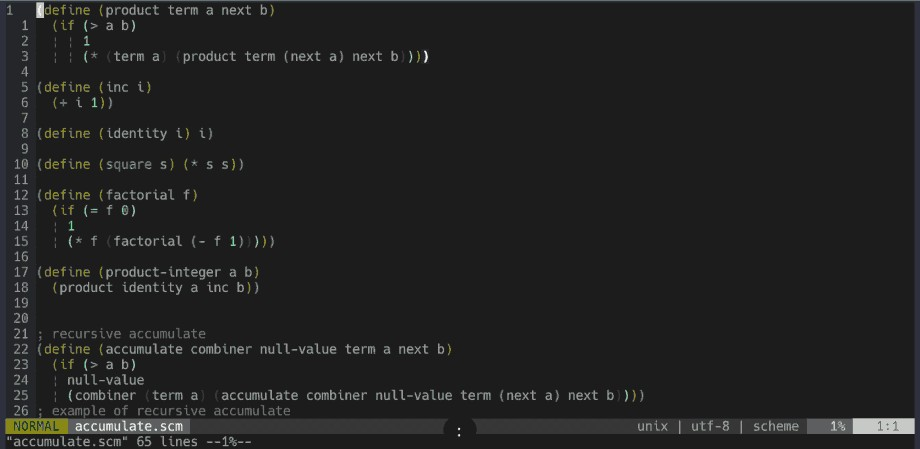

이 명령은 자주 사용하므로 단축키로 매핑하는 것이 좋습니다. 저는 Ctrl-f 로 매핑했습니다. 저의 vimrc 파일은 다음과 같이 설정되어 있습니다:

```
nnoremap <silent> <C-f> :Files<CR>
```


## Finding In Files 
파일 내부를 검색하려면 `:Rg` 명령어를 사용할 수 있습니다.

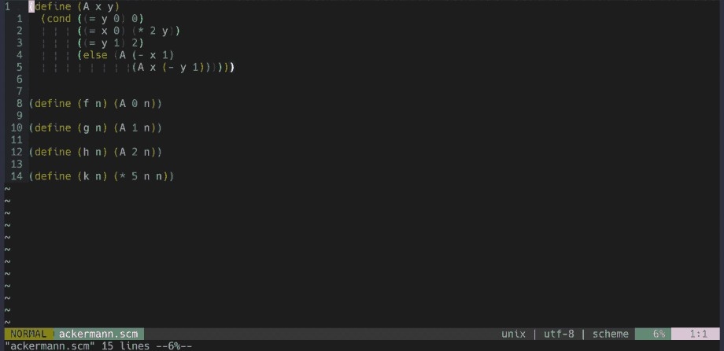

다시 한번, 자주 사용할테니 매핑합니다. 저는 `<Leader>f` 로 매핑했습니다.

```
nnoremap <silent> <Leader>f :Rg<CR>
```


## Other Searches 
fzf.vim 은 다양한 검색 명령어를 제공합니다. 여기서 일일이 설명하지 않습니다.

저의 fzf 관련 매핑은 다음과 같습니다:

```
nnoremap <silent> <Leader>b :Buffers<CR>
nnoremap <silent> <C-f> :Files<CR>
nnoremap <silent> <Leader>f :Rg<CR>
nnoremap <silent> <Leader>/ :BLines<CR>
nnoremap <silent> <Leader>' :Marks<CR>
nnoremap <silent> <Leader>g :Commits<CR>
nnoremap <silent> <Leader>H :Helptags<CR>
nnoremap <silent> <Leader>hh :History<CR>
nnoremap <silent> <Leader>h: :History:<CR>
nnoremap <silent> <Leader>h/ :History/<CR>
```


## Replacing Grep With Rg 
앞서 언급했듯이, Vim은 파일 검색을 위한 두 가지 방법을 제공합니다. `:vim` 과 `:grep` 입니다. `:grep` 은 외부 검색 도구를 사용하며, grepprg 로 재할당할 수 있습니다. 터미널 grep 대신 `:grep` 명령 실행 시 ripgrep 을 사용하도록 Vim을 구성하는 방법을 보여드리겠습니다.

이제 `:grep` 에서 ripgrep 을 사용하도록 grepprg 를 설정합니다. vimrc에 다음을 추가합니다:

```
set grepprg=rg\ --vimgrep\ --smart-case\ --follow
```

위의 옵션 중 일부는 자유롭게 수정해도 됩니다! 옵션의 자세한 의미는 man rg 를 참고합니다.

grepprg 를 업데이트한 후 `:grep` 을 실행하면 터미널 grep 대신 `rg --vimgrep --smart-case --follow` 가 실행됩니다. ripgrep 으로 “donut” 을 검색하려면 `:grep . -R ‘donut’` 대신 좀 더 간결한 `:grep “donut”` 을 사용할 수 있습니다. 

기존 `:grep` 과 마찬가지로, 새로운 `:grep` 도 결과를 표시하는 데  퀵픽스를 사용합니다. “음, 좋은 기능이지만 Vim에서 `:grep` 을 써본 적도 없고, 그냥 `:Rg` 로 파일 내의 문구를 찾으면 되지 않나? `:grep` 은 대체 언제 쓰지?” 라고 생각할 수 있습니다. 아주 좋은 질문입니다. 

Vim에서 `:grep` 은 여러 파일에서 검색 및 교체를 수행할 때 자주 필요하며, 이에 대해서는 다음에 다루겠습니다.


## Search And Replace In Multiple Files 
VSCode 같은 현대적인 텍스트 편집기는 여러 파일에서 문자열을 검색하고 바꾸는 작업을 매우 쉽게 처리합니다. 이번 섹션은 Vim에서 이를 쉽게 수행하는 두 가지 방법을 보여드리겠습니다.

첫 번째 방법은 프로젝트 내의 모든 일치 문구를 바꾸는 것입니다. `:grep` 명령어를 사용합니다. 

“pizza” 를 “donut” 으로 모두 바꾸려면 다음과 같이 입력합니다:

```
:grep “pizza”
:cfdo %s/pizza/donut/g | update
```

위의 명령어를 분석해 보겠습니다:

1. `:grep "pizza"` 는 ripgrep 을 사용해서 “pizza” 의 모든 인스턴스를 검색합니다. (참고로, grepprg 를 ripgrep 으로 재할당하지 않아도 이 명령은 여전히 작동합니다. grepprg 를 재할당하지 않았다면 `:grep “pizza” . -R` 대신 `:grep “pizza”` 를 입력합니다.)

2. `:cfdo` 는 퀵픽스 목록의 모든 파일에 전달된 명령을 실행합니다. 이 경우 명령은 치환 명령 `%s/pizza/donut/g` 입니다. 파이프( `|` )는 연쇄 연산자입니다. `update` 명령은 치환 후 각 파일을 저장합니다. 치환 명령은 후반 장에서 다룹니다.

두 번째 방법은 선택한 파일에서 검색 및 바꾸기입니다. 이 방법을 사용하면 수동으로 검색 및 바꾸기를 수행할 파일을 선택할 수 있습니다. 방법은 다음과 같습니다:

1. 먼저 버퍼를 지웁니다. 버퍼 목록은 필요한 파일만 포함되야 합니다. Vim을 재시작하거나 `:%bd | e#` 명령을 실행합니다. (`%bd` 는 모든 버퍼를 삭제하고 `e#` 은 마지막으로 열었던 파일을 엽니다.) 

2. `:Files` 명령을 실행합니다.

3. 검색 및 교체를 수행할 모든 파일을 선택합니다. 여러 파일을 선택하려면 `<Tab>/<Shift-Tab>` 키를 사용합니다. 이는 FZF_DEFAULT_OPTS 에 다중 플래그(-m)가 설정된 경우만 사용 가능합니다.

4. `:bufdo %s/pizza/donut/g | update` 명령을 실행합니다. 이 명령은 이전의 `:cfdo %s/pizza/donut/g | update` 명령과 유사합니다. 차이점은 모든 퀵픽스 항목(`:cfdo`)을 대체하는 대신 모든 버퍼 항목(`:bufdo`)을 대체한다는 점입니다.


## Learn Search The Smart Way 
검색은 텍스트 편집의 핵심 기능입니다. Vim에서 효과적으로 검색하는 방법을 익히면 텍스트 편집 작업 흐름이 크게 개선됩니다.

fzf.vim 은 판도를 바꾸는 강력한 도구입니다. 이 플러그인 없이 Vim을 사용한다는 건 상상조차 할 수 없습니다. Vim을 시작할 때 훌륭한 검색 도구를 갖추는 것이 중요하다고 생각합니다. 현대적인 텍스트 편집기들이 제공하는 간편하면서도 강력한 검색 기능 같은 핵심 기능이 부족하다는 이유로 Vim 전환에 어려움을 겪는 사람들을 많이 봤습니다. 이번 장이 여러분의 Vim 전환을 수월하게 만드는 데 도움되길 바랍니다.

방금 Vim의 확장성을 목격했습니다. 플러그인과 외부 프로그램으로 검색 기능을 확장하는 능력 말입니다. 앞으로 Vim에서 어떤 기능을 확장하고 싶은지 항상 염두에 두시기 바랍니다. 아마 누군가는 이미 그런 플러그인을 만들었거나 해당 기능을 위한 프로그램이 존재할 가능성이 매우 높습니다. 

다음 장은 Vim에서 중요한 주제인 Vim 문법에 대해 배워보겠습니다.


---
# Ch04. Vim Grammar 
Vim 명령어의 복잡함에 쉽게 위축될 수 있습니다. Vim 사용자가 `gUfV` 나 `1GdG` 명령어를 입력하는 걸 보면, 이 명령어들이 무엇을 처리하는지 곧바로 알지 못할 수도 있습니다. 이번 장은 Vim 명령어의 일반적인 구조를 간단한 문법 규칙으로 분해해서 설명합니다.

이번 장은 본 가이드 중에서 "가장 중요한 장" 입니다!! 

기본적인 문법 구조를 이해하면 Vim과 “대화”할 수 있습니다. 참고로, 이번 장에서 "Vim 언어" 라고 표현할 때 Vimscript 언어(Vim의 내장 프로그래밍 언어, 후반 장에서 배우게 될 내용)를 말하는 것이 아닙니다.


## How To Learn A Language 
저는 영어 원어민이 아닙니다. 13살 때 미국으로 이주하면서 영어를 배웠습니다. 새로운 언어로 말하기 위해 필요한 세 가지가 있습니다:

1. 문법 규칙을 익힙니다.
2. 어휘력을 늘립니다.
3. 연습, 연습, 또 연습합니다.

마찬가지로 Vim 언어로 말하려면 문법 규칙을 익히고 어휘력을 늘리며, 생각하지 않고도 명령어를 실행할 수 있을 때까지 연습해야 합니다.


## Grammar Rule 
Vim 언어는 단 하나의 문법 규칙만 존재합니다:  **"동사 + 명사"** 이게 전부입니다!!

이것은 다음과 같은 영어 구문을 말하는 것과 같습니다:

- “Eat (동사) a donut (명사)”
- “Kick (동사) a ball (명사)”
- “Learn (동사) the Vim editor (명사)”

이제 기본적인 Vim의 동사와 명사로 어휘를 쌓아야 합니다.


## Nouns (Motions) 
명사(또는 모션)는 Vim의 이동 명령어입니다. 이동 명령어는 Vim에서 이동하는 데 사용합니다. 다음은 Vim의 일부 이동 명령어 목록입니다:

- `h` 왼쪽
- `j` 아래
- `k` 위
- `l` 오른쪽
- `w` 다음 단어의 시작 부분으로 이동
- `}` 다음 단락으로 이동
- `$` 줄 끝으로 이동

다음 장에서 모션(또는 명사)에 대해 자세히 배우게 될 테니, 일부를 이해하지 못해도 걱정하지 않아도 됩니다.


## Verbs (Operators) 
`:h operators` 에 따르면, Vim에는 16개의 연산자가 있습니다. 하지만, 제 경험상 다음 3가지 연산자만 익혀도 편집 작업의 80%는 해결됩니다:

- `y` 텍스트 복사(복사)
- `d` 텍스트 삭제 후 레지스터에 저장
- `c` 텍스트 삭제 후 레지스터에 저장하고 삽입 모드 시작

참고로, 텍스트를 복사한 후에는 `p` (커서 뒤에 붙여넣기) 또는 `P` (커서 앞에 붙여넣기)로 붙여넣을 수 있습니다.


## Verb And Noun 
기본적인 명사와 동사를 익혔으니, 이제 문법 규칙인 "동사 + 명사" 를 적용해 보겠습니다! 

다음과 같은 문장을 가정합니다:

```
const learn = “vim”;
```

- 현재 위치부터 줄 끝까지 모두 복사하려면: `y$`
- 현재 위치부터 다음 단어 시작 부분까지 삭제하려면: `dw`
- 현재 위치부터 현재 단락 끝까지 변경하려면: `c}`

이동 명령은 숫자 인수를 받을 수 있습니다. (다음 장에서 설명합니다.) 3줄 위로 이동하려면 `k` 를 세 번 누르는 대신 `3k` 를 입력합니다. 

숫자 입력은 Vim의 문법 규칙을 따릅니다.

- 왼쪽으로 두 글자 복사: `y2h`
- 다음 두 단어 삭제: `d2w`
- 다음 두 줄 변경: `c2j`

지금은 간단한 명령도 오랫동안  고민할 수도 있습니다. 당신만 그런 것이 아닙니다. 저도 처음 시작할 때는 비슷한 어려움을 겪었지만 시간이 지나면서 빨라졌습니다. 여러분도 그럴 겁니다. 반복, 반복, 반복이 답입니다.

참고로, 줄 단위 작업(줄 전체에 영향주는 작업)은 텍스트 편집에 흔히 쓰이는 작업 단위입니다. 일반적으로 연산자 명령을 두 번 입력하면 Vim은 해당 동작을 줄 단위 작업으로 수행합니다. 예를 들어, `dd, yy, cc` 는 줄 단위로 삭제, 복사, 변경 작업을 수행합니다. 다른 연산자들도 시도해 보시기 바랍니다! 

정말 멋집니다. 패턴이 서서히 보이기 시작합니다. 하지만, 아직 끝이 아닙니다. Vim에는 한 가지 중요한 개념이 있습니다: 바로 "텍스트 객체" 입니다.


## More Nouns (Text Objects) 
괄호로 둘러쌓인 (hello Vim) 을 가정합니다. 즉, 괄호 안의 전체 문구를 삭제합니다. 이를 빠르게 수행하는 방법은 무엇일까요? 현재 위치한 “문자 그룹” 을 삭제할 수 있는 방법이 있을까요? 답은 "네" 입니다. 

텍스트는 종종 구조화되어 있습니다. 괄호, 따옴표, 대괄호, 중괄호 등을 포함합니다. Vim은 텍스트 객체로 이런 구조를 포착할 수 있는 방법을 제공합니다.

텍스트 객체는 연산자와 함께 사용합니다. 텍스트 객체는 "내부 객체" 와 "외부 객체" 두 가지 유형이 있습니다.

- `i` 객체 내부 텍스트 객체(inner)
- `a` 객체 외부 텍스트 객체(around)

내부 객체는 공백이나 주변 객체 없이 객체 내부를 선택합니다. 외부 객체는 공백이나 주변 객체를 포함해서 객체 내부를 선택합니다. 

일반적으로 외부 객체는 내부 객체보다 항상 더 많은 텍스트를 선택합니다. 표현식 (hello vim) 내의 괄호 안 어딘가 커서가 있을 때:

- 괄호는 유지한 채 괄호 안의 텍스트만 삭제: `di(`
- 괄호와 텍스트 모두 삭제: `da(`

다른 예를 살펴보겠습니다. 자바스크립트 함수가 있고 커서가 “Hello” 의 “H” 에 위치한다고 가정합니다:

```
const hello = function() {
  console.log("Hello Vim");
  return true;
}
```

- “Hello Vim” 전체 삭제: `di(` 
- 함수 내용({...}로 둘러싸인) 삭제: `di{` 
- “Hello” 문자열 삭제: `diw` 

텍스트 객체는 한 위치에서 서로 다른 객체를 대상으로 지정할 수 있으므로 강력합니다. 괄호 안의 객체, 함수 블록, 현재 단어를 삭제할 수 있습니다. 기억법은 `di(, di{, diw` 를 보면 각각 어떤 객체를 나타내는지 쉽게 알 수 있습니다: 괄호 한 쌍, 중괄호 한 쌍, 단어입니다.

마지막 예를 살펴보겠습니다. 다음과 같은 HTML 태그를 가정합니다:

```
<div>
  <h1>Header1</h1>
  <p>Paragraph1</p>
  <p>Paragraph2</p>
</div>
```

현재 커서가 “Header1” 텍스트에 있을 때:

- “Header1” 삭제: `dit` 
- `<h1>Header1</h1>` 삭제: `dat` 

커서가 “div” 에 있을 때:

- h1 및 두 개의 p 줄 삭제: `dit` 
- 모든 내용 삭제: `dat` 
- “div” 삭제: `di<` 

다음은 일반적인 텍스트 객체에 대한 목록입니다:

- `w` 단어(word)
- `p` 단락(paragraph)
- `s` 문장(sentence)
- `( `또는 `)` 괄호 한 쌍
- `{` 또는 `}` 중괄호 한 쌍
- `[` 또는 `]` 대괄호 한 쌍
- `<` 또는 `>` 각괄호 한 쌍
- `t` XML 태그
- `"` 따옴표 한 쌍
- `'` 따옴표 한 쌍
- ` 따옴표 한 쌍

자세한 내용은 `:h text-objects` 를 참고합니다.


## Composability And Grammar 
Vim 문법은 Vim의 조합 가능성에 대한 하위 집합입니다. Vim의 조합 가능성과 이것이 텍스트 편집기에서 훌륭한 기능인 이유를 논의해 보겠습니다.

조합 가능성은 좀 더 복잡한 명령을 수행하기 위해 결합(조합)할 수 있는 일반 명령 집합을 의미합니다. 프로그래밍에서 단순한 추상화로부터 좀 더 복잡한 추상화를 만들 수 있는 것처럼, Vim도 단순한 명령으로 복잡한 명령을 실행할 수 있습니다. Vim 문법은 Vim의 조합 가능성을 구현한 형태입니다.

Vim 조합성의 진정한 힘은 외부 프로그램과 통합할 때 빛을 발합니다. Vim은 텍스트 필터로 외부 프로그램을 활용할 수 있는 필터 연산자(`!`)를 제공합니다. 

다음과 같이 지저분한 텍스트를 표 형식으로 정리한다고 가정해 보겠습니다:

```
Id|Name|Cuteness
01|Puppy|Very
02|Kitten|Ok
03|Bunny|Ok
```

이 작업은 Vim 명령만으로 쉽게 처리할 수 없지만, column 터미널 명령(터미널에 column 명령이 있다고 가정)을 사용하면 빠르게 처리할 수 있습니다. 

커서를 “Id” 에 두고 `!}column -t -s “|”` 를 실행합니다. 짜잔! 한 번의 명령으로 깔끔한 표 형식의 데이터를 다음과 같이 얻을 수 있습니다.

```
Id Name Cuteness
01 Puppy Very
02 Kitten Ok
03 Bunny Ok
```

명령어를 분해해 보겠습니다. 동사는 `!` (필터 연산자)였고 명사는 `}` (다음 단락으로 이동)입니다. 필터 연산자 `!` 는 또 다른 인자 즉, 터미널 명령어를 받아들이기 때문에 `column -t -s “|”` 를 전달했습니다. column의 작동 방식은 자세히 설명하지 않지만, 결과적으로 텍스트를 표 형식으로 변환했습니다. 텍스트를 표 형식으로 변환할 뿐만 아니라 “Ok” 가 포함된 행만 표시하려면, awk가 이 작업을 쉽게 수행할 수 있다는 것을 잘 알 것입니다. 

대신 다음과 같이 처리할 수 있습니다:

```
!}column -t -s “|” | awk ‘NR > 1 && /Ok/ {print $0}’

Reuslt:
02 Kitten Ok
03 Bunny Ok
```

훌륭합니다! 외부 명령어도 파이프(`|`)를 사용할 수 있습니다. 이것이 바로 Vim의 조합 가능성의 힘입니다. 연산자, 이동 명령어, 터미널 명령어를 많이 알수록 복잡한 작업을 조합하는 능력이 배가됩니다.

4 가지 이동 명령어 `w, $, }, G` 와 하나의 삭제 연산자 `d` 만 안다고 가정합니다. 이때 수행 가능한 작업은 총 8가지입니다: 4가지 방향 이동(`w, $, }, G`) 명령과 4가지 대상 삭제(`dw, d$, d}, dG`) 명령 조합입니다. 그러던 어느 날 대문자 연산자(`gU`)를 배웁니다. 이제 Vim 도구 상자는 새로운 능력 하나가 아니라 4가지(`gUw, gU$, gU}, gUG`) 추가된 셈입니다. 이로써 총 12개의 도구를 보유하게 됩니다. 

새로운 지식 하나하나가 기존 능력에 곱셈(누적) 효과를 부여합니다. 10가지 이동 명령과 5가지 연산자를 안다면, 총 60가지(50가지 연산 + 10가지 이동)의 무기를 보유한 셈입니다. Vim은 줄 번호 이동 명령(`nG`)이 있으므로  n개의 이동 명령을 제공합니다. 여기서 n은 파일의 줄 수입니다. (5번째 줄로 이동하려면 `5G` 실행) 

검색 명령(`/`)은 사실상 무제한의 번호 이동을 가능하게 합니다. 무엇이든 검색할 수 있기 때문입니다. 외부 명령 연산자(`!`)는 여러분이 알고 있는 터미널 명령의 수만큼 도구를 제공합니다. Vim 같이 조합 가능한 도구를 사용하면, 알고 있는 모든 것을 연결해서 점점 복잡해지는 작업을 수행할 수 있습니다. 아는 것이 많을수록 더욱 강력해집니다.

이런 조합 가능성은 유닉스의 철학인 '한 가지를 잘하라!' 를 반영합니다. 연산자는 하나의 임무만 가집니다: Y를 수행하라. 이동 명령은 하나의 임무만 가집니다: X로 이동하라. 연산자와 이동 명령을 결합하면 예측 가능하게 YX 를 얻습니다: X에 대해 Y를 수행하라.

모션(명사)과 연산자는 확장 가능합니다. 사용자 정의 모션과 연산자를 만들어 Vim 도구 모음에 추가할 수 있습니다. vim-textobj-user 플러그인을 사용하면 사용자 정의 텍스트 객체를 생성할 수 있습니다. 또한, 사용자가 만든 커스텀 텍스트 객체 목록도 포함되어 있습니다.


## Learn Vim Grammar The Smart Way 
방금 Vim의 문법 규칙인 "동사 + 명사" 구조를 배웠습니다. 제게 가장 큰 깨달음을 준 순간 중 하나는 대문자 변환 연산자(`gU`)를 배운 후, 현재 단어를 대문자로 바꿀 때였습니다. 본능적으로 `gUiw` 를 실행했는데, 작동했습니다! 단어가 대문자로 바뀌었습니다. 그 순간! 비로소 Vim을 제대로 이해하기 시작했습니다. 여러분도 아직까지 경험하지 않았다면, 곧바로 자신만의 ‘아하!’ 순간을 맞이하시길 바랍니다.

이번 장의 목표는 Vim의 "동사 + 명사" 패턴을 보여줌으로써, 여러분이 Vim을 배우는 방식을 모든 명령어 조합을 암기하는 방식이 아닌 새로운 언어를 배우는 방식으로 접근하도록 만드는 것입니다. 패턴을 익히고 그 뜻을 이해해야 합니다. 그것이 가장 현명한 학습법입니다.


---
# Ch05. Moving In A File 
처음에는 키보드로 이동하는 방식이 느리고 어색할 수 있지만 절대 포기하지 않아야 합니다! 일단 익숙해지면 마우스보다 훨씬 빠르게 파일 내의 어디든 이동할 수 있습니다.

이번 장은 필수적인 이동 명령과 이를 효율적으로 사용하는 방법을 배웁니다. 이것은 Vim이 제공하는 모든 이동 명령이 아니란 점을 명심합니다. 이번 장의 목표는 빠르게 생산성을 높일 수 있는 유용한 이동 명령을 소개하는 것입니다. 좀 더 많은 내용을 배우려면 `:h motion.txt` 를 확인합니다.


# Character Navigation 
가장 기본적인 이동 단위는 한 글자씩 왼쪽, 아래, 위, 오른쪽으로 이동하는 것입니다.

- `h` 왼쪽
- `j` 아래
- `k` 위
- `l` 오른쪽

방향 키로도 이동할 수 있습니다. 지금 막 시작하는 단계라면 가장 편한 방법을 자유롭게 사용합니다.

저는 오른손이 홈 열에 위치하므로 hjkl 방식을 선호합니다. 이렇게 하면 주변 키로 손을 뻗는 거리가 짧아집니다. hjkl 에 익숙해지기 위해 화살표 버튼을 비활성화 하기도 했습니다.

~/.vimrc 파일에 다음을 추가했습니다:

```
noremap <Up> <NOP>
noremap <Down> <NOP>
noremap <Left> <NOP>
noremap <Right> <NOP>
```

이런 나쁜 습관을 고치는 데 도움되는 플러그인도 있습니다. 그 중 하나가 vim-hardtime 입니다. 놀랍게도 hjkl 에 익숙해지는 데 일주일도 걸리지 않았습니다.

Vim에서 이동에 hjkl 을 사용하는 이유가 궁금하다면, Bill Joy가 Vi를 작성한 Lear-Siegler ADM-3A 터미널은 화살표 키가 없었기 때문에 좌/하/상/우 방향으로 hjkl 을 사용했기 때문입니다.


## Relative Numbering 
절대 줄 번호와 상대 줄 번호를 설정하는 것은 유용하다고 생각합니다. 

.vimrc 파일에 다음을 추가합니다:

```
set relativenumber number
```

이렇게 하면 현재 줄 번호와 상대 줄 번호가 표시됩니다. 왼쪽 열에 절대 줄 번호를 사용하는 이유는 쉽게 이해하겠지만, 상대 줄 번호가 유용한 이유를 묻는 분도 계실 겁니다. 상대 줄 번호로 커서가 대상 텍스트에서 몇 줄 떨어져 있는지 빠르게 파악할 수 있습니다. 이를 통해 대상 텍스트가 12줄 아래에 있음을 쉽게 확인하고 `d12j` 명령으로 삭제할 수 있습니다. 

반면, 현재 위치가 69행이고 목표 위치가 81행이면 정신적으로 계산해야 합니다. (81 - 69 = 12) 편집 중의 이러한 수학 계산은 정신 자원을 많이 소모합니다!! 이동할 위치는 적게 생각할수록 좋습니다. 하지만, 이것은 100% 개인적인 선호도입니다. 

relativenumber / norelativenumber, number / nonumber 를 실험한 후 가장 유용하다고 느끼는 것으로 사용합니다!


## Count Your Move 
“count” 인자에 대해 이야기해 보겠습니다. Vim 모션은 앞에 숫자 인자를 받아들입니다. 앞서 `12j` 로 12줄 아래로 이동할 수 있다고 언급했습니다. `12j` 에서 12가 바로 "카운트 숫자" 입니다.

이동(모션) 명령에 카운트를 사용하는 구문은 다음과 같습니다:

```
[count] + motion
```

이 규칙은 모든 이동 명령에 그대로 적용됩니다. 예를 들어, 오른쪽으로 9자 이동하려면 `l` 키를 9번 누르는 대신 `9l` 을 입력하면 됩니다. 


## Word Navigation 
좀 더 큰 동작 단위인 단어로 이동하겠습니다. 

다음 단어 시작 부분(`w`), 다음 단어 끝 부분(`e`), 이전 단어 시작 부분(`b`), 이전 단어 끝 부분(`ge`)으로 이동할 수 있습니다.

또한, 단어(word)와 구별되는 WORD가 있습니다. 다음 WORD 시작 부분(`W`), 다음 WORD 끝 부분(`E`), 이전 WORD 시작 부분(`B`), 이전 WORD 끝 부분(`gE`)으로 이동할 수 있습니다. 기억하기 쉽도록 WORD는 단어(word)와 동일한 문자를 사용하지만 대문자로 표기합니다.

- `w` 다음 단어 시작 부분으로 앞으로 이동
- `W` 다음 WORD 시작 부분으로 앞으로 이동
- `e` 한 단어 앞으로 이동해서 다음 단어 끝 부분으로 이동
- `E` 한 단어 앞으로 이동해서 WORD 끝 부분으로 이동
- `b` 이전 단어 시작 부분으로 뒤로 이동
- `B` 이전 WORD 시작 부분으로 뒤로 이동
- `ge` 이전 단어 끝 부분으로 뒤로 이동
- `gE` 이전 WORD 끝 부분으로 뒤로 이동

그렇다면, 단어(word)와 WORD의 유사점과 차이점은 무엇일까요? 단어와 WORD 모두 비공백 문자로 구분됩니다. 단어는 a-zA-Z0-9_ 만 포함한 문자열입니다. WORD는 공백(공백은 스페이스, 탭, 줄바꿈을 의미함)을 제외한 모든 문자의 연속입니다. 자세한 내용은 `:h word` 및 `:h WORD` 를 참고합니다.

예를 들어, 다음과 같은 코드를 가정합니다:

```
const hello = “world”;
```

줄 시작 부분에 커서를 두고 `l` 키로 줄 끝까지 이동하려면 21번의 키 입력이 필요합니다. `w` 키를 사용하면 6번, `W` 키를 사용하면 4번만 필요합니다. 짧은 거리 이동은 단어(word)와 WORD 모두 좋은 선택입니다. 그러나, 현재 줄 내에서 탐색 기능을 사용하면 “c” 에서 “;” 까지 한 번의 키 입력으로 이동할 수 있습니다.


## Current Line Navigation 
편집에는 종종 한 줄 내에서 수평적으로 이동해야 합니다.

- `0` 현재 줄의 첫 번째 문자 위치로 이동
- `^` 현재 줄의 첫 번째 비공백 문자 위치로 이동
- `g_` 현재 줄의 마지막 비공백 문자 위치로 이동
- `$` 현재 줄의 마지막 문자 위치로 이동
- `n|` 현재 줄의 n번째 열 위치로 이동

`f` 와 `t` 로 현재 줄 내에서 검색할 수 있습니다. 둘의 차이점은 `f` 는 일치하는 첫 글자로 이동하고 `t` 는 일치하는 첫 글자 바로 앞까지 이동한다는 점입니다. 따라서, “h” 를 검색해서 그 위치로 이동하려면 `fh` 를 사용합니다. 첫 번째 “h” 를 검색하고 일치하는 위치 바로 앞까지 이동하려면 `th` 를 사용합니다. 마지막으로 검색한 단어의 다음 발생 위치로 이동하려면 `;` 를 사용합니다. 마지막으로 검색한 단어의 이전 발생 위치로 이동하려면 `F` 를 사용합니다.

`F` 와 `T` 는 `f` 와 `t` 의 역방향 기능입니다. “h” 를 역방향으로 검색하려면 `Fh` 를 실행합니다. 동일한 방향으로 “h” 를 계속 검색하려면 `;` 를 사용합니다. 참고로 `Fh` 실행후 `;` 는 역방향 검색을, `fh` 실해 `;` 는 정방향 검색을 수행합니다.

- `f` 같은 줄에서 앞으로 일치하는 문자열 검색
- `F` 같은 줄에서 뒤로 일치하는 문자열 검색
- `t` 같은 줄에서 앞으로 일치하는 문자열 검색, 일치하는 문자열 바로 앞에서 멈춤
- `T` 같은 줄에서 뒤로 일치하는 문자열 검색, 일치하는 문자열 바로 앞에서 멈춤
- `;` 같은 방향으로 같은 줄에서 마지막 검색 반복, 반대 방향으로 같은 줄에서 마지막 검색 반복

이전 예제로 돌아가서:

```
const hello = “world”;
```

커서를 줄 시작 부분에 두고, 한 번의 `$` 입력으로 현재 줄의 마지막 문자(“;”)로 이동할 수 있습니다. “world” 의 “w” 로 이동하려면 `fw` 를 사용합니다. 줄 내에서 어디로든 이동할 때 좋은 팁으로 목표 문자 근처에 있는 “j”, ‘x’, “z” 처럼 공통 문자가 가장 적은 문자를 찾는 것입니다.


## Sentence And Paragraph Navigation 
남은 두 가지  탐색 단위는 문장과 단락입니다. 

먼저 문장이 무엇인지 살펴보겠습니다. 문장은 . ! ? 중 하나로 끝나며, 그 뒤에 줄바꿈(EOL), 공백 또는 탭이 따라옵니다. `)` 을 눌러 다음 문장으로, `(` 를 눌러 이전 문장으로 이동할 수 있습니다.

- `(` 이전 문장으로 이동
- `)` 다음 문장으로 이동

예를 살펴보겠습니다. 어떤 것이 문장이고 문장이 아닌지 생각합니다. Vim에서 `(` 와 `)` 로 이동합니다!

```
I am a sentence. I am another sentence because I end with a period. I am still a sen\
tence when ending with an exclamation point! What about question mark? I am not quit\
e a sentence because of the hyphen - and neither semicolon ; nor colon :

There is an empty line above me.
```
참고로, .(마침표) 다음에 한 줄이 이어지는 구문을 Vim이 문장으로 인식하지 못하는 문제가 있다면 ‘호환’ 모드일 수 있습니다. vimrc 파일에 `set nocompatible` 을 추가합니다. Vi에서 문장은 . (마침표) 다음에 두 개의 공백으로 정의됩니다. 항상 nocompatible 을 설정해야 합니다.

다음으로 단락이 무엇인지 이야기해 보겠습니다. 단락은 빈 줄 뒤에 시작되며, 또한, 단락 옵션에 지정한 문자 쌍으로 구성된 단락 매크로 세트마다 시작됩니다.

- `{` 이전 단락으로 이동
- `}` 다음 단락으로 이동

단락 매크로가 무엇인지 확실치 않더라도 걱정하지 않아도 됩니다. 중요한 것은 단락은 빈 줄 뒤에서 시작되고 끝난다는 점입니다. 대부분의 경우 이 규칙이 적용됩니다.

다음은 예를 살펴보겠습니다. `}` 와 `{` 로 이동합니다. (문장 탐색 `(`, `)` 도 활용합니다!)

```
Hello. How are you? I am great, thanks!
Vim is awesome.
It may not easy to learn it at first...- but we are in this together. Good luck!

Hello again.

Try to move around with ), (, }, and {. Feel how they work.
You got this.
```

자세히 알아보려면 `:h sentence` 와 `:h paragraph` 를 확인합니다.

ZZZZZ
## Match Navigation 
프로그래머는 코드를 작성하고 편집합니다. 코드는 일반적으로 괄호, 중괄호, 대괄호를 사용합니다. 이들 사이에서 쉽게 길을 잃을 수 있습니다. 한 쌍 안에 있을 때, 다른 쌍(존재할 경우)으로 이동하려면 % 를 사용합니다. 이 방법을 통해 괄호, 중괄호, 대괄호가 쌍을 이루는지 확인할 수 있습니다.

- % 다른 쌍으로 이동, 일반적으로 () [], {} 에 적용됨

괄호를 광범위하게 사용하는 Scheme 코드 예를 살펴보겠습니다. % 로 서로 다른 괄호 안으로 이동합니다.

```
(define (fib n)
  (cond ((= n 0) 0)
    ((= n 1) 1)
    (else
      (+ (fib (- n 1)) (fib (- n 2)))
    )))
```

개인적으로는 % 와 함께 vim-rainbow 같은 시각적 표시 플러그인을 함께 사용하는 것을 선호합니다. 자세한 내용은 :h % 를 참고합니다.


## Line Number Navigation 
nG 명령어로 n번째 줄로 이동할 수 있습니다. 예를 들어, 7번째 줄로 이동하려면 7G 를 사용합니다. 첫 번째 줄로 이동하려면 1G 또는 gg 를, 마지막 줄로 이동하려면 G 를 사용합니다.

종종 목표 위치의 정확한 줄 번호를 알 수 없지만 전체 파일의 대략 70% 지점이란 것을 알고 있을 때가 있습니다. 이 경우 70% 를 입력합니다. 파일 중간으로 이동하려면 50% 를 입력합니다.

- gg 첫 번째 줄로 이동
- G 마지막 줄로 이동
- nG n번째 줄로 이동
- n% 파일의 n% 지점으로 이동

참고로 파일의 총 줄 수를 확인하려면 Ctrl-g 를 사용합니다. 


## Window Navigation 
창의 상단, 중간, 하단으로 빠르게 이동하려면 H, M, L 을 사용할 수 있습니다. H 와 L 에는 카운트를 전달할 수도 있습니다. 10H 를 사용하면 창 상단에서 10줄 아래로 이동합니다. 3L 을 사용하면 창 마지막 줄 위 3줄로 이동합니다.

- H 화면 상단으로 이동
- M 화면 중간으로 이동
- L 화면 하단으로 이동
- nH 상단에서 n줄 위로 이동
- nL 하단에서 n줄 아래로 이동


## Scrolling 
스크롤 속도는 3단계로 조절됩니다: 전체 화면(Ctrl-F/Ctrl-B), 절반 화면(Ctrl-D/Ctrl-U), 한 줄(Ctrl-E/Ctrl-Y).

- Ctrl-E 한 줄 아래로 스크롤
- Ctrl-D 절반 화면 아래로 스크롤
- Ctrl-F 전체 화면 아래로 스크롤
- Ctrl-Y 한 줄 위로 스크롤
- Ctrl-U 절반 화면 위로 스크롤
- Ctrl-B 전체 화면 위로 스크롤

현재 줄을 기준으로 상대적으로 스크롤할 수도 있습니다. (화면 확대/축소):

- zt 현재 줄을 화면 상단 근처로 이동
- zz 현재 줄을 화면 중앙으로 이동
- zb 현재 줄을 화면 하단 근처로 이동


## Search Navigation 
종종 파일 내에 특정 구문이 존재한다는 것을 알고 있을 때가 있습니다. 검색 탐색 기능을 사용하면 목표 위치에 빠르게 도달할 수 있습니다. 구문을 검색하려면 / 를 사용해서 앞으로 검색하고 ? 를 사용해서 뒤로 검색할 수 있습니다. 마지막 검색을 반복하려면 n 을 사용합니다. 마지막 검색을 반대 방향으로 반복하려면 N 을 사용합니다.

- / 앞으로 일치하는 부분 검색
- ? 뒤로 일치하는 부분 검색
- n 마지막 검색 반복 (이전 검색과 동일한 방향)
- N 이전 검색과 반대 방향으로 마지막 검색 반복

다음과 같은 텍스트가 있다고 가정해 보겠습니다:

```
let one = 1;
let two = 2;
one = “01”;
one = “one”;
let onetwo = 12;
```

“let” 을 검색하려면 /let 을 실행합니다. “let” 을 빠르게 다시 검색하려면 n 을 실행합니다. 반대 방향으로 “let” 을 다시 검색하려면 N 을 실행합니다. ?let 을 실행하면 “let” 을 뒤로 검색합니다. n 을 사용하면 이제 “let” 을 뒤로 검색합니다 (N은 “let” 을 앞으로 검색합니다.)

검색 강조 표시를 활성화하려면 set hlsearch 를 설정합니다. 이제 /let 을 검색하면 파일 내의 모든 일치 구문이 강조 표시됩니다. 또한, set incsearch 로 증분 검색을 설정할 수 있습니다. 이렇게 하면 입력하는 동안 패턴이 강조 표시됩니다. 

기본적으로 일치하는 구문은 다른 구문을 검색할 때까지 강조 표시된 상태로 유지됩니다. 이는 금방 성가신 일이 될 수도 있습니다. 강조 표시를 비활성화하려면 :nohlsearch 를 실행합니다. 저는 이런 비강조 기능을 자주 사용하기 때문에 vimrc 파일에 매핑을 생성했습니다:

```
nnoremap <esc><esc> :noh<return><esc>
```

커서의 텍스트를 빠르게 검색하려면 * 로 앞으로, # 로 뒤로 검색할 수 있습니다. 커서가 “one” 문자열에 있을 때 * 를 누르면 /\<one\> 을 실행한 것과 동일합니다. /\<one\> 의 \< 와 \> 는 정확한  단어 검색을 의미합니다. “one” 이 큰 단어의 일부일 때는 일치하지 않습니다. “one” 이란 단어는 일치하지만 “onetwo” 는 일치하지 않습니다. 커서가 “one” 에 있고 “one” 이나 “onetwo” 같은 전체 또는 부분 단어를 앞으로 검색하려면 * 대신 g* 를 사용해야 합니다.

- * 커서 위치 단어 전체 앞으로 검색
- # 커서 위치 단어 전체 뒤로 검색
- g* 커서 위치 단어 앞으로 검색
- g# 커서 위치 단어 뒤로 검색


## Marking position
마크를 사용하면 현재 위치를 저장하고 나중에 이 위치로 돌아갈 수 있습니다. 이는 텍스트 편집을 위한 북마크와 같습니다. 

mx 명령어로 마크를 설정할 수 있으며, 여기서 x 는 a-zA-Z 사이의 알파벳 문자일 수 있습니다. 마크로 돌아가는 방법은 두 가지가 있습니다: 정확한 위치(줄과 열)로 돌아가는 `x 와 줄 단위로 돌아가는 'x 입니다.

- ma 마크 “a” 로 위치 표시
- `a 정확한 줄과 열 “a” 로 이동
- 'a 줄 “a” 로 이동

소문자(a-z)와 대문자(A-Z)로 표시하는 것은 차이가 있습니다. 소문자는 로컬 마크이고 대문자는 글로벌 마크(파일 마크라고도 함)입니다.

로컬 마크에 대해 설명하겠습니다. 각 버퍼는 자체 로컬 마크 세트를 가질 수 있습니다. 두 파일을 열었을 때 첫 번째 파일에 마크 “a”(ma)를 설정하고 두 번째 파일에 또 다른 마크 “a”(ma)를 설정할 수 있습니다.

로컬 마크는 각 버퍼마다 마크 세트를 가질 수 있는 반면, 글로벌 마크는 하나의 세트만 존재합니다. myFile.txt 내에서 mA 를 설정하면, 다른 파일에서 mA 를 실행할 때 첫 번째 “A” 마크를 덮어씁니다.

글로벌 마크의 장점은 완전히 다른 프로젝트 내에서도 모든 글로벌 마크로 이동할 수 있다는 점입니다. 즉, 글로벌 마크는 파일 간 이동이 가능합니다.

모든 마크를 살펴보려면 :marks 를 사용합니다. 마크 목록에서 a-zA-Z 외에 다른 마크들이 있음을 알 수 있습니다. 그 중 일부는 다음과 같습니다:

- ‘’ 점프 전 현재 버퍼의 마지막 줄로 돌아가기
- `` 점프 전 현재 버퍼의 마지막 위치로 돌아가기
- `[ 이전에 변경/복사한 텍스트의 시작 부분으로 이동
- `] 이전에 변경/복사한 텍스트의 끝 부분으로 이동
- `< 마지막 시각적 선택 영역의 시작 부분으로 이동
- `> 마지막 시각적 선택 영역의 끝 부분으로 이동
- `0 vim 종료 시 마지막으로 편집한 파일로 돌아가기

위에서 언급한 것보다 많은 마크가 존재합니다. 여기서는 모두 다루지 않습니다. 사용 빈도가 매우 낮다고 생각하기 때문입니다. 궁금하시면 :h marks 를 참고합니다. 


## Jump 
Vim은 특정 이동 명령을 사용해서 다른 파일이나 파일 내의 다른 부분으로 “점프” 할 수 있습니다. 하지만, 모든 이동이 점프로 간주되지는 않습니다. j 로 아래로 이동하는 것은 점프로 간주하지 않습니다. 10G 로 10번째 줄로 이동하는 것은 점프로 간주합니다.

Vim이 “점프” 명령으로 간주하는 명령은 다음과 같습니다:

- ' 표시된 줄로 이동
- ` 표시된 정확한 위치로 이동
- G 줄로 이동
- / 앞으로 검색
- ? 뒤로 검색
- n 마지막 검색을 같은 방향으로 반복
- N 마지막 검색을 반대 방향으로 반복
- % 일치하는 부분 찾기
- ( 이전 문장으로 이동
- ) 다음 문장으로 이동
- { 이전 단락으로 이동
- } 다음 단락으로 이동
- L 표시된 창의 마지막 줄로 이동
- M 표시된 창의 중간 줄로 이동
- H 표시된 창의 맨 위 줄로 이동
- [[ 이전 섹션으로 이동
- ]] 다음 섹션으로 이동
- :s 치환
- :tag 태그 정의로 이동

이 목록을 전부 외우지 않는 것이 좋습니다. 경험상 단어 단위 이동이나 현재 줄 탐색보다 멀리 이동하는 모든 동작은 점프일 가능성이 높습니다. Vim은 이동 시 방문한 위치를 추적하며, 이 목록은 :jumps 명령어로 확인할 수 있습니다. 자세한 내용은 :h jump-motions 를 참고합니다.

점프 기능이 유용한 이유는? Ctrl-O 로 점프 목록을 위로, Ctrl-I 로 아래로 이동할 수 있기 때문입니다. 다른 파일 간 점프도 가능하며, 이에 대해서는 다음 부분에서 자세히 설명하겠습니다.


## Learn Navigation The Smart Way 
Vim을 처음 접하는 분이라면 배울 것이 많습니다. 누구도 모든 것을 즉시 기억하길 기대하지 않습니다. 생각없이 실행할 수 있게 되기까지는 시간이 걸립니다. 시작하는 가장 좋은 방법은 몇 가지 "필수 이동 명령을 암기" 하는 것입니다.

다음 10가지 명령으로 시작합니다: 

```
h, j, k, l, w, b, G, /, ?, n
```
이를 생각하지 않고도 사용할 수 있을 때까지 충분히 반복해야 합니다.

탐색 기술을 향상시키기 위한 저의 제안은 다음과 같습니다:

1. 반복되는 동작을 주의 깊게 관찰합니다. l 을 반복 입력하는 자신을 발견한다면, 좀 더 빠르게 앞으로 이동할 수 있는 동작을 찾습니니다. w 를 사용할 수 있다는 것을 알게 됩니다. w 를 반복 입력하는 자신을 발견한다면, 현재 줄을 빠르게 가로질러 이동할 수 있는 동작이 있는지 찾습니다. f 를 사용할 수 있다는 것을 알게 됩니다. 여러분의 필요 사항을 간결하게 설명할 수 있다면, Vim에는 수행할 방법이 있을 가능성이 높습니다.

2. 새로운 동작을 배울 때마다, 무의식적으로 사용할 수 있을 때까지 시간을 투자합니다.

3. 마지막으로, 생산성을 위해 모든 Vim 명령어를 모두 다 알 필요는 없다는 점을 알아야 합니다. 대부분의 Vim 사용자는 그렇지 않습니다. 저도 그렇습니다. 당장 여러분의 작업을 완수하는 데 도움되는 명령어만 배웁니다. 절대 서두르지 마시기 바랍니다. 

탐색 기술은 Vim에서 매우 중요한 기술입니다. 매일 작은 한 가지를 배우고, 그것을 완벽히 익히시기 바랍니다.


---
# Ch06. Insert Mode 
삽입 모드는 많은 텍스트 편집기의 기본 모드입니다. 이 모드는 입력한 내용이 그대로 표시됩니다. 하지만, 그렇다고 배울 것이 많지 않다는 뜻은 아닙니다. Vim의 삽입 모드는 유용한 기능이 많이 포함되어 있습니다.

이번 장은 Vim의 삽입 모드 기능을 활용해서 입력 효율을 높이는 방법을 배웁니다.


## Ways To Go To Insert Mode 
일반 모드에서 삽입 모드로 전환하는 방법은 다양합니다. 그 중 일부는 다음과 같습니다:

- i 커서 앞에 텍스트 삽입
- I 줄의 첫 번째 비공백 문자 앞에 텍스트 삽입
- a 커서 뒤에 텍스트 추가
- A 줄 끝에 텍스트 추가
- o 커서 아래 새 줄 시작 후 텍스트 삽입
- O 커서 위 새 줄 시작 후 텍스트 삽입
- s 커서 문자 삭제 후 텍스트 삽입
- S 현재 줄 삭제 후 텍스트 삽입
- gi 마지막 삽입 모드가 종료된 위치에 텍스트 삽입
- gI 줄 시작 위치(1열)에 텍스트 삽입

소문자/대문자 패턴에 유의합니다. 소문자 명령어마다 대문자 대응 명령어가 있습니다.

초보자는 위의 목록 전체를 외우지 못해도 걱정하지 않아도 됩니다. 우선 i 와 o 부터 시작합니다. 시작하는 데는 충분합니다. 

점차 시간이 지나면서 더 많이 배우시기 바랍니다.


## Different Ways To Exit Insert Mode 
삽입 모드에서 일반 모드로 돌아가는 방법은 다음과 같습니다:

- `<Esc>` 삽입 모드를 종료하고 일반 모드로 이동
- Ctrl-[ 삽입 모드를 종료하고 일반 모드로 이동
- Ctrl-C 및  Ctrl-[  `<Esc>` 와 동일하지만 약어를 확인하지 않음

`<Esc>` 키가 너무 멀리 있어 손이 닿기 어렵기 때문에, 저는 <Caps-Lock> 키를 `<Esc>`처럼 작동하도록 매핑했습니다. Vi의 창시자인 Bill Joy의 ADM-3A 키보드를 찾아보면, `<Esc>` 키가 현대식 키보드처럼 맨 왼쪽 상단이 아니라 q 키 왼쪽에 위치했음을 알 수 있습니다. 이 때문에 <Caps lock> 을 `<Esc>` 로 매핑하는 것이 합리적이라고 생각합니다.

Vim 사용자들이 흔히 사용하는 또 다른 관례는 삽입 모드에서 `<Esc>` 를 jj 또는 jk 로 매핑하는 것입니다. 이 옵션을 선호한다면 vimrc 파일에 다음 줄 중 하나(또는 둘 다)를 추가합니다.

```
inoremap jj `<Esc>`
inoremap jk `<Esc>`
```


## Repeating Insert Mode 
삽입 모드 진입 전에 카운트 매개변수를 전달할 수 있습니다. 예를 들어:

```
10i
```

“hello world!” 를 입력하고 삽입 모드를 종료하면 Vim이 해당 텍스트를 10번 반복합니다. 이 기능은 모든 삽입 모드 입력 방식(예: 10I, 11a, 12o)에서 작동합니다.


## Deleting Chunks In Insert Mode 
입력 실수를 했을 때, <Backspace> 키를 반복해서 누르는 것은 번거로울 수 있습니다. 일반 모드로 전환해서 실수를 삭제하는 것이 좀 더 합리적일 수 있습니다.

삽입 모드에서 한 번에 여러 문자를 다음과 같이 삭제할 수 있습니다.

- Ctrl-H 한 문자 삭제
- Ctrl-W 한 단어 삭제
- Ctrl-U 전체 줄 삭제


## Insert From Register 
Vim 레지스터는 나중에 사용할 텍스트를 저장할 수 있습니다. 삽입 모드에서 이름이 지정된 레지스터의 텍스트를 삽입하려면 Ctrl-R 키를 누른 후 레지스터 기호를 입력합니다. 사용할 수 있는 기호는 많지만, 이번 섹션은 이름이 지정된 레지스터(a-z)만 다룹니다.

실제 동작을 보려면 먼저 단어를 레지스터 a에 복사해야 합니다. 커서를 원하는 단어에 위치시킨 후 다음을 입력합니다:

```
"ayiw
```

- "a 는 다음 작업의 대상이 레지스터 a로 저장됨을 Vim에 알립니다.
- yiw 는 단어 내부를 복사합니다. Vim 문법 장을 복습합니다.

이제 레지스터 a에는 방금 복사한 단어가 저장됩니다. 삽입 모드에서 레지스터 a에 저장된 텍스트를 붙여넣으려면 다음과 같이 입력합니다:

```
Ctrl-R a
```

Vim에는 여러 종류의 레지스터가 있습니다. 이에 대해서는 후반 장에서 자세히 다룰 예정입니다.


## Scrolling 
삽입 모드도 스크롤이 가능하다는 사실 알고 계셨나요? 삽입 모드에서 Ctrl-X 서브 모드로 전환하면 추가 작업을 수행할 수 있습니다. 스크롤도 그 중 하나입니다.

- Ctrl-X Ctrl-Y 위로 스크롤
- Ctrl-X Ctrl-E 아래로 스크롤


## Autocompletion 
위에서 언급한 것 같이, 삽입 모드에서 Ctrl-X 를 누르면 Vim은 하위 모드로 진입합니다. 이 삽입 모드의 하위 모드에서 텍스트 자동 완성 기능을 사용할 수 있습니다. 인텔리센스나 다른 언어 서버 프로토콜(LSP)만큼 우수하지는 않지만, 기본 제공되는 기능으로는 매우 유용한 기능입니다.

시작하기에 유용한 자동 완성 명령어는 다음과 같습니다:

- Ctrl-X Ctrl-L 전체 줄 삽입
- Ctrl-X Ctrl-N 현재 파일에서 텍스트 삽입
- Ctrl-X Ctrl-I 포함된 파일에서 텍스트 삽입
- Ctrl-X Ctrl-F 파일 이름 삽입

자동완성을 실행하면 Vim이 팝업 창을 표시합니다. 팝업 창에서 위아래로 이동하려면 Ctrl-N 과 Ctrl-P 를 사용합니다.

Vim에는 Ctrl-X 서브 모드를 사용하지 않는 두 가지 자동 완성 단축키도 있습니다:

- Ctrl-N 다음 단어 일치 찾기
- Ctrl-P 이전 단어 일치 찾기

일반적으로 Vim은 자동 완성 소스로 사용 가능한 모든 버퍼의 텍스트를 참조합니다. 예를 들어, “Chocolate donuts are the best” 라는 줄이 있는 버퍼가 열려 있다면:

- “Choco” 를 입력한 후 Ctrl-X Ctrl-L 을 누르면 해당 줄 전체가 일치해서 출력됩니다.
- “Choco” 를 입력한 후 Ctrl-P 를 누르면 “Chocolate” 단어가 일치해서 출력됩니다.

Vim의 자동완성은 방대한 주제입니다. 이는 빙산의 일각에 불과합니다. 자세한 내용은 :h ins-completion 을 참고합니다. 


## Executing A Normal Mode Command 
Vim이 삽입 모드에서 일반 모드 명령을 실행할 수 있다는 사실을 알고 계셨나요? 삽입 모드에서 Ctrl-O 를 누르면 삽입-일반 하위 모드로 전환합니다. 왼쪽 하단의 모드 표시기를 보면 일반적으로 -- INSERT -- 로 표시되지만, Ctrl-O 를 누르면 -- (insert) -- 로 변경됩니다. 이 모드는 일반 모드 명령어를 한 번만 실행할 수 있습니다. 

사용 가능한 작업은 다음과 같습니다 :

**창 중앙 정렬 및 이동**

- Ctrl-O zz 창 중앙 정렬
- Ctrl-O H/M/L 창 상단/중간/하단으로 이동
- Ctrl-O 'a 마크 a로 이동

**텍스트 반복 입력**

- Ctrl-O 100ihello “hello” 100회 삽입

**터미널 명령 실행**

- Ctrl-O !! curl https://google.com curl 실행
- Ctrl-O !! pwd pwd 실행

**빠른 삭제**

- Ctrl-O dtz 현재 위치부터 문자 “z” 까지 삭제
- Ctrl-O D 현재 위치부터 줄 끝까지 삭제


## Learn Insert Mode The Smart Way 
다른 텍스트 편집기를 사용한  분이라면 저처럼 삽입 모드에 머물고 싶은 유혹을 느낄 수 있습니다. 하지만, 텍스트를 입력하지 않을 때 삽입 모드에 머무르는 것은 안티패턴입니다. 손가락으로 새로운 텍스트를 입력하지 않을 때는 "항상 일반 모드로 전환하는 습관" 을 길러야 합니다.

텍스트를 삽입할 때는 먼저 해당 텍스트가 이미 존재하는지 스스로에게 물어봅니다. 존재한다면, 입력하기보다는 그 텍스트를 가져오거나 이동합니다. 삽입 모드를 사용한다면, 가능한 한 자동 완성할 수 있는지 확인합니다. 가능하다면 같은 단어를 두 번 이상 입력하지 않습니다.


---
# Ch07. The Dot Command 
일반적으로 가능한 한 방금 수행한 작업을 다시 반복하지 않도록 노력해야 합니다. 이번 장은 이전 변경 사항을 쉽게 되돌리는 데 점(.) 명령어를 사용하는 방법을 배웁니다. 이는 단순한 반복 작업을 줄이는 데 유용한 다목적 명령어입니다.


## Usage 
이름 그대로, 점 명령어는 점 키( . )를 눌러 사용할 수 있습니다.

예를 들어, 다음 표현식에서 모든 “let” 을 “const” 로 바꾸려면 다음과 같이 입력합니다:

```
let one = “1”;
let two = “2”;
let three = “3”;
```

- /let 으로 검색해서 일치 위치로 이동합니다.
- cwconst`<Esc>` 로 변경해서 “let” 을 “const” 로 대체합니다.
- n 으로 탐색해서 이전 검색을 사용해서 다음 일치 항목을 찾습니다.
- 닷 명령어( . )로 방금 수행한 작업을 반복 실행합니다.
- 모든 단어를 대체할 때까지 n . n . 을 계속 누릅니다.

여기서 닷 명령어는 cwconst`<Esc>` 시퀀스를 반복했습니다. 이는 여덟 번의 키 입력을 단 한 번으로 대체했습니다.


## What Is A Change? 
점 명령어( :h . )의 정의를 살펴보면, 점 명령어는 마지막 변경 사항을 반복한다고 설명합니다. 여기서 '변경 사항' 이란 무엇일까요?

현재 버퍼의 내용을 업데이트(추가, 수정 또는 삭제)할 때마다 변경 사항이 발생합니다. 단, 명령줄 명령어(: 로 시작하는 명령어)로 수행한 업데이트는 변경 사항으로 간주하지 않습니다. 첫 번째 예에서 cwconst`<Esc>` 가 변경 사항입니다. 

이제 다음과 같은 텍스트가 있다고 가정해 보겠습니다:

```
pancake, potatoes, fruit-juice,
```

줄 시작부터 다음 쉼표가 나타날 때까지 텍스트를 삭제하려면, 먼저 쉼표까지 삭제한 다음 df,.. 명령으로 두 번 반복합니다.

다른 예를 살펴보겠습니다:

```
pancake, potatoes, fruit-juice,
```

이번에는 아침 식사 항목이 아니라 쉼표를 삭제하는 게 임무입니다. 첫 번째 쉼표로 이동해서 삭제한 후, f,x 를 두 번 더 반복하면 됩니니다. 정말 쉽습니다. 잠깐만요, 안 됩니다요! 왜 안될까요?

변경 명령은 버퍼 내용을 업데이트하지 않으므로 이동 동작을 포함하지 않습니다. 명령 f,x 는 두 가지 동작으로 구성됩니다: 커서를 “,” 로 이동시키는 f 명령과 문자를 삭제하는 x 명령입니다. 후자인 x 만 변경을 일으켰습니다. 이전 예제의 df 와 비교합니다. 여기서 f 는 커서를 이동시키는 동작이 아닌 삭제 연산자 d 에 대한 지시어입니다. df 의 f 와 f,x 의 f 는 완전히 다른 역할을 처리합니다.

마지막 작업을 완료해 보겠습니다. f, 다음에 x 를 실행한 후, ; 로 다음 쉼표로 이동해서 최근 f 를 반복합니다. 마지막으로 . 로 커서 문자를 삭제합니다. 모든 내용이 삭제될 때까지 ; . ; . 를 반복합니다. 전체 명령어는 f,x;.;. 입니다.

다른 예를 시도합니다:

```
pancake
potatoes
fruit-juice
```

각 줄 끝에 쉼표를 추가해 보겠습니다. 첫 번째 줄부터 A,`<Esc>`j 를 실행합니다. 이제 j 가 변경을 일으키지 않는다는 것을 알 수 있습니다. 여기서 변경은 오직 A, . 에 의해서만 이루어집니다. j . j . 를 사용하면 이동하면서 변경을 반복할 수 있습니다. 전체 명령어는 A,`<Esc>`j.j. 입니다.

삽입 명령어 연산자(A)를 누른 순간부터 삽입 명령어(`<Esc>`)를 종료할 때까지의 모든 동작은 하나의 변경으로 간주됩니다.


## Multi-line Repeat 
다음과 같은 텍스트가 있다고 가정합니다:

```
let one = “1”;
let two = “2”;
let three = “3”;
const foo = "bar';
let four = “4”;
let five = “5”;
let six = “6”;
let seven = “7”;
let eight = “8”;
let nine = “9”;
```

목표는 “foo” 줄을 제외한 모든 줄을 삭제하는 것입니다. 먼저 d2j 로 처음 세 줄을 삭제한 후, “foo” 줄 바로 아래 줄로 이동합니다. 다음 줄에서 점 명령을 두 번 사용합니다. 전체 명령은 d2jj.. 입니다. 여기서 변경된 부분은 d2j 입니다. 이 맥락에서 2j 는 이동 명령이 아닌 삭제 연산자의 일부였습니다.

다른 예를 살펴보겠습니다:

```
zlet zzone = “1”;
zlet zztwo = “2”;
zlet zzthree = “3”;
let four = “4”;
```

모든 z 를 제거해 보겠습니다. 첫 줄의 첫 번째 문자부터 시작해서 블록 단위 시각 모드(Ctrl-Vjj)로 첫 세 줄의 첫 번째 z 만 시각적으로 선택합니다. 블록 단위 시각 모드가 익숙하지 않다면 후반 장에서 다룰 예정입니다. 세 개의 z 를 시각적으로 선택한 후 삭제 연산자(d)로 삭제합니다. 다음 단어(w)로 이동해서 다음 z 를 찾습니다. 이런 변경 작업을 두 번 더 반복합니다(..). 전체 명령어는 Ctrl-vjjdw.. 입니다.

세 개의 z 열을 삭제했을 때(Ctrl-vjjd), 이는 하나의 변경으로 계산됩니다. 시각 모드 작업은 변경의 일부로 여러 줄을 대상으로 사용할 수 있습니다.


## Including A Motion In A Change 
이 장 첫 번째 예제를 다시 살펴보겠습니다. /letcwconst`<Esc>` 명령어에 이어 n . n . 을 실행하면 다음 표현식에서 모든 “let” 을 “const” 로 대체합니다:

```
let one = “1”;
let two = “2”;
let three = “3”;
```

이를 좀 더 빠르게 수행하는 방법이 있습니다. /let 으로 검색한 후 cgnconst`<Esc>` 를 실행하고 . . .gn 은 마지막 검색 패턴(이 경우 /let )을 앞으로 검색하며 자동으로 시각적 하이라이트를 수행하는 이동 명령입니다. 다음 발생 위치를 교체할 때 이동하고 더 이상 변경을 반복( n . n . )할 필요가 없으며, 단지 반복( . . )만 하면 됩니다. 이제 다음 일치 항목을 검색하는 것이 변경 작업의 일부가 되었으므로 검색 동작을 더 이상 사용할 필요는 없습니다!

편집할 때는 가능한 한 gn 처럼 한 번에 여러 작업을 수행할 수 있는 동작을 항상 찾아보시기 바랍니다.


## Learn The Dot Command The Smart Way 
점 명령어의 힘은 여러 번의 키 입력을 한 번으로 대체하는 데 있습니다. x 같은 단일 키 조작에 점 명령어를 사용하는 것은 아마도 효율적이진 않을 것입니다. 반면 마지막 변경 작업이 cgnconst`<Esc>` 같은 복잡한 조작을 필요로 한다면, 점 명령어는 아홉 번의 키 입력을 한 번으로 줄여주면서 매우 유리한 교환이 됩니다.

편집 시 반복 가능성을 항상 고려해야 합니다. 예를 들어, 다음 세 단어를 삭제한다면 d3w 를 사용하는 것이 좀 더 경제적일까요, 아니면 dw 를 실행한 후 . 을 두 번 실행하는 것이 나을까요? 단어를 다시 삭제할 일이 있을까요? 그렇다면 d3w 보다 dw 를 여러 번 반복하는 것이 보다 합리적입니다. dw 가 d3w 보다 재사용성이 높기 때문입니다.

점 명령어는 단일 변경을 자동화하는 가장 다재다능한 명령어입니다. 후반부의 장은 Vim 매크로를 통해 좀 더 복잡한 작업을 자동화하는 방법을 배웁니다. 하지만, 먼저 텍스트를 저장하고 불러오는 레지스터에 대해 알아보겠습니다.


---
# Ch08. Registers 
Vim 레지스터를 배우는 것은 처음 대수학을 배우는 것과 같습니다. 필요할 때까지는 필요하다고 생각하지 않습니다. 텍스트를 복사하거나 삭제한 후 p 또는 P 로 붙여넣을 때 Vim 레지스터를 이미 사용했습니다. 하지만, Vim에는 10가지 유형의 레지스터가 있다는 사실을 알고 계셨나요? 올바르게 사용하면 Vim 레지스터는 반복적인 타이핑을 줄여줍니다.

이번 장은 모든 Vim 레지스터 유형과 효율적인 사용법을 살펴보겠습니다.


## The Ten Register Types 
다음은 Vim의 10가지 레지스터 유형입니다:

1. 이름 없는 레지스터 ( “” ).
2. 번호가 매겨진 레지스터 ( "0-9 ).
3. 소형 삭제 레지스터 ( "- ).
4. 이름이 지정된 레지스터 ( "a-z ).
5. 읽기 전용 레지스터 ( “: , ”. , "% ).
6. 대체 버퍼 레지스터 ( "# ).
7. 표현식 레지스터 ( "= ).
8. 선택 레지스터 ( “* , ”+ ).
9. 블랙홀 레지스터 ( "_ ).
10. 마지막 검색 패턴 레지스터 ( "/ ).


## Register Operators 
레지스터를 사용하려면 먼저 연산자로 값을 저장해야 합니다. 다음은 레지스터에 값을 저장하는 연산자들입니다:

- y 복사(복사)
- c 텍스트 삭제 후 삽입 모드 시작
- d 텍스트 삭제

더 많은 연산자(s 나 x 등)가 있지만, 위의 것들이 유용합니다. 경험적으로, 텍스트를 제거할 수 있는 연산자는 아마 그 텍스트를 레지스터에도 저장합니다.

레지스터에서 텍스트를 붙여넣으려면 다음을 사용합니다:

- p 커서 뒤에 텍스트 붙여넣기
- P 커서 앞에 텍스트 붙여넣기

p 와 P 모두 카운트와 레지스터 기호를 인수로 받습니다. 예를 들어, 열 번 붙여넣으려면 10p 를 실행합니다. 레지스터 a의 텍스트를 붙여넣으려면 “ap 를 실행합니다. 레지스터 a의 텍스트를 열 번 붙여넣으려면 10”ap 를 실행합니다. 참고로 p 는 엄밀히 말해 “붙여넣기(paste)” 가 아닌 “넣기(put)” 를 의미하지만, 붙여넣기가 좀 더
일반적인 용어라고 생각합니다.

특정 레지스터의 내용을 가져오는 일반적인 구문은 “a 이며, 여기서 a는 레지스터 기호입니다.


## Calling Registers From Insert Mode 
이번 장에서 배우는 모든 내용은 삽입 모드에서도 실행할 수 있습니다. 레지스터 a의 텍스트를 가져오려면 일반적으로 “ap 를 입력합니다. 하지만, 삽입 모드는 Ctrl-R a를 실행합니다. 삽입 모드에서 레지스터를 호출하는 구문은 다음과 같습니다:

```
Ctrl-R a
```

여기서 a는 레지스터 기호입니다. 이제 레지스터를 저장하고 불러오는 방법을 알았으니 본격적으로 시작해 보겠습니다!


## The Unnamed Register 
이름 없는 레지스터에서 텍스트를 가져오려면 “”p 를 실행합니다. 이 레지스터는 마지막으로 복사, 변경 또는 삭제한 텍스트를 저장합니다. 다른 복사, 변경 또는 삭제를 수행하면 Vim은 자동으로 기존 텍스트를 대체합니다. 이름 없는 레지스터는 컴퓨터의 표준 복사/붙여넣기 작업과 유사합니다.

기본적으로 p (또는 P)는 이름 없는 레지스터에 연결됩니다. (이후부터는 “”p 대신 p 로 이름 없는 레지스터를 지칭합니다.)


## The Numbered Registers 
번호가 매겨진 레지스터는 자동으로 오름차순으로 채워집니다. 두 가지 다른 번호가 매겨진 레지스터가 있습니다: 복사 레지스터(0)와 번호가 매겨진 레지스터(1-9)입니다.

먼저 복사 레지스터에 대해 논의해 보겠습니다.

### The Yanked Register
전체 텍스트 줄을 복사(yy)하면 Vim은 해당 텍스트를 두 개의 레지스터에 저장합니다:

1. 이름 없는 레지스터(p)
2. 복사된 레지스터("0p)

다른 텍스트를 복사할 때 Vim은 복사 레지스터와 이름 없는 레지스터 모두 업데이트합니다. 다른 작업(삭제 등)은 레지스터 0에 저장되지 않습니다. 이는 유용하게 활용할 수 있습니다. 왜냐하면, 다시 붙여넣기하지 않는 한, 복사한 텍스트는 아무리 많은 변경과 삭제를 하더라도 항상 그 자리에 남아 있기 때문입니다.

예를 들어, 다음과 같은 작업을 수행하면:

1. 줄 붙여넣기 (yy)
2. 줄 삭제 (dd)
3. 다른 줄 삭제 (dd)

복사 레지스터는 첫 번째 단계의 텍스트가 저장됩니다. 다음과 같은 경우:

1. 한 줄 복사 (yy)
2. 한 줄 삭제 (dd)
3. 다른 줄 복사 (yy)

복사 레지스터는 세 번째 단계의 텍스트가 저장됩니다.

마지막 팁: 삽입 모드에서 방금 복사한 텍스트를 Ctrl-R 0 을 사용해서 빠르게 붙여넣을 수 있습니다. 


### The Non-zero Numbered Registers
최소 한 줄 이상의 텍스트를 변경하거나 삭제할 경우, 해당 텍스트는 최근 순으로 정렬된 번호별로 레지스터 1-9에 저장됩니다.

예를 들어, 다음과 같은 줄이 있다고 가정합니다:

```
line three
line two
line one
```

커서를 “line three” 에 두고 dd 명령으로 한 줄씩 삭제합니다. 모든 줄이 삭제된 후, 레지스터 1에는 “line one” (가장 최근), 레지스터 2에는 “line two” (두 번째 최근), 레지스터 3에는 “line three” (가장 오래됨)이 저장됩니다. 레지스터 1의 내용을 가져오려면 “1p 를 실행합니다.

1번 레지스터는 첫 번째 줄(가장 최근), 2번 레지스터는 두 번째 줄(두 번째로 최근), 3번 레지스터는 세 번째 줄(가장 오래됨)이 포함됩니다. 1번 레지스터의 내용을 출력하려면 “1p 를 실행합니다.

참고로, 점 명령어 사용 시 번호 지정 레지스터는 자동으로 증가합니다.

번호 지정 레지스터 1(“1)에 “첫 번째 줄”, 레지스터 2(‘2)에 “두 번째 줄”, 레지스터 3(“3)에 “세 번째 줄”이 저장되어 있다면, 다음과 같은 방법으로 순차적으로 붙여넣을 수 있습니다:

- “1P”를 실행해서 번호 지정 레지스터 1(“1)의 내용을 붙여넣습니다.
- . (점)을 실행해서 번호 지정된 레지스터 2(“2)의 내용을 붙여넣습니다.
- . (점)을 실행해서 번호 지정된 레지스터 3(“3)의 내용을 붙여넣습니다.

이 방법은 모든 번호 지정된 레지스터에 적용됩니다. 예를 들어, “5P 로 시작했다면, .(점)은 “6P 를, 다시 .(점)은 “7P 를 붙여넣습니다.

단어 삭제(dw)나 단어 변경(cw) 같은 소규모 삭제는 번호 지정 레지스터에 저장되지 않습니다. 이들은 소규모 삭제 레지스터(“-)에 저장되며, 이에 대해서는 다음에 설명하겠습니다.


## The Small Delete Register 
한 줄 미만의 변경 또는 삭제는 번호가 매겨진 레지스터 0-9에 저장되지 않고 작은 삭제 레지스터(“- )에 저장됩니다. 예를 들어:

1. 단어 삭제 (diw)
2. 줄 삭제 (dd)
3. 줄 삭제 (dd)

“-p 는 첫 번째 단계에서 삭제된 단어를 반환합니다.

또 다른 예제:

1. 단어 삭제 (diw)
2. 줄 삭제 (dd)
3. 단어 삭제 (diw)

“-p 는 세 번째 단계에서 삭제된 단어를 반환합니다. ”1p 는 두 번째 단계에서 삭제된 줄을 반환합니다. 안타깝게도 첫 번째 단계 1에서 삭제된 단어는 복구할 수 없습니다. 작은 삭제 레지스터는 단일 항목만 저장하기 때문입니다. 그러나, 첫 번째 단계 1의 텍스트를 보존하려면 명명된 레지스터를 사용하면 됩니다.


## The Named Register 
명명된 레지스터는 Vim에서 가장 다용도로 사용되는 레지스터입니다. 복사된 텍스트, 변경된 텍스트, 삭제된 텍스트 모두 a-z 레지스터에 저장할 수 있습니다. 이전에 살펴본 3가지 레지스터 유형이 텍스트를 자동으로 저장하는 것과 달리, 명명된 레지스터는 사용자가 명시적으로 지시해야만 작동하므로 완전한 제어가 가능합니다.

단어를 레지스터 a에 복사하려면 “ayiw 명령을 사용합니다.

- "a 는 다음 작업(삭제/변경/복사)이 a 레지스터에 저장될 것임을 Vim에 알립니다.
- yiw 는 단어를 복사합니다.

a 레지스터의 텍스트를 가져오려면 "ap 를 실행합니다. 알파벳 26개 문자를 모두 사용해서 명명된 레지스터로 26개의 서로 다른 텍스트를 저장할 수 있습니다. 

기존 명명된 레지스터에 내용을 추가하고 싶을 때가 있습니다. 이 경우 텍스트를 처음부터 다시 입력하지 않고 추가할 수 있습니다. 이를 위해 해당 레지스터의 대문자 버전을 사용합니다. 예를 들어, 레지스터 a에 이미 “Hello ” 라는 단어가 저장되어 있다고 가정합니다. 레지스터 a에 “world” 를 추가하려면 “world” 텍스트를 찾아 A 레지스터(“Aiyw)로 복사합니다.


## The Read-Only Registers 
Vim에는 . , : , 그리고 % 세 가지 읽기 전용 레지스터가 있습니다. 사용법은 매우 간단합니다:.

- . 마지막으로 입력한 텍스트를 저장합니다
- : 마지막으로 실행한 명령줄을 저장합니다
- % 현재 파일의 이름을 저장합니다

마지막으로 입력한 텍스트가 “Hello Vim” 이면 “.p 를 실행하면 “Hello Vim” 이 출력됩니다. 현재 파일 이름을 확인하려면 “%p 를 실행합니다. :s/foo/bar/g 명령을 실행한 후 “:p 를 실행하면 문자 그대로 “s/foo/bar/g” 가 출력됩니다.


## The Alternate File Register 
Vim에서 # 은 일반적으로 대체 파일을 나타냅니다. 대체 파일은 마지막으로 열었던 파일입니다. 대체 파일의 이름을 삽입하려면 “#p 를 사용할 수 있습니다. 


## The Expression Register 
Vim에는 표현식 평가를 위한 표현식 레지스터 “= 가 있습니다.

수학 표현식 1 + 1 을 평가하려면 다음을 실행합니다:

```
"=1+1<Enter>p
```

여기서 “= 로 표현식 레지스터를 사용함을 Vim에 알립니다. 표현식은 (1 + 1) 입니다. 결과를 얻으려면 p 를 입력해야 합니다. 

앞서 언급했듯이, 삽입 모드에서도 이 레지스터에 접근할 수 있습니다. 삽입 모드에서 수학 표현식을 평가하려면 다음과 같이 입력합니다:

```
Ctrl-R =1+1
```

또한, @ 를 붙여 표현식 레지스터를 통해 어떤 레지스터의 값도 가져올 수 있습니다. 레지스터 a의 텍스트를 가져오려면 다음과 같이 입력합니다:

```
"=@a
```

그런 다음, <Enter> 를 누르고 p 를 누릅니다. 

마찬가지로, 삽입 모드에서 레지스터 a의 값을 가져오려면 다음과 같이 입력합니다:

```
Ctrl-r =@a
```

Vim에서 표현식은 방대한 주제로 여기서는 기본만 다룹니다. 표현식에 대한 자세한 내용은 후속된 Vimscript 장에서 다루겠습니다.


## The Selection Registers 
외부 프로그램에서 텍스트를 복사해서 Vim에 붙여넣거나 그 반대 작업을 할 수 있으면 좋겠다고 생각한 적은 없습니까? Vim의 선택 레지스터를 사용하면 가능합니다. 

Vim에는 quotestar (“*)와 quoteplus (”+) 두 가지 선택 레지스터가 있습니다. 이들을 사용해서 외부 프로그램에서 복사한 텍스트에 접근할 수 있습니다.

외부 프로그램(예: Chrome 브라우저)에서 Ctrl-C (OS에 따라 Cmd-C)로 텍스트 블록을 복사하면 일반적으로 Vim에서 p 명령으로 붙여넣을 수 없습니다. 하지만, Vim의 “+ 와 ”* 레지스터는 시스템 클립보드와 연결되므로 실제로 “+p 또는 ”*p 로 텍스트를 붙여넣을 수 있습니다. 

반대로 Vim에서 “+yiw 또는 ”*yiw 로 단어를 복사한 경우, 해당 텍스트를 외부 프로그램에 Ctrl-V (또는 Cmd-V)로 붙여넣을 수 있습니다. 단, 이 기능은 Vim 프로그램에 +clipboard 옵션이 활성화된 경우만 정상 작동합니다. (확인 방법: :version 실행)

“* 과 ”+ 가 같은 기능을 한다면 왜 Vim에 두 가지 다른 레지스터가 있을까요? 궁금할 수 있습니다. 일부 시스템은 X11 윈도우 시스템을 사용합니다. 이 시스템은 주 선택 영역(primary), 보조 선택 영역(secondary), 클립보드(clipboard) 세 가지 영역이 있습니다.

사용 중인 시스템이 X11을 사용한다면, Vim은 X11의 주 선택 영역을 "* 레지스터로, X11의 클립보드 선택 영역을 quoteplus( "+ ) 레지스터로 사용합니다. 이는 Vim 빌드에 +xterm_clipboard 옵션이 활성화된 경우만 적용됩니다.

레지스터로 X11의 기본 선택 영역을, 따옴표 플러스("+) 레지스터로 X11의 클립보드 선택 영역을 사용합니다. 이는 Vim 빌드에 +xterm_clipboard 옵션이 활성화된 경우만 적용됩니다. Vim에 xterm_-clipboard 옵션이 없더라도 큰 문제는 아닙니다. 단순히 따옴표 별표와 따옴표 플러스가 상호 교환 가능하다는 의미일 뿐입니다. (저의 Vim도 해당 옵션은 없습니다.)

=*p 또는 =+p 를 사용하는 것은 번거롭습니다. 외부 프로그램에서 복사한 텍스트를 Vim에서 p 한 번으로 붙여넣으려면 vimrc 파일에 다음을 추가합니다:

```
set clipboard=unnamed
```

이제 외부 프로그램에서 텍스트를 복사하면 이름 없는 레지스터(unnamed)로 붙여넣을 수 있습니다. p 한 번이면 됩니다! Vim에서 텍스트를 복사해서 외부 프로그램에 붙여넣는 것도 가능합니다. +xterm_clipboard 옵션이 활성화된 경우, unnamed 와 unnamedplus 클립보드 옵션을 함께 사용하는 것이 좋습니다.


## The Black Hole Register 
텍스트를 삭제하거나 변경할 때마다 해당 텍스트는 자동으로 Vim 레지스터에 저장됩니다. 레지스터에 아무것도 저장하고 싶지 않은 경우가 있을 수 있습니다. 어떻게 해야 할까요? 바로 블랙홀 레지스터(“_ )를 사용할 수 있습니다. 

줄을 삭제하면서 Vim이 삭제된 줄을 어떤 레지스터에도 저장하지 않도록 처리하려면 "_dd 를 사용합니다. 블랙홀 레지스터는 레지스터의 /dev/null 과 같습니다.


## The Last Search Pattern Register 
마지막 검색어( / 또는 ? )를 붙여넣으려면 마지막 검색 패턴 레지스터(“/ )를 사용합니다. 마지막 검색어를 붙여넣으려면 “/p 를 사용합니다. 


## Viewing The Registers 
모든 레지스터를 살펴보려면 :register 명령어를 사용합니다. “a, "1, “- 레지스터만 보려면 :register a 1 - 를 사용합니다.

vim-peekaboo 라는 플러그인을 사용하면 일반 모드에서 " 또는 @ 를, 삽입 모드에서 Ctrl-R 을 눌렀을 때 레지스터 내용을 미리 볼 수 있습니다. 대부분의 경우 레지스터 내용을 기억하지 못하기 때문에 이 플러그인은 유용합니다. 한번 사용해 보시기 바랍니다!


## Executing A Register 
명명된 레지스터는 단순히 텍스트를 저장하는 용도가 아닙니다. @ 를 사용해서 매크로를 실행할 수도 있습니다. 매크로에 대해서는 다음 장에서 설명하겠습니다.

매크로는 Vim 레지스터에 저장되므로, 저장된 텍스트를 매크로로 실수로 덮어쓸 수 있다는 점을 명심해야 합니다. 레지스터 a에 “Hello Vim” 이란 텍스트를 저장한 후, 동일한 레지스터에 매크로를 기록하면(qa{macro-sequence}q), 해당 매크로가 이전에 저장된 “Hello Vim” 텍스트를 덮어씁니다.


## Clearing A Register 
기술적으로, 동일한 이름으로 저장하면 레지스터는 기존 내용을 덮어쓰기 때문에 어떤 레지스터도 지울 필요는 없습니다. 그러나, 빈 매크로를 기록해서 이름이 지정된 레지스터를 빠르게 지울 수 있습니다. 예를 들어, qaq 를 실행하면 Vim이 레지스터 a에 빈 매크로를 기록합니다.

또 다른 방법은 :call setreg(‘a’, ‘’) 명령을 실행하는 것입니다. 여기서 'a' 는 레지스터 a를 의미합니다. 레지스터를 지우는 한 가지 방법은 :let @a = ‘’ 표현식을 사용해서 ‘a’ 레지스터의 내용을 빈 문자열로 설정하는 것입니다. 


## Putting The Content Of A Register 
:put 명령어를 사용하면 레지스터에 저장된 내용을 붙여넣을 수 있습니다. 예를 들어, :put a 를 실행하면 Vim은 현재 줄 아래에 레지스터 a의 내용을 출력합니다. 이는 "ap 와 유사하게 동작하지만, 일반 모드 명령어 p 는 커서 뒤에 레지스터 내용을 출력하는 반면 :put 명령어는 새로운 줄에 레지스터 내용을 출력한다는 점이 다릅니다.

:put 은 명령줄 명령이므로 주소를 전달할 수 있습니다. :10put a는 레지스터 a의 텍스트를 10행 아래에 붙여넣습니다.

:put 에 블랙홀 레지스터(“_)를 전달하는 유용한 방법이 있습니다. 블랙홀 레지스터는 텍스트를 저장하지 않으므로 :put _ 를 실행하면 빈 줄이 삽입됩니다. 글로벌 명령어와 결합해서 여러 개의 빈 줄을 삽입할 수 있습니다. 예를 들어, “end” 텍스트가 포함된 모든 줄 아래에 빈 줄을 삽입하려면 :g/end/put _ 를 실행합니다. 글로벌 명령어에 대해서는 나중에 배웁니다.


## Learning Registers The Smart Way 
끝까지 해냈습니다!! 축하합니다! 

정보의 양에 압도당하고 계시다면, 당신 혼자가 아닙니다. 제가 처음 Vim 레지스터를 배울 때도 한 번에 받아들이기엔 정보가 너무 많았습니다.

모든 레지스터를 즉시 외우려고 하지 않습니다. 생산성을 높이려면 다음 3가지 레지스터만 사용하면서 시작하시면 됩니다:

1. 이름 없는 레지스터 (“”)
2. 이름 지정 레지스터 ("a-z)
3. 숫자 레지스터 ("0-9)

이름 없는 레지스터는 기본적으로 p 와 P 로 설정되어 있으므로, 실제로 배워야 할 레지스터는 이름 지정 레지스터와 숫자 레지스터 두 가지 뿐입니다. 필요할 때마다 점차 더 많은 레지스터를 익힙니다. 절대 서두르지 마시기 바랍니다.

평균적인 인간의 단기 기억 용량은 한 번에 대략 5~7개 항목으로 제한됩니다. 그래서 저는 일상적인 편집 작업에서 대략  5~7개의 명명된 레지스터만 사용합니다. 26개 모두 머릿속에 기억할 수는 없습니다. 저는 보통 레지스터 a로 시작한 다음 b, c... 알파벳 순서대로 사용합니다. 직접 시도해보고 어떤 방법이 가장 효과적인지 실험하시기 바랍니다.

Vim 레지스터는 강력합니다. 전략적으로 사용하면 반복되는 텍스트를 수없이 입력하는 수고를 덜어줍니다.

다음으로 매크로에 대해 알아보겠습니다.


---
# Ch09. Macros 
파일을 편집할 때 같은 작업을 반복하는 경우가 자주 있습니다. 한 번만 작업하고 필요할 때마다 재현할 수 있다면 얼마나 좋을까요? Vim 매크로를 사용하면 작업을 기록해서 Vim 레지스터에 저장해 두고 필요할 때마다 실행할 수 있습니다!

이번 장은 매크로를 활용해서 반복적인 작업을 자동화하는 방법을 배웁니다. (게다가 파일이 스스로 편집되는 모습을 보는 것도 멋집니다.)


## Basic Macros 
Vim 매크로의 기본 구문은 다음과 같습니다:

- qa 레지스터 a에 매크로 기록 시작
- q (기록 중) 매크로 기록 중지

매크로 저장은 소문자(a-z)를 자유롭게 선택할 수 있습니다. 매크로 실행 방법은 다음과 같습니다:

- @a 레지스터 a의 매크로 실행
- @@ 마지막으로 실행된 매크로 실행

다음 텍스트의 각 줄 전체를 대문자로 바꾸고 싶다고 가정해 보겠습니다:

```
hello
vim
macros
are
awesome
```

커서를 “hello” 줄의 시작 부분에 두고 다음 명령을 실행합니다:

```
qa0gU$jq
```

세부 설명:
- qa 는 “a 레지스터에 매크로 기록을 시작합니다.
- 0 은 줄의 시작 부분으로 이동합니다.
- gU$ 는 현재 위치부터 줄 끝까지 텍스트를 대문자로 변환합니다.
- j 는 한 줄 아래로 이동합니다.
- q 는 매크로 기록을 중지합니다.

재실행하려면 @a 를 실행합니다. 다른 많은 Vim 명령어와 마찬가지로 매크로도 카운트 인수를 전달할 수 있습니다. 예를 들어, 3@a 를 실행하면 매크로는 세 번 실행됩니다.


## Safety Guard 
매크로 실행은 오류 발생 시 자동으로 종료됩니다. 다음과 같은 텍스트가 있다고 가정해 보겠습니다:

```
a. chocolate donut
b. mochi donut
c. powdered sugar donut
d. plain donut
```

각 줄의 첫 단어를 대문자로 바꾸려면 다음과 같은 매크로가 작동합니다:

```
qa0W~jq
```

위 명령어의 세부 설명은 다음과 같습니다:

- qa 는 “a 레지스터에 매크로 기록을 시작합니다.
- 0 은 줄의 시작 부분으로 이동합니다.
- W 는 다음 단어(WORD)로 이동합니다.
- ∼ 는 커서 문자의 대소문자를 전환합니다.
- j 는 한 줄 아래로 이동합니다.
- q 는 매크로 기록을 중지합니다.

저는 매크로 실행 횟수를 부족하게 계산하기보다는 과하게 계산하는 방법을 선호하므로, 보통 99번 호출합니다. ( 99@a ) 이 명령어는 실제로 매크로를 99번 실행하지 않습니다!! 

Vim이 마지막 줄에 도달해서 j 이동을 실행하면 더 이상 내려갈 줄이 없으므로 오류가 발생하고 매크로 실행은 중단됩니다. 첫 번째 오류 발생 시 매크로 실행이 중단되는 것은 유용한 기능입니다. 그렇지 않으면 Vim은 줄 끝에 도달했음에도 불구하고 매크로를 99번 계속 실행합니다.


## Command Line Macro 
Vim에서 매크로를 실행하는 방법은 일반 모드에서 @a 를 실행하는 것만이 아닙니다. :normal @a 명령줄을 실행할 수도 있습니다. :normal 은 인수로 전달된 일반 모드 명령을 실행할 수 있게 합니다. 위의 예제에서 일반 모드에서 @a 를 실행하는 것과 동일합니다.

:normal 명령은 범위를 인수로 받아들입니다. 이를 활용해서 선택한 범위에 매크로를 실행할 수 있습니다. 매크로를 2번과 3번 라인 사이에 실행하려면 :2,3 normal @a를 실행합니다. 


## Executing A Macro Across Multiple Files 
여러 개의 .txt 파일이 있고 각 파일에 텍스트가 포함되어 있다고 가정합니다. 작업은 “donut” 이란 단어가 포함된 줄에서 첫 단어만 대문자로 바꾸는 것입니다. 레지스터 a에 0W∼j 매크로가 있다고 가정합니다. (이전과 동일한 매크로) 이를 어떻게 빠르게 수행할 수 있을까요?

첫 번째 파일:

```
# savory.txt
a. cheddar jalapeno donut
b. mac n cheese donut
c. fried dumpling
```

두 번째 파일:

```
## sweet.txt
a. chocolate donut
b. chocolate pancake
c. powdered sugar donut
```
세 번째 파일:

```
## plain.txt
a. wheat bread
b. plain donut
```

해결 방법:

- :args *.txt 로 현재 디렉토리 내의 모든 .txt 파일을 찾습니다.
- :argdo g/donut/normal @a 는 :args 내의 각 파일에 전역 명령 g/donut/normal @a 를 실행합니다.
- :argdo update 는 버퍼가 수정될 때마다 :args 내의 각 파일을 저장하기 위해 update 명령을 실행합니다.

글로벌 명령어 :g/donut/normal @a 에 익숙하지 않다면, 이 명령어는 패턴(/donut/)에 일치하는 줄에 지정한 명령어(normal @a)를 실행합니다. 글로벌 명령어에 대해서는 후반부 장에서 자세히 다룰 예정입니다.


## Recursive Macro 
매크로를 기록하는 동안 동일한 매크로 레지스터를 호출해서 재귀적으로 실행할 수 있습니다.

다음과 같은 목록이 있고 첫 번째 단어의 대소문자를 전환한다고 가정해 보겠습니다:

```
a. chocolate donut
b. mochi donut
c. powdered sugar donut
d. plain donut
```

이번에는 재귀적으로 처리해 보겠습니다. 다음과 같이 입력합니다:

```
qaqqa0W~j@aq
```

단계별로 설명하겠습니다:

- qaq 는 빈 매크로 “a를 기록합니다. 재귀 호출 시 해당 레지스터의 내용을 실행하므로 빈 레지스터로 시작해야 합니다.
- qa 는 레지스터 a에 기록을 시작합니다.
- 0 은 현재 줄의 첫 번째 문자로 이동합니다.
- W 는 다음 단어(WORD)로 이동합니다.
- ∼ 커서 문자의 대소문자를 전환합니다.
- j 한 줄 아래로 이동합니다.
- @a 매크로 “a를 실행합니다.
- q 매크로 기록을 중지합니다.

이제 @a 를 실행하면 Vim이 매크로를 재귀적으로 실행하는 것을 확인할 수 있습니다. 

매크로는 언제 중지하는지 어떻게 알았을까요? 매크로가 마지막 줄에 도달했을 때 j 를 실행하려 했지만, 이동할 줄이 더 이상 없기 때문에 매크로 실행은 중지됩니다.


## Appending A Macro 
기존 매크로에 동작을 추가할 경우 매크로를 처음부터 다시 만들지 않고 기존 매크로에 동작을 추가할 수 있습니다. 

레지스터 장에서 대문자 기호를 사용해서 명명된 레지스터를 추가할 수 있다는 점을 배웠습니다. 동일한 규칙이 적용됩니다. 매크로를 레지스터 a에 추가하려면 다음과 같이 qa0W∼q  (이 시퀀스는 줄 내의 다음 단어의 대소문자를 전환합니다.) 입력합니다.

줄 끝에 점을 추가하는 새로운 시퀀스를 추가하려면 다음을 실행합니다:

```
qAA.`<Esc>`q
```

세부적으로 설명하겠습니다:

- qA는 레지스터 “A 에 매크로 기록을 시작합니다.
- A.`<Esc>` 는 줄 끝에 점(여기서 A 는 삽입 모드 명령어로 매크로 “A 와 혼동하지 말 것)을 삽입한 후 삽입 모드를 종료합니다.
- q 는 매크로 기록을 중지합니다.

이제 @a를 실행하면 다음 단어의 대소문자를 전환할 뿐만 아니라 줄 끝에 점도 함께 추가합니다.


## Amending A Macro 
매크로 중간에 새로운 동작을 추가한다면 어떻게 해야 할까요? 레지스터 a에 저장된 0W∼A.`<Esc>` 매크로가 있다고 가정합니다. 이 매크로는 첫 번째 단어를 대문자로 바꾸고 줄 끝에 마침표를 추가합니다. 첫 단어 대문자 변환과 줄 끝 마침표 추가 사이에 “deep fried” 라는 단어를 “donut” 바로 앞에 추가한다고 가정합니다. (일반 도넛보다 더 좋은 건 튀긴 도넛 뿐입니다!!)

이전 섹션의 텍스트를 재사용하겠습니다:

```
a. chocolate donut
b. mochi donut
c. powdered sugar donut
d. plain donut
```

먼저 기존 매크로를 호출합니다. (이전 섹션의 매크로를 레지스터 a에 저장했다고 가정) 

:put a 명령으로 `0W~A.^[` 여기서  `^[` 는 무엇일까요? 0W∼A. `<Esc>` 를 해야하지 않았나요? `<Esc>` 키는 어디 있나요? `^[` 은 Vim 내부에서 `<Esc>`를 나타내는 코드입니다. 특정 특수 키의 경우 Vim은 해당 키를 내부 코드 형태로 바꿔서 출력합니다. 내부 코드 표현이 있는 일반적인 키로는 `<Esc>`, <Backspace>, <Enter> 등이 있습니다. 더 많은 특수 키가 있지만, 이 장의 범위를 벗어납니다.

매크로로 다시 돌아가서, 토글 케이스 연산자(∼) 바로 뒤에 다음 명령어를 추가합니다. 줄 끝으로 이동($), 한 단어 뒤로 이동(b), 삽입 모드 진입(i), “deep fried ” 입력(fried 뒤의 공백에 주의합니다.), 삽입 모드 종료(`<Esc>`).

최종 결과는 다음과 같습니다:

```
0W~$bideep fried `<Esc>`A.^[
```

작은 문제가 있습니다. Vim은 `<Esc>`를 인식하지 못합니다. `<Esc>` 를 문자 그대로 입력할 수 없습니다. `<Esc>` 키의 내부 코드 표현으로 작성해야 합니다. 삽입 모드에서
Ctrl-V 를 누른 후 `<Esc>`를 누릅니다. Vim은 `^[` 을 출력합니다. Ctrl-V 는 삽입 모드에서 다음 숫자가 아닌 문자를 그대로 삽입하는 연산자입니다. 이제 매크로 코드는 다음과 같아야 합니다:

```
0W~$bideep fried ^[A.^[
```

수정된 명령을 레지스터 a에 추가하려면, 명명된 레지스터에 새로운 항목을 추가하는 것과 동일한 방법으로 처리할 수 있습니다. 줄 시작 부분에 "ay$ 를 실행해서 복사한 텍스트를 레지스터 a에 저장합니다. 이제 @a 를 실행하면 매크로가 첫 단어의 대소문자를 전환하고, “donut” 앞에 “deep fried ”를 추가하며, 줄 끝에 “.” 를 붙입니다.

매크로를 수정하는 또 다른 방법은 명령줄 표현식을 사용하는 것입니다. :let @a=“ 를 실행한 후 Ctrl-R Ctrl-R a 를 입력하면 레지스터 a의 내용을 그대로 붙여넣습니다. 마지막으로 따옴표(”)를 닫는 것을 잊지 마시기 바랍니다. 다음과 같은 형태가 될 수 있습니다: 

```
:let @a=“0W∼$bideep fried ^[A.^[” .
```


## Macro Redundancy 
레지스터 간에 매크로를 쉽게 복제할 수 있습니다. 예를 들어, 레지스터 a의 매크로를 레지스터 z로 복제하려면 다음과 같이 입력합니다:

```
:let @z = @a
```

여기서 @a 는 레지스터 a의 내용을 나타냅니다. 이제 @z 를 실행하면 @a 와 완전히 동일한 동작을 수행합니다.

자주 사용하는 매크로에 중복을 만드는 것이 유용하다고 생각합니다. 저의 작업 방식에서는 보통 알파벳 첫 일곱 글자(a-g)에 매크로를 기록하며, 별다른 생각 없이 자주 대체합니다. 유용한 매크로를 알파벳 끝 쪽으로 이동시키면 실수로 대체할까를 걱정하지 않고 보존할 수 있습니다.


## Series Vs Parallel Macro 
Vim은 매크로를 연속 및 병렬로 실행할 수 있습니다. 다음과 같은 텍스트가 있다고 가정해 보겠습니다:

```
import { FUNC1 } from “library1”;
import { FUNC2 } from “library2”;
import { FUNC3 } from “library3”;
import { FUNC4 } from “library4”;
import { FUNC5 } from “library5”;
```

대문자로 된 모든 “FUNC” 를 소문자로 바꾸는 매크로를 기록하려면 다음 매크로가 작동합니다:

```
qa0f{gui{jq
```

세부 설명:
- qa 는 레지스터 a에서 기록을 시작합니다.
- 0 은 첫 번째 줄로 이동합니다.
- f{ 는 첫 번째 “{” 를 찾습니다.
- gui{ 는 중괄호 안의 텍스트 객체(i{)를 소문자(gu)로 변환합니다.
- j 는 한 줄 아래로 이동합니다.
- q 는 매크로 기록을 중지합니다.

이제 99@a 를 실행해서 나머지 줄에 적용할 수 있습니다. 하지만, 파일에 다음과 같은 import 표현식이 있다면 어떻게 될까요?

```
import { FUNC1 } from “library1”;
import { FUNC2 } from “library2”;
import { FUNC3 } from “library3”;
import foo from “bar”;
import { FUNC4 } from “library4”;
import { FUNC5 } from “library5”;
```

99@a 를 실행하면 매크로가 세 번만 실행됩니다. 마지막 두 줄에는 매크로가 실행되지 않습니다.

“foo” 줄에서 f{ 실행이 실패하기 때문입니다. 이는 매크로를 연속으로 실행할 때 예상되는 전형적인 동작입니다. “FUNC4” 가 있는 다음 줄로 이동해서 해당 매크로를 다시 실행할 수 있습니다. 하지만, 한 번에 모든 작업을 완료하려면 어떻게 해야 할까요? 매크로를 병렬로 실행하면 됩니다.

이전 섹션에서 설명했듯이 명령줄 명령 :normal 을 사용해서 매크로를 실행할 수 있습니다. (예: :3,5 normal @a 는 3~5행에서 매크로 “a 를 실행) 

:1,$ normal @a 를 실행하면 “foo” 행을 제외한 모든 행에서 매크로가 실행되는 것을 확인할 수 있습니다. 정상 작동합니다! 비록 내부적으로 Vim이 매크로를 실제로 병렬로 실행하진 않지만, 외부적으로는 그렇게 동작하는 것처럼 보입니다.

Vim은 @a 를 첫 번째 줄부터 마지막 줄(1,$)까지 각 줄에 독립적으로 실행합니다. Vim이 이런 매크로를 독립적으로 실행하기 때문에, 각 줄은 “foo” 줄에서 매크로 실행 중 하나가 실패했다는 사실을 알지 못합니다.


## Learn Macros The Smart Way 
편집 작업의 상당수는 반복적입니다. 편집 실력을 향상시키려면 반복 동작을 감지하는 습관을 들여야 합니다. 동일한 작업을 두 번 수행하지 않도록 매크로(또는 점 명령어)를 활용합니다. Vim에서 가능한 거의 모든 작업은 매크로로 재현할 수 있습니다.

초반에는 매크로 작성이 매우 어색하게 느껴질 수 있지만 포기하지 마시기 바랍니다. 충분히 연습하면 모든 것을 자동화하는 습관이 생깁니다.

매크로를 기억하는 데 암기법을 활용하는 것이 도움될 수 있습니다. 함수를 생성하는 매크로라면 “f 레지스터("qf) 를 사용합니다. 숫자 연산용 매크로라면 “n 레지스터("qn) 가 적합합니다. 해당 연산을 떠올렸을 때 가장 먼저 생각나는 이름의 레지스터로 명명합니다.

또한, “q 레지스터는 기본 매크로 레지스터로 적합한데, “qq 는 떠올리기 위해 덜 노력해도 되기 때문입니다. 마지막으로 저는 매크로를 알파벳 순서로 증가시키는 것을 선호합니다. 예를 들어, qa, qb, qc 순서로 말입니다. 자신에게 가장 잘 맞는 방법을 찾아보시기 바랍니다.


---
# Ch10. Undo 
우리 모두는 온갖 종류의 타이핑 실수를 저지릅니다. 그래서 실행 취소 기능은 현대적인 소프트웨어에서 필수적인 기능입니다. Vim의 실행 취소 시스템은 단순한 실수를 되돌리고 다시 실행할 수 있을 뿐만 아니라, 다양한 텍스트 상태에 접근할 수 있으므로 지금까지 입력한 모든 텍스트를 제어할 수 있도록 해줍니다. 

이번 장은 실행 취소, 다시 실행, 실행 취소 분기 탐색, 실행 취소 상태 유지, 그리고 시간 여행 방법을 배웁니다.


## Undo, Redo, And UNDO 
기본적인 실행 취소는 u 를 사용하거나 :undo 명령을 실행하면 됩니다.

다음과 같은 텍스트가 있다고 가정합니다. (“one” 아래 빈 줄에 유의합니다.):

```
one

```

그런 다음 다른 텍스트를 추가합니다:

```
one
two
```

u 를 누르면 Vim은 “two” 텍스트를 실행 취소합니다.

Vim은 어떻게 취소할 내용을 파악할까요? Vim은 한 번에 하나의 “변경” 만 취소합니다. 이는 점 명령어의 변경과 유사합니다. (점 명령어와 달리 명령줄 명령도 변경으로 간주됨)

마지막 변경을 다시 실행하려면 Ctrl-R 을 누르거나 :redo 를 실행합니다. 위의 텍스트를 취소해서 “two” 를 제거한 후, Ctrl-R 을 실행하면 제거된 텍스트가 복원됩니다.

Vim에는 U 로 실행할 수 있는 UNDO 도 있습니다. 이는 최근 변경 사항 전체를 취소합니다. U 와 u 의 차이점은 무엇일까요? 첫째, U 는 최근 변경된 줄의 모든 변경 사항을 제거하는 반면, u 는 한 번에 하나의 변경만 제거합니다. 둘째, u 실행은 변경으로 간주되지 않지만, U 실행은 변경으로 간주됩니다.

예제로 돌아가겠습니다:

```
one
two
```

두 번째 줄을 “three” 로 변경합니다:

```
one
three
```

두 번째 줄을 다시 변경해서 “four” 로 대체합니다:

```
one
four
```

u 키를 누르면 “three” 가 표시됩니다. u 키를 다시 누르면 “two” 가 표시됩니다.

“four” 텍스트가 남아 있을 때 u 대신 U 키를 누르면 다음과 같이 표시됩니다:

```
one
```

U 는 모든 중간 변경 사항을 건너뛰고 시작 시점의 원래 상태(빈 줄)로 돌아갑니다. 또한, UNDO는 실제로 Vim에게 새로운 변경 사항을 생성하므로, UNDO를 다시 UNDO할 수 있습니다.

U 다음에 U 를 누르면 스스로를 취소합니다! U, U, U... 를 반복할 수 있습니다. 동일한 두 텍스트 상태가 앞뒤로 전환되는 것을 볼 수 있습니다.

하지만, 개인적으로 저는 U 를 사용하지 않습니다. 원래 상태를 기억하기가 어렵기 때문입니다. (사실 거의 필요하지 않습니다.)

Vim은 undolevels 옵션 변수로 실행 취소 가능한 최대 횟수를 설정합니다. :echo &undolevels 명령으로 확인할 수 있습니다. 저는 1000으로 설정했습니다. 1000으로 변경하려면 :set undolevels=1000 을 실행합니다. 원하는 숫자로 자유롭게 설정합니다.


## Breaking The Blocks 
앞서 언급했듯이 u 는 닷 명령어의 변경와 유사하게 단일 “변경”을 취소합니다. 삽입 모드 진입 시점부터 종료 시점까지 입력한 텍스트가 하나의 변경으로 간주됩니다.

ione two three`<Esc>`를 입력한 후 u 를 누르면, Vim은 “one two three” 전체 텍스트를 제거합니다. 이 전체가 하나의 변경으로 간주되기 때문입니다. 짧은 텍스트를 작성한 경우는 큰 문제가 아니지만, 한 번의 삽입 모드 세션 내에서 여러 단락을 작성한 후 나중에 실수를 깨달았다면 어떨까요? u 를 누르면 작성한 모든 내용이 삭제됩니다.

텍스트 일부만 삭제할 수 있다면 유용하지 않을까요? 다행히, 실행 취소 블록을 분할할 수 있습니다. 삽입 모드에서 입력 중일 때 Ctrl-G u 를 누르면 실행 취소 중단점이 생성됩니다. 예를 들어, 1e <Ctrl-G u>2e <Ctrl-G u>3e`<Esc>` 를 입력한 후 u 를 누르면 “three” 텍스트만 삭제됩니다. (u 를 한 번 더 누르면 “two” 도 삭제됨) 

긴 텍스트를 작성할 때는 Ctrl-G u 를 전략적으로 활용해야 합니다. 각 문장 끝, 두 단락 사이 또는 코드 줄마다 취소 브레이크포인트를 추가하면 실수를 쉽게 되돌릴 수 있습니다.

삽입 모드에서 Ctrl-W (커서 앞 단어 삭제) 및 Ctrl-U (커서 앞 전체 텍스트 삭제)로 블록을 삭제할 때도 유용합니다. 한 친구가 다음과 같은 매핑을 제안했습니다:

```
inoremap <c-u> <c-g>u<c-u>
inoremap <c-w> <c-g>u<c-w>
```

이를 통해 삭제된 텍스트를 쉽게 복구할 수 있습니다.


## Undo Tree 
Vim은 작성된 모든 변경 사항을 실행 취소 트리에 저장합니다. 새로운 빈 파일을 시작합니다. 그런 다음 텍스트를 추가합니다:

```
one
```

새로운 텍스트 추가:

```
one
two
```

한 번 실행 취소:

```
one
```

다른 텍스트 추가:

```
one
three
```

다시 실행 취소:

```
one
```

또 다른 다른 텍스트 추가:

```
one
four
```

이제 실행 취소하면 방금 추가한 “four” 텍스트가 사라집니다:

```
one
```

한 번 더 실행 취소하면 텍스트 “one” 이 사라집니다. 

대부분의 텍스트 편집기는 “two” 와 “three” 를 되찾는 것이 불가능했을 것입니다. 하지만, Vim은 가능합니다! g+ 를 누르면 텍스트 “one” 이 복원됩니다:

```
one
```

다시 g+ 를 입력하면 오랜 친구가 나타납니다:

```
one
two
```

계속해 보겠습니다. 다시 g+ 를 누릅니다:

```
one
three
```

한 번 더 g+ 를 누릅니다:

```
one
four
```

Vim에서 u 를 누른 후 다른 변경을 가할 때마다 Vim은 “되돌리기 분기” 를 생성해서 이전 상태의 텍스트를 저장합니다. 이 예제에서 “two” 를 입력한 후 u 를 누르고 “three” 를 입력하면, 텍스트 “two” 를 포함한 상태를 저장하는 리프 분기가 생성됩니다. 이 시점에서 되돌리기 트리에는 최소 두 개의 리프 노드가 존재합니다: 텍스트 “three” (가장 최근)를 포함하는 메인 노드와 텍스트 “two” 를 포함하는 되돌리기 분기 노드입니다. 

만약, 또 다른 되돌리기를 수행하고 텍스트 “four” 를 입력했다면, 세 개의 노드가 존재합니다: 텍스트 “four” 를 포함하는 메인 노드와 텍스트 “three” 및 “two” 를 포함하는 두 개의 노드입니다.

각 undo 트리 노드를 탐색하려면 g+ 로 좀 더 새로운 상태로, g- 로 좀 더 오래된 상태로 이동할 수 있습니다.

u, Ctrl-R, g+, g- 의 차이점은 u 와 Ctrl-R 은 undo 트리의 메인 노드만 탐색하는 반면, g+ 와 g- 는 undo 트리의 모든 노드를 탐색한다는 점입니다.

Undotree는 시각화하기 쉽지 않습니다. Vim의 undo 트리를 시각화하는 데 vim-mundo 플러그인이 유용하다고 생각합니다. 시간내서 직접 사용해 보시기 바랍니다.


## Persistent Undo 
Vim을 시작하고 파일을 연 후 즉시 u 키를 누르면, Vim은 아마도 “Already at oldest change” 경고 메시지를 표시합니다. 아직 변경 사항이 없기 때문에 되돌릴 내용이 없습니다. 마지막 편집 세션의 되돌리기 기록을 유지하려면, Vim은 :wundo 명령으로 되돌리기 파일을 생성해서 기록을 보존할 수 있습니다.

mynumbers.txt 파일을 생성합니다. 다음을 입력합니다:

```
one
```

다음으로 다른 줄을 입력합니다. (각 줄이 변경으로 인식되도록 합니다.):

```
one
two
```

또 다른 줄을 입력합니다:

```
one
two
three
```

이제 :wundo {my-undo-file} 명령으로 취소 파일을 생성합니다. 기존 취소 파일을 덮어쓰려면 wundo 뒤에 ! 를 추가합니다.

```
:wundo! mynumbers.undo
```

그런 다음 Vim을 종료합니다. 이제 디렉토리에 mynumbers.txt 와 mynumbers.undo 파일이 생성됩니다. mynumbers.txt 를 다시 열고 u 키를 누릅니다. 변경할 내용이 없습니다. 파일을 연 이후로 변경 사항이 없기 때문입니다. 이제 :rundo 명령으로 실행 취소 파일을 읽어 히스토리를 불러옵니다:

```
:rundo mynumbers.undo
```

이제 u 키를 누르면 Vim이 “three” 를 삭제합니다. u 키를 다시 누르면 “two” 가 삭제됩니다. 마치 Vim을 닫지 않은 것처럼 작동합니다!

자동적인 실행 취소 지속성을 원한다면, vimrc 파일에 다음을 추가하는 방법이 있습니다:

```
set undodir=~/.vim/undo_dir
set undofile
```

위의 설정은 모든 실행 취소 파일을 중앙 집중화된 디렉터리인 ~/.vim 디렉터리에 저장합니다. undodir 라는 이름은 사용자 임의로 지정한 것입니다. set undofile 은 기본적으로 비활성화되어 있는 undofile 기능을 켜도록 Vim에 지시합니다. 이제 저장할 때마다 Vim은 undodir 디렉터리 내부에 관련 파일을 자동으로 생성하고 업데이트합니다. (이 명령을 실행하기 전에 ~/.vim 디렉터리에 실제 undodir 디렉터리를 생성했는지 확인합니다.)


## Time Travel 
시간 여행이 존재하지 않는다고 누가 말했나요? Vim은 :earlier 명령줄 명령어로 과거의 텍스트 상태로 이동할 수 있습니다.

다음과 같은 텍스트가 있다고 가정합니다:

```
one
```

이후에 다음과 같이 추가합니다:

```
one
two
```

만약 “two” 를 입력한 지 10초 미만이면, “two” 가 존재하지 않았던 10초 전 상태로 돌아갈 수 있습니다:

```
:earlier 10s
```

:undolist 를 사용하면 마지막 변경 시점을 확인할 수 있습니다. :earlier 는 다른 인수들도 받아들입니다:

- :earlier 10s 10초 전 상태로 이동
- :earlier 10m 10분 전 상태로 이동
- :earlier 10h 10시간 전 상태로 이동
- :earlier 10d 10일 전 상태로 이동

또한, 일반 숫자를 인수로 받아 Vim이 해당 횟수만큼 좀 더 오래된 상태로 이동하도록 지시할 수 있습니다. 예를 들어, :earlier 2 를 실행하면 Vim은 두 번 변경된 이전 텍스트 상태로 돌아갑니다. 이는 g- 를 두 번 실행하는 것과 동일합니다. :earlier 10f 를 사용하면 10번 저장된 이전 텍스트 상태로 이동할 수도 있습니다.

동일한 인자 세트는 :earlier의 대응 명령어인 :later 에서도 작동합니다.

- :later 10s: 10초 후 상태로 이동
- :later 10m: 10분 후 상태로 이동
- :later 10h: 10시간 후 상태로 이동
- :later 10d: 10일 후 상태로 이동
- :later 10: 10번 더 새로운 상태로 이동
- :later 10f: 10번 더 저장된 상태로 이동


## Learn Undo The Smart Way 
u 와 Ctrl-R 은 실수를 수정하는 데 필수적인 두 가지 Vim 명령어입니다. 먼저 이들을 익여햐 합니다. 다음으로, 시간 인수를 사용한 :earlier 와 :later 사용법을 배웁니다. 그 후에는 시간을 들여 undo 트리를 이해해야 합니다. vim-mundo 플러그인이 큰 도움이 됐습니다. 

이 장의 텍스트를 따라서 입력하면서 각 변경마다 undo 트리를 확인합니다. 이를 이해하면 undo 시스템을 완전히 새로운 시각으로 바라볼 수 있습니다.

이전 장에서 프로젝트 공간 내의 텍스트 검색법을 배웠다면, undo를 통해 이제 시간 차원에서 텍스트를 찾을 수 있습니다. 이는 위치와 작성 시점을 기준으로 텍스트를 검색할 수 있게 된 것입니다. 이제 Vim의 전지전능함을 손에 넣은 셈입니다.


---
# Ch11. Visual Mode 
텍스트 편집기나 워드 프로세서에서 텍스트 블록을 강조 표시하고 변경 사항을 적용하는 것은 흔한 기능입니다. Vim은 시각 모드를 사용해서 이를 수행할 수 있습니다. 

이번 장은 시각 모드를 활용해서 텍스트를 효율적으로 조작하는 방법을 배웁니다.


## The Three Types Of Visual Modes 
Vim에는 세 가지 시각 모드가 있습니다. 다음과 같습니다:

- v 문자 단위 시각 모드
- V 줄 단위 시각 모드
- Ctrl-v 블록 단위 시각 모드

다음과 같은 텍스트가 있다고 가정합니다:

```
one
two
three
```

문자 단위 시각 모드는 개별 문자를 대상으로 작동합니다. 첫 번째 문자에서 v 를 누릅니다. 그런 다음 j 로 다음 줄로 이동합니다. 그러면 “one” 부터 커서 위치까지 모든 텍스트가 강조 표시됩니다. gU 를 누르면 Vim이 선택된 문자열을 대문자로 변환합니다.

줄 단위 시각 모드는 줄 단위로 작동합니다. V 를 누르면 커서가 위치한 줄 전체가 선택됩니다. 문자 단위 시각 모드와 마찬가지로 gU 를 실행하면 선택된 문자열이 대문자로 변환됩니다.

블록 단위 시각 모드는 행과 열 단위로 작동하며, 다른 두 모드보다 좀 더 자유로운 이동이 가능합니다. Ctrl-v 를 누르면 Vim은 문자 단위 시각 모드처럼 커서 문자를 강조 표시합니다. 단, 줄 끝까지 각 문자를 강조한 후 다음 줄로 이동하는 대신 최소한의 강조만 하며 다음 줄로 이동합니다. h/j/k/l 키로 이동하면서 커서가 움직이는 모습을 확인합니다.

Vim 창 좌측 하단에는 현재 어떤 시각 모드에 있는지 표시하기 위해 -- VISUAL --, -- VISUAL LINE -- 또는 -- VISUAL BLOCK -- 중 하나가 표시됩니다.

비주얼 모드 내에서 v, V 또는 Ctrl-v 키를 눌러 다른 비주얼 모드로 전환할 수 있습니다. 예를 들어, 줄 단위 비주얼 모드에서 블록 단위 비주얼 모드로 전환하려면 Ctrl-v를 실행합니다. 직접 시도합니다!

비주얼 모드를 종료하는 방법은 세 가지입니다: `<Esc>` 키, Ctrl-C, 현재 비주얼 모드와 동일한 키를 누르는 방법입니다. 마지막 방법은 현재 행 단위 시각 모드(V)에 있을 때 V 를 다시 눌러 종료하는 것입니다. 문자 단위 시각 모드에 있을 때는 v 를 눌러 종료합니다.

사실 시각 모드에 진입 하는 방법은 하나 더 있습니다:

- gv 이전 시각 모드로 이동

이 명령은 마지막으로 사용했던 시각 모드를 동일한 강조 표시된 텍스트 블록에서 시작합니다.


## Visual Mode Navigation 
비주얼 모드는 Vim 이동 명령으로 강조 표시된 텍스트 블록을 확장할 수 있습니다.

앞서 사용한 동일한 텍스트를 사용해 보겠습니다:

```
one
two
three
```

이번에는 “two” 줄부터 시작해 보겠습니다. v 를 눌러 문자 단위 비주얼 모드로 이동합니다. (여기서 대괄호 `[ ]` 는 문자 강조 표시를 나타냅니다.):

```
one
[t]wo
three
```

j 키를 누르면 Vim이 “two” 줄부터 “three” 줄 첫 글자까지 모든 텍스트를 강조 표시합니다.

```
one
[two
t]hree
```

이 위치에서 “one” 줄도 추가한다고 가정해 보겠습니다. k 키를 누르면, 안타깝게도 강조 표시가 “three” 줄에서 벗어나게 됩니다.

```
one
[t]wo
three
```

시각적 선택 영역을 원하는 방향으로 자유롭게 확장할 방법이 있을까요? 물론 있습니다. “two” 와 “three” 줄이 강조 표시된 상태로 조금 뒤로 돌아가겠습니다.

```
one
[two
t]hree           <-- 커서
```

시각적 강조는 커서 이동을 따라갑니다. “one” 줄까지 위로 확장하려면 커서를 ‘two’ 줄로 올려야 합니다. 현재 커서는 “three” 줄에 있습니다. 커서 위치는 o 또는 O 로 전환할 수 있습니다.

```
one
[two              <-- 커서
t]hree
```

이제 k 를 누르면 선택 영역이 축소되지 않고 위로 확장됩니다.

```
[one
two
t]hree
```

비주얼 모드에서 o 또는 O 를 사용하면 커서가 강조 표시된 블록의 시작부터 끝까지 이동해서 강조 영역을 확장할 수 있습니다.


## Visual Mode Grammar 
비주얼 모드는 일반 모드와 많은 조작을 공유합니다.

예를 들어, 다음과 같은 텍스트가 있고 비주얼 모드에서 처음 두 줄을 삭제하려면:

```
one
two
three
```

줄 단위 비주얼 모드(V)로 “one” 과 “two” 줄을 강조 표시합니다:

```
[one
two]
three
```

d 키를 누르면 선택 영역이 삭제됩니다. 일반 모드와 유사합니다. 일반 모드의 문법 규칙인 "동사 + 명사" 가 적용되지 않는다는 점에 유의해야 합니다. 동일한 동사(d)는 그대로 있지만, 시각 모드는 명사가 없습니다! 시각 모드의 문법 규칙은 "명사 + 동사" 이며, 여기서 명사는 강조 표시된 텍스트입니다. 먼저 텍스트 블록을 선택한 다음 명령어를 입력합니다.

일반 모드는 커서의 단일 문자를 삭제하는 x, 커서 문자를 대체하는 r (rx 는 커서 문자를 “x” 로 대체)처럼 이동이 필요 없는 명령이 있습니다. 시각 모드는 이런 명령이 단일 문자가 아닌 전체 강조 표시된 텍스트에 적용됩니다. 강조 표시된 텍스트로 다시 돌아가서:

```
[one
two]
three
```

x 키를 누르면 선택된 텍스트 전체가 삭제됩니다.

이 동작을 활용하면 마크다운 텍스트에서 헤더를 빠르게 생성할 수 있습니다. 예를 들어, 다음 텍스트를 1단계 마크다운 헤더(“===”) 로 빠르게 변환한다고 가정해 보겠습니다:

```
Chapter One
```

먼저 yy 로 텍스트를 복사한 다음 p 로 붙여넣습니다:

```
Chapter One
Chapter One
```

이제 두 번째 줄로 이동해서 줄 단위 시각 모드로 선택합니다:

```
Chapter One
[Chapter One]
```

1단계 헤더는 텍스트 아래에 “=” 가 연속으로 표시됩니다. r= 을 실행하면, 짜잔!! 이렇게 하면 “=” 를 수동으로 입력할 필요가 없습니다.

```
Chapter One
===========
```

시각 모드에서 연산자에 대해 자세히 알아보려면 :h visual-operators 를 참고합니다.


## Visual Mode And Command-line Commands 
선택한 텍스트 블록에 명령줄 명령을 선택적으로 적용할 수 있습니다. 

다음과 같은 문장이 있고, 첫 두 줄만 “const” 를 “let” 으로 대체하려면:

```
const one = “one”;
const two = “two”;
const three = “three”;
```

어떤 비주얼 모드든 처음 두 줄을 선택한 후 대체 명령을 실행합니다:

```
:s/const/let/g
let one = “one”;
let two = “two”;
const three = “three”;
```

어떤 시각 모드도 이 작업을 수행할 수 있다고 말씀드렸습니다. 해당 줄 전체를 강조 표시하지 않아도 됩니다. 각 줄에서 최소한 하나의 문자를 선택하면 명령이 적용됩니다.


## Adding Text On Multiple Lines 
Vim에서 블록 단위 시각 모드를 사용해서 여러 줄에 걸쳐 텍스트를 추가할 수 있습니다. 각 줄 끝에 세미콜론을 추가할 경우:

```
const one = “one”
const two = “two”
const three = “three”
```

커서를 첫 번째 줄에 위치시킨 상태에서:

- 블록 단위 시각 모드를 실행하고 두 줄 아래로 이동합니다. (Ctrl-v jj)
- 줄 끝까지 선택합니다. ($)
- 추가(A) 후 “;” 를 입력합니다.
- 비주얼 모드를 종료(`<Esc>`)합니다.

이제 각 줄 끝에 “;” 가 추가된 것을 확인할 수 있습니다. 꽤 멋집니다! 

블록 단위 시각 모드에서 삽입 모드로 진입하는 두 가지 방법이 있습니다. 커서 뒤에 텍스트를 입력하려면 A 를, 커서 앞에 텍스트를 입력하려면 I 를 사용합니다. 일반 모드에서 사용하는 A (줄 끝에 텍스트 추가) 및 I (첫 번째 비어 있지 않은 줄 앞에 텍스트 삽입)와 혼동하지 마시기 바랍니다.

또는, :normal 명령어를 사용해서 여러 줄에 텍스트를 추가할 수도 있습니다:

- 3줄 전체를 선택합니다. (vjj)
- :normal! A; 를 입력합니다.

:normal 명령어는 일반 모드 명령어를 실행합니다. A; 를 실행해서 줄 끝에 “;” 텍스트를 추가하도록 지시할 수 있습니다.


## Incrementing Numbers 
Vim은 숫자를 감소 및 증가시키기 위해 Ctrl-X 및 Ctrl-A 명령을 사용합니다. 시각 모드와 함께 사용할 경우 여러 줄에 걸쳐 숫자를 증가시킬 수 있습니다.

다음과 같은 HTML 요소가 있는 경우:

```
<div id="app-1"></div>
<div id="app-1"></div>
<div id="app-1"></div>
<div id="app-1"></div>
<div id="app-1"></div>
```

동일한 이름을 가진 여러 ID를 사용하는 것은 바람직하지 않은 관행입니다. 따라서, 고유하게 만들기 위해 숫자를 증가시켜 보겠습니다:

- 커서를 두 번째 줄의 “1” 로 이동합니다.
- 블록 단위 시각 모드를 시작하고 3줄 아래로 이동합니다. (Ctrl-v 3j) 이렇게 하면 남은 “1” 들이 강조 표시됩니다. 모든 “1” 이 강조 표시되야 합니다.
- g Ctrl-a 를 실행합니다.

다음과 같은 결과가 표시되어야 합니다:

```
<div id="app-1"></div>
<div id="app-2"></div>
<div id="app-3"></div>
<div id="app-4"></div>
<div id="app-5"></div>
```

g Ctrl-a 는 여러 줄의 숫자를 증가시킵니다. Ctrl-X/Ctrl-A 도 숫자 형식 옵션으로 문자를 증가시킬 수 있습니다:

```
set nrformats+=alpha
```

nrformats 옵션은 Ctrl-A 및 Ctrl-X 를 통한 증감 시 Vim이 어떤 문자를 “숫자” 로 간주할지를 지정합니다. alpha 를 추가하면 알파벳 문자도 숫자로 인식합니다. 

다음과 같은 HTML 요소가 있을 경우:

```
<div id="app-a"></div>
<div id="app-a"></div>
<div id="app-a"></div>
<div id="app-a"></div>
<div id="app-a"></div>
```

커서를 두 번째 “app-a” 에 위치시킨 후, 위와 동일한 기법(Ctrl-v 3j 후 g Ctrl-a)을 사용해서 ID를 증가시킵니다.

```
<div id="app-a"></div>
<div id="app-b"></div>
<div id="app-c"></div>
<div id="app-d"></div>
<div id="app-e"></div>
```


## Selecting The Last Visual Mode Area 
이 장 초반에 gv 명령으로 시각 모드 하이라이트의 마지막 위치를 빠르게 강조할 수 있다고 언급했습니다.

다음의 두 가지 특수 마크를 사용해서 이전 시각 모드 하이라이트의 시작점과 끝점으로 이동할 수도 있습니다:

- `< 이전 시각 모드 하이라이트의 마지막 위치로 이동
- `> 이전 시각 모드 하이라이트의 첫 번째 위치로 이동

앞서 강조된 텍스트에 선택적으로 명령줄 명령을 실행할 수 있다고 언급한 바 있습니다. 예를 들어, :s/const/let/g 와 같이 말입니다. 이 명령을 실행하면 다음과 같은 결과가 표시됩니다:

```
:`<,`>s/const/let/g
```

실제로는 두 마크를 주소로 범위 지정 s/const/let/g 명령을 실행한 것입니다. 흥미롭습니다!

원할 때마다 이 마크를 언제든지 편집할 수 있습니다. 대신 강조 표시된 텍스트의 시작부터 파일 끝까지 대체한다면, 명령을 다음과 같이 변경하면 됩니다:

```
:`<,$s/const/let/g
```


## Entering Visual Mode From Insert Mode 
삽입 모드에서 시각 모드로 진입할 수도 있습니다. 삽입 모드에서 문자 단위 시각 모드로 전환하려면:

```
Ctrl-O v
```

삽입 모드에서 Ctrl-O 를 실행하면 일반 모드 명령을 실행할 수 있음을 기억합니다. 이 일반 모드 명령 대기 상태에서 v 를 실행하면 문자 단위 시각 모드로 진입합니다. 화면 좌하단에 --(insert) VISUAL-- 이 표시되는 것을 확인할 수 있습니다. 이 방법은 모든 시각 모드 연산자(v, V, Ctrl-v)에서 동일하게 작동합니다. 


## Select Mode 
Vim에는 시각 모드와 유사한 선택 모드(select mode)가 있습니다. 시각 모드와 마찬가지로 세 가지 다른 모드를 가지고 있습니다:

- gh 문자 단위 선택 모드
- gH 줄 단위 선택 모드
- gCtrl-h 블록 단위 선택 모드

선택 모드는 Vim의 시각 모드보다 일반 편집기의 텍스트 강조 표시 동작을 좀 더 가깝게 모방합니다. 일반 편집기는 텍스트 블록을 강조 표시한 후 문자(예: “y”)를 입력하면 강조된 텍스트가 삭제되고 해당 문자가 삽입됩니다. 줄 단위 선택 모드(gH)로 한 줄을 강조 표시한 상태에서 “y” 를 입력하면 강조된 텍스트가 삭제되고 “y” 가 삽입됩니다.

이런 선택 모드를 시각 모드와 비교합니다: 줄 단위 시각 모드(V)로 텍스트 줄을 강조 표시하고 “y”를 입력하면, 강조 표시된 텍스트는 삭제되고 문자 그대로의 “y” 로 대체되지 않으며, 대신 복사됩니다. 

선택 모드에서 강조 표시된 텍스트에 일반 모드 명령을 실행할 수 없습니다. 저는 개인적으로 선택 모드를 사용한 적이 없지만, 존재한다는 사실을 아는 것도 좋습니다.


## Learn Visual Mode The Smart Way 
비주얼 모드는 Vim에서 텍스트 강조 표시 절차를 구현한 방식입니다. 일반 모드 작업보다 비주얼 모드 작업을 훨씬 더 자주 사용하게 된다면 주의하시기 바랍니다십. 이는 안티패턴입니다. 비주얼 모드 작업은 동일한 작업을 수행하는 일반 모드 작업보다 좀 더 많은 키 입력이 필요합니다. 

예를 들어, 내부 단어를 삭제할 때, 왜 네 번의 키 입력(viwd: 내부 단어 시각적 강조 후 삭제)을 사용하겠습니까? 단 세 번의 키 입력(diw)으로 달성할 수 있습니다! 후자가 좀 더 직접적이고 간결합니다. 물론 시각 모드가 적절한 경우도 있겠지만, 일반적으로는 좀 더 직접적인 접근 방식을 선호하시기 바랍니다.


---
# Ch12. Search And Substitute 
이번 장은 서로 별개지만 관련된 두 가지 개념 즉, 검색과 바꾸기를 다룹니다. 

편집 작업에는 종종 공통된 패턴을 기반으로 여러 텍스트를 검색해야 합니다. 문자열 대신 정규 표현식을 사용해서 검색 및 바꾸기 기능을 활용하는 방법을 익히면 어떤 텍스트든 신속하게 찾아낼 수 있습니다.

참고로, 이번 장은 검색에 대해 설명할 때 / 기호를 사용합니다. / 로 수행할 수 있는 모든 작업은 ? 도 동일하게 수행할 수 있습니다.


## Smart Case Sensitivity 
검색어의 대소문자를 일치시키다 보면 까다로울 수 있습니다. “Learn Vim” 이란 텍스트를 검색할 때 한 글자의 대소문자를 잘못 입력하면 잘못된 검색 결과가 나올 수 있습니다. 대소문자를 가리지 않고 검색할 수 있다면 좀 더 쉽고 안전하지 않을까요? 바로 이때 ignorecase 옵션이 빛을 발합니다. 

vimrc 파일에 set ignorecase 를 추가하면 모든 검색어가 대소문자를 구분하지 않게 됩니다. 이제 /Learn Vim 을 입력할 필요 없이 /learn vim 으로 검색이 가능합니다. 하지만, 대소문자를 구분해야 하는 특정 문구를 검색할 때도 있습니다. 그럴 때는 set noignorecase 명령으로 ignorecase 옵션을 해제하지만, 대소문자를 구분하는 검색이 필요할 때마다 매번 켜고 끄는 건 번거롭습니다.

ignorecase 전환을 피하기 위해 Vim에는 검색 패턴에 대문자가 하나 이상 포함될 경우 대소문자를 구분하지 않는 문자열을 검색하는 smartcase 옵션이 있습니다. ignorecase 와 smartcase 를 함께 사용하면 소문자만 입력할 때는 대소문자를 구분하지 않는 검색을, 대문자를 하나 이상 입력할 때는 대소문자를 구분하는 검색을 수행할 수 있습니다.

vimrc 파일에 다음을 추가합니다:

```
set ignorecase smartcase
```

다음과 같은  텍스트가 있을 때:

```
hello
HELLO
Hello
```

- /hello 는 “hello”, ‘HELLO’, “Hello” 모두 일치합니다.
- /HELLO 는 “HELLO” 만 일치합니다.
- /Hello 는 “Hello” 만 일치합니다.

한 가지 단점이 있습니다. 소문자 문자열만 검색할 때는 어떻게 할까요? /hello 를 실행하면 Vim은 대소문자를 구분하지 않는 검색을 수행합니다. 검색어 어디서나 \C 패턴을 사용하면 Vim에게 이후 검색어가 대소문자를 구분하도록 지시할 수 있습니다. /\Chello 를 실행하면 “hello” 만 엄격하게 일치시키고 “HELLO” 나 “Hello” 는 일치시키지 않습니다.


## First And Last Character In A Line 
^ 를 사용하면 줄의 첫 번째 문자를, $ 를 사용하면 줄의 마지막 문자를 일치시킬 수 있습니다.

다음과 같은 텍스트가 있을 때:

```
hello hello
```

첫 번째 “hello” 를 /^hello 로 지정할 수 있습니다. ^ 뒤에 오는 문자는 반드시 줄의 첫 번째 문자여야 합니다.

마지막 “hello” 를 지정하려면 /hello$ 를 실행합니다. $ 앞의 문자는 반드시 줄의 마지막 문자여야 합니다.

다음과 같은  텍스트가 있을 경우:

```
hello hello friend
```

/hello$ 를 실행하면 아무것도 일치하지 않습니다. 왜냐하면 “friend” 가 해당 줄의 마지막 용어이지 “hello” 가 아니기 때문입니다.


## Repeating Search 
// 를 사용하면 이전 검색을 반복할 수 있습니다. 방금 /hello 를 검색했다면 // 를 실행하는 것은 /hello 를 실행하는 것과 동일합니다. 이 단축키는 특히 긴 문자열을 검색한 직후에 키 입력을 많이 줄여줍니다. 또한, n 과 N 을 사용하면 각각 동일한 방향과 반대 방향으로 마지막 검색을 반복할 수 있다는 점도 기억해야 합니다.

최근 n개의 검색어를 빠르게 불러오려면? 이와 같이 검색 기록을 빠르게 탐색하려면 먼저 / 를 누른 후, 필요한 검색어가 나올 때까지 위/아래 화살표 키(또는 Ctrl-N/Ctrl-P)를 누릅니다. 모든 검색 기록을 보려면 :history / 를 실행합니다.

검색 중 파일 끝에 도달하면 Vim은 “Search hit the BOTTOM without match for: {your-search}” 라는 오류를 발생시킵니다. 이는 과도한 검색을 방지하는 좋은 안전장치일 수도 있지만, 때로는 검색을 다시 파일 상단으로 순환시키고 싶을 수도 있습니다. set wrapscan 옵션을 사용하면 파일 끝까지 도달했을 때 Vim이 파일 상단에서 다시 검색하도록 설정할 수 있습니다. 이 기능을 해제하려면 set nowrapscan을 실행합니다. 


## Searching For Alternative Words 
여러 단어를 동시에 검색하는 것은 흔한 일입니다. “hello vim” 또는 “hola vim” 을 검색하되 “salve vim” 이나 “bonjour vim” 은 검색하지 않으려면 | 패턴을 사용할 수 있습니다.

다음과 같은 텍스트가 주어졌을 때:

```
hello vim
hola vim
salve vim
bonjour vim
```

“hello” 와 “hola” 모두를 일치시키려면 /hello\|hola 를 사용할 수 있습니다. 하지만, 연산자 | 를 이스케이프(\)해야 합니다. 그렇지 않으면 Vim이 문자열 “|”를 그대로 검색합니다. 

매번 \| 를 입력하기 싫다면 검색 시작 부분에 /\vhello|hola 매직 구문 (\v)을 사용할 수 있습니다. 이 가이드는 마법 구문을 다루지 않지만, \v 를 사용하면 특수 문자를 이스케이프할 필요가 없습니다. \v 에 대해 알고 싶다면 :h \v 를 확인합니다. 


## Setting The Start And End Of A Match 
복합어의 일부인 텍스트를 검색할 수도 있습니다. 

다음과 같은 텍스트가 있다고 가정합니다:

```
11vim22
vim22
11vim
vim
```

“vim” 을 선택하지만 “11” 로 시작하고 “22” 로 끝나는 경우만 선택하려면 \zs (시작 일치) 및 \ze (종료 일치) 연산자를 사용할 수 있습니다. 

다음과 같이 실행합니다:

```
/11\zsvim\ze22
```

Vim은 여전히 전체 패턴 “11vim22” 를 일치시키지만, \zs 와 \ze 사이에 낀 패턴만 강조 표시합니다.

또 다른 예는 다음과 같습니다:

```
foobar
foobaz
```

“foobaz” 내의 “foo” 를 일치시키되 ‘foobar’ 내의 “foo” 는 제외하려면 다음을 실행합니다:

```
/foo\zebaz
```


## Searching Character Ranges 
지금까지 사용한 모든 검색어는 문자 그대로의 단어 검색입니다. 실제 상황은 텍스트를 찾기 위해 일반적인 패턴을 사용할 수도 있습니다. 가장 기본적인 패턴은 문자 범위인 `[ ]` 입니다.

모든 숫자를 검색한다면 매번 /0\|1\|2\|3\|4\|5\|6\|7\|8\|9\|0 를 매번 입력하고 싶지 않을 것입니다. 대신 `/[0-9]` 를 사용하면 단일 숫자와 일치합니다. 0-9 표현식은 Vim이 일치시키려는 0-9 범위의 숫자를 나타내므로, 1부터 5 사이의 숫자를 찾는 경우는 `/[1-5]` 를 사용합니다.

숫자만 검색 가능한 건 아닙니다. `/[a-z]` 로 소문자 알파벳을, `/[A-Z]` 로 대문자 알파벳을 검색할 수 있습니다.

이런 범위를 결합할 수도 있습니다. 0-9의 숫자와 소문자 “a” 부터 대문자 “F” 까지 알파벳(예: 16진수)을 동시에 검색하려면 `/[0-9a-fA-F]` 를 사용합니다.

부정 검색을 수행하려면 문자 범위 대괄호 안에 ^ 를 추가하면 됩니다. 숫자가 아닌 문자를 검색하려면 `/[^0-9]` 를 실행합니다. Vim은 숫자가 아닌 모든 문자를 일치시킵니다. 범위 대괄호 안의 캐럿( ^ )은 줄 시작 캐럿(예: /^hello )과 다르다는 점에 유의합니다. 대괄호 쌍 밖에 위치하며 검색어의 첫 번째 문자일 경우, “줄의 첫 번째 문자” 를 의미합니다. 캐럿이 대괄호 안에 위치하며 대괄호 내의 첫 번째 문자일 경우, 부정 검색 연산자를 의미합니다. /^abc 는 줄 내의 첫 번째 “abc” 를 일치시키고, `/[^abc]` 는 “a”, ‘b’, “c” 를 제외한 모든 문자를 일치시킵니다.


## Searching For Repeating Characters 
다음  텍스트에서 두 자리 숫자를 검색한다면:

```
1aa
11a
111
```

두 자리 문자를 일치시키기 위해 `/[0-9][0-9]` 를 사용할 수 있지만, 이 방법은 확장성이 떨어집니다. 만약, 스무 자리 숫자를 일치시켜야 한다면? `[0-9]` 를 스무 번 입력하는 건 즐거운 경험이 아닙니다. 그래서 카운트 인자가 필요합니다.

검색에 카운트를 전달할 수 있습니다. 구문은 다음과 같습니다:

```
{n,m}
```

참고로, Vim에서 카운트 중괄호를 사용할 때는 이스케이프 처리해야 합니다. 카운트 연산자는 증가시키고자 하는 단일 문자 뒤에 위치합니다.

다음은 카운트 구문의 네 가지 변형입니다:

- {n} 은 정확한 일치입니다. /[0-9]\{2\} 는 두 자리 숫자(“11” 및 “111” 의 “11”)에 일치합니다.
- {n,m} 은 범위 일치입니다. /[0-9]\{2,3\} 은 2자리부터 3자리 숫자(“11” 및 “111”)에 일치합니다.
- {,m}은 최대 일치입니다. /[0-9]\{,3\} 은 최대 3자리 숫자를 일치시킵니다: “1”, ‘11’, “111”
- {n,} 은 최소 일치입니다. /[0-9]\{2,\} 은 최소 2자리 이상의 숫자를 일치시킵니다: “11”과 “111”.

카운트 인수 \{0,\} (0개 이상) 및 \{1,\} (1개 이상)은 흔한 검색 패턴이며 Vim은 이를 위한 특수 연산자를 제공합니다: * 및 + ( + 는 이스케이프해야 하지만 * 는 이스케이프 없이 작동합니다.) `/[0-9]*` 를 사용하면 `/[0-9]\{0,\}` 와 동일합니다. 이는 0개 이상의 숫자를 검색합니다. “”, “1”, “123” 과  일치합니다. 

참고로 “a” 같은 비숫자도 일치하는데, 기술적으로 문자 “a” 는 숫자가 0개 포함되어 있기 때문입니다. * 사용 전에는 신중히 고려해야 합니다. `/[0-9]\+` 는 `/[0-9]\{1,\}` 과 동일합니다. 한 개 이상의 숫자를 검색합니다. “1” 과 “12” 와 일치합니다.


## Predefined Character Ranges 
Vim은 숫자나 알파벳 같은 일반적인 문자에 미리 정의된 범위를 가지고 있습니다. 여기서 하나하나 모두 설명하진 않겠지만, 전체 목록은 :h /character-classes 에서 확인할 수 있습니다. 유용한 것은 다음과 같습니다:

- \d 숫자 [0-9]
- \D 숫자가 아닌 문자 [^0-9]
- \s 공백 문자 (공백과 탭)
- \S 공백이 아닌 문자 (공백과 탭을 제외한 모든 문자)
- \w 단어 문자 [0-9A-Za-z_]
- \l 소문자 알파벳 [a-z]
- \u 대문자 [A-Z]

문자 범위를 사용하는 방식과 동일하게 활용할 수 있습니다. 예를 들어, 숫자 하나를 검색할 때 `/[0-9]` 대신 /\d 를 사용하면 좀 더 간결한 구문을 얻을 수 있습니다.


## Search Example: Capturing A Text Between A Pair Of Similar Characters 
쌍따옴표로 둘러싸인 문구를 검색하려면:

```
“Vim is awesome!”
```

다음 명령을 실행합니다:

```
/“[^”]\+"
```

구문 분석:
- " 는 리터럴 쌍따옴표입니다. 첫 번째 쌍따옴표와 일치합니다.
- [^"] 는 큰따옴표를 제외한 모든 문자를 의미합니다. 큰따옴표가 아닌 한 모든 영숫자 및 공백 문자와 일치합니다.
- \+ 는 하나 이상을 의미합니다. [^"] 가 앞에 있으므로 Vim은 큰따옴표가 아닌 하나 이상의 문자를 찾습니다.
- " 는 리터럴 큰따옴표입니다. 닫는 큰따옴표와 일치합니다.

Vim이 첫 번째 “ 를 발견하면 패턴 캡처를 시작합니다. 한 줄에서 두 번째 이중 따옴표를 발견하는 순간, 두 번째 ” 패턴과 일치하면서 패턴 캡처를 중단합니다. 그 사이의 모든 비(非)이중따옴표 문자는 `[^“]\+` 패턴에 의해 캡처됩니다. 이 경우 ”Vim is awesome!" 라는 구문입니다. 이는 유사한 구분자 쌍으로 둘러싸인 구문을 캡처하는 일반적인 패턴입니다.

- 작은따옴표로 둘러싸인 구문을 캡처하려면 /‘[^’]\+' 를 사용합니다.
- 0 으로 둘러싸인 구문을 캡처하려면 /0[^0]\+0 을 사용합니다. 


## Search Example: Capturing A Phone Number 
미국식 하이픈(-)으로 구분된 전화번호(예: 123-456-7890)를 일치시키려면 다음을 사용합니다:

```
/\d\{3\}-\d\{3\}-\d\{4\}
```

미국 전화번호는 세 자리 숫자, 그 다음 세 자리 숫자, 마지막으로 네 자리 숫자로 구성됩니다. 구성을 살펴보면:

- \d\{3\} 은 정확히 세 번 반복되는 숫자를 일치시킵니다
- - 는 리터럴 하이픈입니다

\v 를 사용하면 이스케이프 문자를 입력하지 않아도 됩니다:

```
/\v\d{3}-\d{3}-\d{4}
```

이 패턴은 IP 주소나 우편번호처럼 반복되는 숫자를 포착하는 데도 유용합니다.

여기까지가 본 장의 검색 부분입니다. 이제 치환으로 넘어가겠습니다.


## Basic Substitution 
Vim의 대체 명령어는 패턴을 빠르게 찾아서 교체하는 데 유용합니다.

대체 구문은 다음과 같습니다:

```
:s/{기존 패턴}/{새 패턴}/
```

기본 사용법부터 시작해 보겠습니다. 다음과 같은 텍스트가 있다고 가정합니다:

```
vim is good
```

“good” 을 “awesome” 으로 대체해 보겠습니다. :s/good/awesome/ 를 실행합니다. 다음과 같은 결과가 표시되어야 합니다:

```
vim is awesome
```


## Repeating The Last Substitution 
마지막 대체 명령을 일반 명령 & 또는 :s 실행으로 반복할 수 있습니다. 예를 들어, :s/good/awesome/ 를 실행한 직후라면 & 또는 :s 를 실행하면 해당 명령이 반복됩니다. 또한, 이 장 초반에 // 를 사용해서 이전 검색 패턴을 반복할 수 있다고 언급한 바 있습니다. 이 방법은 대체 명령도 동일하게 적용됩니다. 최근에 /good 명령을 실행한 후 첫 번째 대체 패턴 인수를 비워둔 상태(예: :s//awesome/)에서 실행하면, :s/good/awesome/ 명령을 실행한 것과 동일한 결과를 얻습니다. 


## Substitution Range 
많은 Ex 명령어와 마찬가지로, substitute 명령어도 범위 인수를 전달할 수 있습니다.

구문은 다음과 같습니다:

```
:[범위]s/원래 문장/새로운 문장/
```

다음과 같은 표현이 있다고 가정해 보겠습니다:

```
let one = 1;
let two = 2;
let three = 3;
let four = 4;
let five = 5;
```

3~5행에서 “let” 을 “const” 로 대체하려면 다음과 같이 입력합니다:

```
:3,5s/let/const/
```

다음과 같은 범위 변형을 지정할 수 있습니다:

- :,3/let/const/ - 쉼표 앞에 아무것도 지정되지 않으면 현재 줄을 의미합니다. 현재 줄부터 3번째 줄까지 대체합니다.
- :1,s/let/const/ - 쉼표 뒤에 아무것도 지정되지 않으면 역시 현재 줄을 의미합니다. 1번째 줄부터 현재 줄까지 대체합니다.
- :3s/let/const/ - 범위(쉼표)로 지정된 값이 하나뿐인 경우(쉼표 없음), 해당 줄만 대체합니다.
- :3s/let/const/ - 범위 값이 하나만 주어지고 쉼표가 없을 경우 해당 줄에서만 치환합니다.

Vim에서 % 는 일반적으로 "전체 파일을 의미" 합니다. :%s/let/const/ 를 실행하면 모든 줄에서 치환이 수행됩니다. 이 범위 구문을 기억해야 합니다. 향후 장에서 배우게 될 많은 명령줄 명령이 이런 형식을 따릅니다.


## Pattern Matching 
다음 몇 섹션은 기본 정규 표현식을 다룹니다. 대체 명령어를 숙달하려면 강력한 패턴 지식이 필수적입니다.

다음과 같은 표현식이 있다고 가정해 보겠습니다:

```
let one = 1;
let two = 2;
let three = 3;
let four = 4;
let five = 5;
```

숫자 주위에 쌍따옴표를 추가하려면:

```
:%s/\d/“\0”/
```

결과는 다음과 같습니다:

```
let one = “1”;
let two = “2”;
let three = “3”;
let four = “4”;
let five = “5”;
```

명령어 분석:
- :%s 는 전체 파일을 대상으로 치환을 수행합니다.
- \d 는 숫자를 나타내는 Vim의 사전 정의된 범위입니다. ([0-9] 사용과 유사)
- 여기서 “\0” 의 큰따옴표는 리터럴 큰따옴표입니다. \0 은 “일치된 패턴 전체” 를 나타내는 특수 문자입니다. 여기서 일치된 패턴은 단일 숫자 \d 입니다. 대안으로 & 도 \0 처럼 일치된 패턴 전체를 나타냅니다. :s/\d/“&”/ 도 정상 작동했을 것입니다.

다른 예를 살펴보겠습니다. 다음 표현들이 주어졌을 때 모든 “let” 을 변수명으로 교체합니다.

```
one let = “1”;
two let = “2”;
three let = “3”;
four let = “4”;
five let = “5”;
```

이를 수행하려면 다음 명령을 실행합니다:

```
:%s/\(\w\+\) \(\w\+\)/\2 \1/
```

위의 명령은 백슬래시가 너무 많아서 읽기 어렵습니다. 이 경우 \v 연산자를 사용하는 것이 좀 더 편리합니다:

```
:%s/\v(\w+) (\w+)/\2 \1/
```

결과는 다음과 같습니다:

```
let one = “1”;
let two = “2”;
let three = “3”;
let four = “4”;
let five = “5”;
```

좋습니다! 해당 명령어를 분석해 보겠습니다:

- :%s 는 파일 내의 모든 줄을 대상으로 치환을 수행합니다.
- (\w+) (\w+) 는 그룹 매칭입니다. \w 는 Vim의 사전 정의된 단어 문자 범위([0-9A-Za-z_]) 중 하나입니다. 이를 둘러싼 ( ) 는 단어 문자 매칭을 그룹으로 캡처합니다. 두 그룹 사이의 공백에 주목합니다. (\w+) (\w+) 는 두 그룹을 캡처합니다. 첫 번째 그룹은 “one” 을, 두 번째 그룹은 “two” 를 캡처합니다.
- \2 \1 은 캡처된 그룹을 역순으로 반환합니다. \2 는 캡처된 문자열 “let” 이, \1 은 문자열 “one” 이 포함됩니다. \2 \1 을 사용하면 문자열 “let one” 이 반환됩니다.

\0 은 일치된 패턴 전체를 나타낸다는 점을 기억해야 합니다. ( ) 를 사용해서 일치된 문자열을 좀 더 작은 그룹으로 나눌 수 있습니다. 각 그룹은 \1, \2, \3 등으로 표시됩니다.

이런 그룹 매칭 개념을 확고히 하기 위해 한 가지 예를 더 살펴보겠습니다. 다음과 같은 숫자가 있다고 가정합니다:

```
123
456
789
```

순서를 반대로 바꾸려면 다음을 실행합니다:

```
:%s/\v(\d)(\d)(\d)/\3\2\1/
```

결과는 다음과 같습니다:

```
321
654
987
```

각 (\d)는 각 숫자와 일치해서 그룹을 생성합니다. 첫 번째 줄에서 첫 번째 (\d)는 값 1, 두 번째 (\d)는 값 2, 세 번째 (\d)는 값 3을 가집니다. 이들은 변수 \1, \2, \3 에 저장됩니다. 

두 번째 반환 부분에서 새로운 패턴 \3\2\1 은 첫 번째 줄의 “321” 값을 생성합니다. 대신 다음을 실행했다면:

```
:%s/\v(\d\d)(\d)/\2\1/
```

다른 결과가 나왔을 것입니다:

```
312
645
978
```

이는 이제 두 개의 그룹만 존재하기 때문입니다. 첫 번째 그룹(\d\d로 캡처됨)은 \1 에 저장되어 값은 12입니다. 두 번째 그룹(\d로 캡처됨)은 \2 에 저장되어 값은 3입니다. 따라서, \2\1 은 312 를 반환합니다.


## Substitution Flags 
다음과 같은  문장이 있다고 가정합니다:

```
chocolate pancake, strawberry pancake, blueberry pancake
```

모든 pancake 를 donuts 으로 바꾸려면 단순히 다음 명령을 실행해서는 안 됩니다:

```
:s/pancake/donut
```

위의 명령은 첫 번째 일치 항목만 바꿔주므로 결과는 다음과 같다:

```
chocolate donut, strawberry pancake, blueberry pancake
```

이런 문제를 해결하는 방법은 두 가지입니다. 대체 명령을 두 번 더 실행하거나, 전역(g) 플래그를 전달해서 한 줄 내의 모든 일치 항목을 대체할 수 있습니다.

전역 플래그에 대해 설명하겠습니다. 다음을 실행합니다:

```
:s/pancake/donut/g
```

Vim은 한 번의 명령으로 모든 pancake 를 dount 으로 대체합니다. 전역 명령은 대체 명령이 허용하는 여러 플래그 중 하나입니다. 플래그는 대체 명령 끝에 전달합니다.

유용한 플래그 목록은 다음과 같습니다:

- & 이전 대체 명령의 플래그 재사용
- g 줄 내의 모든 일치 항목 대체
- c 대체 확인 요청
- e 대체 실패 시 오류 메시지 표시 방지
- i 대소문자 구분 없이 대체
- I 대소문자 구분해서 대체

위에 나열하지 않은 더 많은 플래그가 있습니다. 모든 플래그에 대해 알아보려면 :h s_flags 를 참고합니다.

참고로, 반복 대체 명령어( & 및 :s )는 플래그를 유지하지 않습니다. & 를 실행하면 g 가 없는 상태에서 :s/pancake/donut/ 만 반복됩니다. 모든 플래그와 함께 마지막 대체 명령어를 빠르게 반복하려면 :&& 를 실행합니다. 


## Changing The Delimiter 
다음과 같은 긴 경로의 URL을 대체하는 경우:

```
https://mysite.com/a/b/c/d/e
```

이를 “hello” 라는 단어로 대체하려면 다음을 실행합니다:

```
:s/https:\/\/mysite.com\/a\/b\/c\/d\/e/hello/
```

그러나, 어떤 슬래시(/)가 대체 패턴 일부이고 어떤 슬래시가 구분자인지 구분하기 어렵습니다.

구분자는 알파벳, 숫자, “ , | , \ ” 를 제외한 모든 1바이트 문자로 변경할 수 있습니다. 이를 + 로 대체해 보겠습니다. 그러면 위의 치환 명령은 다음과 같이 재작성할 수 있습니다:

```
:s+https:\/\/mysite.com\/a\/b\/c\/d\/e+hello+
```

이제 구분자가 어디에 있는지 좀 더 쉽게 확인할 수 있습니다.


## Special Replace 
대체할 텍스트의 대소문자를 수정할 수도 있습니다. 다음 표현식이 주어졌을 때 변수 “one”, ‘two’, “three” 등을 대문자로 변환하는 것이 과제입니다.

```
let one = “1”;
let two = “2”;
let three = “3”;
let four = “4”;
let five = “5”;
```

다음과 같이 실행합니다:

```
:%s/\v(\w+) (\w+)/\1 \U\2/
```

실행 결과는 다음과 같습니다:

```
let ONE = “1”;
let TWO = “2”;
let THREE = “3”;
let FOUR = “4”;
let FIVE = “5”;
```

분석해 보겠습니다:

- (\w+) (\w+) 는 첫 번째 두 개의 일치 그룹(예: “let” 과 “one”)을 캡처합니다.
- \1 은 첫 번째 그룹(“let”)의 값을 반환합니다.
- \U\2 는 두 번째 그룹(\2) 을 대문자로 변환합니다. (\U)

이 명령어의 핵심은 \U\2 표현식입니다. \U 는 뒤따르는 문자를 대문자로 변환하라는 지시입니다.

한 가지 더 예를 들어보겠습니다. Vim 가이드를 작성 중이고, 한 줄 내에 각 단어의 첫 글자를 대문자로 변환한다고 가정합니다.

```
vim is the greatest text editor in the whole galaxy
```

다음 명령을 실행할 수 있습니다:

```
:s/\<./\U&/g
```

실행 결과는 다음과 같습니다:

```
Vim Is The Greatest Text Editor In The Whole Galaxy
```

다음은 세부 설명입니다:

- :s 는 현재 줄을 대체합니다.
- \<. 는 두 부분으로 구성됩니다: \< 는 단어의 시작을, . (점)은 임의의 단일 문자를 일치시킵니다. \< 연산자는 뒤따르는 문자를 단어의 첫 번째 문자로 만듭니다. .는 다음 문자이므로, 어떤 단어의 첫 번째 문자든 모두 일치시킵니다.
- \U& 는 뒤따르는 기호 & 를 대문자로 변환합니다. &(또는 \0) 는 전체 일치 항목을 나타냅니다. 이는 모든 단어의 첫 글자와 일치합니다.
- g 는 전역 플래그입니다. 이 플래그가 없으면 명령은 첫 번째 일치 항목만 대체합니다. 이 줄의 모든 일치 항목을 대체하려면 g 가 필요합니다.
\
U 같은 대체 명령의 특수 기호에 대해 자세히 알아보려면 :h sub-replace-special 을 참고합니다.


## Alternative Patterns 
때로는 여러 패턴을 동시에 일치시켜야 할 때가 있습니다. 다음과 같은 인사말이 있다고 가정합니다:

```
hello vim
hola vim
salve vim
bonjour vim
```

여기서 “vim” 이란 단어를 “friend” 로 대체해야 하지만, ‘hello’ 또는 “hola” 라는 단어가 포함된 줄만 대체해야 합니다. 이 장 초반에 다룬 것 같이, 여러 대안 패턴을 지정하려면 | 를 사용할 수 있습니다.

```
:%s/\v(hello|hola) vim/\1 friend/g
```

실행 결과는 다음과 같습니다:

```
hello friend
hola friend
salve vim
bonjour vim
```

세부 설명을 하겠습니다:

- %s 는 파일의 각 줄에 대체 명령을 실행합니다.
- (hello|hola) 는 “hello” 또는 “hola” 를 일치시키고 이를 그룹으로 간주합니다.
- vim 은 문자 그대로의 단어 “vim” 입니다.
- \1 은 첫 번째 그룹으로, “hello” 또는 “hola” 텍스트입니다.
- friend 는 문자 그대로의 단어 “friend” 입니다.


## Substituting The Start And The End Of A Pattern 
\zs 와 \ze 를 사용해서 일치 시작점과 끝점을 정의할 수 있음을 기억합니다. 이 기법은 대체 작업도 그대로 작동합니다. 

다음과 같은 문장이 있다면:

```
chocolate pancake
strawberry sweetcake
blueberry hotcake
```

“hotcake” 의 “cake” 를 “dog” 로 대체해서 “hotdog” 를 얻으려면:

```
:%s/hot\zscake/dog/g
```

실행 결과는 다음과 같습니다:

```
chocolate pancake
strawberry sweetcake
blueberry hotdog
```


## Greedy And Non-Greedy 
이 트릭으로 한 줄에서 n번째 일치 항목을 대체할 수 있습니다:

```
One Mississippi, two Mississippi, three Mississippi, four Mississippi, five Mississi\
ppi.
```

세 번째 “Mississippi” 를 “Arkansas” 로 대체하려면 다음을 실행합니다:

```
:s/\v(.{-}\zsMississippi){3}/Arkansas/g
```

세부 설명을 하겠습니다:

- :s/ 는 대체 명령어입니다.
- \v 는 특수 키워드를 이스케이프할 필요가 없도록 만드는 매직 키워드입니다.
- . 는 임의의 단일 문자를 일치시킵니다.
- {-} 는 앞선 원자(atom)를 0개 이상 비탐욕적으로 일치시킵니다.
- \zsMississippi 는 “Mississippi”를 일치 시작점으로 만듭니다.
- (...){3} 은 세 번째 일치 항목을 찾습니다.

이 장 초반에 {3} 구문을 이미 보셨을 겁니다. 이 경우 {3} 은 정확히 세 번째 일치 항목을 찾습니다. 여기서 새로운 요령은 {-} 입니다. 이는 비탐욕적 일치입니다. 주어진 패턴의 가장 짧은 일치를 찾습니다. 이 경우, (.{-}Mississippi) 는 어떤 문자든 앞에 오는 최소한의 “Mississippi” 를 일치시킵니다. 이는 주어진 패턴의 가장 긴 일치를 찾는 (.*Mississippi) 와 대비됩니다.

(.{-}Mississippi) 를 사용하면 다섯 개의 일치 항목(“One Mississippi”, “Two Mississippi” 등)이 반환됩니다. (.*Mississippi) 를 사용하면 마지막 “Mississippi” 하나만 일치합니다. * 는 탐욕적 일치자이고 {-} 는 비탐욕적 일치자입니다. 자세한 내용은 :h /\{-} 및 :h non-greedy 를 참고합니다. 자세한 내용은 :h /\{- 및 :h non-greedy 를 참고합니다.

좀 더 간단한 예를 살펴보겠습니다. 문자열 abc1de1 이 주어졌을 때:

```
/a.*1
```

으로 “abc1de1” 을 탐색할 수 있습니다. (탐욕적)

“abc1” 을 비탐욕적으로 일치시키려면:

```
/a.\{-}1
```

따라서, 가장 긴 일치 항목을 대문자로 변환하려면(탐욕적):

```
:s/a.*1/\U&/g
```

실행 결과는 다음과 같습니다:

```
ABC1DEFG1
```

가장 짧은 일치 항목을 대문자로 변환하려면(비탐욕적):

```
:s/a.\{-}1/\U&/g
```

실행 결과는 다음과 같습니다:

```
ABC1defg1
```

탐욕적/비탐욕적 개념이 생소하다면 이해하기 어려울 수 있습니다. 이해될 때까지 다양한 조합으로 실험합니다.


## Substituting Across Multiple Files 
마지막으로 여러 파일에서 구문을 대체하는 방법을 배워보겠습니다. 이번 섹션은 두 개의 파일, food.txt 와 animal.txt 가 있다고 가정합니다.

food.txt 내부:

```
corndog
hotdog
chilidog
```

animal.txt 내부:

```
large dog
medium dog
small dog
```

디렉터리 구조는 다음과 같다고 가정합니다:

- food.txt
- animal.txt

먼저 :args 명령어로 food.txt 와 animal.txt 를 모두 캡처합니다. 이전 장에서 :args 가 파일명 목록을 생성하는 데 사용될 수 있음을 기억합니다. Vim 내부에서 이를 수행하는 여러 방법이 있으며, 그 중 하나는 Vim 내에서 다음 명령을 실행하는 것입니다:

```
:args *.txt              "현재 위치의 모든 txt 파일을 캡처합니다
```

테스트를 위해 :args 를 실행하면 다음과 같이 표시되야 합니다:

```
[food.txt] animal.txt
```

이제 관련 파일들이 모두 인자 목록에 저장되었으므로, :argdo 명령어로 다중 파일 치환을 수행할 수 있습니다. 다음을 실행합니다:

```
:argdo %s/dog/chicken/
```

이 명령은 :args 목록 내의 모든 파일에 치환을 수행합니다. 마지막으로 변경된 파일을 저장하려면:

```
:argdo update
```

:args 와 :argdo 는 명령줄 명령을 여러 파일에 적용하는 데 유용한 도구입니다. 다른 명령들과 함께 시도합니다!


## Substituting Across Multiple Files With Macros 
대안으로 매크로를 사용해서 여러 파일에 대체 명령을 실행할 수도 있습니다. 다음을 실행합니다:

```
:args *.txt
qq
:%s/dog/chicken/g
:wnext
q
99@q
```

세부 설명:

- :args *.txt 는 모든 텍스트 파일을 :args 목록에 추가합니다.
- qq 는 “q 레지스터에 매크로를 시작합니다.
- :%s/dog/chicken/g 현재 파일의 모든 줄에서 “dog” 를 “chicken” 으로 대체합니다.
- :wnext 파일을 저장한 후 args 목록의 다음 파일로 이동합니다.
- q 매크로 기록을 중지합니다.
- 99@q 는 매크로를 99번 실행합니다. Vim은 첫 번째 오류를 만나면 매크로 실행을 중단하므로, 실제로 매크로가 99번 실행되지 않습니다.


## Learning Search And Substitution The Smart Way 
검색을 잘하는 능력은 편집 작업에서 필수적인 기술입니다. 검색을 숙달하면 정규 표현식의 유연성을 활용해서 파일 내의 어떤 패턴이든 찾을 수 있습니다. 시간을 들여 이 기술을 익혀야 합니다.

정규 표현식을 잘 다루려면 적극적으로 사용해야 합니다. 저는 한때 정규 표현식 관련 책을 읽었지만 실제로 해보지 않아서 거의 모든 내용을 잊어버렸습니다. 어떤 기술을 마스터하는 데도 적극적인 코딩이 최선의 방법입니다.

패턴 매칭 실력을 향상시키는 좋은 방법은 패턴을 검색할 때마다(예: “hello 123”) 문자 그대로의 검색어(/hello 123)를 쿼리하는 대신, 그에 대한 패턴(/\v(\l+) (\d+) 같은 것)을 생각해 보는 것입니다. 이런 정규 표현식 개념의 상당수는 Vim 뿐만 아니라 일반적인 프로그래밍에도 적용 가능합니다.

이제 Vim의 고급 검색 및 치환 기능을 배웠으니, 가장 다용도로 활용되는 명령어 중 하나인 글로벌 명령어에 대해 알아보겠습니다.


---
# Ch13. The Global Command 
지금까지 점 명령어( . )로 마지막 변경 사항을 반복하는 방법, 매크로( q )로 작업을 재현하는 방법, 텍스트를 레지스터( " )에 저장하는 방법 등을 배웠습니다. 

이번 장은 글로벌 명령어를 사용해서 명령줄 명령을 반복하는 방법을 배웁니다.


## Global Command Overview 
Vim의 글로벌 명령어는 여러 줄에 동시에 명령줄 명령을 실행하는 데 사용됩니다. 참고로, “Ex 명령어” 라는 용어를 들어보셨을 수도 있습니다. 이 가이드는 이를
명령줄 명령어라고 지칭합니다. Ex 명령어와 명령줄 명령어는 동일합니다. 이들은 콜론( : )으로 시작하는 명령어입니다. 지난 장에서 다룬 substitute 명령어는
Ex 명령어의 예입니다. 이 명령어들은 원래 Ex 텍스트 에디터에서 유래했기 때문에 Ex라고 불립니다. 본 가이드는 계속 명령줄 명령어라고 지칭하겠습니다. Ex 명령어 전체 목록은 :h ex-cmd-index 를 참고합니다.

글로벌 명령어의 구문은 다음과 같습니다:

```
:g/패턴/명령어
```

패턴은 substitute 명령어의 패턴과 유사하게 해당 패턴을 포함하는 모든 줄을 일치시킵니다. 명령어는 모든 명령줄 명령어일 수 있습니다. 글로벌 명령어는 패턴에 일치하는 각 줄에 명령어를 실행함으로써 작동합니다. 

다음과 같은 표현식이 있다면:

```
const one = 1;
console.log(“one: ”, one);
const two = 2;
console.log(“two: ”, two);
const three = 3;
console.log(“three: ”, three);
```

“console” 이 포함된 모든 줄을 제거하려면 다음을 실행합니다:

```
:g/console/d
```

실행 결과는 다음과 같습니다:

```
const one = 1;
const two = 2;
const three = 3;
```

글로벌 명령어는 “console” 패턴과 일치하는 모든 줄에 삭제 명령어(d)를 실행합니다. 

g 명령어를 실행할 때, Vim은 파일을 두 번 스캔합니다. 첫 번째 실행은 각 줄을 스캔해서 /console/ 패턴과 일치하는 줄을 표시합니다. 일치하는 모든 줄이 표시되면
두 번째 스캔을 수행해서 표시된 줄에 d 명령을 실행합니다.

대신 “const” 를 포함하는 모든 줄을 삭제하려면 다음을 실행합니다:

```
:g/const/d
```

실행 결과는 다음과 같습니다:

```
console.log(“one: ”, one);
console.log(“two: ”, two);
console.log(“three: ”, three);
```


## Inverse Match 
일치하지 않는 줄에 글로벌 명령어를 실행하려면 다음을 실행합니다:

```
:g!/{pattern}/{command}
```

또는

```
:v/{pattern}/{command}
```

:v/console/d 를 실행하면 “console” 이 포함되지 않은 모든 줄이 삭제됩니다.


## Pattern 
글로벌 명령어는 대체 명령어와 동일한 패턴 시스템을 사용하므로, 이번 섹션은 복습용으로 활용됩니다. 다음 섹션으로 건너뛰거나 계속 읽어도 좋습니다!

다음과 같은 표현이 있을 때:

```
const one = 1;
console.log(“one: ”, one);
const two = 2;
console.log(“two: ”, two);
const three = 3;
console.log(“three: ”, three);
```

‘one’ 또는 “two” 가 포함된 줄을 삭제하려면 다음을 실행합니다:

```
:g/one\|two/d
```

단일 숫자가 포함된 줄을 삭제하려면 다음 중 하나를 실행합니다:

```
:g/[0-9]/d
```

또는

```
:g/\d/d

```

다음과 같은 표현이 있을 경우:

```
const oneMillion = 1000000;
const oneThousand = 1000;
const one = 1;
```

0이 3개에서 6개 사이로 포함된 줄을 일치시키려면 다음을 실행합니다:

```
:g/0\{3,6\}/d
```


## Passing A Range 
g 명령어 앞에 범위를 지정할 수 있습니다. 다음과 같은 방법이 있습니다:

- :1,5g/console/d: 1행부터 5행 사이의 “console” 문자열을 찾아서 삭제합니다.
- :,5g/console/d: 쉼표 앞에 주소가 없으면 현재 행부터 시작합니다. 현재 행부터 5행 사이의 “console” 문자열을 찾아서 삭제합니다.
- :3,g/console/d 쉼표 뒤에 주소가 없으면 현재 줄에서 종료됩니다. 3번 줄과 현재 줄 사이에서 “console” 문자열을 찾아서 삭제합니다.
- :3g/console/d 쉼표 없이 하나의 주소만 전달하면 명령은 3번 줄에만 실행됩니다. 3번 줄에서 “console” 문자열을 찾아서 삭제합니다. 

숫자 외에도 다음과 같은 기호를 범위 지정자로 사용할 수 있습니다:

- . (점)은 현재 줄을 의미합니다. .,3 범위는 현재 줄부터 3번째 줄까지를 의미합니다.
- $ 는 파일의 마지막 줄을 의미합니다. 3,$ 범위는 3번째 줄부터 마지막 줄까지를 의미합니다.
- +n 은 현재 줄 이후 n번째 줄을 의미합니다. . (점)과 함께 또는 단독으로 사용할 수 있습니다. 
- 3,+1 또는 3,.+1 은 3번째 줄부터 현재 줄 이후 첫 번째 줄까지를 의미합니다.

범위를 지정하지 않으면 기본적으로 파일 전체에 적용됩니다. 이는 사실 일반적인 방식이 아닙니다. 대부분의 Vim 명령줄 명령은 범위를 지정하지 않으면 현재 줄에만 실행됩니다. 두 가지 주목할 만한 예외는 전역( :g ) 및 저장( :w ) 명령입니다.


## Normal Command 
전역 명령어와 일반 명령어를 함께 실행하려면 :normal 명령줄 명령어를 사용합니다.

다음과 같은 텍스트가 있을 때:

```
const one = 1
console.log(“one: ”, one)
const two = 2
console.log(“two: ”, two)
const three = 3
console.log(“three: ”, three)
```

각 줄 끝에 “;” 를 추가하려면 다음을 실행합니다:

```
:g/./normal A;
```

자세히 살펴보겠습니다:

- :g 는 글로벌 명령어입니다.
- /./ 는 “비어 있지 않은 줄” 을 의미하는 패턴입니다. 최소 한 글자가 있는 줄과 일치하므로 “const” 나 “console” 이 포함된 줄은 일치하지만 빈 줄은 일치하지 않습니다.
- normal A; 는 :normal 명령줄 명령어를 실행합니다. A; 는 일반 모드 명령어로 줄 끝에 “;” 를 삽입합니다.


## Executing A Macro 
글로벌 명령어로 매크로를 실행할 수도 있습니다. 매크로는 일반 명령어로 실행할 수 있습니다. 다음과 같은 표현식이 있다면:

```
const one = 1
console.log(“one: ”, one);
const two = 2
console.log(“two: ”, two);
const three = 3
console.log(“three: ”, three);
```

“const” 가 포함된 줄에는 세미콜론이 없다는 점에 유의합니다. 레지스터 a에 이런 줄 끝에 쉼표를 추가하는 매크로를 생성해 보겠습니다:

```
qa0A;`<Esc>`q
```

복습이 필요하다면 매크로 장을 확인합니다. 이제 다음을 실행합니다:

```
:g/const/normal @a
```

이제 “const” 가 포함된 모든 줄 끝에 “;” 가 추가됩니다.

```
const one = 1;
console.log(“one: ”, one);
const two = 2;
console.log(“two: ”, two);
const three = 3;
console.log(“three: ”, three);
```

이 단계를 따라하셨다면 첫 줄에 세미콜론이 두 개 있을 것입니다. 이를 방지하려면 두 번째 줄부터 글로벌 명령을 실행합니다: 

```
:2,$g/const/normal @a 
```


## Recursive Global Command 
글로벌 명령어 자체는 일종의 명령줄 명령어로, 기술적으로 글로벌 명령어 내부에서 글로벌 명령어를 실행할 수 있습니다.

다음과 같은 표현식에서 두 번째 console.log 문을 삭제하려면:

```
const one = 1;
console.log(“one: ”, one);
const two = 2;
console.log(“two: ”, two);
const three = 3;
console.log(“three: ”, three);
```

다음 명령을 실행하면:

```
:g/console/g/two/d
```

먼저 g 는 “console” 패턴이 포함된 줄을 찾아서 3개의 일치 항목을 발견합니다. 그런 다음 두 번째 g 는 해당 3개 일치 항목 중 “two” 패턴이 포함된 줄을 찾습니다. 마지막으로 해당 일치 항목을 삭제합니다.

g 와 v 를 조합해서 양수/음수 패턴을 찾을 수도 있습니다. 

```
:g/console/v/two/d
```

“two” 패턴이 포함된 줄을 찾는 대신, “two” 패턴이 포함되지 않은 줄을 찾습니다.


# Changing The Delimiter 
글로벌 명령어의 구분자를 대체 명령어처럼 변경할 수 있습니다. 규칙은 동일합니다. 알파벳, 숫자, " , | , \ 를 제외한 모든 단일 바이트 문자를 사용할 수 있습니다.

“console”이 포함된 줄을 삭제하려면:

```
:g@console@d
```

전역 명령과 대체 명령을 함께 사용할 경우 두 가지 다른 구분자를 설정할 수 있습니다:

```
g@one@s+const+let+g
```

여기서 전역 명령은 “one” 이 포함된 모든 줄을 찾습니다. 대체 명령은 해당 일치 항목에서 ‘const’ 문자열을 “let” 으로 바꿉니다.


## The Default Command 
글로벌 명령어에 명령줄 명령을 지정하지 않으면 어떻게 될까요? 글로벌 명령어는 현재 줄의 텍스트를 출력하는 print(:p) 명령을 사용합니다. 다음을 실행하면:

```
:g/console
```

화면 하단에 “console” 이 포함된 모든 줄이 출력됩니다.

참고로 흥미로운 사실 하나를 알려드립니다. 글로벌 명령어가 기본적으로 사용하는 명령어가 p 이므로, g 구문은 다음과 같이 구성됩니다:

```
:g/re/p
```

- g 글로벌 명령어
- re 정규식 패턴
- p 출력 명령어

이것은 “grep” 을 의미하며, 바로 명령줄에서 사용하는 그 grep 입니다. 이는 우연이 아닙니다. g/re/p 명령어는 원조 라인 텍스트 에디터 중 하나인 Ed 에디터에서 유래했습니다. grep 명령어의 이름도 Ed에서 따왔습니다. 여러분의 컴퓨터에는 아마도 아직까지도 Ed 에디터가 있을 겁니다. 터미널에서 ed 를 실행합니다. (힌트: 종료하려면 q 를 입력합니다.)


## Reversing The Entire Buffer 
전체 파일을 반전시키려면 다음 명령을 실행합니다:

```
:g/^/m 0
```

^ 는 줄의 시작을 나타내는 패턴입니다. 빈 줄을 포함해서 모든 줄에 일치시키려면 ^ 를 사용합니다.

몇 줄만 반전해야 한다면 범위를 지정합니다. 5번 줄부터 10번 줄 사이를 반전시키려면 다음을 실행합니다:

```
:5,10g/^/m 0
```

move 명령어에 대해 자세히 알아보려면 :h :move를 참고합니다. 


## Aggregating All TODOs 
코딩할 때 가끔 편집 중인 파일에 TODO를 작성하곤 합니다:

```
const one = 1;
console.log(“one: ”, one);
// TODO: 강아지 밥 주기
const two = 2;
// TODO: 자동으로 강아지 밥 주기
console.log(“two: ”, two);
const three = 3;
console.log(“three: ”, three);
// TODO: 자동 강아지 급식기 판매 스타트업 만들기
```

생성된 TODO를 모두 추적하기 어려울 수도 있습니다. Vim은 모든 일치 항목을 주소로 복사하는 :t(copy) 메서드가 있습니다. 복사 메서드에 대해 자세히 알아보려면 :h :copy 를 참고합니다. 

파일 끝으로 모든 TODO를 복사해서 쉽게 확인하려면 다음을 실행합니다:

```
:g/TODO/t $
```

실행 결과는 다음과 같습니다:

```
const one = 1;
console.log(“one: ”, one);
// TODO: 강아지 밥 주기
const two = 2;
// TODO: 강아지 자동 급식
console.log(“two: ”, two);
const three = 3;
console.log(“three: ”, three);
// TODO: 자동 강아지 급식기 판매 스타트업 설립
// TODO: 강아지 먹이 주기
// TODO: 강아지 자동 급식기 판매 스타트업 설립
```

이제 생성한 모든 TODO를 검토하고, 수행할 시간을 찾거나 다른 사람에게 위임한 후 다음 작업으로 계속 진행할 수 있습니다.

복사 대신 모든 TODO를 끝으로 이동하려면 이동 명령어 :m을 사용합니다:

```
:g/TODO/m $
```

실행 결과는 다음과 같습니다:

```
const one = 1;
console.log(“one: ”, one);
const two = 2;
console.log(“two: ”, two);
const three = 3;
console.log(“three: ”, three);
// TODO: 강아지에게 먹이 주기
// TODO: 강아지 자동 급식기 판매 스타트업 설립
```

## Black Hole Delete 
레지스터 장에서 살펴본 것 같이 삭제된 텍스트는 번호가 매겨진 레지스터에 저장됩니다. (레지스터 용량이 충분한 경우) :g/console/d 명령을 실행할 때마다 Vim은 삭제된 줄을 번호가 매겨진 레지스터에 저장합니다. 많은 줄을 삭제하면 번호가 매겨진 레지스터가 금방 가득 차게 됩니다. 이를 방지하려면 블랙홀 레지스터(“_)를 사용해서 삭제된 줄을 레지스터에 저장하지 않도록 처리할 수 있습니다. 다음 명령을 실행합니다:

```
:g/console/d _
```

d 뒤에 _ 를 전달하면 Vim이 임시 레지스터를 소모하지 않습니다.


## Reduce Multiple Empty Lines To One Empty Line 
여러 개의 빈 줄이 있는 텍스트가 있다면:

```
const one = 1;
console.log(“one: ”, one);
const two = 2;
console.log(“two: ”, two);
const three = 3;
console.log(“three: ”, three);
```

다음 명령으로 빈 줄을 빠르게 한 줄로 줄일 수 있습니다:

```
:g/^$/,/./-1j
```

실행 결과는 다음과 같습니다:

```
const one = 1;
console.log(“one: ”, one);
const two = 2;
console.log(“two: ”, two);
const three = 3;
console.log(“three: ”, three);
```

일반적으로 글로벌 명령어는 다음 형식을 사용합니다: 

```
:g/패턴/명령어
```

그러나, 다음 형식도 실행 가능합니다: 

```
:g/패턴1/,/패턴2/명령어
```

이 경우 Vim은 패턴1과 패턴2 내에서 명령어를 적용합니다. 이를 염두에 두고, 명령어 :g/^$/,/./-1j 를 :g/패턴1/,/패턴2/명령어 형식으로 분해해 보겠습니다:

- /패턴1/ 은 /^$/ 입니다. 이는 빈 줄(문자가 하나도 없는 줄)을 나타냅니다.
- /패턴2/ 는 -1 줄 수정을 적용한 /./ 입니다. /./ 는 비어 있지 않은 줄(문자가 하나 이상 있는 줄)을 나타냅니다. -1 은 그 위의 줄을 의미합니다.
- command 는 j 즉, 결합 명령어(:j)입니다. 이 맥락에서 이 전역 명령어는 주어진 모든 줄을 결합합니다.

참고로, 여러 개의 빈 줄을 줄 없이 줄로 줄이고 싶다면 대신 다음을 실행합니다:

```
:g/^$/,/./j
```

좀 더 간단한 대안은 다음과 같습니다:

```
:g/^$/-j
```

이제 텍스트는 다음과 같이 축소됩니다:

```
const one = 1;
console.log(“one: ”, one);
const two = 2;
console.log(“two: ”, two);
const three = 3;
console.log(“three: ”, three);
```

## Advanced Sort 
Vim은 범위 내의 줄을 정렬하는 :sort 명령어가 있습니다. 예를 들어:

```
d
b
a
e
c
```

:sort 를 실행하면 정렬할 수 있습니다. 범위를 지정하면 해당 범위 내의 줄만 정렬합니다. 예를 들어, :3,5sort 는 3번째와 5번째 줄만 정렬합니다.

다음과 같은 표현식이 있을 때:

```
const arrayB = [
“i”,
“g”,
“h”,
“b”,
“f”,
“d”,
“e”,
“c”,
“a”,
]

const arrayA = [
“h”,
“b”,
“f”,
“d”,
“e”,
“a”,
“c”,
]
```

배열 자체는 정렬하지 않고 배열 내의 요소만 정렬하려면 다음 명령을 실행합니다:

```
:g/\[/+1,/\]/-1sort
```

실행 결과는 다음과 같습니다:

```
const arrayB = [
“a”,
“b”,
“c”,
“d”,
“e”,
“f”,
“g”,
“h”,
“i”,
]

const arrayA = [
“a”
“b”,
“c”,
“d”,
“e”,
“f”,
“h”,
]
```

정말 훌륭합니다! 하지만, 명령어가 복잡해 보입니다. 하나씩 쪼개서 살펴보겠습니다. 이 명령어도 :g/패턴1/,/패턴2/명령어 형식을 따릅니다.

- :g/\[/ 는 전역 명령어 패턴입니다.
- /\[/+1 은 첫 번째 패턴입니다. 리터럴 왼쪽 대괄호 “[” 에 일치합니다. +1 은 그 아래 줄을 가리킵니다.
- /\]/-1 은 두 번째 패턴입니다. 리터럴 오른쪽 대괄호 “]” 와 일치합니다. -1 은 그 위 줄을 가리킵니다.
- /\[/+1,/\]/-1 은 “[” 와 “]” 사이의 모든 줄을 가리킵니다.
- sort 는 정렬을 위한 명령줄 명령어입니다.


## Learn The Global Command The Smart Way 
글로벌 명령어는 일치하는 모든 줄에 명령줄 명령을 실행합니다. 이를 사용하면 명령을 한 번만 실행하면 되며 Vim이 나머지를 처리해 줍니다. 

글로벌 명령을 능숙하게 다루려면 두 가지가 필요합니다: 명령줄 명령어에 대한 풍부한 어휘력과 정규 표현식에 대한 지식입니다. Vim을 사용할수록 자연스럽게 더 많은 명령줄 명령어를 익히게 될 것입니다. 정규 표현식 지식은 보다 적극적인 접근이 필요하지만, 일단 정규 표현식에 익숙해지면 많은 사용자보다 앞서 나갈 수 있습니다. 여기 소개된 예시 중 일부는 복잡합니다. 겁먹지 마시기 바랍니다. 시간을 들여 충분히 이해해야 합니다. 패턴을 읽는 법을 익히시기 바랍니다. 그리고 포기하지 않습니다.

여러 명령어를 실행할 때마다 잠시 멈추고 g 명령어를 사용할 수 있는지 살펴보시기 바랍니다. 작업에 가장 적합한 명령어를 확인하고 한 번에 최대한 많은 대상을 지정할 수 있는 패턴을 작성합니다.

이제 글로벌 명령어의 강력한 힘을 알게 되었으니, 외부 명령어를 활용해서 도구 모음을 확장하는 방법을 배워보겠습니다.


---
# Ch14. External Commands 
유닉스 시스템 내부는 한 가지 일을 (그리고 그것을 잘) 수행하는 작고 초특화된 명령어들이 많이 있습니다. 이런 명령어들을 연결해서 복잡한 문제를 해결하도록 함께 작동시킬 수 있습니다.

Vim 내부에서 이런 명령어들을 사용할 수 있다면 얼마나 좋을까요? 물론 가능합니다. 

이번 장은 Vim을 확장해서 외부 명령어와 원활하게 연동하는 방법을 배웁니다.


## The Bang Command 
Vim에는 세 가지 기능을 수행하는 뱅(!) 명령어가 있습니다:

1. 외부 명령어의 STDOUT을 현재 버퍼로 읽습니다.
2. 버퍼의 내용을 외부 명령어의 STDIN으로 출력합니다.
3. Vim 내부에서 외부 명령어를 실행합니다.

각 기능을 살펴보겠습니다.


## Reading The STDOUT Of A Command Into Vim 
외부 명령의 STDOUT을 현재 버퍼로 읽는 구문은 다음과 같습니다:

```
:r !{cmd}
```

:r 은 Vim의 읽기 명령입니다. ! 없이 사용하면 파일 내용을 가져올 수 있습니다.

현재 디렉토리에 file1.txt 파일이 있고 다음을 실행하면:

```
:r file1.txt
```

Vim은 file1.txt 의 내용을 현재 버퍼에 넣습니다.

:r 명령어 뒤에 ! 와 외부 명령어를 실행하면 해당 명령어의 출력이 현재 버퍼에 삽입됩니다. ls 명령어의 결과를 얻으려면 다음을 실행합니다:

```
:r !ls
```

다음과 같은 결과가 반환됩니다:

```
file1.txt
file2.txt
file3.txt
```

curl 명령어의 데이터를 읽으려면:

```
:r !curl -s ‘https://jsonplaceholder.typicode.com/todos/1’
```

r 명령어는 주소도 받아들입니다:

```
:10r !cat file1.txt
```

이제 cat file1.txt 실행의 STDOUT이 10번째 줄 뒤에 삽입됩니다.


## Writing The Buffer Content Into An External Command 
:w 명령어는 파일을 저장하는 것 외에도 현재 버퍼의 텍스트를 외부 명령어의 STDIN으로 전달하는 데 사용할 수 있습니다. 구문은 다음과 같습니다:

```
:w !{cmd}
```

다음과 같은 표현식이 있다고 가정합니다:

```
console.log(“Hello Vim”);
console.log(“Vim is awesome”);
```

컴퓨터에 node가 설치되어 있는지 확인한 후 다음을 실행합니다:

```
:w !node
```

Vim은 node를 사용해서 JavaScript 표현식을 실행해서 “Hello Vim” 과 “Vim is awesome” 을 출력합니다.

:w 명령을 사용할 때 Vim은 현재 버퍼의 모든 텍스트를 사용합니다. 이는 글로벌 명령어와 유사합니다. (대부분의 명령줄 명령어는 범위를 지정하지 않으면 현재 줄에만 명령을 실행합니다) 

:w에 특정 주소를 전달하면:

```
:2w !node
```

Vim은 두 번째 줄부터의 텍스트만 node 인터프리터에 전달합니다.

:w !node 와 :w! node 사이는 미묘하지만 중요한 차이가 있습니다. :w !node 는 현재 버퍼의 텍스트를 외부 명령 node 에 “쓰기” 합니다. 반면 :w! node 는 파일을 강제로 저장하며 파일명을 “node” 로 지정합니다.


## Executing An External Command 
Vim 내부에서 외부 명령을 실행하려면 뱅(bang) 명령을 사용합니다. 구문은 다음과 같습니다:

```
:!cmd
```

현재 디렉토리의 내용을 장형식으로 보려면 다음을 실행합니다:

```
:!ls -ls
```

PID 3456으로 실행 중인 프로세스를 종료하려면 다음을 실행합니다:

```
:!kill -9 3456
```

Vim을 벗어나지 않고도 모든 외부 명령을 실행할 수 있으므로 작업에 집중할 수 있습니다.


## Filtering Texts 
! 에 범위를 지정하면 텍스트 필터링에 사용할 수 있습니다. 다음과 같은 텍스트가 있다고 가정해 보겠습니다:

```
hello vim
hello vim
```

tr(전환) 명령어를 사용해서 현재 줄을 대문자로 변환해 보겠습니다. 다음을 실행합니다:

```
:.!tr ‘[:lower:]’ '[:upper:]'
```

실행 결과는 다음과 같습니다:

```
HELLO VIM
hello vim
```

세부 설명:

- .! 현재 줄에 필터 명령어를 실행합니다.
- !tr ‘[:lower:]’ '[:upper:]' tr 명령어를 호출해서 모든 소문자를 대문자로 바꿉니다.

필터로 외부 명령어를 실행하려면 범위를 반드시 지정해야 합니다. 위의 명령어를 . ( :!tr ‘[:lower:]’ '[:upper:]' ) 없이 실행하면 오류가 발생합니다.

awk 명령어로 두 줄 모두에서 두 번째 열을 제거해야 한다고 가정해 보겠습니다:

```
:%!awk “{print $1}”
결과:
hello
hello
```

세부 설명:

- :%! 는 모든 줄(%)에 필터 명령을 실행합니다.
- awk “{print $1}” 은 일치하는 첫 번째 열만 출력합니다.

터미널처럼 체인 연산자(|)로 여러 명령어를 연결할 수 있습니다. 다음과 같은 맛있는 아침 메뉴가 담긴 파일이 있다고 가정해 보겠습니다:

```
name price
chocolate pancake 10
buttermilk pancake 9
blueberry pancake 12
```

가격 기준으로 정렬하고 균일한 간격으로 메뉴만 표시하려면 다음을 실행하면 됩니다:

```
:%!awk ‘NR > 1’ | sort -nk 3 | column -t
```

실행 결과는 다음과 같습니다:

```
buttermilk pancake 9
chocolate pancake 10
blueberry pancake 12
```

세부 설명:

- :%! 는 모든 행(%)에 필터를 적용합니다.
- awk 'NR > 1' 은 두 번째 행부터 텍스트만 표시합니다.
- | 다음 명령어를 연결합니다.
- sort -nk 3 열 3(k3)의 값을 기준으로 숫자순(n) 정렬합니다.
- column -t 텍스트를 균일한 간격으로 정렬합니다.


## Normal Mode Command 
Vim은 일반 모드에서 필터 연산자(!)를 지원합니다. 다음과 같은 인사말이 있을 때:

```
hello vim
hola vim
bonjour vim
salve vim
```

현재 줄과 그 아래 줄을 대문자로 바꾸려면 다음을 실행합니다:

```
!jtr ‘[a-z]’ '[A-Z]'
```

세부 설명:

- !j 는 현재 줄과 그 아래 줄을 대상으로 일반 명령 필터 연산자(!)를 실행합니다. 일반 모드 연산자로 문법 규칙 "동사 + 명사" 가 적용됨을 기억합니다. ! 는 동사이고 j 는 명사입니다.
- tr ‘[a-z]’ '[A-Z]' 는 소문자를 대문자로 바꿉니다.

필터 일반 명령어는 최소 한 줄 이상의 이동/텍스트 객체에만 작동합니다. !iwtr ‘[a-z]’ '[A-Z]' (내부 단어에 tr 적용)을 실행해 보면, 커서가 위치한 단어가 아닌 전체 줄에 tr 명령어가 적용됨을 확인할 수 있습니다.


## Learn External Commands The Smart Way 
Vim은 IDE가 아닙니다. 설계상 높은 확장성을 지닌 경량 모달 편집기입니다. 이런 확장성 덕분에 시스템 내의 모든 외부 명령에 쉽게 접근할 수 있습니다. 이런 외부 명령을 무기로 삼으면 Vim은 IDE에 한 걸음 더 가까워집니다. 누군가는 유닉스 시스템이 최초의 IDE라고 말하기도 했습니다.

뱅(!) 명령어의 유용성은 여러분이 아는 외부 명령어의 수에 비례합니다. 외부 명령어 지식이 부족하더라도 걱정하지 마시기 바랍니다. 저 역시 배울 것이 많습니다. 이를 지속적인 학습 동기로 삼으시기 바랍니다. 텍스트를 수정할 때마다 문제를 해결할 수 있는 외부 명령어가 있는지 살펴봅니다. 모든 것을 완벽하게 숙달하려 애쓰지 말고, 현재 작업을 완료하는 데 필요한 것만 배우면 됩니다.


---
# Ch15. Command-line Mode 
지난 세 장에서 검색 명령어(/,?), 치환 명령어(:s), 전역 명령어(:g), 외부 명령어(!) 사용법을 배웠습니다. 이것들은 모두 명령줄 모드 명령어의 예입니다.

이번 장은 명령줄 모드에 대한 다양한 팁과 요령을 배웁니다.


## Entering And Exiting The Command-line Mode 
명령줄 모드는 일반 모드, 삽입 모드, 시각 모드와 마찬가지로 독립된 모드입니다. 이 모드는 커서가 화면 하단으로 이동해서 다양한 명령어를 입력할 수 있습니다.

명령줄 모드로 진입하는 데 사용할 수 있는 4가지 명령어는 다음과 같습니다:

- 검색 패턴 (/,?)
- 명령줄 명령어 (:)
- 외부 명령어 (!)

명령줄 모드는 일반 모드나 시각 모드에서 진입할 수 있습니다. 명령줄 모드를 종료하려면 `<Esc>` , Ctrl-c, 또는 Ctrl-[ 를 사용합니다.

다른 문헌에는 “명령줄 명령어” 를 “Ex 명령어” 로, “외부 명령어” 를 “필터 명령어” 또는 “뱅 연산자” 로 지칭할 수 있습니다.


## Repeating The Previous Command 
이전 명령줄 명령이나 외부 명령을 @: 로 반복할 수 있습니다. :s/foo/bar/g 를 실행한 직후라면, @: 를 실행하면 해당 치환이 반복됩니다.

```
:.!tr ‘[a-z]’
```

'[A-Z]' 를 실행한 직후라면, @: 를 실행하면 마지막 외부 명령 변환 필터가 반복됩니다.


## Command-line Mode Shortcuts 
명령줄 모드는 왼쪽 또는 오른쪽 화살표 키를 사용해서 한 글자씩 좌우로 이동할 수 있습니다. 단어 단위로 이동하려면 Shift-Left 또는 Shift-Right 를 사용합니다. (일부 OS는 Shift 대신 Ctrl을 사용할 수도 있음) 줄의 시작 부분으로 이동하려면 Ctrl-b 를, 줄의 끝 부분으로 이동하려면 Ctrl-e 를 사용합니다.

삽입 모드와 마찬가지로 명령줄 모드도 세 가지 방법으로 문자를 삭제할 수 있습니다:

- Ctrl-H: 한 문자 삭제
- Ctrl-W: 한 단어 삭제
- Ctrl-U: 전체 줄 삭제

마지막으로, 일반 텍스트 파일처럼 명령을 편집하려면 Ctrl-f 를 사용합니다. 이 기능은 이전 명령어를 검색하고 편집한 후 “명령줄 편집 일반 모드” 에서 <Enter> 를 눌러 재실행할 수도 있습니다.


## Register And Autocomplete 
명령줄 모드도 삽입 모드와 동일한 방식으로 Ctrl-R 을 사용해서 Vim 레지스터의 텍스트를 삽입할 수 있습니다. 레지스터 a에 “foo” 문자열이 저장되어 있다면 Ctrl-R a 를 실행해서 삽입할 수 있습니다. 삽입 모드에서 레지스터를 통해 얻을 수 있는 모든 것은 명령줄 모드도 동일하게 수행할 수 있습니다.

또한, 커서 단어를 Ctrl-R Ctrl-W 로, 커서 단어를 Ctrl-R Ctrl-A 로 가져올 수 있습니다. 커서 아래 줄은 Ctrl-R Ctrl-L, 커서 아래 파일명은 Ctrl-R Ctrl-F 로 가져옵니다.

기존 명령어 자동 완성도 가능합니다. 명령줄 모드에서 echo 명령어 자동완성을 하려면 “ec” 를 입력한 후 `<Tab>` 을 누릅니다. 좌측 하단에 “ec” 로 시작하는 Vim 명령어(예: echo, echoerr, echohl, echomsg, econ)가 표시됩니다. 다음 옵션으로 이동하려면 `<Tab>` 또는 Ctrl-N 을, 이전 옵션으로 이동하려면 <Shift-Tab> 또는 Ctrl-P 를 누릅니다.

일부 명령줄 명령어는 파일 이름을 인수로 받습니다. 예를 들어, edit 명령어가 있습니다. 여기서도 자동완성이 가능합니다. 명령어 :e (공백에 주의합니다.)를 입력한 후 `<Tab>` 키를 누릅니다. Vim이 선택 가능한 관련 파일 이름을 모두 나열하므로 처음부터 입력할 필요가 없습니다.


## History Window And Command-line Window 
명령줄 명령어 및 검색어의 기록을 확인할 수 있습니다. (이를 위해서는 +cmdline_-hist 기능이 필요합니다.)

명령줄 기록을 열려면 :his: 를 실행합니다. 다음과 유사한 내용이 표시됩니다:

```
## cmd History
2 e file1.txt
3 g/foo/d
4 s/foo/bar/g
```

Vim은 실행한 모든 : 명령어의 기록을 나열합니다. 기본적으로 Vim은 마지막 50개의 명령어를 저장합니다. Vim이 기억하는 항목 수를 100개로 변경하려면 set history=100 을 실행합니다.

명령줄 기록을 좀 더 유용하게 활용하려면 명령줄 창(q:)을 사용합니다. 이 명령은 검색 및 편집이 가능한 기록 창을 엽니다. q: 를 누를 때 기록에 다음과 같은 표현이 있다고 가정합니다:

```
51 s/verylongsubstitutionpattern/pancake/g
52 his :
53 wq
```

현재 작업이 s/verylongsubstitutionpattern/donut/g 를 수행하는 것이라면, 명령어를 처음부터 입력하는 대신 s/verylongsubstitutionpattern/pancake/g 를 재사용합니다. 결국 다른 점은 대체할 단어 즉, “donut” 과 “pancake” 뿐 입니다. 나머지는 모두 동일합니다. q: 를 실행한 후, 히스토리에서 s/verylongsubstitutionpattern/pancake/g 를 찾습니다. (이 환경에서 Vim 탐색 기능을 사용할 수 있습니다.) 그리고 직접 편집합니다! 히스토리 창 안에서 “pancake” 를 “donut” 으로 변경한 후 <Enter> 를 누릅니다. 짠! Vim이 s/verylongsubstitutionpattern/donut/g 를 대신 실행해 줍니다. 정말 편리합니다!

마찬가지로 검색 기록을 보려면 :his / 또는 :his ? 를 실행합니다. 과거 기록을 검색하고 편집할 수 있는 검색 기록 창을 열려면 q/ 또는 q? 를 실행합니다. 이 창을 종료하려면 Ctrl-C, Ctrl-W C 를 누르거나 :quit 를 입력합니다.


## More Command-line Commands 
Vim에는 수백 개의 내장 명령어가 있습니다. Vim의 모든 명령어를 보려면 :h ex-cmd-index 또는 :h :index 를 확인합니다. 


## Learn Command-line Mode The Smart Way 
다른 세 가지 모드와 비교했을 때, 명령줄 모드는 텍스트 편집의 스위스 군용 칼과 같습니다. 텍스트 편집, 파일 수정, 명령어 실행 등 다양한 작업을 수행할 수 있습니다. 이번 장은 명령줄 모드의 다양한 기능들을 모아놓은 것입니다. 또한, Vim 모드에 대한 설명은 마무리합니다. 이제 일반 모드, 삽입 모드, 시각 모드, 명령줄 모드 사용법을 알게 되었으니 Vim으로 텍스트를 그 어느 때보다 빠르게 편집할 수 있습니다.

이제 Vim 모드에서 벗어나 Vim 태그를 활용한 좀 더 빠른 탐색 방법을 배울 때입니다.


---
# Ch16. Tags 
텍스트 편집에서 유용한 기능 중 하나는 어떤 정의로도 빠르게 이동할 수 있는 것입니다. 

이번 장은 Vim 태그를 사용해서 이를 수행하는 방법을 배웁니다.


## Tag Overview 
누군가 당신에게 새로운 코드베이스를 건넸다고 가정합니다:

```
one = One.new
one.donut
```

One? donut? 글쎄요, 이건 예전에 코드를 작성한 개발자들에게는 당연했을지 몰라도, 지금은 그런 개발자는 더 이상 여기에 없으며, 이런 난해한 코드를 이해하는 건 당신의 몫입니다. 이것을 이해하는 한 가지 방법은 One 과 donut 이 정의된 소스 코드를 따라가는 것입니다.

fzf 나 grep (또는 vimgrep)으로 검색할 수 있지만, 이 경우에는 태그가 더 빠릅니다. 태그를 주소록처럼 생각합니다:

```
이름 주소
Iggy1 1234 쿨 스트리트, 11111
Iggy2 9876 어썸 애비뉴, 2222
```

이름-주소 쌍 대신, 태그는 정의와 주소를 쌍으로 저장합니다. 동일한 디렉토리에 다음 두 개의 루비 파일이 있다고 가정해 보겠습니다:

```
## one.rb
class One
  def initialize
    puts “Initialized”
  end
  def donut
    puts “Bar”
  end
end
```

그리고

```
## two.rb
require ‘./one’
one = One.new
one.donut
```

정의로 이동하려면 일반 모드에서 Ctrl-] 을 사용할 수 있습니다. two.rb 내에서 one.donut 이 있는 줄로 이동해서 커서를 donut 위에 놓습니다. Ctrl-] 을 누릅니다. 아차, Vim이 태그 파일을 찾을 수 없습니다. 먼저 태그 파일을 생성해야 합니다.


## Tag Generator 
현대식 Vim은 태그 생성기가 포함되어 있지 않으므로 외부 태그 생성기를 다운로드해야 합니다. 선택할 수 있는 몇 가지 옵션이 있습니다:

- ctags = C 전용. 거의 모든 곳에서 사용 가능.
- exuberant ctags = 가장 인기 있는 것 중 하나. 다양한 언어 지원.
- universal ctags = exuberant ctags 와 유사하지만 최신 버전.
- etags = Emacs용. 음…
- JTags = Java
- ptags.py = Python
- ptags = Perl
- gnatxref = Ada

온라인 Vim 튜토리얼을 보면 대부분 exuberant ctags 를 추천합니다. 41개 프로그래밍 언어를 지원합니다. 제가 사용해 봤는데 아주 잘 작동했습니다. 하지만, 2009년 이후로 유지보수가 중단됐기 때문에 Universal ctags 가 좀 더 나은 선택입니다. 이 도구는 exuberant ctags 와 유사하게 작동하며 현재도 유지보수 중입니다. universal ctags 설치 방법에 대한 자세한 설명은 생략하겠습니다. 추가 지침은 universal ctags 저장소를 확인합니다.

유니버설 ctags가 설치됐다고 가정하고 기본 태그 파일을 생성해 보겠습니다. 다음 명령을 실행합니다:

```
ctags -R .
```

-R 옵션은 ctags 가 현재 위치( . )에서 재귀적 스캔을 실행하도록 지시합니다. 현재 디렉토리에 tags 파일이 생성된 것을 확인할 수 있습니다. 내부에는 다음과 같은 내용이 표시됩니다:

```
!_TAG_FILE_FORMAT 2 /extended format; --format=1 will not append ;" to lines/
!_TAG_FILE_SORTED 1 /0=unsorted, 1=sorted, 2=foldcase/
!_TAG_OUTPUT_FILESEP slash /slash or backslash/
!_TAG_OUTPUT_MODE u-ctags /u-ctags or e-ctags/
!_TAG_PATTERN_LENGTH_LIMIT 96 /0 for no limit/
!_TAG_PROGRAM_AUTHOR Universal Ctags Team //
!_TAG_PROGRAM_NAME Universal Ctags /Derived from Exuberant Ctags/
!_TAG_PROGRAM_URL <https://ctags.io/> /official site/
!_TAG_PROGRAM_VERSION 0.0.0 /b43eb39/
One one.rb /^class One$/;" c
donut one.rb /^ def donut$/;" f class:One
initialize one.rb /^ def initialize$/;" f class:One
```

사용 중인 Vim 설정과 ctags 생성기에 따라 설정은 조금 다르게 보일 수 있습니다. 태그 파일은 두 부분으로 구성됩니다: 태그 메타데이터와 태그 목록입니다. 메타데이터(!TAG_FILE...)는 일반적으로 ctags 생성기에 의해 제어됩니다. 여기서는 자세히 다루지 않겠지만, 더 많은 정보를 원하시면 해당 문서를 확인합니다! 태그 목록은 ctags 에 의해 색인된 모든 정의의 목록입니다.

이제 two.rb 파일로 이동해서 커서를 donut 위에 놓고 Ctrl-] 을 입력합니다. Vim이 one.rb 파일의 def donut 이 있는 줄로 이동합니다. 성공입니다!! 그런데 Vim은 어떻게 이런 작업을 수행할까요?


## Tags Anatomy 
도넛 태그 항목을 살펴보겠습니다:

```
donut one.rb /^ def donut$/;" f class:One
```

위의 태그 항목은 태그명(tagname), 태그 파일(tagfile), 태그 주소(tagaddress), 태그 옵션(tag options) 네 가지 구성 요소로 이루어집니다.

- donut 는 태그 이름입니다. 커서가 “donut” 에 있을 때, Vim은 태그 파일에서 “donut” 문자열이 포함된 줄을 검색합니다.
- one.rb 는 태그 파일입니다. Vim은 one.rb 파일을 찾습니다.
- /^ def donut$/ 는 태그 주소입니다. /.../ 는 패턴 지시자입니다. ^는 줄의 첫 번째 요소를 나타내는 패턴입니다. 그 뒤에 두 개의 공백이 오고, 문자열 def donut 가 이어집니다. 마지막으로 $ 는 줄의 마지막 요소를 나타내는 패턴입니다.
- f class:One 은 Vim에게 donut 함수가 함수(f)이며 One 클래스의 일부임을 알려주는 태그 옵션입니다. 

태그 목록의 다른 항목을 살펴보겠습니다:

```
One one.rb /^class One$/;" c
```

이 줄은 donut 패턴과 동일한 방식으로 작동합니다:

- One 은 태그 이름입니다. 태그의 경우 첫 번째 검색은 대소문자를 구분합니다. 목록에 One 과 one 이 모두 존재할 경우, Vim은 one 보다 One 을 우선시합니다.
- one.rb 는 태그 파일입니다. Vim은 one.rb 파일을 찾습니다.
- /^class One$/ 는 태그 주소 패턴입니다. Vim은 (^) class 로 시작하고 ($) One 으로 끝나는 줄을 찾습니다.
- c 는 태그 옵션 중 하나입니다. One 이 루비 클래스(절차 아님)이므로 c 로 표시합니다.

사용하는 태그 생성기에 따라 태그 파일의 내용이 다를 수 있습니다. 최소한 태그 파일은 다음 형식 중 하나를 가져야 합니다:

1. {tagname} {TAB} {tagfile} {TAB} {tagaddress}
2. {tagname} {TAB} {tagfile} {TAB} {tagaddress} {term} {field} ..


## The Tag File 
ctags -R 실행 후 tags 라는 새 파일이 생성된다는 것을 배웠습니다. Vim은 태그 파일을 어디서 찾아야 하는지 어떻게 알까요? :set tags? 를 실행하면 tags=./tags,tags (Vim 설정에 따라 다를 수 있음)이 표시될 수 있습니다. 여기서 Vim은 ./tags 의 경우 현재 파일의 경로 전체에서, tags 의 경우 현재 디렉터리(프로젝트 루트)에서 모든 태그를 찾습니다.

또한, ./tags 의 경우 Vim은 먼저 현재 파일의 경로 내부에서 태그 파일을 찾습니다. (중첩 수준과 무관하게) 그런 다음 현재 디렉터리(프로젝트 루트)의 태그 파일을 찾습니다. Vim은 첫 번째 일치 항목을 찾은 후 검색을 중단합니다. ‘tags’ 파일에 tags=./tags,tags,/user/iggy/mytags/tags 라고 설정했다면, Vim은 ./tags 및 tags 디렉터리 검색 완료 후 /user/iggy/mytags 디렉터리에서도 태그 파일을 찾습니다.

태그 파일을 프로젝트 내부에만 저장할 필요는 없으며, 별도로 보관할 수 있습니다. 새로운 태그 파일 위치를 추가하려면 다음을 사용합니다:

```
set tags+=path/to/my/tags/file
```

## Generating Tags For A Large Project 
대규모 프로젝트에서 ctags 를 실행하면 Vim이 중첩된 모든 디렉터리 내부까지 검색하기 때문에 오랜 시간이 소요될 수 있습니다. 자바스크립트 개발자라면 node_modules 디렉터리가 매우 커질 수 있다는 점을 잘 알고 있을 것입니다. 5개의 하위 프로젝트가 있고 각각 자체 node_modules 디렉터리를 포함한다고 가정합니다.

ctags -R . 를 실행하면 ctags 는 5개의 node_modules 모두를 스캔하려고 시도합니다. node_modules 에 ctags 를 실행할 필요는 거의 없습니다. node_modules를 제외하고 ctags 를 실행하려면 다음을 실행합니다:

```
ctags -R --exclude=node_modules .
```

이번에는 1초도 걸리지 않습니다. 참고로 exclude 옵션을 여러 번 사용할 수 있습니다:

```
ctags -R --exclude=.git --exclude=vendor --exclude=node_modules --exclude=db --exclu\
de=log
```

요점은, 특정 디렉터리를 제외하고 싶다면 --exclude 옵션이 가장 유용하다는 것입니다.


## Tags Navigation 
Ctrl-] 만으로도 꽤 유용하게 쓸 수 있지만, 몇 가지 추가 트릭을 배워보겠습니다. 태그 점프 키 Ctrl-] 는 명령줄 모드 대안인 :tag {태그명} 이 있습니다. 다음을 실행하면:

```
:tag donut
```

Vim은 “donut” 문자열에서 Ctrl-] 을 누른 것과 마찬가지로 donut 메서드로 이동합니다. 인수도 `<Tab>` 키로 자동 완성할 수 있습니다:

```
:tag d`<Tab>`
```

Vim은 “d” 로 시작하는 모든 태그를 나열합니다. 이 경우 “donut” 입니다.

실제 프로젝트는 동일한 이름의 메서드가 여러 개 존재할 수 있습니다. 이전에 사용한 두 루비 파일을 업데이트하겠습니다. 

one.rb 내부:

```
## one.rb
class One
  def initialize
    puts “Initialized”
  end
  def donut
    puts “one donut”
  end
  def pancake
    puts “one pancake”
  end
end
```
two.rb 내부:

```
## two.rb
require ‘./one.rb’
def pancake
“Two pancakes”
end
one = One.new
one.donut
puts pancake
```

코딩을 따라 하신다면, 이제 여러 개의 새로운 절차가 추가됐으므로 ctags -R 을 다시 실행하는 것을 잊지 마시기 바랍니다. 두 개의 팬케이크 프로시저 인스턴스가 있습니다. two.rb 내부에서 Ctrl-] 을 누르면 어떻게 될까요?

Vim은 one.rb 내부의 def pancake 가 아닌 two.rb 내부의 def pancake 로 이동합니다. 이는 Vim이 two.rb 내부의 팬케이크 프로시저를 다른 팬케이크 프로시저보다 우선순위가 높다고 인식했기 때문입니다.


## Tag Priority 
모든 태그가 동등한 것은 아닙니다. 일부 태그는 우선순위가 좀 더 높습니다. Vim이 중복된 항목 이름을 만나면 키워드의 우선순위를 확인합니다. 순서는 다음과 같습니다:

1. 현재 파일 내 완전히 일치하는 정적 태그.
2. 현재 파일 내 완전히 일치하는 글로벌 태그.
3. 다른 파일 내 완전히 일치하는 전역 태그.
4. 다른 파일 내 완전히 일치하는 정적 태그.
5. 현재 파일 내 대소문자 구분 없이 일치하는 정적 태그.
6. 현재 파일 내 대소문자 구분 없이 일치하는 전역 태그.
7. 다른 파일 내 대소문자 구분 없이 일치하는 전역 태그.
8. 현재 파일 내 대소문자 구분 없이 일치하는 정적 태그.

우선순위 목록에 따르면, Vim은 동일 파일에서 발견된 정확한 일치를 우선시합니다. 이 때문에 Vim은 one.rb 내의 팬케이크 프로시저보다 two.rb 내의 팬케이크 프로시저를 선택합니다.

위의 우선순위 목록에는 ‘tagcase’, ‘ignorecase’, ‘smartcase’ 설정에 따라 일부 예외가 있지만, 여기서는 다루지 않겠습니다. 관심이 있으시면 :h tag-priority 를 참고합니다. 


## Selective Tag Jumps 
항상 최우선 순위 태그 항목으로 이동하는 대신, 어떤 태그 항목으로 이동할지 선택할 수 있으면 좋겠습니다. 예를 들어, two.rb 의 팬케이크 메서드가 아닌 one.rb 의 팬케이크 메서드로 이동할 수도 있습니다.

이를 위해 :tselect 명령을 사용할 수 있습니다. 다음을 실행합니다:

```
:tselect pancake
```

화면 하단에 다음과 같이 표시됩니다:

```
## pri kind tag file
1 F C f pancake two.rb
def pancake
2 F f pancake one.rb
class:One
def pancake
```

2를 입력하면 Vim은 one.rb 의 프로시저로 이동합니다. 1을 입력하면 Vim은 two.rb의 프로시저로 이동합니다.

pri 열에 주목합니다. 첫 번째 일치 항목에는 F C, 두 번째에는 F가 표시됩니다. 이는 Vim이 태그 우선순위를 결정하는 기준입니다. F C는 현재 파일(C) 내의 완전히 일치하는(F) 전역 태그를 의미합니다. F 는 완전히 일치하는(F) 전역 태그만 의미합니다. F C 는 항상 F 보다 우선순위가 높습니다.

:tselect donut 를 실행하면 선택할 태그 항목이 하나 뿐임에도 Vim은 선택을 요청합니다. Vim이 태그 목록을 표시하는 것은 중복 태그가 있을 때만 처리하고, 단일 태그일 경우 바로 이동하도록 설정할 방법이 있을까요? 물론입니다! Vim에는 :tjump 메서드가 있습니다. 다음을 실행합니다:

```
:tjump donut
```

Vim은 즉시 one.rb 파일의 donut 프로시저로 이동합니다. 마치 :tag donut 를 실행한 것과 같습니다. 이제 다음을 실행합니다:

```
:tjump pancake
```

Vim은 선택할 태그 옵션을 묻습니다. 마치 :tselect pancake 를 실행한 것과 같습니다. tjump 를 사용하면 두 방법의 장점을 모두 누릴 수 있습니다. Vim에는 tjump용 일반 모드 키인 g Ctrl-] 이 있습니다. 개인적으로는 Ctrl-] 보다 g Ctrl-] 을 선호합니다. 


## Autocompletion With Tags 
태그는 자동완성을 지원할 수 있습니다. 6장 '삽입 모드' 에서 Ctrl-X 서브 모드를 사용해서 다양한 자동완성을 수행할 수 있음을 기억하시기 바랍니다. 제가 언급하지 않은 자동완성 서브 모드 중 하나는 Ctrl-] 입니다. 삽입 모드에서 Ctrl-X Ctrl-] 을 실행하면 Vim은 자동완성에 태그 파일을 사용합니다.

삽입 모드로 전환한 후 Ctrl-x Ctrl-] 를 입력하면 다음과 같이 표시됩니다:

```
One
donut
initialize
pancake
```


## Tag Stack 
Vim은 태그 스택에서 이동한 모든 태그 목록을 저장합니다. 이 스택은 :tags 명령으로 확인할 수 있습니다. 예를 들어, 먼저 pancake 태그로 이동한 후 donut 태그로 이동한 상태에서 :tags 를 실행하면 다음과 같이 표시됩니다:

```
# TO 태그 FROM 파일/텍스트 내 줄 번호
1 1 pancake 10 ch16_tags/two.rb
2 1 donut 9 ch16_tags/two.rb
>
```

위의 > 기호를 주목합니다. 이는 스택 내의 현재 위치를 나타냅니다. 스택을 “팝(pop)” 해서 이전 스택으로 돌아가려면 :pop 을 실행합니다. 시도한 후 :tags 를 다시 실행하면:

```
# TO 태그 FROM 파일/텍스트 내 줄
1 1 pancake 10 puts pancake
> 2 1 도넛 9 one.donut
```

이제 > 기호가 두 번째 줄, 즉 도넛이 있는 위치에 있음을 확인합니다. 한 번 더 pop 한 후 :tags 를 다시 실행합니다:

```
# TO 태그 FROM 파일/텍스트 내 줄
> 1 1 팬케이크 10 puts 팬케이크
2 1 도넛 9 one.donut
```

일반 모드는 Ctrl-t 를 실행해서 :pop 과 동일한 효과를 얻을 수 있습니다. 


## Automatic Tag Generation 
Vim 태그의 가장 큰 단점 중 하나는 중요한 변경을 처리할 때마다 태그 파일을 재생성해야 한다는 점입니다. 예를 들어, 팬케이크 프로시저를 와플 프로시저로 최근에 이름을 변경했다면, 태그 파일은 팬케이크 프로시저가 이름 변경된 사실을 알지 못합니다. 여전히 태그 목록에는 팬케이크를 저장하고 있습니다다. 

업데이트된 태그 파일을 생성하려면 ctags -R . 명령을 다시 실행해야 합니다. 이렇게 새로운 태그 파일을 재생성하는 것은 번거로울 수 있습니다. 다행히 태그를 자동으로 생성하는 여러 방법을 활용할 수 있습니다.


## Generate A Tag On Save 
Vim은 이벤트 발생 시 임의의 명령어를 실행하는 자동 명령어(autocmd) 방식이 있습니다. 이를 활용해서 저장할 때마다 태그를 생성할 수 있습니다. 다음 명령을 실행합니다:

```
:autocmd BufWritePost *.rb silent !ctags -R .
```

세부 설명:

- autocmd 는 명령줄 명령어입니다. 이벤트, 파일 패턴, 명령어를 인수로 받습니다.
- BufWritePost 는 버퍼 저장 이벤트입니다. 파일을 저장할 때마다 BufWritePost 이벤트가 발생합니다.
- .rb 는 루비 파일 패턴입니다.
- silent 는 실제로 전달하는 명령어의 일부입니다. 이 옵션이 없으면 Vim은 자동명령이 실행될 때마다 “ENTER를 누르거나 명령어를 입력합니다” 라고 표시합니다.
- !ctags -R . 는 실행할 명령어입니다. Vim 내부에서 !cmd 는 터미널 명령어를 실행한다는 점을 기억합니다.

이제 루비 파일 내부에서 저장할 때마다 Vim은 ctags -R . 을 자동으로 실행합니다. 


## Using Plugins 
자동으로 ctags 를 생성하는 플러그인은 다음과 같습니다:

- vim-gutentags³¹
- vim-tags³²
- vim-easytags³³
- vim-autotag³⁴

저는 vim-gutentags 를 사용합니다. 사용법이 간단하며 설치 후 곧바로 작동합니다.


## Ctags And Git Hooks 
티모시 포프(Tim Pope)는 훌륭한 Vim 플러그인을 다수 개발한 저자로, Git 훅 사용을 권하는 블로그 글을 작성했습니다. 확인해 보시기 바랍니다.


## Learn Tags The Smart Way 
ctag 는 올바르게 구성되면 유용합니다. 새로운 코드베이스를 마주하고 functionFood 가 무엇을 처리하는지 이해하려면, 해당 정의로 이동해서 쉽게 읽을 수 있습니다. 그 안에서 functionBreakfast 도 호출한다는 것을 알게 됩니다. 이를 따라가면 functionPancake 를 호출한다는 것을 알게 됩니다.

함수 호출 그래프는 다음과 같습니다:

```
functionFood -> functionBreakfast -> functionPancake
```

이를 통해 이 코드 흐름이 아침에 팬케이크를 먹는 것과 관련이 있다는 통찰을 얻을 수 있습니다. 태그에 대해 자세히 알아보려면 :h tags 를 참고합니다. 

태그 사용법을 알았으니 이제 다른 기능인 폴딩을 살펴보겠습니다.


---
# Ch17. Fold 
파일을 읽을 때 종종 해당 파일이 무엇을 처리하는지 이해하는 데 방해가 되는 관련 없는 텍스트가 많습니다. 불필요한 잡음을 숨기려면 Vim 폴드를 사용합니다.

이번 장은 파일을 폴드하는 다양한 방법을 배웁니다.


## Manual Fold 
종이 한 장을 접어 텍스트를 가린다고 가정합니다. 실제 텍스트는 사라지지 않고 여전히 그대로 존재합니다. Vim 폴드도 같은 방식으로 작동합니다. 텍스트 범위를 접어서 표시에서 숨기지만 실제로 삭제하진 않습니다. 폴드 연산자는 z 입니다. (종이를 접으면 z자 모양이 되기 때문입니다.)

다음과 같은 텍스트가 있다고 가정합니다:

```
Fold me
Hold me
```

zfj 를 입력합니다. Vim은 두 줄을 하나로 접습니다. 다음과 같은 모습을 볼 수 있습니다:

```
+-- 2 lines: Fold me -----
```

세부 설명:

- zf zf 는 접기 연산자입니다.
- j 는 접기 연산자의 이동 명령어입니다.

접힌 텍스트는 zo 로 열 수 있습니다. 접힌 부분을 닫으려면 zc 를 사용합니다.

접기는 연산자로 (동사 + 명사) 문법 규칙을 따릅니다. 접기 연산자는 이동 명령이나 텍스트 객체와 함께 전달할 수 있습니다. 내부 단락을 접으려면 zfip 를 실행합니다. 파일 끝까지 접으려면 zfG 를 실행합니다. { 와 } 사이의 텍스트를 접으려면 zfa{ 를 실행합니다.

비주얼 모드에서 폴딩할 수 있습니다. 폴딩할 영역을 선택한 후(v, V 또는 Ctrl-v) zf 를 실행합니다.

명령줄 모드는 :fold 명령어로 폴딩을 실행할 수 있습니다. 현재 줄과 그 다음 줄을 폴딩하려면 다음을 실행합니다:

```
:,+1fold
```

,+1 은 폴딩 범위입니다. 범위에 매개변수를 전달하지 않으면 기본값은 현재 줄입니다. +1 은 다음 줄을 나타내는 범위 지시자입니다. 5번부터 10번 줄까지 접으려면 :5,10fold 를 실행합니다. 현재 줄부터 줄 끝까지 접으려면 :,$fold 를 실행합니다.

다른 접기/펼치기 명령도 많습니다. 처음 시작할 때는 너무 많아서 모두 기억하기 어렵습니다. 가장 유용한 명령은 다음과 같습니다:

- zR: 모든 접기 해제
- zM: 모든 접기 적용
- za: 접기 상태 토글

zR 과 zM 은 어떤 줄에서나 실행할 수 있지만, za 는 접기/펼치기 상태인 줄에서만 작동합니다. 접기 명령에 대해 알아보려면 :h fold-commands 를 확인합니다. 


## Different Fold Methods 
위의 섹션은 Vim의 수동 폴딩을 다룹니다. Vim에는 여섯 가지 폴딩 방식이 있습니다:

1. 수동(Manual)
2. 들여쓰기(Indent)
3. 표현식(Expression)
4. 구문(Syntax)
5. 차이점(diff)
6. 마커(Marker)

현재 사용 중인 폴딩 방식을 확인하려면 :set foldmethod? 를 실행합니다. 기본적으로 Vim은 수동 방식을 사용합니다. 이번 장의 나머지 부분에서 나머지 다섯 가지 접기 방법을 배웁니다. 이제 들여쓰기 폴딩부터 시작해 보겠습니다.


## Indent Fold 
인덴트 폴드를 사용하려면 'foldmethod' 를 indent 로 변경합니다:

```
:set foldmethod=indent
```

다음과 같은 텍스트가 있다고 가정합니다:

```
One
  Two
  Two again
```
:set foldmethod=indent 를 실행하면 다음과 같이 표시됩니다:

```
One
+-- 2 lines: Two -----
```

인덴트 폴드는 Vim이 각 줄의 시작 부분에 있는 공백 수를 확인하고 ‘shiftwidth’ 옵션과 비교해서 폴드 가능 여부를 결정합니다. 'shiftwidth' 는 인덴트 단계마다 필요한 공백 수를 반환합니다. 다음 명령을 실행하면:

```
:set shiftwidth?
```

Vim의 기본 ‘shiftwidth’ 값은 2입니다. 위의 텍스트에서, 줄 시작 부분과 “두 번째” 및 “다시 두 번째” 텍스트 사이에는 두 개의 공백이 있습니다. Vim은 공백 수와 ‘shiftwidth’ 값이 2임을 확인하고, 해당 줄의 접힘 수준을 1로 간주합니다.

이번에는 줄 시작 부분과 텍스트 사이에 공백이 하나만 있다고 가정해 보겠습니다:

```
One
  Two
  Two again
```

지금 :set foldmethod=indent 를 실행하면, 각 줄에 충분한 공백이 없기 때문에 Vim은 들여쓰기된 줄을 접지 않습니다. 한 개의 공백은 들여쓰기로 간주하지 않습니다. 그러나, 'shiftwidth' 를 1로 변경하면:

```
:set shiftwidth=1
```

이제 텍스트를 접을 수 있습니다. 이제부터 들여쓰기로 간주됩니다.

shiftwidth 를 다시 2로 복원하고 텍스트 사이의 공백도 다시 두 개로 설정합니다. 또한, 다음 두 개의 텍스트를 추가합니다:

```
One
  Two
  Two again
    Three
    Three again
```

접기(zM)를 실행하면 다음과 같이 표시됩니다:

```
One
+-- 4 lines: Two -----
```

접힌 줄을 펼치기(zR)한 후, 커서를 “Three” 에 놓고 텍스트의 접기 상태를 전환합니다. (za):

```
One
Two
Two again
+-- 2 lines: Three -----
```

이게 뭐지? 접힌 줄 안에 또 접힌 줄? 중첩된 접기는 유효합니다. “Two” 와 “Two again” 텍스트는 접기 수준 1입니다. “Three” 와 “Three again” 텍스트는 접기 수준 2입니다. 접기 가능한 텍스트 내에 더 높은 접기 수준의 접기 가능한 텍스트가 있으면 여러 접기 레이어가 생성됩니다.


## Marker Fold 
마커 폴드를 사용하려면 다음을 실행합니다:

```
:set foldmethod=marker
```

다음과 같은 텍스트가 있다고 가정합니다:

```
Hello
{{{
world
vim
}}}
```

zM 을 실행하면 다음과 같이 표시됩니다:

```
hello
+-- 4 lines: -----
```

Vim은 {{{ 와 }}} 을 폴드 표시자로 인식해서 그 사이의 텍스트를 접습니다. 마커 폴드는 ‘foldmarker’ 옵션으로 정의된 특수 마커를 찾아서 폴드 영역을 표시합니다. 

Vim이 사용하는 마커를 확인하려면:

```
:set foldmarker?
```

기본적으로 Vim은 {{{ 와 }}} 을 표시자로 사용합니다. 다른 텍스트로 표시자를 변경하려면 예를 들어, “coffee1” 과 “coffee2” 로 설정하려면:

```
:set foldmarker=coffee1,coffee2
```

다음과 같은 텍스트가 있을 때:

```
hello
coffee1
world
vim
coffee2
```

이제 Vim은 coffee1 과 coffee2 를 새로운 접기 표시자로 사용합니다. 참고로, 표시자는 리터럴 문자열이어야 하며 정규 표현식이 될 수 없습니다.


## Syntax Fold 
구문 접기는 구문 언어 강조에 의해 결정됩니다. vim-polyglot 같은 언어 구문 플러그인을 사용하면 구문 접기가 곧바로 작동합니다. 접기 방법을 syntax 로 변경하기만 하면 됩니다:

```
:set foldmethod=syntax
```

JavaScript 파일을 편집 중이고 vim-polyglot 이 설치되어 있다고 가정해 보겠습니다. 다음과 같은 배열이 있을 때:

```
const nums = [
  one,
  two,
  three,
  four
]
```

이 배열은 구문 접기로 접힙니다. 특정 언어에 대한 구문 강조를 정의할 때 (일반적으로 syntax/ 디렉터리 내), 접기 속성을 추가해서 접히도록 만들 수 있습니다. 다음은 vim-polyglot JavaScript 구문 파일의 일부입니다. 끝 부분의 fold 키워드에 주목합니다.

```
syntax region jsBracket                        matchgroup=jsBrackets                        start\
=/\[/ end=/\]/ contains=@jsExpression,jsSpreadExpression extend fold
```

본 가이드는 구문 기능에 대해 다루지 않습니다. 궁금하시다면 :h syntax.txt 를 참고합니다. 


## Expression Fold 
표현식 폴딩을 사용하면 폴딩에 적용할 표현식을 정의할 수 있습니다. 폴딩 표현식을 정의한 후, Vim은 각 줄에서 ‘foldexpr’ 변수의 값을 스캔합니다. 이 변수는 적절한 값을 반환하도록 설정해야 합니다. 'foldexpr' 이 0을 반환하면 해당 줄은 폴딩되지 않습니다. 1을 반환하면 해당 줄의 폴드 레벨은 1이 됩니다. 2를 반환하면 해당 줄의 폴드 레벨은 2가 됩니다. 정수 외의 값도 있지만, 여기서는 다루지 않겠습니다. 궁금하시다면 :h fold-expr을 확인합니다.

먼저 폴드 메서드를 변경해 보겠습니다:

```
:set foldmethod=expr
```

아침 식사 메뉴 목록이 있고 “p” 로 시작하는 모든 항목을 접고 싶다고 가정해 보겠습니다:

```
donut
pancake
pop-tarts
protein bar
salmon
scrambled eggs
```

다음으로, “p” 로 시작하는 표현식을 포착하도록 foldexpr 을 변경합니다:

```
:set foldexpr=getline(v:lnum)[0]==\\“p\\”
```

위의 표현식이 복잡해 보입니다. 하나씩 살펴보겠습니다:

- :set foldexpr 은 ‘foldexpr’ 옵션을 사용자 정의 표현식을 받아들이도록 설정합니다.
- getline() 은 주어진 행의 내용을 반환하는 Vimscript 함수입니다. :echo getline(5) 를 실행하면 5번째 행의 내용을 반환합니다.
- v:lnum 은 ‘foldexpr’ 표현식을 위한 Vim의 특수 변수입니다. Vim은 각 줄을 스캔하며 해당 시점의 줄 번호를 v:lnum 변수에 저장합니다. 5번째 줄은 v:lnum 의 값이 5가 되고, 10번째 줄은 v:lnum의 값이 10이 됩니다.
- getline(v:lnum)[0] 에서 [0]은 각 줄의 첫 번째 문자입니다. Vim이 줄을 스캔할 때 getline(v:lnum) 은 각 줄의 내용을 반환합니다. getline(v:lnum)[0] 은 각 줄의 첫 번째 문자를 반환합니다. 목록의 첫 번째 줄인 “donut” 에서 getline(v:lnum)[0] 은 “d” 를 반환합니다 . 목록의 두 번째 줄인 “pancake” 은 getline(v:lnum)[0] 이 “p” 를 반환합니다.
- ==\\“p\\” 는 등호 표현식의 후반부입니다. 방금 평가한 표현식이 “p” 와 동일한지 확인합니다. 참이면 1을, 거짓이면 0을 반환합니다. Vim에서 1은 참값(truthy), 0은 거짓값(falsy)입니다. 따라서, “p” 로 시작하는 줄은 1을 반환합니다. 'foldexpr'의 값이 1이면 접기 수준이 1이 된다는 점을 기억합니다.

이 표현식을 실행한 후에는 다음과 같이 표시됩니다:

```
donut
+-- 3 lines: pancake -----
salmon
scrambled eggs
```

## Diff Fold 
Vim은 두 개 이상의 파일을 비교하는 diff 절차를 수행할 수 있습니다.

file1.txt 파일이 있다면:

```
vim is awesome
vim is awesome
vim is awesome
vim is awesome
vim is awesome
vim is awesome
vim is awesome
vim is awesome
vim is awesome
vim is awesome
```

그리고 file2.txt 파일이 있다면:

```
vim is awesome
vim is awesome
vim is awesome
vim is awesome
vim is awesome
vim is awesome
vim is awesome
vim is awesome
vim is awesome
emacs is ok
```

vimdiff file1.txt file2.txt 명령을 실행하면:

```
+-- 3 lines: vim is awesome -----
vim is awesome
vim is awesome
vim is awesome
vim is awesome
vim is awesome
vim is awesome
[vim is awesome] / [emacs is ok]
```

Vim은 동일한 줄 일부를 자동으로 접습니다. vimdiff 명령을 실행할 때 Vim은 자동으로 foldmethod=diff 를 사용합니다. :set foldmethod? 를 실행하면 diff 를 반환합니다. 


## Persisting Fold 
Vim 세션을 종료하면 모든 폴드 정보는 사라집니다. count.txt 파일이 다음과 같다고 가정합니다:

```
one
two
three
four
five
```

그런 다음 “three” 줄부터 아래로 수동 폴드를 적용합니다. (:3,$fold):

```
one
two
+-- 3 lines: three ---
```

Vim을 종료하고 count.txt 를 다시 열면 폴드가 사라집니다!

폴드를 보존하려면 폴딩 후 다음 명령을 실행합니다:

```
:mkview
```

그런 다음 count.txt를 열 때 다음을 실행합니다:

```
:loadview
```

폴드가 복원됩니다. 하지만, mkview 와 loadview 를 매번 수동으로 실행해야 합니다. 언젠가는 파일을 닫기 전에 mkview 실행을 잊어버려 모든 폴드를 잃어버릴 것 같습니다. 이 과정을 자동화하려면 어떻게 해야 할까요?

.txt 파일을 닫을 때 자동으로 mkview 를 실행하고, 열 때 loadview 를 실행하려면 vimrc 에 다음을 추가합니다:

```
autocmd BufWinLeave *.txt mkview
autocmd BufWinEnter *.txt silent loadview
autocmd는 이벤트 발생 시 명령을 실행하는 데 사용됩니다. 여기서 두 가지 이벤트는 다음과 같습니다:
```

- BufWinLeave: 버퍼를 창에서 제거할 때 발생합니다.
- BufWinEnter: 버퍼를 창에 로드할 때 발생합니다.

이제 .txt 파일 내에서 폴드를 접고 Vim을 종료한 후, 해당 파일을 다시 열면 폴드 정보가 복원됩니다.

기본적으로 Vim은 Unix 시스템에서 mkview 실행 시 폴드 정보를 ~/.vim/view 에 저장합니다. 자세한 내용은 :h 'viewdir'을 참고합니다. 


## Learn Fold The Smart Way 
Vim을 처음 시작했을 때, 폴드 기능이 유용하지 않다고 생각해서 배우지 않았습니다. 하지만, 코딩을 할수록 폴드 기능이 점점 더 유용하다는 걸 깨달았습니다. 전략적으로 배치된 폴드는 책의 목차처럼 텍스트 구조를 좀 더 제대로 파악할 수 있게 해줍니다.

폴딩을 배울 때는 수동 폴딩부터 시작합니다. 수동 폴딩은 즉석에서 사용할 수 있기 때문입니다. 그런 다음 점차 들여쓰기 폴딩과 마커 폴딩을 위한 다양한 트릭을 익히시기 바랍니다. 마지막으로 구문 폴딩과 표현식 폴딩을 배웁니다. 후자 두 가지를 활용해서 직접 Vim 플러그인을 작성할 수도 있습니다.


---
# Ch18. Git 
Vim과 git은 서로 다른 두 가지 용도로 구현된 훌륭한 도구입니다. Git은 버전 관리 도구입니다. Vim은 텍스트 편집기입니다.

이번 장은 Vim과 git을 함께 통합하는 다양한 방법을 배웁니다.


## Diffing 
이전 장에서 다룬 것 같이, vimdiff 명령어를 실행하면 여러 파일 간의 차이점을 확인할 수 있습니다.

file1.txt 와 file2.txt 라는 두 개의 파일이 있다고 가정해 보겠습니다.

file1.txt 내용:

```
pancakes
waffles
apples

milk
apple juice

yogurt
```

file2.txt 내용:

```
pancakes
waffles
oranges

milk
orange juice

yogurt
```

두 파일의 차이점을 보려면 다음을 실행합니다:

```
vimdiff file1.txt file2.txt
```

또는 다음을 실행할 수도 있습니다:

```
vim -d file1.txt file2.txt
```

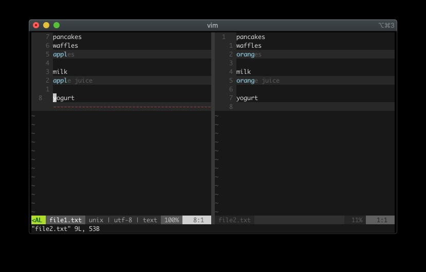

vimdiff 는 두 개의 버퍼를 나란히 표시합니다. 왼쪽에는 file1.txt 가, 오른쪽에는 file2.txt 가 있습니다. 첫 번째 차이점(사과와 오렌지)은 양쪽 줄 모두에서 강조 표시됩니다. 두 번째 버퍼에 오렌지가 아닌 사과가 표시되도록 하려면, 현재 위치(file1.txt)의 내용을 file2.txt 로 옮깁니다. 먼저 ]c 로 다음 diff 창으로 이동합니다. (이전 diff 창으로 이동하려면 [c 를 사용합니다.). 커서가 사과에 위치해야 합니다. 다음 명령을 실행합니다:

```
:diffput
```

이제 두 파일 모두 사과가 표시됩니다.

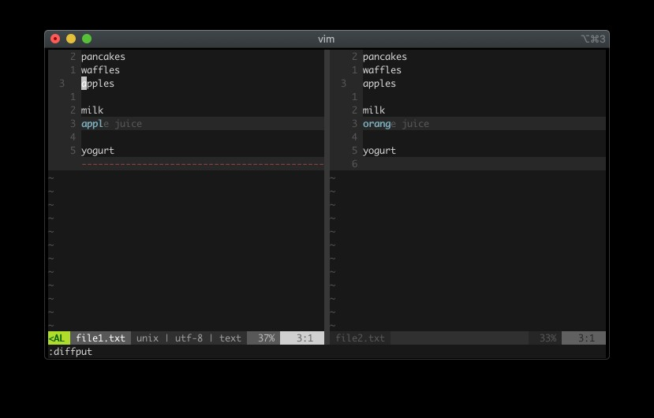

다른 버퍼(오렌지 주스, file2.txt)의 텍스트를 현재 버퍼(사과 주스, file1.txt)의 텍스트를 대체하도록 전송할 경우, 커서가 여전히 file1.txt 창에 있는 상태에서 먼저 ]c 로 다음 diff 창으로 이동합니다. 이제 커서는 사과 주스에 위치해야 합니다. :diffget 을 실행해서 다른 버퍼의 오렌지 주스를 가져와서 우리 버퍼의 사과 주스를 대체합니다.

:diffput 은 현재 버퍼의 텍스트를 다른 버퍼로 내보냅니다. :diffget 은 다른 버퍼의 텍스트를 현재 버퍼로 가져옵니다. 여러 개의 버퍼가 있는 경우 :diffput fileN.txt 및 :diffget fileN.txt 를 실행해서 fileN 버퍼를 지정할 수 있습니다.


## Vim As A Merge Tool 
“I love resolving merge conflicts!” - Nobody

머지 충돌 해결을 좋아하는 사람은 본 적이 없습니다. 하지만, 피할 수 없는 일입니다. 

이번 섹션은 Vim을 머지 충돌 해결 도구로 활용하는 방법을 배웁니다.

먼저 기본 머지 도구를 vimdiff 로 변경하려면 다음 명령을 실행합니다:

```
git config merge.tool vimdiff
git config merge.conflictstyle diff3
git config mergetool.prompt false
```

또는 ~/.gitconfig 파일을 직접 수정할 수도 있습니다. (기본적으로 루트 디렉터리에 있지만, 사용자에 따라 위치가 다를 수 있음) 

위의 명령어는 gitconfig 파일을 아래 설정과 동일하게 수정합니다. 아직 실행하지 않았다면 gitconfig 파일을 수동으로 편집해도 됩니다.

```
[core]
  editor = vim
[merge]
  tool = vimdiff
  conflictstyle = diff3
[difftool]
  prompt = false
```

테스트를 위해 가짜 병합 충돌을 생성해 보겠습니다. /food 디렉터리를 생성하고 git 저장소로 설정합니다:

```
git init
```

breakfast.txt 파일을 추가합니다. 내용:

```
pancakes
waffles
oranges
```

파일을 추가하고 커밋합니다:

```
git add .
git commit -m “Initial breakfast commit”
```

다음으로 새 브랜치를 생성하고 apples branch 라고 명명합니다:

```
git checkout -b apples
```

breakfast.txt 파일을 변경합니다:

```
pancakes
waffles
apples
```

파일을 저장한 후 변경 사항을 추가하고 커밋합니다:

```
git add .
git commit -m “Apples not oranges”
```

좋습니다. 이제 master 브랜치에는 오렌지가, apples 브랜치에는 사과가 있습니다. master 브랜치로 돌아갑니다:

```
git checkout master
```

breakfast.txt 파일에는 기본 텍스트인 오렌지가 표시되어야 합니다. 지금 제철인 포도로 변경해 봅시다:

```
pancakes
waffles
grapes
```

저장, 추가, 커밋:

```
git add .
git commit -m “Grapes not oranges”
```

이제 애플스 브랜치를 마스터 브랜치에 병합할 준비가 되었습니다:

```
git merge apples
```

다음과 같은 오류가 표시될 것입니다:

```
자동 병합: breakfast.txt
충돌 발생 (내용): breakfast.txt에서 병합 충돌 발생
자동 병합 실패; 충돌을 해결한 후 결과를 커밋합니다.
충돌 발생, 좋습니다! 새로 설정된 병합 도구(mergetool)를 사용해서 충돌을 해결해 보겠습니다. 다음 명령을 실행합니다:
git mergetool
```

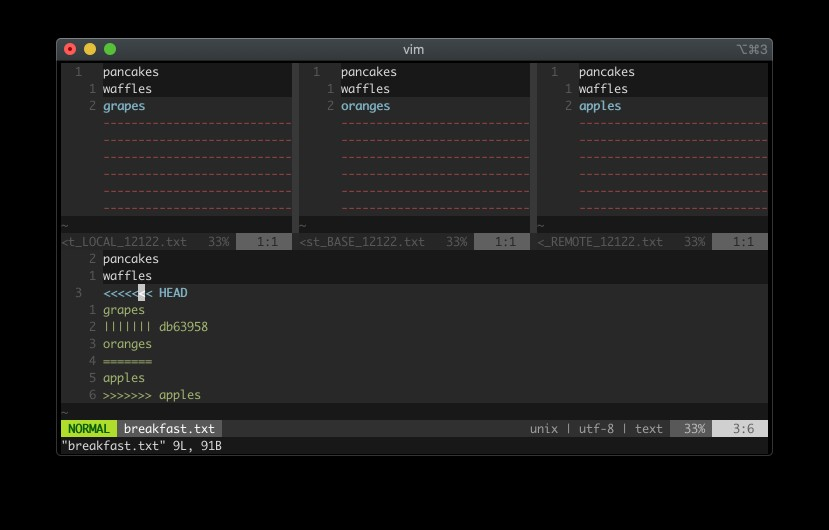

Vim은 네 개의 창을 표시합니다. 상단 세 개에 주목합니다:

- LOCAL에는 포도가 포함됩니다. 이는 “로컬”의 변경 사항으로, 병합 대상입니다.
- BASE에는 오렌지가 포함됩니다. 이는 LOCAL과 REMOTE의 공통 조상으로, 두 창이 어떻게 갈라졌는지 비교하기 위한 것입니다.
- REMOTE에는 사과가 있습니다. 이 창은 병합 대상입니다.

하단(네 번째 창)에는 다음과 같이 표시됩니다:

```
pancakes
waffles
<<<<<<< HEAD
grapes
||||||| db63958
oranges
=======
apples
>>>>>>> apples
```

네 번째 창에는 병합 충돌 텍스트가 표시됩니다. 이 구성으로 각 환경의 변경 사항을 좀 더 쉽게 확인할 수 있습니다. LOCAL, BASE, REMOTE의 내용을 동시에 볼 수 있습니다. 커서는 네 번째 창, 강조 표시된 영역에 위치해야 합니다. LOCAL(포도)의 변경 사항을 확인하려면 :diffget LOCAL 을 실행합니다. BASE(오렌지)의 변경 사항을 확인하려면 :diffget BASE 를, REMOTE(사과)의 변경 사항을 확인하려면 :diffget REMOTE 를 실행합니다. (grapes)의 변경 사항을 확인하려면 :diffget LOCAL 을 실행합니다. BASE (oranges)의 변경 사항을 확인하려면 :diffget BASE 를, REMOTE (apples)의 변경 사항을 확인하려면 :diffget REMOTE 를 실행합니다.

이번에는 LOCAL 의 변경 사항을 확인해 보겠습니다. :diffget LOCAL 을 실행합니다. 이제 네 번째 창에 grapes 가 표시됩니다. 작업 완료 후 모든 파일을 저장하고 종료합니다. (:wqall) 어렵지 않습니다.

참고로, 이제 breakfast.txt.orig 파일도 생성됐습니다. Git은 문제가 발생할 경우를 대비해서 백업 파일을 생성합니다. 병합 시 Git이 백업 파일을 생성하지 않도록 하려면 다음 명령을 실행합니다:

```
git config --global mergetool.keepBackup false
```


## Git Inside Vim 
Vim에는 기본적으로 내장된 git 기능이 없습니다. Vim에서 git 명령어를 실행하는 한 가지 방법은 명령줄 모드에서 뱅 연산자(!)를 사용하는 것입니다.

모든 git 명령어는 ! 로 실행할 수 있습니다:

```
:!git status
:!git commit
:!git diff
:!git push origin master
```

Vim의 % (현재 버퍼) 또는 # (다른 버퍼) 규칙도 사용할 수 있습니다:

```
:!git add % " 현재 파일 git add
:!git checkout # " 다른 파일 git checkout
```

다른 Vim 창에 있는 여러 파일을 추가하는 Vim 트릭은 다음과 같습니다:

```
:windo !git add %
```

그런 다음 커밋합니다:

```
:!git commit “Vim 창에 있는 모든 파일을 방금 git 추가했어요, 멋지죠”
```

windo 명령어는 Vim의 “do” 명령어 중 하나로, 이전에 보셨던 argdo 와 유사합니다. windo 는 각 창에서 명령어를 실행합니다. 대안으로, 작업 흐름에 따라 bufdo !git add % 를 사용해서 모든 버퍼를 git add 하거나 argdo !git add % 를 사용해서 모든 파일 인수를 git add 할 수도 있습니다.


## Plugins 
Vim용 git 지원 플러그인은 다양합니다. 아래는 Vim용 인기 있는 git 관련 플러그인 목록입니다. (이 글을 읽는 시점에는 더 많을 수 있음):

- vim-gitgutter³⁷
- vim-signify³⁸
- vim-fugitive³⁹
- gv.vim⁴⁰
- vimagit⁴¹
- vim-twiggy⁴²
- rhubarb⁴³

가장 널리 쓰이는 플러그인 중 하나는 vim-fugitive 입니다. 

이번 장의 나머지 부분은 이 플러그인을 활용한 여러 git 워크플로우를 살펴보겠습니다.

ZZZZZ

## Vim-fugitive 
vim-fugitive 플러그인을 사용하면 Vim 편집기를 벗어나지 않고도 git CLI를 실행할 수 있습니다.
일부 명령어는 Vim 내부에서 실행할 때 더 편리하다는 것을 알게 될 것입니다.
시작하려면 vim 플러그인 관리자(vim-plug⁴⁴, vundle⁴⁵, dein.vim⁴⁶ 등)를 통해 vim-fugitive를 설치합니다.


## Git Status 
:Git 명령어를 매개변수 없이 실행하면 vim-fugitive가 git 요약 창을 표시합니다.
추적되지 않은 파일, 스테이징되지 않은 파일, 스테이징된 파일을 보여줍니다.
이 “git status” 모드에서는 다음과 같은 작업을 수행할 수 있습니다:
- Ctrl-N / Ctrl-P: 파일 목록을 위/아래로 이동합니다.
- 커서 위치 파일 스테이징/스테이징 해제: -
- 커서 위치 파일 스테이징: s
- 커서 위치 파일 스테이징 해제: u
- 커서 위치 파일 인라인 차이 표시/숨기기: > / <

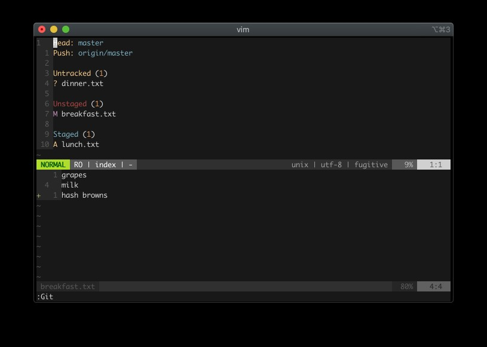

자세한 내용은 :h fugitive-staging-maps 를 참고합니다.


## Git Blame 
현재 파일에서 :Git blame 명령을 실행하면 vim-fugitive가 분할된 blame 창을 표시합니다.
이는 버그가 있는 코드 줄을 작성한 책임자를 찾아내어 그에게/그녀에게 화를 낼 수 있게 해줍니다
(농담입니다).
이 “git blame” 모드에서 수행할 수 있는 작업:
- q: blame 창 닫기
- A: 작성자 열 크기 조정
- C: 커밋 열 크기 조정
- D: 날짜/시간 열 크기 조정
자세한 내용은 :h :Git_blame 참조 

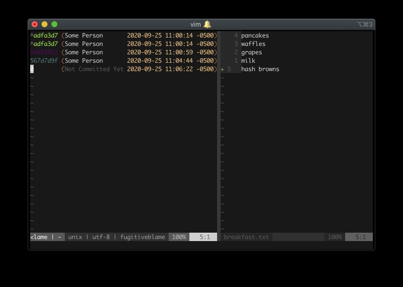

vimdiff 모드에 있으므로 :diffput 및 :diffget 명령으로 diff를 가져오거나 적용할 수 있습니다. 


## Gdiffsplit 
:Gdiffsplit 명령을 실행하면 vim-fugitive는 현재 파일의 최신 변경 사항을 인덱스 또는 작업 트리와 비교해서 vimdiff를 실행합니다. :Gdiffsplit <commit>을 실행하면 vim-fugitive는 <commit> 내부의 해당 파일을 대상으로 vimdiff를 실행합니다. 

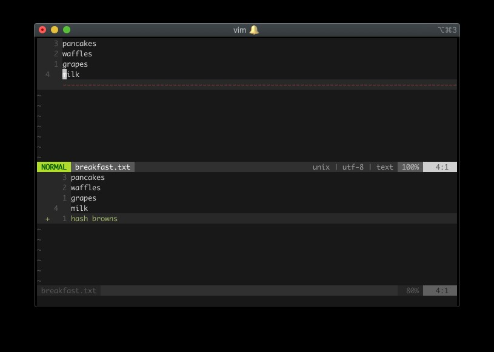


## Gwrite And Gread 
파일에서 변경 후 :Gwrite 명령을 실행하면 vim-fugitive가 변경 사항을 스테이징합니다.
이는 git add <현재 파일> 실행과 유사합니다.
파일에서 변경 후 :Gread 명령을 실행하면 vim-fugitive가 파일을 변경 전 상태로 복원합니다. 이는 git checkout <현재 파일>을 실행하는 것과 같습니다. :Gread 실행의 장점 중 하나는
이 작업이 실행 취소 가능하다는 점입니다. :Gread 실행 후 마음이 바뀌어 이전 변경 사항을 유지하고 싶다면
단순히 undo(u)를 실행하면 Vim이 :Gread 작업을 취소합니다. CLI에서 git checkout <현재 파일>을 실행했다면
이런 작업 취소는 불가능했을 것입니다.


## Gclog 
:Gclog 명령을 실행하면 vim-fugitive가 커밋 기록을 표시합니다. 이는
git log 명령을 실행하는 것과 유사합니다. Vim-fugitive는 이를 수행하기 위해 Vim의 퀵픽스를 사용하므로, :cnext 및
:cprevious를 사용해서 다음 또는 이전 로그 정보로 이동할 수 있습니다. :copen 및 :cclose로
로그 목록을 열고 닫을 수 있습니다. 

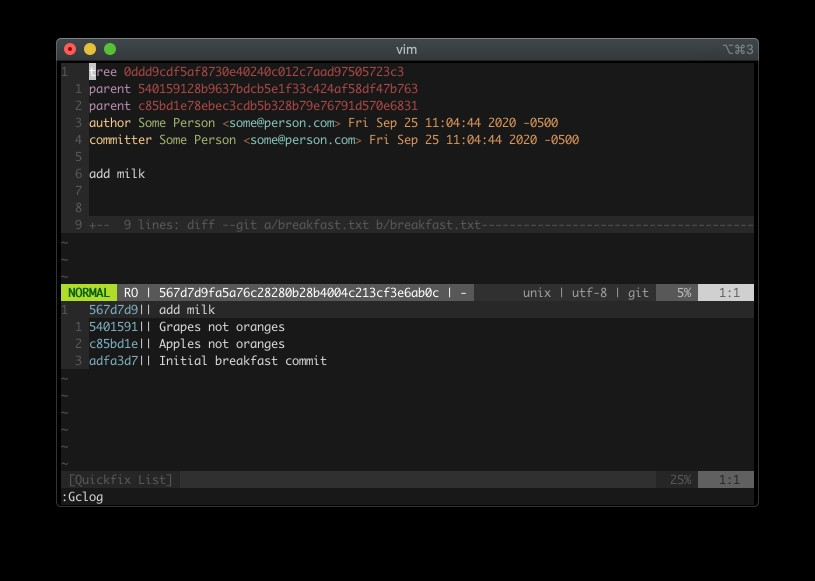

이 “git log” 모드에서는 두 가지 작업을 수행할 수 있습니다:
- 트리를 확인합니다.
- 부모(이전 커밋)를 방문합니다.
:Gclog 명령어에는 git log 명령어와 마찬가지로 인수를 전달할 수 있습니다. 프로젝트의 커밋 기록이 길고 최근 세 개의 커밋만 확인해야 한다면 :Gclog -3 을 실행하면 됩니다. 커밋 날짜 기준으로 필터링해야 한다면 :Gclog --after="January 1"
--before="March 14" 
과 같은 명령어를 실행할 수 있습니다. 


## More Vim-Fugitive 
이것들은 vim-fugitive가 할 수 있는 일의 일부 예시일 뿐입니다. vim-fugitive에 대해 더 알고 싶다면 :h fugitive.txt를 확인합니다. 대부분의 인기 있는 git 명령어는 아마도 vim-fugitive로 최적화되어 있을 것입니다.
문서에서 찾아보기만 하면 됩니다.
vim-fugitive의 “특수 모드”(예: :Git 또는 :Git blame 모드) 내에서 사용 가능한 단축키를 확인하려면 g? 를 누르세요. vim-fugitive가 현재 모드에 맞는 :help 창을 표시해 줍니다. 편리하죠!


## Learn Vim And Git The Smart Way 
vim-fugitive가 여러분의 작업 흐름에 좋은 보완이 될 수도 있고 아닐 수도 있습니다. 어쨌든, 위에 나열된 모든 플러그인을 꼭 확인해 보시길 강력히 권합니다. 제가 언급하지 않은 다른 플러그인들도 있을 겁니다. 직접 사용해 보세요.
Vim-git 통합을 더 잘 활용하는 확실한 방법은 git에 대해 더 많이 공부하는 것입니다. git 자체만 해도 방대한 주제이며, 저는 그 일부만 보여드렸을 뿐입니다. 자, 그럼 이제 본격적으로 시작해 보죠(말장난 용서해주세요). Vim을 사용해 코드를 컴파일하는 방법에 대해 이야기해 보겠습니다!


# Ch19. Compile 
컴파일은 많은 언어에서 중요한 주제입니다. 이 장에서는 Vim에서 컴파일하는 방법을 배우게 됩니다. 또한 Vim의 :make 명령어를 활용하는 방법도 살펴볼 것입니다.


## Compile From the Command Line 
bang 연산자(!)를 사용해 컴파일할 수 있습니다. .cpp 파일을 g++로 컴파일해야 한다면 다음을 실행합니다:
:!g++ hello.cpp -o hello
하지만 매번 파일명과 출력 파일명을 수동으로 입력해야 하는 것은 오류가 발생하기 쉽고 번거롭습니다.
이럴 때는 메이크파일을 사용하는 것이 좋습니다.


## The Make Command 
Vim에는 makefile을 실행하는 :make 명령어가 있습니다. 실행 시 Vim은 현재 디렉터리에서 실행할 makefile을 찾습니다.
현재 디렉터리에 makefile이라는 파일을 생성하고 다음 내용을 넣으세요:
all:
  echo “Hello all”
foo:
  echo “Hello foo”
list_pls:
  ls
Vim에서 다음 명령을 실행합니다:
:make
Vim은 터미널에서 실행할 때와 동일한 방식으로 이를 실행합니다. :make 명령은 터미널의 make 명령과 마찬가지로 매개변수를 받습니다. 다음을 실행해 보세요:
:make foo
“Hello foo”를 출력합니다
:make list_pls
ls 명령 결과를 출력합니다
:make 명령어는 잘못된 명령어를 실행할 경우 Vim의 퀵픽스(quickfix)를 사용해서 오류를 저장합니다. 존재하지 않는 대상을 실행해 보겠습니다:
:make dontexist
해당 명령어를 실행하면 오류가 표시됩니다. 오류를 확인하려면 퀵픽스 명령어 :copen을 실행해서 퀵픽스 창을 엽니다:
|| make: *** 대상 `dontexist'를 생성할 규칙이 없습니다. 중지.


## Compiling With Make 
메이크파일을 사용해 기본적인 .cpp 프로그램을 컴파일해 보겠습니다. 먼저 hello.cpp 파일을 생성합니다:
#include <iostream>
int main() {
std::cout << “Hello!\\n”;
return 0;
}
메이크파일을 업데이트해서 .cpp 파일을 빌드하고 실행하도록 합니다:
all:
echo “build, run”
build:
g++ hello.cpp -o hello
run:
./hello
이제 실행합니다:
:make build
g++가 ./hello.cpp를 컴파일하고 ./hello를 생성합니다. 그런 다음 실행합니다:
:make run
터미널에 “Hello!”가 출력되는 것을 확인할 수 있습니다.


## Different Make Program 
:make 명령을 실행하면 Vim은 실제로 makeprg 옵션 아래에 설정된 명령을 실행합니다.
:set makeprg? 를 실행하면 다음과 같이 표시됩니다:
makeprg=make
기본 :make 명령은 make 외부 명령입니다.
:make 명령을 실행할 때마다 g++ {파일명} 을 실행하도록 변경하려면 다음을 실행합니다:
:set makeprg=g++\ %
\ 기호는 g++ 뒤의 공백을 이스케이프하기 위한 것입니다. Vim에서 % 기호는 현재 파일을 나타냅니다.
명령 g++\\ %는 g++ hello.cpp 실행과 동일합니다.
./hello.cpp로 이동한 후 :make 를 실행합니다. 출력 경로를 지정하지 않았기 때문에 Vim은 hello.cpp를 컴파일하고 .out 파일을 생성합니다. 컴파일된 출력 파일명을 원본 파일명에서 확장자를 제외한 이름으로 지정하도록 리팩토링해 보겠습니다. 다음 명령을 실행하거나 vimrc에 추가합니다:
set makeprg=g++\ %\ -o\ %<
세부 설명:
- g++\ %는 위와 동일합니다. g++ <your-file> 실행과 동일합니다.
- -o는 출력 옵션입니다.
- Vim에서 %<는 확장자를 제외한 현재 파일 이름을 나타냅니다( hello.cpp 는 hello 가 됨).
./hello.cpp 내부에서 :make를 실행하면 ./hello로 컴파일됩니다. ./hello.cpp 내부에서 ./hello를 빠르게 실행하려면 :!./%<를 실행합니다. 이는 :!./{확장자를 제외한 현재 파일 이름} 실행과 동일합니다.
자세한 내용은 :h :compiler 및 :h write-compiler-plugin을 참고합니다. 


## Auto-compile On Save 
컴파일을 자동화하면 작업을 더욱 편리하게 만들 수 있습니다. Vim의 autocmd를 사용하면 특정 이벤트에 기반해 자동 작업을 실행할 수 있다는 점을 기억합니다. .cpp 파일을 저장할 때마다 자동으로 컴파일하려면 vimrc에 다음을 추가합니다:
autocmd BufWritePost *.cpp make
.cpp 파일 내에서 저장할 때마다 Vim이 make 명령을 실행합니다.


## Switching Compiler 
Vim에는 컴파일러를 빠르게 전환하는 :compiler 명령어가 있습니다. 사용 중인 Vim 빌드에는 여러 사전 구축된 컴파일러 구성이 포함되어 있을 것입니다. 보유한 컴파일러를 확인하려면 다음을 실행합니다:
:e $VIMRUNTIME/compiler/`<Tab>`
다양한 프로그래밍 언어용 컴파일러 목록이 표시됩니다.
:compiler 명령어 사용법 예시: 루비 파일 hello.rb가 있고 그 안에 다음과 같은 내용이 있다고 가정합니다.
puts “Hello ruby”
:make 를 실행하면 Vim은 makeprg 에 할당된 명령어(기본값은
make )를 실행합니다. 다음 명령어를 실행하면:
:compiler ruby
를 실행하면 Vim은 $VIMRUNTIME/compiler/ruby.vim 스크립트를 실행하고 makeprg를 루비 명령어로 변경합니다. 이제 :set makeprg? 를 실행하면 makeprg=ruby 로 표시될 것입니다(이는 $VIMRUNTIME/compiler/ruby.vim 파일 내용이나 다른 커스텀 루비 컴파일러 사용 여부에 따라 다릅니다).
사용자 환경은 다를 수 있음). :compiler {your-lang} 명령어를 사용하면 다른 컴파일러로 빠르게 전환할 수 있습니다.
프로젝트에서 여러 언어를 사용하는 경우 유용합니다.
프로그램 컴파일에 반드시 :compiler와 makeprg를 사용할 필요는 없습니다. 테스트 스크립트 실행,
파일 린트 검사, 신호 전송 등 원하는 작업을 수행할 수 있습니다.


## Creating A Custom Compiler 
간단한 타입스크립트 컴파일러를 만들어 보겠습니다. 타입스크립트를 설치합니다(npm install -g typescript). 이제 tsc 명령어가 사용 가능해집니다. 타입스크립트를 처음 사용한다면, tsc는 타입스크립트 파일을 자바스크립트 파일로 컴파일합니다. hello.ts 파일이 있다고 가정해 보겠습니다:
const hello = “hello”;
console.log(hello);
tsc hello.ts 를 실행하면 hello.js 로 컴파일됩니다. 그러나 hello.ts 안에 다음과 같은 표현식이 있다면:
const hello = “hello”;
hello = “hello again”;
console.log(hello);
이는 const 변수를 변경할 수 없기 때문에 오류를 발생시킵니다. tsc hello.ts 를 실행하면
다음과 같은 오류가 발생합니다:
hello.ts:2:1 - error TS2588: Cannot assign to 'person' because it is a constant.
2 person = "hello again";
~~~~~~
Found 1 error.
간단한 타입스크립트 컴파일러를 만들려면, ~/.vim/ 디렉토리에 컴파일러 디렉터리(~/.vim/compiler/)를 추가한 후 typescript.vim 파일(~/.vim/compiler/typescript.vim)을 생성합니다. 다음 내용을 입력합니다:
CompilerSet makeprg=tsc
CompilerSet errorformat=%f:\ %m
첫 번째 줄은 tsc 명령을 실행하도록 makeprg를 설정합니다. 두 번째 줄은 오류 형식을 설정해서 파일(%f)을 표시한 후, 리터럴 콜론(:)과 이스케이프된 공백(\ )을 거쳐 오류 메시지(%m)를 표시합니다. 오류 형식에 대한 자세한 내용은 :h errorformat을 참고합니다. 
기존 컴파일러 예제도 참고해서 다른 방식도 살펴보세요. 다음 경로를 확인합니다:
$VIMRUNTIME/compiler/<some-language>.vim
일부 플러그인이 Typescript 파일과 충돌할 수 있으므로 --noplugin 플래그를 사용해 플러그인 없이 hello.ts 파일을 엽니다:
vim --noplugin hello.ts
makeprg를 확인합니다:
:set makeprg?
기본 make 프로그램이 표시되어야 합니다. 새 Typescript 컴파일러를 사용하려면 다음을 실행합니다:
:compiler typescript
:set makeprg? 를 실행하면 이제 tsc라고 표시되어야 합니다. 테스트해 보겠습니다. 다음을 실행합니다:
:make %
%는 현재 파일을 의미한다는 점을 기억합니다. Typescript 컴파일러가 예상대로 작동하는 것을 지켜보세요! 오류 목록을 보려면 다음을 실행합니다:
:copen 


## Async Compiler 
때로는 컴파일이 오래 걸릴 수 있습니다. 컴파일 프로세스가 완료되기를 기다리며 멈춰버린 Vim을 멍하니 바라보고 싶지는 않을 겁니다. 컴파일 중에도 Vim을 계속 사용할 수 있도록 비동기적으로 컴파일할 수 있다면 얼마나 좋을까요?
다행히 비동기 프로세스를 실행하는 플러그인이 있습니다. 주요한 두 가지는 다음과 같습니다:
- vim-dispatch⁴⁷
- asyncrun.vim⁴⁸
이 장의 나머지 부분에서는 vim-dispatch를 살펴보겠지만, 가능한 모든 플러그인을 직접 시도해 보시길 강력히 권장합니다.
Vim과 NeoVim은 실제로 비동기 작업을 지원하지만, 이는 이 장의 범위를 벗어납니다. 궁금하시다면 :h job-channel-overview.txt를 확인해 보세요. 


## Plugin: Vim-dispatch 
Vim-dispatch에는 여러 명령어가 있지만, 주요 명령어는 :Make와 :Dispatch 명령어입니다.

### Async Make
Vim-dispatch의 :Make 명령어는 Vim의 :make와 유사하지만 비동기적으로 실행됩니다. 자바스크립트 프로젝트에서 npm t를 실행해야 할 경우 makeprg를 다음과 같이 설정할 수 있습니다:
:set makeprg=npm\\ t
다음 명령을 실행하면:
:make
Vim은 npm t 를 실행하지만, 자바스크립트 테스트가 실행되는 동안 화면이 멈춘 상태로 보게 됩니다.
vim-dispatch를 사용하면 다음과 같이 실행하기만 하면 됩니다:
:Make
Vim은 npm t 를 비동기적으로 실행합니다. 이렇게 하면 npm t 가 백그라운드 프로세스에서 실행되는 동안
기존 작업을 계속할 수 있습니다. 대단하죠!

### Async Dispatch
:Dispatch 명령어는 :compiler 및 :! 명령어와 유사합니다. Vim 내에서 모든 외부 명령어를 비동기적으로 실행할 수 있습니다.
루비 스펙 파일 내에서 테스트를 실행해야 한다고 가정해 보겠습니다. 다음을 실행합니다:
:Dispatch bundle exec rspec %
Vim은 현재 파일(%)에 대해 rspec 명령어를 비동기적으로 실행합니다.

### Automating Dispatch
Vim-dispatch에는 특정 명령어를 자동으로 평가하도록 설정할 수 있는 b:dispatch 버퍼 변수가 있습니다.
autocmd를 활용할 수 있습니다. vimrc에 다음을 추가하면:
autocmd BufEnter *_spec.rb let b:dispatch = 'bundle exec rspec %'
이제 _spec.rb 로 끝나는 파일을 열 때마다( BufEnter ) :Dispatch 를 실행하면 자동으로
bundle exec rspec {your-current-ruby-spec-file} 이 실행됩니다. 

## Learn Compile The Smart Way 
이 장에서는 make 및 컴파일러 명령어를 사용해서 Vim 내부에서 비동기적으로 어떤 프로세스든 실행함으로써 프로그래밍 워크플로우를 보완할 수 있음을 배웠습니다. Vim이 다른 프로그램으로 자신을 확장할 수 있는 능력은 그 힘을 발휘하게 합니다.


# Ch20. Views, Sessions, And Viminfo 
프로젝트를 한동안 작업하다 보면, 점차 그 프로젝트만의 설정, 폴더, 버퍼, 레이아웃 등이 자리 잡는 것을 발견할 수 있습니다. 마치 한동안 살다 보면 아파트를 꾸미게 되는 것과 비슷하죠. 문제는 Vim을 닫으면 그 변경 사항들이 사라진다는 점입니다. 다음에 Vim을 열었을 때 마치 한 번도 떠나지 않은 것처럼 그대로 유지된다면 얼마나 좋을까요?
이 장에서는 View, Session, Viminfo를 활용해서 프로젝트의 “스냅샷”을 보존하는 방법을 배웁니다.


## View 
뷰는 세 가지(뷰, 세션, 비민포) 중 가장 작은 하위 집합입니다. 하나의 창에 대한 설정 모음입니다.
한 창에서 오랜 시간 작업하며 매핑과 폴드를 보존하고 싶다면 뷰를 사용할 수 있습니다.
foo.txt라는 파일을 생성해 보겠습니다:
foo1
foo2
foo3
foo4
foo5
foo6
foo7
foo8
foo9
foo10
이 파일에서 세 가지 변경을 수행합니다:
1. 1번째 줄에 수동 폴드 zf4j 생성 (다음 4줄을 폴드).
2. 번호 표시 설정 변경: setlocal nonumber norelativenumber . 이 설정은 창 좌측의
번호 표시기를 제거합니다.
3. j 키를 누를 때마다 한 줄이 아닌 두 줄씩 이동하도록 로컬 매핑을 생성합니다: :nnoremap
<buffer> j jj .
파일은 다음과 같이 표시되어야 합니다:
+-- 5 lines: foo1 -----
foo6
foo7
foo8
foo9
foo10


### Configuring View Attributes
실행:
:set viewoptions?
기본값은 다음과 같아야 합니다(vimrc에 따라 다를 수 있음):
viewoptions=folds,cursor,curdir
viewoptions를 설정해 보겠습니다. 유지하고 싶은 세 가지 속성은 폴드(folds), 커서 매핑(cursor),
로컬 설정 옵션(local set options)입니다. 설정값이 제 것과 같다면 이미 폴드 옵션이 있습니다. 뷰에 로컬옵션을 기억하도록 지시해야 합니다. 실행:
:set viewoptions+=localoptions
viewoptions에 사용할 수 있는 다른 옵션은 :h viewoptions를 참고합니다. 이제
:set viewoptions? 를 실행하면 다음과 같이 표시됩니다:
viewoptions=folds,cursor,curdir,localoptions

### Saving The View
foo.txt 창이 적절히 접혀 있고 nonumber 및 norelativenumber 옵션이 설정된 상태에서
뷰를 저장해 보겠습니다. 다음 명령을 실행합니다:
:mkview
Vim이 뷰 파일을 생성합니다.

### View Files
“Vim이 이 뷰 파일을 어디에 저장했을까?” 궁금할 수 있습니다. 저장 위치를 확인하려면 다음 명령을 실행합니다:
:set viewdir?
기본값은 ~/.vim/view로 표시됩니다(사용 중인 OS에 따라 경로가 다를 수 있음).
자세한 내용은 :h viewdir 참조). 다른 경로로 변경하려면 다음을
vimrc에 추가합니다:
set viewdir=$HOME/else/where

### Loading The View File
foo.txt 파일을 닫지 않았다면 닫은 후 다시 열어보세요. 변경 사항이 적용되지 않은 원본 텍스트가 표시될 것입니다. 이는 정상적인 동작입니다.
상태를 복원하려면 뷰 파일을 불러와야 합니다. 다음 명령을 실행합니다:
:loadview
이제 다음과 같이 표시될 것입니다:
+-- 5 lines: foo1 -----
foo6
foo7
foo8
foo9
foo10
폴드, 로컬 설정, 로컬 매핑이 복원됩니다. 확인해보면 커서가 :mkview 실행 시 마지막으로 사용했던 줄에 위치해 있을 것입니다. 커서 옵션이 설정되어 있는 한, 뷰는 커서 위치도 기억합니다.

### Multiple Views
Vim에서는 9개의 번호가 매겨진 뷰(1-9)를 저장할 수 있습니다.
:9,10 fold . 명령어로 추가 폴드(예: 마지막 두 줄을 폴드)를 만들고 싶다고 가정해 보겠습니다.
이를 뷰 1로 저장해 보겠습니다. 다음 명령을 실행합니다:
:mkview 1
:6,7 fold로 또 다른 접기를 만들고 별도의 뷰로 저장하려면 다음을 실행합니다:
:mkview 2
파일을 닫습니다. foo.txt를 열었을 때 뷰 1을 불러오려면 다음을 실행합니다:
:loadview 1
뷰 2를 불러오려면 다음을 실행합니다:
:loadview 2
원래 뷰를 불러오려면 다음을 실행합니다:
:loadview

### Automating View Creation
가장 최악의 상황 중 하나는, 폴더로 대용량 파일을 정리하는 데 수많은 시간을 투자한 후
실수로 창을 닫아 모든 폴더 정보를 잃어버리는 경우입니다. 이를 방지하려면
버퍼를 닫을 때마다 자동으로 뷰를 생성하도록 설정할 수 있습니다. vimrc에 다음을 추가합니다:
autocmd BufWinLeave *.txt mkview
또한 버퍼를 열 때 뷰를 로드하는 것도 유용할 수 있습니다:
autocmd BufWinEnter *.txt silent loadview
이제 txt 파일을 작업할 때 뷰 생성 및 로드에 대해 더 이상 걱정할 필요가 없습니다.
시간이 지남에 따라 ~/.vim/view 디렉터리에 뷰 파일이 쌓일 수 있다는 점을 명심합니다.
몇 달에 한 번씩 정리하는 것이 좋습니다.


## Sessions 
뷰(View)가 창(window)의 설정을 저장한다면, 세션(Session)은 모든 창(레이아웃 포함)의 정보를 저장합니다.

### Creating A New Session
foobarbaz 프로젝트에서 다음 3개의 파일을 작업한다고 가정합니다:
foo.txt 내부:
foo1
foo2
foo3
foo4
foo5
foo6
foo7
foo8
foo9
foo10
bar.txt 내부:
bar1
bar2
bar3
bar4
bar5
bar6
bar7
bar8
bar9
bar10
baz.txt 내부:
baz1
baz2
baz3
baz4
baz5
baz6
baz7
baz8
baz9
baz10
창 레이아웃이 다음과 같이 배치되었다고 가정해 보겠습니다 (전략적으로 배치된 split 및 vsplit 사용):

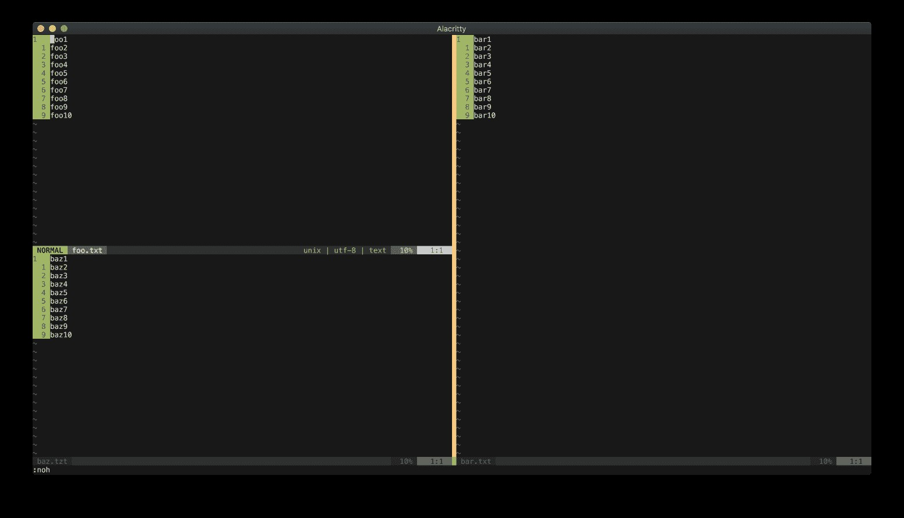

이 화면을 유지하려면 세션을 저장해야 합니다. 다음 명령을 실행합니다:
:mksession
기본적으로 ∼/.vim/view에 저장하는 mkview와 달리, mksession은 현재 디렉토리에 세션 파일(Session.vim)을 저장합니다. 내용이 궁금하다면 파일을 확인해 보세요.
세션 파일을 다른 위치에 저장하려면 mksession에 인수를 전달합니다:
:mksession ~/some/where/else.vim
기존 세션 파일을 덮어쓰려면 !를 붙여 명령을 실행합니다 ( :mksession!
∼/some/where/else.vim ).

### Loading A Session
세션을 로드하려면 다음을 실행합니다:
:source Session.vim
이제 Vim이 마지막으로 사용했던 모습 그대로 나타납니다! 또는 터미널에서 세션 파일을 로드할 수도 있습니다:
vim -S Session.vim

### Configuring Session Attributes
세션이 저장하는 속성을 구성할 수 있습니다. 현재 저장 중인 항목을 확인하려면 다음 명령을 실행합니다:
:set sessionoptions?
제 설정은 다음과 같습니다:
blank,buffers,curdir,folds,help,tabpages,winsize,terminal
세션 저장 시 터미널을 저장하지 않으려면 세션 옵션에서 제거합니다.
다음 명령을 실행합니다:
:set sessionoptions-=terminal
세션을 저장할 때 옵션을 추가하려면 다음을 실행합니다:
:set sessionoptions+=options
sessionoptions가 저장할 수 있는 속성 몇 가지는 다음과 같습니다:
- blank: 빈 창 저장
- buffers: 버퍼 저장
- folds: 폴드 저장
- globals: 전역 변수 저장 (대문자로 시작하고 소문자가 하나 이상 포함되어야 함)
- options: 옵션 및 매핑 저장
- resize: 창 행 및 열 저장
- winpos: 창 위치 저장
- winsize: 창 크기 저장
- tabpages: 탭 저장
- unix: Unix 형식의 파일 저장
전체 목록은 :h ‘sessionoptions’ 를 참고합니다.
세션은 프로젝트의 외부 속성을 보존하는 유용한 도구입니다. 그러나 로컬 마크, 레지스터, 히스토리 등 일부 내부 속성은 세션에 저장되지 않습니다. 이를 저장하려면 Viminfo를 사용해야 합니다!


## Viminfo 
주목해 보세요. 단어를 레지스터 a에 저장하고 Vim을 종료한 후, 다음에 Vim을 열면
해당 텍스트가 여전히 레지스터에 저장되어 있습니다. 이는 사실 Viminfo의 역할입니다. Viminfo가 없다면, Vim은 종료 후 레지스터 내용을 기억하지 못합니다.
Vim 8 이상을 사용한다면, Vim은 기본적으로 Viminfo를 활성화하므로 여러분은 모르고 있었을지 몰라도
지금까지 계속 Viminfo를 사용해 왔을 수도 있습니다!
“Viminfo는 무엇을 저장하나요? 세션(Session)과 어떻게 다른가요?”라고 궁금해할 수 있습니다.
Viminfo를 사용하려면 먼저 +viminfo 기능이 활성화되어 있어야 합니다 ( :version ). Viminfo는 다음을 저장합니다:
- 명령줄 기록.
- 검색 문자열 기록.
- 입력줄 기록.
- 비어 있지 않은 레지스터 내용.
- 여러 파일의 마크.
- 파일 내 위치를 가리키는 파일 마크.
- 마지막 검색/대체 패턴(‘n’ 및 ‘&’용).
- 버퍼 목록.
- 전역 변수.
일반적으로 세션은 “외부” 속성을 저장하고 Viminfo는 “내부” 속성을 저장합니다.
프로젝트마다 하나의 세션 파일을 가질 수 있는 세션과 달리, 일반적으로 컴퓨터마다 하나의 Viminfo 파일을 사용합니다. Viminfo는 프로젝트에 구애받지 않습니다.
Unix의 기본 Viminfo 위치는 $HOME/.viminfo ( ∼/.viminfo )입니다. 다른 OS를 사용하는 경우
Viminfo 위치가 다를 수 있습니다. :h viminfo-file-name 을 확인합니다. 레지스터에 텍스트를 붙여넣기하는 등
“내부” 변경을 할 때마다 Vim은 자동으로 Viminfo 파일을 업데이트합니다.
nocompatible 옵션이 설정되어 있는지 확인합니다 ( set nocompatible ). 그렇지 않으면 Viminfo가
작동하지 않습니다.

### Writing And Reading Viminfo
비록 하나의 Viminfo 파일만 사용하더라도 여러 개의 Viminfo 파일을 생성할 수 있습니다.
Viminfo 파일을 작성하려면 :wvimfo 명령어(줄여서 :wv)를 사용합니다.
:wv ~/.viminfo_extra
기존 Viminfo 파일을 덮어쓰려면 wv 명령어에 느낌표를 추가합니다:
:wv! ~/.viminfo_extra
기본적으로 Vim은 ~/.viminfo 파일에서 정보를 읽습니다. 다른 Viminfo 파일을 읽으려면 :rviminfo 명령을 실행하거나,
줄여서 :rv를 사용합니다:
:rv ~/.viminfo_extra
터미널에서 다른 Viminfo 파일로 Vim을 시작하려면 i 플래그를 사용합니다:
vim -i viminfo_extra
코딩과 글쓰기처럼 서로 다른 작업에 Vim을 사용하는 경우, 글쓰기에 최적화된 Viminfo와 코딩용 Viminfo를 각각 생성할 수 있습니다.
vim -i viminfo_writing
vim -i viminfo_coding

### Starting Vim Without Viminfo
Viminfo 없이 Vim을 시작하려면 터미널에서 다음 명령을 실행합니다:
vim -i NONE
영구적으로 설정하려면 vimrc 파일에 다음을 추가합니다:
set viminfo="NONE"

### Configuring Viminfo Attributes
viewoptions 및 sessionoptions와 유사하게, viminfo 옵션을 통해 저장할 속성을 지정할 수 있습니다. 다음 명령을 실행합니다:
:set viminfo?
다음 결과가 표시됩니다:
!,'100,<50,s10,h
이것은 암호처럼 보입니다. 하나씩 살펴보겠습니다:
- !: 대문자로 시작하고 소문자를 포함하지 않는 전역 변수를 저장합니다. g:는 전역 변수를 나타냅니다. 예를 들어,
let g:FOO = “foo” 를 작성했다면 Viminfo는 전역 변수 FOO를 저장합니다. 그러나
let g:Foo = “foo” 를 작성했다면, 소문자가 포함되어 있어 Viminfo는 이 전역 변수를 저장하지 않습니다. ! 없이 Vim은 이러한 전역 변수를 저장하지 않습니다.
- '100은 마크를 의미합니다. 이 경우 Viminfo는 마지막 100개 파일의 로컬 마크(a-z)를 저장합니다.
Viminfo에 저장할 파일을 너무 많이 지정하면 Vim이 느려질 수 있으니 주의합니다. 1000개가 적정 수치입니다.
- <50은 각 레지스터에 저장되는 최대 줄 수(이 경우 50줄)를 Viminfo에 알려줍니다. 예를 들어, 레지스터 a에 100줄의 텍스트를 복사( “ay99j )한 후 Vim을 종료하면, 다음에 Vim을 열고 레지스터 a에서 붙여넣기( ”ap )할 때 Vim은 최대 50줄만 붙여넣습니다. 최대 줄 수를 지정하지 않으면 모든 줄이 저장됩니다. 0을 지정하면 아무것도 저장되지 않습니다.
- s10은 레지스터의 크기 제한(kb 단위)을 설정합니다. 이 경우 10kb를 초과하는 레지스터는 제외됩니다.
- h는 Vim 시작 시 강조 표시(hlsearch 기능)를 비활성화합니다.
추가 옵션은 :h 'viminfo'를 참고합니다. 


## Using Views, Sessions, And Viminfo The Smart Way 
Vim은 뷰(View), 세션(Session), 비민포(Viminfo)를 통해 서로 다른 수준의 Vim 환경 스냅샷을 생성합니다.
소규모 프로젝트에는 뷰를, 대규모 프로젝트에는 세션을 사용합니다. 뷰, 세션, 비민포가 제공하는 모든 옵션을
꼼꼼히 살펴보는 시간을 가져야 합니다.
자신만의 편집 스타일에 맞춰 뷰, 세션, 비민포를 생성합니다. 컴퓨터 외부에서 Vim을 사용해야 할 경우, 설정만 불러오면 즉시 익숙한 환경을 느낄 수 있습니다!


# Ch21. Vimrc 
이전 장에서는 Vim 텍스트 편집기 사용법을 배웠습니다. 이는 훌륭하지만 전부가 아닙니다.
Vim을 더 효과적으로 사용하려면 설정 방법을 배워야 합니다. 시작하기 가장 좋은 곳은
vimrc 파일입니다. 계속됩니다
이전 장에서는 Vim 사용법을 배웠습니다. 이 장에서는 vimrc를 구성하고 설정하는 방법을 배울 것입니다.


## How Vim Finds Vimrc 
vimrc에 대한 일반적인 방법은 루트 디렉터리(∼/.vimrc, OS에 따라 다를 수 있음)에 .vimrc 닷 파일을 추가하는 것입니다.
Vim은 백그라운드에서 vimrc 파일을 여러 위치에서 찾습니다. Vim이 확인하는 위치는 다음과 같습니다:
- $VIMINIT
- $HOME/.vimrc
- $HOME/.vim/vimrc
- $EXINIT
- $HOME/.exrc
- $VIMRUNTIME/default.vim
Vim을 시작하면 위 여섯 위치를 순서대로 vimrc 파일을 검색합니다. 첫 번째로 발견된 vimrc 파일이 사용되며 나머지는 무시됩니다.
먼저 Vim은 $VIMINIT 파일을 찾습니다. 해당 위치에 파일이 없으면 $HOME/.vimrc 를 확인합니다.
여기에 파일이 없으면 $HOME/.vim/vimrc 를 확인합니다. Vim이 이 파일을 찾으면 더 이상 검색하지 않고
$HOME/.vim/vimrc 를 사용합니다.
첫 번째 위치인 $VIMINIT 는 환경 변수입니다. 기본적으로 정의되어 있지 않습니다.
~/.dotfiles/testvimrc 를 $VIMINIT 값으로 사용하려면, 해당 vimrc 파일의 경로를 포함하는 환경 변수를 생성하면 됩니다.
export VIMINIT='let $MYVIMRC=“$HOME/dotfiles/testvimrc”
| source $MYVIMRC' 를 실행한 후에는, Vim이 ~/.dotfiles/testvimrc 를 vimrc 파일로 사용하게 됩니다.
두 번째 위치인 $HOME/.vimrc는 많은 Vim 사용자에게 관례적인 경로입니다. 대부분의 경우 $HOME은 사용자의 루트 디렉터리(~)입니다. ~/.vimrc 파일이 존재하면 Vim은 이를 기본 vimrc 파일로 사용합니다.
세 번째 위치인 $HOME/.vim/vimrc는 ~/.vim 디렉터리 내에 위치합니다. 플러그인, 사용자 정의 스크립트 또는 뷰 파일을 위해 ~/.vim 디렉터리가 이미 존재할 수 있습니다. vimrc 파일 이름에는 점이 없다는 점에 유의합니다( $HOME/.vim/.vimrc는 작동하지 않지만 $HOME/.vim/vimrc는 작동합니다).
네 번째, $EXINIT는 $VIMINIT와 유사하게 작동합니다.
다섯 번째, $HOME/.exrc는 $HOME/.vimrc와 유사하게 작동합니다.
여섯 번째, $VIMRUNTIME/defaults.vim은 Vim 빌드에 포함된 기본 vimrc 파일입니다. 제 경우
Homebrew로 설치한 Vim 8.2를 사용 중이므로 경로는 ( /usr/local/share/vim/vim82 )입니다. Vim이
앞서 언급한 여섯 개의 vimrc 파일을 모두 찾지 못하면 이 파일을 사용합니다.
본 장의 나머지 부분에서는 vimrc가 ∼/.vimrc 경로를 사용한다고 가정하겠습니다.


## What To Put In My Vimrc? 
시작할 때 제가 던진 질문은 “vimrc에 무엇을 넣어야 할까?”였습니다.
답은 “원하는 건 뭐든 넣으세요”입니다. 다른 사람의 vimrc를 복사해 붙여넣고 싶은 유혹은 분명히 있지만,
그 유혹을 이겨내야 합니다. 꼭 다른 사람의 vimrc를 사용해야 한다면, 그 설정이 무엇을 하는지,
왜 그리고 어떻게 사용하는지, 그리고 가장 중요한 것은 자신에게 적합한지 반드시 확인합니다. 누군가가 사용한다고 해서
당신도 반드시 사용해야 하는 건 아닙니다.


## Basic Vimrc Content 
간단히 말해, vimrc는 다음 요소들의 모음입니다:
- 플러그인
- 설정
- 사용자 정의 함수
- 사용자 정의 명령어
- 매핑
위에서 언급하지 않은 다른 요소들도 있지만, 일반적으로 이 항목들이 대부분의 사용 사례를 포괄합니다.

### Plugins
이전 장들에서 fzf.vim⁴⁹, vim-mundo⁵⁰, vim-fugitive⁵¹ 같은 다양한 플러그인들을 언급한 바 있습니다.
10년 전만 해도 플러그인 관리는 악몽과 같았습니다. 하지만 현대적인 플러그인 관리자의 등장으로 이제는 플러그인 설치가 몇 초 만에 가능해졌습니다. 현재 저는 vim-plug⁵²를 플러그인 관리자로 사용하고 있으므로, 이 섹션에서는 이를 예시로 설명하겠습니다. 다른 인기 있는 플러그인 관리자들도 개념은 비슷할 것입니다. 다음과 같은 다양한 관리자들을 살펴보시길 강력히 권장합니다:
- vundle.vim⁵³
- vim-pathogen⁵⁴
- dein.vim⁵⁵
위에서 언급한 것들 외에도 더 많은 플러그인 관리자가 있으니 자유롭게 찾아보세요. vim-plug를 설치하려면, 유닉스 머신이 있다면 다음을 실행합니다:
curl -fLo ~/.vim/autoload/plug.vim --create-dirs https://raw.githubusercontent.com/j\
unegunn/vim-plug/master/plug.vim
새 플러그인을 추가하려면, 플러그인 이름( Plug ‘github-username/repository-name’ )을
plug#begin() 호출과 plug#end() 호출 라인 사이에 추가합니다. 예를 들어 emmet-vim과
nerdtree 를 설치하려면, vimrc 파일에 다음 스니펫을 추가합니다:

call plug#begin(‘~/.vim/plugged’)
Plug ‘mattn/emmet-vim’
Plug ‘preservim/nerdtree’
call plug#end()
변경 사항을 저장하고, 소스 명령( :source % )을 실행한 후 :PlugInstall 명령을 실행해서 플러그인을 설치합니다.
향후 사용하지 않는 플러그인을 제거하려면,
call 블록에서 해당 플러그인 이름을 삭제하고 저장 및 소스한 후
:PlugClean 명령어를 실행해서 시스템에서 제거하면 됩니다.
Vim 8에는 자체 내장 패키지 관리자가 있습니다. 자세한 내용은 :h packages를 참고합니다.
다음 장에서는 사용법을 보여드리겠습니다.

### Settings
대부분의 vimrc 파일에는 많은 설정 옵션이 포함되어 있습니다. 명령줄 모드에서 set 명령을 실행하면 영구적이지 않습니다. Vim을 종료하면 설정이 사라집니다. 예를 들어, Vim을 실행할 때마다 명령줄 모드에서 :set relativenumber number 를 실행하는 대신, vimrc 파일에 다음과 같이 설정할 수 있습니다:
set relativenumber number
일부 설정은 값을 전달해야 합니다(예: set tabstop=2). 각 설정이 허용하는 값 유형은 해당 설정의 도움말 페이지를 참고합니다.
set 대신 let을 사용할 수도 있습니다(앞에 &를 붙여야 함). let을 사용하면 표현식을 값으로 지정할 수 있습니다. 예를 들어, 경로가 존재할 때만 ‘dictionary’ 옵션을 해당 경로로 설정하려면:
let s:english_dict = “/usr/share/dict/words”
if filereadable(s:english_dict)
let &dictionary=s:english_dict
endif
Vimscript 할당 및 조건문은 후반 장에서 배우게 됩니다.
Vim의 모든 가능한 옵션 목록은 :h E355를 참고합니다. 

### Custom Functions
Vim은 사용자 정의 함수를 작성하기에 좋은 장소입니다.
후속 장에서 여러분만의 Vimscript 함수를 작성하는 방법을 배우게 될 것입니다.

### Custom Commands
명령어를 사용해서 사용자 정의 명령줄 명령을 생성할 수 있습니다.
오늘 날짜를 표시하는 기본 명령 GimmeDate 생성 방법:
:command! GimmeDate echo call(“strftime”, [“%F”])
:GimmeDate 를 실행하면 Vim이 “2021-01-1”과 같은 날짜를 표시합니다.
입력값을 받는 기본 명령어를 만들려면 <args>를 사용합니다. GimmeDate에 특정 시간/날짜 형식을 전달하려면:
:command! GimmeDate echo call(“strftime”, [<args>])
:GimmeDate “%F”
" 2020-01-01
:GimmeDate “%H:%M”
" 11:30
인수 개수를 제한하려면 -nargs 플래그를 전달합니다. -nargs=0은 인수를 전혀 전달하지 않으며, -nargs=1은 하나의 인수를, -nargs=+는 최소 하나의 인수를, -nargs=*는 임의 개수의 인수를, -nargs=?는 0개 또는 하나의 인수를 전달합니다. n번째 인수를 전달하려면 -nargs=n(n은 정수)를 사용합니다.
<args>에는 두 가지 변형이 있습니다: <f-args>와 <q-args>. 전자는 Vimscript 함수에 인수를 전달하는 데 사용됩니다. 후자는 사용자 입력을 자동으로 문자열로 변환하는 데 사용됩니다.
args 사용법:
:command! -nargs=1 Hello echo “Hello ” . <args>
:Hello “Iggy”
" 반환값: ‘Hello Iggy’
:Hello Iggy
" 정의되지 않은 변수 오류
q-args 사용 시 :
:command! -nargs=1 Hello echo “Hello ” . <q-args>
:Hello Iggy
" ‘Hello Iggy’ 반환
f-args 사용 :
:function! PrintHello(person1, person2)
: echo “Hello ” . a:person1 . “ and ” . a:person2
:endfunction
:command! -nargs=* Hello call PrintHello(<f-args>)
:Hello Iggy1 Iggy2
“는 ”Hello Iggy1 and Iggy2"를 반환합니다
위의 함수들은 Vimscript 함수 장을 다룬 후에 훨씬 더 이해하기 쉬워질 것입니다.
명령어와 인수에 대해 더 알아보려면 :h command 및 :args를 참고합니다 

### Maps
반복적으로 동일한 복잡한 작업을 수행하고 있다면, 해당 작업에 대한 매핑을 생성해야 한다는 좋은 지표입니다.
예를 들어, 제 vimrc에는 다음과 같은 두 매핑이 있습니다:
nnoremap <silent> <C-f> :GFiles<CR>
nnoremap <Leader>tn :call ToggleNumber()<CR>
첫 번째 매핑에서는 Ctrl-F를 fzf.vim⁵⁶ 플러그인의 :Gfiles 명령어(Git 파일을 빠르게 검색)에 매핑합니다. 두 번째는 <Leader>tn을 사용자 정의 함수 ToggleNumber(norelativenumber와 relativenumber 옵션 전환) 호출로 매핑합니다. Ctrl-F 매핑은 Vim 기본 페이지 스크롤을 덮어씁니다. 매핑이 충돌할 경우 Vim 컨트롤을 덮어씁니다. 해당 기능을 거의 사용하지 않아서 덮어쓰기해도 안전하다고 판단했습니다.
참고로, 저는 개인적으로 Vim 기본값 대신 <Space>를 리더 키로 사용하는 것을 선호합니다. 리더 키를 변경하려면 vimrc에 다음을 추가합니다:
let mapleader = “\<space>”
위에서 사용된 nnoremap 명령어는 세 부분으로 나눌 수 있습니다:
- map은 매핑 명령어입니다.
- n은 일반 모드를 나타냅니다.
- nore는 비재귀적(non-recursive)을 의미합니다.
최소한 nnoremap 대신 nmap을 사용할 수도 있습니다( nmap <silent> <C-f> :Gfiles<CR> ).
그러나 잠재적인 무한 루프를 피하기 위해 비재귀 변형을 사용하는 것이 좋은 관행입니다.
비재귀적으로 매핑하지 않으면 다음과 같은 문제가 발생할 수 있습니다. 예를 들어, 줄 끝에 세미콜론을 추가한 후 한 단어(WORD) 뒤로 이동하는 매핑을 B에 추가하고 싶다고 가정해 보겠습니다(Vim에서 B는 일반 모드에서 한 단어 뒤로 이동하는 이동 키임을 기억합니다).
nmap B A;<esc>B
B를 누르면… 이런! Vim이 제어 불가능하게 ;를 추가합니다(Ctrl-C로 중단합니다). 왜 이런 일이 발생했을까요?
매핑 A;<esc>B에서 B가 Vim의 기본 B 함수(한 단어 뒤로 이동)를 참조하지 않고 매핑된 함수를 참조하기 때문입니다.
실제로는 다음과 같은 매핑이 적용됩니다:
A;<esc>A;<esc>A;<esc>A;esc>...
이 문제를 해결하려면 비재귀 매핑을 추가해야 합니다:
nnoremap B A;<esc>B
이제 B를 다시 호출해 보세요. 이번에는 줄 끝에 ;를 성공적으로 추가하고 한 단어 뒤로 이동합니다.
이 매핑의 B는 Vim의 원래 B 기능을 나타냅니다.
Vim은 모드별로 다른 매핑을 가집니다. 삽입 모드에서 jk를 눌렀을 때 삽입 모드를 종료하는 맵을 만들고 싶다면:
inoremap jk <esc>
다른 맵 모드는 다음과 같습니다: map (일반, 시각, 선택, 연산자 대기), vmap (시각 및 선택), smap (선택), xmap (시각), omap (연산자 대기), map! (삽입 및 명령줄), lmap
(삽입, 명령줄, 언어 인수), cmap (명령줄), tmap (터미널 작업). 이들에 대해서는 자세히 다루지 않겠습니다.
자세한 내용은 :h map.txt 를 참고합니다.
가장 직관적이고 일관되며 기억하기 쉬운 매핑을 만드세요.


## Organizing Vimrc 
시간이 지남에 따라 vimrc 파일은 점점 커지고 복잡해집니다. vimrc 파일을 깔끔하게 유지하는 방법은 두 가지입니다:
- vimrc 파일을 여러 개의 파일로 분할합니다.
- vimrc 파일을 접으세요.

### Splitting Vour Vimrc
Vim의 source 명령어를 사용해 vimrc를 여러 파일로 분할할 수 있습니다. 이 명령어는
지정된 파일 인자에서 명령줄 명령어를 읽어옵니다.
~/.vim 디렉터리 안에 파일을 생성하고 /settings(~/.vim/settings)로 이름 지어 봅시다.
이름 자체는 임의로 지정할 수 있으며 원하는 대로 명명해도 됩니다.
이 파일을 네 가지 구성 요소로 분할할 예정입니다:
- 타사 플러그인 (∼/.vim/settings/plugins.vim).
- 일반 설정 (∼/.vim/settings/configs.vim).
- 사용자 정의 함수 (∼/.vim/settings/functions.vim).
- 키 매핑 (∼/.vim/settings/mappings.vim).
∼/.vimrc 내부:
source $HOME/.vim/settings/plugins.vim
source $HOME/.vim/settings/configs.vim
source $HOME/.vim/settings/functions.vim
source $HOME/.vim/settings/mappings.vim
~/.vim/settings/plugins.vim 내부:
call plug#begin(‘~/.vim/plugged’)
  Plug ‘mattn/emmet-vim’
  Plug ‘preservim/nerdtree’
call plug#end()
~/.vim/settings/configs.vim 내부:
set nocompatible
set relativenumber
set number
∼/.vim/settings/functions.vim 내부 :

function! ToggleNumber()
  if(&relativenumber == 1)
    set norelativenumber
  else
    set relativenumber
  endif
endfunc

~/.vim/settings/mappings.vim 내부 :

inoremap jk <esc>
nnoremap <silent> <C-f> :GFiles<CR>
nnoremap <Leader>tn :call ToggleNumber()<CR>
vimrc는 평소처럼 작동하지만 이제 단 네 줄로 줄었습니다!
이 설정으로 어디로 가야 할지 쉽게 알 수 있습니다. 매핑을 더 추가해야 한다면 /mappings.vim 파일에 추가합니다.
향후 vimrc가 커짐에 따라 언제든지 더 많은 디렉터리를 추가할 수 있습니다.
예를 들어, 색상 테마 설정이 필요하다면 ~/.vim/settings/themes.vim을 추가하면 됩니다. 

### Keeping One Vimrc File
이동성을 위해 하나의 vimrc 파일을 유지하고 싶다면 마커 폴드를 사용해 정리할 수 있습니다. vimrc 상단에 다음을 추가합니다:

" setup folds {{{
augroup filetype_vim
  autocmd!
  autocmd FileType vim setlocal foldmethod=marker
augroup END
" }}}

Vim은 현재 버퍼의 파일 유형을 감지할 수 있습니다 ( :set filetype? ). Vim 전용 파일 유형인 경우 마커 폴드 방식을 사용할 수 있습니다. 마커 폴드는 {{{와 }}}로 시작과 끝을 표시합니다.
vimrc의 나머지 부분에 {{{와 }}} 폴드를 추가합니다 ( " 로 주석 처리하는 것을 잊지 마세요):

```
" setup folds {{{
augroup filetype_vim
  autocmd!
  autocmd FileType vim setlocal foldmethod=marker
augroup END
" }}}

" plugins {{{
call plug#begin('~/.vim/plugged')
  Plug 'mattn/emmet-vim'
  Plug 'preservim/nerdtree'
call plug#end()
" }}}

" configs {{{
set nocompatible
set relativenumber
set number
" }}}

" functions {{{
function! ToggleNumber()
  if(&relativenumber == 1)
    set norelativenumber
  else
    set relativenumber
  endif
endfunc
" }}}

" mappings {{{
inoremap jk <esc>
nnoremap <silent> <C-f> :GFiles<CR>
nnoremap <Leader>tn :call ToggleNumber()<CR>
" }}}
```

vimrc 파일은 다음과 같아야 합니다:
+-- 6 lines: setup folds -----
+-- 6 lines: plugins ---------
+-- 5 lines: configs ---------
+-- 9 ilnes: functions -------
+-- 5 lines: mappings --------


## Running Vim With Or Without Vimrc And Plugins 
vimrc와 플러그인 모두 없이 Vim을 실행하려면 다음을 실행합니다:
vim -u NONE
vimrc는 있지만 플러그인 없이 Vim을 실행하려면 다음을 실행합니다:
vim -u NORC
vimrc는 있지만 플러그인 없이 Vim을 실행하려면 다음을 실행합니다:
vim --noplugin
다른 vimrc(예: ~/.vimrc-backup)로 Vim을 실행하려면 다음을 실행합니다:
vim -u ~/.vimrc-backup


## Configure Vimrc The Smart Way 
Vimrc는 Vim 커스터마이징의 중요한 구성 요소입니다. vimrc를 구축하기 시작하는 좋은 방법은
다른 사람들의 vimrc를 읽고 시간이 지남에 따라 점차적으로 구축해 나가는 것입니다. 최고의 vimrc는
개발자 X가 사용하는 것이 아니라, 여러분의 사고 방식과 편집 스타일에 정확히 맞춘 것입니다.


# Ch22. Vim Packages 
이전 장에서는 플러그인 설치를 위해 외부 플러그인 관리자를 사용하는 방법을 언급했습니다.
버전 8부터 Vim에는 패키지(packages)라는 자체 내장 플러그인 관리자가 포함되어 있습니다.
이 장에서는 Vim 패키지를 사용해서 플러그인을 설치하는 방법을 배울 것입니다.
사용 중인 Vim 빌드에 패키지 기능이 있는지 확인하려면 :version 명령을 실행하고 +packages 속성이 있는지 살펴보세요. 또는 :echo has(‘packages’) 명령을 실행해도 됩니다(1이 반환되면 패키지 기능이 있는 것입니다).


## Pack Directory 
루트 경로에 ∼/.vim/ 디렉터리가 있는지 확인합니다. 없다면 생성합니다. 그 안에 pack이라는 디렉터리(∼/.vim/pack/)를 만드세요. Vim은 자동으로 이 디렉터리 안에서 패키지를 검색합니다.


## Two Types Of Loading 
Vim 패키지에는 자동 로딩과 수동 로딩이라는 두 가지 로딩 메커니즘이 있습니다.

### Automatic Loading
Vim 시작 시 플러그인을 자동으로 로드하려면 start/ 디렉터리에 배치해야 합니다. 경로는 다음과 같습니다:
~/.vim/pack/*/start/
이제 궁금해하실 수 있습니다. “pack/과 start/ 사이에 있는 *는 무엇인가요?” *는 임의의 이름으로 원하는 대로 지정할 수 있습니다. packdemo/라고 해보겠습니다:
~/.vim/pack/packdemo/start/
만약 이 단계를 생략하고 다음과 같이 설정하면:
~/.vim/pack/start/
패키지 시스템이 작동하지 않습니다. pack/과 start/ 사이에 이름을 반드시 지정해야 합니다.
이 데모를 위해 NERDTree⁵⁷ 플러그인을 설치해 보겠습니다. start/ 디렉토리로 이동합니다 ( cd
∼/.vim/pack/packdemo/start/ ) 그리고 NERDTree 저장소를 복제합니다:
git clone https://github.com/preservim/nerdtree.git
이것으로 끝입니다! 모든 준비가 완료되었습니다. 다음에 Vim을 시작하면 :NERDTreeToggle 같은 NERDTree 명령을 바로 실행할 수 있습니다.
∼/.vim/pack/*/start/ 경로 안에는 원하는 만큼 플러그인 저장소를 복제할 수 있습니다. Vim이
각각을 자동으로 로드합니다. 복제한 저장소를 제거하면( rm -rf nerdtree/ ), 해당 플러그인은 더 이상
사용할 수 없게 됩니다.

### Manual Loading
Vim 시작 시 플러그인을 수동으로 로드하려면 opt/ 디렉터리에 배치해야 합니다. 자동 로딩과 유사하게 경로는 다음과 같습니다:
~/.vim/pack/*/opt/
이전과 동일한 packdemo/ 디렉터리를 사용해 보겠습니다:
~/.vim/pack/packdemo/opt/
이번에는 killersheep⁵⁸ 게임(Vim 8.2 이상 필요)을 설치해 보겠습니다. opt/ 디렉터리로 이동한 후( cd
∼/.vim/pack/packdemo/opt/ ) 저장소를 복제합니다:
git clone https://github.com/vim/killersheep.git
Vim을 실행합니다. 게임을 실행하는 명령어는 :KillKillKill 입니다. 실행해 보세요. Vim은 유효한 에디터 명령어가 아니라고
불평할 것입니다. 먼저 플러그인을 수동으로 로드해야 합니다. 이렇게 합니다:
:packadd killersheep
이제 다시 :KillKillKill 명령어를 실행해 보세요. 이제 명령어가 작동할 것입니다.
"왜 수동으로 패키지를 로드해야 할까? 시작할 때 모든 것을 자동으로 로드하는 게
더 낫지 않을까?"라고 궁금해할 수 있습니다.
좋은 질문입니다. KillerSheep 게임처럼 항상 사용하지 않는 플러그인이 있을 수 있습니다.
10가지 게임을 모두 로드하면 Vim 시작 속도가 느려질 수 있으니 필요하지 않을 겁니다.
하지만 가끔 심심할 때 게임을 하고 싶을 수 있죠. 필수적이지 않은 플러그인은 수동 로딩을 사용합니다.
이 방법을 이용해 조건부로 플러그인을 추가할 수도 있습니다. 예를 들어 Neovim과 Vim을 모두 사용하는데 Neovim 전용으로 최적화된 플러그인이 있다면, vimrc에 다음과 같이 추가합니다:
if has(‘nvim’)
packadd! neovim-only-plugin
else
packadd! generic-vim-plugin
endif


## Organizing packages 
Vim 패키지 시스템 사용 요건은 다음 중 하나를 갖춰야 함을 상기하십시오:
~/.vim/pack/*/start/
또는:
~/.vim/pack/*/opt/
*는 임의의 이름으로 설정 가능하므로 패키지 정리에 활용할 수 있습니다. 예를 들어 플러그인을 카테고리(색상, 구문, 게임)별로 그룹화하려면:
~/.vim/pack/colors/
~/.vim/pack/syntax/
~/.vim/pack/games/
각 디렉토리 내부에서도 start/ 및 opt/를 계속 사용할 수 있습니다.
~/.vim/pack/colors/start/
~/.vim/pack/colors/opt/
~/.vim/pack/syntax/start/
~/.vim/pack/syntax/opt/
~/.vim/pack/games/start/
~/.vim/pack/games/opt/


## Adding Packages The Smart Way 
Vim 패키지가 vim-pathogen, vundle.vim, dein.vim, vim-plug 같은 인기 플러그인 관리자를 쓸모없게 만들지 궁금할 수 있습니다.
답은 언제나 그렇듯 “상황에 따라 다릅니다.”
저는 여전히 vim-plug를 사용합니다. 플러그인을 추가, 제거 또는 업데이트하기가 쉽기 때문입니다. 많은 플러그인을 사용한다면,
여러 플러그인을 동시에 쉽게 업데이트할 수 있기 때문에 플러그인 관리자를 사용하는 것이 더 편리할 수 있습니다.
일부 플러그인 관리자는 비동기 기능도 제공합니다.
미니멀리스트라면 Vim 패키지를 사용해 보세요. 플러그인을 많이 사용하는 사용자라면 플러그인 관리자 사용을 고려해 볼 수 있습니다.


# Ch23. Vim Runtime 
이전 장에서 Vim이 ~/.vim/ 디렉터리 내부에 pack/ (22장)이나 compiler/ (19장) 같은 특수 경로를 자동으로 탐색한다고 언급했습니다. 이는 Vim 런타임 경로의 예시입니다.
Vim에는 이 두 가지 외에도 더 많은 런타임 경로가 존재합니다. 본 장에서는 이러한 런타임 경로에 대한
개요를 학습하게 될 것입니다. 본 장의 목표는 각 경로가 언제 호출되는지 보여주는 데 있습니다. 이를 이해하면
Vim을 더 깊이 이해하고 커스터마이징할 수 있게 될 것입니다.


## Runtime Path 
유닉스 시스템에서 Vim 런타임 경로 중 하나는 $HOME/.vim/입니다(Windows 같은 다른 OS를 사용한다면 경로가 다를 수 있습니다). 다양한 OS별 런타임 경로를 확인하려면 :h 'runtimepath'를 참고합니다. 본 장에서는 기본 런타임 경로로 ~/.vim/을 사용하겠습니다.


## Plugin Scripts 
Vim에는 플러그인 런타임 경로가 있어, Vim이 시작될 때마다 이 디렉토리 내의 모든 스크립트를 한 번씩 실행합니다.
“plugin”이라는 이름을 Vim 외부 플러그인(NERDTree, fzf.vim 등)과 혼동하지 마십시오.
~/.vim/ 디렉토리로 이동해서 plugin/ 디렉토리를 생성합니다. 두 개의 파일(donut.vim 및 chocolate.vim)을 만듭니다.
~/.vim/plugin/donut.vim 내부:
echo “도넛!”
~/.vim/plugin/chocolate.vim 내부:
echo “초콜릿!”
이제 Vim을 종료합니다. 다음에 Vim을 시작하면 “도넛!”과 “초콜릿!”이 모두 출력되는 것을 확인할 수 있습니다.
플러그인 런타임 경로는 초기화 스크립트에 사용할 수 있습니다.

## Filetype Detection 
시작하기 전에, 이러한 감지 기능이 제대로 작동하도록 하려면 vimrc 파일에 최소한 다음 줄이 포함되어 있는지 확인합니다:
filetype plugin indent on
자세한 내용은 :h filetype-overview를 참고합니다. 기본적으로 이 설정은 Vim의 파일 유형 감지 기능을 활성화합니다.
새 파일을 열 때 Vim은 일반적으로 해당 파일의 유형을 인식합니다. 예를 들어 hello.rb 파일이 있다면,
:set filetype? 명령을 실행하면 올바른 응답 filetype=ruby 가 반환됩니다.
Vim은 “일반적인” 파일 유형(Ruby, Python, Javascript 등)을 감지하는 방법을 알고 있습니다. 하지만 사용자 정의 파일이 있다면 어떻게 할까요? Vim이 이를 감지하고 올바른 파일 유형을 할당하도록 가르쳐야 합니다.
감지 방법에는 두 가지가 있습니다: 파일 이름과 파일 내용을 사용하는 방법입니다.

### File Name Detection
파일 이름 감지 기능은 파일 이름을 통해 파일 유형을 식별합니다. hello.rb 파일을 열면,
Vim은 .rb 확장자로부터 이 파일이 Ruby 파일임을 인식합니다.
파일 이름 감지는 두 가지 방법으로 수행할 수 있습니다: ftdetect/ 런타임 디렉터리 사용과
filetype.vim 런타임 파일 사용입니다. 두 가지 방법을 살펴보겠습니다.
ftdetect/
특이하지만(맛있는) hello.chocodonut 파일을 만들어 보겠습니다. 이 파일을 열고 :set filetype? 를 실행하면, 일반적인 확장자가 아니기 때문에 Vim은 이를 인식하지 못합니다. filetype= 로 반환됩니다.
Vim에 .chocodonut로 끝나는 모든 파일을 “chocodonut” 파일 유형으로 설정하도록 지시해야 합니다.
런타임 루트(~/.vim/)에 ftdetect/ 디렉터리를 생성합니다. 그 안에 chocodonut.vim 파일(~/.vim/ftdetect/chocodonut.vim)을 만들고, 이 파일 안에 다음을 추가합니다:
autocmd BufNewFile,BufRead *.chocodonut set filetype=chocodonut
BufNewFile 및 BufRead는 새 버퍼를 생성하거나 새 버퍼를 열 때마다 트리거됩니다.
*.chocodonut은 열린 버퍼의 확장자가 .chocodonut일 때만 이 이벤트가 트리거됨을 의미합니다.
마지막으로 filetype=chocodonut 명령어는 파일 유형을 chocodonut 유형으로 설정합니다.
Vim을 재시작합니다. 이제 hello.chocodonut 파일을 열고 :set filetype? 를 실행합니다.
filetype=chocodonut 이 반환됩니다.
맛있네요! ftdetect/ 안에 원하는 만큼 파일을 넣을 수 있습니다.
향후 도넛 파일 유형을 확장하기로 결정한다면
ftdetect/strawberrydonut.vim, ftdetect/plaindonut.vim 등을 추가할 수 있습니다.
Vim에서 파일 유형을 설정하는 방법은 두 가지가 있습니다. 하나는 방금 사용한 set filetype=chocodonut 명령어입니다. 다른 방법은 setfiletype chocodonut 명령어입니다. 전자의 명령어 set filetype=chocodonut는 항상 파일 유형을 chocodonut 유형으로 설정하는 반면, 후자의 명령어 setfiletype chocodonut는 아직 파일 유형이 설정되지 않은 경우에만 파일 유형을 설정합니다.

### Filetype File
두 번째 파일 감지 방법은 루트 디렉터리(~/.vim/filetype.vim)에 filetype.vim 파일을 생성해야 합니다.
내부에 다음을 추가합니다:
autocmd BufNewFile,BufRead *.plaindonut set filetype=plaindonut
hello.plaindonut 파일을 생성합니다. 파일을 열고 :set filetype? 를 실행하면 Vim이 올바른 사용자 정의 파일 유형 filetype=plaindonut 을 표시합니다.
와, 정말 작동하네요! 참고로 filetype.vim 을 수정하다 보면 hello.plaindonut 파일을 열 때마다 이 파일이 여러 번 실행되는 것을 알 수 있습니다. 이를 방지하려면 메인 스크립트가 한 번만 실행되도록 가드(guard)를 추가할 수 있습니다. filetype.vim을 업데이트합니다:
if exists(“did_load_filetypes”)
  finish
endif

augroup donutfiletypedetection
  autocmd! BufRead,BufNewFile *.plaindonut setfiletype plaindonut
augroup END

finish는 스크립트 나머지 실행을 중지하는 Vim 명령어입니다. “did_load_filetypes” 표현식은 Vim 내장 함수가 아닙니다. 실제로는
$VIMRUNTIME/filetype.vim 내부에서 정의된 전역 변수입니다. 궁금하다면 :e $VIMRUNTIME/filetype.vim 을 실행해 보세요. 내부에서 다음과 같은 줄을 찾을 수 있습니다:
if exists(“did_load_filetypes”)
finish
endif
let did_load_filetypes = 1
Vim이 이 파일을 호출할 때 did_load_filetypes 변수를 정의하고 1로 설정합니다. Vim에서 1은 참값(truthy)입니다.
filetype.vim 파일의 나머지 부분도 읽어보시기 바랍니다. Vim이 이 파일을 호출할 때 어떤 작업을 수행하는지 이해할 수 있는지 확인해 보세요.

### FIle Type Script
파일 내용을 기반으로 파일 유형을 감지하고 할당하는 방법을 배워봅시다.
확정된 확장자가 없는 파일 모음이 있다고 가정해 보세요. 이 파일들의 유일한 공통점은
모두 첫 줄에 “donutify”라는 단어로 시작한다는 점입니다. 이 파일들을 도넛 파일 유형으로
할당하고 싶습니다. sugardonut, glazeddonut, frieddonut라는 새 파일을 생성합니다
(확장자 없음). 각 파일 내부에는 다음 줄을 추가합니다:
donutify
sugardonut 파일 내부에서 :set filetype? 명령을 실행하면, Vim은 이 파일에 어떤 파일 유형을 할당해야 할지 알 수 없습니다. filetype= 를 반환합니다.
런타임 루트 경로에 scripts.vim 파일(~/.vim/scripts.vim)을 추가합니다. 그 안에 다음을 추가합니다:
if did_filetype()
finish
endif
if getline(1) =~ ‘^\\<donutify\\>’
setfiletype donut
endif
함수 getline(1)은 첫 번째 줄의 텍스트를 반환합니다. 첫 번째 줄이 “donutify”라는 단어로 시작하는지 확인합니다. 함수 did_filetype()은 Vim 내장 함수입니다. 파일 유형 관련 이벤트가 한 번 이상 트리거되면 true를 반환합니다. 파일 유형 이벤트가 재실행되는 것을 막는 가드 역할을 합니다.
sugardonut 파일을 열고 :set filetype? 를 실행합니다. 를 실행하면 Vim은 filetype=donut 을 반환합니다. 다른 도넛 파일들( glazeddonut 와 frieddonut )을 열어도 Vim은 이들의 파일 유형을 도넛 유형으로 식별합니다.
scripts.vim은 Vim이 알 수 없는 파일 유형의 파일을 열 때만 실행된다는 점에 유의합니다. Vim이 알려진 파일 유형의 파일을 열면 scripts.vim은 실행되지 않습니다.

## File Type Plugin 
chocodonut 파일을 열 때 Vim이 chocodonut 전용 스크립트를 실행하고,
plaindonut 파일을 열 때는 해당 스크립트를 실행하지 않도록 하려면 어떻게 해야 할까요?
파일 유형 플러그인 런타임 경로(∼/.vim/ftplugin/)를 사용하면 됩니다. Vim은 이 디렉터리 내에서
방금 열었던 파일 유형과 동일한 이름의 파일을 찾습니다. chocodonut.vim 생성
( ∼/.vim/ftplugin/chocodonut.vim ):
echo “Calling from chocodonut ftplugin”
다른 ftplugin 파일, plaindonut.vim 생성 ( ∼/.vim/ftplugin/plaindonut.vim ):
echo “Calling from plaindonut ftplugin”
이제 chocodonut 파일 유형을 열 때마다 Vim은
∼/.vim/ftplugin/chocodonut.vim 의 스크립트를 실행합니다. plaindonut 파일 유형을 열 때마다 Vim은
∼/.vim/ftplugin/plaindonut.vim 의 스크립트를 실행합니다.
주의 사항: 이 파일들은 버퍼 파일 유형이 설정될 때마다 실행됩니다(예: set filetype=chocodonut).
서로 다른 chocodonut 파일 3개를 열 경우, 스크립트는 총 세 번 실행됩니다.


## Indent Files 
Vim에는 ftplugin과 유사하게 작동하는 들여쓰기 런타임 경로가 있습니다. Vim은 열려 있는 파일 유형과 동일한 이름의 파일을 찾습니다. 이러한 들여쓰기 런타임 경로의 목적은 들여쓰기 관련 코드를 저장하는 것입니다. ∼/.vim/indent/chocodonut.vim 파일을 만들면, chocodonut 파일 유형을 열 때만 실행됩니다. 여기서 chocodonut 파일 유형에 대한 들여쓰기 관련 코드를 저장할 수 있습니다.


## Colors 
Vim은 색상 스킴을 저장하기 위한 색상 런타임 경로(∼/.vim/colors/)를 가지고 있습니다. 이 디렉토리에 들어가는 모든 파일은 :color 명령줄 명령에서 표시됩니다.
∼/.vim/colors/beautifulprettycolors.vim 파일이 있다면, :color 명령을 실행하고 탭 키를 누를 때
beautifulprettycolors가 색상 옵션 중 하나로 표시됩니다. 자신만의 색상 스킴을 추가하려면
이곳에 저장하면 됩니다.
다른 사람들이 만든 색상 스킴을 확인하고 싶다면 vimcolors⁵⁹를 방문해 보세요.


## Syntax Highlighting 
Vim은 구문 강조를 정의하기 위한 구문 런타임 경로(∼/.vim/syntax/)를 가지고 있습니다.
hello.chocodonut 파일이 있고, 그 안에 다음과 같은 표현이 있다고 가정해 보겠습니다:
(donut “tasty”)
(donut “savory”)
Vim이 이제 올바른 파일 유형을 인식하지만, 모든 텍스트가 동일한 색상으로 표시됩니다. “donut” 키워드를 강조 표시하는 구문 강조 규칙을 추가해 보겠습니다. 새로운 chocodonut 구문 파일인
∼/.vim/syntax/chocodonut.vim 을 생성합니다. 그 안에 다음을 추가합니다:
syntax keyword donutKeyword donut
highlight link donutKeyword Keyword
이제 hello.chocodonut 파일을 다시 열어보세요. donut 키워드가 강조 표시됩니다.
이 장에서는 구문 강조를 깊이 있게 다루지 않습니다. 이는 방대한 주제입니다. 궁금하다면
:h syntax.txt 를 확인합니다.
vim-polyglot⁶⁰ 플러그인은 많은 인기 프로그래밍 언어에 대한 강조 기능을 제공하는 훌륭한 플러그인입니다.


## Documentation 
플러그인을 만들 경우 자체 문서를 작성해야 합니다. 이를 위해 doc 런타임 경로를 사용합니다.
chocodonut 및 plaindonut 키워드에 대한 기본 문서를 만들어 보겠습니다. donut.txt 파일(∼/.vim/doc/donut.txt)을 생성합니다. 내부에는 다음 텍스트를 추가합니다:
*chocodonut* 맛있는 초콜릿 도넛
*plaindonut* 초콜릿 맛은 없지만 여전히 맛있음
chocodonut과 plaindonut을 검색해 보면( :h chocodonut 및 :h plaindonut ), 아무것도 찾지 못할 것입니다.
먼저 :helptags 명령을 실행해서 새로운 도움말 항목을 생성해야 합니다.
:helptags ∼/.vim/doc/ 실행
이제 :h chocodonut 및 :h plaindonut 를 실행하면 새로 생성된 도움말 항목을 확인할 수 있습니다.
해당 파일이 이제 읽기 전용이며 “help” 파일 유형으로 변경되었음을 확인합니다.


## Lazy Loading Scripts 
이 장에서 배운 모든 런타임 경로는 자동으로 실행됩니다. 스크립트를 수동으로 로드하려면
autoload 런타임 경로를 사용합니다.
autoload 디렉터리(∼/.vim/autoload/)를 생성합니다. 해당 디렉터리 안에 새 파일을 생성하고
tasty.vim(∼/.vim/autoload/tasty.vim)으로 이름을 지정합니다. 그 안에:
echo “tasty.vim global”
function tasty#donut()
echo “tasty#donut”
endfunction
함수 이름은 donut()이 아닌 tasty#donut임을 유의합니다. 자동 로드 기능을 사용할 때는 해시 기호(#)가 필수입니다. 자동 로드 기능의 함수 명명 규칙은 다음과 같습니다:
function 파일명#함수명()...

endfunction
이 경우 파일 이름은 tasty.vim이고 함수 이름은 (기술적으로) donut입니다.
함수를 호출하려면 call 명령어가 필요합니다. :call tasty#donut()로 해당 함수를 호출해 보겠습니다.
함수를 처음 호출할 때 두 개의 에코 메시지(“tasty.vim global”과 “tasty#donut”)가 모두 표시되어야 합니다. 이후 tasty#donut 함수 호출 시에는 “testy#donut” 에코만 표시됩니다.
Vim에서 파일을 열 때, 기존 런타임 경로와 달리 자동 로드 스크립트는 자동으로 로드되지 않습니다.
명시적으로 tasty#donut()을 호출해야만 Vim이 tasty.vim 파일을 찾아 그 안의 모든 내용(tasty#donut() 함수 포함)을 로드합니다. 자동 로드는 자원을 많이 사용하지만 자주 사용하지 않는 함수에
완벽한 메커니즘입니다.
자동 로드 디렉터리는 원하는 만큼 중첩해서 추가할 수 있습니다.
런타임 경로가 ∼/.vim/autoload/one/two/three/tasty.vim이라면
:call one#two#three#tasty#donut()로 함수를 호출할 수 있습니다. 


## After Scripts 
Vim에는 런타임 후 경로(~/.vim/after/)가 있으며, 이는 ~/.vim/ 구조를 반영합니다. 이 경로에 있는 모든 것은 마지막에 실행되므로 개발자들은 일반적으로 이 경로를 스크립트 재정의에 사용합니다.
예를 들어, plugin/chocolate.vim의 스크립트를 덮어쓰려면
∼/.vim/after/plugin/chocolate.vim 파일을 생성해서 오버라이드 스크립트를 넣으면 됩니다. Vim은
∼/.vim/plugin/chocolate.vim 다음에 ∼/.vim/after/plugin/chocolate.vim을 실행합니다.


## $VIMRUNTIME 
Vim은 기본 스크립트와 지원 파일을 위한 환경 변수 $VIMRUNTIME을 사용합니다.
:e $VIMRUNTIME 명령을 실행해서 확인할 수 있습니다.
이 구조는 익숙할 것입니다. 본 장에서 배운 여러 런타임 경로가 포함되어 있습니다.
21장에서 Vim을 실행할 때 일곱 가지 위치에서 vimrc 파일을 검색한다는 점을 배웠습니다. 마지막으로 확인하는 위치는 $VIMRUNTIME/default.vim입니다. 사용자 vimrc 파일을 찾지 못하면 default.vim을 vimrc로 사용합니다.
vim-polyglot 같은 구문 플러그인 없이 Vim을 실행했는데도 파일이 구문 강조되는 걸 본 적 있나요?
이는 Vim이 런타임 경로에서 구문 파일을 찾지 못하면
$VIMRUNTIME/syntax 디렉터리에서 구문 파일을 찾기 때문입니다.
자세한 내용은 :h $VIMRUNTIME을 참고합니다. 


## Runtimepath Option 
런타임 경로를 확인하려면 :set runtimepath? 를 실행합니다.
Vim-Plug나 널리 쓰이는 외부 플러그인 관리자를 사용한다면 디렉터리 목록이 표시될 것입니다.
예를 들어, 제 환경에서는 다음과 같이 표시됩니다:
runtimepath=~/.vim,~/.vim/plugged/vim-signify,~/.vim/plugged/base16-vim,~/.vim/plugg\
ed/fzf.vim,~/.vim/plugged/fzf,~/.vim/plugged/vim-gutentags,~/.vim/plugged/tcomment_v\
im,~/.vim/plugged/emmet-vim,~/.vim/plugged/vim-fugitive,~/.vim/plugged/vim-sensible,\
~/.vim/plugged/lightline.vim, ...
플러그인 관리자의 역할 중 하나는 각 플러그인을 런타임 경로에 추가하는 것입니다. 각 런타임 경로는
~/.vim/과 유사한 자체 디렉터리 구조를 가질 수 있습니다.
~/box/of/donuts/ 디렉터리가 있고 이 디렉터리를 런타임 경로에 추가하려면,
vimrc에 다음을 추가합니다:
set rtp+=$HOME/box/of/donuts/
∼/box/of/donuts/ 안에 플러그인 디렉터리(∼/box/of/donuts/plugin/hello.vim)와
ft플러그인(∼/box/of/donuts/ftplugin/chocodonut.vim)이 있다면, Vim을 실행할 때
plugin/hello.vim의 모든 스크립트가 실행됩니다. 초코도넛 파일을 열 때 Vim은 ftplugin/chocodonut.vim도 실행합니다.
직접 시도해 보세요: 임의의 경로를 생성해서 런타임 경로에 추가합니다. 이 장에서 배운 런타임 경로 몇 가지를 추가합니다.
예상대로 작동하는지 확인합니다.


## Learn Runtime The Smart Way 
천천히 읽어보시고 이 런타임 경로들을 직접 만져보세요. 실제 환경에서 런타임 경로가 어떻게 사용되는지 확인하려면, 좋아하는 Vim 플러그인 중 하나의 저장소로 가서 그 디렉터리 구조를 살펴보세요. 이제 대부분을 이해할 수 있을 겁니다. 따라가면서 큰 그림을 파악해보세요. Vim 디렉터리 구조를 이해하셨으니, 이제 Vimscript를 배울 준비가 되셨습니다.


# Ch24. Vimscript Basic Data Types 
다음 몇 장에서는 Vim의 내장 프로그래밍 언어인 Vimscript에 대해 배우게 될 것입니다.
새로운 언어를 배울 때 주목해야 할 세 가지 기본 요소는 다음과 같습니다:
- 기본 요소
- 결합 수단
- 추상화 수단
이 장에서는 Vim의 기본 데이터 유형을 배우게 될 것입니다.

## Data Types 
Vim에는 10가지 데이터 유형이 있습니다:
- 숫자(Number)
- 부동 소수점(Float)
- 문자열(String)
- 리스트(List)
- 사전(Dictionary)
- 특수(Special)
- 함수 참조(Funcref)
- 작업(Job)
- 채널(Channel)
- 블롭(Blob)
여기서는 처음 여섯 가지 데이터 유형을 다룹니다. 27장에서는 함수 참조에 대해 배우게 됩니다. Vim 데이터 유형에 대한 자세한 내용은 :h variables를 참고합니다. 


## Following Along With Ex Mode 
Vim은 기술적으로 내장 REPL을 가지고 있지 않지만, 이를 대신할 수 있는 Ex 모드를 제공합니다.
Q 또는 gQ를 눌러 Ex 모드로 진입할 수 있습니다. Ex 모드는 확장된 명령줄 모드와 유사합니다
(명령줄 모드 명령어를 끊임없이 입력하는 것과 같습니다). Ex 모드를 종료하려면 :visual을 입력합니다.
이 장과 이후의 Vimscript 장에서는 코드를 따라 작성할 때 :echo 또는 :echom을 사용할 수 있습니다.
이들은 JS의 console.log나 Python의 print와 유사합니다. :echo 명령어는 입력한 표현식을 평가해서 출력합니다.
:echom 명령어는 동일한 기능을 수행하지만, 결과물을 메시지 기록에 저장합니다.
:echom “hello echo message”
메시지 기록은 다음 명령으로 확인할 수 있습니다:
:messages
메시지 기록을 지우려면 다음을 실행합니다:
:messages clear


## Number 
Vim에는 4가지 숫자 유형이 있습니다: 십진수, 16진수, 2진수, 8진수입니다. 참고로, 숫자 데이터 유형이라고 할 때 종종 정수 데이터 유형을 의미합니다. 이 가이드에서는 숫자와 정수를 같은 의미로 사용하겠습니다.

### Decimal
십진법 체계에 익숙해야 합니다. Vim은 양수와 음수의 십진수를 모두 수용합니다. 1, -1, 10 등입니다. Vimscript 프로그래밍에서는 대부분의 경우 십진수 유형을 사용할 것입니다.

### Hexadecimal
16진수는 0x 또는 0X로 시작합니다. 기억법: 16진수(Hexadecimal).

### Binary
이진수는 0b 또는 0B 로 시작합니다. 기억법: Binary.

### Octal
8진수는 0, 0o, 0O 로 시작합니다. 기억법: Octal.

### Printing Numbers
16진수, 이진수 또는 8진수를 출력하면 Vim이 자동으로 십진수로 변환합니다.

:echo 42
" returns 42

:echo 052
" returns 42

:echo 0b101010
" returns 42

:echo 0x2A
" returns 42

### Truthy and Falsy
Vim에서 0 값은 거짓값(falsy)이며, 0이 아닌 모든 값은 참값(truthy)입니다.
다음은 아무것도 출력하지 않습니다.
:if 0
: echo “Nope”
:endif
그러나 다음은 출력합니다:
:if 1
: echo “Yes”
:endif
0 이외의 모든 값은 참값입니다. 음수도 포함됩니다. 100은 참값입니다. -1도 참값입니다.

### Number Arithmetic
숫자는 산술 표현식을 실행하는 데 사용할 수 있습니다:
:echo 3 + 1
" returns 4

: echo 5 - 3
" returns 2

:echo 2 * 2
" returns 4

:echo 4 / 2
" returns 2
나머지가 있는 숫자를 나눌 때, Vim은 나머지를 버립니다.
:echo 5 / 2
" returns 2 instead of 2.5
더 정확한 결과를 얻으려면 부동 소수점 숫자를 사용해야 합니다.


## Float 
부동 소수점은 소수점이 뒤따르는 숫자입니다. 부동 소수점을 표현하는 두 가지 방법이 있습니다: 소수점 표기법(예: 31.4)과 지수 표기법(3.14e01). 숫자와 마찬가지로 양수 및 음수 기호를 사용할 수 있습니다:
:echo +123.4
" returns 123.4

:echo -1.234e2
" returns -123.4

:echo 0.25
" returns 0.25

:echo 2.5e-1
" returns 0.25
부동 소수점 수에는 반드시 소수점과 소수점 이하 자릿수를 지정해야 합니다. 25e-2(소수점 없음)와 1234.(소수점은 있으나 소수점 이하 자릿수 없음)는 모두 유효하지 않은 부동 소수점 수입니다.

### Float Arithmetic
숫자와 부동소수점 사이의 산술 연산을 수행할 때, Vim은 결과를 부동소수점으로 강제 변환합니다.
:echo 5 / 2.0
" returns 2.5
부동소수점과 부동소수점 간의 산술 연산은 또 다른 부동소수점을 반환합니다.
:echo 1.0 + 1.0
" returns 2.0


## String 
문자열은 큰따옴표( “” ) 또는 작은따옴표( ‘’ )로 둘러싸인 문자입니다. “Hello”, “123”,
그리고 ‘123.4’는 문자열의 예시입니다.

### String Concatenation
숫자와 문자열에 산술 연산자( + - * / )를 적용하면 Vim은 문자열을 숫자로 강제 변환합니다.
:echo "12 donuts" + 3
" returns 15
Vim은 “12 donuts”를 인식하면 문자열에서 12를 추출해서 숫자 12로 변환합니다.
그런 다음 덧셈 연산을 수행해서 15를 반환합니다. 이 문자열-숫자 강제 변환이 작동하려면 숫자
문자가 문자열의 첫 번째 문자여야 합니다.
다음은 12가 문자열의 첫 번째 문자가 아니므로 작동하지 않습니다:
:echo "donuts 12" + 3
" returns 3
다음은 공백이 문자열의 첫 번째 문자이므로 작동하지 않습니다:
:echo " 12 donuts" + 3
" returns 3
이 강제 변환은 두 문자열에서도 작동합니다:
:echo "12 donuts" + "6 pastries"
" returns 18
이것은 + 연산자뿐만 아니라 모든 산술 연산자와 함께 작동합니다:
:echo "12 donuts" * "5 boxes"
" returns 60

:echo "12 donuts" - 5
" returns 7

:echo "12 donuts" / "3 people"
" returns 4
문자열을 숫자로 강제 변환하는 깔끔한 방법은 단순히 0을 더하거나 1을 곱하는 것입니다:
:echo "12" + 0
" returns 12

:echo "12" * 1
" returns 12
문자열 내 부동 소수점 수에 산술 연산을 수행할 때, Vim은 이를 부동 소수점이 아닌 정수로 취급합니다:
:echo "12.0 donuts" + 12
" returns 24, not 24.0

### Number and String Concatenation
숫자를 문자열로 강제 변환하려면 점 연산자( . )를 사용합니다:
:echo 12 . "donuts"
" returns "12donuts"
강제는 숫자 데이터 유형에만 적용되며 부동 소수점(float)에는 적용되지 않습니다. 다음은 작동하지 않습니다:
:echo 12.0 . "donuts"
" does not return "12.0donuts" but throws an erro

### String Conditionals
0은 거짓값(falsy)이고 0이 아닌 모든 숫자는 참값(truthy)임을 기억합니다. 문자열을 조건문으로 사용할 때도 마찬가지입니다.
다음 if 문에서 Vim은 “12donuts”를 참값인 12로 강제 변환합니다:
:if "12donuts"
: echo "Yum"
:endif
" returns "Yum"
반면 다음은 거짓값입니다:
:if "donuts12"
: echo "Nope"
:endif
" rerturns nothing
Vim은 첫 번째 문자가 숫자가 아니므로 “donuts12”를 0으로 강제 변환합니다.

### Double vs Single quotes
따옴표는 작은따옴표와 다르게 동작합니다. 작은따옴표는 문자를 그대로 표시하는 반면
큰따옴표는 특수 문자를 허용합니다.
특수 문자가 무엇인가요? 개행문자와 큰따옴표 표시를 확인해 보세요:
:echo "hello\nworld"
" returns
" hello
" world
:echo "hello \"world\""
" returns "hello "world""
작은따옴표와 비교해 보세요:
:echo 'hello\nworld'
" returns 'hello\nworld'
:echo 'hello \"world\"'
" returns 'hello \"world\"'
특수 문자는 이스케이프 처리 시 다르게 동작하는 특수 문자열 문자입니다. \n은
줄바꿈처럼 동작합니다. \“는 리터럴 ”처럼 동작합니다. 다른 특수 문자 목록은 :h expr-quote를 참고합니다. 

### String Procedures
내장된 문자열 함수 몇 가지를 살펴보겠습니다.
strlen() 함수로 문자열 길이를 구할 수 있습니다.
:echo strlen("choco")
" returns 5
str2nr() 함수로 문자열을 숫자로 변환할 수 있습니다:
:echo str2nr("12donuts")
" returns 12

:echo str2nr("donuts12")
" returns 0
앞서 설명한 문자열-숫자 강제 변환과 마찬가지로, 숫자가 첫 번째 문자가 아닐 경우 Vim은 이를 인식하지 못합니다.
다행히 Vim에는 문자열을 부동 소수점 숫자로 변환하는 str2float() 메서드가 있습니다:
:echo str2float("12.5donuts")
" returns 12.5
substitute() 메서드로 문자열 내 패턴을 대체할 수 있습니다:
:echo substitute("sweet", "e", "o", "g")
" returns "swoot"
마지막 매개변수 “g”는 전역 플래그입니다. 이 플래그를 사용하면 Vim은 일치하는 모든 발생을 대체합니다.
이 플래그가 없으면 Vim은 첫 번째 일치 항목만 대체합니다.
:echo substitute("sweet", "e", "o", "")
" returns "swoet"
substitute 명령은 getline()과 결합할 수 있습니다. getline() 함수는 지정된 행 번호의 텍스트를 가져옵니다. 5번 줄에 “chocolate donut”이라는 텍스트가 있다고 가정해 보겠습니다. 다음 절차를 사용할 수 있습니다:
:echo substitute(getline(5), "chocolate", "glazed", "g")
" returns glazed donut
다른 문자열 절차도 많이 있습니다. :h string-functions를 확인해 보세요. 


## List 
Vimscript 리스트는 자바스크립트의 배열이나 파이썬의 리스트와 유사합니다. 순서가 정해진 항목들의 연속체입니다.
다양한 데이터 유형의 내용을 혼합해서 사용할 수 있습니다:

[1,2,3]
['a', 'b', 'c']
[1,'a', 3.14]
[1,2,[3,4]]


### Sublists
Vim 리스트는 0부터 시작합니다. 특정 항목은 [n] 형식으로 접근할 수 있으며, 여기서 n은 인덱스입니다.
:echo ["a", "sweet", "dessert"][0]
" returns "a"

:echo ["a", "sweet", "dessert"][2]
" returns "dessert"
최대 인덱스 번호를 초과하면 Vim은 인덱스가 범위를 벗어났다는 오류 메시지를 표시합니다:
:echo ["a", "sweet", "dessert"][999]
" returns an error
0 미만으로 가면 Vim은 마지막 요소부터 인덱스를 시작합니다. 최소 인덱스 번호를 초과하는 경우에도 오류가 발생합니다:
:echo ["a", "sweet", "dessert"][-1]
" returns "dessert"
:echo ["a", "sweet", "dessert"][-3]
" returns "a"
:echo ["a", "sweet", "dessert"][-999]
" returns an error
목록에서 여러 요소를 [n:m] 형식으로 “슬라이스”할 수 있습니다. 여기서 n은 시작 인덱스, m은 종료 인덱스입니다.
:echo ["chocolate", "glazed", "plain", "strawberry", "lemon", "sugar", "cream"][2:4]
" returns ["plain", "strawberry", "lemon"]
m을 지정하지 않을 경우 ([n:]), Vim은 n번째 요소부터 시작하는 나머지 요소들을 반환합니다.
n을 지정하지 않을 경우 ([:m]), Vim은 첫 번째 요소부터 m번째 요소까지를 반환합니다.

:echo ["chocolate", "glazed", "plain", "strawberry", "lemon", "sugar", "cream"][2:]
" returns ['plain', 'strawberry', 'lemon', 'sugar', 'cream']
:echo ["chocolate", "glazed", "plain", "strawberry", "lemon", "sugar", "cream"][:4]
" returns ['chocolate', 'glazed', 'plain', 'strawberry', 'lemon']

배열을 슬라이스할 때 최대 항목 수를 초과하는 인덱스를 전달할 수 있습니다.
:echo ["chocolate", "glazed", "plain", "strawberry", "lemon", "sugar", "cream"][2:99\
9]
" returns ['plain', 'strawberry', 'lemon', 'sugar', 'cream']

### Slicing String
문자열도 리스트처럼 조각내고 대상으로 지정할 수 있습니다:

:echo "choco"[0]
" returns "c"

:echo "choco"[1:3]
" returns "hoc"

:echo "choco"[:3]
" returns choc

:echo "choco"[1:]
" returns hoco

### List Arithmetic
+ 연산자를 사용해서 리스트를 연결하고 변형할 수 있습니다:

:let sweetList = ["chocolate", "strawberry"]
:let sweetList += ["sugar"]
:echo sweetList
" returns ["chocolate", "strawberry", "sugar"]


### List Functions
Vim의 내장 리스트 함수를 살펴보겠습니다.
리스트의 길이를 구하려면 len()을 사용합니다:
:echo len(["chocolate", "strawberry"])
" returns 2
리스트에 요소를 추가하려면 insert()를 사용합니다:
:let sweetList = ["chocolate", "strawberry"]
:call insert(sweetList, "glazed")

:echo sweetList
" returns ["glazed", "chocolate", "strawberry"]
삽입할 위치를 인덱스로 지정해서 insert()를 호출할 수도 있습니다. 두 번째 요소(인덱스 1) 앞에 항목을 추가하려면:
:let sweeterList = ["glazed", "chocolate", "strawberry"]
:call insert(sweeterList, "cream", 1)
:echo sweeterList
" returns ['glazed', 'cream', 'chocolate', 'strawberry']

목록 항목을 제거하려면 remove()를 사용합니다. 이 함수는 목록과 제거할 요소의 인덱스를 인수로 받습니다.
:let sweeterList = ["glazed", "chocolate", "strawberry"]
:call remove(sweeterList, 1)

:echo sweeterList
" returns ['glazed', 'strawberry']
목록에 map() 및 filter()를 사용할 수 있습니다. “choco”라는 문구를 포함하는 요소를 필터링하려면:
:let sweeterList = ["glazed", "chocolate", "strawberry"]
:call filter(sweeterList, 'v:val !~ "choco"')
:echo sweeterList
" returns ["glazed", "strawberry"]

:let sweetestList = ["chocolate", "glazed", "sugar"]
:call map(sweetestList, 'v:val . " donut"')
:echo sweetestList
" returns ['chocolate donut', 'glazed donut', 'sugar donut']
v:val 변수는 Vim 특수 변수입니다. map() 또는 filter()를 사용해서 목록이나 사전(dictionary)을 반복할 때 사용할 수 있습니다. 이 변수는 반복되는 각 항목을 나타냅니다.
자세한 내용은 :h list-functions를 참고합니다.


### List Unpacking
목록을 풀어서 목록 항목에 변수를 할당할 수 있습니다:

:let favoriteFlavor = ["chocolate", "glazed", "plain"]
:let [flavor1, flavor2, flavor3] = favoriteFlavor

:echo flavor1
" returns "chocolate"

:echo flavor2
" returns "glazed"

나머지 목록 항목을 할당하려면 변수 이름 뒤에 세미콜론을 사용할 수 있습니다:

:let favoriteFruits = ["apple", "banana", "lemon", "blueberry", "raspberry"]
:let [fruit1, fruit2; restFruits] = favoriteFruits

:echo fruit1
" returns "apple"

:echo restFruits
" returns ['lemon', 'blueberry', 'raspberry']

### Modifying List
목록 항목을 직접 수정할 수 있습니다:

:let favoriteFlavor = ["chocolate", "glazed", "plain"]
:let favoriteFlavor[0] = "sugar"
:echo favoriteFlavor
" returns ['sugar', 'glazed', 'plain']

여러 목록 항목을 직접 변경할 수 있습니다:

:let favoriteFlavor = ["chocolate", "glazed", "plain"]
:let favoriteFlavor[2:] = ["strawberry", "chocolate"]
:echo favoriteFlavor
returns ['chocolate', 'glazed', 'strawberry', 'chocolate']


## Dictionary 
Vimscript 사전은 연관된 무순서 목록입니다. 비어 있지 않은 사전은 최소한 하나의 키-값 쌍으로 구성됩니다.

{“breakfast”: “waffles”, ‘lunch’: “pancakes”}
{“meal”: [‘breakfast’, “second breakfast”, “third breakfast”]}
{“dinner”: 1, “dessert”: 2}

Vim 사전 데이터 객체는 키로 문자열을 사용합니다. 숫자를 사용하려고 하면 Vim이 이를 문자열로 강제 변환합니다.

:let breakfastNo = {1: “7am”, 2: “9am”, ‘11ses’: “11am”}

:echo breakfastNo
" returns {'1': '7am', '2': '9am', '11ses': '11am'}

각 키를 따옴표로 묶기 귀찮다면 #{} 표기법을 사용할 수 있습니다:
:let mealPlans = #{breakfast: “waffles”, lunch: ‘pancakes’, dinner: “donuts”}
:echo mealPlans
" returns {'lunch': 'pancakes', 'breakfast': 'waffles', 'dinner': 'donuts'}

#{} 구문을 사용하기 위한 유일한 요구 사항은 각 키가 다음 중 하나여야 한다는 점입니다:
- ASCII 문자.
- 숫자.
- 밑줄 ( _ ).
- 하이픈 ( - ).

목록과 마찬가지로 값으로 어떤 데이터 유형이든 사용할 수 있습니다.

:let mealPlan = {“breakfast”: [“pancake”, ‘waffle’, “hash brown”], “lunch”: WhatsFor\
Lunch(), “dinner”: {“appetizer”: “gruel”, ‘entree’: “more gruel”}}

### Accessing Dictionary
사전에서 값에 접근하려면 대괄호([‘key’])나
점 표기법(.key)으로 키를 호출할 수 있습니다.

:let meal = {"breakfast": "gruel omelettes", "lunch": "gruel sandwiches", "dinner": \
"more gruel"}

:let breakfast = meal['breakfast']
:let lunch = meal.lunch

:echo breakfast
" returns "gruel omelettes"

:echo lunch
" returns "gruel sandwiches"

### Modifying Dictionary
사전 내용을 수정하거나 추가할 수도 있습니다:

:let meal = {"breakfast": "gruel omelettes", "lunch": "gruel sandwiches"}

:let meal.breakfast = "breakfast tacos"
:let meal["lunch"] = "tacos al pastor"
:let meal["dinner"] = "quesadillas"

:echo meal
" returns {'lunch': 'tacos al pastor', 'breakfast': 'breakfast tacos', 'dinner': 'qu\
esadillas'}

### Dictionary Functions
Vim의 사전 처리를 위한 내장 함수 몇 가지를 살펴보겠습니다.
사전의 길이를 확인하려면 len()을 사용합니다.
:let mealPlans = #{breakfast: "waffles", lunch: "pancakes", dinner: "donuts"}

:echo len(meaPlans)
" returns 3

사전에 특정 키가 포함되어 있는지 확인하려면 has_key()를 사용합니다

:let mealPlans = #{breakfast: "waffles", lunch: "pancakes", dinner: "donuts"}

:echo has_key(mealPlans, "breakfast")
" returns 1

:echo has_key(mealPlans, "dessert")
" returns 0

사전에 항목이 있는지 확인하려면 empty()를 사용합니다. empty() 절차는 모든 데이터 유형(목록, 사전, 문자열, 숫자, 부동 소수점 등)에서 작동합니다.

:let mealPlans = #{breakfast: "waffles", lunch: "pancakes", dinner: "donuts"}
:let noMealPlan = {}

:echo empty(noMealPlan)
" returns 1

:echo empty(mealPlans)
" returns 

사전에서 항목을 제거하려면 remove()를 사용합니다.
:let mealPlans = #{breakfast: "waffles", lunch: "pancakes", dinner: "donuts"}
:echo "removing breakfast: " . remove(mealPlans, "breakfast")
" returns "removing breakfast: 'waffles'""
:echo mealPlans
" returns {'lunch': 'pancakes', 'dinner': 'donuts'}
사전을 리스트의 리스트로 변환하려면 items()를 사용합니다:
:let mealPlans = #{breakfast: "waffles", lunch: "pancakes", dinner: "donuts"}
:echo items(mealPlans)
" returns [['lunch', 'pancakes'], ['breakfast', 'waffles'], ['dinner', 'donuts']]

filter() 및 map()도 사용할 수 있습니다.

:let breakfastNo = {1: "7am", 2: "9am", "11ses": "11am"}
:call filter(breakfastNo, 'v:key > 1')

:echo breakfastNo
" returns {'2': '9am', '11ses': '11am'}

:let mealPlans = #{breakfast: "waffles", lunch: "pancakes", dinner: "donuts"}
:call map(mealPlans, 'v:key . " and milk"')

:echo mealPlans
" returns {'lunch': 'lunch and milk', 'breakfast': 'breakfast and milk', 'dinner': '\
dinner and milk'}

v:key는 v:val과 유사한 Vim의 특수 변수입니다. 사전(dictionary)을 반복 처리할 때 v:key는
현재 반복 중인 키의 값을 저장합니다.
사전 함수에 대한 자세한 내용은 :h dict-functions를 참고합니다. 


## Special Primitives 
Vim에는 특별한 기본 변수가 있습니다:
- v:false
- v:true
- v:none
- v:null
참고로 v:는 Vim의 내장 변수입니다. 이 변수들은 후반부 장에서 더 자세히 다룰 예정입니다.
제 경험상 이 특수 원시값들을 자주 사용하지는 않을 것입니다. 참/거짓 값이 필요할 때는
0(거짓)과 0이 아닌 값(참)을 사용하면 됩니다. 빈 문자열이 필요할 때는 “”를 사용합니다. 그래도
알아두면 좋으니 간단히 살펴보겠습니다.

### True
이는 true와 동일합니다. 값이 0이 아닌 숫자와 동일합니다. json_encode()로 json을 디코딩할 때
이는 “true”로 해석됩니다.

:echo json_encode({"test": v:true})
" returns {"test": true}


### False
이는 false와 동일합니다. 값이 0인 숫자와 동일합니다. json_encode()로 json을 디코딩할 때 “false”로 해석됩니다.

:echo json_encode({"test": v:false})
" returns {"test": false}


### None
이는 빈 문자열과 동일합니다. json_encode()로 json을 디코딩할 때, 이는 빈 항목(null)으로 해석됩니다.

:echo json_encode({"test": v:none})
" returns {"test": null}

### Null
v:none과 유사합니다.

:echo json_encode({"test": v:null})
" returns {"test": null}


## Learn Data Types The Smart Way 
이 장에서는 Vimscript의 기본 데이터 유형인 숫자, 부동 소수점, 문자열, 리스트, 사전,
그리고 특수 유형에 대해 배웠습니다. 이들을 익히는 것이 Vimscript 프로그래밍을 시작하는 첫걸음입니다.
다음 장에서는 이들을 결합해서 등식, 조건문, 반복문과 같은 표현식을 작성하는 방법을 배울 것입니다.


# Ch25. Vimscript Conditionals And Loops 
기본 데이터 유형을 학습한 후, 다음 단계는 이를 결합해서
기본적인 프로그램을 작성하는 방법을 배우는 것입니다. 기본 프로그램은 조건문과 반복문으로 구성됩니다.
이 장에서는 Vimscript 데이터 유형을 사용해서 조건문과 반복문을 작성하는 방법을 배울 것입니다.


## Relational Operators 
Vimscript 관계 연산자는 많은 프로그래밍 언어와 유사합니다:
a == b 같음
a != b 같지 않음
a > b보다 큼
a >= b보다 크거나 같음
a < b보다 작음
a <= b보다 작거나 같음
예를 들어:
:echo 5 == 5
:echo 5 != 5
:echo 10 > 5
:echo 10 >= 5
:echo 10 < 5
:echo 5 <= 5
산술 표현식에서 문자열은 숫자로 강제 변환된다는 점을 기억합니다. 여기서 Vim은 등호 표현식에서도 문자열을 숫자로 강제 변환합니다. “5foo”는 5(참값)로 변환됩니다:
:echo 5 == "5foo"
" returns true
또한 문자열을 “foo5”처럼 숫자가 아닌 문자로 시작하면 문자열이 숫자 0(거짓값)으로 변환된다는 점을 기억합니다.
echo 5 == "foo5"
" returns false

## If 

## Ternary Expression 

## Or 

## And 

## For 

## While 

## Error Handling 

## Learn conditionals the smart way 

# Ch26. Vimscript Variables And Scopes 

## Mutable And Immutable Variables 

## Variable Sources 

## Variable Scopes 

## Using Vim Variable Scopes The Smart Way 

# Ch27. Vimscript Functions 

## Function Syntax Rules 

## Listing Available Functions 

## Removing A Function 

## Function Return Value 

## Formal Arguments 

## Function Local Variable 

## Calling A Function 

## Default Argument 

## Variable Arguments 

## Range 

## Dictionary 

## Funcref 

## Lambda 

## Method Chaining 

## Closure 

## Learn Vimscript Functions The Smart Way 


f
